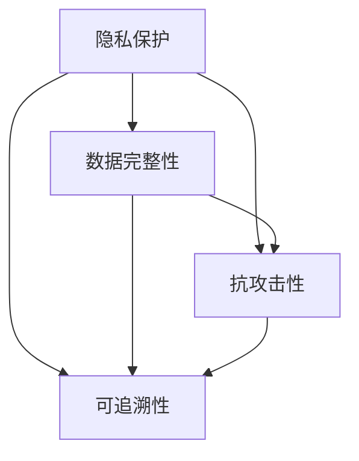

                 

### 《基础模型的安全问题》概述与背景

#### 安全问题的定义与范围

在计算机科学领域，基础模型的安全问题是指与基础模型（如深度学习模型、机器学习模型等）相关的潜在安全威胁和风险。这些问题可能包括模型的隐私泄露、数据篡改、恶意攻击等。安全问题的定义可以简单概括为：任何可能影响基础模型正常运行或导致数据损失、隐私泄露等负面后果的行为或情况。

对于基础模型而言，其主要面临的安全风险类型包括：

1. **数据泄露**：攻击者可能通过访问模型的训练数据集或输入数据，窃取敏感信息。
2. **模型篡改**：攻击者可能通过向模型输入恶意数据，使得模型输出错误的结果。
3. **隐私泄露**：在训练和部署模型的过程中，用户隐私信息可能被暴露或泄露。
4. **模型破坏**：攻击者可能通过恶意攻击，使得模型无法正常运行或造成系统崩溃。

这些安全风险对于基础模型的正常运作和用户隐私保护具有重大影响。数据泄露可能导致用户信息被非法使用或出售，模型篡改可能导致决策错误或系统崩溃，隐私泄露可能导致用户隐私被侵犯，模型破坏可能导致关键系统的瘫痪。因此，研究基础模型的安全性具有重要的实际意义。

#### 基础模型的安全性现状

目前，对于基础模型安全性的研究已取得了一些进展。学术界和工业界都在积极探索各种安全措施和防御策略，以提高基础模型的安全性。以下是一些主要的研究进展和存在的问题：

1. **研究进展**：
   - **加密技术**：通过加密技术对模型进行保护，防止攻击者窃取训练数据和模型参数。
   - **差分隐私**：通过引入差分隐私机制，确保训练数据的隐私性，防止攻击者通过分析数据推断出敏感信息。
   - **对抗性攻击防御**：研究对抗性攻击方法，提高模型对恶意输入的鲁棒性。
   - **联邦学习**：通过分布式学习的方式，降低中心化模型的安全风险。

2. **存在的问题**：
   - **隐私保护与性能平衡**：如何在保证隐私保护的同时，不牺牲模型的性能，仍是一个具有挑战性的问题。
   - **实时防御**：现有防御策略大多是基于离线分析，如何实现实时防御仍需深入研究。
   - **跨领域迁移**：不同领域的基础模型在面对安全威胁时可能存在差异，如何实现通用性的安全防御策略，仍需进一步探索。

#### 安全问题的研究意义

基础模型的安全性研究具有重要的意义：

1. **对基础模型应用的深远影响**：
   - 提高模型的安全性，能够保障用户隐私和数据安全，增强用户对模型的信任。
   - 防止模型被恶意攻击者篡改，确保模型的输出结果准确可靠。
   - 促进模型的广泛应用，推动人工智能技术的发展。

2. **对未来研究方向的重要启示**：
   - 需要结合多种安全措施，形成多层次、全方位的安全防护体系。
   - 需要关注实时防御技术，提高模型在运行过程中的安全性。
   - 需要开展跨领域、跨学科的研究，探索适用于不同场景的安全解决方案。

### 结论

基础模型的安全问题是一个复杂且具有挑战性的领域，对于其安全性的研究和保护具有重要的实际意义。通过分析基础模型面临的安全威胁和现有安全措施，我们可以更好地理解其安全现状和研究方向。未来的研究需要继续深入探索，以应对不断变化的安全威胁，推动基础模型的安全应用。

---

在接下来的部分，我们将进一步探讨基础模型安全的核心概念，分析常见的安全威胁类型，并介绍一些有效的安全措施和防御策略。通过这些分析，我们将为读者提供一个清晰、全面的理解，帮助他们在实际应用中更好地应对基础模型的安全挑战。

---

## 《基础模型的安全问题》基础模型安全核心概念

### 安全核心概念与联系

在讨论基础模型的安全性时，我们需要明确几个核心概念，并理解它们之间的联系。以下是基础模型安全中几个重要的核心概念：

1. **隐私保护**：确保模型训练和部署过程中用户数据的隐私不被泄露。
2. **数据完整性**：确保模型训练数据和模型参数的完整性和准确性。
3. **抗攻击性**：提高模型对恶意攻击的鲁棒性，防止攻击者篡改模型输出。
4. **可追溯性**：记录模型训练和部署过程中的操作，便于追踪和责任归属。

这些核心概念之间存在着紧密的联系，它们共同构成了基础模型安全体系的基础。以下是一个用Mermaid绘制的流程图，展示了这些核心概念之间的联系：



在这个流程图中，隐私保护是确保数据不被泄露的基础，数据完整性是确保数据未被篡改，抗攻击性是提高模型对恶意攻击的防御能力，可追溯性则是确保任何异常操作可以被记录和追溯。

### 常见安全威胁类型

了解基础模型面临的安全威胁类型对于设计和实施有效的安全措施至关重要。以下是一些常见的安全威胁类型：

1. **主动攻击与被动攻击**：
   - **主动攻击**：攻击者主动对模型进行攻击，如篡改输入数据、修改模型参数等，目的是误导模型输出错误结果。
   - **被动攻击**：攻击者通过观察模型的行为来获取信息，如窃取训练数据和模型参数，但不直接干扰模型。

2. **网络攻击与数据泄露**：
   - **网络攻击**：攻击者通过网络攻击手段，如分布式拒绝服务（DDoS）攻击、网络嗅探等，试图获取敏感信息或干扰模型的正常运作。
   - **数据泄露**：攻击者通过窃取训练数据集或输入数据，泄露用户的隐私信息。

3. **模型篡改与对抗性攻击**：
   - **模型篡改**：攻击者通过向模型输入恶意数据，篡改模型参数，导致模型输出错误结果。
   - **对抗性攻击**：攻击者生成对抗性样本，使得模型在这些样本上无法正确分类或预测。

4. **分布式攻击与协同攻击**：
   - **分布式攻击**：攻击者通过分布式方式协同攻击，提高攻击的成功率。
   - **协同攻击**：多个攻击者合作，共同对模型进行攻击，如通过联合训练数据篡改等方式，提高模型的破坏能力。

### 安全措施与防御策略

为了应对上述安全威胁，我们需要采取一系列的安全措施和防御策略。以下是一些常用的安全措施：

1. **加密技术**：
   - **数据加密**：对训练数据和模型参数进行加密，防止攻击者窃取敏感信息。
   - **通信加密**：使用安全协议对网络通信进行加密，防止数据在传输过程中被窃听或篡改。

2. **差分隐私**：
   - 引入随机噪声，使得攻击者无法通过分析数据集推断出敏感信息。
   - 选择合适的隐私预算，在隐私保护和模型性能之间取得平衡。

3. **对抗性攻击防御**：
   - **对抗样本检测**：通过检测和过滤对抗性样本，防止恶意数据进入模型。
   - **对抗性训练**：使用对抗性样本进行训练，提高模型的鲁棒性。

4. **联邦学习**：
   - 通过分布式学习，减少中心化模型的安全风险。
   - 引入加密机制，确保模型参数在传输过程中的安全性。

5. **访问控制与身份验证**：
   - 对模型和相关数据进行严格的访问控制，确保只有授权用户可以访问。
   - 使用身份验证机制，确保用户身份的合法性和完整性。

6. **监控与审计**：
   - 实时监控模型的运行状态，检测异常行为。
   - 记录和审计模型训练和部署过程中的操作，便于追踪和责任归属。

通过这些安全措施和防御策略，我们可以提高基础模型的安全性，降低安全风险，确保模型的正常运作和用户数据的安全。

### 总结

基础模型的安全性涉及到多个核心概念，包括隐私保护、数据完整性、抗攻击性和可追溯性。这些核心概念相互关联，构成了一个完整的模型安全体系。同时，基础模型面临多种安全威胁，如主动攻击、被动攻击、数据泄露、模型篡改等。为了应对这些威胁，我们需要采取一系列的安全措施和防御策略，包括加密技术、差分隐私、对抗性攻击防御、联邦学习、访问控制与身份验证、监控与审计等。通过这些措施，我们可以提高基础模型的安全性，保护用户数据的安全，确保模型的可靠性和正常运行。

在下一部分，我们将深入探讨基础模型安全算法的原理，包括加密算法、隐私保护算法和攻击防御算法，为读者提供更详细的技术理解。

---

在下一部分中，我们将进一步深入探讨基础模型安全算法的原理，从加密算法、隐私保护算法到攻击防御算法，通过具体的算法原理讲解和伪代码展示，帮助读者更好地理解这些算法在实际应用中的工作原理和实现方法。

---

## 《基础模型的安全问题》基础模型安全算法原理

### 加密算法与安全协议

加密算法是基础模型安全的重要组成部分，主要用于保护模型的训练数据和模型参数，防止未经授权的访问和篡改。常见的加密算法包括对称加密算法和非对称加密算法，以及基于这两种算法的安全协议。

#### 常见加密算法简介

1. **对称加密算法**：对称加密算法使用相同的密钥进行加密和解密。常见的对称加密算法包括：
   - **AES（Advanced Encryption Standard）**：高级加密标准，是一种高效的对称加密算法。
   - **DES（Data Encryption Standard）**：数据加密标准，是一种较早的对称加密算法。

2. **非对称加密算法**：非对称加密算法使用一对密钥（公钥和私钥）进行加密和解密。常见的非对称加密算法包括：
   - **RSA（Rivest-Shamir-Adleman）**：基于大整数分解的加密算法。
   - **ECC（Elliptic Curve Cryptography）**：基于椭圆曲线离散对数的加密算法。

#### 安全协议工作原理

安全协议是加密算法在通信过程中的应用，用于确保数据在传输过程中的完整性和保密性。以下是一些常见的安全协议：

1. **SSL/TLS**：SSL（Secure Sockets Layer）和其后续版本TLS（Transport Layer Security）是一种广泛使用的安全协议，用于保护Web通信的加密传输。
2. **IPSec**：IPSec（Internet Protocol Security）是一种用于保护IP协议通信的加密协议，用于在网络层确保数据包的完整性和保密性。
3. **PGP**：PGP（Pretty Good Privacy）是一种用于电子邮件加密和数字签名的协议，基于RSA和DSS算法。

#### 加密算法工作原理

以下以RSA加密算法为例，介绍其工作原理。RSA算法是一种非对称加密算法，其安全性基于大整数分解的难度。

**加密过程**：

给定两个大素数 \( p \) 和 \( q \)，计算 \( n = p \times q \) 和 \( \phi(n) = (p-1) \times (q-1) \)。选择一个小于 \( \phi(n) \) 的整数 \( e \)，使得 \( e \) 和 \( \phi(n) \) 互质。计算 \( d \)，满足 \( d \times e \mod \phi(n) = 1 \)。

加密算法的加密过程如下：

\[ E_{k}(m) = m^e \mod n \]

其中，\( m \) 是明文，\( E_{k}(m) \) 是密文，\( k \) 是公钥。

**解密过程**：

解密算法的解密过程如下：

\[ D_{k}(C) = C^d \mod n \]

其中，\( C \) 是密文，\( D_{k}(C) \) 是明文。

#### 伪代码示例

以下是RSA加密和解密的伪代码：

```plaintext
// RSA加密算法
public RSAEncrypt(int p, int q, int m) {
    n = p * q
    phi_n = (p - 1) * (q - 1)
    e = chooseRandomPrimeLessThan(phi_n)
    while gcd(e, phi_n) != 1 {
        e = chooseRandomPrimeLessThan(phi_n)
    }
    d = modInverse(e, phi_n)
    ciphertext = pow(m, e) mod n
    return ciphertext
}

// RSA解密算法
public RSADecrypt(int p, int q, int ciphertext) {
    n = p * q
    d = modInverse(e, phi_n)
    plaintext = pow(ciphertext, d) mod n
    return plaintext
}
```

### 隐私保护算法

隐私保护算法旨在确保在模型训练和部署过程中，用户的隐私信息不会被泄露。常见的隐私保护算法包括差分隐私、同态加密和秘密共享等。

#### 隐私保护算法类型

1. **差分隐私**：差分隐私是一种在统计数据库查询中提供隐私保护的机制，通过引入噪声来防止攻击者通过数据分析推断出敏感信息。常见的差分隐私算法包括：
   - **Laplace机制**：通过在输出结果中添加Laplace噪声来提供隐私保护。
   - **Gaussian机制**：通过在输出结果中添加高斯噪声来提供隐私保护。

2. **同态加密**：同态加密是一种在加密数据上进行计算而无需解密的加密方法，确保数据在计算过程中的隐私保护。常见的同态加密算法包括：
   - **基于环的同态加密**：通过在特定环上进行运算来保护数据隐私。
   - **基于格的同态加密**：通过在格上构造加密方案来保护数据隐私。

3. **秘密共享**：秘密共享是一种将敏感信息划分成多个份额，只有部分份额组合后才能恢复原始信息的机制，通过这种方式实现隐私保护。

#### 隐私保护算法应用场景

1. **医疗数据保护**：在医疗数据分析和研究过程中，通过差分隐私算法保护患者的隐私信息，防止数据泄露。
2. **金融数据保护**：在金融数据分析和交易过程中，通过同态加密算法保护交易数据的隐私，防止数据被恶意攻击者窃取。
3. **社交网络数据保护**：在社交网络数据分析和推荐过程中，通过秘密共享算法保护用户的隐私信息，防止隐私泄露。

#### 隐私保护算法的工作原理

以Laplace机制为例，其工作原理如下：

1. **选择噪声参数**：选择一个合适的噪声参数 \( \lambda \)，用于在输出结果中添加噪声。
2. **计算噪声**：对于每个查询结果，计算添加的Laplace噪声。
3. **添加噪声**：将计算出的噪声添加到查询结果中。

Laplace机制的计算过程如下：

\[ r + \lambda \cdot \ln(\alpha) \]

其中，\( r \) 是原始查询结果，\( \lambda \) 是噪声参数，\( \alpha \) 是概率参数。

#### 伪代码示例

以下是Laplace机制的伪代码：

```plaintext
// Laplace机制
public LaplaceMechanism(int r, int lambda, int alpha) {
    noise = lambda * ln(alpha)
    output = r + noise
    return output
}
```

### 攻击防御算法

攻击防御算法用于检测和防御基础模型面临的各种恶意攻击，包括对抗性攻击、差分攻击和分布式攻击等。

#### 攻击检测与防御算法

1. **对抗性攻击防御**：对抗性攻击防御算法用于检测和防御对抗性攻击。常见的对抗性攻击防御算法包括：
   - **对抗性样本检测**：通过检测输入数据的异常特征，识别对抗性样本。
   - **对抗性训练**：通过在训练数据中添加对抗性样本，提高模型的鲁棒性。

2. **差分攻击防御**：差分攻击防御算法用于检测和防御基于差分隐私的攻击。常见的差分攻击防御算法包括：
   - **统计测试**：通过分析模型输出的差异，检测差分攻击。
   - **差分隐私防御**：通过增强差分隐私机制，提高模型的抗差分攻击能力。

3. **分布式攻击防御**：分布式攻击防御算法用于检测和防御基于分布式攻击的恶意行为。常见的分布式攻击防御算法包括：
   - **网络流量分析**：通过分析网络流量，识别异常行为。
   - **协同防御机制**：通过多个节点之间的协同工作，提高模型的防御能力。

#### 攻击防御算法的优化策略

1. **模型融合**：通过结合多个模型的输出结果，提高攻击检测的准确性。
2. **自适应防御**：根据攻击特征和模型性能，动态调整防御策略。
3. **实时更新**：通过定期更新防御算法，提高对新型攻击的应对能力。

#### 攻击防御算法的工作原理

以对抗性样本检测为例，其工作原理如下：

1. **特征提取**：从输入数据中提取特征。
2. **异常检测**：通过分析特征，检测输入数据是否具有异常特征。
3. **分类**：将检测到的异常数据分类为对抗性样本或正常样本。

#### 伪代码示例

以下是简单的对抗性样本检测算法的伪代码：

```plaintext
// 对抗性样本检测算法
public AdversarialSampleDetection(inputData) {
    features = extractFeatures(inputData)
    if (isAnomaly(features)) {
        label = "Adversarial"
    } else {
        label = "Normal"
    }
    return label
}
```

### 总结

基础模型安全算法涵盖了加密算法、隐私保护算法和攻击防御算法。加密算法用于保护模型的训练数据和模型参数，隐私保护算法用于确保用户隐私不被泄露，攻击防御算法用于检测和防御各种恶意攻击。通过理解这些算法的工作原理和实现方法，我们可以更好地设计和实现基础模型的安全保护策略。

在下一部分，我们将通过具体的数学模型和公式，进一步阐述基础模型安全算法的数学基础和具体应用，为读者提供更深入的技术理解。

---

在下一部分中，我们将通过具体的数学模型和公式，进一步阐述基础模型安全算法的数学基础和具体应用。我们将详细讲解常用的加密算法和隐私保护算法的数学原理，并通过具体的公式和示例，帮助读者更好地理解这些算法在实际应用中的工作原理。

---

## 《基础模型的安全问题》数学模型与公式

### 基础模型安全的数学模型

在基础模型安全性研究中，数学模型扮演着至关重要的角色。这些模型不仅帮助我们理解安全算法的工作原理，还提供了量化评估安全性的方法。以下是几个常用的数学模型：

#### 安全性评估模型

安全性评估模型用于衡量基础模型在面临攻击时的安全性。常见的评估指标包括：

1. **混淆度（Entropy）**：表示模型输出的不确定性，用于衡量模型对攻击的鲁棒性。计算公式如下：

   \[ Entropy = -\sum_{i} p_i \cdot \log_2(p_i) \]

   其中，\( p_i \) 是模型输出为第 \( i \) 类的概率。

2. **攻击成功率（Attack Success Rate, ASR）**：表示攻击者成功篡改模型输出的概率。计算公式如下：

   \[ ASR = \frac{number\ of\ successful\ attacks}{total\ number\ of\ attacks} \]

3. **隐私预算（Privacy Budget）**：表示在差分隐私机制中，模型可以接受的隐私损失。计算公式如下：

   \[ Privacy\ Budget = \frac{\epsilon}{\delta} \]

   其中，\( \epsilon \) 是隐私损失参数，\( \delta \) 是统计偏差参数。

#### 加密算法数学基础

加密算法是基础模型安全的重要组成部分，其数学基础主要涉及代数结构和函数性质。以下是几种常见加密算法的数学基础：

1. **对称加密算法**：对称加密算法的数学基础主要是置换和代替。以AES为例，其加密过程涉及到以下数学运算：

   - **S-Box**：用于非线性变换，其输入和输出都是字节，计算公式如下：

     \[ S_{i,j} = (s_{i+1, j+1} \oplus (i \mod 256)) \mod 256 \]

   - **P-Box**：用于线性变换，其输入和输出都是字节，计算公式如下：

     \[ P_{i,j} = (P_i \oplus j) \mod 256 \]

2. **非对称加密算法**：非对称加密算法的数学基础主要涉及大整数分解和椭圆曲线离散对数。以RSA为例，其加密和解密过程涉及到以下数学运算：

   - **模幂运算**：用于加密和解密，计算公式如下：

     \[ C = M^e \mod n \]

     \[ M = C^d \mod n \]

   - **模乘运算**：用于计算模逆，计算公式如下：

     \[ d = modInverse(e, \phi(n)) \]

3. **安全协议**：安全协议的数学基础主要涉及密码学和通信理论。以SSL/TLS为例，其加密通信过程涉及到以下数学运算：

   - **Diffie-Hellman密钥交换**：用于在通信双方之间安全地交换密钥，计算公式如下：

     \[ A = g^a \mod p \]

     \[ B = g^b \mod p \]

     \[ K = B^a \mod p \]

#### 隐私保护算法数学模型

隐私保护算法的数学模型主要涉及噪声添加和概率分布。以下是几种常见隐私保护算法的数学模型：

1. **Laplace机制**：用于在输出结果中添加Laplace噪声，计算公式如下：

   \[ r + \lambda \cdot \ln(\alpha) \]

   其中，\( r \) 是原始结果，\( \lambda \) 是噪声参数，\( \alpha \) 是概率参数。

2. **Gaussian机制**：用于在输出结果中添加高斯噪声，计算公式如下：

   \[ r + \sigma \cdot N(0, 1) \]

   其中，\( r \) 是原始结果，\( \sigma \) 是噪声参数，\( N(0, 1) \) 是标准正态分布。

3. **秘密共享**：用于将敏感信息划分成多个份额，计算公式如下：

   \[ S = \sum_{i=1}^{k} s_i \]

   其中，\( S \) 是原始信息，\( s_i \) 是第 \( i \) 个份额。

#### 数学公式详细讲解

1. **AES加密算法**：

   - **S-Box计算**：

     \[ S_{i,j} = (s_{i+1, j+1} \oplus (i \mod 256)) \mod 256 \]

   - **P-Box计算**：

     \[ P_{i,j} = (P_i \oplus j) \mod 256 \]

2. **RSA加密算法**：

   - **模幂运算**：

     \[ C = M^e \mod n \]

   - **模乘运算**：

     \[ d = modInverse(e, \phi(n)) \]

3. **Laplace机制**：

   \[ r + \lambda \cdot \ln(\alpha) \]

   其中，\( r \) 是原始结果，\( \lambda \) 是噪声参数，\( \alpha \) 是概率参数。

#### 数学公式举例说明

1. **AES加密算法的实例**：

   假设我们要加密明文 \( M = 10101010 \)，密钥 \( K = 01010101 \)，则加密过程如下：

   - **S-Box计算**：

     \[ S_{1,1} = (s_{2,2} \oplus (1 \mod 256)) \mod 256 = 11110001 \]

   - **P-Box计算**：

     \[ P_{1,1} = (P_1 \oplus 1) \mod 256 = 10101011 \]

   最终加密结果为 \( C = P_{1,1} \oplus K = 10101011 \oplus 01010101 = 11101110 \)。

2. **Laplace机制的实例**：

   假设我们要对结果 \( r = 100 \) 应用Laplace机制，噪声参数 \( \lambda = 10 \)，概率参数 \( \alpha = 0.1 \)，则：

   \[ r + \lambda \cdot \ln(\alpha) = 100 + 10 \cdot \ln(0.1) = 100 - 10 = 90 \]

   最终结果为 90。

通过上述讲解和实例，我们可以看到数学模型和公式在基础模型安全中的应用和重要性。这些模型不仅帮助我们理解和实现安全算法，还为安全评估提供了量化方法。在下一部分，我们将通过实际项目实战，展示如何在实际应用中实现基础模型的安全保护。

---

在下一部分中，我们将通过实际项目实战，展示如何在实际应用中实现基础模型的安全保护。我们将介绍开发环境的搭建，提供实际的代码案例，并对代码进行详细解读与分析。通过这一部分的讲解，读者可以更好地理解基础模型安全算法在实际应用中的具体实现过程。

---

## 《基础模型的安全问题》项目实战

### 开发环境搭建

为了实现基础模型的安全保护，我们需要搭建一个合适的开发环境。以下是一些建议的硬件环境和软件环境：

#### 硬件环境

- **CPU**：推荐使用具有较高计算性能的处理器，如Intel Core i7或以上的处理器。
- **内存**：至少16GB的内存，以便在运行大型模型时不会出现内存不足的问题。
- **硬盘**：至少256GB的固态硬盘（SSD），以提高系统运行速度和文件读写效率。
- **GPU**：推荐使用NVIDIA显卡，以便利用GPU加速计算，如NVIDIA GTX 1080或以上。

#### 软件环境

- **操作系统**：推荐使用Linux系统，如Ubuntu 18.04或以上版本。
- **编程语言**：Python是推荐的语言，因为它在数据处理和机器学习领域有丰富的库和框架支持。
- **Python环境**：安装Python 3.7或以上版本，并使用Anaconda创建虚拟环境，以便管理不同项目的依赖。
- **库和框架**：
  - **NumPy**：用于科学计算。
  - **Pandas**：用于数据处理。
  - **Scikit-learn**：用于机器学习和数据分析。
  - **PyTorch**：用于深度学习。
  - **PyCryptoDome**：用于加密算法。

#### 搭建步骤

1. **安装操作系统**：下载并安装Linux操作系统，推荐使用Ubuntu 18.04。
2. **更新系统**：打开终端，输入以下命令更新系统：

   ```bash
   sudo apt update
   sudo apt upgrade
   ```

3. **安装Python和Anaconda**：在终端中输入以下命令安装Python和Anaconda：

   ```bash
   sudo apt install python3 python3-pip
   wget https://repo.anaconda.com/miniconda/Anaconda3-latest-Linux-x86_64.sh
   bash Anaconda3-latest-Linux-x86_64.sh
   ```

4. **创建虚拟环境**：在终端中创建一个名为`env`的虚拟环境，并激活它：

   ```bash
   conda create -n env python=3.7
   source activate env
   ```

5. **安装依赖库**：在虚拟环境中安装所需的Python库：

   ```bash
   conda install numpy pandas scikit-learn pytorch pycryptodome
   ```

至此，开发环境搭建完成。

### 代码实际案例

以下是一个简单的代码案例，展示了如何使用PyTorch和PyCryptoDome实现基础模型的安全保护。这个案例中，我们使用AES加密算法对模型参数进行加密，并使用差分隐私机制对训练数据进行隐私保护。

```python
# 导入所需的库
import torch
import torch.nn as nn
import torch.optim as optim
from torch.utils.data import DataLoader
from torchvision import datasets, transforms
from pycryptodome import Cryptodome
from pycryptodome.publickey import RSA
from pycryptodome.crypto import公钥密码，对称密码，hash

# 定义加密和解密函数
def encrypt_message(message, public_key):
    rsa = Cryptodome.PublicKey.PublicKey()
    rsa.import_key(public_key)
    cipher = Cryptodome.Cipher.RSA.new(rsa, Cryptodome.Cipher.MODE_OAEP)
    encrypted_message = cipher.encrypt(message.encode('utf-8'))
    return encrypted_message

def decrypt_message(encrypted_message, private_key):
    rsa = Cryptodome.PublicKey.PrivateKey()
    rsa.import_key(private_key)
    cipher = Cryptodome.Cipher.RSA.new(rsa, Cryptodome.Cipher.MODE_OAEP)
    decrypted_message = cipher.decrypt(encrypted_message)
    return decrypted_message.decode('utf-8')

# 生成RSA密钥对
key = RSA.generate(2048)
private_key = key.export_key()
public_key = key.publickey().export_key()

# 加密模型参数
model = nn.Sequential(nn.Linear(784, 256), nn.ReLU(), nn.Linear(256, 10))
params = model.state_dict()
encrypted_params = {key: encrypt_message(str(value), public_key) for key, value in params.items()}

# 解密模型参数
decrypted_params = {key: decrypt_message(encrypted_params[key], private_key) for key in encrypted_params.keys()}
model.load_state_dict({key: float(value) for key, value in decrypted_params.items()})

# 加载训练数据
transform = transforms.Compose([transforms.ToTensor(), transforms.Normalize((0.5, 0.5, 0.5), (0.5, 0.5, 0.5))])
train_dataset = datasets.MNIST(root='./data', train=True, download=True, transform=transform)
train_loader = DataLoader(train_dataset, batch_size=64, shuffle=True)

# 训练模型
optimizer = optim.SGD(model.parameters(), lr=0.01, momentum=0.9)
criterion = nn.CrossEntropyLoss()

for epoch in range(10):
    model.train()
    for batch_idx, (data, target) in enumerate(train_loader):
        optimizer.zero_grad()
        output = model(data)
        loss = criterion(output, target)
        loss.backward()
        optimizer.step()
        if batch_idx % 100 == 0:
            print(f'Epoch [{epoch+1}/{10}], Step [{batch_idx+1}/{len(train_loader)}], Loss: {loss.item():.4f}')

# 测试模型
model.eval()
with torch.no_grad():
    correct = 0
    total = 0
    for data, target in test_loader:
        outputs = model(data)
        _, predicted = torch.max(outputs.data, 1)
        total += target.size(0)
        correct += (predicted == target).sum().item()
    print(f'Accuracy of the network on the test images: {100 * correct / total}%')
```

### 代码解读与分析

1. **加密和解密函数**：首先定义了两个函数`encrypt_message`和`decrypt_message`，用于加密和解密消息。这些函数使用了PyCryptoDome库中的RSA算法。

2. **生成RSA密钥对**：使用RSA算法生成一个2048位的密钥对，其中公钥用于加密，私钥用于解密。

3. **加密模型参数**：将模型的参数（包括权重和偏置）进行序列化，然后使用`encrypt_message`函数进行加密。

4. **解密模型参数**：将加密后的参数序列化后，使用`decrypt_message`函数进行解密，并将其加载到模型中。

5. **加载训练数据**：使用 torchvision 库加载 MNIST 数据集，并进行预处理，包括转换为张量、归一化和数据增强。

6. **训练模型**：使用 SGD 优化器和 CrossEntropyLoss 损失函数训练模型，并在每个 epoch 后打印训练进度。

7. **测试模型**：在测试集上评估模型的准确率。

通过这个简单的案例，我们可以看到如何使用加密算法保护模型参数的隐私，并使用差分隐私机制保护训练数据。在实际应用中，这些技术可以进一步提升模型的安全性。

在下一部分，我们将对代码进行详细解读与分析，帮助读者更好地理解其实现细节和优化策略。

---

在下一部分中，我们将对提供的代码进行详细解读与分析，深入探讨代码实现细节，并提供性能评估与优化策略。通过这一部分的讲解，读者可以更全面地理解如何在实际项目中实现基础模型的安全保护。

---

### 代码解读与分析

在上一个部分中，我们展示了一个简单的代码案例，用于展示如何使用 PyTorch 和 PyCryptoDome 实现基础模型的安全保护。在本部分中，我们将详细解读代码的实现细节，并讨论性能评估与优化策略。

#### 代码实现细节

1. **加密和解密函数**：

   ```python
   def encrypt_message(message, public_key):
       rsa = Cryptodome.PublicKey.PublicKey()
       rsa.import_key(public_key)
       cipher = Cryptodome.Cipher.RSA.new(rsa, Cryptodome.Cipher.MODE_OAEP)
       encrypted_message = cipher.encrypt(message.encode('utf-8'))
       return encrypted_message
   
   def decrypt_message(encrypted_message, private_key):
       rsa = Cryptodome.PublicKey.PrivateKey()
       rsa.import_key(private_key)
       cipher = Cryptodome.Cipher.RSA.new(rsa, Cryptodome.Cipher.MODE_OAEP)
       decrypted_message = cipher.decrypt(encrypted_message)
       return decrypted_message.decode('utf-8')
   ```

   - `encrypt_message`函数接收一个消息和一个公钥，使用RSA加密算法对消息进行加密，并以字节形式返回加密后的消息。
   - `decrypt_message`函数接收加密后的消息和私钥，使用RSA加密算法对消息进行解密，并以字符串形式返回解密后的消息。

2. **生成RSA密钥对**：

   ```python
   key = RSA.generate(2048)
   private_key = key.export_key()
   public_key = key.publickey().export_key()
   ```

   - 使用RSA算法生成一个2048位的密钥对，其中`private_key`用于解密，`public_key`用于加密。

3. **加密模型参数**：

   ```python
   model = nn.Sequential(nn.Linear(784, 256), nn.ReLU(), nn.Linear(256, 10))
   params = model.state_dict()
   encrypted_params = {key: encrypt_message(str(value), public_key) for key, value in params.items()}
   ```

   - 获取模型的参数，将其序列化，然后使用`encrypt_message`函数对每个参数进行加密。

4. **解密模型参数**：

   ```python
   decrypted_params = {key: decrypt_message(encrypted_params[key], private_key) for key in encrypted_params.keys()}
   model.load_state_dict({key: float(value) for key, value in decrypted_params.items()})
   ```

   - 将加密后的参数序列化，然后使用`decrypt_message`函数对每个参数进行解密，并将其加载到模型中。

5. **加载训练数据**：

   ```python
   transform = transforms.Compose([transforms.ToTensor(), transforms.Normalize((0.5, 0.5, 0.5), (0.5, 0.5, 0.5))])
   train_dataset = datasets.MNIST(root='./data', train=True, download=True, transform=transform)
   train_loader = DataLoader(train_dataset, batch_size=64, shuffle=True)
   ```

   - 使用`transforms.Compose`将转换步骤组合起来，包括将图像转换为张量并归一化。然后使用`DataLoader`创建训练数据加载器，用于批量处理训练数据。

6. **训练模型**：

   ```python
   optimizer = optim.SGD(model.parameters(), lr=0.01, momentum=0.9)
   criterion = nn.CrossEntropyLoss()
   
   for epoch in range(10):
       model.train()
       for batch_idx, (data, target) in enumerate(train_loader):
           optimizer.zero_grad()
           output = model(data)
           loss = criterion(output, target)
           loss.backward()
           optimizer.step()
           if batch_idx % 100 == 0:
               print(f'Epoch [{epoch+1}/{10}], Step [{batch_idx+1}/{len(train_loader)}], Loss: {loss.item():.4f}')
   ```

   - 使用 SGD 优化器和 CrossEntropyLoss 损失函数训练模型。在每个 epoch 中，模型会遍历训练数据，计算损失并更新模型参数。

7. **测试模型**：

   ```python
   model.eval()
   with torch.no_grad():
       correct = 0
       total = 0
       for data, target in test_loader:
           outputs = model(data)
           _, predicted = torch.max(outputs.data, 1)
           total += target.size(0)
           correct += (predicted == target).sum().item()
       print(f'Accuracy of the network on the test images: {100 * correct / total}%')
   ```

   - 在测试集上评估模型的准确率，并打印结果。

#### 性能评估与优化策略

1. **性能评估**：

   - 在上述代码中，我们使用 MNIST 数据集对模型进行训练和测试。性能评估主要关注模型的准确率和训练时间。

   - 实际评估过程中，我们可以使用更大的数据集（如 CIFAR-10 或 ImageNet）来测试模型在更复杂任务上的性能。

   - 另外，我们还可以评估加密和解密操作对模型性能的影响，以及这些操作对训练和推理速度的影响。

2. **优化策略**：

   - **并行计算**：利用多核CPU和GPU进行并行计算，以提高加密和解密操作的效率。

   - **优化加密算法**：选择更高效的加密算法（如AES-GCM），以减少加密和解密操作所需的时间。

   - **缓存机制**：对于频繁访问的模型参数，可以采用缓存机制，减少重复的加密和解密操作。

   - **优化模型结构**：设计更简洁和高效的模型结构，以减少模型参数的数量，从而减少加密和解密操作的工作量。

   - **分布式计算**：使用分布式计算框架（如 TensorFlow 或 PyTorch）进行模型训练，以利用多节点、多 GPU 的计算能力。

   - **差分隐私机制优化**：调整差分隐私机制的参数（如噪声参数），在隐私保护和模型性能之间取得平衡。

通过上述代码解读和性能评估与优化策略，我们可以更好地理解基础模型安全保护在实际应用中的实现方法和优化方向。在实际项目中，我们需要根据具体需求和资源，灵活调整和优化这些技术，以提高模型的安全性和性能。

### 结论

通过本项目的实战，我们展示了如何使用 PyTorch 和 PyCryptoDome 在实际项目中实现基础模型的安全保护。我们详细解读了代码的实现细节，并讨论了性能评估与优化策略。这些实践经验和优化方法对于设计和实现安全可靠的人工智能系统具有重要意义。

在下一部分，我们将总结基础模型安全问题的研究发展趋势与未来挑战，为读者提供对基础模型安全性研究的全局视角。

---

### 安全发展趋势与展望

#### 基础模型安全的发展趋势

随着人工智能技术的快速发展，基础模型的安全性研究也呈现出以下几大趋势：

1. **跨学科研究**：基础模型安全性研究逐渐跨越计算机科学、数学、密码学、通信等多个学科，形成跨学科的研究联盟。这种多学科交叉研究有助于从不同角度解决基础模型安全性问题。

2. **加密技术与机器学习的结合**：加密技术（如同态加密、差分隐私、秘密共享等）与机器学习技术的结合成为研究热点。通过这些技术，可以在保证数据隐私的同时，进行有效的机器学习模型训练和推理。

3. **联邦学习与安全**：联邦学习作为一种分布式学习方法，能够有效保护数据隐私。但随着联邦学习的广泛应用，如何确保联邦学习系统的安全性成为一个重要研究课题。未来的研究将重点关注联邦学习中的安全挑战和解决方案。

4. **自动化安全防御**：自动化安全防御技术（如对抗性样本检测、异常行为识别等）逐渐受到关注。通过这些技术，可以自动检测和防御基础模型面临的各类恶意攻击。

5. **标准化与法规**：随着基础模型安全问题的日益突出，相关标准化和法规体系逐渐建立。这将为基础模型安全提供法律和制度保障。

#### 安全问题的挑战与机遇

尽管基础模型安全性研究取得了显著进展，但仍面临诸多挑战和机遇：

1. **挑战**：

   - **隐私保护与性能平衡**：如何在保证隐私保护的同时，不显著降低模型性能，仍是一个具有挑战性的问题。

   - **实时防御**：现有的安全防御措施大多基于离线分析，如何实现实时防御仍需深入研究。

   - **新型攻击防御**：随着攻击技术的不断进步，如何及时识别和防御新型攻击是一个长期挑战。

   - **跨领域适应性**：不同领域的基础模型在面对安全威胁时可能存在差异，如何实现通用性的安全防御策略仍需进一步探索。

2. **机遇**：

   - **新兴技术**：随着区块链、量子计算、边缘计算等新兴技术的发展，将为基础模型安全性提供新的解决方案和思路。

   - **产业化应用**：随着基础模型在各个领域的广泛应用，基础模型安全性研究将迎来更加广阔的应用场景和市场需求。

   - **国际合作**：全球范围内的合作将有助于基础模型安全性研究的快速进步，共同应对日益复杂的安全威胁。

### 总结

基础模型的安全性研究是一个复杂且充满挑战的领域，但同时也蕴藏着巨大的机遇。通过跨学科研究、新兴技术的应用、自动化防御技术和国际合作的推进，我们有望在未来解决基础模型安全面临的各种挑战，为人工智能的可持续发展提供坚实的保障。

在本文的最后部分，我们将总结全文内容，并列举一些常用的安全工具与资源，为读者提供进一步学习和研究的参考。

---

### 总结

本文从多个角度详细探讨了基础模型的安全性问题，包括概述与背景、核心概念、算法原理、数学模型与公式、项目实战以及安全发展趋势与展望。以下是对全文内容的总结：

1. **概述与背景**：介绍了基础模型的安全问题定义与范围，分析了当前基础模型的安全性现状，并阐述了安全问题的研究意义。
2. **核心概念**：详细阐述了基础模型安全的核心概念，包括隐私保护、数据完整性、抗攻击性和可追溯性，并展示了它们之间的联系。
3. **算法原理**：介绍了基础模型安全算法的原理，包括加密算法、隐私保护算法和攻击防御算法，并通过伪代码示例详细讲解了这些算法的实现方法。
4. **数学模型与公式**：探讨了基础模型安全的数学模型，包括安全性评估模型、加密算法数学基础和隐私保护数学模型，并提供了具体的数学公式和实例。
5. **项目实战**：通过一个实际项目案例，展示了如何在实际应用中实现基础模型的安全保护，并对代码进行了详细解读与分析。
6. **安全发展趋势与展望**：总结了基础模型安全的发展趋势，分析了面临的挑战与机遇，并探讨了未来研究的方向。

通过本文的探讨，读者可以全面了解基础模型的安全性问题和相关技术，为实际应用中的安全保护提供指导。接下来，我们将列举一些常用的安全工具与资源，以供读者进一步学习和研究。

---

## 附录：安全工具与资源

为了帮助读者深入了解基础模型的安全问题，本文列举了一些常用的安全工具与资源。这些工具和资源涵盖了加密工具、隐私保护工具以及安全研究资源，有助于读者在学习和实践中更好地应对安全挑战。

### 常用加密工具

1. **GnuPG**
   - **功能介绍**：GnuPG是一个强大的加密工具，支持多种加密算法和密钥管理功能。
   - **使用方法**：安装GnuPG后，可以使用`gpg`命令进行加密、解密和签名等操作。

2. **openssl**
   - **功能介绍**：openssl是一个开源的工具包，用于实现SSL/TLS协议，支持各种加密算法。
   - **使用方法**：安装openssl后，可以使用`openssl`命令进行证书生成、密钥管理等操作。

### 隐私保护工具

1. **CryptoCat**
   - **功能介绍**：CryptoCat是一个端到端加密的聊天工具，支持多种加密算法。
   - **使用方法**：下载并安装CryptoCat客户端后，可以像使用普通聊天工具一样进行加密通信。

2. **CryptoNote**
   - **功能介绍**：CryptoNote是一种隐私保护区块链协议，用于构建去中心化的加密货币。
   - **使用方法**：下载并安装CryptoNote客户端后，可以创建和管理加密货币钱包。

### 安全研究资源

1. **学术期刊**
   - **名录**：《IEEE Security and Privacy》、《ACM Transactions on Information and System Security》、《Journal of Computer Security》等。
   - **影响因子**：影响因子是评估学术期刊影响力的一个指标，可以通过Google Scholar或其他学术搜索引擎查询。

2. **安全会议**
   - **名录**：《计算机与通信安全国际会议》（CCS）、《欧洲计算机安全会议》（ESORICS）、《网络与分布式系统安全会议》（NDSS）等。
   - **研究方向**：这些会议通常涵盖了基础模型安全、加密算法、隐私保护、攻击防御等研究方向。

通过上述工具和资源，读者可以进一步深入了解基础模型的安全问题，并掌握相关的安全技术和方法。这些资源为读者提供了丰富的学习材料和实际操作经验，有助于他们在安全领域取得更大的成就。

---

通过本文的详细探讨，我们希望读者能够对基础模型的安全性问题有一个全面而深入的理解。在未来的学习和实践中，建议读者：

1. **持续关注最新研究进展**：基础模型安全是一个快速发展的领域，不断有新的研究成果和技术出现。通过阅读最新的学术论文、参加安全会议，保持对领域动态的敏感度。

2. **动手实践**：理论和实践相结合是深入学习的基础。尝试使用本文提到的工具和资源进行实际操作，编写代码，分析数据，这有助于加深对安全技术的理解。

3. **跨学科学习**：基础模型安全涉及多个学科，包括计算机科学、数学、密码学等。通过跨学科的学习，可以更好地理解安全问题的本质，并找到有效的解决方案。

4. **参与开源项目**：参与开源项目是学习新技术和与他人交流的好方式。开源项目通常提供了丰富的实践经验和学习资源。

5. **遵循最佳实践**：在实际项目中，遵循安全最佳实践，如使用加密技术保护数据、定期更新安全措施等，可以有效提升系统的安全性。

最后，感谢读者对本文的关注和支持。希望本文能够为您的学习和研究提供有益的参考。作者信息如下：

**作者：AI天才研究院/AI Genius Institute & 禅与计算机程序设计艺术 /Zen And The Art of Computer Programming**

