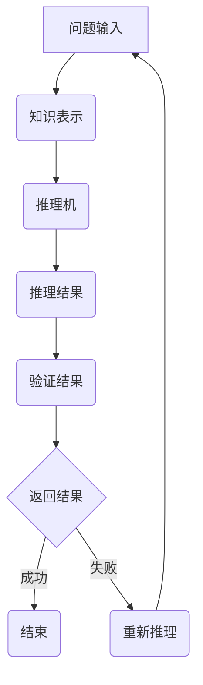
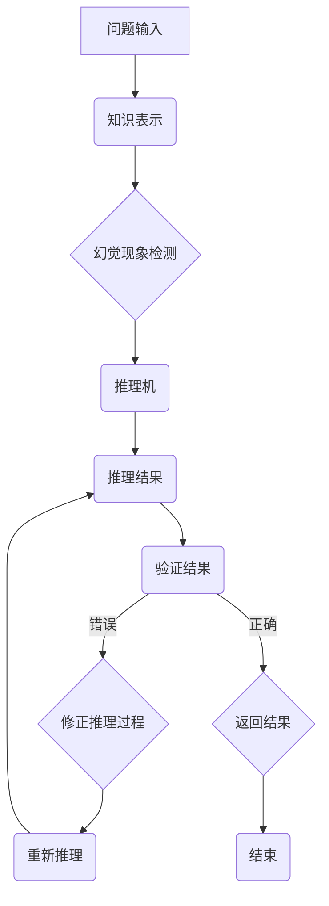
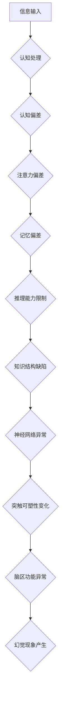
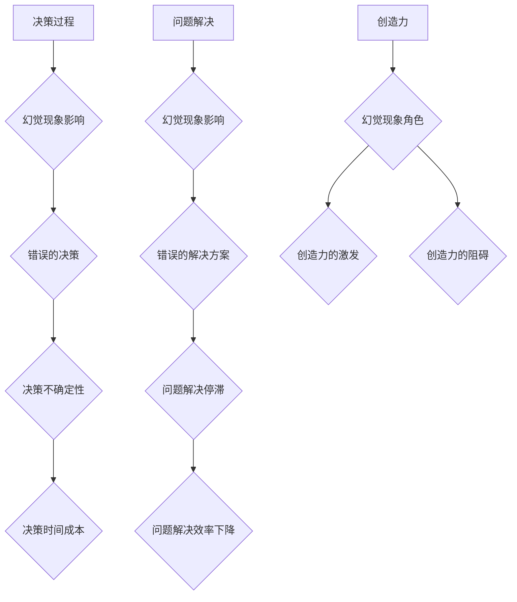
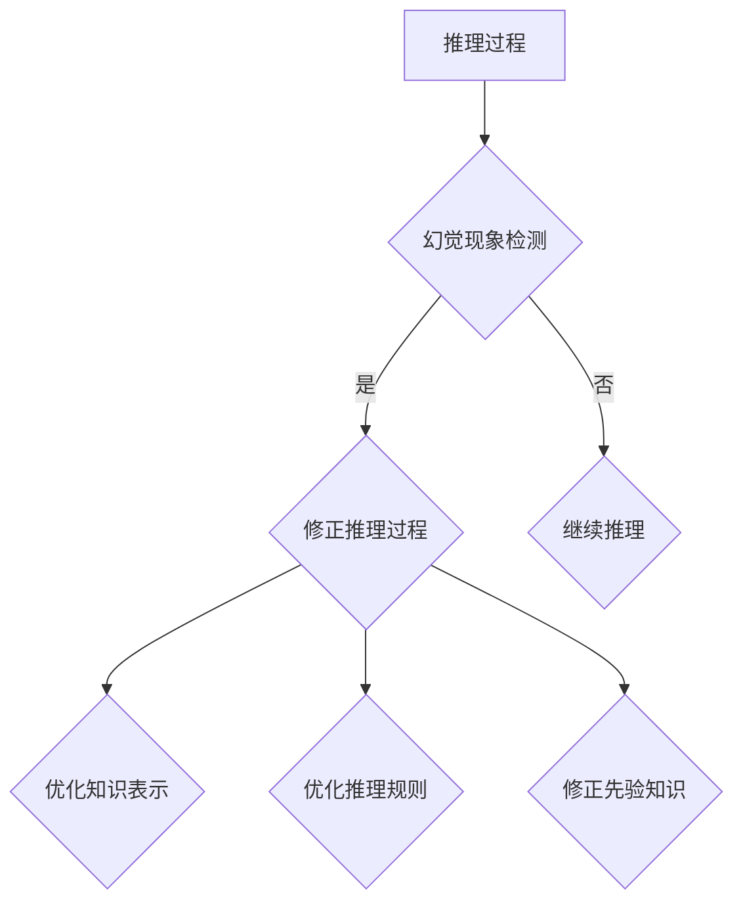

                 

### 复杂推理中的幻觉表现

> **关键词**：复杂推理，幻觉现象，认知科学，人工智能，自然语言处理

**摘要**：本文探讨了复杂推理中的幻觉表现，分析了幻觉现象的定义、分类、心理学基础以及在人工智能、机器学习和自然语言处理中的应用。通过Mermaid流程图、伪代码和数学模型，详细阐述了幻觉现象的检测、修正和利用方法，并提供了实际项目中的代码案例和解读。

----------------------------------------------------------------

### 第一部分: 复杂推理中的幻觉表现

#### 第1章: 复杂推理概述

**复杂推理的定义和重要性**

复杂推理是指在信息不完全、不确定的环境中，通过逻辑推理和决策来解决问题的过程。它不仅涉及到基本的逻辑运算，还包括概率推理、归纳推理、因果推理等多种复杂的推理方式。

复杂推理的重要性体现在以下几个方面：

1. **决策支持**：在商业、医疗、军事等领域，复杂推理可以帮助人们做出更加明智的决策。
2. **问题解决**：在人工智能系统中，复杂推理是实现智能问题解决的关键技术。
3. **知识表示和推理**：在知识工程领域，复杂推理用于表示和推理复杂知识，为智能系统提供强有力的支持。

**复杂推理在人工智能中的应用**

人工智能领域广泛应用复杂推理技术，以下是其主要应用场景：

1. **专家系统**：通过构建知识库和推理机，模拟人类专家的推理过程，解决复杂问题。
2. **自然语言处理**：复杂推理用于文本理解、语义分析、情感分析等任务。
3. **机器学习**：在机器学习中，推理用于模型解释、模型选择和模型优化。

**复杂推理与人类思维的关系**

复杂推理与人类思维之间存在紧密的联系。人类思维是一种基于经验和知识的推理过程，复杂推理试图模拟和解释人类思维的本质。然而，人类思维中存在的幻觉现象，也为复杂推理带来了挑战。

**核心概念与联系**

为了更好地理解复杂推理中的幻觉现象，我们首先需要了解以下核心概念：

1. **推理**：推理是利用已知信息得出新结论的过程。
2. **知识表示**：知识表示是将信息以计算机可处理的形式进行组织和表示。
3. **推理机**：推理机是负责执行推理过程的计算机程序。
4. **幻觉现象**：幻觉现象是指在推理过程中，由于信息处理的不完善或误解，导致产生的异常或不符合实际的推理结果或解释。

**Mermaid流程图**

以下是复杂推理的基本流程图：

#### 第2章: 幻觉现象的引入

**幻觉现象的定义**

幻觉现象是指在复杂推理过程中，由于信息处理的不完善或误解，导致产生的异常或不符合实际的推理结果或解释。幻觉现象可能是错误的推理结论、不合理的推理过程或异常的推理路径。

**幻觉现象的分类**

根据幻觉现象的表现形式，可以将其分为以下几类：

1. **逻辑幻觉**：在推理过程中，逻辑运算错误或推理规则使用不当，导致产生错误的推理结论。
2. **概率幻觉**：在推理过程中，概率估计不准确或概率计算错误，导致产生不合理的推理结果。
3. **因果幻觉**：在推理过程中，因果关系判断错误或因果推断不合理，导致产生误导性的推理结论。
4. **语义幻觉**：在推理过程中，对文本或语言的理解错误，导致产生不准确的推理结果。

**幻觉现象的影响和原因**

幻觉现象对推理过程和结果会产生负面影响，具体影响包括：

1. **降低推理准确性**：幻觉现象可能导致推理结果偏离真实情况，降低推理的准确性。
2. **增加推理复杂度**：为了修正幻觉现象，推理过程可能需要额外的计算和资源，增加推理的复杂度。
3. **降低推理效率**：幻觉现象可能导致推理过程陷入循环或无法继续，降低推理的效率。

幻觉现象的产生原因主要包括：

1. **信息处理错误**：在信息处理过程中，可能由于计算错误、数据丢失或噪声干扰，导致信息被误解或错误地处理。
2. **推理规则不当**：在推理过程中，推理规则可能过于简单或不适合特定问题，导致推理结果不符合实际情况。
3. **先验知识不足**：在推理过程中，如果先验知识不足或存在缺陷，可能导致推理结果偏离真实情况。

**核心概念与联系**

在复杂推理中，幻觉现象与推理过程、知识表示和推理机之间存在紧密的联系。以下是一个Mermaid流程图，展示了幻觉现象在推理过程中的表现：

#### 第3章: 幻觉现象的心理学基础

**幻觉现象的心理机制**

幻觉现象在心理学中有着丰富的理论研究。心理学认为，幻觉现象的产生与以下几个心理机制密切相关：

1. **认知偏差**：认知偏差是指人们在信息处理过程中，由于先入为主的观念或心理定式，导致信息理解或判断产生偏差。
2. **注意力偏差**：注意力偏差是指人们在信息处理过程中，由于对某些信息的注意力集中，导致其他信息被忽视或误解。
3. **记忆偏差**：记忆偏差是指人们在回忆信息时，由于记忆的遗忘或重构，导致信息的准确性和完整性受到影响。

**幻觉现象的认知基础**

认知基础是幻觉现象产生的重要前提。以下是一些与幻觉现象相关的认知基础：

1. **信息处理能力**：信息处理能力是指人们对信息的接收、处理和记忆的能力。信息处理能力的有限性可能导致幻觉现象的产生。
2. **推理能力**：推理能力是指人们进行逻辑推理和决策的能力。推理能力的局限性可能导致幻觉现象的出现。
3. **知识结构**：知识结构是指人们在大脑中存储的知识和组织方式。知识结构的缺陷可能导致幻觉现象的产生。

**幻觉现象的神经科学解释**

神经科学从大脑结构和功能的角度解释幻觉现象。以下是一些与幻觉现象相关的神经科学概念：

1. **神经网络**：神经网络是指由大量神经元组成的计算模型。神经网络中的神经元连接方式和激活模式可能导致幻觉现象的产生。
2. **突触可塑性**：突触可塑性是指神经元之间的连接强度可以随着外界刺激而改变。突触可塑性的变化可能导致幻觉现象的产生。
3. **脑区功能**：大脑的不同脑区负责不同的认知功能。脑区功能的异常可能导致幻觉现象的产生。

**核心概念与联系**

为了更好地理解幻觉现象的心理学基础，我们引入以下Mermaid流程图，展示幻觉现象在认知过程中的表现：

#### 第4章: 幻觉现象在复杂推理中的表现

**幻觉现象在决策过程中的影响**

在决策过程中，幻觉现象可能导致以下问题：

1. **错误的决策**：幻觉现象可能导致决策者对信息的解释产生偏差，从而做出错误的决策。
2. **决策的不确定性**：幻觉现象可能导致决策过程变得复杂和不确定，增加决策的风险。
3. **决策的时间成本**：为了修正幻觉现象，决策者可能需要投入额外的时间和资源，增加决策的时间成本。

**幻觉现象在问题解决中的表现**

在问题解决过程中，幻觉现象可能导致以下问题：

1. **错误的解决方案**：幻觉现象可能导致问题解决者对问题的理解产生偏差，从而选择错误的解决方案。
2. **问题解决的停滞**：幻觉现象可能导致问题解决者在错误的路径上停滞不前，无法找到有效的解决方案。
3. **问题解决的效率下降**：幻觉现象可能导致问题解决过程变得复杂和低效，增加问题解决的难度。

**幻觉现象在创造力中的角色**

幻觉现象在创造力中具有双重作用：

1. **创造力的激发**：在一定条件下，幻觉现象可以激发创造力，提供新颖的想法和灵感。
2. **创造力的阻碍**：过度的幻觉现象可能导致创造力受到限制，难以产生有价值的创新。

**核心概念与联系**

为了更好地理解幻觉现象在复杂推理中的表现，我们引入以下Mermaid流程图，展示幻觉现象在决策过程、问题解决和创造力中的表现：

#### 第5章: 复杂推理中的幻觉现象识别与避免

**识别幻觉现象的方法**

为了有效地识别幻觉现象，我们需要采用以下方法：

1. **词性标注**：通过词性标注，识别文本中的动词和其他可能引发幻觉现象的词汇。
2. **统计方法**：利用词频、共现关系等统计量，识别文本中的异常现象。
3. **机器学习方法**：通过训练模型，如分类器，识别和预测幻觉现象。
4. **深度学习方法**：使用深度学习模型，自动学习幻觉现象的特征。

**避免幻觉现象的策略**

为了避免幻觉现象的产生，我们可以采取以下策略：

1. **知识表示优化**：通过改进知识表示方法，提高信息的准确性和完整性，减少幻觉现象的产生。
2. **推理规则优化**：优化推理规则，使其更适应特定问题，减少幻觉现象的发生。
3. **先验知识修正**：通过修正先验知识，消除知识中的缺陷，减少幻觉现象的产生。
4. **实时监测与修正**：在推理过程中，实时监测幻觉现象的产生，并采取相应的修正措施。

**核心概念与联系**

为了更好地理解幻觉现象的识别与避免策略，我们引入以下Mermaid流程图，展示幻觉现象识别与避免的流程：

#### 第6章: 幻觉现象与人工智能

**幻觉现象在机器学习中的影响**

幻觉现象在机器学习中具有显著的影响：

1. **过拟合**：幻觉现象可能导致模型对训练数据产生过度拟合，降低模型的泛化能力。
2. **噪声数据**：幻觉现象可能导致模型对噪声数据的过度关注，影响模型的准确性和稳定性。
3. **推理错误**：幻觉现象可能导致模型在推理过程中产生错误的结果，降低推理的可靠性。

**幻觉现象在自然语言处理中的表现**

幻觉现象在自然语言处理中表现出以下特点：

1. **文本理解偏差**：幻觉现象可能导致文本理解产生偏差，影响语义分析和情感分析等任务。
2. **语言生成异常**：幻觉现象可能导致语言生成产生异常，影响文本生成和机器翻译等任务。
3. **推理结果不准确**：幻觉现象可能导致推理结果不准确，影响问答系统和对话系统等任务。

**幻觉现象在人工智能

