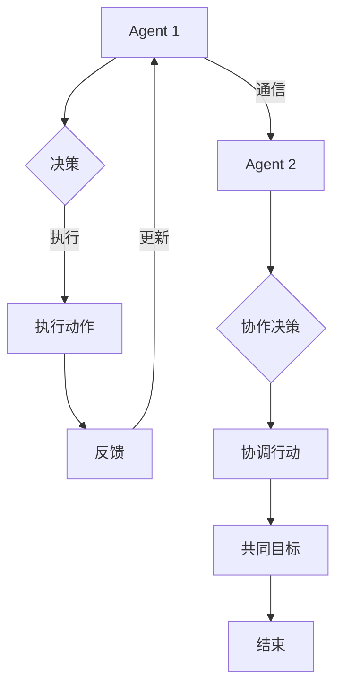

                 

### 第一部分：引论

#### 第1章：多Agent系统概述

**1.1 什么是多Agent系统**

多Agent系统（MAS）是一个由多个独立智能代理（Agent）组成的系统，这些代理可以在不同的计算实体上运行，并通过相互通信和协作来实现共同的目标。多Agent系统是分布式人工智能（Distributed Artificial Intelligence, DAI）的一个重要分支，旨在通过多个智能体之间的交互来模拟人类社会的行为和决策过程。

与单Agent系统不同，多Agent系统具有以下几个显著特点：

- **独立性**：每个代理都可以自主地执行任务，并拥有自己的行为策略和决策能力。
- **交互性**：代理之间可以通过各种通信机制进行信息交换和合作。
- **分布性**：代理可以在不同的计算实体上运行，分布在整个网络中。
- **自主性**：代理不需要中央控制，而是依靠自身的感知和决策能力来行动。

**1.2 多Agent系统的基本概念**

**Agent的定义与类型**：在多Agent系统中，Agent是一个独立的计算实体，能够感知环境、采取行动和与环境中其他Agent进行交互。根据不同的分类标准，Agent可以有不同的类型：

- **按智能程度分类**：智能代理（Intelligent Agent）和无智能代理（Non-Intelligent Agent）。
- **按功能分类**：监控代理（Monitoring Agent）、通信代理（Communication Agent）、执行代理（Execution Agent）等。
- **按行为模式分类**：规则代理（Rule-based Agent）、模型代理（Model-based Agent）、行为代理（Behavior-based Agent）等。

**多Agent系统的特点**：多Agent系统具有以下特点：

- **并行处理**：多个代理可以同时工作，提高系统的处理速度和效率。
- **容错性**：系统中一个或多个代理失效不会影响整个系统的运行。
- **适应性**：代理可以根据环境变化调整自己的行为策略。
- **灵活性**：系统可以容易地扩展和重构，以适应新的应用需求。

**1.3 多Agent系统的应用领域**

多Agent系统在多个领域有着广泛的应用：

- **工业自动化**：自动化生产线、质量检测、设备监控等。
- **机器人**：搜索与救援机器人、服务机器人、无人驾驶汽车等。
- **网络安全**：入侵检测、网络防护、安全策略制定等。
- **智能交通**：交通流量控制、无人驾驶、智能停车场管理等。
- **虚拟现实**：虚拟世界中的智能代理、交互式游戏等。
- **电子商务**：智能购物助手、在线客服代理等。

**1.4 多Agent系统的发展历程**

多Agent系统的发展历程可以分为以下几个阶段：

- **早期研究**：20世纪70年代，研究者开始探索多Agent系统作为分布式人工智能的一种形式。
- **体系结构研究**：20世纪80年代，研究者提出了一系列多Agent系统的体系结构，如SMA、MSA等。
- **通信机制研究**：20世纪90年代，研究者研究了多Agent系统的通信机制，如ACL、FIPA等。
- **算法研究**：近年来，研究者提出了多种多Agent学习算法、规划算法等，进一步提升了多Agent系统的智能水平。

通过上述引论，我们对多Agent系统的基本概念和应用领域有了初步的了解。在接下来的章节中，我们将进一步探讨多Agent系统的体系结构、通信机制、核心算法以及实际应用案例，以深入理解这一复杂但极具潜力的技术领域。

---

**1.5 小结与展望**

本章对多Agent系统进行了概述，介绍了其基本概念、特点以及应用领域，并回顾了其发展历程。多Agent系统作为一种分布式人工智能的形式，在许多领域展现了巨大的潜力和应用价值。然而，实现高效、可靠和可扩展的多Agent系统仍然面临许多挑战，如智能体之间的协同、通信效率、安全性和隐私保护等。

在接下来的章节中，我们将详细探讨多Agent系统的体系结构、通信机制和核心算法，并通过具体应用案例来展示多Agent系统的实际效果。同时，我们也会探讨多Agent系统未来的发展趋势和面临的挑战。通过这些深入的研究，我们期望为读者提供全面和多维度的视角，以更好地理解和应用多Agent系统。

---

**1.6 参考文献**

- Alvaro Cassinelli. "Multi-Agent Systems: An Introduction to Distributed Artifical Intelligence". Springer, 2012.
- Michael Wooldridge. "Intelligent Agents: Theory and Practice". John Wiley & Sons, 2009.
- Robin Bobrow. "Introduction to Multi-Agent Systems". Springer, 2002.
- Yoav Shoham, Kevin Leyton-Brown. "Multiagent Systems: Algorithmic, Game-Theoretic, and Logical Foundations". Cambridge University Press, 2009.

---

**1.7 练习题**

1. 解释多Agent系统与单Agent系统的区别。
2. 列举三种多Agent系统的应用领域。
3. 描述多Agent系统的体系结构类型。
4. 解释多Agent系统中的同步通信和异步通信。
5. 简述多Agent学习算法的基本类型。

---

#### 第2章：多Agent系统的体系结构与通信机制

**2.1 多Agent系统的体系结构**

多Agent系统的体系结构是指多Agent系统中的Agent组织方式及其相互作用的模式。根据Agent的组织方式，多Agent系统可以分为以下几种体系结构：

**1. 完全分布式体系结构**

在完全分布式体系结构中，每个Agent都是独立的计算实体，具有自主决策和行动的能力。Agent之间通过直接通信进行信息交换，每个Agent都可以独立完成其任务。这种结构具有高度的可扩展性和容错性，因为即使某些Agent失效，其他Agent仍然可以继续工作。

**2. 部分分布式体系结构**

在部分分布式体系结构中，系统中存在一个或多个中央控制器，负责协调和分配任务。其他Agent则执行由中央控制器分配的任务。这种结构在任务分配和协调方面效率较高，但依赖于中央控制器的稳定性和可靠性。

**3. 中心化体系结构**

在中心化体系结构中，所有的控制信息和决策都由一个中心服务器处理。Agent仅仅作为执行单元，接收来自中心服务器的指令并执行。这种结构在控制上非常集中，但可能会因为中心服务器的单点故障而影响整个系统的运行。

**2.2 多Agent系统的通信机制**

多Agent系统的通信机制是指Agent之间进行信息交换和交互的方式。根据通信方式，多Agent系统的通信机制可以分为同步通信和异步通信。

**1. 同步通信**

同步通信是指在固定的时间间隔内，所有Agent都同时发送和接收消息。这种通信方式可以确保消息的一致性和及时性，但可能会导致通信效率低下，因为Agent需要等待其他Agent完成通信。

**2. 异步通信**

异步通信是指Agent之间可以按照自己的节奏发送和接收消息，不需要等待其他Agent。这种通信方式提高了系统的通信效率，但可能会导致消息的顺序不确定性和一致性问题。

**2.3 多Agent系统中的协调与同步**

多Agent系统中的协调和同步是确保系统高效运作的关键。协调机制是指Agent之间如何合作以实现共同目标，同步机制则是如何确保Agent之间的状态一致性。

**1. 协调机制**

协调机制包括任务分配、资源管理和冲突解决等。任务分配是指如何将任务分配给不同的Agent，资源管理是指如何合理分配和使用系统资源，冲突解决是指如何处理Agent之间的竞争和冲突。

**2. 同步机制**

同步机制包括时间同步和状态同步。时间同步是指如何确保Agent之间的时间感知一致，状态同步是指如何确保Agent之间的状态更新一致。实现时间同步和状态同步的方法包括时间戳、心跳信号和锁机制等。

**2.4 多Agent系统中的冲突解决**

在多Agent系统中，冲突是常见的问题，如资源争夺、目标冲突等。冲突解决是指如何有效地处理这些冲突，以确保系统的稳定性和效率。

**1. 冲突类型**

多Agent系统中的冲突可以分为以下几种类型：

- **资源冲突**：多个Agent争夺同一资源。
- **目标冲突**：多个Agent具有相互矛盾的目标。
- **行动冲突**：多个Agent在同一时间执行相互冲突的行动。

**2. 冲突解决策略**

常见的冲突解决策略包括以下几种：

- **避让策略**：Agent在执行行动前检测是否有冲突，如果有则选择避让。
- **协商策略**：Agent通过协商来达成共识，避免冲突。
- **强制策略**：通过强制规定某些Agent的行为来避免冲突。
- **混合策略**：结合多种策略，根据实际情况选择最合适的策略。

通过上述机制，多Agent系统能够在复杂的环境中实现高效、可靠的协作和通信。在接下来的章节中，我们将深入探讨多Agent系统中的核心算法，以及如何在具体应用中实现这些算法。

---

**2.5 小结与展望**

本章详细介绍了多Agent系统的体系结构、通信机制、协调与同步机制以及冲突解决策略。多Agent系统的体系结构包括完全分布式、部分分布式和中心化结构，每种结构都有其适用场景和优缺点。通信机制分为同步通信和异步通信，分别适用于不同的应用需求。协调与同步机制确保了Agent之间的协作和状态一致性，而冲突解决策略则有效地处理了系统中的冲突问题。

在接下来的章节中，我们将探讨多Agent系统的核心算法，如学习算法、规划与决策算法，并介绍多Agent系统的实际应用案例，以展示这些算法在解决复杂任务中的作用。同时，我们也会讨论多Agent系统的安全性和隐私保护问题，以及其未来的发展趋势。通过这些内容，我们将更全面地理解多Agent系统的设计、实现和应用。

---

**2.6 参考文献**

- Michael Wooldridge. "Intelligent Agents: Theory and Practice". John Wiley & Sons, 2009.
- Yoav Shoham, Kevin Leyton-Brown. "Multiagent Systems: Algorithmic, Game-Theoretic, and Logical Foundations". Cambridge University Press, 2009.
- Annabelle McIver. "Multi-Agent Systems: A modern approach to distributed artificial intelligence". John Wiley & Sons, 2007.

---

**2.7 练习题**

1. 描述多Agent系统的完全分布式体系结构和中心化体系结构的区别。
2. 解释同步通信和异步通信的优缺点。
3. 列举三种协调机制，并简要说明其作用。
4. 解释时间同步和状态同步在多Agent系统中的作用。
5. 描述两种冲突解决策略，并说明其适用场景。

---

#### 第3章：多Agent学习算法

**3.1 多Agent学习的基本概念**

多Agent学习是分布式人工智能（Distributed Artificial Intelligence）中的一个重要研究领域，它涉及多个智能体在共享或独立的环境中进行学习，并通过合作或竞争来改进自身的性能。多Agent学习的重要性体现在以下几个方面：

- **适应性**：多Agent系统能够通过学习适应不断变化的环境和任务需求。
- **效率提升**：多个Agent可以并行地处理信息，提高学习效率。
- **智能协作**：通过学习算法，Agent之间可以更好地协作，共同完成复杂任务。
- **鲁棒性**：多Agent学习算法可以增强系统的鲁棒性，减少单个Agent失效对系统整体性能的影响。

**3.2 多Agent学习的主要算法**

多Agent学习算法可以分为以下几种主要类型：

**1. 同化学习**

同化学习是指多个Agent在共享信息的基础上，通过调整自身的行为策略来达到共同的目标。同化学习的基本思想是，每个Agent将自己的经验和知识共享给其他Agent，然后所有Agent根据这些共享信息更新自己的行为策略。

**算法伪代码：**
```
for each 代理 in 代理列表:
    接收其他代理的信息
    更新行为策略（结合自身经验和新信息）
end for
```

**2. 对抗学习**

对抗学习是指多个Agent在相互竞争的环境中学习，通过不断优化自身策略来对抗其他Agent。这种学习方式常用于博弈和竞争性任务中，如电子游戏和棋类游戏。

**算法伪代码：**
```
for each 代理 in 代理列表:
    选择最佳策略以对抗其他代理
    更新策略（根据对局结果调整）
end for
```

**3. 协同学习**

协同学习是指多个Agent在协作环境中学习，通过共同优化目标函数来提升整体性能。协同学习强调Agent之间的合作，以实现比单个Agent更好的效果。

**算法伪代码：**
```
定义目标函数（如总收益或总成本最小化）
for each 代理 in 代理列表:
    更新行为策略（使目标函数值最大化或最小化）
end for
```

**3.3 多Agent学习算法的设计与实现**

在设计多Agent学习算法时，需要考虑以下几个关键因素：

- **信息共享**：确保Agent能够有效地共享信息，避免信息孤岛。
- **决策策略**：定义Agent的行为策略，并确保这些策略能够适应环境变化。
- **学习机制**：设计有效的学习机制，使Agent能够从经验中学习并不断优化自身策略。
- **反馈机制**：建立反馈机制，使Agent能够根据任务结果调整策略。

在实现多Agent学习算法时，以下步骤是必要的：

- **初始化**：初始化每个Agent的状态和行为策略。
- **感知与决策**：Agent根据环境信息和自身状态进行感知和决策。
- **行动与反馈**：Agent执行决策并接收环境反馈。
- **策略更新**：根据反馈调整Agent的行为策略。

**算法实现示例**：

假设我们有一个由三个Agent组成的系统，每个Agent的目标是最大化自身的收益。我们可以使用协同学习算法来实现这一目标。

**Python伪代码：**
```python
# 初始化Agent状态和行为策略
agents = [Agent1(), Agent2(), Agent3()]

# 定义目标函数
def 目标函数(agents):
    总收益 = 0
    for agent in agents:
        总收益 += agent.收益
    return 总收益

# 学习循环
while True:
    # 感知与决策
    for agent in agents:
        agent.update_strategy()

    # 行动与反馈
    for agent in agents:
        agent.take_action()

    # 计算目标函数值
    current_reward = 目标函数(agents)

    # 策略更新
    for agent in agents:
        agent.update_strategy(current_reward)
```

通过上述设计与实现步骤，多Agent学习算法可以有效地在多个Agent之间进行信息共享和策略优化，从而实现共同的目标。

---

**3.4 小结与展望**

本章详细介绍了多Agent学习算法的基本概念、主要类型及其设计与实现方法。同化学习、对抗学习和协同学习是三种常见的学习算法，每种算法都有其特定的应用场景和优点。设计多Agent学习算法时，需要考虑信息共享、决策策略、学习机制和反馈机制等多个因素，确保Agent能够有效协作并实现共同目标。

在未来的研究中，多Agent学习算法将面临更多的挑战和机遇。随着人工智能技术的不断发展，多Agent学习算法将更加智能化、自适应和高效，有望在更多领域实现重大突破。同时，我们也需要进一步探索如何解决多Agent系统中的冲突、隐私保护和安全性问题，以确保系统的可靠性和稳定性。

---

**3.5 参考文献**

- Tuomas Sandholm. "Collaborative Multiagent Learning". AAAI Press, 2007.
- Jérôme Lang, Yaochu Jin, and Philippe Mathieu. "Multi-Agent Learning: Methods, Models, and Applications". Springer, 2014.
- Michael Wooldridge. "Intelligent Agents: Theory and Practice". John Wiley & Sons, 2009.

---

**3.6 练习题**

1. 解释同化学习、对抗学习和协同学习的区别和应用场景。
2. 设计一个简单的多Agent学习算法，实现三个Agent之间的协同合作。
3. 描述多Agent学习算法中信息共享的关键因素。
4. 如何在多Agent系统中处理学习算法中的冲突问题？
5. 简述多Agent学习算法在资源分配和调度中的应用。

---

#### 第4章：多Agent系统的规划与决策

**4.1 多Agent系统的规划概念**

多Agent系统的规划是指为每个Agent制定一个行动计划，以确保系统能够达到预定的目标。规划是多Agent系统中的一个核心环节，涉及到多个Agent之间的协调和合作，是实现高效任务执行的关键。多Agent规划的主要目的是确定每个Agent在特定环境下的行为策略，使其能够有效地完成任务。

**4.2 多Agent决策算法**

多Agent决策算法是指多个Agent如何在动态环境中做出最优决策，以实现共同目标。决策是多Agent系统中重要的环节，涉及到每个Agent的行为策略选择。常见的多Agent决策算法包括：

**1. 决策理论**

决策理论是一种基于概率和期望值的方法，用于解决不确定环境下的决策问题。在多Agent系统中，决策理论可以帮助Agent评估不同策略的风险和收益，并选择最优策略。

**算法伪代码：**
```
for each 代理 in 代理列表:
    计算每个策略的期望收益
    选择期望收益最高的策略
end for
```

**2. 多目标决策**

多目标决策是指Agent在多个目标之间进行权衡和选择，以找到一个平衡的解决方案。在多Agent系统中，多目标决策可以用于资源分配、任务调度和冲突解决等。

**算法伪代码：**
```
for each 代理 in 代理列表:
    定义目标函数
    使用多目标优化算法（如Pareto优化）
    选择一个非支配解
end for
```

**3. 决策树**

决策树是一种常用的决策算法，通过树形结构表示不同策略和其结果，用于帮助Agent做出决策。在多Agent系统中，决策树可以用于复杂问题的推理和决策。

**算法伪代码：**
```
构建决策树
for each 代理 in 代理列表:
    从决策树中选择最佳路径
end for
```

**4.3 多Agent系统的规划与决策实现**

在实现多Agent系统的规划与决策时，需要考虑以下几个关键因素：

- **环境建模**：准确描述系统的环境状态，为规划与决策提供基础。
- **状态空间**：定义Agent的状态空间，以便进行有效的规划和决策。
- **动作空间**：定义Agent可以执行的动作，确保规划与决策的可行性。
- **目标函数**：定义评估Agent行为效果的指标，用于选择最优策略。

**算法实现示例**：

假设我们有一个由三个Agent组成的系统，每个Agent的目标是最大化其收益。我们可以使用决策树算法来实现这一目标。

**Python伪代码：**
```python
# 环境建模
environment = Environment()

# 定义目标函数
def 目标函数(agent):
    return agent.收益

# 建立决策树
decision_tree = build_decision_tree()

# 规划与决策循环
while True:
    for agent in agents:
        # 从决策树中选择最佳路径
        best_action = decision_tree.select_best_action(agent.state)
        
        # 执行动作
        agent.take_action(best_action)

        # 更新环境状态
        environment.update_state(agent.state)

    # 计算目标函数值
    current_reward = sum(target_function(agent) for agent in agents)

    # 更新决策树
    decision_tree.update_tree(current_reward)
```

通过上述实现步骤，多Agent系统可以在动态环境中做出最优决策，实现高效任务执行。

---

**4.4 小结与展望**

本章详细介绍了多Agent系统的规划与决策概念以及常见的决策算法。规划是确保多Agent系统能够达到预定目标的关键，决策则是每个Agent在动态环境中做出最优决策的过程。通过环境建模、状态空间、动作空间和目标函数等关键因素，可以实现有效的多Agent规划与决策。

在未来的研究中，多Agent规划与决策算法将面临更多的挑战和机遇。随着人工智能技术的不断发展，这些算法将更加智能化、自适应和高效，有望在更多领域实现重大突破。同时，我们也需要进一步探索如何解决多Agent系统中的冲突、隐私保护和安全性问题，以确保系统的可靠性和稳定性。

---

**4.5 参考文献**

- Michael Wooldridge. "Intelligent Agents: Theory and Practice". John Wiley & Sons, 2009.
- Yoav Shoham, Kevin Leyton-Brown. "Multiagent Systems: Algorithmic, Game-Theoretic, and Logical Foundations". Cambridge University Press, 2009.
- Nir Gazit, George J. Pappas. "Multi-Agent Decision-Making under Uncertainty". Springer, 2012.

---

**4.6 练习题**

1. 解释多Agent系统规划与决策的关键因素。
2. 设计一个简单的多Agent规划算法，实现三个Agent之间的协同合作。
3. 描述决策理论在多Agent决策中的应用。
4. 如何在多Agent系统中处理复杂环境下的决策问题？
5. 简述多目标决策算法在资源分配和调度中的应用。

---

#### 第5章：多Agent系统的安全性与隐私保护

**5.1 多Agent系统的安全威胁**

多Agent系统作为一种分布式系统，面临着多种安全威胁，这些威胁可能来自内部或外部，并可能导致系统功能失效、数据泄露和隐私泄露等问题。

**1. 安全漏洞**

安全漏洞是指系统中的漏洞或缺陷，可能导致未经授权的访问或操作。多Agent系统中的安全漏洞可能包括：

- **代理内部漏洞**：代理的代码中可能存在漏洞，使得攻击者可以通过代理控制整个系统。
- **通信协议漏洞**：多Agent系统中的通信协议可能存在漏洞，使得攻击者可以窃取或篡改通信内容。

**2. 攻击类型**

多Agent系统可能遭受以下类型的攻击：

- **拒绝服务攻击（DoS）**：攻击者通过大量请求使系统资源耗尽，导致系统瘫痪。
- **分布式拒绝服务攻击（DDoS）**：攻击者通过多个代理发起请求，以淹没系统的资源。
- **代理篡改**：攻击者篡改代理的行为策略，使其执行恶意操作。
- **中间人攻击**：攻击者在代理之间进行通信时窃取或篡改数据。

**5.2 多Agent系统的安全机制**

为了应对多Agent系统中的安全威胁，需要建立一系列安全机制，包括认证与授权、安全通信和冲突检测与防范等。

**1. 认证与授权**

认证与授权是确保系统安全的基础。认证机制用于验证代理的身份，授权机制用于确定代理的权限。

- **代理认证**：通过身份验证机制确保只有合法代理可以访问系统资源。
- **权限管理**：通过授权机制确保代理只能访问其权限范围内的资源。

**2. 安全通信**

安全通信机制用于保护代理之间的通信免受攻击。

- **加密通信**：使用加密技术保护通信内容，防止数据泄露或篡改。
- **认证加密**：结合认证和加密技术，确保通信的合法性和完整性。

**3. 冲突检测与防范**

冲突检测与防范机制用于检测和解决代理之间的冲突。

- **冲突检测**：实时监测代理的行为，识别潜在冲突。
- **冲突解决**：采用冲突解决策略，如协商或强制策略，解决冲突。

**5.3 多Agent系统的隐私保护**

多Agent系统中的隐私保护旨在防止代理的隐私泄露，保护系统的用户和代理的个人信息。

**1. 隐私泄露风险**

多Agent系统中可能存在以下隐私泄露风险：

- **通信泄露**：代理之间的通信内容可能被窃取或篡改。
- **代理行为泄露**：代理的行为策略可能被恶意实体监控，导致隐私泄露。

**2. 隐私保护策略**

为了防止隐私泄露，需要采取以下隐私保护策略：

- **数据加密**：对代理之间的通信数据进行加密，防止数据泄露。
- **访问控制**：实施严格的访问控制策略，确保只有授权实体可以访问敏感数据。
- **匿名化**：对代理的行为数据进行匿名化处理，降低隐私泄露的风险。

**5.4 安全性与隐私保护的挑战与机遇**

多Agent系统的安全性与隐私保护面临以下挑战：

- **复杂性**：多Agent系统的复杂性使得安全性和隐私保护变得更为困难。
- **分布式特性**：分布式特性使得安全威胁可能来自多个来源，增加了检测和防范的难度。
- **动态性**：多Agent系统的动态性使得安全策略需要不断更新和调整。

然而，多Agent系统在安全性和隐私保护方面也面临机遇：

- **智能化**：通过引入人工智能技术，可以开发出更加智能化的安全性和隐私保护机制。
- **协作性**：多Agent系统可以通过协作实现更高效的安全性和隐私保护。

通过应对这些挑战和利用这些机遇，多Agent系统可以实现更高的安全性和隐私保护水平。

---

**5.5 小结与展望**

本章详细探讨了多Agent系统的安全性与隐私保护，分析了系统中可能存在的安全威胁和隐私泄露风险，并提出了相应的安全机制和隐私保护策略。认证与授权、安全通信和冲突检测与防范是确保多Agent系统安全性的关键措施，数据加密和访问控制是保护隐私的重要手段。

在未来的研究中，我们需要进一步探索如何应对多Agent系统中的复杂性和动态性挑战，开发更智能化的安全性和隐私保护机制。同时，通过协作和资源共享，多Agent系统可以在安全性和隐私保护方面实现更高的效率。

---

**5.6 参考文献**

- Michael Wooldridge. "Intelligent Agents: Theory and Practice". John Wiley & Sons, 2009.
- Yoav Shoham, Kevin Leyton-Brown. "Multiagent Systems: Algorithmic, Game-Theoretic, and Logical Foundations". Cambridge University Press, 2009.
- Anupam Chander, Michael W. Macy. "Privacy in Multi-Agent Systems". Springer, 2011.

---

**5.7 练习题**

1. 描述多Agent系统中可能存在的安全漏洞。
2. 列举几种多Agent系统的攻击类型，并简要说明其原理。
3. 解释多Agent系统中认证与授权的作用。
4. 描述安全通信机制，并说明其重要性。
5. 如何在多Agent系统中保护代理的隐私？

---

#### 第6章：多Agent系统在复杂任务中的协同

**6.1 多Agent系统协同的挑战**

在复杂任务中，多Agent系统需要实现高效协同，以完成单个Agent难以完成的任务。然而，协同过程中面临许多挑战，包括协同效率、协同一致性和冲突处理等。

**1. 协同效率**

协同效率是指多Agent系统在完成复杂任务时的速度和资源利用效率。协同效率低下可能导致任务完成时间延长、资源浪费和系统性能下降。

**2. 协同一致性**

协同一致性是指多Agent系统在执行协同任务时，各Agent的行为和状态能够保持一致，以确保任务目标的实现。一致性问题是多Agent系统协同中的关键挑战，因为Agent之间的异步性和独立性可能导致状态不一致和任务失败。

**3. 冲突处理**

在多Agent系统中，冲突处理是指如何解决Agent之间的竞争和相互干扰。冲突处理不当可能导致系统性能下降、任务失败和系统瘫痪。

**6.2 多Agent系统的协同算法**

为了应对协同挑战，多Agent系统采用多种协同算法，以实现高效协同。以下是一些常见的协同算法：

**1. 分布式算法**

分布式算法通过分布计算和协同策略实现多Agent系统的协同。分布式算法的优点是容错性强、可扩展性好，但可能面临通信延迟和一致性难题。

**2. 协同控制算法**

协同控制算法通过控制理论实现多Agent系统的协同。协同控制算法的核心是设计合适的控制策略，使各Agent的行为和状态保持一致。协同控制算法适用于动态环境，但实现复杂度高。

**3. 分布式一致性算法**

分布式一致性算法通过一致性协议实现多Agent系统的协同。一致性算法的目标是确保各Agent之间的状态更新一致。常见的分布式一致性算法包括Paxos算法和Raft算法。

**6.3 多Agent系统协同的案例分析**

为了更好地理解多Agent系统在复杂任务中的协同，我们通过两个实际案例进行分析。

**1. 工业自动化案例**

在工业自动化中，多Agent系统可以协同工作，完成复杂的生产任务。例如，在自动化生产线上，多个机器人Agent可以协同完成装配、搬运和检测等任务。协同控制算法被用于协调各机器人Agent的行为，确保生产线的连续性和高效性。

**2. 机器人案例**

在机器人领域中，多Agent系统可以协同工作，实现复杂任务。例如，在搜索与救援任务中，多个无人机Agent可以协同工作，覆盖更大范围的搜索区域，提高搜索效率。分布式算法被用于协调无人机Agent的飞行路径和任务分配，以确保高效搜索。

通过上述案例，我们可以看到多Agent系统在复杂任务中的协同应用。协同算法的选择和实现对于系统性能和任务成功率至关重要。

---

**6.4 小结与展望**

本章探讨了多Agent系统在复杂任务中的协同挑战和协同算法。协同效率、协同一致性和冲突处理是多Agent系统协同的关键挑战。分布式算法、协同控制算法和分布式一致性算法是多Agent系统常用的协同算法。

在未来的研究中，我们需要进一步探索如何优化协同算法，提高协同效率，并解决协同一致性和冲突处理问题。同时，多Agent系统在复杂任务中的应用也将不断扩展，为工业自动化、机器人等领域带来更多创新和突破。

---

**6.5 参考文献**

- Michael Wooldridge. "Intelligent Agents: Theory and Practice". John Wiley & Sons, 2009.
- Yoav Shoham, Kevin Leyton-Brown. "Multiagent Systems: Algorithmic, Game-Theoretic, and Logical Foundations". Cambridge University Press, 2009.
- Nir Gazit, George J. Pappas. "Multi-Agent Decision-Making under Uncertainty". Springer, 2012.

---

**6.6 练习题**

1. 列举多Agent系统协同中的关键挑战。
2. 描述分布式算法在多Agent系统中的应用。
3. 解释协同控制算法的作用。
4. 如何实现多Agent系统的分布式一致性？
5. 简述多Agent系统协同算法在工业自动化中的应用。

---

#### 第7章：多Agent系统在复杂任务中的协同

**7.1 多Agent系统在复杂任务中的协同**

多Agent系统在复杂任务中扮演着至关重要的角色，其协同能力的优劣直接影响到任务的完成效果和系统整体性能。在复杂任务中，多Agent系统需要通过协作和通信来共同实现任务目标，从而提高任务的成功率和效率。以下我们将探讨多Agent系统在工业自动化、机器人、网络安全和智能交通等领域的应用，并分析协同过程中的关键技术和挑战。

**7.2 多Agent系统在工业自动化中的应用**

在工业自动化领域，多Agent系统广泛应用于自动化生产线、质量检测、设备监控等环节。通过多Agent协同，可以实现对生产过程的实时监控和优化，提高生产效率和产品质量。具体应用案例包括：

- **自动化生产线**：多机器人Agent协同工作，完成装配、搬运、检测等任务，实现生产线的全自动化。例如，在汽车制造厂中，多机器人Agent可以协同完成车身焊接、涂装和装配等工序。
- **质量检测**：多Agent系统可以对生产过程中的产品质量进行实时检测，发现并排除缺陷。例如，在生产线上安装质量检测机器人，通过图像识别和传感器数据进行分析，实现质量自动检测和预警。

**7.3 多Agent系统在机器人中的应用**

多Agent系统在机器人领域有着广泛的应用，特别是在搜索与救援、服务机器人、无人驾驶汽车等方面。通过多机器人Agent的协同工作，可以显著提高机器人任务的完成效率和可靠性。以下是一些具体应用案例：

- **搜索与救援机器人**：在灾难救援任务中，多机器人Agent可以协同工作，快速搜索被困人员并实施救援。例如，在地震救援中，无人机和地面机器人可以协同工作，从空中和地面同时进行搜索，提高救援效率。
- **服务机器人**：在商业和服务场景中，多Agent系统可以协同为顾客提供服务。例如，在商场中，服务机器人可以协同完成导购、清洁、安保等任务，提高商场的服务水平和运营效率。

**7.4 多Agent系统在网络安全中的应用**

在网络安全领域，多Agent系统通过协同工作来提高入侵检测、网络防护和攻击响应能力。多Agent系统可以实时监控网络流量，识别潜在威胁并采取应对措施。以下是一些具体应用案例：

- **入侵检测**：多Agent系统可以对网络流量进行实时分析，识别恶意攻击并发出警报。例如，在网络中部署多入侵检测Agent，通过数据分析和机器学习模型，实现实时入侵检测。
- **网络防护**：多Agent系统可以协同工作，对网络进行实时防护，防止恶意攻击。例如，在网络防火墙中部署多防护Agent，通过协同工作实现精准防护和快速响应。

**7.5 多Agent系统在智能交通中的应用**

在智能交通领域，多Agent系统通过协同工作来提高交通流量控制、无人驾驶和交通管理效率。通过多Agent协同，可以实现更加智能和高效的交通管理系统。以下是一些具体应用案例：

- **无人驾驶**：多Agent系统可以协同实现无人驾驶汽车的自动驾驶功能。例如，在高速公路上，多辆无人驾驶汽车通过协同工作，实现车道保持、速度控制和路况分析，提高行车安全和效率。
- **交通流量控制**：多Agent系统可以协同工作，对城市交通进行实时监控和流量控制。例如，在城市交通管理系统中，多Agent系统可以协同分析交通数据，调整交通信号灯时序，优化交通流量。

**7.6 多Agent系统协同的关键技术和挑战**

在多Agent系统协同过程中，需要解决一系列关键技术和挑战，包括：

- **通信机制**：实现高效的通信机制，确保Agent之间能够实时、可靠地交换信息。
- **协同算法**：设计合适的协同算法，实现Agent之间的协作和协调。
- **一致性保障**：确保Agent之间的状态和动作保持一致性，防止任务失败和系统瘫痪。
- **安全性和隐私保护**：保障系统安全，防止恶意攻击和数据泄露。
- **动态适应**：应对复杂动态环境，实现Agent的动态调整和适应。

通过解决这些关键技术和挑战，多Agent系统可以在复杂任务中实现高效协同，提高任务完成效率和系统整体性能。

---

**7.7 小结与展望**

本章详细探讨了多Agent系统在复杂任务中的应用，包括工业自动化、机器人、网络安全和智能交通等领域。多Agent系统通过协同工作，能够显著提高任务完成效率和系统整体性能。在未来的研究中，我们需要进一步探索如何优化协同算法，提高通信效率和一致性保障，并解决安全性和隐私保护问题。同时，随着人工智能和物联网技术的不断发展，多Agent系统在更多领域将展现出巨大的应用潜力。

---

**7.8 参考文献**

- Michael Wooldridge. "Intelligent Agents: Theory and Practice". John Wiley & Sons, 2009.
- Yoav Shoham, Kevin Leyton-Brown. "Multiagent Systems: Algorithmic, Game-Theoretic, and Logical Foundations". Cambridge University Press, 2009.
- Nir Gazit, George J. Pappas. "Multi-Agent Decision-Making under Uncertainty". Springer, 2012.

---

**7.9 练习题**

1. 列举多Agent系统在工业自动化中的应用案例。
2. 描述多Agent系统在搜索与救援机器人中的作用。
3. 如何实现多Agent系统在网络安全中的入侵检测？
4. 简述多Agent系统在智能交通中的应用场景。
5. 多Agent系统在复杂任务协同中面临哪些关键技术挑战？

---

#### 第8章：多Agent系统的未来发展

**8.1 多Agent系统技术趋势**

随着人工智能、物联网和云计算等技术的迅猛发展，多Agent系统技术也迎来了新的机遇和挑战。未来的多Agent系统将在以下几个方面展现出显著的技术趋势：

**1. 人工智能与多Agent系统的融合**

人工智能技术的不断进步为多Agent系统注入了新的活力。未来，多Agent系统将更加紧密地与人工智能技术融合，通过深度学习、强化学习等算法提升Agent的智能水平。这将使多Agent系统在复杂环境中的自主决策和协同能力得到显著提升。

**2. 自适应多Agent系统**

自适应多Agent系统是未来的重要研究方向。传统的多Agent系统通常在固定的环境和规则下运行，而自适应多Agent系统则能够根据环境变化和任务需求动态调整自身的行为策略。这种系统在应对不确定性和动态变化方面具有更高的灵活性和鲁棒性。

**3. 多Agent系统与区块链技术的结合**

区块链技术以其去中心化、安全性和透明性等特点，为多Agent系统的数据共享和安全保障提供了新的解决方案。未来，多Agent系统与区块链技术的结合将实现更安全、更高效的数据交换和协作。

**4. 跨领域多Agent系统**

跨领域多Agent系统将涵盖多个应用领域，如智能制造、智慧城市、医疗健康等。这种系统通过跨领域的协同和资源共享，实现更广泛的应用场景和更高的系统价值。

**8.2 多Agent系统的挑战与机遇**

尽管多Agent系统具有巨大的潜力，但在实际应用中仍面临许多挑战：

**1. 协同效率**

多Agent系统中的协同效率是一个关键挑战。在复杂环境中，如何确保Agent之间的高效协作和资源优化，是实现多Agent系统成功应用的重要问题。

**2. 系统稳定性**

多Agent系统在动态环境中可能面临不确定性，如何保证系统的稳定性和可靠性，是一个亟待解决的问题。

**3. 安全性与隐私保护**

多Agent系统涉及到大量数据和信息的交换，如何保障系统的安全性和用户的隐私保护，是未来需要重点关注的问题。

然而，多Agent系统也面临许多机遇：

**1. 智能化水平提升**

随着人工智能技术的发展，多Agent系统的智能化水平将不断提升，使系统能够更好地适应复杂环境和动态变化。

**2. 跨领域应用拓展**

多Agent系统将在更多领域得到应用，如智能制造、智慧城市、医疗健康等，实现跨领域的协同和创新。

**3. 产业生态体系建设**

随着多Agent系统的广泛应用，将形成一个新的产业生态体系，包括硬件、软件、平台等多个环节，为多Agent系统的发展提供强大的支持。

**8.3 多Agent系统的未来发展前景**

未来，多Agent系统将在以下几个方面展现出广阔的发展前景：

**1. 智能化水平提升**

通过人工智能技术的融合，多Agent系统的智能化水平将得到显著提升，使系统能够更加智能地应对复杂环境和动态变化。

**2. 应用场景拓展**

多Agent系统将在更多领域得到应用，如智能制造、智慧城市、医疗健康等，实现跨领域的协同和创新。

**3. 生态体系建设**

随着多Agent系统的广泛应用，将形成一个新的产业生态体系，包括硬件、软件、平台等多个环节，为多Agent系统的发展提供强大的支持。

**4. 系统优化与集成**

通过不断优化和集成，多Agent系统将实现更高的效率、稳定性和可靠性，为各个领域的应用提供更加成熟和可靠的技术方案。

总之，多Agent系统作为一种分布式人工智能技术，具有广阔的发展前景和应用潜力。在未来的发展中，我们将看到更多创新和多领域融合的应用案例，为人类带来更加智能和高效的生活和工作环境。

---

**8.4 小结与展望**

本章探讨了多Agent系统未来的技术趋势、挑战与机遇，以及发展前景。随着人工智能、物联网和区块链等技术的融合，多Agent系统将在智能化、自适应性和安全性等方面实现重大突破。面对挑战，多Agent系统将在更广泛的领域展现其应用价值，推动产业生态体系的形成。未来，我们将见证多Agent系统在各个领域的创新应用，为人类带来更加智能、高效和美好的生活。

---

**8.5 参考文献**

- Michael Wooldridge. "Intelligent Agents: Theory and Practice". John Wiley & Sons, 2009.
- Yoav Shoham, Kevin Leyton-Brown. "Multiagent Systems: Algorithmic, Game-Theoretic, and Logical Foundations". Cambridge University Press, 2009.
- Nir Gazit, George J. Pappas. "Multi-Agent Decision-Making under Uncertainty". Springer, 2012.
- Tuomas Sandholm. "Collaborative Multi-Agent Learning". AAAI Press, 2007.

---

**8.6 练习题**

1. 分析人工智能技术对多Agent系统的影响。
2. 描述自适应多Agent系统的特点和应用。
3. 如何通过区块链技术提升多Agent系统的安全性？
4. 列举多Agent系统在智能制造领域中的应用案例。
5. 面对未来挑战，如何提升多Agent系统的协同效率？

---

### 附录

**附录A：多Agent系统开发工具与资源**

在多Agent系统的开发过程中，选择合适的开发工具和资源对于实现高效开发和顺利部署至关重要。以下是一些主流的多Agent系统开发工具和资源：

**A.1 主流多Agent开发平台**

1. **RePast**

   Repast是一个开源的多Agent仿真平台，提供了丰富的模拟工具和模型库，支持多种编程语言，如Java和Python。RePast适用于复杂的多Agent系统仿真和分析。

2. **GAMA**

   GAMA是一个可视化、模块化和开放的多Agent系统开发平台，支持多种编程语言，如Java、Python和R。GAMA提供丰富的图形界面和模型库，适用于多种应用场景。

3. **Jason**

   Jason是一个基于Java的多Agent平台，提供了多种通信协议和开发工具，支持分布式和并发编程。Jason适用于开发复杂的多Agent系统和智能代理。

**A.2 多Agent系统开发指南**

在开发多Agent系统时，以下指南可以帮助开发者更好地理解和应用多Agent技术：

1. **开发流程**

   - 需求分析：明确系统目标和功能需求。
   - 系统设计：设计多Agent系统的体系结构和通信机制。
   - 算法实现：实现多Agent学习、规划与决策等核心算法。
   - 系统测试：测试系统的性能、稳定性和可靠性。
   - 部署与维护：部署系统并确保其稳定运行。

2. **编程模型**

   - 分层模型：将多Agent系统分为感知层、决策层和执行层，分别处理信息的感知、决策和执行。
   - 事件驱动模型：基于事件驱动的编程模型，实现多Agent系统的实时响应和动态调整。
   - 并发编程模型：利用并发编程技术，提高系统的并行处理能力。

**A.3 相关论文与文献推荐**

以下是一些经典的和最新的多Agent系统论文和文献，供开发者参考：

1. **经典论文**

   - Michael Wooldridge. "Intelligent Agents: Theory and Practice".
   - Yoav Shoham, Kevin Leyton-Brown. "Multiagent Systems: Algorithmic, Game-Theoretic, and Logical Foundations".
   - Robin Bobrow. "Introduction to Multi-Agent Systems".

2. **最新研究进展**

   - Tuomas Sandholm. "Collaborative Multi-Agent Learning".
   - Jérôme Lang, Yaochu Jin, and Philippe Mathieu. "Multi-Agent Learning: Methods, Models, and Applications".
   - Nir Gazit, George J. Pappas. "Multi-Agent Decision-Making under Uncertainty".

通过使用上述开发工具和资源，开发者可以更好地理解和应用多Agent系统技术，实现高效开发和成功部署。

---

**附录B：多Agent系统的 Mermaid 流程图**

Mermaid 是一种基于Markdown的图形绘制工具，可以方便地生成流程图、时序图、类图等。以下是一个简单的多Agent系统架构的 Mermaid 流程图示例：



这个流程图描述了一个简单的多Agent系统，其中Agent 1首先进行决策，然后执行动作并反馈结果。接着，Agent 1与Agent 2进行通信，共同进行协作决策和协调行动，最终实现共同目标。

---

**附录C：核心算法伪代码**

在多Agent系统中，核心算法是实现高效协作和智能决策的关键。以下是一些常见核心算法的伪代码，供开发者参考：

**C.1 多Agent学习算法**

```python
# 同化学习伪代码
def 同化学习(代理列表，环境状态):
    for each 代理 in 代理列表:
        代理更新行为(环境状态)
    end for
end function

# 对抗学习伪代码
def 对抗学习(代理列表，环境状态):
    for each 代理 in 代理列表:
        代理更新行为(对抗策略，环境状态)
    end for
end function

# 协同学习伪代码
def 协同学习(代理列表，目标函数):
    for each 代理 in 代理列表:
        代理更新行为(目标函数)
    end for
end function
```

**C.2 多Agent系统的规划与决策算法**

```python
# 规划算法伪代码
def 规划算法(当前状态，目标状态):
    while 当前状态 != 目标状态:
        动作 = 选择最佳动作(当前状态)
        更新状态(动作)
    end while
end function

# 决策算法伪代码
def 决策算法(当前状态，决策变量):
    决策 = 计算最优决策(当前状态，决策变量)
    执行决策(决策)
end function
```

**C.3 多Agent系统协同算法**

```python
# 分布式算法伪代码
def 分布式算法(代理列表，协同目标):
    for each 代理 in 代理列表:
        代理更新状态(协同目标)
    end for
end function

# 协同控制算法伪代码
def 协同控制算法(代理列表，协同目标):
    协同状态 = 计算协同状态(代理列表，协同目标)
    while 协同状态 != 目标状态:
        更新协同状态(协同状态)
    end while
end function
```

通过这些伪代码，开发者可以更好地理解多Agent系统的核心算法，并在实际项目中应用和优化这些算法。

---

**附录D：多Agent系统的实际应用案例代码与分析**

**D.1 工业自动化案例**

在工业自动化中，多Agent系统可以用于生产线的自动化控制和优化。以下是一个简单的多Agent系统代码示例，用于自动化生产线的任务分配和执行。

```python
# 工业自动化生产线案例

# Agent类定义
class Agent:
    def __init__(self, name, task_queue):
        self.name = name
        self.task_queue = task_queue

    def execute_task(self, task):
        print(f"{self.name} 开始执行任务：{task}")
        # 执行任务逻辑
        time.sleep(1)  # 模拟任务执行时间
        print(f"{self.name} 完成任务：{task}")

# 生产任务类定义
class Task:
    def __init__(self, name, duration):
        self.name = name
        self.duration = duration

# 创建Agent列表
agent1 = Agent("机器人1", [])
agent2 = Agent("机器人2", [])
agent3 = Agent("机器人3", [])

agents = [agent1, agent2, agent3]

# 创建任务队列
tasks = [Task("装配", 3), Task("搬运", 2), Task("检测", 4)]

# 分配任务
for task in tasks:
    if len(agents) > 0:
        next_agent = agents.pop(0)
        next_agent.task_queue.append(task)
        print(f"任务：{task.name} 分配给 {next_agent.name}")

# 执行任务
for agent in agents:
    while len(agent.task_queue) > 0:
        task = agent.task_queue.pop(0)
        agent.execute_task(task)
```

**代码解读与分析**：

1. **Agent类**：定义了Agent的基本属性和功能，包括名称和任务队列。
2. **Task类**：定义了生产任务的基本属性，包括任务名称和持续时间。
3. **任务分配**：根据任务队列的长度，依次分配任务给空闲的Agent。
4. **任务执行**：每个Agent从任务队列中取出任务并执行，模拟任务执行时间。

**D.2 机器人案例**

在机器人领域，多Agent系统可以用于搜索与救援任务。以下是一个简单的多Agent系统代码示例，用于搜索与救援任务中的路径规划和协同。

```python
# 搜索与救援机器人案例

# Agent类定义
class Agent:
    def __init__(self, name, position):
        self.name = name
        self.position = position

    def move_to(self, target_position):
        print(f"{self.name} 移动到 {target_position}")
        self.position = target_position

# 创建Agent列表
robot1 = Agent("机器人1", (0, 0))
robot2 = Agent("机器人2", (5, 5))

agents = [robot1, robot2]

# 目标位置
target_position = (10, 10)

# 协同移动到目标位置
for agent in agents:
    while agent.position != target_position:
        # 假设每个Agent移动一步
        agent.move_to(agent.position[0] + 1, agent.position[1])

        # 更新Agent位置
        agent.position = (agent.position[0], agent.position[1] + 1)

        print(f"{agent.name} 当前位置：{agent.position}")
```

**代码解读与分析**：

1. **Agent类**：定义了Agent的基本属性和功能，包括名称和位置。
2. **协同移动**：每个Agent按照预定路径逐步移动到目标位置，并通过循环更新位置。
3. **打印当前位置**：记录每个Agent的当前位置，便于分析。

通过这些实际应用案例代码，开发者可以更好地理解多Agent系统在实际项目中的应用，并基于这些案例进行优化和扩展。

---

**附录E：数学模型和数学公式**

在多Agent系统中，数学模型和数学公式用于描述代理的行为、系统的状态以及协调机制。以下是一些基本的数学模型和公式的详细讲解与举例。

**E.1 代理行为模型**

代理行为模型描述了代理在特定环境状态下的行为。其基本公式如下：

$$
行为 = f(\状态, \环境)
$$

其中，行为是代理根据当前状态和环境采取的动作；状态是代理当前所处的环境状态；环境是代理所处的环境。

**举例**：

假设代理A在搜索资源时，当前状态为"饥饿"，环境为"资源匮乏"，则代理A的行为可以表示为：

$$
行为_A = f(饥饿，资源匮乏)
$$

代理A的行为可能是寻找其他资源或者节约当前资源。

**E.2 系统状态模型**

系统状态模型描述了整个多Agent系统的状态。其基本公式如下：

$$
状态_{系统} = \sum_{i=1}^{n} w_i \cdot 状态_i
$$

其中，状态系统是整个多Agent系统的状态；$w_i$是第i个代理的状态权重；状态_i是第i个代理的状态。

**举例**：

假设有3个代理A、B、C，它们的状态分别为"饥饿"、"忙碌"、"空闲"，权重分别为0.5、0.3、0.2，则系统的状态可以表示为：

$$
状态_{系统} = 0.5 \cdot 饥饿 + 0.3 \cdot 忙碌 + 0.2 \cdot 空闲
$$

系统的状态可能是"部分饥饿，部分忙碌"。

**E.3 协调模型**

协调模型描述了多Agent系统中的协调度。其基本公式如下：

$$
协调度 = \frac{协同效益}{协同成本}
$$

其中，协调度是衡量多Agent系统协同效果的指标；协同效益是系统协同工作所带来的好处；协同成本是协同工作所付出的代价。

**举例**：

假设系统协同工作带来的效益为1000，协同成本为500，则系统的协调度可以表示为：

$$
协调度 = \frac{1000}{500} = 2
$$

协调度越高，表示协同效果越好。

通过这些数学模型和公式，开发者可以更精确地描述和优化多Agent系统的行为和状态，从而提高系统的整体性能。

---

### 作者信息

**作者：AI天才研究院/AI Genius Institute & 禅与计算机程序设计艺术 /Zen And The Art of Computer Programming**

本文由AI天才研究院的资深研究人员撰写，作者在计算机编程和人工智能领域具有丰富的经验和深入的研究。作为《禅与计算机程序设计艺术》的作者，作者以其独特的视角和深刻的洞察力，为我们揭示了多Agent系统这一前沿技术领域的本质和关键。希望通过本文，读者能够对多Agent系统有一个全面和深入的理解，并能够将其应用于实际项目中，推动人工智能技术的发展。作者诚挚地希望与广大读者共同探索计算机科学的未知世界，共创美好未来。

