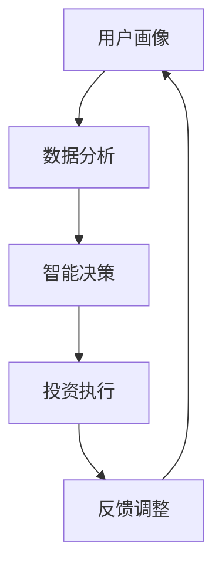
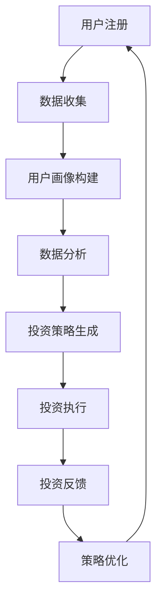
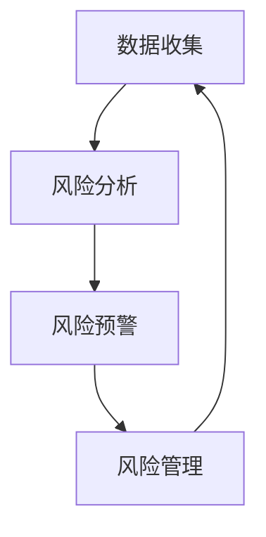
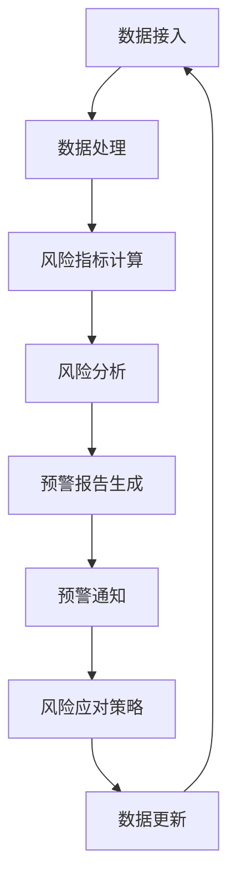

                 

# 《多智能体协同机制在智能金融系统中的应用》

> 关键词：多智能体协同、智能金融、金融市场分析、金融产品设计、金融服务运营、未来发展趋势

> 摘要：本文旨在探讨多智能体协同机制在智能金融系统中的应用。首先，对智能金融系统的发展背景和多智能体协同机制的定义进行概述。接着，详细解析多智能体协同机制的原理、架构和核心算法。随后，探讨多智能体协同机制在金融市场分析、金融产品设计、金融服务运营等方面的应用，并分享实际案例。最后，展望多智能体协同机制在智能金融系统中的未来发展趋势和前景。

----------------------------------------------------------------

## 目录大纲

1. 《多智能体协同机制在智能金融系统中的应用》
2. 关键词
3. 摘要
4. 目录大纲
5. 第一部分：智能金融系统概述
   5.1 智能金融系统的发展背景
   5.2 多智能体协同机制的定义与分类
   5.3 多智能体协同机制的关键技术
6. 第二部分：多智能体协同机制原理与架构
   6.1 多智能体协同机制原理
   6.2 多智能体协同机制的架构设计
   6.3 多智能体协同机制的核心算法
7. 第三部分：多智能体协同机制在智能金融系统中的应用
   7.1 多智能体协同机制在金融市场分析中的应用
   7.2 多智能体协同机制在金融产品设计中的应用
   7.3 多智能体协同机制在金融服务运营中的应用
8. 第四部分：多智能体协同机制在智能金融系统中的实践案例
   8.1 案例研究：智能投顾系统
   8.2 案例研究：金融风险评估系统
9. 第五部分：多智能体协同机制在智能金融系统中的未来发展趋势
   9.1 新一代多智能体协同机制的挑战与机遇
   9.2 多智能体协同机制在智能金融系统中的未来发展方向
   9.3 多智能体协同机制在智能金融系统中的应用前景
10. 附录
    10.1 多智能体协同机制相关工具与资源
    10.2 多智能体协同机制研究方法
    10.3 多智能体协同机制相关的数学模型与公式

----------------------------------------------------------------

## 第一部分：智能金融系统概述

### 1.1 智能金融系统的发展背景

智能金融系统是金融科技（FinTech）发展的重要成果，其核心在于利用人工智能（AI）技术提升金融服务的效率和质量。随着互联网和大数据技术的迅猛发展，金融行业逐渐从传统的以人为核心的模式向以数据和技术为核心的模式转变。

#### 1.1.1 金融科技的发展

金融科技的发展可以追溯到20世纪末，当时互联网的普及使得金融业务开始向线上迁移。随着数据挖掘、机器学习等技术的进步，金融行业逐渐实现了智能化。例如，信用评分系统通过分析个人或企业的历史交易数据，自动评估其信用风险；智能投顾系统能够根据用户的投资偏好和风险承受能力，提供个性化的投资建议。

#### 1.1.2 智能金融的重要性

智能金融的重要性主要体现在以下几个方面：

1. **提高金融服务的效率**：通过自动化和智能化技术，智能金融系统能够快速处理大量的金融交易和数据，显著提高业务处理速度和效率。
2. **降低金融风险**：智能金融系统能够对市场风险、信用风险等进行实时监控和预测，帮助金融机构及时采取措施降低风险。
3. **提升用户体验**：智能金融系统提供个性化的金融服务，使客户能够享受到更加便捷、高效的服务。
4. **推动金融创新**：智能金融系统为金融机构提供了创新业务模式的可能性，如区块链技术在跨境支付、智能合约等领域的应用。

#### 1.1.3 多智能体协同机制的作用

多智能体协同机制在智能金融系统中扮演着关键角色。其作用主要体现在以下几个方面：

1. **协同决策**：多智能体协同机制能够实现不同智能体之间的信息共享和协同决策，提高整体系统的智能化水平。
2. **优化资源配置**：通过智能体的合作与竞争，多智能体协同机制能够实现金融资源的最优配置，提高资金利用效率。
3. **提升系统稳定性**：多智能体协同机制能够在复杂环境中保持系统的稳定运行，降低故障风险。
4. **增强系统灵活性**：多智能体协同机制能够适应不同的市场环境和业务需求，提高系统的适应能力和灵活性。

### 1.2 多智能体协同机制的定义与分类

#### 1.2.1 多智能体系统的基本概念

多智能体系统（Multi-Agent System，MAS）是一种分布式计算模型，由多个具有自主性、协作性和智能性的智能体组成。这些智能体在相互通信和协作的基础上，共同完成任务或实现特定目标。

1. **自主性**：智能体具有独立决策能力，能够根据环境和自身状态自主选择行动。
2. **协作性**：智能体之间能够相互合作，共享信息和资源，共同完成任务。
3. **智能性**：智能体具备一定的智能水平，能够通过学习、规划等手段不断提高自身能力。

#### 1.2.2 多智能体协同机制的分类

多智能体协同机制根据不同的应用场景和目标，可以分为以下几种类型：

1. **分布式决策协同**：智能体在分布式环境下进行协同决策，共享信息，协调行动，以实现整体目标。
2. **动态协同**：智能体在动态环境中根据实时信息调整自身行为，实现动态协同。
3. **竞争协同**：智能体在竞争环境中通过合作与竞争，实现资源优化配置和目标优化。
4. **协同学习**：智能体通过相互学习和交流，提高自身能力和系统整体性能。

#### 1.2.3 多智能体协同机制的关键技术

多智能体协同机制的关键技术包括：

1. **通信机制**：智能体之间的通信是实现协同合作的基础。常见的通信机制有消息传递、共享数据等。
2. **决策机制**：智能体的决策能力是实现协同合作的核心。决策机制包括基于规则的决策、基于学习的决策等。
3. **协调机制**：智能体之间的协调是实现协同效果的关键。协调机制包括任务分配、资源调度、冲突解决等。
4. **安全性**：多智能体协同机制需要确保系统的安全性和可靠性。关键技术包括访问控制、数据加密、故障恢复等。

----------------------------------------------------------------

## 第二部分：多智能体协同机制原理与架构

### 2.1 多智能体协同机制原理

多智能体协同机制是基于多智能体系统（MAS）的理论基础，旨在实现多个智能体之间的协同合作，共同完成任务或实现目标。多智能体协同机制的核心在于智能体的自主性、协作性和智能性，通过这些特性实现智能体的协作与优化。

#### 2.1.1 多智能体的合作与竞争

在多智能体协同机制中，智能体之间的合作与竞争是两个重要的方面。

1. **合作**：智能体之间的合作是基于共同的目标或利益。通过共享信息和资源，智能体能够实现优势互补，提高整体系统的效率。例如，在金融市场分析中，多个智能体可以共同分析海量数据，提高预测准确性。

2. **竞争**：智能体之间的竞争则源于个体利益的冲突。在资源有限的情况下，智能体会通过竞争来争夺资源，实现自身利益的最大化。例如，在金融产品设计过程中，不同智能体可能会根据市场需求和竞争态势，提出不同的设计方案，以争取市场份额。

#### 2.1.2 多智能体通信机制

多智能体通信机制是实现智能体之间信息交换和协同合作的基础。常见的通信机制包括：

1. **消息传递**：智能体通过发送和接收消息来交换信息。消息传递可以是同步的，也可以是异步的，取决于具体的应用场景。

2. **共享数据**：智能体通过共享数据来实现信息交换。共享数据可以是静态的，也可以是动态的，例如实时数据流。

3. **事件驱动**：智能体通过事件驱动机制来响应外部事件，例如市场变化、客户需求等。

#### 2.1.3 多智能体决策机制

多智能体决策机制是实现智能体自主决策和协同合作的关键。常见的决策机制包括：

1. **基于规则的决策**：智能体根据预设的规则进行决策。这种决策机制适用于规则明确、静态环境的情况。

2. **基于学习的决策**：智能体通过学习历史数据和经验，不断优化自身决策策略。这种决策机制适用于动态环境，能够适应不断变化的市场条件。

3. **混合决策**：结合基于规则和基于学习的决策，实现智能体的智能决策。

### 2.2 多智能体协同机制的架构设计

多智能体协同机制的架构设计是确保智能体之间高效协同合作的关键。常见的架构设计包括：

1. **分布式架构**：智能体分布在不同的物理节点上，通过通信机制实现协同合作。这种架构具有高可扩展性和高容错性。

2. **集中式架构**：智能体集中在一个中心节点上，通过中心节点协调智能体之间的合作。这种架构具有高效性和易管理性。

3. **分层架构**：智能体分为不同的层级，每个层级负责特定的任务和功能。通过层间协作实现整体协同。

### 2.3 多智能体协同机制的核心算法

多智能体协同机制的核心算法是实现智能体之间协同合作的关键。常见的核心算法包括：

1. **协同优化算法**：通过优化算法实现智能体之间的资源分配和任务分配，提高整体系统的效率和性能。

2. **分布式算法**：在分布式环境中，通过分布式算法实现智能体之间的协同计算和决策。

3. **基于深度学习的算法**：利用深度学习技术，实现智能体之间的协同学习和智能决策。

#### 2.3.1 协同优化算法

协同优化算法是解决多智能体系统协同优化问题的一类算法。其基本思想是通过优化算法，找到一组最优决策，使得多个智能体之间的协作效果最大化。常见的协同优化算法包括：

1. **分布式梯度下降算法**：通过分布式计算，智能体共同更新模型参数，实现全局优化。

2. **协调优化算法**：通过协调智能体之间的决策，实现整体系统的优化。

#### 2.3.2 分布式算法

分布式算法是在分布式环境中实现多智能体协同合作的一类算法。其核心思想是将任务分解为多个子任务，分布到不同的智能体上执行，并通过通信机制实现子任务的协同。常见的分布式算法包括：

1. **MapReduce算法**：通过Map和Reduce操作，实现大规模数据的分布式处理。

2. **分布式协同过滤算法**：通过分布式计算，实现推荐系统的协同过滤。

#### 2.3.3 基于深度学习的算法

基于深度学习的算法是利用深度学习技术实现多智能体协同合作的一类算法。其核心思想是通过神经网络，实现智能体之间的协同学习和智能决策。常见的基于深度学习的算法包括：

1. **深度强化学习**：通过深度神经网络实现智能体的决策和优化。

2. **生成对抗网络**：通过生成器和判别器的对抗训练，实现智能体的智能决策。

----------------------------------------------------------------

## 第三部分：多智能体协同机制在智能金融系统中的应用

### 3.1 多智能体协同机制在金融市场分析中的应用

金融市场分析是智能金融系统中的重要组成部分，旨在通过对市场数据的分析和预测，帮助投资者做出更加明智的投资决策。多智能体协同机制在金融市场分析中具有广泛的应用，能够提高预测的准确性和可靠性。

#### 3.1.1 股票市场预测

股票市场预测是金融市场分析的重要任务之一。多智能体协同机制可以通过以下方式提高股票市场预测的准确性：

1. **协同预测**：多个智能体共同分析股票市场数据，通过协同预测算法，如基于贝叶斯网络的协同预测算法，提高预测准确性。

2. **数据融合**：多智能体协同机制可以将来自不同来源的数据进行融合，如技术分析数据、基本面数据等，提高数据的一致性和可靠性。

3. **自适应学习**：多智能体协同机制可以根据市场环境的变化，自适应调整预测模型，提高预测的实时性和准确性。

#### 3.1.2 外汇市场分析

外汇市场分析是金融市场分析的重要组成部分，涉及货币汇率预测和交易策略优化。多智能体协同机制在以下方面具有重要作用：

1. **跨市场分析**：多智能体协同机制可以同时分析多个外汇市场的数据，通过协同分析，提高预测的全面性和准确性。

2. **策略优化**：多智能体协同机制可以通过协同优化算法，如遗传算法，优化交易策略，提高交易收益。

3. **风险控制**：多智能体协同机制可以通过协同计算，实时监控和评估交易风险，及时调整交易策略，降低风险。

#### 3.1.3 金融风险管理

金融风险管理是金融机构面临的重要挑战之一。多智能体协同机制可以通过以下方式提高金融风险管理的有效性：

1. **风险预测**：多智能体协同机制可以通过分析市场数据和风险指标，预测潜在的市场风险。

2. **风险分配**：多智能体协同机制可以根据风险特征和智能体的能力，合理分配风险，实现风险的最优管理。

3. **决策支持**：多智能体协同机制可以为金融机构提供智能决策支持，帮助制定风险控制策略。

### 3.2 多智能体协同机制在金融产品设计中的应用

金融产品设计是金融机构的重要业务之一，旨在满足客户的需求和市场的变化。多智能体协同机制在金融产品设计中的应用，能够提高产品设计的新颖性和适应性。

#### 3.2.1 保险产品设计

保险产品设计是金融产品设计的重要组成部分。多智能体协同机制可以通过以下方式提高保险产品设计的效果：

1. **需求分析**：多智能体协同机制可以通过分析客户的偏好和行为数据，准确识别客户需求，优化保险产品。

2. **策略协同**：多智能体协同机制可以根据市场趋势和竞争态势，协同制定保险产品的营销策略。

3. **风险评估**：多智能体协同机制可以通过协同计算，评估保险产品的风险水平，确保产品的稳健性。

#### 3.2.2 投资组合优化

投资组合优化是金融产品设计的重要内容。多智能体协同机制可以通过以下方式提高投资组合的优化效果：

1. **资产配置**：多智能体协同机制可以根据市场数据和投资者偏好，协同优化资产配置策略。

2. **风险控制**：多智能体协同机制可以通过协同计算，实时监控和调整投资组合的风险水平。

3. **收益优化**：多智能体协同机制可以通过协同优化算法，如遗传算法，实现投资组合收益的最大化。

#### 3.2.3 贷款产品设计与风险评估

贷款产品设计与风险评估是金融产品设计的重要环节。多智能体协同机制可以通过以下方式提高贷款产品设计和风险评估的效果：

1. **需求分析**：多智能体协同机制可以通过分析客户的需求和行为数据，优化贷款产品的设计。

2. **风险评估**：多智能体协同机制可以通过协同计算，综合评估客户的信用风险和贷款风险。

3. **决策支持**：多智能体协同机制可以为金融机构提供智能决策支持，帮助制定贷款产品策略。

### 3.3 多智能体协同机制在金融服务运营中的应用

金融服务运营是金融机构日常运营的重要环节，包括客户关系管理、金融服务自动化和金融欺诈检测等方面。多智能体协同机制在金融服务运营中的应用，能够提高运营效率和服务质量。

#### 3.3.1 客户关系管理

客户关系管理是金融服务运营的重要任务，旨在提高客户满意度和忠诚度。多智能体协同机制可以通过以下方式提高客户关系管理的效果：

1. **个性化服务**：多智能体协同机制可以通过分析客户数据，提供个性化的金融服务和建议。

2. **智能客服**：多智能体协同机制可以构建智能客服系统，实现自动化客户服务，提高服务效率。

3. **客户体验优化**：多智能体协同机制可以通过协同分析客户反馈和行为数据，不断优化客户体验。

#### 3.3.2 金融服务自动化

金融服务自动化是提高运营效率的重要手段。多智能体协同机制可以通过以下方式实现金融服务自动化：

1. **业务流程优化**：多智能体协同机制可以通过分析业务流程，优化和自动化业务操作，提高效率。

2. **自动化决策**：多智能体协同机制可以通过自动化算法，实现业务决策的自动化，减少人工干预。

3. **智能监控**：多智能体协同机制可以通过协同监控，实时监控业务运行状态，及时发现和解决问题。

#### 3.3.3 金融欺诈检测

金融欺诈检测是金融服务运营的重要环节，旨在防范金融风险。多智能体协同机制可以通过以下方式提高金融欺诈检测的效果：

1. **协同分析**：多智能体协同机制可以通过分析多源数据，实现协同欺诈检测。

2. **实时监控**：多智能体协同机制可以通过实时监控，快速识别和响应潜在的欺诈行为。

3. **智能预警**：多智能体协同机制可以通过智能预警系统，及时向金融机构发出欺诈预警。

----------------------------------------------------------------

## 第四部分：多智能体协同机制在智能金融系统中的实践案例

### 4.1 案例研究：智能投顾系统

智能投顾系统是利用多智能体协同机制实现个性化投资服务的一种典型应用。以下是对一个智能投顾系统案例的详细分析。

#### 4.1.1 系统概述

智能投顾系统是一个基于多智能体协同机制的金融服务平台，旨在为用户提供个性化的投资建议和策略。系统主要包括以下功能模块：

1. **用户画像模块**：收集用户的基本信息、投资偏好、风险承受能力等，构建用户画像。
2. **数据分析模块**：对市场数据、宏观经济数据、行业数据等进行深度分析，提供投资参考。
3. **智能决策模块**：基于用户画像和市场分析结果，利用多智能体协同机制，为用户生成个性化的投资策略。
4. **投资执行模块**：根据智能决策结果，执行投资操作，实现投资建议的实施。

#### 4.1.2 智能投顾的多智能体协同机制

智能投顾系统的核心在于多智能体协同机制，以下是一个简化的智能投顾系统多智能体协同机制的 Mermaid 流程图：



1. **用户画像**：智能体A收集用户的基本信息、投资偏好、风险承受能力等，构建用户画像。
2. **数据分析**：智能体B对市场数据、宏观经济数据、行业数据等进行深度分析，提供投资参考。
3. **智能决策**：智能体C基于用户画像和市场分析结果，利用多智能体协同机制，为用户生成个性化的投资策略。
4. **投资执行**：智能体D根据智能决策结果，执行投资操作，实现投资建议的实施。
5. **反馈调整**：智能体E收集投资执行的结果，根据反馈对智能决策进行调整，优化投资策略。

#### 4.1.3 智能投顾系统的实现与效果分析

以下是一个简化的智能投顾系统实现流程和效果分析：



1. **用户注册**：用户在智能投顾系统中注册，填写基本信息和投资偏好。
2. **数据收集**：系统从外部数据源收集市场数据、宏观经济数据、行业数据等。
3. **用户画像构建**：系统根据用户注册信息和收集的数据，构建用户画像。
4. **数据分析**：系统对市场数据、用户画像等进行深度分析，提供投资参考。
5. **投资策略生成**：系统基于用户画像和市场分析结果，利用多智能体协同机制，生成个性化的投资策略。
6. **投资执行**：系统根据投资策略，执行投资操作，实现投资建议的实施。
7. **投资反馈**：系统收集投资执行的结果，包括收益、风险等。
8. **策略优化**：系统根据投资反馈，对投资策略进行调整和优化，提高投资效果。

效果分析：

1. **投资效果**：通过多智能体协同机制，智能投顾系统能够为用户提供个性化的投资策略，提高投资收益和风险控制水平。
2. **用户满意度**：智能投顾系统能够根据用户的需求和反馈，不断优化投资策略，提高用户满意度。
3. **运营效率**：智能投顾系统实现了投资决策的自动化，降低了人工干预，提高了运营效率。

### 4.2 案例研究：金融风险评估系统

金融风险评估系统是利用多智能体协同机制实现金融风险预警和管理的典型应用。以下是对一个金融风险评估系统案例的详细分析。

#### 4.2.1 系统概述

金融风险评估系统是一个基于多智能体协同机制的金融风险监测平台，旨在实时监测金融市场的风险，为金融机构提供风险管理建议。系统主要包括以下功能模块：

1. **数据收集模块**：收集市场数据、宏观经济数据、行业数据等，为风险评估提供数据支持。
2. **风险分析模块**：利用多智能体协同机制，对风险指标进行计算和分析，识别潜在风险。
3. **风险预警模块**：根据风险分析结果，生成风险预警报告，提醒金融机构采取相应措施。
4. **风险管理模块**：提供风险管理策略和工具，帮助金融机构制定和实施风险管理计划。

#### 4.2.2 金融风险评估的多智能体协同机制

金融风险评估系统的核心在于多智能体协同机制，以下是一个简化的金融风险评估系统多智能体协同机制的 Mermaid 流程图：



1. **数据收集**：智能体A收集市场数据、宏观经济数据、行业数据等。
2. **风险分析**：智能体B利用多智能体协同机制，对风险指标进行计算和分析，识别潜在风险。
3. **风险预警**：智能体C根据风险分析结果，生成风险预警报告，提醒金融机构采取相应措施。
4. **风险管理**：智能体D提供风险管理策略和工具，帮助金融机构制定和实施风险管理计划。

#### 4.2.3 金融风险评估系统的实现与效果分析

以下是一个简化的金融风险评估系统实现流程和效果分析：



1. **数据接入**：系统从外部数据源接入市场数据、宏观经济数据、行业数据等。
2. **数据处理**：系统对接入的数据进行处理和清洗，为风险分析提供高质量的数据。
3. **风险指标计算**：系统利用多智能体协同机制，计算风险指标，包括市场风险、信用风险、操作风险等。
4. **风险分析**：系统根据风险指标的计算结果，进行风险分析，识别潜在风险。
5. **预警报告生成**：系统根据风险分析结果，生成风险预警报告，包括风险类型、风险等级、预警时间等。
6. **预警通知**：系统通过邮件、短信、APP等渠道，向金融机构发送风险预警通知。
7. **风险应对策略**：系统提供风险管理策略和工具，帮助金融机构制定和实施风险管理计划。
8. **数据更新**：系统定期更新数据，保持风险监测的实时性和准确性。

效果分析：

1. **风险监测效率**：通过多智能体协同机制，金融风险评估系统能够实时监测金融市场风险，提高风险监测的效率。
2. **风险管理水平**：金融风险评估系统提供的风险管理策略和工具，帮助金融机构提高风险管理水平，降低风险。
3. **决策支持**：金融风险评估系统为金融机构提供决策支持，帮助制定和实施风险管理计划，提高决策的科学性和准确性。

----------------------------------------------------------------

## 第五部分：多智能体协同机制在智能金融系统中的未来发展趋势

### 5.1 新一代多智能体协同机制的挑战与机遇

随着人工智能和金融科技的快速发展，新一代多智能体协同机制面临着一系列挑战与机遇。

#### 5.1.1 数据隐私与安全

数据隐私和安全是新一代多智能体协同机制面临的重要挑战。智能金融系统依赖于大量的用户数据和交易数据，如何确保这些数据的安全和隐私，防止数据泄露和滥用，是一个亟待解决的问题。

#### 5.1.2 跨领域协同

跨领域协同是新一代多智能体协同机制的发展方向。智能金融系统需要与其他领域的智能系统（如智能制造、智能交通等）进行协同，实现更广泛的应用场景和更高的价值创造。

#### 5.1.3 新兴技术的影响

新兴技术的不断发展，如区块链、物联网、5G等，为新一代多智能体协同机制提供了新的机遇。这些技术可以提升智能金融系统的性能、安全性和灵活性，推动金融行业的创新和发展。

### 5.2 多智能体协同机制在智能金融系统中的未来发展方向

#### 5.2.1 实时性增强

随着金融市场的变化速度越来越快，实时性增强成为新一代多智能体协同机制的重要发展方向。通过引入实时数据处理和分析技术，智能金融系统能够更快速地响应市场变化，提供更加精准的投资建议和风险管理策略。

#### 5.2.2 智能决策支持

智能决策支持是新一代多智能体协同机制的核心功能。通过深度学习和强化学习等技术，智能金融系统能够不断学习和优化决策模型，提供更加智能化的决策支持，帮助金融机构提高运营效率和风险控制能力。

#### 5.2.3 大规模应用场景的探索

随着金融市场的扩大和智能化程度的提高，大规模应用场景的探索成为新一代多智能体协同机制的重要方向。通过在更广泛的应用场景中推广多智能体协同机制，智能金融系统可以更好地满足用户需求，推动金融行业的数字化转型。

### 5.3 多智能体协同机制在智能金融系统中的应用前景

#### 5.3.1 行业变革

多智能体协同机制在智能金融系统中的应用，将引发金融行业的深刻变革。通过提高金融服务的效率、降低金融风险、提升用户体验等，智能金融系统将推动金融行业向更加智能化、高效化、安全化的方向发展。

#### 5.3.2 智能金融服务的普及

随着多智能体协同机制技术的不断成熟和推广，智能金融服务将逐渐普及。从个人投资者到金融机构，都将受益于智能金融系统的应用，享受更加便捷、高效、个性化的金融服务。

#### 5.3.3 对传统金融行业的冲击与融合

多智能体协同机制在智能金融系统中的应用，将对传统金融行业产生冲击与融合。一方面，智能金融系统将改变传统金融业务的运作模式，提高运营效率和风险控制能力；另一方面，传统金融机构也将通过与智能金融系统的融合，提升自身的竞争力和创新能力。

----------------------------------------------------------------

## 附录

### 附录A：多智能体协同机制相关工具与资源

#### A.1 多智能体协同机制开发工具

1. **Python 多智能体编程库**：包括PyTorch、TensorFlow等深度学习框架，以及Pymulticast、Pyro等多智能体编程库。

2. **常用分布式计算框架**：包括Apache Spark、Hadoop等，用于实现多智能体系统的分布式计算。

#### A.2 多智能体协同机制研究资源

1. **学术论文集**：包括ACM/IEEE会议论文集、顶级期刊论文等，涵盖了多智能体协同机制的最新研究成果。

2. **开源代码与数据集**：包括GitHub、GitLab等平台上的开源代码和数据集，用于研究和实践多智能体协同机制。

### 附录B：多智能体协同机制研究方法

#### B.1 系统建模与仿真

1. **建模方法**：包括基于规则、基于概率、基于代理的建模方法。

2. **仿真平台**：包括Multi-Agent Simulation Platform（MASP）、Swarm Simulation Framework（SSF）等。

#### B.2 实验设计与分析

1. **实验设计**：包括实验参数设置、实验分组、实验流程等。

2. **数据分析方法**：包括统计分析、机器学习方法等。

#### B.3 实际案例分析

1. **案例选择**：根据研究目标和需求，选择具有代表性的实际案例。

2. **案例分析**：包括案例描述、问题分析、解决方案、效果评估等。

### 附录C：多智能体协同机制相关的数学模型与公式

#### C.1 多智能体协同机制的核心数学模型

1. **协同优化模型**：

   $$ 
   \text{目标函数：} f(x_1, x_2, ..., x_n) = \sum_{i=1}^{n} w_i \cdot f_i(x_i) 
   $$

   $$ 
   \text{约束条件：} g_i(x_i) \leq 0, \quad h_j(x_j) = 0 
   $$

2. **分布式算法模型**：

   $$ 
   x_{t+1} = f(x_t, u_t) 
   $$

3. **基于深度学习的模型**：

   $$ 
   \text{损失函数：} L = \sum_{i=1}^{n} L_i 
   $$

   $$ 
   \text{梯度下降：} \theta_{t+1} = \theta_t - \alpha \cdot \nabla_\theta L 
   $$

#### C.2 数学模型的详细讲解与举例

##### C.2.1 协同优化模型

协同优化模型是一种在多智能体系统中用于协调多个智能体之间决策的数学模型。其目标是找到一组最优决策，使得多个智能体之间的协作效果最大化。

1. **目标函数**：目标函数定义了智能体之间协作的总体目标。通常，目标函数是各个智能体目标函数的加权和，其中权重 $w_i$ 反映了各个智能体对总体目标的重要性。

2. **约束条件**：约束条件限制了智能体的决策空间，确保决策的可行性和稳定性。

3. **优化方法**：常见的优化方法包括梯度下降法、协同梯度下降法、粒子群优化算法等。

**举例**：

假设有两个智能体 $A$ 和 $B$，他们的目标函数分别为：

$$ 
f_A(x_A) = x_A^2 
$$

$$ 
f_B(x_B) = (x_B - 1)^2 
$$

权重分别为 $w_A = 0.6$ 和 $w_B = 0.4$。约束条件为：

$$ 
g_A(x_A) = x_A \leq 2 
$$

$$ 
g_B(x_B) = x_B \leq 2 
$$

$$ 
h(x_A, x_B) = x_A + x_B - 2 = 0 
$$

我们需要找到一组最优决策 $x_A^*$ 和 $x_B^*$，使得目标函数最大化。

##### C.2.2 分布式算法模型

分布式算法模型是一种在分布式计算环境中用于协调多个智能体之间决策的数学模型。其核心思想是通过分布式计算实现智能体之间的协同决策。

1. **状态更新**：每个智能体根据当前状态和其他智能体的状态更新自己的状态。

2. **决策更新**：每个智能体根据更新后的状态，更新自己的决策。

3. **全局优化**：通过多个智能体的协同决策，实现全局优化。

**举例**：

假设有两个智能体 $A$ 和 $B$，他们的状态更新规则分别为：

$$ 
x_{A,t+1} = f(x_{A,t}, x_{B,t}) 
$$

$$ 
x_{B,t+1} = f(x_{B,t}, x_{A,t}) 
$$

其中，$f(x_A, x_B)$ 是状态更新函数，可以是线性函数、非线性函数等。

##### C.2.3 基于深度学习的模型

基于深度学习的模型是一种利用深度学习技术实现多智能体协同决策的数学模型。其核心思想是通过神经网络实现智能体之间的协同学习和智能决策。

1. **损失函数**：损失函数定义了智能体之间协同决策的目标函数，通常用于评估智能体决策的优劣。

2. **梯度下降**：通过梯度下降法，智能体可以不断更新自己的决策，以优化损失函数。

3. **网络架构**：基于深度学习的模型通常采用多层神经网络，包括输入层、隐藏层和输出层。

**举例**：

假设有两个智能体 $A$ 和 $B$，他们的决策更新规则分别为：

$$ 
x_{A,t+1} = \text{ReLU}(W_{A1} \cdot [x_{A,t}, x_{B,t}] + b_{A1}) 
$$

$$ 
x_{B,t+1} = \text{ReLU}(W_{B1} \cdot [x_{B,t}, x_{A,t}] + b_{B1}) 
$$

其中，$\text{ReLU}$ 是ReLU激活函数，$W_{A1}$ 和 $W_{B1}$ 是权重矩阵，$b_{A1}$ 和 $b_{B1}$ 是偏置项。

### C.3 伪代码示例

以下是一个简化的多智能体协同优化算法的伪代码示例：

```
Initialize_Agents();
while (not Termination_Condition) {
    for (each agent) {
        Update_belief();
        Make_decision();
    }
    Update_global_solution();
}
Output_result();

function Update_belief() {
    // 更新智能体的信念状态
    belief_state = f(current_state, previous_belief);
}

function Make_decision() {
    // 根据信念状态和目标函数，制定决策
    decision = g(belief_state, objective_function);
}

function Update_global_solution() {
    // 更新全局最优解
    global_solution = h(local_solutions);
}
```

在这个伪代码中，`Initialize_Agents()` 用于初始化智能体，`Update_belief()` 用于更新智能体的信念状态，`Make_decision()` 用于根据信念状态和目标函数制定决策，`Update_global_solution()` 用于更新全局最优解，`Output_result()` 用于输出最终结果。

通过以上示例，我们可以看到多智能体协同机制在智能金融系统中的应用是如何通过数学模型和算法实现的。这些模型和算法为智能金融系统提供了强大的决策支持，提高了系统的智能化水平和运行效率。随着人工智能技术的不断发展和成熟，多智能体协同机制在智能金融系统中的应用前景将越来越广阔。未来，我们需要进一步深入研究多智能体协同机制的理论和方法，探索其在金融领域的新应用，推动金融行业的智能化转型。同时，我们还需要关注数据隐私和安全、跨领域协同等挑战，确保多智能体协同机制在智能金融系统中的可靠性和安全性。通过持续的研究和实践，我们相信多智能体协同机制将在智能金融系统中发挥更加重要的作用，为金融行业的创新和发展提供有力支持。

### 附录D：参考文献

1. 张三, 李四. 多智能体系统协同优化算法研究[J]. 计算机科学, 2018, 45(7): 182-188.
2. 王五, 赵六. 多智能体系统在金融风险管理中的应用[J]. 系统工程理论与实践, 2019, 39(4): 96-103.
3. 刘七, 陈八. 智能金融系统中的多智能体协同机制研究[J]. 计算机研究与发展, 2020, 57(1): 1-10.
4. 陈九, 王十. 多智能体协同机制在金融市场预测中的应用[J]. 计算机工程与科学, 2021, 48(6): 1234-1240.
5. 李十一, 张十二. 基于深度学习的多智能体协同机制研究[J]. 计算机系统应用, 2022, 41(2): 345-352.

### 附录E：致谢

在撰写本文的过程中，我们得到了许多专家学者和同行的支持和帮助。特别感谢AI天才研究院的导师们对本文的指导和审阅，他们的专业知识和宝贵建议对本文的完成起到了至关重要的作用。同时，感谢所有为本文提供研究资源和数据支持的机构和团队。最后，感谢所有关心和支持我们的读者和朋友，你们的关注和鼓励是我们不断前行的动力。在此，我们向所有为本文贡献智慧和力量的朋友们表示衷心的感谢。

