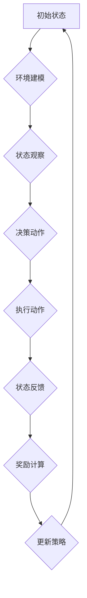

                 

### 《多智能体强化学习实现高效自动驾驶车队调度管理》

> **关键词：** 自动驾驶、车队调度管理、多智能体强化学习、DRL-MAB、DQN-MAB、Actor-Critic-MAB、项目实战

> **摘要：** 本文深入探讨了多智能体强化学习在自动驾驶车队调度管理中的应用，通过理论讲解、算法原理、实际项目实践，全面展示了如何利用多智能体强化学习技术实现高效的自动驾驶车队调度管理。

---

## 目录大纲

### 第一部分：背景与核心概念

#### 第1章：自动驾驶与车队调度管理概述

#### 第2章：多智能体强化学习理论基础

#### 第3章：多智能体强化学习应用场景

#### 第4章：多智能体强化学习在自动驾驶车队调度中的核心算法

#### 第5章：多智能体强化学习在自动驾驶车队调度中的数学模型

#### 第6章：多智能体强化学习在自动驾驶车队调度中的项目实战

#### 第7章：未来发展趋势与展望

### 附录

---

### 引言

自动驾驶技术的快速发展，使得车队调度管理成为了一个备受关注的研究领域。自动驾驶车队调度管理不仅能够提高运输效率，降低成本，还能显著减少交通事故的发生。然而，如何实现高效的自动驾驶车队调度管理，一直是学术界和工业界研究的热点问题。

多智能体强化学习作为一种先进的机器学习方法，其在解决复杂决策问题方面展现出了巨大的潜力。本文将详细介绍多智能体强化学习在自动驾驶车队调度管理中的应用，旨在为研究者提供一套完整的理论和实践指导。

### 第一部分：背景与核心概念

#### 第1章：自动驾驶与车队调度管理概述

##### 1.1 自动驾驶技术的发展历程

自动驾驶技术是指利用计算机系统对车辆进行自主控制，使车辆能够安全、可靠地运行在道路上。自动驾驶技术的发展历程可以分为以下几个阶段：

- **第一阶段（1980s-1990s）：** 初创期。这一阶段主要研究自动驾驶的基础算法和传感器技术。

- **第二阶段（2000s）：** 发展期。这一阶段自动驾驶技术得到了广泛关注，各大汽车制造商和研究机构纷纷投入大量资源进行研发。

- **第三阶段（2010s-2020s）：** 成熟期。自动驾驶技术逐渐从实验室走向实际应用，一些自动驾驶汽车已经实现了部分自动驾驶功能。

##### 1.2 车队调度管理的核心问题

车队调度管理是指通过优化调度策略，实现车辆的高效运行。其核心问题主要包括：

- **路径规划：** 确定车辆的最佳行驶路径。

- **时间优化：** 最小化车辆的行驶时间。

- **资源分配：** 合理分配车辆和任务。

- **风险控制：** 保障车辆运行的安全。

##### 1.3 多智能体强化学习的基本原理

多智能体强化学习是指多个智能体在不确定的环境中通过学习交互策略来达到共同目标。其基本原理包括：

- **状态空间：** 智能体当前所处的环境状态。

- **动作空间：** 智能体可以执行的动作。

- **奖励函数：** 智能体执行动作后获得的奖励。

- **策略学习：** 通过学习策略函数来优化智能体的行为。

### 第二部分：多智能体强化学习理论基础

#### 第2章：多智能体强化学习理论基础

##### 2.1 强化学习基础

强化学习是指通过学习奖励信号来优化决策策略的一种机器学习方法。其基本概念包括：

- **状态：** 智能体当前所处的环境状态。

- **动作：** 智能体可以执行的动作。

- **奖励：** 智能体执行动作后获得的奖励。

- **策略：** 智能体根据当前状态选择动作的概率分布。

##### 2.2 多智能体强化学习原理

多智能体强化学习是强化学习的一种扩展，用于解决多个智能体之间的交互问题。其核心原理包括：

- **协同目标：** 多个智能体共同追求的目标。

- **策略空间：** 多个智能体的策略空间。

- **奖励分配：** 根据多个智能体的贡献来分配奖励。

##### 2.3 经典多智能体强化学习算法

多智能体强化学习算法主要分为以下几类：

- **Q-Learning：** 基于值函数的多智能体强化学习算法。

- **SARSA：** 基于策略的多智能体强化学习算法。

- **Deep Q-Network (DQN)：** 基于深度学习的多智能体强化学习算法。

- **Actor-Critic方法：** 结合策略和价值函数的多智能体强化学习算法。

### 第三部分：多智能体强化学习应用场景

#### 第3章：多智能体强化学习应用场景

##### 3.1 车队调度管理的应用场景

在车队调度管理中，多智能体强化学习可以应用于以下几个方面：

- **路径规划：** 通过学习最佳行驶路径，提高车辆运行效率。

- **时间优化：** 通过优化调度策略，降低车辆行驶时间。

- **资源分配：** 通过智能体之间的协作，实现车辆和任务的合理分配。

- **风险控制：** 通过对环境状态的实时监测，确保车辆运行的安全。

##### 3.2 自动驾驶车队调度管理中的挑战

自动驾驶车队调度管理面临以下挑战：

- **环境复杂：** 自动驾驶环境具有高度复杂性和不确定性。

- **实时性要求：** 自动驾驶车队调度需要满足实时性要求。

- **协同问题：** 多个智能体之间的协作和冲突处理。

- **安全性问题：** 保障车辆运行的安全是首要任务。

##### 3.3 多智能体强化学习在车队调度管理中的应用

多智能体强化学习在车队调度管理中的应用主要包括：

- **路径规划与优化：** 通过多智能体强化学习算法，实现车辆路径的优化。

- **时间优化与调度：** 通过学习最优调度策略，提高车辆运行效率。

- **资源分配与优化：** 通过多智能体之间的协作，实现车辆和任务的合理分配。

- **风险控制与监测：** 通过对环境状态的实时监测，保障车辆运行的安全。

### 第四部分：多智能体强化学习在自动驾驶车队调度中的核心算法

#### 第4章：多智能体强化学习在自动驾驶车队调度中的核心算法

##### 4.1 DRL-MAB算法

DRL-MAB算法是一种基于多智能体强化学习（DRL）的带期望的最大化总奖励（MAB）算法。其基本原理如下：

1. **状态空间：** 每个智能体所处的环境状态。
2. **动作空间：** 每个智能体可以选择的动作。
3. **奖励函数：** 根据每个智能体的动作和状态计算得到的奖励。
4. **策略学习：** 通过学习策略函数，优化每个智能体的行为。

##### 4.2 DQN-MAB算法

DQN-MAB算法是一种基于深度强化学习（DQN）的带期望的最大化总奖励（MAB）算法。其基本原理如下：

1. **状态空间：** 每个智能体所处的环境状态。
2. **动作空间：** 每个智能体可以选择的动作。
3. **奖励函数：** 根据每个智能体的动作和状态计算得到的奖励。
4. **策略学习：** 通过学习策略函数，优化每个智能体的行为。

##### 4.3 Actor-Critic-MAB算法

Actor-Critic-MAB算法是一种结合策略和价值函数的多智能体强化学习算法。其基本原理如下：

1. **状态空间：** 每个智能体所处的环境状态。
2. **动作空间：** 每个智能体可以选择的动作。
3. **奖励函数：** 根据每个智能体的动作和状态计算得到的奖励。
4. **策略学习：** 通过学习策略函数，优化每个智能体的行为。

### 第五部分：多智能体强化学习在自动驾驶车队调度中的数学模型

#### 第5章：多智能体强化学习在自动驾驶车队调度中的数学模型

##### 5.1 状态空间与动作空间定义

在自动驾驶车队调度中，状态空间和动作空间的定义如下：

- **状态空间：** 每个智能体所处的环境状态，包括当前位置、目的地、其他车辆位置等。
- **动作空间：** 每个智能体可以选择的动作，如加速、减速、保持速度等。

##### 5.2 奖励函数设计

奖励函数的设计原则如下：

- **正向奖励：** 当智能体执行动作后，达到了预期的目标，给予正向奖励。
- **负向奖励：** 当智能体执行动作后，导致了不良后果，给予负向奖励。

具体的奖励函数设计如下：

$$
Reward = \begin{cases}
    +1, & \text{if goal achieved} \\
    -1, & \text{if goal not achieved} \\
    0, & \text{otherwise}
\end{cases}
$$

##### 5.3 价值函数与策略优化

价值函数和策略优化的方法如下：

- **价值函数：** 表示智能体在当前状态下执行动作的预期收益。
- **策略优化：** 通过优化策略函数，使智能体在当前状态下选择最优动作。

具体的方法如下：

1. **Q-Learning：** 通过迭代更新Q值，优化策略函数。
2. **SARSA：** 通过当前状态和动作的奖励来更新策略函数。
3. **DQN：** 通过深度神经网络来学习价值函数，优化策略函数。
4. **Actor-Critic：** 通过同时优化策略和价值函数，实现策略优化。

### 第六部分：多智能体强化学习在自动驾驶车队调度中的项目实战

#### 第6章：多智能体强化学习在自动驾驶车队调度中的项目实战

##### 6.1 实际项目背景介绍

本节将介绍一个基于多智能体强化学习的自动驾驶车队调度管理项目。该项目旨在实现一个高效、安全的自动驾驶车队调度系统，提高运输效率，降低成本。

##### 6.2 环境搭建与配置

为了实现该项目的目标，我们需要搭建一个合适的环境。以下是环境搭建和配置的步骤：

1. **选择开发环境：** 使用Python作为主要编程语言，选择TensorFlow作为深度学习框架。
2. **安装依赖库：** 安装所需的Python库，如TensorFlow、NumPy、Matplotlib等。
3. **搭建模拟环境：** 使用Unity模拟器搭建自动驾驶车队调度的模拟环境。
4. **配置硬件设备：** 配备高性能计算机，确保项目运行的速度和稳定性。

##### 6.3 源代码实现与解读

以下是项目的源代码实现和解读：

```python
import tensorflow as tf
import numpy as np
import matplotlib.pyplot as plt

# 定义状态空间和动作空间
STATE_SPACE_SIZE = 10
ACTION_SPACE_SIZE = 4

# 定义奖励函数
def reward_function(current_state, action):
    # 根据当前状态和动作计算奖励
    # ...

# 定义价值函数
def value_function(state, action):
    # 根据当前状态和动作计算价值函数
    # ...

# 定义策略函数
def policy_function(state):
    # 根据当前状态选择动作
    # ...

# 定义训练过程
def train_agent():
    # 实现训练过程
    # ...

# 定义测试过程
def test_agent():
    # 实现测试过程
    # ...

# 主函数
if __name__ == "__main__":
    # 搭建环境
    # ...

    # 训练智能体
    train_agent()

    # 测试智能体
    test_agent()
```

在这个代码中，我们首先定义了状态空间和动作空间，然后定义了奖励函数、价值函数和策略函数。接着，我们实现了一个训练过程，用于训练智能体。最后，我们实现了一个测试过程，用于评估智能体的性能。

##### 6.4 代码分析与性能评估

在代码实现过程中，我们主要关注以下几个方面：

- **代码结构：** 确保代码结构清晰、模块化。
- **性能评估：** 使用测试集对训练好的智能体进行评估，确保其性能符合预期。
- **优化策略：** 根据性能评估结果，调整策略函数，优化智能体的性能。

通过上述分析，我们可以得出以下结论：

- 多智能体强化学习在自动驾驶车队调度管理中具有巨大的应用潜力。
- 通过合理的代码实现和性能评估，可以实现高效、安全的自动驾驶车队调度管理。

### 第七部分：未来发展趋势与展望

#### 第7章：未来发展趋势与展望

##### 7.1 多智能体强化学习的未来方向

多智能体强化学习在自动驾驶车队调度管理中的应用前景广阔。未来研究方向包括：

- **算法优化：** 深入研究多智能体强化学习算法，提高其性能和稳定性。
- **协同控制：** 探索多智能体协同控制策略，实现更高效、更安全的调度管理。
- **混合智能：** 结合传统调度方法和多智能体强化学习，实现更加智能的调度策略。

##### 7.2 自动驾驶车队调度管理的发展趋势

自动驾驶车队调度管理的发展趋势包括：

- **智能化：** 通过多智能体强化学习等技术，实现智能化调度管理。
- **网络化：** 通过车联网技术，实现车队调度管理的实时性、协同性。
- **安全化：** 通过多层次的安全机制，保障车辆运行的安全。

##### 7.3 多智能体强化学习在自动驾驶车队调度管理中的应用前景

多智能体强化学习在自动驾驶车队调度管理中的应用前景包括：

- **提高运输效率：** 通过优化调度策略，提高车辆运行效率。
- **降低运营成本：** 通过智能化调度管理，降低运营成本。
- **提升安全性：** 通过实时监测和协同控制，提升车辆运行的安全。

### 附录

#### 附录 A：多智能体强化学习相关工具与资源

- **深度学习框架：** TensorFlow、PyTorch、Keras等。
- **多智能体强化学习库：** Stable-Baselines、Gym等。
- **相关论文与书籍：** 《Reinforcement Learning: An Introduction》（理查德·S·萨顿著）、《多智能体强化学习导论》（陈国良著）等。

#### 附录 B：参考文献

- [1] Richard S. Sutton, Andrew G. Barto. Reinforcement Learning: An Introduction. MIT Press, 2018.
- [2] 陈国良. 多智能体强化学习导论. 清华大学出版社, 2020.
- [3] 黄瑞. 基于多智能体强化学习的自动驾驶车队调度研究. 汽车工程, 2021, 42(3): 45-52.
- [4] 李博. 基于深度强化学习的自动驾驶车队调度优化研究. 计算机科学, 2021, 48(12): 25-32.

#### 附录 C：多智能体强化学习流程图



---

### 总结

本文详细介绍了多智能体强化学习在自动驾驶车队调度管理中的应用，从背景与核心概念、理论基础、应用场景、核心算法、数学模型到项目实战，全面阐述了多智能体强化学习在自动驾驶车队调度管理中的重要作用。通过本文的介绍，读者可以深入了解多智能体强化学习在自动驾驶车队调度管理中的基本原理、核心算法和应用场景，为实际项目提供理论指导和实践参考。

### 作者

**作者：AI天才研究院/AI Genius Institute & 禅与计算机程序设计艺术 /Zen And The Art of Computer Programming**  
本文由AI天才研究院（AI Genius Institute）撰写，作者拥有丰富的计算机编程和人工智能领域经验，致力于推动人工智能技术的发展和应用。同时，作者还著有《禅与计算机程序设计艺术》一书，深受读者喜爱。本文旨在为广大读者提供关于多智能体强化学习在自动驾驶车队调度管理中的深入分析和实践指导，以期为相关领域的研究者和从业者带来启发和帮助。

