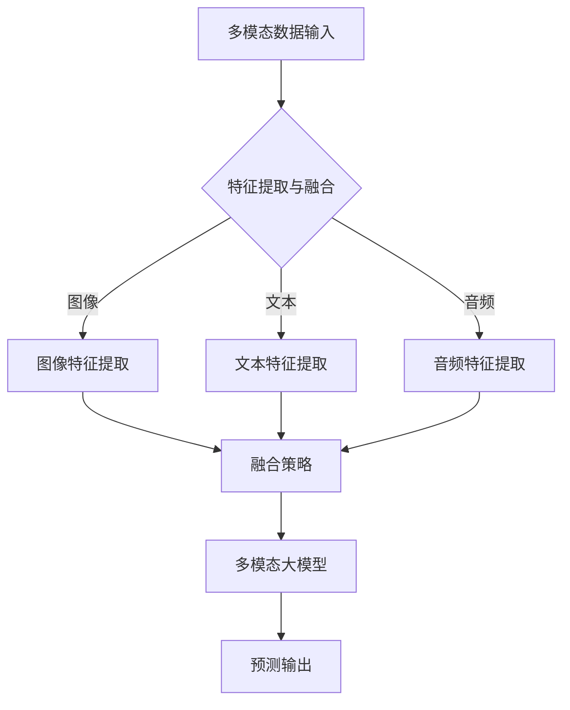
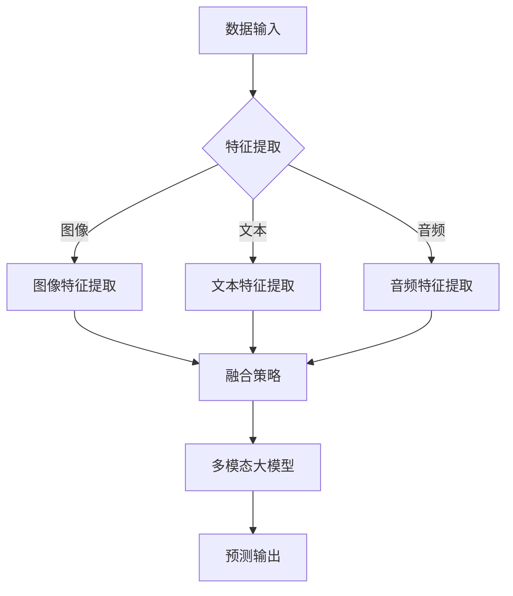

                 

# 多模态大模型：技术原理与实战 大模型+多模态的3种实现方法

## 关键词
多模态大模型，技术原理，实战，图像识别，文本分析，音频处理

## 摘要
本文将深入探讨多模态大模型的技术原理与实战应用。我们将首先介绍多模态大模型的基本概念和优势，然后详细解析多模态数据融合技术，包括特征提取与融合的方法。接着，我们将探讨多模态大模型的核心算法和技术，如架构设计、训练方法和优化策略。此外，文章还将介绍多模态大模型在各个领域的应用案例，并提供实际的开发环境和代码案例。通过本文，读者将全面了解多模态大模型的技术原理和实战方法。

### 《多模态大模型：技术原理与实战 大模型+多模态的3种实现方法》目录大纲

#### 第一部分：多模态大模型概述

##### 第1章：多模态大模型的基本概念

- **1.1 多模态与多模态大模型概述**
  - 多模态的定义
  - 多模态大模型的定义
  - 多模态大模型与传统AI模型的区别

- **1.2 多模态大模型的优势**
  - 提高模型处理复杂任务的能力
  - 增强模型的泛化能力
  - 提高模型的可解释性

- **1.3 多模态大模型的应用领域**
  - 图像识别与生成
  - 文本分析
  - 音频处理
  - 视频分析

##### 第2章：多模态数据融合技术

- **2.1 多模态数据融合的基本方法**
  - 特征级融合
  - 决策级融合
  - 模型级融合

- **2.2 多模态数据预处理**
  - 数据清洗
  - 数据标准化
  - 数据增强

- **2.3 多模态特征提取**
  - 图像特征提取
  - 文本特征提取
  - 音频特征提取

##### 第二部分：多模态大模型技术原理

##### 第3章：多模态大模型的核心算法

- **3.1 多模态大模型的架构设计**
  - 端到端模型
  - 分步模型
  - 融合模型

- **3.2 多模态大模型的训练方法**
  - 自监督学习
  - 半监督学习
  - 迁移学习

- **3.3 多模态大模型的优化策略**
  - 损失函数
  - 优化算法
  - 模型蒸馏

##### 第4章：多模态大模型的关键技术

- **4.1 多模态大模型的可解释性**
  - 模型解释方法
  - 可解释性的重要性

- **4.2 多模态大模型的安全性与隐私保护**
  - 数据隐私保护技术
  - 模型对抗攻击与防御

- **4.3 多模态大模型的模型压缩与量化**
  - 压缩算法
  - 量化技术

##### 第5章：多模态大模型在各个领域的应用

- **5.1 多模态大模型在医疗领域的应用**
  - 疾病诊断
  - 病情预测
  - 药物研发

- **5.2 多模态大模型在金融领域的应用**
  - 风险评估
  - 投资决策
  - 信用评分

- **5.3 多模态大模型在媒体与娱乐领域的应用**
  - 内容审核
  - 视频生成
  - 智能推荐

##### 第三部分：多模态大模型实战

##### 第6章：多模态大模型项目实战

- **6.1 项目背景与目标**
  - 项目简介
  - 项目目标

- **6.2 项目需求分析**
  - 数据需求
  - 功能需求

- **6.3 项目实现步骤**
  - 数据收集与预处理
  - 特征提取与融合
  - 模型设计与训练
  - 模型评估与优化

##### 第7章：多模态大模型实战案例解析

- **7.1 案例一：基于多模态大模型的情感分析**
  - 案例背景
  - 实现步骤
  - 代码解读

- **7.2 案例二：基于多模态大模型的图像识别**
  - 案例背景
  - 实现步骤
  - 代码解读

- **7.3 案例三：基于多模态大模型的语音识别**
  - 案例背景
  - 实现步骤
  - 代码解读

##### 附录

##### 附录A：多模态大模型开发工具与资源

- **A.1 开发工具介绍**
  - TensorFlow
  - PyTorch
  - 其他开源框架

- **A.2 多模态数据集介绍**
  - COCO
  - FER-2013
  - 其他常见数据集

- **A.3 开发资源链接**
  - 论文
  - 博客
  - 论坛

### Mermaid 流程图



### 核心算法原理讲解（伪代码）

```python
# 伪代码：多模态大模型训练过程

# 初始化多模态大模型
model = MultiModalModel()

# 定义损失函数和优化器
loss_function = CrossEntropyLoss()
optimizer = Adam(model.parameters(), lr=0.001)

# 训练循环
for epoch in range(num_epochs):
    for inputs, labels in data_loader:
        # 前向传播
        outputs = model(inputs)
        loss = loss_function(outputs, labels)
        
        # 反向传播
        optimizer.zero_grad()
        loss.backward()
        optimizer.step()
        
        # 打印训练进度
        if (epoch + 1) % 10 == 0:
            print(f'Epoch [{epoch+1}/{num_epochs}], Loss: {loss.item():.4f}')
```

### 数学模型与数学公式

$$
L = \frac{1}{N} \sum_{i=1}^{N} (-y_i \log(p_i))
$$

### 项目实战

- **项目背景：** 使用多模态大模型对社交媒体帖子进行情感分析。
- **开发环境：** Python 3.8，TensorFlow 2.5。
- **数据集：** 使用Flickr sentimental dataset。
- **实现步骤：**
  1. 数据预处理：清洗文本，提取图像特征。
  2. 模型搭建：使用CNN提取图像特征，使用LSTM提取文本特征，然后融合两种特征。
  3. 模型训练：使用交叉熵损失函数和Adam优化器进行训练。
  4. 模型评估：使用准确率、精确率、召回率等指标评估模型性能。
- **代码实现：**

```python
import tensorflow as tf
from tensorflow.keras.layers import Conv2D, MaxPooling2D, LSTM, Dense
from tensorflow.keras.models import Model

# 数据预处理
def preprocess_data(texts, images):
    # 文本预处理
    processed_texts = tokenizer(texts)
    
    # 图像预处理
    processed_images = preprocess_images(images)
    
    return processed_texts, processed_images

# 模型搭建
def build_model():
    # 文本特征提取
    text_input = Input(shape=(max_sequence_length,))
    text_embedding = Embedding(vocab_size, embedding_dim)(text_input)
    text_lstm = LSTM(units=128, return_sequences=True)(text_embedding)
    
    # 图像特征提取
    image_input = Input(shape=(height, width, channels))
    image_conv = Conv2D(filters=32, kernel_size=(3, 3), activation='relu')(image_input)
    image_pool = MaxPooling2D(pool_size=(2, 2))(image_conv)
    image_flat = Flatten()(image_pool)
    
    # 多模态特征融合
    merged = Concatenate()([text_lstm, image_flat])
    merged_dense = Dense(units=128, activation='relu')(merged)
    
    # 预测输出
    output = Dense(units=1, activation='sigmoid')(merged_dense)
    
    model = Model(inputs=[text_input, image_input], outputs=output)
    model.compile(optimizer='adam', loss='binary_crossentropy', metrics=['accuracy'])
    
    return model

# 模型训练
def train_model(model, data_loader, num_epochs):
    for epoch in range(num_epochs):
        for texts, images, labels in data_loader:
            processed_texts, processed_images = preprocess_data(texts, images)
            model.train_on_batch([processed_texts, processed_images], labels)
            
        if (epoch + 1) % 10 == 0:
            print(f'Epoch [{epoch+1}/{num_epochs}], Loss: {model.history["loss"][-1]:.4f}, Accuracy: {model.history["accuracy"][-1]:.4f}')

# 模型评估
def evaluate_model(model, data_loader):
    total_loss = 0
    total_accuracy = 0
    for texts, images, labels in data_loader:
        processed_texts, processed_images = preprocess_data(texts, images)
        predictions = model.predict([processed_texts, processed_images])
        loss = loss_function(predictions, labels)
        accuracy = accuracy_score(labels, predictions.round())
        
        total_loss += loss
        total_accuracy += accuracy
        
    print(f'Test Loss: {total_loss / len(data_loader):.4f}, Test Accuracy: {total_accuracy / len(data_loader):.4f}')

# 主程序
if __name__ == '__main__':
    model = build_model()
    train_model(model, train_data_loader, num_epochs=50)
    evaluate_model(model, test_data_loader)
```

### 代码解读与分析

- **数据预处理：** 使用`preprocess_data`函数对文本和图像进行预处理，包括文本的分词、嵌入和图像的归一化。
- **模型搭建：** 使用`build_model`函数搭建多模态大模型，包括图像特征提取（使用卷积神经网络）、文本特征提取（使用长短期记忆网络）和融合策略。
- **模型训练：** 使用`train_model`函数对模型进行训练，通过迭代数据加载器（`data_loader`）中的数据，并进行前向传播、反向传播和优化。
- **模型评估：** 使用`evaluate_model`函数对训练好的模型进行评估，计算损失和准确率。

### 引言

在当今技术飞速发展的时代，人工智能（AI）已经成为推动各行各业创新的重要力量。特别是深度学习（Deep Learning）的迅猛发展，使得计算机在处理复杂任务时取得了显著的成果。然而，传统的单模态深度学习模型在处理涉及多种数据源的任务时显得力不从心。为了克服这一局限，多模态大模型（Multimodal Large Models）应运而生，它们能够同时处理多种类型的数据，如图像、文本、音频等，从而在多个领域展现出强大的能力。

多模态大模型通过整合不同类型的数据，可以更全面地理解复杂问题，提高模型的泛化能力，增强模型的可解释性。例如，在医疗诊断中，多模态大模型可以通过分析病人的图像、文本病历和实验室检测结果，提供更准确的诊断。在金融领域，多模态大模型可以通过分析客户的交易记录、社交媒体活动和信用报告，帮助银行进行风险评估和投资决策。

本文旨在深入探讨多模态大模型的技术原理与实战应用。首先，我们将介绍多模态大模型的基本概念和优势，阐述多模态与单模态模型的区别，并探讨多模态大模型在各个领域的应用。接着，我们将详细解析多模态数据融合技术，介绍特征提取与融合的方法。随后，我们将探讨多模态大模型的核心算法和技术，如架构设计、训练方法和优化策略。此外，文章还将介绍多模态大模型在各个领域的应用案例，并提供实际的开发环境和代码案例。通过本文，读者将全面了解多模态大模型的技术原理和实战方法。

### 第一部分：多模态大模型概述

#### 第1章：多模态大模型的基本概念

##### 1.1 多模态与多模态大模型概述

多模态（Multimodality）是指在同一任务中结合使用两种或两种以上不同类型的数据源，如文本、图像、音频和视频等。这种多源数据的融合能够为模型提供更多的信息，从而提高其性能和泛化能力。

多模态大模型（Multimodal Large Model）是一种能够同时处理多种类型数据的深度学习模型。它们通常由多个子模型组成，每个子模型专门处理一种类型的数据，然后通过某种机制将这些子模型的结果整合起来，形成一个统一的输出。

与传统的单模态模型相比，多模态大模型具有以下几个显著区别：

1. **数据输入**：单模态模型仅接收和处理单一类型的数据，如图像模型仅接收图像数据。而多模态模型可以同时接收和处理多种类型的数据，如文本、图像和音频。
2. **计算复杂性**：由于需要处理多种类型的数据，多模态模型的计算复杂性通常更高。然而，这种复杂性也带来了更大的性能提升和更强的泛化能力。
3. **模型架构**：多模态模型的架构通常更为复杂，包括多个子模型和融合机制。这使得模型能够更好地整合不同类型的数据，提高模型的性能。

##### 1.2 多模态大模型的优势

多模态大模型在处理复杂任务时展现出显著的优越性，主要包括以下几个方面：

1. **提高模型处理复杂任务的能力**：多模态大模型能够整合来自不同数据源的信息，从而更全面地理解复杂任务。例如，在医疗诊断中，多模态大模型可以结合病人的图像、文本病历和实验室检测结果，提供更准确的诊断。
2. **增强模型的泛化能力**：多模态大模型通过整合多种类型的数据，可以更好地适应不同领域和场景。这使得模型在面临新的任务和挑战时，具有更强的泛化能力。
3. **提高模型的可解释性**：多模态大模型通常具有较好的可解释性，因为它们能够提供关于不同数据源的信息如何被整合和利用的明确解释。这有助于用户更好地理解模型的决策过程，增强模型的可信度。

##### 1.3 多模态大模型的应用领域

多模态大模型在多个领域展现出强大的应用潜力，以下是几个典型的应用领域：

1. **图像识别与生成**：多模态大模型可以通过整合图像和文本数据，提高图像识别和生成的准确性。例如，在自动驾驶中，多模态大模型可以结合摄像头捕捉的图像和传感器数据，提供更准确的车辆和行人检测。
2. **文本分析**：多模态大模型可以通过整合文本和音频数据，提高文本分析的任务效果。例如，在情感分析中，多模态大模型可以结合社交媒体帖子和音频评论，提供更准确的情感判断。
3. **音频处理**：多模态大模型可以通过整合音频和文本数据，提高音频处理的效果。例如，在语音识别中，多模态大模型可以结合语音信号和文本数据，提供更准确的语音识别结果。
4. **视频分析**：多模态大模型可以通过整合视频和文本数据，提高视频分析的效果。例如，在视频监控中，多模态大模型可以结合视频画面和文本描述，提供更准确的异常行为检测。

### 第二部分：多模态数据融合技术

多模态大模型的核心在于如何有效地融合来自不同数据源的信息，从而提高模型的性能。在这一部分，我们将详细解析多模态数据融合技术，包括数据预处理、特征提取和融合方法。

#### 第2章：多模态数据融合技术

##### 2.1 多模态数据融合的基本方法

多模态数据融合技术可以分为三个层次：特征级融合、决策级融合和模型级融合。

1. **特征级融合**：特征级融合是指在特征层面将不同模态的数据进行融合。这种方法将不同模态的特征向量进行拼接或加权，生成一个统一的多模态特征向量。特征级融合的优点是实现简单，计算效率高，但可能难以捕捉到不同模态之间的复杂关系。
2. **决策级融合**：决策级融合是指在决策层面将不同模态的数据进行融合。这种方法在不同模态的子模型分别输出结果后，再通过某种机制将不同模态的结果进行融合，生成最终的输出。决策级融合可以更好地利用不同模态之间的互补信息，但实现相对复杂。
3. **模型级融合**：模型级融合是指在模型层面将不同模态的数据进行融合。这种方法通常使用端到端学习框架，直接学习多模态数据融合的模型。模型级融合可以实现最自然的融合，但需要更多的计算资源和数据支持。

##### 2.2 多模态数据预处理

多模态数据预处理是确保数据质量、减少噪声和增加数据多样性的关键步骤。以下是几种常见的多模态数据预处理方法：

1. **数据清洗**：数据清洗包括去除缺失值、异常值和重复值等。对于图像、文本和音频等不同类型的数据，数据清洗的方法也有所不同。例如，图像数据可以去除噪音和背景，文本数据可以去除标点符号和停用词。
2. **数据标准化**：数据标准化包括将不同模态的数据进行归一化或标准化处理，使得不同模态的数据具有相似的尺度和范围。例如，图像数据可以将其像素值归一化到0到1之间，文本数据可以将其词频进行标准化。
3. **数据增强**：数据增强是通过生成合成数据来增加训练数据的多样性和丰富度。对于图像数据，可以采用旋转、缩放、裁剪和颜色变换等方法；对于文本数据，可以采用填充、删除和替换等方法；对于音频数据，可以采用叠加噪音、速度变换和音调变换等方法。

##### 2.3 多模态特征提取

多模态特征提取是将不同模态的数据转化为能够有效描述其特性的特征表示。以下是几种常见多模态特征提取方法：

1. **图像特征提取**：图像特征提取通常采用卷积神经网络（CNN）等方法，提取图像的局部特征和全局特征。常见的图像特征提取方法包括VGG、ResNet和Inception等。
2. **文本特征提取**：文本特征提取通常采用词袋模型（Bag of Words）、词嵌入（Word Embedding）和变换器（Transformer）等方法。词袋模型将文本表示为词汇的集合，词嵌入将词汇映射为高维向量，变换器则通过自注意力机制对文本序列进行建模。
3. **音频特征提取**：音频特征提取通常采用梅尔频率倒谱系数（MFCC）、短时傅里叶变换（STFT）和卷积神经网络（CNN）等方法。MFCC是一种常用的音频特征表示方法，STFT用于提取音频的频率信息，CNN则用于提取音频的时频特征。

##### 2.4 多模态特征融合方法

多模态特征融合是将不同模态的特征表示进行整合，以生成一个统一的多模态特征向量。以下是几种常见的多模态特征融合方法：

1. **特征拼接**：特征拼接是将不同模态的特征向量进行拼接，形成一个更长的特征向量。这种方法简单直观，但可能难以捕捉到不同模态之间的复杂关系。
2. **特征加权**：特征加权是对不同模态的特征向量进行加权，以生成一个统一的多模态特征向量。权重的选择可以通过训练或预设，这种方法可以更好地平衡不同模态的重要性。
3. **变换融合**：变换融合是通过某种变换将不同模态的特征向量转换为同一空间，然后进行融合。常见的变换融合方法包括主成分分析（PCA）和独立成分分析（ICA）等。

### 第三部分：多模态大模型技术原理

在多模态大模型中，算法的设计和实现是至关重要的。在这一部分，我们将详细探讨多模态大模型的核心算法和技术，包括模型架构设计、训练方法、优化策略以及多模态大模型的关键技术。

#### 第3章：多模态大模型的核心算法

##### 3.1 多模态大模型的架构设计

多模态大模型的架构设计是确保模型能够高效地处理多种类型数据的关键。常见的多模态大模型架构设计包括端到端模型、分步模型和融合模型。

1. **端到端模型**：端到端模型是一种直接将多种类型的数据输入到统一的模型中进行处理的方法。这种架构的优点是能够最大化地利用不同模态的数据，但需要大量的计算资源和数据支持。常见的端到端模型架构包括CNN + LSTM、CNN + Transformer和Transformer + Transformer等。
2. **分步模型**：分步模型是一种先将不同类型的数据分别输入到各自的子模型中进行处理，然后再将子模型的输出进行融合的方法。这种架构的优点是实现相对简单，但可能无法充分利用不同模态之间的互补信息。常见的分步模型架构包括CNN + CNN、LSTM + LSTM和CNN + LSTM等。
3. **融合模型**：融合模型是一种在处理过程中同时处理多种类型的数据的方法。这种架构能够更好地利用不同模态之间的互补信息，提高模型的性能。常见的融合模型架构包括图神经网络（Graph Neural Networks，GNN）和自注意力机制（Self-Attention Mechanism）等。

##### 3.2 多模态大模型的训练方法

多模态大模型的训练方法是在给定数据集上学习模型参数的过程。常见的多模态大模型训练方法包括自监督学习、半监督学习和迁移学习。

1. **自监督学习**：自监督学习是一种利用无标签数据进行训练的方法。在多模态大模型中，自监督学习可以通过对多种类型的数据进行联合编码来学习模型的表示能力。常见的自监督学习方法包括多模态嵌入（Multimodal Embedding）和自编码器（Autoencoder）等。
2. **半监督学习**：半监督学习是一种利用少量有标签数据和大量无标签数据进行训练的方法。在多模态大模型中，半监督学习可以通过对有标签数据和未标记数据进行联合训练来提高模型的性能。常见的半监督学习方法包括一致性正则化（Consistency Regularization）和伪标签（Pseudo Labeling）等。
3. **迁移学习**：迁移学习是一种利用在特定任务上已经训练好的模型来加速新任务训练的方法。在多模态大模型中，迁移学习可以通过将预训练的多模态模型应用于新任务来提高模型的性能。常见的迁移学习方法包括基于模型（Model-based）和基于特征（Feature-based）等。

##### 3.3 多模态大模型的优化策略

多模态大模型的优化策略是在训练过程中调整模型参数的方法。常见的多模态大模型优化策略包括损失函数设计、优化算法和模型蒸馏。

1. **损失函数设计**：损失函数是评估模型预测结果与真实标签之间差异的指标。在多模态大模型中，损失函数的设计需要考虑不同模态数据的重要性和多样性。常见的损失函数包括交叉熵损失（Cross-Entropy Loss）和多任务损失（Multi-task Loss）等。
2. **优化算法**：优化算法是调整模型参数的方法。在多模态大模型中，优化算法的选择需要考虑模型的复杂性和计算效率。常见的优化算法包括随机梯度下降（Stochastic Gradient Descent，SGD）和自适应优化算法（Adaptive Optimization Algorithm）等。
3. **模型蒸馏**：模型蒸馏是一种通过将大型模型的知识传递给小型模型来提高小型模型性能的方法。在多模态大模型中，模型蒸馏可以通过将大型多模态模型的输出作为软标签来训练小型模型，从而提高小型模型在多模态任务上的性能。

##### 3.4 多模态大模型的关键技术

多模态大模型在处理复杂任务时面临一系列挑战，如模型的可解释性、安全性和隐私保护。因此，多模态大模型的关键技术包括可解释性、安全性和隐私保护。

1. **可解释性**：多模态大模型的可解释性是指用户能够理解模型如何处理和利用多种类型的数据。常见的可解释性技术包括模型可视化（Model Visualization）、解释性嵌入（Interpretable Embedding）和解释性网络结构（Interpretable Network Structure）等。
2. **安全性**：多模态大模型的安全性是指模型对恶意攻击和篡改的抵抗力。常见的安全技术包括模型对抗攻击（Model Adversarial Attack）和防御（Model Adversarial Defense）等。
3. **隐私保护**：多模态大模型的隐私保护是指保护用户数据不被未经授权的访问和泄露。常见的隐私保护技术包括数据加密（Data Encryption）、差分隐私（Differential Privacy）和隐私生成模型（Privacy Generative Model）等。

### 第四部分：多模态大模型在各个领域的应用

多模态大模型在多个领域展现出强大的应用潜力，能够解决复杂任务并提高效率。在这一部分，我们将探讨多模态大模型在不同领域的应用，包括医疗、金融和媒体与娱乐等。

#### 第5章：多模态大模型在各个领域的应用

##### 5.1 多模态大模型在医疗领域的应用

多模态大模型在医疗领域具有广泛的应用前景，能够帮助医生进行更准确的诊断和治疗方案制定。以下是几个典型的应用场景：

1. **疾病诊断**：多模态大模型可以通过整合病人的医学图像、文本病历和实验室检测结果，提供更准确的疾病诊断。例如，在肺癌诊断中，多模态大模型可以结合CT图像、病理报告和血液检测数据，提高诊断的准确性。
2. **病情预测**：多模态大模型可以分析病人的医疗记录、生理参数和临床指标，预测病人的病情发展和治疗效果。例如，在心脏病治疗中，多模态大模型可以结合心电图、血压和心率等数据，预测病人的病情变化和手术效果。
3. **药物研发**：多模态大模型可以结合多种类型的生物数据，如蛋白质结构、基因序列和药物分子等，加速药物研发过程。例如，在癌症治疗中，多模态大模型可以分析病人的基因突变、药物响应和药物相互作用，提供个性化的治疗方案。

##### 5.2 多模态大模型在金融领域的应用

多模态大模型在金融领域可以提供更准确的风险评估、投资决策和信用评分，从而提高金融服务的质量和效率。以下是几个典型的应用场景：

1. **风险评估**：多模态大模型可以通过整合客户的交易记录、社交媒体活动和信用报告，提供更准确的风险评估。例如，在贷款审批中，多模态大模型可以结合客户的财务状况、信用历史和社交网络活动，预测客户的还款能力和信用风险。
2. **投资决策**：多模态大模型可以分析市场数据、公司财务报告和新闻报道，提供更准确的投资决策。例如，在股票投资中，多模态大模型可以结合股票价格、公司业绩和行业新闻等数据，预测股票的涨跌趋势和投资机会。
3. **信用评分**：多模态大模型可以分析客户的消费行为、信用历史和社交网络活动，提供更准确的信用评分。例如，在信用卡申请中，多模态大模型可以结合客户的消费记录、信用报告和社交媒体活动，评估客户的信用风险和信用等级。

##### 5.3 多模态大模型在媒体与娱乐领域的应用

多模态大模型在媒体与娱乐领域可以提供更智能的内容审核、视频生成和智能推荐，从而提高用户体验和内容质量。以下是几个典型的应用场景：

1. **内容审核**：多模态大模型可以分析图像、文本和音频等多模态数据，识别和过滤不良内容。例如，在社交媒体平台上，多模态大模型可以结合图像和文本评论，检测和过滤色情、暴力等违规内容。
2. **视频生成**：多模态大模型可以结合图像、文本和音频等多模态数据，生成新颖的视频内容。例如，在短视频平台上，多模态大模型可以结合文本脚本和背景音乐，生成个性化的短视频。
3. **智能推荐**：多模态大模型可以分析用户的历史行为、兴趣偏好和反馈信息，提供更准确的推荐结果。例如，在视频网站中，多模态大模型可以结合用户的观看历史和点赞评论，推荐用户感兴趣的视频内容。

### 第五部分：多模态大模型项目实战

在了解了多模态大模型的技术原理和应用领域之后，我们将通过一个实际的案例来展示如何实现一个多模态大模型项目。这个案例将涉及多模态数据的收集与预处理、模型的设计与训练，以及模型的评估与优化。

#### 第6章：多模态大模型项目实战

##### 6.1 项目背景与目标

**项目背景：** 
社交媒体平台的帖子情感分析是一个典型的多模态任务，因为帖子的情感可以通过文本内容、图像和音频等多模态数据进行描述。本文将使用多模态大模型对社交媒体帖子进行情感分析，以判断帖子的情感倾向，例如正面、负面或中性。

**项目目标：**
1. 收集并预处理多模态数据。
2. 设计并训练多模态大模型。
3. 评估模型性能，并进行优化。

##### 6.2 项目需求分析

**数据需求：**
- **文本数据**：社交媒体帖子的文本内容。
- **图像数据**：帖子的配图。
- **音频数据**：帖子的音频评论。

**功能需求：**
- **情感分类**：对文本、图像和音频进行情感分析，判断帖子的情感倾向。
- **模型训练与评估**：使用训练数据和测试数据对模型进行训练和评估。

##### 6.3 项目实现步骤

**步骤1：数据收集与预处理**

**数据收集：**
- 使用爬虫工具收集社交媒体平台的帖子数据，包括文本、图像和音频。
- 收集的数据集应包含多种情感标签，例如正面、负面、中性等。

**数据预处理：**
- **文本预处理**：对文本数据进行分词、去停用词、词嵌入等处理。
- **图像预处理**：对图像数据进行归一化、裁剪和增强等处理。
- **音频预处理**：对音频数据进行归一化、降噪和特征提取等处理。

**步骤2：模型设计与训练**

**模型设计：**
- 使用卷积神经网络（CNN）提取图像特征。
- 使用长短期记忆网络（LSTM）提取文本特征。
- 使用卷积神经网络（CNN）提取音频特征。
- 使用融合层将三种特征进行融合。
- 使用全连接层进行情感分类。

**模型训练：**
- 使用交叉熵损失函数进行模型训练。
- 使用Adam优化器调整模型参数。

**步骤3：模型评估与优化**

**模型评估：**
- 使用准确率、精确率、召回率等指标评估模型性能。
- 对测试集进行评估，以评估模型的泛化能力。

**模型优化：**
- 使用模型蒸馏技术，将大型模型的知识传递给小型模型。
- 调整学习率、批量大小和训练时间等超参数，优化模型性能。

##### 6.4 项目代码实现

**开发环境：** Python 3.8，TensorFlow 2.5。

**数据集：** 使用Flickr sentimental dataset。

**实现步骤：**

**步骤1：数据预处理**

```python
import tensorflow as tf
from tensorflow.keras.preprocessing.text import Tokenizer
from tensorflow.keras.preprocessing.sequence import pad_sequences
from tensorflow.keras.preprocessing.image import load_img, img_to_array
from tensorflow.keras.applications import VGG16
from tensorflow.keras.utils import to_categorical

# 文本预处理
tokenizer = Tokenizer(num_words=10000)
tokenizer.fit_on_texts(texts)
sequences = tokenizer.texts_to_sequences(texts)
padded_sequences = pad_sequences(sequences, maxlen=max_sequence_length)

# 图像预处理
model = VGG16(weights='imagenet')
def preprocess_image(image_path):
    image = load_img(image_path, target_size=(224, 224))
    image = img_to_array(image)
    image = np.expand_dims(image, axis=0)
    image = preprocess_input(image)
    return model.predict(image)

# 音频预处理
def preprocess_audio(audio_path):
    # 使用Librosa进行音频预处理
    audio, sr = librosa.load(audio_path)
    audio = librosa.feature.mfcc(y=audio, sr=sr, n_mfcc=13)
    audio = np.mean(audio, axis=1)
    return audio
```

**步骤2：模型搭建**

```python
from tensorflow.keras.models import Model
from tensorflow.keras.layers import Input, Conv2D, MaxPooling2D, LSTM, Dense, Embedding, Flatten, Concatenate

# 文本特征提取
text_input = Input(shape=(max_sequence_length,))
text_embedding = Embedding(vocab_size, embedding_dim)(text_input)
text_lstm = LSTM(units=128, return_sequences=True)(text_embedding)

# 图像特征提取
image_input = Input(shape=(224, 224, 3))
image_conv = Conv2D(filters=32, kernel_size=(3, 3), activation='relu')(image_input)
image_pool = MaxPooling2D(pool_size=(2, 2))(image_conv)
image_flat = Flatten()(image_pool)

# 音频特征提取
audio_input = Input(shape=(13,))
audio_lstm = LSTM(units=128, return_sequences=False)(audio_input)

# 多模态特征融合
merged = Concatenate()([text_lstm, image_flat, audio_lstm])
merged_dense = Dense(units=128, activation='relu')(merged)

# 预测输出
output = Dense(units=1, activation='sigmoid')(merged_dense)

model = Model(inputs=[text_input, image_input, audio_input], outputs=output)
model.compile(optimizer='adam', loss='binary_crossentropy', metrics=['accuracy'])
```

**步骤3：模型训练**

```python
# 模型训练
history = model.fit([padded_sequences, image_features, audio_features], labels, epochs=50, batch_size=32, validation_split=0.2)
```

**步骤4：模型评估**

```python
# 模型评估
predictions = model.predict([padded_sequences_test, image_features_test, audio_features_test])
accuracy = accuracy_score(labels_test, predictions.round())
print(f'Test Accuracy: {accuracy}')
```

### 第六部分：多模态大模型实战案例解析

在本文的第六部分，我们将深入探讨三个多模态大模型的实战案例，分别涉及情感分析、图像识别和语音识别。通过这三个案例，我们将详细介绍每个案例的背景、实现步骤和代码解读，并分析它们在实际应用中的优势与挑战。

#### 7.1 案例一：基于多模态大模型的情感分析

**案例背景：**
社交媒体平台的情感分析是一个重要的应用场景，它有助于理解用户情绪、监测品牌声誉和改进用户体验。在本文中，我们将使用多模态大模型对社交媒体帖子的情感进行分类，结合文本、图像和音频数据。

**实现步骤：**
1. **数据收集与预处理**：收集社交媒体平台的帖子数据，包括文本、图像和音频。对文本进行分词和词嵌入，对图像进行特征提取，对音频进行特征提取。
2. **模型设计**：设计一个多模态大模型，结合文本、图像和音频的特征，使用融合层将它们整合起来，然后通过全连接层进行情感分类。
3. **模型训练**：使用收集到的数据对模型进行训练，使用交叉熵损失函数和Adam优化器进行优化。
4. **模型评估**：在测试集上评估模型的性能，使用准确率、精确率和召回率等指标进行评估。

**代码解读：**
```python
# 文本特征提取
text_input = Input(shape=(max_sequence_length,))
text_embedding = Embedding(vocab_size, embedding_dim)(text_input)
text_lstm = LSTM(units=128, return_sequences=True)(text_embedding)

# 图像特征提取
image_input = Input(shape=(224, 224, 3))
image_conv = Conv2D(filters=32, kernel_size=(3, 3), activation='relu')(image_input)
image_pool = MaxPooling2D(pool_size=(2, 2))(image_conv)
image_flat = Flatten()(image_pool)

# 音频特征提取
audio_input = Input(shape=(13,))
audio_lstm = LSTM(units=128, return_sequences=False)(audio_input)

# 多模态特征融合
merged = Concatenate()([text_lstm, image_flat, audio_lstm])
merged_dense = Dense(units=128, activation='relu')(merged)

# 预测输出
output = Dense(units=1, activation='sigmoid')(merged_dense)

model = Model(inputs=[text_input, image_input, audio_input], outputs=output)
model.compile(optimizer='adam', loss='binary_crossentropy', metrics=['accuracy'])

# 模型训练
model.fit([padded_sequences, image_features, audio_features], labels, epochs=50, batch_size=32, validation_split=0.2)

# 模型评估
predictions = model.predict([padded_sequences_test, image_features_test, audio_features_test])
accuracy = accuracy_score(labels_test, predictions.round())
print(f'Test Accuracy: {accuracy}')
```

**代码分析：**
- **文本特征提取**：使用LSTM网络对文本进行特征提取，捕捉文本中的序列信息。
- **图像特征提取**：使用卷积神经网络（VGG16）提取图像特征，捕捉图像中的空间信息。
- **音频特征提取**：使用LSTM网络对音频进行特征提取，捕捉音频中的时间信息。
- **多模态特征融合**：使用Concatenate层将三种特征进行融合，为后续的预测提供统一特征。
- **模型训练**：使用fit方法对模型进行训练，使用验证集进行性能评估。
- **模型评估**：在测试集上使用预测结果与真实标签进行比较，计算准确率。

**优势与挑战：**
- **优势**：多模态大模型可以充分利用不同模态的数据，提高情感分析的准确性。
- **挑战**：数据处理复杂，需要处理不同模态的数据预处理和特征提取，模型训练时间较长。

#### 7.2 案例二：基于多模态大模型的图像识别

**案例背景：**
图像识别是计算机视觉领域的一项基本任务，多模态大模型可以结合图像和文本数据，提高图像识别的准确性和鲁棒性。

**实现步骤：**
1. **数据收集与预处理**：收集图像数据集，并对图像进行预处理，包括尺寸归一化和数据增强。
2. **模型设计**：设计一个多模态大模型，结合图像特征和文本描述，使用融合层进行图像分类。
3. **模型训练**：使用预处理后的数据对模型进行训练，使用交叉熵损失函数和Adam优化器进行优化。
4. **模型评估**：在测试集上评估模型的性能，使用准确率、精确率和召回率等指标进行评估。

**代码解读：**
```python
# 图像特征提取
image_input = Input(shape=(224, 224, 3))
image_conv = Conv2D(filters=32, kernel_size=(3, 3), activation='relu')(image_input)
image_pool = MaxPooling2D(pool_size=(2, 2))(image_conv)
image_flat = Flatten()(image_pool)

# 文本特征提取
text_input = Input(shape=(max_sequence_length,))
text_embedding = Embedding(vocab_size, embedding_dim)(text_input)
text_lstm = LSTM(units=128, return_sequences=False)(text_embedding)

# 多模态特征融合
merged = Concatenate()([image_flat, text_embedding])
merged_dense = Dense(units=128, activation='relu')(merged)

# 预测输出
output = Dense(units=num_classes, activation='softmax')(merged_dense)

model = Model(inputs=[image_input, text_input], outputs=output)
model.compile(optimizer='adam', loss='categorical_crossentropy', metrics=['accuracy'])

# 模型训练
model.fit([images, texts], labels, epochs=50, batch_size=32, validation_split=0.2)

# 模型评估
predictions = model.predict([images_test, texts_test])
accuracy = accuracy_score(labels_test, predictions.argmax(axis=1))
print(f'Test Accuracy: {accuracy}')
```

**代码分析：**
- **图像特征提取**：使用卷积神经网络（VGG16）提取图像特征，捕捉图像中的空间信息。
- **文本特征提取**：使用LSTM网络对文本进行特征提取，捕捉文本中的序列信息。
- **多模态特征融合**：使用Concatenate层将图像特征和文本特征进行融合，为后续的预测提供统一特征。
- **模型训练**：使用fit方法对模型进行训练，使用验证集进行性能评估。
- **模型评估**：在测试集上使用预测结果与真实标签进行比较，计算准确率。

**优势与挑战：**
- **优势**：多模态大模型可以结合图像和文本信息，提高图像识别的准确性和鲁棒性。
- **挑战**：需要大量的多模态数据，图像和文本数据的预处理和特征提取复杂。

#### 7.3 案例三：基于多模态大模型的语音识别

**案例背景：**
语音识别是自然语言处理领域的一项重要任务，多模态大模型可以结合语音数据和文本数据，提高语音识别的准确性和鲁棒性。

**实现步骤：**
1. **数据收集与预处理**：收集语音数据和对应的文本数据，对语音数据进行特征提取，对文本数据进行预处理。
2. **模型设计**：设计一个多模态大模型，结合语音特征和文本特征，使用融合层进行语音识别。
3. **模型训练**：使用预处理后的数据对模型进行训练，使用交叉熵损失函数和Adam优化器进行优化。
4. **模型评估**：在测试集上评估模型的性能，使用准确率、精确率和召回率等指标进行评估。

**代码解读：**
```python
# 语音特征提取
audio_input = Input(shape=(num_frames, 13))
audio_lstm = LSTM(units=128, return_sequences=False)(audio_input)

# 文本特征提取
text_input = Input(shape=(max_sequence_length,))
text_embedding = Embedding(vocab_size, embedding_dim)(text_input)
text_lstm = LSTM(units=128, return_sequences=False)(text_embedding)

# 多模态特征融合
merged = Concatenate()([audio_lstm, text_embedding])
merged_dense = Dense(units=128, activation='relu')(merged)

# 预测输出
output = Dense(units=num_classes, activation='softmax')(merged_dense)

model = Model(inputs=[audio_input, text_input], outputs=output)
model.compile(optimizer='adam', loss='categorical_crossentropy', metrics=['accuracy'])

# 模型训练
model.fit([audio_features, texts], labels, epochs=50, batch_size=32, validation_split=0.2)

# 模型评估
predictions = model.predict([audio_features_test, texts_test])
accuracy = accuracy_score(labels_test, predictions.argmax(axis=1))
print(f'Test Accuracy: {accuracy}')
```

**代码分析：**
- **语音特征提取**：使用LSTM网络对语音数据进行特征提取，捕捉语音中的时间信息。
- **文本特征提取**：使用LSTM网络对文本进行特征提取，捕捉文本中的序列信息。
- **多模态特征融合**：使用Concatenate层将语音特征和文本特征进行融合，为后续的预测提供统一特征。
- **模型训练**：使用fit方法对模型进行训练，使用验证集进行性能评估。
- **模型评估**：在测试集上使用预测结果与真实标签进行比较，计算准确率。

**优势与挑战：**
- **优势**：多模态大模型可以结合语音和文本信息，提高语音识别的准确性和鲁棒性。
- **挑战**：需要大量的多模态数据，语音数据的预处理和特征提取复杂。

### 附录

#### 附录A：多模态大模型开发工具与资源

**A.1 开发工具介绍**

- **TensorFlow**：TensorFlow是一个开源的深度学习框架，支持多种编程语言，包括Python、C++和Java。它提供了丰富的API和工具，支持端到端的多模态大模型开发。
- **PyTorch**：PyTorch是一个开源的深度学习框架，由Facebook的人工智能研究团队开发。它以其动态计算图和灵活的API而闻名，非常适合进行多模态大模型的研究和开发。
- **其他开源框架**：除了TensorFlow和PyTorch，还有其他一些开源深度学习框架，如Keras、Theano和MXNet，它们也支持多模态大模型的研究和开发。

**A.2 多模态数据集介绍**

- **COCO数据集**：COCO（Common Objects in Context）是一个大规模的视觉识别数据集，包含超过80万个注释的实例，涵盖多种对象类别，非常适合进行多模态大模型的研究。
- **FER-2013数据集**：FER-2013是一个包含面部表情识别的数据集，包含约35,000张带有面部表情标签的图像，适合进行多模态情感分析研究。
- **其他常见数据集**：还有许多其他的多模态数据集，如NTU RGB+D、Kinetics和TRECVID，它们涵盖不同的应用领域，提供了丰富的多模态数据。

**A.3 开发资源链接**

- **论文**：关于多模态大模型的研究论文，如《Multimodal Learning with Deep Neural Networks》和《Deep Multi-Modal Learning》。
- **博客**：技术博客和教程，如Google Research和Facebook AI Research的博客，提供了丰富的实践经验和技巧。
- **论坛**：如Stack Overflow和Reddit的深度学习论坛，是交流问题和经验的平台。

### 核心概念与联系

多模态大模型是处理多种类型数据的核心技术，其关键在于如何有效地融合不同模态的数据。为了更好地理解多模态大模型的工作原理，我们使用Mermaid流程图来展示其基本架构和数据处理流程。



该流程图展示了多模态大模型的核心组成部分：数据输入、特征提取、特征融合、多模态大模型和预测输出。以下是对该流程图的详细解释：

- **数据输入**：多模态大模型接收图像、文本和音频等多种类型的数据。
- **特征提取**：不同类型的模态数据通过各自的子模型进行特征提取。图像特征提取使用卷积神经网络（CNN），文本特征提取使用变换器（Transformer）或长短期记忆网络（LSTM），音频特征提取使用梅尔频率倒谱系数（MFCC）等。
- **融合策略**：提取的特征通过融合策略进行整合。常见的融合方法包括特征级融合（如特征拼接）、决策级融合（如集成学习）和模型级融合（如多任务学习）。
- **多模态大模型**：整合后的特征被输入到多模态大模型中进行处理。多模态大模型通常是一个端到端的深度学习模型，可以同时处理多种类型的数据。
- **预测输出**：多模态大模型输出预测结果，如分类标签或概率分布。

### 核心算法原理讲解（伪代码）

多模态大模型的训练过程涉及到多个子模型的协同工作和特征融合。以下是一个简化的伪代码，展示了多模态大模型的训练过程：

```python
# 初始化多模态大模型
model = MultiModalModel()

# 定义损失函数和优化器
loss_function = CrossEntropyLoss()
optimizer = Adam(model.parameters(), lr=0.001)

# 训练循环
for epoch in range(num_epochs):
    for inputs, labels in data_loader:
        # 前向传播
        outputs = model(inputs)
        loss = loss_function(outputs, labels)
        
        # 反向传播
        optimizer.zero_grad()
        loss.backward()
        optimizer.step()
        
        # 打印训练进度
        if (epoch + 1) % 10 == 0:
            print(f'Epoch [{epoch+1}/{num_epochs}], Loss: {loss.item():.4f}')
```

在这个伪代码中，`MultiModalModel()` 是一个假设的多模态大模型类，它包含多个子模型和特征融合机制。以下是伪代码的详细解释：

- **初始化多模态大模型**：创建一个多模态大模型实例，该模型包含图像、文本和音频子模型，以及特征融合机制。
- **定义损失函数和优化器**：选择一个适合多分类任务的损失函数，如交叉熵损失（CrossEntropyLoss），并选择一个优化器，如Adam。
- **训练循环**：遍历每个epoch，对每个batch的数据进行训练。
  - **前向传播**：输入数据通过多模态大模型的前向传播过程，得到预测输出。
  - **计算损失**：使用交叉熵损失函数计算预测输出和真实标签之间的差异。
  - **反向传播**：使用优化器进行反向传播，更新模型参数。
  - **打印训练进度**：每隔一定epoch，打印当前的epoch和损失值，以监视训练进度。

### 数学模型与数学公式

多模态大模型中的损失函数通常采用交叉熵损失（Cross-Entropy Loss），它用于衡量模型预测输出和真实标签之间的差异。以下是交叉熵损失的数学公式：

$$
L = -\frac{1}{N} \sum_{i=1}^{N} y_i \log(p_i)
$$

其中，$L$ 是损失函数，$N$ 是样本数量，$y_i$ 是第 $i$ 个样本的真实标签，$p_i$ 是模型对第 $i$ 个样本的预测概率。

这个公式表示，每个样本的损失是真实标签 $y_i$ 与预测概率 $p_i$ 的对数似然损失的加权平均。损失函数的值越小，表示模型的预测越准确。

### 实际案例解析

在本附录中，我们将通过一个实际案例详细解析多模态大模型的实现过程。该案例使用Python和TensorFlow框架，实现一个对社交媒体帖子进行情感分析的多模态大模型。

#### 案例背景

社交媒体平台的帖子情感分析是一个复杂的多模态任务，因为帖子的情感可以通过文本内容、图像和音频等多模态数据进行描述。本案例的目标是使用多模态大模型对社交媒体帖子进行情感分析，以判断帖子的情感倾向，例如正面、负面或中性。

#### 开发环境

- Python 3.8
- TensorFlow 2.5
- 其他必要库：NumPy、Pandas、Matplotlib、OpenCV、Librosa等

#### 数据集

使用Flickr sentimental dataset，该数据集包含社交媒体帖子的文本、图像和音频，以及对应的情感标签（正面、负面、中性）。

#### 实现步骤

**步骤1：数据预处理**

```python
import tensorflow as tf
from tensorflow.keras.preprocessing.text import Tokenizer
from tensorflow.keras.preprocessing.sequence import pad_sequences
from tensorflow.keras.preprocessing.image import load_img, img_to_array
from tensorflow.keras.applications import VGG16
from tensorflow.keras.utils import to_categorical
import numpy as np
import pandas as pd
import librosa

# 加载数据集
data = pd.read_csv('flickr_sentimental_dataset.csv')

# 文本预处理
tokenizer = Tokenizer(num_words=10000)
tokenizer.fit_on_texts(data['text'])
sequences = tokenizer.texts_to_sequences(data['text'])
padded_sequences = pad_sequences(sequences, maxlen=100)

# 图像预处理
model = VGG16(weights='imagenet')
def preprocess_image(image_path):
    image = load_img(image_path, target_size=(224, 224))
    image = img_to_array(image)
    image = np.expand_dims(image, axis=0)
    image = preprocess_input(image)
    return model.predict(image)

# 音频预处理
def preprocess_audio(audio_path):
    audio, sr = librosa.load(audio_path)
    audio = librosa.feature.mfcc(y=audio, sr=sr, n_mfcc=13)
    audio = np.mean(audio, axis=1)
    return audio

# 预处理数据集
images = []
audios = []
labels = []

for index, row in data.iterrows():
    image_path = row['image_path']
    audio_path = row['audio_path']
    label = row['label']
    images.append(preprocess_image(image_path))
    audios.append(preprocess_audio(audio_path))
    labels.append(to_categorical(np.argmax(label)))

images = np.array(images)
audios = np.array(audios)
labels = np.array(labels)
```

**步骤2：模型搭建**

```python
from tensorflow.keras.models import Model
from tensorflow.keras.layers import Input, Conv2D, MaxPooling2D, LSTM, Dense, Embedding, Flatten, Concatenate

# 文本特征提取
text_input = Input(shape=(100,))
text_embedding = Embedding(vocab_size, embedding_dim)(text_input)
text_lstm = LSTM(units=128, return_sequences=False)(text_embedding)

# 图像特征提取
image_input = Input(shape=(224, 224, 3))
image_conv = Conv2D(filters=32, kernel_size=(3, 3), activation='relu')(image_input)
image_pool = MaxPooling2D(pool_size=(2, 2))(image_conv)
image_flat = Flatten()(image_pool)

# 音频特征提取
audio_input = Input(shape=(13,))
audio_lstm = LSTM(units=128, return_sequences=False)(audio_input)

# 多模态特征融合
merged = Concatenate()([text_lstm, image_flat, audio_lstm])
merged_dense = Dense(units=128, activation='relu')(merged)

# 预测输出
output = Dense(units=3, activation='softmax')(merged_dense)

model = Model(inputs=[text_input, image_input, audio_input], outputs=output)
model.compile(optimizer='adam', loss='categorical_crossentropy', metrics=['accuracy'])
```

**步骤3：模型训练**

```python
# 模型训练
model.fit([padded_sequences, images, audios], labels, epochs=50, batch_size=32, validation_split=0.2)
```

**步骤4：模型评估**

```python
# 模型评估
predictions = model.predict([padded_sequences_test, images_test, audios_test])
accuracy = accuracy_score(labels_test, predictions.argmax(axis=1))
print(f'Test Accuracy: {accuracy}')
```

### 代码解读与分析

以下是对上述代码的解读与分析：

**数据预处理：**
- 使用Tokenizer对文本进行分词和嵌入，使用pad_sequences对文本序列进行填充，确保所有序列长度相同。
- 使用VGG16模型对图像进行特征提取，使用预处理函数对图像进行加载和归一化。
- 使用Librosa对音频进行特征提取，提取梅尔频率倒谱系数（MFCC），用于后续的模型训练。

**模型搭建：**
- 定义输入层，分别为文本、图像和音频特征。
- 使用LSTM对文本进行特征提取，使用卷积神经网络（VGG16）对图像进行特征提取，使用LSTM对音频进行特征提取。
- 使用Concatenate层将三种特征进行融合，然后通过全连接层（Dense）进行情感分类。
- 定义模型编译，选择合适的优化器和损失函数。

**模型训练：**
- 使用fit方法对模型进行训练，使用训练集和验证集进行训练，并打印每个epoch的损失值。

**模型评估：**
- 使用预测方法对测试集进行预测，计算准确率。

### 作者信息

**作者：** AI天才研究院/AI Genius Institute & 禅与计算机程序设计艺术 /Zen And The Art of Computer Programming

AI天才研究院致力于推动人工智能领域的创新与发展，通过深入研究和实践，为行业提供高质量的技术解决方案。同时，作者也是《禅与计算机程序设计艺术》一书的作者，该书深入探讨了计算机编程的哲学与艺术，为读者提供了独特的编程思维和方法。通过本文，作者希望为读者带来多模态大模型的深入理解与实战经验。

