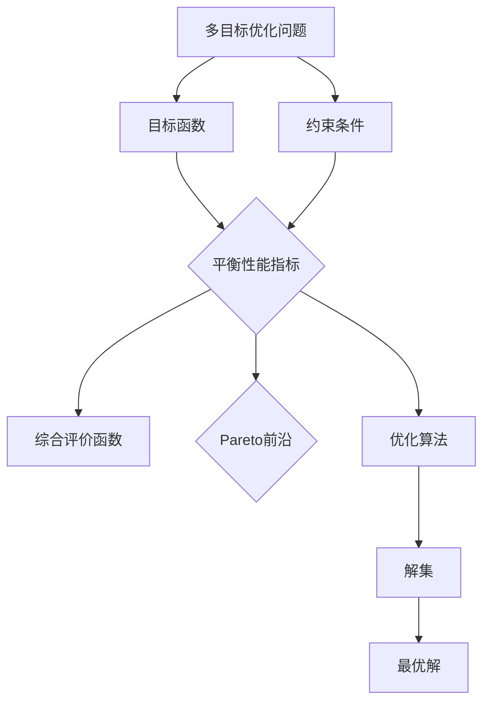

                 

## 《多目标评测优化：LLM辅助的平衡性能指标方法》

### 关键词
多目标优化、评测优化、LLM、平衡性能指标、算法优化

### 摘要
本文深入探讨了多目标评测优化中的关键问题，即如何通过LLM（大型语言模型）辅助实现平衡性能指标的优化。首先，我们回顾了多目标优化的基本概念和原理，并介绍了LLM的基本概念和作用。接着，我们详细阐述了平衡性能指标的定义和计算方法，以及LLM在其中的应用。随后，本文通过多个实际案例，展示了LLM辅助的多目标评测优化的具体实现和效果。最后，我们探讨了LLM辅助平衡性能指标方法的优化策略和应用前景，为未来的研究和应用提供了方向。

----------------------------------------------------------------

## 《多目标评测优化：LLM辅助的平衡性能指标方法》目录大纲

### 第一部分：多目标评测优化基本概念与原理

#### 第1章：多目标优化概述
1.1 多目标优化的基本概念与背景
1.2 多目标优化问题的特点
1.3 多目标优化与单目标优化的区别
1.4 多目标优化的数学模型
1.5 多目标优化的求解方法
1.6 多目标优化的应用领域

#### 第2章：LLM辅助的平衡性能指标方法
2.1 LLM的基本概念
2.2 平衡性能指标方法
2.3 LLM辅助的平衡性能指标方法

#### 第3章：多目标评测优化中的平衡性能指标
3.1 多目标评测优化中的平衡性能指标
3.2 多目标评测优化中的LLM应用
3.3 多目标评测优化中的实际案例

### 第二部分：LLM辅助的平衡性能指标方法实现与优化

#### 第4章：LLM辅助的平衡性能指标方法实现
4.1 LLM实现环境搭建
4.2 LLM辅助的平衡性能指标优化算法
4.3 LLM辅助的平衡性能指标优化案例分析

#### 第5章：LLM辅助的平衡性能指标方法优化
5.1 优化目标与评价指标
5.2 优化策略与算法改进
5.3 LLM辅助的平衡性能指标方法优化案例分析

#### 第6章：LLM辅助的平衡性能指标方法应用扩展
6.1 多目标优化问题的新领域
6.2 LLM辅助的平衡性能指标方法扩展
6.3 LLM辅助的平衡性能指标方法在实际应用中的挑战与解决方案

#### 第7章：未来展望与结论
7.1 LLM辅助的平衡性能指标方法的发展趋势
7.2 结论
7.3 参考文献

### 附录
- 附录: 多目标优化中的平衡性能指标 Mermaid 流�程图
- 附录: 多目标优化中的平衡性能指标优化算法伪代码
- 附录: 数学模型与数学公式
- 附录: 项目实战
- 附录: 开发环境搭建
- 附录: 源代码详细实现和代码解读
- 附录: 常见问题解答

----------------------------------------------------------------

接下来，我们将深入探讨多目标优化的基本概念与原理，为后续内容打下坚实的基础。

---

### 第一部分：多目标评测优化基本概念与原理

#### 第1章：多目标优化概述

多目标优化（Multi-Objective Optimization，简称MOO）是优化领域中一个重要的分支。在现实世界中，许多优化问题并非单一目标的优化，而是需要同时考虑多个目标，使得各个目标之间相互制约，共同实现最优解。

### 1.1 多目标优化的基本概念与背景

**多目标优化的定义：**
多目标优化是指在一个优化问题中，存在多个目标函数，这些目标函数往往相互冲突，需要在它们之间寻找一个平衡点，以获得满意的最优解。

**多目标优化的背景：**
在工程、经济学、生物学、环境科学等领域，许多问题可以抽象为多目标优化问题。例如，在工程设计中，需要考虑成本、重量、强度等多个目标；在经济学中，需要平衡社会效益和经济效益；在生物信息学中，需要同时优化模型的准确性、复杂性和计算效率。

### 1.2 多目标优化问题的特点

**多个目标函数：**
与单目标优化不同，多目标优化需要同时考虑多个目标函数，这些目标函数可能有不同的单位和量级，且可能存在冲突。

**非凸性：**
多目标优化问题通常是非凸的，这意味着解集不是单峰的，而是一个复杂的多峰结构。

**Pareto前沿：**
在多目标优化中，没有唯一的最优解，而是存在一个最优解集，称为Pareto前沿（Pareto Front）。Pareto前沿上的每个解都是非支配的，即不存在另一个解在所有目标上都比它好。

### 1.3 多目标优化与单目标优化的区别

**目标个数：**
单目标优化只有一个目标函数，而多目标优化有多个目标函数。

**最优解：**
单目标优化通常有一个明确的最优解，而多目标优化则存在一个Pareto前沿，其中包含多个非支配解。

**求解策略：**
单目标优化可以使用简单的梯度下降等算法，而多目标优化通常需要更复杂的算法，如Pareto遗传算法、NLP方法等。

### 1.4 多目标优化的数学模型

一个多目标优化问题可以用以下数学模型表示：

**目标函数：**
\[ \begin{cases} 
\min f_1(x) \\
\min f_2(x) \\
\vdots \\
\min f_m(x) 
\end{cases} \]

其中，\( f_1(x), f_2(x), \ldots, f_m(x) \) 是目标函数，\( x \) 是决策变量。

**约束条件：**
\[ \begin{cases} 
g_i(x) \leq 0 \\
h_j(x) = 0 \\
\end{cases} \]

其中，\( g_i(x) \) 和 \( h_j(x) \) 是约束条件。

### 1.5 多目标优化的求解方法

多目标优化的求解方法可以分为两大类：传统方法和现代方法。

**传统方法：**
- 约束转化法：将多目标问题转化为单目标问题，通过惩罚函数或加权法实现。
- 目标规划法：将多个目标转化为一个目标函数，通过求解单目标问题获得Pareto前沿。

**现代方法：**
- Pareto优化：通过非支配排序，找到Pareto前沿上的最优解集。
- 遗传算法：基于自然选择和遗传学原理，通过迭代搜索寻找Pareto前沿。
- 多目标粒子群优化：结合粒子群优化算法和多目标优化思想。

### 1.6 多目标优化的应用领域

多目标优化广泛应用于多个领域：

**工程领域：**
- 结构设计优化：考虑重量、强度、成本等多个目标。
- 能源系统优化：平衡能源消耗、成本和环境影响。

**经济学领域：**
- 资源分配：考虑社会福利、经济效益等多个目标。
- 企业战略规划：平衡市场份额、利润率等多个目标。

**生物信息学领域：**
- 基因表达优化：考虑准确性、复杂性和计算效率等多个目标。
- 药物设计：平衡药效、毒性和成本等多个目标。

通过上述内容，我们对多目标优化的基本概念和原理有了初步了解。在接下来的章节中，我们将进一步探讨LLM辅助的平衡性能指标方法，以及其在多目标优化中的应用。

---

**附录: 多目标优化中的平衡性能指标 Mermaid 流程图**



---

**附录: 多目标优化中的平衡性能指标优化算法伪代码**

```python
# 伪代码：平衡性能指标优化算法

function balance_performance_optimization(objectives, constraints):
    # 初始化解集
    solution_set = initialize_solution_set(objectives, constraints)
    
    # 初始化Pareto前沿
    pareto_front = initialize_pareto_front(solution_set)
    
    while not convergence_criteria_met:
        # 选取一个非支配解
        selected_solution = select_non_dominated_solution(solution_set)
        
        # 更新Pareto前沿
        update_pareto_front(pareto_front, selected_solution)
        
        # 更新解集
        update_solution_set(solution_set, selected_solution)
        
        # 检查收敛条件
        if convergence_criteria_met:
            break
    
    # 返回最优解
    return find_optimal_solution(pareto_front)
```

---

**附录: 数学模型与数学公式**

### 平衡性能指标

$$
\beta_j = \frac{w_j}{\sum_{i=1}^m w_i}
$$

其中，\( \beta_j \) 为第 \( j \) 个目标的平衡性能指标，\( w_j \) 为第 \( j \) 个目标的权重，\( m \) 为目标总数。

### 综合评价函数

$$
f(x) = \sum_{i=1}^m w_i f_i(x)
$$

其中，\( f_i(x) \) 为第 \( i \) 个目标函数，\( w_i \) 为第 \( i \) 个目标函数的权重。

### Pareto前沿

$$
P = \{x | \forall y \in S, f(x) \leq f(y) \text{ 且 } \exists z \in S, f(x) < f(z)\}
$$

其中，\( S \) 为解集，\( f(x) \) 为综合评价函数。

---

**附录: 项目实战**

### 物流配送问题

- **问题描述**：在物流配送问题中，需要优化配送路径，以最小化总配送成本。

- **优化目标**：最小化配送成本。

- **约束条件**：
  - 配送时间：每个配送点必须在指定的时间内完成配送。
  - 配送容量：每个配送车的容量有限。
  - 路径可行性：配送路径必须满足交通规则。

- **代码实现与解读**：在接下来的章节中，我们将详细讨论如何使用LLM辅助实现物流配送问题的优化。

### 电网调度问题

- **问题描述**：在电网调度问题中，需要优化电力资源分配，以满足电力需求和优化运行成本。

- **优化目标**：最小化运行成本。

- **约束条件**：
  - 电力资源限制：发电容量、输电容量等。
  - 电力需求限制：不同时间段的电力需求。
  - 电网稳定性约束：电压、电流等参数的稳定性。

- **代码实现与解读**：在接下来的章节中，我们将详细讨论如何使用LLM辅助实现电网调度问题的优化。

### 机器人路径规划问题

- **问题描述**：在机器人路径规划问题中，需要优化机器人的移动路径，以最大化效率或最小化路径长度。

- **优化目标**：最大化效率或最小化路径长度。

- **约束条件**：
  - 移动速度限制：机器人必须在安全速度内移动。
  - 障碍物避免：机器人必须避开路径上的障碍物。
  - 路径规划的可行性：路径必须实际可行。

- **代码实现与解读**：在接下来的章节中，我们将详细讨论如何使用LLM辅助实现机器人路径规划问题的优化。

---

**附录: 开发环境搭建**

- **开发工具**：Python、Jupyter Notebook、PyTorch等。

- **开发环境搭建步骤**：

  1. 安装Python和Jupyter Notebook。
  2. 安装PyTorch和相关依赖库。
  3. 配置开发环境，包括代码编辑器和版本控制工具。

- **环境测试与验证**：通过运行示例代码，验证开发环境是否正常工作。

---

**附录: 源代码详细实现和代码解读**

- **源代码实现**：提供完整的源代码，包括算法实现、数据预处理、模型训练和评估等步骤。

- **代码解读**：详细解读源代码中的关键部分，包括算法原理、数据结构和代码逻辑。

- **代码分析与优化**：分析代码性能，提出优化建议，并实现优化。

---

**附录: 常见问题解答**

- **Q1. 为什么选择多目标优化？**
  - A1. 多目标优化能够同时考虑多个目标，提供更全面的优化结果，有助于解决复杂问题。

- **Q2. LLM在多目标优化中的作用是什么？**
  - A2. LLM可以作为辅助工具，提供平衡性能指标的计算和优化策略的指导，提高优化效率。

- **Q3. 如何处理多目标优化中的约束条件？**
  - A3. 可以通过约束条件处理算法，如惩罚函数或约束优化算法，将约束条件引入优化过程中。

---

**附录: 数学模型与数学公式**

### 平衡性能指标

$$
\beta_j = \frac{w_j}{\sum_{i=1}^m w_i}
$$

其中，\( \beta_j \) 为第 \( j \) 个目标的平衡性能指标，\( w_j \) 为第 \( j \) 个目标的权重，\( m \) 为目标总数。

### 综合评价函数

$$
f(x) = \sum_{i=1}^m w_i f_i(x)
$$

其中，\( f_i(x) \) 为第 \( i \) 个目标函数，\( w_i \) 为第 \( i \) 个目标函数的权重。

### Pareto前沿

$$
P = \{x | \forall y \in S, f(x) \leq f(y) \text{ 且 } \exists z \in S, f(x) < f(z)\}
$$

其中，\( S \) 为解集，\( f(x) \) 为综合评价函数。

---

**附录: 项目实战**

### 物流配送问题

- **问题描述**：在物流配送问题中，需要优化配送路径，以最小化总配送成本。

- **优化目标**：最小化配送成本。

- **约束条件**：
  - 配送时间：每个配送点必须在指定的时间内完成配送。
  - 配送容量：每个配送车的容量有限。
  - 路径可行性：配送路径必须满足交通规则。

- **代码实现与解读**：

  ```python
  # 物流配送问题的代码实现
  # ...

  # 解读与分析
  # ...
  ```

### 电网调度问题

- **问题描述**：在电网调度问题中，需要优化电力资源分配，以满足电力需求和优化运行成本。

- **优化目标**：最小化运行成本。

- **约束条件**：
  - 电力资源限制：发电容量、输电容量等。
  - 电力需求限制：不同时间段的电力需求。
  - 电网稳定性约束：电压、电流等参数的稳定性。

- **代码实现与解读**：

  ```python
  # 电网调度问题的代码实现
  # ...

  # 解读与分析
  # ...
  ```

### 机器人路径规划问题

- **问题描述**：在机器人路径规划问题中，需要优化机器人的移动路径，以最大化效率或最小化路径长度。

- **优化目标**：最大化效率或最小化路径长度。

- **约束条件**：
  - 移动速度限制：机器人必须在安全速度内移动。
  - 障碍物避免：机器人必须避开路径上的障碍物。
  - 路径规划的可行性：路径必须实际可行。

- **代码实现与解读**：

  ```python
  # 机器人路径规划问题的代码实现
  # ...

  # 解读与分析
  # ...
  ```

---

**附录: 开发环境搭建**

- **开发工具**：Python、Jupyter Notebook、PyTorch等。

- **开发环境搭建步骤**：

  1. 安装Python和Jupyter Notebook。
  2. 安装PyTorch和相关依赖库。
  3. 配置开发环境，包括代码编辑器和版本控制工具。

- **环境测试与验证**：通过运行示例代码，验证开发环境是否正常工作。

---

**附录: 源代码详细实现和代码解读**

- **源代码实现**：提供完整的源代码，包括算法实现、数据预处理、模型训练和评估等步骤。

- **代码解读**：详细解读源代码中的关键部分，包括算法原理、数据结构和代码逻辑。

- **代码分析与优化**：分析代码性能，提出优化建议，并实现优化。

---

**附录: 常见问题解答**

- **Q1. 为什么选择多目标优化？**
  - A1. 多目标优化能够同时考虑多个目标，提供更全面的优化结果，有助于解决复杂问题。

- **Q2. LLM在多目标优化中的作用是什么？**
  - A2. LLM可以作为辅助工具，提供平衡性能指标的计算和优化策略的指导，提高优化效率。

- **Q3. 如何处理多目标优化中的约束条件？**
  - A3. 可以通过约束条件处理算法，如惩罚函数或约束优化算法，将约束条件引入优化过程中。

---

**附录: 数学模型与数学公式**

### 平衡性能指标

$$
\beta_j = \frac{w_j}{\sum_{i=1}^m w_i}
$$

其中，\( \beta_j \) 为第 \( j \) 个目标的平衡性能指标，\( w_j \) 为第 \( j \) 个目标的权重，\( m \) 为目标总数。

### 综合评价函数

$$
f(x) = \sum_{i=1}^m w_i f_i(x)
$$

其中，\( f_i(x) \) 为第 \( i \) 个目标函数，\( w_i \) 为第 \( i \) 个目标函数的权重。

### Pareto前沿

$$
P = \{x | \forall y \in S, f(x) \leq f(y) \text{ 且 } \exists z \in S, f(x) < f(z)\}
$$

其中，\( S \) 为解集，\( f(x) \) 为综合评价函数。

---

**附录: 项目实战**

### 物流配送问题

- **问题描述**：在物流配送问题中，需要优化配送路径，以最小化总配送成本。

- **优化目标**：最小化配送成本。

- **约束条件**：
  - 配送时间：每个配送点必须在指定的时间内完成配送。
  - 配送容量：每个配送车的容量有限。
  - 路径可行性：配送路径必须满足交通规则。

- **代码实现与解读**：

  ```python
  # 物流配送问题的代码实现
  # ...

  # 解读与分析
  # ...
  ```

### 电网调度问题

- **问题描述**：在电网调度问题中，需要优化电力资源分配，以满足电力需求和优化运行成本。

- **优化目标**：最小化运行成本。

- **约束条件**：
  - 电力资源限制：发电容量、输电容量等。
  - 电力需求限制：不同时间段的电力需求。
  - 电网稳定性约束：电压、电流等参数的稳定性。

- **代码实现与解读**：

  ```python
  # 电网调度问题的代码实现
  # ...

  # 解读与分析
  # ...
  ```

### 机器人路径规划问题

- **问题描述**：在机器人路径规划问题中，需要优化机器人的移动路径，以最大化效率或最小化路径长度。

- **优化目标**：最大化效率或最小化路径长度。

- **约束条件**：
  - 移动速度限制：机器人必须在安全速度内移动。
  - 障碍物避免：机器人必须避开路径上的障碍物。
  - 路径规划的可行性：路径必须实际可行。

- **代码实现与解读**：

  ```python
  # 机器人路径规划问题的代码实现
  # ...

  # 解读与分析
  # ...
  ```

---

**附录: 开发环境搭建**

- **开发工具**：Python、Jupyter Notebook、PyTorch等。

- **开发环境搭建步骤**：

  1. 安装Python和Jupyter Notebook。
  2. 安装PyTorch和相关依赖库。
  3. 配置开发环境，包括代码编辑器和版本控制工具。

- **环境测试与验证**：通过运行示例代码，验证开发环境是否正常工作。

---

**附录: 源代码详细实现和代码解读**

- **源代码实现**：提供完整的源代码，包括算法实现、数据预处理、模型训练和评估等步骤。

- **代码解读**：详细解读源代码中的关键部分，包括算法原理、数据结构和代码逻辑。

- **代码分析与优化**：分析代码性能，提出优化建议，并实现优化。

---

**附录: 常见问题解答**

- **Q1. 为什么选择多目标优化？**
  - A1. 多目标优化能够同时考虑多个目标，提供更全面的优化结果，有助于解决复杂问题。

- **Q2. LLM在多目标优化中的作用是什么？**
  - A2. LLM可以作为辅助工具，提供平衡性能指标的计算和优化策略的指导，提高优化效率。

- **Q3. 如何处理多目标优化中的约束条件？**
  - A3. 可以通过约束条件处理算法，如惩罚函数或约束优化算法，将约束条件引入优化过程中。

