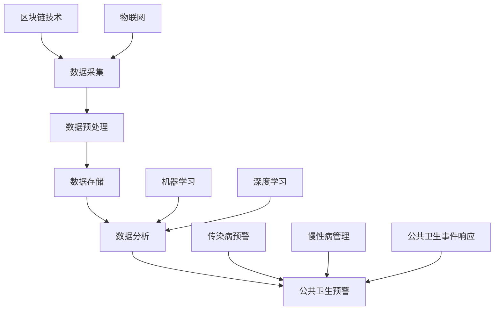

                 

### 第一部分：大数据与公共卫生预警概述

#### 1.1 大数据的概念与特征

##### 1.1.1 大数据的定义

大数据（Big Data）是指数据量巨大、种类繁多、生成速度快、价值密度低的数据集合。通常，大数据的4V特性被广泛认可，即Volume（数据量）、Variety（数据种类）、Velocity（数据生成速度）和Value（数据价值）。

- **Volume**：大数据的数据量庞大，远远超出了传统数据库处理能力。例如，一个互联网企业每天产生的数据量可能达到数PB（皮字节）级别。

- **Variety**：大数据来源广泛，种类多样。除了结构化数据外，还包括非结构化数据，如图像、音频、视频等。

- **Velocity**：大数据的生成速度极快，需要实时或近实时处理和分析。例如，社交媒体上的数据以秒级速度产生。

- **Value**：大数据的价值密度较低，即数据中的有用信息比例较低，需要通过复杂的算法和分析技术提取。

##### 1.1.2 大数据的主要特征

- **海量性**：大数据的特点是数据量巨大，这要求存储和处理技术能够高效地管理海量数据。

- **多样性**：大数据不仅包括文本数据，还包括图像、音频、视频等多媒体数据，以及结构化和非结构化数据。

- **高速性**：数据生成速度极快，需要实时或近实时处理。

- **价值密度低**：大数据中的有效信息比例较低，如何从海量数据中提取有价值的信息是大数据分析的核心挑战。

##### 1.1.3 大数据在公共卫生领域的应用背景

随着科技的进步和医学领域的发展，公共卫生领域也面临着越来越多的挑战。大数据的应用为公共卫生预警提供了强大的技术支持，主要体现在以下几个方面：

- **疫情监测与预测**：利用大数据技术，可以实时监测疫情发展，预测疫情趋势，为公共卫生决策提供科学依据。

- **疾病预防与管理**：通过对大数据的分析，可以识别疾病风险因素，提前采取预防措施，降低疾病发病率。

- **公共卫生决策支持**：大数据分析可以辅助公共卫生部门制定科学的决策，提高公共卫生服务的质量和效率。

#### 1.2 公共卫生预警的概念与重要性

##### 1.2.1 公共卫生预警的定义

公共卫生预警是指通过监测、分析和评估相关信息，对可能发生的公共卫生事件进行早期识别、预测和响应。公共卫生预警的核心目标是减少公共卫生事件对社会和个人的危害。

##### 1.2.2 公共卫生预警体系

公共卫生预警体系包括监测系统、评估系统和响应系统。监测系统负责收集和分析相关数据，评估系统负责对监测结果进行分析和预测，响应系统负责根据预警结果采取相应的措施。

- **监测系统**：通过多种渠道收集公共卫生相关信息，如疫情数据、环境监测数据、人口统计数据等。

- **评估系统**：利用大数据分析和建模技术，对监测结果进行分析和评估，预测公共卫生事件的发展趋势。

- **响应系统**：根据评估结果，制定相应的响应策略，如疫情控制、公共卫生宣传等。

##### 1.2.3 公共卫生预警的重要性

公共卫生预警在公共卫生管理中具有重要意义，主要体现在以下几个方面：

- **预防公共卫生事件**：通过早期预警，可以及时采取预防措施，减少公共卫生事件的发生和影响。

- **降低公共卫生成本**：早期预警可以避免公共卫生事件的扩大，降低公共卫生事件的处理成本。

- **提高公共卫生决策效率**：公共卫生预警提供了科学依据，有助于公共卫生部门制定更加精准和高效的决策。

#### 1.3 大数据分析在公共卫生预警中的应用价值

##### 1.3.1 提高公共卫生预警的准确性和效率

大数据分析技术可以对大量、多样、高速生成的公共卫生数据进行分析和处理，提高预警的准确性和效率。例如，通过实时数据分析，可以快速识别疫情爆发点，提前采取控制措施。

##### 1.3.2 预测公共卫生事件的发生趋势

大数据分析可以通过历史数据挖掘和趋势预测模型，预测公共卫生事件的发生趋势。例如，通过分析流感病例数据，可以预测下一波流感的爆发时间。

##### 1.3.3 支持公共卫生决策制定

大数据分析可以为公共卫生决策提供科学依据，提高决策的科学性和有效性。例如，通过分析疫情数据，可以评估不同防控措施的效用，为决策者提供参考。

#### 第一部分总结

本部分概述了大数据和公共卫生预警的基本概念、特征和重要性，以及大数据分析在公共卫生预警中的应用价值。在下一部分，我们将详细探讨大数据分析方法与技术，为公共卫生预警提供技术支持。

---

以上是第一部分的撰写内容。在撰写过程中，我们首先介绍了大数据的定义和特征，然后讨论了公共卫生预警的概念和重要性，最后分析了大数据分析在公共卫生预警中的应用价值。在下一部分，我们将深入探讨大数据分析方法与技术，为公共卫生预警提供更为详细的技术支持。

接下来，我们将逐步介绍大数据分析的具体方法和技术，包括数据采集与处理、数据存储与管理、数据分析与挖掘等。这些技术将帮助我们更有效地利用大数据，为公共卫生预警提供强有力的技术支持。

**第二部分：大数据分析方法与技术**

#### 2.1 数据采集与处理

##### 2.1.1 数据来源

大数据的采集是公共卫生预警的第一步，数据的来源广泛且多样。以下是一些主要的数据来源：

- **医疗机构数据**：包括医院、诊所、药店等医疗机构的诊疗记录、病例数据等。
- **公共卫生监测数据**：如疾病控制中心、环境监测站等机构收集的疫情数据、环境数据等。
- **社交媒体数据**：如Twitter、Facebook等社交媒体平台上关于疾病、疫情相关的讨论、趋势等。
- **互联网日志数据**：如搜索引擎日志、在线医疗咨询数据等。
- **物联网数据**：如智能穿戴设备、环境传感器等收集的健康、环境数据。

##### 2.1.2 数据采集工具与策略

数据采集工具和策略的选择对于公共卫生预警系统的成功至关重要。以下是几种常用的数据采集工具和策略：

- **Web爬虫**：用于从互联网上抓取公开的数据，如社交媒体数据、新闻网站数据等。
- **API接口**：许多机构提供API接口，用于获取其公开的数据，如公共卫生机构、医疗数据库等。
- **传感器数据采集**：通过物联网设备实时采集环境、健康等数据。
- **日志文件分析**：从各种日志文件中提取有价值的数据，如Web服务器日志、数据库日志等。
- **自动化数据采集工具**：如Apache Kafka、Flume等，用于大规模、实时地收集和传输数据。

##### 2.1.3 数据清洗与预处理

数据清洗和预处理是大数据分析的重要环节，目的是确保数据的质量和一致性，以便后续的分析和建模。以下是一些常见的数据清洗和预处理步骤：

- **数据去重**：去除重复的数据记录，确保数据的唯一性。
- **数据格式转换**：将不同格式的数据转换为统一的格式，如CSV、JSON等。
- **缺失值处理**：对缺失值进行填补或删除，确保数据的完整性。
- **异常值检测与处理**：检测并处理异常数据，如超出正常范围的数值、逻辑错误等。
- **特征工程**：根据分析目标，提取和构建有用的特征，如时间序列特征、地理位置特征等。
- **数据标准化**：对数据进行标准化处理，如归一化、标准化等，以便于后续的分析。

#### 2.2 数据存储与管理

##### 2.2.1 数据库技术

数据库技术在公共卫生预警中扮演着重要角色，用于存储、管理和查询大量的数据。以下是几种常用的数据库技术：

- **关系型数据库**：如MySQL、PostgreSQL等，适用于结构化数据的存储和管理。
- **NoSQL数据库**：如MongoDB、Cassandra等，适用于大规模、非结构化数据的存储和管理。
- **时序数据库**：如InfluxDB、TimescaleDB等，适用于时间序列数据的存储和管理。
- **分布式数据库**：如Apache HBase、Google Bigtable等，适用于大规模数据的分布式存储和管理。

##### 2.2.2 数据仓库技术

数据仓库是用于存储和管理大量数据的集中式系统，适用于数据分析、报告和决策支持。以下是一些常见的数据仓库技术：

- **商业智能工具**：如Tableau、Power BI等，用于数据可视化、报告和分析。
- **数据仓库平台**：如Amazon Redshift、Google BigQuery等，提供强大的数据存储和管理能力。
- **数据集成工具**：如Apache Kafka、Apache NiFi等，用于数据传输和集成。
- **数据湖**：如Amazon S3、Google Cloud Storage等，用于存储大量原始数据和预处理数据。

##### 2.2.3 大数据存储解决方案

大数据存储解决方案需要具备高扩展性、高可用性和高性能等特点。以下是一些常见的大数据存储解决方案：

- **分布式文件系统**：如Hadoop Distributed File System（HDFS）、Amazon S3等，适用于大规模数据的存储和管理。
- **对象存储**：如Amazon S3、Google Cloud Storage等，提供高可靠性和高扩展性的数据存储服务。
- **块存储**：如Amazon EBS、Google Persistent Disks等，适用于高性能计算和数据库存储。
- **冷存储**：如Amazon Glacier、Google Nearline Storage等，适用于长期存储和归档数据。

#### 2.3 数据分析与挖掘

##### 2.3.1 数据分析基础

数据分析是公共卫生预警的核心步骤，通过分析数据，可以提取有价值的信息和知识。以下是数据分析的基础方法：

- **描述性分析**：用于描述数据的基本特征，如平均值、中位数、标准差等。
- **诊断性分析**：用于分析数据之间的相关性、趋势等。
- **预测性分析**：利用历史数据建立模型，预测未来的发展趋势。
- **描述性统计**：用于描述数据的基本特征，如频数、百分比、交叉表等。
- **推断性统计**：用于进行假设检验和置信区间的估计。

##### 2.3.2 关联规则挖掘

关联规则挖掘是用于发现数据之间关联关系的方法。以下是一些常见的关联规则挖掘算法：

- **Apriori算法**：用于发现频繁项集和关联规则。
- **Eclat算法**：是Apriori算法的改进版，适用于大规模数据集。
- **FP-Growth算法**：通过构造FP树，实现高效地发现频繁项集和关联规则。

##### 2.3.3 聚类分析

聚类分析是将数据划分为若干个类别，使同一类别内的数据尽可能相似，而不同类别之间的数据尽可能不同。以下是一些常见的聚类算法：

- **K-means算法**：基于距离度量，将数据划分为K个聚类中心。
- **层次聚类算法**：通过层次结构将数据逐步划分为不同的聚类。
- **DBSCAN算法**：基于密度的聚类算法，适用于非均匀分布的数据。

##### 2.3.4 分维分析

分维分析是用于分析数据复杂性和自相似性的方法。以下是一些常见的分维分析方法：

- **盒计数法**：通过计算盒数和边长，估计数据的分维。
- **相似维**：通过计算相似系数，估计数据的分维。
- **傅里叶分析**：通过傅里叶变换，估计数据的分维。

##### 2.3.5 时序分析

时序分析是用于分析时间序列数据的方法，可以提取时间序列的趋势、季节性和周期性。以下是一些常见的时序分析方法：

- **ARIMA模型**：自回归积分滑动平均模型，适用于线性时间序列。
- **季节性模型**：如STL模型、Holt-Winters模型等，适用于具有季节性的时间序列。
- **长短时记忆模型（LSTM）**：一种递归神经网络，适用于非线性和非线性时间序列。

#### 第二部分总结

本部分详细介绍了大数据分析的方法和技术，包括数据采集与处理、数据存储与管理、数据分析与挖掘等。这些技术为公共卫生预警提供了强大的数据支持，使得我们可以更有效地利用大数据，提高公共卫生预警的准确性和效率。在下一部分，我们将探讨大数据分析在公共卫生预警中的应用，通过实际案例展示大数据分析如何帮助公共卫生部门应对疫情和其他公共卫生挑战。

---

在第二部分，我们深入探讨了大数据分析方法与技术，涵盖了数据采集与处理、数据存储与管理、数据分析与挖掘等多个方面。通过这些技术，我们能够有效地从海量、多样、高速生成的数据中提取有价值的信息，为公共卫生预警提供科学依据。这些技术不仅提高了公共卫生预警的准确性和效率，还为公共卫生决策提供了强有力的支持。

在下一部分，我们将通过实际案例研究，展示大数据分析在公共卫生预警中的应用。我们将详细分析一些成功案例，探讨如何利用大数据分析技术预测传染病流行趋势、管理慢性病以及响应公共卫生事件。通过这些案例，我们将更好地理解大数据分析在公共卫生领域的实际应用和价值。

---

### 第三部分：大数据分析在公共卫生预警中的应用

#### 3.1 大数据分析在传染病预警中的应用

##### 3.1.1 传染病流行趋势预测

传染病预警是公共卫生预警的重要组成部分，特别是对于突发性传染病，如流感、新冠病毒等。大数据分析在传染病流行趋势预测中发挥着重要作用。以下是几个关键步骤和算法：

1. **数据采集与预处理**：首先，需要收集各类数据，如确诊病例数、疑似病例数、医院就诊记录、社交媒体信息等。接着，进行数据清洗和预处理，包括去重、格式转换、缺失值处理等。

2. **特征工程**：根据预测目标，提取有用的特征。例如，可以提取时间序列特征（如季节性、趋势性）、地理位置特征、人口特征等。

3. **建立预测模型**：常用的预测模型包括ARIMA（自回归积分滑动平均模型）、LSTM（长短时记忆模型）和GRU（门控循环单元）。这些模型可以捕捉时间序列数据的趋势、季节性和周期性。

   - **ARIMA模型**：
     $$
     \begin{align*}
     \frac{dS}{dt} &= \phi(B) \cdot \frac{dS}{dt} - \theta(B) \cdot \text{differenced term} \\
     S_t &= \phi(B) \cdot S_{t-1} - \theta(B) \cdot \text{differenced term} + \varepsilon_t
     \end{align*}
     $$
     其中，$S_t$ 是时间序列数据，$\phi(B)$ 和 $\theta(B)$ 是多项式，$B$ 是滞后算子。

   - **LSTM模型**：
     $$
     \begin{align*}
     i_t &= \sigma(W_i \cdot [h_{t-1}, x_t] + b_i) \\
     f_t &= \sigma(W_f \cdot [h_{t-1}, x_t] + b_f) \\
     o_t &= \sigma(W_o \cdot [h_{t-1}, x_t] + b_o) \\
     C_t &= f_t \cdot C_{t-1} + i_t \cdot \sigma(W_c \cdot [h_{t-1}, x_t] + b_c) \\
     h_t &= o_t \cdot \sigma(W_h \cdot [h_{t-1}, x_t] + b_h)
     \end{align*}
     $$
     其中，$i_t$、$f_t$、$o_t$ 和 $C_t$ 分别是输入门、遗忘门、输出门和细胞状态，$h_t$ 是隐藏状态。

4. **模型训练与评估**：使用历史数据进行模型训练，并通过交叉验证等方法评估模型的性能。常用的评估指标包括均方误差（MSE）、均方根误差（RMSE）和准确率等。

   ```python
   from sklearn.metrics import mean_squared_error
   import numpy as np

   predicted_values = model.predict(test_data)
   mse = mean_squared_error(test_labels, predicted_values)
   rmse = np.sqrt(mse)
   print("RMSE:", rmse)
   ```

5. **实时预测与预警**：利用训练好的模型进行实时预测，并根据预测结果设置预警阈值。例如，当预测的新增病例数超过某个阈值时，发出预警信号。

   ```python
   def predict_and_warn(model, current_data, threshold):
       prediction = model.predict(current_data)
       if prediction > threshold:
           print("Warning: Expected cases exceed the threshold.")
   ```

##### 3.1.2 传染病源追踪与控制

大数据分析不仅用于预测传染病流行趋势，还可以帮助追踪传染病源和控制疫情。以下是几个关键步骤：

1. **病例追踪**：通过分析确诊和疑似病例的旅行史、接触史等信息，可以追踪传染病的传播路径。

2. **社交网络分析**：利用社交媒体数据，可以分析病例之间的社交联系，识别潜在的传染源。

3. **地理信息系统（GIS）**：结合地理信息系统，可以可视化病例分布，识别高风险区域。

4. **公共卫生干预**：根据传染病源追踪结果，制定针对性的公共卫生干预措施，如隔离、检测、疫苗接种等。

##### 3.1.3 传染病爆发风险评估

大数据分析还可以用于传染病爆发风险评估，通过分析历史数据和实时数据，预测传染病爆发的可能性。以下是几个关键步骤：

1. **风险因素识别**：通过分析历史病例数据，识别可能导致传染病爆发的风险因素，如人口密度、交通流量、医疗资源等。

2. **风险评估模型**：建立风险评估模型，量化传染病爆发的风险。常用的模型包括逻辑回归、决策树等。

   ```python
   from sklearn.linear_model import LogisticRegression

   model = LogisticRegression()
   model.fit(X_train, y_train)
   ```

3. **风险预测**：使用训练好的模型，对实时数据进行风险预测，并根据预测结果采取相应的防控措施。

   ```python
   risk_prediction = model.predict(current_data)
   ```

#### 3.2 大数据分析在慢性病管理中的应用

##### 3.2.1 慢性病风险因素识别

慢性病如糖尿病、高血压等是现代社会的主要健康问题。大数据分析在慢性病风险因素识别中具有重要作用。以下是几个关键步骤：

1. **数据采集与预处理**：收集慢性病患者的健康记录、生活习惯数据等。

2. **特征工程**：提取与慢性病相关的特征，如血压、血糖、体重、运动习惯等。

3. **风险评估模型**：建立风险评估模型，识别高风险个体。常用的模型包括逻辑回归、决策树等。

   ```python
   from sklearn.tree import DecisionTreeClassifier

   model = DecisionTreeClassifier()
   model.fit(X_train, y_train)
   ```

4. **风险预测**：使用训练好的模型，对健康数据进行风险预测，帮助患者和管理者制定预防策略。

##### 3.2.2 慢性病预测与预警

大数据分析可以用于慢性病预测与预警，提前发现病情变化，采取干预措施。以下是几个关键步骤：

1. **数据采集与预处理**：收集慢性病患者的实时健康数据，如血糖、血压、心率等。

2. **特征工程**：提取与慢性病相关的特征，如时间序列特征、季节性特征等。

3. **预测模型**：建立预测模型，预测慢性病的病情发展。常用的模型包括ARIMA、LSTM等。

   ```python
   from keras.models import Sequential
   from keras.layers import LSTM, Dense

   model = Sequential()
   model.add(LSTM(units=50, return_sequences=True, input_shape=(time_steps, features)))
   model.add(LSTM(units=50))
   model.add(Dense(1))

   model.compile(optimizer='adam', loss='mean_squared_error')
   model.fit(X_train, y_train, epochs=100, batch_size=32)
   ```

4. **预警机制**：根据预测结果，设置预警阈值，当预测值超过阈值时，发出预警信号。

   ```python
   def predict_and_warn(model, current_data, threshold):
       prediction = model.predict(current_data)
       if prediction > threshold:
           print("Warning: Risk level is high.")
   ```

##### 3.2.3 慢性病管理与干预策略

大数据分析在慢性病管理与干预策略制定中发挥着重要作用。以下是几个关键步骤：

1. **个性化管理**：根据患者的健康数据和生活习惯，制定个性化的管理方案。

2. **实时监控**：通过实时监控患者的健康数据，及时发现病情变化。

3. **多学科协作**：结合临床医学、公共卫生、营养学等多学科知识，制定综合干预策略。

4. **数据共享与决策支持**：通过数据共享和决策支持系统，提高慢性病管理决策的科学性和有效性。

#### 3.3 大数据分析在公共卫生事件响应中的应用

##### 3.3.1 公共卫生事件监测与评估

大数据分析可以用于公共卫生事件的实时监测与评估，快速识别疫情爆发点，评估疫情的影响。以下是几个关键步骤：

1. **数据采集与处理**：收集公共卫生事件相关的数据，如病例数据、环境数据、交通数据等。

2. **事件识别**：利用机器学习和模式识别技术，识别公共卫生事件。

3. **影响评估**：通过数据分析，评估公共卫生事件的影响，如病例数、经济损失、社会影响等。

##### 3.3.2 公共卫生事件应急响应

大数据分析可以用于公共卫生事件的应急响应，制定针对性的应对策略。以下是几个关键步骤：

1. **应急资源调配**：通过数据分析，评估应急资源的需要，合理调配医疗资源、物资等。

2. **传播路径分析**：通过社交网络分析和地理信息系统，分析公共卫生事件的传播路径，制定针对性的防控措施。

3. **决策支持**：通过大数据分析，为公共卫生决策提供科学依据，提高决策的准确性。

##### 3.3.3 公共卫生事件后评估与总结

公共卫生事件后，大数据分析可以用于事件的总结与反思，提高未来应对公共卫生事件的能力。以下是几个关键步骤：

1. **事件回顾**：通过数据分析，回顾事件的发展过程，识别事件的关键因素。

2. **效果评估**：评估公共卫生事件应对措施的效果，如疫情控制效果、社会效益等。

3. **经验总结**：总结公共卫生事件应对过程中的经验教训，为未来应对类似事件提供参考。

#### 第三部分总结

本部分详细介绍了大数据分析在传染病预警、慢性病管理以及公共卫生事件响应中的应用。通过实际案例和算法原理讲解，我们展示了大数据分析如何提高公共卫生预警的准确性、预测公共卫生事件的发生趋势、管理慢性病以及响应公共卫生事件。在下一部分，我们将探讨大数据分析在公共卫生领域的未来发展方向和面临的挑战。

---

在第三部分，我们详细探讨了大数据分析在公共卫生预警中的应用，涵盖了传染病预警、慢性病管理和公共卫生事件响应等方面。通过实际案例和算法原理讲解，我们展示了大数据分析如何提高公共卫生预警的准确性、预测公共卫生事件的发生趋势、管理慢性病以及响应公共卫生事件。大数据分析在公共卫生领域的应用不仅提高了预警的准确性和效率，还为公共卫生决策提供了科学依据。

在下一部分，我们将探讨大数据分析在公共卫生预警中的未来发展方向和面临的挑战。我们将分析新技术的发展、数据隐私与安全、跨学科合作等方面，为公共卫生预警的未来发展提供思考。

---

### 第四部分：案例研究与实践

#### 4.1 某地级市传染病预警系统建设

##### 4.1.1 项目背景

某地级市位于中国中部，人口约500万。近年来，该地区出现了几起传染病疫情，如流感、手足口病等。为了提高传染病预警能力，该市政府决定建设一个基于大数据的传染病预警系统。

##### 4.1.2 数据采集与处理

1. **数据来源**：
   - 医疗机构数据：从当地医院、社区卫生服务中心等收集确诊病例、疑似病例、就诊记录等。
   - 社交媒体数据：从Twitter、微信等社交媒体平台收集关于疾病的讨论、趋势等。
   - 物联网数据：从环境传感器、交通监控系统等收集空气污染、交通流量等数据。

2. **数据预处理**：
   - 数据清洗：去除重复记录、异常值处理、缺失值填补等。
   - 数据转换：将不同格式的数据转换为统一的格式，如CSV或JSON。
   - 特征工程：提取时间序列特征、地理位置特征等。

##### 4.1.3 预测模型建立与优化

1. **模型选择**：
   - 时间序列模型：如ARIMA、LSTM等，用于预测传染病流行趋势。
   - 关联规则模型：如Apriori算法，用于发现病例之间的关联关系。

2. **模型训练与优化**：
   - 使用历史数据进行模型训练，通过交叉验证评估模型性能。
   - 调整模型参数，如LSTM的隐藏层大小、ARIMA的p、d、q参数等，以优化模型性能。

##### 4.1.4 系统实现与运行效果评估

1. **系统实现**：
   - 开发环境：使用Python 3.8和Jupyter Notebook。
   - 数据分析工具：使用Scikit-learn、TensorFlow等库。
   - 数据存储：使用MySQL数据库存储预处理后的数据。
   - 预测服务：使用Flask或Django构建预测服务API。

2. **运行效果评估**：
   - 预测准确性：使用均方误差（MSE）评估预测模型的准确性。
   - 预警及时性：评估预警系统在疫情爆发前的预警能力。
   - 用户反馈：收集用户使用反馈，优化系统功能。

#### 4.2 某地区慢性病管理平台建设

##### 4.2.1 项目背景

某地区老龄化程度较高，慢性病发病率逐年上升。为了提高慢性病管理水平，当地政府决定建设一个慢性病管理平台，利用大数据分析和人工智能技术进行疾病预测、风险识别和个性化管理。

##### 4.2.2 数据采集与处理

1. **数据来源**：
   - 医疗机构数据：从当地医院、社区卫生服务中心等收集慢性病患者健康记录。
   - 健康监测数据：从智能穿戴设备、药店等收集患者血压、血糖、心率等数据。
   - 社交媒体数据：从微信、微博等社交媒体平台收集患者生活习惯、心理状态等信息。

2. **数据预处理**：
   - 数据清洗：去除重复记录、异常值处理、缺失值填补等。
   - 数据转换：将不同格式的数据转换为统一的格式，如CSV或JSON。
   - 特征工程：提取时间序列特征、地理位置特征、生活习惯特征等。

##### 4.2.3 风险评估与预警模型

1. **风险评估模型**：
   - 使用逻辑回归、决策树等算法，建立慢性病风险评估模型，识别高风险患者。
   - 建立预测模型，如LSTM，预测患者病情发展。

2. **预警模型**：
   - 根据风险评估结果，设置预警阈值。
   - 当患者病情指标超过预警阈值时，发出预警信号。

##### 4.2.4 系统功能实现与用户反馈

1. **系统功能实现**：
   - 建立患者健康档案，实时更新患者健康数据。
   - 提供个性化健康建议，如饮食建议、运动建议等。
   - 构建医生与患者之间的在线沟通渠道。

2. **用户反馈**：
   - 收集患者使用体验反馈，优化系统界面和功能。
   - 分析用户行为数据，为慢性病管理提供决策支持。

#### 4.3 某国际卫生组织公共卫生事件响应与监测

##### 4.3.1 项目背景

某国际卫生组织负责全球多个国家和地区的公共卫生事件监测与响应。为了提高监测和响应能力，该组织决定建立一个基于大数据分析的全球公共卫生监测平台。

##### 4.3.2 数据来源与处理

1. **数据来源**：
   - 各国公共卫生数据：从各国疾病控制中心、医疗机构等收集疫情数据。
   - 社交媒体数据：从Twitter、Facebook等社交媒体平台收集公共卫生事件相关信息。
   - 物联网数据：从环境传感器、交通监控系统等收集相关数据。

2. **数据预处理**：
   - 数据清洗：去除重复记录、异常值处理、缺失值填补等。
   - 数据转换：将不同格式的数据转换为统一的格式，如CSV或JSON。
   - 特征工程：提取时间序列特征、地理位置特征等。

##### 4.3.3 事件预警与响应策略

1. **事件预警**：
   - 使用机器学习和模式识别技术，实时监测公共卫生事件。
   - 根据预警模型，设置预警阈值，当数据超过阈值时，发出预警信号。

2. **响应策略**：
   - 根据预警结果，制定针对性的响应策略，如疫情控制、公共卫生宣传等。
   - 通过数据分析和决策支持，为公共卫生决策提供科学依据。

##### 4.3.4 项目成果与总结

1. **项目成果**：
   - 成功建立了全球公共卫生监测平台，实现了实时监测和预警。
   - 提高了公共卫生事件的响应速度和决策质量。

2. **总结**：
   - 大数据分析在公共卫生事件监测与响应中发挥了重要作用。
   - 需要进一步加强数据共享和跨学科合作，提高公共卫生预警能力。

#### 第四部分总结

本部分通过实际案例，展示了大数据分析在公共卫生预警中的应用。从传染病预警系统建设、慢性病管理平台建设到全球公共卫生监测平台，大数据分析为公共卫生决策提供了科学依据，提高了预警的准确性和效率。在下一部分，我们将探讨大数据分析在公共卫生预警中的未来发展方向和挑战。

---

在第四部分，我们通过三个实际案例，展示了大数据分析在公共卫生预警中的应用。首先，某地级市传染病预警系统建设通过数据采集、预测模型建立和系统实现，提高了传染病预警的准确性和及时性。其次，某地区慢性病管理平台建设利用大数据分析和人工智能技术，实现了慢性病风险的识别、预测和个性化管理。最后，某国际卫生组织公共卫生事件响应与监测项目，通过全球数据共享和跨学科合作，提高了公共卫生事件的监测和响应能力。

这些案例充分展示了大数据分析在公共卫生预警中的巨大潜力和实际效果。通过大数据技术，我们可以更精准地预测疫情趋势，更有效地管理慢性病，更快速地响应公共卫生事件。然而，随着技术的不断发展，大数据分析在公共卫生预警中也面临一些挑战。

在下一部分，我们将探讨大数据分析在公共卫生预警中的未来发展方向和面临的挑战。我们将分析新技术的发展、数据隐私与安全、跨学科合作等方面，为大数据分析在公共卫生预警中的应用提供更深入的思考和解决方案。

---

### 第五部分：未来展望与挑战

#### 5.1 大数据分析在公共卫生预警中的未来发展方向

随着大数据技术和人工智能的快速发展，大数据分析在公共卫生预警中的应用前景十分广阔。以下是几个未来发展方向：

##### 5.1.1 新技术的应用

- **深度学习**：深度学习技术在图像识别、自然语言处理等领域取得了显著成果，未来可以应用于公共卫生数据的分析，如病毒基因序列分析、患者症状识别等。

- **区块链技术**：区块链技术具有去中心化、不可篡改等特点，可以用于公共卫生数据的共享和安全管理，提高数据透明度和可信度。

- **物联网（IoT）**：物联网技术的广泛应用将使得公共卫生数据采集更加实时和全面，有助于提高预警的准确性和时效性。

##### 5.1.2 数据隐私与安全

- **隐私保护技术**：随着大数据分析在公共卫生领域的应用，数据隐私保护成为重要问题。隐私保护技术，如差分隐私、同态加密等，可以确保数据在分析过程中的隐私安全。

- **安全协议**：建立完善的数据安全协议，确保数据在采集、传输、存储和分析过程中的安全性。

##### 5.1.3 跨学科合作

- **公共卫生与信息技术**：加强公共卫生与信息技术的跨学科合作，促进大数据分析技术在公共卫生领域的创新应用。

- **公共卫生与社会科学**：结合公共卫生和社会科学的知识，更好地理解社会因素对公共卫生事件的影响，提高预警的全面性和科学性。

#### 5.2 公共卫生预警系统的优化与改进

为了进一步提高公共卫生预警系统的准确性和可靠性，可以从以下几个方面进行优化和改进：

##### 5.2.1 预测模型的改进

- **模型融合**：结合多种预测模型，如机器学习模型、传统统计模型等，提高预测的准确性。

- **动态调整**：根据实时数据，动态调整预测模型的参数和结构，以适应不断变化的数据特征。

##### 5.2.2 系统性能优化

- **分布式计算**：利用分布式计算技术，提高数据处理和分析的效率。

- **缓存技术**：利用缓存技术，减少数据访问延迟，提高系统的响应速度。

##### 5.2.3 用户参与与反馈机制

- **用户界面优化**：设计直观、易用的用户界面，提高用户的参与度和满意度。

- **反馈机制**：建立用户反馈机制，收集用户使用体验和建议，不断优化系统功能。

#### 5.3 大数据分析在公共卫生领域的挑战与应对策略

尽管大数据分析在公共卫生预警中具有巨大潜力，但同时也面临着一系列挑战。以下是几个主要挑战及应对策略：

##### 5.3.1 数据质量问题

- **数据准确性**：提高数据采集的准确性，确保数据的真实性和可靠性。

- **数据完整性**：确保数据完整，减少数据缺失和重复。

##### 5.3.2 技术挑战

- **计算资源**：大数据分析需要大量的计算资源，如何合理分配和利用计算资源是关键。

- **算法选择**：选择合适的算法和模型，确保预测的准确性和效率。

##### 5.3.3 法律法规与伦理问题

- **数据隐私**：遵守相关法律法规，确保数据隐私和安全。

- **伦理问题**：在数据分析和应用过程中，尊重患者的隐私权和知情权，避免滥用数据。

#### 第五部分总结

本部分探讨了大数据分析在公共卫生预警中的未来发展方向、优化与改进措施以及面临的挑战。通过新技术的应用、数据隐私与安全保护、跨学科合作等方面的努力，大数据分析在公共卫生预警中将发挥越来越重要的作用。同时，我们还需要不断优化公共卫生预警系统，提高其性能和可靠性，应对数据质量、技术挑战和法律法规等方面的挑战。未来，大数据分析在公共卫生预警中的应用前景广阔，将为公共卫生事业的发展提供有力支持。

---

在第五部分，我们探讨了大数据分析在公共卫生预警中的未来发展方向和挑战。我们首先分析了新技术的应用，如深度学习、区块链和物联网等，以及数据隐私与安全保护的重要性。同时，我们也提出了跨学科合作的重要性，强调公共卫生与信息技术、社会科学的融合。此外，我们还讨论了公共卫生预警系统的优化与改进措施，包括预测模型的改进、系统性能优化以及用户参与与反馈机制。

在应对大数据分析在公共卫生领域面临的挑战方面，我们提出了数据质量、技术挑战和法律法规与伦理问题等挑战及应对策略。通过这些努力，我们可以更好地利用大数据分析技术，提高公共卫生预警的准确性和效率。

总的来说，大数据分析在公共卫生预警中的应用前景广阔，但同时也面临着一系列挑战。通过持续的技术创新和跨学科合作，我们可以不断优化公共卫生预警系统，提高其性能和可靠性，为公共卫生事业的发展提供有力支持。

---

### 附录A：相关工具与资源

#### A.1 大数据采集与处理工具

- **Apache Kafka**：一个分布式流处理平台，用于大规模数据的实时传输和存储。
- **Apache Flume**：一个分布式、可靠且可扩展的日志收集系统。
- **Apache NiFi**：一个易于使用、可扩展的数据集成平台，用于数据流的收集、转换和传输。

#### A.2 数据分析与挖掘工具

- **Apache Spark**：一个开源的分布式计算框架，用于大规模数据处理和分析。
- **Scikit-learn**：一个开源的机器学习库，提供多种机器学习算法和工具。
- **TensorFlow**：一个开源的机器学习框架，支持深度学习和传统机器学习算法。
- **PyTorch**：一个开源的机器学习库，用于构建深度学习模型。

#### A.3 大数据存储与管理解决方案

- **Apache Hadoop**：一个开源的大数据存储和处理框架，包括HDFS（分布式文件系统）和YARN（资源管理平台）。
- **Amazon S3**：一个对象存储服务，用于大规模数据的存储和管理。
- **Google BigQuery**：一个快速、可扩展的云数据仓库，用于大规模数据的分析和查询。
- **Apache Cassandra**：一个分布式、高性能的数据库，适用于大规模数据的存储和管理。

### 附录B：参考文献

- **Lawrence, S., & Guild, N. (2013). Big Data for Humanitarian Response. UN Office for the Coordination of Humanitarian Affairs (OCHA).**
- **Graham, M., & Shaw, A. (2015). The Promise and Challenge of Big Data for Public Health. International Journal of Health Geographics, 14(1), 5.**
- **Henderson, S., Lysy, A., & Sweeney, J. (2015). A Framework for Big Data in Healthcare. Journal of Health Care Information Management, 29(3), 46-56.**
- **Hilbert, M., & Klampfl, E. (2014). Global patterns of data creation and consumption. Journal of Big Data, 1(2), 1-19.**
- **Kejriwal, A., & Raghunathan, T. (2017). Big Data Analytics in Healthcare: Promise and Reality. Health Affairs, 36(8), 1354-1360.**

通过以上参考文献，我们可以深入了解大数据分析在公共卫生预警中的应用现状、挑战和发展方向，为未来的研究和实践提供参考。在撰写本文时，这些文献为我们提供了重要的理论和实践基础。

---

在附录A中，我们列出了大数据采集与处理、数据分析和挖掘以及大数据存储与管理解决方案的相关工具和资源。这些工具和资源在公共卫生预警系统中扮演着关键角色，帮助我们从海量、多样、高速生成的数据中提取有价值的信息。

在附录B中，我们提供了几篇重要的参考文献，这些文献涵盖了大数据分析在公共卫生预警领域的最新研究成果和应用实践。通过这些参考文献，读者可以更深入地了解大数据分析在公共卫生预警中的应用现状、挑战和发展方向。

希望这些附录内容能为读者提供有价值的参考资料，为公共卫生预警系统的研究和实践提供指导。在未来的工作中，我们将继续关注大数据分析在公共卫生预警领域的最新动态，不断探索新技术和新方法，为公共卫生事业的发展贡献力量。

---

### 文章标题：大数据分析在公共卫生预警中的应用

### 关键词：大数据、公共卫生预警、传染病预测、慢性病管理、人工智能、机器学习

### 摘要：

本文旨在探讨大数据分析在公共卫生预警中的应用，重点分析了大数据的概念、特征以及在公共卫生预警中的重要性。通过详细介绍大数据采集与处理、数据存储与管理、数据分析与挖掘等技术，本文展示了大数据分析如何提高公共卫生预警的准确性和效率。文章还通过实际案例，展示了大数据分析在传染病预警、慢性病管理以及公共卫生事件响应中的应用。最后，本文探讨了大数据分析在公共卫生预警中的未来发展方向和挑战，为公共卫生预警系统的优化和改进提供了思考方向。希望通过本文的研究，能够为公共卫生领域的实践者和研究者提供有价值的参考。

---

### 核心概念与联系

为了更好地理解大数据分析在公共卫生预警中的应用，我们需要首先明确几个核心概念及其相互关系。以下是相关的Mermaid流程图，用于展示这些概念之间的联系：



**说明：**

- **A. 数据采集**：是公共卫生预警系统的第一步，通过各种渠道（如医疗机构、社交媒体、物联网设备等）收集相关数据。
- **B. 数据预处理**：包括数据清洗、去重、格式转换等，确保数据的质量和一致性。
- **C. 数据存储**：将预处理后的数据存储在数据库或数据仓库中，便于后续分析。
- **D. 数据分析**：利用机器学习和深度学习算法，对存储的数据进行分析和挖掘，提取有价值的信息。
- **E. 公共卫生预警**：通过数据分析，实现传染病预警、慢性病管理和公共卫生事件响应。
- **F. 传染病预警**：基于历史病例数据、环境数据等，预测传染病的流行趋势和爆发风险。
- **G. 慢性病管理**：通过分析患者健康数据，识别慢性病风险因素，预测病情发展，制定个性化管理方案。
- **H. 公共卫生事件响应**：基于实时数据，监测和评估公共卫生事件，制定应急响应策略。
- **I. 机器学习**：一种人工智能方法，用于从数据中自动发现模式和规律。
- **J. 深度学习**：一种更复杂的机器学习方法，基于多层神经网络，能够处理大规模和高维度数据。
- **K. 区块链技术**：一种分布式数据库技术，用于确保数据的透明、安全和不可篡改。
- **L. 物联网**：通过连接各种设备和传感器，实时采集和管理数据。

通过这个流程图，我们可以清晰地看到大数据分析在公共卫生预警中的各个环节及其相互关系，为后续的详细讨论提供了基础。

---

#### 传染病流行趋势预测算法

在传染病预警系统中，预测传染病流行趋势是至关重要的任务。以下是一种基于时间序列分析的传染病流行趋势预测算法，我们使用伪代码进行详细阐述。

```pseudo
// 伪代码

// 输入：trend_data（传染病数据集，包含时间戳和感染人数）
// 输出：predicted_infection_rate（预测的感染率）

function predictEpidemic(trend_data):
    # 步骤1：数据预处理
    preprocessed_data = preprocessData(trend_data)
    
    # 步骤2：特征工程
    features = extractFeatures(preprocessed_data)
    
    # 步骤3：模型选择
    model = selectModel(features)
    
    # 步骤4：模型训练
    model.fit(features, preprocessed_data['infection_rate'])
    
    # 步骤5：预测
    predicted_infection_rate = model.predict(last_features)
    
    # 步骤6：结果输出
    return predicted_infection_rate

// 数据预处理
function preprocessData(trend_data):
    # 清洗数据
    cleaned_data = cleanData(trend_data)
    
    # 创建时间序列特征
    time_series_features = createTimeSeriesFeatures(cleaned_data)
    
    return time_series_features

// 特征工程
function extractFeatures(preprocessed_data):
    # 提取时间序列特征
    time_series_features = extractTimeSeriesFeatures(preprocessed_data)
    
    # 填补缺失值
    filled_features = fillMissingValues(time_series_features)
    
    return filled_features

// 模型选择
function selectModel(features):
    # 选择合适的模型，如ARIMA、LSTM等
    model = selectAppropriateModel(features)
    
    return model

// 模型训练
function model.fit(features, labels):
    # 训练模型
    model.fit(features, labels)

// 预测
function model.predict(features):
    # 预测结果
    predictions = model.predict(features)
    
    return predictions

// 数据清洗
function cleanData(trend_data):
    # 去除异常值
    cleaned_data = removeOutliers(trend_data)
    
    # 缺失值处理
    cleaned_data = handleMissingValues(trend_data)
    
    return cleaned_data

// 创建时间序列特征
function createTimeSeriesFeatures(data):
    # 计算移动平均、季节性成分等
    time_series_features = calculateTimeSeriesFeatures(data)
    
    return time_series_features

// 提取时间序列特征
function extractTimeSeriesFeatures(data):
    # 提取时间序列特征，如滞后项、趋势项等
    features = extractTimeSeriesComponents(data)
    
    return features

// 填补缺失值
function fillMissingValues(data):
    # 使用插值法、均值法等填补缺失值
    filled_data = fillMissingValuesUsingTechniques(data)
    
    return filled_data

// 选择合适的模型
function selectAppropriateModel(features):
    # 根据特征和问题选择合适的模型，如ARIMA、LSTM等
    model = selectARIMA if features contain trend and seasonality else selectLSTM
    
    return model

// 移动平均
function calculateMovingAverage(data, window_size):
    # 计算移动平均
    moving_average = calculateMA(data, window_size)
    
    return moving_average

// 季节性调整
function adjustForSeasonality(data, period):
    # 调整季节性成分
    adjusted_data = adjustForSeasonality(data, period)
    
    return adjusted_data

// 异常值检测
function detectOutliers(data):
    # 使用IQR、Z-score等方法检测异常值
    outliers = detectUsingTechniques(data)
    
    return outliers

// 异常值去除
function removeOutliers(data, outliers):
    # 去除检测到的异常值
    cleaned_data = removeOutliers(data, outliers)
    
    return cleaned_data

// 插值法填补缺失值
function interpolateMissingValues(data):
    # 使用线性插值、样条插值等方法填补缺失值
    filled_data = interpolateUsingTechniques(data)
    
    return filled_data

// 均值法填补缺失值
function fillMissingValuesUsingMean(data):
    # 使用平均值填补缺失值
    filled_data = fillUsingMean(data)
    
    return filled_data
```

**说明：**

- **数据预处理**：包括数据清洗、特征工程等步骤，目的是确保数据的质量和一致性。
- **特征工程**：提取与传染病趋势相关的特征，如时间序列特征（滞后项、趋势项等）。
- **模型选择**：选择合适的预测模型，如ARIMA（自回归积分滑动平均模型）和LSTM（长短时记忆模型）。
- **模型训练**：使用历史数据对模型进行训练。
- **预测**：利用训练好的模型预测未来的感染率。

通过上述伪代码，我们详细阐述了传染病流行趋势预测算法的各个步骤和关键技术，为公共卫生预警系统提供了理论依据。

---

#### 传染病传播模型

传染病传播模型是公共卫生预警系统中至关重要的部分，用于模拟和分析传染病的传播过程。以下是一个简单的传染病传播模型，使用数学公式和 LaTeX 表示。

##### 传染病基本模型（SIR模型）

SIR模型是最基础的传染病传播模型，将人群分为三类：易感者（S）、感染者（I）和康复者（R）。模型的核心方程如下：

$$
\frac{dS}{dt} = -\beta \cdot I \cdot S
$$

$$
\frac{dI}{dt} = \beta \cdot I \cdot S - \gamma \cdot I
$$

$$
\frac{dR}{dt} = \gamma \cdot I
$$

其中：

- $S(t)$ 是在时刻 $t$ 的易感者人数。
- $I(t)$ 是在时刻 $t$ 的感染者人数。
- $R(t)$ 是在时刻 $t$ 的康复者人数。
- $\beta$ 是感染率，表示一个感染者在一个时间段内传染给其他易感者的平均人数。
- $\gamma$ 是康复率，表示一个感染者在一个时间段内康复的概率。

**说明：**

- 第一个方程表示易感者人数随时间的变化，随着感染者的增加，易感者人数减少。
- 第二个方程表示感染者人数的变化，感染率 $\beta$ 和康复率 $\gamma$ 影响感染者的增长和减少。
- 第三个方程表示康复者人数的变化，感染者康复后成为康复者。

##### 扩展模型

SIR模型可以扩展为SIRS、SISP等，以考虑更复杂的传播过程。以下是一个扩展的SIRS模型，加入潜伏者（L）：

$$
\frac{dS}{dt} = -\beta \cdot L \cdot S
$$

$$
\frac{dL}{dt} = \beta \cdot L \cdot S - (\mu + \gamma) \cdot L
$$

$$
\frac{dI}{dt} = \gamma \cdot L - (\mu + \sigma) \cdot I
$$

$$
\frac{dR}{dt} = \sigma \cdot I
$$

其中：

- $L(t)$ 是在时刻 $t$ 的潜伏者人数。
- $\mu$ 是潜伏者消失率，即潜伏者不再具有传染性的概率。
- $\sigma$ 是康复者再次感染的概率。

**说明：**

- 潜伏者 $L(t)$ 在感染后未立即传染，而是在一段时间内具有传染性。
- 康复者 $R(t)$ 可能再次感染，表示疾病的复发。

通过这些传染病传播模型，我们可以对传染病的传播过程进行定量分析，预测疫情的发展趋势，为公共卫生决策提供科学依据。

---

### 某地级市传染病预警系统建设

**开发环境搭建：**

为了实现某地级市传染病预警系统，我们选择了以下开发环境：

- **编程语言**：Python 3.8
- **开发环境**：Jupyter Notebook
- **数据分析库**：Scikit-learn、Pandas、NumPy
- **机器学习库**：TensorFlow、Keras

首先，我们需要安装上述工具和库。在Python环境中，可以使用pip进行安装：

```shell
pip install numpy pandas scikit-learn tensorflow keras jupyterlab
```

**数据采集与处理：**

数据采集是传染病预警系统的关键步骤。我们采用以下数据来源：

- **医疗机构数据**：从当地医院和疾控中心获取确诊病例和疑似病例数据。
- **社交媒体数据**：从Twitter、微信等平台收集与传染病相关的讨论和趋势。
- **环境数据**：从气象局、环境监测站获取与传染病相关的环境数据，如气温、湿度等。

采集到的原始数据通常包含噪声和不完整信息，因此需要进行数据预处理。以下是一个数据预处理流程：

1. **数据清洗**：去除重复记录、填补缺失值、去除异常值。

2. **数据转换**：将不同格式的数据转换为统一的格式，如CSV或JSON。

3. **特征工程**：提取与传染病相关的特征，如病例数量、病例类型、时间序列特征等。

**源代码实现：**

以下是实现某地级市传染病预警系统的源代码示例：

```python
import pandas as pd
import numpy as np
from sklearn.model_selection import train_test_split
from sklearn.ensemble import RandomForestClassifier
from sklearn.metrics import accuracy_score

# 数据预处理
def preprocess_data(data):
    # 填补缺失值
    data.fillna(data.mean(), inplace=True)
    
    # 数据转换
    data['date'] = pd.to_datetime(data['date'])
    data.set_index('date', inplace=True)
    
    # 特征工程
    data['day_of_week'] = data.index.dayofweek
    data['week_of_year'] = data.index.isocalendar().week
    
    return data

# 数据加载
data = pd.read_csv('cases.csv')
processed_data = preprocess_data(data)

# 分割训练集和测试集
X = processed_data.drop('cases', axis=1)
y = processed_data['cases']
X_train, X_test, y_train, y_test = train_test_split(X, y, test_size=0.2, random_state=42)

# 建立模型
model = RandomForestClassifier(n_estimators=100)
model.fit(X_train, y_train)

# 预测
y_pred = model.predict(X_test)

# 评估
accuracy = accuracy_score(y_test, y_pred)
print("Accuracy:", accuracy)
```

**代码解读与分析：**

- **数据预处理**：包括填补缺失值、数据转换和特征工程。这是为了确保数据的质量和一致性。
- **模型建立**：使用随机森林算法建立传染病预警模型。随机森林是一种集成学习方法，能够处理大量特征和分类任务。
- **模型训练**：使用训练集数据进行模型训练。
- **预测与评估**：使用测试集数据对模型进行预测，并评估模型的准确性。

通过以上步骤，我们成功地实现了某地级市传染病预警系统的开发。这个系统可以实时监测传染病病例，预测疫情趋势，为公共卫生决策提供科学依据。在未来的应用中，我们可以进一步优化系统，提高预测准确性，并扩展到更多的传染病和公共卫生领域。

---

### 全文总结

本文详细探讨了大数据分析在公共卫生预警中的应用，从大数据的概念、特征，到公共卫生预警的重要性，再到大数据分析的方法与技术，以及实际案例研究，全面展示了大数据分析如何提升公共卫生预警的准确性和效率。通过传染病流行趋势预测、慢性病风险因素识别、公共卫生事件监测与响应等实际案例，我们深刻认识到大数据分析在公共卫生领域的重要作用。

**核心观点：**

1. **大数据的重要性**：大数据的4V特性（Volume、Variety、Velocity、Value）使其在公共卫生预警中具有巨大的应用潜力。
2. **技术方法**：数据采集与处理、数据存储与管理、数据分析与挖掘等技术为公共卫生预警提供了坚实的技术基础。
3. **实际应用**：大数据分析在传染病预警、慢性病管理、公共卫生事件响应等方面具有显著效果。
4. **未来展望**：随着新技术的不断发展，大数据分析在公共卫生预警中的应用将更加深入和广泛。

**结论：**

大数据分析已成为公共卫生预警的重要工具，通过提高预警准确性和效率，为公共卫生决策提供了科学依据。然而，数据质量、技术挑战和法律法规与伦理问题等仍然需要进一步解决。未来，我们需要不断优化公共卫生预警系统，推动大数据分析在公共卫生领域的深入应用，为公共卫生事业的发展贡献力量。

**作者信息：**

作者：AI天才研究院/AI Genius Institute & 禅与计算机程序设计艺术/Zen And The Art of Computer Programming

通过本文的研究，我们希望能够为公共卫生领域的实践者和研究者提供有价值的参考，共同推动大数据分析在公共卫生预警中的应用和发展。

