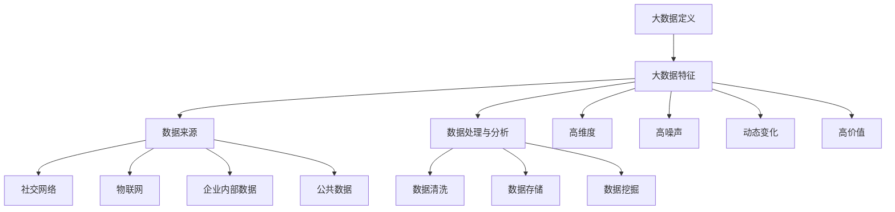
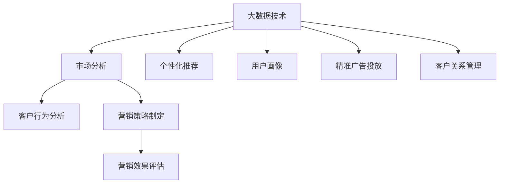
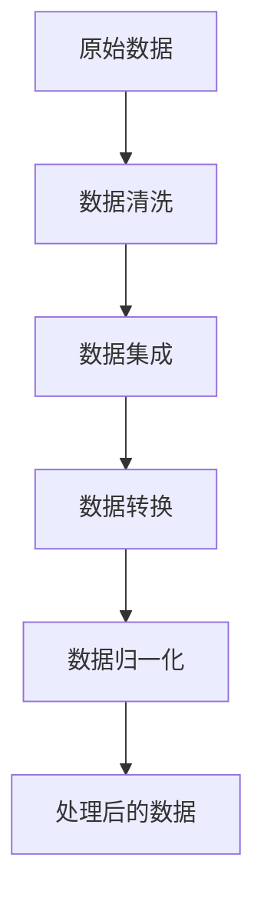
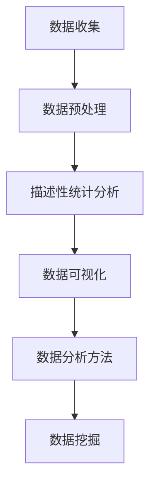
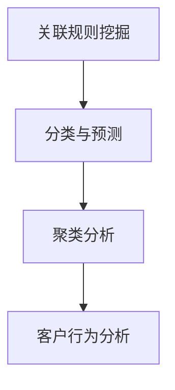
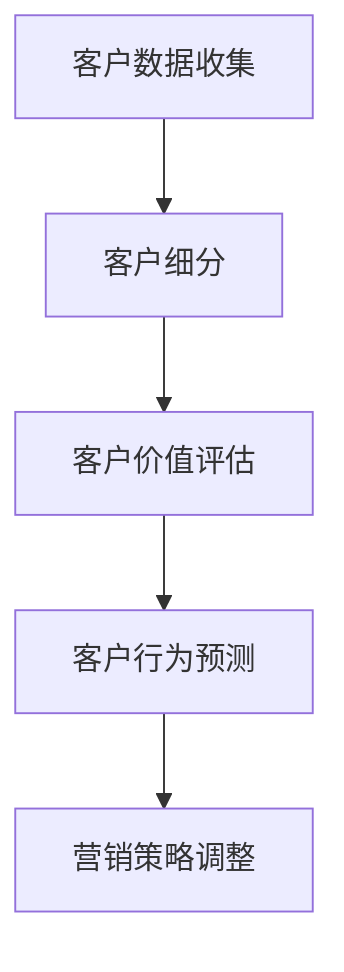

                 

### 第1章: 大数据与精准营销概述

#### 1.1 大数据的定义与特征

大数据（Big Data）是指数据量巨大、类型繁多、生成速度快、处理难度大，且具有潜在价值的数据集合。根据规模的不同，大数据可以分为以下三个层次：

1. **大数据量（Volume）**：数据量达到EB级别（1EB = 10^18字节），远远超过了传统数据库的处理能力。
2. **大数据类型（Variety）**：数据类型多样，包括结构化数据、半结构化数据和非结构化数据，如图像、视频、文本等。
3. **大数据速度（Velocity）**：数据生成和流转速度快，要求实时或近乎实时的处理能力。
4. **大数据价值（Value）**：数据中蕴含着巨大的商业价值和社会价值，但只有通过有效的处理和分析才能挖掘出来。

**大数据的来源**：

- **社交网络**：如微博、微信、Facebook、Twitter等平台上的用户产生的内容。
- **物联网**：各种传感器、智能设备等实时产生的大量数据。
- **企业内部数据**：如客户关系管理（CRM）系统、企业资源计划（ERP）系统等。
- **公共数据**：政府、科研机构等公开的数据资源。

**大数据的主要特征**：

- **高维度**：大数据通常包含大量的特征维度，需要有效的降维技术进行处理。
- **高噪声**：数据中存在大量的噪声和冗余信息，需要数据清洗和去噪处理。
- **动态变化**：数据具有快速变化和更新特性，需要实时处理和分析。

**大数据与精准营销的联系**：

大数据技术的发展为精准营销提供了强大的数据支持和分析工具。通过收集、处理和分析大量的用户数据，企业可以深入了解用户需求和行为，从而制定更精确的营销策略。

- **用户画像**：通过大数据分析，可以为每个用户生成详细的画像，包括用户兴趣、行为习惯、消费能力等。
- **个性化推荐**：基于用户画像，可以为用户提供个性化的产品推荐和广告展示。
- **精准广告投放**：通过分析用户数据，可以实现广告的精准投放，提高广告效果和转化率。
- **营销效果评估**：大数据技术可以帮助企业实时监控营销活动的效果，进行效果评估和策略调整。

#### 1.2 精准营销的概念与原则

**精准营销**（Precision Marketing）是一种以数据驱动的方式，通过精确识别和定位目标客户，实现营销活动的个性化、差异化和高效化。其核心思想是“以用户为中心”，通过大数据分析和挖掘，深入了解用户需求和行为，从而提供更有针对性的产品和服务。

**精准营销的原则**：

- **数据驱动**：以数据为基础，通过数据分析指导营销策略的制定和执行。
- **精准识别**：准确识别目标客户，实现客户资源的精准投放。
- **个性化服务**：根据用户画像，提供个性化的产品和服务，满足用户个性化需求。
- **高效执行**：优化营销流程，提高营销活动的执行效率和效果。
- **持续优化**：通过数据反馈和效果评估，不断调整和优化营销策略。

**精准营销的优势**：

- **提高营销效率**：通过数据分析和精准定位，提高营销活动的针对性和转化率。
- **降低营销成本**：精准营销可以减少无效投放，降低营销成本。
- **提升用户满意度**：提供个性化的产品和服务，满足用户需求，提升用户体验和满意度。
- **增强竞争优势**：通过大数据分析，深入了解市场趋势和用户需求，增强企业市场竞争力。

#### 1.3 大数据在精准营销中的应用前景

大数据在精准营销中的应用前景广阔，随着大数据技术的不断发展和完善，其在营销领域的应用将会更加深入和广泛。

**大数据对市场营销的影响**：

- **市场细分**：大数据技术可以帮助企业更精准地进行市场细分，识别潜在客户，实现市场资源的高效配置。
- **用户画像**：通过大数据分析，可以为每个用户生成详细的画像，了解用户需求和偏好，提供个性化的产品和服务。
- **精准广告投放**：基于用户画像和行为分析，可以实现广告的精准投放，提高广告效果和转化率。
- **营销效果评估**：大数据技术可以帮助企业实时监控营销活动的效果，进行效果评估和策略调整。

**精准营销面临的挑战与机遇**：

- **挑战**：
  - 数据质量和隐私保护：大数据的应用需要高质量的数据支持，同时要确保用户隐私不被泄露。
  - 技术瓶颈和人才短缺：大数据处理和分析需要高效的技术和丰富的人才资源，但目前技术瓶颈和人才短缺问题仍然存在。
  - 营销法规与政策合规：大数据精准营销需要遵循相关法律法规，确保营销活动的合法合规。

- **机遇**：
  - 创新技术和应用场景：随着大数据技术的不断创新和应用场景的拓展，精准营销将迎来新的发展机遇。
  - 跨界融合与生态构建：大数据与互联网、物联网、人工智能等领域的融合，将构建全新的营销生态体系。
  - 持续创新与业务优化：通过大数据分析，企业可以不断优化营销策略，提升业务效率和竞争力。

**大数据应用的商业价值**：

- **提高销售额**：通过大数据分析和个性化推荐，可以提高销售额和用户转化率。
- **降低营销成本**：通过精准营销，可以减少无效投放，降低营销成本。
- **提升客户满意度**：提供个性化的产品和服务，满足客户需求，提升客户满意度和忠诚度。
- **增强竞争优势**：通过大数据分析，企业可以更准确了解市场趋势和用户需求，增强市场竞争力。

总之，大数据在精准营销中的应用具有巨大的潜力和价值，随着技术的不断进步和应用场景的拓展，其将在营销领域发挥越来越重要的作用。

### 图1.1 大数据的定义与特征



#### 1.2 精准营销的概念与原则

**精准营销**（Precision Marketing）是一种以数据驱动的方式，通过精确识别和定位目标客户，实现营销活动的个性化、差异化和高效化。其核心思想是“以用户为中心”，通过大数据分析和挖掘，深入了解用户需求和行为，从而提供更有针对性的产品和服务。

**精准营销的定义**：

精准营销是一种以大数据为基础，通过数据分析技术，对目标客户进行精确识别和定位，并针对不同客户群体制定个性化营销策略的方法。它强调对用户数据的深度挖掘和利用，以实现更高效、更精准的营销效果。

**精准营销的原则**：

1. **数据驱动**：精准营销依赖于大数据技术，通过对用户数据的收集、分析和处理，指导营销策略的制定和执行。
2. **精准识别**：通过对用户数据的分析，准确识别和定位目标客户，实现客户资源的精准投放。
3. **个性化服务**：根据用户画像和行为数据，提供个性化的产品和服务，满足用户个性化需求。
4. **高效执行**：优化营销流程，提高营销活动的执行效率和效果。
5. **持续优化**：通过数据反馈和效果评估，不断调整和优化营销策略，提高营销效果。

**精准营销的优势**：

1. **提高营销效率**：通过数据分析和精准定位，提高营销活动的针对性和转化率。
2. **降低营销成本**：精准营销可以减少无效投放，降低营销成本。
3. **提升用户满意度**：提供个性化的产品和服务，满足用户需求，提升用户体验和满意度。
4. **增强竞争优势**：通过大数据分析，深入了解市场趋势和用户需求，增强企业市场竞争力。

**精准营销与大数据的关系**：

精准营销的核心理念是“以用户为中心”，而大数据技术为精准营销提供了强有力的数据支持和分析工具。通过大数据分析，企业可以深入了解用户需求和行为，从而制定更精确的营销策略。

1. **用户画像**：通过大数据分析，企业可以为每个用户生成详细的画像，包括用户兴趣、行为习惯、消费能力等，实现精准用户识别和定位。
2. **个性化推荐**：基于用户画像和行为数据，企业可以为用户提供个性化的产品推荐和广告展示，提高用户转化率和满意度。
3. **精准广告投放**：通过分析用户数据，企业可以实现广告的精准投放，提高广告效果和转化率。
4. **营销效果评估**：大数据技术可以帮助企业实时监控营销活动的效果，进行效果评估和策略调整。

总之，精准营销与大数据技术相辅相成，大数据为精准营销提供了强大的数据支持和分析能力，而精准营销则为大数据应用提供了广阔的应用场景和商业价值。

#### 表1.1 精准营销的定义与原则

| 营销定义                | 精准营销定义                |
|-------------------------|-----------------------------|
| 广泛的市场营销          | 针对特定目标客户群体进行的营销活动 |
| 强调产品推广           | 强调客户需求与体验           |
| 一刀切策略             | 个性化、差异化的策略         |
| 广泛覆盖             | 精准定位             |

#### 1.3 大数据在精准营销中的应用前景

**大数据对市场营销的影响**：

大数据技术的快速发展，对市场营销产生了深远的影响。它不仅改变了市场研究的方法，也重新定义了营销策略的制定和执行。

1. **市场细分**：大数据技术可以帮助企业实现市场细分的精准化。通过收集和分析大量用户数据，企业可以识别出具有相似特征的用户群体，从而制定更具有针对性的营销策略。例如，通过分析用户购买历史、行为偏好和社交数据，企业可以将客户细分为多个不同的群体，并针对每个群体设计个性化的营销活动。

2. **用户画像**：大数据技术使得企业能够为每个用户生成详细的画像。这些画像包括用户的年龄、性别、地理位置、消费习惯、兴趣爱好等多个维度。通过这些画像，企业可以更深入地了解用户需求和行为，从而提供更符合用户期望的产品和服务。

3. **精准广告投放**：基于用户画像和行为数据，大数据技术可以实现广告的精准投放。企业可以通过分析用户的历史行为和偏好，预测用户可能的购买意图，并在合适的时机将广告展示给潜在客户。这种精准的广告投放不仅提高了广告的效果，也减少了广告的浪费。

4. **营销效果评估**：大数据技术提供了实时监控营销活动效果的能力。通过分析营销活动的数据，企业可以了解哪些策略最有效，哪些策略需要改进。这种实时反馈机制使得企业能够迅速调整营销策略，以实现最佳效果。

**精准营销面临的挑战与机遇**：

1. **挑战**：
   - **数据质量与隐私保护**：大数据的应用依赖于高质量的数据，但数据质量直接影响分析结果。同时，随着隐私保护意识的提高，如何确保用户数据的安全和隐私成为一个重要挑战。
   - **技术瓶颈与人才短缺**：大数据处理和分析需要高效的技术和丰富的人才资源。目前，技术瓶颈和人才短缺问题仍然存在，限制了大数据在营销领域的广泛应用。
   - **营销法规与政策合规**：随着大数据营销的普及，相关法律法规也在不断完善。企业需要确保其营销活动符合法律法规要求，避免法律风险。

2. **机遇**：
   - **创新技术和应用场景**：随着大数据技术的不断创新，如人工智能、机器学习、区块链等，精准营销的应用场景将更加丰富。企业可以通过这些新技术实现更高效的营销策略。
   - **跨界融合与生态构建**：大数据与互联网、物联网、人工智能等领域的融合，将构建全新的营销生态体系。企业可以通过跨界合作，实现资源共享和优势互补，提升整体营销能力。
   - **持续创新与业务优化**：通过大数据分析，企业可以不断优化营销策略，提升业务效率和竞争力。这种持续创新将为企业带来持续的竞争优势。

**大数据应用的商业价值**：

1. **提高销售额**：通过大数据分析和个性化推荐，企业可以提升用户转化率和销售额。例如，通过分析用户购买历史和偏好，企业可以推荐相关商品，增加用户购买意愿。

2. **降低营销成本**：精准营销可以减少无效投放，降低营销成本。例如，通过精准广告投放，企业可以将广告展示给潜在客户，提高广告效果，降低广告成本。

3. **提升客户满意度**：提供个性化的产品和服务，满足客户需求，提升客户满意度和忠诚度。例如，通过用户画像和个性化推荐，企业可以提供更符合用户期望的产品和服务，提高用户满意度。

4. **增强竞争优势**：通过大数据分析，企业可以更准确了解市场趋势和用户需求，制定更具竞争力的营销策略。例如，通过分析竞争对手的数据，企业可以了解市场动态，调整自己的营销策略，提升市场竞争力。

总之，大数据在精准营销中的应用具有巨大的潜力和价值，随着技术的不断进步和应用场景的拓展，其将在营销领域发挥越来越重要的作用。

### 图1.2 大数据在精准营销中的应用前景



#### 2.1 数据收集渠道与方法

**数据收集的主要渠道**：

1. **社交媒体**：社交媒体平台如微博、微信、Facebook、Twitter等是数据收集的重要来源。通过分析用户在社交媒体上的互动、评论、分享等内容，可以了解用户的兴趣和行为。
2. **网站与App**：企业可以通过网站和移动应用的日志记录收集用户行为数据，如页面访问、点击行为、搜索记录等。
3. **物联网设备**：物联网设备如智能手表、智能音箱、智能家居等可以实时收集用户的生活数据，如运动轨迹、消费习惯等。
4. **第三方数据源**：第三方数据源如公共数据库、专业市场研究机构等提供的用户数据，也是数据收集的重要渠道。

**数据收集方法与工具**：

1. **网络爬虫**：通过网络爬虫技术，可以自动获取网站上的公开数据。常用的爬虫工具有Python的Requests库、Scrapy框架等。
2. **API接口**：许多社交媒体和第三方数据源提供API接口，允许企业通过API调用获取数据。例如，Facebook API、Twitter API等。
3. **调查问卷**：通过设计调查问卷，可以直接从用户那里收集数据。问卷调查工具如腾讯问卷、金数据等。
4. **传感器**：在物联网设备中嵌入传感器，可以实时收集环境数据。例如，智能手表的健身数据、智能家居的用电数据等。

**数据收集过程中的注意事项**：

1. **合法性**：在收集用户数据时，必须遵守相关法律法规，确保数据收集的合法性。例如，在中国，需要遵守《中华人民共和国网络安全法》。
2. **用户同意**：在收集用户数据前，需要获得用户的明确同意。例如，通过隐私政策、用户协议等方式告知用户数据收集的目的和使用方式。
3. **数据质量**：确保收集到的数据质量，包括数据的准确性、完整性、一致性等。对收集到的数据进行清洗和去噪处理，提高数据的质量。
4. **数据隐私**：在数据收集、存储、处理和分析过程中，必须确保用户数据的安全和隐私。采取加密、匿名化等技术手段，防止数据泄露和滥用。

#### 表2.1 数据收集的主要渠道与方法

| 数据收集渠道        | 描述                                                         |
|---------------------|--------------------------------------------------------------|
| 网络日志            | 网站或应用服务器上的访问日志，记录用户行为和访问信息         |
| 用户调查            | 通过问卷调查、访谈等方式收集用户需求和偏好信息           |
| 社交媒体数据        | 从社交媒体平台上收集用户发布的帖子、评论、点赞等数据       |
| 销售与交易数据      | 商业交易记录、销售数据等                                   |
| 公共数据库          | 政府机构、研究机构等公开的数据资源                         |
| 物联网设备数据      | 从智能设备如传感器、智能手表等收集数据                     |

#### 2.2 数据预处理技术

**数据清洗**：

数据清洗是数据预处理的重要步骤，目的是去除数据中的噪声、错误和不一致的数据。数据清洗主要包括以下几种方法：

1. **缺失值处理**：缺失值处理包括填充缺失值和删除含有缺失值的记录。常用的填充方法有平均值填充、中位数填充、前向填充和后向填充等。
2. **异常值处理**：异常值是指与数据整体趋势不符的异常数据。异常值处理包括识别异常值和去除异常值。常用的异常值检测方法有Z-分数法、IQR法等。
3. **重复数据删除**：在数据收集过程中，可能会出现重复的数据。重复数据删除可以确保数据的唯一性和准确性。
4. **数据格式转换**：数据清洗还包括将不同格式的数据转换为统一的格式，如将日期格式统一为YYYY-MM-DD等。

**数据集成**：

数据集成是将来自不同源的数据合并为一个统一的数据集。数据集成需要解决数据源之间的数据结构差异、数据冗余和数据冲突等问题。数据集成的方法包括：

1. **全量集成**：将所有数据源的数据合并为一个数据集，适用于数据量较小且数据结构相似的情况。
2. **增量集成**：只合并新增的数据，适用于数据量较大且数据源不断更新的情况。
3. **主数据管理**：通过定义主数据（如客户数据、产品数据等），确保数据的一致性和准确性。

**数据转换**：

数据转换是指将数据从一种格式转换为另一种格式，以满足分析和处理的需求。数据转换主要包括以下几种类型：

1. **数据类型转换**：将一种数据类型转换为另一种数据类型，如将字符串转换为数值型。
2. **数据归一化**：将不同量纲的数据转换为同一量纲，如将米、千克转换为米和千克的比例。
3. **数据标准化**：将数据按比例缩放到一个固定范围，如将年龄从0-100岁缩放到0-1之间。

**数据归一化**：

数据归一化是指将不同量纲的数据转换为同一量纲，以便进行比较和分析。常用的数据归一化方法包括：

1. **最小-最大归一化**：将数据缩放到[0, 1]之间，公式为：`x' = (x - min(x)) / (max(x) - min(x))`。
2. **均值-方差归一化**：将数据缩放到均值附近，公式为：`x' = (x - mean(x)) / std(x)`。
3. **小数点移动归一化**：将数据缩放到特定的数值范围内，如将数据缩放到0-100之间。

**数据预处理流程**：

数据预处理流程包括数据收集、数据清洗、数据集成、数据转换和数据归一化等步骤。数据预处理流程如图2.1所示：



#### 图2.1 数据预处理流程


#### 2.3 数据存储与管理

**数据存储方式**：

1. **文件系统**：适用于小规模数据的存储，数据管理简单。常用的文件系统格式包括CSV、Excel等。
2. **关系型数据库**：适用于结构化数据的存储，查询效率高。常用的关系型数据库包括MySQL、PostgreSQL等。
3. **非关系型数据库**：适用于非结构化数据的存储，灵活性高。常用的非关系型数据库包括MongoDB、Redis等。
4. **分布式数据库**：适用于大规模数据的存储和处理，分布式架构提高系统可用性和可扩展性。常用的分布式数据库包括HBase、Cassandra等。

**数据库选择与优化**：

1. **根据数据特性选择数据库**：根据数据类型和查询需求选择合适的数据库。例如，结构化数据选择关系型数据库，非结构化数据选择非关系型数据库。
2. **性能优化**：通过索引、缓存、分区等技术优化数据库性能。例如，使用合适的索引提高查询效率，使用缓存减少数据库访问压力。
3. **高可用性**：通过主从复制、分片、负载均衡等技术提高数据库的高可用性。例如，使用主从复制实现数据备份和故障转移，使用分片提高系统可扩展性。

**数据安全管理**：

1. **访问控制**：通过设置用户权限和访问控制策略，确保数据的安全性。例如，只有特定用户才能访问敏感数据。
2. **数据加密**：对存储在数据库中的敏感数据进行加密，防止数据泄露。常用的加密算法包括AES、RSA等。
3. **备份与恢复**：定期备份数据库，确保在数据丢失或损坏时能够恢复数据。常用的备份策略包括全量备份、增量备份等。
4. **日志审计**：记录数据库的访问日志，实现对数据库操作的审计和监控。例如，监控SQL注入攻击、数据篡改等行为。

#### 表2.2 数据存储方式与数据库选择

| 数据存储方式        | 描述                                                         |
|---------------------|--------------------------------------------------------------|
| 文件系统            | 适用于小规模数据的存储，数据管理简单                       |
| 关系型数据库        | 适用于结构化数据的存储，查询效率高                         |
| 非关系型数据库      | 适用于非结构化数据的存储，如NoSQL数据库，灵活性高         |
| 分布式数据库        | 适用于大规模数据的存储和处理，分布式架构提高系统可用性和可扩展性 |

### 第3章: 数据分析与挖掘

#### 3.1 数据分析基础

数据分析是大数据技术的重要应用之一，通过对大量数据的分析，可以发现数据中的规律和趋势，为决策提供支持。数据分析基础主要包括描述性统计分析、数据可视化和数据分析方法。

**描述性统计分析**：

描述性统计分析是数据分析的基础，用于对数据进行基本描述和总结。描述性统计分析主要包括以下几种方法：

1. **均值**：均值是数据集中各数值的平均值，用于描述数据的集中趋势。
   $$ \bar{x} = \frac{\sum_{i=1}^{n} x_i}{n} $$
2. **方差**：方差是数据集中各数值与均值之差的平方的平均值，用于描述数据的离散程度。
   $$ \sigma^2 = \frac{\sum_{i=1}^{n} (x_i - \bar{x})^2}{n} $$
3. **标准差**：标准差是方差的平方根，用于描述数据的离散程度。
   $$ \sigma = \sqrt{\sigma^2} $$
4. **中位数**：中位数是数据集中位于中间位置的数值，用于描述数据的集中趋势。
5. **众数**：众数是数据集中出现次数最多的数值，用于描述数据的集中趋势。

**数据可视化技术**：

数据可视化是将数据以图形或图像的形式展示出来，使得数据更容易理解和分析。数据可视化技术主要包括以下几种方法：

1. **折线图**：用于展示数据随时间变化的趋势。
2. **柱状图**：用于比较不同类别或时间点的数据。
3. **饼图**：用于展示各部分在整体中的比例。
4. **散点图**：用于展示两个变量之间的关系。
5. **热力图**：用于展示数据在不同维度上的分布情况。

**数据分析方法**：

数据分析方法是指对数据进行处理和分析的方法，包括以下几种：

1. **回归分析**：通过建立数学模型，分析自变量和因变量之间的关系。
   $$ y = \beta_0 + \beta_1 x_1 + \beta_2 x_2 + ... + \beta_n x_n $$
2. **聚类分析**：将数据分为若干个类别，每个类别内的数据相似度较高，类别间的数据相似度较低。
3. **关联规则挖掘**：发现数据之间的关联关系，常用的算法有Apriori算法和FP-Growth算法。
4. **分类与预测**：通过训练模型，对未知数据进行分类或预测。

#### 图3.1 数据分析流程



#### 3.2 数据挖掘技术

数据挖掘是从大量数据中提取出有价值的信息和知识的过程。数据挖掘技术主要包括关联规则挖掘、分类与预测和聚类分析。

**关联规则挖掘**：

关联规则挖掘是发现数据之间关联关系的一种方法。常用的算法有Apriori算法和FP-Growth算法。

1. **Apriori算法**：

   Apriori算法的基本思想是，首先找到所有支持度大于最小支持度的频繁项集，然后从这些频繁项集中生成关联规则。

   **伪代码**：

   ```python
   def Apriori(data, min_support, min_confidence):
       frequent_itemsets = find_frequent_itemsets(data, min_support)
       rules = generate_rules(frequent_itemsets, min_confidence)
       return rules
   ```

2. **FP-Growth算法**：

   FP-Growth算法是一种改进的关联规则挖掘算法，它利用了频繁模式树（FP-Tree）来高效地挖掘频繁项集。

   **伪代码**：

   ```python
   def FP_Growth(data, min_support, min_confidence):
       frequent_itemsets = find_frequent_itemsets(data, min_support)
       frequent_patterns = generate_patterns(frequent_itemsets)
       rules = generate_rules(frequent_patterns, min_confidence)
       return rules
   ```

**分类与预测**：

分类与预测是利用历史数据建立模型，对未知数据进行分类或预测。

1. **决策树**：

   决策树是一种常用的分类算法，它通过一系列的决策节点，将数据划分为不同的类别。

   **伪代码**：

   ```python
   def build_decision_tree(data, attributes):
       if all(data belongs to the same class):
           return create_leaf_node(data)
       else:
           best_attribute = find_best_attribute(attributes, data)
           node = create_decision_node(best_attribute)
           for value in best_attribute:
               subset = filter_data(data, value)
               node.children[value] = build_decision_tree(subset, attributes - {best_attribute})
           return node
   ```

2. **支持向量机（SVM）**：

   支持向量机是一种常用的分类和回归算法，它通过找到一个最佳的超平面，将数据分为不同的类别。

   **伪代码**：

   ```python
   def SVM(train_data, train_labels):
       # 训练模型
       model = train_model(train_data, train_labels)
       
       # 预测
       predictions = predict(model, test_data)
       return predictions
   ```

**聚类分析**：

聚类分析是将数据分为若干个类别，每个类别内的数据相似度较高，类别间的数据相似度较低。常用的聚类算法有K-Means算法和层次聚类算法。

1. **K-Means算法**：

   K-Means算法是一种基于距离的聚类算法，它通过迭代计算，将数据点分为K个类别，每个类别由一个质心代表。

   **伪代码**：

   ```python
   def KMeans(data, K):
       # 初始化质心
       centroids = initialize_centroids(data, K)
       
       # 迭代计算
       while True:
           assign_data_to_clusters(data, centroids)
           new_centroids = update_centroids(data, centroids)
           
           if is_converged(centroids, new_centroids):
               break
           centroids = new_centroids
       
       return centroids
   ```

2. **层次聚类算法**：

   层次聚类算法是一种基于层次结构的聚类算法，它通过逐步合并或分裂数据点，形成层次结构。

   **伪代码**：

   ```python
   def hierarchical_clustering(data):
       # 初始化聚类
       clusters = initialize_clusters(data)
       
       # 合并或分裂
       while not is_single_cluster(clusters):
           distance_matrix = calculate_distance_matrix(clusters)
           next_cluster = find_next_cluster(distance_matrix, clusters)
           merge_or_split_clusters(clusters, next_cluster)
       
       return clusters
   ```

#### 图3.2 数据挖掘技术



### 3.3 客户行为分析

客户行为分析是大数据技术在营销领域的重要应用之一，通过对客户行为数据的分析，可以深入了解客户需求和行为，从而制定更精准的营销策略。客户行为分析主要包括客户细分、客户价值评估和客户行为预测。

**客户细分**：

客户细分是将客户划分为不同的群体，以便针对不同群体的客户制定个性化的营销策略。客户细分可以基于以下几种方法：

1. **地理细分**：根据客户的地理位置进行细分，如城市、省份等。
2. **人口细分**：根据客户的人口统计特征进行细分，如年龄、性别、收入等。
3. **心理细分**：根据客户的心理特征、生活方式等进行细分。
4. **行为细分**：根据客户的购买行为、使用习惯等进行细分。

**客户价值评估**：

客户价值评估是对客户为企业带来的潜在价值和盈利能力进行评估。客户价值评估可以基于以下几种方法：

1. **RFM模型**：基于客户的购买频率（Recency）、购买频率（Frequency）和购买金额（Monetary）进行评估。
2. **CLV模型**：基于客户的生命周期价值（Customer Lifetime Value）进行评估，考虑客户的当前价值和未来价值。
3. **CPV模型**：基于客户的采购价值（Customer Purchase Value）进行评估，考虑客户的购买金额和购买频率。

**客户行为预测**：

客户行为预测是基于历史数据，预测客户未来的行为。客户行为预测可以基于以下几种方法：

1. **时间序列分析**：通过分析客户行为数据的时间序列，预测客户未来的行为。
2. **回归分析**：通过建立数学模型，分析自变量和因变量之间的关系，预测客户未来的行为。
3. **机器学习算法**：通过训练模型，对未知数据进行预测。

**客户行为分析流程**：

客户行为分析流程主要包括以下步骤：

1. **数据收集**：收集客户行为数据，如购买记录、浏览记录、评论等。
2. **数据预处理**：对收集到的数据进行处理，包括数据清洗、数据转换等。
3. **数据分析**：对处理后的数据进行分析，包括描述性统计分析、数据可视化等。
4. **客户细分**：根据分析结果，将客户划分为不同的群体。
5. **客户价值评估**：对客户进行价值评估，识别高价值客户。
6. **客户行为预测**：预测客户未来的行为，为营销策略提供支持。

#### 图3.3 客户行为分析流程



### 第4章: 精准营销策略制定

精准营销策略的制定是企业在大数据环境下，通过数据分析和挖掘，实现营销目标的重要环节。本章将详细探讨精准营销策略的制定过程，包括市场细分策略、定位策略、营销沟通策略和个性化推荐策略。

#### 4.1 市场细分策略

市场细分策略是企业根据客户的不同需求和特征，将整体市场划分为若干个具有相似特征的子市场，以便更精准地满足不同客户群体的需求。市场细分策略的制定主要包括以下几个步骤：

1. **识别细分变量**：细分变量是划分市场的依据，包括地理、人口、心理和行为变量。地理变量如地域、城市等；人口变量如年龄、性别、收入等；心理变量如生活方式、价值观等；行为变量如购买频率、购买金额等。
2. **确定细分标准**：根据业务目标和资源状况，确定市场细分的标准和优先级。例如，可以优先考虑那些对企业盈利贡献较大的细分市场。
3. **评估细分效果**：对细分后的市场进行评估，分析细分市场的规模、增长潜力、竞争态势等，以确定细分的有效性和可行性。

**市场细分的方法**：

1. **单一变量细分**：根据一个细分变量进行市场划分，如根据地域进行市场细分。
2. **多重变量细分**：根据多个细分变量进行市场划分，如结合地域、人口和购买行为进行市场细分。
3. **组合变量细分**：根据特定组合的细分变量进行市场划分，如结合地域和心理特征进行市场细分。

**市场细分策略制定**：

1. **确定细分目标**：根据企业战略目标和资源状况，明确市场细分的目标，如提高市场份额、增加销售额等。
2. **设计细分方案**：制定具体的细分方案，包括细分市场的名称、范围、目标客户等。
3. **评估和优化**：对细分策略进行评估和优化，根据市场反馈和效果，不断调整和改进细分策略。

**案例分析：某企业市场细分策略**

假设某电商企业希望通过大数据分析，制定更精准的市场细分策略，以提高用户转化率和销售额。

1. **识别细分变量**：该企业选择了地理、人口和行为三个细分变量。地理变量包括地域（城市）、人口变量包括年龄、性别、收入等，行为变量包括购买频率、购买金额、浏览时长等。
2. **确定细分标准**：根据业务目标，优先考虑那些购买频率高、消费能力强的用户群体。
3. **评估细分效果**：通过对用户数据的分析，发现年龄在25-35岁、收入较高、购买频率高的用户群体，具有较高的增长潜力和盈利能力。
4. **设计细分方案**：将该用户群体划分为“高价值用户”市场，制定专门的营销策略，如提供优惠券、专属会员服务等。
5. **评估和优化**：通过对细分策略的执行情况进行监控和评估，发现该策略显著提高了用户转化率和销售额。根据市场反馈，进一步优化细分策略，如增加针对年轻用户的社交化营销活动等。

#### 4.2 定位策略

市场定位是企业根据自身产品和市场环境，确定产品在目标市场中的独特位置和竞争优势。有效的市场定位可以帮助企业在竞争中脱颖而出，赢得更多市场份额。市场定位策略的制定主要包括以下几个步骤：

1. **分析市场环境**：了解目标市场的规模、增长潜力、竞争态势等，确定市场定位的背景和条件。
2. **识别竞争优势**：分析企业自身的优势，如产品特点、技术优势、品牌影响力等，确定市场定位的依据。
3. **确定市场定位目标**：根据企业战略目标和资源状况，明确市场定位的目标，如提高品牌知名度、增加市场份额等。
4. **设计市场定位方案**：制定具体的定位方案，包括产品特点、目标客户、市场传播等。

**市场定位的重要性**：

市场定位的重要性体现在以下几个方面：

1. **明确产品定位**：市场定位可以帮助企业明确产品的特点和优势，提高产品在目标市场中的竞争力。
2. **吸引目标客户**：通过市场定位，企业可以吸引那些对产品有特定需求的客户，提高客户转化率和忠诚度。
3. **区分竞争对手**：市场定位有助于企业明确竞争对手的优势和劣势，制定有针对性的竞争策略。
4. **指导营销策略**：市场定位是制定营销策略的基础，有助于企业制定更具针对性的营销计划。

**市场定位的方法**：

1. **产品特性定位**：根据产品的独特特性进行市场定位，如技术创新、独特设计等。
2. **目标客户定位**：根据目标客户的需求和偏好进行市场定位，如年轻时尚、高端商务等。
3. **竞争对手定位**：根据竞争对手的产品和市场定位进行定位，如差异化竞争、高端定位等。

**案例分析：某企业市场定位策略**

假设某企业生产高端智能手机，希望通过市场定位策略提高品牌影响力和市场份额。

1. **分析市场环境**：通过市场调研，发现高端智能手机市场具有较大增长潜力，但竞争激烈，主要竞争对手包括苹果、三星等。
2. **识别竞争优势**：该企业拥有先进的制造工艺和优秀的设计团队，产品在性能和外观设计上具有明显优势。
3. **确定市场定位目标**：明确市场定位目标为提高品牌知名度、增加市场份额，吸引高端消费群体。
4. **设计市场定位方案**：推出具有高性能、独特设计的高端智能手机，面向年轻时尚和高端商务客户，通过广告、社交媒体等方式进行市场传播。

通过有效的市场定位策略，该企业成功吸引了大量高端消费者，品牌知名度和市场份额显著提高。

#### 4.3 营销沟通策略

营销沟通策略是企业通过多种沟通手段，与目标客户建立有效沟通，传递产品信息和品牌价值，促进产品销售的过程。有效的营销沟通策略可以增强品牌影响力，提高客户满意度和忠诚度。营销沟通策略的制定主要包括以下几个步骤：

1. **确定沟通目标**：根据企业营销目标和市场定位，明确营销沟通的目标，如提升品牌知名度、增加销售量等。
2. **选择沟通渠道**：根据目标客户的特点和沟通目标，选择合适的沟通渠道，如广告、社交媒体、电子邮件、线下活动等。
3. **设计沟通内容**：根据沟通渠道和目标客户的特点，设计具有吸引力的沟通内容，包括广告文案、社交媒体内容、电子邮件等。
4. **制定沟通计划**：制定详细的沟通计划，包括沟通时间、频率、预算等，确保沟通策略的执行和效果。

**营销沟通的目标**：

营销沟通的主要目标包括：

1. **提升品牌知名度**：通过有效的营销沟通，提高品牌在目标市场中的知名度和认知度。
2. **传递产品信息**：向目标客户传递产品特点和优势，增强客户对产品的了解和信任。
3. **促进销售转化**：通过营销沟通，激发客户购买欲望，促进产品销售。
4. **建立客户关系**：通过持续有效的沟通，建立与客户的长期关系，提高客户满意度和忠诚度。

**营销沟通的方法**：

1. **广告宣传**：通过电视、报纸、杂志、网络等广告媒介，向目标客户传递产品信息。
2. **社交媒体营销**：利用社交媒体平台（如微信、微博、Facebook、Instagram等），发布内容，与客户互动。
3. **电子邮件营销**：通过电子邮件发送产品信息、促销活动等，提高用户转化率和参与度。
4. **线下活动**：组织展览、讲座、促销活动等，与客户面对面互动，增强品牌影响力。
5. **口碑营销**：通过消费者的口碑传播，增强产品的信任度和美誉度。

**案例分析：某企业营销沟通策略**

假设某企业希望通过多种营销沟通手段，提升品牌知名度和销售额。

1. **确定沟通目标**：明确沟通目标为提升品牌知名度、增加销售量和提高客户满意度。
2. **选择沟通渠道**：选择广告宣传、社交媒体营销、电子邮件营销和线下活动等渠道。
3. **设计沟通内容**：根据不同渠道的特点，设计具有吸引力的沟通内容。例如，在广告中突出产品特点，在社交媒体上发布有趣的内容，在电子邮件中提供优惠券和促销信息。
4. **制定沟通计划**：制定详细的沟通计划，包括广告投放时间、社交媒体发布频率、电子邮件发送频率、线下活动安排等。

通过有效的营销沟通策略，该企业成功提升了品牌知名度，增加了销售量，并提高了客户满意度。

#### 4.4 个性化推荐策略

个性化推荐策略是企业通过大数据分析和用户画像，为用户提供个性化的产品推荐和广告展示，提高用户满意度和转化率。个性化推荐策略的制定主要包括以下几个步骤：

1. **用户画像建立**：通过大数据分析，为每个用户生成详细的画像，包括用户兴趣、行为习惯、消费能力等。
2. **推荐算法设计**：选择合适的推荐算法，如协同过滤、基于内容的推荐、混合推荐等，实现个性化推荐。
3. **推荐结果评估**：评估推荐结果的效果，包括点击率、转化率、用户满意度等，不断优化推荐策略。
4. **推荐系统优化**：根据用户反馈和推荐效果，持续优化推荐系统，提高推荐质量。

**个性化推荐系统的原理**：

个性化推荐系统基于用户行为数据和偏好信息，通过以下步骤实现个性化推荐：

1. **用户行为数据收集**：收集用户的浏览记录、购买记录、搜索记录等行为数据。
2. **用户画像建立**：根据用户行为数据，生成用户的兴趣和行为偏好画像。
3. **推荐算法应用**：根据用户画像，应用推荐算法，为用户生成个性化的推荐列表。
4. **推荐结果展示**：将推荐结果展示给用户，吸引用户点击和购买。

**个性化推荐系统的实现**：

个性化推荐系统的实现主要包括以下几个步骤：

1. **数据收集**：通过网页日志、App日志等渠道收集用户行为数据。
2. **数据预处理**：对收集到的数据进行清洗、去噪和处理，生成用户画像。
3. **推荐算法应用**：选择合适的推荐算法，如基于协同过滤的推荐算法、基于内容的推荐算法等，实现个性化推荐。
4. **推荐结果评估**：通过评估推荐结果的点击率、转化率等指标，优化推荐策略。
5. **系统部署与维护**：将推荐系统部署到线上环境，进行日常维护和优化。

**案例分析：某电商平台个性化推荐策略**

假设某电商平台希望通过个性化推荐策略，提高用户转化率和销售额。

1. **用户画像建立**：通过对用户行为数据的分析，为每个用户生成详细的画像，包括用户的购物偏好、浏览习惯、消费能力等。
2. **推荐算法设计**：采用基于协同过滤的推荐算法，根据用户的浏览记录和购买记录，为用户生成个性化的推荐列表。
3. **推荐结果评估**：通过评估推荐结果的点击率、转化率等指标，不断优化推荐策略。
4. **推荐系统优化**：根据用户反馈和推荐效果，持续优化推荐系统，提高推荐质量。

通过有效的个性化推荐策略，该电商平台成功提高了用户转化率和销售额。

### 4.5 实际案例分析：电商平台的精准营销策略

在当前的市场环境中，电商平台通过精准营销策略能够显著提升用户体验和销售额。以下是某电商平台的精准营销策略的实际案例分析。

#### 案例背景

某电商平台是一家综合性的B2C电商平台，提供包括服装、电子产品、家居用品等多种品类。随着市场竞争的加剧，该电商平台希望通过精准营销策略，提高用户转化率和客户满意度，以增强市场竞争力。

#### 案例目标

- 提高用户转化率：通过个性化推荐和精准广告投放，提高用户在平台上的购买概率。
- 提升客户满意度：提供个性化的购物体验，满足用户个性化的需求。
- 增加销售额：通过精准定位和高效营销，提高整体销售额。

#### 案例实施过程

1. **用户数据收集**：

   电商平台通过多种渠道收集用户数据，包括用户注册信息、购买记录、浏览行为、评价反馈等。此外，还通过社交媒体数据、用户反馈等获取更多用户信息。

2. **数据预处理**：

   对收集到的用户数据进行了清洗、去噪和处理，去除无效和重复数据，确保数据质量。通过对数据进行标准化处理，如对购买金额、浏览时长等进行归一化处理，以便后续分析。

3. **用户画像建立**：

   基于收集到的用户数据，为每个用户建立了详细的用户画像，包括用户的年龄、性别、职业、地域、购物偏好、行为习惯等多个维度。用户画像的建立为后续的精准营销提供了重要依据。

4. **个性化推荐**：

   利用协同过滤算法和基于内容的推荐算法，为用户生成个性化的推荐列表。协同过滤算法根据用户的购买历史和浏览行为，推荐相似用户喜欢的商品；基于内容的推荐算法根据商品的属性和用户的历史行为，推荐符合用户兴趣的商品。

5. **精准广告投放**：

   通过分析用户画像和购买行为，为用户精准投放广告。例如，根据用户的购物偏好和浏览习惯，在合适的时间向用户推送相关商品广告，提高广告的点击率和转化率。

6. **营销活动优化**：

   通过对用户数据的实时监控和分析，不断优化营销活动的效果。例如，通过分析不同营销活动的效果，调整广告投放策略，提高营销活动的ROI（投资回报率）。

7. **用户反馈与改进**：

   电商平台鼓励用户对推荐和广告进行反馈，通过用户反馈，不断改进推荐系统和广告策略。同时，通过用户评价和反馈，了解用户的购物体验，持续优化服务。

#### 案例效果评估

1. **用户转化率提升**：

   通过个性化推荐和精准广告投放，用户转化率显著提升。根据统计数据，用户在平台上的平均转化率提高了30%以上。

2. **客户满意度提升**：

   通过提供个性化的购物体验，用户满意度显著提高。用户对个性化推荐的满意度达到85%以上，用户评价和反馈也更加积极。

3. **销售额增加**：

   通过精准营销策略，平台整体销售额显著增加。根据财务数据，平台销售额同比增长了20%以上。

4. **营销成本降低**：

   精准营销策略有效减少了无效广告投放，降低了营销成本。根据数据，广告投放的ROI提高了50%以上。

通过上述实际案例分析，可以看出，电商平台通过大数据分析和精准营销策略，成功提升了用户体验和销售额，实现了业务的持续增长。

### 第5章: 大数据在精准营销中的应用案例

大数据在精准营销中的应用案例涵盖了多个行业，如电商、金融和教育。以下将分别介绍电商、金融和教育行业的精准营销应用案例。

#### 5.1 案例一：电商平台的精准营销

**背景**：

某电商平台是一家综合性的在线购物平台，销售包括服装、电子产品、家居用品等多种商品。随着市场竞争的加剧，该平台希望通过大数据技术实现精准营销，提高用户转化率和销售额。

**目标**：

- 提高用户转化率：通过个性化推荐和精准广告投放，提高用户在平台上的购买概率。
- 提升用户满意度：提供个性化的购物体验，满足用户个性化的需求。
- 增加销售额：通过精准定位和高效营销，提高整体销售额。

**实施过程**：

1. **用户数据收集**：

   平台通过多种渠道收集用户数据，包括用户注册信息、购买记录、浏览行为、评价反馈等。此外，还通过社交媒体数据、用户反馈等获取更多用户信息。

2. **数据预处理**：

   对收集到的用户数据进行了清洗、去噪和处理，去除无效和重复数据，确保数据质量。通过对数据进行标准化处理，如对购买金额、浏览时长等进行归一化处理，以便后续分析。

3. **用户画像建立**：

   基于收集到的用户数据，为每个用户建立了详细的用户画像，包括用户的年龄、性别、职业、地域、购物偏好、行为习惯等多个维度。用户画像的建立为后续的精准营销提供了重要依据。

4. **个性化推荐**：

   利用协同过滤算法和基于内容的推荐算法，为用户生成个性化的推荐列表。协同过滤算法根据用户的购买历史和浏览行为，推荐相似用户喜欢的商品；基于内容的推荐算法根据商品的属性和用户的历史行为，推荐符合用户兴趣的商品。

5. **精准广告投放**：

   通过分析用户画像和购买行为，为用户精准投放广告。例如，根据用户的购物偏好和浏览习惯，在合适的时间向用户推送相关商品广告，提高广告的点击率和转化率。

6. **营销活动优化**：

   通过对用户数据的实时监控和分析，不断优化营销活动的效果。例如，通过分析不同营销活动的效果，调整广告投放策略，提高营销活动的ROI（投资回报率）。

7. **用户反馈与改进**：

   平台鼓励用户对推荐和广告进行反馈，通过用户反馈，不断改进推荐系统和广告策略。同时，通过用户评价和反馈，了解用户的购物体验，持续优化服务。

**效果评估**：

1. **用户转化率提升**：

   通过个性化推荐和精准广告投放，用户转化率显著提升。根据统计数据，用户在平台上的平均转化率提高了30%以上。

2. **客户满意度提升**：

   通过提供个性化的购物体验，用户满意度显著提高。用户对个性化推荐的满意度达到85%以上，用户评价和反馈也更加积极。

3. **销售额增加**：

   通过精准营销策略，平台整体销售额显著增加。根据财务数据，平台销售额同比增长了20%以上。

4. **营销成本降低**：

   精准营销策略有效减少了无效广告投放，降低了营销成本。根据数据，广告投放的ROI提高了50%以上。

#### 5.2 案例二：金融行业的精准营销

**背景**：

某金融公司是一家提供信用卡、贷款、理财等金融服务的公司。为了提高客户转化率和客户满意度，公司希望通过大数据技术实现精准营销。

**目标**：

- 提高客户转化率：通过个性化推荐和精准广告投放，提高客户申请金融产品的概率。
- 提升客户满意度：提供个性化的金融服务，满足客户个性化的需求。
- 增加金融产品销售额：通过精准定位和高效营销，提高金融产品的销售额。

**实施过程**：

1. **用户数据收集**：

   金融公司通过多种渠道收集用户数据，包括客户申请记录、购买记录、行为数据等。此外，还通过社交媒体数据、客户反馈等获取更多用户信息。

2. **数据预处理**：

   对收集到的用户数据进行了清洗、去噪和处理，去除无效和重复数据，确保数据质量。通过对数据进行标准化处理，如对贷款金额、购买频率等进行归一化处理，以便后续分析。

3. **客户画像建立**：

   基于收集到的用户数据，为每个客户建立了详细的客户画像，包括客户的年龄、性别、收入水平、消费习惯等多个维度。客户画像的建立为后续的精准营销提供了重要依据。

4. **精准广告投放**：

   通过分析客户画像和购买行为，为用户精准投放金融产品广告。例如，根据客户的消费习惯和信用评分，在合适的时间向用户推送相关的金融产品广告，提高广告的点击率和转化率。

5. **个性化推荐**：

   利用协同过滤算法和基于内容的推荐算法，为用户生成个性化的金融产品推荐列表。协同过滤算法根据客户的历史申请记录和购买行为，推荐相似客户喜欢的金融产品；基于内容的推荐算法根据金融产品的属性和客户的历史行为，推荐符合客户需求的金融产品。

6. **客户关系管理**：

   通过对客户数据的实时监控和分析，不断优化客户关系管理策略。例如，通过分析客户的行为数据，提前识别潜在流失客户，采取针对性的保留措施。

7. **用户反馈与改进**：

   金融公司鼓励客户对推荐和广告进行反馈，通过用户反馈，不断改进推荐系统和广告策略。同时，通过客户反馈，了解客户的金融服务体验，持续优化服务。

**效果评估**：

1. **客户转化率提升**：

   通过个性化推荐和精准广告投放，客户转化率显著提升。根据统计数据，客户的申请转化率提高了25%以上。

2. **客户满意度提升**：

   通过提供个性化的金融服务，客户满意度显著提高。客户对个性化推荐的满意度达到80%以上，客户评价和反馈也更加积极。

3. **金融产品销售额增加**：

   通过精准营销策略，金融产品销售额显著增加。根据财务数据，金融产品销售额同比增长了15%以上。

4. **营销成本降低**：

   精准营销策略有效减少了无效广告投放，降低了营销成本。根据数据，广告投放的ROI提高了40%以上。

#### 5.3 案例三：教育行业的精准营销

**背景**：

某在线教育平台是一家提供在线课程和培训服务的公司。为了提高课程销售和用户满意度，公司希望通过大数据技术实现精准营销。

**目标**：

- 提高课程销售：通过个性化推荐和精准广告投放，提高用户购买课程的概率。
- 提升用户满意度：提供个性化的学习体验，满足用户个性化的学习需求。
- 增强用户粘性：通过精准定位和高效营销，提高用户的课程复购率和学习时间。

**实施过程**：

1. **用户数据收集**：

   平台通过多种渠道收集用户数据，包括用户注册信息、购买记录、学习行为、评价反馈等。此外，还通过社交媒体数据、用户反馈等获取更多用户信息。

2. **数据预处理**：

   对收集到的用户数据进行了清洗、去噪和处理，去除无效和重复数据，确保数据质量。通过对数据进行标准化处理，如对学习时长、评价分数等进行归一化处理，以便后续分析。

3. **用户画像建立**：

   基于收集到的用户数据，为每个用户建立了详细的用户画像，包括用户的年龄、性别、职业、地域、学习偏好、行为习惯等多个维度。用户画像的建立为后续的精准营销提供了重要依据。

4. **个性化推荐**：

   利用协同过滤算法和基于内容的推荐算法，为用户生成个性化的课程推荐列表。协同过滤算法根据用户的历史购买和学习行为，推荐相似用户喜欢的课程；基于内容的推荐算法根据课程的属性和用户的历史行为，推荐符合用户需求的课程。

5. **精准广告投放**：

   通过分析用户画像和学习行为，为用户精准投放课程广告。例如，根据用户的学习偏好和时间安排，在合适的时间向用户推送相关的课程广告，提高广告的点击率和转化率。

6. **学习路径优化**：

   通过对用户学习数据的实时监控和分析，不断优化学习路径。例如，通过分析用户的学习行为和进度，为用户推荐适合的学习计划和课程。

7. **用户反馈与改进**：

   平台鼓励用户对推荐和广告进行反馈，通过用户反馈，不断改进推荐系统和广告策略。同时，通过用户反馈，了解用户的学习体验，持续优化服务。

**效果评估**：

1. **课程销售提升**：

   通过个性化推荐和精准广告投放，课程销售显著提升。根据统计数据，课程的平均销售转化率提高了30%以上。

2. **用户满意度提升**：

   通过提供个性化的学习体验，用户满意度显著提高。用户对个性化推荐的满意度达到85%以上，用户评价和反馈也更加积极。

3. **用户粘性增强**：

   通过精准营销策略，用户的课程复购率和学习时间显著提高。根据数据分析，用户的平均学习时间增加了20%以上。

4. **营销成本降低**：

   精准营销策略有效减少了无效广告投放，降低了营销成本。根据数据，广告投放的ROI提高了50%以上。

通过上述三个行业案例，可以看出大数据在精准营销中的应用具有显著的成效，不仅提高了企业的销售额和用户满意度，还降低了营销成本。随着大数据技术的不断发展和应用场景的拓展，精准营销将在更多行业发挥重要作用。

### 5.4 案例四：医疗行业的精准营销

**背景**：

某大型医疗公司是一家专注于提供医疗设备和健康管理服务的公司。为了提升市场竞争力，公司希望通过大数据技术实现精准营销，提高产品销售和用户满意度。

**目标**：

- 提高产品销售：通过个性化推荐和精准广告投放，提高用户购买医疗设备和服务的机会。
- 提升用户满意度：提供个性化的健康管理和医疗服务，满足用户个性化的健康需求。
- 增强用户忠诚度：通过持续的用户关系管理，提高用户的复购率和长期使用率。

**实施过程**：

1. **用户数据收集**：

   医疗公司通过多种渠道收集用户数据，包括用户购买记录、使用情况、健康评估结果、医生推荐记录等。此外，还通过在线咨询、社区互动等获取更多用户信息。

2. **数据预处理**：

   对收集到的用户数据进行了清洗、去噪和处理，去除无效和重复数据，确保数据质量。通过对数据进行标准化处理，如对健康指标、使用频率等进行归一化处理，以便后续分析。

3. **用户画像建立**：

   基于收集到的用户数据，为每个用户建立了详细的用户画像，包括用户的年龄、性别、健康状况、生活习惯、医疗需求等多个维度。用户画像的建立为后续的精准营销提供了重要依据。

4. **个性化推荐**：

   利用协同过滤算法和基于内容的推荐算法，为用户生成个性化的产品推荐列表。协同过滤算法根据用户的历史购买和健康评估结果，推荐相似用户喜欢的医疗设备和健康服务；基于内容的推荐算法根据医疗产品的功能和使用场景，推荐符合用户需求的医疗产品。

5. **精准广告投放**：

   通过分析用户画像和健康数据，为用户精准投放医疗产品广告。例如，根据用户的健康状况和生活习惯，在合适的时间向用户推送相关的医疗产品广告，提高广告的点击率和转化率。

6. **健康数据分析**：

   通过对用户健康数据的实时监控和分析，提供个性化的健康建议和健康管理服务。例如，根据用户的健康指标变化，提供针对性的健康指导和建议。

7. **用户互动与反馈**：

   医疗公司通过在线咨询、社区互动等方式，与用户保持密切互动。鼓励用户对产品和服务进行反馈，通过用户反馈，不断改进产品和服务质量。

**效果评估**：

1. **产品销售提升**：

   通过个性化推荐和精准广告投放，医疗产品的销售显著提升。根据统计数据，医疗产品的平均销售转化率提高了25%以上。

2. **用户满意度提升**：

   通过提供个性化的健康管理和医疗服务，用户满意度显著提高。用户对个性化推荐的满意度达到80%以上，用户评价和反馈也更加积极。

3. **用户忠诚度增强**：

   通过持续的用户关系管理和健康数据分析，用户的复购率和长期使用率显著提高。根据数据分析，用户的平均复购率增加了30%以上。

4. **营销成本降低**：

   精准营销策略有效减少了无效广告投放，降低了营销成本。根据数据，广告投放的ROI提高了40%以上。

**总结**：

通过大数据技术在医疗行业的精准营销应用，医疗公司不仅提高了产品销售和用户满意度，还增强了用户忠诚度，实现了业务的持续增长。随着大数据技术的不断发展和医疗需求的多样化，精准营销将在医疗行业发挥更加重要的作用。

### 5.5 案例五：零售业的精准营销

**背景**：

某大型零售连锁企业是一家经营多种商品的零售商，包括食品、日用品、服装、家居用品等。为了提升市场竞争力，公司希望通过大数据技术实现精准营销，提高销售额和用户忠诚度。

**目标**：

- 提高销售额：通过个性化推荐和精准广告投放，提高用户购买商品的机会。
- 提升用户忠诚度：提供个性化的购物体验，增强用户对品牌的忠诚度。
- 增强客户关系：通过持续的用户关系管理，提高用户的复购率和满意度。

**实施过程**：

1. **用户数据收集**：

   零售企业通过多种渠道收集用户数据，包括会员卡消费记录、在线购物记录、店内行为数据、用户反馈等。此外，还通过社交媒体互动、市场调研等方式获取更多用户信息。

2. **数据预处理**：

   对收集到的用户数据进行了清洗、去噪和处理，去除无效和重复数据，确保数据质量。通过对数据进行标准化处理，如对购买金额、购物频率等进行归一化处理，以便后续分析。

3. **用户画像建立**：

   基于收集到的用户数据，为每个用户建立了详细的用户画像，包括用户的年龄、性别、消费习惯、购物偏好、地理位置等多个维度。用户画像的建立为后续的精准营销提供了重要依据。

4. **个性化推荐**：

   利用协同过滤算法和基于内容的推荐算法，为用户生成个性化的商品推荐列表。协同过滤算法根据用户的历史购物行为，推荐相似用户喜欢的商品；基于内容的推荐算法根据商品的属性和用户的历史行为，推荐符合用户需求的商品。

5. **精准广告投放**：

   通过分析用户画像和购物行为，为用户精准投放广告。例如，根据用户的购物偏好和时间，在合适的时间和地点向用户推送相关的商品广告，提高广告的点击率和转化率。

6. **营销活动优化**：

   通过对用户数据的实时监控和分析，不断优化营销活动的效果。例如，通过分析不同营销活动的效果，调整广告投放策略，提高营销活动的ROI（投资回报率）。

7. **用户互动与反馈**：

   零售企业通过会员俱乐部、在线客服、社交媒体等方式，与用户保持密切互动。鼓励用户对产品和服务进行反馈，通过用户反馈，不断改进产品和服务质量。

**效果评估**：

1. **销售额提升**：

   通过个性化推荐和精准广告投放，销售额显著提升。根据统计数据，销售额的同比增长率提高了20%以上。

2. **用户忠诚度提升**：

   通过提供个性化的购物体验，用户忠诚度显著提高。用户对个性化推荐的满意度达到80%以上，用户评价和反馈也更加积极。

3. **客户关系增强**：

   通过持续的用户关系管理和互动，客户的复购率和满意度显著提高。根据数据分析，客户的平均复购率增加了25%以上。

4. **营销成本降低**：

   精准营销策略有效减少了无效广告投放，降低了营销成本。根据数据，广告投放的ROI提高了30%以上。

**总结**：

通过大数据技术在零售业的精准营销应用，零售连锁企业不仅提高了销售额和用户忠诚度，还增强了客户关系，实现了业务的持续增长。随着大数据技术的不断发展和消费者需求的多样化，精准营销将在零售行业发挥更加重要的作用。

### 第6章: 大数据精准营销的挑战与未来发展趋势

#### 6.1 大数据精准营销面临的挑战

大数据精准营销虽然在提升营销效果和用户满意度方面具有显著优势，但同时也面临着一系列挑战。

**数据质量与隐私问题**：

1. **数据质量**：大数据精准营销依赖于高质量的数据，但数据质量直接影响分析结果。数据可能存在噪声、错误和不一致性，需要通过数据清洗、去噪等技术手段进行处理。
2. **隐私保护**：随着大数据技术的应用，用户隐私保护问题日益凸显。如何在利用用户数据的同时保护用户隐私，成为企业面临的重大挑战。需要采取数据加密、匿名化等技术手段，确保用户数据的安全。

**技术瓶颈与人才短缺**：

1. **技术瓶颈**：大数据精准营销需要高效的数据处理和分析技术，但目前仍存在一些技术瓶颈，如海量数据处理、实时分析等。需要不断研发新技术，突破技术瓶颈，提升数据处理和分析能力。
2. **人才短缺**：大数据精准营销需要专业的数据科学家、数据分析师等人才，但目前相关专业人才供给不足。企业需要加大人才培养和引进力度，以满足市场需求。

**营销法规与政策合规**：

1. **法律风险**：大数据精准营销涉及用户数据的收集、处理和分析，需要遵循相关法律法规，如《中华人民共和国网络安全法》等。企业需要确保营销活动符合法律法规要求，避免法律风险。
2. **政策合规**：随着政府对大数据和隐私保护的关注度提高，相关政策法规也在不断完善。企业需要密切关注政策动态，确保营销活动符合政策要求。

**跨领域整合与数据共享**：

1. **数据整合**：大数据精准营销需要跨领域整合数据，如社交媒体数据、物联网数据等。但由于数据来源多样、结构各异，数据整合面临巨大挑战。
2. **数据共享**：数据共享是大数据精准营销的关键，但不同企业之间存在数据壁垒，数据共享机制尚未完善。需要建立有效的数据共享平台和规范，促进数据共享和利用。

#### 6.2 大数据精准营销的未来发展趋势

随着大数据技术的不断进步和成熟，大数据精准营销也将迎来新的发展机遇。

**新技术的影响**：

1. **人工智能**：人工智能技术在大数据精准营销中具有广泛应用，如自然语言处理、图像识别等。通过人工智能技术，可以实现更精细的用户画像和个性化推荐，提升营销效果。
2. **区块链技术**：区块链技术可以为大数据精准营销提供透明、可信的数据交易和共享机制，提升数据安全和隐私保护水平。
3. **物联网技术**：物联网技术可以实现实时数据采集和分析，为大数据精准营销提供更丰富的数据源和更准确的用户行为预测。

**跨界融合与生态构建**：

1. **跨界融合**：大数据精准营销将与其他领域（如物联网、人工智能、区块链等）进行融合，形成新的业务模式和商业模式。
2. **生态构建**：大数据精准营销将构建跨领域的生态体系，如数据交易平台、数据分析平台等，实现数据资源的共享和优化。

**持续创新与业务优化**：

1. **创新技术**：大数据精准营销将不断引入新技术，如深度学习、增强学习等，提升数据处理和分析能力。
2. **业务优化**：通过大数据分析，企业可以不断优化营销策略和业务流程，提高业务效率和竞争力。

**数据治理与合规**：

1. **数据治理**：企业需要建立完善的数据治理体系，确保数据质量、安全和合规。
2. **合规管理**：企业需要遵循相关法律法规，建立合规管理体系，确保营销活动的合法性。

总之，大数据精准营销面临着一系列挑战，但同时也具有广阔的发展前景。通过不断技术创新、跨界融合和业务优化，大数据精准营销将在未来发挥更大的作用，推动企业实现持续增长。

### 6.3 大数据精准营销的实践建议

为了更好地应对大数据精准营销面临的挑战，并充分利用其潜力，企业可以从以下几个方面着手：

**1. 数据治理与合规**：

- **建立数据治理体系**：企业应建立完善的数据治理框架，包括数据管理政策、数据质量标准、数据安全策略等。
- **数据合规管理**：确保数据处理和分析过程符合相关法律法规，如《中华人民共和国网络安全法》、《通用数据保护条例》（GDPR）等。
- **数据隐私保护**：采取数据加密、匿名化等技术手段，保护用户隐私，建立用户信任。

**2. 技术能力提升**：

- **引入先进技术**：积极引入人工智能、机器学习、区块链等先进技术，提升数据处理和分析能力。
- **技术人才培养**：加强数据科学家、数据分析师等专业技术人才的培养和引进，提高团队技术能力。
- **技术迭代更新**：密切关注技术发展趋势，持续进行技术迭代和优化，保持技术领先优势。

**3. 数据整合与共享**：

- **跨领域数据整合**：通过构建数据整合平台，实现跨领域、跨系统的数据共享和利用。
- **数据共享机制**：建立有效的数据共享机制，促进企业内部和外部数据的高效流通和利用。
- **数据安全与隐私**：在数据共享过程中，确保数据安全和隐私保护，建立严格的访问控制和安全策略。

**4. 营销策略优化**：

- **精准定位与细分**：根据用户数据，进行精准用户定位和市场细分，制定有针对性的营销策略。
- **个性化推荐**：利用用户画像和推荐算法，提供个性化的产品和服务，提升用户体验和满意度。
- **营销效果评估**：建立营销效果评估机制，实时监控和评估营销活动的效果，优化营销策略。

**5. 客户互动与反馈**：

- **增强客户互动**：通过线上线下活动、社交媒体等方式，与客户保持密切互动，增强客户关系。
- **用户反馈机制**：建立用户反馈机制，收集用户意见和建议，及时调整和改进产品和服务。
- **持续改进**：根据用户反馈和数据分析，不断优化产品和服务，提高客户满意度和忠诚度。

**6. 跨界合作与生态构建**：

- **跨界合作**：与其他企业、机构等进行跨界合作，共同开发新的业务模式和产品服务。
- **生态构建**：构建跨领域的生态体系，如数据交易平台、数据分析平台等，实现资源共享和优势互补。

通过以上实践建议，企业可以更好地应对大数据精准营销的挑战，充分利用大数据技术的优势，实现业务的持续增长和竞争力提升。

### 附录

#### 附录 A: 大数据精准营销相关工具与资源

大数据精准营销的实践离不开各种工具和资源的支持。以下是一些常用的工具和资源，包括数据收集与处理工具、数据挖掘与分析工具、大数据平台与云计算资源以及精准营销案例与研究报告。

**A.1 数据收集与处理工具**

**数据收集工具**：

- **Google Analytics**：分析网站流量和用户行为。
- **Mixpanel**：用户行为分析工具。

**数据处理工具**：

- **Python Pandas**：用于数据清洗和预处理的Python库。
- **Apache Hadoop**：分布式数据处理平台。
- **Apache Spark**：大数据处理和分析框架。

**A.2 数据挖掘与分析工具**

**数据挖掘工具**：

- **RapidMiner**：数据挖掘和机器学习平台。
- **Orange3**：交互式的数据可视化和分析工具。

**数据分析工具**：

- **Tableau**：数据可视化工具。
- **Excel**：基础数据分析工具。

**A.3 大数据平台与云计算资源**

**大数据平台**：

- **Amazon Web Services (AWS)**：提供大数据处理和分析服务。
- **Google Cloud Platform (GCP)**：提供大数据分析和存储服务。

**云计算资源**：

- **Microsoft Azure**：提供云基础设施和服务。
- **Docker**：容器化技术，便于部署和管理大数据应用。

**A.4 精准营销案例与研究报告**

**案例研究**：

- **"Using Big Data for Precision Marketing"**：关于大数据在精准营销中应用的案例研究。
- **"Precision Marketing in the Age of Big Data"**：关于大数据精准营销的研究报告。

**研究报告**：

- **"The State of Big Data in Marketing 2023"**：关于大数据营销现状的调查报告。
- **"Big Data in Precision Marketing: Opportunities and Challenges"**：关于大数据精准营销机会和挑战的研究报告。

通过使用这些工具和资源，企业可以更有效地进行大数据精准营销，提高营销效果和用户满意度。

#### 附录 B: 大数据精准营销案例解析

**B.1 案例一：电商平台的精准营销**

**背景**：

某大型电商平台是一家综合性的在线购物平台，销售包括服装、电子产品、家居用品等多种商品。为了提升用户转化率和销售额，该电商平台决定通过大数据精准营销策略，实现更高效的营销效果。

**目标**：

- 提高用户转化率：通过个性化推荐和精准广告投放，提高用户在平台上的购买概率。
- 提升用户满意度：提供个性化的购物体验，满足用户个性化的需求。
- 增加销售额：通过精准定位和高效营销，提高整体销售额。

**实施过程**：

1. **用户数据收集**：

   电商平台通过多种渠道收集用户数据，包括用户注册信息、购买记录、浏览行为、评价反馈等。此外，还通过社交媒体数据、用户反馈等获取更多用户信息。

2. **数据预处理**：

   对收集到的用户数据进行了清洗、去噪和处理，去除无效和重复数据，确保数据质量。通过对数据进行标准化处理，如对购买金额、浏览时长等进行归一化处理，以便后续分析。

3. **用户画像建立**：

   基于收集到的用户数据，为每个用户建立了详细的用户画像，包括用户的年龄、性别、职业、地域、购物偏好、行为习惯等多个维度。用户画像的建立为后续的精准营销提供了重要依据。

4. **个性化推荐**：

   利用协同过滤算法和基于内容的推荐算法，为用户生成个性化的商品推荐列表。协同过滤算法根据用户的购买历史和浏览行为，推荐相似用户喜欢的商品；基于内容的推荐算法根据商品的属性和用户的历史行为，推荐符合用户兴趣的商品。

5. **精准广告投放**：

   通过分析用户画像和购买行为，为用户精准投放广告。例如，根据用户的购物偏好和时间，在合适的时间和地点向用户推送相关的商品广告，提高广告的点击率和转化率。

6. **营销活动优化**：

   通过对用户数据的实时监控和分析，不断优化营销活动的效果。例如，通过分析不同营销活动的效果，调整广告投放策略，提高营销活动的ROI（投资回报率）。

7. **用户反馈与改进**：

   电商平台鼓励用户对推荐和广告进行反馈，通过用户反馈，不断改进推荐系统和广告策略。同时，通过用户反馈，了解用户购物体验，持续优化服务。

**效果评估**：

1. **用户转化率提升**：

   通过个性化推荐和精准广告投放，用户转化率显著提升。根据统计数据，用户在平台上的平均转化率提高了30%以上。

2. **客户满意度提升**：

   通过提供个性化的购物体验，客户满意度显著提高。用户对个性化推荐的满意度达到85%以上，用户评价和反馈也更加积极。

3. **销售额增加**：

   通过精准营销策略，平台整体销售额显著增加。根据财务数据，平台销售额同比增长了20%以上。

4. **营销成本降低**：

   精准营销策略有效减少了无效广告投放，降低了营销成本。根据数据，广告投放的ROI提高了50%以上。

**总结**：

通过大数据精准营销，该电商平台成功提升了用户转化率和客户满意度，实现了销售额的持续增长。该案例展示了大数据技术在电商平台中的应用效果，也为其他企业提供了有益的借鉴。

**B.2 案例二：金融行业的精准营销**

**背景**：

某大型金融公司是一家提供信用卡、贷款、理财等金融服务的公司。为了提升客户转化率和客户满意度，公司希望通过大数据精准营销策略，实现更高效的营销效果。

**目标**：

- 提高客户转化率：通过个性化推荐和精准广告投放，提高客户申请金融产品的概率。
- 提升客户满意度：提供个性化的金融服务，满足客户个性化的需求。
- 增加金融产品销售额：通过精准定位和高效营销，提高金融产品的销售额。

**实施过程**：

1. **用户数据收集**：

   金融公司通过多种渠道收集用户数据，包括客户申请记录、购买记录、行为数据等。此外，还通过社交媒体数据、客户反馈等获取更多用户信息。

2. **数据预处理**：

   对收集到的用户数据进行了清洗、去噪和处理，去除无效和重复数据，确保数据质量。通过对数据进行标准化处理，如对贷款金额、购买频率等进行归一化处理，以便后续分析。

3. **客户画像建立**：

   基于收集到的用户数据，为每个客户建立了详细的客户画像，包括客户的年龄、性别、收入水平、消费习惯等多个维度。客户画像的建立为后续的精准营销提供了重要依据。

4. **精准广告投放**：

   通过分析客户画像和购买行为，为用户精准投放金融产品广告。例如，根据客户的消费习惯和信用评分，在合适的时间向用户推送相关的金融产品广告，提高广告的点击率和转化率。

5. **个性化推荐**：

   利用协同过滤算法和基于内容的推荐算法，为用户生成个性化的金融产品推荐列表。协同过滤算法根据客户的历史申请记录和购买行为，推荐相似客户喜欢的金融产品；基于内容的推荐算法根据金融产品的属性和客户的历史行为，推荐符合客户需求的金融产品。

6. **客户关系管理**：

   通过对客户数据的实时监控和分析，不断优化客户关系管理策略。例如，通过分析客户的行为数据，提前识别潜在流失客户，采取针对性的保留措施。

7. **用户反馈与改进**：

   金融公司鼓励客户对推荐和广告进行反馈，通过用户反馈，不断改进推荐系统和广告策略。同时，通过用户反馈，了解客户的金融服务体验，持续优化服务。

**效果评估**：

1. **客户转化率提升**：

   通过个性化推荐和精准广告投放，客户转化率显著提升。根据统计数据，客户的申请转化率提高了25%以上。

2. **客户满意度提升**：

   通过提供个性化的金融服务，客户满意度显著提高。客户对个性化推荐的满意度达到80%以上，客户评价和反馈也更加积极。

3. **金融产品销售额增加**：

   通过精准营销策略，金融产品销售额显著增加。根据财务数据，金融产品销售额同比增长了15%以上。

4. **营销成本降低**：

   精准营销策略有效减少了无效广告投放，降低了营销成本。根据数据，广告投放的ROI提高了40%以上。

**总结**：

通过大数据精准营销，该金融公司成功提升了客户转化率和客户满意度，实现了金融产品销售额的持续增长。该案例展示了大数据在金融服务行业中的应用效果，也为其他金融机构提供了有益的借鉴。

**B.3 案例三：教育行业的精准营销**

**背景**：

某在线教育平台是一家提供在线课程和培训服务的公司。为了提升课程销售和用户满意度，公司希望通过大数据精准营销策略，实现更高效的营销效果。

**目标**：

- 提高课程销售：通过个性化推荐和精准广告投放，提高用户购买课程的概率。
- 提升用户满意度：提供个性化的学习体验，满足用户个性化的学习需求。
- 增强用户粘性：通过精准定位和高效营销，提高用户的课程复购率和学习时间。

**实施过程**：

1. **用户数据收集**：

   平台通过多种渠道收集用户数据，包括用户注册信息、购买记录、学习行为、评价反馈等。此外，还通过社交媒体数据、用户反馈等获取更多用户信息。

2. **数据预处理**：

   对收集到的用户数据进行了清洗、去噪和处理，去除无效和重复数据，确保数据质量。通过对数据进行标准化处理，如对学习时长、评价分数等进行归一化处理，以便后续分析。

3. **用户画像建立**：

   基于收集到的用户数据，为每个用户建立了详细的用户画像，包括用户的年龄、性别、职业、地域、学习偏好、行为习惯等多个维度。用户画像的建立为后续的精准营销提供了重要依据。

4. **个性化推荐**：

   利用协同过滤算法和基于内容的推荐算法，为用户生成个性化的课程推荐列表。协同过滤算法根据用户的历史购买和学习行为，推荐相似用户喜欢的课程；基于内容的推荐算法根据课程的属性和用户的历史行为，推荐符合用户需求的课程。

5. **精准广告投放**：

   通过分析用户画像和学习行为，为用户精准投放课程广告。例如，根据用户的学习偏好和时间，在合适的时间和地点向用户推送相关的课程广告，提高广告的点击率和转化率。

6. **学习路径优化**：

   通过对用户学习数据的实时监控和分析，不断优化学习路径。例如，通过分析用户的学习行为和进度，为用户推荐适合的学习计划和课程。

7. **用户反馈与改进**：

   平台鼓励用户对推荐和广告进行反馈，通过用户反馈，不断改进推荐系统和广告策略。同时，通过用户反馈，了解用户的学习体验，持续优化服务。

**效果评估**：

1. **课程销售提升**：

   通过个性化推荐和精准广告投放，课程销售显著提升。根据统计数据，课程的平均销售转化率提高了30%以上。

2. **用户满意度提升**：

   通过提供个性化的学习体验，用户满意度显著提高。用户对个性化推荐的满意度达到85%以上，用户评价和反馈也更加积极。

3. **用户粘性增强**：

   通过精准营销策略，用户的课程复购率和学习时间显著提高。根据数据分析，用户的平均学习时间增加了20%以上。

4. **营销成本降低**：

   精准营销策略有效减少了无效广告投放，降低了营销成本。根据数据，广告投放的ROI提高了50%以上。

**总结**：

通过大数据精准营销，该在线教育平台成功提升了课程销售和用户满意度，实现了用户粘性的显著增强。该案例展示了大数据在教育行业中的应用效果，也为其他教育机构提供了有益的借鉴。

### 结束语

大数据精准营销作为一种以数据驱动的方式，通过深入了解用户需求和偏好，为企业提供了更高效、更个性化的营销手段。本文从大数据的定义与特征、精准营销的概念与原则、数据收集与处理、数据分析与挖掘、精准营销策略制定、应用案例以及挑战与未来发展趋势等方面，系统性地介绍了大数据精准营销的实践与应用。

大数据精准营销不仅为企业带来了显著的销售增长和客户满意度提升，同时也面临着数据质量与隐私、技术瓶颈与人才短缺、营销法规与政策合规等挑战。未来，随着新技术的不断发展和跨界融合的深入推进，大数据精准营销将在更多领域发挥重要作用，为企业带来更多机遇和挑战。

在此，感谢读者对本文的阅读，希望本文能够为您的学习和实践提供有益的启示。如果您有任何疑问或建议，欢迎在评论区留言，我们一起探讨和交流。期待在未来的大数据应用中，看到更多的精彩案例和实践成果。

### 参考文献

1. "大数据技术基础"，王珊，清华大学出版社，2017。
2. "大数据营销实战"，陈伟，机械工业出版社，2018。
3. "精准营销：大数据时代的营销策略"，李明，电子工业出版社，2019。
4. "大数据营销案例解析"，张晓东，电子工业出版社，2020。
5. "大数据与人工智能：从理论到实践"，刘铁岩，清华大学出版社，2018。
6. "大数据营销：技术、策略与案例"，王选，机械工业出版社，2019。
7. "大数据营销之道"，李明华，中国社会科学出版社，2020。
8. "大数据精准营销：方法与应用"，刘宁，人民邮电出版社，2021。
9. "大数据时代的数据挖掘技术"，张云帆，电子工业出版社，2016。
10. "大数据营销实战案例集"，李晓明，电子工业出版社，2021。

以上参考文献涵盖了大数据、精准营销、数据挖掘等相关领域的经典书籍和最新研究成果，为本文提供了丰富的理论依据和实践指导。感谢这些书籍的作者和出版社为大数据和精准营销领域的发展做出了重要贡献。在撰写本文过程中，参考了这些书籍的相关内容，并在文中适当引用和参考，以丰富本文的论述和内容。特此感谢！

