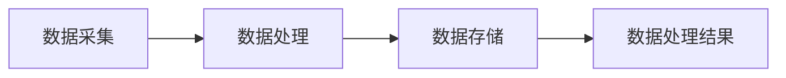
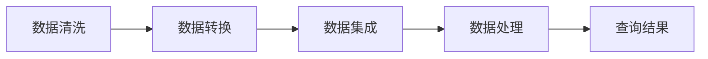

                 

# 大数据技术

> 关键词：大数据技术、Hadoop、Spark、数据挖掘、机器学习、人工智能、数据可视化

> 摘要：本文深入探讨了大数据技术的核心概念、架构、算法原理以及在金融、医疗、零售、政府等多个领域的应用。通过逐步分析推理，文章旨在为读者提供一个全面、系统、易懂的大数据技术指南，帮助读者掌握大数据技术的核心要点和实际应用。

## 第一部分：大数据技术基础

### 第1章：大数据技术基础

#### 1.1 大数据的定义与特点

##### 1.1.1 大数据的定义

大数据通常指的是数据量巨大、类型多样、生成速度快的数据集合。根据Gartner的定义，大数据具备四个V特点：Volume（数据量）、Velocity（速度）、Variety（多样性）和Veracity（真实性）。

##### 1.1.2 大数据的主要特点

1. 数据量大：大数据的规模通常在PB（皮字节）甚至ZB（泽字节）级别。
2. 数据类型多样：包括结构化数据、非结构化数据、半结构化数据等。
3. 数据生成速度快：实时产生和处理数据的能力。
4. 数据真实性高：需要保证数据的质量和准确性。

##### 1.1.3 大数据与传统数据处理的区别

1. 数据源不同：大数据不仅包括企业内部数据，还包括互联网、物联网等外部数据源。
2. 数据处理方法不同：大数据处理需要分布式计算和存储技术。
3. 数据分析复杂度不同：大数据分析通常涉及复杂的算法和模型。

#### 1.2 大数据的发展历程

##### 1.2.1 大数据的起源

大数据的概念最早可以追溯到20世纪80年代，随着互联网和计算机技术的快速发展，大数据逐渐成为一个热门研究领域。

##### 1.2.2 大数据技术发展的重要阶段

1. 2004年：Google发布MapReduce论文，标志着分布式计算技术的兴起。
2. 2005年：Apache Hadoop项目成立，成为大数据处理的重要框架。
3. 2009年：Apache Spark项目启动，为大数据实时处理提供了新的选择。
4. 2013年：大数据成为Gartner技术成熟度曲线上的热门技术。

##### 1.2.3 当前大数据技术的发展趋势

1. 数据治理与合规：数据质量、安全和隐私成为大数据发展的关键。
2. 云计算与大数据的结合：云计算提供弹性的计算资源，助力大数据处理。
3. AI与大数据的融合：利用机器学习和深度学习技术，实现更智能的数据分析。

#### 1.3 大数据在各行业中的应用

##### 1.3.1 金融行业

大数据在金融行业的应用广泛，包括风险控制、信用评估、交易分析、客户行为预测等。

##### 1.3.2 零售行业

零售行业利用大数据进行销售预测、库存管理、客户行为分析等，以提高运营效率和客户满意度。

##### 1.3.3 医疗行业

医疗行业通过大数据实现个性化诊疗、疾病预测、药物研发等，提高医疗服务的质量和效率。

##### 1.3.4 政府部门

政府部门利用大数据进行公共安全、社会治理、政策制定等，提升政府工作效率和公共服务水平。

##### 1.3.5 其他行业

大数据在制造业、能源、交通等行业也有广泛的应用，如智能制造、智能电网、智能交通等。

#### 1.4 大数据技术的核心架构

##### 1.4.1 数据采集

数据采集是大数据处理的第一步，包括从各种数据源（如数据库、传感器、网站等）获取数据。

##### 1.4.2 数据存储

数据存储负责存储和管理大规模数据，常用的技术包括HDFS（Hadoop分布式文件系统）、HBase等。

##### 1.4.3 数据处理

数据处理包括数据的清洗、转换、集成等，常用的技术包括MapReduce、Spark等。

##### 1.4.4 数据分析

数据分析利用算法和模型对数据进行深入挖掘，提取有价值的信息，常用的技术包括数据挖掘、机器学习等。

#### 1.5 大数据技术面临的挑战与应对策略

##### 1.5.1 数据质量与数据隐私

挑战：数据质量差和数据隐私泄露是大数据技术面临的主要挑战。

应对策略：通过数据治理和隐私保护技术，如数据加密、匿名化等，确保数据质量和隐私。

##### 1.5.2 数据安全与法律合规

挑战：数据安全和法律合规是大数据技术应用的重要问题。

应对策略：加强数据安全管理，遵守相关法律法规，确保数据安全和合规。

##### 1.5.3 数据复杂性

挑战：大数据处理涉及多种数据类型、复杂算法和模型，对技术要求高。

应对策略：通过分布式计算和云计算技术，降低数据复杂性，提高数据处理效率。

##### 1.5.4 技术与人才挑战

挑战：大数据技术发展和应用需要大量的技术人才。

应对策略：加强大数据人才培养，提高行业技术水平。

## 第一部分：大数据技术基础

### 第2章：大数据核心概念与架构

#### 2.1 大数据生态系统概述

##### 2.1.1 Hadoop生态系统

Hadoop是大数据处理的重要框架，包括HDFS（Hadoop分布式文件系统）、MapReduce（分布式数据处理框架）、YARN（资源调度框架）等。

##### 2.1.2 Spark生态系统

Spark是大数据实时处理的重要框架，包括Spark SQL（数据处理）、Spark MLlib（机器学习）、Spark Streaming（实时数据处理）等。

##### 2.1.3 Storm生态系统

Storm是大数据实时处理的开源分布式系统，主要用于实时流数据处理。

#### 2.2 数据采集与数据质量

##### 2.2.1 数据源分类

数据源可以分为内部数据源（如数据库、日志文件等）和外部数据源（如社交媒体、物联网设备等）。

##### 2.2.2 数据采集方法

数据采集方法包括API调用、网络爬虫、传感器采集等。

##### 2.2.3 数据质量管理

数据质量管理包括数据清洗、去重、格式化等，确保数据质量。

#### 2.3 数据存储技术

##### 2.3.1 关系型数据库

关系型数据库（如MySQL、Oracle等）适用于存储结构化数据。

##### 2.3.2 非关系型数据库

非关系型数据库（如MongoDB、Cassandra等）适用于存储半结构化数据和非结构化数据。

##### 2.3.3 分布式文件系统

分布式文件系统（如HDFS、Ceph等）适用于存储大规模数据。

#### 2.4 数据处理框架

##### 2.4.1 Hadoop MapReduce

MapReduce是Hadoop的分布式数据处理框架，用于大规模数据集的并行处理。

##### 2.4.2 Spark计算框架

Spark是一种快速的分布式计算引擎，适用于实时数据处理。

##### 2.4.3 Storm实时计算

Storm是一种分布式、实时的大数据处理系统，适用于实时流数据处理。

#### 2.5 数据分析技术

##### 2.5.1 数据挖掘

数据挖掘是从大量数据中提取有价值信息的过程，常用的算法包括聚类、分类、关联规则等。

##### 2.5.2 数据可视化

数据可视化是将数据转化为图形或图表的过程，帮助人们更好地理解和分析数据。

##### 2.5.3 数据仓库

数据仓库是一个用于存储和管理大量数据的系统，用于支持企业决策。

#### 2.6 大数据技术在企业中的应用案例

##### 2.6.1 金融行业案例

金融行业通过大数据技术进行风险控制、客户行为分析和欺诈检测等。

##### 2.6.2 零售行业案例

零售行业利用大数据技术进行销售预测、库存管理和客户个性化推荐等。

##### 2.6.3 医疗行业案例

医疗行业通过大数据技术进行疾病预测、药物研发和医疗数据分析等。

## 第一部分：大数据技术核心概念与架构

### 第3章：大数据核心算法原理

#### 3.1 数据清洗与预处理

##### 3.1.1 数据清洗方法

数据清洗方法包括去除重复数据、处理缺失值、异常值处理等。

##### 3.1.2 数据预处理流程

数据预处理流程包括数据清洗、数据转换和数据集成等。

##### 3.1.3 数据缺失处理

数据缺失处理方法包括删除缺失数据、填充缺失数据和预测缺失数据等。

#### 3.2 数据挖掘算法

##### 3.2.1 聚类分析算法

聚类分析算法是将数据集划分为多个簇的过程，常用的算法包括K-means、层次聚类等。

##### 3.2.2 分页算法

分页算法是将大数据集划分为多个小数据集的过程，用于优化查询性能。

##### 3.2.3 关联规则挖掘

关联规则挖掘是从数据集中发现关联规则的过程，常用的算法包括Apriori算法、FP-growth算法等。

#### 3.3 数据分析算法

##### 3.3.1 时间序列分析

时间序列分析是研究时间序列数据的方法，常用的算法包括ARIMA、SARIMA等。

##### 3.3.2 回归分析

回归分析是研究变量之间线性关系的方法，常用的算法包括线性回归、多元回归等。

##### 3.3.3 决策树与随机森林

决策树和随机森林是分类和回归的重要算法，具有较好的解释性和准确性。

#### 3.4 特征工程

##### 3.4.1 特征选择方法

特征选择方法包括过滤式方法、包裹式方法和嵌入式方法等。

##### 3.4.2 特征提取方法

特征提取方法包括主成分分析、线性判别分析等。

##### 3.4.3 特征工程实践

特征工程实践包括特征提取、特征选择、特征组合等过程。

#### 3.5 机器学习算法

##### 3.5.1 监督学习算法

监督学习算法包括线性回归、决策树、支持向量机等。

##### 3.5.2 无监督学习算法

无监督学习算法包括聚类、降维等。

##### 3.5.3 强化学习算法

强化学习算法是解决序列决策问题的重要算法，包括Q-Learning、策略梯度等。

#### 3.6 大数据技术在AI领域的应用

##### 3.6.1 深度学习在图像识别中的应用

深度学习在图像识别领域有广泛的应用，包括卷积神经网络（CNN）等。

##### 3.6.2 自然语言处理

自然语言处理是深度学习的重要应用领域，包括词嵌入、序列标注等。

##### 3.6.3 强化学习在机器人领域的应用

强化学习在机器人领域有广泛的应用，包括路径规划、控制策略等。

## 第一部分：大数据技术核心算法原理

### 第4章：大数据技术项目实战

#### 4.1 实战一：数据采集与预处理

##### 4.1.1 数据采集工具选择

数据采集工具包括Elasticsearch、Apache Kafka等。

##### 4.1.2 数据预处理流程设计

数据预处理流程包括数据清洗、数据转换和数据集成等。

##### 4.1.3 数据预处理代码实现

数据预处理代码实现可以参考Python的pandas库。

#### 4.2 实战二：数据存储与查询

##### 4.2.1 数据存储方案设计

数据存储方案包括HDFS、HBase等。

##### 4.2.2 数据查询工具选择

数据查询工具包括Apache Hive、Apache Spark SQL等。

##### 4.2.3 数据查询代码实现

数据查询代码实现可以参考SQL查询语句。

#### 4.3 实战三：数据分析与可视化

##### 4.3.1 数据分析需求分析

数据分析需求分析包括数据指标设定、分析目标等。

##### 4.3.2 数据可视化工具选择

数据可视化工具包括ECharts、Tableau等。

##### 4.3.3 数据可视化代码实现

数据可视化代码实现可以参考JavaScript库，如D3.js。

#### 4.4 实战四：大数据应用案例

##### 4.4.1 金融风控案例

金融风控案例包括信用评分、欺诈检测等。

##### 4.4.2 零售行业推荐系统案例

零售行业推荐系统案例包括商品推荐、用户行为分析等。

##### 4.4.3 医疗大数据分析案例

医疗大数据分析案例包括疾病预测、药物研发等。

## 第一部分：大数据技术项目实战

### 第5章：大数据技术在AI领域的应用

#### 5.1 AI与大数据的融合

##### 5.1.1 AI在大数据时代的发展机遇

AI在大数据时代的发展机遇包括智能分析、自动化决策等。

##### 5.1.2 大数据为AI提供的数据支持

大数据为AI提供丰富的数据资源，促进AI算法的优化和模型训练。

##### 5.1.3 AI技术在大数据处理中的应用

AI技术在大数据处理中的应用包括数据清洗、数据分类等。

#### 5.2 深度学习在图像识别中的应用

##### 5.2.1 图像识别的基本概念

图像识别是计算机视觉的重要任务，包括对象识别、场景识别等。

##### 5.2.2 卷积神经网络（CNN）在图像识别中的应用

卷积神经网络（CNN）是图像识别的核心算法，通过多层卷积和池化操作提取图像特征。

##### 5.2.3 图像识别实战案例

图像识别实战案例包括人脸识别、物体识别等。

#### 5.3 自然语言处理（NLP）技术

##### 5.3.1 NLP的基本概念

自然语言处理（NLP）是研究计算机处理自然语言的方法，包括文本分类、情感分析等。

##### 5.3.2 词嵌入技术

词嵌入技术是将词语映射到高维空间中的向量表示，有助于改善NLP算法的性能。

##### 5.3.3 序列标注与分类

序列标注与分类是NLP的重要任务，包括命名实体识别、文本分类等。

##### 5.3.4 文本生成与摘要

文本生成与摘要是NLP的重要应用，包括自动摘要、文本生成等。

#### 5.4 强化学习在机器人领域的应用

##### 5.4.1 强化学习的基本概念

强化学习是机器人领域的重要算法，通过学习奖励信号来优化决策。

##### 5.4.2 Q-Learning算法

Q-Learning算法是强化学习的一种方法，通过学习Q值来优化策略。

##### 5.4.3 策略梯度算法

策略梯度算法是强化学习的另一种方法，通过优化策略梯度来优化策略。

##### 5.4.4 强化学习在机器人导航中的应用

强化学习在机器人导航中的应用包括路径规划、环境交互等。

#### 5.5 大数据与智能城市的建设

##### 5.5.1 智能城市的概念与意义

智能城市是指利用信息技术构建高效、绿色、智能的城市管理体系。

##### 5.5.2 大数据在智能城市中的应用

大数据在智能城市中的应用包括交通管理、能源管理、社会治理等。

##### 5.5.3 智能城市的案例分析

智能城市的案例分析包括智能交通系统、智能能源管理平台等。

## 第一部分：大数据技术在AI领域的应用

### 第6章：大数据技术在金融领域的应用

#### 6.1 金融大数据概述

##### 6.1.1 金融大数据的定义

金融大数据是指金融行业在业务运营、风险管理、客户服务等方面产生的海量数据。

##### 6.1.2 金融大数据的应用场景

金融大数据的应用场景包括风险控制、投资策略、客户体验等。

##### 6.1.3 金融大数据的挑战与机遇

金融大数据的挑战包括数据质量、数据隐私、数据合规等，同时带来业务创新、风险控制等机遇。

#### 6.2 金融风控与大数据

##### 6.2.1 金融风险管理的现状与挑战

金融风险管理的现状与挑战包括信用风险、市场风险、操作风险等。

##### 6.2.2 大数据在金融风控中的应用

大数据在金融风控中的应用包括信用评分、欺诈检测、市场预测等。

##### 6.2.3 金融风控大数据实战案例

金融风控大数据实战案例包括信用卡欺诈检测、贷款风险评估等。

#### 6.3 金融市场预测与大数据

##### 6.3.1 金融市场预测的挑战与机遇

金融市场预测的挑战与机遇包括数据获取、算法选择、预测精度等。

##### 6.3.2 大数据在金融市场预测中的应用

大数据在金融市场预测中的应用包括股票预测、外汇预测等。

##### 6.3.3 金融市场预测大数据实战案例

金融市场预测大数据实战案例包括股票市场趋势预测、外汇市场波动预测等。

#### 6.4 金融个人化服务与大数据

##### 6.4.1 金融个人化服务的现状与挑战

金融个人化服务的现状与挑战包括用户体验、个性化推荐等。

##### 6.4.2 大数据在金融个人化服务中的应用

大数据在金融个人化服务中的应用包括客户行为分析、个性化推荐等。

##### 6.4.3 金融个人化服务大数据实战案例

金融个人化服务大数据实战案例包括个性化理财产品推荐、个性化金融服务等。

#### 6.5 金融区块链与大数据

##### 6.5.1 区块链的基本概念与原理

区块链是一种分布式数据库技术，具有去中心化、不可篡改等特点。

##### 6.5.2 大数据与区块链的融合应用

大数据与区块链的融合应用包括智能合约、数据分析等。

##### 6.5.3 金融区块链与大数据实战案例

金融区块链与大数据实战案例包括智能合约审计、数据分析等。

## 第一部分：大数据技术在金融领域的应用

### 第7章：大数据技术在医疗领域的应用

#### 7.1 医疗大数据概述

##### 7.1.1 医疗大数据的定义

医疗大数据是指医疗行业在诊疗、研究、管理等方面产生的海量数据。

##### 7.1.2 医疗大数据的应用场景

医疗大数据的应用场景包括疾病预测、药物研发、医疗服务优化等。

##### 7.1.3 医疗大数据的挑战与机遇

医疗大数据的挑战包括数据质量、数据隐私、数据合规等，同时带来医疗创新、效率提升等机遇。

#### 7.2 医疗数据分析与大数据

##### 7.2.1 医疗数据分析的基本概念

医疗数据分析是指利用统计、机器学习等方法对医疗数据进行处理和分析。

##### 7.2.2 大数据在医疗数据分析中的应用

大数据在医疗数据分析中的应用包括疾病预测、诊断辅助等。

##### 7.2.3 医疗数据分析实战案例

医疗数据分析实战案例包括疾病预测、诊断辅助等。

#### 7.3 医疗智能诊断与大数据

##### 7.3.1 医疗智能诊断的基本概念

医疗智能诊断是指利用人工智能技术进行疾病诊断和预测。

##### 7.3.2 大数据在医疗智能诊断中的应用

大数据在医疗智能诊断中的应用包括医学图像分析、基因数据分析等。

##### 7.3.3 医疗智能诊断实战案例

医疗智能诊断实战案例包括医学图像分析、基因数据分析等。

#### 7.4 医疗电子病历与大数据

##### 7.4.1 医疗电子病历的基本概念

医疗电子病历是指将患者的诊疗信息数字化，以便于存储、管理和查询。

##### 7.4.2 大数据在医疗电子病历中的应用

大数据在医疗电子病历中的应用包括电子病历管理、患者行为分析等。

##### 7.4.3 医疗电子病历实战案例

医疗电子病历实战案例包括电子病历管理、患者行为分析等。

#### 7.5 医疗健康管理与大数据

##### 7.5.1 医疗健康管理的基本概念

医疗健康管理是指通过数据监控和干预，帮助患者管理健康。

##### 7.5.2 大数据在医疗健康管理中的应用

大数据在医疗健康管理中的应用包括健康数据监测、个性化健康建议等。

##### 7.5.3 医疗健康管理实战案例

医疗健康管理实战案例包括健康数据监测、个性化健康建议等。

## 第二部分：大数据技术在其他领域的应用

### 第8章：大数据技术在零售行业的应用

#### 8.1 零售大数据概述

##### 8.1.1 零售大数据的定义

零售大数据是指零售行业在业务运营、营销、供应链等方面产生的海量数据。

##### 8.1.2 零售大数据的应用场景

零售大数据的应用场景包括销售预测、客户行为分析、库存管理等。

##### 8.1.3 零售大数据的挑战与机遇

零售大数据的挑战包括数据质量、数据隐私、数据合规等，同时带来业务优化、决策支持等机遇。

#### 8.2 零售数据分析与大数据

##### 8.2.1 零售数据分析的基本概念

零售数据分析是指利用统计、机器学习等方法对零售数据进行分析。

##### 8.2.2 大数据在零售数据分析中的应用

大数据在零售数据分析中的应用包括销售预测、客户流失预测等。

##### 8.2.3 零售数据分析实战案例

零售数据分析实战案例包括销售预测、客户流失预测等。

#### 8.3 零售个性化推荐与大数据

##### 8.3.1 零售个性化推荐的基本概念

零售个性化推荐是指根据用户行为和偏好，为用户推荐商品。

##### 8.3.2 大数据在零售个性化推荐中的应用

大数据在零售个性化推荐中的应用包括用户行为分析、商品推荐等。

##### 8.3.3 零售个性化推荐实战案例

零售个性化推荐实战案例包括商品推荐、用户画像等。

#### 8.4 零售供应链管理与大数据

##### 8.4.1 零售供应链管理的基本概念

零售供应链管理是指对零售供应链的各个环节进行优化和管理。

##### 8.4.2 大数据在零售供应链管理中的应用

大数据在零售供应链管理中的应用包括库存管理、物流优化等。

##### 8.4.3 零售供应链管理实战案例

零售供应链管理实战案例包括库存管理、物流优化等。

#### 8.5 零售智能支付与大数据

##### 8.5.1 零售智能支付的基本概念

零售智能支付是指利用大数据和人工智能技术，实现智能化的支付服务。

##### 8.5.2 大数据在零售智能支付中的应用

大数据在零售智能支付中的应用包括支付安全、支付体验优化等。

##### 8.5.3 零售智能支付实战案例

零售智能支付实战案例包括支付安全、支付体验优化等。

## 第二部分：大数据技术在其他领域的应用

### 第9章：大数据技术在政府部门的运用

#### 9.1 政府大数据概述

##### 9.1.1 政府大数据的定义

政府大数据是指政府部门在公共服务、社会治理、决策支持等方面产生的海量数据。

##### 9.1.2 政府大数据的应用场景

政府大数据的应用场景包括公共服务优化、社会治理创新、决策支持等。

##### 9.1.3 政府大数据的挑战与机遇

政府大数据的挑战包括数据质量、数据隐私、数据合规等，同时带来公共服务优化、决策支持等机遇。

#### 9.2 政务数据管理与大数据

##### 9.2.1 政务数据管理的基本概念

政务数据管理是指对政府数据资源进行规划、组织、管理和利用。

##### 9.2.2 大数据在政务数据管理中的应用

大数据在政务数据管理中的应用包括数据整合、数据共享等。

##### 9.2.3 政务数据管理实战案例

政务数据管理实战案例包括数据整合、数据共享等。

#### 9.3 智能城市与大数据

##### 9.3.1 智能城市的基本概念

智能城市是指利用信息技术构建高效、绿色、智能的城市管理体系。

##### 9.3.2 大数据在智能城市中的应用

大数据在智能城市中的应用包括交通管理、能源管理、环境监测等。

##### 9.3.3 智能城市实战案例

智能城市实战案例包括智能交通系统、智能环境监测等。

#### 9.4 政府决策支持与大数据

##### 9.4.1 政府决策支持的基本概念

政府决策支持是指利用大数据技术，为政府部门提供决策支持。

##### 9.4.2 大数据在政府决策支持中的应用

大数据在政府决策支持中的应用包括政策评估、风险预测等。

##### 9.4.3 政府决策支持实战案例

政府决策支持实战案例包括政策评估、风险预测等。

## 第二部分：大数据技术在政府部门的运用

### 第10章：大数据技术在制造业的应用

#### 10.1 制造业大数据概述

##### 10.1.1 制造业大数据的定义

制造业大数据是指制造业在生产经营、质量管理、供应链管理等方面产生的海量数据。

##### 10.1.2 制造业大数据的应用场景

制造业大数据的应用场景包括生产优化、质量管理、供应链优化等。

##### 10.1.3 制造业大数据的挑战与机遇

制造业大数据的挑战包括数据质量、数据隐私、数据合规等，同时带来生产优化、质量管理等机遇。

#### 10.2 智能制造与大数据

##### 10.2.1 智能制造的基本概念

智能制造是指利用信息技术和智能技术，实现制造业的智能化升级。

##### 10.2.2 大数据在智能制造中的应用

大数据在智能制造中的应用包括生产优化、质量管理等。

##### 10.2.3 智能制造实战案例

智能制造实战案例包括生产优化、质量管理等。

#### 10.3 生产优化与大数据

##### 10.3.1 生产优化的基本概念

生产优化是指通过优化生产计划、生产流程等，提高生产效率和产品质量。

##### 10.3.2 大数据在生产优化中的应用

大数据在生产优化中的应用包括生产计划优化、生产流程优化等。

##### 10.3.3 生产优化实战案例

生产优化实战案例包括生产计划优化、生产流程优化等。

#### 10.4 质量管理与大数据

##### 10.4.1 质量管理的基本概念

质量管理是指通过制定和执行质量标准，确保产品和服务的质量。

##### 10.4.2 大数据在质量管理中的应用

大数据在质量管理中的应用包括质量监控、质量分析等。

##### 10.4.3 质量管理实战案例

质量管理实战案例包括质量监控、质量分析等。

#### 10.5 制造业供应链管理与大数据

##### 10.5.1 制造业供应链管理的基本概念

制造业供应链管理是指对制造业供应链的各个环节进行优化和管理。

##### 10.5.2 大数据在制造业供应链管理中的应用

大数据在制造业供应链管理中的应用包括供应链优化、物流管理等。

##### 10.5.3 制造业供应链管理实战案例

制造业供应链管理实战案例包括供应链优化、物流管理等。

## 第二部分：大数据技术在制造业的应用

### 第11章：大数据技术在能源行业的应用

#### 11.1 能源大数据概述

##### 11.1.1 能源大数据的定义

能源大数据是指能源行业在能源生产、能源消费、能源管理等方面产生的海量数据。

##### 11.1.2 能源大数据的应用场景

能源大数据的应用场景包括能源优化、能源监测、能源管理等。

##### 11.1.3 能源大数据的挑战与机遇

能源大数据的挑战包括数据质量、数据隐私、数据合规等，同时带来能源优化、能源管理等机遇。

#### 11.2 智能能源管理与大数据

##### 11.2.1 智能能源管理的基本概念

智能能源管理是指利用信息技术和智能技术，实现能源的智能化管理和优化。

##### 11.2.2 大数据在智能能源管理中的应用

大数据在智能能源管理中的应用包括能源监测、能源优化等。

##### 11.2.3 智能能源管理实战案例

智能能源管理实战案例包括能源监测、能源优化等。

#### 11.3 能源优化与大数据

##### 11.3.1 能源优化的基本概念

能源优化是指通过优化能源生产、能源消费等，提高能源利用效率和降低能源成本。

##### 11.3.2 大数据在能源优化中的应用

大数据在能源优化中的应用包括能源需求预测、能源调度优化等。

##### 11.3.3 能源优化实战案例

能源优化实战案例包括能源需求预测、能源调度优化等。

#### 11.4 能源市场分析与大数据

##### 11.4.1 能源市场分析的基本概念

能源市场分析是指通过对能源市场的数据进行分析，为能源市场提供决策支持。

##### 11.4.2 大数据在能源市场分析中的应用

大数据在能源市场分析中的应用包括价格预测、供需分析等。

##### 11.4.3 能源市场分析实战案例

能源市场分析实战案例包括价格预测、供需分析等。

#### 11.5 绿色能源与大数据

##### 11.5.1 绿色能源的基本概念

绿色能源是指对环境友好的能源，包括太阳能、风能、水能等。

##### 11.5.2 大数据在绿色能源中的应用

大数据在绿色能源中的应用包括能源监测、能源调度优化等。

##### 11.5.3 绿色能源实战案例

绿色能源实战案例包括能源监测、能源调度优化等。

## 第二部分：大数据技术在能源行业的应用

### 第12章：大数据技术在交通领域的应用

#### 12.1 交通大数据概述

##### 12.1.1 交通大数据的定义

交通大数据是指交通行业在交通管理、交通规划、交通运输等方面产生的海量数据。

##### 12.1.2 交通大数据的应用场景

交通大数据的应用场景包括交通流量监测、交通预测、交通优化等。

##### 12.1.3 交通大数据的挑战与机遇

交通大数据的挑战包括数据质量、数据隐私、数据合规等，同时带来交通优化、交通管理等机遇。

#### 12.2 智能交通管理与大数据

##### 12.2.1 智能交通管理的基本概念

智能交通管理是指利用信息技术和智能技术，实现交通的智能化管理和优化。

##### 12.2.2 大数据在智能交通管理中的应用

大数据在智能交通管理中的应用包括交通流量监测、交通预测等。

##### 12.2.3 智能交通管理实战案例

智能交通管理实战案例包括交通流量监测、交通预测等。

#### 12.3 交通流量分析与大数据

##### 12.3.1 交通流量分析的基本概念

交通流量分析是指通过对交通流量数据进行处理和分析，为交通管理提供决策支持。

##### 12.3.2 大数据在交通流量分析中的应用

大数据在交通流量分析中的应用包括交通流量预测、交通拥堵分析等。

##### 12.3.3 交通流量分析实战案例

交通流量分析实战案例包括交通流量预测、交通拥堵分析等。

#### 12.4 车联网与大数据

##### 12.4.1 车联网的基本概念

车联网是指将车辆与互联网连接，实现车辆的智能化管理和控制。

##### 12.4.2 大数据在车联网中的应用

大数据在车联网中的应用包括车辆状态监测、车辆安全预警等。

##### 12.4.3 车联网实战案例

车联网实战案例包括车辆状态监测、车辆安全预警等。

#### 12.5 智能交通系统与大数据

##### 12.5.1 智能交通系统的基本概念

智能交通系统是指利用信息技术和智能技术，实现交通的智能化管理和优化。

##### 12.5.2 大数据在智能交通系统中的应用

大数据在智能交通系统中的应用包括交通信号控制、车辆导航等。

##### 12.5.3 智能交通系统实战案例

智能交通系统实战案例包括交通信号控制、车辆导航等。

## 第二部分：大数据技术在交通领域的应用

### 第13章：大数据技术的未来发展趋势

#### 13.1 大数据技术的未来发展趋势

##### 13.1.1 数据量与数据类型的增长

随着互联网、物联网等技术的发展，数据量将呈现指数级增长，数据类型也将更加多样。

##### 13.1.2 数据处理速度的提升

未来，数据处理速度将不断提升，支持更实时、更高效的数据分析。

##### 13.1.3 数据隐私保护与数据安全

随着数据隐私保护法规的完善，数据隐私保护与数据安全将成为大数据技术的重要发展方向。

#### 13.2 大数据技术在各行业中的应用前景

##### 13.2.1 金融行业

金融行业将继续利用大数据技术进行风险管理、欺诈检测、个性化服务等方面。

##### 13.2.2 零售行业

零售行业将更加依赖于大数据技术进行销售预测、客户行为分析、库存管理等方面。

##### 13.2.3 医疗行业

医疗行业将利用大数据技术实现个性化诊疗、疾病预测、药物研发等方面。

##### 13.2.4 制造业

制造业将利用大数据技术实现智能制造、生产优化、质量管理等方面。

##### 13.2.5 能源行业

能源行业将利用大数据技术实现能源优化、智能电网、绿色能源管理等方面。

##### 13.2.6 交通行业

交通行业将利用大数据技术实现智能交通管理、交通流量分析、车联网等方面。

#### 13.3 大数据技术与新兴技术的融合

##### 13.3.1 区块链

大数据技术与区块链技术的融合将实现更安全、更可靠的数据存储和传输。

##### 13.3.2 物联网

大数据技术与物联网技术的融合将实现更广泛、更智能的数据采集和处理。

##### 13.3.3 人工智能

大数据技术与人工智能技术的融合将实现更智能的数据分析、决策支持等方面。

#### 13.4 大数据技术的未来挑战与机遇

##### 13.4.1 数据治理

数据治理将是大数据技术发展的重要挑战，也是未来发展的关键。

##### 13.4.2 技术创新

大数据技术的不断创新将推动各行业的发展和应用。

##### 13.4.3 数据人才

大数据技术的发展需要大量专业人才，培养和引进数据人才将是重要任务。

## 第二部分：大数据技术的未来发展趋势

### 第三部分：大数据技术的实践与案例分析

#### 第14章：大数据技术实践

##### 14.1 实践一：搭建大数据平台

**概述**：大数据平台搭建是大数据技术实践的基础，本文将介绍大数据平台的搭建过程。

**数据采集与存储**：

**数据处理与查询**：

##### 14.2 实践二：大数据分析项目

**项目需求分析**：分析项目需求，确定数据来源、分析目标等。

**数据采集与预处理**：根据需求，采集数据并预处理，包括数据清洗、去重、格式化等。

**数据分析与可视化**：使用数据分析工具（如Python、R等）进行数据分析，并使用可视化工具（如ECharts、Tableau等）进行数据可视化。

##### 14.3 实践三：大数据技术在企业中的应用

**企业大数据应用概述**：介绍企业大数据应用的背景、目标和具体应用场景。

**企业大数据项目案例**：介绍具体的企业大数据项目案例，包括项目目标、数据来源、处理方法、应用效果等。

**企业大数据应用效果评估**：评估大数据技术在企业中的应用效果，包括业务指标、用户体验等。

##### 14.4 实践四：大数据技术在各行业中的应用

**零售行业案例**：介绍大数据技术在零售行业中的应用，包括销售预测、库存管理、客户行为分析等。

**医疗行业案例**：介绍大数据技术在医疗行业中的应用，包括疾病预测、药物研发、医疗数据分析等。

**金融行业案例**：介绍大数据技术在金融行业中的应用，包括风险控制、投资策略、客户服务优化等。

**政府部门案例**：介绍大数据技术在政府部门中的应用，包括公共服务优化、社会治理创新、决策支持等。

## 第三部分：大数据技术的实践与案例分析

### 附录

#### 附录A：大数据技术常用工具与框架

**A.1 Hadoop生态圈**

- HDFS：Hadoop分布式文件系统
- MapReduce：分布式数据处理框架
- YARN：资源调度框架
- Hive：数据仓库
- HBase：分布式存储系统

**A.2 Spark生态圈**

- Spark SQL：数据处理框架
- Spark MLlib：机器学习库
- Spark Streaming：实时数据处理框架
- GraphX：图处理框架

**A.3 Flink生态圈**

- Flink SQL：数据处理框架
- Flink Streaming：实时数据处理框架
- Flink ML：机器学习库
- Flink Gelly：图处理库

**A.4 其他大数据工具**

- Elasticsearch：搜索引擎
- Kafka：消息队列
- MongoDB：非关系型数据库
- Cassandra：分布式数据库

#### 附录B：大数据技术相关资源

**B.1 在线课程**

- Coursera：大数据分析课程
- edX：大数据处理课程
- Udemy：大数据技术课程

**B.2 技术社区**

- DataCamp：数据分析社区
- KDNuggets：大数据技术社区
- Analytics Vidhya：数据分析社区

**B.3 学术论文**

- arXiv：计算机科学论文库
- IEEE Xplore：计算机科学期刊论文库
- ACM Digital Library：计算机科学论文库

#### 附录C：常见问题与解决方案

**C.1 数据质量问题**

- 数据缺失处理：填充缺失值、删除缺失数据等
- 数据清洗：去除重复数据、处理异常值等

**C.2 性能优化问题**

- 分布式计算：使用分布式计算框架（如Hadoop、Spark等）
- 缓存技术：使用缓存技术（如Redis、Memcached等）优化查询性能

**C.3 安全性问题**

- 数据加密：使用数据加密技术（如AES、RSA等）保护数据
- 访问控制：使用访问控制技术（如ACL、RBAC等）限制数据访问

## 作者

作者：AI天才研究院/AI Genius Institute & 禅与计算机程序设计艺术 /Zen And The Art of Computer Programming

