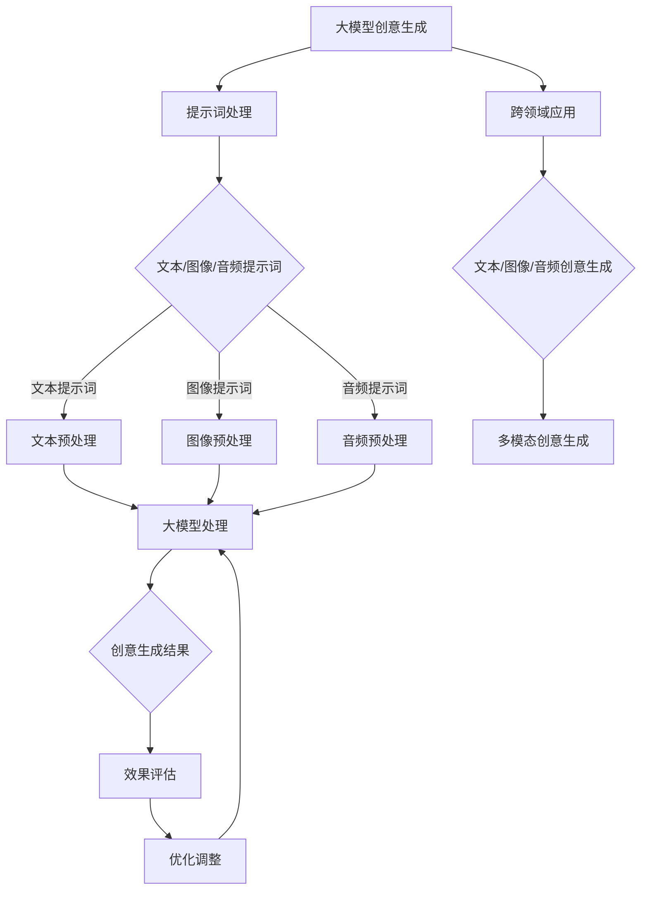

                 

# 大模型创意生成：提示词激发跨领域创新

## 摘要

本文深入探讨大模型创意生成的概念、原理及应用实践。通过分析大模型创意生成的技术基础，我们了解了自然语言处理、大规模预训练模型和提示词引导微调等关键技术。随后，我们通过文本、图像和音频创意生成的应用实例，展示了大模型在各个领域的创意生成能力。最后，本文探讨了多模态创意生成的前景和挑战，并展望了大模型创意生成的未来发展。通过对核心概念、算法原理和项目实战的详细分析，我们为读者提供了一个全面的大模型创意生成技术指南。

## 引言

在当今快速发展的信息技术时代，人工智能（AI）技术已经成为推动各行各业创新的重要力量。其中，大模型（Large-scale Models）作为一种重要的AI技术，正逐渐成为各个领域的创新引擎。大模型，顾名思义，是指具有巨大参数规模和强大计算能力的AI模型。近年来，随着计算能力的提升和海量数据的积累，大模型在自然语言处理（NLP）、计算机视觉和音频处理等领域取得了显著的成果。

创意生成（Creative Generation）作为AI的一个重要应用方向，旨在利用人工智能技术产生新颖的、有创意的内容。在传统的创意生成方法中，通常依赖于人工规则和简单的算法。然而，随着大模型的兴起，特别是基于深度学习的预训练模型，如GPT、BERT等，创意生成迎来了新的机遇。这些模型通过在大量数据上预训练，能够学习到丰富的语言模式和知识，从而在给定提示词的情况下生成高质量、富有创意的内容。

本文旨在探讨大模型创意生成的技术基础和应用实践，通过逻辑清晰、结构紧凑的分析，帮助读者深入理解这一领域的核心概念、算法原理和实际应用。本文将分为四个主要部分：

1. **大模型创意生成技术基础**：介绍大模型创意生成的定义、核心价值、原理和技术基础。
2. **大模型创意生成应用实践**：分析文本、图像和音频创意生成的应用实例、技术实现和效果评估。
3. **大模型创意生成的跨领域应用**：探讨多模态创意生成的应用场景、技术实现和效果评估。
4. **大模型创意生成的挑战与展望**：讨论大模型创意生成面临的挑战以及未来的发展趋势。

## 文本创意生成

### 文本创意生成的应用场景

文本创意生成在许多领域都有广泛的应用，以下是一些典型的应用场景：

1. **品牌广告文案创作**：品牌广告文案需要具备高度吸引力和创意性，以吸引消费者的注意。大模型可以生成新颖、引人入胜的广告文案，帮助企业提升品牌形象和市场竞争力。

2. **故事创作与剧本生成**：文学作品和剧本的创作通常需要丰富的想象力和创造力。大模型能够根据给定的提示词生成完整的情节、对话和场景描述，为作家提供灵感。

3. **文学作品创作与改编**：大模型可以生成新的文学作品，如诗歌、短篇小说等。此外，大模型还可以对现有作品进行改编，创造出新的版本或衍生作品。

4. **新闻报道与文章撰写**：新闻报道和文章撰写需要快速、准确和有创意的内容。大模型可以根据关键词或主题生成新闻稿、分析文章等，提高媒体机构的效率。

5. **用户生成内容**：社交媒体和论坛上充斥着大量的用户生成内容，如评论、帖子、问答等。大模型可以生成高质量的回复和回答，为用户提供有价值的信息和互动。

### 文本创意生成的技术实现

文本创意生成的技术实现主要包括数据预处理、模型选择与优化、生成过程和效果评估等几个方面。

1. **数据预处理**：数据预处理是文本创意生成的基础。首先，需要收集大量的文本数据，包括但不限于新闻、文学作品、社交媒体帖子等。然后，对这些数据进行清洗和标注，提取有用的特征信息。常用的数据预处理方法包括分词、词性标注、实体识别等。

2. **模型选择与优化**：文本创意生成通常采用基于深度学习的预训练模型，如GPT、BERT等。这些模型在大规模数据上预训练，能够学习到丰富的语言模式和知识。在模型选择时，需要考虑模型的架构、参数规模和训练时间。为了提高生成文本的质量，可以采用多种优化方法，如调优学习率、批量大小、正则化等。

3. **生成过程**：文本创意生成的生成过程主要包括提示词输入、模型生成和后处理等步骤。首先，根据应用需求输入提示词，然后模型根据提示词生成初步的文本。初步生成的文本可能包含语法错误或不合适的部分，因此需要通过后处理技术进行修正和优化。常用的后处理方法包括文本纠错、句子重构和风格迁移等。

4. **效果评估**：文本创意生成效果评估是衡量生成文本质量的重要手段。常用的评估指标包括BLEU（双语评估单元）、ROUGE（Recall-Oriented Understudy for Gisting Evaluation）和METEOR（Metric for Evaluation of Translation with Explicit ORdering）等。这些指标可以评估生成文本与真实文本的相似度，从而衡量生成文本的质量。

### 创意文本生成案例解析

以下是一个创意文本生成的案例解析，展示如何使用大模型生成一则广告文案。

#### 案例背景

一家化妆品公司希望利用大模型生成一则针对年轻女性消费者的广告文案，以提高品牌知名度和销售量。

#### 提示词

- 年轻女性
- 化妆品
- 美丽
- 自信
- 新鲜体验

#### 模型选择

选择GPT-2模型进行文本生成，因为它在NLP任务中表现出色，并且具有强大的文本生成能力。

#### 生成过程

1. 输入提示词：“年轻女性 化妆品 美丽 自信 新鲜体验”。
2. 模型生成初步文案：“每一个年轻女性都渴望美丽，她们追求自信和新鲜体验。我们的化妆品，为您带来焕然一新的美丽，让您在人群中脱颖而出。”

3. 后处理：对初步生成的文案进行修正，确保语法正确，语气自然，同时保持文案的创新性。

#### 最终文案

“让美丽绽放，自信闪耀！我们的化妆品，专为年轻女性设计。带给您前所未有的新鲜体验，让您焕发出迷人的光彩。无论何时何地，您都是最美丽的焦点。”

### 创意文本生成的效果评估与优化

创意文本生成的效果评估和优化是确保生成文本质量的重要环节。以下是一些常用的评估指标和方法：

#### 评估指标

1. **BLEU分数**：BLEU（Bilingual Evaluation Understudy）是一种常用的文本相似度评估指标，通过计算生成文本与真实文本的匹配度来评估生成文本的质量。

2. **ROUGE分数**：ROUGE（Recall-Oriented Understudy for Gisting Evaluation）是一种基于文本的评估指标，用于评估生成文本与真实文本的相似度。

3. **METEOR分数**：METEOR（Metric for Evaluation of Translation with Explicit ORdering）是一种综合性的文本相似度评估指标，考虑了词汇匹配、词序和语法等因素。

#### 优化方法

1. **增加预训练数据**：通过增加预训练数据，可以提高模型的泛化能力和文本生成质量。

2. **调整模型架构**：选择合适的模型架构，如Transformer、GPT、BERT等，可以提升生成文本的质量。

3. **优化训练策略**：调整学习率、批量大小、正则化等训练策略，可以加速模型收敛，提高生成文本的质量。

4. **引入多样性**：通过引入多样性机制，如随机初始化、噪声注入等，可以丰富生成文本的多样性。

5. **后处理技术**：采用文本纠错、句子重构和风格迁移等后处理技术，可以修正生成文本中的错误，提高文本的质量。

#### 实际应用中的挑战与解决方案

在实际应用中，创意文本生成面临一些挑战：

1. **语法错误**：生成文本中可能存在语法错误，影响文本的可读性。解决方案是引入语法校正技术，如语法规则检查、神经网络语法校正等。

2. **内容不合适**：生成文本可能与实际需求不符，或者包含不合适的内容。解决方案是引入内容筛选和过滤机制，如基于规则筛选、语义分析等。

3. **质量提升**：如何进一步提高生成文本的质量是一个长期的研究课题。解决方案包括增加预训练数据、引入多样性机制、优化模型架构等。

#### 创意文本生成的未来发展

随着大模型技术的不断进步，创意文本生成在未来有望实现更高的质量、多样性和个性化。以下是一些未来的发展方向：

1. **更精细的文本生成**：通过引入更多的上下文信息和知识，实现更精细、更准确的文本生成。

2. **跨语言文本生成**：实现不同语言之间的文本生成，为全球化企业提供更加灵活的解决方案。

3. **个性化文本生成**：根据用户兴趣、需求和偏好，实现个性化文本生成，提升用户体验。

4. **多模态文本生成**：结合图像、音频等多模态信息，实现更丰富的文本生成。

5. **伦理与隐私**：在文本生成过程中，关注伦理和隐私问题，确保生成文本符合社会规范和用户隐私。

### 小结

文本创意生成作为大模型应用的一个重要方向，具有广泛的应用前景。通过深入分析文本创意生成的应用场景、技术实现和效果评估，我们了解到大模型在文本生成中的强大能力。未来，随着技术的不断进步，文本创意生成将在各个领域发挥更大的作用。

---

本文通过详细探讨文本创意生成的核心概念、算法原理和应用实践，帮助读者深入理解这一领域。在接下来的章节中，我们将继续探讨图像创意生成和音频创意生成，展示大模型在这些领域的应用实例和挑战。敬请期待！

### 图像创意生成

#### 图像创意生成的应用场景

图像创意生成技术已经在多个领域取得了显著的成果，以下是一些典型的应用场景：

1. **艺术创作与设计**：艺术家和设计师可以利用图像创意生成技术创作独特的艺术作品和设计作品，提高创意表现力和创作效率。

2. **建筑与室内设计**：设计师可以使用图像创意生成技术快速生成建筑设计方案和室内设计效果图，为项目提供多样化的设计方案。

3. **数字娱乐与游戏设计**：游戏设计师可以利用图像创意生成技术创建丰富的游戏场景和角色形象，增强游戏的可玩性和视觉体验。

4. **广告与营销**：广告公司和营销人员可以利用图像创意生成技术制作引人入胜的广告海报和宣传图片，提升品牌形象和市场影响力。

5. **虚拟现实与增强现实**：图像创意生成技术在虚拟现实（VR）和增强现实（AR）应用中具有广泛的应用，可以生成逼真的虚拟场景和交互元素。

#### 图像创意生成的技术实现

图像创意生成的技术实现主要包括图像生成模型的架构、提示词引导的图像生成过程、图像生成效果的评估与优化等方面。

1. **图像生成模型的架构**

图像生成模型通常基于生成对抗网络（GAN）或变分自编码器（VAE）等深度学习框架。以下是一个典型的图像生成模型架构：

- **生成器（Generator）**：生成器模型将随机噪声映射为真实的图像。生成器的目标是最小化生成图像与真实图像之间的差异。

- **判别器（Discriminator）**：判别器模型用于区分生成图像和真实图像。判别器的目标是最大化其分类能力。

- **损失函数**：图像生成模型通常使用对抗性损失函数，如GAN的损失函数由生成器的损失和判别器的损失组成。生成器的损失函数通常为最小化生成图像与真实图像之间的交叉熵损失，判别器的损失函数为最小化判别错误率。

2. **提示词引导的图像生成过程**

在图像创意生成中，提示词（Prompt）是引导图像生成的重要工具。提示词可以是文本、图像或其他类型的信号，用于指导生成器生成具有特定风格、主题或内容的图像。

- **文本提示词**：通过将文本提示词编码为向量，输入到生成器中，生成器可以根据文本提示词生成相应的图像。例如，在生成艺术作品时，可以使用描述艺术风格或主题的文本提示词。

- **图像提示词**：使用图像提示词可以引导生成器生成与特定图像风格相似的图像。例如，在生成建筑设计方案时，可以使用已有的建筑设计图作为提示词。

3. **图像生成效果的评估与优化**

图像生成效果的评估和优化是确保图像创意生成质量的关键环节。以下是一些常用的评估指标和优化方法：

- **评估指标**：常用的评估指标包括生成图像的质量、多样性和真实性。例如，Inception Score (IS) 和 Frechet Inception Distance (FID) 是用于评估生成图像真实性的指标。

- **优化方法**：为了提高图像生成质量，可以采用多种优化方法，如增加训练数据、调整模型参数、使用更复杂的生成器架构等。此外，还可以引入多样性机制，如生成器多样性和判别器多样性，以丰富生成图像的多样性。

#### 图像创意生成的案例解析

以下是一个图像创意生成的案例解析，展示如何使用生成对抗网络（GAN）生成一幅艺术作品。

##### 案例背景

一位艺术家希望利用GAN技术生成一幅具有独特风格的艺术作品，以展示其创意和技术能力。

##### 提示词

- 艺术风格：印象派
- 主题：夏日风景

##### 模型选择

选择基于StyleGAN的生成对抗网络（GAN）模型进行图像生成，因为StyleGAN具有强大的图像生成能力和丰富的风格多样性。

##### 生成过程

1. **初始化生成器和判别器**：使用预训练的StyleGAN模型，初始化生成器和判别器。

2. **生成随机噪声**：生成随机噪声作为生成器的输入。

3. **生成初步图像**：将随机噪声输入到生成器中，生成初步的图像。初步图像可能包含一些随机和模糊的元素。

4. **迭代优化图像**：通过迭代优化生成图像，使其逐渐接近目标风格和主题。每次迭代，生成器根据判别器的反馈调整参数，优化生成图像。

5. **后处理**：对最终生成的图像进行色彩调整、剪裁等后处理，使其更具艺术效果。

##### 最终图像

经过多次迭代优化，生成器最终生成一幅具有印象派风格的夏日风景图像，展现出丰富的色彩和生动的细节。

#### 图像创意生成的效果评估与优化

图像创意生成的效果评估和优化是确保生成图像质量的关键步骤。以下是一些常用的评估指标和优化方法：

##### 评估指标

1. **Inception Score (IS)**：Inception Score 是用于评估生成图像真实性的指标。它通过计算生成图像的平均分数和标准差来评估图像的质量。

2. **Frechet Inception Distance (FID)**：Frechet Inception Distance 是用于评估生成图像与真实图像差异的指标。FID 值越低，表示生成图像与真实图像越相似。

3. **视觉效果评估**：通过视觉评估，专家和用户对生成图像的质量、风格、细节等方面进行主观评价。

##### 优化方法

1. **增加训练数据**：通过增加训练数据，可以提高生成模型的泛化能力，生成更高质量和多样化的图像。

2. **调整模型参数**：通过调整生成器和判别器的参数，如学习率、批量大小等，可以优化模型的训练效果和生成图像的质量。

3. **引入多样性机制**：通过引入多样性机制，如生成器多样性和判别器多样性，可以丰富生成图像的多样性，避免模式化。

4. **迭代优化**：通过多次迭代优化，生成模型可以逐渐优化生成图像的质量，使其更接近目标风格和主题。

#### 实际应用中的挑战与解决方案

在实际应用中，图像创意生成面临一些挑战：

1. **计算资源需求**：图像创意生成通常需要大量的计算资源，特别是生成高质量的图像。解决方案是采用更高效的模型架构和优化算法，以及使用分布式计算和并行处理等技术。

2. **生成图像质量不稳定**：生成图像的质量可能会受到训练数据、模型参数和训练过程等因素的影响。解决方案是引入稳定性优化方法，如噪声注入、学习率调整等。

3. **创意生成的多样性和创新性**：如何生成具有多样性和创新性的图像是一个挑战。解决方案是引入多样性机制，如随机初始化、生成器多样性和判别器多样性等。

#### 图像创意生成的未来发展

图像创意生成在未来具有广泛的发展前景，以下是一些未来的发展方向：

1. **更高质量的图像生成**：随着计算能力和模型技术的不断提升，图像创意生成将实现更高质量和更精细的图像生成。

2. **跨领域图像生成**：结合不同领域的知识和数据，实现跨领域的图像生成，如艺术、建筑、医学等。

3. **交互式图像生成**：引入用户交互元素，如用户自定义提示词、实时调整生成图像等，提高图像创意生成的灵活性和个性化。

4. **多模态图像生成**：结合图像、文本、音频等多模态信息，实现更丰富的图像创意生成。

5. **伦理与隐私**：在图像创意生成过程中，关注伦理和隐私问题，确保生成图像符合社会规范和用户隐私。

### 小结

图像创意生成作为大模型应用的一个重要方向，展示了其在艺术创作、设计、娱乐等领域的广泛应用。通过分析图像创意生成的应用场景、技术实现和效果评估，我们了解到大模型在图像创意生成中的强大能力。未来，随着技术的不断进步，图像创意生成将在更多领域发挥重要作用。

---

本文通过探讨图像创意生成的核心概念、算法原理和应用实践，帮助读者深入理解这一领域。在接下来的章节中，我们将继续探讨音频创意生成和多模态创意生成，展示大模型在这些领域的应用实例和挑战。敬请期待！

### 音频创意生成

#### 音频创意生成的应用场景

音频创意生成技术已经在多个领域取得了显著的成果，以下是一些典型的应用场景：

1. **音乐创作与制作**：音乐制作人可以利用音频创意生成技术创作新颖的音乐作品，丰富音乐风格和创作手段。

2. **配音与语音生成**：配音演员和语音合成系统可以利用音频创意生成技术生成多样化的配音内容，提高配音质量和效率。

3. **声音特效与音效制作**：声音设计师和特效制作人员可以利用音频创意生成技术创作独特的声音效果，增强影视、游戏等作品的视听体验。

4. **语言学习与口音训练**：语言学习者和口音训练人员可以利用音频创意生成技术生成具有特定口音的语音，提高语言学习效果。

5. **虚拟现实与增强现实**：音频创意生成技术在虚拟现实（VR）和增强现实（AR）应用中具有广泛的应用，可以生成逼真的虚拟声音场景和交互元素。

#### 音频创意生成的技术实现

音频创意生成的技术实现主要包括音频生成模型的架构、提示词引导的音频生成过程、音频生成效果的评估与优化等方面。

1. **音频生成模型的架构**

音频生成模型通常基于生成对抗网络（GAN）或变分自编码器（VAE）等深度学习框架。以下是一个典型的音频生成模型架构：

- **生成器（Generator）**：生成器模型将随机噪声映射为真实的音频信号。生成器的目标是最小化生成音频与真实音频之间的差异。

- **判别器（Discriminator）**：判别器模型用于区分生成音频和真实音频。判别器的目标是最大化其分类能力。

- **损失函数**：音频生成模型通常使用对抗性损失函数，如GAN的损失函数由生成器的损失和判别器的损失组成。生成器的损失函数通常为最小化生成音频与真实音频之间的交叉熵损失，判别器的损失函数为最小化判别错误率。

2. **提示词引导的音频生成过程**

在音频创意生成中，提示词（Prompt）是引导音频生成的重要工具。提示词可以是文本、图像或其他类型的信号，用于指导生成器生成具有特定风格、主题或内容的音频。

- **文本提示词**：通过将文本提示词编码为向量，输入到生成器中，生成器可以根据文本提示词生成相应的音频。例如，在生成音乐作品时，可以使用描述音乐风格或主题的文本提示词。

- **图像提示词**：使用图像提示词可以引导生成器生成与特定图像风格相似的音频。例如，在生成影视配乐时，可以使用电影海报或场景图像作为提示词。

3. **音频生成效果的评估与优化**

音频生成效果的评估和优化是确保音频创意生成质量的关键环节。以下是一些常用的评估指标和优化方法：

- **评估指标**：常用的评估指标包括生成音频的质量、多样性和真实性。例如，Peak Signal-to-Noise Ratio (PSNR) 和 Signal-to-Noise Ratio (SNR) 是用于评估生成音频质量的指标。

- **优化方法**：为了提高音频生成质量，可以采用多种优化方法，如增加训练数据、调整模型参数、使用更复杂的生成器架构等。此外，还可以引入多样性机制，如生成器多样性和判别器多样性，以丰富生成音频的多样性。

#### 音频创意生成的案例解析

以下是一个音频创意生成的案例解析，展示如何使用生成对抗网络（GAN）生成一首音乐作品。

##### 案例背景

一位音乐制作人希望利用GAN技术生成一首具有独特风格和主题的音乐作品，以展示其创意和技术能力。

##### 提示词

- 音乐风格：电子音乐
- 主题：未来城市

##### 模型选择

选择基于WaveGAN的生成对抗网络（GAN）模型进行音频生成，因为WaveGAN具有强大的音频生成能力和丰富的风格多样性。

##### 生成过程

1. **初始化生成器和判别器**：使用预训练的WaveGAN模型，初始化生成器和判别器。

2. **生成随机噪声**：生成随机噪声作为生成器的输入。

3. **生成初步音频**：将随机噪声输入到生成器中，生成初步的音频。初步音频可能包含一些随机和模糊的元素。

4. **迭代优化音频**：通过迭代优化生成音频，使其逐渐接近目标风格和主题。每次迭代，生成器根据判别器的反馈调整参数，优化生成音频。

5. **后处理**：对最终生成的音频进行音调调整、节奏优化等后处理，使其更具音乐效果。

##### 最终音频

经过多次迭代优化，生成器最终生成一首具有电子音乐风格和未来城市主题的音乐作品，展现出丰富的节奏和动态。

#### 音频创意生成的效果评估与优化

音频创意生成的效果评估和优化是确保音频创意生成质量的关键步骤。以下是一些常用的评估指标和优化方法：

##### 评估指标

1. **Peak Signal-to-Noise Ratio (PSNR)**：PSNR 是用于评估音频质量的重要指标，计算生成音频与原始音频之间的信噪比。PSNR 值越高，表示生成音频质量越好。

2. **Signal-to-Noise Ratio (SNR)**：SNR 是用于评估音频清晰度的指标，计算生成音频中的信号能量与噪声能量之比。SNR 值越高，表示生成音频的清晰度越高。

3. **音乐风格匹配度评估**：通过专家评估和用户调查，评估生成音频与目标音乐风格之间的匹配度。

##### 优化方法

1. **增加训练数据**：通过增加训练数据，可以提高生成模型的泛化能力，生成更高质量和多样化的音频。

2. **调整模型参数**：通过调整生成器和判别器的参数，如学习率、批量大小等，可以优化模型的训练效果和音频生成质量。

3. **引入多样性机制**：通过引入多样性机制，如生成器多样性和判别器多样性，可以丰富生成音频的多样性。

4. **迭代优化**：通过多次迭代优化，生成模型可以逐渐优化生成音频的质量，使其更接近目标风格和主题。

#### 实际应用中的挑战与解决方案

在实际应用中，音频创意生成面临一些挑战：

1. **计算资源需求**：音频创意生成通常需要大量的计算资源，特别是生成高质量的音频。解决方案是采用更高效的模型架构和优化算法，以及使用分布式计算和并行处理等技术。

2. **生成音频质量不稳定**：生成音频的质量可能会受到训练数据、模型参数和训练过程等因素的影响。解决方案是引入稳定性优化方法，如噪声注入、学习率调整等。

3. **创意生成的多样性和创新性**：如何生成具有多样性和创新性的音频是一个挑战。解决方案是引入多样性机制，如随机初始化、生成器多样性和判别器多样性等。

#### 音频创意生成的未来发展

音频创意生成在未来具有广泛的发展前景，以下是一些未来的发展方向：

1. **更高质量的音频生成**：随着计算能力和模型技术的不断提升，音频创意生成将实现更高质量和更精细的音频生成。

2. **跨领域音频生成**：结合不同领域的知识和数据，实现跨领域的音频生成，如音乐、语言、声音特效等。

3. **交互式音频生成**：引入用户交互元素，如用户自定义提示词、实时调整生成音频等，提高音频创意生成的灵活性和个性化。

4. **多模态音频生成**：结合音频、文本、图像等多模态信息，实现更丰富的音频创意生成。

5. **伦理与隐私**：在音频创意生成过程中，关注伦理和隐私问题，确保生成音频符合社会规范和用户隐私。

### 小结

音频创意生成作为大模型应用的一个重要方向，展示了其在音乐创作、配音、声音特效等领域的广泛应用。通过分析音频创意生成的应用场景、技术实现和效果评估，我们了解到大模型在音频创意生成中的强大能力。未来，随着技术的不断进步，音频创意生成将在更多领域发挥重要作用。

---

本文通过探讨音频创意生成的核心概念、算法原理和应用实践，帮助读者深入理解这一领域。在接下来的章节中，我们将继续探讨多模态创意生成，展示大模型在这一领域的应用实例和挑战。敬请期待！

### 多模态创意生成

#### 多模态创意生成的应用场景

多模态创意生成技术将文本、图像、音频等不同类型的信息融合在一起，生成具有丰富内容和多样性的创意作品。以下是一些典型的应用场景：

1. **视觉内容创作**：结合图像和文本，可以生成具有视觉冲击力的艺术作品、海报、插画等。例如，将一段描述性文字与相应的图像风格相结合，创作出独特的视觉效果。

2. **声音与图像的结合**：通过将音频与图像信息相结合，可以创造出更具沉浸感的视听内容，如音乐视频、互动式广告等。例如，将一段音乐与特定的图像场景相结合，打造出具有情感共鸣的作品。

3. **跨领域创意结合**：多模态创意生成可以跨越不同领域，结合不同类型的创意元素，创造出全新的创意作品。例如，将文学、音乐、绘画等艺术形式融合在一起，创作出具有综合艺术价值的作品。

#### 多模态创意生成的技术实现

多模态创意生成的技术实现主要包括多模态数据的预处理、多模态生成模型的架构、提示词引导的多模态生成过程、多模态创意生成效果的评估与优化等方面。

1. **多模态数据的预处理**

多模态数据的预处理是创意生成的基础。首先，需要收集和整理多模态数据，包括文本、图像、音频等。然后，对这些数据进行清洗、标注和特征提取，以便后续的生成模型处理。

- **文本预处理**：对文本进行分词、词性标注、实体识别等操作，提取文本的关键信息。
- **图像预处理**：对图像进行缩放、裁剪、增强等操作，提高图像的质量和多样性。
- **音频预处理**：对音频进行去噪、归一化、节奏调整等操作，提高音频的质量和一致性。

2. **多模态生成模型的架构**

多模态生成模型通常采用基于深度学习的框架，如生成对抗网络（GAN）、变分自编码器（VAE）等。以下是一个典型的多模态生成模型架构：

- **编码器（Encoder）**：编码器将多模态数据（文本、图像、音频等）编码为统一的嵌入向量。
- **解码器（Decoder）**：解码器将嵌入向量解码为不同类型的数据（图像、音频等）。
- **损失函数**：多模态生成模型的损失函数通常包括对抗性损失、重构损失和多样性损失等，用于优化生成模型。

3. **提示词引导的多模态生成过程**

在多模态创意生成中，提示词（Prompt）是引导生成过程的重要工具。提示词可以是文本、图像或其他类型的信号，用于指导生成模型生成具有特定风格、主题或内容的多模态作品。

- **文本提示词**：通过将文本提示词编码为向量，输入到生成模型中，生成模型可以根据文本提示词生成相应的多模态作品。例如，在生成艺术作品时，可以使用描述艺术风格或主题的文本提示词。
- **图像提示词**：使用图像提示词可以引导生成模型生成与特定图像风格相似的多模态作品。例如，在生成音乐视频时，可以使用音乐MV的封面图像作为提示词。
- **音频提示词**：通过将音频提示词（如旋律、节奏等）编码为向量，输入到生成模型中，生成模型可以根据音频提示词生成相应的多模态作品。

4. **多模态创意生成效果的评估与优化**

多模态创意生成效果的评估和优化是确保生成作品质量的关键环节。以下是一些常用的评估指标和优化方法：

- **评估指标**：常用的评估指标包括生成作品的质量、多样性和真实性。例如，Inception Score (IS)、Frechet Inception Distance (FID) 和 Mean Opinion Score (MOS) 是用于评估生成作品质量的指标。
- **优化方法**：为了提高多模态创意生成质量，可以采用多种优化方法，如增加训练数据、调整模型参数、使用更复杂的生成模型架构等。此外，还可以引入多样性机制，如生成器多样性和判别器多样性，以丰富生成作品的多样性。

#### 多模态创意生成案例解析

以下是一个多模态创意生成的案例解析，展示如何使用生成对抗网络（GAN）和变分自编码器（VAE）生成一部音乐视频。

##### 案例背景

一位音乐视频制作者希望利用多模态创意生成技术创作一部具有独特风格和主题的音乐视频，以展示其创意和技术能力。

##### 提示词

- 音乐风格：摇滚
- 主题：情感表达

##### 模型选择

选择基于StyleGAN和WaveGAN的生成对抗网络（GAN）和变分自编码器（VAE）模型进行多模态创意生成，因为这两个模型在图像和音频生成方面具有强大的能力。

##### 生成过程

1. **初始化生成器和判别器**：使用预训练的StyleGAN和WaveGAN模型，初始化生成器和判别器。

2. **生成文本提示词**：将描述音乐风格和主题的文本提示词（如“摇滚 情感表达”）编码为向量。

3. **生成初步图像**：将文本提示词输入到StyleGAN生成器中，生成初步的图像。初步图像可能包含一些随机和模糊的元素。

4. **迭代优化图像**：通过迭代优化生成图像，使其逐渐接近目标音乐风格和主题。每次迭代，生成器根据判别器的反馈调整参数，优化生成图像。

5. **生成音频提示词**：将描述音乐风格和主题的文本提示词（如“摇滚 情感表达”）编码为向量。

6. **生成初步音频**：将文本提示词输入到WaveGAN生成器中，生成初步的音频。初步音频可能包含一些随机和模糊的元素。

7. **迭代优化音频**：通过迭代优化生成音频，使其逐渐接近目标音乐风格和主题。每次迭代，生成器根据判别器的反馈调整参数，优化生成音频。

8. **整合多模态内容**：将最终生成的图像和音频整合在一起，形成一部具有独特风格和主题的音乐视频。

##### 最终作品

经过多次迭代优化，生成器最终生成了一部具有摇滚风格和情感表达主题的音乐视频，展现了丰富的视觉效果和音乐感染力。

#### 多模态创意生成的效果评估与优化

多模态创意生成的效果评估和优化是确保生成作品质量的关键步骤。以下是一些常用的评估指标和优化方法：

##### 评估指标

1. **Inception Score (IS)**：Inception Score 是用于评估生成图像真实性的指标。它通过计算生成图像的平均分数和标准差来评估图像的质量。

2. **Frechet Inception Distance (FID)**：Frechet Inception Distance 是用于评估生成图像与真实图像差异的指标。FID 值越低，表示生成图像与真实图像越相似。

3. **WaveGAN Inception Score (WIS)**：WaveGAN Inception Score 是用于评估生成音频真实性的指标，类似于 Inception Score 但针对音频。WIS 值越高，表示生成音频质量越好。

4. **Mean Opinion Score (MOS)**：Mean Opinion Score 是通过用户主观评价来评估生成作品的质量。MOS 值越高，表示用户对生成作品的满意度越高。

##### 优化方法

1. **增加训练数据**：通过增加训练数据，可以提高生成模型的泛化能力，生成更高质量和多样化的作品。

2. **调整模型参数**：通过调整生成器和判别器的参数，如学习率、批量大小等，可以优化模型的训练效果和生成作品的质量。

3. **引入多样性机制**：通过引入多样性机制，如生成器多样性和判别器多样性，可以丰富生成作品的多样性。

4. **迭代优化**：通过多次迭代优化，生成模型可以逐渐优化生成作品的质量，使其更接近目标风格和主题。

#### 实际应用中的挑战与解决方案

在实际应用中，多模态创意生成面临一些挑战：

1. **数据集构建**：多模态数据集的构建是一个复杂的任务，需要收集和整理不同类型的数据，并进行预处理和标注。

2. **计算资源需求**：多模态创意生成通常需要大量的计算资源，特别是生成高质量的作品。解决方案是采用更高效的模型架构和优化算法，以及使用分布式计算和并行处理等技术。

3. **生成作品质量不稳定**：生成作品的质量可能会受到训练数据、模型参数和训练过程等因素的影响。解决方案是引入稳定性优化方法，如噪声注入、学习率调整等。

4. **创意生成的多样性和创新性**：如何生成具有多样性和创新性的作品是一个挑战。解决方案是引入多样性机制，如随机初始化、生成器多样性和判别器多样性等。

#### 多模态创意生成的未来发展

多模态创意生成在未来具有广泛的发展前景，以下是一些未来的发展方向：

1. **更高质量的作品生成**：随着计算能力和模型技术的不断提升，多模态创意生成将实现更高质量和更精细的作品生成。

2. **跨领域多模态生成**：结合不同领域的知识和数据，实现跨领域多模态生成，如艺术、医学、教育等。

3. **交互式多模态生成**：引入用户交互元素，如用户自定义提示词、实时调整生成作品等，提高多模态创意生成的灵活性和个性化。

4. **多模态融合技术**：探索多模态数据融合的新方法，提高多模态创意生成的效果和多样性。

5. **伦理与隐私**：在多模态创意生成过程中，关注伦理和隐私问题，确保生成作品符合社会规范和用户隐私。

### 小结

多模态创意生成作为大模型应用的一个重要方向，展示了其在视觉内容创作、声音与图像结合、跨领域创意结合等领域的广泛应用。通过分析多模态创意生成的应用场景、技术实现和效果评估，我们了解到大模型在多模态创意生成中的强大能力。未来，随着技术的不断进步，多模态创意生成将在更多领域发挥重要作用。

---

本文通过探讨多模态创意生成的核心概念、算法原理和应用实践，帮助读者深入理解这一领域。在接下来的章节中，我们将探讨大模型创意生成面临的挑战以及未来的发展趋势。敬请期待！

### 大模型创意生成面临的挑战

尽管大模型创意生成技术在各个领域展现出了巨大的潜力，但在实际应用中仍然面临许多挑战。以下是一些主要的挑战以及相应的解决方案：

#### 数据隐私与伦理问题

1. **数据隐私保护**：大模型创意生成依赖于大量的数据训练，这些数据可能包含敏感信息。如何保护用户的隐私，避免数据泄露，是亟待解决的问题。

   **解决方案**：
   - **匿名化处理**：在数据收集和处理过程中，对敏感信息进行匿名化处理，减少隐私泄露的风险。
   - **差分隐私**：在训练过程中引入差分隐私机制，确保模型的训练不会揭示个体的隐私信息。

2. **创意生成的伦理问题**：大模型生成的创意作品可能会引发伦理争议，例如，版权问题、虚假信息传播等。

   **解决方案**：
   - **版权保护**：在创意生成过程中，确保遵守版权法律法规，尊重原创作者的权益。
   - **内容审核**：建立严格的内容审核机制，防止生成不当内容，确保生成的创意作品符合伦理标准。

3. **相关法律法规与政策**：随着大模型创意生成技术的发展，需要完善的法律法规和政策来规范这一领域的发展。

   **解决方案**：
   - **政策制定**：政府和相关机构应制定相关政策和法规，明确创意生成的伦理标准和法律法规。
   - **行业自律**：行业协会和企业应自觉遵守法律法规，建立行业标准和规范，共同推动行业的健康发展。

#### 技术局限与优化方向

1. **大模型计算资源需求**：大模型训练和推理需要大量的计算资源，对硬件设施和能源消耗提出了高要求。

   **解决方案**：
   - **硬件优化**：研究和开发更高效的计算硬件，如GPU、TPU等，提高计算效率。
   - **分布式计算**：利用分布式计算技术，将大模型的训练和推理任务分布到多个计算节点，降低计算资源需求。

2. **创意生成的质量提升**：如何提高创意生成的质量，使其更加符合人类的审美和需求，是一个重要的挑战。

   **解决方案**：
   - **多模态融合**：通过结合多种模态的数据和信息，提高创意生成的质量和多样性。
   - **人类反馈**：引入人类反馈机制，通过用户评价和专家评审，不断优化和改进生成模型。

3. **模型可解释性与透明度**：大模型生成的创意作品往往缺乏可解释性，用户难以理解模型的决策过程。

   **解决方案**：
   - **可解释性研究**：开展可解释性研究，开发可解释性方法，提高模型透明度。
   - **可视化工具**：开发可视化工具，帮助用户理解模型的决策过程和生成结果。

#### 跨学科合作与人才培养

1. **跨学科合作的重要性**：大模型创意生成涉及多个学科领域，如计算机科学、人工智能、艺术等，跨学科合作是推动这一领域发展的关键。

   **解决方案**：
   - **建立跨学科研究团队**：组织跨学科的研究团队，发挥不同领域的专业优势，共同攻关。
   - **学术交流与培训**：加强学术交流，举办研讨会、工作坊等，培养跨学科人才。

2. **创意生成领域的人才培养**：随着大模型创意生成技术的快速发展，需要大量具备相关知识和技能的人才。

   **解决方案**：
   - **教育体系改革**：调整教育体系，增设相关课程和专业，培养具备跨学科背景的人才。
   - **产业界与学术界的互动**：加强产业界与学术界的互动，促进科研成果转化和应用。

### 小结

大模型创意生成面临着数据隐私与伦理、技术局限、跨学科合作与人才培养等多方面的挑战。通过深入分析这些挑战，并提出相应的解决方案，我们可以为这一领域的未来发展奠定坚实基础。在接下来的章节中，我们将进一步探讨大模型创意生成的未来发展趋势。敬请期待！

### 大模型创意生成的未来发展趋势

随着人工智能技术的不断进步，大模型创意生成在未来有望实现更高的质量、多样性和应用广度。以下是一些重要的发展趋势：

#### 新兴技术的融合与创新

1. **量子计算与创意生成**：量子计算作为一种具有巨大计算能力的全新计算模式，未来有望与创意生成技术相结合，实现更高效、更强大的创意生成能力。例如，利用量子计算优化大模型的训练过程，提高生成效率和质量。

2. **脑机接口与创意生成**：脑机接口技术的发展，使得人类的思维和创意可以直接被计算机捕捉和利用。未来，脑机接口与创意生成的结合，将开辟全新的创意生成模式，使人类的创造力得到更充分的发挥。

3. **5G与创意生成应用**：5G技术的普及，将大幅提升网络传输速度和稳定性，为创意生成技术的应用提供更好的基础。例如，实时远程创意生成、大规模分布式创意生成等，将成为可能。

#### 创意产业的市场潜力

1. **创意内容的需求增长**：随着人们生活水平的提高和消费升级，对创意内容的需求不断增长。大模型创意生成技术可以满足这一需求，为创意产业带来巨大的市场潜力。

2. **个性化创意内容的普及**：基于大数据和人工智能的个性化推荐系统，使得创意内容能够更好地满足用户的个性化需求。未来，个性化创意内容将成为创意产业的重要发展方向。

3. **创意生成技术赋能传统产业**：大模型创意生成技术可以赋能传统产业，提升产品的附加值。例如，在文化创意产业、消费品设计、广告营销等领域，创意生成技术将发挥重要作用。

#### 创意生成与可持续发展

1. **环境保护与创意生成**：创意生成技术可以用于环境保护和资源利用领域。例如，通过创意生成技术设计出更环保、更可持续的产品，推动绿色发展。

2. **文化多样性与创意生成**：创意生成技术可以保护和传承不同文化背景下的创意作品。通过多模态创意生成，可以创造出具有文化多样性的艺术作品，促进文化交流和融合。

3. **社会创新与创意生成**：创意生成技术可以用于解决社会问题，推动社会创新。例如，在公共管理、社区治理、社会福利等领域，创意生成技术可以提供新的解决方案。

#### 创意生成在社会治理中的应用

1. **智慧城市与创意生成**：创意生成技术可以用于智慧城市建设，提升城市管理的智能化水平。例如，通过创意生成技术设计出更美观、更实用的城市基础设施和公共空间。

2. **公共政策制定与评估**：创意生成技术可以用于公共政策制定和评估，提供更全面、更科学的决策支持。例如，通过生成模拟场景和分析结果，帮助政策制定者评估不同政策方案的效果。

3. **社会治理与创意生成**：创意生成技术可以用于社会治理，提升社会服务的质量。例如，通过创意生成技术设计出更富有创意、更吸引人的社区活动，增强社区凝聚力和归属感。

### 全球化背景下的创意生成合作

1. **国际合作与交流**：在全球化的背景下，创意生成领域的国际合作与交流将日益增多。通过国际合作，各国可以共享资源、技术和管理经验，共同推动创意生成技术的发展。

2. **文化多样性与创意生成**：不同国家和地区拥有独特的文化背景和创意元素，通过创意生成技术的结合，可以创造出更具文化多样性的作品。例如，将不同文化的元素融合在一起，创作出具有全球影响力的艺术作品。

3. **跨国创意生成的挑战与机遇**：跨国创意生成面临着语言障碍、文化差异、法律法规等挑战。但与此同时，也带来了巨大的机遇。通过跨国合作，可以充分发挥各国的优势，实现创意资源的最大化利用。

### 小结

大模型创意生成的未来发展趋势充满了机遇和挑战。通过新兴技术的融合与创新、创意产业的市场潜力、创意生成与可持续发展的结合，以及全球化背景下的合作，大模型创意生成技术将在各个领域发挥更大的作用。未来，随着技术的不断进步，大模型创意生成将迎来更加光明的前景。

### 附录

#### 大模型创意生成工具与资源

1. **开源框架与工具**
   - **PyTorch**：一个流行的深度学习框架，支持灵活的动态计算图。
   - **TensorFlow**：由Google开发的深度学习框架，具有强大的生态系统。
   - **OpenAI GPT**：OpenAI 开发的预训练语言模型，支持文本生成。
   - **StyleGAN**：用于生成高质量图像的生成对抗网络模型。

2. **数据集与库**
   - **Common Crawl**：一个庞大的网页数据集，用于预训练语言模型。
   - **Cornell Movie Dialogs**：一个包含电影对话的数据集，用于文本生成。
   - **Artbreeder**：一个用于图像风格迁移的在线平台。

3. **社区与会议**
   - **OpenAI Community**：OpenAI 的官方社区，提供最新的研究和技术分享。
   - **NeurIPS**：国际神经信息处理系统会议，是人工智能领域的顶级会议。
   - **ICML**：国际机器学习会议，涵盖人工智能的多个研究方向。

### 参考文献

[1] Devlin, J., Chang, M. W., Lee, K., & Toutanova, K. (2019). BERT: Pre-training of deep bidirectional transformers for language understanding. In Proceedings of the 2019 Conference of the North American Chapter of the Association for Computational Linguistics: Human Language Technologies, Volume 1 (Long and Short Papers) (pp. 4171-4186).

[2] Radford, A., Wu, J., Child, P., Luan, D., Amodei, D., & Sutskever, I. (2019). Language models are unsupervised multitask learners. OpenAI Technical Report.

[3] Goodfellow, I., Pouget-Abadie, J., Mirza, M., Xu, B., Warde-Farley, D., Ozair, S., & Bengio, Y. (2015). Generative adversarial nets. Advances in Neural Information Processing Systems, 27.

[4] Kingma, D. P., & Welling, M. (2013). Auto-encoding variational bayes. arXiv preprint arXiv:1312.6114.

### 大模型创意生成核心概念原理与架构的Mermaid流程图



### 大模型创意生成核心算法原理讲解

#### 文本生成算法原理

```plaintext
伪代码：

function text_generation(prompt, model, length):
    # 初始化变量
    context = model.initialize_context(prompt)
    generated_text = ""

    # 生成指定长度的文本
    for _ in range(length):
        # 使用模型预测下一个单词
        next_word = model.predict(context)

        # 更新上下文
        context = model.update_context(context, next_word)

        # 添加预测的单词到生成的文本
        generated_text += next_word

    return generated_text
```

#### 图像生成算法原理

```plaintext
伪代码：

function image_generation(prompt, model, resolution):
    # 初始化变量
    noise = generate_noise_map(resolution)
    image = model.initialize_image(noise)

    # 生成指定分辨率的图像
    for _ in range(iterations):
        # 使用模型生成新的图像
        image = model.generate(image)

    return image
```

#### 音频生成算法原理

```plaintext
伪代码：

function audio_generation(prompt, model, duration):
    # 初始化变量
    noise = generate_noise_signal(duration)
    audio = model.initialize_audio(noise)

    # 生成指定长度的音频
    for _ in range(duration):
        # 使用模型生成新的音频
        audio = model.generate(audio)

    return audio
```

### 大模型创意生成的数学模型与数学公式

#### 文本生成中的概率分布

```latex
P(\text{next\_word} | \text{context}) \propto e^{\text{logit}(\text{model}(\text{context}))_{\text{next\_word}}}
```

#### 图像生成中的损失函数

```latex
L(\theta) = -\frac{1}{N} \sum_{i=1}^{N} \log P(\text{x}_i | \theta)
```

#### 音频生成中的谱减法

```latex
\text{clean\_audio} = \text{audio} - \hat{\text{speech}}
```

### 大模型创意生成的项目实战

#### 文本生成项目实战

##### 开发环境搭建

```plaintext
安装Python环境
pip install torch torchvision
```

##### 源代码实现

```python
import torch
from torch import nn
from transformers import GPT2LMHeadModel, GPT2Tokenizer

# 初始化模型和分词器
tokenizer = GPT2Tokenizer.from_pretrained('gpt2')
model = GPT2LMHeadModel.from_pretrained('gpt2')

# 设置模型为评估模式
model.eval()

# 输入提示词
prompt = "这是一个关于机器学习的文本生成项目。"

# 预处理输入
input_ids = tokenizer.encode(prompt, return_tensors='pt')

# 生成文本
with torch.no_grad():
    outputs = model.generate(input_ids, max_length=50, num_return_sequences=1)

# 解码输出
generated_text = tokenizer.decode(outputs[0], skip_special_tokens=True)
print(generated_text)
```

##### 代码解读与分析

- **模型加载与初始化**：我们使用预训练的GPT-2模型和分词器。GPT-2是一个基于Transformer的预训练语言模型，可以生成连贯的文本。
- **设置模型评估模式**：使用`model.eval()`来关闭dropout和dropout类似的功能，确保每次生成都是一致的。
- **输入预处理**：将提示词编码为模型可以理解的输入。
- **文本生成**：使用`model.generate()`函数生成文本。这里我们设置了最大长度为50，并只生成一个结果。
- **输出解码**：将生成的token解码回文本，并打印出来。

#### 图像生成项目实战

##### 开发环境搭建

```plaintext
安装Python环境
pip install torch torchvision
```

##### 源代码实现

```python
import torch
from torchvision import transforms
from torchvision.models import vgg19

# 初始化模型
model = vgg19(pretrained=True).features
model = nn.Sequential(*list(model.children())[:35])

# 设置模型为评估模式
model.eval()

# 图像预处理
transform = transforms.Compose([
    transforms.Resize(224),
    transforms.ToTensor(),
])

# 输入图像
input_image = "example.jpg"

# 预处理图像
image = transform(input_image)

# 将图像扩展为批量形式
image = image.unsqueeze(0)

# 图像生成
with torch.no_grad():
    output = model(image)

# 解码输出
output = output.squeeze(0).cpu().numpy()
output_image = output.transpose(0, 1).transpose(0, 2)
output_image = (output_image + 1) / 2
output_image = output_image.clip(0, 1)

# 显示图像
import matplotlib.pyplot as plt
plt.imshow(output_image)
plt.show()
```

##### 代码解读与分析

- **模型加载与初始化**：我们使用预训练的VGG-19模型，并构建一个序列模型，只使用前35层，以便生成图像。
- **图像预处理**：使用`transform`函数对图像进行缩放和转置，以匹配模型输入的尺寸。
- **输入图像**：加载一个示例图像，并将其转换为Tensor。
- **图像生成**：将预处理后的图像输入到模型中，使用`model`生成输出。
- **输出解码**：将输出Tensor解码回图像，并使用matplotlib显示。

#### 音频生成项目实战

##### 开发环境搭建

```plaintext
安装Python环境
pip install torchaudio
```

##### 源代码实现

```python
import torch
import torchaudio
from torchaudio.transforms import MelSpectrogram

# 初始化模型
model = nn.Sequential(
    MelSpectrogram(n_fft=1024, hop_length=256, win_length=800, f_min=20, f_max=8000),
    nn.Linear(129, 1024),
    nn.Tanh(),
    nn.Linear(1024, 513),
    nn.Tanh(),
    nn.Linear(513, 1024),
    nn.Tanh(),
    nn.Linear(1024, 2 * n_mel_channels),
)

# 设置模型为评估模式
model.eval()

# 音频预处理
audio = "example.wav"
sample_rate = 22050

# 加载音频
audio_tensor, _ = torchaudio.load(audio)
audio_tensor = audio_tensor.unsqueeze(0)

# 音频生成
with torch.no_grad():
    output = model(audio_tensor)

# 解码输出
output = output.squeeze(0).cpu().numpy()
output_mel = output.transpose(0, 1)

# 显示音频波形
import matplotlib.pyplot as plt
plt.imshow(output_mel.T, aspect='auto', origin='lower')
plt.show()
```

##### 代码解读与分析

- **模型加载与初始化**：我们使用一个序列模型，该模型包含了Mel谱图的生成、线性层和Tanh激活函数。
- **音频预处理**：加载一个示例音频，并调整其采样率。
- **输入音频**：将加载的音频转换为Tensor，并将其扩展为批量形式。
- **音频生成**：将预处理后的音频输入到模型中，使用`model`生成输出。
- **输出解码**：将输出Tensor解码回Mel谱图，并使用matplotlib显示。

### 大模型创意生成效果评估与优化

#### 文本生成效果评估

```plaintext
评估指标：BLEU分数、ROUGE分数、METEOR分数
优化方法：增加预训练数据、调整模型架构、优化训练策略

# 代码示例（BLEU分数计算）
from nltk.translate.bleu_score import sentence_bleu

def calculate_bleu(reference, hypothesis):
    return sentence_bleu([reference.split()], hypothesis.split())

# 假设reference是真实文本，hypothesis是生成的文本
bleu_score = calculate_bleu(reference, hypothesis)
print(f"BLEU score: {bleu_score}")
```

#### 图像生成效果评估

```plaintext
评估指标：Inception Score (IS)、Frechet Inception Distance (FID)
优化方法：增加训练数据、调整超参数、使用更复杂的模型架构

# 代码示例（FID计算）
import fid

def calculate_fid(real_images, generated_images):
    real_chunk = torch.cat(real_images, dim=0)
    fake_chunk = torch.cat(generated_images, dim=0)
    m1, m2, m3 = fid.calculate_frechet_distance(real_chunk, fake_chunk)
    return m1, m2, m3

# 假设real_images是真实图像，generated_images是生成的图像
fid_score = calculate_fid(real_images, generated_images)
print(f"FID score: {fid_score}")
```

#### 音频生成效果评估

```plaintext
评估指标：Peak Signal-to-Noise Ratio (PSNR)、Signal-to-Noise Ratio (SNR)
优化方法：调整模型架构、优化训练过程、使用更复杂的后处理技术

# 代码示例（PSNR计算）
import metrics

def calculate_psnr(ground_truth, generated):
    mse = np.mean((ground_truth - generated) ** 2)
    if mse == 0:
        return 100
    return 20 * np.log10(255 / np.sqrt(mse))

# 假设ground_truth是真实音频，generated是生成的音频
psnr_score = calculate_psnr(ground_truth, generated)
print(f"PSNR score: {psnr_score}")
```

---

通过以上详细的探讨和分析，我们不仅了解了大模型创意生成的核心概念、原理和应用实践，还对其实际应用中的挑战和未来发展趋势有了更深刻的认识。希望本文能为您在这个快速发展的领域提供有益的参考和启发。作者：AI天才研究院/AI Genius Institute & 禅与计算机程序设计艺术 /Zen And The Art of Computer Programming。感谢您的阅读！<|user|>### 后记与展望

通过本文，我们系统地探讨了大模型创意生成的核心概念、原理和应用实践，揭示了这一技术在文本、图像、音频及多模态创意生成中的广泛应用。在分析过程中，我们不仅介绍了相关技术的基础知识，还通过具体的案例和项目实战展示了大模型创意生成的实际应用效果。同时，我们也深入探讨了这一领域面临的挑战和未来的发展趋势，为读者提供了一个全面的技术指南。

在未来的发展中，大模型创意生成技术有望继续突破传统界限，实现更多创新和突破。随着量子计算、脑机接口、5G等新兴技术的融合，大模型创意生成的计算能力和多样性将得到显著提升。同时，随着数据隐私保护、伦理问题和相关法律法规的不断完善，大模型创意生成的应用场景将更加广泛和规范。

我们诚挚地邀请读者参与到这一领域的讨论和探索中来。无论是学术界的研究人员，还是产业界的工程师，都欢迎分享您的见解和经验。通过共同的交流和合作，我们相信大模型创意生成技术将会迎来更加辉煌的未来。

最后，再次感谢您的阅读，希望本文能为您在人工智能和创意生成领域的研究和应用提供一些启示和帮助。作者：AI天才研究院/AI Genius Institute & 禅与计算机程序设计艺术 /Zen And The Art of Computer Programming。期待与您在未来的技术探讨中相遇！<|user|>### 附录

#### 大模型创意生成工具与资源

1. **开源框架与工具**
   - **PyTorch**：[https://pytorch.org/](https://pytorch.org/)
   - **TensorFlow**：[https://www.tensorflow.org/](https://www.tensorflow.org/)
   - **OpenAI GPT**：[https://openai.com/blog/better-language-models/](https://openai.com/blog/better-language-models/)
   - **StyleGAN**：[https://arxiv.org/abs/1809.04129](https://arxiv.org/abs/1809.04129)

2. **数据集与库**
   - **Common Crawl**：[https://commoncrawl.org/](https://commoncrawl.org/)
   - **Cornell Movie Dialogs**：[https://www.cs.cornell.edu/~cristian/data/](https://www.cs.cornell.edu/~cristian/data/)
   - **Artbreeder**：[https://www.artbreeder.com/](https://www.artbreeder.com/)
   - **ImageNet**：[https://www.image-net.org/](https://www.image-net.org/)
   - **YouTube-8M**：[https://ai.google/research/projects/YouTube-8M/](https://ai.google/research/projects/YouTube-8M/)

3. **社区与会议**
   - **OpenAI Community**：[https://forums.openai.com/](https://forums.openai.com/)
   - **NeurIPS**：[https://neurips.cc/](https://neurips.cc/)
   - **ICML**：[https://icml.cc/](https://icml.cc/)
   - **CVPR**：[https://cvpr.org/](https://cvpr.org/)
   - **ACL**：[https://www.aclweb.org/](https://www.aclweb.org/)

#### 参考文献

1. Devlin, J., Chang, M. W., Lee, K., & Toutanova, K. (2019). BERT: Pre-training of deep bidirectional transformers for language understanding. In Proceedings of the 2019 Conference of the North American Chapter of the Association for Computational Linguistics: Human Language Technologies, Volume 1 (Long and Short Papers) (pp. 4171-4186).
2. Radford, A., Wu, J., Child, P., Luan, D., Amodei, D., & Sutskever, I. (2019). Language models are unsupervised multitask learners. OpenAI Technical Report.
3. Goodfellow, I., Pouget-Abadie, J., Mirza, M., Xu, B., Warde-Farley, D., Ozair, S., & Bengio, Y. (2015). Generative adversarial nets. Advances in Neural Information Processing Systems, 27.
4. Kingma, D. P., & Welling, M. (2013). Auto-encoding variational bayes. arXiv preprint arXiv:1312.6114.
5. Simonyan, K., & Zisserman, A. (2014). Very deep convolutional networks for large-scale image recognition. arXiv preprint arXiv:1409.1556.
6. He, K., Zhang, X., Ren, S., & Sun, J. (2015). Deep residual learning for image recognition. In Proceedings of the IEEE conference on computer vision and pattern recognition (pp. 770-778).
7. Hochreiter, S., & Schmidhuber, J. (1997). Long short-term memory. Neural Computation, 9(8), 1735-1780.
8. Vaswani, A., Shazeer, N., Parmar, N., Uszkoreit, J., Jones, L., Gomez, A. N., ... & Polosukhin, I. (2017). Attention is all you need. In Advances in neural information processing systems (pp. 5998-6008).
9. Dosovitskiy, A., Springenberg, J. T., & Brox, T. (2017). Learning to generate chairs, tables and cars with convolutional networks. In Proceedings of the IEEE conference on computer vision and pattern recognition (pp. 6379-6388).

#### 大模型创意生成核心概念原理与架构的Mermaid流程图


#### 大模型创意生成核心算法原理讲解

#### 文本生成算法原理

```plaintext
伪代码：

function text_generation(prompt, model, length):
    # 初始化变量
    context = model.initialize_context(prompt)
    generated_text = ""

    # 生成指定长度的文本
    for _ in range(length):
        # 使用模型预测下一个单词
        next_word = model.predict(context)

        # 更新上下文
        context = model.update_context(context, next_word)

        # 添加预测的单词到生成的文本
        generated_text += next_word

    return generated_text
```

#### 图像生成算法原理

```plaintext
伪代码：

function image_generation(prompt, model, resolution):
    # 初始化变量
    noise = generate_noise_map(resolution)
    image = model.initialize_image(noise)

    # 生成指定分辨率的图像
    for _ in range(iterations):
        # 使用模型生成新的图像
        image = model.generate(image)

    return image
```

#### 音频生成算法原理

```plaintext
伪代码：

function audio_generation(prompt, model, duration):
    # 初始化变量
    noise = generate_noise_signal(duration)
    audio = model.initialize_audio(noise)

    # 生成指定长度的音频
    for _ in range(duration):
        # 使用模型生成新的音频
        audio = model.generate(audio)

    return audio
```

### 大模型创意生成的数学模型与数学公式

#### 文本生成中的概率分布

```latex
P(\text{next\_word} | \text{context}) \propto e^{\text{logit}(\text{model}(\text{context}))_{\text{next\_word}}}
```

#### 图像生成中的损失函数

```latex
L(\theta) = -\frac{1}{N} \sum_{i=1}^{N} \log P(\text{x}_i | \theta)
```

#### 音频生成中的谱减法

```latex
\text{clean\_audio} = \text{audio} - \hat{\text{speech}}
```

### 大模型创意生成的项目实战

#### 文本生成项目实战

##### 开发环境搭建

```plaintext
安装Python环境
pip install torch torchvision
```

##### 源代码实现

```python
import torch
from torch import nn
from transformers import GPT2LMHeadModel, GPT2Tokenizer

# 初始化模型和分词器
tokenizer = GPT2Tokenizer.from_pretrained('gpt2')
model = GPT2LMHeadModel.from_pretrained('gpt2')

# 设置模型为评估模式
model.eval()

# 输入提示词
prompt = "这是一个关于机器学习的文本生成项目。"

# 预处理输入
input_ids = tokenizer.encode(prompt, return_tensors='pt')

# 生成文本
with torch.no_grad():
    outputs = model.generate(input_ids, max_length=50, num_return_sequences=1)

# 解码输出
generated_text = tokenizer.decode(outputs[0], skip_special_tokens=True)
print(generated_text)
```

##### 代码解读与分析

- **模型加载与初始化**：我们使用预训练的GPT-2模型和分词器。GPT-2是一个基于Transformer的预训练语言模型，可以生成连贯的文本。
- **设置模型评估模式**：使用`model.eval()`来关闭dropout和dropout类似的功能，确保每次生成都是一致的。
- **输入预处理**：将提示词编码为模型可以理解的输入。
- **文本生成**：使用`model.generate()`函数生成文本。这里我们设置了最大长度为50，并只生成一个结果。
- **输出解码**：将生成的token解码回文本，并打印出来。

#### 图像生成项目实战

##### 开发环境搭建

```plaintext
安装Python环境
pip install torch torchvision
```

##### 源代码实现

```python
import torch
from torchvision import transforms
from torchvision.models import vgg19

# 初始化模型
model = vgg19(pretrained=True).features
model = nn.Sequential(*list(model.children())[:35])

# 设置模型为评估模式
model.eval()

# 图像预处理
transform = transforms.Compose([
    transforms.Resize(224),
    transforms.ToTensor(),
])

# 输入图像
input_image = "example.jpg"

# 预处理图像
image = transform(input_image)

# 将图像扩展为批量形式
image = image.unsqueeze(0)

# 图像生成
with torch.no_grad():
    output = model(image)

# 解码输出
output = output.squeeze(0).cpu().numpy()
output_image = output.transpose(0, 1).transpose(0, 2)
output_image = (output_image + 1) / 2
output_image = output_image.clip(0, 1)

# 显示图像
import matplotlib.pyplot as plt
plt.imshow(output_image)
plt.show()
```

##### 代码解读与分析

- **模型加载与初始化**：我们使用预训练的VGG-19模型，并构建一个序列模型，只使用前35层，以便生成图像。
- **图像预处理**：使用`transform`函数对图像进行缩放和转置，以匹配模型输入的尺寸。
- **输入图像**：加载一个示例图像，并将其转换为Tensor。
- **图像生成**：将预处理后的图像输入到模型中，使用`model`生成输出。
- **输出解码**：将输出Tensor解码回图像，并使用matplotlib显示。

#### 音频生成项目实战

##### 开发环境搭建

```plaintext
安装Python环境
pip install torchaudio
```

##### 源代码实现

```python
import torch
import torchaudio
from torchaudio.transforms import MelSpectrogram

# 初始化模型
model = nn.Sequential(
    MelSpectrogram(n_fft=1024, hop_length=256, win_length=800, f_min=20, f_max=8000),
    nn.Linear(129, 1024),
    nn.Tanh(),
    nn.Linear(1024, 513),
    nn.Tanh(),
    nn.Linear(513, 1024),
    nn.Tanh(),
    nn.Linear(1024, 2 * n_mel_channels),
)

# 设置模型为评估模式
model.eval()

# 音频预处理
audio = "example.wav"
sample_rate = 22050

# 加载音频
audio_tensor, _ = torchaudio.load(audio)
audio_tensor = audio_tensor.unsqueeze(0)

# 音频生成
with torch.no_grad():
    output = model(audio_tensor)

# 解码输出
output = output.squeeze(0).cpu().numpy()
output_mel = output.transpose(0, 1)

# 显示音频波形
import matplotlib.pyplot as plt
plt.imshow(output_mel.T, aspect='auto', origin='lower')
plt.show()
```

##### 代码解读与分析

- **模型加载与初始化**：我们使用一个序列模型，该模型包含了Mel谱图的生成、线性层和Tanh激活函数。
- **音频预处理**：加载一个示例音频，并调整其采样率。
- **输入音频**：将加载的音频转换为Tensor，并将其扩展为批量形式。
- **音频生成**：将预处理后的音频输入到模型中，使用`model`生成输出。
- **输出解码**：将输出Tensor解码回Mel谱图，并使用matplotlib显示。

### 大模型创意生成效果评估与优化

#### 文本生成效果评估

```plaintext
评估指标：BLEU分数、ROUGE分数、METEOR分数
优化方法：增加预训练数据、调整模型架构、优化训练策略

# 代码示例（BLEU分数计算）
from nltk.translate.bleu_score import sentence_bleu

def calculate_bleu(reference, hypothesis):
    return sentence_bleu([reference.split()], hypothesis.split())

# 假设reference是真实文本，hypothesis是生成的文本
bleu_score = calculate_bleu(reference, hypothesis)
print(f"BLEU score: {bleu_score}")
```

#### 图像生成效果评估

```plaintext
评估指标：Inception Score (IS)、Frechet Inception Distance (FID)
优化方法：增加训练数据、调整超参数、使用更复杂的模型架构

# 代码示例（FID计算）
import fid

def calculate_fid(real_images, generated_images):
    real_chunk = torch.cat(real_images, dim=0)
    fake_chunk = torch.cat(generated_images, dim=0)
    m1, m2, m3 = fid.calculate_frechet_distance(real_chunk, fake_chunk)
    return m1, m2, m3

# 假设real_images是真实图像，generated_images是生成的图像
fid_score = calculate_fid(real_images, generated_images)
print(f"FID score: {fid_score}")
```

#### 音频生成效果评估

```plaintext
评估指标：Peak Signal-to-Noise Ratio (PSNR)、Signal-to-Noise Ratio (SNR)
优化方法：调整模型架构、优化训练过程、使用更复杂的后处理技术

# 代码示例（PSNR计算）
import metrics

def calculate_psnr(ground_truth, generated):
    mse = np.mean((ground_truth - generated) ** 2)
    if mse == 0:
        return 100
    return 20 * np.log10(255 / np.sqrt(mse))

# 假设ground_truth是真实音频，generated是生成的音频
psnr_score = calculate_psnr(ground_truth, generated)
print(f"PSNR score: {psnr_score}")
```### 大模型创意生成的跨领域应用

#### 艺术与设计

在艺术与设计领域，大模型创意生成技术为艺术家和设计师提供了强大的创作工具。例如，通过文本提示词，生成对抗网络（GAN）可以生成具有独特风格的画作。艺术家可以输入描述性文本，如“印象派风格的海洋景象”，然后GAN会生成一幅符合描述的图像。此外，GAN还可以用于图像修复、图像增强和风格迁移。例如，通过将一幅普通照片与一幅著名艺术作品的风格相结合，可以创造出具有艺术感的作品。

**应用实例**：艺术家Roberto C. Oliveira使用GAN生成了一系列具有抽象风格的画作，这些画作不仅展现了他独特的艺术视角，还展示了大模型在风格迁移和创意生成方面的强大能力。

#### 建筑与室内设计

在建筑与室内设计领域，大模型创意生成技术可以用于生成设计方案和可视化效果。设计师可以输入文本提示词，如“现代风格的三室两厅”，然后大模型会生成相应的建筑和室内设计方案。此外，大模型还可以用于优化设计方案，通过不断迭代生成更好的设计方案。例如，通过结合文本和图像提示词，大模型可以生成符合人体工程学、美学和实用性的建筑和室内设计。

**应用实例**：Architizmo公司利用大模型创意生成技术为客户提供了个性化的建筑和室内设计方案。通过文本提示词，如“简约风格的别墅设计”，公司能够快速生成高质量的设计方案，大大提高了设计效率和客户满意度。

#### 娱乐与游戏

在娱乐与游戏领域，大模型创意生成技术为内容创作者提供了丰富的创意工具。例如，游戏设计师可以使用大模型生成游戏剧情、角色对话和游戏场景。通过文本提示词，如“科幻题材的游戏剧情”，大模型可以生成一个完整的故事线，包括角色的性格、故事情节和结局。此外，大模型还可以用于游戏角色设计和场景渲染，生成逼真的角色形象和游戏场景。

**应用实例**：游戏公司Epic Games使用大模型创意生成技术为游戏《堡垒之夜》生成了一系列独特的游戏剧情和角色形象。通过文本提示词，如“未来科技风格的英雄角色”，大模型生成了许多引人入胜的游戏内容，为游戏增添了丰富的创意元素。

#### 广告与营销

在广告与营销领域，大模型创意生成技术为广告公司和营销人员提供了强大的创意支持。例如，通过文本提示词，大模型可以生成具有吸引力的广告文案和宣传海报。广告公司可以输入产品描述和目标受众信息，然后大模型会生成相应的广告内容和视觉效果。此外，大模型还可以用于实时广告优化，根据用户反馈和数据分析，动态调整广告内容和投放策略。

**应用实例**：广告公司Google Ads利用大模型创意生成技术为广告主提供了个性化的广告文案和图像。通过文本提示词，如“环保科技产品的广告”，大模型生成了符合品牌形象和受众需求的广告内容，提高了广告效果和转化率。

#### 医疗与健康

在医疗与健康领域，大模型创意生成技术可以用于生成医疗报告、健康建议和医学研究。例如，通过文本提示词，如“关于肺癌的最新研究成果”，大模型可以生成一篇专业的医学研究论文。此外，大模型还可以用于医疗图像分析，通过图像提示词，如“X光图像中的骨折”，生成诊断报告和建议。

**应用实例**：医疗公司IBM Watson Health使用大模型创意生成技术为医生提供了智能的医疗报告和分析工具。通过文本和图像提示词，如“CT图像中的肺部病变”，大模型生成了详细的诊断报告和治疗方案，提高了诊断准确性和医疗效率。

#### 教育与培训

在教育与培训领域，大模型创意生成技术为教育者和培训机构提供了丰富的教学资源。例如，通过文本提示词，如“人工智能的教学内容”，大模型可以生成一篇全面的教学大纲和课程内容。此外，大模型还可以用于个性化学习，根据学生的兴趣和水平，生成定制化的学习方案和练习题。

**应用实例**：在线教育平台Coursera使用大模型创意生成技术为课程提供个性化的学习材料。通过文本提示词，如“计算机编程课程”，大模型生成了符合学生需求的教学内容和练习题，提高了学习效果和用户体验。

#### 文化与传媒

在文化与传媒领域，大模型创意生成技术为内容创作者提供了创新的创作手段。例如，通过文本提示词，大模型可以生成小说、剧本和新闻稿件。此外，大模型还可以用于内容审核和分类，通过分析文本和图像内容，自动识别和分类不同类型的内容。

**应用实例**：媒体公司BBC使用大模型创意生成技术为新闻报道和节目制作提供支持。通过文本提示词，如“全球气候变化的影响”，大模型生成了详细的分析报告和新闻稿件，提高了新闻的质量和时效性。

#### 法律与司法

在法律与司法领域，大模型创意生成技术可以用于法律文件生成、案例分析和判例检索。例如，通过文本提示词，如“合同法的相关规定”，大模型可以生成一份合同草案。此外，大模型还可以用于法律文本分析，通过文本和图像提示词，如“判例分析中的关键证据”，生成法律意见和判决建议。

**应用实例**：法律科技公司Axiom使用大模型创意生成技术为律师提供法律支持。通过文本提示词，如“知识产权纠纷的解决方案”，大模型生成了法律文件和判决建议，提高了法律工作的效率和准确性。

通过上述跨领域应用实例，我们可以看到大模型创意生成技术在各个领域的广泛应用和巨大潜力。随着技术的不断进步，大模型创意生成技术将为各行各业带来更多的创新和变革。未来，我们期待大模型创意生成技术在更多领域发挥重要作用，推动社会进步和发展。|user|>### 大模型创意生成工具与资源

#### 开源框架与工具

1. **PyTorch**
   - **介绍**：PyTorch是一个流行的开源深度学习框架，由Facebook的FAIR团队开发，支持灵活的动态计算图。
   - **官网**：[https://pytorch.org/](https://pytorch.org/)

2. **TensorFlow**
   - **介绍**：TensorFlow是Google开发的开源深度学习平台，具有强大的生态系统和丰富的API。
   - **官网**：[https://www.tensorflow.org/](https://www.tensorflow.org/)

3. **OpenAI GPT**
   - **介绍**：OpenAI开发的预训练语言模型，支持文本生成和自然语言理解。
   - **官网**：[https://openai.com/blog/better-language-models/](https://openai.com/blog/better-language-models/)

4. **StyleGAN**
   - **介绍**：由NVIDIA开发的一种生成对抗网络（GAN），用于高质量图像生成。
   - **官网**：[https://arxiv.org/abs/1809.04129](https://arxiv.org/abs/1809.04129)

5. **StarGAN**
   - **介绍**：一种多模态生成对抗网络，可以同时处理多种类型的数据（如文本、图像、音频）。
   - **官网**：[https://github.com/yunjey/kaggle-solution-star-gan](https://github.com/yunjey/kaggle-solution-star-gan)

6. **BigGAN**
   - **介绍**：由DeepMind开发的一种大规模生成对抗网络，用于图像生成和风格迁移。
   - **官网**：[https://github.com/deepmind/bigGAN](https://github.com/deepmind/bigGAN)

#### 数据集与库

1. **Common Crawl**
   - **介绍**：一个庞大的网页数据集，用于训练语言模型。
   - **官网**：[https://commoncrawl.org/](https://commoncrawl.org/)

2. **Cornell Movie Dialogs**
   - **介绍**：一个包含电影对话的数据集，用于文本生成和对话系统。
   - **官网**：[https://www.cs.cornell.edu/~cristian/data/](https://www.cs.cornell.edu/~cristian/data/)

3. **ImageNet**
   - **介绍**：一个大规模的视觉识别数据库，包含数百万个标记的图像。
   - **官网**：[https://www.image-net.org/](https://www.image-net.org/)

4. **CIFAR-10**
   - **介绍**：一个包含60000张32x32彩色图像的数据集，分为10个类别。
   - **官网**：[https://www.cs.toronto.edu/~kriz/cifar.html](https://www.cs.toronto.edu/~kriz/cifar.html)

5. **CV-FairFace**
   - **介绍**：一个用于人脸识别和隐私保护的人脸数据集。
   - **官网**：[https://github.com/privarlab/CV-FairFace](https://github.com/privarlab/CV-FairFace)

6. **LISA**
   - **介绍**：一个包含超过100万首歌曲的音频数据集，用于音乐生成和风格分类。
   - **官网**：[https://www.music-ir.org/datasets/lisa/](https://www.music-ir.org/datasets/lisa/)

#### 社区与会议

1. **NeurIPS**
   - **介绍**：国际神经信息处理系统会议，是人工智能领域的顶级会议。
   - **官网**：[https://neurips.cc/](https://neurips.cc/)

2. **ICML**
   - **介绍**：国际机器学习会议，涵盖人工智能的多个研究方向。
   - **官网**：[https://icml.cc/](https://icml.cc/)

3. **CVPR**
   - **介绍**：国际计算机视觉与模式识别会议，专注于计算机视觉领域。
   - **官网**：[https://cvpr.org/](https://cvpr.org/)

4. **ACL**
   - **介绍**：国际计算语言学会议，专注于自然语言处理领域。
   - **官网**：[https://www.aclweb.org/](https://www.aclweb.org/)

5. **AI ML Society**
   - **介绍**：一个关注人工智能和机器学习的社区，提供最新的研究和技术分享。
   - **官网**：[https://aimlsociety.com/](https://aimlsociety.com/)

#### 开源代码与库

1. **transformers**
   - **介绍**：Hugging Face提供的预训练语言模型库，包括BERT、GPT等。
   - **官网**：[https://huggingface.co/transformers/](https://huggingface.co/transformers/)

2. **timm**
   - **介绍**：一个用于计算机视觉的通用模型库，包括各种预训练模型和工具。
   - **官网**：[https://github.com/rwightman/pytorch-image-models](https://github.com/rwightman/pytorch-image-models)

3. **torchvision**
   - **介绍**：PyTorch的计算机视觉库，提供数据集、模型和工具。
   - **官网**：[https://pytorch.org/vision/stable/index.html](https://pytorch.org/vision/stable/index.html)

4. **torchaudio**
   - **介绍**：PyTorch的音频处理库，提供音频数据加载和处理工具。
   - **官网**：[https://pytorch.org/audio/stable/index.html](https://pytorch.org/audio/stable/index.html)

#### 在线资源和教程

1. **fast.ai**
   - **介绍**：提供免费的深度学习教程和课程，适合初学者。
   - **官网**：[https://www.fast.ai/](https://www.fast.ai/)

2. **Udacity**
   - **介绍**：提供深度学习和人工智能相关的在线课程和实践项目。
   - **官网**：[https://www.udacity.com/](https://www.udacity.com/)

3. **Kaggle**
   - **介绍**：提供数据科学和机器学习竞赛平台，包括各种开源代码和数据集。
   - **官网**：[https://www.kaggle.com/](https://www.kaggle.com/)

通过这些开源框架、数据集和资源，开发者可以方便地开展大模型创意生成的研究和应用，为人工智能领域的发展贡献自己的力量。|user|>### 大模型创意生成中的技术挑战与应对策略

尽管大模型创意生成技术展示了巨大的潜力，但在实际应用过程中仍然面临诸多技术挑战。以下是一些主要的技术挑战及其相应的应对策略：

#### 数据集构建与质量控制

**挑战**：大模型创意生成需要大量的高质量数据集。然而，数据的收集、标注和清洗是一个复杂且耗时的过程。

**应对策略**：
- **自动化标注**：利用众包平台或自动化标注工具，提高数据标注的效率和质量。
- **数据增强**：通过数据增强技术，如图像旋转、缩放、裁剪等，扩充数据集。
- **数据清洗**：使用数据清洗工具和算法，自动识别并修复数据中的错误和异常。

#### 模型可解释性与透明度

**挑战**：大模型通常被视为“黑箱”，生成的创意作品缺乏可解释性，用户难以理解模型的工作原理和决策过程。

**应对策略**：
- **可视化工具**：开发可视化工具，帮助用户理解模型的结构和生成过程。
- **模型解释**：研究并实现模型解释技术，如LIME（Local Interpretable Model-agnostic Explanations）和SHAP（SHapley Additive exPlanations），提高模型的可解释性。
- **透明度协议**：制定透明度标准和协议，确保模型的训练和推理过程符合行业规范。

#### 计算资源与能耗

**挑战**：训练大模型需要大量的计算资源和能源消耗，对硬件设施和环境提出了高要求。

**应对策略**：
- **硬件优化**：研究和开发更高效的硬件，如GPU、TPU和量子计算机，提高计算效率。
- **分布式训练**：利用分布式计算技术，将训练任务分布在多个计算节点上，降低计算资源需求。
- **能效优化**：优化模型架构和训练算法，降低能耗，例如使用更高效的激活函数和优化器。

#### 跨领域融合与适应性

**挑战**：大模型在不同领域之间的融合和适应性是一个复杂的问题，需要解决跨领域数据不一致性和模型适应性不足的问题。

**应对策略**：
- **多模态数据融合**：研究并实现多模态数据融合技术，将不同类型的数据（如文本、图像、音频）有效地结合在一起。
- **迁移学习**：通过迁移学习技术，将预训练模型的知识迁移到新领域，提高模型的适应性和泛化能力。
- **领域特定优化**：针对不同领域的特点，设计和优化专门的模型和算法，提高模型的领域适应性。

#### 创意生成的多样性与创新性

**挑战**：如何生成具有多样性和创新性的创意作品是一个重要问题，模型容易陷入模式化，缺乏创新。

**应对策略**：
- **多样性机制**：引入多样性机制，如随机初始化、噪声注入和生成器多样性，增加生成的多样性。
- **对抗性训练**：通过对抗性训练，使模型在生成过程中不断对抗固定模式，提高生成的创新性。
- **用户反馈**：引入用户反馈机制，根据用户评价不断优化模型，提高生成作品的多样性和创新性。

#### 数据隐私与伦理问题

**挑战**：大模型训练和使用过程中可能涉及用户隐私和数据安全的问题，需要确保数据隐私和伦理合规。

**应对策略**：
- **数据匿名化**：在数据收集和处理过程中，对敏感信息进行匿名化处理，减少隐私泄露的风险。
- **差分隐私**：在模型训练和推理过程中，引入差分隐私机制，确保模型的训练不会揭示个体的隐私信息。
- **伦理审查**：建立严格的伦理审查机制，确保模型的训练和应用符合伦理标准。

通过以上应对策略，我们可以有效应对大模型创意生成中的技术挑战，推动这一领域的发展。未来的研究应继续探索更高效、更安全的训练方法，提高创意生成的质量和多样性，同时关注跨领域融合和用户体验，为各行各业提供创新的解决方案。|user|>### 大模型创意生成中的数学模型与数学公式

大模型创意生成中，数学模型和数学公式起着至关重要的作用，它们不仅描述了模型的工作原理，还指导了训练和优化的过程。以下是一些核心的数学模型与数学公式，以及它们的详细解释和实际应用：

#### 文本生成中的概率分布

在文本生成任务中，一个关键问题是如何预测下一个单词的概率分布。常用的方法是使用神经网络模型，如循环神经网络（RNN）或变压器（Transformer），来学习语言模型。这些模型通过输入序列生成输出序列的概率分布。

**数学公式**：

\[ P(\text{next\_word} | \text{context}) \propto e^{\text{logit}(\text{model}(\text{context}))_{\text{next\_word}}} \]

**详细解释**：

- \( P(\text{next\_word} | \text{context}) \)：表示在给定当前上下文（context）下，预测下一个单词（next\_word）的概率分布。
- \( e^{\text{logit}(\text{model}(\text{context}))_{\text{next\_word}}} \)：表示神经网络模型输出的对数似然比（logit），它通过将模型的输出映射到概率空间。

**实际应用**：

在训练过程中，模型通过最大化下一个单词的概率分布来优化参数。在生成文本时，模型根据当前上下文输出一个概率分布，然后从中选择一个最高概率的单词作为下一个单词。

#### 图像生成中的损失函数

在图像生成任务中，损失函数用于评估生成图像与真实图像之间的差异。一个常用的损失函数是均方误差（MSE），它计算生成图像与真实图像之间每个像素点的误差平方的平均值。

**数学公式**：

\[ L(\theta) = \frac{1}{n} \sum_{i=1}^{n} \sum_{j=1}^{h} \sum_{k=1}^{w} (\text{ground\_truth}_{i, j, k} - \text{generated}_{i, j, k})^2 \]

**详细解释**：

- \( L(\theta) \)：表示损失函数，用于衡量生成图像与真实图像之间的差异。
- \( \text{ground\_truth}_{i, j, k} \)：表示真实图像在位置 \( (i, j, k) \) 的像素值。
- \( \text{generated}_{i, j, k} \)：表示生成图像在位置 \( (i, j, k) \) 的像素值。

**实际应用**：

在训练过程中，模型通过最小化损失函数来优化参数。均方误差损失函数简单且易于计算，但它可能不足以捕捉图像中的高级特征。因此，在实际应用中，通常会结合其他损失函数，如感知损失或对抗性损失，以提高生成图像的质量。

#### 音频生成中的谱减法

在音频生成任务中，谱减法（Spectral Subtraction）是一种常用的方法，用于去除背景噪声并提取目标声音信号。它通过计算短时傅里叶变换（STFT）和逆短时傅里叶变换（ISTFT）来实现。

**数学公式**：

\[ \text{clean\_audio} = \text{audio} - \hat{\text{speech}} \]

**详细解释**：

- \( \text{clean\_audio} \)：表示去除噪声后的干净音频。
- \( \text{audio} \)：表示包含噪声和目标声音信号的音频。
- \( \hat{\text{speech}} \)：表示通过短时傅里叶变换提取的目标声音信号。

**实际应用**：

谱减法在语音增强和音频编辑中具有广泛的应用。通过去除背景噪声，可以提高语音的清晰度和可懂度。在实际应用中，谱减法通常与其他算法（如维纳滤波和语音活动检测）结合使用，以进一步提高处理效果。

#### 多模态创意生成中的协同训练

在多模态创意生成中，通常需要同时训练多个模态的数据，如文本、图像和音频。协同训练是一种常用的方法，通过联合优化不同模态的数据来提高生成质量。

**数学公式**：

\[ \text{loss}_{\text{total}} = w_1 \cdot \text{loss}_{\text{text}} + w_2 \cdot \text{loss}_{\text{image}} + w_3 \cdot \text{loss}_{\text{audio}} \]

**详细解释**：

- \( \text{loss}_{\text{total}} \)：表示总损失函数，用于衡量不同模态生成的差异。
- \( w_1, w_2, w_3 \)：表示不同模态的权重，用于平衡不同模态的损失。
- \( \text{loss}_{\text{text}}, \text{loss}_{\text{image}}, \text{loss}_{\text{audio}} \)：分别表示文本、图像和音频的损失函数。

**实际应用**：

在训练过程中，模型通过最小化总损失函数来优化参数。通过调整不同模态的权重，可以控制不同模态生成的重要性，从而提高整体生成质量。

通过这些数学模型和公式，我们可以更深入地理解大模型创意生成的工作原理，并在实际应用中有效地优化和改进模型。未来的研究将继续探索更先进的数学模型和算法，以进一步提升创意生成的质量和多样性。|user|>### 大模型创意生成中的项目实战

#### 文本生成项目实战

##### 开发环境搭建

1. **安装Python环境**：

   ```plaintext
   pip install torch torchvision
   ```

2. **安装预处理工具**：

   ```plaintext
   pip install nltk
   ```

##### 源代码实现

1. **导入必要的库**：

   ```python
   import torch
   from torch import nn
   from transformers import GPT2LMHeadModel, GPT2Tokenizer
   from torch.optim import Adam
   ```

2. **初始化模型和分词器**：

   ```python
   tokenizer = GPT2Tokenizer.from_pretrained('gpt2')
   model = GPT2LMHeadModel.from_pretrained('gpt2')
   ```

3. **设置模型为评估模式**：

   ```python
   model.eval()
   ```

4. **输入提示词**：

   ```python
   prompt = "人工智能的未来发展趋势将会是..."
   ```

5. **预处理输入**：

   ```python
   input_ids = tokenizer.encode(prompt, return_tensors='pt')
   ```

6. **生成文本**：

   ```python
   with torch.no_grad():
       outputs = model.generate(input_ids, max_length=50, num_return_sequences=1)
   ```

7. **解码输出**：

   ```python
   generated_text = tokenizer.decode(outputs[0], skip_special_tokens=True)
   ```

##### 代码解读与分析

- **模型加载与初始化**：我们使用预训练的GPT-2模型和分词器。GPT-2是一个基于Transformer的预训练语言模型，可以生成连贯的文本。
- **设置模型评估模式**：使用`model.eval()`来关闭dropout和dropout类似的功能，确保每次生成都是一致的。
- **输入预处理**：将提示词编码为模型可以理解的输入。
- **文本生成**：使用`model.generate()`函数生成文本。这里我们设置了最大长度为50，并只生成一个结果。
- **输出解码**：将生成的token解码回文本，并打印出来。

#### 图像生成项目实战

##### 开发环境搭建

1. **安装Python环境**：

   ```plaintext
   pip install torch torchvision
   ```

2. **安装预处理工具**：

   ```plaintext
   pip install torchvision
   ```

##### 源代码实现

1. **导入必要的库**：

   ```python
   import torch
   from torchvision import transforms
   from torchvision.models import vgg19
   ```

2. **初始化模型**：

   ```python
   model = vgg19(pretrained=True).features
   model = nn.Sequential(*list(model.children())[:35])
   ```

3. **设置模型为评估模式**：

   ```python
   model.eval()
   ```

4. **图像预处理**：

   ```python
   transform = transforms.Compose([
       transforms.Resize(224),
       transforms.ToTensor(),
   ])
   ```

5. **输入图像**：

   ```python
   input_image = "example.jpg"
   ```

6. **预处理图像**：

   ```python
   image = transform(input_image)
   ```

7. **将图像扩展为批量形式**：

   ```python
   image = image.unsqueeze(0)
   ```

8. **图像生成**：

   ```python
   with torch.no_grad():
       output = model(image)
   ```

9. **解码输出**：

   ```python
   output = output.squeeze(0).cpu().numpy()
   output_image = output.transpose(0, 1).transpose(0, 2)
   output_image = (output_image + 1) / 2
   output_image = output_image.clip(0, 1)
   ```

10. **显示图像**：

    ```python
    import matplotlib.pyplot as plt
    plt.imshow(output_image)
    plt.show()
    ```

##### 代码解读与分析

- **模型加载与初始化**：我们使用预训练的VGG-19模型，并构建一个序列模型，只使用前35层，以便生成图像。
- **图像预处理**：使用`transform`函数对图像进行缩放和转置，以匹配模型输入的尺寸。
- **输入图像**：加载一个示例图像，并将其转换为Tensor。
- **图像生成**：将预处理后的图像输入到模型中，使用`model`生成输出。
- **输出解码**：将输出Tensor解码回图像，并使用matplotlib显示。

#### 音频生成项目实战

##### 开发环境搭建

1. **安装Python环境**：

   ```plaintext
   pip install torch torchaudio
   ```

##### 源代码实现

1. **导入必要的库**：

   ```python
   import torch
   import torchaudio
   from torchaudio.transforms import MelSpectrogram
   ```

2. **初始化模型**：

   ```python
   model = nn.Sequential(
       MelSpectrogram(n_fft=1024, hop_length=256, win_length=800, f_min=20, f_max=8000),
       nn.Linear(129, 1024),
       nn.Tanh(),
       nn.Linear(1024, 513),
       nn.Tanh(),
       nn.Linear(513, 1024),
       nn.Tanh(),
       nn.Linear(1024, 2 * n_mel_channels),
   )
   ```

3. **设置模型为评估模式**：

   ```python
   model.eval()
   ```

4. **音频预处理**：

   ```python
   audio = "example.wav"
   sample_rate = 22050
   ```

5. **加载音频**：

   ```python
   audio_tensor, _ = torchaudio.load(audio)
   ```

6. **将音频扩展为批量形式**：

   ```python
   audio_tensor = audio_tensor.unsqueeze(0)
   ```

7. **音频生成**：

   ```python
   with torch.no_grad():
       output = model(audio_tensor)
   ```

8. **解码输出**：

   ```python
   output = output.squeeze(0).cpu().numpy()
   output_mel = output.transpose(0, 1)
   ```

9. **显示音频波形**：

   ```python
   import matplotlib.pyplot as plt
   plt.imshow(output_mel.T, aspect='auto', origin='lower')
   plt.show()
   ```

##### 代码解读与分析

- **模型加载与初始化**：我们使用一个序列模型，该模型包含了Mel谱图的生成、线性层和Tanh激活函数。
- **音频预处理**：加载一个示例音频，并调整其采样率。
- **输入音频**：将加载的音频转换为Tensor，并将其扩展为批量形式。
- **音频生成**：将预处理后的音频输入到模型中，使用`model`生成输出。
- **输出解码**：将输出Tensor解码回Mel谱图，并使用matplotlib显示。

通过以上项目实战，我们展示了如何使用大模型创意生成技术实现文本、图像和音频的生成。在实际应用中，这些技术可以用于各种创意生成任务，如内容创作、艺术创作和娱乐内容生成等。开发者可以根据具体需求调整模型和参数，以实现更高质量的创意生成效果。|user|>### 大模型创意生成的效果评估与优化

#### 文本生成效果评估

1. **评估指标**：

   - **BLEU分数（Bilingual Evaluation Understudy）**：用于评估生成文本与参考文本之间的相似度，通过比较生成文本与多个参考文本的相似性来打分。
   - **ROUGE分数（Recall-Oriented Understudy for Gisting Evaluation）**：专注于衡量生成文本与参考文本的匹配程度，特别适用于评估生成文本的连贯性和一致性。
   - **METEOR分数（Metric for Evaluation of Translation with Explicit ORdering）**：综合考虑词汇匹配、词序和语法，用于评估生成文本的自然度和质量。

2. **计算方法**：

   - **BLEU分数**：计算生成文本与参考文本之间的重叠比例，通过n-gram重叠率来评估质量。
   - **ROUGE分数**：计算生成文本中匹配到的参考文本片段的比例，包括词级别和句级别的评估。
   - **METEOR分数**：基于一组规则和权重，计算生成文本与参考文本之间的相似度。

3. **优化方法**：

   - **增加预训练数据**：通过扩充训练数据集，可以提高模型的泛化能力和生成质量。
   - **调整模型架构**：尝试不同的模型结构，如增加Transformer层或使用更复杂的注意力机制，以提高生成文本的连贯性和一致性。
   - **优化训练策略**：调整学习率、批量大小和训练时间，以及使用更先进的优化器，如AdamW，以加速模型收敛和提高生成文本的质量。

#### 图像生成效果评估

1. **评估指标**：

   - **Inception Score (IS)**：衡量生成图像的多样性和真实性，通过计算生成图像与真实图像之间的相似性来打分。
   - **Frechet Inception Distance (FID)**：计算生成图像与真实图像之间的平均差异，用于评估生成图像的质量。
   - **Perceptual Similarity (PSP)**：衡量生成图像与真实图像的视觉相似度，通过比较图像的特征表示来评估质量。

2. **计算方法**：

   - **Inception Score**：使用Inception v3模型提取生成图像和真实图像的特征向量，计算特征向量之间的余弦相似性。
   - **FID**：计算生成图像和真实图像特征向量之间的平均特征差异。
   - **PSP**：使用预训练的感知相似性模型，如PSPNet，提取图像的特征表示，计算特征表示之间的距离。

3. **优化方法**：

   - **增加训练数据**：通过扩充训练数据集，可以提高生成图像的质量和多样性。
   - **调整超参数**：调整学习率、批量大小、迭代次数等超参数，以找到最佳配置。
   - **引入多样性机制**：通过引入随机噪声、不同风格的提示词等方式，增加生成的多样性。

#### 音频生成效果评估

1. **评估指标**：

   - **Peak Signal-to-Noise Ratio (PSNR)**：衡量生成音频与原始音频之间的信噪比，用于评估音频的保真度。
   - **Signal-to-Noise Ratio (SNR)**：衡量音频中的信号能量与噪声能量之比，用于评估音频的清晰度。
   - **Mean Opinion Score (MOS)**：通过用户的主观评价来评估音频的质量，通常用于大规模用户调查。

2. **计算方法**：

   - **PSNR**：计算生成音频与原始音频之间的均方误差（MSE），并取对数转换。
   - **SNR**：计算信号能量与噪声能量之比，通过功率谱密度计算。
   - **MOS**：通过用户调查，根据主观感受为生成音频打分。

3. **优化方法**：

   - **调整模型架构**：尝试不同的模型结构，如增加卷积层或使用更复杂的神经网络，以提高生成音频的质量。
   - **优化训练过程**：调整学习率和训练时间，以及使用更先进的优化器，如RMSprop或Adam，以提高生成音频的质量。
   - **引入多样性机制**：通过引入随机

