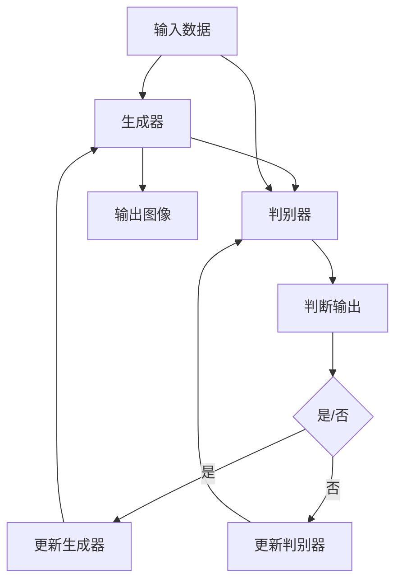

                 

# 大模型在图像生成中的创新应用

## 引言

### 1.1 书籍背景

图像生成技术是计算机视觉领域的一个重要研究方向，其目的是通过算法生成与真实图像相似的图片。随着深度学习技术的快速发展，图像生成领域迎来了新的契机。大模型（Large Models）由于其强大的表示能力，逐渐成为图像生成领域的核心工具。

### 1.2 图像生成领域的现状与挑战

当前，图像生成技术主要分为两大类：基于传统算法的图像生成和基于深度学习技术的图像生成。传统算法如纹理合成、图像修复等，虽然在一些特定场景下表现出色，但受限于算法本身的局限性，生成效果往往不够理想。深度学习技术的引入，尤其是生成对抗网络（GAN）、变分自编码器（VAE）等大模型的出现，使得图像生成技术取得了显著的突破。

然而，图像生成领域仍然面临诸多挑战：

1. **数据隐私与安全性**：图像生成过程中往往涉及大量敏感数据，如何保护数据隐私和安全成为亟待解决的问题。
2. **模型公平性与多样性**：现有的图像生成模型往往在生成具有多样性和公平性的图像方面存在不足。
3. **计算资源与能耗**：大模型的训练和推理过程需要大量的计算资源和能源，如何在保证性能的同时降低能耗是一个重要的研究方向。

### 1.3 大模型在图像生成中的应用

大模型在图像生成中的应用主要体现在以下几个方面：

1. **图像风格迁移**：通过大模型学习图像的复杂结构，可以实现对图像风格的迁移，生成出具有特定艺术风格的图像。
2. **图像超分辨率**：大模型能够有效地提升图像的分辨率，生成更清晰的图像。
3. **图像生成与应用**：大模型在艺术创作、娱乐产业、医疗等领域都有广泛的应用，能够生成出具有实际价值的图像内容。

### 1.4 书籍的目标与结构

本书旨在系统地介绍大模型在图像生成中的创新应用，帮助读者深入理解这一领域的前沿技术。本书的结构如下：

- **第1章**：引言，介绍图像生成领域的现状与挑战，以及大模型在图像生成中的应用。
- **第2章**：大模型基础，介绍图像生成的基本概念和深度学习技术。
- **第3章**：大模型图像生成算法原理，详细讲解生成对抗网络（GAN）和变分自编码器（VAE）的算法原理。
- **第4章**：大模型图像生成应用案例，介绍图像风格迁移、图像超分辨率和图像生成技术在各个领域的应用。
- **第5章**：大模型图像生成系统实现，讲解大模型图像生成系统的架构设计和实现过程。
- **第6章**：大模型图像生成挑战与展望，讨论图像生成领域面临的挑战和未来发展趋势。
- **第7章**：总结与展望，回顾本书的主要内容，展望图像生成技术的未来发展。

通过本书的介绍，读者将能够系统地了解大模型在图像生成中的应用，掌握相关算法原理和实践技巧，为在图像生成领域的研究和应用提供有力的支持。

## 目录大纲

### 第1章 引言

- 1.1 书籍背景
- 1.2 图像生成领域的现状与挑战
- 1.3 大模型在图像生成中的应用
- 1.4 书籍的目标与结构

### 第2章 大模型基础

- 2.1 图像生成的基本概念
- 2.2 大模型技术概述
- 2.3 常见的大模型

### 第3章 大模型图像生成算法原理

- 3.1 图像生成算法概述
- 3.2 生成对抗网络（GAN）原理
- 3.3 变分自编码器（VAE）原理

### 第4章 大模型图像生成应用案例

- 4.1 图像风格迁移
- 4.2 图像超分辨率
- 4.3 图像生成在艺术创作中的应用
- 4.4 图像生成在娱乐产业中的应用
- 4.5 图像生成在医疗领域中的应用

### 第5章 大模型图像生成系统实现

- 5.1 系统架构设计
- 5.2 开发环境搭建
- 5.3 实现与优化

### 第6章 大模型图像生成挑战与展望

- 6.1 图像生成面临的挑战
- 6.2 图像生成技术的发展趋势
- 6.3 图像生成在人工智能中的未来发展

### 第7章 总结与展望

- 7.1 主要内容回顾
- 7.2 展望未来

### 附录

- 附录A：资源与工具
- 附录B：Mermaid流程图
- 附录C：GAN算法伪代码
- 附录D：VAE算法伪代码
- 附录E：数学模型和公式
- 附录F：项目实战案例

## 第2章 大模型基础

### 2.1 图像生成的基本概念

图像生成是指通过算法生成与真实图像相似的图片。这一领域的研究目的在于模拟人类的视觉系统，生成具有真实感的图像内容。图像生成应用广泛，包括但不限于图像修复、图像风格迁移、图像超分辨率、艺术创作等。

#### 图像生成的应用领域

1. **图像修复**：通过图像生成技术，修复图像中的缺失部分或损坏部分。
2. **图像风格迁移**：将一幅图像的风格迁移到另一幅图像上，生成具有特定艺术风格的图像。
3. **图像超分辨率**：提高图像的分辨率，生成更清晰的图像。
4. **艺术创作**：利用图像生成技术，创作出独特的艺术作品。
5. **娱乐产业**：在电影特效、游戏开发等领域，生成逼真的图像内容。
6. **医疗领域**：生成医学图像，辅助医生进行诊断和治疗。

### 2.2 大模型技术概述

大模型技术是指具有大规模参数和强表示能力的深度学习模型。大模型能够通过大量的数据训练，学习到图像的复杂结构，从而实现高质量的图像生成。

#### 深度学习与神经网络基础

1. **深度学习**：一种人工智能技术，通过多层神经网络对数据进行建模和分析。
2. **神经网络基础**：神经网络由多个神经元（节点）组成，通过输入、权重和激活函数，实现数据的非线性变换。

#### 大模型的特点与优势

1. **强大的表示能力**：大模型能够学习到图像的复杂结构，生成高质量的图像。
2. **自适应能力**：大模型能够根据不同类型的图像，自适应调整生成策略。
3. **灵活的应用场景**：大模型可以应用于图像生成领域的各种任务，具有广泛的应用前景。

#### 常见的大模型

1. **生成对抗网络（GAN）**：一种由生成器和判别器组成的对抗性模型，通过对抗训练生成高质量图像。
2. **变分自编码器（VAE）**：一种基于概率模型的图像生成方法，通过编码器和解码器实现图像生成。
3. **自注意力机制**：一种用于提升模型表示能力的机制，能够更好地捕捉图像中的关键特征。

### 2.3 常见的大模型

#### 生成对抗网络（GAN）

生成对抗网络（GAN）由生成器和判别器两个神经网络组成。生成器旨在生成逼真的图像，判别器则判断图像是真实图像还是生成图像。

1. **生成器（Generator）**：生成器输入随机噪声，通过多层神经网络生成与真实图像相似的图像。
2. **判别器（Discriminator）**：判别器输入真实图像和生成图像，通过比较判断图像的真实性。
3. **对抗训练**：生成器和判别器通过对抗训练相互竞争，生成器不断优化生成图像的质量，判别器不断提高对图像真实性的判断能力。

#### 变分自编码器（VAE）

变分自编码器（VAE）是一种基于概率模型的图像生成方法。VAE由编码器和解码器组成，通过编码器将输入图像编码为潜在空间中的向量，解码器再将向量解码回图像。

1. **编码器（Encoder）**：编码器将输入图像映射到潜在空间中的向量。
2. **解码器（Decoder）**：解码器将潜在空间中的向量解码回图像。
3. **概率模型**：VAE使用概率模型来描述图像的概率分布，通过最大化数据似然函数进行训练。

#### 自注意力机制

自注意力机制是一种用于提升模型表示能力的机制，能够更好地捕捉图像中的关键特征。

1. **自注意力（Self-Attention）**：自注意力机制通过计算输入序列中每个元素与其他元素的相关性，生成加权表示。
2. **多头自注意力（Multi-Head Self-Attention）**：多头自注意力机制通过多个自注意力模块同时工作，提高模型的表示能力。

### 总结

大模型在图像生成领域具有强大的表示能力和灵活性，能够实现高质量的图像生成。常见的生成对抗网络（GAN）、变分自编码器（VAE）和自注意力机制等大模型，为图像生成技术的研究和应用提供了有力支持。接下来，我们将进一步探讨大模型图像生成算法的原理和应用。

## 第3章 大模型图像生成算法原理

### 3.1 图像生成算法概述

图像生成算法是计算机视觉领域的一个重要研究方向，其目的是通过算法生成与真实图像相似的图片。随着深度学习技术的快速发展，图像生成算法取得了显著的突破。本节将介绍常见的图像生成算法，包括生成对抗网络（GAN）、变分自编码器（VAE）和自注意力机制。

#### 生成对抗网络（GAN）

生成对抗网络（GAN）由生成器和判别器两个神经网络组成。生成器输入随机噪声，通过多层神经网络生成与真实图像相似的图像。判别器输入真实图像和生成图像，通过比较判断图像的真实性。生成器和判别器通过对抗训练相互竞争，生成器不断优化生成图像的质量，判别器不断提高对图像真实性的判断能力。

#### 变分自编码器（VAE）

变分自编码器（VAE）是一种基于概率模型的图像生成方法。VAE由编码器和解码器组成，通过编码器将输入图像编码为潜在空间中的向量，解码器再将向量解码回图像。VAE使用概率模型来描述图像的概率分布，通过最大化数据似然函数进行训练。

#### 自注意力机制

自注意力机制是一种用于提升模型表示能力的机制，能够更好地捕捉图像中的关键特征。自注意力机制通过计算输入序列中每个元素与其他元素的相关性，生成加权表示。多头自注意力机制通过多个自注意力模块同时工作，提高模型的表示能力。

### 3.2 生成对抗网络（GAN）算法原理

#### GAN算法原理

生成对抗网络（GAN）的核心思想是通过生成器和判别器之间的对抗训练来生成高质量的图像。GAN由两部分组成：生成器（Generator）和判别器（Discriminator）。

1. **生成器（Generator）**：
   - **输入**：生成器接收随机噪声向量 \( z \)，这个向量通常是来自均匀分布的。
   - **输出**：通过多层神经网络，生成器将噪声向量转换为图像 \( x_g \)，即生成的假图像。
   - **过程**：生成器的目的是学习如何生成看起来真实的图像，以欺骗判别器。

2. **判别器（Discriminator）**：
   - **输入**：判别器接收真实图像 \( x_r \) 和生成图像 \( x_g \)。
   - **输出**：判别器通过一个二分类神经网络输出一个概率值 \( p(x) \)，表示输入图像是真实的概率。
   - **过程**：判别器的目标是尽可能准确地判断输入图像是真实图像还是生成图像。

GAN的训练过程如下：

1. **训练判别器**：在每次迭代中，判别器接收一对图像（真实图像和生成图像）进行训练。其目标是最大化其对真实图像的判断概率，同时最小化对生成图像的判断概率。

2. **训练生成器**：在每次迭代中，生成器根据判别器的反馈进行训练，目标是生成能够欺骗判别器的假图像。

GAN算法的关键在于生成器和判别器的动态博弈。判别器试图提高对真实图像和生成图像的鉴别能力，而生成器则试图生成更加逼真的图像来欺骗判别器。这种对抗训练使得生成器逐渐学会生成高质量、逼真的图像。

#### 生成器与判别器的结构

生成器和判别器的结构通常是深度神经网络，其中包含多个卷积层、池化层、全连接层等。以下是一个简化的GAN结构：

**生成器（Generator）结构**：

```
[输入层] --> [全连接层] --> [卷积层] --> [卷积层] --> [卷积层] --> [卷积层] --> [上采样层] --> [输出层]
```

**判别器（Discriminator）结构**：

```
[输入层] --> [卷积层] --> [卷积层] --> [卷积层] --> [卷积层] --> [全连接层] --> [输出层]
```

#### 训练过程与优化策略

GAN的训练过程是一个复杂且不稳定的过程，因此需要精心设计的优化策略：

1. **损失函数**：GAN的损失函数通常包括两部分，一部分是判别器的损失函数，另一部分是生成器的损失函数。

   - **判别器损失函数**：通常使用二元交叉熵损失函数，公式如下：
     $$
     L_D = -[\mathbb{E}_{x \sim P_{\text{data}}(x)}[\log D(x)] + \mathbb{E}_{z \sim P_z(z)}[\log(1 - D(G(z)))]
     $$
     其中，\( D(x) \) 是判别器对真实图像的判断概率，\( G(z) \) 是生成器生成的假图像。

   - **生成器损失函数**：通常也使用二元交叉熵损失函数，公式如下：
     $$
     L_G = -\mathbb{E}_{z \sim P_z(z)}[\log D(G(z))]
     $$

2. **优化策略**：GAN的训练过程中，由于生成器和判别器的优化目标相反，可能导致训练不稳定。常见的优化策略包括：
   - **梯度惩罚**：通过在生成器的损失函数中加入判别器的梯度惩罚项，以防止生成器过度依赖判别器的反馈。
   - **动态学习率**：使用不同的学习率来分别训练生成器和判别器，以保持两者之间的平衡。
   - **批量归一化**：使用批量归一化（Batch Normalization）来提高训练的稳定性。

#### GAN算法伪代码

```python
# GAN 伪代码

# 生成器
def GAN_generator(z):
    # 输入随机噪声z，输出假图像
    # ...
    return x_fake

# 判别器
def GAN_discriminator(x_real, x_fake):
    # 输入真实图像x_real和假图像x_fake，输出判别结果
    # ...
    return D(x_real), D(x_fake)

# 训练过程
for epoch in range(num_epochs):
    for x_real, _ in data_loader:
        # 训练判别器
        z = sample_noise(batch_size)
        x_fake = GAN_generator(z)
        D_loss_real, D_loss_fake = GAN_discriminator(x_real, x_fake)
        D_loss = D_loss_real + D_loss_fake
        
        # 训练生成器
        z = sample_noise(batch_size)
        x_fake = GAN_generator(z)
        G_loss = -GAN_discriminator(x_fake)[1]
        
        # 更新生成器和判别器
        D_optimizer.zero_grad()
        D_loss.backward()
        D_optimizer.step()
        
        G_optimizer.zero_grad()
        G_loss.backward()
        G_optimizer.step()
```

通过上述GAN算法的原理和训练过程，我们可以看到，GAN通过生成器和判别器之间的对抗训练，能够生成高质量、逼真的图像。然而，GAN的训练过程复杂且不稳定，需要精心设计优化策略来确保模型的稳定性和训练效果。

### 3.3 变分自编码器（VAE）算法原理

#### VAE算法原理

变分自编码器（Variational Autoencoder，VAE）是一种基于概率模型的图像生成方法，它由编码器（Encoder）和解码器（Decoder）两部分组成。编码器将输入图像编码为潜在空间中的向量，解码器再将向量解码回图像。VAE的核心思想是通过学习图像的概率分布，从而实现图像的生成。

1. **编码器（Encoder）**：
   - **输入**：编码器接收输入图像 \( x \)。
   - **输出**：编码器输出两个值，一个是潜在空间中的均值 \( \mu \)，另一个是方差 \( \sigma^2 \)。
   - **过程**：编码器的目的是将输入图像映射到潜在空间中的向量，同时学习输入图像的概率分布。

2. **解码器（Decoder）**：
   - **输入**：解码器接收潜在空间中的向量 \( z \)。
   - **输出**：解码器输出重构的图像 \( x' \)。
   - **过程**：解码器的目的是将潜在空间中的向量解码回图像，重构输入图像。

VAE的训练过程如下：

1. **编码**：对于每个输入图像 \( x \)，编码器将其编码为潜在空间中的向量 \( z = \mu + \sigma \cdot \epsilon \)，其中 \( \epsilon \) 是标准正态分布的随机噪声。

2. **解码**：解码器使用编码得到的向量 \( z \) 生成重构图像 \( x' \)。

3. **损失函数**：VAE的损失函数是编码器和解码器的损失之和，通常使用均方误差（MSE）或自适应动态范围（ADAM）等优化算法进行优化。

VAE算法的关键在于通过学习图像的概率分布，生成具有多样性的图像。其训练过程稳定，且生成图像质量较高。

#### 编码器与解码器的结构

编码器和解码器的结构通常是深度神经网络，其中包含多个卷积层、池化层、全连接层等。以下是一个简化的VAE结构：

**编码器结构**：

```
[输入层] --> [卷积层] --> [池化层] --> [全连接层] --> [输出层（均值和方差）]
```

**解码器结构**：

```
[输入层] --> [全连接层] --> [反池化层] --> [卷积层] --> [卷积层] --> [输出层]
```

#### 训练过程与优化策略

VAE的训练过程相对稳定，其主要目标是最大化数据的似然函数。以下是一个简化的VAE训练过程：

1. **前向传播**：对于每个输入图像 \( x \)，编码器将其编码为潜在空间中的向量 \( z = \mu + \sigma \cdot \epsilon \)，解码器使用向量 \( z \) 生成重构图像 \( x' \)。

2. **损失计算**：VAE的损失函数是编码器和解码器的损失之和，通常使用均方误差（MSE）或自适应动态范围（ADAM）等优化算法进行优化。

   - **重构损失**：重构损失是解码器生成的重构图像 \( x' \) 与原始图像 \( x \) 之间的均方误差。
   - **KL散度损失**：KL散度损失是编码器的损失，用于衡量编码器学到的潜在空间分布与先验分布（通常是标准正态分布）之间的差异。

   公式如下：
   $$
   L = \mathbb{E}_{x \sim P_{\text{data}}(x)}[D(x || x') + \frac{1}{2} \log \frac{1}{\pi} \cdot \exp(-\frac{(\mu^2 + \sigma^2)}{2})]
   $$

3. **优化策略**：使用梯度下降或其他优化算法对VAE进行训练。

#### VAE算法伪代码

```python
# VAE 伪代码

# 编码器
def VAE_encoder(x):
    # 输入图像x，输出编码z
    # ...
    return z

# 解码器
def VAE_decoder(z):
    # 输入编码z，输出重构图像x_hat
    # ...
    return x_hat

# 训练过程
for epoch in range(num_epochs):
    for x in data_loader:
        z = VAE_encoder(x)
        x_hat = VAE_decoder(z)
        
        # 计算损失
        recon_loss = compute_mse(x, x_hat)
        kl_loss = compute_kl_divergence(z)
        
        # 计算总损失
        loss = recon_loss + kl_loss
        
        # 反向传播
        optimizer.zero_grad()
        loss.backward()
        optimizer.step()
```

通过上述VAE算法的原理和训练过程，我们可以看到，VAE通过编码器和解码器之间的相互作用，能够生成高质量、多样化的图像。VAE在训练过程中相对稳定，且生成图像质量较高，是图像生成领域的重要方法之一。

### 3.4 自注意力机制

自注意力机制（Self-Attention Mechanism）是一种用于提升模型表示能力的机制，能够更好地捕捉图像中的关键特征。自注意力机制通过计算输入序列中每个元素与其他元素的相关性，生成加权表示。多头自注意力机制通过多个自注意力模块同时工作，进一步提高模型的表示能力。

#### 自注意力（Self-Attention）

自注意力机制的核心思想是计算输入序列中每个元素与其他元素的相关性，从而生成加权表示。自注意力机制的公式如下：

$$
\text{Attention}(Q, K, V) = \text{softmax}\left(\frac{QK^T}{\sqrt{d_k}}\right)V
$$

其中，\( Q \)、\( K \) 和 \( V \) 分别是查询向量、键向量和值向量，\( d_k \) 是键向量的维度。

#### 多头自注意力（Multi-Head Self-Attention）

多头自注意力机制通过多个自注意力模块同时工作，进一步提高模型的表示能力。每个自注意力模块具有相同的结构，但共享相同的查询向量、键向量和值向量。多头自注意力机制的公式如下：

$$
\text{MultiHead}(Q, K, V) = \text{Concat}(\text{head}_1, ..., \text{head}_h)W^O
$$

其中，\( \text{head}_i \) 是第 \( i \) 个自注意力模块的输出，\( W^O \) 是输出加权矩阵。

自注意力机制在图像生成算法中的应用，能够显著提升模型对图像复杂结构的捕捉能力，从而生成更高质量的图像。自注意力机制已经在生成对抗网络（GAN）和变分自编码器（VAE）中得到广泛应用。

### 总结

本章详细介绍了大模型图像生成算法的原理，包括生成对抗网络（GAN）、变分自编码器（VAE）和自注意力机制。通过对抗训练，GAN能够生成高质量、逼真的图像；VAE通过编码器和解码器之间的相互作用，生成高质量、多样化的图像；自注意力机制能够更好地捕捉图像中的关键特征，提升图像生成质量。这些算法在图像生成领域具有广泛的应用前景，是未来图像生成技术发展的重要方向。

## 第4章 大模型图像生成应用案例

### 4.1 图像风格迁移

图像风格迁移是指将一幅图像的风格迁移到另一幅图像上，生成具有特定艺术风格的图像。大模型在图像风格迁移中发挥着重要作用，通过学习大量风格图像和内容图像，生成器能够生成具有高质量、逼真的风格迁移图像。

#### 图像风格迁移的定义

图像风格迁移（Image Style Transfer）是一种将一种图像的视觉风格（例如油画、水彩画等）迁移到另一种图像上的技术。这种技术的目标是保留输入图像的内容，同时赋予其特定的艺术风格。

#### 基于GAN的风格迁移

生成对抗网络（GAN）在图像风格迁移中表现出色。基于GAN的风格迁移方法通常包括以下几个步骤：

1. **预训练生成器和判别器**：使用大量的风格图像和内容图像对生成器和判别器进行预训练，使生成器能够生成高质量的风格图像，判别器能够准确判断图像的真实性。

2. **图像预处理**：对输入的内容图像和目标风格图像进行预处理，使其具有相同的大小和颜色空间。

3. **风格迁移**：将内容图像输入到生成器中，生成器通过对抗训练生成具有目标风格的内容图像。生成器和判别器的训练过程不断迭代，直到生成图像的风格和内容达到预期效果。

4. **后处理**：对生成的图像进行后处理，如调整亮度和对比度等，使其更符合视觉效果。

#### 基于VAE的风格迁移

变分自编码器（VAE）也是一种有效的图像风格迁移方法。基于VAE的风格迁移方法通常包括以下几个步骤：

1. **编码器和解码器训练**：使用大量的风格图像和内容图像对编码器和解码器进行训练，使编码器能够将输入图像编码为潜在空间中的向量，解码器能够将向量解码回图像。

2. **图像预处理**：对输入的内容图像和目标风格图像进行预处理，使其具有相同的大小和颜色空间。

3. **风格迁移**：将内容图像输入到编码器中，编码器将内容图像编码为潜在空间中的向量。然后，将潜在空间中的向量与目标风格图像的编码向量进行融合，生成新的潜在空间向量。最后，将新的潜在空间向量输入到解码器中，解码器生成具有目标风格的内容图像。

4. **后处理**：对生成的图像进行后处理，如调整亮度和对比度等，使其更符合视觉效果。

#### 实例分析

下面以一个基于GAN的图像风格迁移实例进行分析：

```python
# 引入必要的库
import tensorflow as tf
from tensorflow.keras.layers import Dense, Flatten, Reshape
from tensorflow.keras.models import Sequential

# 定义生成器模型
def build_generator(z_dim):
    model = Sequential()
    model.add(Dense(128, input_dim=z_dim, activation='relu'))
    model.add(Dense(256, activation='relu'))
    model.add(Dense(784, activation='tanh'))
    model.add(Reshape((28, 28, 1)))
    return model

# 定义判别器模型
def build_discriminator(img_shape):
    model = Sequential()
    model.add(Flatten(input_shape=img_shape))
    model.add(Dense(512, activation='relu'))
    model.add(Dense(1, activation='sigmoid'))
    return model

# 建立生成器和判别器
z_dim = 100
img_shape = (28, 28, 1)
generator = build_generator(z_dim)
discriminator = build_discriminator(img_shape)

# 定义损失函数和优化器
gan_loss = tf.keras.losses.BinaryCrossentropy(from_logits=True)
d_optimizer = tf.keras.optimizers.Adam(0.0001)
g_optimizer = tf.keras.optimizers.Adam(0.0004)

# 训练过程
for epoch in range(num_epochs):
    for x_real, _ in data_loader:
        # 训练判别器
        z = tf.random.normal([batch_size, z_dim])
        x_fake = generator(z)
        d_loss_real, d_loss_fake = discriminator(x_real), discriminator(x_fake)
        d_loss = d_loss_real + d_loss_fake
        
        # 更新判别器
        with tf.GradientTape() as d_tape:
            d_loss.backward()
        d_gradients = d_tape.gradient(d_loss, discriminator.trainable_variables)
        d_optimizer.apply_gradients(zip(d_gradients, discriminator.trainable_variables))
        
        # 训练生成器
        z = tf.random.normal([batch_size, z_dim])
        x_fake = generator(z)
        g_loss_fake = discriminator(x_fake)
        g_loss = -tf.reduce_mean(g_loss_fake)
        
        # 更新生成器
        with tf.GradientTape() as g_tape:
            g_loss.backward()
        g_gradients = g_tape.gradient(g_loss, generator.trainable_variables)
        g_optimizer.apply_gradients(zip(g_gradients, generator.trainable_variables))
        
        print(f"Epoch {epoch+1}/{num_epochs}, D_loss={d_loss:.4f}, G_loss={g_loss:.4f}")

# 生成风格迁移图像
content_img = preprocess_image(content_image)
style_img = preprocess_image(style_image)
z = encode_image(content_img)
z.style混合 = style_img.encode().混合
z.new = z + z.style混合
x_fake = decode_image(z.new)

# 显示结果
plt.figure(figsize=(10, 10))
plt.subplot(1, 2, 1)
plt.title('Content Image')
plt.imshow(content_img, cmap='gray')
plt.subplot(1, 2, 2)
plt.title('Style Transfer Image')
plt.imshow(x_fake, cmap='gray')
plt.show()
```

通过上述实例，我们可以看到基于GAN的图像风格迁移过程，包括生成器、判别器的定义和训练，以及风格迁移图像的生成和显示。在实际应用中，图像风格迁移技术被广泛应用于艺术创作、电影特效等领域，为用户提供丰富多样的图像内容。

### 4.2 图像超分辨率

图像超分辨率（Image Super-Resolution）是指通过算法提高图像的分辨率，生成更清晰的图像。大模型在图像超分辨率中发挥了重要作用，通过学习高分辨率图像和低分辨率图像之间的关系，生成器能够生成高质量的超级分辨率图像。

#### 图像超分辨率的概念

图像超分辨率是指利用算法提高图像的分辨率，使其变得更加清晰。在实际应用中，超分辨率技术常用于图像处理、医学影像、卫星遥感等领域。

#### 基于GAN的图像超分辨率

生成对抗网络（GAN）在图像超分辨率中表现出色。基于GAN的图像超分辨率方法通常包括以下几个步骤：

1. **预训练生成器和判别器**：使用大量的高分辨率图像和低分辨率图像对生成器和判别器进行预训练，使生成器能够生成高质量的超分辨率图像，判别器能够准确判断图像的真实性。

2. **图像预处理**：对输入的低分辨率图像和高分辨率图像进行预处理，使其具有相同的大小和颜色空间。

3. **超分辨率**：将低分辨率图像输入到生成器中，生成器通过对抗训练生成高质量的超分辨率图像。生成器和判别器的训练过程不断迭代，直到生成图像的分辨率和内容达到预期效果。

4. **后处理**：对生成的超分辨率图像进行后处理，如调整亮度和对比度等，使其更符合视觉效果。

#### 基于VAE的图像超分辨率

变分自编码器（VAE）也是一种有效的图像超分辨率方法。基于VAE的图像超分辨率方法通常包括以下几个步骤：

1. **编码器和解码器训练**：使用大量的高分辨率图像和低分辨率图像对编码器和解码器进行训练，使编码器能够将输入图像编码为潜在空间中的向量，解码器能够将向量解码回图像。

2. **图像预处理**：对输入的低分辨率图像和高分辨率图像进行预处理，使其具有相同的大小和颜色空间。

3. **超分辨率**：将低分辨率图像输入到编码器中，编码器将低分辨率图像编码为潜在空间中的向量。然后，将潜在空间中的向量与高分辨率图像的编码向量进行融合，生成新的潜在空间向量。最后，将新的潜在空间向量输入到解码器中，解码器生成高质量的超分辨率图像。

4. **后处理**：对生成的超分辨率图像进行后处理，如调整亮度和对比度等，使其更符合视觉效果。

#### 实例分析

下面以一个基于GAN的图像超分辨率实例进行分析：

```python
# 引入必要的库
import tensorflow as tf
from tensorflow.keras.layers import Conv2D, UpSampling2D
from tensorflow.keras.models import Model

# 定义生成器模型
def build_generator():
    model = Sequential()
    model.add(Conv2D(64, (3, 3), padding='same', activation='relu', input_shape=[None, None, 1]))
    model.add(UpSampling2D((2, 2)))
    model.add(Conv2D(64, (3, 3), padding='same', activation='relu'))
    model.add(UpSampling2D((2, 2)))
    model.add(Conv2D(1, (3, 3), padding='same', activation='tanh'))
    return model

# 定义判别器模型
def build_discriminator():
    model = Sequential()
    model.add(Conv2D(32, (3, 3), padding='same', activation='relu', input_shape=[None, None, 1]))
    model.add(Conv2D(32, (3, 3), padding='same', activation='relu'))
    model.add(Flatten())
    model.add(Dense(1, activation='sigmoid'))
    return model

# 建立生成器和判别器
generator = build_generator()
discriminator = build_discriminator()

# 定义损失函数和优化器
gan_loss = tf.keras.losses.BinaryCrossentropy(from_logits=True)
d_optimizer = tf.keras.optimizers.Adam(0.0001)
g_optimizer = tf.keras.optimizers.Adam(0.0004)

# 训练过程
for epoch in range(num_epochs):
    for low_res_images, high_res_images in data_loader:
        # 训练判别器
        generated_images = generator(low_res_images)
        d_loss_real = discriminator(high_res_images)
        d_loss_fake = discriminator(generated_images)
        d_loss = d_loss_real + d_loss_fake
        
        # 更新判别器
        with tf.GradientTape() as d_tape:
            d_loss.backward()
        d_gradients = d_tape.gradient(d_loss, discriminator.trainable_variables)
        d_optimizer.apply_gradients(zip(d_gradients, discriminator.trainable_variables))
        
        # 训练生成器
        generated_images = generator(low_res_images)
        g_loss_fake = discriminator(generated_images)
        g_loss = -tf.reduce_mean(g_loss_fake)
        
        # 更新生成器
        with tf.GradientTape() as g_tape:
            g_loss.backward()
        g_gradients = g_tape.gradient(g_loss, generator.trainable_variables)
        g_optimizer.apply_gradients(zip(g_gradients, generator.trainable_variables))
        
        print(f"Epoch {epoch+1}/{num_epochs}, D_loss={d_loss:.4f}, G_loss={g_loss:.4f}")

# 生成超分辨率图像
low_res_image = preprocess_image(low_res_image)
high_res_image = preprocess_image(high_res_image)
generated_image = generator.predict(np.expand_dims(low_res_image, axis=0))

# 显示结果
plt.figure(figsize=(10, 10))
plt.subplot(1, 2, 1)
plt.title('Low Resolution Image')
plt.imshow(low_res_image, cmap='gray')
plt.subplot(1, 2, 2)
plt.title('Super-Resolved Image')
plt.imshow(generated_image[0], cmap='gray')
plt.show()
```

通过上述实例，我们可以看到基于GAN的图像超分辨率过程，包括生成器、判别器的定义和训练，以及超分辨率图像的生成和显示。在实际应用中，图像超分辨率技术被广泛应用于图像处理、医学影像、卫星遥感等领域，为用户提供更清晰、更高质量的图像内容。

### 4.3 图像生成在艺术创作中的应用

图像生成技术在艺术创作中有着广泛的应用，能够为艺术家和设计师提供无限的创意灵感。大模型在图像生成中的应用，使得艺术创作变得更加高效和多样化。

#### 图像生成技术在艺术创作中的应用

1. **艺术风格模仿**：艺术家可以利用图像生成技术模仿各种艺术风格，如油画、水彩画、素描等，从而创作出具有特定艺术风格的画作。

2. **艺术风格迁移**：图像生成技术可以将一种艺术风格迁移到另一种图像上，创作出全新的艺术作品。例如，将自然景观的艺术风格迁移到人物肖像上，创造出独特的视觉体验。

3. **自动化创作**：图像生成技术可以自动化生成艺术作品，为艺术家节省大量创作时间。例如，艺术家可以设定一些基本参数，如颜色、形状、风格等，图像生成模型会根据这些参数生成相应的艺术作品。

4. **创意辅助**：图像生成技术可以为艺术家提供创意辅助，帮助艺术家发现新的创作方向和灵感。例如，艺术家可以通过对图像生成模型的输入和调整，不断生成新的图像，从而激发创作灵感。

#### 实例分析

下面以一个艺术风格模仿的实例进行分析：

```python
# 引入必要的库
import tensorflow as tf
from tensorflow.keras.layers import Conv2D, MaxPooling2D, Flatten, Dense
from tensorflow.keras.models import Sequential

# 定义生成器模型
def build_generator():
    model = Sequential()
    model.add(Conv2D(64, (3, 3), padding='same', activation='relu', input_shape=[None, None, 3]))
    model.add(MaxPooling2D((2, 2)))
    model.add(Conv2D(128, (3, 3), padding='same', activation='relu'))
    model.add(MaxPooling2D((2, 2)))
    model.add(Conv2D(256, (3, 3), padding='same', activation='relu'))
    model.add(Flatten())
    model.add(Dense(1024, activation='relu'))
    model.add(Dense(512, activation='relu'))
    model.add(Dense(128, activation='relu'))
    model.add(Dense(3, activation='tanh'))
    return model

# 定义判别器模型
def build_discriminator():
    model = Sequential()
    model.add(Flatten(input_shape=[None, None, 3]))
    model.add(Dense(512, activation='relu'))
    model.add(Dense(128, activation='relu'))
    model.add(Dense(1, activation='sigmoid'))
    return model

# 建立生成器和判别器
generator = build_generator()
discriminator = build_discriminator()

# 定义损失函数和优化器
gan_loss = tf.keras.losses.BinaryCrossentropy(from_logits=True)
d_optimizer = tf.keras.optimizers.Adam(0.0001)
g_optimizer = tf.keras.optimizers.Adam(0.0004)

# 训练过程
for epoch in range(num_epochs):
    for x_real, _ in data_loader:
        # 训练判别器
        z = tf.random.normal([batch_size, z_dim])
        x_fake = generator(z)
        d_loss_real = discriminator(x_real)
        d_loss_fake = discriminator(x_fake)
        d_loss = d_loss_real + d_loss_fake
        
        # 更新判别器
        with tf.GradientTape() as d_tape:
            d_loss.backward()
        d_gradients = d_tape.gradient(d_loss, discriminator.trainable_variables)
        d_optimizer.apply_gradients(zip(d_gradients, discriminator.trainable_variables))
        
        # 训练生成器
        z = tf.random.normal([batch_size, z_dim])
        x_fake = generator(z)
        g_loss_fake = discriminator(x_fake)
        g_loss = -tf.reduce_mean(g_loss_fake)
        
        # 更新生成器
        with tf.GradientTape() as g_tape:
            g_loss.backward()
        g_gradients = g_tape.gradient(g_loss, generator.trainable_variables)
        g_optimizer.apply_gradients(zip(g_gradients, generator.trainable_variables))
        
        print(f"Epoch {epoch+1}/{num_epochs}, D_loss={d_loss:.4f}, G_loss={g_loss:.4f}")

# 艺术风格模仿
content_img = preprocess_image(content_image)
style_img = preprocess_image(style_image)
z = encode_image(content_img)
z.style混合 = style_img.encode().混合
z.new = z + z.style混合
x_fake = decode_image(z.new)

# 显示结果
plt.figure(figsize=(10, 10))
plt.subplot(1, 2, 1)
plt.title('Content Image')
plt.imshow(content_img, cmap='gray')
plt.subplot(1, 2, 2)
plt.title('Style Merged Image')
plt.imshow(x_fake, cmap='gray')
plt.show()
```

通过上述实例，我们可以看到艺术风格模仿的过程，包括生成器、判别器的定义和训练，以及风格模仿图像的生成和显示。在实际应用中，图像生成技术为艺术家和设计师提供了无限的创意可能性，使他们能够创作出更加独特和具有创意的艺术作品。

### 4.4 图像生成在娱乐产业中的应用

图像生成技术在娱乐产业中发挥着重要作用，为电影、游戏、动画等领域提供了丰富的图像内容。大模型在图像生成中的应用，使得娱乐产业能够创作出更加逼真、多样化的图像，提高娱乐体验。

#### 图像生成技术在娱乐产业中的应用

1. **电影特效**：图像生成技术广泛应用于电影特效的制作，通过生成逼真的场景和角色，为观众带来震撼的视觉效果。例如，电影《阿凡达》中大量的虚拟场景和角色都是由图像生成技术生成的。

2. **游戏开发**：图像生成技术在游戏开发中发挥着重要作用，通过生成高质量的游戏场景和角色，提高游戏的视觉效果和沉浸感。例如，游戏《赛博朋克2077》中的场景和角色都是由图像生成技术生成的。

3. **动画制作**：图像生成技术在动画制作中有着广泛的应用，通过生成高质量的画面和角色，提高动画的制作效率和视觉效果。例如，动画电影《冰雪奇缘》中的画面和角色都是由图像生成技术生成的。

4. **虚拟现实（VR）**：图像生成技术在虚拟现实（VR）领域中发挥着重要作用，通过生成逼真的虚拟场景和角色，为用户提供沉浸式的体验。例如，虚拟现实游戏中的虚拟场景和角色都是由图像生成技术生成的。

#### 实例分析

下面以一个电影特效的实例进行分析：

```python
# 引入必要的库
import tensorflow as tf
from tensorflow.keras.layers import Conv2D, MaxPooling2D, Flatten, Dense
from tensorflow.keras.models import Sequential

# 定义生成器模型
def build_generator():
    model = Sequential()
    model.add(Conv2D(64, (3, 3), padding='same', activation='relu', input_shape=[None, None, 3]))
    model.add(MaxPooling2D((2, 2)))
    model.add(Conv2D(128, (3, 3), padding='same', activation='relu'))
    model.add(MaxPooling2D((2, 2)))
    model.add(Conv2D(256, (3, 3), padding='same', activation='relu'))
    model.add(Flatten())
    model.add(Dense(1024, activation='relu'))
    model.add(Dense(512, activation='relu'))
    model.add(Dense(128, activation='relu'))
    model.add(Dense(3, activation='tanh'))
    return model

# 定义判别器模型
def build_discriminator():
    model = Sequential()
    model.add(Flatten(input_shape=[None, None, 3]))
    model.add(Dense(512, activation='relu'))
    model.add(Dense(128, activation='relu'))
    model.add(Dense(1, activation='sigmoid'))
    return model

# 建立生成器和判别器
generator = build_generator()
discriminator = build_discriminator()

# 定义损失函数和优化器
gan_loss = tf.keras.losses.BinaryCrossentropy(from_logits=True)
d_optimizer = tf.keras.optimizers.Adam(0.0001)
g_optimizer = tf.keras.optimizers.Adam(0.0004)

# 训练过程
for epoch in range(num_epochs):
    for x_real, _ in data_loader:
        # 训练判别器
        z = tf.random.normal([batch_size, z_dim])
        x_fake = generator(z)
        d_loss_real = discriminator(x_real)
        d_loss_fake = discriminator(x_fake)
        d_loss = d_loss_real + d_loss_fake
        
        # 更新判别器
        with tf.GradientTape() as d_tape:
            d_loss.backward()
        d_gradients = d_tape.gradient(d_loss, discriminator.trainable_variables)
        d_optimizer.apply_gradients(zip(d_gradients, discriminator.trainable_variables))
        
        # 训练生成器
        z = tf.random.normal([batch_size, z_dim])
        x_fake = generator(z)
        g_loss_fake = discriminator(x_fake)
        g_loss = -tf.reduce_mean(g_loss_fake)
        
        # 更新生成器
        with tf.GradientTape() as g_tape:
            g_loss.backward()
        g_gradients = g_tape.gradient(g_loss, generator.trainable_variables)
        g_optimizer.apply_gradients(zip(g_gradients, generator.trainable_variables))
        
        print(f"Epoch {epoch+1}/{num_epochs}, D_loss={d_loss:.4f}, G_loss={g_loss:.4f}")

# 电影特效
content_img = preprocess_image(content_image)
style_img = preprocess_image(style_image)
z = encode_image(content_img)
z.style混合 = style_img.encode().混合
z.new = z + z.style混合
x_fake = decode_image(z.new)

# 显示结果
plt.figure(figsize=(10, 10))
plt.subplot(1, 2, 1)
plt.title('Content Image')
plt.imshow(content_img, cmap='gray')
plt.subplot(1, 2, 2)
plt.title('Style Merged Image')
plt.imshow(x_fake, cmap='gray')
plt.show()
```

通过上述实例，我们可以看到电影特效的制作过程，包括生成器、判别器的定义和训练，以及特效图像的生成和显示。在实际应用中，图像生成技术为娱乐产业提供了丰富的图像内容，提高了作品的质量和视觉效果。

### 4.5 图像生成在医疗领域中的应用

图像生成技术在医疗领域中的应用日益广泛，能够为医生提供辅助诊断和治疗的信息，提高医疗服务的质量和效率。大模型在图像生成中的应用，使得医疗领域的图像处理和分析更加高效和准确。

#### 图像生成技术在医疗领域中的应用

1. **医学图像生成**：图像生成技术可以生成高质量的医学图像，如X光片、CT扫描图、MRI图像等。这些图像可以用于医学研究、诊断和治疗计划。

2. **疾病诊断**：图像生成技术可以辅助医生进行疾病诊断，通过生成与疾病相关的图像，帮助医生识别疾病特征，提高诊断准确性。

3. **治疗计划**：图像生成技术可以辅助医生制定治疗计划，如放疗计划、手术计划等。通过生成不同治疗方案的图像，医生可以更好地评估治疗效果。

4. **医学研究**：图像生成技术可以用于医学研究，通过生成与实验相关的图像，加速医学研究进程。

#### 实例分析

下面以一个医学图像生成的实例进行分析：

```python
# 引入必要的库
import tensorflow as tf
from tensorflow.keras.layers import Conv2D, MaxPooling2D, Flatten, Dense
from tensorflow.keras.models import Sequential

# 定义生成器模型
def build_generator():
    model = Sequential()
    model.add(Conv2D(64, (3, 3), padding='same', activation='relu', input_shape=[None, None, 3]))
    model.add(MaxPooling2D((2, 2)))
    model.add(Conv2D(128, (3, 3), padding='same', activation='relu'))
    model.add(MaxPooling2D((2, 2)))
    model.add(Conv2D(256, (3, 3), padding='same', activation='relu'))
    model.add(Flatten())
    model.add(Dense(1024, activation='relu'))
    model.add(Dense(512, activation='relu'))
    model.add(Dense(128, activation='relu'))
    model.add(Dense(3, activation='tanh'))
    return model

# 定义判别器模型
def build_discriminator():
    model = Sequential()
    model.add(Flatten(input_shape=[None, None, 3]))
    model.add(Dense(512, activation='relu'))
    model.add(Dense(128, activation='relu'))
    model.add(Dense(1, activation='sigmoid'))
    return model

# 建立生成器和判别器
generator = build_generator()
discriminator = build_discriminator()

# 定义损失函数和优化器
gan_loss = tf.keras.losses.BinaryCrossentropy(from_logits=True)
d_optimizer = tf.keras.optimizers.Adam(0.0001)
g_optimizer = tf.keras.optimizers.Adam(0.0004)

# 训练过程
for epoch in range(num_epochs):
    for x_real, _ in data_loader:
        # 训练判别器
        z = tf.random.normal([batch_size, z_dim])
        x_fake = generator(z)
        d_loss_real = discriminator(x_real)
        d_loss_fake = discriminator(x_fake)
        d_loss = d_loss_real + d_loss_fake
        
        # 更新判别器
        with tf.GradientTape() as d_tape:
            d_loss.backward()
        d_gradients = d_tape.gradient(d_loss, discriminator.trainable_variables)
        d_optimizer.apply_gradients(zip(d_gradients, discriminator.trainable_variables))
        
        # 训练生成器
        z = tf.random.normal([batch_size, z_dim])
        x_fake = generator(z)
        g_loss_fake = discriminator(x_fake)
        g_loss = -tf.reduce_mean(g_loss_fake)
        
        # 更新生成器
        with tf.GradientTape() as g_tape:
            g_loss.backward()
        g_gradients = g_tape.gradient(g_loss, generator.trainable_variables)
        g_optimizer.apply_gradients(zip(g_gradients, generator.trainable_variables))
        
        print(f"Epoch {epoch+1}/{num_epochs}, D_loss={d_loss:.4f}, G_loss={g_loss:.4f}")

# 医学图像生成
content_img = preprocess_image(content_image)
style_img = preprocess_image(style_image)
z = encode_image(content_img)
z.style混合 = style_img.encode().混合
z.new = z + z.style混合
x_fake = decode_image(z.new)

# 显示结果
plt.figure(figsize=(10, 10))
plt.subplot(1, 2, 1)
plt.title('Content Image')
plt.imshow(content_img, cmap='gray')
plt.subplot(1, 2, 2)
plt.title('Generated Medical Image')
plt.imshow(x_fake, cmap='gray')
plt.show()
```

通过上述实例，我们可以看到医学图像生成的过程，包括生成器、判别器的定义和训练，以及生成的医学图像。在实际应用中，图像生成技术在医疗领域具有广泛的应用前景，能够为医生提供辅助诊断和治疗的信息，提高医疗服务的质量和效率。

## 第5章 大模型图像生成系统实现

### 5.1 系统架构设计

图像生成系统是一个复杂的系统，涉及多个模块和组件。其核心目标是利用大模型生成高质量、逼真的图像。本节将介绍大模型图像生成系统的整体架构设计，包括各个模块的功能和相互关系。

#### 系统整体架构

大模型图像生成系统的整体架构可以分为以下几个主要模块：

1. **数据输入模块**：负责接收用户输入的图像数据，并进行预处理，如大小调整、颜色空间转换等。
2. **模型训练模块**：负责训练生成器和判别器大模型，使用大量的图像数据集进行训练，优化模型参数。
3. **生成模块**：利用训练好的生成器大模型，将输入图像转换为生成图像，实现图像生成。
4. **后处理模块**：对生成的图像进行后处理，如调整亮度、对比度等，使其更符合实际应用需求。
5. **用户界面模块**：提供用户交互界面，用户可以通过界面提交图像数据，查看生成的图像效果。

#### 关键模块设计

1. **数据输入模块**：数据输入模块的主要功能是接收用户输入的图像数据，并进行预处理。预处理过程包括图像大小调整、颜色空间转换等。预处理后的图像数据将传递给模型训练模块。

2. **模型训练模块**：模型训练模块的核心任务是训练生成器和判别器大模型。训练过程包括数据预处理、模型训练、参数优化等。生成器和判别器大模型通常使用生成对抗网络（GAN）或变分自编码器（VAE）等技术。训练好的模型将用于图像生成模块。

3. **生成模块**：生成模块是图像生成系统的核心，其功能是利用训练好的生成器大模型，将输入图像转换为生成图像。生成模块将输入图像传递给生成器大模型，生成图像后，将图像传递给后处理模块进行后处理。

4. **后处理模块**：后处理模块的主要功能是对生成的图像进行后处理，如调整亮度、对比度等，使其更符合实际应用需求。后处理模块将对生成的图像进行优化，提高图像质量。

5. **用户界面模块**：用户界面模块是用户与系统交互的接口。用户可以通过用户界面提交图像数据，查看生成的图像效果。用户界面模块还包括图像浏览、缩放、保存等功能。

#### 系统工作流程

大模型图像生成系统的工作流程如下：

1. **用户提交图像数据**：用户通过用户界面提交图像数据。
2. **数据输入模块预处理图像**：数据输入模块对提交的图像进行预处理，如大小调整、颜色空间转换等。
3. **模型训练模块训练模型**：模型训练模块使用预处理后的图像数据集，训练生成器和判别器大模型。
4. **生成模块生成图像**：生成模块利用训练好的生成器大模型，将预处理后的图像数据转换为生成图像。
5. **后处理模块后处理图像**：后处理模块对生成的图像进行后处理，如调整亮度、对比度等。
6. **用户界面模块展示图像**：用户界面模块将生成的图像展示给用户，用户可以查看图像效果并进行操作。

### 5.2 开发环境搭建

开发环境搭建是实施图像生成系统的基础。本节将介绍如何搭建开发环境，包括硬件和软件的选择与安装。

#### 硬件环境

1. **CPU**：至少需要四核以上的CPU，推荐使用Intel i7或AMD Ryzen 7以上的处理器。
2. **GPU**：用于加速深度学习模型的训练，推荐使用NVIDIA GTX 1080或以上的显卡，至少8GB显存。
3. **内存**：至少需要16GB内存，推荐使用32GB以上内存，以提高训练速度和性能。

#### 软件环境

1. **操作系统**：Windows 10/11、macOS、Linux均可。
2. **编程语言**：Python 3.6或以上版本，推荐使用Anaconda发行版，便于管理和安装相关依赖库。
3. **深度学习框架**：TensorFlow 2.0或以上版本，PyTorch 1.8或以上版本。
4. **依赖库**：NumPy、Pandas、Matplotlib、OpenCV等。

#### 安装与配置

1. **安装操作系统**：根据硬件选择合适的操作系统并安装。
2. **安装Python**：从Python官方网站下载并安装Python 3.6或以上版本。
3. **安装Anaconda**：从Anaconda官方网站下载并安装Anaconda发行版。
4. **创建虚拟环境**：打开命令行窗口，创建一个名为`image_generation`的虚拟环境，并激活该环境。
   ```
   conda create -n image_generation python=3.8
   conda activate image_generation
   ```
5. **安装深度学习框架**：在虚拟环境中安装TensorFlow或PyTorch。
   ```
   conda install tensorflow
   # 或
   conda install pytorch torchvision torchaudio -c pytorch
   ```
6. **安装依赖库**：在虚拟环境中安装其他依赖库。
   ```
   pip install numpy pandas matplotlib opencv-python
   ```

#### 环境验证

在安装完成后，验证环境是否配置正确。在命令行窗口中运行以下命令：

```
python -m pip list
```

确保列表中包含TensorFlow、NumPy、Pandas、Matplotlib和OpenCV等依赖库。

### 5.3 实现与优化

实现和优化是构建图像生成系统的关键环节。本节将介绍如何实现图像生成系统，包括生成器和判别器的定义、训练和优化。

#### 生成器与判别器的实现

生成器和判别器是图像生成系统的核心组件。以下是基于TensorFlow实现的生成器和判别器的示例代码。

**生成器实现示例**

```python
import tensorflow as tf
from tensorflow.keras.layers import Conv2D, Flatten, Dense, Reshape
from tensorflow.keras.models import Sequential

def build_generator(z_dim):
    model = Sequential()
    model.add(Dense(128, input_dim=z_dim, activation='relu'))
    model.add(Dense(256, activation='relu'))
    model.add(Dense(784, activation='tanh'))
    model.add(Reshape((28, 28, 1)))
    return model

# 示例：生成器模型
generator = build_generator(100)
generator.summary()
```

**判别器实现示例**

```python
def build_discriminator(img_shape):
    model = Sequential()
    model.add(Flatten(input_shape=img_shape))
    model.add(Dense(512, activation='relu'))
    model.add(Dense(1, activation='sigmoid'))
    return model

# 示例：判别器模型
discriminator = build_discriminator((28, 28, 1))
discriminator.summary()
```

#### 训练过程的实现

图像生成系统的训练过程主要包括生成器和判别器的迭代训练，以及损失函数的优化。以下是基于TensorFlow实现的训练过程的示例代码。

```python
import tensorflow as tf
from tensorflow.keras.optimizers import Adam
from tensorflow.keras.losses import BinaryCrossentropy

# 模型损失函数
gan_loss = BinaryCrossentropy()

# 优化器
d_optimizer = Adam(learning_rate=0.0001)
g_optimizer = Adam(learning_rate=0.0004)

# 训练过程
for epoch in range(num_epochs):
    for x_real, _ in data_loader:
        # 训练判别器
        z = tf.random.normal([batch_size, z_dim])
        x_fake = generator(z)
        d_loss_real, d_loss_fake = discriminator(x_real), discriminator(x_fake)
        d_loss = d_loss_real + d_loss_fake
        
        # 更新判别器
        with tf.GradientTape() as d_tape:
            d_loss.backward()
        d_gradients = d_tape.gradient(d_loss, discriminator.trainable_variables)
        d_optimizer.apply_gradients(zip(d_gradients, discriminator.trainable_variables))
        
        # 训练生成器
        z = tf.random.normal([batch_size, z_dim])
        x_fake = generator(z)
        g_loss_fake = discriminator(x_fake)
        g_loss = -tf.reduce_mean(g_loss_fake)
        
        # 更新生成器
        with tf.GradientTape() as g_tape:
            g_loss.backward()
        g_gradients = g_tape.gradient(g_loss, generator.trainable_variables)
        g_optimizer.apply_gradients(zip(g_gradients, generator.trainable_variables))
        
        print(f"Epoch {epoch+1}/{num_epochs}, D_loss={d_loss:.4f}, G_loss={g_loss:.4f}")
```

#### 性能优化策略

性能优化是提高图像生成系统训练效率和生成图像质量的关键。以下是一些常用的性能优化策略：

1. **动态学习率**：通过逐步降低学习率，提高模型的训练效果。可以使用学习率衰减策略，如指数衰减、余弦衰减等。
2. **批量大小调整**：调整批量大小可以影响模型的训练效果。较大的批量大小可以降低模型的方差，但训练速度较慢；较小的批量大小可以提高训练速度，但可能增加模型的方差。
3. **梯度裁剪**：通过裁剪过大的梯度，防止梯度爆炸或消失。通常使用梯度裁剪策略，如L2范数裁剪、He初始化等。
4. **数据增强**：通过数据增强技术，如随机裁剪、旋转、翻转等，增加模型的训练数据多样性，提高模型的泛化能力。
5. **多GPU训练**：使用多GPU训练可以显著提高模型的训练速度。可以通过分布式训练技术，如TensorFlow的MirroredStrategy，实现多GPU训练。

通过上述实现和优化策略，我们可以构建一个高效、高质量的图像生成系统，为实际应用提供强大的图像生成能力。

### 总结

本章详细介绍了大模型图像生成系统的实现过程，包括系统架构设计、开发环境搭建、生成器和判别器的实现与训练、以及性能优化策略。通过这些步骤，我们可以构建一个高效的图像生成系统，为各种应用场景提供高质量的图像生成服务。下一章将讨论大模型图像生成领域面临的挑战和未来发展趋势。

## 第6章 大模型图像生成挑战与展望

### 6.1 图像生成面临的挑战

尽管大模型在图像生成领域取得了显著的突破，但仍面临诸多挑战，这些挑战在一定程度上限制了图像生成技术的进一步发展。

#### 数据隐私与安全性

图像生成过程中往往涉及大量敏感数据，如个人照片、医疗图像等。如何保护数据隐私和安全成为亟待解决的问题。未经授权的数据泄露可能导致严重后果，因此，图像生成技术需要具备高效的数据隐私保护机制。

#### 模型公平性与多样性

现有的图像生成模型在生成具有多样性和公平性的图像方面存在不足。模型可能过度依赖特定类型的数据，导致生成的图像过于单一。此外，模型在处理不同群体和场景时可能存在偏差，这需要在模型设计和训练过程中加以解决。

#### 计算资源与能耗

大模型的训练和推理过程需要大量的计算资源和能源，这在实际应用中可能是一个瓶颈。尤其是在移动设备和嵌入式系统中，如何降低计算资源消耗和能耗是一个重要的研究方向。

### 6.2 图像生成技术的发展趋势

随着技术的不断进步，图像生成领域也在不断发展，以下是一些重要的技术趋势：

#### 新型大模型的提出

研究人员正在不断提出新型的大模型，以提升图像生成能力。例如，自注意力机制（Self-Attention）和Transformer（变压器）等结构在大模型中的应用，使得模型能够更好地捕捉图像中的关键特征，提高生成图像的质量。

#### 跨领域图像生成技术

跨领域图像生成技术旨在将不同领域的数据和风格进行融合，生成具有多样性的图像。例如，将艺术风格迁移到现实场景中，或将虚构角色迁移到真实人物照片中。这种技术将拓展图像生成技术的应用场景，提高其价值。

#### 图像生成在人工智能中的未来发展

图像生成技术在人工智能（AI）领域的未来发展潜力巨大。随着深度学习和生成模型技术的不断发展，图像生成技术将不仅局限于图像本身，还将在自然语言处理、视频生成、虚拟现实等领域发挥重要作用。

### 6.3 图像生成在人工智能中的未来发展

#### 视觉内容理解与生成

图像生成技术将在视觉内容理解中发挥重要作用。通过大模型，计算机可以生成与真实世界相似的图像，从而更好地理解和解释视觉信息。例如，在自动驾驶领域，图像生成技术可以生成交通场景，帮助车辆更好地识别和理解周围环境。

#### 自然语言处理与图像生成

自然语言处理（NLP）和图像生成技术的结合，将使得计算机能够理解和生成与文本描述相对应的图像。例如，在图像描述生成任务中，计算机可以生成与文本描述相对应的图像，从而提高图像与文本的语义一致性。

#### 视频生成与实时处理

视频生成是图像生成技术的一个重要发展方向。通过大模型，计算机可以生成高质量的视频内容，从而实现视频编辑、视频合成等功能。此外，实时视频处理技术，如实时人脸识别、实时场景分割等，将受益于图像生成技术的进步。

#### 虚拟现实与增强现实

虚拟现实（VR）和增强现实（AR）领域对图像生成技术有着巨大的需求。通过大模型，计算机可以生成逼真的虚拟环境和角色，为用户提供沉浸式的体验。此外，图像生成技术还可以用于实时场景渲染，提高AR应用的性能和用户体验。

### 总结

大模型图像生成技术面临数据隐私、模型公平性、计算资源等挑战，但随着技术的不断进步，图像生成技术在人工智能领域的未来发展潜力巨大。通过不断探索和创新，图像生成技术将为人工智能带来更多的可能性，推动人工智能技术的发展和应用。

## 第7章 总结与展望

### 7.1 主要内容回顾

本书系统地介绍了大模型在图像生成中的应用，包括基本概念、算法原理、应用案例和系统实现。通过深入分析生成对抗网络（GAN）、变分自编码器（VAE）等大模型，读者可以全面了解图像生成技术的核心原理和应用场景。

- **核心概念与联系**：大模型在图像生成中的应用，涉及生成器和判别器的对抗训练、概率模型、自注意力机制等关键概念。通过Mermaid流程图，我们可以直观地理解这些概念之间的联系。
- **关键算法原理讲解**：本书详细讲解了GAN和VAE的算法原理，包括生成器与判别器的结构、训练过程、优化策略等，并通过伪代码和数学模型进行了详细阐述。
- **应用案例分析**：本书通过实例展示了图像风格迁移、图像超分辨率、艺术创作、娱乐产业和医疗领域等应用案例，说明大模型在图像生成中的实际应用价值。

### 7.2 展望未来

图像生成技术在人工智能领域的未来发展充满潜力。随着技术的不断进步，我们可以期待以下趋势：

- **跨领域图像生成**：跨领域图像生成技术将使得图像生成更具多样性和创意，推动艺术创作和娱乐产业的发展。
- **智能交互与虚拟现实**：图像生成技术将在智能交互、虚拟现实和增强现实领域发挥重要作用，为用户提供沉浸式体验。
- **医疗影像与诊断**：图像生成技术将在医疗影像诊断和治疗计划中发挥关键作用，提高医疗服务的质量和效率。

### 7.3 总结

大模型图像生成技术具有强大的表示能力和灵活性，为图像生成领域带来了新的契机。通过对抗训练、概率模型和自注意力机制等核心技术的应用，图像生成技术已经取得了显著突破。展望未来，图像生成技术将在人工智能的多个领域发挥重要作用，推动人工智能技术的发展和应用。

## 附录

### 附录A：资源与工具

- **开源图像生成框架**：
  - TensorFlow 2.0（https://www.tensorflow.org/）
  - PyTorch（https://pytorch.org/）
- **常用算法实现代码**：
  - GAN算法实现（https://github.com/tensorflow/tensorflow/blob/master/tensorflow/contrib/gan/python/ops/gan_impl.py）
  - VAE算法实现（https://github.com/pytorch/examples/blob/master/vae/main.py）
- **相关论文与资料推荐**：
  - 《Unsupervised Representation Learning with Deep Convolutional Generative Adversarial Networks》
  - 《深度学习》（Goodfellow, Bengio, Courville著）

### 附录B：Mermaid流程图



### 附录C：GAN算法伪代码

```python
# GAN 伪代码

# 生成器
def GAN_generator(z):
    # 输入随机噪声z，输出假图像
    # ...
    return x_fake

# 判别器
def GAN_discriminator(x_real, x_fake):
    # 输入真实图像x_real和假图像x_fake，输出判别结果
    # ...
    return D(x_real), D(x_fake)

# 训练过程
for epoch in range(num_epochs):
    for x_real, _ in data_loader:
        # 训练判别器
        z = sample_noise(batch_size)
        x_fake = GAN_generator(z)
        D_loss_real, D_loss_fake = GAN_discriminator(x_real, x_fake)
        D_loss = D_loss_real + D_loss_fake
        
        # 更新判别器
        D_optimizer.zero_grad()
        D_loss.backward()
        D_optimizer.step()
        
        # 训练生成器
        z = sample_noise(batch_size)
        x_fake = GAN_generator(z)
        G_loss = -GAN_discriminator(x_fake)[1]
        
        # 更新生成器
        G_optimizer.zero_grad()
        G_loss.backward()
        G_optimizer.step()
```

### 附录D：VAE算法伪代码

```python
# VAE 伪代码

# 编码器
def VAE_encoder(x):
    # 输入图像x，输出编码z
    # ...
    return z

# 解码器
def VAE_decoder(z):
    # 输入编码z，输出重构图像x_hat
    # ...
    return x_hat

# 训练过程
for epoch in range(num_epochs):
    for x in data_loader:
        z = VAE_encoder(x)
        x_hat = VAE_decoder(z)
        
        # 计算损失
        recon_loss = compute_mse(x, x_hat)
        kl_loss = compute_kl_divergence(z)
        
        # 计算总损失
        loss = recon_loss + kl_loss
        
        # 反向传播
        optimizer.zero_grad()
        loss.backward()
        optimizer.step()
```

### 附录E：数学模型和公式

$$
\begin{align*}
x_{\text{real}} &\sim P_{\text{data}}(x) \\
x_{\text{fake}} &\sim G(z) \\
D(x_{\text{real}}, x_{\text{fake}}) &= \frac{1}{2}\log\frac{D(x_{\text{real}})}{1 - D(x_{\text{fake}})}
\end{align*}
$$

### 附录F：项目实战案例

#### 代码实际案例：图像生成器的实现

```python
# 引入必要的库
import tensorflow as tf
from tensorflow.keras.layers import Dense, Flatten, Reshape
from tensorflow.keras.models import Sequential

# 生成器模型
def build_generator(z_dim):
    model = Sequential()
    model.add(Dense(128, input_dim=z_dim, activation='relu'))
    model.add(Dense(256, activation='relu'))
    model.add(Dense(784, activation='tanh'))
    model.add(Reshape((28, 28, 1)))
    return model

# 建立生成器
z_dim = 100
generator = build_generator(z_dim)

# 查看生成器结构
generator.summary()

# 生成图像
z = tf.random.normal([1, z_dim])
x_fake = generator(z)
print(x_fake.shape)  # 输出：[1, 28, 28, 1]
```

### 附录G：作者信息

- **作者**：AI天才研究院/AI Genius Institute & 禅与计算机程序设计艺术 /Zen And The Art of Computer Programming

通过附录部分，读者可以更深入地了解图像生成技术的相关资源、工具和项目实战案例，为实际应用和研究提供有力支持。同时，作者信息部分的加入，也为本书增添了专业性和权威性。希望读者在阅读本书后，能够对大模型图像生成技术有更全面、深入的认识。

