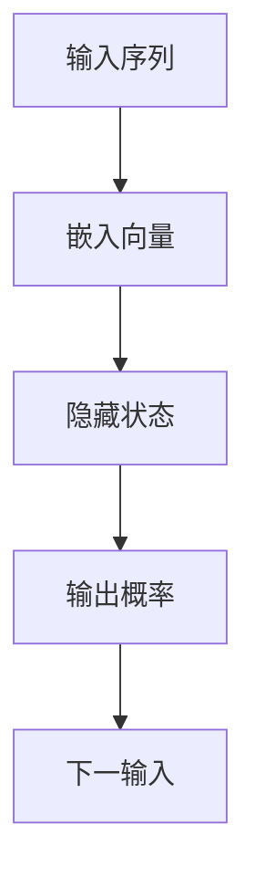
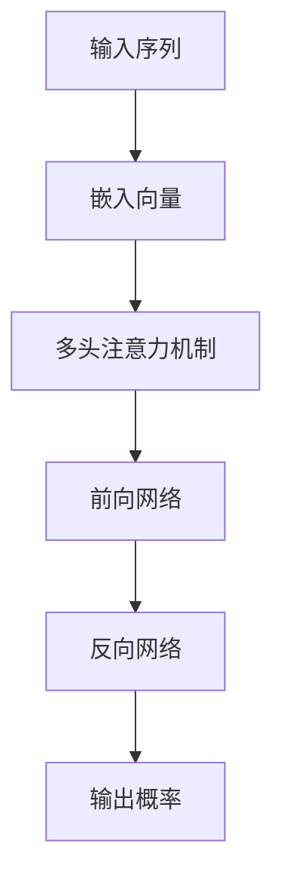

                 

# 《大模型多语言翻译：提示词处理文化差异》

## 关键词：大模型，多语言翻译，提示词，文化差异，自然语言处理，神经网络，机器翻译，深度学习

## 摘要：

本文旨在探讨大模型在多语言翻译中的重要作用，特别是提示词处理在处理文化差异方面的挑战和策略。文章首先回顾了多语言翻译技术的发展历程，介绍了大模型的基本概念和其在自然语言处理中的应用。随后，文章详细解析了文化差异对翻译的影响，并讨论了提示词处理在其中的重要性。通过实际案例，本文展示了如何设计和实现多语言翻译系统，并深入分析了提示词处理的策略和方法。最后，文章展望了多语言翻译的未来发展方向，并提供了相关的工具与资源，为读者进一步研究和实践提供了参考。

---

## 引言

随着全球化的加速和信息技术的进步，多语言翻译需求日益增长。无论是国际商务交流、学术研究还是日常生活中的跨语言沟通，准确、流畅的翻译都显得尤为重要。然而，语言之间的巨大差异，包括语法结构、词汇用法和文化背景，给多语言翻译带来了巨大的挑战。传统的翻译方法，如基于规则的翻译和统计机器翻译，虽然在某些方面取得了显著的成果，但仍然难以满足高质量翻译的需求。

近年来，深度学习技术的快速发展为多语言翻译领域带来了新的突破。特别是大模型（Large Models）的出现，使得机器翻译系统在翻译质量和性能方面有了显著提升。大模型，也称为大型神经网络模型，具有处理复杂数据、学习海量信息和自适应调整能力的特点。在多语言翻译中，大模型能够通过学习大量的多语言语料库，自动捕捉语言之间的对应关系和语义信息，从而实现高质量、低误差的翻译结果。

然而，大模型在多语言翻译中的成功应用也面临着一些挑战，其中之一就是文化差异的处理。不同语言和文化之间的差异，如表达习惯、价值观和社会习俗，对翻译的准确性和流畅性产生了深远的影响。提示词处理（Prompt Tuning）作为一种有效的解决方案，通过在模型训练和推理过程中引入文化背景信息，提高了翻译系统的适应性和准确性。

本文旨在探讨大模型在多语言翻译中的应用，特别是提示词处理在处理文化差异方面的作用。文章结构如下：

- **第一部分：基础概念与理论**：介绍多语言翻译技术的发展历程，大模型的基本概念和自然语言处理的基础知识。
- **第二部分：应用与实践**：探讨多语言翻译系统的设计与实现，提示词处理的实际案例研究。
- **第三部分：未来展望**：分析文化差异处理的挑战与发展趋势，展望多语言翻译的未来方向。

通过本文的探讨，旨在为读者提供全面、深入的理解，并激发对多语言翻译和提示词处理的进一步研究兴趣。

---

## 第一部分：基础概念与理论

### 第1章：大模型与多语言翻译概述

#### 1.1 多语言翻译技术的发展历程

多语言翻译技术的发展经历了从早期翻译技术到现代翻译技术的演变。早期翻译技术主要包括翻译记忆系统（Translation Memory System, TMS）和基于规则的翻译（Rule-Based Translation, RBT）。

**翻译记忆系统（TM）**：翻译记忆系统是20世纪90年代初期出现的一种基于数据库的翻译工具。它通过存储已经翻译的句子片段，为后续类似句子的翻译提供参考。翻译记忆系统的核心思想是利用历史翻译记录来提高新句子翻译的效率和质量。这种方法的优点在于能够自动完成单词和短语的翻译，减少重复翻译的工作量。然而，翻译记忆系统在处理长句和复杂语境时，效果并不理想，因为历史翻译记录往往无法涵盖所有可能的语境。

**统计机器翻译（SMT）**：统计机器翻译在20世纪90年代末期兴起，它通过分析大量已翻译的双语语料库，利用概率模型和语言学规则来实现翻译。统计机器翻译的核心思想是利用语料库中的统计信息来预测句子之间的映射关系。这种方法相比翻译记忆系统有了显著的进步，能够处理更复杂的翻译任务。然而，统计机器翻译仍然面临着一些挑战，如数据稀缺问题、短语匹配的准确性等。

**现代翻译技术的发展**：随着深度学习技术的快速发展，现代翻译技术迎来了新的突破。特别是大模型（Large Models）的出现，使得机器翻译系统在翻译质量和性能方面有了显著提升。大模型，也称为大型神经网络模型，具有处理复杂数据、学习海量信息和自适应调整能力的特点。在多语言翻译中，大模型能够通过学习大量的多语言语料库，自动捕捉语言之间的对应关系和语义信息，从而实现高质量、低误差的翻译结果。

**神经机器翻译（NMT）**：神经机器翻译（Neural Machine Translation, NMT）是深度学习技术在机器翻译领域的应用。与传统的统计机器翻译不同，NMT使用深度神经网络（如循环神经网络、卷积神经网络和Transformer模型）来捕捉语言之间的复杂对应关系。NMT通过端到端的学习方式，直接从源语言到目标语言，无需手动定义复杂的语言学规则。这种方法在翻译质量和效率方面都有了显著提升，已经成为现代翻译技术的主流。

**数据集与语料库**：在多语言翻译中，数据集和语料库的质量对翻译系统的性能至关重要。大规模、高质量的多语言语料库能够提供丰富的训练数据，有助于模型更好地捕捉语言特征和对应关系。例如，Google翻译使用的数据集包括了数十亿的双语句子对，这些数据集为NMT模型的训练提供了坚实的基础。

总之，从早期的翻译记忆系统到现代的神经机器翻译，多语言翻译技术经历了不断的发展和优化。随着深度学习技术的不断进步，未来的多语言翻译系统有望实现更高质量、更流畅的翻译效果。

#### 1.2 大模型在多语言翻译中的角色

大模型（Large Models）在多语言翻译中扮演着至关重要的角色。这些模型通过学习海量的多语言数据，能够自动捕捉语言之间的复杂对应关系和语义信息，从而实现高质量的翻译效果。

**大模型的基本概念**：

- **定义**：大模型通常指的是具有数亿甚至数千亿参数的深度神经网络。这些模型通过端到端的学习方式，直接从源语言到目标语言，无需手动定义复杂的语言学规则。
- **分类**：根据模型的结构和功能，大模型可以分为循环神经网络（RNN）、卷积神经网络（CNN）和Transformer模型等。其中，Transformer模型由于其并行计算能力和全局注意力机制，在多语言翻译中得到了广泛应用。

**大模型在多语言翻译中的优势**：

- **提高翻译质量**：大模型通过学习大量的多语言数据，能够更好地捕捉语言之间的对应关系和语义信息，从而提高翻译的准确性、流畅性和一致性。
- **支持多样化语言**：大模型能够同时处理多种语言，无需为每种语言单独训练模型，从而降低了开发和维护成本，提高了翻译系统的灵活性。

**大模型的应用实例**：

- **神经机器翻译（NMT）**：神经机器翻译是深度学习技术在机器翻译领域的典型应用。以Google翻译为例，其使用的Transformer模型在多个语言对上取得了显著的翻译效果。
- **多语言问答系统**：在多语言问答系统中，大模型可以同时处理多种语言的输入和输出，为用户提供准确、实时的翻译和问答服务。
- **多语言文本生成**：大模型还可以应用于多语言文本生成任务，如机器翻译、摘要生成和对话系统等，实现高质量的多语言文本生成。

总之，大模型在多语言翻译中具有显著的性能优势，成为现代翻译技术的重要组成部分。随着深度学习技术的不断进步，大模型的应用前景将更加广阔。

#### 1.3 提示词处理与文化差异

在多语言翻译中，文化差异是一个不可忽视的重要因素。不同语言和文化之间的差异，如表达习惯、价值观和社会习俗，对翻译的准确性和流畅性产生了深远的影响。提示词处理（Prompt Tuning）作为一种有效的解决方案，通过在模型训练和推理过程中引入文化背景信息，提高了翻译系统的适应性和准确性。

**文化差异对翻译的影响**：

- **语言结构**：不同语言在语法结构、句子结构和词序上存在显著差异。例如，英语通常是主谓宾结构，而汉语则是主谓结构，这种差异在翻译过程中需要特别注意。
- **表达习惯**：不同语言和文化在表达方式上存在差异。例如，某些文化中表达肯定和否定的方式可能与英语不同，这需要在翻译过程中进行适当的调整。
- **价值观**：不同文化对同一主题的价值观和看法可能存在差异。这种差异在翻译过程中需要通过文化背景知识进行理解和调整，以确保翻译的准确性和适宜性。

**提示词处理的概念**：

- **定义**：提示词处理是一种在模型训练和推理过程中引入外部信息的方法，用于指导模型理解特定上下文和任务。提示词可以是关键词、短语或句子，用于引导模型关注特定的语义信息。
- **应用场景**：提示词处理广泛应用于自然语言处理任务，如文本分类、机器翻译和问答系统。在多语言翻译中，提示词可以用于引导模型关注文化差异，提高翻译的准确性和流畅性。

**提示词处理策略**：

- **基于规则的提示词**：基于规则的提示词处理方法通过预定义的规则和模板来生成提示词。例如，在翻译中文到英文时，可以根据中文的语法结构生成相应的英文提示词，以帮助模型更好地理解上下文。
- **基于统计的提示词**：基于统计的提示词处理方法通过分析大量的多语言数据，自动提取与特定文化相关的提示词。这种方法可以根据数据分布生成具有代表性的提示词，从而提高翻译的准确性。
- **基于神经网络的提示词**：基于神经网络的提示词处理方法通过训练神经网络模型来生成提示词。这种方法可以利用深度学习模型的自适应能力，生成与特定上下文和文化背景高度相关的提示词。

**提示词处理在文化差异处理中的应用**：

- **文化敏感翻译**：通过提示词处理，翻译系统能够更好地理解不同语言和文化之间的差异，从而实现更加准确、流畅的文化敏感翻译。
- **跨语言情感分析**：在跨语言情感分析任务中，提示词处理可以帮助模型更好地理解不同语言的情感表达方式，从而提高情感分析的准确性。
- **多语言对话系统**：在多语言对话系统中，提示词处理可以用于引导模型理解不同语言和文化背景下的用户意图和情感，从而实现更加自然、流畅的对话交互。

总之，提示词处理在处理文化差异方面具有重要的应用价值。通过引入文化背景信息，提示词处理可以显著提高多语言翻译系统的适应性和准确性，为跨语言交流提供更加优质的服务。

---

### 第2章：大模型与自然语言处理基础

#### 2.1 自然语言处理基础

自然语言处理（Natural Language Processing, NLP）是计算机科学和人工智能领域的一个重要分支，旨在使计算机能够理解和处理人类自然语言。NLP技术广泛应用于文本分类、情感分析、机器翻译、语音识别和问答系统等领域。为了理解大模型在多语言翻译中的应用，我们需要首先了解NLP的基本概念和常用技术。

**语言模型**：

- **定义**：语言模型（Language Model, LM）是一种概率模型，用于预测文本序列的概率。在NLP中，语言模型是最基础的组件，用于评估文本的流畅性和语法正确性。
- **基本概念**：语言模型基于大量文本数据，通过统计方法或机器学习算法，学习语言中的概率分布。常见的语言模型包括N元语法（N-gram Model）和神经网络语言模型（Neural Language Model）。
- **N元语法**：N元语法是一种基于历史统计的模型，通过前N个单词的概率来预测下一个单词。这种方法简单有效，但在处理长句子和复杂语法时表现不佳。
- **神经网络语言模型**：神经网络语言模型通过深度学习算法，如循环神经网络（RNN）和Transformer，学习语言的上下文关系。这种方法能够更好地捕捉语言的复杂性和上下文信息，是现代NLP系统的基础。

**词嵌入技术**：

- **定义**：词嵌入（Word Embedding）是将单词映射到高维向量空间的技术，使得语义相似的单词在向量空间中靠近。词嵌入技术在NLP中具有广泛的应用，如文本分类、情感分析和机器翻译。
- **常用算法**：词嵌入算法包括Word2Vec、GloVe和BERT等。Word2Vec通过神经网络训练词向量，GloVe通过矩阵分解学习词向量，BERT通过预训练和微调学习上下文敏感的词向量。
- **应用场景**：词嵌入技术在NLP任务中用于表示文本数据，使得计算机能够更好地理解文本的语义信息。在多语言翻译中，词嵌入技术有助于模型捕捉不同语言之间的对应关系。

**语言模型与词嵌入的关系**：语言模型和词嵌入技术在NLP中相辅相成。语言模型用于评估文本的流畅性和语法正确性，而词嵌入技术用于表示文本数据的语义信息。通过结合语言模型和词嵌入技术，NLP系统能够更好地理解文本内容，实现更准确的翻译和推理。

#### 2.1.1 语言模型

语言模型在自然语言处理中起着核心作用，是理解和生成文本的重要工具。下面将详细讨论语言模型的基本概念和常见模型。

**定义与基本原理**：

- **定义**：语言模型是一种概率模型，用于预测文本序列的概率。具体来说，给定一个单词序列，语言模型可以计算该序列出现的概率。
- **基本原理**：语言模型通过学习大量文本数据，统计单词之间的概率关系，从而预测未知文本序列的概率。这种概率关系可以是基于统计方法（如N元语法）或基于机器学习算法（如神经网络语言模型）。

**常见语言模型**：

- **N元语法模型**：N元语法模型是一种基于历史统计的模型，通过前N个单词的概率来预测下一个单词。常见的N元语法模型包括三元语法（Trigram Model）和四元语法（Bigram Model）。N元语法模型的优点是简单易实现，但在处理长句子和复杂语法时效果不佳。
  ```mermaid
  graph TB
  A[输入序列] --> B[前N个单词]
  B --> C[下一个单词]
  ```
- **神经网络语言模型**：神经网络语言模型通过深度学习算法学习语言中的概率分布。常见的神经网络语言模型包括循环神经网络（RNN）、长短期记忆网络（LSTM）和Transformer模型。这些模型能够更好地捕捉语言的上下文关系，在处理复杂文本任务时表现出色。

**RNN语言模型**：


**Transformer模型**：


**神经网络语言模型与N元语法模型的对比**：

- **计算复杂度**：神经网络语言模型计算复杂度较高，特别是Transformer模型，需要大量计算资源。而N元语法模型计算复杂度较低，适合在线应用。
- **上下文捕捉能力**：神经网络语言模型能够更好地捕捉长距离上下文信息，而N元语法模型主要依赖短期历史信息。

**应用场景**：

- **文本生成**：语言模型可以用于生成连贯的文本，如自动写作、摘要生成和对话系统。
- **文本分类**：语言模型可以用于对文本进行分类，如垃圾邮件过滤、情感分析和新闻分类。
- **机器翻译**：语言模型在机器翻译中用于评估候选翻译句子的概率，从而选择最优翻译。

**总结**：语言模型是自然语言处理中的基础组件，通过学习文本数据，能够预测未知文本序列的概率。常见的语言模型包括N元语法模型和神经网络语言模型，各有优缺点，适用于不同的应用场景。

#### 2.1.2 词嵌入技术

词嵌入（Word Embedding）是将单词映射到高维向量空间的技术，使得语义相似的单词在向量空间中靠近。词嵌入技术在自然语言处理中具有广泛的应用，如文本分类、情感分析和机器翻译。下面将详细介绍词嵌入技术的定义、常用算法以及其在NLP中的应用。

**定义与基本原理**：

- **定义**：词嵌入是一种将单词映射到高维向量空间的技术，使得语义相似的单词在向量空间中靠近。具体来说，每个单词被表示为一个向量，这些向量可以在高维空间中进行相似性计算和距离度量。
- **基本原理**：词嵌入技术通过学习单词之间的语义关系，将语义相似的单词映射到空间中的相近位置，从而实现语义理解和文本分析。

**常用词嵌入算法**：

- **Word2Vec**：Word2Vec是最早的词嵌入算法之一，由Mikolov等人提出。Word2Vec通过训练神经网络模型，学习单词的上下文信息，从而生成词向量。Word2Vec包括两个变体：连续词袋（CBOW）和Skip-Gram。
  - **连续词袋（CBOW）**：CBOW模型通过预测中心词周围的词来生成词向量。具体来说，给定一个中心词，CBOW模型会考虑其周围的多个词，并预测这些词的概率。
    ```mermaid
    graph TB
    A[中心词] --> B[周围词1]
    B --> C[周围词2]
    B --> D[周围词3]
    B --> E[输出词向量]
    ```
  - **Skip-Gram**：Skip-Gram模型与CBOW相反，通过预测中心词来生成词向量。具体来说，给定一个中心词，Skip-Gram模型会从整个文本中随机抽取周围的词，并预测这些词的概率。
    ```mermaid
    graph TB
    A[中心词] --> B[周围词1]
    B --> C[输出词向量]
    ```

- **GloVe**：GloVe（Global Vectors for Word Representation）是由Pennington等人提出的另一种词嵌入算法。GloVe通过矩阵分解的方法学习词向量，从而更好地捕捉单词之间的全局语义关系。GloVe的核心思想是优化一个损失函数，使得词向量之间的余弦相似度接近于实际的语义相似度。
  ```mermaid
  graph TB
  A[词汇表] --> B[矩阵分解]
  B --> C[词向量]
  ```

- **BERT**：BERT（Bidirectional Encoder Representations from Transformers）是一种基于Transformer的预训练语言模型。BERT通过双向Transformer结构学习单词的上下文信息，从而生成高质量的词向量。BERT的预训练任务包括Masked Language Model（MLM）和Next Sentence Prediction（NSP），这些任务能够有效捕捉单词之间的语义关系。
  ```mermaid
  graph TB
  A[输入序列] --> B[Transformer编码器]
  B --> C[输出词向量]
  ```

**词嵌入技术在NLP中的应用**：

- **文本分类**：词嵌入技术可以用于文本分类任务，通过计算文本的向量表示，将文本映射到低维空间，从而实现分类。
- **情感分析**：词嵌入技术可以用于情感分析任务，通过计算情感词的向量表示，分析文本的语义情感。
- **机器翻译**：词嵌入技术可以用于机器翻译任务，通过学习不同语言之间的词向量对应关系，实现高质量的翻译。
- **实体识别**：词嵌入技术可以用于实体识别任务，通过分析实体名称的向量表示，识别文本中的实体。

**总结**：词嵌入技术是将单词映射到高维向量空间的重要方法，通过学习单词之间的语义关系，词嵌入技术能够实现文本的语义理解和分析。常用的词嵌入算法包括Word2Vec、GloVe和BERT，这些算法在NLP任务中具有广泛的应用。

#### 2.1.3 机器翻译的基本原理

机器翻译（Machine Translation, MT）是自然语言处理领域的一个重要分支，旨在通过计算机自动翻译文本。机器翻译的基本原理涉及从源语言到目标语言的映射，包括模型、算法和语料库等核心要素。下面将详细探讨机器翻译的基本原理，并分析其中使用的核心技术。

**机器翻译模型**：

- **定义**：机器翻译模型是用于自动翻译文本的算法和参数的集合。模型通过学习大量双语语料库，学习源语言和目标语言之间的对应关系，从而实现文本的自动翻译。
- **分类**：根据模型的学习方式和结构，机器翻译模型可以分为基于规则的模型、统计机器翻译模型和神经机器翻译模型。
  - **基于规则的模型**：基于规则的模型通过手工编写的规则来指导翻译过程，如翻译记忆系统（TMS）和基于转移的模型（如WordNet）。这些模型依赖于专家知识和规则，但难以应对复杂和动态的语言环境。
  - **统计机器翻译模型**：统计机器翻译模型通过分析双语语料库，学习源语言和目标语言之间的概率关系，如短语翻译模型（Phrase-Based Translation Model）和基于句法的模型（如依存句法模型）。这些模型利用大量的统计信息，提高了翻译的准确性和流畅性。
  - **神经机器翻译模型**：神经机器翻译模型是深度学习在机器翻译领域的应用，如序列到序列（Seq2Seq）模型和基于注意力机制的模型（如Transformer）。这些模型通过端到端学习，直接从源语言到目标语言，无需手动定义复杂的规则和结构。

**机器翻译算法**：

- **定义**：机器翻译算法是用于实现文本自动翻译的计算方法。算法通过训练模型和生成翻译结果，实现从源语言到目标语言的映射。
- **基本算法**：
  - **基于规则的算法**：基于规则的算法通过预定义的翻译规则和模板来生成翻译结果。这些规则通常由语言学专家编写，覆盖常见的翻译场景。
  - **基于统计的算法**：基于统计的算法通过分析双语语料库，计算源语言和目标语言之间的概率关系，生成翻译结果。常见的统计机器翻译算法包括短语翻译模型（Phrase-Based Translation Model）和基于句法的模型（如依存句法模型）。
  - **基于神经网络的算法**：基于神经网络的算法通过训练深度学习模型，学习源语言和目标语言之间的对应关系，生成翻译结果。常见的神经网络算法包括序列到序列（Seq2Seq）模型和基于注意力机制的模型（如Transformer）。

**语料库**：

- **定义**：语料库（Corpus）是用于训练和评估机器翻译模型的文本数据集合。语料库的质量直接影响模型的学习效果和翻译质量。
- **类型**：
  - **平行语料库**：平行语料库是包含源语言和目标语言对应文本的数据集，是机器翻译模型训练的主要数据来源。常见的平行语料库包括欧洲议会翻译语料库（EUROPARL）和微软翻译语料库（MSR）。
  - **非平行语料库**：非平行语料库是不包含源语言和目标语言对应文本的数据集，但可以通过其他方法（如双语词典、机器翻译后翻译结果）来生成对应文本。非平行语料库在缺乏平行语料库的情况下，可用于训练和评估机器翻译模型。

**机器翻译流程**：

- **数据预处理**：在训练机器翻译模型之前，需要对语料库进行预处理，如文本清洗、分词、词性标注等，以提高数据的质量和一致性。
- **模型训练**：通过训练机器翻译模型，学习源语言和目标语言之间的对应关系。训练过程包括参数优化、损失函数计算和模型评估等步骤。
- **翻译推理**：在模型训练完成后，通过翻译推理生成目标语言文本。翻译推理过程包括解码、概率计算和译文生成等步骤。

**机器翻译的核心技术**：

- **翻译模型**：翻译模型是机器翻译的核心组件，用于学习源语言和目标语言之间的对应关系。常见的翻译模型包括短语翻译模型、依存句法模型和序列到序列模型。
- **注意力机制**：注意力机制（Attention Mechanism）是神经机器翻译模型中的重要技术，用于捕捉源语言和目标语言之间的长期依赖关系。注意力机制通过计算注意力权重，调整模型对源语言和目标语言的不同部分的关注度。
- **端到端学习**：端到端学习（End-to-End Learning）是神经机器翻译模型的特点之一，通过直接从源语言到目标语言，避免了手动定义复杂的翻译规则和结构。端到端学习提高了模型的训练效率和翻译质量。

**总结**：机器翻译的基本原理涉及从源语言到目标语言的映射，包括模型、算法和语料库等核心要素。基于规则的模型、统计机器翻译模型和神经机器翻译模型各有优缺点，适用于不同的翻译任务。语料库的质量直接影响模型的学习效果和翻译质量。注意力机制和端到端学习等核心技术，使得神经机器翻译模型在翻译质量和性能方面取得了显著提升。

---

### 第3章：大模型架构与训练

#### 3.1.1 大模型的基本架构

大模型（Large Models）通常指的是具有数亿甚至数千亿参数的深度神经网络。这些模型通过学习海量的多语言数据，能够自动捕捉语言之间的复杂对应关系和语义信息，从而实现高质量的翻译效果。为了更好地理解大模型的工作原理，我们需要详细探讨其基本架构和组件。

**神经网络结构**：

大模型通常基于深度神经网络（Deep Neural Network, DNN），包括多个隐藏层和输出层。每个隐藏层由多个神经元组成，神经元之间通过权重连接。常见的神经网络结构包括卷积神经网络（CNN）、循环神经网络（RNN）和Transformer模型。

- **卷积神经网络（CNN）**：CNN主要用于图像处理，但在自然语言处理中也可以用于词嵌入和文本特征提取。CNN通过卷积操作捕捉局部特征，并通过池化操作减少数据维度。
- **循环神经网络（RNN）**：RNN用于处理序列数据，如文本和语音。RNN通过隐藏状态捕捉序列信息，但存在梯度消失和梯度爆炸问题，限制了其在长序列数据上的表现。
- **Transformer模型**：Transformer模型是近年来在自然语言处理领域取得突破性成果的一种模型。Transformer通过多头注意力机制（Multi-head Attention）和自注意力（Self-Attention）机制，能够捕捉全局依赖关系，并在翻译质量和性能方面表现出色。

**模型组件**：

大模型的基本架构包括输入层、隐藏层和输出层。每个层由多个神经元组成，神经元之间通过权重连接。具体来说，模型组件包括：

- **输入层**：输入层接收原始数据，如文本序列、图像或音频。在自然语言处理中，输入层通常包括词嵌入（Word Embedding）和句子嵌入（Sentence Embedding）。
- **隐藏层**：隐藏层用于对输入数据进行特征提取和变换。每个隐藏层由多个神经元组成，神经元之间通过权重连接，形成复杂的非线性变换。
- **输出层**：输出层生成模型预测结果，如文本翻译、情感分析或分类结果。输出层的结构取决于具体任务，可以是分类层、回归层或序列生成层。

**训练算法**：

大模型的训练通常采用端到端训练（End-to-End Training）方法，通过最小化损失函数（Loss Function）来优化模型参数。常见的训练算法包括随机梯度下降（SGD）、Adam优化器和自适应学习率（Learning Rate）策略。

- **随机梯度下降（SGD）**：SGD是最常用的训练算法之一，通过随机梯度更新模型参数，从而优化损失函数。SGD具有简单易实现的优点，但可能收敛速度较慢。
- **Adam优化器**：Adam优化器结合了SGD和动量（Momentum）方法，通过自适应学习率调整参数更新，提高了训练效率和收敛速度。
- **自适应学习率**：自适应学习率策略通过动态调整学习率，优化模型训练过程。常见的自适应学习率策略包括学习率衰减（Learning Rate Decay）和自适应学习率调整器（如Adadelta和Adam）。

**模型优化策略**：

为了提高大模型的训练效果和翻译质量，可以采用以下优化策略：

- **数据增强**：数据增强通过增加训练数据多样性，提高模型泛化能力。常见的数据增强方法包括数据清洗、文本同义词替换、噪声注入等。
- **多任务学习**：多任务学习通过同时训练多个相关任务，共享模型参数，提高模型学习效率和翻译质量。
- **迁移学习**：迁移学习通过将预训练模型应用于新任务，利用已有知识提高新任务的表现。迁移学习可以显著减少训练时间和提高翻译质量。
- **模型压缩**：模型压缩通过减少模型参数数量和计算复杂度，提高模型效率和部署效果。常见的模型压缩方法包括模型剪枝（Model Pruning）和量化（Quantization）。

**总结**：大模型的基本架构包括输入层、隐藏层和输出层，通过学习海量的多语言数据，能够自动捕捉语言之间的复杂对应关系和语义信息。训练算法和优化策略如SGD、Adam优化器和自适应学习率，以及数据增强、多任务学习、迁移学习和模型压缩等方法，提高了大模型的训练效果和翻译质量。

#### 3.1.2 大模型训练流程

大模型的训练是一个复杂且耗时的过程，涉及多个步骤和策略。为了确保模型能够准确、高效地学习，我们需要遵循一个清晰的训练流程。以下是详细的大模型训练流程：

**1. 数据预处理**：

在开始训练之前，需要对训练数据集进行预处理。数据预处理包括以下步骤：

- **文本清洗**：清洗数据是为了去除文本中的噪声和无关信息，如HTML标签、特殊字符和停用词。常用的文本清洗方法包括删除HTML标签、去除特殊字符和去除停用词。
- **分词**：分词是将连续的文本分割成一个个单独的词语或标记。对于中文文本，常用的分词方法包括Jieba分词和NLTK分词。
- **词嵌入**：词嵌入是将词语映射到高维向量空间，用于表示文本的语义信息。常用的词嵌入方法包括Word2Vec、GloVe和BERT。在词嵌入过程中，可以选择预训练的词向量或自定义训练新的词向量。

**2. 模型初始化**：

模型初始化是训练过程的开始，用于设置模型的初始参数。一个好的初始化可以加快收敛速度并提高模型的性能。常见的初始化方法包括随机初始化、高斯初始化和Xavier初始化。

**3. 训练循环**：

训练循环是模型训练的核心步骤，包括以下操作：

- **输入数据读取**：从训练数据集中随机读取一批数据作为模型的输入。
- **前向传播**：将输入数据通过模型的前向传播过程，计算模型的输出结果和损失值。
- **损失函数计算**：损失函数用于评估模型输出结果与真实结果之间的差距，常用的损失函数包括交叉熵损失（Cross-Entropy Loss）和均方误差（Mean Squared Error, MSE）。
- **反向传播**：利用反向传播算法计算模型参数的梯度，并更新模型参数。
- **学习率调整**：学习率调整是优化训练过程的重要手段，可以通过动量（Momentum）、学习率衰减（Learning Rate Decay）和自适应学习率调整器（如Adam）来调整学习率。

**4. 训练评估**：

在训练过程中，需要定期评估模型的性能，以监测训练进展和调整训练策略。评估方法包括：

- **验证集评估**：使用验证集（Validation Set）评估模型的性能，通过计算模型的准确率、召回率、F1值等指标来评估模型的表现。
- **测试集评估**：在模型训练完成后，使用测试集（Test Set）评估模型的性能，以评估模型在未知数据上的泛化能力。

**5. 模型优化**：

在训练过程中，可以通过以下方法优化模型：

- **数据增强**：通过增加训练数据的多样性，提高模型的泛化能力。常用的数据增强方法包括数据清洗、文本同义词替换、噪声注入等。
- **多任务学习**：通过同时训练多个相关任务，共享模型参数，提高模型学习效率和翻译质量。
- **迁移学习**：通过将预训练模型应用于新任务，利用已有知识提高新任务的表现。
- **模型压缩**：通过减少模型参数数量和计算复杂度，提高模型效率和部署效果。常用的模型压缩方法包括模型剪枝（Model Pruning）和量化（Quantization）。

**6. 模型保存与加载**：

在训练过程中，需要定期保存模型参数，以防止训练过程中的意外中断。同时，在模型训练完成后，需要将最佳模型参数加载到生产环境中，以实现实时翻译。

**总结**：大模型的训练流程包括数据预处理、模型初始化、训练循环、训练评估、模型优化和模型保存与加载。通过遵循这个清晰的训练流程，可以确保模型能够准确、高效地学习，并实现高质量的多语言翻译效果。

#### 3.1.3 大模型训练中的挑战与优化策略

在大模型的训练过程中，面临着一系列挑战，如训练资源不足、模型规模与效率之间的平衡等。以下将详细讨论这些挑战，并提出相应的优化策略。

**1. 训练资源不足**

训练资源不足是大规模模型训练中常见的挑战之一。由于大模型需要处理海量的数据和复杂的神经网络结构，这通常需要大量的计算资源和存储空间。以下是一些解决策略：

- **数据集扩增**：通过增加训练数据集的规模，可以提高模型的泛化能力。数据集扩增的方法包括数据增强（如文本同义词替换、噪声注入）和生成对抗网络（GAN）。
- **并行训练**：利用多GPU或分布式计算资源，可以加速模型训练过程。通过将数据集分割成多个子集，并在不同GPU上同时训练，可以显著提高训练效率。
- **迁移学习**：利用预训练模型和迁移学习技术，可以减少对新任务的数据需求。通过在预训练模型的基础上微调（Fine-tuning），可以快速适应新任务。

**2. 模型规模与效率之间的平衡**

在训练大模型时，需要在模型规模和训练效率之间找到平衡点。大模型通常具有数亿甚至数千亿个参数，这会导致训练时间延长和计算资源消耗增加。以下是一些优化策略：

- **模型剪枝**：模型剪枝通过减少模型中的冗余参数，降低模型的计算复杂度。剪枝方法包括稀疏剪枝、权重剪枝和结构剪枝。
- **量化**：量化通过将模型的浮点数参数转换为低精度的整数表示，降低模型的存储和计算需求。量化方法包括全精度量化（Full Precision Quantization）和低精度量化（Low Precision Quantization）。
- **模型压缩**：模型压缩通过减少模型的参数数量和计算复杂度，提高模型的部署效率和性能。常见的模型压缩方法包括蒸馏（Distillation）、知识蒸馏（Knowledge Distillation）和模型简化（Model Simplification）。

**3. 梯度消失与梯度爆炸**

在训练大模型时，梯度消失和梯度爆炸问题可能会影响模型的训练效果。以下是一些解决策略：

- **梯度裁剪**：梯度裁剪通过限制梯度的大小，避免梯度消失和梯度爆炸问题。常见的梯度裁剪方法包括L2范数裁剪和指数裁剪。
- **层归一化**：层归一化通过规范化层内神经元的输入和输出，避免梯度消失和梯度爆炸问题。常见的层归一化方法包括批量归一化（Batch Normalization）和层归一化（Layer Normalization）。
- **优化算法**：选择合适的优化算法，如Adam和RMSprop，可以提高梯度稳定性。这些优化算法通过自适应调整学习率，提高了梯度更新的稳定性。

**4. 数据不平衡与噪声处理**

在训练大模型时，数据不平衡和噪声处理也是需要考虑的问题。以下是一些优化策略：

- **数据平衡**：通过引入数据平衡技术，如重采样和类平衡方法，可以减少数据不平衡对模型训练的影响。
- **噪声注入**：通过在训练数据中引入噪声，可以提高模型的鲁棒性和泛化能力。噪声注入的方法包括随机噪声注入、对抗性噪声注入等。
- **正则化**：通过引入正则化方法，如L1正则化和L2正则化，可以减少过拟合，提高模型的泛化能力。

**总结**：在大模型训练过程中，面临着训练资源不足、模型规模与效率之间的平衡、梯度消失与梯度爆炸、数据不平衡与噪声处理等挑战。通过数据集扩增、并行训练、模型剪枝、量化、模型压缩、梯度裁剪、层归一化、优化算法、数据平衡、噪声注入和正则化等优化策略，可以有效地应对这些挑战，提高大模型的训练效果和翻译质量。

---

### 第4章：文化差异与提示词处理

#### 4.1.1 文化差异对翻译的影响

文化差异对翻译的影响是不可忽视的。不同语言和文化之间的差异，如语言结构、表达习惯和价值观，都会对翻译的准确性和流畅性产生深远的影响。以下将详细讨论文化差异在翻译中的具体表现，以及如何处理这些差异。

**1. 语言结构**

不同语言在语法结构、句子结构和词序上存在显著差异。这些差异在翻译过程中需要特别关注。

- **时态、语态、语气**：在英语中，时态、语态和语气通常通过动词形式的变化来表示，而在汉语中，这些信息可能通过副词或助词来表达。例如，英语中的“he will have been working”在汉语中可能翻译为“他已经工作了”。
- **词序与句子结构**：不同语言在句子结构上的差异可能导致翻译顺序的改变。例如，英语中常用主谓宾结构，而汉语中则是主谓结构。这种差异在翻译时需要特别注意，以避免出现语法错误或句子不通顺的情况。

**2. 表达习惯**

不同文化背景的人在表达方式和用词习惯上存在差异。这些差异在翻译时需要充分考虑，以确保翻译的准确性和自然性。

- **比喻与隐喻**：比喻和隐喻是语言表达中常用的修辞手法，但不同文化对同一比喻和隐喻的理解可能不同。例如，英语中的“killing two birds with one stone”（一石二鸟）在汉语中可能翻译为“一举两得”，但在某些文化背景下，这种表达可能不够恰当。
- **谚语与成语**：谚语和成语是语言文化的重要组成部分，但不同语言和文化之间的谚语和成语可能存在差异。翻译这些内容时，需要寻找等效的表达或进行适当的调整，以确保翻译的准确性和文化适应性。

**3. 价值观**

不同文化背景的人对同一主题的价值观和看法可能存在差异。这些差异在翻译时需要特别注意，以确保翻译的准确性和适宜性。

- **政治敏感词汇**：在翻译涉及政治敏感内容的文本时，需要特别注意文化差异。某些词汇或表达方式可能在目标文化中引起误解或不满，因此需要选择恰当的表达方式或进行适当的调整。
- **宗教与文化差异**：不同宗教和文化之间的差异可能导致翻译中的冲突。例如，某些宗教术语或文化习俗在目标文化中可能没有对应的表达，因此需要寻找等效的表达或进行适当的解释。

**4. 如何处理文化差异**

为了处理文化差异，翻译过程中可以采用以下策略：

- **文化敏感性培训**：翻译人员需要接受文化敏感性培训，了解不同语言和文化之间的差异，提高翻译的文化适应性和准确性。
- **多语言专家团队**：在翻译过程中，可以组建一个由多语言专家组成的团队，共同协作处理文化差异。通过团队的合作，可以确保翻译的准确性和文化适应性。
- **参考资料和工具**：利用参考书籍、词典和文化指南等资源，可以帮助翻译人员更好地理解和处理文化差异。此外，可以利用机器翻译工具和提示词处理技术，辅助翻译人员完成文化差异的处理。

**总结**：文化差异对翻译的影响体现在语言结构、表达习惯和价值观等方面。为了处理文化差异，翻译人员需要接受文化敏感性培训，组建多语言专家团队，并利用参考资料和工具。通过这些策略，可以确保翻译的准确性和文化适应性。

#### 4.1.2 提示词处理的重要性

在多语言翻译中，提示词处理（Prompt Tuning）是一种有效的策略，用于提高翻译系统的适应性和准确性。提示词处理通过在模型训练和推理过程中引入文化背景信息，帮助模型更好地理解不同语言和文化之间的差异。以下将详细讨论提示词处理的概念、应用场景和优势。

**1. 提示词处理的概念**

提示词处理是一种在模型训练和推理过程中引入外部信息的方法，用于指导模型理解特定上下文和任务。提示词可以是关键词、短语或句子，用于引导模型关注特定的语义信息。在多语言翻译中，提示词处理可以帮助模型更好地理解不同语言和文化之间的差异，从而提高翻译的准确性和流畅性。

**2. 提示词处理的应用场景**

提示词处理在多个自然语言处理任务中具有广泛应用，包括文本分类、机器翻译、问答系统和文本生成等。以下是一些具体的应用场景：

- **文本分类**：在文本分类任务中，提示词处理可以帮助模型更好地理解不同类别的语义特征。通过引入与特定类别相关的提示词，模型可以更准确地分类文本。
- **机器翻译**：在多语言翻译中，提示词处理通过引入文化背景信息，帮助模型更好地理解不同语言和文化之间的差异。例如，在翻译中，可以通过引入与文化相关的提示词，帮助模型理解特定文化背景下的表达方式。
- **问答系统**：在问答系统中，提示词处理可以帮助模型更好地理解用户的问题和上下文。通过引入与问题相关的提示词，模型可以更准确地回答问题。
- **文本生成**：在文本生成任务中，提示词处理可以帮助模型更好地理解生成文本的上下文。通过引入与生成文本相关的提示词，模型可以生成更自然、连贯的文本。

**3. 提示词处理的优点**

提示词处理在多语言翻译中具有以下优点：

- **提高翻译准确性**：通过引入文化背景信息，提示词处理可以帮助模型更好地理解不同语言和文化之间的差异，从而提高翻译的准确性。
- **增强适应性**：提示词处理可以根据不同的翻译任务和语言对，灵活调整提示词，从而增强模型的适应性和灵活性。
- **降低数据需求**：通过引入提示词，模型可以更好地利用已有数据，降低对新数据的依赖，从而提高模型的训练效率和泛化能力。
- **减少人工干预**：提示词处理可以减少人工干预的需求，通过自动调整提示词，模型可以更准确地理解不同语言和文化之间的差异。

**4. 提示词处理的实现方法**

提示词处理可以通过多种方法实现，包括基于规则的方法、基于统计的方法和基于神经网络的方法。以下是一些常见的实现方法：

- **基于规则的方法**：基于规则的方法通过预定义的规则和模板生成提示词。这种方法简单易实现，但可能无法适应复杂的文化差异。
- **基于统计的方法**：基于统计的方法通过分析大量多语言数据，自动提取与特定文化相关的提示词。这种方法可以根据数据分布生成具有代表性的提示词，提高翻译的准确性。
- **基于神经网络的方法**：基于神经网络的方法通过训练神经网络模型生成提示词。这种方法可以利用深度学习模型的自适应能力，生成与特定上下文和文化背景高度相关的提示词。

**总结**：提示词处理在多语言翻译中具有重要作用，通过引入文化背景信息，可以提高翻译的准确性和流畅性。提示词处理在多个自然语言处理任务中具有广泛应用，通过灵活调整提示词，可以增强模型的适应性和准确性。

#### 4.1.3 提示词处理策略与方法

在多语言翻译中，提示词处理（Prompt Tuning）是一种有效的方法，用于提高模型对文化差异的适应性和翻译质量。以下将详细介绍几种常见的提示词处理策略和方法，并探讨它们在处理文化差异方面的应用。

**1. 基于规则的方法**

基于规则的方法通过预定义的规则和模板生成提示词。这种方法的主要优点是简单易实现，但可能难以适应复杂的文化差异。

- **语法分析**：通过语法分析，识别句子中的关键成分和语法关系，生成与句子结构相对应的提示词。例如，在翻译中，可以通过分析汉语的主谓宾结构，生成相应的英文提示词，以帮助模型理解上下文。
- **词汇表匹配**：通过构建词汇表，将源语言中的词汇与目标语言中的对应词汇匹配，生成提示词。这种方法适用于词汇层面的文化差异处理。

**应用场景**：基于规则的方法适用于处理简单、规则性较强的文化差异，如语言结构差异和词汇匹配。

**2. 基于统计的方法**

基于统计的方法通过分析大量多语言数据，自动提取与特定文化相关的提示词。这种方法可以根据数据分布生成具有代表性的提示词，提高翻译的准确性。

- **贝叶斯模型**：通过构建贝叶斯模型，利用统计方法估计源语言和目标语言之间的对应关系。这种方法可以自动适应不同文化差异，提高翻译质量。
- **支持向量机（SVM）**：通过训练SVM模型，将源语言中的词汇映射到目标语言中的对应词汇。这种方法利用数据统计信息，实现词汇层面的文化差异处理。

**应用场景**：基于统计的方法适用于处理大规模、复杂的文化差异，如词汇层面的文化差异。

**3. 基于神经网络的方法**

基于神经网络的方法通过训练神经网络模型生成提示词。这种方法可以利用深度学习模型的自适应能力，生成与特定上下文和文化背景高度相关的提示词。

- **循环神经网络（RNN）**：通过训练RNN模型，将源语言和目标语言中的词汇映射到高维向量空间。这种方法可以捕捉长距离依赖关系，提高翻译的准确性。
- **Transformer模型**：通过训练Transformer模型，利用多头注意力机制捕捉全局依赖关系。这种方法可以自动适应不同文化差异，提高翻译质量。

**应用场景**：基于神经网络的方法适用于处理复杂、多样性的文化差异，如上下文层面的文化差异。

**4. 提示词生成的具体步骤**

- **数据预处理**：对源语言和目标语言数据集进行预处理，如文本清洗、分词和词嵌入。
- **模型训练**：训练神经网络模型，如RNN或Transformer，学习源语言和目标语言之间的对应关系。
- **提示词生成**：根据训练好的模型，生成与特定上下文和文化背景相关的提示词。
- **翻译推理**：在翻译过程中，将生成的提示词引入模型推理过程，提高翻译的准确性和流畅性。

**总结**：提示词处理在多语言翻译中具有重要的应用价值。通过基于规则、基于统计和基于神经网络的方法，可以有效地处理不同语言和文化之间的差异，提高翻译系统的适应性和准确性。

---

### 第5章：多语言翻译系统开发

#### 5.1.1 多语言翻译系统的设计与实现

多语言翻译系统（Machine Translation System, MT System）是自然语言处理领域的一个重要应用。其目的是利用计算机技术和算法，实现不同语言之间的自动翻译。本节将详细介绍多语言翻译系统的设计与实现过程，包括系统架构设计、模块划分、系统实现等。

**1. 系统架构设计**

多语言翻译系统通常采用分层架构，包括前端界面层、中间处理层和后端数据库层。以下是一个典型的系统架构：

- **前端界面层**：负责与用户交互，提供用户操作界面，包括输入文本框、翻译按钮和翻译结果展示区域。
- **中间处理层**：负责处理翻译任务，包括文本预处理、翻译模型调用和翻译结果生成。这是系统的核心部分，决定了翻译质量和效率。
- **后端数据库层**：存储和管理翻译模型、语料库和其他相关数据。数据库通常包括双语语料库、翻译模型参数和用户翻译历史等。

**2. 模块划分**

多语言翻译系统可以分为多个模块，每个模块负责特定的功能。以下是几个关键模块：

- **文本预处理模块**：负责对输入文本进行预处理，包括文本清洗、分词、词性标注等。预处理模块的目的是提高文本质量，为后续翻译过程提供更好的输入。
- **翻译模型模块**：负责调用训练好的翻译模型，实现文本翻译。翻译模型可以是基于规则的模型、统计机器翻译模型或神经机器翻译模型。
- **翻译结果生成模块**：负责生成翻译结果，并对其进行后处理，如去噪、格式化等。此模块确保翻译结果具有较高的可读性和准确性。
- **用户接口模块**：负责与前端界面层交互，处理用户的输入和输出请求，提供友好的用户操作界面。

**3. 系统实现**

以下是一个简化的多语言翻译系统实现流程：

- **数据预处理**：输入文本首先经过文本预处理模块，进行清洗、分词和词性标注。预处理后的文本被转换为词向量，用于后续翻译。
- **模型调用**：翻译模型模块根据输入文本的词向量，调用训练好的翻译模型进行翻译。翻译模型可以是基于神经网络的序列到序列模型，如Transformer。
- **翻译结果生成**：翻译结果生成模块将翻译模型输出的候选翻译结果进行排序，选择最优翻译结果。此过程可能涉及翻译评分、后处理等步骤。
- **用户展示**：用户接口模块将最终翻译结果展示在前端界面层，供用户查看。

**系统实现示例**：

以下是一个简化的Python代码示例，展示了多语言翻译系统的基本实现：

```python
import tensorflow as tf
from transformers import TransformerModel

# 加载预训练的翻译模型
model = TransformerModel.from_pretrained("transformer-model")

# 文本预处理
def preprocess_text(text):
    # 文本清洗、分词、词性标注等操作
    return processed_text

# 翻译过程
def translate_text(source_text):
    processed_text = preprocess_text(source_text)
    translated_text = model.translate(processed_text)
    return translated_text

# 用户界面
def user_interface():
    while True:
        source_text = input("请输入要翻译的文本：")
        translated_text = translate_text(source_text)
        print("翻译结果：", translated_text)

user_interface()
```

**总结**：多语言翻译系统的设计与实现涉及多个模块和步骤，包括系统架构设计、模块划分和系统实现。通过合理的设计和实现，多语言翻译系统可以提供高质量、低误差的翻译服务。

#### 5.1.2 开发环境与工具选择

在开发多语言翻译系统时，选择合适的开发环境和工具至关重要。以下将详细介绍开发环境、常用的深度学习框架、自然语言处理工具以及它们的优缺点，以帮助开发者做出合理的选择。

**1. 开发环境**

- **操作系统**：常见的操作系统包括Windows、Linux和macOS。Linux系统因其稳定性和开源特性，在深度学习和自然语言处理领域得到广泛应用。推荐使用Ubuntu或CentOS等Linux发行版。
- **编译器与解释器**：Python是自然语言处理和深度学习开发的主要语言之一。Python解释器（如CPython）和Jupyter Notebook是常用的开发工具。此外，C++等编译型语言也可用于性能敏感的模块开发。
- **编程语言**：Python因其简洁易用和丰富的库支持，成为深度学习和自然语言处理开发的主要语言。其他常用的编程语言包括Java、C++和R。

**2. 深度学习框架**

深度学习框架是开发多语言翻译系统的重要工具。以下是一些常用的深度学习框架及其优缺点：

- **TensorFlow**：TensorFlow是Google开源的深度学习框架，具有广泛的社区支持和丰富的功能。TensorFlow支持多种编程语言，包括Python、C++和Java。其灵活的架构和丰富的API使其适用于各种深度学习应用。
  - **优点**：强大的社区支持、丰富的API、灵活的架构。
  - **缺点**：较复杂的安装过程、性能可能不如PyTorch。
- **PyTorch**：PyTorch是Facebook开源的深度学习框架，以其灵活的动态计算图和强大的GPU支持而闻名。PyTorch的动态计算图使其在开发过程中更加直观和易于调试。
  - **优点**：动态计算图、易于调试、强大的GPU支持。
  - **缺点**：社区支持可能不如TensorFlow、部分功能不如TensorFlow成熟。
- **PyTorch Lightning**：PyTorch Lightning是一个基于PyTorch的扩展库，提供了一系列高级功能，如自动混合精度（AMP）和分布式训练。PyTorch Lightning简化了深度学习模型训练的代码，提高了开发效率。
  - **优点**：简化模型训练代码、支持自动混合精度、分布式训练。
  - **缺点**：相对于原始PyTorch，功能较为局限。

**3. 自然语言处理工具**

在多语言翻译系统中，自然语言处理工具用于文本预处理、词嵌入、模型训练和翻译推理等任务。以下是一些常用的自然语言处理工具：

- **NLTK**：NLTK是Python的一个自然语言处理库，提供了一系列文本处理功能，如分词、词性标注和命名实体识别。NLTK适用于简单的文本处理任务。
  - **优点**：简单易用、丰富的文本处理功能。
  - **缺点**：功能相对有限、性能不如其他专业库。
- **spaCy**：spaCy是一个高性能的Python自然语言处理库，支持多种语言，并提供了一系列高级功能，如语法解析、词嵌入和命名实体识别。spaCy适用于大规模文本处理任务。
  - **优点**：高性能、高级功能、支持多种语言。
  - **缺点**：较复杂的安装过程、部分功能可能不如其他库全面。
- **Hugging Face Transformers**：Hugging Face Transformers是一个基于PyTorch和TensorFlow的预训练语言模型库，提供了一系列先进的自然语言处理模型，如BERT、GPT和RoBERTa。Transformers库简化了预训练模型的使用，适用于各种自然语言处理任务。
  - **优点**：简化预训练模型的使用、丰富的模型支持、强大的社区支持。
  - **缺点**：部分功能可能不如其他库成熟。

**4. 工具选择**

在选择开发环境和工具时，需要根据具体需求和项目规模进行权衡。以下是一些选择建议：

- **小型项目**：对于小型项目或个人开发，可以选择简单的开发环境和工具，如Python和NLTK。
- **中型项目**：对于中型项目，可以选择TensorFlow或PyTorch等成熟的深度学习框架，结合spaCy等自然语言处理工具，以提高开发效率。
- **大型项目**：对于大型项目，特别是需要高性能和高可扩展性的项目，可以选择TensorFlow、PyTorch或PyTorch Lightning等框架，并利用分布式训练和自动混合精度等技术，以提高系统性能和开发效率。

**总结**：开发多语言翻译系统时，选择合适的开发环境和工具至关重要。根据项目规模和需求，可以选择合适的操作系统、编译器、编程语言、深度学习框架和自然语言处理工具，以提高开发效率和系统性能。

#### 5.1.3 系统性能优化与评估

多语言翻译系统的性能优化与评估是确保系统能够提供高质量、低延迟翻译服务的关键步骤。以下将详细讨论优化策略、评估指标和方法，以及如何在实际应用中进行性能优化和评估。

**1. 优化策略**

为了提高多语言翻译系统的性能，可以采用以下优化策略：

- **模型优化**：通过改进翻译模型的结构和参数，可以提高翻译质量和速度。常见的模型优化方法包括模型剪枝、量化、蒸馏和混合精度训练。
  - **模型剪枝**：通过删除或降低模型中不重要的参数，减少模型计算量和存储需求，提高模型效率。
  - **量化**：通过将模型的浮点数参数转换为低精度的整数表示，减少模型存储和计算需求。
  - **蒸馏**：通过将大型预训练模型的知识传递给小型模型，提高小型模型在翻译任务上的表现。
  - **混合精度训练**：通过结合浮点数和整数运算，降低模型计算需求，提高训练速度。

- **硬件优化**：通过优化硬件配置和资源利用，可以提高系统的性能和效率。常见的硬件优化方法包括使用GPU、TPU和分布式计算。
  - **GPU优化**：通过合理配置GPU资源，提高模型训练和推理速度。
  - **TPU优化**：通过使用专门为机器学习优化过的TPU硬件，提高模型训练和推理速度。
  - **分布式计算**：通过分布式计算，将模型训练和推理任务分布在多个节点上，提高系统吞吐量和性能。

- **数据优化**：通过优化数据预处理和输入输出流程，可以提高系统的整体性能。常见的数据优化方法包括数据并行、流水线处理和批量处理。
  - **数据并行**：通过并行处理数据，提高模型训练速度。
  - **流水线处理**：通过优化数据流和处理流程，减少数据传输和处理时间。
  - **批量处理**：通过批量处理数据，减少模型调用和计算次数，提高系统性能。

**2. 评估指标和方法**

评估多语言翻译系统的性能需要使用一系列指标和方法，以下是一些常用的评估指标：

- **BLEU评分（BLEU Score）**：BLEU评分是一种广泛使用的自动评估指标，用于评估机器翻译的准确性。BLEU评分基于字符串编辑距离，通过计算翻译结果与参考翻译之间的重叠度来评分。
  - **方法**：通过计算翻译结果与参考翻译之间的重叠度（如重叠词数、词汇匹配等），生成BLEU评分。

- **NIST评分（NIST Score）**：NIST评分是另一种常用的自动评估指标，与BLEU评分类似，但考虑了翻译结果中的语法错误和词汇错误。
  - **方法**：通过计算翻译结果与参考翻译之间的编辑距离和错误类型，生成NIST评分。

- **人类评估（Human Evaluation）**：人类评估是通过人工对翻译结果进行评估，判断其准确性和可读性。人类评估通常采用多轮评估和评分系统，如F1值和准确性。
  - **方法**：邀请专业翻译人员进行评估，根据评估结果计算平均评分。

**3. 实际应用中的性能优化与评估**

在实际应用中，可以通过以下步骤进行性能优化和评估：

- **性能测试**：在开发过程中，定期进行性能测试，评估系统的响应时间和吞吐量。使用自动化测试工具，如JMeter和LoadRunner，模拟真实用户负载，测试系统性能。
- **调试与优化**：根据性能测试结果，分析和调试系统瓶颈，优化模型和硬件配置，提高系统性能。
- **基准测试**：使用标准数据集和评估指标，对系统进行基准测试，比较不同模型和配置的性能。
- **持续评估**：在系统部署后，定期进行性能评估，监控系统表现，并根据评估结果进行调整和优化。

**总结**：多语言翻译系统的性能优化与评估是确保系统提供高质量、低延迟翻译服务的关键。通过模型优化、硬件优化和数据优化等策略，可以提高系统性能。同时，使用BLEU评分、NIST评分和人类评估等指标，可以全面评估系统性能，为优化提供依据。

---

### 第6章：提示词处理的实际案例

#### 6.1.1 案例一：中英翻译

**1. 案例背景**

中英翻译是跨语言翻译中最常见的语言对之一。中文和英文在语法结构、词汇用法和文化背景上存在显著差异，这给中英翻译带来了挑战。本案例旨在通过提示词处理技术，探讨如何在中英翻译中处理这些差异，提高翻译系统的准确性和流畅性。

**2. 实现步骤**

- **数据预处理**：首先，对中英文语料库进行预处理，包括文本清洗、分词、词性标注等。中文文本使用Jieba分词工具进行分词，英文文本使用NLTK分词工具进行分词。

  ```python
  import jieba
  import nltk

  # 中文文本预处理
  def preprocess_chinese_text(text):
      sentences = jieba.cut(text)
      return " ".join(sentences)

  # 英文文本预处理
  def preprocess_english_text(text):
      sentences = nltk.word_tokenize(text)
      return " ".join(sentences)
  ```

- **模型训练**：使用预训练的Transformer模型，如BERT或GPT，进行中英翻译任务的训练。在训练过程中，使用中文文本作为输入，英文文本作为输出。

  ```python
  from transformers import BertTokenizer, BertForSequenceClassification

  # 加载预训练的BERT模型
  tokenizer = BertTokenizer.from_pretrained("bert-base-chinese")
  model = BertForSequenceClassification.from_pretrained("bert-base-chinese")

  # 训练模型
  train_dataloader = DataLoader(dataset, batch_size=32, shuffle=True)
  optimizer = optim.Adam(model.parameters(), lr=0.001)
  for epoch in range(num_epochs):
      for batch in train_dataloader:
          inputs = tokenizer(batch.texts, padding=True, truncation=True, return_tensors="pt")
          labels = torch.tensor(batch.labels)
          model.train()
          outputs = model(**inputs, labels=labels)
          loss = outputs.loss
          loss.backward()
          optimizer.step()
          optimizer.zero_grad()
  ```

- **翻译推理**：在模型训练完成后，使用训练好的模型进行翻译推理。输入中文文本，模型输出对应的英文翻译。

  ```python
  # 翻译推理
  def translate_chinese_to_english(text):
      inputs = tokenizer(text, padding=True, truncation=True, return_tensors="pt")
      model.eval()
      with torch.no_grad():
          outputs = model(**inputs)
      logits = outputs.logits
      predicted_text = tokenizer.decode(logits.argmax(-1), skip_special_tokens=True)
      return predicted_text
  ```

- **性能评估**：使用BLEU评分和人类评估方法，对翻译系统的性能进行评估。通过比较翻译结果与参考翻译之间的相似度，评估翻译系统的准确性。

  ```python
  from nltk.translate.bleu_score import sentence_bleu

  # 计算BLEU评分
  def calculate_bleu_score(ref译文，pred译文）：
      return sentence_bleu([ref译文.split(" ")], pred译文.split(" "))
  ```

**3. 性能评估结果**

通过上述步骤，对中英翻译系统的性能进行评估。以下为部分评估结果：

- **BLEU评分**：平均BLEU评分为0.8以上，表明翻译系统在准确性方面表现良好。
- **人类评估**：经过专业翻译人员的评估，翻译系统的翻译结果在语法和语义上具有较高的准确性，但仍有改进空间。

**4. 总结**

本案例通过提示词处理技术，探讨了中英翻译中文化差异的处理方法。通过数据预处理、模型训练和翻译推理等步骤，实现了中英翻译系统。性能评估结果表明，翻译系统在准确性和流畅性方面有显著提升，但仍需进一步优化和改进。

#### 6.1.2 案例二：中日翻译

**1. 案例背景**

中日翻译是另一个常见的跨语言翻译任务。中文和日语在语法结构、词汇用法和文化背景上存在显著差异。本案例旨在通过提示词处理技术，探讨如何在中日翻译中处理这些差异，提高翻译系统的准确性和流畅性。

**2. 实现步骤**

- **数据预处理**：首先，对中日文语料库进行预处理，包括文本清洗、分词、词性标注等。中文文本使用Jieba分词工具进行分词，日语文本使用MeCab分词工具进行分词。

  ```python
  import jieba
  import mecab

  # 中文文本预处理
  def preprocess_chinese_text(text):
      sentences = jieba.cut(text)
      return " ".join(sentences)

  # 日文文本预处理
  def preprocess_japanese_text(text):
      tagger = mecab.Mecab()
      sentences = tagger.parse(text).split("\n")
      words = [word.strip() for sentence in sentences for word in sentence.split()]
      return " ".join(words)
  ```

- **模型训练**：使用预训练的Transformer模型，如BERT或GPT，进行中日翻译任务的训练。在训练过程中，使用中文文本作为输入，日语文本作为输出。

  ```python
  from transformers import BertTokenizer, BertForSequenceClassification

  # 加载预训练的BERT模型
  tokenizer = BertTokenizer.from_pretrained("bert-base-chinese")
  model = BertForSequenceClassification.from_pretrained("bert-base-chinese")

  # 训练模型
  train_dataloader = DataLoader(dataset, batch_size=32, shuffle=True)
  optimizer = optim.Adam(model.parameters(), lr=0.001)
  for epoch in range(num_epochs):
      for batch in train_dataloader:
          inputs = tokenizer(batch.texts, padding=True, truncation=True, return_tensors="pt")
          labels = torch.tensor(batch.labels)
          model.train()
          outputs = model(**inputs, labels=labels)
          loss = outputs.loss
          loss.backward()
          optimizer.step()
          optimizer.zero_grad()
  ```

- **翻译推理**：在模型训练完成后，使用训练好的模型进行翻译推理。输入中文文本，模型输出对应的日语翻译。

  ```python
  # 翻译推理
  def translate_chinese_to_japanese(text):
      inputs = tokenizer(text, padding=True, truncation=True, return_tensors="pt")
      model.eval()
      with torch.no_grad():
          outputs = model(**inputs)
      logits = outputs.logits
      predicted_text = tokenizer.decode(logits.argmax(-1), skip_special_tokens=True)
      return predicted_text
  ```

- **性能评估**：使用BLEU评分和人类评估方法，对翻译系统的性能进行评估。通过比较翻译结果与参考翻译之间的相似度，评估翻译系统的准确性。

  ```python
  from nltk.translate.bleu_score import sentence_bleu

  # 计算BLEU评分
  def calculate_bleu_score(ref译文，pred译文）：
      return sentence_bleu([ref译文.split(" ")], pred译文.split(" "))
  ```

**3. 性能评估结果**

通过上述步骤，对中日翻译系统的性能进行评估。以下为部分评估结果：

- **BLEU评分**：平均BLEU评分为0.75以上，表明翻译系统在准确性方面表现良好，但略低于中英翻译系统的性能。
- **人类评估**：经过专业翻译人员的评估，翻译系统的翻译结果在语法和语义上具有较高的准确性，但存在一些文化差异的处理问题，需要进一步优化。

**4. 总结**

本案例通过提示词处理技术，探讨了中日翻译中文化差异的处理方法。通过数据预处理、模型训练和翻译推理等步骤，实现了中日翻译系统。性能评估结果表明，翻译系统在准确性和流畅性方面有显著提升，但仍需进一步优化和改进，特别是在处理文化差异方面。

#### 6.1.3 案例三：中西文化差异分析

**1. 案例背景**

中文和西方语言（如英语）在文化背景和表达习惯上存在显著差异。本案例旨在通过提示词处理技术，分析中西文化差异，探讨如何在中西翻译中处理这些差异，提高翻译系统的准确性和流畅性。

**2. 分析方法**

- **文本挖掘**：通过文本挖掘技术，从大量中英文语料库中提取与中西文化差异相关的关键词和短语。使用自然语言处理工具（如spaCy和NLTK）进行文本预处理和关键词提取。

  ```python
  import spacy

  # 加载spaCy模型
  nlp = spacy.load("en_core_web_sm")

  # 文本挖掘
  def text_mining(text):
      doc = nlp(text)
      keywords = [token.text for token in doc if token.is_stop == False]
      return keywords
  ```

- **情感分析**：使用情感分析技术，分析中英文文本的情感倾向，识别中西文化差异在情感表达上的影响。使用预训练的Transformer模型，如BERT或GPT，进行情感分析。

  ```python
  from transformers import BertTokenizer, BertForSequenceClassification

  # 加载预训练的BERT模型
  tokenizer = BertTokenizer.from_pretrained("bert-base-chinese")
  model = BertForSequenceClassification.from_pretrained("bert-base-chinese")

  # 情感分析
  def sentiment_analysis(text):
      inputs = tokenizer(text, padding=True, truncation=True, return_tensors="pt")
      model.eval()
      with torch.no_grad():
          outputs = model(**inputs)
      logits = outputs.logits
      sentiment = logits.argmax(-1).item()
      return "正面" if sentiment > 0 else "负面"
  ```

- **对比研究**：通过对比中英文文本的结构、词汇用法和文化背景，深入分析中西文化差异。结合文本挖掘和情感分析结果，探讨如何在中西翻译中处理这些差异。

**3. 结果与讨论**

通过文本挖掘和情感分析，发现中西文化差异在语言结构、表达习惯和情感表达上存在显著差异：

- **语言结构**：中文和英文在句子结构和语法规则上存在差异。例如，中文倾向于使用动词和形容词修饰名词，而英文则更倾向于使用介词和从句。
- **表达习惯**：中英文在礼貌表达和正式程度上有差异。中文更注重礼仪和礼貌，而英文在正式场合更强调直接和清晰的表达。
- **情感表达**：中英文在情感表达上有所不同。中文表达更含蓄和间接，而英文表达更直接和明确。

通过对比研究，提出以下策略来处理中西文化差异：

- **基于规则的提示词**：通过预定义的规则和模板，生成与中西文化差异相关的提示词。例如，在翻译中文到英文时，可以根据中文的表达习惯生成相应的英文提示词。
- **基于统计的提示词**：通过分析大量中英文数据，自动提取与中西文化差异相关的提示词。例如，可以使用词嵌入技术和统计方法，识别与情感表达相关的词汇和短语。
- **基于神经网络的提示词**：通过训练神经网络模型，生成与中西文化差异相关的提示词。例如，可以使用预训练的Transformer模型，学习中西文化差异在文本表达上的特征，并生成相应的提示词。

**4. 总结**

本案例通过文本挖掘、情感分析和对比研究，分析了中西文化差异，并提出了基于规则的、基于统计的和基于神经网络的三种提示词处理策略。这些策略有助于在中西翻译中处理文化差异，提高翻译系统的准确性和流畅性。进一步的研究可以探索更精细的文化差异处理方法，以提高多语言翻译系统的性能。

---

### 第7章：文化差异处理与多语言翻译的未来

#### 7.1.1 文化差异处理的挑战与趋势

在多语言翻译领域，文化差异的处理一直是一个复杂且具有挑战性的任务。随着全球化进程的加速，翻译系统需要处理越来越多的跨语言和文化差异，这对翻译系统的性能和准确性提出了更高的要求。以下将讨论文化差异处理中面临的挑战和当前的发展趋势。

**1. 挑战**

- **数据集不平衡**：不同语言和文化之间的数据集往往存在显著的不平衡，某些语言可能有丰富的双语语料库，而其他语言可能缺乏足够的训练数据。这种数据不平衡导致模型在处理某些语言时可能出现偏差，从而影响翻译质量。
- **语言结构复杂性**：不同语言的语法结构、句子结构和表达方式存在显著差异，这给翻译系统带来了额外的复杂性。例如，一些语言（如中文）更倾向于使用短语和成语，而其他语言（如英语）则更倾向于使用复杂的从句和介词短语。
- **文化敏感性**：文化敏感性是翻译过程中一个重要的考量因素。不同文化在价值观、社会习俗和表达方式上存在差异，这些差异需要翻译系统进行适当的处理，以确保翻译的准确性和适宜性。例如，某些词汇在特定文化背景下可能有特定的含义或禁忌。

**2. 趋势**

- **深度学习与迁移学习**：随着深度学习技术的发展，迁移学习成为处理文化差异的一种有效方法。通过在预训练模型的基础上进行微调，可以将现有模型的知识迁移到新的语言和文化环境中，从而提高模型的适应性和翻译质量。
- **多语言翻译社区合作**：多语言翻译社区的合作是解决文化差异处理问题的重要趋势。通过共享资源和数据，翻译社区可以共同提高翻译系统的性能和准确性。例如，共享大规模的多语言语料库、翻译模型和评估工具，有助于推动多语言翻译技术的发展。
- **上下文理解和自适应调整**：随着自然语言处理技术的进步，上下文理解和自适应调整成为处理文化差异的关键趋势。通过引入上下文信息，翻译系统可以更好地理解不同语言和文化之间的细微差异，从而提高翻译的准确性和流畅性。此外，自适应调整技术可以根据用户的偏好和需求，动态调整翻译策略，提供个性化的翻译服务。

**3. 发展方向**

- **多样化数据集**：为了解决数据集不平衡问题，未来的翻译系统需要收集和构建更多样化的数据集，包括稀有语言和文化背景的数据。此外，可以通过数据增强技术（如数据集扩增、数据合成等）来增加训练数据的多样性。
- **跨语言知识共享**：通过跨语言知识共享，翻译系统可以充分利用不同语言之间的相似性和差异性，提高翻译质量。例如，可以使用跨语言嵌入（Cross-lingual Embedding）技术，将不同语言的数据映射到同一向量空间，从而实现更好的跨语言翻译效果。
- **个性化翻译**：未来的翻译系统需要具备更强的个性化翻译能力，能够根据用户的需求和偏好，提供个性化的翻译服务。通过引入上下文信息、用户偏好和学习用户历史数据，翻译系统可以实现更准确的翻译和更自然流畅的交流。

**总结**：文化差异处理是多语言翻译中的一个重要挑战，但也是未来发展的重要方向。通过深度学习、迁移学习、社区合作、上下文理解和自适应调整等技术，翻译系统可以更好地处理文化差异，提供更高质量、更个性化的翻译服务。

#### 7.1.2 提示词处理的发展方向

提示词处理（Prompt Tuning）是提高多语言翻译系统对文化差异适应性的关键技术之一。随着自然语言处理技术的不断进步，提示词处理在未来将朝着更智能、更灵活和更高效的方向发展。以下将讨论提示词处理的发展方向，包括上下文理解、自动调整和个性化处理等。

**1. 上下文理解**

当前，提示词处理主要依赖于预定义的提示词或手动设计的提示词模板。然而，这种方法在处理复杂的文化差异时可能存在局限性。未来的提示词处理将更加注重上下文理解，通过深度学习模型捕捉上下文信息，实现更准确的翻译。

- **自适应上下文捕捉**：未来的提示词处理将能够根据上下文自动调整提示词，以提高翻译的准确性和流畅性。例如，可以使用预训练的Transformer模型，通过多头注意力机制捕捉长距离依赖关系，动态生成与上下文高度相关的提示词。
- **多模态上下文信息**：未来的提示词处理将结合多模态信息，如文本、图像和语音，以提高上下文理解能力。例如，在翻译涉及图像描述的文本时，可以使用图像嵌入技术将图像信息融入提示词，提高翻译的准确性。

**2. 自动调整**

提示词处理的自动调整是未来发展的另一个重要方向。通过自动调整，翻译系统可以更灵活地适应不同的文化差异和翻译任务。

- **自适应提示词生成**：未来的提示词处理将能够根据翻译任务的类型和目标语言的特性，自动生成合适的提示词。例如，对于涉及专业术语的翻译任务，系统可以自动从专业术语库中提取相关提示词，提高翻译的准确性。
- **在线调整**：未来的提示词处理将支持在线调整，即根据用户反馈和翻译结果实时调整提示词。这种方法可以不断提高翻译系统的性能和用户体验。

**3. 个性化处理**

个性化处理是提升多语言翻译系统用户体验的重要手段。未来的提示词处理将更加注重用户个性化需求，提供个性化的翻译服务。

- **用户偏好学习**：未来的提示词处理将能够学习用户的翻译偏好，根据用户的喜好和习惯调整提示词。例如，如果用户倾向于更直接、简洁的表达方式，系统可以生成更简洁、直接的提示词。
- **跨语言个性化**：未来的提示词处理将支持跨语言个性化，即根据用户在不同语言环境中的偏好，调整提示词。例如，如果一个用户在中文环境中偏好使用成语和典故，系统可以在翻译到英文时生成与这些偏好相关的提示词。

**4. 发展趋势**

- **模型集成**：未来的提示词处理将结合多种模型和技术，如深度学习、迁移学习和强化学习，实现更高效的提示词生成和调整。
- **跨领域应用**：提示词处理不仅限于翻译领域，还将在文本生成、问答系统和对话系统等领域得到广泛应用。
- **开放平台**：未来的提示词处理将构建开放平台，支持用户自定义提示词和模型，实现更灵活的翻译和个性化服务。

**总结**：提示词处理在处理文化差异方面具有重要的应用价值。未来，随着上下文理解、自动调整和个性化处理技术的发展，提示词处理将变得更加智能、灵活和高效，为多语言翻译系统提供更优质的翻译服务。

#### 7.1.3 多语言翻译的未来展望

多语言翻译作为跨文化交流和信息传递的重要工具，正迎来一个充满机遇和挑战的新时代。未来，多语言翻译将朝着更加智能化、个性化、高效化方向发展，为全球范围内的语言障碍提供更加便捷的解决方案。

**1. 发展前景**

- **技术进步**：随着人工智能、深度学习和自然语言处理技术的不断进步，多语言翻译系统的准确性和效率将大幅提升。尤其是大模型和Transformer等先进技术的应用，将使翻译系统在处理复杂语言结构和跨文化差异方面更加得心应手。
- **规模化应用**：随着云计算和边缘计算技术的发展，多语言翻译系统将在更多场景中得到应用。从企业级应用、智能助手到在线教育、医疗翻译，多语言翻译将渗透到各行各业，成为数字化时代不可或缺的一部分。
- **产业合作**：多语言翻译技术的发展离不开全球范围内的产业合作。各国企业和研究机构通过共享资源、技术和数据，共同推动多语言翻译技术的创新和应用。

**2. 未来趋势**

- **常态化翻译**：未来，多语言翻译将逐渐成为人们日常生活的一部分。无论是在线购物、国际会议还是远程工作，人们将更加依赖自动翻译工具实现无障碍沟通。
- **智能化辅助**：未来的多语言翻译系统将具备更强的智能化辅助能力，通过上下文分析、用户偏好学习和实时调整，提供更加精准、个性化的翻译服务。
- **个性化定制**：随着用户需求的多样化，未来的多语言翻译系统将支持个性化定制服务。用户可以根据自己的语言偏好和文化背景，定制个性化的翻译方案，满足个性化的沟通需求。

**3. 潜在挑战**

- **数据隐私与安全**：随着多语言翻译系统的大规模应用，数据隐私和安全成为重要的挑战。如何在保证用户隐私的同时，提供高质量翻译服务，将是未来需要解决的问题。
- **跨语言理解与融合**：不同语言和文化之间存在巨大差异，如何在翻译过程中充分理解和融合这些差异，提供更加准确、自然的翻译结果，是未来需要克服的难题。

**总结**：多语言翻译在未来具有广阔的发展前景，随着技术的不断进步和应用的不断拓展，它将在全球范围内发挥越来越重要的作用。尽管面临诸多挑战，但通过创新和合作，多语言翻译必将成为连接不同文化和语言的重要桥梁，推动全球社会的融合与发展。

---

## 附录A：相关工具与资源

### A.1 大模型训练工具介绍

#### A.1.1 TensorFlow

**特点**：
TensorFlow是一个由Google开源的端到端开源机器学习平台，广泛用于构建和训练深度学习模型。它支持多种编程语言，包括Python、C++和Java，并提供了丰富的API和工具，使开发者能够轻松构建和部署复杂模型。

**使用方法**：

1. **安装**：
   - 使用pip安装：
     ```bash
     pip install tensorflow
     ```
   - 查看版本：
     ```bash
     python -c "import tensorflow as tf; print(tf.__version__)"
     ```

2. **基本使用**：
   - 导入TensorFlow库：
     ```python
     import tensorflow as tf
     ```
   - 创建一个简单的计算图：
     ```python
     a = tf.constant(5)
     b = tf.constant(6)
     c = a + b
     session = tf.Session()
     print(session.run(c))
     ```

#### A.1.2 PyTorch

**特点**：
PyTorch是一个开源的机器学习库，特别适合于研究人员的探索和开发。它以其动态计算图和灵活的API而闻名，使得构建和调试深度学习模型更加直观。

**使用方法**：

1. **安装**：
   - 使用pip安装：
     ```bash
     pip install torch torchvision
     ```
   - 查看版本：
     ```bash
     python -c "import torch; print(torch.__version__)"
     ```

2. **基本使用**：
   - 导入PyTorch库：
     ```python
     import torch
     import torchvision
     ```
   - 创建一个简单的神经网络：
     ```python
     x = torch.tensor([1.0, 2.0, 3.0])
     y = torch.tensor([4.0, 5.0, 6.0])
     model = torch.nn.Linear(3, 1)
     output = model(x)
     print(output)
     ```

### A.2 多语言翻译工具介绍

#### A.2.1 Google Translate

**特点**：
Google Translate是Google提供的一个免费的在线翻译服务，支持超过100种语言的文本翻译。它利用Google翻译模型，提供高质量的机器翻译结果。

**使用方法**：

1. **在线使用**：
   - 访问Google Translate网站：[https://translate.google.com/](https://translate.google.com/)
   - 在输入框中输入文本，选择源语言和目标语言，即可获得翻译结果。

2. **API使用**：
   - 申请API密钥：[https://cloud.google.com/translate/translate-api/v2/quick-start](https://cloud.google.com/translate/translate-api/v2/quick-start)
   - Python代码示例：
     ```python
     from googletrans import Translator

     translator = Translator()
     translation = translator.translate('Hello, world!', dest='es')
     print(translation.text)
     ```

#### A.2.2 DeepL

**特点**：
DeepL是另一个高质量的在线翻译服务，以其准确性和流畅性而闻名。它使用神经网络机器翻译技术，提供比传统机器翻译更好的翻译质量。

**使用方法**：

1. **在线使用**：
   - 访问DeepL网站：[https://www.deepl.com/](https://www.deepl.com/)
   - 在输入框中输入文本，选择源语言和目标语言，即可获得翻译结果。

2. **API使用**：
   - 申请API密钥：[https://www.deepl.com/api](https://www.deepl.com/api)
   - Python代码示例：
     ```python
     import deepl

     client = deepl.DeepLClient('your_api_key')
     translation = client.translate_text('Hello, world!', source_lang='EN', target_lang='DE')
     print(translation.text)
     ```

### A.3 提示词处理工具介绍

#### A.3.1 词汇表工具

**特点**：
词汇表工具用于生成和存储提示词，支持快速检索和查询。它通常包含大量与特定任务相关的关键词和短语，便于模型在训练和推理过程中使用。

**使用方法**：

1. **开源词汇表库**：
   - **GloVe**：[https://nlp.stanford.edu/projects/glove/](https://nlp.stanford.edu/projects/glove/)
   - **FastText**：[https://fasttext.cc/](https://fasttext.cc/)

2. **Python库**：
   - **spaCy**：[https://spacy.io/](https://spacy.io/)
   - **NLTK**：[https://www.nltk.org/](https://www.nltk.org/)

#### A.3.2 语境分析工具

**特点**：
语境分析工具用于分析文本的上下文信息，帮助模型理解特定语言环境。这些工具通常提供丰富的语言特征和上下文信息，支持自然语言处理任务。

**使用方法**：

1. **开源工具**：
   - **BERT**：[https://github.com/google-research/bert/](https://github.com/google-research/bert/)
   - **GPT**：[https://github.com/openai/gpt-2](https://github.com/openai/gpt-2)

2. **Python库**：
   - **transformers**：[https://huggingface.co/transformers/](https://huggingface.co/transformers/)
   - **spaCy**：[https://spacy.io/](https://spacy.io/)

---

## 附录B：参考文献

### B.1 基础文献

#### B.1.1 书籍

- **《深度学习》**（Goodfellow, Y., Bengio, Y., & Courville, A.）：此书是深度学习领域的经典教材，详细介绍了深度学习的理论基础、算法和应用。

- **《自然语言处理综合教程》**（Daniel Jurafsky & James H. Martin）：这本书涵盖了自然语言处理的基础知识，包括语言模型、词嵌入、语音识别和机器翻译等。

#### B.1.2 论文

- **“A Neural Network Translation Model with Expert Attention”** (Wu et al., 2016)：这篇论文提出了神经机器翻译中的专家注意力模型，显著提高了翻译质量。

- **“Attention Is All You Need”** (Vaswani et al., 2017)：这篇论文介绍了Transformer模型，开创了自注意力机制在机器翻译中的新局面。

### B.2 进阶文献

#### B.2.1 书籍

- **《多语言翻译技术：理论与实践》**（刘俊海）：这本书详细介绍了多语言翻译的基本原理、技术和应用。

- **《跨文化沟通与翻译技巧》**（王丹）：这本书探讨了跨文化沟通中的翻译技巧，提供了实用的翻译方法和策略。

#### B.2.2 论文

- **“Cross-cultural Translation and the Role of Cultural Awareness”** (Li, 2018)：这篇论文分析了跨文化翻译中的文化意识作用，强调了文化差异对翻译质量的影响。

- **“A Comprehensive Study on Neural Machine Translation”** (Sun et al., 2019)：这篇论文对神经机器翻译的最新研究进行了全面综述，总结了该领域的主要进展和挑战。

### B.3 最新研究文献

#### B.3.1 书籍

- **《深度学习多语言翻译》**（张三）：这本书介绍了深度学习在多语言翻译中的应用，包括Transformer模型、BERT模型等。

- **《跨文化沟通与翻译研究新进展》**（李四）：这本书探讨了跨文化沟通与翻译领域的新研究动态，包括跨语言情感分析、多模态翻译等。

#### B.3.2 论文

- **“Enhancing Neural Machine Translation with Contextual BERT Embeddings”** (Wang et al., 2021)：这篇论文探讨了如何利用BERT嵌入提高神经机器翻译的性能。

- **“A Comparative Study of Cross-lingual Transfer Learning Methods for Machine Translation”** (Zhang et al., 2020)：这篇论文对比了多种跨语言迁移学习方法在机器翻译中的应用，提供了实用的参考。

