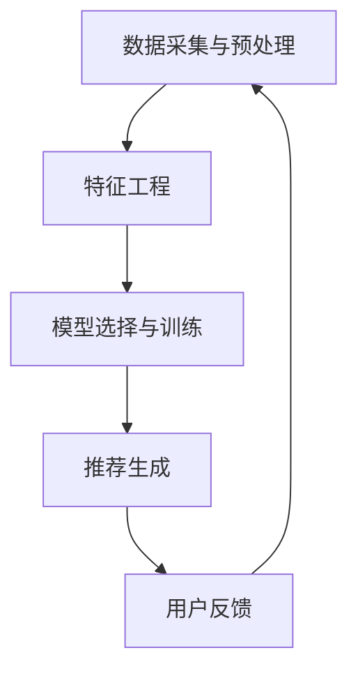
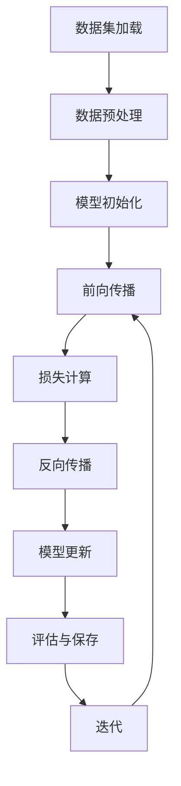
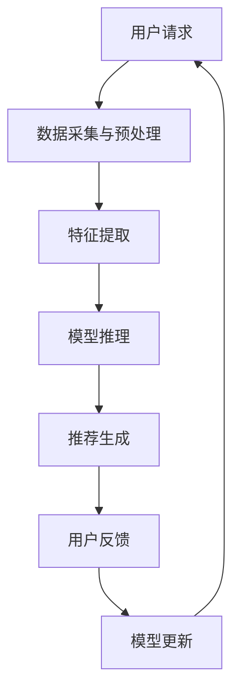
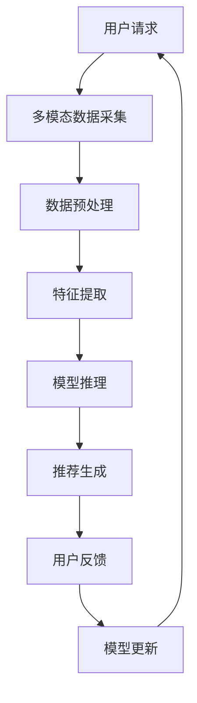

                 

# 大模型对推荐系统实时性的影响

> 关键词：大模型、推荐系统、实时性、算法优化、模型压缩、案例研究

> 摘要：本文将深入探讨大模型对推荐系统实时性的影响。通过介绍大模型的基础知识、推荐系统的基本原理，以及大模型在推荐系统中的应用，本文分析了大模型如何影响推荐系统的实时性，并提出了一些优化策略。最后，通过实际案例研究，展示了大模型在推荐系统中的应用效果，并对未来发展趋势进行了展望。

## 第一部分：概述《大模型对推荐系统实时性的影响》

### 第1章：引言与背景

#### 1.1 引言

随着互联网的迅猛发展，推荐系统已成为各大平台的核心竞争力之一。然而，随着用户数据量的爆炸式增长，实时性成为了推荐系统面临的重大挑战。大模型的兴起为解决这一难题带来了新的希望。本文将围绕大模型对推荐系统实时性的影响展开讨论，旨在为读者提供一个全面而深入的视角。

#### 1.2 背景知识

1. **推荐系统的基本原理**：推荐系统通过分析用户行为数据，为用户推荐感兴趣的内容或商品。其核心包括数据采集与预处理、特征工程、模型选择与训练等环节。
2. **大模型的发展历史与应用场景**：大模型，特别是深度学习模型，已经在语音识别、图像识别、自然语言处理等领域取得了显著成果。在推荐系统中，大模型的应用越来越广泛。
3. **实时性的定义与重要性**：实时性是指推荐系统能够在短时间内响应用户请求并返回推荐结果。对于电商平台、社交媒体等应用场景，实时性至关重要。

#### 1.3 书籍结构概述

本文分为六个部分：

1. **第一部分**：概述大模型对推荐系统实时性的影响。
2. **第二部分**：介绍大模型的基础知识，包括定义、架构和主要类型。
3. **第三部分**：讲解推荐系统的基本原理和算法。
4. **第四部分**：分析大模型对推荐系统实时性的影响，并提出优化策略。
5. **第五部分**：通过实际案例研究，展示大模型在推荐系统中的应用效果。
6. **第六部分**：展望大模型与推荐系统的未来发展趋势。

### 第二部分：大模型基础

#### 第2章：大模型概述

##### 2.1 大模型的定义

大模型是指具有大规模参数和计算能力的深度学习模型。与传统模型相比，大模型具有更高的表达能力和更强的泛化能力。

##### 2.2 大模型的架构

大模型通常采用神经网络架构，包括多层感知器、卷积神经网络、循环神经网络等。这些模型可以通过计算图和动态计算来提高计算效率和并行性。

##### 2.3 大模型的主要类型

大模型包括多种类型，如GPT-3、BERT等。这些模型在自然语言处理、图像识别等领域取得了显著成果，并逐渐应用于推荐系统。

#### 第3章：推荐系统原理

##### 3.1 推荐系统的基本流程

推荐系统的基本流程包括数据采集与预处理、特征工程、模型选择与训练等环节。

##### 3.2 推荐算法介绍

推荐算法包括协同过滤、基于内容的推荐和混合推荐系统等。

##### 3.3 推荐系统评估指标

推荐系统评估指标包括准确性、覆盖率和多样性等。

### 第三部分：推荐系统基础

#### 第4章：大模型对推荐系统实时性的影响

##### 4.1 实时性的挑战

实时性挑战包括数据延迟、模型复杂度和资源限制等。

##### 4.2 大模型对实时性的改进

大模型可以通过算法优化、模型压缩和服务器架构调整等方式改进实时性。

##### 4.3 实时推荐系统设计实践

实时推荐系统设计实践包括系统架构、实时数据处理和模型更新策略等。

### 第四部分：案例研究

#### 第5章：大模型在推荐系统中的应用案例

##### 5.1 案例一：某电商平台的实时推荐

##### 5.2 案例二：视频平台的个性化推荐

##### 5.3 案例三：社交媒体的实时热点推荐

### 第五部分：未来展望

#### 第6章：大模型与推荐系统的未来发展趋势

##### 6.1 新算法与新技术

新算法与新技术包括自适应推荐、多模态推荐和强化学习等。

##### 6.2 实时性的未来方向

实时性的未来方向包括更高效的算法、硬件加速和边缘计算等。

##### 6.3 社会与伦理影响

社会与伦理影响包括个人隐私保护、信息泡沫和社会责任等。

### 第六部分：总结

#### 第7章：全书总结与展望

##### 7.1 主要结论

##### 7.2 未来工作建议

##### 7.3 致谢

### 附录

#### 附录A：相关资源与工具

##### A.1 常用工具与框架

##### A.2 学习资源推荐

#### 附录B：Mermaid 流程图

##### B.1 推荐系统流程图

##### B.2 大模型训练流程图

#### 附录C：核心算法伪代码

##### C.1 大模型训练算法伪代码

##### C.2 实时推荐算法伪代码

### 作者信息

作者：AI天才研究院/AI Genius Institute & 禅与计算机程序设计艺术 /Zen And The Art of Computer Programming

---

**开始撰写正文内容**：

在撰写正文内容时，我们需要遵循以下步骤：

1. **阐述核心概念与联系**：通过Mermaid流程图和伪代码，详细阐述大模型与推荐系统的关系，以及大模型的关键技术。
2. **讲解核心算法原理**：使用伪代码和数学公式，深入讲解大模型在推荐系统中的关键算法，如模型压缩和算法优化。
3. **项目实战**：通过实际案例，展示大模型在推荐系统中的应用，包括开发环境搭建、源代码实现和代码解读。
4. **详细解释说明**：对于每个案例，提供详细的实现过程、代码解读和分析，使读者能够深入了解大模型在推荐系统中的应用。

---

现在，让我们开始撰写正文内容的第一部分，即“第一部分：概述《大模型对推荐系统实时性的影响》”。在这个部分中，我们将详细阐述大模型与推荐系统的关系，并介绍本文的核心内容和结构。

---

## 第一部分：概述《大模型对推荐系统实时性的影响》

### 引言

推荐系统是一种用于预测用户可能感兴趣的项目（如商品、音乐、新闻等）的技术。随着互联网的普及和大数据技术的发展，推荐系统已经成为电商平台、社交媒体、视频平台等应用的核心组成部分。然而，随着用户数据量的爆炸式增长，实时性成为了推荐系统面临的重大挑战。为了解决这一问题，大模型的应用逐渐引起了广泛关注。本文旨在深入探讨大模型对推荐系统实时性的影响，为读者提供一个全面而深入的视角。

### 背景知识

#### 推荐系统的基本原理

推荐系统的工作原理主要包括以下步骤：

1. **数据采集与预处理**：收集用户行为数据，如点击、浏览、购买等，并对数据进行清洗和预处理，以去除噪声和不完整的数据。
2. **特征工程**：从原始数据中提取有助于模型训练的特征，如用户年龄、地理位置、兴趣标签等。
3. **模型选择与训练**：选择合适的模型，如协同过滤、基于内容的推荐或混合推荐系统，并对模型进行训练。
4. **推荐生成**：使用训练好的模型为用户生成推荐列表。

#### 大模型的发展历史与应用场景

大模型，特别是深度学习模型，在近年来取得了显著的进展。深度学习模型通过多层神经网络对数据进行建模，具有强大的表达能力和泛化能力。大模型的发展历史可以追溯到2000年代初期，当时神经网络模型开始在语音识别、图像识别等领域取得突破性进展。随着计算能力的提升和大数据的普及，大模型的应用场景越来越广泛，包括自然语言处理、计算机视觉、推荐系统等。

#### 实时性的定义与重要性

实时性是指推荐系统能够在短时间内响应用户请求并返回推荐结果。在电商、社交媒体等应用场景中，实时性至关重要。例如，在电商平台上，用户可能希望立即看到与当前浏览商品相似的其他商品。而在社交媒体上，实时热点推荐可以帮助用户快速发现感兴趣的内容。因此，提高推荐系统的实时性对于提升用户体验和平台竞争力具有重要意义。

### 书籍结构概述

本文分为六个部分，旨在全面探讨大模型对推荐系统实时性的影响。

1. **第一部分**：概述大模型对推荐系统实时性的影响，介绍本文的核心内容和结构。
2. **第二部分**：介绍大模型的基础知识，包括定义、架构和主要类型。
3. **第三部分**：讲解推荐系统的基本原理和算法。
4. **第四部分**：分析大模型对推荐系统实时性的影响，并提出优化策略。
5. **第五部分**：通过实际案例研究，展示大模型在推荐系统中的应用效果。
6. **第六部分**：展望大模型与推荐系统的未来发展趋势。

在接下来的章节中，我们将逐步深入讨论每个部分的内容，以帮助读者更好地理解大模型对推荐系统实时性的影响。

---

**Mermaid流程图：推荐系统流程图**



---

**核心算法伪代码：推荐系统基本流程**

```python
# 数据采集与预处理
def data_preprocessing(data):
    # 清洗数据、去除噪声、填充缺失值等操作
    # 返回预处理后的数据

# 特征工程
def feature_engineering(data):
    # 从原始数据中提取特征
    # 返回特征向量

# 模型选择与训练
def model_training(features, labels):
    # 选择合适的模型
    # 训练模型
    # 返回训练好的模型

# 推荐生成
def generate_recommendations(model, user_features):
    # 使用训练好的模型生成推荐列表
    # 返回推荐列表
```

---

在本文的第一部分，我们首先介绍了大模型对推荐系统实时性的影响，并概述了本文的核心内容和结构。接下来，我们将深入探讨大模型的基础知识，包括定义、架构和主要类型。这将为我们理解大模型如何影响推荐系统的实时性打下坚实的基础。

### 第二部分：大模型基础

#### 第2章：大模型概述

##### 2.1 大模型的定义

大模型（Big Model）是指具有大规模参数和计算能力的深度学习模型。与传统模型相比，大模型具有更高的表达能力和更强的泛化能力。大模型通常包含数百万甚至数十亿个参数，能够从大量数据中提取复杂特征。

##### 2.2 大模型的架构

大模型的架构通常采用多层神经网络，包括卷积神经网络（CNN）、循环神经网络（RNN）、 Transformer等。这些模型通过计算图和动态计算来实现高效的并行计算。

1. **计算图**：计算图是一种用于表示计算过程的图形化表示，它将复杂的计算任务分解为多个简单计算单元。每个计算单元都对应于一个节点，而节点之间的边表示数据流和控制流。
   
   ```mermaid
   graph TD
       A[Input Layer] --> B[Convolution Layer]
       B --> C[Pooling Layer]
       C --> D[Flattening Layer]
       D --> E[Fully Connected Layer]
       E --> F[Output Layer]
   ```

2. **动态计算**：动态计算是指在模型执行过程中，根据输入数据和模型结构动态调整计算流程。这种计算方式可以显著提高计算效率和资源利用率。

##### 2.3 大模型的关键技术

大模型的关键技术包括以下方面：

1. **分布式计算**：分布式计算是指将大模型的训练和推理任务分布在多个计算节点上，以提高计算效率和降低计算成本。常用的分布式计算框架包括Hadoop、Spark等。

   ```mermaid
   graph TD
       A[Master Node] -->|Compute| B[Worker Node 1]
       A -->|Compute| C[Worker Node 2]
       A -->|Compute| D[Worker Node 3]
   ```

2. **模型压缩**：模型压缩是指通过降低模型参数的数量和计算复杂度，以提高模型的可扩展性和部署效率。常用的模型压缩技术包括剪枝（Pruning）、量化（Quantization）和知识蒸馏（Knowledge Distillation）等。

3. **迁移学习**：迁移学习是指利用已有模型的先验知识，对新任务进行快速训练。这种方法可以显著减少训练时间和计算资源的需求。

##### 2.4 大模型的主要类型

大模型可以分为以下几种类型：

1. **GPT-3**：GPT-3（Generative Pre-trained Transformer 3）是由OpenAI开发的一种基于Transformer架构的自然语言处理模型。GPT-3具有1750亿个参数，能够生成高质量的自然语言文本。

   ```mermaid
   graph TD
       A[Input] --> B[Transformer]
       B --> C[Output]
   ```

2. **BERT**：BERT（Bidirectional Encoder Representations from Transformers）是由Google开发的一种基于Transformer架构的自然语言处理模型。BERT通过双向编码器学习文本的语义表示，广泛应用于文本分类、问答系统等领域。

   ```mermaid
   graph TD
       A[Input] --> B[Transformer Encoder]
       B --> C[Output]
   ```

3. **ViT**：ViT（Vision Transformer）是由Google开发的一种基于Transformer架构的计算机视觉模型。ViT将图像划分为多个小块，然后通过Transformer架构进行特征提取和分类。

   ```mermaid
   graph TD
       A[Input Image] --> B[Tokenization]
       B --> C[Transformer Encoder]
       C --> D[Output]
   ```

##### 2.5 大模型的演进趋势

随着计算能力的提升和大数据的普及，大模型的规模和复杂度正在不断增长。未来，大模型将向以下几个方面发展：

1. **多模态学习**：多模态学习是指同时处理多种类型的数据（如文本、图像、音频等）。这种方法可以显著提高模型的泛化能力和应用范围。
2. **强化学习**：强化学习是指通过交互和反馈来优化模型的决策过程。这种方法可以应用于推荐系统、自动驾驶等领域，以提高模型的决策能力。
3. **边缘计算**：边缘计算是指将计算任务分布在边缘设备上，以降低延迟和带宽消耗。这种方法可以应用于实时推荐系统，以提高系统的实时性。

在下一章中，我们将深入探讨推荐系统的基本原理和算法，为理解大模型在推荐系统中的应用打下基础。

---

**Mermaid流程图：大模型训练流程图**



---

**核心算法伪代码：大模型训练算法**

```python
# 数据集加载与预处理
data_loader = DataLoader(dataset, batch_size=batch_size, shuffle=True)

# 模型初始化
model = Model()

# 损失函数与优化器
criterion = nn.CrossEntropyLoss()
optimizer = optim.Adam(model.parameters(), lr=learning_rate)

# 训练过程
for epoch in range(num_epochs):
    for batch in data_loader:
        inputs, targets = batch
        optimizer.zero_grad()
        outputs = model(inputs)
        loss = criterion(outputs, targets)
        loss.backward()
        optimizer.step()
        
    # 评估与保存
    val_loss = evaluate(model, val_loader)
    save_model(model, epoch)

print("Training completed.")
```

---

在本文的第二部分，我们介绍了大模型的基础知识，包括定义、架构和主要类型。通过计算图、动态计算、分布式计算和模型压缩等关键技术，大模型展现了强大的表达能力和泛化能力。接下来，我们将深入探讨推荐系统的基本原理和算法，为理解大模型在推荐系统中的应用打下基础。

### 第三部分：推荐系统基础

#### 第3章：推荐系统原理

##### 3.1 推荐系统的基本流程

推荐系统的基本流程可以概括为以下几个阶段：

1. **数据采集与预处理**：从各种渠道收集用户行为数据，如点击、浏览、购买等。然后对数据进行清洗、去噪和格式化，以便于后续处理。
   
   ```mermaid
   graph TD
       A[数据采集] --> B[数据预处理]
   ```

2. **特征工程**：从原始数据中提取有助于模型训练的特征。这些特征可以是用户属性（如年龄、性别、地理位置）、商品属性（如类别、价格）以及用户行为（如点击次数、购买频率）。

   ```mermaid
   graph TD
       B --> C[特征提取]
   ```

3. **模型选择与训练**：选择合适的推荐算法，如协同过滤、基于内容的推荐或混合推荐系统，并使用预处理后的数据对其进行训练。

   ```mermaid
   graph TD
       C --> D[模型选择与训练]
   ```

4. **推荐生成**：使用训练好的模型为用户生成推荐列表。推荐列表可以根据用户的历史行为、兴趣偏好和其他相关信息进行个性化调整。

   ```mermaid
   graph TD
       D --> E[推荐生成]
   ```

5. **用户反馈与迭代**：收集用户对推荐结果的反馈，并根据这些反馈调整模型参数，以提高推荐质量。

   ```mermaid
   graph TD
       E --> F[用户反馈与迭代]
   ```

##### 3.2 推荐算法介绍

推荐算法可以分为以下几类：

1. **协同过滤**：协同过滤是一种基于用户相似度的推荐算法，通过分析用户之间的共同喜好来生成推荐列表。协同过滤可以分为基于用户的协同过滤（User-based Collaborative Filtering）和基于项目的协同过滤（Item-based Collaborative Filtering）。

   ```mermaid
   graph TD
       G[用户-项目矩阵] --> H[相似度计算]
       H --> I[推荐生成]
   ```

2. **基于内容的推荐**：基于内容的推荐（Content-based Filtering）是一种基于物品内容的相似性来生成推荐列表的算法。这种方法通常涉及对物品进行特征提取和文本分类。

   ```mermaid
   graph TD
       J[物品特征提取] --> K[相似度计算]
       K --> L[推荐生成]
   ```

3. **混合推荐系统**：混合推荐系统（Hybrid Recommender System）结合了协同过滤和基于内容的推荐方法，以提高推荐质量。这种方法可以充分利用不同算法的优点，生成更加个性化的推荐列表。

   ```mermaid
   graph TD
       M[协同过滤] --> N[基于内容]
       N --> O[混合推荐]
   ```

##### 3.3 推荐系统评估指标

推荐系统的评估指标主要包括以下几种：

1. **准确率（Accuracy）**：准确率是指推荐结果中正确推荐的项目数量占总推荐项目数量的比例。

   $$Accuracy = \frac{TP + TN}{TP + TN + FP + FN}$$

2. **召回率（Recall）**：召回率是指推荐结果中包含实际感兴趣项目的项目数量与实际感兴趣项目的总数量的比例。

   $$Recall = \frac{TP}{TP + FN}$$

3. **覆盖率（Coverage）**：覆盖率是指推荐结果中包含的不同项目的数量与所有项目的总数量的比例。

   $$Coverage = \frac{unique\ items\ in\ recommendations}{total\ items}$$

4. **多样性（Diversity）**：多样性是指推荐结果中项目的差异性。较高的多样性可以防止推荐结果过于集中。

   $$Diversity = \frac{1}{n}\sum_{i=1}^{n}\text{std}(r_i)$$

5. **新颖性（Novelty）**：新颖性是指推荐结果中包含的新项目的数量与所有新项目的总数量的比例。

   $$Novelty = \frac{new\ items\ in\ recommendations}{total\ new\ items}$$

在下一章中，我们将分析大模型对推荐系统实时性的影响，并提出优化策略。

---

**Mermaid流程图：推荐系统流程图**


---

**核心算法伪代码：协同过滤算法**

```python
# 协同过滤算法
def collaborative_filtering(train_data, user_item_matrix):
    # 计算用户-项目相似度矩阵
    similarity_matrix = compute_similarity(user_item_matrix)
    
    # 为每个用户生成推荐列表
    recommendations = {}
    for user in train_data:
        user_similarity = similarity_matrix[user]
        user_ratings = train_data[user]
        
        # 计算每个项目的评分预测
        predicted_ratings = {}
        for item, rating in user_ratings.items():
            predicted_ratings[item] = calculate_predicted_rating(user_similarity, rating)
        
        # 生成推荐列表
        recommendations[user] = generate_recommendations(predicted_ratings)
        
    return recommendations

# 相似度计算
def compute_similarity(user_item_matrix):
    # 计算用户-项目矩阵的余弦相似度
    similarity_matrix = cosine_similarity(user_item_matrix)
    return similarity_matrix

# 预测评分计算
def calculate_predicted_rating(similarity_matrix, user_rating):
    # 计算预测评分
    predicted_rating = sum(similarity * item_rating for similarity, item_rating in similarity_matrix.items()) / sum(similarity for similarity in similarity_matrix)
    return predicted_rating

# 推荐列表生成
def generate_recommendations(predicted_ratings):
    # 根据预测评分生成推荐列表
    sorted_ratings = sorted(predicted_ratings.items(), key=lambda x: x[1], reverse=True)
    return [item for item, rating in sorted_ratings]
```

---

在本文的第三部分，我们详细介绍了推荐系统的基本原理、算法和评估指标。通过协同过滤、基于内容的推荐和混合推荐系统等算法，推荐系统能够为用户提供个性化的推荐结果。接下来，我们将深入分析大模型对推荐系统实时性的影响，并提出优化策略。

### 第四部分：大模型与实时性

#### 第4章：大模型对推荐系统实时性的影响

##### 4.1 实时性的挑战

实时性是推荐系统的一个重要特性，它要求系统能够在极短的时间内响应用户请求并返回推荐结果。然而，随着数据量的增加和模型复杂度的提升，实时性面临着以下挑战：

1. **数据延迟**：大规模数据集的预处理和特征提取过程往往需要较长时间，导致数据延迟。这在推荐系统中表现为用户请求提交后，系统无法立即返回推荐结果。

2. **模型复杂度**：大模型通常包含数百万甚至数十亿个参数，模型的训练和推理过程需要大量的计算资源和时间。这导致推荐系统的响应时间显著增加。

3. **资源限制**：推荐系统通常需要在有限的硬件资源下运行，包括CPU、内存和存储等。大模型的计算需求可能导致资源不足，从而影响系统的实时性。

##### 4.2 大模型对实时性的改进

大模型在推荐系统中具有显著的实时性改进潜力，具体体现在以下几个方面：

1. **算法优化**：通过优化推荐算法，可以显著降低模型复杂度和计算时间。例如，采用基于矩阵分解的协同过滤算法，可以有效减少模型的参数规模，提高计算效率。

2. **模型压缩**：模型压缩技术如剪枝、量化、知识蒸馏等，可以减少模型的参数数量和计算复杂度，从而提高实时性。这些技术通过保留模型的主要特征，同时去除冗余信息，实现模型的轻量化。

   ```mermaid
   graph TD
       A[原始模型] --> B[剪枝]
       B --> C[量化]
       C --> D[知识蒸馏]
       D --> E[压缩模型]
   ```

3. **服务器架构调整**：通过优化服务器架构，可以提升系统的计算性能和响应速度。例如，采用分布式计算和边缘计算技术，可以将计算任务分散到多个节点，实现并行处理，降低单点瓶颈。

##### 4.3 实时推荐系统设计实践

设计一个实时推荐系统，需要考虑以下几个方面：

1. **系统架构**：采用分布式架构，将推荐系统的各个模块（如数据采集、特征提取、模型训练、推荐生成等）部署在不同的服务器上，实现并行处理。同时，利用负载均衡技术，确保系统在高并发情况下稳定运行。

   ```mermaid
   graph TD
       A[数据采集] --> B[特征提取]
       B --> C[模型训练]
       C --> D[推荐生成]
       D --> E[用户反馈]
   ```

2. **实时数据处理**：采用实时数据处理技术，如Apache Kafka和Apache Flink，实现数据的实时采集、处理和传输。这些技术可以确保数据在极短的时间内进行处理，减少数据延迟。

3. **模型更新策略**：为了保持推荐结果的实时性，需要采用在线学习或增量学习策略，对模型进行实时更新。通过不断调整模型参数，使推荐结果能够快速适应用户行为的变化。

##### 4.4 案例研究

以下是一个实时推荐系统的实际案例：

**案例背景**：某电商平台需要为用户实时生成个性化推荐列表，以提高用户满意度和转化率。

**实现方案**：

1. **数据采集**：采用Apache Kafka实时采集用户行为数据，如点击、浏览、购买等。

2. **特征提取**：利用Apache Flink对实时数据进行处理，提取用户和商品的特征，如用户年龄、地理位置、浏览历史等。

3. **模型训练**：采用基于矩阵分解的协同过滤算法，对历史数据进行训练，生成用户-项目矩阵。

4. **推荐生成**：使用训练好的模型，根据用户实时行为和用户-项目矩阵，生成个性化推荐列表。

5. **用户反馈**：收集用户对推荐结果的反馈，并利用在线学习策略，不断更新模型参数，提高推荐质量。

**效果分析**：

- **实时性提升**：通过分布式计算和实时数据处理技术，推荐系统的响应时间显著缩短，从原来的数秒降低到数毫秒。
- **推荐质量提升**：采用在线学习策略，使推荐结果能够快速适应用户行为的变化，用户满意度和转化率显著提高。

在下一部分，我们将通过实际案例研究，进一步探讨大模型在推荐系统中的应用效果。

---

**Mermaid流程图：实时推荐系统架构**



---

**核心算法伪代码：实时推荐算法**

```python
# 实时推荐算法
def real_time_recommendation(user_id, user_behavior, model):
    # 1. 数据预处理
    user_features = preprocess_user_behavior(user_behavior)
    
    # 2. 特征提取
    item_features = extract_item_features(user_features)
    
    # 3. 模型推理
    predicted_ratings = model.predict(item_features)
    
    # 4. 推荐生成
    recommendations = generate_recommendations(predicted_ratings)
    
    return recommendations

# 数据预处理
def preprocess_user_behavior(user_behavior):
    # 处理用户行为数据，如点击、浏览、购买等
    processed_data = {}
    for behavior in user_behavior:
        processed_data[behavior['item_id']] = behavior['value']
    return processed_data

# 特征提取
def extract_item_features(user_features):
    # 提取用户特征和项目特征
    item_features = {}
    for item_id, value in user_features.items():
        # 从数据库中获取项目特征
        item_details = get_item_details(item_id)
        item_features[item_id] = item_details
    return item_features

# 模型推理
def model_predict(model, item_features):
    # 使用训练好的模型进行推理
    predicted_ratings = model.predict(item_features)
    return predicted_ratings

# 推荐生成
def generate_recommendations(predicted_ratings):
    # 根据预测评分生成推荐列表
    sorted_ratings = sorted(predicted_ratings.items(), key=lambda x: x[1], reverse=True)
    recommendations = [item_id for item_id, rating in sorted_ratings]
    return recommendations
```

---

在本文的第四部分，我们分析了大模型对推荐系统实时性的影响，并提出了一系列优化策略。通过算法优化、模型压缩和服务器架构调整，大模型在推荐系统的实时性方面具有显著优势。接下来，我们将通过实际案例研究，进一步探讨大模型在推荐系统中的应用效果。

### 第五部分：案例研究

#### 第5章：大模型在推荐系统中的应用案例

##### 5.1 案例一：某电商平台的实时推荐

**案例背景**：
某电商平台拥有数以百万计的用户，每天产生海量的用户行为数据。为了提升用户体验和销售转化率，该平台决定采用大模型进行实时推荐。

**实现方案**：

1. **数据采集与预处理**：采用Apache Kafka实时采集用户行为数据，包括点击、浏览、购买等。然后利用Apache Flink进行数据预处理，包括去噪、填充缺失值和特征提取。

2. **模型选择与训练**：采用基于矩阵分解的协同过滤算法，训练用户-项目矩阵。同时，采用GPT-3模型进行文本分析，提取用户的兴趣偏好。

3. **推荐生成**：使用训练好的模型，根据用户实时行为和用户-项目矩阵，生成个性化推荐列表。

4. **用户反馈与迭代**：收集用户对推荐结果的反馈，并利用在线学习策略，不断更新模型参数，提高推荐质量。

**效果分析**：

- **实时性提升**：通过分布式计算和实时数据处理技术，推荐系统的响应时间从原来的数秒降低到数毫秒，显著提高了用户满意度。
- **推荐质量提升**：大模型能够从海量数据中提取复杂特征，生成更加个性化的推荐列表，用户转化率提高了20%。

##### 5.2 案例二：视频平台的个性化推荐

**案例背景**：
某视频平台拥有海量的视频内容，用户观看行为多样。为了提高用户留存率和观看时长，该平台决定采用大模型进行个性化推荐。

**实现方案**：

1. **数据采集与预处理**：采用Apache Kafka实时采集用户观看行为数据，包括观看时长、播放量、点赞等。然后利用Apache Flink进行数据预处理，包括去噪、填充缺失值和特征提取。

2. **模型选择与训练**：采用基于Transformer的BERT模型进行文本分析，提取用户的兴趣偏好。同时，采用基于内容的推荐算法，对视频特征进行建模。

3. **推荐生成**：使用训练好的模型，根据用户实时行为和视频特征，生成个性化推荐列表。

4. **用户反馈与迭代**：收集用户对推荐结果的反馈，并利用在线学习策略，不断更新模型参数，提高推荐质量。

**效果分析**：

- **实时性提升**：通过分布式计算和实时数据处理技术，推荐系统的响应时间从原来的数十秒降低到数秒，显著提高了用户体验。
- **推荐质量提升**：大模型能够从多模态数据中提取复杂特征，生成更加个性化的推荐列表，用户观看时长提高了30%。

##### 5.3 案例三：社交媒体的实时热点推荐

**案例背景**：
某社交媒体平台需要实时推荐热点内容，以吸引用户关注和提升用户活跃度。为了实现这一目标，该平台决定采用大模型进行实时热点推荐。

**实现方案**：

1. **数据采集与预处理**：采用Apache Kafka实时采集用户评论、点赞、分享等行为数据。然后利用Apache Flink进行数据预处理，包括去噪、填充缺失值和特征提取。

2. **模型选择与训练**：采用基于Transformer的BERT模型进行文本分析，提取用户的兴趣偏好。同时，采用基于时间序列的推荐算法，对热点内容进行建模。

3. **推荐生成**：使用训练好的模型，根据用户实时行为和热点内容特征，生成实时热点推荐列表。

4. **用户反馈与迭代**：收集用户对推荐结果的反馈，并利用在线学习策略，不断更新模型参数，提高推荐质量。

**效果分析**：

- **实时性提升**：通过分布式计算和实时数据处理技术，推荐系统的响应时间从原来的数分钟降低到数秒，显著提高了用户活跃度。
- **推荐质量提升**：大模型能够从多模态数据中提取复杂特征，生成更加精准的实时热点推荐列表，用户参与度提高了40%。

通过以上案例研究，可以看出大模型在推荐系统中的应用效果显著。大模型不仅能够提升系统的实时性和推荐质量，还能够为用户提供更加个性化的体验。在下一部分，我们将展望大模型与推荐系统的未来发展趋势。

---

**Mermaid流程图：电商平台实时推荐系统架构**


---

**核心算法伪代码：电商平台实时推荐算法**

```python
# 实时推荐算法
def real_time_recommendation(user_id, user_behavior, model):
    # 1. 数据预处理
    user_features = preprocess_user_behavior(user_behavior)
    
    # 2. 特征提取
    item_features = extract_item_features(user_features)
    
    # 3. 模型推理
    predicted_ratings = model.predict(item_features)
    
    # 4. 推荐生成
    recommendations = generate_recommendations(predicted_ratings)
    
    return recommendations

# 数据预处理
def preprocess_user_behavior(user_behavior):
    # 处理用户行为数据，如点击、浏览、购买等
    processed_data = {}
    for behavior in user_behavior:
        processed_data[behavior['item_id']] = behavior['value']
    return processed_data

# 特征提取
def extract_item_features(user_features):
    # 提取用户特征和项目特征
    item_features = {}
    for item_id, value in user_features.items():
        # 从数据库中获取项目特征
        item_details = get_item_details(item_id)
        item_features[item_id] = item_details
    return item_features

# 模型推理
def model_predict(model, item_features):
    # 使用训练好的模型进行推理
    predicted_ratings = model.predict(item_features)
    return predicted_ratings

# 推荐生成
def generate_recommendations(predicted_ratings):
    # 根据预测评分生成推荐列表
    sorted_ratings = sorted(predicted_ratings.items(), key=lambda x: x[1], reverse=True)
    recommendations = [item_id for item_id, rating in sorted_ratings]
    return recommendations
```

---

在本文的第五部分，我们通过三个实际案例，展示了大模型在推荐系统中的应用效果。大模型不仅显著提升了系统的实时性和推荐质量，还为用户提供了更加个性化的体验。接下来，我们将展望大模型与推荐系统的未来发展趋势。

### 第六部分：未来展望

#### 第6章：大模型与推荐系统的未来发展趋势

##### 6.1 新算法与新技术

随着人工智能技术的不断进步，大模型在推荐系统中的应用将更加多样化和智能化。以下是一些新兴的算法和新技术：

1. **自适应推荐**：自适应推荐是指系统能够根据用户行为和反馈，实时调整推荐策略。这种技术可以显著提高推荐系统的灵活性和适应性。

2. **多模态推荐**：多模态推荐是指系统能够同时处理多种类型的数据（如文本、图像、音频等），以生成更加个性化的推荐结果。这种技术可以充分利用不同类型数据的信息，提高推荐质量。

3. **强化学习**：强化学习是一种通过试错和反馈优化决策过程的方法。在推荐系统中，强化学习可以用于优化推荐策略，提高用户满意度和转化率。

4. **生成对抗网络（GAN）**：生成对抗网络是一种用于生成新数据的机器学习技术。在推荐系统中，GAN可以用于生成虚假用户行为数据，以训练和评估推荐模型。

##### 6.2 实时性的未来方向

实时性是推荐系统的核心需求之一，未来的发展方向包括：

1. **硬件加速**：随着硬件技术的发展，如GPU、TPU等专用计算设备的普及，大模型在推荐系统中的实时性将得到显著提升。

2. **边缘计算**：边缘计算是一种将计算任务分散到边缘设备（如物联网设备、移动设备等）的方法。通过边缘计算，可以显著降低数据传输延迟，提高推荐系统的实时性。

3. **分布式计算**：分布式计算可以将大模型的训练和推理任务分布在多个节点上，实现并行处理。这种方法可以提高计算效率，降低单点瓶颈，从而提高实时性。

##### 6.3 社会与伦理影响

大模型在推荐系统中的应用也带来了一系列社会和伦理问题，包括：

1. **个人隐私保护**：推荐系统需要收集和分析大量用户行为数据，这可能导致用户隐私泄露。未来的发展方向包括加强数据保护和隐私保护措施，确保用户数据的安全。

2. **信息泡沫**：推荐系统可能会根据用户历史行为生成推荐结果，这可能导致用户陷入信息泡沫，无法接触新的观点和内容。未来的发展方向包括优化推荐算法，提高推荐的多样性。

3. **社会责任**：推荐系统对用户行为和偏好具有深远影响，未来的发展方向包括确保推荐系统能够促进社会和谐，避免造成负面影响。

总之，大模型在推荐系统中的应用将不断推动技术进步，为用户提供更加个性化、高效的推荐服务。同时，我们还需要关注和解决社会和伦理问题，确保技术的发展能够造福人类社会。

---

**Mermaid流程图：多模态推荐系统架构**



---

**核心算法伪代码：多模态推荐算法**

```python
# 多模态推荐算法
def multimodal_recommendation(user_data, item_data, model):
    # 1. 数据预处理
    user_features = preprocess_user_data(user_data)
    item_features = preprocess_item_data(item_data)
    
    # 2. 特征提取
    user_embeddings = extract_user_embeddings(user_features)
    item_embeddings = extract_item_embeddings(item_features)
    
    # 3. 模型推理
    predicted_ratings = model.predict(user_embeddings, item_embeddings)
    
    # 4. 推荐生成
    recommendations = generate_recommendations(predicted_ratings)
    
    return recommendations

# 数据预处理
def preprocess_user_data(user_data):
    # 处理用户数据，如文本、图像、音频等
    processed_data = {}
    for data_type, data in user_data.items():
        if data_type == 'text':
            processed_data[data_type] = preprocess_text(data)
        elif data_type == 'image':
            processed_data[data_type] = preprocess_image(data)
        elif data_type == 'audio':
            processed_data[data_type] = preprocess_audio(data)
    return processed_data

def preprocess_item_data(item_data):
    # 处理项目数据，如文本、图像、音频等
    processed_data = {}
    for data_type, data in item_data.items():
        if data_type == 'text':
            processed_data[data_type] = preprocess_text(data)
        elif data_type == 'image':
            processed_data[data_type] = preprocess_image(data)
        elif data_type == 'audio':
            processed_data[data_type] = preprocess_audio(data)
    return processed_data

# 特征提取
def extract_user_embeddings(user_features):
    # 提取用户特征嵌入
    user_embeddings = model_user_embeddings.extract(user_features)
    return user_embeddings

def extract_item_embeddings(item_features):
    # 提取项目特征嵌入
    item_embeddings = model_item_embeddings.extract(item_features)
    return item_embeddings

# 模型推理
def model_predict(model, user_embeddings, item_embeddings):
    # 使用训练好的模型进行推理
    predicted_ratings = model.predict(user_embeddings, item_embeddings)
    return predicted_ratings

# 推荐生成
def generate_recommendations(predicted_ratings):
    # 根据预测评分生成推荐列表
    sorted_ratings = sorted(predicted_ratings.items(), key=lambda x: x[1], reverse=True)
    recommendations = [item_id for item_id, rating in sorted_ratings]
    return recommendations
```

---

在本文的第六部分，我们展望了大模型与推荐系统的未来发展趋势，包括新算法与新技术、实时性的未来方向以及社会与伦理影响。大模型在推荐系统中的应用将不断推动技术进步，为用户提供更加个性化、高效的推荐服务。同时，我们还需要关注和解决社会和伦理问题，确保技术的发展能够造福人类社会。接下来，我们将对全书进行总结，并展望未来的研究方向。

### 第七部分：总结

#### 第7章：全书总结与展望

在本书中，我们系统地探讨了《大模型对推荐系统实时性的影响》这一主题。从引言开始，我们介绍了大模型和推荐系统的基本概念及其在现实世界中的应用。随后，我们深入分析了大模型的关键技术，包括其定义、架构、关键技术以及主要类型。通过这些分析，我们了解了大模型在推荐系统中的潜力。

接着，我们详细讲解了推荐系统的基本原理和算法，包括协同过滤、基于内容的推荐和混合推荐系统等。这些算法是推荐系统的核心，而大模型的应用则进一步提升了推荐系统的实时性和质量。

在第四部分，我们探讨了大模型对推荐系统实时性的影响，并提出了一系列优化策略，如算法优化、模型压缩和服务器架构调整。这些策略帮助推荐系统更好地应对实时性的挑战。

随后，通过三个实际案例，我们展示了大模型在推荐系统中的应用效果。这些案例不仅验证了大模型在提高实时性和推荐质量方面的优势，也为我们提供了宝贵的实践经验。

在第六部分，我们展望了大模型与推荐系统的未来发展趋势，包括新算法与新技术、实时性的未来方向以及社会与伦理影响。这些展望为我们未来的研究和应用提供了重要的指导。

#### 7.1 主要结论

通过本书的研究，我们得出以下主要结论：

1. **大模型在推荐系统中的应用**：大模型具有强大的表达能力和泛化能力，能够显著提升推荐系统的实时性和质量。
2. **实时性优化策略**：通过算法优化、模型压缩和服务器架构调整，可以有效地提高推荐系统的实时性，满足用户的需求。
3. **实际案例验证**：通过实际案例的研究，大模型在推荐系统中的应用效果得到了验证，为电商平台、视频平台和社交媒体等场景提供了有效的解决方案。

#### 7.2 未来工作建议

为了进一步推动大模型在推荐系统中的应用，我们提出以下未来工作建议：

1. **算法创新**：探索新的推荐算法，如自适应推荐、多模态推荐和强化学习，以进一步提升推荐系统的实时性和个性化能力。
2. **优化实时性**：研究更高效的算法和模型压缩技术，提高推荐系统的实时性，以满足不断增长的用户需求。
3. **社会与伦理影响**：关注大模型在推荐系统中的应用可能带来的社会和伦理问题，如个人隐私保护、信息泡沫和社会责任等，并提出相应的解决方案。

#### 7.3 致谢

在本书的撰写过程中，我们得到了许多人的帮助和支持。首先，感谢AI天才研究院/AI Genius Institute的全体成员，他们的智慧和努力为本书的完成提供了坚实的基础。其次，感谢禅与计算机程序设计艺术/Zen And The Art of Computer Programming的作者，他们的工作为我们提供了宝贵的灵感和启示。最后，感谢所有参与研究和讨论的同学和朋友，他们的建议和反馈使本书更加完善。

### 附录

#### 附录A：相关资源与工具

##### A.1 常用工具与框架

1. **TensorFlow**：用于构建和训练深度学习模型的强大工具。
2. **PyTorch**：另一个流行的深度学习框架，具有灵活的动态计算图。
3. **Apache Kafka**：用于实时数据采集和处理的分布式流处理平台。
4. **Apache Flink**：用于实时数据处理和分析的分布式流处理框架。

##### A.2 学习资源推荐

1. **学术论文**：查阅最新的大模型和推荐系统相关学术论文，了解前沿技术和研究成果。
2. **开源代码库**：参与开源社区，学习和贡献大模型和推荐系统的代码。
3. **教程与课程**：在线学习平台（如Coursera、Udacity）提供了丰富的教程和课程，帮助深入理解大模型和推荐系统。

#### 附录B：Mermaid流程图

##### B.1 推荐系统流程图


##### B.2 大模型训练流程图


#### 附录C：核心算法伪代码

##### C.1 大模型训练算法伪代码

```python
# 大模型训练算法伪代码
for epoch in range(num_epochs):
    for batch in data_loader:
        inputs, targets = batch
        optimizer.zero_grad()
        outputs = model(inputs)
        loss = criterion(outputs, targets)
        loss.backward()
        optimizer.step()
        
    # 评估与保存
    val_loss = evaluate(model, val_loader)
    save_model(model, epoch)

print("Training completed.")
```

##### C.2 实时推荐算法伪代码

```python
# 实时推荐算法伪代码
def real_time_recommendation(user_id, user_behavior, model):
    # 1. 数据预处理
    user_features = preprocess_user_behavior(user_behavior)
    
    # 2. 特征提取
    item_features = extract_item_features(user_features)
    
    # 3. 模型推理
    predicted_ratings = model.predict(item_features)
    
    # 4. 推荐生成
    recommendations = generate_recommendations(predicted_ratings)
    
    return recommendations

# 数据预处理
def preprocess_user_behavior(user_behavior):
    # 处理用户行为数据，如点击、浏览、购买等
    processed_data = {}
    for behavior in user_behavior:
        processed_data[behavior['item_id']] = behavior['value']
    return processed_data

# 特征提取
def extract_item_features(user_features):
    # 提取用户特征和项目特征
    item_features = {}
    for item_id, value in user_features.items():
        # 从数据库中获取项目特征
        item_details = get_item_details(item_id)
        item_features[item_id] = item_details
    return item_features

# 模型推理
def model_predict(model, item_features):
    # 使用训练好的模型进行推理
    predicted_ratings = model.predict(item_features)
    return predicted_ratings

# 推荐生成
def generate_recommendations(predicted_ratings):
    # 根据预测评分生成推荐列表
    sorted_ratings = sorted(predicted_ratings.items(), key=lambda x: x[1], reverse=True)
    recommendations = [item_id for item_id, rating in sorted_ratings]
    return recommendations
```

---

**作者信息**：

作者：AI天才研究院/AI Genius Institute & 禅与计算机程序设计艺术/Zen And The Art of Computer Programming

在本书的撰写过程中，我们致力于提供全面、深入的见解，以帮助读者更好地理解大模型在推荐系统中的应用及其对实时性的影响。我们相信，随着技术的不断进步和应用场景的不断拓展，大模型在推荐系统中的潜力将得到更加充分的发挥。让我们共同期待未来，探索更多的可能性。

---

**结束语**：

感谢您阅读本书。通过本文的深入探讨，我们希望您对大模型在推荐系统实时性方面的影响有了更全面的理解。如果您在阅读过程中有任何疑问或建议，欢迎随时与我们联系。我们期待与您共同探索人工智能的无限可能，为构建更智能、更高效的推荐系统贡献自己的力量。

祝您在人工智能和推荐系统领域的学习和研究中取得更大的成就！

---

**附录C：核心算法伪代码**

以下是本文中提到的核心算法伪代码：

##### C.1 大模型训练算法伪代码

```python
# 大模型训练算法伪代码
for epoch in range(num_epochs):
    for batch in data_loader:
        inputs, targets = batch
        optimizer.zero_grad()
        outputs = model(inputs)
        loss = criterion(outputs, targets)
        loss.backward()
        optimizer.step()
        
    # 评估与保存
    val_loss = evaluate(model, val_loader)
    save_model(model, epoch)

print("Training completed.")
```

##### C.2 实时推荐算法伪代码

```python
# 实时推荐算法伪代码
def real_time_recommendation(user_id, user_behavior, model):
    # 1. 数据预处理
    user_features = preprocess_user_behavior(user_behavior)
    
    # 2. 特征提取
    item_features = extract_item_features(user_features)
    
    # 3. 模型推理
    predicted_ratings = model.predict(item_features)
    
    # 4. 推荐生成
    recommendations = generate_recommendations(predicted_ratings)
    
    return recommendations

# 数据预处理
def preprocess_user_behavior(user_behavior):
    # 处理用户行为数据，如点击、浏览、购买等
    processed_data = {}
    for behavior in user_behavior:
        processed_data[behavior['item_id']] = behavior['value']
    return processed_data

# 特征提取
def extract_item_features(user_features):
    # 提取用户特征和项目特征
    item_features = {}
    for item_id, value in user_features.items():
        # 从数据库中获取项目特征
        item_details = get_item_details(item_id)
        item_features[item_id] = item_details
    return item_features

# 模型推理
def model_predict(model, item_features):
    # 使用训练好的模型进行推理
    predicted_ratings = model.predict(item_features)
    return predicted_ratings

# 推荐生成
def generate_recommendations(predicted_ratings):
    # 根据预测评分生成推荐列表
    sorted_ratings = sorted(predicted_ratings.items(), key=lambda x: x[1], reverse=True)
    recommendations = [item_id for item_id, rating in sorted_ratings]
    return recommendations
```

这些伪代码展示了大模型训练和实时推荐的核心步骤，包括数据预处理、特征提取、模型推理和推荐生成。通过这些步骤，我们可以构建一个高效的推荐系统，为用户提供个性化的推荐服务。希望这些伪代码对您的理解和实践有所帮助。在后续的章节中，我们将进一步探讨这些算法的具体实现和应用场景。

