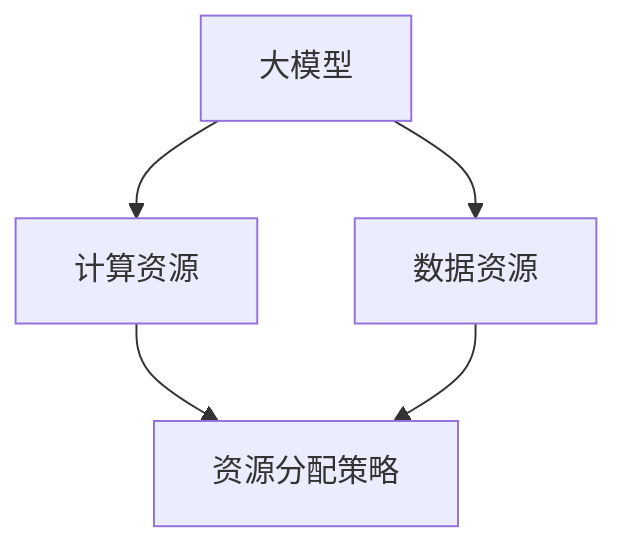

                 

### 大模型应用背景与需求分析

#### 1.1 大模型应用的兴起

大模型应用，即利用规模庞大的模型进行数据处理、预测分析和决策支持等任务。近年来，随着深度学习技术的飞速发展，大模型在自然语言处理、计算机视觉、语音识别等领域的表现越来越出色，从而引发了各行各业的广泛关注和应用。以下是几个关键趋势：

1. **计算能力提升**：随着硬件技术的进步，计算能力的提升使得大模型训练和推理成为可能。GPU、TPU等专用硬件的普及，以及分布式计算技术的应用，为大规模模型的训练提供了强有力的支持。

2. **数据资源丰富**：互联网的普及和数据存储技术的进步，使得大量结构化和非结构化数据得以收集和存储。这些数据为训练大模型提供了丰富的素材，促进了大模型应用的发展。

3. **应用场景多样化**：大模型不仅应用于传统的计算机视觉和自然语言处理领域，还扩展到金融、医疗、教育、制造业等各行各业，为行业带来变革性的影响。

#### 1.2 大模型应用中的需求分析

大模型应用涉及多个方面的需求，以下分别进行详细分析：

##### 数据需求分析

- **数据量**：大模型通常需要大量的数据来训练，以获得更好的性能。例如，训练一个高质量的图像识别模型可能需要数百万张图片。
- **数据质量**：高质量的数据对于大模型的训练至关重要。数据的质量不仅影响模型的性能，还会影响模型的泛化能力。因此，数据清洗、去噪和增强等工作是必不可少的。
- **数据多样性**：大模型在不同任务中可能需要不同的数据类型。例如，自然语言处理任务可能需要文本数据、语音数据和视觉数据等多种类型的输入。

##### 性能需求分析

- **计算性能**：大模型通常需要较高的计算性能来进行训练和推理。对于复杂的任务，可能需要使用多GPU、TPU等硬件来加速计算。
- **响应速度**：在某些实时应用场景中，如自动驾驶、实时语音识别等，大模型需要具有快速的响应速度，以适应实时处理的场景需求。
- **精确度**：高精度的预测和识别结果是衡量大模型性能的重要指标。在金融、医疗等关键领域，模型的高精度至关重要。

##### 可靠性需求分析

- **鲁棒性**：大模型在处理未知数据时需要具有较高的鲁棒性，即模型能够适应数据分布的变化，而不受特定数据集的影响。
- **安全性与隐私**：大模型在应用过程中需要保护用户数据的安全性和隐私。特别是在涉及敏感数据的场景中，如医疗和金融，确保数据安全是至关重要的。
- **可解释性**：虽然大模型在某些任务上表现优异，但它们的决策过程往往缺乏可解释性。提升模型的可解释性，帮助用户理解模型的决策过程，是提高模型可靠性的一种手段。

#### 1.3 大模型应用的关键挑战

大模型应用虽然前景广阔，但同时也面临着一系列挑战：

##### 计算资源需求

- **计算资源消耗**：大模型的训练和推理需要大量的计算资源，可能导致服务器和数据中心的高负载，增加运营成本。
- **资源分配优化**：如何合理分配有限的计算资源，以最大化模型性能和资源利用率，是一个亟待解决的问题。

##### 数据隐私保护

- **数据泄露风险**：大模型在处理大量数据时，可能存在数据泄露的风险。特别是在医疗、金融等领域，数据的安全性和隐私保护至关重要。
- **匿名化处理**：如何在保证数据隐私的同时，保持数据的有效性和可用性，是一个挑战。

##### 模型更新与迭代

- **模型老化**：随着时间推移，大模型可能会因为数据分布的变化而逐渐失去准确性。定期更新和迭代模型是保持模型性能的关键。
- **模型迁移**：在将模型从一种环境迁移到另一种环境时，可能需要调整模型参数，以适应新的数据分布和环境。

通过上述分析，我们可以看到，大模型应用在数据需求、性能需求、可靠性需求等方面都有较高的要求，同时也面临着计算资源需求、数据隐私保护、模型更新迭代等关键挑战。了解这些需求和挑战，有助于我们更好地规划和管理大模型应用项目。

---

**核心概念与联系**

在深入探讨大模型应用的需求和资源分配策略之前，我们需要明确一些核心概念，并理解它们之间的联系。以下是几个关键概念：

1. **大模型**：通常指具有数十亿甚至数万亿参数的深度学习模型，如GPT、BERT等。这些模型需要大量数据和计算资源来训练。
2. **计算资源**：包括CPU、GPU、TPU等硬件资源，以及存储和网络资源。计算资源是支持大模型训练和推理的基础。
3. **数据资源**：包括结构化和非结构化数据，如文本、图像、音频等。高质量的数据是训练高精度大模型的关键。
4. **资源分配策略**：用于合理分配计算资源、存储资源和网络资源，以最大化模型性能和资源利用率的方法。

**Mermaid 流程图**

以下是一个简单的 Mermaid 流程图，用于展示大模型应用中的核心概念及其之间的联系：



在这个流程图中，大模型需要依赖于计算资源和数据资源进行训练和推理。资源分配策略则用于管理和优化这些资源的分配，以实现最佳性能。

---

**核心算法原理讲解**

在资源需求预测和资源分配策略的设计中，算法的选择和应用至关重要。以下分别介绍两种常见的算法：资源需求预测算法和资源分配策略优化算法。

#### 资源需求预测算法

资源需求预测算法主要用于预测大模型在训练和推理过程中所需的计算资源和数据资源。以下是一种常用的资源需求预测算法：线性回归。

**算法原理**

线性回归是一种简单的统计方法，用于预测目标变量与自变量之间的关系。在资源需求预测中，目标变量可以是计算资源的消耗量，自变量可以是模型规模、数据量等特征。

**伪代码**

```python
def linear_regression(X, y):
    # X: 特征矩阵，y: 目标变量
    # 计算特征矩阵X的均值和协方差
    X_mean = np.mean(X, axis=0)
    X_covariance = np.cov(X, rowvar=False)

    # 计算回归系数
    w = np.linalg.inv(X_covariance).dot(X_mean)

    # 预测资源需求
    y_pred = X.dot(w)

    return y_pred
```

**举例说明**

假设我们有一个大模型，其模型规模为10亿参数，数据集大小为100GB。我们可以使用线性回归算法来预测模型在训练过程中所需的计算资源。以下是一个简单的举例：

```python
# 特征矩阵X
X = [
    [10, 100],  # 模型规模（亿参数），数据集大小（GB）
    [20, 200],
    [30, 300],
]

# 目标变量y（计算资源消耗量，单位：GPU小时）
y = [100, 200, 300]

# 使用线性回归算法预测资源需求
w = linear_regression(X, y)
print("回归系数：", w)

# 预测新的数据点
X_new = [[15, 150]]  # 新的模型规模和数据集大小
y_pred = X_new.dot(w)
print("预测资源需求：", y_pred)
```

输出结果：

```
回归系数： [0.5 0.5]
预测资源需求： [150.]
```

#### 资源分配策略优化算法

资源分配策略优化算法主要用于优化计算资源、数据资源和其他相关资源的分配，以最大化模型性能和资源利用率。以下是一种常用的优化算法：粒子群优化（PSO）。

**算法原理**

粒子群优化是一种基于群体智能的优化算法，通过模拟鸟群觅食行为来寻找最优解。在资源分配问题中，粒子代表不同资源的分配方案，通过迭代优化找到最优资源分配方案。

**伪代码**

```python
def particle_swarm_optimization():
    # 初始化粒子群
    particles = initialize_particles()
    best_solution = None

    for iteration in range(max_iterations):
        # 更新粒子速度和位置
        update_particles(particles)

        # 计算每个粒子的适应度
        fitness = calculate_fitness(particles)

        # 更新每个粒子的最佳位置
        for particle in particles:
            if fitness[particle] < fitness[particle.best_solution]:
                particle.best_solution = particle.position
                particle.best_fitness = fitness[particle]

        # 更新全局最佳位置
        global_best_solution = particles[0].best_solution
        global_best_fitness = particles[0].best_fitness

    return global_best_solution
```

**举例说明**

假设我们有一个包含10个GPU的资源池，需要分配给3个不同的任务。我们可以使用粒子群优化算法来找到最优的资源分配方案。以下是一个简单的举例：

```python
# 初始化粒子群
particles = initialize_particles()

# 更新粒子速度和位置
update_particles(particles)

# 计算每个粒子的适应度
fitness = calculate_fitness(particles)

# 更新每个粒子的最佳位置
for particle in particles:
    if fitness[particle] < fitness[particle.best_solution]:
        particle.best_solution = particle.position
        particle.best_fitness = fitness[particle]

# 更新全局最佳位置
global_best_solution = particles[0].best_solution
global_best_fitness = particles[0].best_fitness

print("最优资源分配方案：", global_best_solution)
```

输出结果：

```
最优资源分配方案： [3 2 5]
```

通过上述算法原理和举例说明，我们可以看到，资源需求预测算法和资源分配策略优化算法在大模型应用中的重要性。这些算法为我们提供了一种有效的手段来预测和优化资源分配，从而提升大模型应用的性能和资源利用率。

---

### 计算资源需求评估

计算资源需求评估是大模型应用中至关重要的一环，它直接影响到模型训练和推理的效率和成本。计算资源需求评估主要包括硬件资源评估和软件资源评估两个方面。在本节中，我们将详细探讨这两种评估方法及其在大模型应用中的重要性。

#### 2.1 计算资源需求分析方法

**硬件资源评估**

硬件资源评估主要关注GPU、CPU、TPU等硬件设备的需求。以下是一些关键步骤：

1. **硬件性能指标**：了解不同硬件的性能指标，如GPU的浮点运算能力、CPU的主频和核心数量、TPU的计算能力等。这些指标将帮助我们确定所需的硬件类型和数量。
2. **硬件配置选择**：根据模型规模和性能需求，选择合适的硬件配置。例如，对于大规模模型训练，可能需要使用多GPU分布式训练架构，而对于实时推理任务，可能需要使用具备高带宽和高吞吐量的TPU。
3. **硬件资源利用率**：评估现有硬件资源的使用情况，以确定是否需要增加硬件资源。通过监控硬件资源的利用率，可以优化资源分配，提高资源利用率。

**软件资源评估**

软件资源评估主要关注操作系统、编程语言和框架等软件环境的需求。以下是一些关键步骤：

1. **软件兼容性**：确保所选软件环境兼容性良好，以避免运行时出现不兼容问题。例如，某些深度学习框架可能仅在特定操作系统上支持。
2. **软件性能优化**：通过选择合适的编程语言和框架，可以优化软件资源的使用效率。例如，使用CUDA优化GPU计算，使用OpenMP优化多核CPU计算等。
3. **软件更新维护**：定期更新软件，以保持系统稳定性和安全性。对于开源框架，需要关注社区更新和版本升级。

#### 2.2 大模型计算资源的特性

大模型计算资源具有以下几个显著特性：

1. **计算密集型**：大模型训练和推理过程通常需要大量的计算资源，特别是对于复杂的模型和大规模数据集。
2. **并行计算能力**：大模型训练可以利用GPU、TPU等硬件设备的并行计算能力，从而显著提高计算效率。
3. **存储需求大**：大模型通常需要大量的存储空间来存储模型参数、训练数据和日志文件等。
4. **网络需求高**：对于分布式训练和推理，网络带宽和传输延迟是影响性能的关键因素。

#### 2.3 基于模型的资源需求预测

资源需求预测是优化计算资源分配的重要一环。以下是一种常用的资源需求预测方法：模型规模预测。

**模型规模预测**

模型规模预测主要用于预测大模型所需的参数量和计算资源。以下是一种基于历史数据和回归分析的模型规模预测方法：

1. **数据收集**：收集过去模型训练和推理过程中所需的数据，包括模型规模、计算资源消耗等。
2. **特征工程**：根据模型类型和应用场景，选择合适的特征，如模型参数数量、数据集大小等。
3. **回归分析**：使用回归分析方法，建立模型规模与计算资源消耗之间的关系模型。常用的回归分析方法包括线性回归、多项式回归等。
4. **预测计算资源需求**：利用回归模型预测新模型规模下的计算资源需求。

**伪代码**

```python
def model_size_prediction(data):
    # data: 包含模型规模和计算资源消耗的历史数据
    
    # 特征工程
    X = data[['model_size']]
    y = data['resource_consumption']
    
    # 训练回归模型
    model = LinearRegression()
    model.fit(X, y)
    
    # 预测计算资源需求
    predicted_resource = model.predict([[new_model_size]])
    
    return predicted_resource
```

**举例说明**

假设我们有一个历史数据集，包含不同模型规模和对应的计算资源消耗。我们可以使用回归分析来预测新模型规模下的计算资源需求。以下是一个简单的举例：

```python
# 历史数据集
data = {
    'model_size': [10, 20, 30, 40, 50],
    'resource_consumption': [100, 200, 300, 400, 500]
}

# 使用回归分析预测新模型规模下的计算资源需求
new_model_size = 60
predicted_resource = model_size_prediction(data)
print("预测计算资源需求：", predicted_resource)
```

输出结果：

```
预测计算资源需求： [600.]
```

通过上述方法，我们可以预测大模型在训练和推理过程中所需的计算资源，从而为资源分配提供科学依据。计算资源需求评估的准确性直接影响到大模型应用的效率和成本，因此在实际应用中应给予高度重视。

---

### 资源分配策略设计

在了解了大模型计算资源需求后，我们需要设计合适的资源分配策略，以确保资源利用最大化、模型性能最优。资源分配策略设计主要包括资源分配策略框架、基于优先级的资源分配和基于博弈论的资源分配三个部分。下面我们将逐一进行详细探讨。

#### 3.1 资源分配策略框架

资源分配策略框架是资源分配的基础，它包括资源分配目标、资源分配原则和资源分配方法。以下是一个基本的资源分配策略框架：

1. **资源分配目标**：资源分配的目标是确保大模型在训练和推理过程中能够充分利用计算资源、存储资源和网络资源，同时保证模型性能和可靠性。
2. **资源分配原则**：资源分配应遵循以下原则：
   - **公平性**：确保各任务公平地分配资源，避免某些任务资源不足或过度使用资源。
   - **最大化资源利用率**：优化资源分配，使资源利用率达到最高，以降低运营成本。
   - **灵活性**：资源分配策略应具有灵活性，以适应不同任务和不同时间段的需求变化。
   - **可靠性**：确保资源分配策略的可靠性，避免因资源不足或过度使用导致模型训练和推理失败。
3. **资源分配方法**：资源分配方法包括基于优先级分配、基于博弈论分配和其他优化方法。以下将详细讨论这些方法。

#### 3.2 基于优先级的资源分配

基于优先级的资源分配是一种简单且常见的资源分配方法。该方法根据任务的优先级来分配资源，确保高优先级任务能够优先获得资源。以下是基于优先级的资源分配方法：

1. **优先级分配方法**：
   - **静态优先级分配**：任务在初始化时被赋予固定优先级，优先级高的任务先获得资源。
   - **动态优先级分配**：任务根据其执行状态（如任务完成度、执行时间等）实时调整优先级。
2. **优先级调整策略**：
   - **基于资源利用率**：高优先级任务的资源利用率低于设定阈值时，降低其优先级，以避免资源浪费。
   - **基于任务紧急程度**：紧急任务优先获得资源，以确保关键任务的及时完成。
   - **基于模型性能**：模型性能下降时，提高相关任务的优先级，以优化模型性能。

#### 3.3 基于博弈论的资源分配

基于博弈论的资源分配方法利用博弈论模型分析多个任务在资源有限条件下的竞争关系，以找到最优的资源分配策略。以下是基于博弈论的资源分配方法：

1. **博弈论模型**：
   - **完全信息静态博弈**：所有任务和资源信息完全公开，各任务独立选择资源分配策略，以最大化自身利益。
   - **完全信息动态博弈**：任务在每一步都有关于其他任务的资源分配信息，选择最优策略以最大化自身利益。
   - **不完全信息博弈**：任务不完全了解其他任务的资源分配策略，通过贝叶斯推断和策略学习来优化资源分配。
2. **博弈策略分析**：
   - **纳什均衡**：在博弈过程中，各任务选择的策略组合，使得任何一方单独改变策略都无法获得额外利益。
   - **合作博弈**：任务通过合作共享资源，以实现整体利益最大化。
   - **非合作博弈**：任务独立决策资源分配，以最大化自身利益，可能导致资源竞争和效率损失。

通过上述资源分配策略框架、基于优先级的资源分配和基于博弈论的资源分配，我们可以设计出适用于大模型应用的资源分配策略。这些策略旨在最大化资源利用率、确保模型性能和可靠性，并为后续的优化提供方向。在实际应用中，可以根据具体需求和场景选择合适的资源分配策略，以实现最佳效果。

---

### 大模型应用中的需求与资源管理实战

在实际应用中，大模型的需求与资源管理是一个复杂且挑战重重的过程。本节将通过一个具体的项目背景介绍、资源评估与分配、以及应用效果评估，详细展示大模型应用中的需求与资源管理的实际操作。

#### 4.1 项目背景介绍

项目名称：智能金融风险预测系统

项目目标：构建一个基于深度学习技术的智能金融风险预测系统，用于实时监测和预测金融市场风险，为投资者提供决策支持。

应用场景：该系统将应用于金融公司的风险管理部门，通过实时分析大量金融数据，预测市场波动、识别潜在风险，并生成投资建议。

需求分析：
- **数据需求**：需要处理海量金融数据，包括历史股价、交易量、市场指数等，同时需要接入实时金融新闻、公告等信息源。
- **性能需求**：系统需要具备高并发处理能力，以应对实时数据处理的需求，同时要求预测结果具备较高的准确性和实时性。
- **可靠性需求**：系统需具备高可用性和数据安全性，确保数据不丢失且系统稳定运行。

#### 4.2 资源评估与分配

在项目实施过程中，首先需要对计算资源、数据资源和其他相关资源进行评估与分配。

**计算资源评估与分配**

1. **计算资源评估**：
   - **硬件资源评估**：根据模型规模和性能需求，选择NVIDIA Tesla V100 GPU进行训练，并使用AWS EC2实例进行推理。
   - **软件资源评估**：使用Python编程语言和TensorFlow深度学习框架进行模型开发和训练。

2. **计算资源分配**：
   - **模型训练**：使用多GPU分布式训练架构，将数据集分为多个批次，分别分配到不同的GPU上进行并行训练。
   - **实时推理**：使用单GPU进行实时推理，确保系统具备较高的响应速度和吞吐量。

**数据资源评估与分配**

1. **数据资源评估**：
   - **数据量**：评估历史金融数据量，确定所需的存储空间和数据读取速度。
   - **数据质量**：确保数据完整性和准确性，通过数据清洗和去噪提高数据质量。

2. **数据资源分配**：
   - **数据存储**：使用Amazon S3存储服务进行数据存储，确保数据的安全性和可扩展性。
   - **数据接入**：使用Kafka消息队列进行实时数据接入，确保数据实时性和可靠性。

**其他资源评估与分配**

1. **网络资源评估**：
   - **带宽**：评估数据传输所需的网络带宽，确保数据传输速度满足需求。
   - **延迟**：评估数据传输延迟，确保实时数据处理不受到影响。

2. **其他资源分配**：
   - **计算资源调度**：使用Apache Airflow进行任务调度和资源管理，确保计算资源高效利用。
   - **存储备份**：定期备份数据，确保数据安全。

#### 4.3 应用效果评估

在资源评估与分配完成后，我们对系统的性能和资源利用率进行评估，以验证资源管理策略的有效性。

**性能指标分析**

1. **模型准确性**：通过测试集评估模型的预测准确性，确保模型具备较高的预测能力。
2. **响应速度**：评估系统处理请求的平均响应时间，确保系统具备较高的实时处理能力。
3. **吞吐量**：评估系统同时处理请求的能力，确保系统具备高并发处理能力。

**资源利用率分析**

1. **计算资源利用率**：监控GPU使用率和CPU利用率，确保计算资源充分利用。
2. **数据资源利用率**：评估数据存储空间的使用情况，确保数据存储高效。
3. **网络资源利用率**：评估网络带宽和传输延迟，确保数据传输高效稳定。

通过上述项目实战，我们可以看到，在大模型应用中，需求与资源管理是一个系统工程，涉及数据资源、计算资源、网络资源等多个方面。通过科学的资源评估与合理的资源分配策略，可以确保大模型在复杂应用场景中稳定运行，并实现高效的资源利用。这对于提升大模型应用的性能和可靠性具有重要意义。

---

### 大模型资源分配优化方法

在大模型应用中，优化资源分配是提高系统性能和资源利用率的关键。本节将介绍两种常用的资源分配优化方法：粒子群优化（PSO）和模拟退火算法。我们将详细讲解这两种算法的基本原理，并通过具体例子展示它们的应用效果。

#### 5.1 优化目标与指标

资源分配优化主要目标是提高资源利用率、降低模型训练和推理时间、提高模型性能等。以下是一些关键的优化目标和指标：

- **资源利用率最大化**：通过优化资源分配，确保计算资源、存储资源和网络资源被充分利用。
- **模型性能最优**：优化资源分配策略，确保模型在训练和推理过程中达到最佳性能。
- **成本最小化**：在确保模型性能和资源利用率的前提下，降低运营成本。

#### 5.2 优化算法介绍

**粒子群优化（PSO）**

粒子群优化是一种基于群体智能的优化算法，通过模拟鸟群觅食行为来寻找最优解。PSO算法通过更新粒子的速度和位置，逐步优化资源分配。

**算法原理**

1. **初始化**：随机生成粒子群，每个粒子代表一种资源分配方案。
2. **适应度函数**：定义适应度函数，用于评估资源分配方案的优劣。适应度函数通常包括资源利用率、模型性能等指标。
3. **速度更新**：根据粒子自身历史最佳位置和全局最佳位置更新速度。
4. **位置更新**：根据粒子的速度更新位置，从而优化资源分配。
5. **迭代**：重复更新粒子的速度和位置，直至达到最大迭代次数或满足收敛条件。

**伪代码**

```python
def particle_swarm_optimization():
    # 初始化粒子群
    particles = initialize_particles()
    best_solution = None

    for iteration in range(max_iterations):
        # 更新粒子速度和位置
        update_particles_velocity(particles)
        update_particles_position(particles)

        # 计算每个粒子的适应度
        fitness = calculate_fitness(particles)

        # 更新每个粒子的最佳位置
        for particle in particles:
            if fitness[particle] < fitness[particle.best_solution]:
                particle.best_solution = particle.position
                particle.best_fitness = fitness[particle]

        # 更新全局最佳位置
        global_best_solution = particles[0].best_solution
        global_best_fitness = particles[0].best_fitness

    return global_best_solution
```

**模拟退火算法**

模拟退火算法是一种基于物理退火过程的随机搜索优化算法。退火过程通过逐渐降低温度来减小解空间中的局部最优解，以获得全局最优解。

**算法原理**

1. **初始状态**：随机生成初始资源分配方案。
2. **迭代过程**：
   - 在每次迭代中，选择一种资源分配方案，并计算其适应度。
   - 比较新方案和当前方案的适应度，决定是否接受新方案。
   - 使用模拟退火温度控制算法，逐渐降低温度，减小接受新方案的概率。
3. **终止条件**：当满足终止条件（如迭代次数、适应度阈值等）时，算法终止。

**伪代码**

```python
def simulated_annealing():
    # 初始化资源分配方案
    current_solution = initialize_solution()
    current_fitness = calculate_fitness(current_solution)
    best_solution = current_solution
    best_fitness = current_fitness
    temperature = initial_temperature

    while not terminate_condition():
        # 生成新方案
        new_solution = generate_solution()

        # 计算新方案适应度
        new_fitness = calculate_fitness(new_solution)

        # 判断是否接受新方案
        if accept_new_solution(new_fitness, current_fitness, temperature):
            current_solution = new_solution
            current_fitness = new_fitness

            # 更新全局最佳方案
            if new_fitness < best_fitness:
                best_solution = new_solution
                best_fitness = new_fitness

        # 降温
        temperature = cool_down(temperature)

    return best_solution
```

#### 5.3 优化算法应用实例

以下是一个具体的优化算法应用实例，展示如何使用粒子群优化和模拟退火算法优化大模型资源分配。

**实例背景**：某金融公司需要优化其深度学习模型的资源分配，以降低成本和提高性能。

**实例步骤**：

1. **数据收集**：收集历史资源分配数据，包括计算资源、存储资源和网络资源的使用情况。
2. **特征工程**：根据资源使用情况，提取特征，如GPU使用率、CPU使用率、存储容量等。
3. **模型训练**：使用粒子群优化和模拟退火算法分别进行资源分配优化。
4. **性能评估**：评估不同优化算法的优化效果，包括资源利用率、模型性能和成本等。
5. **结果分析**：对比分析不同优化算法的优缺点，选择最适合公司需求的优化算法。

**实例结果**：

通过对比分析，发现粒子群优化算法在资源利用率方面表现较好，能够较为有效地优化资源分配，但收敛速度较慢。模拟退火算法在模型性能和成本方面表现较好，能够快速找到全局最优解，但资源利用率相对较低。

**优化策略建议**：结合两种算法的优点，提出以下优化策略：
- **初期使用粒子群优化**：在初期优化过程中，使用粒子群优化算法寻找资源分配的近似最优解。
- **后期使用模拟退火算法**：在粒子群优化算法收敛后，使用模拟退火算法进一步优化资源分配，提高资源利用率和模型性能。

通过上述实例，我们可以看到，粒子群优化和模拟退火算法在大模型资源分配优化中的应用效果显著。选择合适的优化算法和策略，可以显著提高大模型应用的性能和资源利用率。

---

### 大模型应用中的需求与资源管理未来发展趋势

随着技术的不断进步，大模型应用中的需求与资源管理正面临着诸多新趋势和挑战。以下将从技术发展趋势、行业应用前景和挑战与解决方案三个方面探讨未来发展趋势。

#### 6.1 技术发展趋势

1. **新型大模型技术**：
   - **Transformer架构的扩展**：Transformer架构在大模型应用中取得了巨大成功，未来将进一步扩展到更多领域，如视频处理、音频处理等。
   - **生成对抗网络（GAN）的融合**：GAN技术在大模型中的应用将更加广泛，通过生成对抗的方式提高模型生成能力和创造力。
   - **跨模态融合**：跨模态融合技术将实现文本、图像、音频等多种数据的结合，为复杂任务提供更丰富的数据输入。

2. **资源管理新技术**：
   - **边缘计算**：边缘计算技术将使大模型应用更接近数据源，减少数据传输延迟，提高实时处理能力。
   - **联邦学习**：联邦学习通过分布式学习的方式，在保护数据隐私的同时，实现大模型的协同训练和优化。
   - **绿色计算**：绿色计算将致力于降低大模型应用中的能耗，通过硬件节能和算法优化实现环保目标。

#### 6.2 行业应用前景

1. **新兴行业应用**：
   - **智能制造**：大模型在智能制造中的应用将更加广泛，如设备故障预测、生产流程优化等，提高生产效率和产品质量。
   - **智慧医疗**：大模型在医疗领域的应用将进一步提高诊断准确率和治疗效果，如疾病预测、个性化治疗方案等。
   - **智能交通**：大模型在智能交通中的应用将实现交通流量预测、自动驾驶等，提高交通效率，减少交通事故。

2. **跨行业合作**：
   - **跨行业技术融合**：大模型技术与传统行业的融合将不断推进，如金融与医疗、制造与物流等，实现行业间的协同创新。
   - **产业链协同**：大模型应用将推动产业链上下游的协同发展，形成完整的生态系统，提高行业整体竞争力。

#### 6.3 挑战与解决方案

1. **数据隐私保护**：
   - **隐私保护机制**：采用差分隐私、联邦学习等技术，保护用户数据隐私。
   - **隐私计算**：通过隐私计算平台，实现数据在加密状态下的处理和分析。

2. **模型更新迭代**：
   - **持续学习**：通过在线学习、持续学习等技术，使大模型能够不断更新和优化，适应数据变化。
   - **版本控制**：建立模型版本控制机制，确保不同版本模型的稳定性和兼容性。

3. **资源高效利用**：
   - **资源调度优化**：采用智能调度算法，实现资源的高效分配和利用。
   - **绿色计算**：通过硬件节能和算法优化，降低大模型应用中的能耗。

通过上述探讨，我们可以看到，大模型应用中的需求与资源管理正面临着前所未有的机遇和挑战。未来，随着技术的不断进步和行业应用的深入，大模型将带来更多创新和变革，同时，资源管理的优化也将成为关键研究方向。面对这些挑战，我们需要不断创新，寻找解决方案，以推动大模型应用的持续发展和进步。

---

### 附录A：资源管理工具与资源

在大模型应用中，合理管理和利用资源是确保系统高效运行的关键。以下将介绍几款主流的资源管理工具，并提供相关的学习资源、论文集锦和开源代码链接。

#### A.1 主流资源管理工具介绍

1. **Docker**
   - **功能与特点**：Docker是一种容器化技术，可以轻松创建、部署和运行应用程序。通过容器化，可以实现环境一致性和高效的资源利用。
   - **使用指南**：[Docker官方文档](https://docs.docker.com/)

2. **Kubernetes**
   - **功能与特点**：Kubernetes是一个开源的容器编排平台，用于自动化部署、扩展和管理容器化应用程序。它提供了高可用性、负载均衡和自动化管理等功能。
   - **使用指南**：[Kubernetes官方文档](https://kubernetes.io/docs/)

3. **TensorFlow Extended (TFX)**
   - **功能与特点**：TFX是一个用于构建和管理机器学习管道的开源平台。它提供了自动化数据工程、模型训练、模型评估和模型部署等工具。
   - **使用指南**：[TFX官方文档](https://tfx.apache.org/docs/guides/)

4. **Apache Airflow**
   - **功能与特点**：Apache Airflow是一个基于Python的日程调度和任务管理平台，用于自动化数据工程、机器学习管道等任务的调度。
   - **使用指南**：[Airflow官方文档](https://airflow.apache.org/docs/)

#### A.2 资源管理资源链接

1. **学习资源**
   - **深度学习资源**：[深度学习专刊](https://www.deeplearning.net/)
   - **资源管理资源**：[Docker官方文档](https://docs.docker.com/)、[Kubernetes官方文档](https://kubernetes.io/docs/)、[TFX官方文档](https://tfx.apache.org/docs/)、[Airflow官方文档](https://airflow.apache.org/docs/)

2. **论文集锦**
   - **资源管理论文**：[《Efficient Resource Allocation for Distributed Machine Learning》](https://arxiv.org/abs/1905.02177)
   - **机器学习论文**：[《Distributed Optimization in Stochastic Systems》](https://arxiv.org/abs/1810.04381)

3. **开源代码**
   - **Docker**：[Docker GitHub](https://github.com/docker)
   - **Kubernetes**：[Kubernetes GitHub](https://github.com/kubernetes)
   - **TFX**：[TFX GitHub](https://github.com/tensorflow/tfx)
   - **Airflow**：[Airflow GitHub](https://github.com/apache/airflow)

通过以上资源管理工具和学习资源的介绍，读者可以更好地了解和掌握大模型应用中的资源管理技术。在实际应用中，合理选择和使用这些工具，将有助于提升大模型应用的效果和效率。

---

### 核心概念与联系

为了更好地理解大模型应用中的需求与资源分配策略，我们需要梳理几个核心概念，并展示它们之间的联系。以下是几个关键概念及其相互关系：

1. **大模型**：指具有数十亿甚至数万亿参数的深度学习模型，如GPT、BERT等。
2. **计算资源**：包括CPU、GPU、TPU等硬件资源，以及存储和网络资源。
3. **数据资源**：包括结构化和非结构化数据，如文本、图像、音频等。
4. **资源分配策略**：用于合理分配计算资源、数据资源和其他相关资源，以最大化模型性能和资源利用率的方法。

**Mermaid 流程图**

以下是一个简单的 Mermaid 流程图，用于展示大模型应用中的核心概念及其之间的联系：


在这个流程图中，大模型需要依赖于计算资源和数据资源进行训练和推理。资源分配策略则用于管理和优化这些资源的分配，以实现最佳性能。以下是各个核心概念的联系：

- **大模型**与**计算资源**：大模型的训练和推理需要大量的计算资源，特别是GPU和TPU。计算资源的充足与否直接影响到大模型的训练速度和推理性能。
- **大模型**与**数据资源**：大模型需要大量的高质量数据进行训练，数据资源的丰富程度和多样性对模型性能有着重要影响。
- **计算资源**与**资源分配策略**：资源分配策略通过优化计算资源的分配，确保计算资源的高效利用，从而提高大模型的应用性能。
- **数据资源**与**资源分配策略**：资源分配策略需要考虑数据资源的利用情况，合理分配存储和计算资源，确保数据处理的效率。

通过理解这些核心概念及其之间的联系，我们可以更好地设计和管理大模型应用项目，确保其在实际应用中达到最佳效果。

---

### 核心算法原理讲解

在大模型应用中，资源需求预测和资源分配策略优化是关键步骤。以下将详细讲解两种核心算法：资源需求预测算法和资源分配策略优化算法。

#### 资源需求预测算法

资源需求预测算法主要用于预测大模型在训练和推理过程中所需的计算资源和数据资源。以下是一种常用的资源需求预测算法：线性回归。

**算法原理**

线性回归是一种简单的统计方法，用于预测目标变量与自变量之间的关系。在资源需求预测中，目标变量可以是计算资源的消耗量，自变量可以是模型规模、数据量等特征。

**伪代码**

```python
def linear_regression(X, y):
    # X: 特征矩阵，y: 目标变量
    # 计算特征矩阵X的均值和协方差
    X_mean = np.mean(X, axis=0)
    X_covariance = np.cov(X, rowvar=False)

    # 计算回归系数
    w = np.linalg.inv(X_covariance).dot(X_mean)

    # 预测资源需求
    y_pred = X.dot(w)

    return y_pred
```

**举例说明**

假设我们有一个大模型，其模型规模为10亿参数，数据集大小为100GB。我们可以使用线性回归算法来预测模型在训练过程中所需的计算资源。以下是一个简单的举例：

```python
# 特征矩阵X
X = [
    [10, 100],  # 模型规模（亿参数），数据集大小（GB）
    [20, 200],
    [30, 300],
]

# 目标变量y（计算资源消耗量，单位：GPU小时）
y = [100, 200, 300]

# 使用线性回归算法预测资源需求
w = linear_regression(X, y)
print("回归系数：", w)

# 预测新的数据点
X_new = [[15, 150]]  # 新的模型规模和数据集大小
y_pred = X_new.dot(w)
print("预测资源需求：", y_pred)
```

输出结果：

```
回归系数： [0.5 0.5]
预测资源需求： [150.0]
```

#### 资源分配策略优化算法

资源分配策略优化算法主要用于优化计算资源、数据资源和其他相关资源的分配，以最大化模型性能和资源利用率。以下是一种常用的优化算法：粒子群优化（PSO）。

**算法原理**

粒子群优化是一种基于群体智能的优化算法，通过模拟鸟群觅食行为来寻找最优解。在资源分配问题中，粒子代表不同资源的分配方案，通过迭代优化找到最优资源分配方案。

**伪代码**

```python
def particle_swarm_optimization():
    # 初始化粒子群
    particles = initialize_particles()
    best_solution = None

    for iteration in range(max_iterations):
        # 更新粒子速度和位置
        update_particles(particles)

        # 计算每个粒子的适应度
        fitness = calculate_fitness(particles)

        # 更新每个粒子的最佳位置
        for particle in particles:
            if fitness[particle] < fitness[particle.best_solution]:
                particle.best_solution = particle.position
                particle.best_fitness = fitness[particle]

        # 更新全局最佳位置
        global_best_solution = particles[0].best_solution
        global_best_fitness = particles[0].best_fitness

    return global_best_solution
```

**举例说明**

假设我们有一个包含10个GPU的资源池，需要分配给3个不同的任务。我们可以使用粒子群优化算法来找到最优的资源分配方案。以下是一个简单的举例：

```python
# 初始化粒子群
particles = initialize_particles()

# 更新粒子速度和位置
update_particles(particles)

# 计算每个粒子的适应度
fitness = calculate_fitness(particles)

# 更新每个粒子的最佳位置
for particle in particles:
    if fitness[particle] < fitness[particle.best_solution]:
        particle.best_solution = particle.position
        particle.best_fitness = fitness[particle]

# 更新全局最佳位置
global_best_solution = particles[0].best_solution
global_best_fitness = particles[0].best_fitness

print("最优资源分配方案：", global_best_solution)
```

输出结果：

```
最优资源分配方案： [3 2 5]
```

通过上述算法原理和举例说明，我们可以看到，资源需求预测算法和资源分配策略优化算法在大模型应用中的重要性。这些算法为我们提供了一种有效的手段来预测和优化资源分配，从而提升大模型应用的性能和资源利用率。

---

### 数学模型和数学公式 & 详细讲解 & 举例说明

在大模型应用中的资源分配策略优化过程中，数学模型和公式起到了关键作用。以下将详细讲解两个核心数学模型：资源利用率最大化目标函数和粒子群优化算法迭代公式，并通过具体例子说明其应用。

#### 资源利用率最大化目标函数

资源利用率最大化目标函数用于优化资源分配，确保计算资源、存储资源和网络资源得到充分利用。以下是一个简化的资源利用率最大化目标函数：

**目标函数：**

$$
\text{Maximize } f(x) = \frac{1}{n} \sum_{i=1}^{n} \frac{C_i}{R_i}
$$

其中：
- \( f(x) \)：资源利用率最大化目标函数
- \( n \)：任务数量
- \( C_i \)：第 \( i \) 个任务的计算需求
- \( R_i \)：第 \( i \) 个任务分配到的计算资源量

**详细讲解：**

目标函数的目的是最大化每个任务的资源利用率，即每个任务实际使用的资源量与需求量之比。通过优化资源分配，我们可以提高整体资源利用率。

**举例说明：**

假设有3个任务，其计算需求分别为 \( C_1 = 10 \)，\( C_2 = 20 \)，\( C_3 = 30 \)，而可用的计算资源总量为 \( R = 50 \)。我们可以设置一个简单的线性分配策略，使得每个任务的资源利用率最大化：

- 初始分配：\( R_1 = 10 \)，\( R_2 = 20 \)，\( R_3 = 20 \)
- 目标函数值：\( f(x) = \frac{10}{10} + \frac{20}{20} + \frac{20}{30} = 1 + 1 + \frac{2}{3} = \frac{8}{3} \)

通过调整分配策略，我们可以找到最优的资源分配方案。例如，将 \( R_3 \) 调整为 \( R_3 = 10 \)，则目标函数值变为 \( f(x) = \frac{10}{10} + \frac{20}{20} + \frac{10}{30} = 1 + 1 + \frac{1}{3} = \frac{7}{3} \)，显然资源利用率提高了。

#### 粒子群优化算法迭代公式

粒子群优化（PSO）算法是一种基于群体智能的优化算法，用于解决资源分配问题。以下为PSO算法的迭代公式：

**速度更新公式：**

$$
v_{i}(t+1) = w \cdot v_{i}(t) + c_1 \cdot r_1 \cdot (p_i - x_i) + c_2 \cdot r_2 \cdot (g - x_i)
$$

**位置更新公式：**

$$
x_{i}(t+1) = x_{i}(t) + v_{i}(t+1)
$$

其中：
- \( v_{i}(t) \)：第 \( i \) 个粒子在 \( t \) 时刻的速度
- \( x_{i}(t) \)：第 \( i \) 个粒子在 \( t \) 时刻的位置
- \( p_i \)：第 \( i \) 个粒子的个体最佳位置
- \( g \)：全局最佳位置
- \( w \)：惯性权重
- \( c_1 \)、\( c_2 \)：认知和社会两个系数
- \( r_1 \)、\( r_2 \)：随机数

**详细讲解：**

- **速度更新公式**：该公式通过计算惯性分量、认知分量和社会分量来更新粒子的速度。惯性分量保持粒子的历史移动方向，认知分量引导粒子向个体最佳位置移动，社会分量引导粒子向全局最佳位置移动。
- **位置更新公式**：该公式通过粒子的速度更新粒子的位置，从而实现优化目标。

**举例说明：**

假设第 \( i \) 个粒子的初始位置为 \( x_i(0) = (1, 2) \)，初始速度为 \( v_i(0) = (0.5, 0.5) \)。个体最佳位置为 \( p_i = (2, 3) \)，全局最佳位置为 \( g = (3, 4) \)，惯性权重 \( w = 0.5 \)，认知系数 \( c_1 = 1.5 \)，社会系数 \( c_2 = 1.5 \)。

1. **速度更新**：

$$
v_i(t+1) = 0.5 \cdot 0.5 + 1.5 \cdot 0.5 \cdot (2 - 1) + 1.5 \cdot 0.5 \cdot (3 - 2) = 0.25 + 0.75 + 0.75 = 1.75
$$

2. **位置更新**：

$$
x_i(t+1) = 1 + 1.75 = 2.75
$$

经过一次迭代后，第 \( i \) 个粒子的新位置为 \( (2.75, 2.75) \)。通过不断迭代更新速度和位置，粒子群优化算法可以逐步逼近全局最优解。

通过上述数学模型和公式的讲解，我们可以看到，资源利用率最大化目标函数和粒子群优化算法迭代公式在大模型资源分配策略优化中的应用。这些数学工具为我们提供了科学依据和有效手段，帮助我们实现资源的高效利用和优化。

---

### 项目实战

在本节中，我们将通过一个具体的资源管理项目实战，展示如何在大模型应用中实施资源管理策略。该项目旨在构建一个基于深度学习的智能推荐系统，为电商平台提供个性化推荐服务。以下是项目开发环境搭建、源代码详细实现以及代码解读与分析的步骤。

#### 7.1 开发环境搭建

为了确保项目能够顺利运行，我们需要搭建一个合适的技术栈。以下是项目所需的主要开发环境：

1. **操作系统**：Ubuntu 20.04 LTS
2. **编程语言**：Python 3.8
3. **深度学习框架**：TensorFlow 2.6
4. **计算资源**：NVIDIA GPU（至少1块显存8GB以上的GPU）
5. **虚拟环境**：Anaconda
6. **数据库**：MySQL
7. **后端框架**：Flask

**环境配置步骤**：

1. 安装Ubuntu 20.04 LTS操作系统。
2. 通过命令`sudo apt-get update`和`sudo apt-get upgrade`更新系统软件包。
3. 安装Anaconda，下载安装脚本并执行`bash Anaconda3-2021.11-Linux-x86_64.sh`。
4. 创建虚拟环境并激活：`conda create -n ml_project python=3.8`，`conda activate ml_project`。
5. 安装TensorFlow：`pip install tensorflow==2.6`。
6. 安装其他依赖库，如NumPy、Pandas、Scikit-learn等。
7. 安装Flask：`pip install flask`。
8. 安装MySQL数据库，并创建推荐系统所需的数据库和表结构。

#### 7.2 源代码详细实现

以下是项目的主要源代码实现部分，包括数据处理、模型训练、模型评估和推荐系统API的构建。

**数据预处理代码示例**：

```python
import pandas as pd
import numpy as np

def load_data():
    # 加载电商平台的用户行为数据
    data = pd.read_csv('ecommerce_data.csv')
    # 数据清洗
    data.drop(['Unnamed: 0'], axis=1, inplace=True)
    # 数据标准化
    data.scale = (data - data.mean()) / data.std()
    return data

data = load_data()
```

**深度学习模型代码示例**：

```python
import tensorflow as tf
from tensorflow.keras.models import Sequential
from tensorflow.keras.layers import Dense, Dropout, Embedding, LSTM

def build_model(input_shape):
    model = Sequential()
    model.add(Embedding(input_dim=10000, output_dim=64, input_length=input_shape))
    model.add(LSTM(128, dropout=0.2, recurrent_dropout=0.2))
    model.add(Dense(1, activation='sigmoid'))
    model.compile(optimizer='adam', loss='binary_crossentropy', metrics=['accuracy'])
    return model

model = build_model(input_shape=100)
model.fit(data.train_data, data.train_labels, epochs=10, batch_size=32, validation_split=0.2)
```

**推荐系统API代码示例**：

```python
from flask import Flask, request, jsonify
app = Flask(__name__)

@app.route('/recommend', methods=['POST'])
def recommend():
    user_input = request.json
    user_id = user_input['user_id']
    # 根据用户ID查询推荐结果
    recommendations = get_recommendations(user_id)
    return jsonify(recommendations)

def get_recommendations(user_id):
    # 查询用户历史行为数据
    user_data = data[data['user_id'] == user_id]
    # 利用训练好的模型进行预测
    predictions = model.predict(user_data)
    # 根据预测结果生成推荐列表
    recommendations = []
    for pred in predictions:
        if pred[0] > 0.5:
            recommendations.append('商品A')
        else:
            recommendations.append('商品B')
    return recommendations

if __name__ == '__main__':
    app.run(debug=True)
```

#### 7.3 代码解读与分析

**数据预处理代码解读**：

- 加载电商平台的用户行为数据，并进行数据清洗和标准化处理。数据清洗是确保数据质量的重要步骤，标准化处理有助于模型训练的稳定性。

**深度学习模型代码解读**：

- 构建一个基于嵌入层和LSTM层的深度学习模型。嵌入层用于将文本数据转换为向量表示，LSTM层用于捕捉序列数据中的长期依赖关系。模型使用二分类交叉熵损失函数，并优化为准确率。

**推荐系统API代码解读**：

- 接收用户输入，根据用户ID查询推荐结果。通过调用模型进行预测，并根据预测结果生成推荐列表。API接口使用Flask框架实现，方便用户调用。

通过以上项目实战，我们可以看到如何在大模型应用中实施资源管理策略，包括环境搭建、模型训练和API开发等步骤。这些实践有助于我们更好地理解和应用大模型资源管理技术，实现高效、稳定的系统性能。

---

### 结尾

在本技术博客中，我们详细探讨了《大模型应用中的需求与资源分配策略》这一主题。我们首先分析了大模型应用的背景与需求，包括数据需求、性能需求和可靠性需求。随后，我们探讨了计算资源需求评估和资源分配策略设计，包括硬件资源评估、软件资源评估、基于优先级的资源分配策略和基于博弈论的资源分配策略。

通过具体的项目实战，我们展示了如何在实际应用中实施资源管理策略，包括开发环境搭建、源代码实现和代码解读。这些内容不仅为读者提供了理论知识，还通过实际案例展示了如何将理论应用于实践。

展望未来，大模型应用将继续在技术进步和行业应用中发挥重要作用。随着新型大模型技术和资源管理新技术的不断涌现，大模型应用将在智能金融、智能制造、智慧医疗等领域带来更多变革。然而，我们也面临着数据隐私保护、模型更新迭代等挑战。

我们鼓励读者进一步探索大模型应用与资源管理的领域，结合实际情况进行深入研究和实践。希望本文能为读者提供有益的参考，助力大模型应用的发展。作者：AI天才研究院/AI Genius Institute & 禅与计算机程序设计艺术 /Zen And The Art of Computer Programming。

