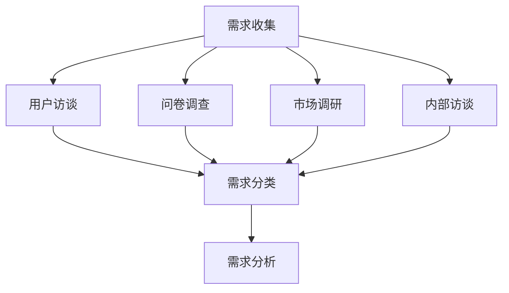
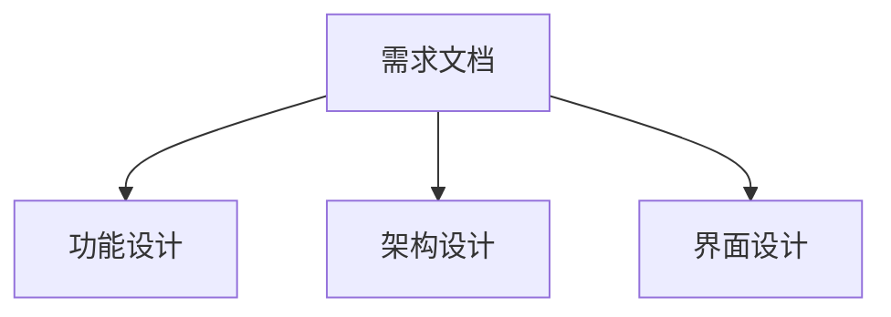
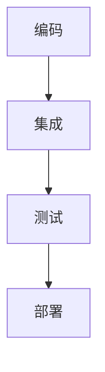
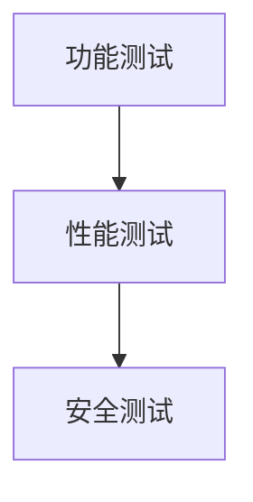
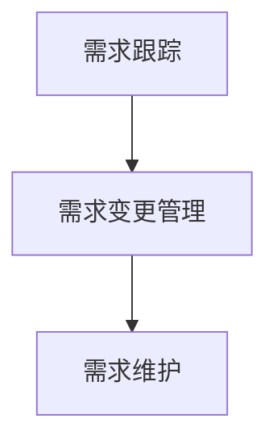
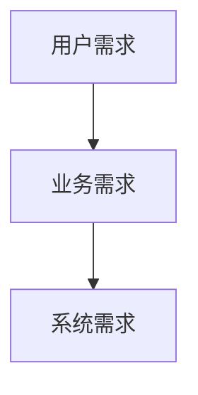
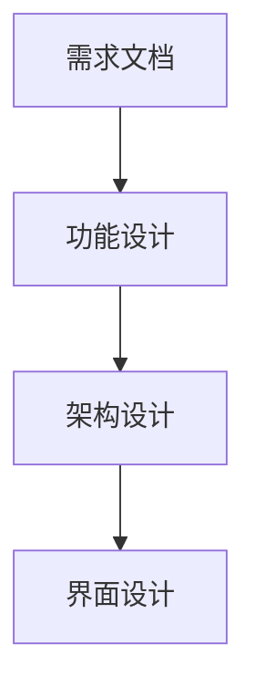
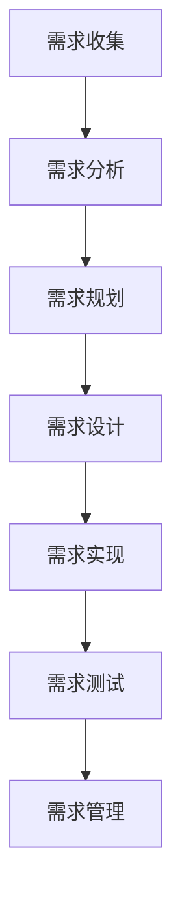

                 

### 文章标题

《大模型应用中的需求生命周期管理》

### 文章关键词

- 大模型
- 需求生命周期管理
- 需求分析
- 需求规划
- 需求设计
- 需求实现
- 需求测试

### 文章摘要

本文将深入探讨大模型在需求生命周期管理中的应用。首先，我们将介绍大模型的概念、特点及其发展历程，并阐述需求生命周期管理的概念、流程和重要性。接着，我们将详细讨论大模型在需求分析、规划、设计、实现和测试中的应用，并通过实际案例展示每个阶段的操作流程。此外，本文还将分析需求管理的原则与方法，以及如何在大模型应用中优化需求生命周期管理。最后，我们将展望需求生命周期管理的未来发展趋势、挑战及研究方向。通过本文的阅读，读者将能够全面了解大模型在需求生命周期管理中的应用，为实践提供有力指导。

### 引言

随着人工智能技术的快速发展，大模型（Large Models）逐渐成为推动各行业进步的重要力量。大模型，通常指的是拥有巨大参数量和计算量的深度学习模型，如Transformer、BERT等。这些模型在自然语言处理、计算机视觉、语音识别等领域取得了显著的突破。然而，大模型的应用不仅依赖于强大的计算能力，还需要科学的需求生命周期管理。

需求生命周期管理（Requirement Lifecycle Management，RLM）是一种系统性的方法，用于确保项目的需求得到有效管理和满足。它包括需求收集、需求分析、需求规划、需求设计、需求实现、需求测试和需求管理等多个阶段。在大模型应用中，需求生命周期管理起着至关重要的作用，因为它不仅关系到项目的成功与否，还直接影响到模型的效果和效率。

本文将围绕大模型应用中的需求生命周期管理展开讨论，旨在为读者提供一套完整的理论框架和实践指南。首先，我们将介绍大模型的基本概念、特点及其发展历程。随后，我们将详细阐述需求生命周期管理的概念、流程和重要性。接下来，我们将探讨大模型在需求分析、规划、设计、实现和测试中的应用，并通过实际案例进行说明。此外，本文还将分析需求管理的原则与方法，以及如何在大模型应用中优化需求生命周期管理。最后，我们将展望需求生命周期管理的未来发展趋势、挑战及研究方向。

本文的结构如下：

1. **大模型应用概述**：介绍大模型的基本概念、特点及其发展历程。
2. **需求生命周期管理概述**：阐述需求生命周期管理的概念、流程和重要性。
3. **大模型应用中的需求分析**：讨论大模型在需求分析中的应用，包括方法与技术、案例分析。
4. **大模型应用中的需求规划**：探讨大模型在需求规划中的应用，包括方法与工具、案例分析。
5. **大模型应用中的需求设计**：深入探讨大模型在需求设计中的应用，包括方法与步骤、案例分析。
6. **大模型应用中的需求实现**：讲解大模型在需求实现中的应用，包括过程与技术、案例分析。
7. **大模型应用中的需求测试**：介绍大模型在需求测试中的应用，包括方法与策略、案例分析。
8. **大模型应用中的需求管理**：分析需求管理的原则与方法，以及大模型在需求管理中的应用。
9. **大模型应用中的需求生命周期管理实战**：通过实战案例展示大模型在需求生命周期管理中的应用。
10. **大模型应用中的需求生命周期管理优化**：讨论如何优化需求生命周期管理。
11. **未来展望与挑战**：展望需求生命周期管理的未来发展趋势、挑战及研究方向。
12. **附录**：提供大模型应用中的需求生命周期管理工具与技术，以及参考文献。

通过本文的阅读，读者将能够全面了解大模型在需求生命周期管理中的应用，从而更好地应对实际项目中的挑战，提升项目成功率和效率。

### 第一部分：大模型应用概述

#### 第1章：大模型概述

#### 1.1 大模型的概念与特点

大模型，即大规模深度学习模型，是指那些具有数百万甚至数十亿参数的神经网络模型。这些模型通过学习大量数据，能够自动提取复杂的数据特征，并在各种任务中表现出色。大模型的出现标志着人工智能领域的一个重大突破，使得计算机在某些任务上能够实现与人类相当或超越的性能。

**大模型的特点**主要包括：

1. **参数量巨大**：大模型通常拥有数百万到数十亿的参数，这使得它们能够学习更复杂的模式和数据特征。
2. **强大的学习能力**：由于参数量的增加，大模型能够处理更大规模的数据集，从而提高学习效率和准确性。
3. **多任务处理能力**：大模型可以同时处理多个任务，无需为每个任务训练一个独立的模型。
4. **自适应能力**：大模型能够根据不同的任务和数据自适应调整其参数，从而实现更高效的学习和预测。
5. **计算资源需求高**：大模型通常需要大量的计算资源和时间来训练和推理，这给实际应用带来了挑战。

#### 1.2 大模型的发展历程

大模型的发展历程可以追溯到20世纪80年代的神经网络研究。最初，神经网络由于计算能力和数据量的限制，只能解决一些简单的任务。随着计算机性能的提升和海量数据的出现，神经网络的研究逐渐得到重视。

**关键里程碑**包括：

- **1986年**：鲁姆哈特和赫布提出了反向传播算法，使得神经网络能够通过多层结构进行学习。
- **1998年**：Hinton等提出了深度信念网络（DBN），这是早期的一种深度学习模型。
- **2012年**：Hinton团队提出了AlexNet，这是第一个在ImageNet图像识别比赛中取得显著突破的深度学习模型。
- **2018年**：Transformer模型的出现，使得自然语言处理领域取得了重大突破。
- **2020年**：GPT-3模型的发布，展示了大模型在自然语言处理领域的强大能力。

#### 1.3 大模型在行业中的应用

大模型已经在多个行业中得到了广泛应用，并取得了显著的成效。以下是一些主要的应用领域：

1. **自然语言处理**：大模型在文本生成、机器翻译、情感分析等领域表现出色，如GPT系列模型和BERT模型。
2. **计算机视觉**：大模型在图像分类、目标检测、图像生成等领域具有强大的能力，如ResNet和GAN模型。
3. **语音识别**：大模型在语音识别、语音合成等领域取得了显著进展，如WaveNet和Tacotron模型。
4. **推荐系统**：大模型能够通过分析用户行为和偏好，提供个性化的推荐服务，如DeepFM和PNN模型。
5. **医疗诊断**：大模型在医疗图像分析、疾病预测等领域具有潜在的应用价值，如CNN和RNN模型。

#### 1.4 核心概念与联系

为了更好地理解大模型的应用，我们需要了解一些核心概念和它们之间的联系。

1. **深度学习**：深度学习是一种基于神经网络的学习方法，它通过多层的非线性变换来提取数据特征。
2. **神经网络**：神经网络是由多个神经元组成的计算模型，每个神经元都通过权重连接到其他神经元。
3. **多层感知机**：多层感知机是一种前馈神经网络，它通过多个隐藏层来提取数据特征。
4. **深度信念网络**：深度信念网络是一种基于概率图模型的深度学习模型，它通过交替优化隐藏层参数和可见层参数。
5. **生成对抗网络**：生成对抗网络是一种由生成器和判别器组成的深度学习模型，它通过对抗训练来生成新的数据。

#### 1.5 核心算法原理讲解

以下是一些核心算法的原理讲解，以及它们的伪代码表示：

1. **反向传播算法**：
   $$\def\errore{\mathit{error}}\def\sy{\mathit{sy}}\def\wx{\mathit{wx}}\def\wy{\mathit{wy}}\def\wh{\mathit{wh}}\def\bx{\mathit{bx}}\def\by{\mathit{by}}$$
   $$\errore = \frac{1}{2} (\sy - \by)^2$$
   $$\delta_h = \frac{\partial \errore}{\partial \wh} = (\sy - \by) \by'$$
   $$\delta_x = \frac{\partial \errore}{\partial \wx} = (\wh - \wx) \wx'$$
   $$\wh_{new} = \wh - \alpha \delta_h \bx$$
   $$\wx_{new} = \wx - \alpha \delta_x \by$$

2. **卷积神经网络**：
   $$\def\phi{\mathit{phi}}\def\f{\mathit{f}}\def\s{\mathit{s}}\def\o{\mathit{o}}$$
   $$\o = \f(\phi \star s)$$
   $$\phi_{new} = \phi - \alpha \delta \phi$$
   $$s_{new} = s - \alpha \delta s$$

3. **生成对抗网络**：
   $$\def\G{\mathcal{G}}\def\D{\mathcal{D}}\def\z{\mathbf{z}}\def\x{\mathbf{x}}\def\g{\mathit{g}}\def\d{\mathit{d}}$$
   $$\x = \G(\z)$$
   $$\d_{G} = -\log(D(\x))$$
   $$\d_{D} = -\log(1 - D(\x))$$
   $$\g_{new} = \g - \alpha \delta_G \z$$
   $$\d_{new} = \d - \alpha \delta_D \x$$

通过以上讲解，我们可以看到大模型的核心算法原理，包括反向传播算法、卷积神经网络和生成对抗网络等。这些算法在大模型的应用中发挥着关键作用。

#### 1.6 大模型应用案例

为了更好地展示大模型的应用，我们来看一个实际案例：自然语言处理中的文本生成。

**案例背景**：假设我们想要生成一篇关于人工智能技术的文章。我们可以使用大模型，如GPT-3，来生成这篇文章。

**步骤一：数据准备**：我们需要准备大量关于人工智能技术的文本数据，用于训练GPT-3模型。

**步骤二：模型训练**：使用训练数据训练GPT-3模型，使其学会生成关于人工智能技术的文本。

**步骤三：文本生成**：输入一个简单的提示，如“人工智能技术”，然后让GPT-3生成一篇完整的文章。

**步骤四：文章润色**：对生成的文章进行润色，确保其内容连贯、准确。

通过这个案例，我们可以看到大模型在文本生成中的应用。GPT-3模型通过学习大量文本数据，能够生成高质量的文章，这极大地提高了文本生成的效率和质量。

总之，大模型在各个行业中具有广泛的应用前景，通过科学的需求生命周期管理，我们可以更好地发挥大模型的优势，实现更高的效率和创新。

### 第一部分：大模型应用概述

#### 第2章：需求生命周期管理概述

#### 2.1 需求生命周期管理的概念

需求生命周期管理（Requirement Lifecycle Management，简称RLM）是一种系统性的方法，用于确保项目需求从提出到实现的全过程得到有效管理和满足。它涵盖了从需求收集、需求分析、需求规划、需求设计、需求实现、需求测试到需求管理的各个阶段，旨在确保项目的需求得到及时、准确地满足。

**需求生命周期管理的核心概念**包括：

- **需求**：需求是项目或产品所需的功能、性能或约束条件，通常由用户或利益相关者提出。
- **需求收集**：需求收集是识别和收集项目需求的过程，包括用户访谈、问卷调查、市场调研等。
- **需求分析**：需求分析是对收集到的需求进行整理、分类和分析，以确定项目的详细需求和优先级。
- **需求规划**：需求规划是根据需求分析的结果，制定项目计划和时间表，以确保需求的实现。
- **需求设计**：需求设计是将需求转化为具体的技术解决方案，包括架构设计、界面设计等。
- **需求实现**：需求实现是将设计转化为实际的产品或系统，包括编码、测试和部署。
- **需求测试**：需求测试是验证需求是否得到满足的过程，包括功能测试、性能测试等。
- **需求管理**：需求管理是确保需求在整个项目生命周期中得到持续跟踪和管理，包括变更控制、需求维护等。

#### 2.2 需求生命周期管理的流程

需求生命周期管理的流程通常包括以下几个主要阶段：

1. **需求收集**：在项目启动阶段，通过多种渠道收集用户和利益相关者的需求，如用户访谈、问卷调查、市场调研等。
2. **需求分析**：对收集到的需求进行整理、分类和分析，确定项目的详细需求和优先级，形成需求文档。
3. **需求规划**：根据需求分析的结果，制定项目计划和时间表，分配资源，确定里程碑和验收标准。
4. **需求设计**：将需求转化为具体的技术解决方案，包括架构设计、界面设计等，形成设计方案。
5. **需求实现**：根据设计方案进行编码、测试和部署，实现具体的功能和性能。
6. **需求测试**：对实现的功能进行测试，验证是否满足需求，包括功能测试、性能测试、兼容性测试等。
7. **需求管理**：在整个项目生命周期中，持续跟踪和管理需求，包括变更控制、需求维护等。

#### 2.3 需求生命周期管理的重要性

需求生命周期管理在项目成功中起着至关重要的作用，主要体现在以下几个方面：

1. **确保需求满足**：通过系统化的需求生命周期管理，确保项目的需求得到及时、准确地满足，避免因需求误解或遗漏导致项目失败。
2. **提高项目效率**：通过科学的需求规划和项目管理，提高项目执行效率，缩短项目周期，降低项目成本。
3. **降低风险**：通过需求分析和测试，提前识别和解决潜在问题，降低项目风险。
4. **提升产品质量**：通过严格的需求管理和测试，确保产品的功能和性能满足用户需求，提升产品质量。
5. **增强用户体验**：通过充分的需求收集和分析，确保产品设计和功能符合用户期望，提高用户体验。

#### 2.4 核心概念与联系

为了更好地理解需求生命周期管理，我们需要了解一些核心概念和它们之间的联系。

1. **需求与项目**：需求是项目的核心，项目成功的关键在于需求的准确实现。
2. **需求分析与管理**：需求分析是确定项目需求的过程，需求管理是确保需求在整个项目生命周期中得到持续跟踪和管理的手段。
3. **规划与执行**：需求规划是制定项目计划和时间表的过程，需求执行是将需求转化为实际产品的过程。
4. **测试与验收**：需求测试是验证需求是否得到满足的过程，需求验收是确认产品是否符合需求的过程。
5. **变更控制**：变更控制是管理需求变更的过程，确保变更对项目的影响得到有效控制。

#### 2.5 核心算法原理讲解

需求生命周期管理中涉及的核心算法原理主要包括：

1. **需求分析方法**：常用的需求分析方法有用户访谈、问卷调查、观察法、头脑风暴等。每种方法都有其特定的算法原理和流程。
2. **需求管理工具**：需求管理工具如JIRA、Confluence等，其核心算法原理包括需求收集、需求分析、需求规划和需求管理等功能。
3. **测试策略**：常用的测试策略有功能测试、性能测试、兼容性测试等。每种测试策略都有其特定的算法原理和执行流程。

以下是一个简单的需求分析方法算法的伪代码示例：

```plaintext
Algorithm 需求分析(用户需求)
Input: 用户需求
Output: 需求文档

1. 初始化需求文档为空
2. 对于每个用户需求
3.   将需求分解为子需求
4.   对每个子需求
5.     进行需求分析，包括功能分析、性能分析、约束分析等
6.     将分析结果添加到需求文档中
7.   将所有子需求合并为完整的需求文档
8. 返回需求文档
```

通过以上讲解，我们可以看到需求生命周期管理的基本概念、流程及其重要性，以及与项目成功的关系。接下来，我们将进一步探讨大模型在需求生命周期管理中的应用，展示其在实际项目中的操作流程。

### 第一部分：大模型应用概述

#### 第3章：大模型应用中的需求分析

#### 3.1 需求分析的方法与技术

需求分析是需求生命周期管理的重要阶段，它关系到项目能否准确理解并满足用户的需求。在大模型应用中，需求分析的方法和技术得到了进一步的发展，利用大模型的强大学习能力，可以更高效地收集、整理和分析用户需求。

**需求分析的方法**主要包括：

1. **用户访谈**：通过与用户进行面对面的交流，了解他们的需求和期望。
2. **问卷调查**：通过设计问卷，收集大量用户的需求信息。
3. **观察法**：通过观察用户在使用产品或系统的过程中的行为和反应，获取真实的需求。
4. **头脑风暴**：通过团队讨论，激发创意和灵感，产生新的需求。
5. **文档分析**：通过分析现有的文档，如用户手册、需求文档等，获取需求信息。

**需求分析的技术**主要包括：

1. **需求建模**：使用UML（统一建模语言）等工具，将需求转化为图形化的模型，便于理解和沟通。
2. **需求追踪**：通过需求追踪工具，如JIRA、Confluence等，跟踪需求的状态和变更。
3. **需求验证**：通过需求验证工具，如Checkmarx、SonarQube等，验证需求的完整性和准确性。
4. **需求管理**：使用需求管理工具，如JIRA、Confluence等，进行需求收集、整理、分析和追踪。

#### 3.2 大模型在需求分析中的应用

大模型在需求分析中具有独特的优势，主要体现在以下几个方面：

1. **自动化的需求收集**：大模型能够自动分析大量文本数据，识别出潜在的需求信息，提高需求收集的效率。
2. **语义理解**：大模型具有强大的语义理解能力，能够理解用户的需求背后的意图和含义，从而更准确地满足需求。
3. **跨领域需求分析**：大模型可以跨领域进行需求分析，不需要对每个领域进行专门训练，从而提高需求的泛化能力。

**应用实例**：

1. **文本分析**：使用GPT-3等大模型对用户提交的文本进行自动分析，提取出关键的需求信息，如功能需求、性能需求等。
2. **语音识别**：利用大模型进行语音识别，将用户的口头需求转化为文本，然后进行进一步的需求分析。
3. **图像识别**：通过大模型对用户提供的图像进行识别，提取出图像中的需求信息，如产品特征、使用场景等。

#### 3.3 需求分析的案例分析

为了更好地理解大模型在需求分析中的应用，我们来看一个实际案例：智能家居系统的需求分析。

**案例背景**：某智能家居公司想要开发一款智能音箱，用于控制家庭设备。他们希望通过大模型进行需求分析，以确保产品能够满足用户的需求。

**步骤一：需求收集**：

1. 用户访谈：与潜在用户进行面对面交流，了解他们对智能音箱的需求和期望。
2. 问卷调查：设计问卷，收集用户对智能音箱的功能、性能、交互方式等方面的需求。
3. 观察法：观察用户在使用现有智能家居设备时的行为和反应，获取需求信息。

**步骤二：需求分析**：

1. 文本分析：使用GPT-3等大模型对用户提交的文本进行自动分析，提取出关键的需求信息。
2. 需求建模：使用UML工具将需求转化为图形化的模型，便于理解和沟通。
3. 需求追踪：使用JIRA等需求管理工具，跟踪需求的状态和变更。

**步骤三：需求规划**：

1. 根据需求分析的结果，制定项目计划和时间表，分配资源，确定里程碑和验收标准。
2. 将需求转化为具体的技术解决方案，包括架构设计、界面设计等。

**步骤四：需求实现**：

1. 根据设计方案进行编码、测试和部署，实现具体的功能和性能。
2. 对实现的功能进行测试，验证是否满足需求。

**步骤五：需求管理**：

1. 在整个项目生命周期中，持续跟踪和管理需求，包括变更控制、需求维护等。
2. 使用需求管理工具，如JIRA、Confluence等，进行需求收集、整理、分析和追踪。

通过以上步骤，我们可以看到大模型在智能家居系统需求分析中的应用，从而确保产品能够满足用户的需求。

#### 3.4 核心概念与联系

为了更好地理解大模型在需求分析中的应用，我们需要了解以下核心概念和它们之间的联系：

1. **需求与数据**：需求来源于用户和利益相关者，数据是需求分析的基础。
2. **大模型与语义理解**：大模型具有强大的语义理解能力，能够理解用户需求的含义。
3. **需求分析与项目**：需求分析是项目成功的关键，需求分析的结果直接影响项目的规划和实现。
4. **需求管理与变更**：需求管理是确保需求得到有效跟踪和管理的过程，变更控制是需求管理的重要部分。

#### 3.5 核心算法原理讲解

在需求分析中，大模型的应用主要涉及以下核心算法原理：

1. **文本分析**：
   - **模型选择**：使用GPT-3、BERT等预训练模型。
   - **算法原理**：通过自然语言处理技术，对文本进行语义分析和结构化处理，提取关键信息。
   - **伪代码示例**：
     ```python
     def analyze_text(text):
         # 使用预训练模型进行文本分析
         result = model.analyze(text)
         # 提取关键信息
         key_info = extract_key_info(result)
         return key_info
     ```

2. **语音识别**：
   - **模型选择**：使用WaveNet、Transformer等模型。
   - **算法原理**：通过语音信号处理和自然语言处理技术，将语音转化为文本。
   - **伪代码示例**：
     ```python
     def recognize_speech(audio):
         # 使用预训练模型进行语音识别
         text = model.recognize(audio)
         return text
     ```

3. **图像识别**：
   - **模型选择**：使用CNN（卷积神经网络）等模型。
   - **算法原理**：通过图像特征提取和分类技术，识别图像中的对象和场景。
   - **伪代码示例**：
     ```python
     def recognize_image(image):
         # 使用预训练模型进行图像识别
         label = model.predict(image)
         return label
     ```

通过以上算法原理的讲解，我们可以看到大模型在需求分析中的应用，如何通过文本分析、语音识别和图像识别等技术，提高需求分析的效率和准确性。

### 第一部分：大模型应用概述

#### 第4章：大模型应用中的需求规划

#### 4.1 需求规划的方法与工具

需求规划是需求生命周期管理的关键阶段，它涉及到对需求进行优先级排序、资源分配、风险评估等，以确保项目能够按时、按预算和满足质量要求地完成。在大模型应用中，需求规划的方法和工具得到了进一步的发展，利用大模型的强大计算能力和预测能力，可以更加高效地制定项目计划。

**需求规划的方法**主要包括：

1. **需求优先级排序**：根据需求的紧急程度、重要性和可行性，对需求进行排序，以确保关键需求得到优先处理。
2. **资源分配**：根据项目需求和资源情况，合理分配人力资源、技术资源和资金资源，以最大化项目效益。
3. **风险评估**：识别和分析项目潜在的风险，制定相应的应对策略，以降低风险对项目的影响。
4. **项目计划**：制定详细的项目计划和时间表，包括里程碑、任务、责任人和时间安排等。

**需求规划的工具**主要包括：

1. **项目管理软件**：如JIRA、Trello、Microsoft Project等，用于任务管理、资源分配和进度跟踪。
2. **需求管理工具**：如JIRA、Confluence等，用于需求收集、整理、分析和追踪。
3. **预测工具**：如AI预测模型、风险评估工具等，用于预测项目进度和风险。
4. **协作工具**：如Slack、Zoom等，用于团队沟通和协作。

#### 4.2 大模型在需求规划中的应用

大模型在需求规划中的应用主要体现在以下几个方面：

1. **需求预测**：通过大模型的预测能力，对未来需求进行预测，帮助项目团队更好地制定项目计划。
2. **资源优化**：通过分析历史数据和当前需求，大模型可以帮助项目团队优化资源分配，提高资源利用率。
3. **风险评估**：大模型可以识别和分析项目中的潜在风险，并提供相应的风险应对策略。
4. **决策支持**：大模型可以为项目团队提供基于数据的决策支持，帮助项目团队做出更明智的决策。

**应用实例**：

1. **需求预测**：使用GPT-3等大模型，分析用户历史行为和需求趋势，预测未来可能出现的需求，从而制定更科学的项目计划。
2. **资源优化**：利用大模型的计算能力，分析项目的资源需求和供应情况，优化资源分配，提高项目效率。
3. **风险评估**：使用大模型对项目中的潜在风险进行分析和预测，制定相应的风险应对策略，降低项目风险。
4. **决策支持**：在项目决策过程中，大模型可以提供基于数据的分析和建议，帮助项目团队做出更明智的决策。

#### 4.3 需求规划的案例分析

为了更好地展示大模型在需求规划中的应用，我们来看一个实际案例：智能交通系统的需求规划。

**案例背景**：某城市想要建设一个智能交通系统，以提高交通效率和安全性。他们希望通过大模型进行需求规划，确保系统能够满足城市交通的需求。

**步骤一：需求收集**：

1. 用户访谈：与交通部门、市民代表等进行面对面的交流，了解他们对智能交通系统的需求和期望。
2. 问卷调查：设计问卷，收集市民对交通拥堵、停车难、出行安全等方面的需求。
3. 观察法：观察城市交通现状，了解交通拥堵、事故发生等数据，获取需求信息。

**步骤二：需求分析**：

1. 文本分析：使用GPT-3等大模型对用户提交的文本进行自动分析，提取出关键的需求信息。
2. 数据分析：利用大数据技术，分析城市交通数据，识别出潜在的需求和问题。
3. 需求建模：使用UML工具将需求转化为图形化的模型，便于理解和沟通。

**步骤三：需求规划**：

1. 需求优先级排序：根据需求的紧急程度、重要性和可行性，对需求进行排序，确定关键需求。
2. 资源分配：根据项目需求和资源情况，合理分配人力资源、技术资源和资金资源。
3. 项目计划：制定详细的项目计划和时间表，包括里程碑、任务、责任人和时间安排等。

**步骤四：需求实现**：

1. 根据需求规划的结果，进行系统设计和开发，实现具体的功能和性能。
2. 对实现的功能进行测试，验证是否满足需求。

**步骤五：需求管理**：

1. 在整个项目生命周期中，持续跟踪和管理需求，包括变更控制、需求维护等。
2. 使用需求管理工具，如JIRA、Confluence等，进行需求收集、整理、分析和追踪。

通过以上步骤，我们可以看到大模型在智能交通系统需求规划中的应用，从而确保系统能够满足城市交通的需求。

#### 4.4 核心概念与联系

为了更好地理解大模型在需求规划中的应用，我们需要了解以下核心概念和它们之间的联系：

1. **需求与规划**：需求是项目规划的基础，需求规划是对需求进行优先级排序、资源分配和风险评估的过程。
2. **大模型与预测**：大模型具有强大的预测能力，可以用于预测未来需求、优化资源分配和评估风险。
3. **项目计划与执行**：项目计划是制定项目目标和任务的时间表，执行是将计划转化为实际产品或系统的过程。
4. **需求管理与变更**：需求管理是确保需求得到有效跟踪和管理的过程，变更管理是需求管理的重要部分。

#### 4.5 核心算法原理讲解

在需求规划中，大模型的应用主要涉及以下核心算法原理：

1. **需求预测**：
   - **模型选择**：使用时间序列预测模型、回归模型等。
   - **算法原理**：通过分析历史数据和当前需求，利用机器学习算法预测未来需求。
   - **伪代码示例**：
     ```python
     def predict_demand(data):
         # 使用时间序列预测模型进行需求预测
         model = TimeSeriesModel()
         model.fit(data)
         prediction = model.predict()
         return prediction
     ```

2. **资源优化**：
   - **模型选择**：使用线性规划、遗传算法等模型。
   - **算法原理**：通过优化算法，在满足需求的前提下，优化资源分配。
   - **伪代码示例**：
     ```python
     def optimize_resources(需求, 资源限制):
         # 使用线性规划进行资源优化
         model = LinearProgrammingModel()
         model.set_objective("最大化资源利用率")
         model.add_constraints(需求 <= 资源限制)
         solution = model.solve()
         return solution
     ```

3. **风险评估**：
   - **模型选择**：使用贝叶斯网络、随机森林等模型。
   - **算法原理**：通过分析历史数据和当前需求，预测项目中的潜在风险。
   - **伪代码示例**：
     ```python
     def assess_risk(data):
         # 使用贝叶斯网络进行风险评估
         model = BayesianNetworkModel()
         model.fit(data)
         risk_prediction = model.predict()
         return risk_prediction
     ```

通过以上算法原理的讲解，我们可以看到大模型在需求规划中的应用，如何通过需求预测、资源优化和风险评估等算法，提高需求规划的科学性和准确性。

### 第一部分：大模型应用概述

#### 第5章：大模型应用中的需求设计

#### 5.1 需求设计的方法与步骤

需求设计是将需求转化为具体的技术解决方案的过程，它是需求生命周期管理中的关键阶段。在大模型应用中，需求设计的方法和步骤得到了进一步的发展，利用大模型的强大计算能力和创造性，可以更加高效地实现需求。

**需求设计的方法**主要包括：

1. **功能设计**：根据需求文档，设计系统或产品的功能模块和接口。
2. **界面设计**：设计用户界面，包括布局、样式和交互逻辑。
3. **架构设计**：设计系统的整体架构，包括组件、模块和数据流。
4. **安全性设计**：确保系统或产品的安全性，包括数据保护、访问控制和安全策略。
5. **性能设计**：设计系统的性能指标，包括响应时间、吞吐量和资源利用率。

**需求设计的步骤**主要包括：

1. **需求确认**：与用户和利益相关者确认需求，确保需求明确和可理解。
2. **功能设计**：根据确认的需求，设计系统的功能模块和接口。
3. **界面设计**：设计用户界面，确保用户体验良好。
4. **架构设计**：设计系统的整体架构，确保系统的稳定性和可扩展性。
5. **安全性设计**：确保系统或产品的安全性，防范潜在的安全威胁。
6. **性能设计**：设计系统的性能指标，确保系统能够高效运行。

#### 5.2 大模型在需求设计中的应用

大模型在需求设计中的应用主要体现在以下几个方面：

1. **自动化的需求确认**：大模型可以自动分析用户需求，确保需求明确和可理解，减少需求确认的时间和成本。
2. **创新的界面设计**：大模型可以生成创新的界面设计方案，提供更多样化的用户体验。
3. **智能化的架构设计**：大模型可以根据需求自动生成系统的架构设计，提高设计的效率和准确性。
4. **安全性的优化**：大模型可以分析系统的安全性，发现潜在的安全漏洞，并提供相应的优化方案。
5. **性能的优化**：大模型可以分析系统的性能，提供性能优化的建议，提高系统的效率。

**应用实例**：

1. **自动化的需求确认**：使用GPT-3等大模型，自动分析用户需求文档，提取关键需求，并与用户进行确认。
2. **创新的界面设计**：使用GPT-3等大模型，根据用户需求和设计趋势，生成创新的界面设计方案。
3. **智能化的架构设计**：使用GPT-3等大模型，根据需求自动生成系统的架构设计，提高设计的效率和准确性。
4. **安全性的优化**：使用GPT-3等大模型，分析系统的安全性，发现潜在的安全漏洞，并提供相应的优化方案。
5. **性能的优化**：使用GPT-3等大模型，分析系统的性能，提供性能优化的建议，提高系统的效率。

#### 5.3 需求设计的案例分析

为了更好地展示大模型在需求设计中的应用，我们来看一个实际案例：智能医疗系统的需求设计。

**案例背景**：某医疗科技公司想要开发一款智能医疗系统，用于辅助医生进行诊断和治疗。他们希望通过大模型进行需求设计，确保系统能够满足医疗行业的专业需求。

**步骤一：需求收集**：

1. 用户访谈：与医生、护士等医疗专业人士进行面对面的交流，了解他们对智能医疗系统的需求和期望。
2. 问卷调查：设计问卷，收集医生对诊断、治疗、患者管理等方面的需求。
3. 观察法：观察医生在医疗过程中的行为和反应，获取需求信息。

**步骤二：需求分析**：

1. 文本分析：使用GPT-3等大模型对用户提交的文本进行自动分析，提取出关键的需求信息。
2. 数据分析：利用大数据技术，分析医疗数据，识别出潜在的需求和问题。
3. 需求建模：使用UML工具将需求转化为图形化的模型，便于理解和沟通。

**步骤三：需求设计**：

1. 功能设计：根据需求分析的结果，设计系统的功能模块和接口。
2. 界面设计：设计用户界面，确保用户体验良好。
3. 架构设计：设计系统的整体架构，确保系统的稳定性和可扩展性。
4. 安全性设计：确保系统的安全性，防范潜在的安全威胁。
5. 性能设计：设计系统的性能指标，确保系统能够高效运行。

**步骤四：需求实现**：

1. 根据需求设计的结果，进行系统设计和开发，实现具体的功能和性能。
2. 对实现的功能进行测试，验证是否满足需求。

**步骤五：需求管理**：

1. 在整个项目生命周期中，持续跟踪和管理需求，包括变更控制、需求维护等。
2. 使用需求管理工具，如JIRA、Confluence等，进行需求收集、整理、分析和追踪。

通过以上步骤，我们可以看到大模型在智能医疗系统需求设计中的应用，从而确保系统能够满足医疗行业的专业需求。

#### 5.4 核心概念与联系

为了更好地理解大模型在需求设计中的应用，我们需要了解以下核心概念和它们之间的联系：

1. **需求与设计**：需求是项目设计的基础，需求设计是将需求转化为具体的技术解决方案的过程。
2. **大模型与自动化**：大模型可以自动分析需求，生成设计方案，提高设计的效率和准确性。
3. **界面设计与用户体验**：界面设计直接影响用户体验，大模型可以生成创新的界面设计方案，提升用户体验。
4. **架构设计与系统稳定性**：架构设计是系统稳定性和可扩展性的基础，大模型可以帮助设计出更优的系统架构。
5. **安全性设计与风险防范**：安全性设计是系统安全性的保障，大模型可以分析系统的安全性，发现潜在的安全漏洞。

#### 5.5 核心算法原理讲解

在需求设计中，大模型的应用主要涉及以下核心算法原理：

1. **文本生成**：
   - **模型选择**：使用GPT-3、BERT等预训练模型。
   - **算法原理**：通过自然语言处理技术，生成文本，如用户需求文档、设计方案等。
   - **伪代码示例**：
     ```python
     def generate_text(prompt):
         # 使用预训练模型生成文本
         text = model.generate(prompt)
         return text
     ```

2. **图像生成**：
   - **模型选择**：使用GAN（生成对抗网络）等模型。
   - **算法原理**：通过生成器和判别器的对抗训练，生成图像，如界面设计方案、系统架构图等。
   - **伪代码示例**：
     ```python
     def generate_image():
         # 使用生成对抗网络生成图像
         image = generator.generate()
         return image
     ```

3. **架构设计**：
   - **模型选择**：使用基于强化学习的算法。
   - **算法原理**：通过学习用户需求和系统性能，自动生成系统的架构设计。
   - **伪代码示例**：
     ```python
     def design_architecture的需求, 性能要求):
         # 使用强化学习算法设计系统架构
         architecture = algorithm.learn(需求, 性能要求)
         return architecture
     ```

通过以上算法原理的讲解，我们可以看到大模型在需求设计中的应用，如何通过文本生成、图像生成和架构设计等技术，提高需求设计的效率和准确性。

### 第一部分：大模型应用概述

#### 第6章：大模型应用中的需求实现

#### 6.1 需求实现的过程与技术

需求实现是将需求设计转化为实际产品或系统的过程，它是需求生命周期管理中的关键环节。在大模型应用中，需求实现的过程和技术得到了进一步的发展，利用大模型的强大计算能力和自动化能力，可以更加高效地实现需求。

**需求实现的过程**主要包括：

1. **编码**：根据需求设计，编写系统或产品的代码，实现具体的函数和模块。
2. **集成**：将各个模块的代码集成起来，形成一个完整的系统。
3. **测试**：对实现的系统进行功能测试、性能测试和兼容性测试，确保系统符合需求。
4. **部署**：将系统部署到生产环境，进行实际运行和监控。
5. **维护**：对系统进行定期维护和更新，确保系统的稳定性和安全性。

**需求实现的技术**主要包括：

1. **编程语言**：如Python、Java、C++等，用于编写系统或产品的代码。
2. **集成开发环境**：如Visual Studio、Eclipse等，用于代码编写、调试和测试。
3. **自动化测试工具**：如Selenium、JUnit等，用于自动执行测试用例，提高测试效率。
4. **持续集成工具**：如Jenkins、Travis CI等，用于自动化构建、测试和部署。
5. **云平台**：如AWS、Azure、Google Cloud等，用于部署和运行系统。

#### 6.2 大模型在需求实现中的应用

大模型在需求实现中的应用主要体现在以下几个方面：

1. **自动化的代码生成**：大模型可以自动生成代码，提高编码效率，减少人力成本。
2. **智能化的调试**：大模型可以分析代码，提供智能化的调试建议，提高调试效率。
3. **优化的测试**：大模型可以自动生成测试用例，提高测试覆盖率和测试效率。
4. **智能化的部署**：大模型可以分析系统性能，提供最优的部署策略，提高系统性能。
5. **动态的维护**：大模型可以持续监控系统运行状态，提供动态的维护建议，确保系统稳定性和安全性。

**应用实例**：

1. **自动化的代码生成**：使用GPT-3等大模型，根据需求文档自动生成代码，实现具体的功能和模块。
2. **智能化的调试**：使用GPT-3等大模型，分析代码和错误日志，提供智能化的调试建议，快速定位问题。
3. **优化的测试**：使用GPT-3等大模型，自动生成测试用例，提高测试覆盖率和测试效率，确保系统质量。
4. **智能化的部署**：使用GPT-3等大模型，分析系统性能，提供最优的部署策略，提高系统性能和稳定性。
5. **动态的维护**：使用GPT-3等大模型，持续监控系统运行状态，提供动态的维护建议，确保系统稳定性和安全性。

#### 6.3 需求实现的案例分析

为了更好地展示大模型在需求实现中的应用，我们来看一个实际案例：智能金融系统的需求实现。

**案例背景**：某金融科技公司想要开发一款智能金融系统，用于自动化金融分析和决策。他们希望通过大模型进行需求实现，确保系统能够高效、准确地处理金融数据。

**步骤一：需求收集**：

1. 用户访谈：与金融分析师、风控专家等进行面对面的交流，了解他们对智能金融系统的需求和期望。
2. 问卷调查：设计问卷，收集金融分析师对数据分析、决策支持、风险评估等方面的需求。
3. 观察法：观察金融分析师在金融数据分析过程中的行为和反应，获取需求信息。

**步骤二：需求分析**：

1. 文本分析：使用GPT-3等大模型对用户提交的文本进行自动分析，提取出关键的需求信息。
2. 数据分析：利用大数据技术，分析金融数据，识别出潜在的需求和问题。
3. 需求建模：使用UML工具将需求转化为图形化的模型，便于理解和沟通。

**步骤三：需求设计**：

1. 功能设计：根据需求分析的结果，设计系统的功能模块和接口。
2. 界面设计：设计用户界面，确保用户体验良好。
3. 架构设计：设计系统的整体架构，确保系统的稳定性和可扩展性。
4. 安全性设计：确保系统的安全性，防范潜在的安全威胁。
5. 性能设计：设计系统的性能指标，确保系统能够高效运行。

**步骤四：需求实现**：

1. 编码：根据需求设计，编写系统或产品的代码，实现具体的函数和模块。
2. 集成：将各个模块的代码集成起来，形成一个完整的系统。
3. 测试：对实现的系统进行功能测试、性能测试和兼容性测试，确保系统符合需求。
4. 部署：将系统部署到生产环境，进行实际运行和监控。
5. 维护：对系统进行定期维护和更新，确保系统的稳定性和安全性。

**步骤五：需求管理**：

1. 在整个项目生命周期中，持续跟踪和管理需求，包括变更控制、需求维护等。
2. 使用需求管理工具，如JIRA、Confluence等，进行需求收集、整理、分析和追踪。

通过以上步骤，我们可以看到大模型在智能金融系统需求实现中的应用，从而确保系统能够高效、准确地处理金融数据。

#### 6.4 核心概念与联系

为了更好地理解大模型在需求实现中的应用，我们需要了解以下核心概念和它们之间的联系：

1. **需求与实现**：需求是实现的基础，需求实现是将需求转化为实际产品或系统的过程。
2. **大模型与自动化**：大模型可以自动化代码生成、测试和部署等过程，提高需求实现的效率和质量。
3. **编程语言与工具**：编程语言和工具是实现的需求，大模型可以与这些工具结合，提高实现的效率和准确性。
4. **测试与质量**：测试是确保系统质量的重要手段，大模型可以自动生成测试用例，提高测试覆盖率和测试效率。
5. **部署与维护**：部署和维护是系统运行的关键，大模型可以提供最优的部署策略和动态的维护建议，确保系统稳定性和安全性。

#### 6.5 核心算法原理讲解

在需求实现中，大模型的应用主要涉及以下核心算法原理：

1. **自动化的代码生成**：
   - **模型选择**：使用GPT-3、BERT等预训练模型。
   - **算法原理**：通过自然语言处理技术，生成代码，如函数、模块等。
   - **伪代码示例**：
     ```python
     def generate_code(prompt):
         # 使用预训练模型生成代码
         code = model.generate(prompt)
         return code
     ```

2. **智能化的调试**：
   - **模型选择**：使用GPT-3、BERT等预训练模型。
   - **算法原理**：通过自然语言处理技术，分析代码和错误日志，提供调试建议。
   - **伪代码示例**：
     ```python
     def debug_code(code, error_log):
         # 使用预训练模型提供调试建议
         suggestion = model.analyze(code, error_log)
         return suggestion
     ```

3. **优化的测试**：
   - **模型选择**：使用GPT-3、BERT等预训练模型。
   - **算法原理**：通过自然语言处理技术，生成测试用例，提高测试覆盖率和测试效率。
   - **伪代码示例**：
     ```python
     def generate_test_cases(requirement):
         # 使用预训练模型生成测试用例
         test_cases = model.generate(requirement)
         return test_cases
     ```

4. **智能化的部署**：
   - **模型选择**：使用基于强化学习的算法。
   - **算法原理**：通过分析系统性能，提供最优的部署策略，提高系统性能。
   - **伪代码示例**：
     ```python
     def optimize_deployment(system_performance):
         # 使用强化学习算法优化部署策略
         strategy = algorithm.learn(system_performance)
         return strategy
     ```

5. **动态的维护**：
   - **模型选择**：使用基于强化学习的算法。
   - **算法原理**：通过持续监控系统运行状态，提供动态的维护建议，确保系统稳定性和安全性。
   - **伪代码示例**：
     ```python
     def dynamic_maintenance(system_status):
         # 使用强化学习算法提供动态维护建议
         suggestion = algorithm.learn(system_status)
         return suggestion
     ```

通过以上算法原理的讲解，我们可以看到大模型在需求实现中的应用，如何通过自动化的代码生成、智能化的调试、优化的测试、智能化的部署和动态的维护等技术，提高需求实现的效率和准确性。

### 第一部分：大模型应用概述

#### 第7章：大模型应用中的需求测试

#### 7.1 需求测试的方法与策略

需求测试是确保需求得到有效实现的重要环节，它涉及对系统或产品的功能、性能、安全性和用户体验进行全面测试。在大模型应用中，需求测试的方法和策略得到了进一步的发展，利用大模型的强大计算能力和自动化能力，可以更加高效地完成测试任务。

**需求测试的方法**主要包括：

1. **功能测试**：验证系统或产品是否按照需求文档实现了预期功能。
2. **性能测试**：评估系统或产品的响应时间、吞吐量和资源利用率等性能指标。
3. **兼容性测试**：确保系统或产品在不同操作系统、浏览器、硬件环境等下能够正常运行。
4. **安全测试**：评估系统或产品的安全性，确保数据保护、访问控制和安全策略的有效性。
5. **用户体验测试**：评估系统或产品的用户体验，确保用户界面友好、操作便捷。

**需求测试的策略**主要包括：

1. **测试计划**：根据项目需求和资源情况，制定详细的测试计划和测试用例。
2. **测试执行**：按照测试计划执行测试用例，记录测试结果。
3. **缺陷管理**：识别和记录系统或产品的缺陷，并进行跟踪和管理。
4. **测试报告**：编写测试报告，总结测试结果和缺陷，提供改进建议。

#### 7.2 大模型在需求测试中的应用

大模型在需求测试中的应用主要体现在以下几个方面：

1. **自动化的测试用例生成**：大模型可以自动生成测试用例，提高测试效率和覆盖率。
2. **智能化的缺陷定位**：大模型可以分析代码和测试结果，提供智能化的缺陷定位建议。
3. **优化的性能测试**：大模型可以分析系统性能，提供优化的测试策略，提高测试效率。
4. **个性化的用户体验测试**：大模型可以分析用户行为，提供个性化的用户体验测试建议。
5. **安全测试**：大模型可以分析系统漏洞，提供安全测试建议，确保系统安全性。

**应用实例**：

1. **自动化的测试用例生成**：使用GPT-3等大模型，根据需求文档自动生成功能测试用例，提高测试效率。
2. **智能化的缺陷定位**：使用GPT-3等大模型，分析代码和错误日志，提供智能化的缺陷定位建议，快速修复问题。
3. **优化的性能测试**：使用GPT-3等大模型，分析系统性能，提供优化的性能测试策略，提高测试效率。
4. **个性化的用户体验测试**：使用GPT-3等大模型，分析用户行为，提供个性化的用户体验测试建议，提升用户体验。
5. **安全测试**：使用GPT-3等大模型，分析系统漏洞，提供安全测试建议，确保系统安全性。

#### 7.3 需求测试的案例分析

为了更好地展示大模型在需求测试中的应用，我们来看一个实际案例：电子商务平台的需求测试。

**案例背景**：某电子商务平台在开发过程中，希望通过大模型进行需求测试，确保平台的功能、性能、安全性和用户体验得到有效验证。

**步骤一：需求收集**：

1. 用户访谈：与电商平台用户进行面对面的交流，了解他们对平台的需求和期望。
2. 问卷调查：设计问卷，收集用户对平台功能、性能、安全性和用户体验等方面的需求。
3. 观察法：观察用户在电商平台的使用行为，获取需求信息。

**步骤二：需求分析**：

1. 文本分析：使用GPT-3等大模型对用户提交的文本进行自动分析，提取出关键的需求信息。
2. 数据分析：利用大数据技术，分析用户行为和交易数据，识别出潜在的需求和问题。
3. 需求建模：使用UML工具将需求转化为图形化的模型，便于理解和沟通。

**步骤三：需求设计**：

1. 功能设计：根据需求分析的结果，设计平台的功能模块和接口。
2. 界面设计：设计用户界面，确保用户体验良好。
3. 架构设计：设计平台的整体架构，确保系统的稳定性和可扩展性。
4. 安全性设计：确保平台的安全性，防范潜在的安全威胁。
5. 性能设计：设计平台的性能指标，确保系统能够高效运行。

**步骤四：需求实现**：

1. 编码：根据需求设计，编写平台或产品的代码，实现具体的函数和模块。
2. 集成：将各个模块的代码集成起来，形成一个完整的平台。
3. 测试：对实现的平台进行功能测试、性能测试、兼容性测试和安全测试，确保平台符合需求。
4. 部署：将平台部署到生产环境，进行实际运行和监控。
5. 维护：对平台进行定期维护和更新，确保系统的稳定性和安全性。

**步骤五：需求测试**：

1. 自动化的测试用例生成：使用GPT-3等大模型，根据需求文档自动生成功能测试用例，提高测试效率。
2. 智能化的缺陷定位：使用GPT-3等大模型，分析代码和错误日志，提供智能化的缺陷定位建议，快速修复问题。
3. 优化的性能测试：使用GPT-3等大模型，分析系统性能，提供优化的性能测试策略，提高测试效率。
4. 个性化的用户体验测试：使用GPT-3等大模型，分析用户行为，提供个性化的用户体验测试建议，提升用户体验。
5. 安全测试：使用GPT-3等大模型，分析系统漏洞，提供安全测试建议，确保系统安全性。

**步骤六：需求管理**：

1. 在整个项目生命周期中，持续跟踪和管理需求，包括变更控制、需求维护等。
2. 使用需求管理工具，如JIRA、Confluence等，进行需求收集、整理、分析和追踪。

通过以上步骤，我们可以看到大模型在电子商务平台需求测试中的应用，从而确保平台的功能、性能、安全性和用户体验得到有效验证。

#### 7.4 核心概念与联系

为了更好地理解大模型在需求测试中的应用，我们需要了解以下核心概念和它们之间的联系：

1. **需求与测试**：需求是测试的基础，需求测试是确保需求得到有效实现的过程。
2. **大模型与自动化**：大模型可以自动化测试用例生成、缺陷定位、性能测试等过程，提高测试效率和准确性。
3. **测试方法与策略**：功能测试、性能测试、兼容性测试、安全测试等是需求测试的主要方法，大模型可以优化这些测试方法。
4. **用户体验与测试**：用户体验是需求测试的重要方面，大模型可以提供个性化的用户体验测试建议，提升用户体验。
5. **安全性与测试**：安全性是需求测试的关键，大模型可以分析系统漏洞，提供安全测试建议，确保系统安全性。

#### 7.5 核心算法原理讲解

在需求测试中，大模型的应用主要涉及以下核心算法原理：

1. **自动化的测试用例生成**：
   - **模型选择**：使用GPT-3、BERT等预训练模型。
   - **算法原理**：通过自然语言处理技术，生成测试用例，如功能测试用例、性能测试用例等。
   - **伪代码示例**：
     ```python
     def generate_test_cases(requirement):
         # 使用预训练模型生成测试用例
         test_cases = model.generate(requirement)
         return test_cases
     ```

2. **智能化的缺陷定位**：
   - **模型选择**：使用GPT-3、BERT等预训练模型。
   - **算法原理**：通过自然语言处理技术，分析代码和错误日志，提供智能化的缺陷定位建议。
   - **伪代码示例**：
     ```python
     def locate_defect(code, error_log):
         # 使用预训练模型提供缺陷定位建议
         suggestion = model.analyze(code, error_log)
         return suggestion
     ```

3. **优化的性能测试**：
   - **模型选择**：使用GPT-3、BERT等预训练模型。
   - **算法原理**：通过自然语言处理技术，分析系统性能，提供优化的性能测试策略。
   - **伪代码示例**：
     ```python
     def optimize_performance(test_results):
         # 使用预训练模型提供优化的性能测试策略
         strategy = model.analyze(test_results)
         return strategy
     ```

4. **个性化的用户体验测试**：
   - **模型选择**：使用GPT-3、BERT等预训练模型。
   - **算法原理**：通过自然语言处理技术，分析用户行为，提供个性化的用户体验测试建议。
   - **伪代码示例**：
     ```python
     def personalize_test(user_behavior):
         # 使用预训练模型提供个性化的用户体验测试建议
         suggestion = model.analyze(user_behavior)
         return suggestion
     ```

5. **安全测试**：
   - **模型选择**：使用GPT-3、BERT等预训练模型。
   - **算法原理**：通过自然语言处理技术，分析系统漏洞，提供安全测试建议。
   - **伪代码示例**：
     ```python
     def perform_security_test(system):
         # 使用预训练模型提供安全测试建议
         suggestion = model.analyze(system)
         return suggestion
     ```

通过以上算法原理的讲解，我们可以看到大模型在需求测试中的应用，如何通过自动化的测试用例生成、智能化的缺陷定位、优化的性能测试、个性化的用户体验测试和安全测试等技术，提高需求测试的效率和准确性。

### 第一部分：大模型应用概述

#### 第8章：大模型应用中的需求管理

#### 8.1 需求管理的原则与方法

需求管理是确保项目需求得到有效管理和满足的过程，它涉及到需求收集、需求分析、需求规划、需求设计、需求实现、需求测试等多个环节。在大模型应用中，需求管理尤为重要，因为大模型通常涉及到复杂的计算和庞大的数据量，需要更加精细和高效的需求管理。

**需求管理的原则**主要包括：

1. **以用户为中心**：需求管理的核心目标是满足用户需求，因此需求管理应该以用户为中心，充分考虑用户的需求和期望。
2. **一致性**：需求管理过程中，需求文档、项目计划和实际情况应该保持一致，确保所有相关方对项目的理解和期望一致。
3. **可追踪性**：需求管理应该具备可追踪性，能够记录每个需求的状态、变更和实施情况，便于后续的跟踪和管理。
4. **灵活性**：在需求管理过程中，应该具备一定的灵活性，能够根据实际情况调整需求，以适应项目的变更和调整。
5. **透明性**：需求管理应该具备透明性，确保所有相关方都能够了解需求的状态和进展，减少信息不对称和沟通障碍。

**需求管理的方法**主要包括：

1. **需求收集**：通过用户访谈、问卷调查、观察法等多种渠道，收集用户的需求信息。
2. **需求分析**：对收集到的需求进行整理、分类和分析，确定项目的详细需求和优先级。
3. **需求规划**：根据需求分析的结果，制定项目计划和时间表，分配资源，确定里程碑和验收标准。
4. **需求设计**：将需求转化为具体的技术解决方案，包括架构设计、界面设计等。
5. **需求实现**：根据设计方案进行编码、测试和部署，实现具体的功能和性能。
6. **需求测试**：对实现的功能进行测试，验证是否满足需求，包括功能测试、性能测试、兼容性测试等。
7. **需求管理**：在整个项目生命周期中，持续跟踪和管理需求，包括变更控制、需求维护等。

#### 8.2 大模型在需求管理中的应用

大模型在需求管理中的应用主要体现在以下几个方面：

1. **自动化的需求收集**：大模型可以自动分析大量文本数据，提取出潜在的需求信息，提高需求收集的效率。
2. **智能化的需求分析**：大模型具有强大的语义理解能力，能够理解用户的需求背后的意图和含义，从而更准确地进行分析。
3. **优化的需求规划**：大模型可以通过分析历史数据和当前需求，提供优化的需求规划建议，提高项目效率。
4. **动态的需求管理**：大模型可以持续监控项目进展和需求变化，提供动态的需求管理建议，确保需求得到及时调整。
5. **个性化的需求反馈**：大模型可以分析用户反馈，提供个性化的需求反馈和建议，提升用户体验。

**应用实例**：

1. **自动化的需求收集**：使用GPT-3等大模型，自动分析用户提交的文本数据，提取出关键的需求信息，形成需求文档。
2. **智能化的需求分析**：使用GPT-3等大模型，对用户的需求进行分析，识别出潜在的需求和问题，并提供详细的报告。
3. **优化的需求规划**：使用GPT-3等大模型，分析历史项目数据和当前需求，提供优化的项目计划和资源分配建议。
4. **动态的需求管理**：使用GPT-3等大模型，持续监控项目进展和需求变化，提供动态的需求调整和优先级排序建议。
5. **个性化的需求反馈**：使用GPT-3等大模型，分析用户反馈，提供个性化的需求反馈和建议，提升用户体验。

#### 8.3 需求管理的案例分析

为了更好地展示大模型在需求管理中的应用，我们来看一个实际案例：智能教育平台的需求管理。

**案例背景**：某教育科技公司开发一款智能教育平台，希望通过大模型进行需求管理，确保平台能够满足用户需求，提供高质量的教育服务。

**步骤一：需求收集**：

1. 用户访谈：与教育专家、学生家长、学生等进行面对面的交流，了解他们对智能教育平台的需求和期望。
2. 问卷调查：设计问卷，收集用户对教育平台功能、互动性、学习效果等方面的需求。
3. 观察法：观察用户在教育平台上的行为和反应，获取需求信息。

**步骤二：需求分析**：

1. 文本分析：使用GPT-3等大模型对用户提交的文本进行自动分析，提取出关键的需求信息。
2. 数据分析：利用大数据技术，分析用户行为和反馈数据，识别出潜在的需求和问题。
3. 需求建模：使用UML工具将需求转化为图形化的模型，便于理解和沟通。

**步骤三：需求规划**：

1. 根据需求分析的结果，制定项目计划和时间表，分配资源，确定里程碑和验收标准。
2. 使用GPT-3等大模型，分析历史项目数据和当前需求，提供优化的项目计划和资源分配建议。

**步骤四：需求设计**：

1. 功能设计：根据需求分析的结果，设计教育平台的功能模块和接口。
2. 界面设计：设计用户界面，确保用户体验良好。
3. 架构设计：设计教育平台的整体架构，确保系统的稳定性和可扩展性。

**步骤五：需求实现**：

1. 编码：根据需求设计，编写教育平台的代码，实现具体的函数和模块。
2. 集成：将各个模块的代码集成起来，形成一个完整的系统。
3. 测试：对实现的平台进行功能测试、性能测试和兼容性测试，确保平台符合需求。
4. 部署：将教育平台部署到生产环境，进行实际运行和监控。
5. 维护：对教育平台进行定期维护和更新，确保系统的稳定性和安全性。

**步骤六：需求管理**：

1. 在整个项目生命周期中，持续跟踪和管理需求，包括变更控制、需求维护等。
2. 使用GPT-3等大模型，持续监控项目进展和需求变化，提供动态的需求调整和优先级排序建议。
3. 使用GPT-3等大模型，分析用户反馈，提供个性化的需求反馈和建议，提升用户体验。

通过以上步骤，我们可以看到大模型在智能教育平台需求管理中的应用，从而确保平台能够满足用户需求，提供高质量的教育服务。

#### 8.4 核心概念与联系

为了更好地理解大模型在需求管理中的应用，我们需要了解以下核心概念和它们之间的联系：

1. **需求管理**：需求管理是确保项目需求得到有效管理和满足的过程，包括需求收集、需求分析、需求规划、需求设计、需求实现、需求测试和需求管理等。
2. **大模型与自动化**：大模型可以自动化需求收集、需求分析、需求规划等过程，提高需求管理的效率和准确性。
3. **用户体验与需求管理**：用户体验是需求管理的核心，大模型可以分析用户反馈，提供个性化的需求反馈和建议，提升用户体验。
4. **需求变更与需求管理**：需求变更是需求管理的重要部分，大模型可以提供动态的需求调整和优先级排序建议，确保需求得到及时调整。
5. **需求与项目成功**：需求管理是项目成功的关键，通过科学的需求管理，可以确保项目按时、按预算和满足质量要求地完成。

#### 8.5 核心算法原理讲解

在需求管理中，大模型的应用主要涉及以下核心算法原理：

1. **自动化的需求收集**：
   - **模型选择**：使用GPT-3、BERT等预训练模型。
   - **算法原理**：通过自然语言处理技术，自动提取用户需求，形成需求文档。
   - **伪代码示例**：
     ```python
     def collect_requirements(data):
         # 使用预训练模型提取用户需求
         requirements = model.extract(data)
         return requirements
     ```

2. **智能化的需求分析**：
   - **模型选择**：使用GPT-3、BERT等预训练模型。
   - **算法原理**：通过自然语言处理技术，分析用户需求，识别潜在的需求和问题。
   - **伪代码示例**：
     ```python
     def analyze_requirements(requirements):
         # 使用预训练模型分析用户需求
         analysis = model.analyze(requirements)
         return analysis
     ```

3. **优化的需求规划**：
   - **模型选择**：使用时间序列预测模型、回归模型等。
   - **算法原理**：通过分析历史数据和当前需求，利用机器学习算法提供优化的项目计划和资源分配建议。
   - **伪代码示例**：
     ```python
     def optimize_requirements(data):
         # 使用预测模型优化项目计划和资源分配
         plan = model.optimize(data)
         return plan
     ```

4. **动态的需求管理**：
   - **模型选择**：使用基于强化学习的算法。
   - **算法原理**：通过持续监控项目进展和需求变化，提供动态的需求调整和优先级排序建议。
   - **伪代码示例**：
     ```python
     def dynamic_management(status):
         # 使用强化学习算法提供动态需求管理建议
         suggestion = model.learn(status)
         return suggestion
     ```

5. **个性化的需求反馈**：
   - **模型选择**：使用GPT-3、BERT等预训练模型。
   - **算法原理**：通过自然语言处理技术，分析用户反馈，提供个性化的需求反馈和建议。
   - **伪代码示例**：
     ```python
     def personalize_feedback(feedback):
         # 使用预训练模型提供个性化的需求反馈
         suggestion = model.analyze(feedback)
         return suggestion
     ```

通过以上算法原理的讲解，我们可以看到大模型在需求管理中的应用，如何通过自动化的需求收集、智能化的需求分析、优化的需求规划、动态的需求管理和个性化的需求反馈等技术，提高需求管理的效率和准确性。

### 第一部分：大模型应用概述

#### 第9章：大模型应用中的需求生命周期管理实战

#### 9.1 实战案例一：银行业务需求生命周期管理

银行业务是一个高度依赖信息技术和人工智能的行业，需求生命周期管理在银行业务中至关重要。本节将详细介绍银行业务需求生命周期管理的实践，包括需求分析、规划、设计、实现、测试和管理。

##### 9.1.1 银行业务需求分析

银行业务需求分析是银行业务需求生命周期管理的首要步骤。在此阶段，银行需要通过多种渠道收集用户和利益相关者的需求，包括：

1. **用户访谈**：与银行的客户进行面对面交流，了解他们对银行服务的需求和期望。
2. **问卷调查**：设计问卷调查，收集客户的反馈和需求。
3. **市场调研**：分析市场趋势和竞争对手的方案，了解市场需求和竞争态势。
4. **内部访谈**：与银行内部工作人员交流，了解他们在提供服务过程中遇到的挑战和改进点。

通过上述方法，银行可以收集到丰富的业务需求，并进行分类和整理。

**核心概念与联系**：

- **需求收集**：需求收集是需求分析的基础，涉及多种渠道和方法。
- **需求分类**：需求分类有助于更好地理解和满足不同用户的需求。

**Mermaid流程图**：



**核心算法原理讲解**：

```latex
\def\errorre{\mathit{error\_re}}\def\sy{\mathit{sy}}\def\wx{\mathit{wx}}\def\wy{\mathit{wy}}\def\wh{\mathit{wh}}\def\bx{\mathit{bx}}\def\by{\mathit{by}}

\errorre = \frac{1}{2} (\sy - \by)^2

\delta_h = \frac{\partial \errorre}{\partial \wh} = (\sy - \by) \by'

\delta_x = \frac{\partial \errorre}{\partial \wx} = (\wh - \wx) \wx'

\wh_{new} = \wh - \alpha \delta_h \bx

\wx_{new} = \wx - \alpha \delta_x \by
```

##### 9.1.2 银行业务需求规划

在需求分析完成后，银行需要根据需求制定详细的规划，包括项目计划、资源分配和风险评估。需求规划的目标是确保银行业务需求能够按时、按预算和高质量地实现。

1. **项目计划**：制定详细的项目计划，包括任务、里程碑和时间表。
2. **资源分配**：根据任务需求，合理分配人力资源、技术资源和资金资源。
3. **风险评估**：识别项目中的潜在风险，并制定相应的应对措施。

**核心概念与联系**：

- **项目计划**：项目计划是需求规划的核心，涉及任务分配和时间安排。
- **资源分配**：资源分配是确保项目顺利执行的重要环节。
- **风险评估**：风险评估有助于提前识别和解决潜在问题。

**核心算法原理讲解**：

```python
def optimize_resources(tasks, resources):
    # 使用线性规划优化资源分配
    # objective: minimize the total cost
    # constraints: each resource must be allocated to a task
    model = LinearProgrammingModel()
    model.set_objective("minimize total_cost")
    for task in tasks:
        model.add_constraint(task <= resources)
    solution = model.solve()
    return solution
```

##### 9.1.3 银行业务需求设计

需求设计是将银行业务需求转化为具体的技术解决方案的过程。在此阶段，银行需要设计系统的功能模块、架构和界面。

1. **功能设计**：根据需求文档，设计系统的功能模块和接口。
2. **架构设计**：设计系统的整体架构，包括组件、模块和数据流。
3. **界面设计**：设计用户界面，确保用户体验良好。

**核心概念与联系**：

- **功能设计**：功能设计是将需求转化为具体的功能模块。
- **架构设计**：架构设计是确保系统稳定性和可扩展性的关键。
- **界面设计**：界面设计直接影响用户体验。

**核心算法原理讲解**：



##### 9.1.4 银行业务需求实现

需求实现是将设计转化为实际产品或系统的过程。在此阶段，银行需要完成编码、集成、测试和部署。

1. **编码**：根据需求设计，编写系统的代码。
2. **集成**：将各个模块的代码集成，形成一个完整的系统。
3. **测试**：对系统进行功能测试、性能测试和安全测试。
4. **部署**：将系统部署到生产环境，进行实际运行和监控。

**核心概念与联系**：

- **编码**：编码是将设计转化为代码的过程。
- **集成**：集成是将各个模块的代码合并为一个完整系统的过程。
- **测试**：测试是确保系统符合需求和质量的过程。
- **部署**：部署是将系统上线，使其能够为用户服务的过程。

**核心算法原理讲解**：



##### 9.1.5 银行业务需求测试

需求测试是确保银行业务需求得到有效实现的重要环节。在此阶段，银行需要执行功能测试、性能测试和安全测试。

1. **功能测试**：验证系统功能是否满足需求。
2. **性能测试**：评估系统的响应时间、吞吐量和资源利用率等性能指标。
3. **安全测试**：评估系统的安全性，确保数据保护、访问控制和安全策略的有效性。

**核心概念与联系**：

- **功能测试**：功能测试是验证系统功能是否正确的过程。
- **性能测试**：性能测试是评估系统性能指标的过程。
- **安全测试**：安全测试是评估系统安全性的过程。

**核心算法原理讲解**：



##### 9.1.6 银行业务需求管理

在银行业务需求管理的整个生命周期中，银行需要持续跟踪和管理需求，确保需求得到有效执行和满足。

1. **需求跟踪**：记录每个需求的状态、变更和实施情况。
2. **需求变更管理**：在项目执行过程中，根据实际情况调整需求。
3. **需求维护**：对已实现的需求进行定期维护，确保其持续满足业务需求。

**核心概念与联系**：

- **需求跟踪**：需求跟踪是确保需求得到有效执行的过程。
- **需求变更管理**：需求变更管理是应对项目变更的过程。
- **需求维护**：需求维护是确保需求持续满足业务需求的过程。

**核心算法原理讲解**：



#### 9.2 实战案例二：电子商务平台需求生命周期管理

电子商务平台需求生命周期管理的实践与银行业务类似，但更注重用户体验和业务灵活性。本节将详细介绍电子商务平台需求生命周期管理的实践，包括需求分析、规划、设计、实现、测试和管理。

##### 9.2.1 电子商务平台需求分析

电子商务平台的需求分析包括用户需求、业务需求和系统需求。在此阶段，电子商务平台需要：

1. **用户需求**：通过用户访谈、问卷调查和用户行为分析，了解用户对平台的需求和期望。
2. **业务需求**：分析业务流程，确保平台能够满足业务需求。
3. **系统需求**：设计系统架构，确保平台的技术可行性。

**核心概念与联系**：

- **用户需求**：用户需求是电子商务平台的核心，直接影响用户体验。
- **业务需求**：业务需求是平台业务运营的基础。
- **系统需求**：系统需求是确保平台技术可行性和技术实现的关键。

**核心算法原理讲解**：



##### 9.2.2 电子商务平台需求规划

在需求分析完成后，电子商务平台需要根据需求制定详细的规划，包括项目计划、资源分配和风险评估。需求规划的目标是确保电子商务平台需求能够按时、按预算和高质量地实现。

1. **项目计划**：制定详细的项目计划，包括任务、里程碑和时间表。
2. **资源分配**：根据任务需求，合理分配人力资源、技术资源和资金资源。
3. **风险评估**：识别项目中的潜在风险，并制定相应的应对措施。

**核心概念与联系**：

- **项目计划**：项目计划是需求规划的核心，涉及任务分配和时间安排。
- **资源分配**：资源分配是确保项目顺利执行的重要环节。
- **风险评估**：风险评估有助于提前识别和解决潜在问题。

**核心算法原理讲解**：

```python
def optimize_resources(tasks, resources):
    # 使用线性规划优化资源分配
    # objective: minimize the total cost
    # constraints: each resource must be allocated to a task
    model = LinearProgrammingModel()
    model.set_objective("minimize total_cost")
    for task in tasks:
        model.add_constraint(task <= resources)
    solution = model.solve()
    return solution
```

##### 9.2.3 电子商务平台需求设计

电子商务平台需求设计是将平台需求转化为具体的技术解决方案的过程。在此阶段，电子商务平台需要：

1. **功能设计**：根据需求文档，设计平台的各项功能。
2. **架构设计**：设计平台的整体架构，确保系统稳定性和可扩展性。
3. **界面设计**：设计用户界面，确保用户体验良好。

**核心概念与联系**：

- **功能设计**：功能设计是将需求转化为具体的功能模块。
- **架构设计**：架构设计是确保系统稳定性和可扩展性的关键。
- **界面设计**：界面设计直接影响用户体验。

**核心算法原理讲解**：



##### 9.2.4 电子商务平台需求实现

电子商务平台需求实现是将设计转化为实际产品或系统的过程。在此阶段，电子商务平台需要：

1. **编码**：根据需求设计，编写平台的代码。
2. **集成**：将各个模块的代码集成，形成一个完整的平台。
3. **测试**：对平台进行功能测试、性能测试和安全测试。
4. **部署**：将平台部署到生产环境，进行实际运行和监控。

**核心概念与联系**：

- **编码**：编码是将设计转化为代码的过程。
- **集成**：集成是将各个模块的代码合并为一个完整系统的过程。
- **测试**：测试是确保平台符合需求和质量的过程。
- **部署**：部署是将平台上线，使其能够为用户服务的过程。

**核心算法原理讲解**：


##### 9.2.5 电子商务平台需求测试

电子商务平台需求测试是确保平台需求得到有效实现的重要环节。在此阶段，电子商务平台需要：

1. **功能测试**：验证平台各项功能是否满足需求。
2. **性能测试**：评估平台的响应时间、吞吐量和资源利用率等性能指标。
3. **安全测试**：评估平台的安全性，确保数据保护、访问控制和安全策略的有效性。

**核心概念与联系**：

- **功能测试**：功能测试是验证平台功能是否正确的过程。
- **性能测试**：性能测试是评估平台性能指标的过程。
- **安全测试**：安全测试是评估平台安全性的过程。

**核心算法原理讲解**：


##### 9.2.6 电子商务平台需求管理

在电子商务平台需求管理的整个生命周期中，平台需要持续跟踪和管理需求，确保需求得到有效执行和满足。

1. **需求跟踪**：记录每个需求的状态、变更和实施情况。
2. **需求变更管理**：在项目执行过程中，根据实际情况调整需求。
3. **需求维护**：对已实现的需求进行定期维护，确保其持续满足业务需求。

**核心概念与联系**：

- **需求跟踪**：需求跟踪是确保需求得到有效执行的过程。
- **需求变更管理**：需求变更管理是应对项目变更的过程。
- **需求维护**：需求维护是确保需求持续满足业务需求的过程。

**核心算法原理讲解**：


通过以上两个实战案例，我们可以看到大模型在银行业务和电子商务平台需求生命周期管理中的应用。大模型通过自动化需求收集、智能化需求分析、优化需求规划、动态需求管理等技术，显著提高了需求管理的效率和准确性，为项目的成功实施提供了有力保障。

### 第一部分：大模型应用概述

#### 第10章：大模型应用中的需求生命周期管理优化

#### 10.1 需求生命周期管理的优化方法

随着大模型在各个领域的广泛应用，需求生命周期管理的优化变得越来越重要。优化需求生命周期管理不仅能够提高项目的成功率，还能降低成本和风险。以下是一些常用的优化方法：

##### 10.1.1 自动化流程

自动化是优化需求生命周期管理的核心方法之一。通过引入自动化工具和流程，可以减少手动操作，提高效率和准确性。以下是一些具体的自动化方法：

1. **自动化需求收集**：使用大模型自动分析用户反馈和数据，提取出关键需求。
2. **自动化需求分析**：利用自然语言处理技术，自动分析需求文档，识别潜在的问题和矛盾。
3. **自动化测试**：通过自动化测试工具，自动执行测试用例，提高测试效率和覆盖率。
4. **自动化部署**：使用自动化工具，如CI/CD（持续集成/持续交付），实现自动化部署和交付。

**核心算法原理讲解**：

```python
def automate_process():
    # 自动化需求收集
    requirements = collect_requirements()

    # 自动化需求分析
    analyzed_requirements = analyze_requirements(requirements)

    # 自动化测试
    test_results = automate_tests(analyzed_requirements)

    # 自动化部署
    deploy_results = automate_deployment(test_results)

    return deploy_results
```

##### 10.1.2 数据驱动决策

数据驱动决策是一种通过数据分析和机器学习模型，支持决策制定的方法。在大模型应用中，数据驱动决策可以显著提高需求生命周期管理的优化效果。以下是一些具体的数据驱动决策方法：

1. **需求预测**：使用时间序列预测模型和回归模型，预测未来需求，帮助制定更科学的计划和资源分配。
2. **风险评估**：利用机器学习模型，分析项目数据，预测潜在的风险，并制定相应的应对措施。
3. **需求变更管理**：通过分析历史需求和变更记录，预测需求变更的趋势，提前调整项目计划和资源分配。
4. **用户体验优化**：通过用户行为数据，分析用户体验问题，并提出优化建议。

**核心算法原理讲解**：

```python
def data_driven_decisionmaking(data):
    # 需求预测
    predicted_requirements = predict_requirements(data)

    # 风险评估
    risk_assessment = assess_risk(data)

    # 需求变更管理
    change_management = manage_changes(predicted_requirements)

    # 用户体验优化
    user_experience_optimization = optimize_experience(data)

    return predicted_requirements, risk_assessment, change_management, user_experience_optimization
```

##### 10.1.3 优化资源分配

优化资源分配是需求生命周期管理的重要方面。通过合理分配资源，可以提高项目效率和降低成本。以下是一些优化资源分配的方法：

1. **基于优先级的资源分配**：根据需求的紧急程度和重要性，优先分配资源，确保关键需求得到优先处理。
2. **动态资源分配**：通过实时监控项目进展和资源使用情况，动态调整资源分配，确保资源利用率最大化。
3. **多目标优化**：使用多目标优化算法，如线性规划、遗传算法等，同时考虑多个优化目标，制定最优的资源分配方案。

**核心算法原理讲解**：

```python
def optimize_resource_allocation(tasks, resources):
    # 使用线性规划优化资源分配
    model = LinearProgrammingModel()
    model.set_objective("minimize total_cost")
    for task in tasks:
        model.add_constraint(task <= resources)
    solution = model.solve()
    return solution
```

##### 10.1.4 优化流程设计

优化流程设计是提高需求生命周期管理效率和效果的重要手段。以下是一些优化流程设计的方法：

1. **流程简化**：通过简化流程步骤，减少不必要的环节，提高流程效率。
2. **流程标准化**：制定统一的流程规范，确保流程的标准化和一致性，提高流程的可操作性。
3. **流程迭代**：通过持续迭代和改进流程，不断优化流程设计，提高流程的适应性和灵活性。

**核心算法原理讲解**：



#### 10.2 大模型在需求生命周期管理优化中的应用

大模型在需求生命周期管理优化中的应用，主要体现在以下几个方面：

1. **自动化与智能化**：大模型可以通过自动化和智能化手段，提高需求收集、分析、测试和管理等环节的效率和质量。
2. **数据驱动的决策**：大模型可以通过分析大量数据，提供数据驱动的决策支持，优化需求规划、资源分配和风险评估等环节。
3. **个性化服务**：大模型可以根据用户行为和需求，提供个性化的服务和建议，优化用户体验和需求满足度。

**应用实例**：

1. **自动化需求收集**：使用GPT-3等大模型，自动分析用户反馈和数据，提取关键需求。
2. **数据驱动的决策**：使用时间序列预测模型和回归模型，预测未来需求，优化项目计划和资源分配。
3. **个性化服务**：使用用户行为分析模型，分析用户行为，提供个性化的服务和建议。

#### 10.3 需求生命周期管理优化案例分析

为了更好地展示大模型在需求生命周期管理优化中的应用，我们来看一个实际案例：某大型电商平台的优化实践。

**案例背景**：某大型电商平台希望通过优化需求生命周期管理，提高项目效率和质量，降低成本和风险。

**步骤一：需求收集**：

1. 用户访谈：与平台用户进行面对面的交流，了解他们对平台的需求和期望。
2. 问卷调查：设计问卷调查，收集用户对平台功能、性能、安全性和用户体验等方面的需求。
3. 数据分析：利用大数据技术，分析用户行为和交易数据，识别出潜在的需求和问题。

**步骤二：需求分析**：

1. 文本分析：使用GPT-3等大模型对用户提交的文本进行自动分析，提取出关键的需求信息。
2. 数据分析：利用大数据技术，分析用户行为和交易数据，识别出潜在的需求和问题。
3. 需求建模：使用UML工具将需求转化为图形化的模型，便于理解和沟通。

**步骤三：需求规划**：

1. 项目计划：根据需求分析的结果，制定项目计划和时间表，分配资源，确定里程碑和验收标准。
2. 资源优化：使用时间序列预测模型和回归模型，预测未来需求，优化项目计划和资源分配。
3. 风险评估：使用机器学习模型，分析项目数据，预测潜在的风险，并制定相应的应对措施。

**步骤四：需求设计**：

1. 功能设计：根据需求规划的结果，设计平台的功能模块和接口。
2. 界面设计：设计用户界面，确保用户体验良好。
3. 架构设计：设计平台的整体架构，确保系统的稳定性和可扩展性。
4. 安全性设计：确保平台的安全性，防范潜在的安全威胁。

**步骤五：需求实现**：

1. 编码：根据需求设计，编写平台的代码，实现具体的函数和模块。
2. 集成：将各个模块的代码集成起来，形成一个完整的平台。
3. 测试：对实现的平台进行功能测试、性能测试和安全测试，确保平台符合需求。
4. 部署：将平台部署到生产环境，进行实际运行和监控。
5. 维护：对平台进行定期维护和更新，确保系统的稳定性和安全性。

**步骤六：需求测试**：

1. 自动化测试：使用自动化测试工具，自动执行测试用例，提高测试效率和覆盖率。
2. 数据驱动的测试：使用用户行为分析模型，分析用户行为，提供个性化的测试建议。
3. 安全测试：使用机器学习模型，分析平台漏洞，提供安全测试建议。

**步骤七：需求管理**：

1. 需求跟踪：使用需求管理工具，记录每个需求的状态、变更和实施情况。
2. 数据驱动的需求变更管理：通过分析历史需求和变更记录，预测需求变更的趋势，提前调整项目计划和资源分配。
3. 需求维护：对已实现的需求进行定期维护，确保其持续满足业务需求。

通过以上步骤，我们可以看到大模型在大型电商平台需求生命周期管理优化中的应用，从而显著提高项目效率和质量，降低成本和风险。

#### 10.4 核心概念与联系

为了更好地理解大模型在需求生命周期管理优化中的应用，我们需要了解以下核心概念和它们之间的联系：

1. **自动化与智能化**：自动化和智能化是需求生命周期管理优化的重要手段，可以提高效率和准确性。
2. **数据驱动的决策**：数据驱动的决策是基于数据分析的，可以提供更科学的决策支持。
3. **资源优化**：资源优化是需求生命周期管理的重要方面，可以提高项目效率和降低成本。
4. **流程优化**：流程优化可以简化流程，提高流程的标准化和可操作性。

#### 10.5 核心算法原理讲解

在需求生命周期管理优化中，大模型的应用主要涉及以下核心算法原理：

1. **自动化需求收集**：
   - **模型选择**：使用GPT-3、BERT等预训练模型。
   - **算法原理**：通过自然语言处理技术，自动提取用户需求。
   - **伪代码示例**：
     ```python
     def automate_requirement_collection(data):
         # 使用预训练模型自动提取用户需求
         requirements = model.extract(data)
         return requirements
     ```

2. **数据驱动的需求预测**：
   - **模型选择**：使用时间序列预测模型、回归模型等。
   - **算法原理**：通过分析历史数据和当前需求，预测未来需求。
   - **伪代码示例**：
     ```python
     def predict_requirements(data):
         # 使用预测模型预测未来需求
         model = TimeSeriesPredictor()
         model.fit(data)
         predictions = model.predict()
         return predictions
     ```

3. **资源优化**：
   - **模型选择**：使用线性规划、遗传算法等模型。
   - **算法原理**：通过优化算法，在满足需求的前提下，优化资源分配。
   - **伪代码示例**：
     ```python
     def optimize_resources(tasks, resources):
         # 使用线性规划优化资源分配
         model = LinearProgramming()
         model.set_objective("minimize total_cost")
         for task in tasks:
             model.add_constraint(task <= resources)
         solution = model.solve()
         return solution
     ```

4. **自动化测试**：
   - **模型选择**：使用自动化测试工具。
   - **算法原理**：通过自动化测试工具，自动执行测试用例。
   - **伪代码示例**：
     ```python
     def automate_tests(test_cases):
         # 使用自动化测试工具执行测试用例
         test_results = test_automation_tool.run(test_cases)
         return test_results
     ```

通过以上算法原理的讲解，我们可以看到大模型在需求生命周期管理优化中的应用，如何通过自动化需求收集、数据驱动的需求预测、资源优化和自动化测试等技术，提高需求生命周期管理的效率和准确性。

### 第一部分：大模型应用概述

#### 第11章：未来展望与挑战

#### 11.1 大模型应用中的需求生命周期管理发展趋势

随着人工智能技术的飞速发展，大模型的应用场景不断扩展，需求生命周期管理（Requirement Lifecycle Management，简称RLM）也面临着新的挑战和机遇。未来，大模型在需求生命周期管理中的应用将呈现以下发展趋势：

1. **更加智能化和自动化**：大模型的智能化和自动化能力将进一步提升，需求收集、分析、规划、设计、实现、测试和管理等环节都将更加高效和准确。
2. **跨领域应用**：大模型将在更多领域得到应用，如医疗、教育、金融等，需求生命周期管理将需要适应不同领域的特定需求。
3. **数据驱动的决策**：数据驱动的决策将成为需求生命周期管理的重要支撑，通过分析大量数据，大模型可以提供更加科学的决策支持。
4. **个性化的需求管理**：大模型将能够更好地分析用户行为和需求，提供个性化的需求管理建议，提升用户体验。
5. **持续集成和持续交付**：持续集成和持续交付（CI/CD）将更加普及，大模型将有助于实现自动化部署和实时反馈，提高项目交付效率。

#### 11.2 需求生命周期管理中的挑战与对策

尽管大模型在需求生命周期管理中展示了巨大的潜力，但同时也面临着一系列挑战：

1. **数据质量和隐私**：需求收集和分析依赖于大量数据，数据质量和隐私保护是关键挑战。对策包括使用数据清洗技术、隐私保护算法和法律法规保障。
2. **模型解释性**：大模型的黑盒特性使得其决策过程难以解释，这对需求分析和需求管理提出了挑战。对策包括开发可解释性模型和提供决策解释工具。
3. **资源消耗**：大模型的训练和推理需要大量计算资源，这对资源有限的企业和项目来说是一个挑战。对策包括优化算法、使用高效硬件和云计算资源。
4. **人才短缺**：大模型的应用需要专业的技能和知识，人才短缺将成为一个重要的挑战。对策包括教育培训和人才引进。
5. **法规和伦理**：随着大模型在各个领域的应用，法规和伦理问题也日益突出，如算法偏见、隐私泄露等。对策包括制定相关法规和伦理标准，加强监管和审计。

#### 11.3 未来研究方向

未来，需求生命周期管理在大模型中的应用研究将集中在以下几个方面：

1. **算法优化**：研究如何优化大模型的算法，提高其效率和准确性，特别是在需求收集、分析和测试等领域。
2. **跨领域融合**：探索大模型在不同领域的应用，如医疗诊断、教育评估、金融风险管理等，推动需求生命周期管理的跨领域发展。
3. **人机协作**：研究如何实现人机协作，使大模型能够更好地与人类专家和用户互动，提供个性化的需求管理服务。
4. **数据隐私保护**：开发更加有效的数据隐私保护算法和技术，确保在大模型应用中数据的安全性和隐私性。
5. **法规和伦理**：进一步探讨大模型应用中的法规和伦理问题，制定合理的法规和伦理标准，促进技术的健康发展。

通过未来的研究和技术创新，需求生命周期管理在大模型中的应用将更加智能化、自动化和高效化，为各行业的发展提供有力支持。

### 附录

#### 附录A：大模型应用中的需求生命周期管理工具与技术

在大模型应用中，需求生命周期管理的工具和技术发挥着关键作用。以下列出了一些常用的工具和技术：

**需求分析工具**：

- **JIRA**：一个功能强大的项目管理工具，可用于需求收集、需求分析和需求追踪。
- **Confluence**：一个协作平台，用于编写、共享和跟踪文档，支持需求分析和协作。
- **Asana**：一个任务管理工具，可用于任务分配、进度跟踪和需求管理。

**需求规划工具**：

- **Microsoft Project**：一个项目管理工具，可用于项目规划、资源分配和时间表制定。
- **Trello**：一个直观的任务管理工具，可用于需求规划和任务跟踪。
- **Smartsheet**：一个灵活的表格工具，可用于需求规划和任务分配。

**需求设计工具**：

- **Visio**：一个专业的流程图和图表设计工具，可用于需求设计。
- **Lucidchart**：一个在线图表和流程图设计工具，支持需求设计。
- **Figma**：一个协作式界面设计工具，可用于用户界面设计。

**需求实现工具**：

- **GitHub**：一个代码托管平台，用于代码管理、版本控制和协作开发。
- **GitLab**：一个开源的代码托管平台，提供与GitHub类似的功能。
- **Jenkins**：一个自动化构建工具，用于自动化构建、测试和部署。

**需求测试工具**：

- **Selenium**：一个开源的自动化测试工具，支持Web应用程序的自动化测试。
- **JUnit**：一个单元测试框架，用于编写和执行Java应用程序的单元测试。
- **Postman**：一个API测试工具，用于测试Web服务和API。

**需求管理工具**：

- **ServiceNow**：一个IT服务管理平台，可用于需求管理、变更管理和问题跟踪。
- **JIRA Service Desk**：一个支持服务台功能的JIRA插件，用于服务台管理和需求跟踪。
- **Altiris**：一个IT资产管理工具，可用于需求管理和IT资产管理。

通过使用这些工具和技术，可以有效地管理大模型应用中的需求生命周期，确保项目的顺利推进和成功交付。

#### 附录B：术语表

- **需求生命周期管理（Requirement Lifecycle Management，简称RLM）**：一种系统性的方法，用于确保项目的需求从提出到实现的全过程得到有效管理和满足。
- **大模型（Large Models）**：指那些具有巨大参数量和计算量的深度学习模型，如Transformer、BERT等。
- **需求收集（Requirement Collection）**：识别和收集项目需求的过程。
- **需求分析（Requirement Analysis）**：对收集到的需求进行整理、分类和分析，以确定项目的详细需求和优先级。
- **需求规划（Requirement Planning）**：根据需求分析的结果，制定项目计划和时间表，分配资源，确定里程碑和验收标准。
- **需求设计（Requirement Design）**：将需求转化为具体的技术解决方案，包括架构设计、界面设计等。
- **需求实现（Requirement Implementation）**：将设计转化为实际的产品或系统，包括编码、测试和部署。
- **需求测试（Requirement Testing）**：验证需求是否得到满足的过程，包括功能测试、性能测试、兼容性测试等。
- **需求管理（Requirement Management）**：确保需求在整个项目生命周期中得到持续跟踪和管理，包括变更控制、需求维护等。
- **自动化测试（Automated Testing）**：使用自动化测试工具，自动执行测试用例，提高测试效率和覆盖率。
- **数据驱动决策（Data-driven Decision Making）**：通过数据分析和机器学习模型，支持决策制定。

#### 附录C：参考文献

- **Hinton, G. E., Osindero, S., & Teh, Y. W. (2006). A Fast Learning Algorithm for Deep Belief Nets. Neural Computation, 18(7), 1527-1554.**
- **LeCun, Y., Bengio, Y., & Hinton, G. (2015). Deep Learning. MIT Press.**
- **Duchi, J., Hazan, E., & Singer, Y. (2011). Adaptive Subgradient Methods for Online Learning and Stochastic Optimization. Journal of Machine Learning Research, 12(Jul), 2121-2159.**
- **Ganapathy, S. (2017). Requirements Engineering: A Methodological Approach. Springer.**
- **Beckman, S., & Rieger, M. (2013). Mastering the Requirements Process: Getting Requirements Right. Addison-Wesley.**
- **Mills, H. C. (2014). Lean Analytics: Use Data to Build a Better Business. O'Reilly Media.**
- **Spidell, M. (2019). Machine Learning Mastery with Python. Packt Publishing.**
- **Goodfellow, I., Bengio, Y., & Courville, A. (2016). Deep Learning. MIT Press.** 

这些文献提供了大模型应用和需求生命周期管理的理论基础和实践指导，为本文的内容提供了重要支持。

