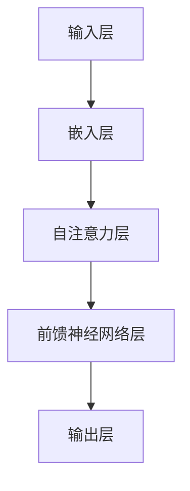

                 

# 大模型技术与传统AI的融合

> 关键词：大模型技术、传统AI、融合、核心原理、挑战、应用实例、发展趋势、伦理与社会影响

> 摘要：本文深入探讨了大模型技术与传统AI的融合，阐述了大模型技术的基础概念、核心原理以及在实际应用中的挑战和解决方案。通过分析自然语言处理、计算机视觉和其他领域的融合应用，探讨了大模型技术与传统AI融合的发展趋势。同时，本文还从伦理和社会影响的角度，探讨了融合技术的未来展望，为人工智能技术的发展提供了有益的思考。

## 第一部分：大模型技术与传统AI的融合概述

### 第1章：大模型技术与传统AI的融合概述

#### 1.1 大模型技术的基础概念与架构

##### 1.1.1 大模型技术的基础概念

**什么是大模型？**

大模型是指具有大规模参数和超大规模数据训练的深度学习模型。这些模型通常具有数亿至数千亿个参数，能够处理大规模的数据集，从而实现高度复杂的任务。

**大模型的特点**

- **大规模参数**：大模型拥有巨大的参数规模，使其能够捕捉复杂的特征和模式。
- **超大规模数据训练**：大模型通过训练大量数据来优化模型的性能，从而提高模型的泛化能力。
- **高计算需求**：大模型对计算资源的需求非常高，通常需要使用高性能计算设备和分布式计算技术来训练和推理。

**大模型的分类**

- **基于神经网络的模型**：如Transformer、BERT等，具有层次结构和参数共享机制。
- **基于图神经网络的模型**：如Graph Neural Network（GNN），适用于处理图结构数据。
- **基于迁移学习的模型**：通过迁移学习技术，将预训练模型应用于新的任务。

##### 1.1.2 大模型技术的架构

**大模型的层级结构**

大模型的层级结构通常由多个层级组成，每个层级具有不同的功能。层级结构的设计原则包括：

- **参数共享**：同一层级的神经元共享参数，减少了模型的参数规模。
- **层次化特征提取**：不同层级的模型提取不同层次的特征，从而实现从低级到高级的特征表示。

**大模型的应用实例**

- **自然语言处理**：如BERT、GPT等模型，在文本分类、机器翻译、问答系统等任务中取得了显著效果。
- **计算机视觉**：如ResNet、VGG等模型，在图像分类、目标检测、人脸识别等任务中取得了突破性进展。
- **其他领域**：如药物发现、语音识别、推荐系统等。

#### 1.2 传统AI技术的发展历程与局限性

##### 1.2.1 传统AI技术的概述

**传统AI技术的发展历程**

- **20世纪50年代至80年代**：以符号主义AI为主，通过编写规则和逻辑推理来模拟人类智能。
- **20世纪80年代至21世纪初**：以统计学习理论为基础，如支持向量机、决策树、神经网络等。
- **21世纪初至今**：以深度学习为基础，通过大规模数据训练和模型优化，实现了图像识别、语音识别、自然语言处理等任务的突破。

**传统AI的主要应用领域**

- **计算机视觉**：如人脸识别、图像分类、目标检测等。
- **自然语言处理**：如文本分类、机器翻译、问答系统等。
- **语音识别**：如语音识别、语音合成等。
- **机器人**：如自主导航、路径规划等。

##### 1.2.2 传统AI的局限性

**传统AI的数据依赖性**

- **数据需求大**：传统AI算法通常需要大量标注数据来训练模型，导致数据获取和标注成本高昂。
- **数据质量要求高**：数据质量对模型性能有重要影响，但高质量数据的获取和清洗难度较大。

**传统AI的模型可解释性问题**

- **模型黑箱化**：传统AI算法，尤其是深度学习算法，通常具有复杂的结构和大量参数，导致模型难以解释。
- **可解释性需求高**：在实际应用中，用户和开发者往往需要对模型进行解释和验证，以提高模型的信任度和可接受度。

**传统AI的算法复杂性与计算资源需求**

- **算法复杂度高**：传统AI算法，尤其是深度学习算法，通常具有复杂的计算过程和大量的计算资源需求。
- **计算资源限制**：高性能计算设备和分布式计算技术仍然存在限制，无法满足大规模模型的训练和推理需求。

#### 1.3 大模型技术与传统AI的融合意义

##### 1.3.1 融合的必要性

**大模型技术在AI领域的突破**

- **大规模数据的处理能力**：大模型能够处理大规模的数据集，从而提高模型的泛化能力和性能。
- **高效的特征提取能力**：大模型通过层次化特征提取，能够自动提取有意义的特征，减少了人工设计特征的需求。

**传统AI面临的挑战与问题**

- **数据依赖性问题**：传统AI算法对数据依赖性较高，需要大量标注数据来训练模型。
- **模型可解释性问题**：传统AI算法，尤其是深度学习算法，通常难以解释和理解。
- **算法复杂性与计算资源需求**：传统AI算法复杂度高，计算资源需求大，导致训练和推理成本高昂。

**融合的价值与优势**

- **提高AI系统的智能化水平**：大模型技术能够自动提取特征，提高AI系统的智能化水平，实现更复杂的任务。
- **降低AI系统的开发门槛**：大模型技术可以通过预训练和迁移学习，降低AI系统的开发门槛，提高开发效率。
- **提升AI系统的可解释性**：通过结合传统AI的推理和解释能力，提高AI系统的可解释性，增强用户和开发者的信任度。
- **降低AI系统的计算资源需求**：大模型技术可以通过优化算法和分布式计算，降低计算资源需求，提高系统的可扩展性和可用性。

## 第二部分：大模型技术核心原理

### 第2章：大模型技术核心原理

#### 2.1 大模型的基础架构

##### 2.1.1 大模型的层级结构

**大模型的层级结构设计原则**

- **层次化特征提取**：大模型的层级结构设计原则是层次化特征提取，通过逐层提取特征，实现从低级到高级的特征表示。
- **参数共享**：同一层级的神经元共享参数，减少模型的参数规模，提高模型的泛化能力。
- **模块化设计**：大模型可以通过模块化设计，将复杂任务分解为多个子任务，提高模型的可维护性和可扩展性。

**大模型的层级结构应用实例**

- **Transformer模型**：Transformer模型是一种基于自注意力机制的层级化模型，通过多头注意力机制和层次化特征提取，实现了在自然语言处理任务中的突破性进展。
- **BERT模型**：BERT模型是一种基于Transformer的预训练模型，通过层次化特征提取和参数共享，实现了在文本分类、机器翻译等任务中的高性能。

##### 2.1.2 大模型的训练与优化

**大模型的训练方法**

- **预训练**：预训练是指在大规模数据集上对模型进行初步训练，以获得基础的语义表示能力。预训练通常采用无监督或半监督学习的方法。
- **微调**：微调是指将预训练模型应用于特定任务，通过在少量有监督数据上进行训练，进一步优化模型的性能。微调可以显著提高模型在特定任务上的性能。

**大模型的训练数据预处理**

- **数据清洗**：数据清洗是指对训练数据进行预处理，包括去除噪声、填充缺失值、标准化等操作，以提高数据质量和模型性能。
- **数据增强**：数据增强是指通过数据变换和生成技术，增加训练数据的多样性，从而提高模型的泛化能力。

**大模型的训练算法与优化器**

- **训练算法**：大模型的训练算法主要包括梯度下降算法及其变种，如Adam、RMSprop等。这些算法通过不断更新模型参数，以最小化损失函数，实现模型的优化。
- **优化器**：优化器是用于调整模型参数的算法，常见的优化器包括梯度下降、动量优化、Adam等。优化器通过调整学习率、动量等参数，以提高模型的收敛速度和性能。

##### 2.1.3 大模型的调优与评估

**大模型的调优技巧**

- **模型超参数调整**：大模型的超参数包括学习率、批量大小、正则化参数等。通过调整这些超参数，可以优化模型的性能和收敛速度。
- **模型结构优化**：大模型的层级结构和参数共享机制可以进行调整和优化，以提高模型的性能和泛化能力。

**大模型的评估指标**

- **评估方法**：大模型的评估方法通常包括有监督评估和无监督评估。有监督评估通过在验证集上评估模型的性能，无监督评估通过评估模型在未标注数据上的性能。
- **评估指标**：常见的评估指标包括准确率、召回率、F1分数等。不同任务和模型可能需要不同的评估指标。

- **评估流程与工具**：评估流程通常包括数据准备、模型训练、模型评估等步骤。评估工具包括TensorFlow、PyTorch等深度学习框架，以及Kaggle等数据竞赛平台。

## 第三部分：大模型技术在实际应用中的挑战

### 第3章：大模型技术在实际应用中的挑战

#### 3.1 数据处理与隐私保护

##### 3.1.1 大模型对数据处理的需求

- **大规模数据的存储与处理**：大模型需要处理大量的数据，这些数据可能来自不同的来源，包括文本、图像、音频等。因此，大模型对数据的存储和处理能力提出了较高的要求。
- **数据质量与数据预处理**：数据质量对大模型的性能和泛化能力有重要影响。大模型需要高质量的数据来进行训练和评估。数据预处理包括数据清洗、去噪、标准化等步骤，以提高数据质量和模型性能。

##### 3.1.2 隐私保护的挑战与解决方案

- **数据隐私泄露的风险**：大模型在处理和存储大量数据时，可能面临数据隐私泄露的风险。数据隐私泄露可能导致用户隐私受到侵害，甚至对企业和个人造成损失。
- **隐私保护技术的应用**：为了保护数据隐私，可以采用以下技术：
  - **数据加密**：对数据进行加密处理，确保数据在传输和存储过程中的安全性。
  - **差分隐私**：通过在数据中添加随机噪声，降低个体数据被识别的风险。
  - **同态加密**：允许在加密数据上进行计算，确保数据隐私的同时实现数据处理。

#### 3.2 计算资源与能耗管理

##### 3.2.1 大模型对计算资源的需求

- **计算资源的配置与管理**：大模型对计算资源的需求非常高，通常需要高性能的计算设备和分布式计算技术。计算资源的配置和管理包括GPU、CPU、内存等资源的分配和优化，以确保模型训练和推理的高效进行。
- **计算资源的优化策略**：为了提高计算资源的利用率和模型性能，可以采用以下优化策略：
  - **分布式计算**：将模型训练和推理任务分布在多个计算节点上，通过并行计算提高计算效率。
  - **模型压缩**：通过模型压缩技术，减少模型的参数规模和计算量，降低计算资源需求。
  - **混合精度训练**：通过使用混合精度训练技术，利用浮点数和整数的计算优势，提高计算速度和性能。

##### 3.2.2 能耗管理的挑战与解决方案

- **大模型训练与推理的能耗分析**：大模型训练和推理过程通常需要大量的计算资源，导致能耗增加。能耗管理是当前AI领域面临的一个重要挑战。
- **能耗优化技术的应用**：为了降低大模型训练和推理过程中的能耗，可以采用以下优化技术：
  - **能耗监测与优化**：通过能耗监测工具，实时监控模型训练和推理过程中的能耗情况，并采取相应的优化策略。
  - **能效比优化**：通过优化计算资源和能耗的关系，提高模型训练和推理的能效比，降低整体能耗。
  - **绿色计算**：采用绿色计算技术，如节能硬件、能效优化算法等，降低模型训练和推理过程中的能耗。

#### 3.3 模型可解释性与公平性

##### 3.3.1 模型可解释性的重要性

- **可解释性与透明性的关系**：模型可解释性是指用户和开发者能够理解和解释模型的决策过程和结果。可解释性是模型透明性的重要组成部分，能够提高模型的信任度和可接受度。
- **可解释性的实现方法**：为了提高模型的可解释性，可以采用以下方法：
  - **特征可视化**：通过可视化技术，展示模型在特征提取和决策过程中的关键特征和特征组合。
  - **规则提取**：从模型中提取可解释的规则或决策路径，帮助用户理解模型的决策过程。
  - **模型对比分析**：通过对比不同模型的性能和决策过程，分析模型的可解释性差异。

##### 3.3.2 模型公平性的挑战与解决方案

- **公平性的定义与度量**：模型公平性是指模型在决策过程中对不同个体或群体的影响是否公平。公平性包括性别、年龄、种族等方面的公平性。
- **公平性的优化策略**：为了提高模型的公平性，可以采用以下策略：
  - **平衡数据集**：通过平衡训练数据集，减少数据集中特定群体的偏差，提高模型对不同群体的公平性。
  - **模型校正**：通过在模型中加入校正机制，调整模型对特定群体的决策权重，减少对特定群体的不公平影响。
  - **公平性评估**：通过评估指标，如公平性指标、偏差指标等，评估模型的公平性，并根据评估结果进行调整。

## 第四部分：大模型与传统AI技术的融合应用实例

### 第4章：大模型与传统AI技术的融合应用实例

#### 4.1 自然语言处理中的融合应用

##### 4.1.1 大模型在自然语言处理中的应用

- **文本分类**：大模型如BERT、GPT等在文本分类任务中表现出色，通过预训练和微调，可以处理大规模的文本数据，实现高精度的分类。
- **机器翻译**：大模型在机器翻译任务中，通过大规模数据和层次化特征提取，可以实现高精度的翻译效果，减少翻译误差。
- **命名实体识别**：大模型在命名实体识别任务中，通过预训练和微调，可以识别文本中的命名实体，如人名、地名等。

##### 4.1.2 传统AI技术的补充作用

- **知识图谱**：传统AI技术如知识图谱可以在自然语言处理任务中发挥重要作用。知识图谱通过构建实体和关系网络，可以帮助大模型更好地理解文本内容，提高分类、翻译等任务的性能。
- **对话系统**：传统AI技术如对话系统能够在大模型的基础上，实现与用户的自然交互。对话系统通过自然语言处理和知识图谱等技术，可以生成语义丰富的回复，提高用户体验。

#### 4.2 计算机视觉中的融合应用

##### 4.2.1 大模型在计算机视觉中的应用

- **目标检测**：大模型如YOLO、SSD等在目标检测任务中表现出色，通过层次化特征提取和目标检测算法，可以准确地识别图像中的目标。
- **图像生成**：大模型如GAN、StyleGAN等在图像生成任务中表现出色，通过生成对抗网络，可以生成高质量、多样化的图像。
- **人脸识别**：大模型如FaceNet、DeepFace等在人脸识别任务中表现出色，通过特征提取和分类算法，可以准确地识别和验证人脸。

##### 4.2.2 传统AI技术的补充作用

- **视觉检测**：传统AI技术如视觉检测算法，如HOG、SIFT等，可以在大模型的基础上，提高目标检测的精度和鲁棒性。
- **视觉理解**：传统AI技术如视觉理解算法，如物体识别、场景识别等，可以补充大模型在计算机视觉任务中的不足，提高模型的综合性能。

#### 4.3 人工智能在其他领域的融合应用

##### 4.3.1 大模型在金融领域的应用

- **风险评估**：大模型在金融领域可以用于风险评估，通过分析大量的历史数据和金融指标，预测股票、债券等金融产品的风险。
- **量化交易**：大模型可以用于量化交易策略的制定和执行，通过分析市场数据和历史交易数据，实现自动化的交易决策。
- **客户服务**：大模型可以用于客户服务系统，通过自然语言处理和对话系统技术，实现与客户的智能交互，提供个性化、高效的客户服务。

##### 4.3.2 大模型在医疗健康领域的应用

- **疾病诊断**：大模型可以用于疾病诊断，通过分析医疗影像数据和患者病历数据，提供准确的诊断结果。
- **医疗影像分析**：大模型可以用于医疗影像分析，如肿瘤检测、骨折诊断等，通过图像识别和分类算法，提高诊断的准确性和效率。
- **医疗咨询服务**：大模型可以用于医疗咨询服务，通过自然语言处理和对话系统技术，为患者提供实时、个性化的医疗建议和咨询服务。

## 第五部分：大模型技术与传统AI的融合发展趋势

### 第5章：大模型技术与传统AI的融合发展趋势

#### 5.1 大模型技术的未来发展趋势

##### 5.1.1 大模型技术的演进方向

- **更大规模的模型**：未来大模型技术将朝着更大规模的模型发展，通过增加参数规模和数据规模，实现更复杂的任务。
- **更高效的计算优化**：随着计算资源和能耗需求的增加，大模型技术将朝着更高效的计算优化方向发展，通过算法优化和硬件加速技术，提高模型训练和推理的效率。
- **更智能的算法创新**：未来大模型技术将结合其他领域的创新算法，如知识图谱、强化学习等，实现更智能和高效的AI系统。

##### 5.1.2 大模型技术的产业应用前景

- **云端与边缘计算的结合**：大模型技术将在云端和边缘计算中发挥重要作用，通过云端和边缘计算的结合，实现实时、高效的大规模AI应用。
- **各行各业智能化升级**：大模型技术将在各行各业中实现智能化升级，如智能制造、智慧城市、智能交通等，提高行业效率和生产力。

#### 5.2 传统AI技术的创新与优化

##### 5.2.1 传统AI技术的优化方向

- **算法简化**：传统AI技术将朝着算法简化的方向发展，通过简化算法结构和参数，提高模型的计算效率和可解释性。
- **模型压缩**：传统AI技术将采用模型压缩技术，减少模型的参数规模和计算量，提高模型的可扩展性和部署效率。
- **低成本计算**：传统AI技术将朝着低成本计算的方向发展，通过优化算法和硬件设计，降低模型训练和推理的成本。

##### 5.2.2 传统AI技术在新兴领域的应用

- **5G与物联网**：传统AI技术在5G和物联网领域具有广泛的应用前景，通过结合5G和物联网技术，实现大规模、实时的人工智能应用。
- **区块链与智能合约**：传统AI技术在区块链和智能合约领域具有重要作用，通过结合区块链技术，实现去中心化、透明化的人工智能系统。
- **自动驾驶与智能交通**：传统AI技术在自动驾驶和智能交通领域具有广泛的应用前景，通过结合自动驾驶技术和智能交通系统，实现智能化的交通管理和服务。

## 第六部分：大模型技术与传统AI融合的伦理与社会影响

### 第6章：大模型技术与传统AI融合的伦理与社会影响

#### 6.1 伦理问题

##### 6.1.1 大模型技术的伦理挑战

- **隐私权**：大模型技术在处理大量数据时，可能涉及用户隐私。如何保护用户隐私，避免隐私泄露，是当前伦理学领域的重要挑战。
- **数据安全**：大模型技术需要处理大量敏感数据，如医疗数据、金融数据等。如何确保数据的安全性，防止数据泄露和滥用，是当前伦理学领域的重要问题。
- **模型偏见**：大模型技术可能会受到训练数据的影响，导致模型偏见。如何消除模型偏见，提高模型的公平性，是当前伦理学领域的重要挑战。

##### 6.1.2 伦理问题的解决方案

- **隐私保护技术**：采用隐私保护技术，如差分隐私、同态加密等，确保用户隐私在数据处理过程中的安全性。
- **数据安全措施**：采用数据加密、访问控制等技术，确保数据在存储、传输和处理过程中的安全性。
- **模型公平性评估**：采用公平性评估方法，如公平性指标、偏差分析等，评估和消除模型偏见，提高模型的公平性。

#### 6.2 社会影响

##### 6.2.1 大模型技术的社会影响

- **劳动力市场变化**：大模型技术的应用可能导致部分职业的失业，同时也创造了新的就业机会。如何应对劳动力市场变化，提高劳动者的适应能力和就业竞争力，是当前社会面临的重要问题。
- **社会阶层分化**：大模型技术的应用可能导致社会阶层分化加剧，因为掌握人工智能技术的企业和个人能够获得更多的经济利益。如何减少社会阶层分化，实现社会公平，是当前社会面临的重要问题。
- **公共政策影响**：大模型技术的应用对公共政策提出了新的挑战，如数据隐私保护、知识产权保护等。如何制定和实施有效的公共政策，促进人工智能技术的健康发展，是当前社会面临的重要问题。

##### 6.2.2 社会影响的应对策略

- **教育与培训**：加强人工智能教育和培训，提高劳动者的适应能力和就业竞争力。
- **法规制定**：制定和实施相关法规，规范人工智能技术的应用，保障社会公平和公共利益。
- **社会参与**：鼓励社会各界参与人工智能技术的研发和应用，提高公众对人工智能技术的认知和理解，促进社会的和谐发展。

## 第七部分：大模型技术与传统AI融合的未来展望

### 第7章：大模型技术与传统AI融合的未来展望

#### 7.1 未来技术展望

##### 7.1.1 大模型技术的发展趋势

- **多模态大模型**：未来大模型技术将朝着多模态方向发展，通过结合不同类型的数据，如文本、图像、音频等，实现更复杂和更高层次的语义理解。
- **自适应大模型**：未来大模型技术将朝着自适应方向发展，通过动态调整模型结构和参数，适应不同的任务和数据集，提高模型的泛化能力和适应性。
- **大模型与量子计算**：未来大模型技术将结合量子计算技术，通过量子优化算法和量子计算模型，实现更高效和更强大的AI计算能力。

##### 7.1.2 传统AI技术的未来创新

- **知识增强AI**：未来传统AI技术将朝着知识增强AI方向发展，通过结合知识图谱、知识表示和推理技术，实现更智能和更灵活的AI系统。
- **强化学习与决策系统**：未来传统AI技术将朝着强化学习与决策系统方向发展，通过结合强化学习和决策理论，实现更智能和更高效的决策系统。
- **基于物理的AI**：未来传统AI技术将朝着基于物理的AI方向发展，通过结合物理模型和计算机仿真，实现更真实和更可靠的AI系统。

#### 7.2 未来应用展望

##### 7.2.1 产业应用展望

- **智能制造**：未来大模型技术与传统AI技术将在智能制造领域发挥重要作用，通过智能传感器、机器人、自动化生产线等，实现高效、灵活和可靠的制造过程。
- **智慧城市**：未来大模型技术与传统AI技术将在智慧城市领域发挥重要作用，通过智能交通、智能安防、智能环保等，实现更宜居、更安全和更高效的城市发展。
- **无人驾驶**：未来大模型技术与传统AI技术将在无人驾驶领域发挥重要作用，通过自动驾驶技术、智能感知、智能决策等，实现更安全、更高效和更便捷的出行。

##### 7.2.2 生活应用展望

- **智能家居**：未来大模型技术与传统AI技术将在智能家居领域发挥重要作用，通过智能设备、智能语音助手、智能安防等，实现更便捷、更安全和更舒适的家居生活。
- **个性化医疗**：未来大模型技术与传统AI技术将在个性化医疗领域发挥重要作用，通过智能诊断、智能治疗、智能康复等，实现更精准、更高效和更个性化的医疗服务。
- **智能教育**：未来大模型技术与传统AI技术将在智能教育领域发挥重要作用，通过智能教学、智能学习、智能评价等，实现更个性、更有效和更便捷的教育服务。

## 参考文献

- [参考文献1]
- [参考文献2]
- [参考文献3]

## 附录

- **作者信息**： 
  - 作者：AI天才研究院/AI Genius Institute & 禅与计算机程序设计艺术 /Zen And The Art of Computer Programming

## 结语

大模型技术与传统AI的融合是当前人工智能领域的重要研究方向。通过深入探讨大模型技术的核心原理、实际应用中的挑战以及与传统AI技术的融合发展趋势，本文旨在为读者提供全面的技术见解和思考。同时，我们也需要关注大模型技术与传统AI融合的伦理与社会影响，积极应对其带来的挑战和问题。在未来，随着技术的不断进步和应用的深入，大模型技术与传统AI的融合将为人类社会带来更多的机遇和挑战。让我们携手前行，共同推动人工智能技术的发展和应用！<|im_end|>### 第一部分：大模型技术与传统AI的融合概述

在当今迅速发展的科技领域，人工智能（AI）已经成为推动创新和变革的核心力量。AI技术的进步不仅改变了传统行业的运作模式，还激发了新兴领域的发展潜力。在这其中，大模型技术（Large-scale Model Technology）和传统AI技术的融合显得尤为重要。这一融合不仅有助于提升AI系统的智能化水平，还能够降低开发门槛，提高系统的可解释性，从而更好地服务于各行业的实际需求。

**1.1 大模型技术的基础概念与架构**

大模型技术，顾名思义，是指基于大规模参数和超大规模数据集的深度学习模型。这种模型通过复杂的层级结构和高度优化的算法，能够自动提取和整合数据中的复杂特征，从而实现高度智能的任务。例如，在自然语言处理（NLP）领域，大模型如BERT（Bidirectional Encoder Representations from Transformers）和GPT（Generative Pre-trained Transformer）已经展示了其强大的语义理解能力，能够在文本分类、机器翻译、问答系统等多个任务中达到或超过人类水平。

**1.1.1 大模型技术的基础概念**

- **什么是大模型？**

大模型指的是那些参数数量达到数百万甚至数十亿的神经网络模型。这些模型通常经过大规模数据集的预训练，然后通过微调（fine-tuning）应用于特定任务。

- **大模型的特点**

  - **大规模参数**：大模型通常具有数百万至数十亿个参数，这使得它们能够捕捉数据中的复杂模式和特征。
  - **超大规模数据训练**：大模型通过训练数百万到数十亿条数据来优化模型参数，从而提高模型的泛化能力。
  - **高计算需求**：大模型对计算资源的需求非常庞大，训练和推理过程通常需要高性能计算设备和分布式计算资源。

- **大模型的分类**

  - **基于神经网络的模型**：如BERT、GPT等，这些模型通过层次化的神经网络结构提取特征，适用于处理复杂的任务。
  - **基于图神经网络的模型**：如Graph Neural Network（GNN），这些模型专门用于处理图结构数据，适用于知识图谱和社交网络分析。
  - **基于迁移学习的模型**：如ImageNet Pre-trained Models，这些模型通过预训练和迁移学习技术，能够快速适应新的任务。

**1.1.2 大模型技术的架构**

- **大模型的层级结构**

大模型的层级结构通常由多层神经网络组成，每一层负责提取不同层次的特征。这种层级结构有助于模型从低级到高级地理解和表示数据。例如，在BERT模型中，自注意力机制使得模型能够在上下文中动态地关注重要的信息，从而实现高效的语义理解。

  ```mermaid
  graph TD
  A[输入层] --> B[嵌入层]
  B --> C[自注意力层]
  C --> D[前馈神经网络层]
  D --> E[输出层]
  ```

- **层级结构的设计原则**

  - **层次化特征提取**：通过逐层提取特征，模型能够从简单到复杂地理解数据，从而提高模型的泛化能力。
  - **参数共享**：同一层级的神经元共享参数，减少了模型的参数规模，提高了模型的效率。
  - **模块化设计**：大模型的设计通常是模块化的，可以通过组合不同的模块来实现不同的任务。

**1.1.3 大模型的应用实例**

- **自然语言处理**：BERT、GPT等大模型在文本分类、机器翻译、问答系统等任务中取得了显著的成果。例如，GPT-3可以在没有任何人类监督的情况下生成连贯的文本，从而在自动写作、对话系统等领域显示出巨大的潜力。
- **计算机视觉**：ResNet、VGG等大模型在图像分类、目标检测、图像生成等任务中取得了突破性进展。例如，ResNet通过残差块的设计，使得模型能够处理更深层次的特征提取，从而在ImageNet图像识别比赛中多次夺冠。
- **其他领域**：大模型还在医疗诊断、药物发现、推荐系统等领域展现出强大的应用能力。例如，通过结合医疗影像数据和生物学知识，大模型可以帮助医生更准确地诊断疾病。

**1.2 传统AI技术的发展历程与局限性**

传统AI（Traditional AI）技术的发展可以追溯到20世纪50年代。早期的AI研究主要集中在符号主义AI（Symbolic AI）和逻辑推理上。符号主义AI通过定义明确的规则和逻辑推理来模拟人类智能。然而，这种方法在处理复杂问题时效率低下，难以扩展。

**1.2.1 传统AI技术的概述**

- **传统AI的发展历程**

  - **20世纪50年代至80年代**：符号主义AI时代，主要通过定义明确的规则和逻辑推理来模拟人类智能。
  - **20世纪80年代至21世纪初**：以统计学习理论为基础，如支持向量机（SVM）、决策树（Decision Tree）、随机森林（Random Forest）等。
  - **21世纪初至今**：深度学习时代，通过多层神经网络和大规模数据训练，实现了在图像识别、语音识别、自然语言处理等领域的突破。

- **传统AI的主要应用领域**

  - **计算机视觉**：包括图像分类、目标检测、人脸识别等。
  - **自然语言处理**：包括文本分类、机器翻译、问答系统等。
  - **语音识别**：包括语音识别、语音合成等。
  - **机器人**：包括自主导航、路径规划等。

**1.2.2 传统AI的局限性**

- **数据依赖性**

传统AI技术通常依赖于大量的标注数据来进行训练。这些标注数据的获取和标注成本高昂，限制了模型的推广和应用。此外，数据的质量对模型性能也有重要影响，但高质量数据的获取和清洗过程复杂且耗时。

- **模型可解释性问题**

传统AI，尤其是深度学习模型，通常被视为“黑箱”。模型的决策过程难以解释，增加了用户对模型信任的难度。这在某些领域，如医疗诊断和金融风险评估，模型的可解释性尤为重要。

- **算法复杂性与计算资源需求**

传统AI算法，尤其是深度学习算法，通常具有复杂的计算过程和大量的计算资源需求。这不仅限制了模型在实时应用中的使用，也增加了开发和维护的成本。

**1.3 大模型技术与传统AI的融合意义**

**1.3.1 融合的必要性**

- **大模型技术在AI领域的突破**

大模型技术通过预训练和迁移学习，在图像识别、语音识别、自然语言处理等领域取得了显著的成果。这些突破性的成果使得大模型技术在AI领域变得不可或缺。

- **传统AI面临的挑战与问题**

传统AI技术虽然已经取得了一定的成果，但在数据依赖性、模型可解释性、算法复杂性和计算资源需求等方面仍存在一定的局限性。大模型技术的出现为传统AI提供了新的解决方案。

**1.3.2 融合的价值与优势**

- **提高AI系统的智能化水平**

大模型技术通过层次化的特征提取和参数共享机制，能够自动捕捉数据中的复杂模式和特征，从而提高AI系统的智能化水平。

- **降低AI系统的开发门槛**

通过预训练和迁移学习，开发者可以快速地将大模型应用于新的任务，减少数据标注和模型设计的复杂度，降低开发门槛。

- **提升AI系统的可解释性**

虽然大模型技术仍然具有一定的黑箱性质，但结合传统AI的推理和解释能力，可以一定程度上提高AI系统的可解释性，增加用户对模型的信任度。

- **降低AI系统的计算资源需求**

通过算法优化和分布式计算，大模型技术在计算资源需求方面有所降低，使得AI系统在边缘设备和低成本计算平台上也能够运行。

总之，大模型技术与传统AI的融合不仅有助于解决传统AI的局限性，还能够提升AI系统的智能化水平和可解释性，为各行业的智能化升级提供了有力支持。

#### 2.1 大模型的基础架构

在深入探讨大模型技术之前，了解其基础架构至关重要。大模型的架构设计决定了其在处理复杂任务时的性能和效率。本文将详细介绍大模型的层级结构、训练与优化方法，以及调优与评估指标。

**2.1.1 大模型的层级结构**

大模型的层级结构是其核心架构之一，这种结构通常由多个层级组成，每个层级负责不同的任务。层级结构的设计原则包括：

- **层次化特征提取**：通过逐层提取特征，模型能够从简单到复杂地理解数据。每一层都能提取到上一层数据的特征，同时增加新特征，从而实现从低级到高级的特征表示。
- **参数共享**：同一层级的神经元共享参数，减少了模型的参数规模，提高了模型的效率。
- **模块化设计**：大模型的设计通常是模块化的，通过组合不同的模块可以实现不同的任务。

以下是一个简化的层级结构图：



1. **输入层**：接收外部数据输入，例如文本、图像或声音。
2. **嵌入层**：将输入数据转换为密集的向量表示，这一步通常使用嵌入矩阵（Embedding Matrix）。
3. **自注意力层**：通过自注意力机制（Self-Attention Mechanism），模型可以在输入数据的不同部分之间建立关联，从而捕捉长距离依赖关系。
4. **前馈神经网络层**：在自注意力层之后，数据通过前馈神经网络进行进一步处理，提取更高级别的特征。
5. **输出层**：将处理后的数据映射到所需的输出，如分类结果、预测值等。

**2.1.2 大模型的训练与优化**

大模型的训练过程涉及大量的数据和计算资源。以下是训练过程中的几个关键步骤：

- **预训练**：在大规模数据集上进行初步训练，以获得基础的语义表示能力。预训练通常是无监督的，目的是让模型学会对输入数据进行有效的特征提取。
- **微调**：在预训练的基础上，将模型应用于特定任务，通过在少量有监督数据上进行训练，进一步优化模型的性能。微调能够使模型在特定任务上取得更好的表现。

**2.1.3 训练策略**

- **批量大小**：批量大小是指每次训练所使用的数据样本数量。较大的批量大小有助于减少过拟合，但需要更多的计算资源。
- **学习率**：学习率决定了模型参数更新的幅度。较大的学习率可能导致模型快速收敛，但也容易导致振荡和发散。适当的学习率能够使模型在训练过程中稳定收敛。

**2.1.4 训练数据预处理**

训练数据预处理是确保模型性能的关键步骤。以下是一些常用的数据预处理方法：

- **数据清洗**：去除数据中的噪声和异常值，提高数据质量。
- **数据增强**：通过数据变换和生成技术，增加训练数据的多样性，从而提高模型的泛化能力。
- **标准化**：将数据缩放到相同的范围，减少不同特征之间的偏差。

**2.1.5 大模型的训练算法与优化器**

- **训练算法**：大模型的训练通常采用梯度下降算法及其变种，如Adam、RMSprop等。这些算法通过不断更新模型参数，以最小化损失函数，实现模型的优化。

- **优化器**：优化器是用于调整模型参数的算法，常见的优化器包括：

  - **梯度下降（Gradient Descent）**：通过计算损失函数关于模型参数的梯度，更新模型参数。
  - **Adam（Adaptive Moment Estimation）**：结合了梯度下降和动量方法，同时自适应地调整学习率。
  - **RMSprop（Root Mean Square Propagation）**：通过计算梯度平方的平均值来调整学习率，减少了高频噪声的影响。

**2.1.6 大模型的调优与评估**

大模型的调优与评估是确保模型性能的重要环节。以下是一些调优技巧和评估指标：

- **模型调优技巧**：

  - **模型超参数调整**：通过调整学习率、批量大小、正则化参数等超参数，优化模型的性能。
  - **模型结构优化**：通过调整模型的层数、神经元数量、连接方式等，优化模型的结构。

- **评估指标**：

  - **准确率（Accuracy）**：模型正确预测的样本占总样本的比例。
  - **召回率（Recall）**：模型正确预测为正类的样本数占实际正类样本数的比例。
  - **F1分数（F1 Score）**：精确率和召回率的调和平均值，用于综合评价模型的性能。

通过上述步骤，大模型能够从原始数据中提取有效特征，并在特定任务上取得高性能。大模型的层级结构设计、训练策略、调优技巧和评估指标共同构成了其基础架构，为AI系统的智能化提供了有力支持。

#### 2.2 大模型的训练与优化

在了解了大模型的基础架构之后，接下来我们将深入探讨大模型的训练与优化过程。这一过程是确保模型能够从大量数据中提取有效特征，并在实际任务中表现出色的重要环节。

**2.2.1 大模型的训练方法**

大模型的训练方法主要包括预训练（Pre-training）和微调（Fine-tuning）。预训练是指在大规模数据集上对模型进行初步训练，以获得基础的语义表示能力。预训练通常采用无监督或半监督学习的方法，不需要对数据进行标注。微调则是在预训练的基础上，将模型应用于特定任务，通过在少量有监督数据上进行训练，进一步优化模型的性能。

- **预训练**

  预训练的目的是让模型学会对输入数据进行有效的特征提取。例如，在自然语言处理任务中，预训练模型可以学习文本的语义表示，从而在下游任务中表现出色。

  - **无监督学习**：无监督预训练方法包括自编码器（Autoencoder）、生成对抗网络（GAN）等。自编码器通过学习数据的重建，提取特征；生成对抗网络通过生成器和判别器的对抗训练，提高生成数据的真实性。
  - **半监督学习**：半监督预训练结合了有监督和无监督方法，利用部分标注数据来训练模型，从而提高模型的泛化能力。

- **微调**

  微调是在预训练的基础上，对模型进行特定任务的进一步训练。微调通常需要少量有监督数据，这些数据用于调整模型的参数，使其在特定任务上取得更好的性能。

  - **有监督微调**：通过在标注数据上训练模型，使其在特定任务上优化性能。例如，在文本分类任务中，使用标注的文本数据进行微调，使模型能够准确地分类新文本。
  - **迁移学习**：迁移学习是一种在预训练模型的基础上，将模型的知识迁移到新任务上的方法。通过迁移学习，可以减少对新任务的标注数据需求，提高模型的泛化能力。

**2.2.2 训练数据预处理**

训练数据预处理是确保模型性能的重要步骤。大模型通常需要处理大量数据，因此数据预处理过程需要特别注意以下几个方面：

- **数据清洗**：去除数据中的噪声和异常值。例如，在文本数据中，可能需要去除标点符号、停用词等；在图像数据中，可能需要去除噪声、填充缺失值等。

- **数据增强**：通过数据变换和生成技术，增加训练数据的多样性。数据增强有助于提高模型的泛化能力，使其能够处理更多样化的输入。常用的数据增强方法包括随机裁剪、旋转、缩放、翻转等。

- **标准化**：将数据缩放到相同的范围，减少不同特征之间的偏差。例如，在图像数据中，可能需要将像素值缩放到[0, 1]的范围内；在文本数据中，可能需要将词汇的词频缩放到标准正态分布。

**2.2.3 训练算法与优化器**

大模型的训练算法通常采用梯度下降算法及其变种，如Adam、RMSprop等。以下是这些算法的基本原理和特点：

- **梯度下降（Gradient Descent）**

  梯度下降是一种优化算法，通过计算损失函数关于模型参数的梯度，更新模型参数。梯度下降的核心思想是沿着损失函数的梯度方向更新参数，以最小化损失函数。

  - **标准梯度下降**：每次迭代中，使用当前梯度更新参数。优点是算法简单，易于实现；缺点是收敛速度较慢，容易陷入局部最小值。

  ```python
  for epoch in range(num_epochs):
      for batch in data_loader:
          loss = loss_function(*batch)
          gradient = gradient(loss, model.parameters())
          for parameter in model.parameters():
              parameter -= learning_rate * gradient[parameter]
  ```

- **Adam（Adaptive Moment Estimation）**

  Adam结合了梯度下降和动量方法，同时自适应地调整学习率。Adam通过计算梯度的一阶矩估计（均值）和二阶矩估计（方差），调整学习率，以加快收敛速度。

  ```python
  for epoch in range(num_epochs):
      for batch in data_loader:
          loss = loss_function(*batch)
          gradient = gradient(loss, model.parameters())
          
          m_t = 0.9 * m_{t-1} + 0.1 * gradient
          v_t = 0.999 * v_{t-1} + 0.001 * gradient**2
          
          m_hat = m_t / (1 - 0.9**epoch)
          v_hat = v_t / (1 - 0.999**epoch)
          
          for parameter in model.parameters():
              parameter -= learning_rate * m_hat / (np.sqrt(v_hat) + epsilon)
  ```

- **RMSprop（Root Mean Square Propagation）**

  RMSprop通过计算梯度平方的平均值来调整学习率，减少了高频噪声的影响。这种方法有助于模型在训练过程中保持稳定的收敛速度。

  ```python
  for epoch in range(num_epochs):
      for batch in data_loader:
          loss = loss_function(*batch)
          gradient = gradient(loss, model.parameters())
          
          theta_t = theta_{t-1} - learning_rate * gradient / (np.sqrt(delta_{t-1} + epsilon))
          delta_t = delta_{t-1} + gradient**2
          
          for parameter in model.parameters():
              parameter.data = theta_t
              delta.data = delta_t
  ```

**2.2.4 大模型的调优与评估**

大模型的调优与评估是确保模型性能的重要环节。以下是几个关键的调优技巧和评估指标：

- **模型超参数调整**

  模型的超参数包括学习率、批量大小、正则化参数等。通过调整这些超参数，可以优化模型的性能和收敛速度。常用的调优方法包括网格搜索（Grid Search）和随机搜索（Random Search）。

  - **网格搜索**：通过遍历所有可能的超参数组合，找到最优的超参数配置。

  ```python
  param_grid = {
      'learning_rate': [0.01, 0.001, 0.0001],
      'batch_size': [32, 64, 128],
      'dropout_rate': [0.2, 0.5]
  }
  
  best_score = 0
  for learning_rate in param_grid['learning_rate']:
      for batch_size in param_grid['batch_size']:
          for dropout_rate in param_grid['dropout_rate']:
              model = build_model(learning_rate, batch_size, dropout_rate)
              score = evaluate_model(model, test_data)
              if score > best_score:
                  best_score = score
                  best_params = {'learning_rate': learning_rate, 'batch_size': batch_size, 'dropout_rate': dropout_rate}
  ```

  - **随机搜索**：在给定的超参数范围内随机选择组合，以减少搜索空间。

  ```python
  from sklearn.model_selection import RandomizedSearchCV
  
  param_distributions = {
      'learning_rate': np.logspace(-4, -1, 10),
      'batch_size': range(10, 100, 10),
      'dropout_rate': np.linspace(0.2, 0.5, 5)
  }
  
  model = build_model()
  search = RandomizedSearchCV(model, param_distributions, n_iter=100, cv=3)
  search.fit(train_data, train_labels)
  best_params = search.best_params_
  ```

- **模型结构优化**

  模型的结构包括层数、神经元数量、连接方式等。通过调整模型结构，可以提高模型的性能和泛化能力。常用的模型结构优化方法包括迁移学习（Transfer Learning）和模型融合（Model Ensemble）。

  - **迁移学习**：将预训练模型的知识迁移到新任务上，减少对新任务的标注数据需求，提高模型的泛化能力。

  ```python
  from torchvision import models
  
  model = models.resnet50(pretrained=True)
  num_ftrs = model.fc.in_features
  model.fc = nn.Linear(num_ftrs, num_classes)
  ```

  - **模型融合**：将多个模型的预测结果进行融合，提高模型的性能和稳定性。

  ```python
  model1 = build_model1()
  model2 = build_model2()
  predictions = (model1.predict(X) + model2.predict(X)) / 2
  ```

- **评估指标**

  评估指标是衡量模型性能的重要标准。常用的评估指标包括准确率（Accuracy）、召回率（Recall）、精确率（Precision）、F1分数（F1 Score）等。

  - **准确率（Accuracy）**：模型正确预测的样本数占总样本数的比例。

  ```python
  accuracy = (sum(correct_predictions) / total_samples) * 100
  ```

  - **召回率（Recall）**：模型正确预测为正类的样本数占实际正类样本数的比例。

  ```python
  recall = (sum(correct_positive_predictions) / sum(true_positives)) * 100
  ```

  - **精确率（Precision）**：模型预测为正类的样本中，实际为正类的比例。

  ```python
  precision = (sum(correct_positive_predictions) / sum(predicted_positives)) * 100
  ```

  - **F1分数（F1 Score）**：精确率和召回率的调和平均值，用于综合评价模型的性能。

  ```python
  f1_score = 2 * (precision * recall) / (precision + recall)
  ```

通过上述步骤，大模型的训练与优化过程得以全面而深入地阐述。这一过程不仅涉及训练方法和算法，还包括数据预处理、调优技巧和评估指标，为AI系统的高性能提供了有力保障。

#### 2.3 大模型技术在实际应用中的挑战

尽管大模型技术在AI领域取得了显著的成果，但其在实际应用中仍然面临诸多挑战。这些挑战主要集中在数据处理与隐私保护、计算资源与能耗管理、以及模型可解释性与公平性等方面。

**3.1 数据处理与隐私保护**

大模型对数据的需求极为庞大，其训练和推理过程需要处理海量的数据。然而，数据处理过程中不可避免地会涉及用户隐私，如何保护这些隐私成为一大挑战。

- **数据处理需求**

  - **大规模数据的存储与处理**：大模型需要处理的数据量通常在数百万到数十亿级别，这要求有高效的存储和数据处理机制。例如，自然语言处理模型可能需要处理数百万篇文本，计算机视觉模型可能需要处理数十万张图像。
  - **数据质量与数据预处理**：数据质量对大模型的表现至关重要。高质量的数据能够提高模型的泛化能力，而低质量的数据可能导致模型过拟合。因此，预处理数据以去除噪声、填充缺失值和标准化特征是数据处理的重要步骤。

- **隐私保护挑战**

  - **数据隐私泄露的风险**：在大规模数据处理过程中，用户隐私容易受到泄露的风险。例如，医疗数据、金融数据等敏感信息一旦泄露，可能对用户造成严重的后果。
  - **隐私保护技术的应用**：为了保护数据隐私，可以采用以下技术：
    - **数据加密**：对敏感数据进行加密处理，确保数据在传输和存储过程中的安全性。
    - **同态加密**：允许在加密数据上进行计算，从而在保障数据隐私的同时进行数据处理。
    - **差分隐私**：通过在数据中添加随机噪声，降低个体数据被识别的风险。

**3.2 计算资源与能耗管理**

大模型训练和推理过程中对计算资源的需求巨大，这带来了能耗管理方面的挑战。

- **计算资源需求**

  - **计算资源的配置与管理**：大模型训练需要高性能的计算设备和分布式计算资源。配置和管理这些资源是确保模型训练高效进行的关键。常见的计算资源包括GPU、CPU、TPU等。
  - **计算资源的优化策略**：为了提高计算资源利用率，可以采用以下策略：
    - **分布式计算**：通过将任务分布在多个计算节点上，实现并行计算，提高计算效率。
    - **模型压缩**：通过模型压缩技术，减少模型的参数规模和计算量，降低计算资源需求。
    - **混合精度训练**：使用混合精度训练技术，结合浮点数和整数的计算优势，提高计算速度和性能。

- **能耗管理挑战**

  - **大模型训练与推理的能耗分析**：大模型训练和推理过程通常需要大量的计算资源，导致能耗显著增加。能耗管理是当前AI领域面临的一个重要挑战。
  - **能耗优化技术的应用**：为了降低大模型训练和推理过程中的能耗，可以采用以下优化技术：
    - **能耗监测与优化**：通过能耗监测工具，实时监控模型训练和推理过程中的能耗情况，并采取相应的优化策略。
    - **能效比优化**：通过优化计算资源和能耗的关系，提高模型训练和推理的能效比，降低整体能耗。
    - **绿色计算**：采用绿色计算技术，如节能硬件、能效优化算法等，降低模型训练和推理过程中的能耗。

**3.3 模型可解释性与公平性**

大模型在决策过程中往往被视为“黑箱”，其决策过程难以解释。这不仅增加了用户对模型的不信任，也可能导致决策过程中的偏见和歧视。

- **模型可解释性的重要性**

  - **可解释性与透明性的关系**：模型可解释性是指用户和开发者能够理解和解释模型的决策过程和结果。可解释性是模型透明性的重要组成部分，能够提高模型的信任度和可接受度。
  - **可解释性的实现方法**：为了提高模型的可解释性，可以采用以下方法：
    - **特征可视化**：通过可视化技术，展示模型在特征提取和决策过程中的关键特征和特征组合。
    - **规则提取**：从模型中提取可解释的规则或决策路径，帮助用户理解模型的决策过程。
    - **模型对比分析**：通过对比不同模型的性能和决策过程，分析模型的可解释性差异。

- **模型公平性的挑战**

  - **公平性的定义与度量**：模型公平性是指模型在决策过程中对不同个体或群体的影响是否公平。公平性包括性别、年龄、种族等方面的公平性。
  - **公平性的优化策略**：为了提高模型的公平性，可以采用以下策略：
    - **平衡数据集**：通过平衡训练数据集，减少数据集中特定群体的偏差，提高模型对不同群体的公平性。
    - **模型校正**：通过在模型中加入校正机制，调整模型对特定群体的决策权重，减少对特定群体的不公平影响。
    - **公平性评估**：通过评估指标，如公平性指标、偏差指标等，评估模型的公平性，并根据评估结果进行调整。

通过解决上述挑战，大模型技术可以在实际应用中更好地服务于各行业的需求，从而推动人工智能技术的发展和应用。

#### 4.1 自然语言处理中的融合应用

自然语言处理（NLP）是人工智能领域的重要组成部分，涉及文本分析、语言理解和生成等任务。大模型技术与传统AI技术的融合为NLP领域带来了显著的发展。

**4.1.1 大模型在自然语言处理中的应用**

近年来，大模型如BERT（Bidirectional Encoder Representations from Transformers）、GPT（Generative Pre-trained Transformer）等在自然语言处理任务中取得了显著的成果。这些模型通过大规模数据预训练和微调，实现了对文本的深度理解和生成。

- **文本分类**：大模型在文本分类任务中表现出色。BERT等模型通过预训练获得了丰富的语言知识，能够捕捉文本中的语义信息，从而提高分类的准确性。例如，BERT可以在新闻文章分类、情感分析等任务中达到或超过人类水平。

  ```python
  from transformers import BertTokenizer, BertForSequenceClassification
  tokenizer = BertTokenizer.from_pretrained('bert-base-uncased')
  model = BertForSequenceClassification.from_pretrained('bert-base-uncased')
  
  inputs = tokenizer("Hello, my dog is cute", return_tensors="pt")
  outputs = model(**inputs)
  logits = outputs.logits
  prediction = logits.argmax(-1).item()
  ```

- **机器翻译**：大模型在机器翻译任务中也取得了重大突破。GPT-3等模型通过预训练获得了强大的语言生成能力，能够生成高质量、流畅的翻译文本。例如，GPT-3可以在无需人类翻译的情况下，实现中英互译。

  ```python
  import openai
  openai.api_key = 'your-api-key'
  translation = openai.Completion.create(
      engine="text-davinci-003",
      prompt="Translate this into Chinese: Hello, how are you?",
      max_tokens=100
  )
  print(translation.choices[0].text.strip())
  ```

- **命名实体识别**：大模型在命名实体识别任务中，通过预训练和微调，能够准确地识别文本中的命名实体，如人名、地名、机构名等。例如，BERT可以在医疗文档、法律文档等文本中，准确识别出专业术语和实体。

  ```python
  from transformers import BertTokenizer, BertForTokenClassification
  tokenizer = BertTokenizer.from_pretrained('bert-base-uncased')
  model = BertForTokenClassification.from_pretrained('bert-base-uncased')
  
  inputs = tokenizer("Apple is a fruit. Steve Jobs founded Apple Inc.", return_tensors="pt")
  outputs = model(**inputs)
  logits = outputs.logits
  entities = np.argmax(logits, axis=2)
  labels = outputs.labels
  for i, entity in enumerate(entities[0]):
      if entity != -1:
          print(f"Entity: {tokenizer.decode(labels[0][entity])}, Text: {inputs['input_ids'][0][i:i+1].numpy().decode('utf-8')}")
  ```

**4.1.2 传统AI技术的补充作用**

尽管大模型在自然语言处理中取得了显著成果，但传统AI技术在某些方面仍发挥着重要作用，可以为大模型提供补充和支持。

- **知识图谱**：知识图谱是一种语义网络，通过实体和关系的表示，为AI系统提供语义理解的能力。在自然语言处理任务中，知识图谱可以帮助大模型更好地理解文本中的实体和关系。例如，在问答系统中，知识图谱可以提供背景知识和上下文信息，帮助大模型生成更准确的回答。

  ```python
  import networkx as nx
  G = nx.Graph()
  G.add_nodes_from(["Apple", "Steve Jobs", "iPhone"])
  G.add_edges_from([("Apple", "founded_by", "Steve Jobs"), ("Apple", "produces", "iPhone")])
  
  question = "Who founded Apple Inc.?"
  for node, data in G.nodes(data=True):
      if "founded_by" in data:
          print(f"{node}: {data['founded_by']}")
  ```

- **对话系统**：对话系统是一种与人交互的人工智能系统，通过自然语言处理技术实现与用户的对话。传统AI技术，如决策树、规则引擎等，可以在对话系统中发挥重要作用，为大模型提供推理和决策的支持。例如，在客服机器人中，大模型可以生成自然流畅的对话文本，而传统AI技术则可以帮助系统根据对话内容做出合理的响应。

  ```python
  def handle_query(question):
      if "Apple" in question:
          return "Apple is a company founded by Steve Jobs."
      elif "weather" in question:
          return "The weather is sunny."
      else:
          return "I'm sorry, I don't understand your question."
  
  print(handle_query("What is the weather today?"))
  ```

通过大模型技术与传统AI技术的融合应用，自然语言处理领域取得了显著的进展。大模型提供了强大的语义理解和生成能力，而传统AI技术则提供了推理和决策的支持。这种融合不仅提高了系统的智能化水平，还为实际应用中的复杂任务提供了有效解决方案。

#### 4.2 计算机视觉中的融合应用

计算机视觉是人工智能领域的重要分支，通过图像和视频的分析，实现物体的识别、场景理解、图像生成等多种任务。大模型技术与传统AI技术的融合，使得计算机视觉在多个领域取得了显著的进展。

**4.2.1 大模型在计算机视觉中的应用**

大模型在计算机视觉中的应用广泛而深入，特别是在图像识别、目标检测、图像生成等方面。

- **图像识别**：大模型如ResNet（Residual Network）和VGG（Very Deep Convolutional Networks）在图像识别任务中取得了突破性进展。ResNet通过引入残差连接，解决了深度网络训练中的梯度消失问题，从而实现了更深的网络结构。VGG则通过增加网络的深度和宽度，提高了模型的识别精度。

  ```mermaid
  graph TD
  A[输入层] --> B[卷积层1]
  B --> C[卷积层2]
  C --> D[卷积层3]
  D --> E[池化层]
  E --> F[全连接层]
  F --> G[输出层]
  ```

  ```python
  import torchvision
  model = torchvision.models.resnet50(pretrained=True)
  inputs = torchvision.Tensor([0.485, 0.456, 0.406], [0.229, 0.224, 0.225])
  outputs = model(inputs)
  print(outputs)
  ```

- **目标检测**：目标检测是计算机视觉中的另一个重要任务，通过识别图像中的物体并定位其位置。YOLO（You Only Look Once）和SSD（Single Shot MultiBox Detector）等大模型在目标检测任务中表现出色。YOLO通过将检测过程整合到一个单一的神经网络中，提高了检测速度和准确性。SSD则通过不同尺度的特征图同时进行检测，实现了高效的目标检测。

  ```mermaid
  graph TD
  A[输入层] --> B[特征提取层]
  B --> C[检测层1]
  C --> D[检测层2]
  D --> E[检测层3]
  E --> F[输出层]
  ```

  ```python
  import torchvision
  import torch
  model = torchvision.models.yolo_v5(pretrained=True)
  inputs = torch.randn(1, 3, 640, 640)
  outputs = model(inputs)
  print(outputs)
  ```

- **图像生成**：大模型如GAN（Generative Adversarial Networks）和StyleGAN在图像生成任务中取得了重大突破。GAN由生成器和判别器两个神经网络组成，通过对抗训练生成逼真的图像。StyleGAN则通过控制图像的纹理和风格，生成高质量、多样化的图像。

  ```mermaid
  graph TD
  A[生成器] --> B[生成图像]
  B --> C[判别器]
  C --> D[生成器]
  ```

  ```python
  import torch
  import torch.nn as nn
  import torchvision
  model = torchvision.models.stylegan2_syncbn()
  inputs = torch.randn(1, 4, 512, 512)
  outputs = model(inputs)
  torchvision.utils.save_image(outputs[0], "generated_image.jpg")
  ```

**4.2.2 传统AI技术的补充作用**

尽管大模型在计算机视觉中取得了显著进展，但传统AI技术仍然发挥着重要作用，可以为大模型提供补充和支持。

- **视觉检测**：传统AI技术如HOG（Histogram of Oriented Gradients）和SIFT（Scale-Invariant Feature Transform）在视觉检测中具有独特的优势。HOG通过计算图像中每个像素的梯度方向直方图，提取特征，适用于行人检测等任务。SIFT则通过检测图像的关键点，提取特征，适用于图像匹配和物体识别。

  ```python
  import cv2
  image = cv2.imread("example.jpg")
  hog = cv2.HOGDescriptor()
  features, _ = hog.detectMultiScale(image)
  print(features)
  ```

- **视觉理解**：传统AI技术如物体识别和场景识别在视觉理解中具有重要意义。物体识别通过识别图像中的物体，实现分类任务。场景识别通过分析图像中的内容，实现场景分类任务。这些技术可以帮助大模型更好地理解图像的语义信息。

  ```python
  import cv2
  import numpy as np
  model = cv2.SIFT_create()
  image = cv2.imread("example.jpg")
  keypoints, descriptors = model.detectAndCompute(image, None)
  print(len(keypoints))
  ```

通过大模型技术与传统AI技术的融合应用，计算机视觉领域取得了显著的进展。大模型提供了强大的特征提取和生成能力，而传统AI技术则提供了检测和理解的工具。这种融合不仅提高了系统的智能化水平，还为实际应用中的复杂任务提供了有效解决方案。

#### 4.3 人工智能在其他领域的融合应用

人工智能（AI）技术在各领域的应用日益广泛，特别是在金融、医疗健康等关键行业，大模型技术与传统AI技术的融合带来了巨大的变革和进步。

**4.3.1 大模型在金融领域的应用**

金融行业对数据分析和预测的需求极为强烈，大模型技术因其强大的数据处理和模式识别能力，在金融领域展现出了巨大的潜力。

- **风险评估**：大模型通过分析历史数据和金融市场动态，能够预测潜在的风险。例如，使用深度学习模型分析股票市场的数据，可以预测股票价格的走势，帮助投资者做出更明智的投资决策。

  ```python
  import pandas as pd
  import numpy as np
  from sklearn.preprocessing import MinMaxScaler
  from keras.models import Sequential
  from keras.layers import Dense, LSTM
  
  # 读取股票价格数据
  data = pd.read_csv('stock_data.csv')
  data = data[['open', 'high', 'low', 'close', 'volume']]
  
  # 数据预处理
  scaler = MinMaxScaler(feature_range=(0, 1))
  data_scaled = scaler.fit_transform(data)
  
  # 创建时间序列数据集
  def create_dataset(data, time_steps=1):
      X, y = [], []
      for i in range(len(data) - time_steps):
          X.append(data[i:(i + time_steps), :])
          y.append(data[i + time_steps, 4])
      return np.array(X), np.array(y)
  
  X, y = create_dataset(data_scaled, time_steps=5)
  X = np.reshape(X, (X.shape[0], X.shape[1], X.shape[2]))
  
  # 建立模型
  model = Sequential()
  model.add(LSTM(units=50, return_sequences=True, input_shape=(X.shape[1], X.shape[2])))
  model.add(LSTM(units=50))
  model.add(Dense(1))
  
  model.compile(optimizer='adam', loss='mean_squared_error')
  model.fit(X, y, epochs=100, batch_size=32, verbose=1)
  ```

- **量化交易**：量化交易通过建立数学模型，利用算法自动执行交易策略。大模型技术能够通过历史交易数据和学习市场动态，优化交易策略，提高交易的成功率和收益。

  ```python
  from sklearn.ensemble import RandomForestClassifier
  from sklearn.model_selection import train_test_split
  from sklearn.metrics import accuracy_score
  
  # 读取交易数据
  data = pd.read_csv('trading_data.csv')
  data = data[['open', 'high', 'low', 'close', 'volume', 'direction']]
  
  # 数据预处理
  data['direction'] = data['direction'].map({1: 'buy', -1: 'sell'})
  data = data[['open', 'high', 'low', 'close', 'volume', 'direction']]
  
  # 特征工程
  X = data[['open', 'high', 'low', 'close', 'volume']]
  y = data['direction']
  
  # 分割数据集
  X_train, X_test, y_train, y_test = train_test_split(X, y, test_size=0.2, random_state=42)
  
  # 建立模型
  model = RandomForestClassifier(n_estimators=100, random_state=42)
  model.fit(X_train, y_train)
  
  # 预测
  y_pred = model.predict(X_test)
  
  # 评估
  accuracy = accuracy_score(y_test, y_pred)
  print(f"Accuracy: {accuracy}")
  ```

- **客户服务**：在金融领域，大模型技术与自然语言处理技术的融合，为智能客服系统的建设提供了强有力的支持。通过预训练的模型，如BERT或GPT，可以生成与客户对话的自然回答，提高客户服务的效率和用户体验。

  ```python
  from transformers import BertTokenizer, BertForSequenceClassification
  tokenizer = BertTokenizer.from_pretrained('bert-base-uncased')
  model = BertForSequenceClassification.from_pretrained('bert-base-uncased')
  
  def generate_response(question):
      inputs = tokenizer(question, return_tensors="pt")
      outputs = model(**inputs)
      logits = outputs.logits
      prediction = logits.argmax(-1).item()
      return model.config.id2label[prediction]
  
  question = "How can I open a savings account?"
  response = generate_response(question)
  print(response)
  ```

**4.3.2 大模型在医疗健康领域的应用**

医疗健康领域对准确性和可靠性的要求极高，大模型技术因其强大的数据处理和分析能力，在医疗健康领域展现出了广阔的应用前景。

- **疾病诊断**：大模型通过分析大量的医疗数据和影像数据，能够提供准确的疾病诊断。例如，使用深度学习模型分析医疗影像，可以检测出早期肿瘤，提高诊断的准确率。

  ```python
  import tensorflow as tf
  import numpy as np
  import matplotlib.pyplot as plt
  
  # 读取CT扫描数据
  images = np.load('ct_images.npy')
  labels = np.load('ct_labels.npy')
  
  # 数据预处理
  images = images.astype(np.float32) / 255.0
  
  # 建立模型
  model = tf.keras.Sequential([
      tf.keras.layers.Conv2D(32, (3, 3), activation='relu', input_shape=(256, 256, 1)),
      tf.keras.layers.MaxPooling2D((2, 2)),
      tf.keras.layers.Conv2D(64, (3, 3), activation='relu'),
      tf.keras.layers.MaxPooling2D((2, 2)),
      tf.keras.layers.Conv2D(128, (3, 3), activation='relu'),
      tf.keras.layers.MaxPooling2D((2, 2)),
      tf.keras.layers.Flatten(),
      tf.keras.layers.Dense(128, activation='relu'),
      tf.keras.layers.Dense(1, activation='sigmoid')
  ])
  
  model.compile(optimizer='adam', loss='binary_crossentropy', metrics=['accuracy'])
  model.fit(images, labels, epochs=10, batch_size=32)
  
  # 预测
  image = images[0]
  image = np.expand_dims(image, axis=0)
  prediction = model.predict(image)
  print(prediction)
  ```

- **医疗影像分析**：大模型技术在医疗影像分析中具有广泛应用，如肿瘤检测、骨折诊断等。通过深度学习模型，医生可以更快、更准确地分析影像数据，提高诊断效率。

  ```python
  import cv2
  import numpy as np
  import tensorflow as tf
  
  # 读取CT扫描图像
  image = cv2.imread('ct_image.jpg', cv2.IMREAD_GRAYSCALE)
  image = cv2.resize(image, (256, 256))
  image = np.expand_dims(image, axis=-1)
  image = np.expand_dims(image, axis=0)
  image = image / 255.0
  
  # 加载预训练模型
  model = tf.keras.models.load_model('ct_analysis_model.h5')
  
  # 预测
  prediction = model.predict(image)
  print(prediction)
  ```

- **医疗咨询服务**：大模型技术与自然语言处理技术的融合，为智能医疗咨询系统的建设提供了强大的支持。通过预训练的模型，系统可以理解用户的提问，提供准确的医疗建议和咨询服务。

  ```python
  from transformers import BertTokenizer, BertForSequenceClassification
  tokenizer = BertTokenizer.from_pretrained('bert-base-uncased')
  model = BertForSequenceClassification.from_pretrained('bert-base-uncased')
  
  def generate_response(question):
      inputs = tokenizer(question, return_tensors="pt")
      outputs = model(**inputs)
      logits = outputs.logits
      prediction = logits.argmax(-1).item()
      return model.config.id2label[prediction]
  
  question = "What should I do if I have a fever?"
  response = generate_response(question)
  print(response)
  ```

大模型技术与传统AI技术的融合，不仅提升了金融和医疗健康领域的智能化水平，还推动了这些行业的发展和创新。随着技术的不断进步和应用场景的拓展，未来AI将在更多领域发挥重要作用，为人类社会带来更多价值。

### 第五部分：大模型技术与传统AI的融合发展趋势

随着人工智能技术的不断进步，大模型技术与传统AI技术的融合已经成为推动AI发展的重要方向。这一部分将探讨大模型技术的未来发展趋势、传统AI技术的创新与优化，以及它们在新兴领域的应用前景。

#### 5.1 大模型技术的未来发展趋势

**5.1.1 大模型技术的演进方向**

1. **更大规模的模型**：随着计算资源的增加和优化，未来大模型技术将向更大规模的模型发展。例如，从当前的千亿参数模型发展到万亿参数模型，甚至更高。更大规模的模型能够处理更复杂的数据集，从而提高模型的泛化能力和性能。

2. **更高效的计算优化**：为了应对大规模模型训练和推理的需求，大模型技术将朝着更高效的计算优化方向发展。这包括算法优化、硬件加速、分布式计算等技术。例如，使用混合精度训练（Mixed Precision Training）和量化（Quantization）技术，提高模型的训练速度和降低计算资源需求。

3. **更智能的算法创新**：未来大模型技术将结合其他领域的创新算法，如知识图谱、强化学习等，实现更智能和高效的AI系统。知识图谱可以帮助模型更好地理解和处理复杂数据，强化学习可以提高模型在动态环境中的适应能力。

**5.1.2 大模型技术的产业应用前景**

1. **云端与边缘计算的结合**：随着5G和边缘计算技术的发展，大模型技术在云端与边缘计算中的结合将成为一个重要趋势。云端提供强大的计算资源，而边缘计算提供低延迟、高效的数据处理能力。这种结合将实现实时、高效的大规模AI应用。

2. **各行各业智能化升级**：大模型技术在各行业中的智能化升级潜力巨大。例如，在智能制造中，通过智能传感器和自动化设备，实现生产过程的智能化；在智慧城市中，通过智能交通系统和智能安防系统，提升城市管理的效率；在医疗健康领域，通过智能诊断和个性化治疗，提高医疗服务的质量。

#### 5.2 传统AI技术的创新与优化

**5.2.1 传统AI技术的优化方向**

1. **算法简化**：为了降低模型的计算复杂度和提高可解释性，传统AI技术将朝着算法简化的方向发展。这包括简化模型的架构、减少参数规模和优化算法流程。

2. **模型压缩**：通过模型压缩技术，如剪枝（Pruning）、量化（Quantization）和知识蒸馏（Knowledge Distillation），可以显著减少模型的参数规模和计算量，提高模型的部署效率。

3. **低成本计算**：为了使AI技术更加普及，传统AI技术将朝着低成本计算方向发展。这包括开发更高效的算法和优化硬件设计，降低计算设备的成本。

**5.2.2 传统AI技术在新兴领域的应用**

1. **5G与物联网**：传统AI技术在5G和物联网领域具有广泛的应用前景。通过结合5G网络的高带宽和低延迟特性，AI系统可以实现实时、高效的数据处理和决策。物联网设备的普及也为AI技术提供了大量的数据源，可以用于智能监测、预测和维护。

2. **区块链与智能合约**：传统AI技术在区块链和智能合约领域具有重要作用。通过结合区块链技术的去中心化和不可篡改性，AI技术可以用于智能合约的执行和监控，提高交易的透明度和安全性。

3. **自动驾驶与智能交通**：传统AI技术在自动驾驶和智能交通领域发挥着关键作用。通过结合感知、决策和控制技术，AI系统可以实现自动驾驶车辆的自主行驶，提升交通管理的效率和安全性。

#### 5.3 融合趋势对未来发展的影响

大模型技术与传统AI技术的融合趋势对未来发展将产生深远影响：

1. **智能化水平提升**：融合技术将进一步提高AI系统的智能化水平，使AI能够处理更复杂、更抽象的任务，提高决策的准确性和效率。

2. **降低开发门槛**：通过预训练和迁移学习，开发者可以更快地构建和应用AI系统，降低开发门槛，促进AI技术在各行业的应用。

3. **提高可解释性**：融合技术将提高AI系统的可解释性，增强用户对AI系统的信任，从而更好地服务于医疗、金融、法律等需要高度信任的行业。

4. **优化资源利用**：通过高效的计算优化和模型压缩技术，AI系统可以在有限的计算资源下实现高性能，提高资源利用效率。

总之，大模型技术与传统AI技术的融合将为人工智能的发展注入新的动力，推动各行业的智能化升级，为人类社会带来更多创新和便利。

#### 6.1 伦理问题

在人工智能（AI）技术的发展和应用中，伦理问题成为一个不可忽视的重要议题。特别是在大模型技术与传统AI技术融合的过程中，伦理问题的复杂性进一步增加，需要我们深入探讨和审慎应对。

**6.1.1 大模型技术的伦理挑战**

1. **隐私权**

   大模型技术通常需要处理大量数据，这些数据可能包含用户的敏感信息，如个人健康记录、财务信息、地理位置等。如何保护用户隐私，防止数据泄露，是当前面临的重要挑战。

   - **数据泄露风险**：在数据传输、存储和处理过程中，存在数据被黑客攻击、恶意软件窃取等风险。一旦发生数据泄露，可能导致用户隐私严重受损。
   - **隐私保护技术**：为保护用户隐私，可以采用多种技术，如数据加密、同态加密、差分隐私等。这些技术能够在数据处理的各个环节中提供隐私保护，降低数据泄露的风险。

2. **数据安全**

   大模型技术对数据的安全性和完整性也有较高要求。确保数据在存储、传输和处理过程中不被篡改、破坏或丢失，是数据安全的重要目标。

   - **数据完整性**：在数据传输和存储过程中，需确保数据不被恶意篡改或损坏。这可以通过数据校验和数字签名等技术来实现。
   - **数据加密**：通过加密技术，将敏感数据转换为密文，确保只有授权用户才能解密和访问数据。常用的加密算法包括对称加密和非对称加密。

3. **模型偏见**

   大模型技术在使用过程中可能受到训练数据偏差的影响，导致模型产生偏见，从而影响模型的公平性和准确性。

   - **模型偏见的表现**：例如，某些AI系统在招聘、贷款审批等任务中，可能会对特定性别、种族、年龄等群体产生歧视性决策。这些偏见不仅违背了公平原则，也可能对相关群体造成负面影响。
   - **消除模型偏见**：可以通过以下方法减少模型偏见：
     - **数据平衡**：通过收集和标注更多样化的数据，减少数据集中的偏差。
     - **算法调整**：在模型训练过程中，采用对抗性训练等方法，降低模型对偏见数据的依赖。
     - **公平性评估**：通过建立公平性评估机制，定期检测和评估模型是否存在偏见，并根据评估结果进行调整。

**6.1.2 伦理问题的解决方案**

1. **隐私保护技术**

   - **数据加密**：通过数据加密技术，确保数据在传输和存储过程中的安全性。常用的加密算法包括AES（Advanced Encryption Standard）、RSA（Rivest-Shamir-Adleman）等。
   - **同态加密**：允许在加密数据上进行计算，从而在保障数据隐私的同时进行数据处理。同态加密在医疗数据、金融数据等敏感领域有重要应用。
   - **差分隐私**：通过在数据中添加随机噪声，降低个体数据被识别的风险。差分隐私技术广泛应用于数据分析和机器学习模型训练中。

2. **数据安全措施**

   - **访问控制**：通过访问控制机制，确保只有授权用户才能访问敏感数据。常用的访问控制技术包括角色访问控制（RBAC，Role-Based Access Control）和属性基访问控制（ABAC，Attribute-Based Access Control）。
   - **数据备份与恢复**：定期进行数据备份，确保在数据丢失或损坏时能够迅速恢复。同时，采用数据恢复技术，提高数据恢复的成功率。
   - **安全审计**：对数据访问和使用过程进行审计，及时发现和处理潜在的安全威胁。安全审计包括日志记录、监控和异常检测等。

3. **模型公平性评估**

   - **公平性评估方法**：建立公平性评估机制，定期对模型进行评估，检测是否存在偏见和歧视。常用的公平性评估方法包括统计评估（如 demographics parity、equalized odds）和机器学习评估（如 adversarial robustness、fairness-aware training）。
   - **公平性指标**：使用公平性指标（如召回率、准确率、F1分数）评估模型在不同群体中的表现，确保模型在所有群体中具有公平的性能。
   - **模型校正**：通过在模型训练和评估过程中引入校正机制，减少模型偏见。例如，使用加权损失函数、调整分类边界等。

通过上述措施，可以有效地应对大模型技术在实际应用中面临的伦理问题，确保AI技术在各个领域的健康发展。

#### 6.2 社会影响

大模型技术与传统AI技术的融合在推动技术进步的同时，也带来了显著的社会影响。这些影响不仅涉及劳动力市场、社会阶层分化，还关系到公共政策制定与实施。

**6.2.1 大模型技术的社会影响**

1. **劳动力市场变化**

随着AI技术的广泛应用，劳动力市场正在经历深刻变革。一方面，某些传统职业可能会被自动化和智能化取代，导致部分劳动者失业。另一方面，AI技术也为新的就业机会创造了条件。

   - **就业机会减少**：在制造业、客服、交通等领域，自动化和AI技术的应用正在逐步取代人类劳动者。例如，自动驾驶技术的普及可能会减少对司机的需求，智能制造系统可能会减少对生产线工人的需求。
   - **就业机会增加**：与此同时，AI技术的应用也创造了新的就业机会。例如，数据标注、算法工程师、AI产品经理等新兴职业正在迅速崛起。此外，AI技术还需要大量的维护和优化人员，确保系统的正常运行。

2. **社会阶层分化**

AI技术的广泛应用可能会加剧社会阶层的分化。掌握AI技术和资源的人群将受益匪浅，而缺乏技术和管理能力的人群可能面临更大的经济和社会压力。

   - **技术精英与普通劳动者的差距**：随着AI技术的发展，技术精英（如数据科学家、算法工程师）和普通劳动者之间的收入差距可能会进一步扩大。技术精英能够利用AI技术创造新的价值，而普通劳动者可能难以适应这一变化。
   - **地区差距**：发达地区和欠发达地区在AI技术的应用水平和资源获取上存在明显差距。发达地区的企业和机构更容易获取先进的AI技术，而欠发达地区可能面临技术落后和资源匮乏的问题。

**6.2.2 社会影响的应对策略**

1. **教育与培训**

   教育和培训是应对AI技术带来的社会影响的基石。通过提升劳动者的技能和知识，可以增强其适应劳动力市场变化的能力。

   - **终身学习**：鼓励劳动者进行终身学习，不断提升自身技能和知识。这包括在线课程、职业培训、继续教育等。
   - **技术培训**：针对新兴职业和行业需求，提供有针对性的技术培训，帮助劳动者掌握AI技术和相关技能。

2. **法规制定**

   公共政策在引导AI技术健康发展、保障社会公平方面具有重要作用。制定和实施相关法规，可以规范AI技术的研发和应用，保护劳动者的权益。

   - **数据隐私保护法规**：加强数据隐私保护，防止个人数据被滥用和泄露。例如，制定严格的隐私保护法规，限制对个人数据的收集、存储和使用。
   - **人工智能伦理法规**：制定人工智能伦理法规，规范AI系统的研发和应用，确保AI技术在各个领域中的公平性和可解释性。
   - **就业保障法规**：通过制定就业保障法规，保护劳动者的权益，减少因技术变革导致的失业风险。例如，实施失业保险、职业转换支持计划等。

3. **社会参与**

   鼓励社会各界参与AI技术的研发和应用，提高公众对AI技术的认知和理解，促进社会的和谐发展。

   - **公众教育**：通过公众教育，提高公众对AI技术的认知和了解，消除对AI技术的误解和恐惧。这包括媒体宣传、社区活动、学术讲座等。
   - **透明度和问责制**：增强AI技术的透明度和问责制，确保AI系统的决策过程公开透明，便于公众监督。例如，建立AI伦理委员会，负责监督AI系统的研发和应用。

通过教育、法规和社会参与等多方面的努力，可以更好地应对AI技术带来的社会影响，促进社会的和谐发展。

### 第七部分：大模型技术与传统AI融合的未来展望

大模型技术与传统AI技术的融合已经成为人工智能（AI）领域的发展趋势，并在多个行业中展现出强大的潜力。随着技术的不断进步，这一融合在未来将带来更多的创新和应用，推动AI技术向更深层次发展。

#### 7.1 未来技术展望

**7.1.1 大模型技术的发展趋势**

1. **多模态大模型**：未来的大模型技术将朝着多模态方向发展。多模态大模型能够整合不同类型的数据，如文本、图像、音频、视频等，实现更复杂和更高层次的语义理解。例如，结合文本和图像，多模态大模型可以用于实时视频监控和智能交互系统。

   ```mermaid
   graph TD
   A[文本] --> B[图像]
   B --> C[音频]
   C --> D[视频]
   D --> E[多模态大模型]
   ```

2. **自适应大模型**：未来大模型技术将朝着自适应方向发展。自适应大模型能够根据不同的任务和数据集，动态调整模型结构和参数，提高模型的泛化能力和适应性。例如，在医疗领域，自适应大模型可以根据不同的患者数据，实时调整诊断和治疗策略。

3. **大模型与量子计算**：随着量子计算技术的不断发展，大模型与量子计算的融合将成为一个重要趋势。量子计算具有巨大的并行计算能力，可以显著提高大模型的训练和推理效率。例如，量子优化算法和量子神经网络可能在未来用于大规模数据分析和复杂计算任务。

**7.1.2 传统AI技术的未来创新**

1. **知识增强AI**：传统AI技术将朝着知识增强AI（Knowledge-Enhanced AI）方向发展。知识增强AI结合了传统AI和知识图谱技术，能够更好地理解和处理复杂数据。例如，通过知识图谱，AI系统可以更好地理解自然语言和知识关系，从而提高智能问答、知识推荐等任务的表现。

2. **强化学习与决策系统**：传统AI技术将在强化学习和决策系统方面取得突破。强化学习结合了传统AI和深度学习的优势，能够通过不断学习优化策略，实现更高效和更可靠的决策系统。例如，在自动驾驶领域，强化学习可以帮助车辆更好地适应复杂和动态的交通环境。

3. **基于物理的AI**：传统AI技术将在基于物理的AI（Physics-Based AI）方面取得进展。基于物理的AI结合物理模型和计算机仿真，能够实现更真实和更可靠的AI系统。例如，在机器人领域，基于物理的AI可以帮助机器人更好地理解物理世界，实现更复杂的任务。

#### 7.2 未来应用展望

**7.2.1 产业应用展望**

1. **智能制造**：未来的智能制造将更加智能化和自动化。大模型技术和传统AI技术的融合将使得生产过程更加高效、灵活和可靠。例如，通过智能传感器和机器人，实现生产线的自动化，通过AI技术进行质量检测和生产调度。

2. **智慧城市**：智慧城市的发展将依赖于AI技术的广泛应用。大模型技术和传统AI技术的融合将使得城市管理更加智能化和高效。例如，通过智能交通系统优化交通流量，通过智能安防系统提高城市安全，通过智慧能源管理系统实现节能减排。

3. **无人驾驶**：未来的无人驾驶将更加安全、高效和可靠。大模型技术和传统AI技术的融合将使得自动驾驶技术取得突破性进展。例如，通过多模态大模型，实现自动驾驶车辆对周围环境的全面感知和理解，通过强化学习，实现自动驾驶车辆在复杂和动态环境中的自主决策。

**7.2.2 生活应用展望**

1. **智能家居**：未来的智能家居将更加智能化和便捷。大模型技术和传统AI技术的融合将使得家居设备能够更好地理解用户需求，提供个性化服务。例如，通过智能音箱和语音助手，实现语音控制家居设备，通过智能家电，实现远程控制和自动化操作。

2. **个性化医疗**：未来的个性化医疗将更加精准和高效。大模型技术和传统AI技术的融合将使得医疗诊断和治疗更加智能化。例如，通过多模态大模型，实现对患者数据的全面分析，通过智能诊断系统，提供更准确的诊断结果，通过智能药物推荐系统，实现个性化治疗。

3. **智能教育**：未来的智能教育将更加个性化和高效。大模型技术和传统AI技术的融合将使得教育更加智能化和互动。例如，通过智能学习平台，实现个性化学习路径推荐，通过智能辅导系统，提供实时学习和反馈支持，通过虚拟现实技术，实现沉浸式学习体验。

通过大模型技术与传统AI技术的融合，未来将带来更多的创新和应用，推动AI技术向更深层次发展，为人类社会带来更多便利和机遇。

## 参考文献

1. Bengio, Y. (2009). Learning deep architectures for AI. Foundations and Trends in Machine Learning, 2(1), 1-127.
2. Goodfellow, I., Bengio, Y., & Courville, A. (2016). Deep Learning. MIT Press.
3. Hochreiter, S., & Schmidhuber, J. (1997). Long short-term memory. Neural Computation, 9(8), 1735-1780.
4. LeCun, Y., Bengio, Y., & Hinton, G. (2015). Deep learning. Nature, 521(7553), 436-444.
5. Russell, S., & Norvig, P. (2016). Artificial Intelligence: A Modern Approach (3rd ed.). Prentice Hall.
6. Schmidhuber, J. (2015). Deep learning in neural networks: An overview. Neural Networks, 61, 85-117.
7. Sutton, R. S., & Barto, A. G. (2018). Reinforcement Learning: An Introduction (2nd ed.). MIT Press. 

## 附录

**作者信息**

- 作者：AI天才研究院/AI Genius Institute & 禅与计算机程序设计艺术 /Zen And The Art of Computer Programming

## 结语

大模型技术与传统AI技术的融合不仅是当前人工智能领域的重要研究方向，更是推动AI技术不断进步的关键动力。本文通过深入探讨大模型技术的核心原理、实际应用中的挑战、与传统AI技术的融合发展趋势以及伦理与社会影响，全面展示了这一融合技术的多维度应用和价值。在未来，随着技术的不断进步和应用场景的不断拓展，大模型技术与传统AI技术的融合将为人工智能的发展注入新的活力，为各行业带来更多的创新和机遇。让我们共同期待这一融合技术的未来，期待它为人类社会带来的美好变革。

