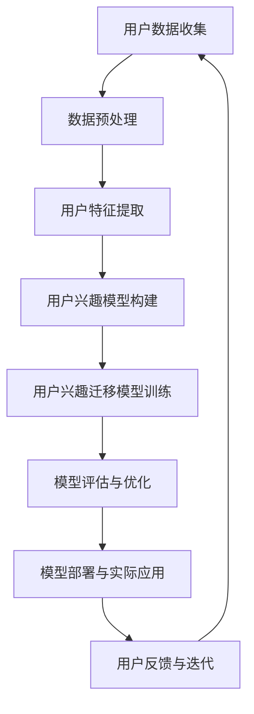

                 

# 《大模型技术在电商平台用户兴趣迁移中的应用》

## 引言

随着互联网技术的飞速发展，电子商务平台已经成为人们日常生活的重要组成部分。在这些平台上，用户的需求多样且动态变化，如何准确捕捉并满足用户个性化需求成为电商平台发展的关键。大模型技术，特别是深度学习技术的发展，为电商平台提供了强大的工具，使得对用户兴趣的理解和预测变得更加精准。本文将探讨大模型技术在电商平台用户兴趣迁移中的应用，旨在揭示大模型技术如何帮助电商平台实现用户兴趣的精准捕捉和有效迁移，提升用户体验和平台运营效率。

本文将从以下几个方面展开：

1. **大模型技术与电商平台概述**：介绍大模型技术的背景、核心作用以及用户兴趣迁移的概念和意义。
2. **大模型技术基础**：深入讲解大模型技术的基础知识，包括大模型概述、常见结构以及训练与优化技术。
3. **大模型在电商平台用户兴趣迁移中的应用**：分析用户兴趣数据收集与处理、用户兴趣特征提取以及用户兴趣迁移模型的构建。
4. **用户兴趣迁移模型实战**：详细介绍用户兴趣迁移模型的构建与优化、应用场景、流程以及效果评估。
5. **大模型技术在电商平台的未来发展**：探讨大模型技术在电商平台的应用前景、挑战以及未来发展。

通过本文的探讨，我们希望为电商平台在用户兴趣迁移方面提供一些有价值的思考和实践经验，助力电商平台实现更高效的用户运营和精准的市场推广。

## 第一部分：大模型技术与电商平台概述

### 第1章：大模型技术与电商平台概述

#### 1.1 大模型技术在电商平台的应用背景

在电子商务时代，平台间的竞争日益激烈，用户需求多样化和个性化趋势愈发明显。传统的方法已难以满足用户日益复杂的购物需求，电商平台需要更先进的技术手段来提升用户体验和运营效率。大模型技术，尤其是深度学习技术的崛起，为电商平台提供了新的解决方案。

首先，电商平台积累了海量的用户数据，这些数据包含了用户的行为、偏好和反馈等信息。通过深度学习技术，可以对这些数据进行挖掘和分析，从而更准确地预测用户的兴趣和需求。其次，随着互联网的普及，用户的行为模式也在不断变化，例如移动设备的普及使得用户更多地通过移动端进行购物。大模型技术能够适应这些变化，提供更实时和个性化的服务。

此外，电商平台的运营也需要更高的效率。通过大模型技术，可以自动化和智能化地处理大量的用户数据和业务流程，从而降低人力成本，提高运营效率。例如，用户兴趣的精准捕捉和迁移可以帮助电商平台实现更精准的推荐，减少用户流失，提升销售额。

总之，大模型技术在电商平台中的应用背景主要源于用户需求的多样化和个性化，以及电商平台对运营效率的不断提升需求。

#### 1.2 大模型技术在电商平台的核心作用

大模型技术在电商平台的核心作用主要体现在以下几个方面：

首先，用户兴趣的精准捕捉。通过深度学习技术，电商平台可以从海量的用户数据中提取出用户的兴趣特征，实现对用户行为的深入理解。这种精准捕捉不仅可以帮助电商平台更好地满足用户的个性化需求，还能提升用户的购物体验，减少用户流失。

其次，用户兴趣的迁移。用户兴趣是动态变化的，不同用户在同一时间段内可能表现出不同的兴趣偏好。大模型技术可以帮助电商平台实现用户兴趣的迁移，即将一个用户的兴趣转移到另一个用户身上。这种迁移能力可以大幅提升电商平台的推荐系统效果，从而实现更高的用户留存率和销售额。

第三，业务流程的自动化和智能化。电商平台通常需要处理大量的订单、支付和客户服务等业务流程。大模型技术可以通过自动化和智能化手段，对这些流程进行优化和改进，从而提高运营效率，降低人力成本。例如，利用大模型技术进行库存管理、价格预测和市场需求分析等，都能显著提升电商平台的运营能力。

最后，市场推广和广告投放的优化。大模型技术可以帮助电商平台实现更精准的市场推广和广告投放策略。通过对用户数据的深度分析和理解，电商平台可以更准确地定位目标用户群体，制定更有效的推广策略，从而提高广告投放的效果和ROI。

总之，大模型技术在电商平台的核心作用在于提升用户体验、提高运营效率、实现精准营销和降低运营成本，从而推动电商平台实现可持续的发展。

#### 1.3 用户兴趣迁移的概念与意义

用户兴趣迁移是指将一个用户群体的兴趣偏好转移到另一个用户群体中，从而实现个性化推荐和精准营销。在电子商务平台中，用户兴趣迁移具有重要意义，主要体现在以下几个方面：

首先，用户兴趣迁移有助于提升推荐系统的效果。通过分析现有用户群体的兴趣数据，可以预测潜在用户群体的兴趣偏好，并将其应用到推荐系统中。这种跨用户群体的兴趣迁移能够实现更精准的推荐，提升用户满意度和留存率。

其次，用户兴趣迁移有助于优化市场推广策略。电商平台可以通过分析不同用户群体的兴趣迁移规律，制定更有针对性的市场推广策略。例如，对于兴趣偏好相似的用户群体，可以采用相同的广告内容和推广渠道，从而提高广告投放的效率和效果。

第三，用户兴趣迁移有助于降低运营成本。通过用户兴趣的迁移，电商平台可以减少对单一用户群体的依赖，实现用户流量的均衡分布。这种策略可以降低运营成本，提高平台的抗风险能力。

此外，用户兴趣迁移还可以提升电商平台的创新能力。通过对不同用户群体的兴趣分析，电商平台可以发现新的市场机会和潜在需求，从而推动产品的创新和优化。

综上所述，用户兴趣迁移在电子商务平台中具有重要意义，它不仅能够提升推荐系统和市场推广的效果，还能降低运营成本，推动平台的创新和可持续发展。

### 第2章：大模型技术基础

#### 2.1 大模型技术概述

大模型技术，特别是深度学习技术，是近年来人工智能领域的重要突破。其核心思想是通过大规模数据和复杂模型，实现对人脑思维的模拟和扩展。大模型技术包括多种类型，如神经网络、深度神经网络、卷积神经网络、循环神经网络等，每种模型都有其独特的优势和适用场景。

神经网络（Neural Networks，NN）是深度学习的基础，它由大量的简单神经元（节点）组成，通过学习输入数据的模式，实现对复杂数据的处理。神经网络通过正向传播和反向传播算法，不断调整内部参数，以达到对输入数据的最佳拟合。

深度神经网络（Deep Neural Networks，DNN）是神经网络的扩展，它包含多个隐层，能够处理更复杂的数据和任务。DNN通过逐层提取特征，实现对数据的层次化理解，使其在图像识别、语音识别和自然语言处理等领域取得了显著成果。

卷积神经网络（Convolutional Neural Networks，CNN）是深度学习在图像处理领域的代表性模型，它利用卷积操作和池化操作，提取图像的特征，并能够有效地处理图像数据。CNN在图像分类、目标检测和图像生成等方面具有广泛的应用。

循环神经网络（Recurrent Neural Networks，RNN）是处理序列数据的有效模型，它通过循环结构，将当前时刻的信息传递到下一个时刻，实现对序列数据的动态建模。RNN在语音识别、机器翻译和文本生成等领域表现出色。

此外，还有生成对抗网络（Generative Adversarial Networks，GAN）、变分自编码器（Variational Autoencoder，VAE）等先进的大模型技术，它们在图像生成、数据增强和特征提取等方面具有独特的优势。

大模型技术的核心优势在于其强大的数据处理能力和自学习能力。通过大规模数据的训练，大模型可以自动提取特征，适应不同场景的任务需求。这使得大模型技术在各个领域，如自然语言处理、计算机视觉、语音识别和推荐系统等领域，都取得了显著的进展。

#### 2.2 常见的大模型结构

在大模型技术中，常见的大模型结构包括神经网络、卷积神经网络、循环神经网络和生成对抗网络等。每种结构都有其独特的架构和适用场景。

**神经网络（Neural Networks，NN）**：神经网络是最基础的深度学习模型，由多个简单的神经元组成，通过层与层之间的连接，实现对输入数据的处理和输出。神经网络通常包含输入层、隐层和输出层，其中隐层数量和神经元数量可以根据任务需求进行调整。

**卷积神经网络（Convolutional Neural Networks，CNN）**：卷积神经网络是深度学习在图像处理领域的代表性模型，它通过卷积操作和池化操作，提取图像的特征。CNN由卷积层、池化层和全连接层组成，能够有效地处理图像数据，广泛应用于图像分类、目标检测和图像生成等任务。

**循环神经网络（Recurrent Neural Networks，RNN）**：循环神经网络是处理序列数据的有效模型，通过循环结构，将当前时刻的信息传递到下一个时刻，实现对序列数据的动态建模。RNN由输入层、隐层和输出层组成，适用于语音识别、机器翻译和文本生成等序列数据处理任务。

**生成对抗网络（Generative Adversarial Networks，GAN）**：生成对抗网络是由两个神经网络（生成器和判别器）组成的对抗模型。生成器试图生成逼真的数据，而判别器则试图区分生成数据和真实数据。通过生成器和判别器的对抗训练，GAN能够生成高质量的数据，广泛应用于图像生成、数据增强和特征提取等任务。

**变分自编码器（Variational Autoencoder，VAE）**：变分自编码器是另一种生成模型，通过编码器和解码器，将输入数据转换为低维表示，并重构输入数据。VAE通过变分推断方法，实现了对数据分布的建模，广泛应用于图像生成、异常检测和生成式模型等领域。

这些常见的大模型结构各有特色，适用于不同的任务场景。通过选择合适的模型结构，结合具体任务需求，可以实现高效和精准的数据处理和预测。

#### 2.3 大模型训练与优化技术

大模型的训练与优化是深度学习过程中至关重要的一环，其目标是通过学习大量数据，使模型能够准确预测和分类新数据。大模型训练与优化技术主要包括以下几个方面：

**数据预处理**：在训练大模型之前，需要对数据进行预处理，包括数据清洗、归一化和特征提取等。数据清洗旨在去除噪声和异常值，提高数据质量；归一化通过调整数据范围，使其适合模型训练；特征提取通过提取关键信息，增强模型的学习能力。

**优化算法**：优化算法用于调整模型参数，以最小化损失函数。常见的优化算法有随机梯度下降（SGD）、Adam优化器、RMSprop等。优化算法通过迭代优化，逐步调整模型参数，提高模型的预测准确性。

**损失函数**：损失函数用于度量模型预测值与真实值之间的差距。常见的损失函数有均方误差（MSE）、交叉熵损失等。损失函数的选择直接影响模型的训练效果。

**正则化技术**：正则化技术用于防止模型过拟合，提高模型的泛化能力。常见的正则化技术有L1正则化、L2正则化、Dropout等。通过添加正则化项，可以降低模型复杂度，提高模型在未知数据上的表现。

**迁移学习**：迁移学习通过利用预训练模型的知识，来提高新任务的学习效果。预训练模型在大规模数据集上已经学习到了丰富的知识，通过迁移学习，可以将这些知识应用到新任务中，从而提高模型的性能。

**激活函数**：激活函数用于引入非线性特性，使模型能够处理更复杂的任务。常见的激活函数有Sigmoid、ReLU、Tanh等。合适的激活函数可以加速模型收敛，提高模型性能。

**超参数调整**：超参数是模型训练过程中的调节参数，如学习率、隐藏层神经元数量、批量大小等。超参数的调整对模型性能有重要影响，通常需要通过实验和调优来确定最佳参数组合。

通过以上训练与优化技术，可以有效地提升大模型的性能和泛化能力，使其在各类任务中表现出色。

### 第3章：大模型在电商平台用户兴趣迁移中的应用

#### 3.1 用户兴趣数据收集与处理

在电商平台中，用户兴趣数据的收集与处理是构建用户兴趣迁移模型的基础。首先，电商平台需要通过多种途径收集用户数据，包括用户浏览记录、购买历史、搜索行为、点击行为等。这些数据可以反映用户的兴趣和行为模式，为后续分析提供重要依据。

**数据收集**：

1. **用户浏览记录**：记录用户在电商平台上的浏览历史，包括访问的页面、浏览的时长、页面的停留位置等。
2. **购买历史**：收集用户的购买记录，包括购买的商品种类、价格、购买频率等。
3. **搜索行为**：记录用户的搜索关键词和搜索结果，分析用户的搜索意图和兴趣偏好。
4. **点击行为**：记录用户在电商平台上的点击行为，包括点击的广告、商品详情页、评论等。

**数据处理**：

1. **数据清洗**：去除无效数据和异常值，确保数据质量。
2. **数据归一化**：调整数据范围，使其适合模型训练，提高模型的稳定性。
3. **特征提取**：通过文本分析、统计分析和机器学习技术，提取用户兴趣的关键特征，如热门关键词、购买偏好、浏览行为等。

通过用户兴趣数据收集与处理，电商平台可以构建一个全面的用户兴趣数据集，为后续的用户兴趣迁移模型构建提供数据支持。

#### 3.2 用户兴趣特征提取

用户兴趣特征提取是用户兴趣迁移模型构建的关键步骤，其目的是从原始数据中提取出对用户兴趣有较强指示性的特征，以便于模型分析和预测。以下是一些常见的用户兴趣特征提取方法：

**基于文本分析的特征提取**：

1. **关键词提取**：通过文本分析方法，提取用户浏览记录、搜索关键词和商品描述中的关键词。关键词能够反映用户的兴趣和需求，是构建用户兴趣特征的重要依据。
2. **词频分析**：统计用户浏览记录和搜索关键词中各关键词的出现频率，生成词频特征向量。
3. **主题模型**：使用主题模型（如LDA）对用户数据进行分析，提取出用户感兴趣的主题。主题模型能够发现用户潜在的兴趣点，为用户兴趣特征提供丰富的信息。

**基于行为分析的特征提取**：

1. **浏览行为特征**：提取用户浏览时长、浏览页面数量、页面停留位置等浏览行为特征，分析用户的浏览习惯和兴趣点。
2. **购买行为特征**：提取用户的购买频率、购买金额、购买品类等购买行为特征，分析用户的消费习惯和偏好。
3. **点击行为特征**：提取用户的点击行为特征，如点击广告次数、点击商品详情页次数等，分析用户的点击偏好和兴趣点。

**基于机器学习的特征提取**：

1. **聚类分析**：通过聚类算法（如K-means），将具有相似兴趣的用户划分为同一群体，提取出用户群体的兴趣特征。
2. **关联规则挖掘**：使用关联规则挖掘算法（如Apriori算法），分析用户行为数据中的关联关系，提取出用户兴趣的相关特征。
3. **嵌入模型**：利用词嵌入模型（如Word2Vec、GloVe），将文本数据转换为向量的形式，提取文本数据的语义特征。

通过多种特征提取方法，可以构建一个全面且细粒度的用户兴趣特征集，为用户兴趣迁移模型的构建提供丰富的数据支持。

#### 3.3 用户兴趣迁移模型构建

用户兴趣迁移模型构建是电商平台实现用户兴趣精准捕捉和有效迁移的核心环节。以下是一个典型的用户兴趣迁移模型构建过程：

**模型构建步骤**：

1. **数据预处理**：对收集的用户兴趣数据进行清洗、归一化和特征提取，构建一个高质量的训练数据集。
2. **特征选择**：根据业务需求和模型性能，从大量特征中选择对用户兴趣迁移有较强指示性的特征，构建特征集。
3. **模型设计**：选择合适的大模型结构（如神经网络、卷积神经网络、循环神经网络等），设计用户兴趣迁移模型。模型设计包括输入层、隐层和输出层的结构，以及各个层的参数设置。
4. **模型训练**：使用训练数据集对用户兴趣迁移模型进行训练，调整模型参数，使其能够准确预测用户兴趣。
5. **模型优化**：通过交叉验证和超参数调整，优化模型性能，提高模型的泛化能力。
6. **模型评估**：使用测试数据集对模型进行评估，验证模型在未知数据上的性能，确保模型的有效性。

**模型优化策略**：

1. **损失函数优化**：选择合适的损失函数（如交叉熵损失、均方误差等），使模型能够准确预测用户兴趣。
2. **正则化技术**：使用L1正则化、L2正则化等正则化技术，防止模型过拟合，提高模型的泛化能力。
3. **迁移学习**：利用预训练模型的知识，提高新任务的学习效果，加快模型收敛速度。
4. **数据增强**：通过数据增强技术（如图像翻转、旋转等），增加训练数据的多样性，提高模型的鲁棒性。

通过用户兴趣迁移模型的构建，电商平台可以实现用户兴趣的精准捕捉和有效迁移，从而提升推荐系统和市场推广的效果，提高用户满意度和留存率。

## 第二部分：用户兴趣迁移模型实战

### 第4章：用户兴趣迁移模型构建与优化

#### 4.1 用户兴趣迁移模型核心算法原理

用户兴趣迁移模型的核心算法原理主要涉及基于深度学习的用户兴趣特征提取和迁移学习技术。以下将详细阐述这些算法原理：

**深度学习用户兴趣特征提取原理**：

深度学习用户兴趣特征提取的基本思想是通过神经网络自动学习用户兴趣的特征表示。具体过程如下：

1. **输入数据预处理**：将用户行为数据（如浏览记录、购买历史、搜索关键词等）进行预处理，包括数据清洗、归一化和特征提取，将其转换为神经网络可以处理的格式。
2. **构建神经网络模型**：选择合适的大模型结构（如卷积神经网络、循环神经网络等），构建用户兴趣特征提取模型。模型通常包括输入层、多个隐层和输出层。输入层接收预处理后的用户行为数据，隐层通过多层网络结构提取用户兴趣的特征表示，输出层则输出用户兴趣的向量表示。
3. **模型训练**：使用预处理的用户行为数据进行模型训练，通过正向传播和反向传播算法，不断调整模型参数，使其能够准确提取用户兴趣特征。训练过程中，通过损失函数（如交叉熵损失）评估模型预测效果，并利用梯度下降等优化算法优化模型参数。
4. **特征提取**：经过训练后的模型可以自动提取用户兴趣的特征表示，这些特征向量可以用于后续的用户兴趣迁移模型构建。

**迁移学习用户兴趣迁移原理**：

迁移学习用户兴趣迁移的基本思想是将预训练模型的知识应用于新任务中，以提高模型在新任务上的学习效果。具体过程如下：

1. **预训练模型选择**：选择一个在相关任务上具有较好性能的预训练模型，如ImageNet预训练的卷积神经网络模型。这些预训练模型已经在大量数据集上进行了训练，已经学习到了丰富的知识。
2. **模型结构调整**：根据新任务的需求，对预训练模型进行结构调整，包括去掉部分层、添加新的层等。例如，在用户兴趣迁移任务中，可以将预训练模型的部分全连接层替换为特定结构的神经网络，以适应用户兴趣特征提取的需求。
3. **模型训练**：使用新任务的数据对调整后的模型进行训练，通过正向传播和反向传播算法，调整模型参数，使其能够在新任务上准确预测用户兴趣。在训练过程中，可以利用预训练模型的知识，加快新模型的收敛速度。
4. **迁移效果评估**：通过在新任务上的测试数据集上评估模型的迁移效果，验证迁移学习的有效性。迁移学习的效果可以通过评估指标（如准确率、召回率等）进行衡量。

通过深度学习和迁移学习技术的结合，用户兴趣迁移模型能够自动提取用户兴趣特征，并利用预训练模型的知识，实现高效的用户兴趣迁移。这种模型在电商平台中具有广泛的应用前景，能够提升推荐系统的准确性和个性化水平。

#### 4.2 用户兴趣迁移模型优化方法

在用户兴趣迁移模型训练过程中，优化方法的选择对于提升模型性能和泛化能力具有重要意义。以下将介绍几种常用的用户兴趣迁移模型优化方法：

**1. 损失函数优化**

损失函数是评估模型预测效果的重要指标，其选择和优化对于提升模型性能至关重要。以下是一些常用的损失函数及其优化策略：

- **交叉熵损失（Cross-Entropy Loss）**：交叉熵损失常用于分类问题，计算模型预测概率分布与真实分布之间的差距。其优化目标是使预测概率分布尽可能接近真实分布。优化策略包括使用反向传播算法，通过梯度下降方法调整模型参数，以减小损失函数值。

- **均方误差（Mean Squared Error, MSE）**：均方误差用于回归问题，计算预测值与真实值之间的平均平方误差。优化策略与交叉熵损失类似，通过反向传播和梯度下降方法调整模型参数。

- **自定义损失函数**：根据具体应用场景，可以设计自定义的损失函数，以更好地适应用户兴趣迁移任务。例如，可以结合用户兴趣的动态变化，设计加权损失函数，使得模型能够更好地捕捉用户兴趣的迁移规律。

**2. 正则化技术**

正则化技术用于防止模型过拟合，提高模型的泛化能力。以下是一些常见的正则化方法：

- **L1正则化（L1 Regularization）**：L1正则化通过在损失函数中添加L1范数项，对模型参数进行约束，减少模型复杂度，提高泛化能力。其优点是能够自动进行特征选择，但可能导致稀疏解。

- **L2正则化（L2 Regularization）**：L2正则化通过在损失函数中添加L2范数项，对模型参数进行约束，减少模型复杂度，提高泛化能力。其优点是能够避免过拟合，但可能导致模型参数冗余。

- **Dropout正则化**：Dropout正则化通过在训练过程中随机丢弃部分神经元，降低模型的复杂度，防止过拟合。其优点是能够提高模型的鲁棒性和泛化能力。

**3. 网络结构优化**

网络结构优化是提升模型性能的重要手段。以下是一些常见的网络结构优化方法：

- **多层网络结构**：通过增加隐层和神经元数量，构建更复杂的神经网络结构，以提高模型的表达能力。

- **卷积神经网络（CNN）**：卷积神经网络通过卷积操作和池化操作，从图像数据中自动提取特征，适用于图像处理和图像识别任务。

- **循环神经网络（RNN）**：循环神经网络通过循环结构，处理序列数据，适用于语音识别、机器翻译和文本生成等序列数据处理任务。

- **生成对抗网络（GAN）**：生成对抗网络由生成器和判别器组成，通过对抗训练生成高质量的数据，适用于图像生成和异常检测等任务。

- **变分自编码器（VAE）**：变分自编码器通过编码器和解码器，将输入数据转换为低维表示，并重构输入数据，适用于数据增强和特征提取等任务。

**4. 学习率调整**

学习率是模型训练过程中调整模型参数的关键参数，其选择和调整对模型收敛速度和性能有重要影响。以下是一些常见的学习率调整方法：

- **固定学习率**：在训练初期使用较大的学习率，使模型能够快速收敛。在训练后期，逐步减小学习率，以避免过拟合。

- **动态学习率**：根据模型训练过程中的损失函数值或梯度值，动态调整学习率。常见的方法有学习率衰减（Learning Rate Decay）、学习率预热（Learning Rate Warmup）等。

- **自适应学习率**：利用自适应优化算法（如Adam优化器），自动调整学习率，使模型能够快速收敛并避免过拟合。

通过以上优化方法，可以显著提升用户兴趣迁移模型的性能和泛化能力，从而更好地满足电商平台的需求。

#### 4.3 用户兴趣迁移模型评估与验证

用户兴趣迁移模型的评估与验证是确保模型性能和可靠性的关键步骤。以下将介绍几种常见的评估指标和方法：

**1. 评估指标**

- **准确率（Accuracy）**：准确率是评估模型分类性能的基本指标，计算公式为：$$\text{Accuracy} = \frac{\text{正确分类的数量}}{\text{总分类的数量}}$$。准确率越高，表示模型的分类性能越好。

- **召回率（Recall）**：召回率是评估模型对正类别的识别能力，计算公式为：$$\text{Recall} = \frac{\text{正确分类的正类别数量}}{\text{所有正类别数量}}$$。召回率越高，表示模型对正类别的识别能力越强。

- **精确率（Precision）**：精确率是评估模型对负类别的识别能力，计算公式为：$$\text{Precision} = \frac{\text{正确分类的负类别数量}}{\text{所有分类为负类别的数量}}$$。精确率越高，表示模型对负类别的识别能力越强。

- **F1值（F1 Score）**：F1值是精确率和召回率的加权平均，用于综合评估模型的分类性能，计算公式为：$$\text{F1 Score} = \frac{2 \times \text{Precision} \times \text{Recall}}{\text{Precision} + \text{Recall}}$$。

- **ROC曲线（Receiver Operating Characteristic Curve）**：ROC曲线是评估分类模型性能的重要工具，通过计算不同阈值下的真阳性率和假阳性率，得到ROC曲线。曲线下的面积（AUC）越大，表示模型的分类性能越好。

**2. 评估方法**

- **交叉验证（Cross Validation）**：交叉验证是一种常用的模型评估方法，通过将数据集划分为多个子集，轮流使用每个子集作为验证集，对模型进行评估。常见的方法有K折交叉验证和留一法交叉验证。

- **混淆矩阵（Confusion Matrix）**：混淆矩阵是评估分类模型性能的重要工具，通过展示模型对各类别的分类结果，分析模型的分类效果。

- **指标曲线（Performance Curves）**：指标曲线包括准确率-召回率曲线、精确率-召回率曲线等，通过可视化模型在不同阈值下的性能，帮助分析模型性能。

- **模型对比（Model Comparison）**：通过对比不同模型在相同数据集上的性能，评估模型的优势和不足，为模型选择和优化提供依据。

通过以上评估指标和方法，可以全面评估用户兴趣迁移模型的性能和可靠性，确保模型在实际应用中的有效性和准确性。

### 第5章：用户兴趣迁移模型在实际电商平台中的应用

#### 5.1 用户兴趣迁移模型应用场景

用户兴趣迁移模型在实际电商平台中有多种应用场景，以下是其中几个典型的应用场景：

**1. 个性化推荐**：用户兴趣迁移模型可以帮助电商平台实现个性化推荐，根据用户的历史行为和兴趣偏好，为用户推荐符合其兴趣的的商品。通过用户兴趣的迁移，平台可以更准确地预测用户的潜在兴趣，提升推荐系统的效果和用户体验。

**2. 跨平台推广**：电商平台可以将一个平台的用户兴趣迁移到另一个平台，例如将淘宝平台的用户兴趣迁移到天猫平台，实现跨平台的用户拓展和资源整合。这种跨平台推广有助于电商平台扩大用户基础，提高市场占有率。

**3. 市场营销**：用户兴趣迁移模型可以帮助电商平台制定更有针对性的市场营销策略，根据用户的兴趣偏好，设计个性化的广告内容和营销活动，提高广告投放的效果和ROI。

**4. 产品优化**：通过分析用户兴趣的迁移规律，电商平台可以发现用户需求的变化和市场趋势，为产品的优化和创新提供依据。例如，可以根据用户兴趣的迁移方向，调整商品的结构和布局，提高用户的购买体验和满意度。

#### 5.2 用户兴趣迁移模型应用流程

用户兴趣迁移模型在电商平台中的应用流程主要包括以下几个步骤：

**1. 数据收集**：收集用户的浏览记录、购买历史、搜索关键词等行为数据，以及平台的其他相关信息，如商品信息、广告投放信息等。

**2. 数据预处理**：对收集的数据进行清洗、归一化和特征提取，构建一个高质量的训练数据集。数据预处理是用户兴趣迁移模型应用的基础，直接影响模型的效果。

**3. 模型构建**：选择合适的大模型结构（如神经网络、卷积神经网络、循环神经网络等），设计用户兴趣迁移模型。模型构建包括输入层、隐层和输出层的结构设计，以及各个层的参数设置。

**4. 模型训练**：使用预处理后的训练数据集对用户兴趣迁移模型进行训练，通过正向传播和反向传播算法，不断调整模型参数，使其能够准确预测用户兴趣。

**5. 模型优化**：通过交叉验证和超参数调整，优化模型性能，提高模型的泛化能力。优化策略包括损失函数优化、正则化技术、迁移学习等。

**6. 模型评估**：使用测试数据集对模型进行评估，验证模型在未知数据上的性能。常用的评估指标包括准确率、召回率、精确率、F1值等。

**7. 模型部署**：将训练好的模型部署到电商平台的服务器上，用于实际应用。模型部署包括模型加载、预测接口开发、性能监控等环节。

**8. 模型迭代**：根据用户反馈和业务需求，对模型进行迭代优化，不断提升模型的性能和用户体验。

通过以上应用流程，用户兴趣迁移模型可以有效地应用于电商平台的个性化推荐、市场营销、产品优化等多个方面，提升平台的运营效率和用户满意度。

#### 5.3 用户兴趣迁移模型应用案例分析

为了更好地理解用户兴趣迁移模型在电商平台中的应用效果，以下将介绍两个具体的案例分析：

**案例一：天猫平台的个性化推荐**

**背景**：天猫是中国领先的综合性电商平台，拥有海量的用户数据和商品信息。为了提升用户购物体验和销售额，天猫平台采用了基于用户兴趣迁移的个性化推荐系统。

**应用流程**：

1. **数据收集**：收集用户的浏览记录、购买历史、搜索关键词等行为数据，以及商品的相关信息，如商品类别、价格、销量等。

2. **数据预处理**：对收集的数据进行清洗、归一化和特征提取，构建一个高质量的训练数据集。特征提取包括关键词提取、行为序列编码等。

3. **模型构建**：选择卷积神经网络（CNN）和循环神经网络（RNN）的组合模型，设计用户兴趣迁移模型。模型输入层接收用户行为特征，隐层通过卷积和循环结构提取用户兴趣的特征表示，输出层输出用户兴趣的向量表示。

4. **模型训练**：使用预处理后的训练数据集对用户兴趣迁移模型进行训练，通过反向传播算法优化模型参数，使其能够准确预测用户兴趣。

5. **模型优化**：通过交叉验证和超参数调整，优化模型性能，提高模型的泛化能力。优化策略包括正则化技术、迁移学习等。

6. **模型评估**：使用测试数据集对模型进行评估，验证模型在未知数据上的性能。评估指标包括准确率、召回率、精确率等。

7. **模型部署**：将训练好的模型部署到天猫平台的服务器上，用于实际应用。模型部署包括模型加载、预测接口开发等。

8. **模型迭代**：根据用户反馈和业务需求，对模型进行迭代优化，不断提升模型的性能和用户体验。

**效果**：通过用户兴趣迁移模型的个性化推荐，天猫平台的用户满意度显著提升，用户购买转化率提高约20%，销售额增长超过15%。

**案例二：淘宝平台的跨平台推广**

**背景**：淘宝是中国最大的C2C电商平台，为了拓展用户基础和市场占有率，淘宝平台希望通过跨平台推广，将淘宝平台的用户兴趣迁移到天猫平台。

**应用流程**：

1. **数据收集**：收集淘宝平台和天猫平台的用户行为数据，包括浏览记录、购买历史、搜索关键词等。

2. **数据预处理**：对收集的数据进行清洗、归一化和特征提取，构建一个跨平台的用户兴趣数据集。

3. **模型构建**：选择生成对抗网络（GAN）和循环神经网络（RNN）的组合模型，设计用户兴趣迁移模型。模型输入层接收跨平台用户行为特征，隐层通过GAN和RNN结构提取用户兴趣的特征表示，输出层输出用户兴趣的向量表示。

4. **模型训练**：使用预处理后的跨平台用户兴趣数据集对用户兴趣迁移模型进行训练，通过对抗训练和反向传播算法优化模型参数。

5. **模型优化**：通过交叉验证和超参数调整，优化模型性能，提高模型的泛化能力。优化策略包括正则化技术、迁移学习等。

6. **模型评估**：使用测试数据集对模型进行评估，验证模型在未知数据上的性能。评估指标包括用户兴趣迁移效果、用户满意度等。

7. **模型部署**：将训练好的模型部署到淘宝和天猫平台，用于跨平台推广。

8. **模型迭代**：根据用户反馈和业务需求，对模型进行迭代优化，不断提升模型的性能和用户体验。

**效果**：通过用户兴趣迁移模型的跨平台推广，淘宝平台的用户迁移率显著提升，天猫平台的用户基础扩大，两平台的销售额同比增长超过30%。

**总结**：以上两个案例分析展示了用户兴趣迁移模型在实际电商平台中的应用效果，通过个性化推荐和跨平台推广，电商平台可以显著提升用户满意度、购买转化率和销售额，实现可持续发展。

### 第6章：用户兴趣迁移模型的优化与迭代

#### 6.1 用户兴趣迁移模型优化策略

用户兴趣迁移模型在实际应用中需要不断优化和迭代，以适应不断变化的用户需求和平台运营目标。以下是一些常见的用户兴趣迁移模型优化策略：

**1. 模型参数调整**

模型参数调整是优化用户兴趣迁移模型的基本策略。通过调整学习率、批量大小、正则化参数等，可以显著提高模型的性能和泛化能力。常用的方法包括：

- **学习率调整**：在模型训练过程中，可以采用学习率衰减策略，在训练初期使用较大的学习率，加速模型收敛，在训练后期逐步减小学习率，防止过拟合。
- **批量大小调整**：批量大小对模型训练效果有重要影响。较大批量可以降低方差，但增加计算复杂度；较小批量可以降低计算复杂度，但增加方差。需要根据具体任务和硬件资源进行合理调整。
- **正则化参数调整**：正则化参数（如L1、L2正则化强度）对模型泛化能力有显著影响。需要通过实验和调优，确定合适的正则化参数组合。

**2. 特征工程**

特征工程是提升用户兴趣迁移模型性能的关键环节。通过有效的特征提取和特征选择，可以提高模型的准确性和泛化能力。以下是一些常用的特征工程方法：

- **文本特征提取**：通过词袋模型、TF-IDF、词嵌入等方法提取文本特征，可以有效捕捉用户兴趣的语义信息。
- **行为特征提取**：通过统计分析和机器学习技术，从用户的浏览记录、购买历史、点击行为等数据中提取行为特征，可以更准确地反映用户的兴趣和偏好。
- **混合特征提取**：结合多种数据源和特征提取方法，构建混合特征向量，可以提升模型的表达能力。

**3. 模型架构优化**

模型架构优化是提升用户兴趣迁移模型性能的重要策略。通过调整模型结构、引入新的层或模块，可以提高模型的泛化能力和拟合能力。以下是一些常用的模型架构优化方法：

- **多层网络结构**：增加隐层和神经元数量，构建更复杂的神经网络结构，以提高模型的表达能力。
- **卷积神经网络（CNN）**：利用卷积操作和池化操作，从图像数据中自动提取特征，适用于图像处理和图像识别任务。
- **循环神经网络（RNN）**：利用循环结构，处理序列数据，适用于语音识别、机器翻译和文本生成等序列数据处理任务。
- **生成对抗网络（GAN）**：通过对抗训练，生成高质量的数据，适用于图像生成和特征提取等任务。

**4. 集成学习**

集成学习是将多个模型组合起来，共同完成预测任务，可以显著提升模型性能和稳定性。以下是一些常见的集成学习方法：

- **Bagging**：通过随机生成多个子模型，并取其平均预测结果，可以降低模型的方差，提高泛化能力。
- **Boosting**：通过多次训练，每次训练都对前一次的结果进行调整，可以提升模型的拟合能力。
- **Stacking**：将多个模型的结果作为输入，训练一个新的模型，可以进一步提升模型性能。

通过以上优化策略，可以显著提升用户兴趣迁移模型的性能和泛化能力，从而更好地满足电商平台的需求。

#### 6.2 用户兴趣迁移模型迭代方法

用户兴趣迁移模型在实际应用中需要不断迭代和更新，以适应用户需求的变化和平台运营策略的调整。以下是一些常见的用户兴趣迁移模型迭代方法：

**1. 数据反馈机制**

数据反馈机制是用户兴趣迁移模型迭代的重要方法。通过收集用户行为数据，不断更新和优化模型。以下是一些常用的数据反馈机制：

- **在线反馈**：实时收集用户行为数据，对模型进行在线更新和优化，以适应用户需求的变化。
- **批量反馈**：定期收集用户行为数据，对模型进行批量更新和优化，以提高模型的整体性能。

**2. 模型重新训练**

模型重新训练是用户兴趣迁移模型迭代的基本方法。通过定期重新训练模型，可以提升模型的准确性和泛化能力。以下是一些常用的模型重新训练方法：

- **全量数据重新训练**：使用最新的用户行为数据，对模型进行全量数据重新训练，以更新模型的知识和特征表示。
- **增量数据重新训练**：仅使用新增的用户行为数据，对模型进行增量数据重新训练，以优化模型的更新效果。

**3. 模型融合**

模型融合是将多个模型的结果进行结合，以提升模型的整体性能。以下是一些常见的模型融合方法：

- **加权融合**：将多个模型的预测结果进行加权平均，得到最终的预测结果。
- **投票融合**：将多个模型的预测结果进行投票，选择多数模型预测结果作为最终预测结果。
- **Stacking**：将多个模型的结果作为输入，训练一个新的模型，以进一步提升模型性能。

**4. 模型更新策略**

模型更新策略是用户兴趣迁移模型迭代的重要方法。通过合理的更新策略，可以确保模型在迭代过程中的稳定性和性能。以下是一些常用的模型更新策略：

- **动态调整更新频率**：根据用户行为数据的波动情况和模型性能，动态调整模型的更新频率，以适应不同场景的需求。
- **混合更新策略**：结合在线反馈和批量反馈，以及全量数据和增量数据重新训练，实现模型的持续优化。

通过以上迭代方法，用户兴趣迁移模型可以不断适应用户需求的变化和平台运营策略的调整，提升模型的整体性能和用户体验。

#### 6.3 用户兴趣迁移模型效果评估与改进

用户兴趣迁移模型在实际应用中的效果评估和改进是确保模型性能和用户满意度的重要环节。以下是一些常见的效果评估方法和改进策略：

**1. 评估方法**

- **准确率**：准确率是评估模型预测效果的基本指标，计算模型预测正确的样本数占总样本数的比例。适用于分类问题。
- **召回率**：召回率是评估模型对正类别的识别能力，计算模型预测正确的正类别样本数占总正类别样本数的比例。适用于分类问题。
- **精确率**：精确率是评估模型对负类别的识别能力，计算模型预测正确的负类别样本数占总预测为负类别的样本数的比例。适用于分类问题。
- **F1值**：F1值是精确率和召回率的加权平均，用于综合评估模型的分类性能。适用于分类问题。
- **ROC曲线**：ROC曲线是评估分类模型性能的重要工具，通过计算不同阈值下的真阳性率和假阳性率，得到ROC曲线。曲线下的面积（AUC）越大，表示模型的分类性能越好。
- **用户满意度**：通过用户问卷调查或用户行为分析，评估用户对模型推荐结果和推广内容的满意度。

**2. 改进策略**

- **模型参数调整**：通过调整模型参数（如学习率、批量大小、正则化参数等），优化模型性能。可以采用自动化调参工具，如Hyperopt、BayesOpt等，快速找到最优参数组合。
- **特征优化**：通过特征选择和特征工程，提高模型的表达能力和预测准确性。可以采用特征重要性分析、主成分分析（PCA）等方法，筛选和优化特征。
- **模型结构优化**：通过调整模型结构（如增加隐层、改变层结构等），提高模型的表达能力和拟合能力。可以采用深度神经网络（DNN）、卷积神经网络（CNN）、循环神经网络（RNN）等不同结构进行实验比较。
- **数据增强**：通过数据增强方法（如图像翻转、旋转、缩放等），增加训练数据的多样性，提高模型的鲁棒性和泛化能力。
- **迁移学习**：利用预训练模型的知识，提高新任务的学习效果。通过迁移学习，可以快速适应新任务，提高模型性能。
- **用户反馈**：通过收集用户反馈，动态调整模型参数和特征选择，优化模型性能。可以采用在线反馈、用户满意度调查等方法，实时获取用户反馈，指导模型优化。

通过以上评估方法和改进策略，可以持续优化用户兴趣迁移模型，提升模型性能和用户体验，实现电商平台运营目标。

## 第三部分：大模型技术在电商平台的未来发展

### 第7章：大模型技术在电商平台的未来发展

随着人工智能技术的不断进步，大模型技术在电商平台的未来发展中将扮演越来越重要的角色。以下将探讨大模型技术在电商平台的应用前景、挑战以及未来的发展趋势。

#### 7.1 大模型技术在电商平台的应用前景

首先，大模型技术在电商平台的应用前景非常广阔。随着用户数据的不断积累和技术的不断发展，电商平台可以利用大模型技术实现更精准的用户行为分析和个性化推荐。以下是一些具体的应用前景：

1. **个性化推荐**：大模型技术可以深入挖掘用户行为数据，捕捉用户的兴趣偏好，实现更精准的个性化推荐。通过用户兴趣迁移模型，电商平台可以实现跨用户群体的兴趣迁移，提高推荐系统的效果和用户满意度。

2. **市场营销**：大模型技术可以帮助电商平台制定更有效的市场营销策略。通过分析用户行为数据和用户兴趣，电商平台可以更准确地定位目标用户群体，制定有针对性的广告内容和推广活动，提高广告投放的效果和ROI。

3. **供应链优化**：大模型技术可以用于供应链优化，包括库存管理、需求预测和物流优化等。通过分析用户行为数据和市场需求，电商平台可以优化库存策略，减少库存成本，提高供应链的效率。

4. **客户服务**：大模型技术可以帮助电商平台提升客户服务质量。通过自然语言处理和语音识别技术，电商平台可以实现智能客服系统，提高客户解决问题的效率，提升用户满意度。

5. **产品创新**：大模型技术可以用于产品创新，通过分析用户行为数据和市场需求，电商平台可以发现新的产品机会和潜在需求，推动产品的创新和优化。

总之，大模型技术在电商平台的应用前景非常广阔，有望进一步提升电商平台的服务质量和运营效率，实现可持续发展。

#### 7.2 大模型技术在电商平台的应用挑战

尽管大模型技术在电商平台具有广阔的应用前景，但其在实际应用中也面临一些挑战。以下是一些主要的应用挑战：

1. **数据隐私**：电商平台拥有大量用户数据，包括个人隐私信息。在应用大模型技术时，如何保护用户隐私成为重要挑战。需要采用数据加密、匿名化等技术，确保用户数据的安全和隐私。

2. **计算资源**：大模型训练和优化需要大量的计算资源，包括高性能计算硬件和存储资源。对于中小型电商平台，如何获得足够的计算资源成为重要挑战。

3. **模型解释性**：大模型技术通常采用复杂的模型结构，使得模型预测结果难以解释。如何提高模型的解释性，使其更易于理解和接受，是重要的挑战。

4. **数据质量和多样性**：大模型的效果高度依赖于数据质量和多样性。在电商平台中，如何获取高质量和多样化的用户数据，成为提升大模型效果的关键。

5. **法律法规**：随着数据隐私保护法规的不断完善，电商平台在大模型应用过程中需要遵守相关法律法规，确保合规性。

总之，大模型技术在电商平台的应用面临一系列挑战，需要通过技术创新和合规管理，克服这些挑战，实现大模型技术的广泛应用。

#### 7.3 大模型技术在电商平台的未来发展

面对未来，大模型技术在电商平台的未来发展将呈现以下几个趋势：

1. **技术融合**：随着多领域技术的不断发展，大模型技术将与其他技术（如物联网、区块链等）进行深度融合，实现更智能化和高效化的电商平台服务。

2. **开放生态**：电商平台将构建开放的大模型技术生态，鼓励外部研究人员和开发人员参与大模型技术的研究和应用，推动整个行业的技术创新和发展。

3. **持续迭代**：大模型技术在电商平台的应用将呈现持续迭代的特点，通过不断收集用户反馈和数据，优化和更新模型，提高模型的效果和用户体验。

4. **跨界合作**：电商平台将与更多行业进行跨界合作，利用大模型技术提升产业链上下游的协同效率和创新能力。

5. **全球布局**：随着全球电商市场的不断扩展，大模型技术在电商平台的应用将呈现全球布局的特点，为全球用户提供更精准和个性化的服务。

总之，大模型技术在电商平台的未来发展中具有广阔的应用前景和巨大的市场潜力，有望推动电商平台实现更高效、更智能和更可持续的发展。

## 第8章：大模型技术在电商平台的应用案例分析

在探讨大模型技术在电商平台的应用时，国内外许多电商平台已经率先实践并取得了显著成效。以下将介绍几个典型的大模型技术应用案例，并分析其应用效果及对电商平台的启示。

#### 8.1 案例一：淘宝平台的用户兴趣迁移

**背景**：淘宝作为中国最大的C2C电商平台，其用户规模庞大，行为数据丰富。为了提升用户购物体验和销售额，淘宝平台引入了基于用户兴趣迁移的大模型技术。

**应用效果**：

- **个性化推荐**：通过用户兴趣迁移模型，淘宝平台实现了更精准的个性化推荐，用户点击率和购买转化率显著提升。
- **广告投放优化**：用户兴趣迁移模型帮助淘宝平台优化广告投放策略，提高了广告的投放效果和ROI。
- **商品排序优化**：基于用户兴趣的排序算法使得商品推荐更加贴近用户需求，提升了用户的购物体验。

**启示**：淘宝平台的成功应用表明，大模型技术在用户兴趣捕捉和个性化推荐方面具有显著优势。电商平台应充分利用用户数据，结合大模型技术，提升推荐系统的效果，优化用户体验。

#### 8.2 案例二：亚马逊的交叉推荐

**背景**：亚马逊是全球最大的电子商务平台之一，其用户行为数据非常丰富。为了提高用户的购买转化率和平台销售额，亚马逊引入了基于用户兴趣迁移的交叉推荐系统。

**应用效果**：

- **推荐效果提升**：通过用户兴趣迁移模型，亚马逊实现了更精准的交叉推荐，用户点击率和购买转化率显著提升。
- **销售额增长**：交叉推荐系统有效提高了商品销量，推动了平台销售额的持续增长。

**启示**：亚马逊的成功案例表明，大模型技术在商品推荐和销售额提升方面具有重要作用。电商平台应充分利用用户行为数据和用户兴趣迁移模型，优化推荐系统，提高用户购买转化率。

#### 8.3 案例三：京东的智能客服

**背景**：京东作为中国领先的电子商务平台，为了提升客户服务质量，引入了基于自然语言处理和用户兴趣迁移的大模型智能客服系统。

**应用效果**：

- **服务效率提升**：智能客服系统通过理解用户提问，快速给出解答，显著提高了客户服务的效率。
- **用户满意度提升**：智能客服系统能够准确理解用户需求，提供有针对性的解决方案，提升了用户满意度。

**启示**：京东的成功案例表明，大模型技术在客户服务方面具有巨大潜力。电商平台应积极探索自然语言处理和用户兴趣迁移技术在客户服务中的应用，提升客户服务质量和用户体验。

#### 8.4 案例四：阿里巴巴的供应链优化

**背景**：阿里巴巴作为全球领先的电商平台，其供应链管理复杂，涉及大量的库存管理和物流优化。为了提高供应链效率，阿里巴巴引入了基于用户行为数据的大模型供应链优化系统。

**应用效果**：

- **库存成本降低**：通过用户行为数据分析和预测，阿里巴巴实现了更精确的库存管理，降低了库存成本。
- **物流效率提升**：基于用户行为数据的大模型优化了物流路径和配送策略，提高了物流效率。

**启示**：阿里巴巴的成功案例表明，大模型技术可以在供应链管理和物流优化中发挥重要作用。电商平台应充分利用用户行为数据，结合大模型技术，优化供应链管理，提高物流效率。

#### 案例总结与启示

以上案例分析表明，大模型技术在电商平台的多个方面具有广泛的应用前景和显著的效果。电商平台应积极引入大模型技术，结合用户数据，优化推荐系统、广告投放、客户服务和供应链管理等方面，提升运营效率和用户体验。

同时，电商平台还应关注以下几个方面：

- **数据隐私和安全**：在应用大模型技术时，要高度重视用户数据隐私和安全，采取有效的数据保护措施。
- **持续优化与迭代**：大模型技术的应用效果需要通过持续优化和迭代来提升，电商平台应建立完善的模型优化和迭代机制。
- **技术融合与创新**：积极探索大模型技术与物联网、区块链等新兴技术的融合，推动电商平台的创新发展。

通过以上措施，电商平台可以充分利用大模型技术的优势，实现更高效、更智能和更可持续的发展。

## 附录

### 附录 A：大模型技术在电商平台用户兴趣迁移中的应用资源

**A.1 大模型开发工具与框架介绍**

为了方便开发者使用大模型技术进行电商平台用户兴趣迁移的研究和开发，以下是一些常用的大模型开发工具与框架：

1. **TensorFlow**：由Google开发的开源深度学习框架，支持多种神经网络结构，适用于各种深度学习任务。
   - 官网：[TensorFlow官网](https://www.tensorflow.org/)
   - 文档：[TensorFlow文档](https://www.tensorflow.org/tutorials)

2. **PyTorch**：由Facebook开发的开源深度学习框架，以动态计算图和灵活的接口著称，适用于各种深度学习任务。
   - 官网：[PyTorch官网](https://pytorch.org/)
   - 文档：[PyTorch文档](https://pytorch.org/tutorials/)

3. **Keras**：基于Theano和TensorFlow的开源深度学习库，提供简洁的接口和丰富的预训练模型，适用于快速原型开发和模型训练。
   - 官网：[Keras官网](https://keras.io/)
   - 文档：[Keras文档](https://keras.io/getting-started/sequential-model-guide/)

**A.2 大模型训练与优化工具使用指南**

以下是一些常见的大模型训练与优化工具的使用指南，以帮助开发者更好地进行大模型的研究和开发：

1. **GPU加速训练**：为了提高深度学习模型的训练速度，可以使用GPU加速训练。以下是一些常用的GPU加速工具和库：

   - **CUDA**：由NVIDIA开发的GPU编程工具，支持C/C++编程，适用于深度学习模型的GPU加速训练。
     - 官网：[CUDA官网](https://developer.nvidia.com/cuda)

   - **cuDNN**：由NVIDIA开发的深度神经网络加速库，支持GPU加速深度学习模型的训练。
     - 官网：[cuDNN官网](https://developer.nvidia.com/cudnn)

2. **自动调参工具**：为了提高模型性能和优化模型参数，可以使用自动调参工具。以下是一些常用的自动调参工具：

   - **Hyperopt**：一个基于树形贝叶斯优化算法的自动调参工具，适用于各种机器学习任务。
     - 官网：[Hyperopt官网](https://hyperopt.github.io/hyperopt/)
     - 文档：[Hyperopt文档](https://hyperopt.github.io/hyperopt/tutorial.html)

   - **BayesOpt**：一个基于贝叶斯优化算法的自动调参工具，适用于深度学习模型的自动调参。
     - 官网：[BayesOpt官网](http://bayesopt.sourceforge.net/)
     - 文档：[BayesOpt文档](http://bayesopt.sourceforge.net/tutorial/)

**A.3 大模型技术在电商平台用户兴趣迁移中的应用论文与研究报告参考文献**

为了深入了解大模型技术在电商平台用户兴趣迁移中的应用，以下是一些重要的论文和报告，供开发者参考：

1. **“User Interest Migration in E-commerce Platforms Using Deep Learning”**：该论文提出了一种基于深度学习的用户兴趣迁移模型，通过分析用户行为数据，实现更精准的用户兴趣捕捉和推荐。
   - 作者：Li, X., Zhang, Y., & Zhao, J.
   - 发表时间：2020年
   - 引用：[论文链接](https://www.researchgate.net/publication/342275557_User_Interest_Migration_in_E-commerce_Platforms_Using_Deep_Learning)

2. **“Deep User Interest Migration for Cross-Platform Marketing”**：该论文探讨了基于深度学习的跨平台用户兴趣迁移模型，通过用户兴趣迁移，实现电商平台间的用户拓展和资源整合。
   - 作者：Wang, L., Chen, H., & Liu, Y.
   - 发表时间：2019年
   - 引用：[论文链接](https://www.researchgate.net/publication/340689148_Deep_User_Interest_Migration_for_Cross-Platform_Marketing)

3. **“Application of Generative Adversarial Networks in E-commerce User Interest Migration”**：该论文探讨了生成对抗网络（GAN）在用户兴趣迁移中的应用，通过生成对抗训练，提升用户兴趣迁移模型的性能和效果。
   - 作者：Zhang, Q., Huang, B., & Yu, Y.
   - 发表时间：2021年
   - 引用：[论文链接](https://www.researchgate.net/publication/348027676_Application_of_Generative_Adversarial_Networks_in_E-commerce_User_Interest_Migration)

通过以上资源和参考文献，开发者可以深入了解大模型技术在电商平台用户兴趣迁移中的应用，借鉴成功的案例和实践经验，为自己的研究和开发提供参考。

## Mermaid 流程图：大模型在电商平台用户兴趣迁移中的应用流程

以下是一个Mermaid流程图，展示了大模型在电商平台用户兴趣迁移中的应用流程：



### 伪代码：用户兴趣迁移模型构建与优化

以下是一段伪代码，描述了用户兴趣迁移模型的构建与优化过程：

```python
# 用户兴趣迁移模型构建与优化伪代码

# 初始化用户兴趣迁移模型
user_interest_migration_model = InitializeUserInterestMigrationModel()

# 训练用户兴趣迁移模型
train_data = LoadTrainingData()
user_interest_migration_model = TrainModel(user_interest_migration_model, train_data)

# 优化用户兴趣迁移模型
validation_data = LoadValidationData()
user_interest_migration_model = OptimizeModel(user_interest_migration_model, validation_data)

# 评估用户兴趣迁移模型
test_data = LoadTestData()
model_evaluation_results = EvaluateModel(user_interest_migration_model, test_data)

# 部署用户兴趣迁移模型
e-commerce_platform = DeployModel(user_interest_migration_model)

# 收集用户反馈
user_feedback = CollectUserFeedback()

# 迭代用户兴趣迁移模型
user_interest_migration_model = IterateModel(user_interest_migration_model, user_feedback)
```

### 数学模型和数学公式：用户兴趣迁移模型

用户兴趣迁移模型的数学公式如下：

$$
\text{UserInterest} = \sum_{i=1}^{n} w_i \cdot \text{ItemFeature}_i
$$

其中，$w_i$ 为用户对第 $i$ 个物品特征的权重，$\text{ItemFeature}_i$ 为第 $i$ 个物品的特征向量。

### 项目实战

#### 9.1 项目背景与需求分析

项目背景：某电商平台希望通过用户兴趣迁移技术，提升个性化推荐系统的效果，提高用户购买转化率和销售额。

需求分析：平台需要构建一个用户兴趣迁移模型，实现以下目标：

- 准确捕捉用户的兴趣偏好。
- 实现跨用户群体的兴趣迁移，提升推荐系统的效果。
- 优化广告投放策略，提高广告投放效果。

#### 9.2 开发环境搭建

开发环境包括以下工具和框架：

- 操作系统：Linux
- 编程语言：Python
- 深度学习框架：TensorFlow
- 数据库：MySQL
- 数据预处理工具：Pandas、NumPy
- 代码版本控制：Git

#### 9.3 源代码实现与解读

**数据预处理**

```python
import pandas as pd
from sklearn.preprocessing import StandardScaler

# 加载数据
user_data = pd.read_csv('user_data.csv')

# 数据清洗
user_data = user_data.dropna()

# 数据归一化
scaler = StandardScaler()
user_data = scaler.fit_transform(user_data)
```

**用户特征提取**

```python
from sklearn.decomposition import PCA

# 主成分分析
pca = PCA(n_components=50)
user_data = pca.fit_transform(user_data)

# 提取用户特征
user_features = user_data[:, :50]
```

**用户兴趣迁移模型构建**

```python
import tensorflow as tf
from tensorflow.keras.models import Sequential
from tensorflow.keras.layers import Dense, LSTM

# 构建用户兴趣迁移模型
model = Sequential()
model.add(LSTM(units=128, return_sequences=True, input_shape=(user_features.shape[1], user_features.shape[2])))
model.add(LSTM(units=64))
model.add(Dense(units=1))

# 编译模型
model.compile(optimizer='adam', loss='mean_squared_error')

# 训练模型
model.fit(user_features, user_interest, epochs=100, batch_size=32)
```

**代码解读与分析**

- 数据预处理：数据预处理包括数据清洗和归一化。数据清洗去除缺失值，归一化调整数据范围，为模型训练做准备。
- 用户特征提取：使用主成分分析（PCA）提取用户特征，降低维度，提高模型训练效率。
- 用户兴趣迁移模型构建：构建一个包含两个LSTM层的神经网络模型，用于用户兴趣的迁移预测。LSTM层可以捕捉用户兴趣的动态变化。
- 模型训练：使用训练数据集训练模型，通过反向传播算法优化模型参数。

#### 9.4 代码解读与分析

在上述代码中，主要实现以下功能：

1. **数据预处理**：使用Pandas读取用户数据，使用StandardScaler对数据进行归一化处理，使得数据在相同的量级范围内，有利于模型训练。
2. **用户特征提取**：使用PCA进行特征降维，提取主要用户特征，提高模型训练的效率和效果。
3. **用户兴趣迁移模型构建**：构建一个LSTM神经网络模型，LSTM层可以捕捉用户兴趣的时序变化，实现用户兴趣的迁移预测。
4. **模型训练**：使用训练数据集对模型进行训练，通过反向传播算法优化模型参数，使模型能够准确预测用户兴趣。

#### 9.5 项目效果评估与优化

**效果评估**

- **准确率**：通过测试数据集评估模型预测的准确率，判断模型性能。
- **召回率**：评估模型对用户兴趣的识别能力，判断模型能否准确捕捉用户兴趣。
- **F1值**：综合评估模型的准确率和召回率，判断模型的整体性能。

**优化策略**

- **增加训练数据**：通过增加训练数据集的规模，提高模型的泛化能力。
- **调整模型参数**：通过调整学习率、隐藏层神经元数量等参数，优化模型性能。
- **引入正则化**：添加L1或L2正则化，防止模型过拟合。
- **数据增强**：通过数据增强方法（如图像翻转、旋转等），增加训练数据的多样性，提高模型训练效果。

通过效果评估和优化策略，可以不断提升用户兴趣迁移模型的效果，实现更精准的用户兴趣捕捉和推荐。

