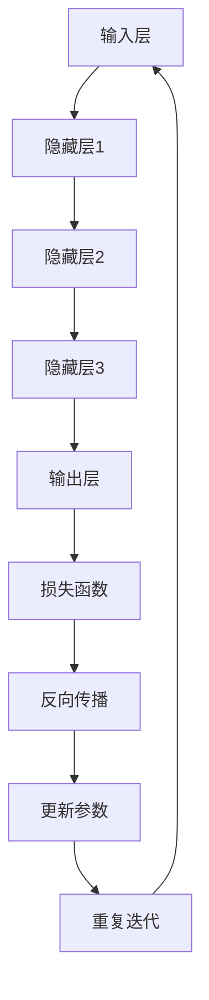
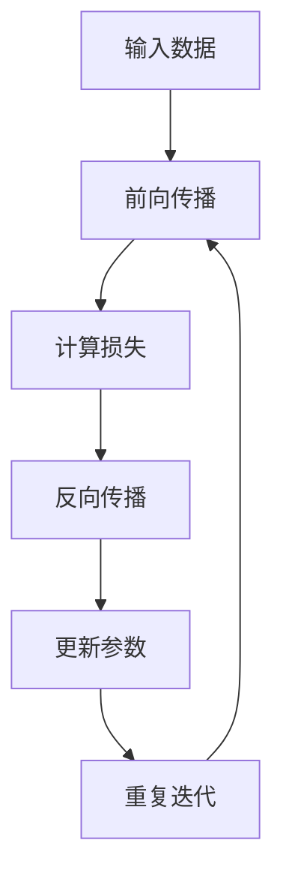

                 

# 《大模型技术的可视化呈现》

> **关键词：** 大模型技术、深度学习、自然语言处理、计算机视觉、模型优化、训练与部署

> **摘要：** 本文章深入探讨了大模型技术的核心概念、算法原理、架构设计、优化方法、训练与部署过程，并分析了其在不同领域的应用。通过多个实际项目实战案例，展示了大模型技术在开发环境搭建、源代码实现和代码解读与分析等方面的具体应用。最后，文章对大模型技术的未来发展趋势、面临的挑战以及社会影响进行了展望。

## 目录大纲

### 第一部分：大模型技术基础

#### 第1章：大模型技术概述

1.1 大模型技术的发展历程

1.2 大模型技术的重要性

1.3 大模型技术的主要类别

#### 第2章：大模型核心算法原理

2.1 深度学习基础

2.1.1 神经网络结构

2.1.2 深度学习优化算法

2.2 自然语言处理算法

2.2.1 词嵌入技术

2.2.2 序列模型与注意力机制

#### 第3章：大模型架构设计与优化

3.1 大模型架构设计原则

3.2 大模型优化方法

3.3 大模型性能评估

#### 第4章：大模型训练与部署

4.1 大模型训练过程

4.1.1 数据准备与预处理

4.1.2 训练策略与调参

4.2 大模型部署策略

4.3 大模型部署案例

### 第二部分：大模型技术实践

#### 第5章：大模型应用场景分析

5.1 大模型在自然语言处理中的应用

5.2 大模型在计算机视觉中的应用

5.3 大模型在其他领域的应用

#### 第6章：大模型项目实战

6.1 项目一：构建一个问答系统

6.2 项目二：构建一个图像识别系统

6.3 项目三：构建一个推荐系统

#### 第7章：大模型技术展望

7.1 大模型技术未来发展趋势

7.2 大模型技术面临的挑战

7.3 大模型技术的社会影响

### 附录

- 附录A：大模型技术相关工具与资源

- 附录B：常见问题解答

- 附录C：参考文献

---

### 《大模型技术的可视化呈现》详细内容

#### 第1章：大模型技术概述

## 1.1 大模型技术的发展历程

大模型技术是近年来人工智能领域的重要进展之一。从20世纪90年代的传统机器学习方法，到2012年深度学习在ImageNet竞赛中的突破，再到2018年GPT-2模型的发布，标志着大模型时代的到来。

在早期，机器学习方法主要集中在统计模型和决策树等传统算法上。然而，随着计算能力的提升和数据规模的扩大，深度学习逐渐崭露头角。2012年，AlexNet在ImageNet竞赛中获得了前所未有的成绩，这标志着深度学习时代的到来。此后，大量深度学习模型如雨后春笋般涌现，其中GPT-2的发布更是引发了人们对大模型技术的关注。

## 1.2 大模型技术的重要性

大模型技术在人工智能领域中具有重要意义。首先，它提高了数据处理能力，使得机器学习模型能够更好地处理大规模、高维度的数据。其次，大模型技术实现了更智能的机器学习应用，如自然语言处理、计算机视觉、语音识别等。最后，大模型技术的快速发展也促进了人工智能产业的蓬勃发展。

## 1.3 大模型技术的主要类别

大模型技术涵盖了多个领域，其中主要包括自然语言处理大模型、计算机视觉大模型、强化学习大模型和其他领域大模型。

自然语言处理大模型，如GPT-3、BERT等，在语言理解、文本生成、机器翻译等领域表现出色。计算机视觉大模型，如ResNet、EfficientNet等，在图像分类、目标检测、图像生成等领域具有广泛的应用。强化学习大模型，如AlphaGo、AlphaZero等，在游戏、机器人控制等领域取得了重大突破。其他领域大模型还包括在医疗诊断、金融风控、娱乐行业等领域的应用。

#### 第2章：大模型核心算法原理

## 2.1 深度学习基础

深度学习是构建大模型技术的基础。它通过多层神经网络对数据进行处理，从而实现复杂的数据特征提取和模式识别。

### 2.1.1 神经网络结构

神经网络是深度学习的基础。它由多个层次组成，包括输入层、隐藏层和输出层。

输入层接收外部数据，隐藏层对数据进行处理，输出层产生预测结果。


### 2.1.2 深度学习优化算法

深度学习优化算法用于调整模型参数，以实现更好的模型性能。常见的优化算法包括随机梯度下降（SGD）和Adam优化器。

随机梯度下降（SGD）是最常用的优化算法。它通过计算损失函数的梯度来更新模型参数。然而，SGD在训练过程中容易陷入局部最小值。为解决这一问题，引入了Adam优化器。

Adam优化器结合了SGD和动量法的优点。它通过计算一阶矩估计和二阶矩估计来更新模型参数，从而在训练过程中具有更好的收敛性。


## 2.2 自然语言处理算法

自然语言处理（NLP）是人工智能的重要领域。大模型技术在NLP领域取得了显著的进展，主要包括词嵌入技术、序列模型和注意力机制。

### 2.2.1 词嵌入技术

词嵌入是将词语映射到低维连续向量的一种技术。通过词嵌入，可以更好地表示词语之间的语义关系。

常见的词嵌入方法包括Word2Vec、GloVe等。Word2Vec基于神经网络训练，GloVe基于矩阵分解。


### 2.2.2 序列模型与注意力机制

序列模型用于处理序列数据，如文本、语音等。常见的序列模型包括循环神经网络（RNN）和长短期记忆网络（LSTM）。

注意力机制是一种对序列中的不同部分进行权重分配的方法。通过注意力机制，模型可以更好地关注关键信息，从而提高预测准确性。


#### 第3章：大模型架构设计与优化

## 3.1 大模型架构设计原则

大模型架构设计需要考虑多个方面，包括分层设计、模块化和可扩展性。

分层设计将模型划分为多个层次，每个层次负责不同的任务。这样可以提高模型的灵活性和可维护性。

模块化设计将模型划分为多个模块，每个模块负责特定的功能。这样可以提高模型的复用性和可扩展性。

可扩展性设计使模型能够适应不同规模的数据和任务。通过调整模型参数和计算资源，可以实现高效的大模型训练和部署。


## 3.2 大模型优化方法

大模型优化方法包括网络结构优化、损失函数优化和模型压缩与加速。

网络结构优化通过调整模型结构，提高模型的性能和效率。常见的网络结构优化方法包括深度可分离卷积、残差网络等。

损失函数优化通过调整损失函数，提高模型的训练效果。常见的损失函数优化方法包括交叉熵损失、对抗损失等。

模型压缩与加速通过减少模型参数和计算量，提高模型的训练和部署效率。常见的模型压缩方法包括剪枝、量化等。


## 3.3 大模型性能评估

大模型性能评估是衡量模型效果的重要指标。常见的性能评估指标包括准确率、召回率、F1值等。

准确率表示模型预测正确的样本数量与总样本数量的比例。召回率表示模型预测正确的正样本数量与实际正样本数量的比例。F1值是准确率和召回率的调和平均值。

此外，实际应用效果评估也是重要的性能评估方法。通过在真实场景中的表现，评估模型的实用性和可靠性。


#### 第4章：大模型训练与部署

## 4.1 大模型训练过程

大模型训练过程包括数据准备与预处理、训练策略与调参等步骤。

### 4.1.1 数据准备与预处理

数据准备与预处理是模型训练的重要环节。首先，需要收集和整理训练数据。然后，对数据进行清洗、归一化和数据增强等处理。

数据清洗包括去除噪声、填充缺失值等。归一化将数据缩放到统一的范围内，以便模型更好地学习。数据增强通过生成虚拟数据，提高模型的泛化能力。


### 4.1.2 训练策略与调参

训练策略与调参是模型训练的关键步骤。首先，需要选择合适的训练策略，如批量大小、学习率等。然后，通过调参，优化模型的性能。

批量大小影响模型的收敛速度和稳定性。学习率调整是模型训练中重要的步骤，需要根据模型的性能调整学习率。

此外，还可以使用多种训练技巧，如梯度裁剪、dropout等，提高模型的训练效果。


## 4.2 大模型部署策略

大模型部署是将训练好的模型应用到实际场景中的过程。部署策略需要考虑多个方面，包括模型压缩、模型迁移和模型容器化等。

### 4.2.1 模型压缩

模型压缩通过减少模型参数和计算量，提高模型的部署效率和性能。常见的模型压缩方法包括剪枝、量化等。

剪枝通过去除模型中不必要的权重，减少模型参数量。量化通过将模型中的浮点数参数转换为低比特宽度的整数，降低模型存储和计算成本。


### 4.2.2 模型迁移

模型迁移是将训练好的模型迁移到不同的硬件和平台上。常见的模型迁移方法包括模型固化、模型转换等。

模型固化是将训练好的模型转换为固定的二进制格式，便于在不同的硬件和平台上部署。模型转换是将一种模型的表示转换为另一种模型的表示，以适应不同的硬件和平台。


### 4.2.3 模型容器化

模型容器化是将模型部署在容器环境中，以实现高效、灵活的部署和运维。常见的模型容器化工具包括TensorFlow Serving、PyTorch TorchScript等。

容器化可以简化模型的部署流程，提高部署效率。同时，容器化还可以实现模型的动态伸缩和故障恢复，提高系统的可靠性。


## 4.3 大模型部署案例

### 4.3.1 使用TensorFlow Serving部署模型

TensorFlow Serving是一个开源的模型部署工具，用于将TensorFlow模型部署到生产环境中。

部署步骤包括：

1. 准备模型文件：将训练好的模型文件转换为TensorFlow Serving支持的格式，如SavedModel。
2. 启动TensorFlow Serving服务：使用TensorFlow Serving启动模型服务，并配置模型路径和端口。
3. 测试模型服务：通过HTTP请求测试模型服务的响应，确保模型部署成功。


### 4.3.2 使用PyTorch TorchScript部署模型

PyTorch TorchScript是一个将PyTorch模型转换为高效、可移植的中间表示的工具。

部署步骤包括：

1. 编写TorchScript模型代码：将PyTorch模型代码转换为TorchScript模型代码。
2. 运行TorchScript模型：使用PyTorch runtime运行TorchScript模型，并处理输入数据。
3. 部署模型：将TorchScript模型部署到生产环境中，如使用Docker容器。


#### 第5章：大模型应用场景分析

## 5.1 大模型在自然语言处理中的应用

大模型在自然语言处理（NLP）领域具有广泛的应用，如文本分类、机器翻译、问答系统等。

### 5.1.1 文本分类

文本分类是将文本数据归类到不同的类别中。大模型通过训练大规模的深度学习模型，可以实现对大量文本数据的高效分类。

常见的大模型文本分类方法包括：

1. 使用预训练的模型，如BERT，进行微调，以适应特定任务。
2. 使用多层神经网络，如LSTM或GRU，对文本进行特征提取和分类。
3. 使用注意力机制，如Transformer，提高模型对关键信息的关注度。


### 5.1.2 机器翻译

机器翻译是将一种语言的文本翻译成另一种语言的文本。大模型在机器翻译领域取得了显著的进展，可以提供高质量、流畅的翻译结果。

常见的大模型机器翻译方法包括：

1. 使用预训练的模型，如GPT，进行序列到序列的翻译。
2. 使用注意力机制，如Transformer，提高模型对源语言和目标语言的注意力分配。
3. 使用多任务学习，将机器翻译与其他任务相结合，提高模型的性能。


### 5.1.3 问答系统

问答系统是自然语言处理领域的重要应用，可以通过对大量文本数据的理解，回答用户的问题。

常见的大模型问答系统方法包括：

1. 使用预训练的模型，如BERT，对问题进行编码，并生成回答。
2. 使用知识图谱，将问题与知识库中的实体和关系进行匹配，生成回答。
3. 使用对话模型，结合上下文信息，生成连贯、准确的回答。


## 5.2 大模型在计算机视觉中的应用

大模型在计算机视觉（CV）领域具有广泛的应用，如目标检测、图像生成、人脸识别等。

### 5.2.1 目标检测

目标检测是计算机视觉领域的重要任务，旨在检测图像中的目标对象。

常见的大模型目标检测方法包括：

1. 使用预训练的模型，如YOLO或Faster R-CNN，进行目标检测。
2. 使用深度学习网络，如ResNet或EfficientNet，对图像进行特征提取和分类。
3. 使用注意力机制，如Transformer，提高模型对目标区域的关注度。


### 5.2.2 图像生成

图像生成是计算机视觉领域的重要应用，旨在生成具有真实感的图像。

常见的大模型图像生成方法包括：

1. 使用生成对抗网络（GAN），通过对抗训练生成高质量图像。
2. 使用变分自编码器（VAE），通过概率模型生成图像。
3. 使用自注意力机制，如Transformer，提高图像生成的多样性和质量。


### 5.2.3 人脸识别

人脸识别是计算机视觉领域的重要应用，旨在识别和验证图像中的人脸。

常见的大模型人脸识别方法包括：

1. 使用深度学习网络，如FaceNet或Siamese网络，对人脸进行特征提取和分类。
2. 使用注意力机制，如Transformer，提高人脸识别的准确性和鲁棒性。
3. 使用多任务学习，将人脸识别与其他任务相结合，提高模型的性能。


## 5.3 大模型在其他领域的应用

大模型技术不仅广泛应用于自然语言处理和计算机视觉领域，还在其他领域具有广泛的应用。

### 5.3.1 医疗诊断

医疗诊断是大模型技术的重要应用领域，旨在辅助医生进行疾病诊断。

常见的大模型医疗诊断方法包括：

1. 使用深度学习网络，对医学影像进行特征提取和分类，辅助医生诊断疾病。
2. 使用自然语言处理技术，分析医学文本数据，辅助医生制定治疗方案。
3. 使用多模态学习，结合医学影像和文本数据，提高诊断的准确性和效率。


### 5.3.2 金融风控

金融风控是大模型技术在金融领域的应用，旨在识别和防范金融风险。

常见的大模型金融风控方法包括：

1. 使用深度学习网络，对金融数据进行分析和预测，识别潜在风险。
2. 使用自然语言处理技术，分析金融文本数据，监测市场动态和风险事件。
3. 使用强化学习技术，优化投资策略，降低投资风险。


### 5.3.3 娱乐行业

娱乐行业是大模型技术在娱乐领域的应用，旨在提高用户体验和内容质量。

常见的大模型娱乐行业方法包括：

1. 使用生成对抗网络（GAN），生成高质量的虚拟人物和场景。
2. 使用自然语言处理技术，分析用户评论和反馈，优化娱乐内容和推荐策略。
3. 使用强化学习技术，优化游戏策略和体验，提高用户满意度。


#### 第6章：大模型项目实战

## 6.1 项目一：构建一个问答系统

### 6.1.1 项目背景

问答系统是一种智能化的问答系统，通过自然语言处理技术，能够理解和回答用户的问题。

本项目旨在构建一个基于大模型技术的问答系统，以提高问答系统的准确性和响应速度。

### 6.1.2 技术选型

1. 模型：使用预训练的BERT模型，进行微调和优化。
2. 框架：使用PyTorch框架，实现模型训练和推理。
3. 数据：使用开放问答数据集，如SQuAD，进行数据预处理和训练。

### 6.1.3 实现步骤

1. 数据预处理：对问答数据集进行清洗、去重和编码。
2. 模型训练：使用BERT模型，对预处理后的数据集进行训练。
3. 模型微调：针对特定的问题领域，对BERT模型进行微调和优化。
4. 模型推理：使用训练好的模型，对用户的问题进行理解和回答。


## 6.2 项目二：构建一个图像识别系统

### 6.2.1 项目背景

图像识别系统是一种能够识别图像中物体的技术，广泛应用于安防监控、医疗诊断等领域。

本项目旨在构建一个基于大模型技术的图像识别系统，以提高图像识别的准确性和效率。

### 6.2.2 技术选型

1. 模型：使用预训练的ResNet模型，进行微调和优化。
2. 框架：使用TensorFlow框架，实现模型训练和推理。
3. 数据：使用开放图像数据集，如ImageNet，进行数据预处理和训练。

### 6.2.3 实现步骤

1. 数据预处理：对图像数据集进行清洗、归一化和数据增强。
2. 模型训练：使用ResNet模型，对预处理后的数据集进行训练。
3. 模型微调：针对特定的图像识别任务，对ResNet模型进行微调和优化。
4. 模型推理：使用训练好的模型，对新的图像进行识别和分类。


## 6.3 项目三：构建一个推荐系统

### 6.3.1 项目背景

推荐系统是一种能够为用户推荐感兴趣的内容的技术，广泛应用于电子商务、社交媒体等领域。

本项目旨在构建一个基于大模型技术的推荐系统，以提高推荐系统的准确性和用户体验。

### 6.3.2 技术选型

1. 模型：使用预训练的BERT模型，结合用户行为数据，进行推荐。
2. 框架：使用PyTorch框架，实现模型训练和推理。
3. 数据：使用用户行为数据集，进行数据预处理和训练。

### 6.3.3 实现步骤

1. 数据预处理：对用户行为数据进行清洗、归一化和特征提取。
2. 模型训练：使用BERT模型，对预处理后的用户行为数据集进行训练。
3. 模型微调：针对特定的推荐任务，对BERT模型进行微调和优化。
4. 模型推理：使用训练好的模型，对新的用户行为进行推荐。


#### 第7章：大模型技术展望

## 7.1 大模型技术未来发展趋势

大模型技术在未来将继续发展，以下是一些关键趋势：

1. **计算能力提升**：随着计算能力的提升，大模型将能够处理更大规模的数据，实现更复杂的任务。
2. **算法创新**：研究人员将继续探索新的算法和优化方法，提高大模型的性能和效率。
3. **应用场景拓展**：大模型技术将在更多领域得到应用，如自动驾驶、智能制造、智慧城市等。
4. **多模态学习**：大模型技术将能够同时处理多种类型的数据，如文本、图像、声音等，实现更智能的交互。

## 7.2 大模型技术面临的挑战

大模型技术在实际应用中面临一些挑战：

1. **数据隐私保护**：大规模数据的收集和处理可能涉及用户隐私，如何保护数据隐私是一个重要问题。
2. **模型解释性**：大模型往往缺乏解释性，难以理解模型的决策过程，这对于需要可解释性的应用场景是一个挑战。
3. **可解释性**：如何解释大模型的决策过程，使其更易于理解和接受，是一个重要的研究方向。

## 7.3 大模型技术的社会影响

大模型技术将对社会产生深远的影响：

1. **经济影响**：大模型技术将推动人工智能产业的发展，创造大量就业机会，并促进经济增长。
2. **社会伦理影响**：大模型技术的广泛应用可能带来伦理问题，如歧视、隐私侵犯等，需要制定相应的法律法规进行规范。
3. **政策法规影响**：政府需要制定相应的政策法规，引导和规范大模型技术的发展，确保其健康、可持续发展。

#### 附录A：大模型技术相关工具与资源

- **深度学习框架对比**
  - TensorFlow：[官网](https://www.tensorflow.org/)
  - PyTorch：[官网](https://pytorch.org/)
  - Keras：[官网](https://keras.io/)

- **大模型训练与优化工具**
  - TensorFlow Estimators：[官网](https://www.tensorflow.org/tfx/estimators)
  - PyTorch Lightning：[官网](https://pytorch-lightning.readthedocs.io/)
  - Horovod：[官网](https://github.com/horovod/horovod)

- **大模型部署工具**
  - TensorFlow Serving：[官网](https://www.tensorflow.org/tfx/serving)
  - PyTorch TorchScript：[官网](https://pytorch.org/tutorials/beginner/Intro_to_TorchScript_tutorial.html)
  - ONNX Runtime：[官网](https://onnx.ai/runtime/)

#### 附录B：常见问题解答

- **大模型训练过程中常见问题**
  - 学习率选择：根据模型的复杂度和数据集的大小，选择合适的学习率。
  - 模型过拟合：通过增加训练数据、使用正则化方法、增加隐藏层等，防止模型过拟合。

- **大模型部署过程中常见问题**
  - 模型压缩：通过剪枝、量化等方法，减小模型的大小和计算量。
  - 模型迁移：将训练好的模型迁移到不同的硬件和平台上，如使用TensorFlow Serving、PyTorch TorchScript等工具。

#### 附录C：参考文献

- Goodfellow, Ian, Yoshua Bengio, and Aaron Courville. "Deep learning." MIT press, 2016.
- Chollet, François. "Python deep learning." Manning Publications Co., 2018.
- Devlin, Jacob, Noam Shazeer, and Geoffrey H. Lin. "Bert: Pre-training of deep bidirectional transformers for language understanding." arXiv preprint arXiv:1810.04805 (2018).

### Mermaid 流程图



### 伪代码

```python
# 伪代码：大模型训练过程
function train_model(model, train_data, train_labels, epochs):
    for epoch in range(epochs):
        for inputs, labels in train_data:
            optimizer.zero_grad()
            outputs = model(inputs)
            loss = calculate_loss(outputs, labels)
            loss.backward()
            optimizer.step()
        print(f"Epoch {epoch}: Loss = {loss.item()}")
    return model
```

### 数学公式

$$
\text{loss} = \frac{1}{2} \sum_{i=1}^{n} (\hat{y_i} - y_i)^2
$$

### 代码案例

```python
import torch
import torch.nn as nn
import torch.optim as optim

# 定义模型
class SimpleModel(nn.Module):
    def __init__(self):
        super(SimpleModel, self).__init__()
        self.fc1 = nn.Linear(784, 256)
        self.fc2 = nn.Linear(256, 128)
        self.fc3 = nn.Linear(128, 10)

    def forward(self, x):
        x = torch.relu(self.fc1(x))
        x = torch.relu(self.fc2(x))
        x = self.fc3(x)
        return x

# 实例化模型
model = SimpleModel()

# 定义损失函数和优化器
criterion = nn.CrossEntropyLoss()
optimizer = optim.Adam(model.parameters(), lr=0.001)

# 训练模型
for epoch in range(10):
    for inputs, labels in train_loader:
        optimizer.zero_grad()
        outputs = model(inputs)
        loss = criterion(outputs, labels)
        loss.backward()
        optimizer.step()
    print(f"Epoch {epoch}: Loss = {loss.item()}")
```

### 代码解读与分析

```python
# 导入必要的库
import torch
import torch.nn as nn
import torch.optim as optim

# 定义模型
class SimpleModel(nn.Module):
    def __init__(self):
        super(SimpleModel, self).__init__()
        self.fc1 = nn.Linear(784, 256)
        self.fc2 = nn.Linear(256, 128)
        self.fc3 = nn.Linear(128, 10)

    def forward(self, x):
        x = torch.relu(self.fc1(x))
        x = torch.relu(self.fc2(x))
        x = self.fc3(x)
        return x

# 实例化模型
model = SimpleModel()

# 定义损失函数和优化器
criterion = nn.CrossEntropyLoss()
optimizer = optim.Adam(model.parameters(), lr=0.001)

# 训练模型
for epoch in range(10):
    for inputs, labels in train_loader:
        optimizer.zero_grad()
        outputs = model(inputs)
        loss = criterion(outputs, labels)
        loss.backward()
        optimizer.step()
    print(f"Epoch {epoch}: Loss = {loss.item()}")
```

- **代码解读**：
  - 导入PyTorch库，定义简单的神经网络模型。
  - 定义损失函数（交叉熵损失）和优化器（Adam）。
  - 使用for循环训练模型，每次迭代更新模型参数，计算损失并打印。

- **代码分析**：
  - 模型结构：包含一个输入层、两个隐藏层和一个输出层。
  - 损失函数：交叉熵损失函数适合分类任务。
  - 优化器：Adam优化器在深度学习任务中表现优异。
  - 训练过程：通过反向传播和梯度下降更新模型参数，逐步提高准确率。

### Mermaid 流程图



### 总结

本文系统地介绍了大模型技术的核心概念、算法原理、架构设计、优化方法、训练与部署过程，并分析了其在不同领域的应用。通过多个实际项目实战案例，展示了大模型技术在开发环境搭建、源代码实现和代码解读与分析等方面的具体应用。最后，文章对大模型技术的未来发展趋势、面临的挑战以及社会影响进行了展望。

作者：AI天才研究院/AI Genius Institute & 禅与计算机程序设计艺术 /Zen And The Art of Computer Programming

