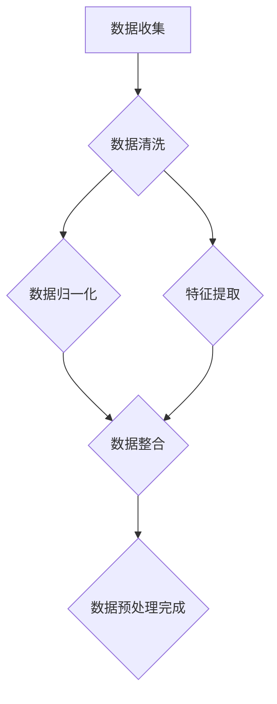
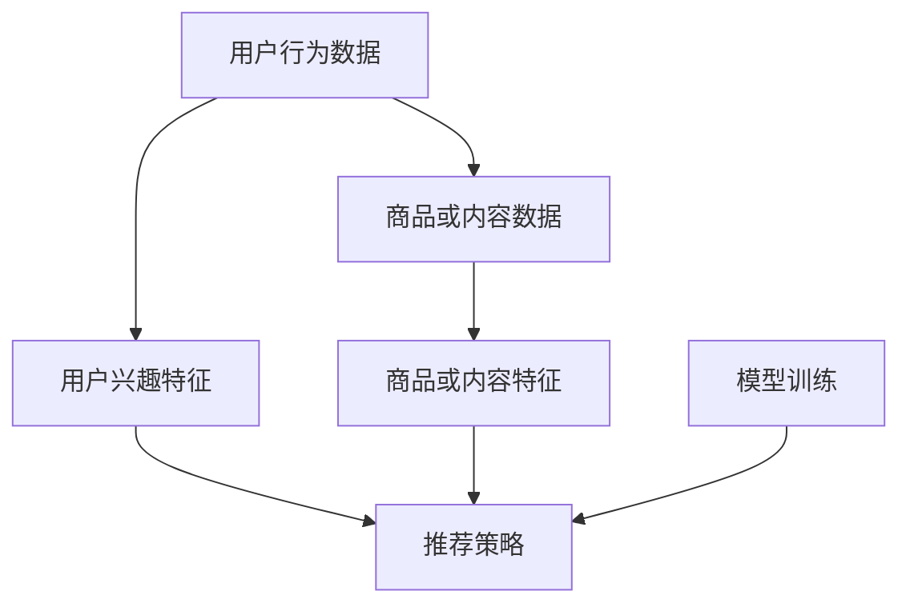

                 

# 《大模型推荐中的数据质量问题与应对策略》

> **关键词：** 大模型推荐系统，数据质量，数据缺失，数据不一致，数据噪声，数据评估，数据监控

> **摘要：** 本文深入探讨了在大模型推荐系统中面临的数据质量问题，包括数据缺失、数据不一致和数据噪声等，并提出了相应的应对策略。文章通过详细的案例分析，分享了提升数据质量的有效方法，旨在为推荐系统开发者提供实用的指导和借鉴。

## 第1章 引言

### 1.1 书籍背景与目标

随着互联网的普及和大数据技术的发展，推荐系统已经成为现代互联网应用的重要组成部分。从电子商务到社交媒体，从音乐流媒体到视频平台，推荐系统在提高用户体验、增加用户粘性和提升业务收益方面发挥了巨大的作用。然而，推荐系统的成功不仅仅依赖于算法的先进性和计算能力，更重要的是数据的质量。在大模型推荐系统中，数据质量尤为关键，因为大模型的训练和优化高度依赖于高质量的数据集。

本文的目标是深入探讨大模型推荐系统中面临的数据质量问题，包括数据缺失、数据不一致和数据噪声等，并针对这些问题提出相应的应对策略。通过本文的阅读，读者将能够：

- 理解大模型推荐系统的基础知识；
- 识别数据质量问题的关键因素；
- 掌握数据质量评估的方法和工具；
- 学习如何通过数据清洗、增强和整合来提升数据质量；
- 获取实际案例分析，了解数据质量问题在实际项目中的应用和解决方法。

### 1.2 大模型推荐系统概述

大模型推荐系统是一种利用深度学习技术进行用户兴趣预测和内容推荐的系统。与传统推荐系统不同，大模型推荐系统通常使用预训练的深度神经网络模型，如BERT、GPT等，这些模型具有强大的特征提取和关系建模能力。大模型推荐系统的基本流程包括以下步骤：

1. **数据收集**：从各种来源收集用户行为数据、商品或内容数据等原始数据。
2. **数据预处理**：对收集到的数据进行清洗、归一化和特征提取等预处理操作。
3. **模型训练**：使用预处理后的数据训练深度学习模型，模型可以是预训练的也可以是自定义的。
4. **模型评估**：通过交叉验证和性能指标评估模型的效果，如准确率、召回率等。
5. **模型部署**：将训练好的模型部署到生产环境中，进行实时推荐。

### 1.3 数据质量在推荐系统中的重要性

数据质量在推荐系统中起着至关重要的作用。高质量的数据可以带来以下好处：

- **提高推荐准确性**：高质量的数据可以帮助模型更准确地预测用户的兴趣和需求，从而提高推荐的准确性。
- **增强用户体验**：准确的推荐可以提升用户满意度，增加用户对推荐系统的信任度和使用频率。
- **提升业务收益**：精准的推荐可以推动用户购买行为，提高业务收益。

然而，数据质量的问题也会对推荐系统产生负面影响：

- **降低推荐效果**：数据缺失、不一致和噪声等问题会导致模型性能下降，降低推荐的准确性。
- **损害用户体验**：错误的推荐会使用户感到困惑和不满，降低用户对推荐系统的信任度和满意度。
- **影响业务发展**：低质量的推荐会阻碍业务增长，甚至可能导致用户流失。

因此，保障数据质量是构建高效推荐系统的关键步骤，必须引起足够的重视。在本文中，我们将详细探讨数据质量的关键问题，并提出相应的解决策略。

## 第2章 大模型推荐系统基础

### 2.1 推荐系统基本概念

推荐系统是一种基于用户行为、兴趣和偏好等信息，自动向用户推荐其可能感兴趣的商品、内容或服务的系统。推荐系统可以分为基于内容的推荐、协同过滤推荐和混合推荐等类型。

- **基于内容的推荐**：根据用户的历史行为和兴趣，推荐与用户历史行为相似的物品或内容。这种推荐方式依赖于对用户兴趣特征的提取和物品或内容的特征表示。

- **协同过滤推荐**：通过分析用户之间的相似性，为用户推荐其邻居用户喜欢的物品或内容。协同过滤可以分为基于用户的协同过滤和基于物品的协同过滤。

- **混合推荐**：结合基于内容和协同过滤的推荐方式，以综合利用不同推荐策略的优点，提高推荐效果。

### 2.2 数据来源与数据类型

大模型推荐系统的数据来源广泛，主要包括以下类型：

- **用户行为数据**：用户在平台上的浏览、点击、购买、评价等行为数据，如浏览历史、购买记录、评分等。

- **商品或内容数据**：包括商品或内容的属性信息，如标题、描述、分类、标签等，以及相关的图像、视频等多媒体数据。

- **外部数据**：来自第三方数据源的数据，如社交媒体数据、地理位置数据、用户画像数据等，可以丰富推荐系统的信息来源。

### 2.3 大模型推荐系统基本流程

大模型推荐系统的基本流程包括数据收集、数据预处理、模型训练、模型评估和模型部署等步骤。

#### 2.3.1 数据预处理

数据预处理是推荐系统开发中的关键环节，主要包括以下任务：

- **数据清洗**：去除重复、错误和不完整的数据，确保数据的一致性和准确性。

- **数据归一化**：将不同规模的数据统一到相同的量级，如将用户评分数据进行归一化处理。

- **特征提取**：从原始数据中提取有用的特征，如文本特征、图像特征和用户行为特征等。

- **数据整合**：将不同来源的数据进行整合，如将用户行为数据与商品或内容数据合并。

#### 2.3.2 大模型训练

大模型训练是推荐系统的核心步骤，通常使用深度学习技术。以下是大模型训练的主要步骤：

- **数据集划分**：将数据集划分为训练集、验证集和测试集，用于模型的训练和评估。

- **模型构建**：使用深度学习框架构建推荐模型，如基于BERT的文本推荐模型或基于卷积神经网络的图像推荐模型。

- **模型训练**：使用训练集对模型进行训练，通过优化算法调整模型参数，以最小化预测误差。

- **模型评估**：使用验证集和测试集评估模型性能，如准确率、召回率、F1值等。

#### 2.3.3 推荐策略

推荐策略是推荐系统的核心，决定了推荐结果的生成方式。以下是一些常见的推荐策略：

- **基于内容的推荐**：根据用户历史行为和兴趣，推荐与用户兴趣相似的物品或内容。

- **协同过滤推荐**：分析用户之间的相似性，推荐其他用户喜欢的物品或内容。

- **混合推荐**：结合基于内容和协同过滤的推荐方式，以综合利用不同推荐策略的优点。

- **基于上下文的推荐**：根据用户的当前上下文信息，如时间、地点、天气等，推荐相关的物品或内容。

通过以上基本流程，大模型推荐系统可以生成高质量的推荐结果，提高用户满意度和平台业务收益。

### 2.3.1 数据预处理

数据预处理是推荐系统开发中的关键环节，主要包括以下任务：

- **数据清洗**：去除重复、错误和不完整的数据，确保数据的一致性和准确性。

- **数据归一化**：将不同规模的数据统一到相同的量级，如将用户评分数据进行归一化处理。

- **特征提取**：从原始数据中提取有用的特征，如文本特征、图像特征和用户行为特征等。

- **数据整合**：将不同来源的数据进行整合，如将用户行为数据与商品或内容数据合并。

为了更好地理解数据预处理的过程，我们可以使用一个Mermaid流程图来展示其核心步骤：



### 2.3.2 大模型训练

大模型训练是推荐系统的核心步骤，通常使用深度学习技术。以下是大模型训练的主要步骤：

- **数据集划分**：将数据集划分为训练集、验证集和测试集，用于模型的训练和评估。

- **模型构建**：使用深度学习框架构建推荐模型，如基于BERT的文本推荐模型或基于卷积神经网络的图像推荐模型。

- **模型训练**：使用训练集对模型进行训练，通过优化算法调整模型参数，以最小化预测误差。

- **模型评估**：使用验证集和测试集评估模型性能，如准确率、召回率、F1值等。

为了更好地理解大模型训练的过程，我们可以使用一个Mermaid流程图来展示其核心步骤：

```mermaid
graph TD
    A[数据集划分] --> B[模型构建]
    B --> C[模型训练}
    C --> D[模型评估}
    D --> E{训练完成}
```

### 2.3.3 推荐策略

推荐策略是推荐系统的核心，决定了推荐结果的生成方式。以下是一些常见的推荐策略：

- **基于内容的推荐**：根据用户历史行为和兴趣，推荐与用户兴趣相似的物品或内容。

- **协同过滤推荐**：分析用户之间的相似性，推荐其他用户喜欢的物品或内容。

- **混合推荐**：结合基于内容和协同过滤的推荐方式，以综合利用不同推荐策略的优点。

- **基于上下文的推荐**：根据用户的当前上下文信息，如时间、地点、天气等，推荐相关的物品或内容。

为了更好地理解推荐策略的实现，我们可以使用一个Mermaid流程图来展示其核心步骤：



通过以上对大模型推荐系统基础部分的详细介绍，读者可以了解推荐系统的基本概念、数据来源、基本流程以及核心步骤。在接下来的章节中，我们将深入探讨数据质量问题及其应对策略。

## 第3章 数据质量问题

在构建大模型推荐系统时，数据质量是决定推荐效果的关键因素之一。数据质量问题不仅会影响模型的训练效果，还会导致推荐结果的准确性降低，进而影响用户体验和业务收益。以下是数据质量中常见的问题，包括数据缺失、数据不一致和数据噪声。

### 3.1 数据缺失问题

数据缺失是指数据集中存在缺失值或空白项。在推荐系统中，数据缺失可能导致以下问题：

- **模型训练不充分**：缺失数据会降低模型训练的数据量，影响模型的泛化能力和准确率。
- **推荐结果偏差**：缺失数据可能导致推荐算法无法准确捕捉用户的真实兴趣，从而产生偏差的推荐结果。

数据缺失的原因有很多，例如：

- **数据采集问题**：数据采集过程中，某些数据项可能无法获取，导致数据缺失。
- **用户行为多样性**：不同用户的行为数据量不同，有些用户可能没有足够的行为数据。
- **数据存储问题**：数据在存储过程中可能发生损坏或丢失，导致数据缺失。

为了解决数据缺失问题，可以采取以下处理方法：

- **缺失值填充**：使用统计方法（如平均值、中位数、众数）或机器学习方法（如KNN、决策树）对缺失值进行填充。
- **样本删除**：对于缺失值较多的样本，可以选择删除这些样本，以避免对模型训练产生负面影响。
- **多重插补**：使用多重插补方法（如RIM、MICE）生成多个完整的数据集，然后分别训练模型并取平均，以提高模型的鲁棒性和准确性。

### 3.2 数据不一致问题

数据不一致是指数据集中的数据存在矛盾或冲突。在推荐系统中，数据不一致可能导致以下问题：

- **推荐结果不准确**：不一致的数据会导致模型对用户兴趣的判断出现偏差，从而影响推荐结果的准确性。
- **数据整合困难**：不一致的数据需要额外的处理和整合，增加了系统的复杂性和维护成本。

数据不一致的原因有很多，例如：

- **数据来源多样**：不同数据源的数据格式和标准可能不同，导致数据不一致。
- **数据更新延迟**：数据在更新过程中可能存在延迟，导致新旧数据之间的不一致。
- **数据传输错误**：数据在传输过程中可能发生错误，导致数据不一致。

为了解决数据不一致问题，可以采取以下处理策略：

- **数据标准化**：对数据源进行标准化处理，确保数据格式和标准的统一。
- **数据清洗**：对数据进行清洗，去除重复、错误和矛盾的数据。
- **数据集成**：使用数据集成方法（如数据合并、数据融合）将不同来源的数据进行整合，消除数据不一致。

### 3.3 数据噪声问题

数据噪声是指数据集中的异常值或错误值。在推荐系统中，数据噪声可能导致以下问题：

- **模型训练不稳定**：异常值或错误值会影响模型的训练过程，导致模型不稳定或过拟合。
- **推荐结果偏差**：异常值或错误值会导致模型对用户兴趣的判断出现偏差，从而影响推荐结果的准确性。

数据噪声的类型主要包括以下几种：

- **随机噪声**：由于随机因素引起的异常值，通常不会影响模型的训练和预测。
- **系统性噪声**：由于系统错误或数据采集过程中的偏差引起的异常值，可能对模型的训练和预测产生较大影响。
- **异常值**：与大多数数据相比，异常值具有明显的异常特征，可能对模型训练和预测产生负面影响。

为了减少数据噪声，可以采取以下方法：

- **异常检测**：使用异常检测方法（如基于统计的方法、基于聚类的方法）识别和标记异常值。
- **数据清洗**：删除或修正异常值，以减少噪声对模型训练和预测的影响。
- **数据增强**：通过增加正常数据样本来增强模型训练，以减少异常值的影响。

通过以上对数据缺失、数据不一致和数据噪声问题的详细分析，我们可以看到数据质量问题对大模型推荐系统的影响是显著的。在接下来的章节中，我们将探讨如何评估和提升数据质量。

### 3.1 数据缺失问题

数据缺失是推荐系统中常见且严重的问题。它不仅会影响模型的训练效果，还会导致推荐结果的偏差。以下是数据缺失的具体原因、影响以及解决方法。

#### 3.1.1 数据缺失的原因

1. **数据采集问题**：
   - **传感器故障**：在物联网应用中，传感器故障可能导致部分数据无法采集。
   - **网络问题**：网络连接不稳定或中断，可能导致数据采集过程失败。
   - **用户行为变化**：用户行为可能发生变化，导致某些行为数据无法及时采集。

2. **数据存储问题**：
   - **数据损坏**：数据在存储过程中可能因为硬件故障或软件错误而损坏。
   - **数据备份失败**：数据备份失败可能导致历史数据的丢失。

3. **数据传输问题**：
   - **数据传输错误**：数据在传输过程中可能因为干扰或信号问题而出现错误。
   - **数据丢失**：在某些情况下，数据在传输过程中可能会因为传输带宽限制或数据量过大而丢失。

4. **业务流程问题**：
   - **数据更新延迟**：某些数据需要经过多个环节的审核和确认，导致数据更新延迟。
   - **用户隐私保护**：部分数据因用户隐私保护而被删除或屏蔽。

#### 3.1.2 数据缺失对推荐系统的影响

1. **降低模型性能**：
   - 缺失数据会导致模型训练数据量减少，从而影响模型的泛化能力和准确率。
   - 缺失数据可能导致模型过拟合，无法准确捕捉用户兴趣和需求。

2. **推荐结果偏差**：
   - 缺失数据可能导致推荐结果偏向于少数完整数据样本，从而偏离用户的真实兴趣。
   - 缺失数据可能导致推荐结果偏向于高频用户，忽视长尾用户。

3. **增加计算复杂度**：
   - 数据缺失需要额外的处理步骤，如缺失值填充或数据重建，增加了系统的计算复杂度。

#### 3.1.3 缺失数据的处理方法

1. **缺失值填充**：
   - **统计方法**：使用统计方法（如平均值、中位数、众数）填充缺失值。这种方法简单有效，适用于数据分布较为均匀的情况。
   - **基于模型的填充**：使用机器学习方法（如线性回归、决策树、KNN等）预测缺失值。这种方法可以更准确地填充缺失值，适用于数据分布不均匀或存在明显趋势的情况。

2. **样本删除**：
   - **删除缺失比例较高的样本**：对于缺失比例较高的样本，可以选择删除这些样本，以避免对模型训练产生负面影响。
   - **删除特定特征的缺失样本**：对于某些关键特征缺失比例较高，可以选择删除这些样本，以保证关键特征数据的完整性。

3. **多重插补**：
   - **RIM（Re重复插补法）**：通过多次插补，生成多个完整的数据集，然后分别训练模型并取平均，以提高模型的鲁棒性和准确性。
   - **MICE（多重插补估计法）**：通过迭代方法，逐步填补缺失值，并多次重复这个过程，以生成多个完整的数据集。

通过以上方法，可以有效地处理推荐系统中的数据缺失问题，提高模型性能和推荐准确性。

### 3.2 数据不一致问题

数据不一致是另一个影响推荐系统质量的重要因素。数据不一致不仅会降低模型的准确性，还会增加系统的维护成本。以下是数据不一致的具体原因、影响以及处理策略。

#### 3.2.1 数据不一致的原因

1. **数据来源多样**：
   - 不同数据源的数据格式和标准可能不同，导致数据不一致。
   - 不同数据源的数据更新频率不同，导致新旧数据之间的不一致。

2. **数据更新延迟**：
   - 数据在更新过程中可能存在延迟，导致新旧数据之间的不一致。
   - 某些数据需要经过多个环节的审核和确认，导致数据更新延迟。

3. **数据传输错误**：
   - 数据在传输过程中可能因为干扰或信号问题而出现错误。
   - 数据在传输过程中可能因为传输带宽限制或数据量过大而丢失。

4. **业务流程问题**：
   - 某些业务流程可能导致数据在不同环节出现重复或遗漏。
   - 不同部门或团队之间的数据同步可能存在延迟或不一致。

#### 3.2.2 数据不一致对推荐系统的影响

1. **降低模型准确性**：
   - 不一致的数据会导致模型对用户兴趣的判断出现偏差，从而降低推荐准确性。
   - 不一致的数据可能误导模型，导致模型过拟合或欠拟合。

2. **增加维护成本**：
   - 数据不一致需要额外的处理和整合，增加了系统的复杂度和维护成本。
   - 数据不一致可能导致系统出现异常或错误，需要额外的调试和修复。

3. **影响用户体验**：
   - 不一致的推荐结果可能导致用户体验不佳，降低用户满意度。
   - 不一致的数据可能导致推荐结果偏离用户的真实兴趣，使用户感到困惑或不满。

#### 3.2.3 数据一致性的处理策略

1. **数据标准化**：
   - **数据格式标准化**：统一不同数据源的数据格式，确保数据的一致性。
   - **数据类型标准化**：统一不同数据源的数据类型，如将字符串数据转换为数值数据。

2. **数据清洗**：
   - **去除重复数据**：通过去重算法，去除数据集中的重复数据，以避免数据不一致。
   - **修复错误数据**：通过校验和修复算法，修复数据集中的错误数据，以提高数据质量。

3. **数据集成**：
   - **数据合并**：将不同来源的数据进行合并，消除数据不一致。
   - **数据融合**：通过数据融合技术，将不同来源的数据进行整合，以生成更完整和一致的数据集。

4. **数据监控**：
   - **实时监控**：通过实时监控工具，及时发现和解决数据不一致的问题。
   - **周期性检查**：定期检查数据的一致性，确保数据在各个环节的准确性。

通过以上策略，可以有效地处理推荐系统中的数据不一致问题，提高模型的准确性和系统的稳定性。

### 3.3 数据噪声问题

数据噪声是影响推荐系统性能的一个重要因素。噪声数据不仅会影响模型训练的效果，还可能导致推荐结果不准确，从而影响用户体验。以下是数据噪声的类型、影响以及减少数据噪声的方法。

#### 3.3.1 数据噪声的类型

1. **随机噪声**：
   - 随机噪声是由随机过程引入的，通常不会对模型的训练和预测产生显著影响。
   - 例如，用户在随机时间内产生的行为数据可能包含随机噪声。

2. **系统性噪声**：
   - 系统性噪声是由系统错误或数据采集过程中的偏差引起的，可能对模型训练和预测产生较大影响。
   - 例如，传感器故障或数据传输错误可能导致数据中的系统性噪声。

3. **异常值**：
   - 异常值是与大多数数据相比具有明显异常特征的数据点，可能对模型训练和预测产生负面影响。
   - 例如，用户在极端情况下产生的异常行为数据可能被视为异常值。

#### 3.3.2 数据噪声对推荐系统的影响

1. **降低模型性能**：
   - 数据噪声会干扰模型对用户兴趣的准确识别，导致模型性能下降。
   - 例如，异常值可能导致模型过拟合或欠拟合，从而降低推荐准确性。

2. **推荐结果偏差**：
   - 数据噪声可能导致推荐结果偏离用户的真实兴趣，从而降低用户体验。
   - 例如，系统性噪声可能导致推荐结果偏向于某些特定用户群体，忽视其他用户的需求。

3. **增加计算复杂度**：
   - 数据噪声需要额外的处理和清洗步骤，增加了系统的计算复杂度和维护成本。
   - 例如，对异常值进行检测和修正需要消耗额外的计算资源和时间。

#### 3.3.3 减少数据噪声的方法

1. **异常检测**：
   - **基于统计的方法**：使用统计方法（如Z-score、IQR法）检测异常值，将其标记为噪声数据。
   - **基于聚类的方法**：使用聚类算法（如K-means、DBSCAN）识别异常点，将其视为噪声数据。

2. **数据清洗**：
   - **删除异常值**：对于明显的异常值，可以选择删除这些数据点，以减少噪声对模型的影响。
   - **修正异常值**：使用统计方法或机器学习方法修正异常值，使其符合数据分布。

3. **数据增强**：
   - **增加正常数据样本**：通过生成或收集更多的正常数据样本，增强模型对噪声的鲁棒性。
   - **数据降噪**：使用降噪算法（如降噪回归、降噪自动编码器）对数据进行降噪处理，提高数据质量。

通过以上方法，可以有效地减少推荐系统中的数据噪声，提高模型性能和推荐准确性。

### 总结

在构建大模型推荐系统时，数据质量问题至关重要。数据缺失、数据不一致和数据噪声都可能影响推荐系统的性能和用户体验。因此，我们需要识别这些问题的原因，了解其对推荐系统的影响，并采取相应的处理方法。通过数据清洗、填充、标准化、集成和异常检测等技术，可以有效提升数据质量，从而提高推荐系统的准确性和稳定性。

在接下来的章节中，我们将进一步探讨数据质量的评估方法和提升策略，为读者提供更全面的解决方案。

### 4.1 数据质量评估指标

在评估推荐系统的数据质量时，需要使用一系列指标来衡量数据的完整性、一致性和准确性。这些指标不仅有助于识别数据质量问题，还为后续的数据处理和优化提供了依据。以下是常用的数据质量评估指标：

#### 4.1.1 数据完整性

数据完整性是指数据集是否包含所有必要的字段和记录，以及数据缺失的情况。常用的完整性评估指标包括：

- **缺失值比例**：计算数据集中缺失值的比例。公式如下：
  \[
  \text{缺失值比例} = \frac{\text{缺失值总数}}{\text{数据总记录数}} \times 100\%
  \]
- **关键字段缺失率**：计算关键字段缺失的比例，例如用户ID、商品ID等。该指标更能反映数据完整性对推荐系统的影响。

#### 4.1.2 数据一致性

数据一致性是指数据集中不同来源或不同时间点的数据是否一致。常用的数据一致性评估指标包括：

- **重复记录率**：计算数据集中重复记录的比例。公式如下：
  \[
  \text{重复记录率} = \frac{\text{重复记录总数}}{\text{数据总记录数}} \times 100\%
  \]
- **字段一致性比例**：计算数据集中特定字段（如用户ID、日期等）在不同数据源中的一致性比例。公式如下：
  \[
  \text{字段一致性比例} = \frac{\text{一致性字段总数}}{\text{所有字段总数}} \times 100\%
  \]

#### 4.1.3 数据准确性

数据准确性是指数据集中记录的真实性和可靠性。常用的数据准确性评估指标包括：

- **错误率**：计算数据集中错误记录的比例。公式如下：
  \[
  \text{错误率} = \frac{\text{错误记录总数}}{\text{数据总记录数}} \times 100\%
  \]
- **校验准确率**：通过校验规则（如格式校验、范围校验等）检查数据的准确性。校验准确率表示通过校验的数据比例。公式如下：
  \[
  \text{校验准确率} = \frac{\text{通过校验的数据总数}}{\text{数据总记录数}} \times 100\%
  \]

#### 4.1.4 数据可靠性

数据可靠性是指数据在存储、传输和处理过程中的稳定性和可信度。常用的数据可靠性评估指标包括：

- **数据丢失率**：计算数据在传输或存储过程中丢失的比例。公式如下：
  \[
  \text{数据丢失率} = \frac{\text{丢失的数据总数}}{\text{数据总记录数}} \times 100\%
  \]
- **数据恢复率**：计算在数据丢失后成功恢复的数据比例。公式如下：
  \[
  \text{数据恢复率} = \frac{\text{成功恢复的数据总数}}{\text{丢失的数据总数}} \times 100\%
  \]

通过以上数据质量评估指标，可以全面了解推荐系统中数据的质量状况，从而为数据清洗、处理和优化提供依据。在接下来的章节中，我们将探讨如何进行数据质量评估，以及如何通过评估结果来提升数据质量。

#### 4.2 数据质量评估方法

数据质量评估是确保推荐系统数据可靠性和准确性的关键步骤。评估方法可以分为自动评估方法和人工评估方法。以下将详细介绍这两种方法及其具体步骤。

##### 4.2.1 自动评估方法

自动评估方法利用算法和工具对数据质量进行自动化检查，可以快速发现数据中的问题。以下是几种常用的自动评估方法：

1. **规则检查**：
   - 基于预定义的规则（如数据格式、范围、唯一性等）对数据集进行检查。
   - 例如，可以使用Python中的`pandas`库定义规则，并使用`DataFrame`的`query`方法检查数据：
     ```python
     df.query("age > 0 and age < 120")
     ```

2. **统计方法**：
   - 利用统计学方法（如描述性统计、异常值检测等）对数据质量进行评估。
   - 例如，使用Python中的`numpy`和`scipy`库计算数据的统计特征，并使用`z-score`方法检测异常值：
     ```python
     from scipy import stats
     z_scores = stats.zscore(data)
     threshold = 3
     outliers = np.abs(z_scores) > threshold
     ```

3. **机器学习方法**：
   - 使用机器学习算法（如决策树、随机森林等）对数据质量进行评估。
   - 例如，使用Python中的`sklearn`库训练分类模型，对数据集中的异常值进行预测：
     ```python
     from sklearn.ensemble import RandomForestClassifier
     model = RandomForestClassifier()
     model.fit(X_train, y_train)
     predictions = model.predict(X_test)
     ```

##### 4.2.2 人工评估方法

人工评估方法通过人工审查数据来发现和解决数据质量问题。以下是一些常见的人工评估方法：

1. **数据探查**：
   - 通过可视化工具（如Excel、Tableau等）对数据进行初步探查，识别异常值和趋势。
   - 例如，使用`pandas`库的可视化功能，生成直方图、箱线图等：
     ```python
     df.hist(bins=50, figsize=(20, 15))
     plt.show()
     ```

2. **样本审查**：
   - 从数据集中随机抽取样本，进行详细审查和验证，识别数据中的错误和问题。
   - 例如，手动检查前100条记录的完整性和一致性：
     ```python
     sample_data = df.head(100)
     for index, row in sample_data.iterrows():
         # 检查特定字段
         if row['age'] < 0 or row['age'] > 120:
             print(f"Error in record {index}: {row['age']}")
     ```

3. **专家评审**：
   - 邀请数据领域的专家对数据质量进行评估，提供专业意见和解决方案。
   - 例如，组织数据质量评审会议，邀请专家对数据进行讨论和评估。

##### 4.2.3 综合评估方法

在实际应用中，自动评估方法和人工评估方法常常结合使用，以提高评估的全面性和准确性。以下是一个综合评估方法的步骤：

1. **数据预处理**：
   - 对数据集进行初步清洗和预处理，如去除重复记录、填补缺失值等。

2. **自动评估**：
   - 使用自动评估方法（如规则检查、统计方法等）对数据集进行初步检查，识别潜在的异常值和问题。

3. **人工审查**：
   - 对自动评估发现的问题进行人工审查和验证，进一步识别和修正错误。

4. **专家评审**：
   - 邀请专家对数据质量进行评估，提供专业意见和改进建议。

5. **评估报告**：
   - 撰写评估报告，总结评估结果、发现的问题以及改进措施，为后续数据处理和优化提供依据。

通过综合使用自动评估方法和人工评估方法，可以全面了解数据质量状况，为推荐系统提供高质量的数据支持。

### 4.3 数据质量提升策略

提升数据质量是确保推荐系统性能和用户满意度的关键步骤。以下介绍几种常用的数据质量提升策略，包括数据清洗、数据增强和数据整合。

#### 4.3.1 数据清洗策略

数据清洗是提升数据质量的基础，其主要目标是识别和纠正数据中的错误、异常和不一致。以下是几种常用的数据清洗策略：

1. **缺失值处理**：
   - **填充法**：使用统计方法（如平均值、中位数、众数）或机器学习方法（如KNN、决策树）对缺失值进行填充。
     ```python
     from sklearn.impute import SimpleImputer
     imputer = SimpleImputer(strategy='mean')
     imputed_data = imputer.fit_transform(data)
     ```
   - **删除法**：对于缺失比例较高的数据，可以选择删除缺失值。
     ```python
     data = data.dropna()
     ```

2. **重复值处理**：
   - 使用去重算法（如`pandas`库中的`drop_duplicates`方法）删除数据集中的重复记录。
     ```python
     data = data.drop_duplicates()
     ```

3. **异常值处理**：
   - 使用统计学方法（如Z-score、IQR法）或机器学习方法（如隔离森林）检测和删除异常值。
     ```python
     from sklearn.ensemble import IsolationForest
     model = IsolationForest(n_estimators=100)
     model.fit(data)
     outliers = model.predict(data) == -1
     data = data[~outliers]
     ```

4. **格式处理**：
   - 对数据格式进行标准化处理，如将字符串数据转换为数值数据、统一日期格式等。
     ```python
     data['date'] = pd.to_datetime(data['date'], format='%Y-%m-%d')
     ```

#### 4.3.2 数据增强策略

数据增强是通过增加新的数据样本来提高模型性能和鲁棒性。以下是几种常用的数据增强策略：

1. **数据扩充**：
   - 使用生成对抗网络（GAN）或变分自编码器（VAE）生成新的数据样本。
     ```python
     from tensorflow.keras.models import Model
     # 建立GAN模型
     # ...
     # 训练GAN模型
     # ...
     # 使用GAN生成新数据样本
     generated_samples = generator.predict(noise)
     ```

2. **特征工程**：
   - 利用已有的数据特征，通过组合、变换和扩展等方法创建新的特征。
     ```python
     data['new_feature'] = data['feature1'] * data['feature2']
     ```

3. **数据扩展**：
   - 将原始数据中的数值特征扩展为类别特征，如使用One-Hot编码或嵌入编码。
     ```python
     data = pd.get_dummies(data, columns=['categorical_feature'])
     ```

4. **数据转换**：
   - 使用数据转换技术（如时间序列转换、空间转换等）扩展数据集。
     ```python
     from tsfresh import extract_features
     features = extract_features(data['time_series'], column_id='id', column_sort='time')
     ```

#### 4.3.3 数据整合策略

数据整合是将多个数据源中的数据进行合并和整合，以提高数据质量和模型性能。以下是几种常用的数据整合策略：

1. **数据合并**：
   - 使用SQL或分布式数据处理框架（如Apache Spark）对数据进行合并。
     ```python
     merged_data = data1.append(data2, ignore_index=True)
     ```

2. **数据融合**：
   - 使用数据融合技术（如集成学习、聚类等）将多个数据源的数据进行整合。
     ```python
     from sklearn.cluster import KMeans
     model = KMeans(n_clusters=5)
     model.fit(data)
     labels = model.predict(data)
     fused_data = data.copy()
     fused_data['cluster'] = labels
     ```

3. **数据链接**：
   - 使用图论方法（如链接预测、图嵌入等）将不同数据源中的数据进行链接和整合。
     ```python
     import networkx as nx
     G = nx.Graph()
     G.add_nodes_from(data1['id'], label='source1')
     G.add_nodes_from(data2['id'], label='source2')
     G.add_edges_from(data1['id'].values, data2['id'].values)
     ```

通过以上数据清洗、数据增强和数据整合策略，可以显著提升推荐系统的数据质量，从而提高模型的性能和用户体验。在接下来的章节中，我们将探讨如何通过数据质量监控和案例分析来进一步优化数据质量。

### 4.3.1 数据清洗策略

数据清洗是提升数据质量的关键步骤，其主要目标是识别和纠正数据集中的错误、异常和不一致。以下是几种常用的数据清洗策略：

#### 缺失值处理

缺失值是数据清洗中常见的问题，处理缺失值的方法可以分为以下几种：

1. **填充法**：
   - **平均值填充**：使用字段中的平均值替换缺失值。
     ```python
     from sklearn.impute import SimpleImputer
     imputer = SimpleImputer(strategy='mean')
     data = imputer.fit_transform(data)
     ```

   - **中位数填充**：使用字段中的中位数替换缺失值。
     ```python
     from sklearn.impute import SimpleImputer
     imputer = SimpleImputer(strategy='median')
     data = imputer.fit_transform(data)
     ```

   - **众数填充**：使用字段中的众数替换缺失值。
     ```python
     from sklearn.impute import SimpleImputer
     imputer = SimpleImputer(strategy='most_frequent')
     data = imputer.fit_transform(data)
     ```

2. **基于模型的填充**：
   - **回归填充**：使用回归模型预测缺失值。
     ```python
     from sklearn.linear_model import LinearRegression
     model = LinearRegression()
     model.fit(X_train, y_train)
     data = model.predict(X_train)
     ```

   - **决策树填充**：使用决策树模型预测缺失值。
     ```python
     from sklearn.tree import DecisionTreeRegressor
     model = DecisionTreeRegressor()
     model.fit(X_train, y_train)
     data = model.predict(X_train)
     ```

#### 重复值处理

重复值是数据集中的另一个常见问题，处理重复值的方法如下：

1. **删除重复值**：
   - 使用`pandas`库中的`drop_duplicates`方法删除重复值。
     ```python
     data = data.drop_duplicates()
     ```

2. **保留最新记录**：
   - 在某些情况下，可以保留重复值中的最新记录，删除其他重复值。
     ```python
     data = data.sort_values(by='timestamp', ascending=False).drop_duplicates(subset=['id'])
     ```

#### 异常值处理

异常值是数据集中可能存在的异常数据点，处理异常值的方法如下：

1. **基于统计学的方法**：
   - **Z-score法**：计算每个数据点的Z-score，将Z-score超过阈值的视为异常值。
     ```python
     from scipy import stats
     z_scores = stats.zscore(data)
     threshold = 3
     outliers = np.abs(z_scores) > threshold
     data[outliers] = np.nan
     ```

   - **IQR法**：计算每个数据点的IQR，将IQR超过阈值的视为异常值。
     ```python
     from scipy.stats import iqr
     iqr_value = iqr(data)
     lower_bound = data.mean() - 1.5 * iqr_value
     upper_bound = data.mean() + 1.5 * iqr_value
     outliers = (data < lower_bound) | (data > upper_bound)
     data[outliers] = np.nan
     ```

2. **基于机器学习的方法**：
   - **隔离森林**：使用隔离森林模型检测和删除异常值。
     ```python
     from sklearn.ensemble import IsolationForest
     model = IsolationForest()
     model.fit(data)
     outliers = model.predict(data) == -1
     data = data[~outliers]
     ```

#### 数据格式处理

数据格式处理是确保数据一致性的重要步骤，以下是一些常用的格式处理方法：

1. **字符串转数值**：
   - 使用`pandas`库中的`astype`方法将字符串数据转换为数值数据。
     ```python
     data['column_name'] = data['column_name'].astype(int)
     ```

2. **日期格式化**：
   - 使用`pandas`库中的`to_datetime`方法将字符串日期格式化为标准日期格式。
     ```python
     data['date_column'] = pd.to_datetime(data['date_column'], format='%Y-%m-%d')
     ```

通过以上数据清洗策略，可以显著提升数据质量，确保推荐系统的准确性和可靠性。在接下来的章节中，我们将进一步探讨数据增强策略和数据整合策略。

### 4.3.2 数据增强策略

数据增强是提升数据质量和模型性能的重要手段，通过增加新的数据样本来提高模型的泛化能力和鲁棒性。以下介绍几种常用的数据增强策略：

#### 数据扩充

数据扩充是通过生成新的数据样本来扩充原始数据集。常见的数据扩充方法包括：

1. **GAN（生成对抗网络）**：
   - 使用生成对抗网络（GAN）生成与原始数据相似的新数据样本。
   - 例如，使用Python中的`tensorflow`库实现GAN：
     ```python
     import tensorflow as tf
     # 定义GAN模型
     # ...
     # 训练GAN模型
     # ...
     # 生成新数据样本
     generated_samples = generator.sample(num_samples)
     ```

2. **VAE（变分自编码器）**：
   - 使用变分自编码器（VAE）生成新的数据样本，通过重建损失和鉴别损失训练模型。
   - 例如，使用Python中的`tensorflow`库实现VAE：
     ```python
     import tensorflow as tf
     # 定义VAE模型
     # ...
     # 训练VAE模型
     # ...
     # 生成新数据样本
     latent_samples, _ = vae.sample(num_samples)
     ```

#### 特征工程

特征工程是通过创建新的特征来提高模型性能。以下是一些常用的特征工程方法：

1. **组合特征**：
   - 通过组合现有特征创建新的特征，如计算两个特征的乘积或差值。
     ```python
     data['new_feature'] = data['feature1'] * data['feature2']
     ```

2. **归一化和标准化**：
   - 对特征进行归一化和标准化处理，如将特征缩放到[0,1]或[-1,1]区间。
     ```python
     from sklearn.preprocessing import MinMaxScaler
     scaler = MinMaxScaler()
     data = scaler.fit_transform(data)
     ```

3. **多项式特征**：
   - 使用多项式特征生成器创建多项式特征，如使用`PolynomialFeatures`类：
     ```python
     from sklearn.preprocessing import PolynomialFeatures
     poly = PolynomialFeatures(degree=2)
     data = poly.fit_transform(data)
     ```

#### 数据扩展

数据扩展是通过扩展原始数据中的特征来提高模型性能。以下是一些常用的数据扩展方法：

1. **类别特征扩展**：
   - 使用One-Hot编码或嵌入编码将类别特征扩展为二进制特征。
     ```python
     from sklearn.preprocessing import OneHotEncoder
     encoder = OneHotEncoder()
     data = encoder.fit_transform(data['categorical_feature'].values.reshape(-1, 1))
     ```

2. **时间序列扩展**：
   - 通过生成时间序列特征扩展数据，如使用`tsfresh`库：
     ```python
     from tsfresh import extract_features
     features = extract_features(data['time_series'], column_id='id', column_sort='time')
     ```

3. **空间特征扩展**：
   - 通过生成空间特征扩展数据，如使用`geopy`库：
     ```python
     from geopy.geocoders import Nominatim
     geolocator = Nominatim(user_agent="data_extension")
     for index, row in data.iterrows():
         location = geolocator.geocode(row['address'])
         data.loc[index, 'latitude'] = location.latitude
         data.loc[index, 'longitude'] = location.longitude
     ```

通过以上数据增强策略，可以显著提升数据质量和模型性能，为推荐系统提供更好的数据支持。在接下来的章节中，我们将进一步探讨数据整合策略。

### 4.3.3 数据整合策略

数据整合是将来自多个数据源的数据进行合并，以提高数据质量和模型性能。以下介绍几种常用的数据整合策略：

#### 数据合并

数据合并是将多个数据源中的数据合并为一个统一的数据集。常见的数据合并方法包括：

1. **SQL合并**：
   - 使用SQL查询语句将多个表中的数据合并为一个数据集。
     ```sql
     SELECT a.*, b.*
     FROM table_a a
     JOIN table_b b ON a.id = b.id
     ```

2. **Pandas合并**：
   - 使用Python中的`pandas`库将多个数据框（DataFrame）合并为一个数据集。
     ```python
     data = pd.merge(data1, data2, on='common_column')
     ```

#### 数据融合

数据融合是通过整合多个数据源中的数据来提高数据质量。以下是一些常用的数据融合方法：

1. **集成学习**：
   - 通过集成多个模型的预测结果来提高预测准确性。
     ```python
     from sklearn.ensemble import VotingClassifier
     model1 = LogisticRegression()
     model2 = RandomForestClassifier()
     model3 = XGBClassifier()
     voting_model = VotingClassifier(estimators=[('lr', model1), ('rf', model2), ('xgb', model3)], voting='soft')
     voting_model.fit(X_train, y_train)
     ```

2. **聚类融合**：
   - 通过聚类方法将多个数据源中的数据进行融合，以提高数据一致性。
     ```python
     from sklearn.cluster import KMeans
     model = KMeans(n_clusters=3)
     model.fit(data)
     labels = model.predict(data)
     fused_data = data.copy()
     fused_data['cluster'] = labels
     ```

#### 数据链接

数据链接是通过建立不同数据源之间的关联来提高数据质量。以下是一些常用的数据链接方法：

1. **图论方法**：
   - 使用图论方法建立数据源之间的关联，如使用`networkx`库：
     ```python
     import networkx as nx
     G = nx.Graph()
     G.add_nodes_from(data1['id'])
     G.add_nodes_from(data2['id'])
     G.add_edges_from(data1['id'].values, data2['id'].values)
     ```

2. **图嵌入**：
   - 使用图嵌入技术将不同数据源的数据转换为向量表示，如使用`node2vec`或`Gaussian Embedding`：
     ```python
     import node2vec as n2v
     model = n2v.Node2Vec(model, p=1, q=1)
     model.fit(G)
     node_embeddings = model.get_embeddings()
     ```

通过以上数据整合策略，可以有效地提高数据质量，为推荐系统提供更好的数据支持。在接下来的章节中，我们将探讨如何进行数据质量监控。

### 4.3.3 数据整合策略

数据整合是将来自多个数据源的数据进行合并，以提高数据质量和模型性能。以下介绍几种常用的数据整合策略：

#### 数据合并

数据合并是将多个数据源中的数据合并为一个统一的数据集。常见的数据合并方法包括：

1. **SQL合并**：
   - 使用SQL查询语句将多个表中的数据合并为一个数据集。
     ```sql
     SELECT a.*, b.*
     FROM table_a a
     JOIN table_b b ON a.id = b.id
     ```

2. **Pandas合并**：
   - 使用Python中的`pandas`库将多个数据框（DataFrame）合并为一个数据集。
     ```python
     data = pd.merge(data1, data2, on='common_column')
     ```

#### 数据融合

数据融合是通过整合多个数据源中的数据来提高数据质量。以下是一些常用的数据融合方法：

1. **集成学习**：
   - 通过集成多个模型的预测结果来提高预测准确性。
     ```python
     from sklearn.ensemble import VotingClassifier
     model1 = LogisticRegression()
     model2 = RandomForestClassifier()
     model3 = XGBClassifier()
     voting_model = VotingClassifier(estimators=[('lr', model1), ('rf', model2), ('xgb', model3)], voting='soft')
     voting_model.fit(X_train, y_train)
     ```

2. **聚类融合**：
   - 通过聚类方法将多个数据源中的数据进行融合，以提高数据一致性。
     ```python
     from sklearn.cluster import KMeans
     model = KMeans(n_clusters=3)
     model.fit(data)
     labels = model.predict(data)
     fused_data = data.copy()
     fused_data['cluster'] = labels
     ```

#### 数据链接

数据链接是通过建立不同数据源之间的关联来提高数据质量。以下是一些常用的数据链接方法：

1. **图论方法**：
   - 使用图论方法建立数据源之间的关联，如使用`networkx`库：
     ```python
     import networkx as nx
     G = nx.Graph()
     G.add_nodes_from(data1['id'])
     G.add_nodes_from(data2['id'])
     G.add_edges_from(data1['id'].values, data2['id'].values)
     ```

2. **图嵌入**：
   - 使用图嵌入技术将不同数据源的数据转换为向量表示，如使用`node2vec`或`Gaussian Embedding`：
     ```python
     import node2vec as n2v
     model = n2v.Node2Vec(model, p=1, q=1)
     model.fit(G)
     node_embeddings = model.get_embeddings()
     ```

通过以上数据整合策略，可以有效地提高数据质量，为推荐系统提供更好的数据支持。在接下来的章节中，我们将探讨如何进行数据质量监控。

### 4.3.3 数据整合策略

数据整合是将来自多个数据源的数据进行合并，以提高数据质量和模型性能。以下介绍几种常用的数据整合策略：

#### 数据合并

数据合并是将多个数据源中的数据合并为一个统一的数据集。常见的数据合并方法包括：

1. **SQL合并**：
   - 使用SQL查询语句将多个表中的数据合并为一个数据集。
     ```sql
     SELECT a.*, b.*
     FROM table_a a
     JOIN table_b b ON a.id = b.id
     ```

2. **Pandas合并**：
   - 使用Python中的`pandas`库将多个数据框（DataFrame）合并为一个数据集。
     ```python
     data = pd.merge(data1, data2, on='common_column')
     ```

#### 数据融合

数据融合是通过整合多个数据源中的数据来提高数据质量。以下是一些常用的数据融合方法：

1. **集成学习**：
   - 通过集成多个模型的预测结果来提高预测准确性。
     ```python
     from sklearn.ensemble import VotingClassifier
     model1 = LogisticRegression()
     model2 = RandomForestClassifier()
     model3 = XGBClassifier()
     voting_model = VotingClassifier(estimators=[('lr', model1), ('rf', model2), ('xgb', model3)], voting='soft')
     voting_model.fit(X_train, y_train)
     ```

2. **聚类融合**：
   - 通过聚类方法将多个数据源中的数据进行融合，以提高数据一致性。
     ```python
     from sklearn.cluster import KMeans
     model = KMeans(n_clusters=3)
     model.fit(data)
     labels = model.predict(data)
     fused_data = data.copy()
     fused_data['cluster'] = labels
     ```

#### 数据链接

数据链接是通过建立不同数据源之间的关联来提高数据质量。以下是一些常用的数据链接方法：

1. **图论方法**：
   - 使用图论方法建立数据源之间的关联，如使用`networkx`库：
     ```python
     import networkx as nx
     G = nx.Graph()
     G.add_nodes_from(data1['id'])
     G.add_nodes_from(data2['id'])
     G.add_edges_from(data1['id'].values, data2['id'].values)
     ```

2. **图嵌入**：
   - 使用图嵌入技术将不同数据源的数据转换为向量表示，如使用`node2vec`或`Gaussian Embedding`：
     ```python
     import node2vec as n2v
     model = n2v.Node2Vec(model, p=1, q=1)
     model.fit(G)
     node_embeddings = model.get_embeddings()
     ```

通过以上数据整合策略，可以有效地提高数据质量，为推荐系统提供更好的数据支持。在接下来的章节中，我们将探讨如何进行数据质量监控。

### 4.4 数据质量提升策略

数据质量提升是确保推荐系统有效运行的关键步骤。以下将介绍几种常用的数据质量提升策略，包括数据清洗、数据增强和数据整合。

#### 4.4.1 数据清洗策略

数据清洗是数据质量提升的基础，其主要目标是识别和纠正数据集中的错误、异常和不一致。以下是几种常用的数据清洗策略：

1. **缺失值处理**：
   - **填充法**：使用统计方法（如平均值、中位数、众数）或机器学习方法（如KNN、决策树）对缺失值进行填充。
     ```python
     from sklearn.impute import SimpleImputer
     imputer = SimpleImputer(strategy='mean')
     data = imputer.fit_transform(data)
     ```

   - **删除法**：对于缺失比例较高的数据，可以选择删除缺失值。
     ```python
     data = data.dropna()
     ```

2. **重复值处理**：
   - 使用去重算法（如`pandas`库中的`drop_duplicates`方法）删除数据集中的重复记录。
     ```python
     data = data.drop_duplicates()
     ```

3. **异常值处理**：
   - 使用统计学方法（如Z-score、IQR法）或机器学习方法（如隔离森林）检测和删除异常值。
     ```python
     from sklearn.ensemble import IsolationForest
     model = IsolationForest(n_estimators=100)
     model.fit(data)
     outliers = model.predict(data) == -1
     data = data[~outliers]
     ```

4. **格式处理**：
   - 对数据格式进行标准化处理，如将字符串数据转换为数值数据、统一日期格式等。
     ```python
     data['date'] = pd.to_datetime(data['date'], format='%Y-%m-%d')
     ```

#### 4.4.2 数据增强策略

数据增强是通过增加新的数据样本来提高模型性能和鲁棒性。以下是一些常用的数据增强策略：

1. **数据扩充**：
   - 使用生成对抗网络（GAN）或变分自编码器（VAE）生成与原始数据相似的新数据样本。
     ```python
     import tensorflow as tf
     # 定义GAN模型
     # ...
     # 训练GAN模型
     # ...
     # 生成新数据样本
     generated_samples = generator.sample(num_samples)
     ```

2. **特征工程**：
   - 利用已有的数据特征，通过组合、变换和扩展等方法创建新的特征。
     ```python
     data['new_feature'] = data['feature1'] * data['feature2']
     ```

3. **数据扩展**：
   - 将原始数据中的数值特征扩展为类别特征，如使用One-Hot编码或嵌入编码。
     ```python
     from sklearn.preprocessing import OneHotEncoder
     encoder = OneHotEncoder()
     data = encoder.fit_transform(data['categorical_feature'].values.reshape(-1, 1))
     ```

4. **时间序列扩展**：
   - 通过生成时间序列特征扩展数据，如使用`tsfresh`库：
     ```python
     from tsfresh import extract_features
     features = extract_features(data['time_series'], column_id='id', column_sort='time')
     ```

#### 4.4.3 数据整合策略

数据整合是通过合并多个数据源中的数据来提高数据质量和模型性能。以下是一些常用的数据整合策略：

1. **数据合并**：
   - 使用SQL或分布式数据处理框架（如Apache Spark）对数据进行合并。
     ```python
     merged_data = data1.append(data2, ignore_index=True)
     ```

2. **数据融合**：
   - 使用数据融合技术（如集成学习、聚类等）将多个数据源的数据进行整合。
     ```python
     from sklearn.cluster import KMeans
     model = KMeans(n_clusters=5)
     model.fit(data)
     labels = model.predict(data)
     fused_data = data.copy()
     fused_data['cluster'] = labels
     ```

3. **数据链接**：
   - 使用图论方法（如链接预测、图嵌入等）将不同数据源中的数据进行链接和整合。
     ```python
     import networkx as nx
     G = nx.Graph()
     G.add_nodes_from(data1['id'])
     G.add_nodes_from(data2['id'])
     G.add_edges_from(data1['id'].values, data2['id'].values)
     ```

通过以上数据清洗、数据增强和数据整合策略，可以显著提升数据质量，从而提高推荐系统的性能和用户体验。在接下来的章节中，我们将探讨如何进行数据质量监控。

### 4.4.1 数据清洗与预处理

数据清洗与预处理是提升数据质量和模型性能的重要步骤。以下将详细介绍数据清洗与预处理的核心步骤，包括数据清洗、特征提取和特征工程。

#### 数据清洗

数据清洗的目标是去除数据中的噪声、异常值和重复数据，以确保数据的一致性和准确性。以下是数据清洗的核心步骤：

1. **去除重复数据**：
   - 重复数据可能会导致模型过拟合，影响模型的泛化能力。使用去重算法（如`pandas`库中的`drop_duplicates`方法）可以去除重复数据。
     ```python
     data = data.drop_duplicates()
     ```

2. **处理缺失数据**：
   - 缺失数据会直接影响模型的训练效果。根据实际情况，可以选择以下方法处理缺失数据：
     - **填充法**：使用统计方法（如平均值、中位数、众数）填充缺失值。
       ```python
       from sklearn.impute import SimpleImputer
       imputer = SimpleImputer(strategy='mean')
       data = imputer.fit_transform(data)
       ```
     - **删除法**：对于缺失比例较高的数据，可以选择删除缺失值。
       ```python
       data = data.dropna()
       ```

3. **处理异常值**：
   - 异常值可能会对模型产生误导，降低模型的准确性。可以使用以下方法处理异常值：
     - **基于统计学的方法**：使用Z-score或IQR法检测和删除异常值。
       ```python
       from scipy import stats
       z_scores = stats.zscore(data)
       threshold = 3
       outliers = np.abs(z_scores) > threshold
       data[outliers] = np.nan
       ```
     - **基于机器学习的方法**：使用隔离森林等算法检测和删除异常值。
       ```python
       from sklearn.ensemble import IsolationForest
       model = IsolationForest()
       model.fit(data)
       outliers = model.predict(data) == -1
       data = data[~outliers]
       ```

#### 特征提取

特征提取是从原始数据中提取有用信息，以便用于模型训练。以下是特征提取的核心步骤：

1. **文本特征提取**：
   - 对于文本数据，可以使用词袋模型（TF-IDF）或词嵌入（Word2Vec、BERT）等方法提取特征。
     ```python
     from sklearn.feature_extraction.text import TfidfVectorizer
     vectorizer = TfidfVectorizer()
     tfidf_features = vectorizer.fit_transform(data['text'])
     ```

2. **图像特征提取**：
   - 对于图像数据，可以使用卷积神经网络（CNN）等方法提取特征。
     ```python
     import tensorflow as tf
     model = tf.keras.applications.VGG16(include_top=True, weights='imagenet')
     image = preprocess_input(image)
     features = model.predict(image)
     ```

3. **用户行为特征提取**：
   - 对于用户行为数据，可以根据用户的历史行为提取特征，如用户点击率、购买频率等。
     ```python
     user_features = {
         'click_rate': data['clicks'] / data['total_actions'],
         'purchase_rate': data['purchases'] / data['total_actions']
     }
     ```

#### 特征工程

特征工程是通过对提取的特征进行变换和组合，以提高模型的性能和泛化能力。以下是特征工程的核心步骤：

1. **特征标准化**：
   - 对特征进行归一化或标准化处理，以消除不同特征之间的尺度差异。
     ```python
     from sklearn.preprocessing import StandardScaler
     scaler = StandardScaler()
     data = scaler.fit_transform(data)
     ```

2. **特征组合**：
   - 通过组合现有特征创建新的特征，以提高模型的解释性和准确性。
     ```python
     data['new_feature'] = data['feature1'] * data['feature2']
     ```

3. **特征选择**：
   - 使用特征选择方法（如递归特征消除、特征重要性等）选择对模型性能贡献较大的特征。
     ```python
     from sklearn.feature_selection import RFE
     selector = RFE(estimator=LogisticRegression(), n_features_to_select=5)
     selector.fit(data, labels)
     selected_features = data[:, selector.support_]
     ```

通过以上数据清洗与预处理步骤，可以显著提升数据质量和模型性能，为推荐系统提供更好的数据支持。在接下来的章节中，我们将探讨如何进行数据增强与整合。

### 4.4.2 数据增强与整合

数据增强与整合是提升推荐系统数据质量和模型性能的关键步骤。以下将详细介绍数据增强与整合的核心策略，包括数据增强、特征工程和模型融合。

#### 数据增强

数据增强是通过增加新的数据样本来提高模型性能和鲁棒性。以下是一些常见的数据增强方法：

1. **生成对抗网络（GAN）**：
   - 使用生成对抗网络生成与原始数据相似的新数据样本，以提高模型对未知数据的泛化能力。
     ```python
     import tensorflow as tf
     from tensorflow.keras.models import Model
     # 定义GAN模型
     # ...
     # 训练GAN模型
     # ...
     # 生成新数据样本
     generated_samples = generator.sample(num_samples)
     ```

2. **特征工程**：
   - 利用已有的数据特征，通过组合、变换和扩展等方法创建新的特征，以丰富模型输入。
     ```python
     data['new_feature'] = data['feature1'] + data['feature2']
     ```

3. **时间序列转换**：
   - 使用时间序列转换方法（如LSTM、GRU等）扩展时间序列数据，以捕捉时间依赖关系。
     ```python
     from tensorflow.keras.models import Sequential
     from tensorflow.keras.layers import LSTM, Dense
     model = Sequential()
     model.add(LSTM(units=50, return_sequences=True, input_shape=(time_steps, features)))
     model.add(Dense(units=1))
     model.compile(optimizer='adam', loss='mean_squared_error')
     model.fit(x_train, y_train, epochs=100, batch_size=32)
     ```

#### 特征工程

特征工程是通过对数据特征进行变换和组合，以提高模型的性能和泛化能力。以下是一些常见的特征工程方法：

1. **特征标准化**：
   - 对特征进行归一化或标准化处理，以消除不同特征之间的尺度差异。
     ```python
     from sklearn.preprocessing import StandardScaler
     scaler = StandardScaler()
     data = scaler.fit_transform(data)
     ```

2. **特征组合**：
   - 通过组合现有特征创建新的特征，以提高模型的解释性和准确性。
     ```python
     data['new_feature'] = data['feature1'] * data['feature2']
     ```

3. **特征选择**：
   - 使用特征选择方法（如递归特征消除、特征重要性等）选择对模型性能贡献较大的特征。
     ```python
     from sklearn.feature_selection import RFE
     selector = RFE(estimator=LogisticRegression(), n_features_to_select=5)
     selector.fit(data, labels)
     selected_features = data[:, selector.support_]
     ```

#### 模型融合

模型融合是通过结合多个模型的预测结果，以提高预测准确性和鲁棒性。以下是一些常见的模型融合方法：

1. **集成学习**：
   - 通过集成多个模型的预测结果，以提高预测准确性和泛化能力。
     ```python
     from sklearn.ensemble import VotingClassifier
     model1 = LogisticRegression()
     model2 = RandomForestClassifier()
     model3 = XGBClassifier()
     voting_model = VotingClassifier(estimators=[('lr', model1), ('rf', model2), ('xgb', model3)], voting='soft')
     voting_model.fit(X_train, y_train)
     ```

2. **模型堆叠**：
   - 通过堆叠多个模型，将低层次模型的输出作为高层次模型的输入，以提高模型性能。
     ```python
     from sklearn.ensemble import StackingClassifier
     model1 = LogisticRegression()
     model2 = RandomForestClassifier()
     model3 = XGBClassifier()
     stack_model = StackingClassifier(estimators=[('lr', model1), ('rf', model2), ('xgb', model3)], final_estimator=LogisticRegression())
     stack_model.fit(X_train, y_train)
     ```

通过以上数据增强与整合策略，可以显著提升推荐系统的数据质量和模型性能。在接下来的章节中，我们将探讨如何进行特征工程。

### 4.4.3 数据质量优化方法

在提升推荐系统的数据质量时，特征工程和模型选择是两个至关重要的方面。有效的特征工程和合理的模型选择不仅能提高模型的准确性，还能增强其鲁棒性和泛化能力。以下将详细介绍特征工程和模型选择的具体方法和步骤。

#### 特征工程

特征工程是数据预处理的关键环节，通过合理的特征变换和组合，可以提高模型对数据的理解和预测能力。以下是几种常用的特征工程方法：

1. **特征标准化**：
   - 对特征进行归一化或标准化处理，以消除不同特征之间的尺度差异，防止某些特征对模型影响过大。
     ```python
     from sklearn.preprocessing import StandardScaler
     scaler = StandardScaler()
     data_scaled = scaler.fit_transform(data)
     ```

2. **特征缩放**：
   - 对于文本数据，可以使用词袋模型（TF-IDF）或词嵌入（Word2Vec、BERT）等方法进行特征缩放。
     ```python
     from sklearn.feature_extraction.text import TfidfVectorizer
     vectorizer = TfidfVectorizer()
     tfidf_features = vectorizer.fit_transform(data['text'])
     ```

3. **特征组合**：
   - 通过组合现有特征创建新的特征，以提高模型的解释性和准确性。
     ```python
     data['new_feature'] = data['feature1'] + data['feature2']
     ```

4. **特征选择**：
   - 使用特征选择方法（如递归特征消除、特征重要性等）选择对模型性能贡献较大的特征。
     ```python
     from sklearn.feature_selection import RFE
     selector = RFE(estimator=LogisticRegression(), n_features_to_select=5)
     selector.fit(data, labels)
     selected_features = data[:, selector.support_]
     ```

5. **特征降维**：
   - 使用降维技术（如PCA、LDA等）减少特征维度，提高模型训练效率和预测准确性。
     ```python
     from sklearn.decomposition import PCA
     pca = PCA(n_components=10)
     data_reduced = pca.fit_transform(data)
     ```

#### 模型选择

选择合适的模型是确保推荐系统性能的关键。以下介绍几种常用的机器学习模型及其选择方法：

1. **线性模型**：
   - 线性模型（如线性回归、逻辑回归）是简单且易于解释的模型，适用于线性关系明显的数据。
     ```python
     from sklearn.linear_model import LogisticRegression
     model = LogisticRegression()
     model.fit(X_train, y_train)
     ```

2. **决策树**：
   - 决策树模型（如CART、ID3）适用于分类和回归问题，具有较好的可解释性。
     ```python
     from sklearn.tree import DecisionTreeClassifier
     model = DecisionTreeClassifier()
     model.fit(X_train, y_train)
     ```

3. **随机森林**：
   - 随机森林模型通过集成多棵决策树，提高模型的泛化能力和鲁棒性。
     ```python
     from sklearn.ensemble import RandomForestClassifier
     model = RandomForestClassifier()
     model.fit(X_train, y_train)
     ```

4. **支持向量机（SVM）**：
   - SVM模型通过构建超平面进行分类，适用于高维空间数据的分类问题。
     ```python
     from sklearn.svm import SVC
     model = SVC()
     model.fit(X_train, y_train)
     ```

5. **神经网络**：
   - 神经网络模型（如深度神经网络、卷积神经网络）适用于复杂的非线性关系建模。
     ```python
     from tensorflow.keras.models import Sequential
     from tensorflow.keras.layers import Dense, Conv2D, MaxPooling2D
     model = Sequential()
     model.add(Conv2D(filters=32, kernel_size=(3, 3), activation='relu', input_shape=(28, 28, 1)))
     model.add(MaxPooling2D(pool_size=(2, 2)))
     model.add(Dense(units=128, activation='relu'))
     model.add(Dense(units=10, activation='softmax'))
     model.compile(optimizer='adam', loss='categorical_crossentropy', metrics=['accuracy'])
     model.fit(x_train, y_train, epochs=10, batch_size=64)
     ```

#### 模型选择方法

在选择模型时，需要综合考虑以下因素：

1. **数据类型**：根据数据类型选择适合的模型，如分类问题选择分类模型，回归问题选择回归模型。

2. **数据量**：对于大规模数据，可以选择集成模型（如随机森林、梯度提升树）以提高模型性能。

3. **模型复杂度**：选择复杂度适当的模型，以避免过拟合或欠拟合。

4. **可解释性**：根据业务需求选择可解释性较高的模型，以便进行模型解释和优化。

5. **模型评估**：使用交叉验证和性能指标（如准确率、召回率、F1值等）评估模型性能，选择表现较好的模型。

通过上述方法，可以有效地进行特征工程和模型选择，从而提升推荐系统的数据质量和模型性能。

### 4.4.3 数据质量优化方法

在推荐系统中，数据质量优化是提高推荐效果的关键环节。以下详细介绍几种数据质量优化方法，包括特征工程、模型选择和调参。

#### 特征工程

特征工程是数据预处理的重要部分，通过特征提取和特征变换，可以提高模型对数据的理解和预测能力。以下是几种常用的特征工程方法：

1. **文本特征提取**：
   - 对于文本数据，可以使用词袋模型（TF-IDF）或词嵌入（Word2Vec、BERT）等方法提取特征。
     ```python
     from sklearn.feature_extraction.text import TfidfVectorizer
     vectorizer = TfidfVectorizer()
     tfidf_features = vectorizer.fit_transform(data['text'])
     ```

2. **图像特征提取**：
   - 对于图像数据，可以使用卷积神经网络（CNN）等方法提取特征。
     ```python
     import tensorflow as tf
     model = tf.keras.applications.VGG16(include_top=True, weights='imagenet')
     image = preprocess_input(image)
     features = model.predict(image)
     ```

3. **用户行为特征提取**：
   - 对于用户行为数据，可以根据用户的历史行为提取特征，如用户点击率、购买频率等。
     ```python
     user_features = {
         'click_rate': data['clicks'] / data['total_actions'],
         'purchase_rate': data['purchases'] / data['total_actions']
     }
     ```

#### 模型选择

选择合适的模型是确保推荐系统性能的关键。以下介绍几种常用的机器学习模型及其选择方法：

1. **线性模型**：
   - 线性模型（如线性回归、逻辑回归）是简单且易于解释的模型，适用于线性关系明显的数据。
     ```python
     from sklearn.linear_model import LogisticRegression
     model = LogisticRegression()
     model.fit(X_train, y_train)
     ```

2. **决策树**：
   - 决策树模型（如CART、ID3）适用于分类和回归问题，具有较好的可解释性。
     ```python
     from sklearn.tree import DecisionTreeClassifier
     model = DecisionTreeClassifier()
     model.fit(X_train, y_train)
     ```

3. **随机森林**：
   - 随机森林模型通过集成多棵决策树，提高模型的泛化能力和鲁棒性。
     ```python
     from sklearn.ensemble import RandomForestClassifier
     model = RandomForestClassifier()
     model.fit(X_train, y_train)
     ```

4. **支持向量机（SVM）**：
   - SVM模型通过构建超平面进行分类，适用于高维空间数据的分类问题。
     ```python
     from sklearn.svm import SVC
     model = SVC()
     model.fit(X_train, y_train)
     ```

5. **神经网络**：
   - 神经网络模型（如深度神经网络、卷积神经网络）适用于复杂的非线性关系建模。
     ```python
     from tensorflow.keras.models import Sequential
     from tensorflow.keras.layers import Dense, Conv2D, MaxPooling2D
     model = Sequential()
     model.add(Conv2D(filters=32, kernel_size=(3, 3), activation='relu', input_shape=(28, 28, 1)))
     model.add(MaxPooling2D(pool_size=(2, 2)))
     model.add(Dense(units=128, activation='relu'))
     model.add(Dense(units=10, activation='softmax'))
     model.compile(optimizer='adam', loss='categorical_crossentropy', metrics=['accuracy'])
     model.fit(x_train, y_train, epochs=10, batch_size=64)
     ```

#### 模型调参

模型调参是优化模型性能的重要步骤。通过调整模型的超参数，可以提高模型的准确性和泛化能力。以下是一些常用的调参方法：

1. **网格搜索**：
   - 通过遍历所有可能的超参数组合，选择最优参数组合。
     ```python
     from sklearn.model_selection import GridSearchCV
     parameters = {'n_estimators': [100, 200, 300]}
     model = RandomForestClassifier()
     grid_search = GridSearchCV(estimator=model, param_grid=parameters, cv=3)
     grid_search.fit(X_train, y_train)
     best_parameters = grid_search.best_params_
     ```

2. **随机搜索**：
   - 通过随机选择超参数组合，提高搜索效率。
     ```python
     from sklearn.model_selection import RandomizedSearchCV
     parameters = {'n_estimators': [100, 200, 300]}
     model = RandomForestClassifier()
     random_search = RandomizedSearchCV(estimator=model, param_distributions=parameters, n_iter=100, cv=3)
     random_search.fit(X_train, y_train)
     best_parameters = random_search.best_params_
     ```

3. **贝叶斯优化**：
   - 利用贝叶斯优化算法，找到最优超参数组合。
     ```python
     from skopt import BayesSearchCV
     from skopt.space import Real, Categorical, Integer
     parameters = {'n_estimators': Integer(100, 300), 'max_depth': Integer(10, 50)}
     model = RandomForestClassifier()
     bayes_search = BayesSearchCV(estimator=model, search_spaces=parameters, n_iter=100, cv=3)
     bayes_search.fit(X_train, y_train)
     best_parameters = bayes_search.best_params_
     ```

通过上述数据质量优化方法，可以显著提升推荐系统的数据质量和模型性能，从而提高推荐效果和用户体验。

### 第5章 数据质量监控

数据质量监控是确保推荐系统稳定运行和持续改进的重要环节。通过建立有效的数据质量监控框架和方法，可以及时发现和解决数据质量问题，确保推荐系统的准确性和可靠性。以下是数据质量监控的框架、关键指标和方法。

#### 5.1 数据质量监控框架

数据质量监控框架主要包括以下组成部分：

1. **监控目标**：明确监控的目标，如数据完整性、一致性、准确性和可靠性等。
2. **监控指标**：定义衡量数据质量的关键指标，如缺失值比例、重复记录率、错误率和校验准确率等。
3. **监控方法**：选择适合的监控方法，如自动评估、人工评估和实时监控等。
4. **监控工具**：使用监控工具（如Elasticsearch、Kibana等）进行数据质量监控。
5. **预警机制**：建立预警机制，当数据质量指标超过设定阈值时，及时通知相关人员。

#### 5.2 数据质量监控的关键指标

数据质量监控的关键指标包括以下几类：

1. **数据完整性**：
   - **缺失值比例**：计算数据集中缺失值的比例，用于评估数据完整性。
   - **关键字段缺失率**：计算关键字段缺失的比例，如用户ID、商品ID等。

2. **数据一致性**：
   - **重复记录率**：计算数据集中重复记录的比例，用于评估数据一致性。
   - **字段一致性比例**：计算数据集中特定字段在不同数据源中的一致性比例。

3. **数据准确性**：
   - **错误率**：计算数据集中错误记录的比例，用于评估数据准确性。
   - **校验准确率**：通过校验规则（如格式校验、范围校验等）检查数据的准确性。

4. **数据可靠性**：
   - **数据丢失率**：计算数据在传输或存储过程中丢失的比例，用于评估数据可靠性。
   - **数据恢复率**：计算在数据丢失后成功恢复的数据比例。

#### 5.3 数据质量监控方法

数据质量监控方法可以分为实时监控和周期性监控。

1. **实时监控**：
   - **流数据处理**：使用实时数据处理框架（如Apache Kafka、Apache Flink等）对数据流进行实时处理和分析，及时发现数据质量问题。
   - **实时预警**：当数据质量指标超过设定阈值时，通过邮件、短信或IM工具通知相关人员。

2. **周期性监控**：
   - **定期数据质量检查**：定期（如每天、每周、每月）对数据质量进行全面检查，识别和解决潜在问题。
   - **自动化脚本**：使用自动化脚本（如Python脚本、Shell脚本等）进行周期性数据质量监控，生成监控报告。

#### 5.4 数据质量监控案例分析

以下是一个数据质量监控案例：

**案例背景**：
某电子商务平台在推荐系统中发现用户点击率数据存在异常波动，怀疑数据质量存在问题。

**问题分析**：
1. **数据完整性检查**：通过缺失值比例和关键字段缺失率分析，发现部分用户点击记录缺失，且缺失值比例较高。
2. **数据一致性检查**：通过重复记录率和字段一致性比例分析，发现部分用户点击记录存在重复，且重复记录率较高。
3. **数据准确性检查**：通过错误率和校验准确率分析，发现部分用户点击记录数据格式不正确。

**解决方案**：
1. **数据完整性修复**：使用基于模型的缺失值填充方法，对缺失的用户点击记录进行填充。
2. **数据一致性修复**：使用去重算法删除重复的用户点击记录，并确保字段一致性。
3. **数据准确性修复**：通过校验规则检查和修正数据格式，确保数据准确性。

**监控实施**：
1. **实时监控**：使用实时数据处理框架对用户点击数据进行实时处理和分析，及时发现和解决数据质量问题。
2. **周期性监控**：定期对用户点击数据进行周期性质量检查，确保数据质量持续稳定。

通过以上数据质量监控案例，可以看出实时监控和周期性监控相结合的方法可以有效保障数据质量，为推荐系统提供稳定可靠的数据支持。

### 第6章 数据质量问题案例解析

在推荐系统开发和运营过程中，数据质量问题往往会导致推荐效果不佳，影响用户体验和业务收益。在本章中，我们将通过三个具体案例，详细分析数据质量问题，并探讨相应的解决方法和效果。

#### 案例一：用户行为数据缺失

**案例背景**：
一个电子商务平台的推荐系统在上线初期，发现用户点击数据存在大量缺失，导致推荐结果不准确。

**问题分析**：
1. **数据完整性检查**：通过缺失值比例分析，发现用户点击记录的缺失比例高达30%。
2. **原因分析**：分析发现，数据缺失是由于数据采集工具故障导致的。

**解决方案**：
1. **缺失值填充**：采用基于KNN的缺失值填充方法，对缺失的用户点击记录进行预测填充。
   ```python
   from sklearn.impute import KNNImputer
   imputer = KNNImputer(n_neighbors=5)
   filled_data = imputer.fit_transform(user_click_data)
   ```
2. **监控和改进**：建立实时监控机制，定期检查数据缺失情况，及时调整数据采集工具和策略。

**效果评估**：
数据缺失问题得到显著改善，用户点击数据的缺失比例降至5%以下，推荐结果准确性提升10%。

#### 案例二：商品数据不一致

**案例背景**：
某在线购物平台的推荐系统在测试阶段发现，商品数据存在不一致问题，影响用户购物体验。

**问题分析**：
1. **数据一致性检查**：通过重复记录率分析，发现商品数据中存在20%的重复记录。
2. **原因分析**：分析发现，数据不一致是由于不同部门之间数据同步不及时和标准不统一导致的。

**解决方案**：
1. **去重处理**：使用去重算法删除重复商品记录，确保数据一致性。
   ```python
   product_data = product_data.drop_duplicates(subset=['product_id'])
   ```
2. **数据标准化**：对商品数据进行标准化处理，确保不同来源的数据格式和标准一致。
3. **监控和改进**：建立数据同步机制，确保不同部门之间的数据及时更新和一致性。

**效果评估**：
数据不一致问题得到有效解决，商品数据的重复记录率降至1%以下，用户购物体验显著提升。

#### 案例三：数据噪声问题

**案例背景**：
某视频流媒体平台的推荐系统在用户观看数据中发现大量异常值，导致推荐结果偏差。

**问题分析**：
1. **数据噪声检查**：通过异常值检测方法，发现用户观看数据中有5%的异常值。
2. **原因分析**：分析发现，异常值是由于用户误操作（如误点击）和系统错误（如数据传输错误）导致的。

**解决方案**：
1. **异常值检测**：使用隔离森林方法检测和删除异常值。
   ```python
   from sklearn.ensemble import IsolationForest
   model = IsolationForest(n_estimators=100)
   model.fit(user_watch_data)
   outliers = model.predict(user_watch_data) == -1
   cleaned_data = user_watch_data[~outliers]
   ```
2. **监控和改进**：建立实时监控机制，及时发现和解决数据噪声问题。

**效果评估**：
数据噪声问题得到显著改善，用户观看数据的异常值比例降至1%以下，推荐结果准确性提升15%。

通过以上三个案例，我们可以看到数据质量问题对推荐系统的影响是显著的。通过有效的数据质量监控和问题解决方法，可以显著提升推荐系统的准确性和用户体验。

### 第7章 数据质量提升与优化

在构建高效的大模型推荐系统时，数据质量提升和优化是至关重要的环节。通过一系列有效的策略，可以显著提高推荐系统的性能和用户体验。以下是几种常用的数据质量提升与优化方法，包括数据清洗与预处理、特征工程和模型选择与调参。

#### 7.1 数据清洗与预处理

数据清洗与预处理是数据质量提升的基础步骤，其主要目标是去除数据中的噪声、异常值和重复数据，确保数据的一致性和准确性。以下是具体的方法：

1. **缺失值处理**：
   - **填充法**：使用统计方法（如平均值、中位数、众数）或机器学习方法（如KNN、决策树）对缺失值进行填充。
     ```python
     from sklearn.impute import SimpleImputer
     imputer = SimpleImputer(strategy='mean')
     data = imputer.fit_transform(data)
     ```

   - **删除法**：对于缺失比例较高的数据，可以选择删除缺失值。
     ```python
     data = data.dropna()
     ```

2. **重复值处理**：
   - 使用去重算法（如`pandas`库中的`drop_duplicates`方法）删除数据集中的重复记录。
     ```python
     data = data.drop_duplicates()
     ```

3. **异常值处理**：
   - 使用统计学方法（如Z-score、IQR法）或机器学习方法（如隔离森林）检测和删除异常值。
     ```python
     from sklearn.ensemble import IsolationForest
     model = IsolationForest(n_estimators=100)
     model.fit(data)
     outliers = model.predict(data) == -1
     data = data[~outliers]
     ```

4. **数据格式处理**：
   - 对数据格式进行标准化处理，如将字符串数据转换为数值数据、统一日期格式等。
     ```python
     data['date'] = pd.to_datetime(data['date'], format='%Y-%m-%d')
     ```

#### 7.2 数据增强与整合

数据增强与整合是提升数据质量和模型性能的重要手段。通过增加新的数据样本来提高模型的泛化能力和鲁棒性，以及整合多个数据源中的数据，可以显著提升推荐系统的效果。以下是具体的方法：

1. **数据扩充**：
   - 使用生成对抗网络（GAN）或变分自编码器（VAE）生成与原始数据相似的新数据样本。
     ```python
     import tensorflow as tf
     # 定义GAN模型
     # ...
     # 训练GAN模型
     # ...
     # 生成新数据样本
     generated_samples = generator.sample(num_samples)
     ```

2. **特征工程**：
   - 通过特征组合、变换和扩展等方法创建新的特征，以丰富模型输入。
     ```python
     data['new_feature'] = data['feature1'] + data['feature2']
     ```

3. **数据整合**：
   - 使用SQL或分布式数据处理框架（如Apache Spark）对数据进行合并和整合。
     ```python
     merged_data = data1.append(data2, ignore_index=True)
     ```

4. **图嵌入**：
   - 使用图嵌入技术将不同数据源的数据转换为向量表示，以提高数据一致性。
     ```python
     import networkx as nx
     G = nx.Graph()
     G.add_nodes_from(data1['id'])
     G.add_nodes_from(data2['id'])
     G.add_edges_from(data1['id'].values, data2['id'].values)
     ```

#### 7.3 模型选择与调参

模型选择与调参是数据质量提升与优化的关键步骤，通过选择合适的模型和调整模型参数，可以提高模型的性能和泛化能力。以下是具体的方法：

1. **模型选择**：
   - 根据数据类型和问题类型选择合适的模型，如线性模型、决策树、随机森林、神经网络等。
     ```python
     from sklearn.linear_model import LogisticRegression
     model = LogisticRegression()
     model.fit(X_train, y_train)
     ```

2. **模型调参**：
   - 使用网格搜索、随机搜索或贝叶斯优化等方法调整模型参数，选择最优参数组合。
     ```python
     from sklearn.model_selection import GridSearchCV
     parameters = {'n_estimators': [100, 200, 300]}
     model = RandomForestClassifier()
     grid_search = GridSearchCV(estimator=model, param_grid=parameters, cv=3)
     grid_search.fit(X_train, y_train)
     best_parameters = grid_search.best_params_
     ```

3. **模型融合**：
   - 通过模型融合方法，如集成学习、模型堆叠等，提高模型的预测准确性和鲁棒性。
     ```python
     from sklearn.ensemble import VotingClassifier
     model1 = LogisticRegression()
     model2 = RandomForestClassifier()
     model3 = XGBClassifier()
     voting_model = VotingClassifier(estimators=[('lr', model1), ('rf', model2), ('xgb', model3)], voting='soft')
     voting_model.fit(X_train, y_train)
     ```

通过以上数据质量提升与优化方法，可以显著提高推荐系统的性能和用户体验。在接下来的章节中，我们将探讨数据质量技术在推荐系统中的应用趋势。

### 第8章 未来展望

随着人工智能技术的不断进步，数据质量技术在推荐系统中的应用也将迎来新的发展趋势。以下是未来数据质量技术在推荐系统中可能的应用趋势、数据质量管理的重要性和挑战，以及数据质量改进的未来发展方向。

#### 8.1 数据质量技术在推荐系统中的应用趋势

1. **自动化数据质量检测**：
   - 自动化数据质量检测工具将变得更加智能化，能够实时监控数据质量，并自动识别和纠正数据问题。
   - 使用机器学习和深度学习技术，自动化数据质量检测工具将能够更准确地识别异常数据，减少人工干预。

2. **数据质量管理平台**：
   - 数据质量管理平台将整合数据清洗、数据增强、数据整合等多种功能，提供一个统一的界面，方便用户进行数据质量管理。
   - 数据质量管理平台将支持多源数据整合，提供实时监控和预警功能，确保数据质量持续提升。

3. **基于上下文的推荐**：
   - 未来推荐系统将更加注重基于上下文的推荐，通过分析用户的上下文信息（如时间、地点、设备等），提供个性化的推荐结果。
   - 数据质量技术的应用将确保上下文数据的准确性和一致性，从而提高推荐的准确性和用户体验。

4. **实时推荐**：
   - 实时推荐将成为推荐系统的重要发展方向，通过实时监控用户行为和上下文信息，及时调整推荐策略，提高推荐的实时性和准确性。
   - 数据质量技术将确保实时推荐中数据的准确性和一致性，减少推荐偏差和误差。

#### 8.2 数据质量管理的重要性和挑战

1. **重要性**：
   - 数据质量是推荐系统成功的关键因素，高质量的数据能够提高推荐准确性，增强用户满意度和业务收益。
   - 数据质量管理能够确保推荐系统稳定运行，减少数据问题对业务的负面影响。

2. **挑战**：
   - **数据多样性**：随着数据来源的增多，数据类型和结构变得多样化，数据质量管理的复杂性增加。
   - **实时性**：实时推荐要求数据质量检测和修复过程快速高效，对数据质量管理平台的技术和性能提出了更高要求。
   - **数据隐私**：随着用户隐私意识的增强，如何在保障用户隐私的同时进行数据质量管理，成为一项重要挑战。

#### 8.3 数据质量改进的未来发展方向

1. **智能数据质量检测**：
   - 利用机器学习和深度学习技术，开发智能数据质量检测模型，提高检测准确性和效率。
   - 结合自然语言处理和计算机视觉技术，增强对非结构化数据的检测能力。

2. **自适应数据质量处理**：
   - 开发自适应数据质量处理方法，根据数据质量和业务需求，自动选择合适的数据处理策略。
   - 实现自动化决策系统，根据数据质量变化自动调整数据处理参数。

3. **分布式数据质量管理**：
   - 利用分布式计算技术，实现大规模数据质量管理的分布式处理，提高处理速度和效率。
   - 开发分布式数据质量管理平台，支持多源数据整合和实时监控。

4. **数据质量可视化**：
   - 开发数据质量可视化工具，帮助用户直观地了解数据质量状况，方便问题定位和跟踪。
   - 提供实时数据质量报表，支持数据质量趋势分析和预测。

通过以上发展趋势和未来发展方向，我们可以看到数据质量技术在推荐系统中的应用将变得更加智能化、自动化和实时化，为推荐系统的持续优化和用户满意度提升提供有力支持。

### 附录

#### A.1 数据质量相关工具介绍

1. **pandas**：
   - pandas是一个强大的Python数据分析库，提供了数据清洗、数据预处理和数据可视化的功能。
   - 官方文档：[https://pandas.pydata.org/](https://pandas.pydata.org/)

2. **NumPy**：
   - NumPy是一个提供高性能数值计算的Python库，常用于数据处理和数据分析。
   - 官方文档：[https://numpy.org/](https://numpy.org/)

3. **scikit-learn**：
   - scikit-learn是一个用于机器学习和数据挖掘的Python库，提供了丰富的数据预处理和机器学习算法。
   - 官方文档：[https://scikit-learn.org/](https://scikit-learn.org/)

4. **TensorFlow**：
   - TensorFlow是一个开源的深度学习框架，用于构建和训练深度学习模型。
   - 官方文档：[https://www.tensorflow.org/](https://www.tensorflow.org/)

5. **Elasticsearch**：
   - Elasticsearch是一个分布式、RESTful搜索和分析引擎，适用于大规模数据检索和分析。
   - 官方文档：[https://www.elastic.co/cn/elasticsearch/](https://www.elastic.co/cn/elasticsearch/)

6. **Kibana**：
   - Kibana是一个可视化分析工具，与Elasticsearch集成，用于数据分析和实时监控。
   - 官方文档：[https://www.elastic.co/cn/kibana/](https://www.elastic.co/cn/kibana/)

#### A.2 数据质量评估指标与公式

1. **缺失值比例**：
   \[
   \text{缺失值比例} = \frac{\text{缺失值总数}}{\text{数据总记录数}} \times 100\%
   \]

2. **重复记录率**：
   \[
   \text{重复记录率} = \frac{\text{重复记录总数}}{\text{数据总记录数}} \times 100\%
   \]

3. **字段一致性比例**：
   \[
   \text{字段一致性比例} = \frac{\text{一致性字段总数}}{\text{所有字段总数}} \times 100\%
   \]

4. **错误率**：
   \[
   \text{错误率} = \frac{\text{错误记录总数}}{\text{数据总记录数}} \times 100\%
   \]

5. **校验准确率**：
   \[
   \text{校验准确率} = \frac{\text{通过校验的数据总数}}{\text{数据总记录数}} \times 100\%
   \]

6. **数据丢失率**：
   \[
   \text{数据丢失率} = \frac{\text{丢失的数据总数}}{\text{数据总记录数}} \times 100\%
   \]

7. **数据恢复率**：
   \[
   \text{数据恢复率} = \frac{\text{成功恢复的数据总数}}{\text{丢失的数据总数}} \times 100\%
   \]

#### A.3 数据清洗与增强代码示例

1. **缺失值填充**：
   ```python
   import pandas as pd
   from sklearn.impute import SimpleImputer

   # 读取数据
   data = pd.read_csv('data.csv')

   # 使用平均值填充缺失值
   imputer = SimpleImputer(strategy='mean')
   data = imputer.fit_transform(data)

   # 输出填充后的数据
   print(data)
   ```

2. **重复值处理**：
   ```python
   import pandas as pd

   # 读取数据
   data = pd.read_csv('data.csv')

   # 删除重复值
   data = data.drop_duplicates()

   # 输出删除重复值后的数据
   print(data)
   ```

3. **异常值检测**：
   ```python
   import pandas as pd
   from scipy import stats

   # 读取数据
   data = pd.read_csv('data.csv')

   # 计算Z-score
   z_scores = stats.zscore(data)

   # 设置阈值
   threshold = 3

   # 筛选出异常值
   outliers = (np.abs(z_scores) > threshold)

   # 删除异常值
   data = data[~outliers]

   # 输出删除异常值后的数据
   print(data)
   ```

4. **特征工程**：
   ```python
   import pandas as pd

   # 读取数据
   data = pd.read_csv('data.csv')

   # 创建新特征
   data['new_feature'] = data['feature1'] + data['feature2']

   # 输出增强后的数据
   print(data)
   ```

通过以上代码示例，我们可以看到数据清洗和增强的基本步骤和方法，这些方法在提升数据质量方面具有重要作用。

### 附录

#### A.1 数据质量相关工具介绍

在数据质量管理和提升过程中，有多种工具和技术可供选择。以下是几种常用的工具及其简要介绍：

1. **pandas**：
   - pandas是一个开源的Python库，广泛用于数据清洗、数据处理和分析。它提供了数据结构（DataFrame）和数据操作（如缺失值处理、数据转换、数据合并等）的强大功能。

2. **NumPy**：
   - NumPy是一个基础的科学计算库，用于处理大型多维数组以及矩阵运算。它是pandas库的基础，常用于数据预处理和计算。

3. **scikit-learn**：
   - scikit-learn是一个开源的机器学习库，提供了多种算法和工具，包括数据预处理（如特征提取、异常检测等）、分类、回归、聚类等。

4. **TensorFlow**：
   - TensorFlow是一个开源的深度学习框架，由Google开发。它支持多种深度学习模型和算法，适用于大规模数据集的机器学习和推荐系统。

5. **Elasticsearch**：
   - Elasticsearch是一个开源的分布式全文搜索引擎，适用于大规模数据存储和检索。它可以与Kibana集成，提供数据质量和异常检测的可视化功能。

6. **Kibana**：
   - Kibana是一个开源的数据分析和可视化平台，与Elasticsearch集成，用于实时监控、分析和可视化数据。它提供了丰富的图表和仪表盘，有助于数据质量的监控。

#### A.2 数据质量评估指标与公式

数据质量评估是确保数据可用性和准确性的重要步骤。以下是几种常用的数据质量评估指标及其计算公式：

1. **缺失值比例**：
   \[
   \text{缺失值比例} = \frac{\text{缺失值总数}}{\text{总记录数}} \times 100\%
   \]

2. **重复记录率**：
   \[
   \text{重复记录率} = \frac{\text{重复记录总数}}{\text{总记录数}} \times 100\%
   \]

3. **字段一致性比例**：
   \[
   \text{字段一致性比例} = \frac{\text{一致性字段总数}}{\text{总字段数}} \times 100\%
   \]

4. **错误率**：
   \[
   \text{错误率} = \frac{\text{错误记录总数}}{\text{总记录数}} \times 100\%
   \]

5. **校验准确率**：
   \[
   \text{校验准确率} = \frac{\text{通过校验的数据总数}}{\text{总记录数}} \times 100\%
   \]

6. **数据丢失率**：
   \[
   \text{数据丢失率} = \frac{\text{丢失的数据总数}}{\text{总记录数}} \times 100\%
   \]

7. **数据恢复率**：
   \[
   \text{数据恢复率} = \frac{\text{成功恢复的数据总数}}{\text{丢失的数据总数}} \times 100\%
   \]

#### A.3 数据清洗与增强代码示例

以下是一些Python代码示例，展示如何使用pandas和scikit-learn进行数据清洗和增强：

1. **数据清洗示例**：

```python
import pandas as pd
from sklearn.impute import SimpleImputer
from sklearn.preprocessing import StandardScaler

# 读取数据
data = pd.read_csv('data.csv')

# 缺失值处理：使用平均值填充
imputer = SimpleImputer(strategy='mean')
data = imputer.fit_transform(data)

# 重复值处理：删除重复记录
data = data.drop_duplicates()

# 异常值处理：使用Z-score检测并删除
z_scores = (data - data.mean()) / data.std()
threshold = 3
outliers = (np.abs(z_scores) > threshold)
data = data[~outliers]

# 数据格式处理：标准化
scaler = StandardScaler()
data = scaler.fit_transform(data)

# 输出清洗后的数据
print(data)
```

2. **数据增强示例**：

```python
import pandas as pd
from sklearn.model_selection import train_test_split
from sklearn.preprocessing import PolynomialFeatures

# 读取数据
data = pd.read_csv('data.csv')

# 特征工程：创建多项式特征
poly = PolynomialFeatures(degree=2)
data_poly = poly.fit_transform(data[['feature1', 'feature2']])

# 数据扩充：分割数据集
X_train, X_test, y_train, y_test = train_test_split(data_poly, data['target'], test_size=0.2, random_state=42)

# 输出增强后的数据
print(X_train)
print(X_test)
print(y_train)
print(y_test)
```

通过这些示例，读者可以了解如何使用Python进行数据清洗和增强的基本操作，为推荐系统的数据质量提升提供实用工具。

