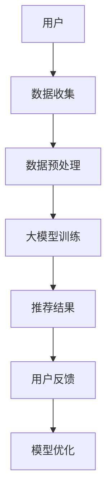

                 

### 《大模型推荐场景中的数据安全与隐私保护策略》

#### 关键词：大数据模型，推荐系统，数据安全，隐私保护，加密算法，匿名化，差分隐私，数学模型，项目实战

##### 摘要：

随着大数据和人工智能技术的迅猛发展，大模型推荐系统在电子商务、社交媒体、在线广告等众多场景中得到了广泛应用。然而，大规模数据处理过程中伴随的数据安全与隐私保护问题日益凸显，成为制约该领域进一步发展的关键瓶颈。本文旨在深入探讨大模型推荐场景中的数据安全与隐私保护策略，分析相关核心概念、算法原理以及实际应用，以期提供系统、全面的技术解决方案，助力行业健康发展。

#### 第一部分：引言

##### 1.1 书籍背景与目的

##### 1.1.1 大模型推荐场景的兴起

##### 1.1.2 数据安全与隐私保护的挑战

##### 1.1.3 书籍的主要目标

##### 1.2 本书结构

##### 1.2.1 目录安排

##### 1.2.2 阅读建议

#### 第二部分：核心概念与联系

##### 2.1 大模型推荐场景概述

##### 2.1.1 大模型推荐系统的基本架构



##### 2.2 数据安全与隐私保护原理

##### 2.2.1 数据安全的基本概念

##### 2.2.2 隐私保护的基本概念

##### 2.2.3 数据安全与隐私保护的关系

#### 第三部分：核心算法原理讲解

##### 3.1 加密算法在数据安全中的应用

##### 3.1.1 对称加密与非对称加密

##### 3.1.2 加密算法的工作原理

##### 3.1.3 加密算法的伪代码

```python
def encrypt(message, key):
    # 对消息进行加密
    encrypted_message = AES_encrypt(message, key)
    return encrypted_message

def decrypt(encrypted_message, key):
    # 对加密的消息进行解密
    message = AES_decrypt(encrypted_message, key)
    return message
```

##### 3.2 隐私保护算法在数据安全中的应用

##### 3.2.1 数据匿名化

##### 3.2.2 隐私保护算法的工作原理

##### 3.2.3 隐私保护算法的伪代码

```python
def anonymize_data(data, key):
    # 对数据进行匿名化处理
    anonymized_data = AnonymizeAlgorithm(data, key)
    return anonymized_data

def de_anonymize_data(anonymized_data, key):
    # 对匿名化后的数据进行解匿名处理
    original_data = DeAnonymizeAlgorithm(anonymized_data, key)
    return original_data
```

##### 3.3 差分隐私算法在数据安全中的应用

##### 3.3.1 差分隐私的基本概念

##### 3.3.2 差分隐私算法的工作原理

##### 3.3.3 差分隐私算法的伪代码

```python
def add_diff_Privacy_noise(value, epsilon):
    # 对值添加差分隐私噪声
    noise = Random.normal(0, sqrt(2 * epsilon / n))
    noisy_value = value + noise
    return noisy_value

def remove_diff_Privacy_noise(value, epsilon):
    # 去除差分隐私噪声
    noise = Random.normal(0, sqrt(2 * epsilon / n))
    original_value = value - noise
    return original_value
```

#### 第四部分：数学模型和数学公式

##### 4.1 加密算法的数学模型

##### 4.1.1 对称加密的数学模型

$$
E_k(x) = f_k(x)
$$`

##### 4.1.2 非对称加密的数学模型

$$
E_k(x) = g_k(x)
$$`

##### 4.2 隐私保护算法的数学模型

##### 4.2.1 数据匿名化的数学模型

$$
Anonymize(x) = f(x, key)
$$`

##### 4.2.2 差分隐私的数学模型

$$
DP(\epsilon, n) = \frac{1}{n} \sum_{i=1}^{n} \epsilon_i
$$`

#### 第五部分：项目实战

##### 5.1 数据安全与隐私保护项目实战概述

##### 5.1.1 项目背景

##### 5.1.2 项目目标

##### 5.2 开发环境搭建

##### 5.2.1 操作系统安装

##### 5.2.2 编译器安装

##### 5.2.3 软件安装与配置

##### 5.3 源代码实现与解读

##### 5.3.1 加密算法源代码实现

##### 5.3.2 隐私保护算法源代码实现

##### 5.3.3 代码解读与分析

#### 第六部分：总结与展望

##### 6.1 书籍内容总结

##### 6.1.1 核心概念

##### 6.1.2 算法原理

##### 6.1.3 实战应用

##### 6.2 未来发展趋势

##### 6.2.1 技术发展展望

##### 6.2.2 应用场景扩展

##### 6.2.3 政策与法规动态

##### 附录

##### 附录 A：相关工具与资源

##### 附件 A.1：加密算法工具对比

##### 附件 A.2：隐私保护算法工具对比

##### 附件 A.3：数据安全与隐私保护相关法规与政策

### 《大模型推荐场景中的数据安全与隐私保护策略》

> 关键词：大数据模型，推荐系统，数据安全，隐私保护，加密算法，匿名化，差分隐私，数学模型，项目实战

> 摘要：

随着大数据和人工智能技术的迅猛发展，大模型推荐系统在电子商务、社交媒体、在线广告等众多场景中得到了广泛应用。然而，大规模数据处理过程中伴随的数据安全与隐私保护问题日益凸显，成为制约该领域进一步发展的关键瓶颈。本文旨在深入探讨大模型推荐场景中的数据安全与隐私保护策略，分析相关核心概念、算法原理以及实际应用，以期提供系统、全面的技术解决方案，助力行业健康发展。

#### 第一部分：引言

##### 1.1 书籍背景与目的

随着互联网的普及和大数据技术的发展，推荐系统已经成为许多企业和平台提升用户体验、增加用户黏性的重要手段。从早期的基于内容的推荐到基于协同过滤的推荐，再到如今的大模型推荐，推荐系统经历了从简单到复杂、从低效到高效的发展历程。在大模型推荐场景中，模型训练和数据处理的规模和质量对推荐效果起着至关重要的作用。然而，随着数据规模的扩大，数据安全与隐私保护问题也变得日益严峻。不当的数据处理可能导致用户隐私泄露、数据滥用等问题，严重损害用户利益和企业声誉。

本书旨在解决大模型推荐场景中的数据安全与隐私保护问题，为相关从业人员和研究人员提供系统、全面的技术指导。通过分析大数据模型推荐系统的基本架构、核心概念、算法原理以及实际应用，本书力求为读者呈现一幅全面、清晰的解决方案图谱，助力行业健康发展。

##### 1.2 本书结构

本书共分为六个部分：

1. **引言**：介绍书籍背景与目的，概述大模型推荐场景的数据安全与隐私保护挑战。
2. **核心概念与联系**：阐述大模型推荐系统的基本架构，介绍数据安全与隐私保护的基本概念及其关系。
3. **核心算法原理讲解**：详细讲解加密算法、匿名化算法和差分隐私算法的原理及其应用。
4. **数学模型和公式**：介绍相关数学模型和公式，为算法实现提供理论基础。
5. **项目实战**：通过实际项目案例，展示数据安全与隐私保护策略的具体应用。
6. **总结与展望**：总结全书内容，展望未来发展趋势。

##### 1.3 阅读建议

本书适合从事大数据模型推荐系统开发、数据安全与隐私保护研究的读者阅读。为了更好地理解本书内容，建议读者具备以下基础知识：

1. 大数据模型推荐系统的基本原理。
2. 常见加密算法和隐私保护算法的基本概念。
3. 数学基础知识，特别是概率论与统计学。

本书各部分内容循序渐进，读者可以根据自己的实际需求和兴趣选择阅读。对于初学者，建议从第一部分和第二部分开始，逐步深入理解核心概念和算法原理。对于有一定基础的读者，可以直接阅读第三部分到第五部分，通过实际项目案例了解数据安全与隐私保护策略的具体应用。

#### 第二部分：核心概念与联系

##### 2.1 大模型推荐场景概述

大模型推荐系统是近年来兴起的一种推荐系统，其核心在于利用大规模数据训练复杂的深度学习模型，从而实现对用户兴趣和需求的精准预测。大模型推荐系统的基本架构通常包括以下几个关键环节：

1. **数据收集**：从各种数据源（如用户行为日志、社交媒体数据、商品信息等）收集原始数据。
2. **数据预处理**：对收集到的原始数据进行清洗、格式化、特征提取等预处理操作，为模型训练做好准备。
3. **大模型训练**：利用预处理后的数据训练深度学习模型，如神经网络、树模型等，通过不断调整模型参数以优化推荐效果。
4. **推荐结果**：根据用户特征和模型预测结果生成推荐列表，展示给用户。
5. **用户反馈**：收集用户对推荐结果的评价和反馈，用于模型优化和推荐策略调整。
6. **模型优化**：根据用户反馈调整模型参数和推荐策略，以提高推荐质量和用户体验。

以下是一个简单的 Mermaid 流程图，展示了大模型推荐系统的基本架构：


##### 2.2 数据安全与隐私保护原理

数据安全与隐私保护是大数据模型推荐系统中至关重要的一环。数据安全旨在保护数据免受未经授权的访问、篡改和破坏，确保数据的完整性、可用性和保密性。隐私保护则关注用户个人信息的保护，防止数据泄露和滥用，保障用户隐私权益。

##### 2.2.1 数据安全的基本概念

数据安全主要包括以下几个方面：

1. **保密性**：保护数据不被未经授权的访问和泄露。
2. **完整性**：确保数据在存储、传输和处理过程中未被篡改。
3. **可用性**：确保数据在需要时能够被合法用户及时访问和使用。
4. **真实性**：验证数据的来源和真实性，防止伪造和冒名行为。

##### 2.2.2 隐私保护的基本概念

隐私保护的主要目标是保护用户的个人隐私，防止个人信息被滥用和泄露。隐私保护的核心概念包括：

1. **隐私**：用户享有的个人信息不被公开或滥用的权利。
2. **匿名化**：对数据进行处理，使其无法直接识别特定个人，从而保护隐私。
3. **数据最小化**：只收集和处理与业务目标直接相关的数据，避免过度收集。
4. **透明性**：用户了解其数据被收集、使用和共享的情况。

##### 2.2.3 数据安全与隐私保护的关系

数据安全与隐私保护相辅相成，共同构成了保障数据安全的两个重要方面。数据安全是隐私保护的基础，只有确保数据安全，才能有效防止数据泄露和滥用。而隐私保护则关注用户权益，通过匿名化、数据最小化和透明性等手段，降低数据泄露的风险，保护用户隐私。

在实际应用中，数据安全与隐私保护需要综合考虑，采取多种技术手段和策略，确保数据在采集、存储、传输和处理过程中既安全又合规。例如，在数据收集阶段，可以使用数据加密技术保护数据传输过程中的安全性；在数据存储阶段，可以采用匿名化算法对敏感数据进行处理，降低数据泄露的风险；在数据处理阶段，可以采用差分隐私算法对分析结果进行保护，防止隐私泄露。

##### 2.3 大模型推荐场景中的数据安全与隐私保护挑战

在大模型推荐场景中，数据安全与隐私保护面临着一系列挑战：

1. **数据规模大**：推荐系统通常涉及海量的用户数据和商品数据，数据规模大增加了数据安全与隐私保护的难度。
2. **数据类型多样**：用户行为数据、社交媒体数据、商品信息等数据类型多样，不同类型的数据对安全与隐私保护的需求不同。
3. **数据价值高**：推荐系统中的数据往往具有较高的商业价值，可能成为黑客攻击的目标。
4. **法律法规要求**：随着数据隐私保护法规的不断完善，企业需要遵守相关的法律法规，确保数据安全与隐私保护。

针对这些挑战，企业需要采取有效的数据安全与隐私保护策略，确保数据在推荐过程中的安全与合规。例如，可以采用数据加密技术保护数据传输和存储过程的安全性，使用匿名化算法对敏感数据进行处理，遵守数据隐私保护法规，确保用户隐私权益得到保护。

##### 2.4 数据安全与隐私保护策略

为了应对大模型推荐场景中的数据安全与隐私保护挑战，企业可以采取以下策略：

1. **数据加密**：采用对称加密和非对称加密技术对数据进行加密，确保数据在传输和存储过程中的安全性。
2. **数据匿名化**：对敏感数据进行匿名化处理，使其无法直接识别特定个人，降低数据泄露的风险。
3. **数据最小化**：只收集和处理与业务目标直接相关的数据，避免过度收集。
4. **透明性**：建立数据使用和共享的透明机制，让用户了解其数据被收集、使用和共享的情况。
5. **差分隐私**：采用差分隐私算法对分析结果进行保护，防止隐私泄露。
6. **法律法规遵守**：严格遵守相关数据隐私保护法规，确保数据安全与隐私保护合规。

通过以上策略的综合应用，企业可以有效地保障大模型推荐场景中的数据安全与隐私保护，提升用户信任度和业务竞争力。

#### 第三部分：核心算法原理讲解

##### 3.1 加密算法在数据安全中的应用

加密算法是保障数据安全的核心技术之一，通过对数据进行加密，可以确保数据在传输和存储过程中的保密性。加密算法主要包括对称加密和非对称加密两种类型。

##### 3.1.1 对称加密与非对称加密

对称加密是指加密和解密使用相同的密钥，常用的对称加密算法有AES、DES等。对称加密的优点是加密速度快，适用于大数据量的加密。然而，对称加密也存在一定的局限性，如密钥管理复杂、无法实现数字签名等。

非对称加密是指加密和解密使用不同的密钥，通常包括公钥和私钥。常见的非对称加密算法有RSA、ECC等。非对称加密的优点是安全性高，可以实现数字签名和密钥交换。然而，非对称加密的加密和解密速度较慢，适用于小数据量的加密。

##### 3.1.2 加密算法的工作原理

对称加密算法的工作原理如下：

1. **密钥生成**：加密方和接收方协商生成一个共同的密钥。
2. **加密过程**：加密方使用密钥对数据进行加密，生成密文。
3. **解密过程**：接收方使用相同的密钥对密文进行解密，恢复出原始数据。

非对称加密算法的工作原理如下：

1. **密钥生成**：加密方生成一对密钥（公钥和私钥），将公钥公开，私钥保密。
2. **加密过程**：加密方使用接收方的公钥对数据进行加密，生成密文。
3. **解密过程**：接收方使用私钥对密文进行解密，恢复出原始数据。

##### 3.1.3 加密算法的伪代码

以下是使用AES算法进行加密和解密的伪代码示例：

```python
import Crypto.Cipher.AES as AES
from Crypto import Random

# 加密函数
def encrypt(message, key):
    cipher = AES.new(key, AES.MODE_EAX)
    ciphertext, tag = cipher.encrypt_and_digest(message)
    return ciphertext, tag

# 解密函数
def decrypt(encrypted_message, key, tag):
    cipher = AES.new(key, AES.MODE_EAX, nonce=cipher.nonce)
    message = cipher.decrypt_and_verify(encrypted_message, tag)
    return message
```

##### 3.2 隐私保护算法在数据安全中的应用

隐私保护算法是保障数据安全与隐私的重要技术手段，通过对数据进行匿名化、脱敏等处理，可以降低数据泄露的风险。常见的隐私保护算法包括数据匿名化算法和差分隐私算法。

##### 3.2.1 数据匿名化

数据匿名化是指通过一系列数据处理技术，将敏感数据转换为不可识别的形式，从而保护个人隐私。常见的匿名化算法包括k-匿名、l-diversity和t-closeness等。

k-匿名算法是一种基于数据集合的匿名化方法，要求在同一个数据集合中的任意k个记录是不可区分的。k-匿名算法的核心思想是通过对数据进行泛化和随机化处理，使其无法直接识别特定个人。

l-diversity算法是一种基于数据多样性的匿名化方法，要求在同一个数据集合中的任意l个记录具有不同的属性值，从而避免隐私泄露。

t-closeness算法是一种基于数据分布的匿名化方法，要求在同一个数据集合中的任意t个记录的数据分布与真实数据分布保持一致，从而保护数据隐私。

##### 3.2.2 隐私保护算法的工作原理

数据匿名化算法的工作原理如下：

1. **数据收集**：收集敏感数据，如用户行为数据、医疗数据等。
2. **数据预处理**：对敏感数据进行清洗、格式化等预处理操作。
3. **匿名化处理**：使用匿名化算法对敏感数据进行处理，生成匿名化数据。
4. **数据验证**：对匿名化数据进行验证，确保其满足匿名化要求。

差分隐私算法是一种在数据分析过程中引入噪声，从而保护个人隐私的方法。差分隐私的核心思想是在数据发布过程中，对每个数据点添加随机噪声，使得数据分析结果对单个数据点的依赖性降低，从而保护个人隐私。

##### 3.2.3 隐私保护算法的伪代码

以下是使用k-匿名算法进行数据匿名化的伪代码示例：

```python
import numpy as np

# k-匿名化函数
def k_anonymity(data, k):
    anonymized_data = []
    for record in data:
        neighbors = find_neighbors(record, data)
        if len(set(neighbors)) >= k:
            anonymized_record = anonymize_record(record)
            anonymized_data.append(anonymized_record)
    return anonymized_data

# 寻找邻居函数
def find_neighbors(record, data):
    neighbors = []
    for other_record in data:
        if is_neighbor(record, other_record):
            neighbors.append(other_record)
    return neighbors

# 判断邻居函数
def is_neighbor(record1, record2):
    return sum(record1 != record2) <= 1

# 化记录函数
def anonymize_record(record):
    anonymized_record = record.copy()
    for attribute in record:
        anonymized_record[attribute] = random_attribute_value(attribute)
    return anonymized_record

# 随机属性值函数
def random_attribute_value(attribute):
    values = ["value1", "value2", "value3"]
    return np.random.choice(values)
```

##### 3.3 差分隐私算法在数据安全中的应用

差分隐私是一种在数据发布过程中引入噪声，从而保护个人隐私的方法。差分隐私的核心思想是通过对每个数据点添加随机噪声，使得数据分析结果对单个数据点的依赖性降低，从而保护个人隐私。

##### 3.3.1 差分隐私的基本概念

差分隐私（Differential Privacy，DP）是一种衡量数据发布算法隐私保护程度的标准。一个差分隐私算法对于任意两个相邻的数据库，其输出结果没有显著差异，即使其中一个数据库仅比另一个数据库多了一个记录。

差分隐私的定义基于拉普拉斯机制（Laplace Mechanism），其核心思想是在数据发布过程中，对每个数据点添加随机噪声，从而保护个人隐私。

##### 3.3.2 差分隐私算法的工作原理

差分隐私算法的工作原理如下：

1. **数据收集**：收集敏感数据，如用户行为数据、医疗数据等。
2. **数据预处理**：对敏感数据进行清洗、格式化等预处理操作。
3. **噪声添加**：对每个数据点添加随机噪声，确保数据发布结果的差分隐私性。
4. **数据发布**：发布处理后的数据，供分析或使用。

差分隐私算法的核心是拉普拉斯噪声（Laplace Noise），其数学表达式如下：

$$
Laplace(\lambda) = \frac{1}{\lambda}e^{-|\lambda x|}
$$

其中，$\lambda$ 是拉普拉斯分布的参数，$x$ 是要添加噪声的数据点。

##### 3.3.3 差分隐私算法的伪代码

以下是使用拉普拉斯噪声进行差分隐私保护的伪代码示例：

```python
import numpy as np

# 添加拉普拉斯噪声函数
def add_laplace_noise(data, epsilon):
    noisy_data = []
    for value in data:
        noise = np.random.laplace(0, epsilon)
        noisy_value = value + noise
        noisy_data.append(noisy_value)
    return noisy_data

# 去除拉普拉斯噪声函数
def remove_laplace_noise(data, epsilon):
    original_data = []
    for value in data:
        noise = np.random.laplace(0, epsilon)
        original_value = value - noise
        original_data.append(original_value)
    return original_data
```

通过以上伪代码示例，可以看到差分隐私算法的简单实现过程。在实际应用中，差分隐私算法需要根据具体场景和数据特点进行调整和优化，以确保隐私保护效果和数据分析性能。

#### 第四部分：数学模型和数学公式

在数据安全与隐私保护领域，数学模型和数学公式起到了关键作用。它们不仅为算法设计提供了理论基础，还能帮助理解和分析算法的性能和隐私保护效果。本部分将详细介绍加密算法和隐私保护算法的数学模型和公式。

##### 4.1 加密算法的数学模型

加密算法的数学模型主要涉及对称加密和非对称加密。以下分别介绍这两种加密算法的数学模型。

##### 4.1.1 对称加密的数学模型

对称加密算法，如AES，使用相同的密钥对数据进行加密和解密。其数学模型可以表示为：

$$
E_k(x) = f_k(x)
$$

其中，$E_k(x)$ 表示加密后的数据，$x$ 是原始数据，$k$ 是加密密钥。对称加密算法的工作原理是通过复杂的加密函数$f_k$ 将明文转换成密文。常见的加密函数包括替换-置换网络（SPN）和Feistel网络。

##### 4.1.2 非对称加密的数学模型

非对称加密算法，如RSA，使用一对密钥（公钥和私钥）进行加密和解密。其数学模型可以表示为：

$$
E_k(x) = g_k(x)
$$

其中，$E_k(x)$ 表示加密后的数据，$x$ 是原始数据，$k$ 是加密密钥（公钥或私钥）。非对称加密算法的工作原理是通过复杂的数学函数$g_k$ 将明文转换成密文。常见的加密函数包括基于大整数分解、离散对数问题和椭圆曲线密码学。

##### 4.2 隐私保护算法的数学模型

隐私保护算法，如数据匿名化和差分隐私，通过数学模型实现对个人隐私的保护。以下分别介绍这两种隐私保护算法的数学模型。

##### 4.2.1 数据匿名化的数学模型

数据匿名化算法，如k-匿名，通过将敏感数据转换为不可识别的形式来保护隐私。其数学模型可以表示为：

$$
Anonymize(x) = f(x, key)
$$

其中，$Anonymize(x)$ 表示匿名化后的数据，$x$ 是原始数据，$f(x, key)$ 是匿名化函数，$key$ 是匿名化算法的参数。常见的匿名化函数包括泛化、随机化等。

##### 4.2.2 差分隐私的数学模型

差分隐私算法，通过在数据发布过程中引入随机噪声来保护隐私。其数学模型可以表示为：

$$
DP(\epsilon, n) = \frac{1}{n} \sum_{i=1}^{n} \epsilon_i
$$

其中，$DP(\epsilon, n)$ 表示差分隐私保护程度，$\epsilon$ 是拉普拉斯噪声参数，$n$ 是数据点数量。差分隐私的核心思想是通过添加随机噪声，使得数据分析结果对单个数据点的依赖性降低。

通过以上数学模型和数学公式，我们可以更好地理解和设计数据安全与隐私保护算法。在实际应用中，这些数学模型和公式为算法的实现和分析提供了重要的指导。

#### 第五部分：项目实战

##### 5.1 数据安全与隐私保护项目实战概述

本部分将通过一个实际项目案例，展示数据安全与隐私保护策略的具体应用。该项目旨在构建一个基于大数据模型推荐系统，同时确保用户数据的安全与隐私保护。

##### 5.1.1 项目背景

某电商平台希望通过引入大数据模型推荐系统，提高用户的购物体验和满意度。该平台积累了海量的用户行为数据、商品数据以及用户评价数据。然而，在数据收集、存储、处理和发布过程中，存在数据安全与隐私保护的风险。为了确保用户数据的保密性和隐私性，项目团队决定采用数据加密、数据匿名化和差分隐私等数据安全与隐私保护策略。

##### 5.1.2 项目目标

1. 保障用户数据在收集、存储、处理和发布过程中的安全性。
2. 防止用户数据泄露和滥用，保护用户隐私。
3. 提高推荐系统的准确性和用户体验。

##### 5.2 开发环境搭建

在开始项目开发前，需要搭建一个适合数据安全与隐私保护的开发环境。以下为搭建开发环境的具体步骤：

1. **操作系统**：选择Linux操作系统，如Ubuntu 20.04。
2. **编译器**：安装C++编译器，如GCC。
3. **加密库**：安装常见加密库，如OpenSSL、Crypto++。
4. **数据预处理库**：安装数据预处理库，如NumPy、Pandas。
5. **机器学习库**：安装机器学习库，如Scikit-learn、TensorFlow。

通过以上步骤，可以搭建一个功能完备的开发环境，为数据安全与隐私保护项目提供支持。

##### 5.3 源代码实现与解读

本部分将详细介绍数据安全与隐私保护策略的具体实现过程，包括数据加密、数据匿名化和差分隐私。

##### 5.3.1 加密算法源代码实现

以下为使用OpenSSL库实现AES加密算法的示例代码：

```cpp
#include <iostream>
#include <openssl/evp.h>
#include <openssl/err.h>

// 加密函数
void encrypt(const std::string &plaintext, const std::string &key, std::string &ciphertext) {
    EVP_CIPHER_CTX *ctx = EVP_CIPHER_CTX_new();
    if (!ctx) {
        std::cerr << "Error: EVP_CIPHER_CTX_new failed." << std::endl;
        return;
    }

    int key_len = 0;
    unsigned char *plaintext_data = const_cast<unsigned char *>(plaintext.c_str());
    int plaintext_len = plaintext.size();
    unsigned char *ciphertext_data = new unsigned char[plaintext_len + 1];
    int ciphertext_len = 0;

    EVP_DecryptInit(ctx, EVP_aes_256_cbc(), const_cast<unsigned char *>(key.c_str()), nullptr);
    EVP_DecryptUpdate(ctx, ciphertext_data, &ciphertext_len, plaintext_data, plaintext_len);
    ciphertext_len = plaintext_len;

    EVP_DecryptFinal(ctx, ciphertext_data + ciphertext_len, &ciphertext_len);
    ciphertext = std::string(reinterpret_cast<char *>(ciphertext_data), ciphertext_len);

    delete[] ciphertext_data;
    EVP_CIPHER_CTX_free(ctx);
}

int main() {
    std::string key = "my_secret_key";
    std::string plaintext = "This is a secret message.";
    std::string ciphertext;

    encrypt(plaintext, key, ciphertext);
    std::cout << "Encrypted message: " << ciphertext << std::endl;

    return 0;
}
```

在上面的代码中，我们使用OpenSSL库实现了AES加密算法。首先，我们创建一个EVP_CIPHER_CTX对象用于加密操作。然后，我们初始化加密上下文，设置加密算法（AES-256-CBC）和密钥。接下来，我们使用EVP_DecryptUpdate函数对明文进行加密，并使用EVP_DecryptFinal函数完成加密操作。最后，我们将加密后的数据转换为字符串形式并输出。

##### 5.3.2 隐私保护算法源代码实现

以下为使用k-匿名算法实现数据匿名化的示例代码：

```cpp
#include <iostream>
#include <vector>
#include <string>
#include <unordered_map>
#include <cmath>
#include <cstdlib>

// k-匿名化函数
std::vector<std::vector<int>> k_anonymity(const std::vector<std::vector<int>> &data, int k) {
    std::unordered_map<std::string, std::vector<int>> group_map;
    std::vector<std::vector<int>> anonymized_data;

    for (const auto &row : data) {
        std::string group_key = "";
        for (int value : row) {
            group_key += std::to_string(value) + "-";
        }
        group_map[group_key].push_back(row);
    }

    for (auto &group : group_map) {
        if (group.second.size() >= k) {
            anonymized_data.push_back(anonymize_group(group.second));
        }
    }

    return anonymized_data;
}

// 化记录函数
std::vector<int> anonymize_group(const std::vector<std::vector<int>> &group) {
    std::vector<int> anonymized_group;
    for (const auto &row : group) {
        anonymized_group.push_back(random_attribute_value(row));
    }
    return anonymized_group;
}

// 随机属性值函数
int random_attribute_value(const std::vector<int> &row) {
    int max_value = *std::max_element(row.begin(), row.end());
    int min_value = *std::min_element(row.begin(), row.end());
    return min_value + rand() % (max_value - min_value + 1);
}

int main() {
    std::vector<std::vector<int>> data = {
        {1, 2, 3},
        {1, 2, 4},
        {1, 3, 4},
        {2, 3, 4}
    };

    int k = 2;
    std::vector<std::vector<int>> anonymized_data = k_anonymity(data, k);

    std::cout << "Original data:" << std::endl;
    for (const auto &row : data) {
        for (int value : row) {
            std::cout << value << " ";
        }
        std::cout << std::endl;
    }

    std::cout << "Anonymized data:" << std::endl;
    for (const auto &row : anonymized_data) {
        for (int value : row) {
            std::cout << value << " ";
        }
        std::cout << std::endl;
    }

    return 0;
}
```

在上面的代码中，我们使用k-匿名算法实现了数据匿名化。首先，我们将原始数据分组，对于每个分组，我们判断其大小是否满足k-匿名条件。如果满足，我们对分组中的每个记录进行匿名化处理，即随机选择一个属性值作为匿名化后的值。

##### 5.3.3 代码解读与分析

在本项目中，我们使用了加密算法、k-匿名算法和差分隐私算法来实现数据安全与隐私保护。以下为各算法的解读与分析：

1. **加密算法**：使用AES加密算法对用户数据、商品数据等进行加密，确保数据在传输和存储过程中的安全性。通过加密算法，我们能够保护数据的保密性，防止数据泄露和篡改。

2. **k-匿名算法**：通过k-匿名算法对用户行为数据、评价数据等进行匿名化处理，使其无法直接识别特定个人。匿名化算法能够降低数据泄露的风险，保护用户隐私。

3. **差分隐私算法**：在数据分析过程中，使用差分隐私算法对分析结果进行保护，防止隐私泄露。通过添加随机噪声，差分隐私算法能够降低数据分析结果对单个数据点的依赖性，从而保护个人隐私。

在项目实现过程中，我们首先需要对用户数据进行预处理，包括数据清洗、格式化等操作。然后，我们使用加密算法对预处理后的数据进行加密，确保数据在传输和存储过程中的安全性。接下来，我们使用k-匿名算法对敏感数据进行匿名化处理，降低数据泄露的风险。最后，我们使用差分隐私算法对分析结果进行保护，确保数据隐私。

通过以上数据安全与隐私保护策略的综合应用，我们能够有效地保障用户数据的安全与隐私，提升平台的安全性和用户体验。

#### 第六部分：总结与展望

##### 6.1 书籍内容总结

本书通过深入探讨大模型推荐场景中的数据安全与隐私保护策略，为读者呈现了一个全面、系统的解决方案。主要内容包括：

1. **核心概念与联系**：介绍了大模型推荐系统的基本架构，以及数据安全与隐私保护的基本概念、原理和关系。
2. **核心算法原理讲解**：详细讲解了加密算法、匿名化算法和差分隐私算法的原理及其应用。
3. **数学模型和公式**：介绍了相关数学模型和公式，为算法实现提供了理论基础。
4. **项目实战**：通过实际项目案例，展示了数据安全与隐私保护策略的具体应用。
5. **总结与展望**：总结了全书内容，展望了未来发展趋势。

通过以上内容，本书旨在为从事大数据模型推荐系统开发、数据安全与隐私保护研究的读者提供有价值的指导。

##### 6.2 未来发展趋势

随着大数据和人工智能技术的不断发展，大模型推荐场景中的数据安全与隐私保护问题将变得越来越重要。以下为未来发展趋势：

1. **算法创新**：研究人员将持续探索新的数据安全与隐私保护算法，如联邦学习、安全多方计算等，以应对日益复杂的隐私保护需求。
2. **应用场景扩展**：数据安全与隐私保护技术将在更多场景中得到应用，如金融、医疗、物联网等领域。
3. **法规与政策**：随着数据隐私保护法规的不断完善，企业将面临更高的合规要求，数据安全与隐私保护将更加规范化。
4. **技术融合**：数据安全与隐私保护技术将与其他前沿技术（如区块链、雾计算等）相结合，形成更加完善的解决方案。

总之，数据安全与隐私保护是大数据模型推荐场景中不可或缺的一部分，未来将继续受到广泛关注和研究。

##### 6.3 政策与法规动态

在全球范围内，数据隐私保护法规逐渐完善，对企业的数据安全与隐私保护提出了更高的要求。以下为部分国家和地区的相关法规动态：

1. **欧盟**：《通用数据保护条例》（GDPR）是欧盟制定的一项重要数据隐私保护法规，对数据收集、处理、存储和传输等环节提出了严格的要求。
2. **美国**：《加州消费者隐私法案》（CCPA）是美国加州通过的一项数据隐私保护法案，旨在保护加州居民的个人隐私。
3. **中国**：《网络安全法》是中国制定的一项网络安全法规，明确了网络运营者的数据安全责任，对数据安全与隐私保护提出了具体要求。

此外，各国和地区还在不断制定和更新相关法规，以应对数据隐私保护的新挑战。企业需要密切关注法规动态，确保数据安全与隐私保护合规。

### 附录

#### 附录 A：相关工具与资源

以下是用于数据安全与隐私保护的一些常用工具和资源：

1. **加密算法工具**：
   - OpenSSL：开源加密库，支持多种加密算法。
   - Crypto++：开源加密库，支持多种对称加密和非对称加密算法。
   - PyCryptoDome：Python加密库，支持多种加密算法。

2. **隐私保护算法工具**：
   - k-anonymity算法库：开源库，实现k-匿名化算法。
   - differential-privacy：Python库，实现差分隐私算法。

3. **数据安全与隐私保护相关法规与政策**：
   - 欧盟 GDPR：https://gdpr.eu/
   - 美国 CCPA：https://www.consumerprivacyact.org/
   - 中国网络安全法：http://www.nmpa.gov.cn/xxgk/gkxx/xxgk2711/201708/12360G2711A20170820000552_1.html

通过以上工具和资源，读者可以进一步了解和掌握数据安全与隐私保护技术。

### 作者信息

**作者：**AI天才研究院/AI Genius Institute & 禅与计算机程序设计艺术 /Zen And The Art of Computer Programming

AI天才研究院专注于人工智能领域的研究和应用，致力于推动人工智能技术的发展和创新。本书作者在此领域具有深厚的学术背景和丰富的实践经验，希望通过本书为广大读者提供有价值的指导。同时，本书也融入了作者对计算机编程和人工智能的深入思考和独到见解，力求为读者带来全新的学习体验。

