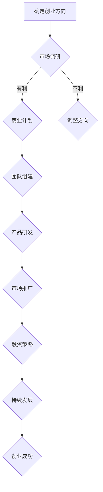

                 

# 大模型时代的创业者创业心得分享：经验教训、成功要素与发展建议

> **关键词：** 大模型时代、创业者、经验教训、成功要素、发展建议

> **摘要：** 本文将探讨大模型时代给创业者带来的机遇与挑战，分享作者在人工智能领域创业的经验教训，分析成功创业的要素，并提供大模型时代下的创业建议。文章旨在帮助创业者更好地把握时代趋势，实现创业梦想。

## 第1章: 大模型时代概述

### 1.1 大模型时代的到来

#### 1.1.1 从传统模型到大规模模型的演变

在计算机科学和人工智能领域，模型的演变经历了从传统模型到大规模模型的转变。传统模型通常指那些在训练数据量有限的情况下表现良好的模型，如线性回归、决策树等。这些模型在处理小数据集时表现良好，但随着数据量的增加，其性能逐渐下降。

随着计算能力和数据存储技术的发展，大规模模型应运而生。大规模模型具有数亿甚至数千亿个参数，能够处理海量数据，显著提升模型的性能和泛化能力。这一转变标志着人工智能进入了一个全新的时代。

#### 1.1.2 大规模模型的关键作用

大规模模型在人工智能领域扮演着关键角色。首先，它们能够处理复杂的任务，如自然语言处理、图像识别、语音识别等。其次，大规模模型具有强大的泛化能力，能够在不同领域和场景中应用。此外，大规模模型在数据稀疏的情况下依然能够保持较高的性能，这是传统模型难以实现的。

#### 1.1.3 大模型时代的特征

大模型时代的特征主要体现在以下几个方面：

1. **数据驱动的研发**：大规模模型的训练依赖于海量数据，数据质量对模型性能有直接影响。因此，数据驱动的研发成为大模型时代的核心特征。
2. **计算资源的依赖**：大规模模型的训练和推理需要大量的计算资源，如高性能GPU、TPU等。这导致计算资源的依赖成为大模型时代的另一个特征。
3. **算法的创新**：为了训练和优化大规模模型，研究人员不断创新算法，如优化算法、正则化方法等。算法的创新是大模型时代的重要特征。

### 1.2 大模型的核心概念与架构

#### 1.2.1 大模型的定义

大模型通常指具有数亿甚至数千亿个参数的神经网络模型。这些模型通常使用深度学习技术进行训练，具有强大的表示能力和泛化能力。

#### 1.2.2 大模型的基本架构

大模型的基本架构通常包括以下几个部分：

1. **输入层**：接收外部输入数据，如文本、图像、音频等。
2. **隐藏层**：进行特征提取和变换，通常包含多个隐藏层。
3. **输出层**：生成模型的预测结果，如分类标签、文本生成等。

#### 1.2.3 大模型与传统模型对比

大模型与传统模型在多个方面存在显著差异：

1. **参数规模**：大模型具有数十亿个参数，而传统模型通常只有数千或数万个参数。
2. **计算资源需求**：大模型的训练和推理需要大量的计算资源，而传统模型对计算资源的需求相对较小。
3. **泛化能力**：大模型在处理复杂任务时具有更强的泛化能力，能够适应不同的领域和场景。
4. **训练数据量**：大模型的训练依赖于海量数据，而传统模型通常在有限数据集上表现良好。

### 1.3 主流大模型介绍

#### 1.3.1 GPT系列模型

GPT系列模型是自然语言处理领域的代表性大模型。GPT（Generative Pre-trained Transformer）模型基于Transformer架构，通过大规模预训练，能够生成高质量的自然语言文本。GPT-3是当前最先进的GPT模型，具有1750亿个参数，表现出卓越的文本生成和语言理解能力。

#### 1.3.2 BERT及其变体

BERT（Bidirectional Encoder Representations from Transformers）是另一个重要的自然语言处理大模型。BERT模型通过双向Transformer架构，对文本进行编码，生成语义丰富的表示。BERT及其变体（如RoBERTa、ALBERT等）在多种自然语言处理任务中取得了优异的成绩。

#### 1.3.3 其他知名大模型

除了GPT和BERT，还有许多其他知名的大模型，如：

1. **ViT（Vision Transformer）**：ViT将Transformer架构应用于计算机视觉领域，通过自注意力机制处理图像。
2. **BERT-in-BERT**：BERT-in-BERT模型将多个BERT模型堆叠，以增强模型的表示能力和泛化能力。
3. **T5（Text-To-Text Transfer Transformer）**：T5模型将Transformer架构应用于文本到文本的任务，能够处理多种自然语言处理任务。

### 1.4 大模型在创业中的应用

#### 1.4.1 大模型在创业中的潜在价值

大模型在创业中具有巨大的潜在价值：

1. **增强业务能力**：大模型能够处理复杂任务，如文本生成、图像识别等，为创业公司提供强大的业务支持。
2. **提高决策效率**：大模型能够分析大量数据，为创业公司提供准确的决策依据，提高决策效率。
3. **降低研发成本**：大模型通过预训练，降低了特定任务的研发成本，使创业公司能够更快地推出产品。

#### 1.4.2 大模型应用的优势

大模型应用的优势主要体现在以下几个方面：

1. **强大的表示能力**：大模型具有强大的表示能力，能够捕捉数据中的复杂特征。
2. **高效的推理能力**：大模型在推理过程中具有高效的计算性能，能够快速生成预测结果。
3. **广泛的适用性**：大模型适用于多种领域和任务，具有广泛的适用性。

#### 1.4.3 大模型应用的挑战

大模型应用也面临一些挑战：

1. **计算资源需求**：大模型的训练和推理需要大量的计算资源，对创业公司的资源管理能力提出了较高要求。
2. **数据隐私与安全**：大模型在训练过程中需要大量数据，涉及数据隐私和安全问题，需要采取有效的数据保护措施。
3. **算法公平性**：大模型在处理数据时可能存在算法偏见，需要采取措施确保算法的公平性。

## 第2章: 创业者经验教训

### 2.1 创业初期的挑战与应对策略

#### 2.1.1 资金问题

资金问题是大多数创业公司面临的首要挑战。资金不足可能导致研发进度放缓、市场推广受限，甚至影响公司的生存。以下是一些应对策略：

1. **初创资金规划**：在创业初期，应详细规划资金使用计划，确保资金充足。
2. **融资渠道拓展**：寻找多种融资渠道，如天使投资、风险投资、众筹等，以降低资金压力。
3. **成本控制**：严格控制成本，优化资源配置，提高资金使用效率。

#### 2.1.2 人才招聘

人才是创业公司的核心竞争力。招聘合适的人才对于公司的快速发展至关重要。以下是一些招聘策略：

1. **明确招聘需求**：在招聘过程中，明确岗位需求和岗位职责，确保招聘到合适的人才。
2. **拓展招聘渠道**：通过多种渠道发布招聘信息，如招聘网站、社交媒体、行业论坛等，以吸引更多人才。
3. **面试技巧**：提高面试技巧，确保招聘到的人才具备实际能力和潜力。

#### 2.1.3 市场竞争

市场竞争是创业公司必须面对的现实。如何在激烈的市场竞争中脱颖而出，是创业公司成功的关键。以下是一些应对策略：

1. **产品差异化**：打造独特的产品特色，形成差异化优势，吸引目标用户。
2. **市场定位**：明确目标市场，针对特定用户群体提供高质量的产品和服务。
3. **品牌建设**：加强品牌建设，提高品牌知名度和美誉度，增强市场竞争力。

### 2.2 成功创业要素

#### 2.2.1 创新思维

创新思维是创业公司成功的关键要素之一。创新思维能够帮助创业公司找到独特的解决方案，开拓新的市场空间。以下是一些培养创新思维的方法：

1. **学习与研究**：通过学习最新的技术和行业动态，保持对创新的敏感度。
2. **跨界合作**：与不同领域的专家和团队进行合作，开拓思维，激发创新。
3. **用户反馈**：积极收集用户反馈，从用户需求中寻找创新的灵感。

#### 2.2.2 团队建设

团队建设是创业公司成功的重要保障。一个高效的团队能够充分发挥每个人的优势，共同实现公司目标。以下是一些团队建设的方法：

1. **共同目标**：确保团队成员对公司的愿景和目标有共同的理解和认同。
2. **沟通协作**：建立良好的沟通机制，鼓励团队成员之间的合作与交流。
3. **激励与反馈**：建立激励制度，激励团队成员积极进取，提供及时的反馈，帮助成员不断提升。

#### 2.2.3 客户需求分析

了解客户需求是创业公司制定产品策略和市场策略的重要依据。以下是一些客户需求分析的方法：

1. **市场调研**：通过市场调研，了解目标客户的需求和偏好。
2. **用户访谈**：与目标用户进行深入访谈，获取真实的需求反馈。
3. **数据分析**：利用大数据技术，分析用户行为和需求趋势，为产品研发和市场营销提供数据支持。

### 2.3 创业案例分析

#### 2.3.1 案例一：成功创业公司介绍

**公司背景**：某创业公司专注于人工智能技术在金融领域的应用，开发了一款基于深度学习技术的智能投顾平台。

**成功因素**：

1. **创新思维**：公司创始人具有深厚的金融和人工智能背景，能够将两个领域的优势相结合，打造出独特的智能投顾平台。
2. **团队建设**：公司汇聚了一批顶尖的金融和人工智能专家，具备丰富的行业经验和研发能力。
3. **市场需求**：公司通过市场调研和用户访谈，深入了解金融投资者的需求，为产品研发提供了有力的支持。

**市场表现**：公司产品在短时间内吸引了大量用户，实现了快速增长，并在行业内树立了良好的品牌形象。

#### 2.3.2 案例二：失败创业公司分析

**公司背景**：某创业公司致力于开发一款基于人工智能技术的智能家居平台。

**失败原因**：

1. **市场需求不足**：公司在市场调研中未能准确把握用户需求，导致产品功能与用户期望存在较大差距。
2. **团队建设不力**：公司团队缺乏经验，无法有效推进项目进度，导致产品研发延期。
3. **市场竞争激烈**：智能家居市场竞争激烈，公司未能打造出独特的竞争优势，市场表现不佳。

**教训总结**：创业公司应在市场调研、团队建设和市场竞争策略上做好充分准备，以避免失败。

## 第3章: 大模型时代的创业机会

### 3.1 行业趋势分析

#### 3.1.1 科技行业发展趋势

科技行业的发展趋势为大模型时代的创业提供了广阔的空间。以下是一些关键趋势：

1. **人工智能技术的普及**：人工智能技术在各个行业的应用日益普及，为大模型创业提供了丰富的场景和需求。
2. **云计算与大数据的融合**：云计算和大数据技术的快速发展，为大模型提供了强大的计算和存储支持，推动了大模型时代的到来。
3. **5G网络的普及**：5G网络的普及使得万物互联成为现实，为大模型在物联网领域的应用提供了基础。

#### 3.1.2 市场需求变化

市场需求的变化为大模型创业提供了新的机会。以下是一些关键变化：

1. **个性化服务需求增加**：随着消费者对个性化服务的需求增加，大模型能够提供精准的个性化推荐，满足消费者的需求。
2. **自动化与智能化需求的提升**：企业在自动化和智能化方面的需求日益增长，大模型在自动化流程和智能化决策中的应用前景广阔。
3. **数据隐私和安全需求的提升**：随着数据隐私和安全问题日益突出，大模型在数据隐私保护和安全领域的应用需求增加。

#### 3.1.3 创业方向预测

基于以上趋势和需求变化，以下是大模型时代可能的创业方向：

1. **人工智能技术服务**：提供人工智能技术解决方案，帮助传统企业实现智能化转型。
2. **人工智能产品开发**：开发基于人工智能技术的创新产品，满足市场需求。
3. **人工智能平台建设**：构建人工智能技术平台，为创业者提供技术支持和资源服务。

### 3.2 创业机会挖掘

#### 3.2.1 数据分析在创业中的应用

数据分析在大模型时代创业中具有重要作用。以下是一些应用场景：

1. **用户行为分析**：通过分析用户行为数据，挖掘用户需求，优化产品和服务。
2. **市场趋势预测**：通过分析市场数据，预测市场趋势，为创业决策提供依据。
3. **风险控制与预测**：通过分析数据，识别潜在风险，采取预防措施，降低风险。

#### 3.2.2 大模型在创业中的应用案例

以下是一些大模型在创业中的应用案例：

1. **医疗健康领域**：利用大模型进行疾病预测、诊断和治疗，提高医疗水平。
2. **金融领域**：利用大模型进行风险评估、投资决策和欺诈检测。
3. **教育领域**：利用大模型进行个性化教学、学习效果评估和智能问答。

#### 3.2.3 创业机会评估方法

评估创业机会的方法主要包括以下几个方面：

1. **市场潜力分析**：分析市场需求和市场规模，评估市场的潜力。
2. **技术可行性分析**：评估技术实现的难易程度，分析技术的可行性。
3. **资源需求分析**：评估创业所需的资源，包括资金、人力、技术等。
4. **竞争分析**：分析竞争对手的优劣势，评估创业的竞争环境。

## 第4章: 大模型创业项目实操

### 4.1 创业项目规划

#### 4.1.1 项目定位

项目定位是创业项目的第一步，需要明确项目的目标、愿景和使命。以下是一些项目定位的步骤：

1. **明确目标**：确定项目的核心目标，如解决什么问题、满足什么需求等。
2. **定义愿景**：设定项目的长期愿景，如成为行业的领导者等。
3. **确定使命**：明确项目的使命，如为社会带来什么价值等。

#### 4.1.2 项目目标

项目目标是指项目在特定时间内要实现的具体成果。以下是一些设定项目目标的步骤：

1. **确定关键成果**：明确项目要实现的关键成果，如产品研发、市场推广等。
2. **设定时间节点**：为每个关键成果设定具体的时间节点，确保项目进度可控。
3. **制定评估标准**：为每个目标设定评估标准，以便项目结束后进行评估。

#### 4.1.3 项目实施计划

项目实施计划是指项目从启动到完成的具体步骤和策略。以下是一些制定项目实施计划的步骤：

1. **确定项目阶段**：将项目划分为多个阶段，如需求分析、设计、开发、测试等。
2. **制定任务列表**：为每个阶段列出具体的任务，明确任务责任人。
3. **分配资源**：为每个任务分配所需的资源，包括人力、资金、技术等。
4. **制定时间表**：为每个任务设定具体的时间表，确保项目按计划进行。

### 4.2 大模型应用开发

#### 4.2.1 开发环境搭建

搭建大模型应用开发环境是项目实施的第一步。以下是一些搭建开发环境的步骤：

1. **选择开发框架**：根据项目需求选择合适的开发框架，如TensorFlow、PyTorch等。
2. **安装开发工具**：安装开发框架和相关工具，如Python、CUDA等。
3. **配置开发环境**：配置开发环境，确保框架和工具能够正常运行。
4. **搭建硬件环境**：搭建服务器或使用云计算服务，确保有足够的计算资源。

#### 4.2.2 大模型选择与训练

选择合适的大模型并进行训练是项目成功的关键。以下是一些选择与训练大模型的步骤：

1. **选择模型类型**：根据项目需求选择合适的大模型类型，如文本生成、图像识别等。
2. **选择模型架构**：根据模型类型选择合适的模型架构，如Transformer、BERT等。
3. **收集数据**：收集并处理训练数据，确保数据质量。
4. **模型训练**：使用训练数据对模型进行训练，调整模型参数，优化模型性能。

#### 4.2.3 大模型应用部署

大模型应用部署是将训练好的模型应用到实际场景的过程。以下是一些大模型应用部署的步骤：

1. **模型评估**：评估训练好的模型性能，确保模型达到预期效果。
2. **部署环境搭建**：搭建模型部署环境，包括服务器、网络等。
3. **模型服务化**：将模型打包成服务，提供API接口，方便调用。
4. **模型监控与维护**：监控模型运行状态，定期维护和更新模型。

### 4.3 创业项目风险管理

#### 4.3.1 风险识别

风险识别是创业项目风险管理的重要环节。以下是一些风险识别的方法：

1. **头脑风暴**：组织团队成员进行头脑风暴，列举可能的风险因素。
2. **专家咨询**：咨询行业专家，了解潜在的风险。
3. **历史分析**：分析历史项目中的风险，总结经验教训。

#### 4.3.2 风险评估

风险评估是对识别出的风险进行评估和排序的过程。以下是一些风险评估的方法：

1. **风险矩阵**：使用风险矩阵对风险进行评估，确定风险的严重性和发生概率。
2. **概率分布**：为每个风险分配概率分布，计算风险的总损失。
3. **敏感性分析**：分析关键因素对风险的影响程度，确定关键风险因素。

#### 4.3.3 风险管理策略

风险管理策略是指为应对风险制定的具体措施。以下是一些风险管理策略：

1. **风险规避**：通过调整项目计划，避免风险的发生。
2. **风险转移**：通过保险等方式将风险转移给第三方。
3. **风险缓解**：采取预防措施，降低风险的发生概率或影响程度。
4. **风险接受**：对无法规避或转移的风险，制定应对策略，接受风险并采取措施降低影响。

## 第5章: 大模型创业团队建设

### 5.1 团队角色与职责划分

团队角色与职责划分是团队建设的基础。以下是一些团队角色与职责划分的方法：

1. **明确团队目标**：确定团队共同的目标，确保团队成员明确自己的职责。
2. **定义角色**：根据项目需求定义团队角色，如项目经理、研发工程师、市场推广等。
3. **分配职责**：为每个角色分配具体的职责，确保任务分配合理。
4. **制定职责清单**：制定详细的职责清单，明确每个角色的具体工作内容。

### 5.2 团队协作与沟通

团队协作与沟通是团队高效运作的关键。以下是一些团队协作与沟通的方法：

1. **建立沟通渠道**：建立有效的沟通渠道，如定期会议、即时通讯工具等。
2. **明确沟通规范**：制定沟通规范，确保沟通清晰、高效。
3. **促进信息共享**：鼓励团队成员分享信息，提高团队整体知识水平。
4. **解决冲突**：建立冲突解决机制，及时解决团队内部的矛盾和冲突。

### 5.3 团队成员激励

团队成员激励是保持团队活力和创新能力的关键。以下是一些团队成员激励的方法：

1. **制定激励政策**：制定合理的激励政策，包括绩效奖金、股权激励等。
2. **提供职业发展机会**：为团队成员提供职业发展机会，如培训、晋升等。
3. **认可与表扬**：及时认可和表扬团队成员的成就，增强团队凝聚力。
4. **营造良好氛围**：营造积极向上的团队氛围，鼓励团队成员相互支持、共同进步。

## 第6章: 大模型创业融资策略

### 6.1 融资方式与渠道

融资是创业公司发展的重要环节。以下是一些常见的融资方式与渠道：

1. **天使投资**：天使投资是指个人投资者对初创公司的投资。天使投资通常以股权形式投入，对创业公司的资金支持和业务指导具有重要意义。
2. **风险投资**：风险投资是指专业投资机构对高成长潜力的初创公司进行的投资。风险投资通常在高风险、高回报的项目中发挥作用。
3. **众筹融资**：众筹融资是指通过互联网平台向公众募集资金。众筹融资具有广泛性和参与性，能够迅速聚集资金。
4. **银行贷款**：银行贷款是指创业公司向银行申请的贷款。银行贷款通常利率较低，但审批流程较长。

### 6.2 融资材料准备

为了成功融资，创业公司需要准备充分的融资材料。以下是一些常见的融资材料：

1. **商业计划书**：商业计划书是创业公司向投资者展示项目前景和商业模式的文档。商业计划书应包括项目背景、市场分析、产品研发、运营计划、财务预测等内容。
2. **财务预测**：财务预测是创业公司对未来财务状况的预测，包括收入预测、成本预算、利润预测等。财务预测应具备一定的合理性和可行性。
3. **法律合规文件**：法律合规文件是创业公司合规经营的必要文件，包括公司章程、股东协议、融资合同等。

### 6.3 融资谈判与合同签订

融资谈判与合同签订是融资成功的关键环节。以下是一些融资谈判与合同签订的技巧：

1. **了解投资者需求**：在谈判前了解投资者的需求和关注点，有针对性地准备谈判策略。
2. **掌握谈判技巧**：在谈判过程中，保持冷静、自信，善于沟通，争取达成双方满意的协议。
3. **合同签订流程**：合同签订应遵循法定程序，确保合同内容明确、合法、有效。合同签订后，应按合同约定履行各项义务。

## 第7章: 大模型创业成功要素

### 7.1 创新能力建设

创新能力是创业公司的核心竞争力。以下是一些建设创新能力的方法：

1. **加强技术研发**：加大技术研发投入，吸引优秀的技术人才，提高技术研发水平。
2. **培养创新文化**：营造创新文化氛围，鼓励员工提出创新想法，激发创新活力。
3. **开展创新培训**：组织创新培训，提升员工的创新能力和综合素质。

### 7.2 市场竞争力提升

市场竞争力是创业公司成功的关键。以下是一些提升市场竞争力的方法：

1. **产品差异化**：通过产品差异化，打造独特的竞争优势，满足市场需求。
2. **市场推广策略**：制定有效的市场推广策略，提高品牌知名度和市场占有率。
3. **服务质量提升**：提供高质量的服务，赢得客户的信任和口碑。

### 7.3 持续发展策略

持续发展是创业公司长期成功的关键。以下是一些持续发展策略：

1. **业务模式创新**：不断创新业务模式，提高公司的盈利能力和可持续发展能力。
2. **组织管理优化**：优化组织结构和管理流程，提高组织效率和创新能力。
3. **持续学习与改进**：鼓励员工持续学习，提高专业素养，不断改进产品和服务。

## 附录

### 附录A: 大模型开发工具与资源

#### A.1 主流深度学习框架对比

以下是一些主流深度学习框架的对比：

1. **TensorFlow**：由谷歌开发，支持多种编程语言，具有强大的社区支持和丰富的文档。
2. **PyTorch**：由Facebook开发，具有动态计算图，便于模型开发和调试。
3. **Keras**：基于Theano和TensorFlow，提供简洁的API，适合快速原型开发。
4. **MXNet**：由Apache Software Foundation开发，支持多种编程语言，具有良好的性能。

#### A.2 开发环境搭建指南

以下是在Windows和Linux环境下搭建深度学习开发环境的基本步骤：

1. **安装Python**：下载并安装Python，确保Python版本符合框架要求。
2. **安装深度学习框架**：根据框架要求，使用pip或conda安装深度学习框架。
3. **安装CUDA**：如需使用GPU加速，安装CUDA，并配置CUDA环境变量。
4. **安装其他依赖库**：根据项目需求，安装其他依赖库。

#### A.3 大模型开源项目推荐

以下是一些大模型的开源项目推荐：

1. **GPT-3**：由OpenAI开发，具有1750亿个参数，适用于自然语言处理任务。
2. **BERT**：由Google开发，适用于多种自然语言处理任务。
3. **ViT**：适用于计算机视觉任务，基于Transformer架构。
4. **T5**：适用于文本到文本的任务，基于Transformer架构。

### Mermaid 流程图：大模型创业过程

## 作者

作者：AI天才研究院/AI Genius Institute & 禅与计算机程序设计艺术 /Zen And The Art of Computer Programming

