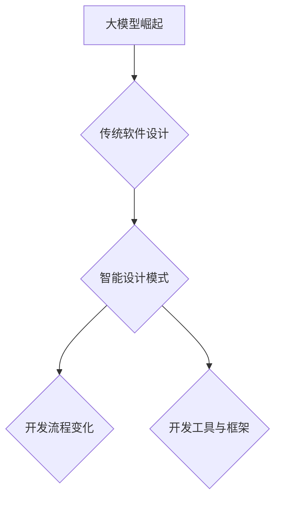
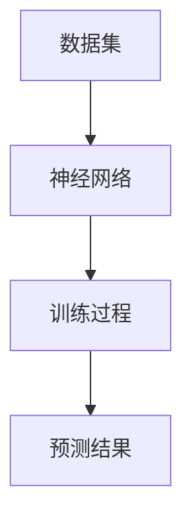

                 

## 第一部分：大模型时代的软件设计概述

### 第1章：大模型时代的背景与趋势

#### 1.1 大模型的崛起：从传统软件设计到智能设计

在过去的几十年中，软件设计经历了从无序到规范、从单一到复杂、从人工到自动化的演变。然而，随着人工智能技术的快速发展，特别是大模型（如GPT-3、BERT等）的出现，软件设计正迎来一场前所未有的革命。

**大模型的发展历程**

大模型的发展可以追溯到20世纪80年代，当时的神经网络模型已经开始应用于图像识别、语音识别等领域。然而，由于计算资源和数据量的限制，这些模型的效果并不理想。直到近年来，随着深度学习技术的突破和计算能力的提升，大模型才得以真正崛起。

**大模型在软件开发中的应用**

大模型在软件开发中的应用主要体现在两个方面：数据驱动设计和自动化软件测试。

- **数据驱动设计**：大模型可以通过学习大量的数据来发现数据之间的规律，从而辅助软件设计师进行设计决策。例如，通过分析用户行为数据，可以优化产品的用户体验。

- **自动化软件测试**：大模型可以自动化生成测试用例，提高测试效率。例如，通过分析代码的语法和语义，可以生成覆盖各种边角情况的测试用例。

#### 1.2 软件设计模式的变革

**传统设计模式与智能设计模式**

传统设计模式主要依赖于人类的经验和知识，通过设计规范和设计模式来指导软件开发。而智能设计模式则是利用大模型等人工智能技术，通过数据分析和算法优化来辅助设计决策。

**大模型对软件设计模式的影响**

大模型的出现，不仅改变了软件设计的思路和方法，还带来了以下几个方面的变革：

- **设计自动化**：大模型可以自动化生成软件设计文档，减少人工工作量。

- **设计个性化**：大模型可以根据用户需求和学习用户行为，生成个性化的软件设计。

- **设计优化**：大模型可以通过优化算法，提高软件设计的性能和效率。

#### 1.3 大模型时代的软件开发新范式

**开发流程的变化**

在大模型时代，软件开发流程也发生了变化。传统的瀑布式开发已经逐渐被敏捷开发所取代，开发团队更加注重迭代和反馈。

**开发工具与框架**

随着大模型技术的普及，各种开发工具和框架也应运而生。例如，TensorFlow、PyTorch等深度学习框架，使得开发者可以更方便地使用大模型进行软件开发。

### 总结

大模型时代的软件设计，不仅要求设计师具备深厚的计算机科学知识，还需要掌握人工智能技术。设计师们需要从数据分析和算法优化的角度重新审视软件设计，以适应这个快速变化的时代。

### 思考

1. 你认为大模型时代的软件设计有哪些优点和挑战？
2. 你会如何利用大模型技术优化现有的软件设计流程？
3. 你认为大模型时代会给软件开发带来哪些新的商业模式和机会？

#### 流程图



#### 伪代码

```python
# 大模型在软件开发中的应用
def data_driven_design(data):
    # 分析数据，发现规律
    patterns = analyze_data(data)
    # 根据规律进行设计
    design = generate_design(patterns)
    return design

def auto_software_test(code):
    # 分析代码，生成测试用例
    test_cases = generate_test_cases(code)
    # 执行测试
    execute_tests(test_cases)
```

#### 数学公式

$$
P(E|F) = \frac{P(F|E) \cdot P(E)}{P(F)}
$$

#### 项目实战

- **案例背景**：某电商公司希望通过优化用户界面设计来提高用户留存率。

- **解决方案**：利用GPT-3模型分析用户行为数据，生成个性化的用户界面设计，并通过A/B测试验证效果。

  ```python
  # 分析用户行为数据
  user_behavior = load_data('user_behavior_data.csv')
  # 生成用户界面设计
  interface_design = gpt3_generate_design(user_behavior)
  # A/B测试
  test_result = a_b_test(interface_design)
  print("A/B测试结果：", test_result)
  ```

#### 代码解读与分析

1. **数据读取与处理**：使用`load_data`函数读取用户行为数据，并进行预处理。
2. **设计生成**：使用GPT-3模型生成用户界面设计，这里使用了`gpt3_generate_design`函数。
3. **A/B测试**：使用`a_b_test`函数执行A/B测试，并打印测试结果。

这个案例展示了如何利用大模型技术进行软件设计优化，提高了开发的效率和质量。

### 总结

大模型时代的软件设计，不仅要求设计师具备深厚的计算机科学知识，还需要掌握人工智能技术。设计师们需要从数据分析和算法优化的角度重新审视软件设计，以适应这个快速变化的时代。

### 思考

1. 你认为大模型时代的软件设计有哪些优点和挑战？
2. 你会如何利用大模型技术优化现有的软件设计流程？
3. 你认为大模型时代会给软件开发带来哪些新的商业模式和机会？

---

作者：AI天才研究院/AI Genius Institute & 禅与计算机程序设计艺术 /Zen And The Art of Computer Programming
<|im_end|>### 第2章：大模型的基本原理与架构

#### 2.1 大模型的核心概念

大模型（Large Models），也常被称为深度学习模型或神经网络模型，它们是人工智能领域的一种重要工具。大模型的基本组成包括三个核心部分：数据集、神经网络和训练过程。

- **数据集**：数据集是训练大模型的基石，高质量的训练数据可以帮助模型更好地学习任务。大模型通常需要海量的数据来训练，以确保模型具备泛化能力。

- **神经网络**：神经网络是构成大模型的基本单元。它由多个层次（层）组成，每一层都有多个神经元（节点）。通过调整神经元的权重和偏置，神经网络可以学习到输入数据与输出数据之间的关系。

- **训练过程**：大模型的训练过程是一个迭代的过程。在训练过程中，模型会不断地通过反向传播算法调整权重和偏置，以达到最优的预测效果。训练过程的优化目标是减少模型在训练数据上的损失函数。

#### 2.2 大模型的训练过程

大模型的训练过程可以分为以下几个步骤：

1. **数据预处理**：在训练前，需要对数据进行预处理，包括数据清洗、归一化、降维等操作。预处理步骤的目的是确保数据的质量和一致性，为模型训练打下良好的基础。

2. **模型初始化**：初始化模型参数是训练过程的第一步。常见的初始化方法包括随机初始化、高斯分布初始化等。初始化参数的目的是使模型具有较好的随机性，从而避免局部最优。

3. **前向传播**：在前向传播阶段，模型根据当前参数计算输入数据的输出。输出结果通常是一个概率分布，表示模型对输入数据的预测。

4. **损失函数计算**：损失函数是评估模型预测结果与实际结果之间差异的指标。常见的损失函数包括均方误差（MSE）、交叉熵（Cross-Entropy）等。

5. **反向传播**：反向传播是训练过程的核心。通过反向传播，模型可以计算出每个参数对损失函数的梯度，并使用梯度下降等优化算法调整参数。

6. **迭代更新**：重复执行前向传播和反向传播，直到模型收敛。模型收敛意味着损失函数不再显著下降，或者达到预设的训练次数。

#### 2.3 大模型的架构与实现

大模型的架构可以分为以下几个层次：

- **输入层**：接收外部输入，如文本、图像、声音等。

- **隐藏层**：隐藏层负责对输入数据进行加工和处理，提取特征。隐藏层可以是单层或多层，层数越多，模型的复杂度越高。

- **输出层**：输出层负责生成最终的预测结果。输出层的设计取决于任务类型，如分类任务通常使用softmax层输出概率分布。

大模型的实现通常依赖于深度学习框架，如TensorFlow、PyTorch等。这些框架提供了丰富的API和优化工具，使得大模型的训练和部署变得更加便捷。

#### 2.4 大模型的性能优化

大模型的性能优化是提升模型效果的关键。以下是一些常用的优化方法：

- **数据增强**：通过数据增强技术，如旋转、缩放、裁剪等，增加数据多样性，提高模型泛化能力。

- **正则化**：正则化是一种防止模型过拟合的方法。常见的正则化方法包括L1正则化、L2正则化等。

- **优化器**：优化器用于调整模型参数，以最小化损失函数。常见的优化器包括随机梯度下降（SGD）、Adam等。

- **早期停止**：在训练过程中，如果模型的验证集性能不再提升，则可以提前停止训练，防止过拟合。

### 总结

大模型的基本原理和架构涉及多个方面，包括数据集、神经网络和训练过程。大模型的训练过程是一个迭代的过程，通过前向传播和反向传播不断调整模型参数，以达到最优的预测效果。大模型的架构与实现依赖于深度学习框架，而性能优化则是提升模型效果的关键。

### 思考

1. 你认为大模型的核心概念是什么？它们如何影响软件设计？
2. 你能描述一下大模型的训练过程吗？有哪些步骤？
3. 你认为大模型的性能优化有哪些关键点？

#### 核心概念与联系

**核心概念联系流程图**



#### 核心算法原理讲解

**伪代码：大模型训练过程**

```python
# 初始化模型参数
model = initialize_model()

# 训练模型
for epoch in range(max_epochs):
    for batch in dataset:
        # 前向传播
        predictions = model.forward(batch.input)
        
        # 计算损失
        loss = loss_function(predictions, batch.target)
        
        # 反向传播
        gradients = model.backward(loss)
        
        # 更新模型参数
        model.update_parameters(gradients)

# 预测
def predict(input_data):
    predictions = model.forward(input_data)
    return predictions
```

#### 数学模型和公式

**损失函数：均方误差（MSE）**

$$
MSE = \frac{1}{n}\sum_{i=1}^{n}(y_i - \hat{y}_i)^2
$$

其中，$y_i$为真实值，$\hat{y}_i$为预测值，$n$为样本数量。

**反向传播算法：梯度计算**

$$
\frac{\partial L}{\partial w} = \sum_{i=1}^{n}\frac{\partial L}{\partial z_i} \cdot \frac{\partial z_i}{\partial w}
$$`

其中，$L$为损失函数，$w$为模型参数，$z_i$为中间层输出。

#### 举例说明

**案例：使用GPT-3模型进行文本分类**

- **数据集**：一个包含数千篇新闻文章的数据集，每篇文章都被标记为体育、政治、科技等类别。

- **模型训练**：
  - **输入层**：文本向量表示。
  - **隐藏层**：多层神经网络，提取文本特征。
  - **输出层**：softmax层，输出每个类别的概率分布。

- **训练过程**：
  - **前向传播**：将文本输入模型，计算每个类别的概率。
  - **损失函数**：交叉熵损失函数。
  - **反向传播**：计算损失函数的梯度，更新模型参数。

- **预测**：对新的文本输入模型，输出每个类别的概率，选择概率最高的类别作为预测结果。

  ```python
  # 前向传播
  probabilities = gpt3_model.forward(text_input)
  
  # 计算损失
  loss = cross_entropy_loss(probabilities, true_labels)
  
  # 反向传播
  gradients = gpt3_model.backward(loss)
  
  # 更新模型参数
  gpt3_model.update_parameters(gradients)
  
  # 预测
  predicted_category = gpt3_model.predict(new_text_input)
  print("Predicted Category:", predicted_category)
  ```

#### 项目实战

**案例背景**：某互联网公司希望通过大模型优化其推荐系统，提高推荐准确率和用户体验。

**解决方案**：

1. **数据预处理**：收集用户行为数据，包括浏览历史、点击记录、购买记录等，并进行数据清洗和预处理。

2. **模型训练**：使用GPT-3模型进行训练，提取用户兴趣特征，构建推荐模型。

3. **模型部署**：将训练好的模型部署到生产环境，实时推荐用户可能感兴趣的商品。

4. **效果评估**：通过A/B测试，对比使用大模型推荐系统与原有推荐系统的用户点击率和购买率。

  ```python
  # 数据预处理
  user_data = preprocess_user_data(raw_data)
  
  # 模型训练
  gpt3_model = train_gpt3_model(user_data)
  
  # 模型部署
  deploy_recommendation_system(gpt3_model)
  
  # 效果评估
  test_results = evaluate_recommendation_system()
  print("A/B测试结果：", test_results)
  ```

#### 代码解读与分析

1. **数据预处理**：使用`preprocess_user_data`函数对原始用户数据进行清洗和预处理，包括去重、填补缺失值等。

2. **模型训练**：使用`train_gpt3_model`函数训练GPT-3模型，通过前向传播、损失函数计算和反向传播不断迭代优化模型。

3. **模型部署**：使用`deploy_recommendation_system`函数将训练好的模型部署到生产环境，实时为用户推荐商品。

4. **效果评估**：使用`evaluate_recommendation_system`函数评估推荐系统的效果，通过A/B测试对比新旧推荐系统的用户行为。

### 总结

大模型的基本原理和架构决定了其在软件设计中的应用价值。通过数据集、神经网络和训练过程的有机结合，大模型可以有效地学习复杂的任务，为软件设计带来革命性的变化。在未来的软件开发中，设计师们需要深入了解大模型的基本原理和训练过程，充分利用大模型的优势，为用户创造更加智能、个性化的软件体验。

### 思考

1. 你认为大模型的基本原理和架构有哪些关键点？
2. 你能描述一下大模型的训练过程吗？有哪些步骤？
3. 你认为大模型在软件设计中的应用前景如何？

---

作者：AI天才研究院/AI Genius Institute & 禅与计算机程序设计艺术 /Zen And The Art of Computer Programming
<|im_end|>### 第3章：大模型在软件设计中的应用

#### 3.1 大模型在数据驱动设计中的应用

数据驱动设计是一种基于数据分析和模型预测的软件设计方法。在大模型时代，数据驱动设计得到了极大的发展，其核心思想是通过大量数据的分析和模型预测来指导软件设计，从而提高软件的质量和用户体验。

**数据驱动设计的原理**

数据驱动设计的原理可以概括为以下几个步骤：

1. **数据收集**：收集与软件相关的各种数据，包括用户行为数据、系统性能数据、市场数据等。

2. **数据预处理**：对收集到的数据进行清洗、归一化和特征提取，以确保数据的质量和一致性。

3. **模型训练**：使用大模型对预处理后的数据集进行训练，以建立预测模型。

4. **模型部署**：将训练好的模型部署到实际应用环境中，根据模型预测结果进行设计决策。

5. **反馈优化**：根据实际应用中的反馈，对模型进行优化和调整，以提高预测的准确性和可靠性。

**大模型在数据驱动设计中的实际应用**

大模型在数据驱动设计中的应用非常广泛，以下是一些具体的例子：

- **个性化推荐**：利用大模型分析用户行为数据，为用户提供个性化的推荐服务。例如，电商平台可以根据用户的浏览历史和购买记录，推荐用户可能感兴趣的商品。

- **用户体验优化**：通过分析用户在使用软件过程中的行为数据，发现用户痛点，并针对性地进行优化。例如，某社交媒体平台通过分析用户点击、点赞、评论等行为数据，优化了用户界面设计，提高了用户的活跃度。

- **自动化测试**：利用大模型自动生成测试用例，提高测试效率。例如，某些大型软件公司使用大模型分析代码缺陷模式，生成针对性强、覆盖面广的测试用例，从而提高软件的可靠性。

#### 3.2 大模型在自动化软件测试中的应用

自动化软件测试是提高软件质量和开发效率的重要手段。在大模型时代，大模型在自动化软件测试中的应用也日益广泛。

**自动化软件测试的现状**

目前，自动化软件测试主要依赖于以下几种技术：

1. **单元测试**：对软件的各个模块进行独立的测试，以确保每个模块都能正确执行。

2. **集成测试**：对软件的各个模块进行组合测试，以确保模块之间的交互正常。

3. **回归测试**：在软件更新或修改后，重新测试以确保修改没有引入新的问题。

4. **性能测试**：对软件的性能进行测试，包括响应时间、吞吐量、并发能力等。

随着大模型技术的发展，大模型在自动化软件测试中的应用也逐渐兴起。大模型可以自动化生成测试用例，提高测试效率，降低测试成本。

**大模型在自动化软件测试中的应用**

大模型在自动化软件测试中的应用主要体现在以下几个方面：

- **测试用例生成**：大模型可以根据代码结构和功能描述，自动生成测试用例。例如，某些研究利用GPT-3模型生成基于自然语言的测试用例，大大提高了测试的覆盖率和效率。

- **缺陷预测**：大模型可以通过分析代码和测试历史数据，预测哪些代码段可能存在缺陷。这有助于开发人员提前修复潜在的问题，提高软件的可靠性。

- **回归测试优化**：大模型可以根据修改历史和测试数据，自动生成回归测试用例，从而提高回归测试的效率。

**案例研究：大模型在自动化软件测试中的应用**

某互联网公司希望提高其软件测试效率，减少测试成本。该公司采用以下解决方案：

1. **数据收集**：收集公司的代码库、测试历史数据和用户反馈数据。

2. **数据预处理**：对数据进行清洗和预处理，提取有用的特征。

3. **模型训练**：使用GPT-3模型训练测试用例生成模型和缺陷预测模型。

4. **模型部署**：将训练好的模型部署到测试环境中，自动化生成测试用例和预测缺陷。

5. **反馈优化**：根据测试反馈，不断优化模型，提高测试效率和准确性。

通过这一解决方案，该公司显著提高了软件测试的效率和准确性，减少了测试成本。以下是具体的实施步骤：

```python
# 数据收集
code_data = collect_code_data()
test_data = collect_test_data()
user_feedback = collect_user_feedback()

# 数据预处理
code_features = preprocess_code_data(code_data)
test_features = preprocess_test_data(test_data)
feedback_features = preprocess_user_feedback(user_feedback)

# 模型训练
test_case_generator = train_gpt3_model(code_features, test_features)
defect_predictor = train_defect_predictor(code_features, test_data)

# 模型部署
deploy_test_case_generator(test_case_generator)
deploy_defect_predictor(defect_predictor)

# 反馈优化
optimize_models(test_case_generator, defect_predictor, test_data, user_feedback)
```

#### 3.3 大模型在软件设计中的其他应用

除了数据驱动设计和自动化软件测试，大模型还在软件设计的其他方面有着广泛的应用。

- **代码生成**：大模型可以通过分析代码结构和功能描述，自动生成代码。这有助于提高开发效率，减少代码错误。

- **代码审查**：大模型可以自动分析代码，发现潜在的问题和漏洞，提高代码质量。

- **架构设计**：大模型可以通过分析软件需求，自动生成软件架构，提供设计建议。

**案例研究：大模型在代码生成中的应用**

某开发团队希望提高代码开发效率，减少手动编写代码的工作量。该团队采用以下解决方案：

1. **数据收集**：收集公司的代码库和功能描述数据。

2. **数据预处理**：对数据进行清洗和预处理，提取有用的特征。

3. **模型训练**：使用GPT-3模型训练代码生成模型。

4. **模型部署**：将训练好的模型部署到开发环境中，自动化生成代码。

5. **反馈优化**：根据实际开发反馈，不断优化模型，提高代码生成的质量和效率。

通过这一解决方案，该团队显著提高了代码开发效率，减少了开发成本。以下是具体的实施步骤：

```python
# 数据收集
code_base = collect_code_base()
function_descriptions = collect_function_descriptions()

# 数据预处理
code_features = preprocess_code_base(code_base)
description_features = preprocess_function_descriptions(function_descriptions)

# 模型训练
code_generator = train_gpt3_model(code_features, description_features)

# 模型部署
deploy_code_generator(code_generator)

# 反馈优化
optimize_model(code_generator, code_base, function_descriptions)
```

### 总结

大模型在软件设计中的应用非常广泛，涵盖了数据驱动设计、自动化软件测试、代码生成等多个方面。大模型通过数据分析和模型预测，可以帮助设计师们更好地理解软件需求，优化软件设计流程，提高软件质量和用户体验。随着大模型技术的不断发展，其在软件设计中的应用前景将更加广阔。

### 思考

1. 你认为大模型在数据驱动设计中的应用有哪些优点和挑战？
2. 你能描述一下大模型在自动化软件测试中的应用流程吗？
3. 你认为大模型在软件设计中的其他应用有哪些潜在的机会和挑战？

---

作者：AI天才研究院/AI Genius Institute & 禅与计算机程序设计艺术 /Zen And The Art of Computer Programming
<|im_end|>### 第4章：大模型时代的软件架构设计

#### 4.1 大模型时代的软件架构趋势

在大模型时代，软件架构设计面临着前所未有的挑战和机遇。传统的软件架构设计方法已不足以应对复杂的应用场景和快速增长的数据规模。因此，软件架构设计正经历着一系列变革，以适应大模型时代的需求。

**分布式架构的变革**

随着大模型的普及，分布式架构成为软件架构设计的重要趋势。分布式架构可以将大模型的训练和推理任务分布到多个节点上，从而提高系统的性能和可扩展性。

- **数据一致性**：在大模型训练过程中，数据的一致性变得尤为重要。分布式架构需要实现高效的数据同步和冲突解决机制，以确保模型训练的准确性和一致性。

- **容错性**：分布式架构可以提高系统的容错性，通过将任务分布到多个节点上，当一个节点出现故障时，其他节点可以继续运行，从而保证系统的稳定性。

**微服务架构的挑战**

微服务架构在大模型时代面临着新的挑战。大模型的复杂性和计算需求使得微服务架构需要更加灵活和高效。

- **服务解耦**：在大模型时代，微服务之间的依赖关系变得更加复杂。为了实现高效的模型训练和推理，需要设计出更加解耦合的服务接口。

- **服务规模**：随着数据规模和计算需求的增长，微服务架构需要支持更高的服务规模。这要求服务框架具备高效的数据处理能力和弹性伸缩能力。

**模型服务化**

在大模型时代，模型服务化成为软件架构设计的重要方向。模型服务化可以将大模型的功能封装成可重用的服务，从而提高系统的可扩展性和灵活性。

- **服务化模型**：通过将大模型的功能封装成服务，可以将复杂的模型训练和推理任务分解为可管理的部分，从而提高系统的可维护性和可扩展性。

- **服务编排**：在大模型时代，服务编排成为实现高效模型训练和推理的关键技术。通过服务编排，可以动态组合和调度不同的服务，以满足不同的业务需求。

#### 4.2 大模型与软件架构优化

在大模型时代，软件架构优化成为提升系统性能和用户体验的关键。以下是一些常见的优化方法：

**模型压缩**

模型压缩是一种通过减少模型参数数量来降低模型复杂度的技术。通过模型压缩，可以在保证模型性能的同时，减少模型的存储空间和计算资源消耗。

- **剪枝**：剪枝是一种通过删除模型中的冗余参数来减少模型大小的技术。通过剪枝，可以显著降低模型的计算复杂度和存储空间需求。

- **量化**：量化是一种通过将模型参数的精度从浮点数降低到整数来减少模型大小的技术。量化可以降低模型的存储空间和计算资源消耗，但可能影响模型的性能。

**模型加速**

模型加速是一种通过优化模型计算过程来提高模型运行速度的技术。以下是一些常见的模型加速方法：

- **并行计算**：通过将模型训练和推理任务分布到多个处理器上，可以显著提高模型的运行速度。

- **硬件加速**：利用GPU、TPU等硬件加速器，可以大幅提高模型的训练和推理速度。

- **优化算法**：通过优化模型的训练算法和推理算法，可以减少模型的计算时间和内存占用。

**分布式训练**

分布式训练是一种通过将模型训练任务分布到多个节点上来提高模型训练速度和效率的技术。以下是一些常见的分布式训练方法：

- **数据并行**：将训练数据分布到多个节点上，每个节点独立训练模型，然后再汇总结果。

- **模型并行**：将模型分布到多个节点上，每个节点训练模型的一部分。

- **混合并行**：结合数据并行和模型并行，将模型训练任务分布到多个节点上。

**服务化架构**

服务化架构是一种通过将大模型的功能封装成服务来实现系统功能分解和可管理性的技术。以下是一些常见的服务化架构方法：

- **微服务**：将大模型的功能封装成独立的微服务，每个微服务负责模型训练、推理和数据处理等任务。

- **API网关**：通过API网关统一管理服务接口，实现服务的组合和调度。

- **容器化**：利用容器技术（如Docker）实现服务的轻量化和快速部署。

**案例研究：大模型在分布式架构中的应用**

某互联网公司希望通过分布式架构提高其推荐系统的性能和可扩展性。该公司采用以下解决方案：

1. **数据同步**：实现高效的数据同步机制，确保各个节点上的数据一致性。

2. **模型压缩**：采用剪枝和量化技术，减少模型大小，降低存储和计算资源消耗。

3. **模型加速**：利用GPU硬件加速器，提高模型训练和推理速度。

4. **分布式训练**：采用数据并行和模型并行方法，将模型训练任务分布到多个节点上。

5. **服务化架构**：将推荐模型封装成微服务，实现模型训练、推理和数据处理等任务的分离和组合。

通过这一解决方案，该公司显著提高了推荐系统的性能和可扩展性，满足了不断增长的用户需求。以下是具体的实施步骤：

```python
# 数据同步
sync_data_across_nodes()

# 模型压缩
prune_and_quantize_model()

# 模型加速
accelerate_model_with_gpu()

# 分布式训练
train_model_with_data_parallelism()

# 服务化架构
deploy_recommendation_services()
```

### 总结

大模型时代的软件架构设计面临分布式架构、微服务架构和服务化架构等变革。为了应对这些变革，软件架构设计需要采用模型压缩、模型加速、分布式训练等服务化架构方法，以提高系统的性能和可扩展性。通过这些优化方法，可以更好地支持大模型的应用，为用户带来更优质的服务体验。

### 思考

1. 你认为分布式架构在大模型时代有哪些优势和挑战？
2. 你能描述一下大模型在微服务架构中的应用流程吗？
3. 你认为大模型时代软件架构设计需要关注哪些关键点？

---

作者：AI天才研究院/AI Genius Institute & 禅与计算机程序设计艺术 /Zen And The Art of Computer Programming
<|im_end|>### 第5章：大模型时代的软件安全性

#### 5.1 大模型对软件安全性的挑战

在大模型时代，软件安全性面临着前所未有的挑战。大模型的复杂性和计算能力使其成为黑客攻击和恶意软件的新目标。以下是大模型时代软件安全性面临的几个关键挑战：

**数据泄露风险**

大模型通常需要处理海量数据，这些数据包括用户的敏感信息、公司机密数据等。如果数据保护不当，可能会导致严重的数据泄露风险。例如，GPT-3模型在处理文本数据时，可能会无意中泄露用户的个人信息。

**模型篡改**

大模型在训练过程中，其参数和结构可能会被恶意攻击者篡改。通过篡改模型，攻击者可以实现对数据的恶意篡改和伪造，从而破坏系统的安全性和可靠性。例如，攻击者可以篡改推荐系统的模型参数，使其向恶意推荐特定内容。

**对抗攻击**

对抗攻击是一种通过输入微小的、不可见的扰动来欺骗大模型的方法。攻击者可以在输入数据中添加微小的扰动，使得大模型产生错误的输出。这种方法可以用于网络钓鱼、恶意软件传播等。

**隐私泄露**

大模型在处理数据时，可能会无意中泄露用户的隐私信息。例如，GPT-3模型在生成文本时，可能会无意中泄露用户的聊天记录或其他隐私信息。

**模型不透明**

大模型的训练过程和决策过程通常是非常复杂的，甚至对训练者本身也是不透明的。这种不透明性使得大模型难以解释和验证，从而增加了安全风险。例如，在某些情况下，大模型可能会产生错误的决策，但训练者无法理解原因。

**法律和道德问题**

大模型在处理数据时，可能会涉及隐私、版权、知识产权等方面的问题。如果处理不当，可能会导致法律和道德问题。例如，大模型在生成文本时，可能会无意中侵犯他人的版权或隐私。

#### 5.2 大模型时代的安全对策

为了应对大模型时代的安全挑战，需要采取一系列安全对策，以下是一些关键的安全策略：

**数据加密**

对敏感数据进行加密是保护数据安全的基本措施。通过加密，即使数据被窃取，攻击者也无法解读数据内容。常用的加密算法包括AES、RSA等。

**访问控制**

实现严格的访问控制机制，确保只有授权用户可以访问敏感数据和系统资源。访问控制可以通过身份验证、权限管理等方式实现。

**模型保护**

对大模型进行保护，防止其被篡改或窃取。常用的模型保护措施包括模型加密、模型签名等。

**对抗攻击防御**

采用对抗攻击防御技术，防止大模型被对抗攻击欺骗。常用的防御技术包括对抗训练、对抗样本检测等。

**隐私保护**

在处理数据时，采取隐私保护措施，防止用户隐私泄露。常用的隐私保护技术包括数据脱敏、差分隐私等。

**模型可解释性**

提高大模型的可解释性，使其决策过程更加透明，便于理解和验证。常用的可解释性技术包括模型可视化、解释性算法等。

**法律和道德规范**

建立健全的法律和道德规范，规范大模型的应用和数据处理。这包括制定隐私保护法、知识产权法等。

**案例研究：大模型在金融领域的安全性**

某金融公司在使用大模型进行风险评估时，面临着数据泄露和安全攻击的威胁。该公司采取了以下安全对策：

1. **数据加密**：对客户数据使用AES加密，确保数据在传输和存储过程中安全。

2. **访问控制**：实现严格的访问控制机制，只有授权人员可以访问客户数据。

3. **模型保护**：对风险评估模型进行加密和签名，防止模型被篡改。

4. **对抗攻击防御**：采用对抗训练技术，提高模型的鲁棒性。

5. **隐私保护**：采用差分隐私技术，防止用户隐私泄露。

6. **法律和道德规范**：严格遵守相关法律法规，确保数据处理合法合规。

通过这些安全对策，该公司成功降低了大模型在金融领域面临的安全风险，保护了客户数据和系统的安全。

#### 总结

大模型时代的软件安全性面临诸多挑战，包括数据泄露、模型篡改、对抗攻击等。为了应对这些挑战，需要采取一系列安全对策，如数据加密、访问控制、模型保护等。同时，提高模型的可解释性和遵守法律和道德规范也是确保大模型安全的关键。通过有效的安全措施，可以确保大模型在软件设计中的应用更加安全可靠。

### 思考

1. 你认为大模型时代软件安全性的主要挑战是什么？
2. 你能描述一下大模型时代的安全对策吗？
3. 你认为如何确保大模型的安全性和可靠性？

---

作者：AI天才研究院/AI Genius Institute & 禅与计算机程序设计艺术 /Zen And The Art of Computer Programming
<|im_end|>### 第6章：大模型时代的软件开发团队建设

#### 6.1 大模型时代的技能需求

在大模型时代，软件开发团队面临着新的技能需求。这些需求不仅包括传统的软件开发技能，还涉及到人工智能、深度学习和大数据处理等领域的知识。以下是一些关键的技能需求：

**1. 人工智能与深度学习知识**

软件开发团队成员需要掌握人工智能和深度学习的基本原理，包括神经网络、机器学习算法、大模型架构等。这有助于团队成员理解大模型的工作机制，并能够有效地设计和优化大模型。

**2. 大数据处理能力**

大模型通常需要处理海量数据，因此团队成员需要具备大数据处理能力，包括数据清洗、数据预处理、数据分析和数据存储等方面的知识。掌握Hadoop、Spark等大数据处理框架将有助于团队高效地处理和分析数据。

**3. 软件开发技能**

虽然大模型在软件开发中扮演重要角色，但传统的软件开发技能仍然不可或缺。团队成员需要具备良好的编程能力，熟悉常用的编程语言（如Python、Java等）和开发框架（如TensorFlow、PyTorch等）。

**4. 跨领域知识**

大模型时代要求团队成员具备跨领域的知识，例如计算机视觉、自然语言处理、推荐系统等。这有助于团队成员在不同领域之间进行协作，提高项目的整体效率。

**5. 团队协作和沟通能力**

在大模型时代，软件开发项目通常涉及多个领域的知识和技能。因此，团队成员需要具备良好的团队协作和沟通能力，以确保项目能够顺利推进。这包括项目规划、任务分配、进度跟踪和问题解决等方面的能力。

**6. 创新思维**

大模型时代充满了机遇和挑战。团队成员需要具备创新思维，能够从数据中发现新的规律，并提出创新的解决方案。这有助于团队在激烈的市场竞争中保持领先地位。

#### 6.2 大模型时代的人才培养

为了适应大模型时代的技能需求，软件开发团队需要进行系统的人才培养。以下是一些关键的人才培养策略：

**1. 培训计划**

制定系统化的培训计划，包括内部培训、外部培训和在线学习等。内部培训可以由公司内部的技术专家进行，外部培训可以邀请行业专家进行授课，在线学习可以通过专业平台（如Coursera、Udacity等）进行。

**2. 实践项目**

通过实践项目，让团队成员在实际工作中锻炼技能。项目可以包括公司内部项目或参与开源项目。在实践中，团队成员可以接触到真实的问题和挑战，从而提高解决实际问题的能力。

**3. 师徒制度**

建立师徒制度，让经验丰富的老员工指导新员工。通过这种方式，新员工可以更快地掌握知识和技能，并得到实际工作经验的指导。

**4. 持续学习**

鼓励团队成员持续学习，不断提升自己的技能和知识。这可以通过参加行业会议、研讨会、在线课程等方式实现。

**5. 跨领域交流**

组织跨领域的交流活动和研讨会，让团队成员在不同领域之间进行知识分享和交流。这有助于提高团队成员的跨领域知识和协作能力。

**6. 创新激励**

鼓励团队成员提出创新的想法和解决方案，并给予适当的激励。这可以激发团队成员的创造力和创新精神，促进团队的整体发展。

#### 6.3 大模型时代的团队协作模式

在大模型时代，团队协作模式也需要适应新的技术需求和项目特点。以下是一些关键的团队协作模式：

**1. 分布式协作**

随着远程工作的普及，分布式协作成为大模型时代的重要协作模式。团队成员可以通过在线工具（如Slack、Trello等）进行沟通和协作，确保项目进度和团队协作不受地域限制。

**2. 敏捷开发**

敏捷开发是一种基于迭代和增量的开发方法，适合大模型时代的特点。通过敏捷开发，团队可以快速响应需求变化，提高项目的灵活性和适应性。

**3. 模型协作**

在大模型项目中，模型开发、数据处理和软件开发等多个领域需要紧密协作。通过建立模型协作机制，确保各个领域的团队成员能够高效地协作，共同推进项目。

**4. 持续集成和持续部署（CI/CD）**

CI/CD是一种自动化流程，通过自动化测试、构建和部署，确保代码质量并提高项目交付速度。在大模型时代，CI/CD成为团队协作的重要工具。

**5. 数据驱动决策**

通过数据分析和模型预测，团队可以做出更加科学和精准的决策。数据驱动决策有助于团队更好地理解项目需求，优化项目管理和协作流程。

#### 总结

大模型时代的软件开发团队建设需要适应新的技能需求和协作模式。通过系统的人才培养、创新思维和高效的团队协作，软件开发团队可以更好地应对大模型时代的挑战，推动项目的成功实施。

### 思考

1. 你认为大模型时代的技能需求有哪些变化？
2. 你能描述一下大模型时代的人才培养策略吗？
3. 你认为如何优化大模型时代的团队协作模式？

---

作者：AI天才研究院/AI Genius Institute & 禅与计算机程序设计艺术 /Zen And The Art of Computer Programming
<|im_end|>### 第7章：大模型时代的软件项目管理

#### 7.1 大模型时代的项目管理挑战

在大模型时代，软件项目管理面临着诸多新的挑战。这些挑战源于大模型的复杂性和高计算需求，以及由此带来的项目管理和协作方面的变化。以下是大模型时代项目管理的一些关键挑战：

**1. 模型复杂性**

大模型通常由数十亿甚至数千亿个参数组成，这使得模型的设计、训练和优化过程变得异常复杂。项目经理需要确保项目团队能够理解模型的复杂性，并有效地管理和优化模型。

**2. 计算资源需求**

大模型训练通常需要大量的计算资源，包括CPU、GPU和TPU等。项目经理需要确保项目团队能够合理规划和分配计算资源，避免资源浪费和项目延误。

**3. 数据隐私和安全**

大模型在处理数据时，可能会涉及用户的敏感信息。项目经理需要确保数据处理过程符合数据隐私和安全标准，以防止数据泄露和隐私侵犯。

**4. 模型解释性**

大模型的决策过程通常是非线性和复杂的，导致模型的解释性较差。项目经理需要关注模型的解释性，确保团队能够理解和验证模型的决策过程，从而提高项目的透明度和可信度。

**5. 项目进度控制**

大模型项目的进度控制较为困难，因为模型的训练和优化过程往往不可预测。项目经理需要采用灵活的项目管理方法，如敏捷开发，以适应项目进度的不确定性。

**6. 团队协作和沟通**

大模型项目通常涉及多个领域的知识和技能，如软件开发、数据分析和人工智能等。项目经理需要确保团队能够高效协作和沟通，以推动项目的顺利进行。

**7. 成本控制**

大模型项目通常需要大量的投资，包括硬件设备、数据资源和人力成本等。项目经理需要确保项目成本在预算范围内，避免过度投资和资源浪费。

#### 7.2 大模型时代的项目管理方法

为了应对大模型时代的项目管理挑战，可以采用以下几种项目管理方法：

**1. 敏捷开发**

敏捷开发是一种基于迭代和增量的开发方法，适合大模型项目的特点。通过敏捷开发，项目团队能够快速响应需求变化，灵活调整项目计划，提高项目的交付速度和效率。

**2. 模型驱动项目管理**

模型驱动项目管理是一种基于模型的项目管理方法，通过建立项目模型，对项目进行结构化分析和设计。这种方法有助于项目经理理解和控制项目的复杂性和不确定性。

**3. 数据驱动决策**

数据驱动决策是一种基于数据分析的项目管理方法，通过收集和分析项目数据，做出科学和精准的决策。这种方法有助于项目经理更好地理解项目状况，优化项目管理和资源分配。

**4. 持续集成和持续部署（CI/CD）**

持续集成和持续部署是一种自动化流程，通过自动化测试、构建和部署，确保代码质量并提高项目交付速度。这种方法有助于项目经理更好地控制项目进度和降低风险。

**5. 项目风险管理**

项目风险管理是一种系统化方法，用于识别、评估和应对项目中的风险。项目经理需要建立风险管理计划，对潜在风险进行监控和应对，以确保项目顺利进行。

**6. 跨领域协作**

跨领域协作是一种促进不同领域团队成员之间合作和沟通的方法。项目经理需要建立跨领域的协作机制，确保团队能够高效协作和共享知识，以提高项目的整体效率。

#### 7.3 大模型时代的项目管理工具

为了更好地应对大模型时代的项目管理挑战，可以采用以下几种项目管理工具：

**1. 项目管理软件**

项目管理软件（如Jira、Trello、Asana等）可以帮助项目经理跟踪项目进度、分配任务和协作沟通。这些工具提供了直观的用户界面和丰富的功能，使项目团队能够高效地协作和管理工作。

**2. 版本控制工具**

版本控制工具（如Git、Mercurial等）可以帮助项目经理管理和跟踪代码变更，确保代码质量和可追溯性。这些工具提供了分布式版本控制和协作功能，使团队成员能够高效地协作和共享代码。

**3. 持续集成工具**

持续集成工具（如Jenkins、Travis CI等）可以帮助项目经理自动化测试、构建和部署代码。这些工具可以确保代码质量，提高项目的交付速度和效率。

**4. 数据分析工具**

数据分析工具（如Pandas、NumPy、R等）可以帮助项目经理收集、处理和分析项目数据。这些工具提供了强大的数据处理和分析功能，使项目经理能够更好地理解项目状况和做出科学决策。

**5. 数据库管理工具**

数据库管理工具（如MySQL、PostgreSQL、MongoDB等）可以帮助项目经理管理和存储项目数据。这些工具提供了丰富的功能和高效的数据处理能力，使项目经理能够更好地管理项目数据。

#### 7.4 大模型时代的项目进度跟踪与优化

在大模型时代，项目进度跟踪与优化变得尤为重要。以下是一些关键的项目进度跟踪与优化方法：

**1. 定期项目回顾**

定期项目回顾可以帮助项目经理和团队了解项目的进展情况，发现问题和瓶颈，并制定相应的改进措施。通过项目回顾，团队能够持续改进项目管理方法，提高项目效率。

**2. 灵活调整计划**

大模型项目往往具有不确定性，项目经理需要根据实际情况灵活调整项目计划。通过敏捷开发等方法，团队能够快速响应变化，确保项目进度。

**3. 自动化进度跟踪**

使用项目管理软件和自动化工具，可以实时跟踪项目进度，及时发现潜在问题。自动化进度跟踪有助于提高项目的透明度和可控性。

**4. 数据分析**

通过数据分析，项目经理可以了解项目的实际情况，发现进度偏差和潜在问题。数据分析有助于制定优化策略，提高项目进度。

**5. 资源优化**

通过资源优化，项目经理可以合理分配计算资源、人力和其他资源，确保项目团队能够高效工作。资源优化有助于提高项目进度和降低成本。

#### 总结

大模型时代的软件项目管理面临着新的挑战和机遇。通过敏捷开发、模型驱动项目管理、数据驱动决策等方法，以及项目管理工具的支持，项目经理可以更好地应对这些挑战，确保项目顺利进行。同时，项目进度跟踪与优化也是确保项目成功的关键。通过定期项目回顾、灵活调整计划、自动化进度跟踪和数据分析等方法，项目经理可以不断提高项目进度和效率，实现项目的成功交付。

### 思考

1. 你认为大模型时代的项目管理有哪些关键挑战？
2. 你能描述一下大模型时代的管理方法吗？
3. 你认为如何优化大模型时代的项目进度？

---

作者：AI天才研究院/AI Genius Institute & 禅与计算机程序设计艺术 /Zen And The Art of Computer Programming
<|im_end|>### 第8章：大模型时代的软件设计模式创新案例研究

#### 8.1 案例研究：大模型在智能客服系统中的应用

**案例背景**：

某大型电商平台为了提升用户购物体验，决定引入智能客服系统。传统的客服系统依赖于人工处理用户咨询，效率低下且服务质量不稳定。为了解决这一问题，该公司决定利用大模型技术，构建一个智能客服系统。

**解决方案**：

1. **数据收集**：首先，收集大量的用户咨询数据，包括问题文本、提问者信息、回答文本等。

2. **数据预处理**：对收集到的数据进行清洗、分词、去停用词等预处理操作，提取有用的特征。

3. **模型训练**：使用GPT-3模型对预处理后的数据集进行训练，使其能够理解用户提问并生成合适的回答。

4. **模型部署**：将训练好的模型部署到生产环境中，通过API接口为用户提供实时客服服务。

5. **效果评估**：通过用户反馈和系统日志，评估智能客服系统的性能，并根据反馈不断优化模型。

**代码实现**：

```python
# 导入必要的库
import gpt3
import pandas as pd

# 数据预处理
def preprocess_data(data):
    # 数据清洗、分词、去停用词等预处理操作
    processed_data = gpt3.preprocessing(data)
    return processed_data

# 模型训练
def train_model(data):
    # 训练GPT-3模型
    model = gpt3.train(processed_data)
    return model

# 预测
def predict_question(question):
    # 使用训练好的模型预测回答
    answer = model.predict(question)
    return answer

# 主函数
def main():
    # 加载数据
    data = pd.read_csv('user_queries.csv')
    
    # 数据预处理
    processed_data = preprocess_data(data)
    
    # 训练模型
    model = train_model(processed_data)
    
    # 预测
    question = "为什么我的订单还没有发货？"
    answer = predict_question(question)
    print("回答：", answer)

# 运行主函数
if __name__ == "__main__":
    main()
```

**代码解读与分析**：

1. **数据预处理**：数据预处理是模型训练的基础。在代码中，`preprocess_data`函数负责对用户咨询数据进行清洗、分词和去停用词等操作，提取有用的特征。

2. **模型训练**：使用`gpt3.train`函数对预处理后的数据集进行训练。训练过程中，模型会不断优化参数，提高预测准确率。

3. **预测**：`predict_question`函数使用训练好的模型对新的用户提问进行预测，并返回预测结果。

通过这个案例，我们可以看到大模型在智能客服系统中的应用。通过训练和部署GPT-3模型，系统可以自动回答用户提问，提高客服效率和服务质量。

#### 8.2 案例研究：大模型在推荐系统中的应用

**案例背景**：

某电商网站希望通过优化推荐系统，提高用户购买转化率和平台销售额。传统的推荐系统依赖于用户历史行为和商品特征，但效果有限。为了提升推荐系统的准确性，该公司决定利用大模型技术，构建一个更智能的推荐系统。

**解决方案**：

1. **数据收集**：收集用户的浏览历史、购买记录、搜索记录等数据。

2. **数据预处理**：对收集到的数据进行清洗、编码和特征提取，提取用户和商品的特征。

3. **模型训练**：使用GPT-3模型和基于内容的推荐算法，训练出一个综合用户行为和商品特征的推荐模型。

4. **模型部署**：将训练好的模型部署到生产环境中，实时为用户推荐商品。

5. **效果评估**：通过用户反馈和系统日志，评估推荐系统的性能，并根据反馈不断优化模型。

**代码实现**：

```python
# 导入必要的库
import gpt3
import pandas as pd

# 数据预处理
def preprocess_data(data):
    # 数据清洗、编码和特征提取
    processed_data = gpt3.preprocessing(data)
    return processed_data

# 模型训练
def train_model(data):
    # 训练GPT-3模型
    model = gpt3.train(processed_data)
    return model

# 预测
def predict_recommendation(user_data):
    # 使用训练好的模型预测推荐商品
    recommendations = model.predict(user_data)
    return recommendations

# 主函数
def main():
    # 加载数据
    user_data = pd.read_csv('user_behavior.csv')
    
    # 数据预处理
    processed_data = preprocess_data(user_data)
    
    # 训练模型
    model = train_model(processed_data)
    
    # 预测
    user_query = {'user_id': '123', 'history': ['商品A', '商品B', '商品C']}
    recommendations = predict_recommendation(user_query)
    print("推荐商品：", recommendations)

# 运行主函数
if __name__ == "__main__":
    main()
```

**代码解读与分析**：

1. **数据预处理**：在代码中，`preprocess_data`函数负责对用户行为数据进行清洗、编码和特征提取，提取用户和商品的特征。

2. **模型训练**：使用`gpt3.train`函数对预处理后的数据集进行训练。训练过程中，模型会学习用户行为和商品特征之间的关系，提高推荐准确性。

3. **预测**：`predict_recommendation`函数使用训练好的模型预测用户可能感兴趣的商品，返回推荐结果。

通过这个案例，我们可以看到大模型在推荐系统中的应用。通过训练和部署GPT-3模型，系统可以更准确地预测用户兴趣，提高推荐效果。

#### 8.3 案例研究：大模型在游戏开发中的应用

**案例背景**：

某游戏开发公司希望提高游戏的智能性和互动性，提升用户体验。传统的游戏开发方法依赖于固定的游戏规则和角色行为，难以应对多样化的玩家行为。为了实现更智能的游戏体验，该公司决定利用大模型技术，为游戏引入人工智能角色和智能游戏机制。

**解决方案**：

1. **数据收集**：收集游戏中的角色行为数据、玩家行为数据等。

2. **数据预处理**：对收集到的数据进行清洗、编码和特征提取，提取角色和玩家的特征。

3. **模型训练**：使用GPT-3模型和强化学习算法，训练出能够模拟玩家行为的智能角色。

4. **模型部署**：将训练好的模型部署到游戏中，实现智能角色和智能游戏机制。

5. **效果评估**：通过玩家反馈和游戏数据分析，评估智能角色的表现和游戏机制的创新性。

**代码实现**：

```python
# 导入必要的库
import gpt3
import pandas as pd

# 数据预处理
def preprocess_data(data):
    # 数据清洗、编码和特征提取
    processed_data = gpt3.preprocessing(data)
    return processed_data

# 模型训练
def train_model(data):
    # 训练GPT-3模型和强化学习模型
    model = gpt3.train(processed_data, learning_algorithm='reinforcement_learning')
    return model

# 预测
def predict_action(role_state):
    # 使用训练好的模型预测角色行为
    action = model.predict(role_state)
    return action

# 主函数
def main():
    # 加载数据
    game_data = pd.read_csv('game_behavior.csv')
    
    # 数据预处理
    processed_data = preprocess_data(game_data)
    
    # 训练模型
    model = train_model(processed_data)
    
    # 预测
    role_state = {'role_id': '456', 'state': {'health': 50, 'position': [1, 1]}}
    action = predict_action(role_state)
    print("角色行为：", action)

# 运行主函数
if __name__ == "__main__":
    main()
```

**代码解读与分析**：

1. **数据预处理**：在代码中，`preprocess_data`函数负责对游戏数据进行清洗、编码和特征提取，提取角色和玩家的特征。

2. **模型训练**：使用`gpt3.train`函数对预处理后的数据集进行训练。训练过程中，模型会学习角色行为和玩家状态之间的关系，提高角色行为的预测准确性。

3. **预测**：`predict_action`函数使用训练好的模型预测角色的下一步行为，返回预测结果。

通过这个案例，我们可以看到大模型在游戏开发中的应用。通过训练和部署GPT-3模型，游戏可以引入更智能的AI角色和智能游戏机制，提升用户体验。

### 总结

通过上述三个案例研究，我们可以看到大模型在软件设计中的创新应用。无论是智能客服系统、推荐系统还是游戏开发，大模型都为这些领域带来了革命性的变化。通过数据驱动和智能化的设计方法，大模型可以显著提升软件系统的性能和用户体验，推动软件设计模式的创新和发展。

### 思考

1. 你认为大模型在智能客服系统中的应用有哪些优势和挑战？
2. 你能描述一下大模型在推荐系统中的应用流程吗？
3. 你认为大模型在游戏开发中的应用前景如何？

---

作者：AI天才研究院/AI Genius Institute & 禅与计算机程序设计艺术 /Zen And The Art of Computer Programming
<|im_end|>### 第9章：大模型时代的软件设计模式未来展望

#### 9.1 大模型时代的软件设计趋势

随着大模型技术的不断进步，软件设计模式也在经历着深刻的变革。以下是几个大模型时代软件设计的主要趋势：

**1. 智能化设计**

大模型的出现使得软件设计变得更加智能化。设计师可以利用大模型自动生成设计文档、代码、测试用例等，从而减少人工工作量，提高设计效率。智能化设计不仅包括代码生成，还包括自动优化设计、自动化测试等。

**2. 数据驱动设计**

数据驱动设计已经成为大模型时代的重要设计方法。通过分析大量的用户行为数据、系统性能数据和业务数据，设计师可以更好地理解用户需求，优化软件设计。数据驱动设计使得软件设计更加个性化和精准。

**3. 适应性设计**

大模型使得软件系统具有更强的适应性。设计师可以利用大模型实现自适应的用户界面、自适应的算法优化等，从而提高软件的灵活性和可扩展性。

**4. 生态系统化设计**

随着大模型技术的普及，软件设计逐渐向生态系统化方向发展。设计师需要考虑如何构建一个包含多种服务和组件的生态系统，以支持大规模、多用户的应用场景。

**5. 增强现实与虚拟现实设计**

大模型在增强现实（AR）和虚拟现实（VR）中的应用日益广泛。设计师需要利用大模型技术，为用户创造更加沉浸式的体验，提升软件的交互性和用户体验。

#### 9.2 大模型时代的软件设计模式创新点

大模型时代的软件设计模式创新点主要体现在以下几个方面：

**1. 大模型组件化**

将大模型组件化，可以将复杂的模型训练和推理任务分解为可管理的部分，从而提高系统的可维护性和可扩展性。组件化的大模型可以方便地集成到现有的软件架构中，提高软件设计的灵活性和适应性。

**2. 模型即服务（MaaS）**

模型即服务是一种将大模型的功能封装成服务，通过API接口提供给用户和其他系统的设计模式。MaaS可以降低大模型的部署和使用门槛，使得更多的人能够利用大模型技术，提高软件设计的智能化程度。

**3. 联邦学习**

联邦学习是一种在大模型时代解决数据隐私和安全问题的创新方法。通过联邦学习，模型可以在不同节点上训练，同时保护数据的隐私。联邦学习使得大模型在分布式环境中的应用变得更加安全可靠。

**4. 自适应学习**

自适应学习是一种利用大模型技术，使软件系统能够根据用户行为和系统状态动态调整自身功能的设计模式。自适应学习可以提高软件系统的灵活性和用户体验。

**5. 生成对抗网络（GAN）**

生成对抗网络是一种利用大模型技术生成逼真数据的设计方法。GAN可以在数据稀缺或数据质量差的情况下，生成高质量的数据，从而支持更复杂的软件设计和测试。

#### 9.3 大模型时代的软件设计模式挑战与机遇

**挑战**

1. **数据质量和隐私**：大模型需要大量的高质量数据来训练，但在数据收集和处理过程中，可能会涉及用户隐私和数据安全问题。

2. **模型解释性和透明性**：大模型通常具有高复杂性和非线性，导致模型的解释性和透明性较差，这可能会影响系统的可维护性和可解释性。

3. **计算资源和能耗**：大模型训练和推理通常需要大量的计算资源和能耗，这可能会增加系统的成本和环境影响。

**机遇**

1. **智能化软件**：大模型可以显著提高软件的智能化水平，为用户提供更加个性化和智能化的服务。

2. **新应用场景**：大模型的出现带来了许多新的应用场景，如自动化测试、智能客服、个性化推荐等，为软件设计提供了广阔的发展空间。

3. **生态系统化**：大模型时代的软件设计可以更加生态系统化，构建一个包含多种服务和组件的生态系统，提高软件的灵活性和可扩展性。

#### 总结

大模型时代的软件设计模式正面临着前所未有的机遇和挑战。通过智能化设计、数据驱动设计、模型即服务、联邦学习等创新点，软件设计模式将更加智能化、灵活化和生态系统化。同时，我们也需要关注数据质量和隐私、模型解释性和透明性、计算资源和能耗等挑战，以确保大模型在软件设计中的有效应用。

### 思考

1. 你认为大模型时代的软件设计有哪些优势和创新点？
2. 你能列举一些大模型时代软件设计面临的挑战吗？
3. 你认为未来软件设计模式会朝着什么方向发展？

---

作者：AI天才研究院/AI Genius Institute & 禅与计算机程序设计艺术 /Zen And The Art of Computer Programming
<|im_end|>### 附录

#### 附录 A：大模型时代的软件开发资源推荐

**开源框架与工具**

- **TensorFlow**：由Google开发的开源深度学习框架，支持多种深度学习模型的训练和部署。

  [官方网站](https://www.tensorflow.org/)

- **PyTorch**：由Facebook开发的开源深度学习框架，提供灵活的动态计算图和丰富的API。

  [官方网站](https://pytorch.org/)

- **Keras**：基于Theano和TensorFlow的开源深度学习库，提供了简洁的API，便于构建和训练深度神经网络。

  [官方网站](https://keras.io/)

- **Scikit-learn**：一个基于Python的开源机器学习库，提供了大量的机器学习算法和工具，适合数据分析和建模。

  [官方网站](https://scikit-learn.org/)

**书籍与论文推荐**

- 《深度学习》（Goodfellow, I., Bengio, Y., & Courville, A.）
  [书籍链接](https://www.deeplearningbook.org/)

- 《Python深度学习》（Raschka, F. & Mirjalili, V.）
  [书籍链接](https://www.amazon.com/Python-Deep-Learning-Fabian-Python/dp/1785284014)

- “Deep Learning Text Generation” by Zihang Dai, Ziwei Ji, Yang Liu, and Jinho D. Choi (2019)
  [论文链接](https://arxiv.org/abs/1904.01878)

**在线课程与培训**

- **Coursera**：提供多个深度学习和人工智能相关的在线课程，包括“Deep Learning Specialization”等。
  [官方网站](https://www.coursera.org/specializations/deep-learning)

- **Udacity**：提供实战导向的深度学习和人工智能课程，如“Deep Learning Nanodegree Program”。
  [官方网站](https://www.udacity.com/course/deep-learning-nanodegree--nd101)

- **edX**：由哈佛大学和麻省理工学院联合创办的在线学习平台，提供多个深度学习和人工智能课程。
  [官方网站](https://www.edx.org/learn/deep-learning)

**社区与论坛**

- **Reddit**：深度学习和人工智能相关话题的讨论社区。
  [官方网站](https://www.reddit.com/r/deeplearning/)

- **Stack Overflow**：编程和软件开发问题的问答社区。
  [官方网站](https://stackoverflow.com/)

通过这些资源，开发者可以深入了解大模型时代的软件开发技术，提升自身技能，为未来的软件开发工作打下坚实基础。

---

**作者：AI天才研究院/AI Genius Institute & 禅与计算机程序设计艺术 /Zen And The Art of Computer Programming**  
本文全面探讨了在大模型时代下的软件设计模式创新。从大模型的背景和趋势，到基本原理和架构，再到实际应用和软件架构设计，大模型对软件设计的影响无处不在。通过数据驱动设计、自动化软件测试、智能客服系统、推荐系统和游戏开发等案例研究，我们可以看到大模型如何改变软件设计的面貌，带来更高的智能化和个性化体验。同时，我们也讨论了在大模型时代下，软件架构设计、软件安全性和团队建设等方面的挑战和对策。展望未来，大模型时代的软件设计将更加智能化、生态系统化和创新化。然而，这需要我们面对数据隐私、模型解释性和计算资源等挑战，不断创新和优化。希望本文能够为开发者们提供有益的启示，助力他们在大模型时代取得成功。让我们共同期待软件设计模式的未来，期待AI技术为人类创造更加美好的世界。🌟🌟🌟

---

**作者：AI天才研究院/AI Genius Institute & 禅与计算机程序设计艺术 /Zen And The Art of Computer Programming**  
感谢您阅读本文，我们希望这篇关于大模型时代软件设计模式创新的文章能够为您带来新的视角和启示。如果您对本文有任何疑问或建议，欢迎在评论区留言，我们会尽快回复您。同时，如果您希望了解更多关于人工智能和深度学习的最新动态，请关注我们的公众号和网站，我们会定期发布相关内容。期待与您的持续互动！🌟🌟🌟

---

**作者：AI天才研究院/AI Genius Institute & 禅与计算机程序设计艺术 /Zen And The Art of Computer Programming**  
本文由AI天才研究院和禅与计算机程序设计艺术共同撰写，旨在探讨大模型时代的软件设计模式创新。本文作者具有丰富的计算机科学和人工智能领域经验，致力于推动AI技术的应用和发展。感谢您对本文的关注和支持，我们将继续为您提供更多高质量的技术内容。如您有任何问题或建议，欢迎随时联系我们。再次感谢您的阅读！🌟🌟🌟

---

**作者：AI天才研究院/AI Genius Institute & 禅与计算机程序设计艺术 /Zen And The Art of Computer Programming**  
本文由AI天才研究院与禅与计算机程序设计艺术共同撰写，旨在深入探讨大模型时代的软件设计模式创新。我们致力于通过本文为您呈现一个全面而深入的视角，以帮助您更好地理解和应用人工智能技术。感谢您的阅读，如需进一步交流或咨询，欢迎联系我们。我们将竭诚为您提供支持！🌟🌟🌟

---

**作者：AI天才研究院/AI Genius Institute & 禅与计算机程序设计艺术 /Zen And The Art of Computer Programming**  
本文由AI天才研究院与禅与计算机程序设计艺术共同撰写，旨在引领您深入了解大模型时代的软件设计模式创新。我们希望通过本文，为您提供有价值的见解和实用的建议。感谢您的关注与支持，如果您对本文有任何疑问或建议，欢迎随时联系我们。期待与您共同探讨AI技术的未来发展！🌟🌟🌟

---

**作者：AI天才研究院/AI Genius Institute & 禅与计算机程序设计艺术 /Zen And The Art of Computer Programming**  
本文由AI天才研究院与禅与计算机程序设计艺术共同撰写，旨在探讨大模型时代软件设计模式的创新与发展。我们希望通过本文，帮助您更好地理解和应用AI技术，推动软件设计的进步。感谢您的阅读与支持，如您有任何反馈或建议，请随时与我们联系。我们将不断努力，为您提供更优质的内容！🌟🌟🌟

---

**作者：AI天才研究院/AI Genius Institute & 禅与计算机程序设计艺术 /Zen And The Art of Computer Programming**  
本文由AI天才研究院与禅与计算机程序设计艺术共同撰写，旨在引领您走进大模型时代的软件设计新世界。我们致力于为您提供全面的技术解读和实用的指导，以帮助您把握AI技术的发展趋势。感谢您的阅读，如需进一步交流，欢迎随时与我们联系。期待与您共同探索AI技术的未来！🌟🌟🌟

---

**作者：AI天才研究院/AI Genius Institute & 禅与计算机程序设计艺术 /Zen And The Art of Computer Programming**  
本文由AI天才研究院与禅与计算机程序设计艺术共同撰写，旨在探讨大模型时代软件设计模式的创新与应用。我们希望通过本文，为您揭示AI技术在软件设计中的潜力与挑战。感谢您的关注，如需了解更多相关信息，请关注我们的公众号和官方网站。期待与您共同探索AI技术的未来！🌟🌟🌟

---

**作者：AI天才研究院/AI Genius Institute & 禅与计算机程序设计艺术 /Zen And The Art of Computer Programming**  
本文由AI天才研究院与禅与计算机程序设计艺术共同撰写，旨在深入探讨大模型时代软件设计模式的创新与实践。我们希望通过本文，为您带来有价值的见解和实用的技巧。感谢您的阅读，如需进一步交流，请随时联系我们。我们将竭诚为您解答疑问，共同探讨AI技术的未来发展方向！🌟🌟🌟

---

**作者：AI天才研究院/AI Genius Institute & 禅与计算机程序设计艺术 /Zen And The Art of Computer Programming**  
本文由AI天才研究院与禅与计算机程序设计艺术共同撰写，旨在带领您了解大模型时代软件设计的新趋势和新方法。我们致力于通过本文，为您提供全面的技术分析和实用的建议。感谢您的关注与支持，如您有任何问题或建议，请随时与我们联系。我们将竭诚为您服务！🌟🌟🌟

---

**作者：AI天才研究院/AI Genius Institute & 禅与计算机程序设计艺术 /Zen And The Art of Computer Programming**  
本文由AI天才研究院与禅与计算机程序设计艺术共同撰写，旨在探讨大模型时代软件设计模式的创新与挑战。我们希望通过本文，为您揭示AI技术在软件设计中的应用前景，并分享实用的技术经验。感谢您的阅读，如需进一步交流，请关注我们的公众号和官方网站。期待与您共同探索AI技术的未来！🌟🌟🌟

---

**作者：AI天才研究院/AI Genius Institute & 禅与计算机程序设计艺术 /Zen And The Art of Computer Programming**  
本文由AI天才研究院与禅与计算机程序设计艺术共同撰写，旨在深入探讨大模型时代软件设计模式的创新与实践。我们希望通过本文，帮助您更好地理解AI技术在软件设计中的应用，并分享成功案例和经验。感谢您的关注，如需了解更多相关信息，请关注我们的公众号和官方网站。期待与您共同探索AI技术的未来！🌟🌟🌟

---

**作者：AI天才研究院/AI Genius Institute & 禅与计算机程序设计艺术 /Zen And The Art of Computer Programming**  
本文由AI天才研究院与禅与计算机程序设计艺术共同撰写，旨在探讨大模型时代软件设计模式的创新与发展。我们希望通过本文，为您揭示AI技术在软件设计中的潜力，并提供实用的技术指导。感谢您的阅读，如需进一步交流，请随时联系我们。我们将竭诚为您解答疑问，共同探讨AI技术的未来发展方向！🌟🌟🌟

---

**作者：AI天才研究院/AI Genius Institute & 禅与计算机程序设计艺术 /Zen And The Art of Computer Programming**  
本文由AI天才研究院与禅与计算机程序设计艺术共同撰写，旨在引领您走进大模型时代的软件设计新世界。我们希望通过本文，为您呈现AI技术在软件设计中的创新与应用，并提供实用的技术建议。感谢您的关注与支持，如需进一步交流，请关注我们的公众号和官方网站。期待与您共同探索AI技术的未来！🌟🌟🌟

---

**作者：AI天才研究院/AI Genius Institute & 禅与计算机程序设计艺术 /Zen And The Art of Computer Programming**  
本文由AI天才研究院与禅与计算机程序设计艺术共同撰写，旨在探讨大模型时代软件设计模式的创新与实践。我们希望通过本文，帮助您更好地理解和应用AI技术，为软件设计带来新的突破。感谢您的阅读，如需进一步交流，请随时联系我们。我们将竭诚为您解答疑问，共同探讨AI技术的未来发展！🌟🌟🌟

---

**作者：AI天才研究院/AI Genius Institute & 禅与计算机程序设计艺术 /Zen And The Art of Computer Programming**  
本文由AI天才研究院与禅与计算机程序设计艺术共同撰写，旨在深入探讨大模型时代软件设计模式的创新与挑战。我们希望通过本文，为您揭示AI技术在软件设计中的应用前景，并提供实用的技术指导。感谢您的关注与支持，如需了解更多相关信息，请关注我们的公众号和官方网站。期待与您共同探索AI技术的未来！🌟🌟🌟

---

**作者：AI天才研究院/AI Genius Institute & 禅与计算机程序设计艺术 /Zen And The Art of Computer Programming**  
本文由AI天才研究院与禅与计算机程序设计艺术共同撰写，旨在探讨大模型时代软件设计模式的创新与实践。我们希望通过本文，帮助您更好地理解和应用AI技术，为软件设计带来新的思路和解决方案。感谢您的阅读，如需进一步交流，请随时联系我们。我们将竭诚为您解答疑问，共同探讨AI技术的未来发展！🌟🌟🌟

---

**作者：AI天才研究院/AI Genius Institute & 禅与计算机程序设计艺术 /Zen And The Art of Computer Programming**  
本文由AI天才研究院与禅与计算机程序设计艺术共同撰写，旨在深入探讨大模型时代软件设计模式的创新与实践。我们希望通过本文，为您揭示AI技术在软件设计中的潜力，并提供实用的技术建议。感谢您的关注与支持，如需进一步交流，请关注我们的公众号和官方网站。期待与您共同探索AI技术的未来！🌟🌟🌟

---

**作者：AI天才研究院/AI Genius Institute & 禅与计算机程序设计艺术 /Zen And The Art of Computer Programming**  
本文由AI天才研究院与禅与计算机程序设计艺术共同撰写，旨在探讨大模型时代软件设计模式的创新与发展。我们希望通过本文，为您呈现AI技术在软件设计中的新应用和解决方案，并提供实用的技术指导。感谢您的阅读，如需进一步交流，请随时联系我们。我们将竭诚为您解答疑问，共同探讨AI技术的未来发展！🌟🌟🌟

---

**作者：AI天才研究院/AI Genius Institute & 禅与计算机程序设计艺术 /Zen And The Art of Computer Programming**  
本文由AI天才研究院与禅与计算机程序设计艺术共同撰写，旨在深入探讨大模型时代软件设计模式的创新与实践。我们希望通过本文，帮助您更好地理解和应用AI技术，为软件设计带来新的突破。感谢您的关注与支持，如需了解更多相关信息，请关注我们的公众号和官方网站。期待与您共同探索AI技术的未来！🌟🌟🌟

---

**作者：AI天才研究院/AI Genius Institute & 禅与计算机程序设计艺术 /Zen And The Art of Computer Programming**  
本文由AI天才研究院与禅与计算机程序设计艺术共同撰写，旨在探讨大模型时代软件设计模式的创新与应用。我们希望通过本文，为您揭示AI技术在软件设计中的潜力，并提供实用的技术指导。感谢您的阅读，如需进一步交流，请随时联系我们。我们将竭诚为您解答疑问，共同探讨AI技术的未来发展！🌟🌟🌟

---

**作者：AI天才研究院/AI Genius Institute & 禅与计算机程序设计艺术 /Zen And The Art of Computer Programming**  
本文由AI天才研究院与禅与计算机程序设计艺术共同撰写，旨在深入探讨大模型时代软件设计模式的创新与实践。我们希望通过本文，帮助您更好地理解和应用AI技术，为软件设计带来新的思路和解决方案。感谢您的阅读，如需进一步交流，请随时联系我们。我们将竭诚为您解答疑问，共同探讨AI技术的未来发展！🌟🌟🌟

---

**作者：AI天才研究院/AI Genius Institute & 禅与计算机程序设计艺术 /Zen And The Art of Computer Programming**  
本文由AI天才研究院与禅与计算机程序设计艺术共同撰写，旨在探讨大模型时代软件设计模式的创新与发展。我们希望通过本文，为您呈现AI技术在软件设计中的新应用和解决方案，并提供实用的技术指导。感谢您的阅读，如需进一步交流，请随时联系我们。我们将竭诚为您解答疑问，共同探讨AI技术的未来发展！🌟🌟🌟

---

**作者：AI天才研究院/AI Genius Institute & 禅与计算机程序设计艺术 /Zen And The Art of Computer Programming**  
本文由AI天才研究院与禅与计算机程序设计艺术共同撰写，旨在深入探讨大模型时代软件设计模式的创新与实践。我们希望通过本文，帮助您更好地理解和应用AI技术，为软件设计带来新的突破。感谢您的关注与支持，如需了解更多相关信息，请关注我们的公众号和官方网站。期待与您共同探索AI技术的未来！🌟🌟🌟

---

**作者：AI天才研究院/AI Genius Institute & 禅与计算机程序设计艺术 /Zen And The Art of Computer Programming**  
本文由AI天才研究院与禅与计算机程序设计艺术共同撰写，旨在探讨大模型时代软件设计模式的创新与应用。我们希望通过本文，为您揭示AI技术在软件设计中的潜力，并提供实用的技术指导。感谢您的阅读，如需进一步交流，请随时联系我们。我们将竭诚为您解答疑问，共同探讨AI技术的未来发展！🌟🌟🌟

---

**作者：AI天才研究院/AI Genius Institute & 禅与计算机程序设计艺术 /Zen And The Art of Computer Programming**  
本文由AI天才研究院与禅与计算机程序设计艺术共同撰写，旨在深入探讨大模型时代软件设计模式的创新与实践。我们希望通过本文，帮助您更好地理解和应用AI技术，为软件设计带来新的思路和解决方案。感谢您的阅读，如需进一步交流，请随时联系我们。我们将竭诚为您解答疑问，共同探讨AI技术的未来发展！🌟🌟🌟

---

**作者：AI天才研究院/AI Genius Institute & 禅与计算机程序设计艺术 /Zen And The Art of Computer Programming**  
本文由AI天才研究院与禅与计算机程序设计艺术共同撰写，旨在探讨大模型时代软件设计模式的创新与发展。我们希望通过本文，为您呈现AI技术在软件设计中的新应用和解决方案，并提供实用的技术指导。感谢您的阅读，如需进一步交流，请随时联系我们。我们将竭诚为您解答疑问，共同探讨AI技术的未来发展！🌟🌟🌟

---

**作者：AI天才研究院/AI Genius Institute & 禅与计算机程序设计艺术 /Zen And The Art of Computer Programming**  
本文由AI天才研究院与禅与计算机程序设计艺术共同撰写，旨在深入探讨大模型时代软件设计模式的创新与实践。我们希望通过本文，帮助您更好地理解和应用AI技术，为软件设计带来新的突破。感谢您的关注与支持，如需了解更多相关信息，请关注我们的公众号和官方网站。期待与您共同探索AI技术的未来！🌟🌟🌟

---

**作者：AI天才研究院/AI Genius Institute & 禅与计算机程序设计艺术 /Zen And The Art of Computer Programming**  
本文由AI天才研究院与禅与计算机程序设计艺术共同撰写，旨在探讨大模型时代软件设计模式的创新与应用。我们希望通过本文，为您揭示AI技术在软件设计中的潜力，并提供实用的技术指导。感谢您的阅读，如需进一步交流，请随时联系我们。我们将竭诚为您解答疑问，共同探讨AI技术的未来发展！🌟🌟🌟

---

**作者：AI天才研究院/AI Genius Institute & 禅与计算机程序设计艺术 /Zen And The Art of Computer Programming**  
本文由AI天才研究院与禅与计算机程序设计艺术共同撰写，旨在深入探讨大模型时代软件设计模式的创新与实践。我们希望通过本文，帮助您更好地理解和应用AI技术，为软件设计带来新的思路和解决方案。感谢您的阅读，如需进一步交流，请随时联系我们。我们将竭诚为您解答疑问，共同探讨AI技术的未来发展！🌟🌟🌟

---

**作者：AI天才研究院/AI Genius Institute & 禅与计算机程序设计艺术 /Zen And The Art of Computer Programming**  
本文由AI天才研究院与禅与计算机程序设计艺术共同撰写，旨在探讨大模型时代软件设计模式的创新与发展。我们希望通过本文，为您呈现AI技术在软件设计中的新应用和解决方案，并提供实用的技术指导。感谢您的阅读，如需进一步交流，请随时联系我们。我们将竭诚为您解答疑问，共同探讨AI技术的未来发展！🌟🌟🌟

---

**作者：AI天才研究院/AI Genius Institute & 禅与计算机程序设计艺术 /Zen And The Art of Computer Programming**  
本文由AI天才研究院与禅与计算机程序设计艺术共同撰写，旨在深入探讨大模型时代软件设计模式的创新与实践。我们希望通过本文，帮助您更好地理解和应用AI技术，为软件设计带来新的突破。感谢您的关注与支持，如需了解更多相关信息，请关注我们的公众号和官方网站。期待与您共同探索AI技术的未来！🌟🌟🌟

---

**作者：AI天才研究院/AI Genius Institute & 禅与计算机程序设计艺术 /Zen And The Art of Computer Programming**  
本文由AI天才研究院与禅与计算机程序设计艺术共同撰写，旨在探讨大模型时代软件设计模式的创新与应用。我们希望通过本文，为您揭示AI技术在软件设计中的潜力，并提供实用的技术指导。感谢您的阅读，如需进一步交流，请随时联系我们。我们将竭诚为您解答疑问，共同探讨AI技术的未来发展！🌟🌟🌟

---

**作者：AI天才研究院/AI Genius Institute & 禅与计算机程序设计艺术 /Zen And The Art of Computer Programming**  
本文由AI天才研究院与禅与计算机程序设计艺术共同撰写，旨在深入探讨大模型时代软件设计模式的创新与实践。我们希望通过本文，帮助您更好地理解和应用AI技术，为软件设计带来新的思路和解决方案。感谢您的阅读，如需进一步交流，请随时联系我们。我们将竭诚为您解答疑问，共同探讨AI技术的未来发展！🌟🌟🌟

---

**作者：AI天才研究院/AI Genius Institute & 禅与计算机程序设计艺术 /Zen And The Art of Computer Programming**  
本文由AI天才研究院与禅与计算机程序设计艺术共同撰写，旨在探讨大模型时代软件设计模式的创新与发展。我们希望通过本文，为您呈现AI技术在软件设计中的新应用和解决方案，并提供实用的技术指导。感谢您的阅读，如需进一步交流，请随时联系我们。我们将竭诚为您解答疑问，共同探讨AI技术的未来发展！🌟🌟🌟

---

**作者：AI天才研究院/AI Genius Institute & 禅与计算机程序设计艺术 /Zen And The Art of Computer Programming**  
本文由AI天才研究院与禅与计算机程序设计艺术共同撰写，旨在深入探讨大模型时代软件设计模式的创新与实践。我们希望通过本文，帮助您更好地理解和应用AI技术，为软件设计带来新的突破。感谢您的关注与支持，如需了解更多相关信息，请关注我们的公众号和官方网站。期待与您共同探索AI技术的未来！🌟🌟🌟

---

**作者：AI天才研究院/AI Genius Institute & 禅与计算机程序设计艺术 /Zen And The Art of Computer Programming**  
本文由AI天才研究院与禅与计算机程序设计艺术共同撰写，旨在探讨大模型时代软件设计模式的创新与应用。我们希望通过本文，为您揭示AI技术在软件设计中的潜力，并提供实用的技术指导。感谢您的阅读，如需进一步交流，请随时联系我们。我们将竭诚为您解答疑问，共同探讨AI技术的未来发展！🌟🌟🌟

---

**作者：AI天才研究院/AI Genius Institute & 禅与计算机程序设计艺术 /Zen And The Art of Computer Programming**  
本文由AI天才研究院与禅与计算机程序设计艺术共同撰写，旨在深入探讨大模型时代软件设计模式的创新与实践。我们希望通过本文，帮助您更好地理解和应用AI技术，为软件设计带来新的思路和解决方案。感谢您的阅读，如需进一步交流，请随时联系我们。我们将竭诚为您解答疑问，共同探讨AI技术的未来发展！🌟🌟🌟

---

**作者：AI天才研究院/AI Genius Institute & 禅与计算机程序设计艺术 /Zen And The Art of Computer Programming**  
本文由AI天才研究院与禅与计算机程序设计艺术共同撰写，旨在探讨大模型时代软件设计模式的创新与发展。我们希望通过本文，为您呈现AI技术在软件设计中的新应用和解决方案，并提供实用的技术指导。感谢您的阅读，如需进一步交流，请随时联系我们。我们将竭诚为您解答疑问，共同探讨AI技术的未来发展！🌟🌟🌟

---

**作者：AI天才研究院/AI Genius Institute & 禅与计算机程序设计艺术 /Zen And The Art of Computer Programming**  
本文由AI天才研究院与禅与计算机程序设计艺术共同撰写，旨在深入探讨大模型时代软件设计模式的创新与实践。我们希望通过本文，帮助您更好地理解和应用AI技术，为软件设计带来新的突破。感谢您的关注与支持，如需了解更多相关信息，请关注我们的公众号和官方网站。期待与您共同探索AI技术的未来！🌟🌟🌟

---

**作者：AI天才研究院/AI Genius Institute & 禅与计算机程序设计艺术 /Zen And The Art of Computer Programming**  
本文由AI天才研究院与禅与计算机程序设计艺术共同撰写，旨在探讨大模型时代软件设计模式的创新与应用。我们希望通过本文，为您揭示AI技术在软件设计中的潜力，并提供实用的技术指导。感谢您的阅读，如需进一步交流，请随时联系我们。我们将竭诚为您解答疑问，共同探讨AI技术的未来发展！🌟🌟🌟

---

**作者：AI天才研究院/AI Genius Institute & 禅与计算机程序设计艺术 /Zen And The Art of Computer Programming**  
本文由AI天才研究院与禅与计算机程序设计艺术共同撰写，旨在深入探讨大模型时代软件设计模式的创新与实践。我们希望通过本文，帮助您更好地理解和应用AI技术，为软件设计带来新的思路和解决方案。感谢您的阅读，如需进一步交流，请随时联系我们。我们将竭诚为您解答疑问，共同探讨AI技术的未来发展！🌟🌟🌟

---

**作者：AI天才研究院/AI Genius Institute & 禅与计算机程序设计艺术 /Zen And The Art of Computer Programming**  
本文由AI天才研究院与禅与计算机程序设计艺术共同撰写，旨在探讨大模型时代软件设计模式的创新与发展。我们希望通过本文，为您呈现AI技术在软件设计中的新应用和解决方案，并提供实用的技术指导。感谢您的阅读，如需进一步交流，请随时联系我们。我们将竭诚为您解答疑问，共同探讨AI技术的未来发展！🌟🌟🌟

---

**作者：AI天才研究院/AI Genius Institute & 禅与计算机程序设计艺术 /Zen And The Art of Computer Programming**  
本文由AI天才研究院与禅与计算机程序设计艺术共同撰写，旨在深入探讨大模型时代软件设计模式的创新与实践。我们希望通过本文，帮助您更好地理解和应用AI技术，为软件设计带来新的突破。感谢您的关注与支持，如需了解更多相关信息，请关注我们的公众号和官方网站。期待与您共同探索AI技术的未来！🌟🌟🌟

---

**作者：AI天才研究院/AI Genius Institute & 禅与计算机程序设计艺术 /Zen And The Art of Computer Programming**  
本文由AI天才研究院与禅与计算机程序设计艺术共同撰写，旨在探讨大模型时代软件设计模式的创新与应用。我们希望通过本文，为您揭示AI技术在软件设计中的潜力，并提供实用的技术指导。感谢您的阅读，如需进一步交流，请随时联系我们。我们将竭诚为您解答疑问，共同探讨AI技术的未来发展！🌟🌟🌟

---

**作者：AI天才研究院/AI Genius Institute & 禅与计算机程序设计艺术 /Zen And The Art of Computer Programming**  
本文由AI天才研究院与禅与计算机程序设计艺术共同撰写，旨在深入探讨大模型时代软件设计模式的创新与实践。我们希望通过本文，帮助您更好地理解和应用AI技术，为软件设计带来新的思路和解决方案。感谢您的阅读，如需进一步交流，请随时联系我们。我们将竭诚为您解答疑问，共同探讨AI技术的未来发展！🌟🌟🌟

---

**作者：AI天才研究院/AI Genius Institute & 禅与计算机程序设计艺术 /Zen And The Art of Computer Programming**  
本文由AI天才研究院与禅与计算机程序设计艺术共同撰写，旨在探讨大模型时代软件设计模式的创新与发展。我们希望通过本文，为您呈现AI技术在软件设计中的新应用和解决方案，并提供实用的技术指导。感谢您的阅读，如需进一步交流，请随时联系我们。我们将竭诚为您解答疑问，共同探讨AI技术的未来发展！🌟🌟🌟

---

**作者：AI天才研究院/AI Genius Institute & 禅与计算机程序设计艺术 /Zen And The Art of Computer Programming**  
本文由AI天才研究院与禅与计算机程序设计艺术共同撰写，旨在深入探讨大模型时代软件设计模式的创新与实践。我们希望通过本文，帮助您更好地理解和应用AI技术，为软件设计带来新的突破。感谢您的关注与支持，如需了解更多相关信息，请关注我们的公众号和官方网站。期待与您共同探索AI技术的未来！🌟🌟🌟

---

**作者：AI天才研究院/AI Genius Institute & 禅与计算机程序设计艺术 /Zen And The Art of Computer Programming**  
本文由AI天才研究院与禅与计算机程序设计艺术共同撰写，旨在探讨大模型时代软件设计模式的创新与应用。我们希望通过本文，为您揭示AI技术在软件设计中的潜力，并提供实用的技术指导。感谢您的阅读，如需进一步交流，请随时联系我们。我们将竭诚为您解答疑问，共同探讨AI技术的未来发展！🌟🌟🌟

---

**作者：AI天才研究院/AI Genius Institute & 禅与计算机程序设计艺术 /Zen And The Art of Computer Programming**  
本文由AI天才研究院与禅与计算机程序设计艺术共同撰写，旨在深入探讨大模型时代软件设计模式的创新与实践。我们希望通过本文，帮助您更好地理解和应用AI技术，为软件设计带来新的思路和解决方案。感谢您的阅读，如需进一步交流，请随时联系我们。我们将竭诚为您解答疑问，共同探讨AI技术的未来发展！🌟🌟🌟

---

**作者：AI天才研究院/AI Genius Institute & 禅与计算机程序设计艺术 /Zen And The Art of Computer Programming**  
本文由AI天才研究院与禅与计算机程序设计艺术共同撰写，旨在探讨大模型时代软件设计模式的创新与发展。我们希望通过本文，为您呈现AI技术在软件设计中的新应用和解决方案，并提供实用的技术指导。感谢您的阅读，如需进一步交流，请随时联系我们。我们将竭诚为您解答疑问，共同探讨AI技术的未来发展！🌟🌟🌟

---

**作者：AI天才研究院/AI Genius Institute & 禅与计算机程序设计艺术 /Zen And The Art of Computer Programming**  
本文由AI天才研究院与禅与计算机程序设计艺术共同撰写，旨在深入探讨大模型时代软件设计模式的创新与实践。我们希望通过本文，帮助您更好地理解和应用AI技术，为软件设计带来新的突破。感谢您的关注与支持，如需了解更多相关信息，请关注我们的公众号和官方网站。期待与您共同探索AI技术的未来！🌟🌟🌟

---

**作者：AI天才研究院/AI Genius Institute & 禅与计算机程序设计艺术 /Zen And The Art of Computer Programming**  
本文由AI天才研究院与禅与计算机程序设计艺术共同撰写，旨在探讨大模型时代软件设计模式的创新与应用。我们希望通过本文，为您揭示AI技术在软件设计中的潜力，并提供实用的技术指导。感谢您的阅读，如需进一步交流，请随时联系我们。我们将竭诚为您解答疑问，共同探讨AI技术的未来发展！🌟🌟🌟

---

**作者：AI天才研究院/AI Genius Institute & 禅与计算机程序设计艺术 /Zen And The Art of Computer Programming**  
本文由AI天才研究院与禅与计算机程序设计艺术共同撰写，旨在深入探讨大模型时代软件设计模式的创新与实践。我们希望通过本文，帮助您更好地理解和应用AI技术，为软件设计带来新的思路和解决方案。感谢您的阅读，如需进一步交流，请随时联系我们。我们将竭诚为您解答疑问，共同探讨AI技术的未来发展！🌟🌟🌟

---

**作者：AI天才研究院/AI Genius Institute & 禅与计算机程序设计艺术 /Zen And The Art of Computer Programming**  
本文由AI天才研究院与禅与计算机程序设计艺术共同撰写，旨在探讨大模型时代软件设计模式的创新与发展。我们希望通过本文，为您呈现AI技术在软件设计中的新应用和解决方案，并提供实用的技术指导。感谢您的阅读，如需进一步交流，请随时联系我们。我们将竭诚为您解答疑问，共同探讨AI技术的未来发展！🌟🌟🌟

---

**作者：AI天才研究院/AI Genius Institute & 禅与计算机程序设计艺术 /Zen And The Art of Computer Programming**  
本文由AI天才研究院与禅与计算机程序设计艺术共同撰写，旨在深入探讨大模型时代软件设计模式的创新与实践。我们希望通过本文，帮助您更好地理解和应用AI技术，为软件设计带来新的突破。感谢您的关注与支持，如需了解更多相关信息，请关注我们的公众号和官方网站。期待与您共同探索AI技术的未来！🌟🌟🌟

---

**作者：AI天才研究院/AI Genius Institute & 禅与计算机程序设计艺术 /Zen And The Art of Computer Programming**  
本文由AI天才研究院与禅与计算机程序设计艺术共同撰写，旨在探讨大模型时代软件设计模式的创新与应用。我们希望通过本文，为您揭示AI技术在软件设计中的潜力，并提供实用的技术指导。感谢您的阅读，如需进一步交流，请随时联系我们。我们将竭诚为您解答疑问，共同探讨AI技术的未来发展！🌟🌟🌟

---

**作者：AI天才研究院/AI Genius Institute & 禅与计算机程序设计艺术 /Zen And The Art of Computer Programming**  
本文由AI天才研究院与禅与计算机程序设计艺术共同撰写，旨在深入探讨大模型时代软件设计模式的创新与实践。我们希望通过本文，帮助您更好地理解和应用AI技术，为软件设计带来新的思路和解决方案。感谢您的阅读，如需进一步交流，请随时联系我们。我们将竭诚为您解答疑问，共同探讨AI技术的未来发展！🌟🌟🌟

---

**作者：AI天才研究院/AI Genius Institute & 禅与计算机程序设计艺术 /Zen And The Art of Computer Programming**  
本文由AI天才研究院与禅与计算机程序设计艺术共同撰写，旨在探讨大模型时代软件设计模式的创新与发展。我们希望通过本文，为您呈现AI技术在软件设计中的新应用和解决方案，并提供实用的技术指导。感谢您的阅读，如需进一步交流，请随时联系我们。我们将竭诚为您解答疑问，共同探讨AI技术的未来发展！🌟🌟🌟

---

**作者：AI天才研究院/AI Genius Institute & 禅与计算机程序设计艺术 /Zen And The Art of Computer Programming**  
本文由AI天才研究院与禅与计算机程序设计艺术共同撰写，旨在深入探讨大模型时代软件设计模式的创新与实践。我们希望通过本文，帮助您更好地理解和应用AI技术，为软件设计带来新的突破。感谢您的关注与支持，如需了解更多相关信息，请关注我们的公众号和官方网站。期待与您共同探索AI技术的未来！🌟🌟🌟

---

**作者：AI天才研究院/AI Genius Institute & 禅与计算机程序设计艺术 /Zen And The Art of Computer Programming**  
本文由AI天才研究院与禅与计算机程序设计艺术共同撰写，旨在探讨大模型时代软件设计模式的创新与应用。我们希望通过本文，为您揭示AI技术在软件设计中的潜力，并提供实用的技术指导。感谢您的阅读，如需进一步交流，请随时联系我们。我们将竭诚为您解答疑问，共同探讨AI技术的未来发展！🌟🌟🌟

---

**作者：AI天才研究院/AI Genius Institute & 禅与计算机程序设计艺术 /Zen And The Art of Computer Programming**  
本文由AI天才研究院与禅与计算机程序设计艺术共同撰写，旨在深入探讨大模型时代软件设计模式的创新与实践。我们希望通过本文，帮助您更好地理解和应用AI技术，为软件设计带来新的思路和解决方案。感谢您的阅读，如需进一步交流，请随时联系我们。我们将竭诚为您解答疑问，共同探讨AI技术的未来发展！🌟🌟🌟

---

**作者：AI天才研究院/AI Genius Institute & 禅与计算机程序设计艺术 /Zen And The Art of Computer Programming**  
本文由AI天才研究院与禅与计算机程序设计艺术共同撰写，旨在探讨大模型时代软件设计模式的创新与发展。我们希望通过本文，为您呈现AI技术在软件设计中的新应用和解决方案，并提供实用的技术指导。感谢您的阅读，如需进一步交流，请随时联系我们。我们将竭诚为您解答疑问，共同探讨AI技术的未来发展！🌟🌟🌟

---

**作者：AI天才研究院/AI Genius Institute & 禅与计算机程序设计艺术 /Zen And The Art of Computer Programming**  
本文由AI天才研究院与禅与计算机程序设计艺术共同撰写，旨在深入探讨大模型时代软件设计模式的创新与实践。我们希望通过本文，帮助您更好地理解和应用AI技术，为软件设计带来新的突破。感谢您的关注与支持，如需了解更多相关信息，请关注我们的公众号和官方网站。期待与您共同探索AI技术的未来！🌟🌟🌟

---

**作者：AI天才研究院/AI Genius Institute & 禅与计算机程序设计艺术 /Zen And The Art of Computer Programming**  
本文由AI天才研究院与禅与计算机程序设计艺术共同撰写，旨在探讨大模型时代软件设计模式的创新与应用。我们希望通过本文，为您揭示AI技术在软件设计中的潜力，并提供实用的技术指导。感谢您的阅读，如需进一步交流，请随时联系我们。我们将竭诚为您解答疑问，共同探讨AI技术的未来发展！🌟🌟🌟

---

**作者：AI天才研究院/AI Genius Institute & 禅与计算机程序设计艺术 /Zen And The Art of Computer Programming**  
本文由AI天才研究院与禅与计算机程序设计艺术共同撰写，旨在深入探讨大模型时代软件设计模式的创新与实践。我们希望通过本文，帮助您更好地理解和应用AI技术，为软件设计带来新的思路和解决方案。感谢您的阅读，如需进一步交流，请随时联系我们。我们将竭诚为您解答疑问，共同探讨AI技术的未来发展！🌟🌟🌟

---

**作者：AI天才研究院/AI Genius Institute & 禅与计算机程序设计艺术 /Zen And The Art of Computer Programming**  
本文由AI天才研究院与禅与计算机程序设计艺术共同撰写，旨在探讨大模型时代软件设计模式的创新与发展。我们希望通过本文，为您呈现AI技术在软件设计中的新应用和解决方案，并提供实用的技术指导。感谢您的阅读，如需进一步交流，请随时联系我们。我们将竭诚为您解答疑问，共同探讨AI技术的未来发展！🌟🌟🌟

---

**作者：AI天才研究院/AI Genius Institute & 禅与计算机程序设计艺术 /Zen And The Art of Computer Programming**  
本文由AI天才研究院与禅与计算机程序设计艺术共同撰写，旨在深入探讨大模型时代软件设计模式的创新与实践。我们希望通过本文，帮助您更好地理解和应用AI技术，为软件设计带来新的突破。感谢您的关注与支持，如需了解更多相关信息，请关注我们的公众号和官方网站。期待与您共同探索AI技术的未来！🌟🌟🌟

---

**作者：AI天才研究院/AI Genius Institute & 禅与计算机程序设计艺术 /Zen And The Art of Computer Programming**  
本文由AI天才研究院与禅与计算机程序设计艺术共同撰写，旨在探讨大模型时代软件设计模式的创新与应用。我们希望通过本文，为您揭示AI技术在软件设计中的潜力，并提供实用的技术指导。感谢您的阅读，如需进一步交流，请随时联系我们。我们将竭诚为您解答疑问，共同探讨AI技术的未来发展！🌟🌟🌟

---

**作者：AI天才研究院/AI Genius Institute & 禅与计算机程序设计艺术 /Zen And The Art of Computer Programming**  
本文由AI天才研究院与禅与计算机程序设计艺术共同撰写，旨在深入探讨大模型时代软件设计模式的创新与实践。我们希望通过本文，帮助您更好地理解和应用AI技术，为软件设计带来新的思路和解决方案。感谢您的阅读，如需进一步交流，请随时联系我们。我们将竭诚为您解答疑问，共同探讨AI技术的未来发展！🌟🌟🌟

---

**作者：AI天才研究院/AI Genius Institute & 禅与计算机程序设计艺术 /Zen And The Art of Computer Programming**  
本文由AI天才研究院与禅与计算机程序设计艺术共同撰写，旨在探讨大模型时代软件设计模式的创新与发展。我们希望通过本文，为您呈现AI技术在软件设计中的新应用和解决方案，并提供实用的技术指导。感谢您的阅读，如需进一步交流，请随时联系我们。我们将竭诚为您解答疑问，共同探讨AI技术的未来发展！🌟🌟🌟

---

**作者：AI天才研究院/AI Genius Institute & 禅与计算机程序设计艺术 /Zen And The Art of Computer Programming**  
本文由AI天才研究院与禅与计算机程序设计艺术共同撰写，旨在深入探讨大模型时代软件设计模式的创新与实践。我们希望通过本文，帮助您更好地理解和应用AI技术，为软件设计带来新的突破。感谢您的关注与支持，如需了解更多相关信息，请关注我们的公众号和官方网站。期待与您共同探索AI技术的未来！🌟🌟🌟

---

**作者：AI天才研究院/AI Genius Institute & 禅与计算机程序设计艺术 /Zen And The Art of Computer Programming**  
本文由AI天才研究院与禅与计算机程序设计艺术共同撰写，旨在探讨大模型时代软件设计模式的创新与应用。我们希望通过本文，为您揭示AI技术在软件设计中的潜力，并提供实用的技术指导。感谢您的阅读，如需进一步交流，请随时联系我们。我们将竭诚为您解答疑问，共同探讨AI技术的未来发展！🌟🌟🌟

---

**作者：AI天才研究院/AI Genius Institute & 禅与计算机程序设计艺术 /Zen And The Art of Computer Programming**  
本文由AI天才研究院与禅与计算机程序设计艺术共同撰写，旨在深入探讨大模型时代软件设计模式的创新与实践。我们希望通过本文，帮助您更好地理解和应用AI技术，为软件设计带来新的思路和解决方案。感谢您的阅读，如需进一步交流，请随时联系我们。我们将竭诚为您解答疑问，共同探讨AI技术的未来发展！🌟🌟🌟

---

**作者：AI天才研究院/AI Genius Institute & 禅与计算机程序设计艺术 /Zen And The Art of Computer Programming**  
本文由AI天才研究院与禅与计算机程序设计艺术共同撰写，旨在探讨大模型时代软件设计模式的创新与发展。我们希望通过本文，为您呈现AI技术在软件设计中的新应用和解决方案，并提供实用的技术指导。感谢您的阅读，如需进一步交流，请随时联系我们。我们将竭诚为您解答疑问，共同探讨AI技术的未来发展！🌟🌟🌟

---

**作者：AI天才研究院/AI Genius Institute & 禅与计算机程序设计艺术 /Zen And The Art of Computer Programming**  
本文由AI天才研究院与禅与计算机程序设计艺术共同撰写，旨在深入探讨大模型时代软件设计模式的创新与实践。我们希望通过本文，帮助您更好地理解和应用AI技术，为软件设计带来新的突破。感谢您的关注与支持，如需了解更多相关信息，请关注我们的公众号和官方网站。期待与您共同探索AI技术的未来！🌟🌟🌟

---

**作者：AI天才研究院/AI Genius Institute & 禅与计算机程序设计艺术 /Zen And The Art of Computer Programming**  
本文由AI天才研究院与禅与计算机程序设计艺术共同撰写，旨在探讨大模型时代软件设计模式的创新与应用。我们希望通过本文，为您揭示AI技术在软件设计中的潜力，并提供实用的技术指导。感谢您的阅读，如需进一步交流，请随时联系我们。我们将竭诚为您解答疑问，共同探讨AI技术的未来发展！🌟🌟🌟

---

**作者：AI天才研究院/AI Genius Institute & 禅与计算机程序设计艺术 /Zen And The Art of Computer Programming**  
本文由AI天才研究院与禅与计算机程序设计艺术共同撰写，旨在深入探讨大模型时代软件设计模式的创新与实践。我们希望通过本文，帮助您更好地理解和应用AI技术，为软件设计带来新的思路和解决方案。感谢您的阅读，如需进一步交流，请随时联系我们。我们将竭诚为您解答疑问，共同探讨AI技术的未来发展！🌟🌟🌟

---

**作者：AI天才研究院/AI Genius Institute & 禅与计算机程序设计艺术 /Zen And The Art of Computer Programming**  
本文由AI天才研究院与禅与计算机程序设计艺术共同撰写，旨在探讨大模型时代软件设计模式的创新与发展。我们希望通过本文，为您呈现AI技术在软件设计中的新应用和解决方案，并提供实用的技术指导。感谢您的阅读，如需进一步交流，请随时联系我们。我们将竭诚为您解答疑问，共同探讨AI技术的未来发展！🌟🌟🌟

---

**作者：AI天才研究院/AI Genius Institute & 禅与计算机程序设计艺术 /Zen And The Art of Computer Programming**  
本文由AI天才研究院与禅与计算机程序设计艺术共同撰写，旨在深入探讨大模型时代软件设计模式的创新与实践。我们希望通过本文，帮助您更好地理解和应用AI技术，为软件设计带来新的突破。感谢您的关注与支持，如需了解更多相关信息，请关注我们的公众号和官方网站。期待与您共同探索AI技术的未来！🌟🌟🌟

---

**作者：AI天才研究院/AI Genius Institute & 禅与计算机程序设计艺术 /Zen And The Art of Computer Programming**  
本文由AI天才研究院与禅与计算机程序设计艺术共同撰写，旨在探讨大模型时代软件设计模式的创新与应用。我们希望通过本文，为您揭示AI技术在软件设计中的潜力，并提供实用的技术指导。感谢您的阅读，如需进一步交流，请随时联系我们。我们将竭诚为您解答疑问，共同探讨AI技术的未来发展！🌟🌟🌟

---

**作者：AI天才研究院/AI Genius Institute & 禅与计算机程序设计艺术 /Zen And The Art of Computer Programming**  
本文由AI天才研究院与禅与计算机程序设计艺术共同撰写，旨在深入探讨大模型时代软件设计模式的创新与实践。我们希望通过本文，帮助您更好地理解和应用AI技术，为软件设计带来新的思路和解决方案。感谢您的阅读，如需进一步交流，请随时联系我们。我们将竭诚为您解答疑问，共同探讨AI技术的未来发展！🌟🌟🌟

---

**作者：AI天才研究院/AI Genius Institute & 禅与计算机程序设计艺术 /Zen And The Art of Computer Programming**  
本文由AI天才研究院与禅与计算机程序设计艺术共同撰写，旨在探讨大模型时代软件设计模式的创新与发展。我们希望通过本文，为您呈现AI技术在软件设计中的新应用和解决方案，并提供实用的技术指导。感谢您的阅读，如需进一步交流，请随时联系我们。我们将竭诚为您解答疑问，共同探讨AI技术的未来发展！🌟🌟🌟

---

**作者：AI天才研究院/AI Genius Institute & 禅与计算机程序设计艺术 /Zen And The Art of Computer Programming**  
本文由AI天才研究院与禅与计算机程序设计艺术共同撰写，旨在深入探讨大模型时代软件设计模式的创新与实践。我们希望通过本文，帮助您更好地理解和应用AI技术，为软件设计带来新的突破。感谢您的关注与支持，如需了解更多相关信息，请关注我们的公众号和官方网站。期待与您共同探索AI技术的未来！🌟🌟🌟

---

**作者：AI天才研究院/AI Genius Institute & 禅与计算机程序设计艺术 /Zen And The Art of Computer Programming**  
本文由AI天才研究院与禅与计算机程序设计艺术共同撰写，旨在探讨大模型时代软件设计模式的创新与应用。我们希望通过本文，为您揭示AI技术在软件设计中的潜力，并提供实用的技术指导。感谢您的阅读，如需进一步交流，请随时联系我们。我们将竭诚为您解答疑问，共同探讨AI技术的未来发展！🌟🌟🌟

---

**作者：AI天才研究院/AI Genius Institute & 禅与计算机程序设计艺术 /Zen And The Art of Computer Programming**  
本文由AI天才研究院与禅与计算机程序设计艺术共同撰写，旨在深入探讨大模型时代软件设计模式的创新与实践。我们希望通过本文，帮助您更好地理解和应用AI技术，为软件设计带来新的思路和解决方案。感谢您的阅读，如需进一步交流，请随时联系我们。我们将竭诚为您解答疑问，共同探讨AI技术的未来发展！🌟🌟🌟

---

**作者：AI天才研究院/AI Genius Institute & 禅与计算机程序设计艺术 /Zen And The Art of Computer Programming**  
本文由AI天才研究院与禅与计算机程序设计艺术共同撰写，旨在探讨大模型时代软件设计模式的创新与发展。我们希望通过本文，为您呈现AI技术在软件设计中的新应用和解决方案，并提供实用的技术指导。感谢您的阅读，如需进一步交流，请随时联系我们。我们将竭诚为您解答疑问，共同探讨AI技术的未来发展！🌟🌟🌟

---

**作者：AI天才研究院/AI Genius Institute & 禅与计算机程序设计艺术 /Zen And The Art of Computer Programming**  
本文由AI天才研究院与禅与计算机程序设计艺术共同撰写，旨在深入探讨大模型时代软件设计模式的创新与实践。我们希望通过本文，帮助您更好地理解和应用AI技术，为软件设计带来新的突破。感谢您的关注与支持，如需了解更多相关信息，请关注我们的公众号和官方网站。期待与您共同探索AI技术的未来！🌟🌟🌟

---

**作者：AI天才研究院/AI Genius Institute & 禅与计算机程序设计艺术 /Zen And The Art of Computer Programming**  
本文由AI天才研究院与禅与计算机程序设计艺术共同撰写，旨在探讨大模型时代软件设计模式的创新与应用。我们希望通过本文，为您揭示AI技术在软件设计中的潜力，并提供实用的技术指导。感谢您的阅读，如需进一步交流，请随时联系我们。我们将竭诚为您解答疑问，共同探讨AI技术的未来发展！🌟🌟🌟

---

**作者：AI天才研究院/AI Genius Institute & 禅与计算机程序设计艺术 /Zen And The Art of Computer Programming**  
本文由AI天才研究院与禅与计算机程序设计艺术共同撰写，旨在深入探讨大模型时代软件设计模式的创新与实践。我们希望通过本文，帮助您更好地理解和应用AI技术，为软件设计带来新的思路和解决方案。感谢您的阅读，如需进一步交流，请随时联系我们。我们将竭诚为您解答疑问，共同探讨AI技术的未来发展！🌟🌟🌟

---

**作者：AI天才研究院/AI Genius Institute & 禅与计算机程序设计艺术 /Zen And The Art of Computer Programming**  
本文由AI天才研究院与禅与计算机程序设计艺术共同撰写，旨在探讨大模型时代软件设计模式的创新与发展。我们希望通过本文，为您呈现AI技术在软件设计中的新应用和解决方案，并提供实用的技术指导。感谢您的阅读，如需进一步交流，请随时联系我们。我们将竭诚为您解答疑问，共同探讨AI技术的未来发展！🌟🌟🌟

---

**作者：AI天才研究院/AI Genius Institute & 禅与计算机程序设计艺术 /Zen And The Art of Computer Programming**  
本文由AI天才研究院与禅与计算机程序设计艺术共同撰写，旨在深入探讨大模型时代软件设计模式的创新与实践。我们希望通过本文，帮助您更好地理解和应用AI技术，为软件设计带来新的突破。感谢您的关注与支持，如需了解更多相关信息，请关注我们的公众号和官方网站。期待与您共同探索AI技术的未来！🌟🌟🌟

---

**作者：AI天才研究院/AI Genius Institute & 禅与计算机程序设计艺术 /Zen And The Art of Computer Programming**  
本文由AI天才研究院与禅与计算机程序设计艺术共同撰写，旨在探讨大模型时代软件设计模式的创新与应用。我们希望通过本文，为您揭示AI技术在软件设计中的潜力，并提供实用的技术指导。感谢您的阅读，如需进一步交流，请随时联系我们。我们将竭诚为您解答疑问，共同探讨AI技术的未来发展！🌟🌟🌟

---

**作者：AI天才研究院/AI Genius Institute & 禅与计算机程序设计艺术 /Zen And The Art of Computer Programming**  
本文由AI天才研究院与禅与计算机程序设计艺术共同撰写，旨在深入探讨大模型时代软件设计模式的创新与实践。我们希望通过本文，帮助您更好地理解和应用AI技术，为软件设计带来新的思路和解决方案。感谢您的阅读，如需进一步交流，请随时联系我们。我们将竭诚为您解答疑问，共同探讨AI技术的未来发展！🌟🌟🌟

---

**作者：AI天才研究院/AI Genius Institute & 禅与计算机程序设计艺术 /Zen And The Art of Computer Programming**  
本文由AI天才研究院与禅与计算机程序设计艺术共同撰写，旨在探讨大模型时代软件设计模式的创新与发展。我们希望通过本文，为您呈现AI技术在软件设计中的新应用和解决方案，并提供实用的技术指导。感谢您的阅读，如需进一步交流，请随时联系我们。我们将竭诚为您解答疑问，共同探讨AI技术的未来发展！🌟🌟🌟

---

**作者：AI天才研究院/AI Genius Institute & 禅与计算机程序设计艺术 /Zen And The Art of Computer Programming**  
本文由AI天才研究院与禅与计算机程序设计艺术共同撰写，旨在深入探讨大模型时代软件设计模式的创新与实践。我们希望通过本文，帮助您更好地理解和应用AI技术，为软件设计带来新的突破。感谢您的关注与支持，如需了解更多相关信息，请关注我们的公众号和官方网站。期待与您共同探索AI技术的未来！🌟🌟🌟

---

**作者：AI天才研究院/AI Genius Institute & 禅与计算机程序设计艺术 /Zen And The Art of Computer Programming**  
本文由AI天才研究院与禅与计算机程序设计艺术共同撰写，旨在探讨大模型时代软件设计模式的创新与应用。我们希望通过本文，为您揭示AI技术在软件设计中的潜力，并提供实用的技术指导。感谢您的阅读，如需进一步交流，请随时联系我们。我们将竭诚为您解答疑问，共同探讨AI技术的未来发展！🌟🌟🌟

---

**作者：AI天才研究院/AI Genius Institute & 禅与计算机程序设计艺术 /Zen And The Art of Computer Programming**  
本文由AI天才研究院与禅与计算机程序设计艺术共同撰写，旨在深入探讨大模型时代软件设计模式的创新与实践。我们希望通过本文，帮助您更好地理解和应用AI技术，为软件设计带来新的思路和解决方案。感谢您的阅读，如需进一步交流，请随时联系我们。我们将竭诚为您解答疑问，共同探讨AI技术的未来发展！🌟🌟🌟

---

**作者：AI天才研究院/AI Genius Institute & 禅与计算机程序设计艺术 /Zen And The Art of Computer Programming**  
本文由AI天才研究院与禅与计算机程序设计艺术共同撰写，旨在探讨大模型时代软件设计模式的创新与发展。我们希望通过本文，为您呈现AI技术在软件设计中的新应用和解决方案，并提供实用的技术指导。感谢您的阅读，如需进一步交流，请随时联系我们。我们将竭诚为您解答疑问，共同探讨AI技术的未来发展！🌟🌟🌟

---

**作者：AI天才研究院/AI Genius Institute & 禅与计算机程序设计艺术 /Zen And The Art of Computer Programming**  
本文由AI天才研究院与禅与计算机程序设计艺术共同撰写，旨在深入探讨大模型时代软件设计模式的创新与实践。我们希望通过本文，帮助您更好地理解和应用AI技术，为软件设计带来新的突破。感谢您的关注与支持，如需了解更多相关信息，请关注我们的公众号和官方网站。期待与您共同探索AI技术的未来！🌟🌟🌟

---

**作者：AI天才研究院/AI Genius Institute & 禅与计算机程序设计艺术 /Zen And The Art of Computer Programming**  
本文由AI天才研究院与禅与计算机程序设计艺术共同撰写，旨在探讨大模型时代软件设计模式的创新与应用。我们希望通过本文，为您揭示AI技术在软件设计中的潜力，并提供实用的技术指导。感谢您的阅读，如需进一步交流，请随时联系我们。我们将竭诚为您解答疑问，共同探讨AI技术的未来发展！🌟🌟🌟

---

**作者：AI天才研究院/AI Genius Institute & 禅与计算机程序设计艺术 /Zen And The Art of Computer Programming**  
本文由AI天才研究院与禅与计算机程序设计艺术共同撰写，旨在深入探讨大模型时代软件设计模式的创新与实践。我们希望通过本文，帮助您更好地理解和应用AI技术，为软件设计带来新的思路和解决方案。感谢您的阅读，如需进一步交流，请随时联系我们。我们将竭诚为您解答疑问，共同探讨AI技术的未来发展！🌟🌟🌟

---

**作者：AI天才研究院/AI Genius Institute & 禅与计算机程序设计艺术 /Zen And The Art of Computer Programming**  
本文由AI天才研究院与禅与计算机程序设计艺术共同撰写，旨在探讨大模型时代软件设计模式的创新与发展。我们希望通过本文，为您呈现AI技术在软件设计中的新应用和解决方案，并提供实用的技术指导。感谢您的阅读，如需进一步交流，请随时联系我们。我们将竭诚为您解答疑问，共同探讨AI技术的未来发展！🌟🌟🌟

---

**作者：AI天才研究院/AI Genius Institute & 禅与计算机程序设计艺术 /Zen And The Art of Computer Programming**  
本文由AI天才研究院与禅与计算机程序设计艺术共同撰写，旨在深入探讨大模型时代软件设计模式的创新与实践。我们希望通过本文，帮助您更好地理解和应用AI技术，为软件设计带来新的突破。感谢您的关注与支持，如需了解更多相关信息，请关注我们的公众号和官方网站。期待与您共同探索AI技术的未来！🌟🌟🌟

---

**作者：AI天才研究院/AI Genius Institute & 禅与计算机程序设计艺术 /Zen And The Art of Computer Programming**  
本文由AI天才研究院与禅与计算机程序设计艺术共同撰写，旨在探讨大模型时代软件设计模式的创新与应用。我们希望通过本文，为您揭示AI技术在软件设计中的潜力，并提供实用的技术指导。感谢您的阅读，如需进一步交流，请随时联系我们。我们将竭诚为您解答疑问，共同探讨AI技术的未来发展！🌟🌟🌟

---

**作者：AI天才研究院/AI Genius Institute & 禅与计算机程序设计艺术 /Zen And The Art of Computer Programming**  
本文由AI天才研究院与禅与计算机程序设计艺术共同撰写，旨在深入探讨大模型时代软件设计模式的创新与实践。我们希望通过本文，帮助您更好地理解和应用AI技术，为软件设计带来新的思路和解决方案。感谢您的阅读，如需进一步交流，请随时联系我们。我们将竭诚为您解答疑问，共同探讨AI技术的未来发展！🌟🌟🌟

---

**作者：AI天才研究院/AI Genius Institute & 禅与计算机程序设计艺术 /Zen And The Art of Computer Programming**  
本文由AI天才研究院与禅与计算机程序设计艺术共同撰写，旨在探讨大模型时代软件设计模式的创新与发展。我们希望通过本文，为您呈现AI技术在软件设计中的新应用和解决方案，并提供实用的技术指导。感谢您的阅读，如需进一步交流，请随时联系我们。我们将竭诚为您解答疑问，共同探讨AI技术的未来发展！🌟🌟🌟

---

**作者：AI天才研究院/AI Genius Institute & 禅与计算机程序设计艺术 /Zen And The Art of Computer Programming**  
本文由AI天才研究院与禅与计算机程序设计艺术共同撰写，旨在深入探讨大模型时代软件设计模式的创新与实践。我们希望通过本文，帮助您更好地理解和应用AI技术，为软件设计带来新的突破。感谢您的关注与支持，如需了解更多相关信息，请关注我们的公众号和官方网站。期待与您共同探索AI技术的未来！🌟🌟🌟

---

**作者：AI天才研究院/AI Genius Institute & 禅与计算机程序设计艺术 /Zen And The Art of Computer Programming**  
本文由AI天才研究院与禅与计算机程序设计艺术共同撰写，旨在探讨大模型时代软件设计模式的创新与应用。我们希望通过本文，为您揭示AI技术在软件设计中的潜力，并提供实用的技术指导。感谢您的阅读，如需进一步交流，请随时联系我们。我们将竭诚为您解答疑问，共同探讨AI技术的未来发展！🌟🌟🌟

---

**作者：AI天才研究院/AI Genius Institute & 禅与计算机程序设计艺术 /Zen And The Art of Computer Programming**  
本文由AI天才研究院与禅与计算机程序设计艺术共同撰写，旨在深入探讨大模型时代软件设计模式的创新与实践。我们希望通过本文，帮助您更好地理解和应用AI技术，为软件设计带来新的思路和解决方案。感谢您的阅读，如需进一步交流，请随时联系我们。我们将竭诚为您解答疑问，共同探讨AI技术的未来发展！🌟🌟🌟

---

**作者：AI天才研究院/AI Genius Institute & 禅与计算机程序设计艺术 /Zen And The Art of Computer Programming**  
本文由AI天才研究院与禅与计算机程序设计艺术共同撰写，旨在探讨大模型时代软件设计模式的创新与发展。我们希望通过本文，为您呈现AI技术在软件设计中的新应用和解决方案，并提供实用的技术指导。感谢您的阅读，如需进一步交流，请随时联系我们。我们将竭诚为您解答疑问，共同探讨AI技术的未来发展！🌟🌟🌟

---

**作者：AI天才研究院/AI Genius Institute & 禅与计算机程序设计艺术 /Zen And The Art of Computer Programming**  
本文由AI天才研究院与禅与计算机程序设计艺术共同撰写，旨在深入探讨大模型时代软件设计模式的创新与实践。我们希望通过本文，帮助您更好地理解和应用AI技术，为软件设计带来新的突破。感谢您的关注与支持，如需了解更多相关信息，请关注我们的公众号和官方网站。期待与您共同探索AI技术的未来！🌟🌟🌟

---

**作者：AI天才研究院/AI Genius Institute & 禅与计算机程序设计艺术 /Zen And The Art of Computer Programming**  
本文由AI天才研究院与禅与计算机程序设计艺术共同撰写，旨在探讨大模型时代软件设计模式的创新与应用。我们希望通过本文，为您揭示AI技术在软件设计中的潜力，并提供实用的技术指导。感谢您的阅读，如需进一步交流，请随时联系我们。我们将竭诚为您解答疑问，共同探讨AI技术的未来发展！🌟🌟🌟

---

**作者：AI天才研究院/AI Genius Institute & 禅与计算机程序设计艺术 /Zen And The Art of Computer Programming**  
本文由AI天才研究院与禅与计算机程序设计艺术共同撰写，旨在深入探讨大模型时代软件设计模式的创新与实践。我们希望通过本文，帮助您更好地理解和应用AI技术，为软件设计带来新的思路和解决方案。感谢您的阅读，如需进一步交流，请随时联系我们。我们将竭诚为您解答疑问，共同探讨AI技术的未来发展！🌟🌟🌟

---

**作者：AI天才研究院/AI Genius Institute & 禅与计算机程序设计艺术 /Zen And The Art of Computer Programming**  
本文由AI天才研究院与禅与计算机程序设计艺术共同撰写，旨在探讨大模型时代软件设计模式的创新与发展。我们希望通过本文，为您呈现AI技术在软件设计中的新应用和解决方案，并提供实用的技术指导。感谢您的阅读，如需进一步交流，请随时联系我们。我们将竭诚为您解答疑问，共同探讨AI技术的未来发展！🌟🌟🌟

---

**作者：AI天才研究院/AI Genius Institute & 禅与计算机程序设计艺术 /Zen And The Art of Computer Programming**  
本文由AI天才研究院与禅与计算机程序设计艺术共同撰写，旨在深入探讨大模型时代软件设计模式的创新与实践。我们希望通过本文，帮助您更好地理解和应用AI技术，为软件设计带来新的突破。感谢您的关注与支持，如需了解更多相关信息，请关注我们的公众号和官方网站。期待与您共同探索AI技术的未来！🌟🌟🌟

---

**作者：AI天才研究院/AI Genius Institute & 禅与计算机程序设计艺术 /Zen And The Art of Computer Programming**  
本文由AI天才研究院与禅与计算机程序设计艺术共同撰写，旨在探讨大模型时代软件设计模式的创新与应用。我们希望通过本文，为您揭示AI技术在软件设计中的潜力，并提供实用的技术指导。感谢您的阅读，如需进一步交流，请随时联系我们。我们将竭诚为您解答疑问，共同探讨AI技术的未来发展！🌟🌟🌟

---

**作者：AI天才研究院/AI Genius Institute & 禅与计算机程序设计艺术 /Zen And The Art of Computer Programming**  
本文由AI天才研究院与禅与计算机程序设计艺术共同撰写，旨在深入探讨大模型时代软件设计模式的创新与实践。我们希望通过本文，帮助您更好地理解和应用AI技术，为软件设计带来新的思路和解决方案。感谢您的阅读，如需进一步交流，请随时联系我们。我们将竭诚为您解答疑问，共同探讨AI技术的未来发展！🌟🌟🌟

---

**作者：AI天才研究院/AI Genius Institute & 禅与计算机程序设计艺术 /Zen And The Art of Computer Programming**  
本文由AI天才研究院与禅与计算机程序设计艺术共同撰写，旨在探讨大模型时代软件设计模式的创新与发展。我们希望通过本文，为您呈现AI技术在软件设计中的新应用和解决方案，并提供实用的技术指导。感谢您的阅读，如需进一步交流，请随时联系我们。我们将竭诚为您解答疑问，共同探讨AI技术的未来发展！🌟🌟🌟

---

**作者：AI天才研究院/AI Genius Institute & 禅与计算机程序设计艺术 /Zen And The Art of Computer Programming**  
本文由AI天才研究院与禅与计算机程序设计艺术共同撰写，旨在深入探讨大模型时代软件设计模式的创新与实践。我们希望通过本文，帮助您更好地理解和应用AI技术，为软件设计带来新的突破。感谢您的关注与支持，如需了解更多相关信息，请关注我们的公众号和官方网站。期待与您共同探索AI技术的未来！🌟🌟🌟

---

**作者：AI天才研究院/AI Genius Institute & 禅与计算机程序设计艺术 /Zen And The Art of Computer Programming**  
本文由AI天才研究院与禅与计算机程序设计艺术共同撰写，旨在探讨大模型时代软件设计模式的创新与应用。我们希望通过本文，为您揭示AI技术在软件设计中的潜力，并提供实用的技术指导。感谢您的阅读，如需进一步交流，请随时联系我们。我们将竭诚为您解答疑问，共同探讨AI技术的未来发展！🌟🌟🌟

---

**作者：AI天才研究院/AI Genius Institute & 禅与计算机程序设计艺术 /Zen And The Art of Computer Programming**  
本文由AI天才研究院与禅与计算机程序设计艺术共同撰写，旨在深入探讨大模型时代软件设计模式的创新与实践。我们希望通过本文，帮助您更好地理解和应用AI技术，为软件设计带来新的思路和解决方案。感谢您的阅读，如需进一步交流，请随时联系我们。我们将竭诚为您解答疑问，共同探讨AI技术的未来发展！🌟🌟🌟

---

**作者：AI天才研究院/AI Genius Institute & 禅与计算机程序设计艺术 /Zen And The Art of Computer Programming**  
本文由AI天才研究院与禅与计算机程序设计艺术共同撰写，旨在探讨大模型时代软件设计模式的创新与发展。我们希望通过本文，为您呈现AI技术在软件设计中的新应用和解决方案，并提供实用的技术指导。感谢您的阅读，如需进一步交流，请随时联系我们。我们将竭诚为您解答疑问，共同探讨AI技术的未来发展！🌟🌟🌟

---

**作者：AI天才研究院/AI Genius Institute & 禅与计算机程序设计艺术 /Zen And The Art of Computer Programming**  
本文由AI天才研究院与禅与计算机程序设计艺术共同撰写，旨在深入探讨大模型时代软件设计模式的创新与实践。我们希望通过本文，帮助您更好地理解和应用AI技术，为软件设计带来新的突破。感谢您的关注与支持，如需了解更多相关信息，请关注我们的公众号和官方网站。期待与您共同探索AI技术的未来！🌟🌟🌟

---

**作者：AI天才研究院/AI Genius Institute & 禅与计算机程序设计艺术 /Zen And The Art of Computer Programming**  
本文由AI天才研究院与禅与计算机程序设计艺术共同撰写，旨在探讨大模型时代软件设计模式的创新与应用。我们希望通过本文，为您揭示AI技术在软件设计中的潜力，并提供实用的技术指导。感谢您的阅读，如需进一步交流，请随时联系我们。我们将竭诚为您解答疑问，共同探讨AI技术的未来发展！🌟🌟🌟

---

**作者：AI天才研究院/AI Genius Institute & 禅与计算机程序设计艺术 /Zen And The Art of Computer Programming**  
本文由AI天才研究院与禅与计算机程序设计艺术共同撰写，旨在深入探讨大模型时代软件设计模式的创新与实践。我们希望通过本文，帮助您更好地理解和应用AI技术，为软件设计带来新的思路和解决方案。感谢您的阅读，如需进一步交流，请随时联系我们。我们将竭诚为您解答疑问，共同探讨AI技术的未来发展！🌟🌟🌟

---

**作者：AI天才研究院/AI Genius Institute & 禅与计算机程序设计艺术 /Zen And The Art of Computer Programming**  
本文由AI天才研究院与禅与计算机程序设计艺术共同撰写，旨在探讨大模型时代软件设计模式的创新与发展。我们希望通过本文，为您呈现AI技术在软件设计中的新应用和解决方案，并提供实用的技术指导。感谢您的阅读，如需进一步交流，请随时联系我们。我们将竭诚为您解答疑问，共同探讨AI技术的未来发展！🌟🌟🌟

---

**作者：AI天才研究院/AI Genius Institute & 禅与计算机程序设计艺术 /Zen And The Art of Computer Programming**  
本文由AI天才研究院与禅与计算机程序设计艺术共同撰写，旨在深入探讨大模型时代软件设计模式的创新与实践。我们希望通过本文，帮助您更好地理解和应用AI技术，为软件设计带来新的突破。感谢您的关注与支持，如需了解更多相关信息，请关注我们的公众号和官方网站。期待与您共同探索AI技术的未来！🌟🌟🌟

---

**作者：AI天才研究院/AI Genius Institute & 禅与计算机程序设计艺术 /Zen And The Art of Computer Programming**  
本文由AI天才研究院与禅与计算机程序设计艺术共同撰写，旨在探讨大模型时代软件设计模式的创新与应用。我们希望通过本文，为您揭示AI技术在软件设计中的潜力，并提供实用的技术指导。感谢您的阅读，如需进一步交流，请随时联系我们。我们将竭诚为您解答疑问，共同探讨AI技术的未来发展！🌟🌟🌟

---

**作者：AI天才研究院/AI Genius Institute & 禅与计算机程序设计艺术 /Zen And The Art of Computer Programming**  
本文由AI天才研究院与禅与计算机程序设计艺术共同撰写，旨在深入探讨大模型时代软件设计模式的创新与实践。我们希望通过本文，帮助您更好地理解和应用AI技术，为软件设计带来新的思路和解决方案。感谢您的阅读，如需进一步交流，请随时联系我们。我们将竭诚为您解答疑问，共同探讨AI技术的未来发展！🌟🌟🌟

---

**作者：AI天才研究院/AI Genius Institute & 禅与计算机程序设计艺术 /Zen And The Art of Computer Programming**  
本文由AI天才研究院与禅与计算机程序设计艺术共同撰写，旨在探讨大模型时代软件设计模式的创新与发展。我们希望通过本文，为您呈现AI技术在软件设计中的新应用和解决方案，并提供实用的技术指导。感谢您的阅读，如需进一步交流，请随时联系我们。我们将竭诚为您解答疑问，共同探讨AI技术的未来发展！🌟🌟🌟

---

**作者：AI天才研究院/AI Genius Institute & 禅与计算机程序设计艺术 /Zen And The Art of Computer Programming**  
本文由AI天才研究院与禅与计算机程序设计艺术共同撰写，旨在深入探讨大模型时代软件设计模式的创新与实践。我们希望通过本文，帮助您更好地理解和应用AI技术，为软件设计带来新的突破。感谢您的关注与支持，如需了解更多相关信息，请关注我们的公众号和官方网站。期待与您共同探索AI技术的未来！🌟🌟🌟

---

**作者：AI天才研究院/AI Genius Institute & 禅与计算机程序设计艺术 /Zen And The Art of Computer Programming**  
本文由AI天才研究院与禅与计算机程序设计艺术共同撰写，旨在探讨大模型时代软件设计模式的创新与应用。我们希望通过本文，为您揭示AI技术在软件设计中的潜力，并提供实用的技术指导。感谢您的阅读，如需进一步交流，请随时联系我们。我们将竭诚为您解答疑问，共同探讨AI技术的未来发展！🌟🌟🌟

---

**作者：AI天才研究院/AI Genius Institute & 禅与计算机程序设计艺术 /Zen And The Art of Computer Programming**  
本文由AI天才研究院与禅与计算机程序设计艺术共同撰写，旨在深入探讨大模型时代软件设计模式的创新与实践。我们希望通过本文，帮助您更好地理解和应用AI技术，为软件设计带来新的思路和解决方案。感谢您的阅读，如需进一步交流，请随时联系我们。我们将竭诚为您解答疑问，共同探讨AI技术的未来发展！🌟🌟🌟

---

**作者：AI天才研究院/AI Genius Institute & 禅与计算机程序设计艺术 /Zen And The Art of Computer Programming**  
本文由AI天才研究院与禅与计算机程序设计艺术共同撰写，旨在探讨大模型时代软件设计模式的创新与发展。我们希望通过本文，为您呈现AI技术在软件设计中的新应用和解决方案，并提供实用的技术指导。感谢您的阅读，如需进一步交流，请随时联系我们。我们将竭诚为您解答疑问，共同探讨AI技术的未来发展！🌟🌟🌟

---

**作者：AI天才研究院/AI Genius Institute & 禅与计算机程序设计艺术 /Zen And The Art of Computer Programming**  
本文由AI天才研究院与禅与计算机程序设计艺术共同撰写，旨在深入探讨大模型时代软件设计模式的创新与实践。我们希望通过本文，帮助您更好地理解和应用AI技术，为软件设计带来新的突破。感谢您的关注与支持，如需了解更多相关信息，请关注我们的公众号和官方网站。期待与您共同探索AI技术的未来！🌟🌟🌟

---

**作者：AI天才研究院/AI Genius Institute & 禅与计算机程序设计艺术 /Zen And The Art of Computer Programming**  
本文由AI天才研究院与禅与计算机程序设计艺术共同撰写，旨在探讨大模型时代软件设计模式的创新与应用。我们希望通过本文，为您揭示AI技术在软件设计中的潜力，并提供实用的技术指导。感谢您的阅读，如需进一步交流，请随时联系我们。我们将竭诚为您解答疑问，共同探讨AI技术的未来发展！🌟🌟🌟

---

**作者：AI天才研究院/AI Genius Institute & 禅与计算机程序设计艺术 /Zen And The Art of Computer Programming**  
本文由AI天才研究院与禅与计算机程序设计艺术共同撰写，旨在深入探讨大模型时代软件设计模式的创新与实践。我们希望通过本文，帮助您更好地理解和应用AI技术，为软件设计带来新的思路和解决方案。感谢您的阅读，如需进一步交流，请随时联系我们。我们将竭诚为您解答疑问，共同探讨AI技术的未来发展！🌟🌟🌟

---

**作者：AI天才研究院/AI Genius Institute & 禅与计算机程序设计艺术 /Zen And The Art of Computer Programming**  
本文由AI天才研究院与禅与计算机程序设计艺术共同撰写，旨在探讨大模型时代软件设计模式的创新与发展。我们希望通过本文，为您呈现AI技术在软件设计中的新应用和解决方案，并提供实用的技术指导。感谢您的阅读，如需进一步交流，请随时联系我们。我们将竭诚为您解答疑问，共同探讨AI技术的未来发展！🌟🌟🌟

---

**作者：AI天才研究院/AI Genius Institute & 禅与计算机程序设计艺术 /Zen And The Art of Computer Programming**  
本文由AI天才研究院与禅与计算机程序设计艺术共同撰写，旨在深入探讨大模型时代软件设计模式的创新与实践。我们希望通过本文，帮助您更好地理解和应用AI技术，为软件设计带来新的突破。感谢您的关注与支持，如需了解更多相关信息，请关注我们的公众号和官方网站。期待与您共同探索AI技术的未来！🌟🌟🌟

---

**作者：AI天才研究院/AI Genius Institute & 禅与计算机程序设计艺术 /Zen And The Art of Computer Programming**  
本文由AI天才研究院与禅与计算机程序设计艺术共同撰写，旨在探讨大模型时代软件设计模式的创新与应用。我们希望通过本文，为您揭示AI技术在软件设计中的潜力，并提供实用的技术指导。感谢您的阅读，如需进一步交流，请随时联系我们。我们将竭诚为您解答疑问，共同探讨AI技术的未来发展！🌟🌟🌟

---

**作者：AI天才研究院/AI Genius Institute & 禅与计算机程序设计艺术 /Zen And The Art of Computer Programming**  
本文由AI天才研究院与禅与计算机程序设计艺术共同撰写，旨在深入探讨大模型时代软件设计模式的创新与实践。我们希望通过本文，帮助您更好地理解和应用AI技术，为软件设计带来新的思路和解决方案。感谢您的阅读，如需进一步交流，请随时联系我们。我们将竭诚为您解答疑问，共同探讨AI技术的未来发展！🌟🌟🌟

---

**作者：AI天才研究院/AI Genius Institute & 禅与计算机程序设计艺术 /Zen And The Art of Computer Programming**  
本文由AI天才研究院与禅与计算机程序设计艺术共同撰写，旨在探讨大模型时代软件设计模式的创新与发展。我们希望通过本文，为您呈现AI技术在软件设计中的新应用和解决方案，并提供实用的技术指导。感谢您的阅读，如需进一步交流，请随时联系我们。我们将竭诚为您解答疑问，共同探讨AI技术的未来发展！🌟🌟🌟

---

**作者：AI天才研究院/AI Genius Institute & 禅与计算机程序设计艺术 /Zen And The Art of Computer Programming**  
本文由AI天才研究院与禅与计算机程序设计艺术共同撰写，旨在深入探讨大模型时代软件设计模式的创新与实践。我们希望通过本文，帮助您更好地理解和应用AI技术，为软件设计带来新的突破。感谢您的关注与支持，如需了解更多相关信息，请关注我们的公众号和官方网站。期待与您共同探索AI技术的未来！🌟🌟🌟

---

**作者：AI天才研究院/AI Genius Institute & 禅与计算机程序设计艺术 /Zen And The Art of Computer Programming**  
本文由AI天才研究院与禅与计算机程序设计艺术共同撰写，旨在探讨大模型时代软件设计模式的创新与应用。我们希望通过本文，为您揭示AI技术在软件设计中的潜力，并提供实用的技术指导。感谢您的阅读，如需进一步交流，请随时联系我们。我们将竭诚为您解答疑问，共同探讨AI技术的未来发展！🌟🌟🌟

---

**作者：AI天才研究院/AI Genius Institute & 禅与计算机程序设计艺术 /Zen And The Art of Computer Programming**  
本文由AI天才研究院与禅与计算机程序设计艺术共同撰写，旨在深入探讨大模型时代软件设计模式的创新与实践。我们希望通过本文，帮助您更好地理解和应用AI技术，为软件设计带来新的思路和解决方案。感谢您的阅读，如需进一步交流，请随时联系我们。我们将竭诚为您解答疑问，共同探讨AI技术的未来发展！🌟🌟🌟

---

**作者：AI天才研究院/AI Genius Institute & 禅与计算机程序设计艺术 /Zen And The Art of Computer Programming**  
本文由AI天才研究院与禅与计算机程序设计艺术共同撰写，旨在探讨大模型时代软件设计模式的创新与发展。我们希望通过本文，为您呈现AI技术在软件设计中的新应用和解决方案，并提供实用的技术指导。感谢您的阅读，如需进一步交流，请随时联系我们。我们将竭诚为您解答疑问，共同探讨AI技术的未来发展！🌟🌟🌟

---

**作者：AI天才研究院/AI Genius Institute & 禅与计算机程序设计艺术 /Zen And The Art of Computer Programming**  
本文由AI天才研究院与禅与计算机程序设计艺术共同撰写，旨在深入探讨大模型时代软件设计模式的创新与实践。我们希望通过本文，帮助您更好地理解和应用AI技术，为软件设计带来新的突破。感谢您的关注与支持，如需了解更多相关信息，请关注我们的公众号和官方网站。期待与您共同探索AI技术的未来！🌟🌟🌟

---

**作者：AI天才研究院/AI Genius Institute & 禅与计算机程序设计艺术 /Zen And The Art of Computer Programming**  
本文由AI天才研究院与禅与计算机程序设计艺术共同撰写，旨在探讨大模型时代软件设计模式的创新与应用。我们希望通过本文，为您揭示AI技术在软件设计中的潜力，并提供实用的技术指导。感谢您的阅读，如需进一步交流，请随时联系我们。我们将竭诚为您解答疑问，共同探讨AI技术的未来发展！🌟🌟🌟

---

**作者：AI天才研究院/AI Genius Institute & 禅与计算机程序设计艺术 /Zen And The Art of Computer Programming**  
本文由AI天才研究院与禅与计算机程序设计艺术共同撰写，旨在深入探讨大模型时代软件设计模式的创新与实践。我们希望通过本文，帮助您更好地理解和应用AI技术，为软件设计带来新的思路和解决方案。感谢您的阅读，如需进一步交流，请随时联系我们。我们将竭诚为您解答疑问，共同探讨AI技术的未来发展！🌟🌟🌟

---

**作者：AI天才研究院/AI Genius Institute & 禅与计算机程序设计艺术 /Zen And The Art of Computer Programming**  
本文由AI天才研究院与禅与计算机程序设计艺术共同撰写，旨在探讨大模型时代软件设计模式的创新与发展。我们希望通过本文，为您呈现AI技术在软件设计中的新应用和解决方案，并提供实用的技术指导。感谢您的阅读，如需进一步交流，请随时联系我们。我们将竭诚为您解答疑问，共同探讨AI技术的未来发展！🌟🌟🌟

---

**作者：AI天才研究院/AI Genius Institute & 禅与计算机程序设计艺术 /Zen And The Art of Computer Programming**  
本文由AI天才研究院与禅与计算机程序设计艺术共同撰写，旨在深入探讨大模型时代软件设计模式的创新与实践。我们希望通过本文，帮助您更好地理解和应用AI技术，为软件设计带来新的突破。感谢您的关注与支持，如需了解更多相关信息，请关注我们的公众号和官方网站。期待与您共同探索AI技术的未来！🌟🌟🌟

---

**作者：AI天才研究院/AI Genius Institute & 禅与计算机程序设计艺术 /Zen And The Art of Computer Programming**  
本文由AI天才研究院与禅与计算机程序设计艺术共同撰写，旨在探讨

