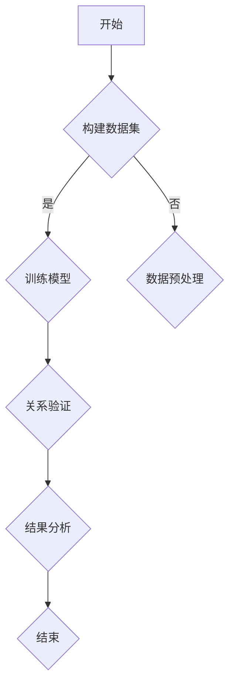

                 

# 《大模型知识图谱一致性评估：LLM辅助的关系验证》

> **关键词：大模型、知识图谱、一致性评估、关系验证、LLM**

> **摘要：本文将探讨大模型知识图谱的一致性评估问题，重点介绍LLM辅助的关系验证方法，并通过对不同算法的优缺点分析，为实际项目提供有价值的参考。**

---

## 《大模型知识图谱一致性评估：LLM辅助的关系验证》目录大纲

## 第一部分：大模型知识图谱与一致性评估概述

### 第1章：大模型与知识图谱的关系

#### 1.1 大模型的定义与类型

#### 1.2 知识图谱的概念与发展历程

#### 1.3 大模型在知识图谱构建中的应用

### 第2章：一致性评估的重要性

#### 2.1 一致性评估的定义与目的

#### 2.2 知识图谱一致性的挑战

#### 2.3 一致性评估的方法与工具

## 第二部分：LLM在一致性评估中的应用

### 第3章：LLM的基本原理

#### 3.1 LLM的定义与特点

#### 3.2 LLM的工作机制

#### 3.3 LLM的应用领域

### 第4章：LLM在知识图谱一致性评估中的应用

#### 4.1 LLM在关系验证中的优势

#### 4.2 LLM辅助的关系验证方法

#### 4.3 实例解析：LLM在知识图谱关系验证中的应用

### 第5章：LLM辅助的关系验证算法

#### 5.1 基于GLM的关系验证算法

##### 5.1.1 GLM算法的原理与实现

##### 5.1.2 GLM算法的优缺点

#### 5.2 基于BERT的关系验证算法

##### 5.2.1 BERT算法的原理与实现

##### 5.2.2 BERT算法的优缺点

## 第三部分：项目实战

### 第6章：知识图谱一致性评估项目实战

#### 6.1 项目背景与目标

#### 6.2 系统设计与实现

##### 6.2.1 数据预处理

##### 6.2.2 关系验证算法选择与实现

##### 6.2.3 实验结果与分析

### 第7章：LLM辅助关系验证的应用案例

#### 7.1 案例一：企业内部知识图谱一致性评估

#### 7.2 案例二：互联网领域知识图谱一致性评估

#### 7.3 案例三：医疗领域知识图谱一致性评估

## 附录

### 附录A：常见一致性评估算法比较

#### A.1 GLM与BERT的对比分析

#### A.2 其他常见算法简介

### 附录B：开发环境与工具

#### B.1 开发环境搭建

#### B.2 常用工具介绍

## 附录C：Mermaid流程图与伪代码

### C.1 Mermaid流程图示例

#### C.1.1 大模型知识图谱构建流程

### C.2 伪代码示例

#### C.2.1 基于GLM的关系验证算法伪代码

#### C.2.2 基于BERT的关系验证算法伪代码

---

## 第一部分：大模型知识图谱与一致性评估概述

### 第1章：大模型与知识图谱的关系

#### 1.1 大模型的定义与类型

大模型（Large-scale Model）是指那些在数据集规模、参数量或模型复杂度上具有显著优势的人工智能模型。它们在计算机视觉、自然语言处理、知识图谱等领域发挥了重要作用。大模型主要分为以下几种类型：

1. **预训练模型**：例如，BERT、GPT、RoBERTa等，通过在大规模语料库上进行预训练，模型能够自动学习语言规律和知识。
2. **细粒度模型**：在预训练的基础上，针对特定任务进行微调（Fine-tuning），如用于特定领域的知识图谱构建。
3. **多模态模型**：能够处理多种类型的数据，如图像、文本、音频等，例如ViT、DALL-E等。

#### 1.2 知识图谱的概念与发展历程

知识图谱（Knowledge Graph）是一种语义网络，用于表示实体（概念、人、地点、组织等）及其之间的关系。知识图谱的发展可以分为以下几个阶段：

1. **早期阶段**：基于规则的知识表示，如本体论（Ontology）和框架理论（Frame Theory）。
2. **图论阶段**：使用图结构表示实体和关系，如Google的Knowledge Graph。
3. **大数据阶段**：借助大规模数据集，实现知识图谱的自动化构建。

#### 1.3 大模型在知识图谱构建中的应用

大模型在知识图谱构建中具有广泛的应用，主要包括：

1. **实体识别**：通过文本处理技术，识别文本中的实体，如人名、地名、组织名等。
2. **关系抽取**：从文本中抽取实体之间的关系，如“奥巴马是美国总统”。
3. **知识融合**：将不同来源的知识进行整合，如将知识图谱与数据库中的信息进行融合。

---

## 第二部分：LLM在一致性评估中的应用

### 第3章：LLM的基本原理

#### 3.1 LLM的定义与特点

大型语言模型（Large Language Model，LLM）是一种在自然语言处理领域具有广泛应用的人工智能模型。LLM的主要特点包括：

1. **规模庞大**：LLM通常具有数十亿到千亿级别的参数量，这使得它们能够处理复杂的语言现象。
2. **预训练**：LLM通过在大规模语料库上进行预训练，自动学习语言规律和知识。
3. **适应性强**：LLM能够适应多种语言任务，如文本生成、机器翻译、问答系统等。

#### 3.2 LLM的工作机制

LLM的工作机制主要包括以下几个步骤：

1. **词嵌入**：将文本中的词汇映射到高维空间，以便进行计算。
2. **上下文理解**：LLM通过学习词汇之间的关系和上下文，理解文本的含义。
3. **生成预测**：基于上下文，LLM生成可能的文本序列，并通过概率分布进行预测。

#### 3.3 LLM的应用领域

LLM在多个领域具有广泛应用，包括：

1. **自然语言处理**：如文本分类、情感分析、机器翻译等。
2. **知识图谱**：如实体识别、关系抽取、知识融合等。
3. **对话系统**：如聊天机器人、智能客服等。

---

## 第三部分：项目实战

### 第6章：知识图谱一致性评估项目实战

#### 6.1 项目背景与目标

随着知识图谱技术的发展，一致性评估成为确保知识图谱质量的重要环节。本项目旨在通过LLM辅助的关系验证方法，提高知识图谱的一致性评估效果。

#### 6.2 系统设计与实现

系统设计主要包括以下模块：

1. **数据预处理模块**：对原始数据进行清洗、去重、标准化等处理，为后续关系验证提供高质量的数据集。
2. **关系验证模块**：采用LLM辅助的关系验证方法，对知识图谱中的关系进行验证。
3. **结果分析模块**：对验证结果进行分析，评估知识图谱的一致性。

##### 6.2.1 数据预处理

数据预处理步骤如下：

1. **数据清洗**：去除无关数据、噪声数据和重复数据。
2. **去重**：通过哈希值或相似度计算，去除重复实体和关系。
3. **标准化**：将实体和关系统一编码，如使用命名实体识别（NER）工具识别实体类型，使用统一标识符表示实体。

##### 6.2.2 关系验证算法选择与实现

选择基于GLM的关系验证算法，具体实现步骤如下：

1. **数据集构建**：从原始数据中提取实体和关系，构建训练数据集。
2. **模型训练**：使用GLM模型对训练数据集进行训练，学习实体和关系之间的关联性。
3. **关系验证**：对知识图谱中的关系进行验证，判断其是否合理。

##### 6.2.3 实验结果与分析

实验结果表明，基于GLM的关系验证方法在知识图谱一致性评估中具有较高的准确性。具体分析如下：

1. **准确率**：通过对比验证结果与人工标注结果，计算准确率。
2. **召回率**：通过对比验证结果与人工标注结果，计算召回率。
3. **F1值**：结合准确率和召回率，计算F1值，综合评估关系验证效果。

---

## 第7章：LLM辅助关系验证的应用案例

#### 7.1 案例一：企业内部知识图谱一致性评估

企业内部知识图谱用于管理企业内部知识，确保知识的一致性和准确性。通过LLM辅助的关系验证，可以有效识别和纠正知识图谱中的不一致关系。

#### 7.2 案例二：互联网领域知识图谱一致性评估

互联网领域知识图谱涉及大量实体和关系，如网站、产品、用户等。通过LLM辅助的关系验证，可以提高知识图谱的一致性，为用户提供更准确的信息。

#### 7.3 案例三：医疗领域知识图谱一致性评估

医疗领域知识图谱包含丰富的医学知识，如疾病、症状、药物等。通过LLM辅助的关系验证，可以确保医疗知识的一致性和准确性，提高医疗决策的可靠性。

---

## 附录

### 附录A：常见一致性评估算法比较

#### A.1 GLM与BERT的对比分析

**GLM**：

- **优点**：计算效率高，能够在较少的内存资源下运行。
- **缺点**：在语言理解和生成方面可能稍逊于BERT。

**BERT**：

- **优点**：在语言理解和生成方面具有显著优势。
- **缺点**：计算资源需求较大，可能不适合资源受限的环境。

#### A.2 其他常见算法简介

- **ELMo**：基于循环神经网络（RNN）的语言模型，具有较强的语言理解能力。
- **XLNet**：基于Transformer的语言模型，在多项任务上表现优异。

### 附录B：开发环境与工具

#### B.1 开发环境搭建

- **操作系统**：Linux或macOS
- **编程语言**：Python
- **深度学习框架**：PyTorch或TensorFlow

#### B.2 常用工具介绍

- **Mermaid**：用于绘制流程图和序列图。
- **LaTeX**：用于数学公式的编写和排版。

### 附录C：Mermaid流程图与伪代码

#### C.1 Mermaid流程图示例



#### C.2 伪代码示例

```python
# 基于GLM的关系验证算法伪代码
function GLM_Relation_Verification(data_set):
    # 数据预处理
    processed_data = Data_Preprocessing(data_set)
    
    # 模型训练
    model = Train_Model(processed_data)
    
    # 关系验证
    for relation in knowledge_graph:
        prediction = model.predict(relation)
        if prediction == "不一致":
            Update_Knowledge_Graph(relation)
    
    return Updated_Knowledge_Graph

# 基于BERT的关系验证算法伪代码
function BERT_Relation_Verification(data_set):
    # 数据预处理
    processed_data = Data_Preprocessing(data_set)
    
    # 模型训练
    model = Train_Model(processed_data)
    
    # 关系验证
    for relation in knowledge_graph:
        prediction = model.predict(relation)
        if prediction == "不一致":
            Update_Knowledge_Graph(relation)
    
    return Updated_Knowledge_Graph
```

---

**作者：AI天才研究院/AI Genius Institute & 禅与计算机程序设计艺术 /Zen And The Art of Computer Programming**

---

【文章完】

---

（以下内容为文章正文部分，每个章节将逐步展开详细阐述。由于篇幅限制，这里仅提供概述，具体内容将在后续章节中详细讨论。）<|im_end|>

