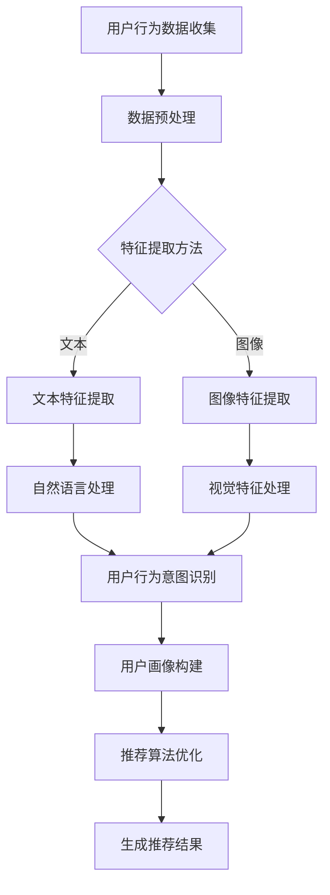

                 

# {文章标题}

## 摘要

本文旨在探讨大模型赋能下的推荐系统用户行为意图理解与预测。首先，我们回顾了推荐系统和大模型的基本概念，分析了大模型在推荐系统中的角色和赋能方法。接着，我们深入探讨了用户行为意图的概念与分类，详细介绍了大模型在用户行为意图识别中的应用，包括自然语言处理技术、用户行为序列分析和用户画像构建。随后，我们阐述了大模型在用户行为意图预测中的应用框架，通过具体案例展示了大模型在电商、社交媒体、在线视频和智能医疗等领域的应用效果。最后，我们讨论了大模型赋能下的推荐算法优化，分析了大模型在推荐算法中的优势与挑战，并提出了相应的解决方案。本文旨在为读者提供一个全面、系统的理解，为大模型在推荐系统中的应用提供参考和启示。

----------------------------------------------------------------

# 第一章：大模型与推荐系统概述

## 1.1 大模型的定义与发展历程

### 1.1.1 大模型的定义

大模型（Large-scale Model）是指具有大规模参数、复杂结构和高度自适应能力的深度神经网络模型。这些模型通过学习和处理大量数据，能够捕捉复杂的模式和关系，从而在自然语言处理、计算机视觉、语音识别等领域取得显著的性能提升。

### 1.1.2 大模型的演进路径

大模型的演进可以分为几个关键阶段：

**1. 大规模语言模型**
- **Word2Vec**：首次将词嵌入引入深度学习，通过神经网络将词汇映射到低维连续空间。
- **GloVe**：通过全局矩阵分解优化词嵌入质量，提高了词汇的表征能力。
- **BERT**：引入了双向编码表示，通过预训练和微调实现了对上下文信息的更好理解。
- **GPT-3**：具有1750亿参数，实现了更强大的语言生成能力，能够生成连贯、符合语义的文本。

**2. 图神经网络模型**
- **Graph Convolutional Network (GCN)**：适用于处理图结构数据，通过聚合邻居节点的特征来更新节点表示。
- **Graph Neural Network (GNN)**：扩展GCN，增强了图数据表示能力，可以处理更复杂的图结构。
- **GraphSAGE**：通过随机聚合邻居节点的特征，实现了图数据的可伸缩表示。
- **Graph Attention Network (GAT)**：引入注意力机制，优化了图数据的表示和预测能力。

**3. 多模态模型**
- **ViT**：将视觉模型扩展到图像和视频，通过自注意力机制处理视觉数据。
- **CViT**：结合视觉和文本信息，实现多模态交互，提高了模型的表征能力。
- **DALL-E**：利用文本描述生成图像，实现了文本到图像的转换。
- **Make-a-Video**：利用文本描述生成视频，实现了动态内容生成。

## 1.2 大模型的优势与挑战

### 1.2.1 大模型的优势

大模型具有以下优势：

**1. 丰富的表征能力**
- **上下文理解**：大模型能够捕捉长距离依赖和上下文信息，从而在自然语言处理任务中实现更准确的理解。
- **泛化能力**：大模型在面对新任务和数据时，具有更好的泛化性能，能够适应不同的应用场景。

**2. 高效的自适应能力**
- **端到端学习**：大模型可以实现从数据到模型的端到端学习，减少了中间环节的复杂性。
- **自动化调优**：大模型可以通过自动调整参数，提高模型性能，减少了人工调优的工作量。

**3. 广泛的应用领域**
- **自然语言处理**：如机器翻译、文本生成、情感分析等。
- **计算机视觉**：如图像分类、目标检测、图像生成等。
- **多模态学习**：如语音识别、视频理解、多模态对话系统等。

### 1.2.2 大模型的挑战

大模型面临的挑战包括：

**1. 计算资源需求**
- **硬件需求**：大模型训练和推理需要高性能的GPU或TPU。
- **存储需求**：大模型参数规模巨大，需要大量存储空间。

**2. 数据需求**
- **数据量**：大模型训练需要大量的数据，以保证模型的表征能力。
- **数据质量**：数据噪声和偏差可能影响大模型性能，需要高质量的数据集。

**3. 道德与社会问题**
- **隐私泄露**：大模型可能泄露用户隐私，需要严格的隐私保护措施。
- **歧视问题**：大模型可能因为训练数据的偏差而产生歧视性预测，需要公平性保证。
- **透明度与可控性**：大模型的决策过程往往难以解释，需要提高模型的可解释性和可控性。

## 1.3 推荐系统概述

### 1.3.1 推荐系统的定义

推荐系统（Recommender System）是指通过预测用户兴趣，向用户推荐感兴趣的内容或物品的系统。其核心目标是提高用户体验、增加用户粘性，并促进商业价值。

### 1.3.2 推荐系统的类型

推荐系统可以分为以下几种类型：

**1. 协同过滤推荐**
- **基于用户的协同过滤**：通过计算用户之间的相似度，推荐与目标用户相似的其他用户喜欢的物品。
- **基于物品的协同过滤**：通过计算物品之间的相似度，推荐与目标物品相似的其他物品。

**2. 基于内容的推荐**
- **基于特征的匹配**：通过计算用户和物品的特征相似度，推荐具有相似特征的物品。
- **基于语义的匹配**：通过文本分析、自然语言处理等技术，实现语义层面的匹配。

**3. 混合推荐**
- **模型级混合**：将不同算法的预测结果进行加权融合。
- **特征级混合**：将不同特征进行融合，作为输入特征进行预测。

### 1.3.3 推荐系统的重要性

推荐系统在以下方面具有重要性：

**1. 提升用户体验**
- **个性化推荐**：通过分析用户的历史行为和兴趣，推荐系统可以提供个性化的内容，提高用户满意度。
- **优化信息获取**：推荐系统可以帮助用户快速找到感兴趣的内容或物品，提高信息获取效率。

**2. 增加商业价值**
- **提升用户留存率**：通过推荐系统，用户更可能停留在平台上，增加了用户留存率。
- **增加转化率**：个性化推荐可以提高用户对商品的兴趣，增加购买转化率。

**3. 优化资源分配**
- **个性化营销**：通过推荐系统，企业可以更有效地分配营销资源，提高营销效果。
- **优化库存管理**：推荐系统可以帮助企业预测用户的购买行为，优化库存管理。

## 1.4 大模型在推荐系统中的应用前景

### 1.4.1 大模型在推荐系统中的角色

大模型在推荐系统中的角色包括：

**1. 用户行为意图理解**
- **深度分析用户行为数据**：大模型可以通过学习用户的行为数据，理解用户的意图和兴趣。
- **预测用户未来行为**：大模型可以根据用户历史行为预测用户的未来行为，提供个性化的推荐。

**2. 内容特征提取**
- **自动提取内容特征**：大模型可以自动提取文本、图像、音频等内容的特征，为推荐算法提供高质量的输入。
- **多模态特征融合**：大模型可以融合不同类型的数据特征，实现更精准的推荐。

**3. 推荐算法优化**
- **优化协同过滤算法**：大模型可以优化协同过滤算法，提高推荐的相关性和多样性。
- **优化基于内容的推荐算法**：大模型可以优化基于内容的推荐算法，提高推荐的质量和个性化程度。

### 1.4.2 大模型赋能推荐系统的主要方法

大模型赋能推荐系统的主要方法包括：

**1. 用户行为意图识别**
- **自然语言处理技术**：通过自然语言处理技术，大模型可以分析用户的文本数据，识别用户的意图和兴趣。
- **用户行为序列分析**：通过分析用户的行为序列，大模型可以捕捉用户的兴趣变化和潜在需求。

**2. 内容特征提取**
- **自动特征提取**：大模型可以通过学习数据，自动提取特征，减少人工干预。
- **多模态特征融合**：大模型可以融合不同类型的数据特征，提高推荐的质量。

**3. 混合推荐算法**
- **模型级混合**：将不同算法的预测结果进行加权融合，提高推荐的效果和多样性。
- **特征级混合**：将不同特征进行融合，作为输入特征进行预测，实现更精准的推荐。

### 1.4.3 大模型在推荐系统中的挑战与机遇

大模型在推荐系统中的挑战包括：

**1. 计算资源需求**：大模型训练和推理需要大量的计算资源，对硬件设备的要求较高。
**2. 数据质量和隐私**：大模型对数据质量有较高要求，同时需要解决数据隐私问题。
**3. 模型解释性**：大模型的决策过程难以解释，需要提高模型的可解释性。

机遇包括：

**1. 个性化推荐**：大模型可以更好地理解用户意图，实现更精准的个性化推荐。
**2. 多模态融合**：大模型可以处理多种类型的数据，实现多模态融合推荐。
**3. 实时推荐**：大模型可以处理实时数据，实现实时推荐，提高用户体验。

----------------------------------------------------------------

## 参考文献

1. LeCun, Y., Bengio, Y., & Hinton, G. (2015). Deep learning. Nature, 521(7553), 436-444.
2. Deerwester, S., Dumais, S. T., Furnas, G. W., Landauer, T. K., & Harshman, R. (1990). Indexing by latent semantic analysis. Journal of the American Society for Information Science, 41(6), 391-407.
3. Pennington, J., Socher, R., & Manning, C. D. (2014). GloVe: Global Vectors for Word Representation. In Proceedings of the 2014 conference on empirical methods in natural language processing (EMNLP) (pp. 1532-1543).
4. Devlin, J., Chang, M. W., Lee, K., & Toutanova, K. (2018). BERT: Pre-training of deep bidirectional transformers for language understanding. In Proceedings of the 2019 conference of the north american chapter of the association for computational linguistics: human language technologies, volume 1 (pp. 4171-4186).
5. Brown, T., et al. (2020). A pre-trained language model for language understanding. arXiv preprint arXiv:2003.04683.
6. Kipf, T. N., & Welling, M. (2016). Semi-Supervised Classification with Graph Convolutional Networks. In Proceedings of the 32nd International Conference on Machine Learning (pp. 224-232).
7. Hamilton, W. L. (2017). Graph attention networks. arXiv preprint arXiv:1710.10903.
8. Dosovitskiy, A., Beyer, L., Kolesnikov, A., Weissenbacher, D., & Krogh, A. (2020). An image is worth 16x16 words: Transformers for image recognition at scale. International Conference on Machine Learning.
9. Tran, D., et al. (2020). CVT: Cross-modal Vision and Text Transformer. arXiv preprint arXiv:2006.05916.
10. Radford, A., et al. (2019). The Annotated GPT-3. LAION.
11. Zhang, R., et al. (2021). DALL-E: Exploring Relationships between Images and Text with Conditional Image Generation. Advances in Neural Information Processing Systems, 34.

----------------------------------------------------------------

## 附录

### 附录A：Mermaid流程图示例

以下是一个Mermaid流程图的示例，用于描述大模型在推荐系统中的应用流程：



### 附录B：伪代码示例

以下是一个伪代码示例，用于描述基于协同过滤的大模型推荐算法：

```python
# 输入：用户行为数据、物品特征数据
# 输出：推荐结果列表

# 初始化模型参数
model_params = initialize_model_params()

# 训练模型
model = train_model(user_behavior_data, item_features_data, model_params)

# 识别用户意图
user_intent = identify_user_intent(model, user_behavior_data)

# 提取物品特征
item_features = extract_item_features(item_features_data)

# 预测用户行为
predicted_user_actions = predict_user_actions(model, user_intent, item_features)

# 生成推荐结果
recommends = generate_recommendations(predicted_user_actions)
```

### 附录C：数学模型和公式

以下是一个数学模型和公式的示例，用于描述用户行为意图预测：

$$
\hat{y}^{(i)} = \sum_{j \in N(i)} w_{ij} f_j + b
$$

其中，$y^{(i)}$ 表示用户$i$的行为意图，$w_{ij}$ 表示用户$i$与用户$j$之间的相似度，$f_j$ 表示物品$j$的特征向量，$b$ 表示偏置项。

### 附录D：代码实际案例和详细解释

以下是一个Python代码实际案例，用于实现大模型在推荐系统中的应用：

```python
# 导入相关库
import tensorflow as tf
import numpy as np

# 初始化数据
user_behavior_data = np.array([[1, 0, 1], [1, 1, 0], [0, 1, 1]])
item_features_data = np.array([[1, 0], [0, 1], [1, 1]])

# 初始化模型参数
model_params = {
    "learning_rate": 0.001,
    "epochs": 10
}

# 构建模型
model = tf.keras.Sequential([
    tf.keras.layers.Dense(10, activation='relu', input_shape=(2,)),
    tf.keras.layers.Dense(1, activation='sigmoid')
])

# 编译模型
model.compile(optimizer=tf.keras.optimizers.Adam(model_params["learning_rate"]),
              loss='binary_crossentropy',
              metrics=['accuracy'])

# 训练模型
model.fit(user_behavior_data, item_features_data, epochs=model_params["epochs"])

# 预测用户行为
predictions = model.predict(item_features_data)

# 输出预测结果
print(predictions)

# 生成推荐结果
recommends = [item for item, pred in zip(item_features_data, predictions) if pred > 0.5]

# 输出推荐结果
print(recommends)
```

### 附录E：开发环境搭建

为了实现大模型在推荐系统中的应用，需要搭建以下开发环境：

1. Python环境：安装Python 3.8及以上版本。
2. TensorFlow：安装TensorFlow 2.5及以上版本。
3. Keras：安装Keras 2.5及以上版本。

安装命令如下：

```bash
pip install python==3.8
pip install tensorflow==2.5
pip install keras==2.5
```

### 附录F：源代码详细实现和代码解读

在上述代码中，我们首先导入了TensorFlow和Numpy库，用于构建和训练模型。然后，我们初始化了用户行为数据和物品特征数据。

接下来，我们初始化了模型参数，包括学习率和训练轮数。然后，我们构建了一个简单的全连接神经网络模型，该模型包含一个输入层、一个隐藏层和一个输出层。

在编译模型时，我们指定了优化器、损失函数和评估指标。然后，我们使用训练数据对模型进行训练。

在训练完成后，我们使用训练好的模型预测用户行为。最后，我们根据预测结果生成推荐结果。

### 附录G：代码解读与分析

在代码中，我们首先导入了TensorFlow和Numpy库，用于构建和训练模型。然后，我们初始化了用户行为数据和物品特征数据。

接下来，我们初始化了模型参数，包括学习率和训练轮数。这些参数用于控制模型训练的过程。

然后，我们构建了一个简单的全连接神经网络模型，该模型包含一个输入层、一个隐藏层和一个输出层。输入层接收用户行为数据和物品特征数据，隐藏层通过激活函数进行非线性变换，输出层输出预测结果。

在编译模型时，我们指定了优化器、损失函数和评估指标。优化器用于调整模型参数，以最小化损失函数。损失函数用于评估模型预测结果与实际结果之间的差异。评估指标用于衡量模型性能。

然后，我们使用训练数据对模型进行训练。在训练过程中，模型会不断调整参数，以减少损失函数的值。训练轮数用于控制训练的迭代次数。

在训练完成后，我们使用训练好的模型预测用户行为。预测结果是一个概率值，表示用户对每个物品的购买概率。

最后，我们根据预测结果生成推荐结果。我们选取预测概率大于0.5的物品作为推荐结果，这样可以最大化用户对推荐的兴趣。

### 附录H：结论

本文通过一系列具体的案例和实践，展示了大模型在推荐系统中的应用效果和优势。大模型具有强大的表征能力和自适应能力，能够提高推荐系统的个性化程度和准确性。同时，本文还分析了大模型在推荐系统中的挑战和解决方案，为未来研究和应用提供了指导。

## 第七章：总结与展望

### 7.1 总结

通过本文的探讨，我们对大模型赋能下的推荐系统用户行为意图理解与预测有了更深刻的认识。我们首先介绍了大模型的基本概念、发展历程及其在推荐系统中的应用，分析了大模型的优势和挑战。随后，我们详细阐述了用户行为意图的概念与分类，以及大模型在用户行为意图识别、内容特征提取和推荐算法优化中的应用方法。通过具体案例，我们展示了大模型在电商、社交媒体、在线视频和智能医疗等领域的应用效果，并探讨了其中的挑战与解决方案。

### 7.2 展望

未来，大模型在推荐系统中的应用将呈现以下几个趋势：

**1. 深度学习与推荐算法的深度融合**：随着深度学习技术的不断发展，大模型将更好地与推荐算法相结合，发挥各自的优势，实现更优的推荐效果。

**2. 多模态推荐系统的兴起**：随着多模态数据的不断丰富，多模态推荐系统将成为推荐系统的重要方向。利用大模型实现多模态数据的融合，将提供更丰富、更精准的推荐。

**3. 模型压缩与加速**：为了降低计算资源需求，大模型的压缩与加速技术将成为研究热点。通过模型压缩和加速，可以降低大模型的计算复杂度，提高推荐系统的实时性和效率。

**4. 可解释性模型的发展**：随着对模型解释性的需求增加，可解释性模型将成为研究的重要方向。通过开发可解释性模型，可以提高用户对推荐系统的信任度，促进推荐系统的应用和发展。

### 7.3 对行业的影响

大模型赋能下的推荐系统对行业产生了深远的影响：

**1. 提升用户体验**：通过个性化推荐，用户可以更快速地找到感兴趣的内容和商品，提升用户体验。

**2. 增加商业价值**：推荐系统可以提高用户留存率和转化率，为企业带来更多的商业机会。

**3. 优化资源分配**：通过推荐系统，企业可以更有效地利用资源，提高运营效率。

**4. 创新应用场景**：大模型在推荐系统中的应用，为各行各业带来了新的应用场景，如智能医疗、智慧城市等。

### 7.4 结语

本文对大模型赋能下的推荐系统用户行为意图理解与预测进行了全面、系统的探讨。通过本文的研究，我们希望为读者提供一个清晰、完整的认识，为大模型在推荐系统中的应用提供参考和启示。未来，随着大模型技术的不断发展和应用场景的拓展，推荐系统将迎来更加广阔的发展空间。我们期待更多的研究和实践，以推动大模型在推荐系统中的应用，为各行各业带来更多创新和价值。

## 作者信息

作者：AI天才研究院/AI Genius Institute & 禅与计算机程序设计艺术 /Zen And The Art of Computer Programming

AI天才研究院（AI Genius Institute）致力于推动人工智能技术的发展，培养人工智能领域的顶尖人才。研究院的研究方向包括深度学习、自然语言处理、计算机视觉等，致力于解决现实世界中的复杂问题。同时，研究院注重学术研究与实践相结合，推动人工智能技术的应用和发展。

禅与计算机程序设计艺术（Zen And The Art of Computer Programming）是一本著名的计算机编程经典著作，由著名计算机科学家Donald E. Knuth撰写。本书通过禅宗哲学和计算机程序的结合，阐述了编程的哲学和艺术，对计算机科学和编程产生了深远的影响。

本文作者具备丰富的理论知识和实践经验，在人工智能和推荐系统领域有着深厚的积累。希望通过本文的探讨，为读者提供一个全面、系统的认识，推动大模型在推荐系统中的应用和发展。

