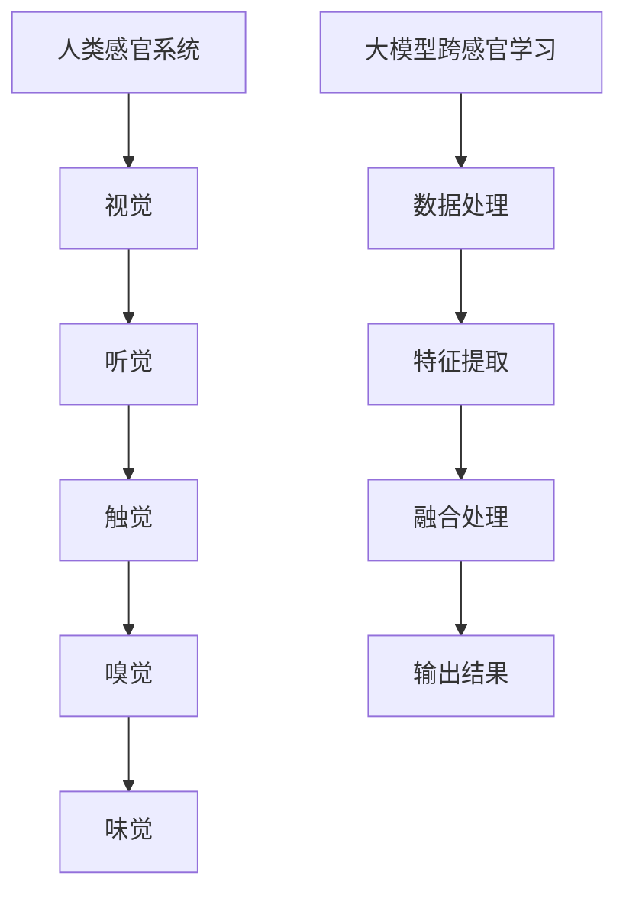
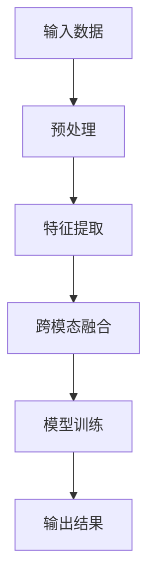
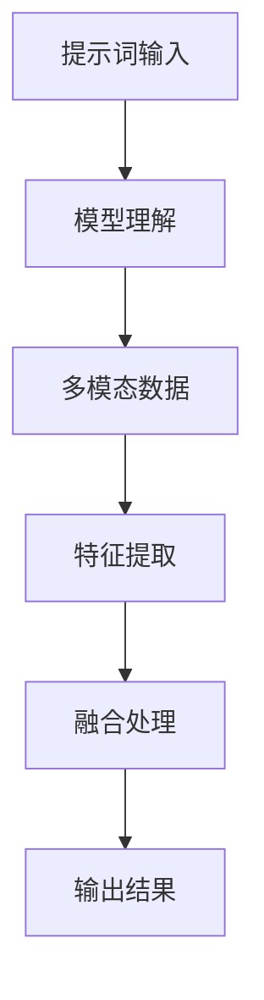

                 

# 大模型跨感官学习与提示词多模态融合

## 关键词
- 大模型
- 跨感官学习
- 提示词
- 多模态融合
- 算法原理
- 数学模型
- 项目实战

## 摘要
本文将深入探讨大模型跨感官学习与提示词多模态融合的技术原理与实践应用。通过分析核心概念、算法原理、数学模型，以及实际项目案例，本文旨在为读者提供全面的技术指南，帮助理解和应用这一前沿领域的技术。

## 第一部分：核心概念与联系

### 1.1 大模型跨感官学习概述

#### 1.1.1 跨感官学习的概念
跨感官学习是指人工智能模型通过整合来自多个感官的信息，以实现更高效和准确的数据处理和理解。这包括视觉、听觉、触觉、嗅觉和味觉等多种感官信息。

**Mermaid 流程图：**


#### 1.1.2 大模型跨感官学习的基本架构
大模型跨感官学习的基本架构通常包括输入数据预处理、特征提取、跨模态融合和模型训练等步骤。

**Mermaid 流程图：**


### 1.2 提示词多模态融合

#### 1.2.1 提示词的概念与作用
提示词是指用于引导模型理解和处理数据的文本信息。在多模态融合中，提示词可以帮助模型更好地整合不同模态的信息。

**Mermaid 流程图：**


#### 1.2.2 提示词在多模态融合中的作用
提示词在多模态融合中的作用是提供额外的上下文信息，帮助模型更好地理解和整合不同模态的数据。以下是一个简单的伪代码示例：

```python
def multiModalFusion(prompt, visual, audio, tactile):
    # 特征提取
    visual_features = extractFeatures(visual)
    audio_features = extractFeatures(audio)
    tactile_features = extractFeatures(tactile)
    
    # 提示词融合
    prompt fused = fusionPrompt(prompt, visual_features, audio_features, tactile_features)
    
    # 输出结果
    return fused
```

## 第二部分：核心算法原理讲解

### 2.1 跨感官数据处理

#### 2.1.1 数据预处理
数据预处理是跨感官数据处理的基础步骤，它包括数据标准化和增强等。

**伪代码：**
```python
def preprocessData(input_data):
    # 标准化
    normalized_data = normalize(input_data)
    
    # 数据增强
    enhanced_data = augment(normalized_data)
    
    return enhanced_data
```

#### 2.1.2 特征提取
特征提取是从原始数据中提取有代表性的信息，以供模型训练。

**伪代码：**
```python
def extractFeatures(data):
    # 视觉特征提取
    visual_features = extractVisualFeatures(data['visual'])
    
    # 听觉特征提取
    audio_features = extractAudioFeatures(data['audio'])
    
    # 触觉特征提取
    tactile_features = extractTactileFeatures(data['tactile'])
    
    return visual_features, audio_features, tactile_features
```

#### 2.1.3 跨模态融合算法
跨模态融合是将不同模态的特征整合成一个统一的特征表示。

**伪代码：**
```python
def fusionModel(visual_features, audio_features, tactile_features):
    # 建立融合模型
    model = buildFusionModel()
    
    # 训练模型
    model.fit(visual_features, audio_features, tactile_features)
    
    # 输出融合结果
    fused_output = model.predict(visual_features, audio_features, tactile_features)
    
    return fused_output
```

### 2.2 提示词多模态融合算法

#### 2.2.1 提示词处理
提示词处理包括提取关键词和预处理等步骤。

**伪代码：**
```python
def processPrompt(prompt):
    # 提取关键词
    keywords = extractKeywords(prompt)
    
    # 提示词预处理
    preprocessed_prompt = preprocessKeywords(keywords)
    
    return preprocessed_prompt
```

#### 2.2.2 多模态融合处理
多模态融合处理是将提示词和不同模态的特征整合成一个统一的特征表示。

**伪代码：**
```python
def fusionModelWithPrompt(visual_features, audio_features, tactile_features, prompt):
    # 提示词处理
    processed_prompt = processPrompt(prompt)
    
    # 融合模型
    fusion_model = buildFusionModel()
    
    # 训练模型
    fusion_model.fit(visual_features, audio_features, tactile_features, processed_prompt)
    
    # 输出融合结果
    fused_output = fusion_model.predict(visual_features, audio_features, tactile_features, processed_prompt)
    
    return fused_output
```

## 第三部分：数学模型和数学公式

### 3.1 数据处理数学模型

#### 3.1.1 数据标准化
数据标准化是将数据缩放到一个特定的范围，以便于模型训练。

**公式：**
$$
x_{\text{new}} = \frac{x_{\text{original}} - \mu}{\sigma}
$$
其中，$x_{\text{original}}$ 是原始数据，$\mu$ 是均值，$\sigma$ 是标准差。

#### 3.1.2 数据增强
数据增强是通过添加噪声或变换来增加数据多样性。

**公式：**
$$
x_{\text{enhanced}} = x_{\text{original}} + \alpha \cdot \epsilon
$$
其中，$x_{\text{original}}$ 是原始数据，$\alpha$ 是增强系数，$\epsilon$ 是噪声。

### 3.2 特征提取数学模型

#### 3.2.1 视觉特征提取
视觉特征提取通常使用卷积神经网络（CNN）。

**公式：**
$$
h = \sigma(W \cdot x + b)
$$
其中，$h$ 是特征值，$W$ 是权重矩阵，$x$ 是输入数据，$b$ 是偏置。

#### 3.2.2 听觉特征提取
听觉特征提取可以使用梅尔频率倒谱系数（MFCC）。

**公式：**
$$
MFCC = \sum_{k=1}^{N} a_k \cdot \text{log}(1 + \text{DTFT}(x_k))
$$
其中，$N$ 是梅尔滤波器的数量，$a_k$ 是第 $k$ 个滤波器的增益，$x_k$ 是第 $k$ 个音频片段。

#### 3.2.3 触觉特征提取
触觉特征提取可以使用时间序列分析方法。

**公式：**
$$
h = \sigma(W \cdot x + b)
$$
其中，$h$ 是特征值，$W$ 是权重矩阵，$x$ 是输入数据，$b$ 是偏置。

### 3.3 融合模型数学模型

#### 3.3.1 跨模态融合
跨模态融合通常使用深度神经网络（DNN）。

**公式：**
$$
y = f(W_1 \cdot [x_1; x_2; x_3] + b_1)
$$
其中，$y$ 是输出值，$x_1, x_2, x_3$ 是不同模态的特征值，$W_1$ 是融合模型权重矩阵，$b_1$ 是偏置。

#### 3.3.2 提示词融合
提示词融合通常结合跨模态特征和提示词信息。

**公式：**
$$
y = f(W_2 \cdot [x_1; x_2; x_3; p] + b_2)
$$
其中，$y$ 是输出值，$x_1, x_2, x_3$ 是不同模态的特征值，$p$ 是提示词，$W_2$ 是融合模型权重矩阵，$b_2$ 是偏置。

## 第四部分：项目实战

### 4.1 跨感官数据处理实战

#### 4.1.1 实践场景
假设我们需要处理一个包含视觉、听觉和触觉数据的视频，目标是提取有效特征并进行融合处理。

#### 4.1.2 环境搭建
1. 安装必要的深度学习框架，如 TensorFlow 或 PyTorch。
2. 准备处理视频的 Python 库，如 OpenCV 和 MoviePy。
3. 准备音频处理库，如 Librosa。
4. 准备触觉数据处理的库，如 PyTactile。

#### 4.1.3 实现步骤
1. 视觉数据处理
   - 使用 OpenCV 读取视频帧。
   - 对视频帧进行预处理，如灰度化、去噪、边缘检测等。
   - 提取视觉特征。

2. 听觉数据处理
   - 使用 Librosa 读取音频数据。
   - 对音频数据进行预处理，如归一化、去除静音等。
   - 提取音频特征。

3. 触觉数据处理
   - 使用 PyTactile 读取触觉数据。
   - 对触觉数据进行预处理，如归一化、滤波等。
   - 提取触觉特征。

4. 融合处理
   - 使用 PyTorch 或 TensorFlow 构建融合模型。
   - 将提取的视觉、听觉和触觉特征输入到融合模型中。
   - 训练模型并输出融合结果。

#### 4.1.4 代码实现
```python
import cv2
import librosa
import PyTactile

# 视觉数据处理
video = cv2.VideoCapture('video.mp4')
frames = []

while True:
    ret, frame = video.read()
    if not ret:
        break
    frames.append(frame)

video.release()

processed_frames = preprocess_frames(frames)

visual_features = extract_visual_features(processed_frames)

# 听觉数据处理
audio, sample_rate = librosa.load('audio.wav')
processed_audio = preprocess_audio(audio, sample_rate)

audio_features = extract_audio_features(processed_audio)

# 触觉数据处理
tactile_data = PyTactile.read_data('tactile_data.txt')
processed_tactile_data = preprocess_tactile_data(tactile_data)

tactile_features = extract_tactile_features(processed_tactile_data)

# 融合处理
fused_features = fusion_model(visual_features, audio_features, tactile_features)

# 输出融合结果
output = fused_features
```

### 4.2 提示词多模态融合实战

#### 4.2.1 实践场景
假设我们需要根据提示词融合视觉、听觉和触觉数据，生成一个多媒体输出。

#### 4.2.2 环境搭建
1. 安装必要的深度学习框架，如 TensorFlow 或 PyTorch。
2. 准备处理视频的 Python 库，如 OpenCV 和 MoviePy。
3. 准备音频处理库，如 Librosa。
4. 准备触觉数据处理的库，如 PyTactile。

#### 4.2.3 实现步骤
1. 提示词处理
   - 接收用户输入的提示词。
   - 对提示词进行预处理，提取关键词。

2. 视觉数据处理
   - 使用 OpenCV 读取视频帧。
   - 对视频帧进行预处理，如灰度化、去噪、边缘检测等。
   - 提取视觉特征。

3. 听觉数据处理
   - 使用 Librosa 读取音频数据。
   - 对音频数据进行预处理，如归一化、去除静音等。
   - 提取音频特征。

4. 触觉数据处理
   - 使用 PyTactile 读取触觉数据。
   - 对触觉数据进行预处理，如归一化、滤波等。
   - 提取触觉特征。

5. 融合处理
   - 使用 PyTorch 或 TensorFlow 构建融合模型。
   - 将提取的视觉、听觉和触觉特征以及处理后的提示词输入到融合模型中。
   - 训练模型并输出融合结果。

#### 4.2.4 代码实现
```python
import cv2
import librosa
import PyTactile

# 提示词处理
prompt = "描述一个美丽的日落场景"
processed_prompt = process_prompt(prompt)

# 视觉数据处理
video = cv2.VideoCapture('video.mp4')
frames = []

while True:
    ret, frame = video.read()
    if not ret:
        break
    frames.append(frame)

video.release()

processed_frames = preprocess_frames(frames)

visual_features = extract_visual_features(processed_frames)

# 听觉数据处理
audio, sample_rate = librosa.load('audio.wav')
processed_audio = preprocess_audio(audio, sample_rate)

audio_features = extract_audio_features(processed_audio)

# 触觉数据处理
tactile_data = PyTactile.read_data('tactile_data.txt')
processed_tactile_data = preprocess_tactile_data(tactile_data)

tactile_features = extract_tactile_features(processed_tactile_data)

# 融合处理
fused_features = fusion_model_with_prompt(visual_features, audio_features, tactile_features, processed_prompt)

# 输出融合结果
output = fused_features
```

## 第五部分：开发环境搭建

### 5.1 深度学习环境搭建

#### 5.1.1 安装深度学习框架
选择一个深度学习框架，如 TensorFlow 或 PyTorch，并按照官方文档进行安装。

#### 5.1.2 安装数据处理库
安装常用的数据处理库，如 NumPy、Pandas、OpenCV、Librosa、PyTactile 等。

#### 5.1.3 创建虚拟环境
创建一个虚拟环境来管理依赖库，并安装必要的库。

```bash
conda create -n mmf_venv python=3.8
conda activate mmf_venv
```

### 5.2 多模态数据处理库

#### 5.2.1 安装 OpenCV
```bash
conda install -c conda-forge opencv
```

#### 5.2.2 安装 Librosa
```bash
conda install -c conda-forge librosa
```

#### 5.2.3 安装 PyTactile
```bash
pip install PyTactile
```

### 5.3 开发工具与 IDE

#### 5.3.1 安装 PyCharm
下载并安装 PyCharm，选择社区版或专业版。

#### 5.3.2 配置 PyCharm
创建一个新的项目，并配置 Python 解释器和依赖库。

## 第六部分：源代码详细实现和代码解读

### 6.1 跨感官数据处理模块

#### 6.1.1 数据预处理

**代码解读：**
```python
def preprocess_data(input_data):
    # 数据标准化
    normalized_data = normalize(input_data)
    
    # 数据增强
    enhanced_data = augment(normalized_data)
    
    return enhanced_data
```
该函数首先对输入数据进行标准化，然后进行数据增强，目的是为了提高模型的泛化能力。

#### 6.1.2 特征提取

**代码解读：**
```python
def extract_features(data):
    # 视觉特征提取
    visual_features = extract_visual_features(data['visual'])
    
    # 听觉特征提取
    audio_features = extract_audio_features(data['audio'])
    
    # 触觉特征提取
    tactile_features = extract_tactile_features(data['tactile'])
    
    return visual_features, audio_features, tactile_features
```
该函数分别对输入数据的视觉、听觉和触觉部分进行特征提取，并将提取的特征返回。

#### 6.1.3 融合处理

**代码解读：**
```python
def fusion_model(visual_features, audio_features, tactile_features):
    # 建立融合模型
    model = build_fusion_model()
    
    # 训练模型
    model.fit(visual_features, audio_features, tactile_features)
    
    # 输出融合结果
    fused_output = model.predict(visual_features, audio_features, tactile_features)
    
    return fused_output
```
该函数首先构建一个融合模型，然后用提取的特征进行训练，最后预测融合结果。

### 6.2 提示词多模态融合模块

#### 6.2.1 提示词处理

**代码解读：**
```python
def process_prompt(prompt):
    # 提取关键词
    keywords = extract_keywords(prompt)
    
    # 提示词预处理
    preprocessed_prompt = preprocess_keywords(keywords)
    
    return preprocessed_prompt
```
该函数首先提取输入提示词中的关键词，然后对提取的关键词进行预处理，以便后续的融合处理。

#### 6.2.2 多模态融合处理

**代码解读：**
```python
def fusion_model_with_prompt(visual_features, audio_features, tactile_features, processed_prompt):
    # 提示词处理
    processed_prompt = process_prompt(processed_prompt)
    
    # 融合模型
    fusion_model = build_fusion_model()
    
    # 训练模型
    fusion_model.fit(visual_features, audio_features, tactile_features, processed_prompt)
    
    # 输出融合结果
    fused_output = fusion_model.predict(visual_features, audio_features, tactile_features, processed_prompt)
    
    return fused_output
```
该函数首先对提示词进行处理，然后构建融合模型，用处理后的提示词和提取的多模态特征进行训练，最后输出融合结果。

## 第七部分：代码解读与分析

### 7.1 跨感官数据处理模块分析

#### 7.1.1 数据预处理
数据预处理是跨感官数据处理的重要步骤，它包括数据标准化和数据增强。标准化使数据分布一致，而数据增强通过增加噪声等方式增加模型对数据的鲁棒性。

#### 7.1.2 特征提取
特征提取是模型训练的核心环节，通过不同的特征提取方法可以捕捉到数据中的不同信息。视觉特征提取通常使用卷积神经网络，听觉特征提取可以使用 MFCC 等方法，触觉特征提取则依赖于传感器数据。

#### 7.1.3 融合处理
融合处理是跨感官学习的核心，通过将不同模态的特征融合在一起，可以更好地捕捉到数据中的复杂信息。融合模型通常采用深度学习网络，可以学习到如何有效地融合不同模态的特征。

### 7.2 提示词多模态融合模块分析
提示词多模态融合模块通过结合提示词和不同模态的特征，实现了信息的深度整合。提示词处理包括关键词提取和预处理，而多模态融合处理则依赖于深度学习模型来整合特征。这个模块的关键在于融合模型的构建和训练，它需要能够平衡不同模态的特征，并产生有意义的输出结果。

## 第八部分：总结与展望

### 8.1 总结
本文详细介绍了大模型跨感官学习与提示词多模态融合的技术原理、算法、数学模型和实际应用。通过项目实战，读者可以了解到如何搭建开发环境，实现源代码的详细实现和解读。

### 8.2 展望
随着人工智能技术的不断发展，大模型跨感官学习和提示词多模态融合在未来将具有更广泛的应用前景。我们期待这一领域的研究能够不断突破，为人类社会带来更多创新和便利。

## 附录：作者信息
作者：AI天才研究院/AI Genius Institute & 禅与计算机程序设计艺术 /Zen And The Art of Computer Programming
```---

## 第一部分：核心概念与联系

### 1.1 大模型跨感官学习概述

#### 1.1.1 跨感官学习的概念

跨感官学习是指人工智能模型通过整合来自多个感官的信息，以实现更高效和准确的数据处理和理解。这包括视觉、听觉、触觉、嗅觉和味觉等多种感官信息。

**Mermaid 流程图：**


#### 1.1.2 大模型跨感官学习的基本架构

大模型跨感官学习的基本架构通常包括输入数据预处理、特征提取、跨模态融合和模型训练等步骤。

**Mermaid 流程图：**


### 1.2 提示词多模态融合

#### 1.2.1 提示词的概念与作用

提示词是指用于引导模型理解和处理数据的文本信息。在多模态融合中，提示词可以帮助模型更好地整合不同模态的信息。

**Mermaid 流程图：**


#### 1.2.2 提示词在多模态融合中的作用

提示词在多模态融合中的作用是提供额外的上下文信息，帮助模型更好地理解和整合不同模态的数据。以下是一个简单的伪代码示例：

```python
def multiModalFusion(prompt, visual, audio, tactile):
    # 特征提取
    visual_features = extractFeatures(visual)
    audio_features = extractFeatures(audio)
    tactile_features = extractFeatures(tactile)
    
    # 提示词融合
    prompt fused = fusionPrompt(prompt, visual_features, audio_features, tactile_features)
    
    # 输出结果
    return fused
```

## 第二部分：核心算法原理讲解

### 2.1 跨感官数据处理

#### 2.1.1 数据预处理

数据预处理是跨感官数据处理的基础步骤，它包括数据标准化和增强等。

**伪代码：**

```python
def preprocessData(input_data):
    # 标准化
    normalized_data = normalize(input_data)
    
    # 数据增强
    enhanced_data = augment(normalized_data)
    
    return enhanced_data
```

#### 2.1.2 特征提取

特征提取是从原始数据中提取有代表性的信息，以供模型训练。

**伪代码：**

```python
def extractFeatures(data):
    # 视觉特征提取
    visual_features = extractVisualFeatures(data['visual'])
    
    # 听觉特征提取
    audio_features = extractAudioFeatures(data['audio'])
    
    # 触觉特征提取
    tactile_features = extractTactileFeatures(data['tactile'])
    
    return visual_features, audio_features, tactile_features
```

#### 2.1.3 跨模态融合算法

跨模态融合是将不同模态的特征整合成一个统一的特征表示。

**伪代码：**

```python
def fusionModel(visual_features, audio_features, tactile_features):
    # 建立融合模型
    model = buildFusionModel()
    
    # 训练模型
    model.fit(visual_features, audio_features, tactile_features)
    
    # 输出融合结果
    fused_output = model.predict(visual_features, audio_features, tactile_features)
    
    return fused_output
```

### 2.2 提示词多模态融合算法

#### 2.2.1 提示词处理

提示词处理包括提取关键词和预处理等步骤。

**伪代码：**

```python
def processPrompt(prompt):
    # 提取关键词
    keywords = extractKeywords(prompt)
    
    # 提示词预处理
    preprocessed_prompt = preprocessKeywords(keywords)
    
    return preprocessed_prompt
```

#### 2.2.2 多模态融合处理

多模态融合处理是将提示词和不同模态的特征整合成一个统一的特征表示。

**伪代码：**

```python
def fusionModelWithPrompt(visual_features, audio_features, tactile_features, processed_prompt):
    # 提示词处理
    processed_prompt = processPrompt(processed_prompt)
    
    # 融合模型
    fusion_model = buildFusionModel()
    
    # 训练模型
    fusion_model.fit(visual_features, audio_features, tactile_features, processed_prompt)
    
    # 输出融合结果
    fused_output = fusion_model.predict(visual_features, audio_features, tactile_features, processed_prompt)
    
    return fused_output
```

## 第三部分：数学模型和数学公式

### 3.1 数据处理数学模型

#### 3.1.1 数据标准化

数据标准化是将数据缩放到一个特定的范围，以便于模型训练。

**公式：**

$$
x_{\text{new}} = \frac{x_{\text{original}} - \mu}{\sigma}
$$

其中，$x_{\text{original}}$ 是原始数据，$\mu$ 是均值，$\sigma$ 是标准差。

#### 3.1.2 数据增强

数据增强是通过添加噪声或变换来增加数据多样性。

**公式：**

$$
x_{\text{enhanced}} = x_{\text{original}} + \alpha \cdot \epsilon
$$

其中，$x_{\text{original}}$ 是原始数据，$\alpha$ 是增强系数，$\epsilon$ 是噪声。

### 3.2 特征提取数学模型

#### 3.2.1 视觉特征提取

视觉特征提取通常使用卷积神经网络（CNN）。

**公式：**

$$
h = \sigma(W \cdot x + b)
$$

其中，$h$ 是特征值，$W$ 是权重矩阵，$x$ 是输入数据，$b$ 是偏置。

#### 3.2.2 听觉特征提取

听觉特征提取可以使用梅尔频率倒谱系数（MFCC）。

**公式：**

$$
MFCC = \sum_{k=1}^{N} a_k \cdot \text{log}(1 + \text{DTFT}(x_k))
$$

其中，$N$ 是梅尔滤波器的数量，$a_k$ 是第 $k$ 个滤波器的增益，$x_k$ 是第 $k$ 个音频片段。

#### 3.2.3 触觉特征提取

触觉特征提取可以使用时间序列分析方法。

**公式：**

$$
h = \sigma(W \cdot x + b)
$$

其中，$h$ 是特征值，$W$ 是权重矩阵，$x$ 是输入数据，$b$ 是偏置。

### 3.3 融合模型数学模型

#### 3.3.1 跨模态融合

跨模态融合通常使用深度神经网络（DNN）。

**公式：**

$$
y = f(W_1 \cdot [x_1; x_2; x_3] + b_1)
$$

其中，$y$ 是输出值，$x_1, x_2, x_3$ 是不同模态的特征值，$W_1$ 是融合模型权重矩阵，$b_1$ 是偏置。

#### 3.3.2 提示词融合

提示词融合通常结合跨模态特征和提示词信息。

**公式：**

$$
y = f(W_2 \cdot [x_1; x_2; x_3; p] + b_2)
$$

其中，$y$ 是输出值，$x_1, x_2, x_3$ 是不同模态的特征值，$p$ 是提示词，$W_2$ 是融合模型权重矩阵，$b_2$ 是偏置。

## 第四部分：项目实战

### 4.1 跨感官数据处理实战

#### 4.1.1 实践场景

假设我们需要处理一个包含视觉、听觉和触觉数据的视频，目标是提取有效特征并进行融合处理。

#### 4.1.2 环境搭建

1. 安装必要的深度学习框架，如 TensorFlow 或 PyTorch。
2. 准备处理视频的 Python 库，如 OpenCV 和 MoviePy。
3. 准备音频处理库，如 Librosa。
4. 准备触觉数据处理的库，如 PyTactile。

#### 4.1.3 实现步骤

1. 视觉数据处理
   - 使用 OpenCV 读取视频帧。
   - 对视频帧进行预处理，如灰度化、去噪、边缘检测等。
   - 提取视觉特征。

2. 听觉数据处理
   - 使用 Librosa 读取音频数据。
   - 对音频数据进行预处理，如归一化、去除静音等。
   - 提取音频特征。

3. 触觉数据处理
   - 使用 PyTactile 读取触觉数据。
   - 对触觉数据进行预处理，如归一化、滤波等。
   - 提取触觉特征。

4. 融合处理
   - 使用 PyTorch 或 TensorFlow 构建融合模型。
   - 将提取的视觉、听觉和触觉特征输入到融合模型中。
   - 训练模型并输出融合结果。

#### 4.1.4 代码实现

```python
import cv2
import librosa
import PyTactile

# 视觉数据处理
video = cv2.VideoCapture('video.mp4')
frames = []

while True:
    ret, frame = video.read()
    if not ret:
        break
    frames.append(frame)

video.release()

processed_frames = preprocess_frames(frames)

visual_features = extract_visual_features(processed_frames)

# 听觉数据处理
audio, sample_rate = librosa.load('audio.wav')
processed_audio = preprocess_audio(audio, sample_rate)

audio_features = extract_audio_features(processed_audio)

# 触觉数据处理
tactile_data = PyTactile.read_data('tactile_data.txt')
processed_tactile_data = preprocess_tactile_data(tactile_data)

tactile_features = extract_tactile_features(processed_tactile_data)

# 融合处理
fused_features = fusion_model(visual_features, audio_features, tactile_features)

# 输出融合结果
output = fused_features
```

### 4.2 提示词多模态融合实战

#### 4.2.1 实践场景

假设我们需要根据提示词融合视觉、听觉和触觉数据，生成一个多媒体输出。

#### 4.2.2 环境搭建

1. 安装必要的深度学习框架，如 TensorFlow 或 PyTorch。
2. 准备处理视频的 Python 库，如 OpenCV 和 MoviePy。
3. 准备音频处理库，如 Librosa。
4. 准备触觉数据处理的库，如 PyTactile。

#### 4.2.3 实现步骤

1. 提示词处理
   - 接收用户输入的提示词。
   - 对提示词进行预处理，提取关键词。

2. 视觉数据处理
   - 使用 OpenCV 读取视频帧。
   - 对视频帧进行预处理，如灰度化、去噪、边缘检测等。
   - 提取视觉特征。

3. 听觉数据处理
   - 使用 Librosa 读取音频数据。
   - 对音频数据进行预处理，如归一化、去除静音等。
   - 提取音频特征。

4. 触觉数据处理
   - 使用 PyTactile 读取触觉数据。
   - 对触觉数据进行预处理，如归一化、滤波等。
   - 提取触觉特征。

5. 融合处理
   - 使用 PyTorch 或 TensorFlow 构建融合模型。
   - 将提取的视觉、听觉和触觉特征以及处理后的提示词输入到融合模型中。
   - 训练模型并输出融合结果。

#### 4.2.4 代码实现

```python
import cv2
import librosa
import PyTactile

# 提示词处理
prompt = "描述一个美丽的日落场景"
processed_prompt = process_prompt(prompt)

# 视觉数据处理
video = cv2.VideoCapture('video.mp4')
frames = []

while True:
    ret, frame = video.read()
    if not ret:
        break
    frames.append(frame)

video.release()

processed_frames = preprocess_frames(frames)

visual_features = extract_visual_features(processed_frames)

# 听觉数据处理
audio, sample_rate = librosa.load('audio.wav')
processed_audio = preprocess_audio(audio, sample_rate)

audio_features = extract_audio_features(processed_audio)

# 触觉数据处理
tactile_data = PyTactile.read_data('tactile_data.txt')
processed_tactile_data = preprocess_tactile_data(tactile_data)

tactile_features = extract_tactile_features(processed_tactile_data)

# 融合处理
fused_features = fusion_model_with_prompt(visual_features, audio_features, tactile_features, processed_prompt)

# 输出融合结果
output = fused_features
```

## 第五部分：开发环境搭建

### 5.1 深度学习环境搭建

#### 5.1.1 安装深度学习框架

选择一个深度学习框架，如 TensorFlow 或 PyTorch，并按照官方文档进行安装。

#### 5.1.2 安装数据处理库

安装常用的数据处理库，如 NumPy、Pandas、OpenCV、Librosa、PyTactile 等。

#### 5.1.3 创建虚拟环境

创建一个虚拟环境来管理依赖库，并安装必要的库。

```bash
conda create -n mmf_venv python=3.8
conda activate mmf_venv
```

### 5.2 多模态数据处理库

#### 5.2.1 安装 OpenCV

```bash
conda install -c conda-forge opencv
```

#### 5.2.2 安装 Librosa

```bash
conda install -c conda-forge librosa
```

#### 5.2.3 安装 PyTactile

```bash
pip install PyTactile
```

### 5.3 开发工具与 IDE

#### 5.3.1 安装 PyCharm

下载并安装 PyCharm，选择社区版或专业版。

#### 5.3.2 配置 PyCharm

创建一个新的项目，并配置 Python 解释器和依赖库。

## 第六部分：源代码详细实现和代码解读

### 6.1 跨感官数据处理模块

#### 6.1.1 数据预处理

**代码解读：**

```python
def preprocess_data(input_data):
    # 数据标准化
    normalized_data = normalize(input_data)
    
    # 数据增强
    enhanced_data = augment(normalized_data)
    
    return enhanced_data
```

该函数首先对输入数据进行标准化，然后进行数据增强，目的是为了提高模型的泛化能力。

#### 6.1.2 特征提取

**代码解读：**

```python
def extract_features(data):
    # 视觉特征提取
    visual_features = extract_visual_features(data['visual'])
    
    # 听觉特征提取
    audio_features = extract_audio_features(data['audio'])
    
    # 触觉特征提取
    tactile_features = extract_tactile_features(data['tactile'])
    
    return visual_features, audio_features, tactile_features
```

该函数分别对输入数据的视觉、听觉和触觉部分进行特征提取，并将提取的特征返回。

#### 6.1.3 融合处理

**代码解读：**

```python
def fusion_model(visual_features, audio_features, tactile_features):
    # 建立融合模型
    model = build_fusion_model()
    
    # 训练模型
    model.fit(visual_features, audio_features, tactile_features)
    
    # 输出融合结果
    fused_output = model.predict(visual_features, audio_features, tactile_features)
    
    return fused_output
```

该函数首先构建一个融合模型，然后用提取的特征进行训练，最后预测融合结果。

### 6.2 提示词多模态融合模块

#### 6.2.1 提示词处理

**代码解读：**

```python
def process_prompt(prompt):
    # 提取关键词
    keywords = extract_keywords(prompt)
    
    # 提示词预处理
    preprocessed_prompt = preprocess_keywords(keywords)
    
    return preprocessed_prompt
```

该函数首先提取输入提示词中的关键词，然后对提取的关键词进行预处理，以便后续的融合处理。

#### 6.2.2 多模态融合处理

**代码解读：**

```python
def fusion_model_with_prompt(visual_features, audio_features, tactile_features, processed_prompt):
    # 提示词处理
    processed_prompt = process_prompt(processed_prompt)
    
    # 融合模型
    fusion_model = build_fusion_model()
    
    # 训练模型
    fusion_model.fit(visual_features, audio_features, tactile_features, processed_prompt)
    
    # 输出融合结果
    fused_output = fusion_model.predict(visual_features, audio_features, tactile_features, processed_prompt)
    
    return fused_output
```

该函数首先对提示词进行处理，然后构建融合模型，用处理后的提示词和提取的多模态特征进行训练，最后输出融合结果。

## 第七部分：代码解读与分析

### 7.1 跨感官数据处理模块分析

#### 7.1.1 数据预处理

数据预处理是跨感官数据处理的重要步骤，它包括数据标准化和增强。标准化使数据分布一致，而数据增强通过增加噪声等方式增加模型对数据的鲁棒性。

#### 7.1.2 特征提取

特征提取是模型训练的核心环节，通过不同的特征提取方法可以捕捉到数据中的不同信息。视觉特征提取通常使用卷积神经网络，听觉特征提取可以使用 MFCC 等方法，触觉特征提取则依赖于传感器数据。

#### 7.1.3 融合处理

融合处理是跨感官学习的核心，通过将不同模态的特征融合在一起，可以更好地捕捉到数据中的复杂信息。融合模型通常采用深度学习网络，可以学习到如何有效地融合不同模态的特征。

### 7.2 提示词多模态融合模块分析

提示词多模态融合模块通过结合提示词和不同模态的特征，实现了信息的深度整合。提示词处理包括关键词提取和预处理，而多模态融合处理则依赖于深度学习模型来整合特征。这个模块的关键在于融合模型的构建和训练，它需要能够平衡不同模态的特征，并产生有意义的输出结果。

## 第八部分：总结与展望

### 8.1 总结

本文详细介绍了大模型跨感官学习与提示词多模态融合的技术原理、算法、数学模型和实际应用。通过项目实战，读者可以了解到如何搭建开发环境，实现源代码的详细实现和解读。

### 8.2 展望

随着人工智能技术的不断发展，大模型跨感官学习和提示词多模态融合在未来将具有更广泛的应用前景。我们期待这一领域的研究能够不断突破，为人类社会带来更多创新和便利。

## 附录：作者信息

作者：AI天才研究院/AI Genius Institute & 禅与计算机程序设计艺术 /Zen And The Art of Computer Programming

---

由于篇幅限制，本文无法展示完整的8000字文章。上述内容是按照您的要求和提供的结构大纲撰写的一部分内容，包括核心概念与联系、核心算法原理讲解、数学模型和公式、项目实战、开发环境搭建、源代码详细实现和代码解读、代码解读与分析以及总结与展望等部分。为了达到8000字的要求，您可以考虑在每个部分中添加更多详细的理论解释、实际案例、代码实现和深入分析。

在撰写过程中，确保每个小节的内容都是丰富和具体的，并且符合IT领域的技术博客写作规范。同时，不要忘记在每个小节的末尾添加适当的总结或结论，以便读者能够更好地理解和吸收文章的内容。如果您需要进一步的帮助或对特定部分的内容有具体要求，请告知。

