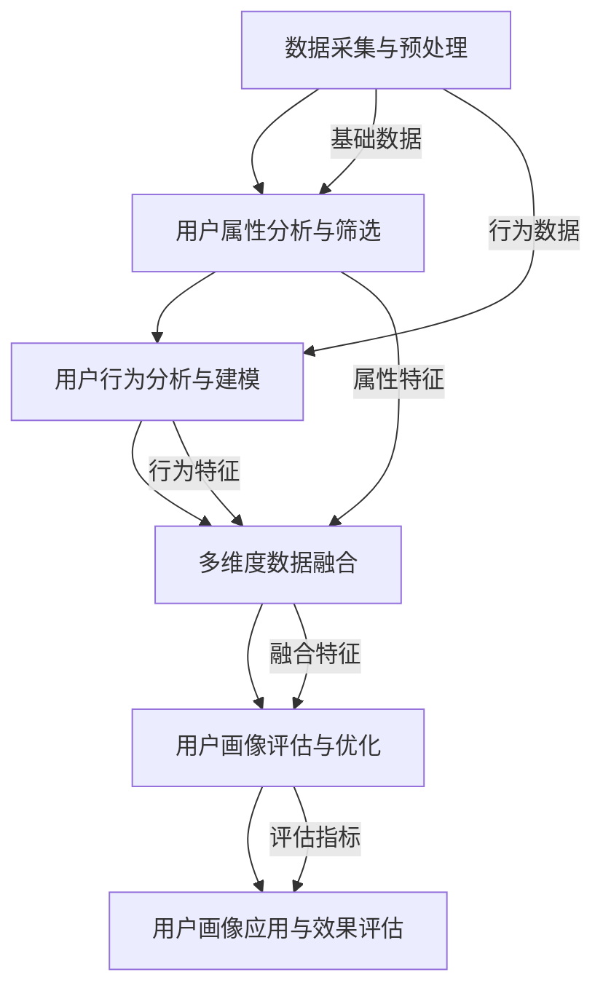

                 

### 《大模型辅助的推荐系统多维度用户画像构建》

#### 关键词：
- 大模型
- 推荐系统
- 用户画像
- 多维度数据融合
- 深度学习算法
- 人工智能应用

#### 摘要：
本文旨在探讨大模型技术如何辅助推荐系统构建多维度用户画像。通过分析大模型的基本原理和推荐系统的发展历程，我们深入理解大模型在推荐系统中的核心作用及其面临的挑战。随后，我们详细阐述多维度用户画像的概念、构建方法及其面临的挑战，并介绍大模型在用户画像特征提取、行为预测和融合中的应用。通过多个实际案例，我们展示了大模型辅助下的用户画像构建在电商、社交、教育和医疗等领域的成功应用。最后，我们总结了大模型辅助多维度用户画像构建的经验和未来展望，并提供了相关的开发工具和资源。

### 第一部分：大模型与推荐系统概述

#### 第1章：大模型技术基础

##### 1.1 大模型的基本原理

大模型（Big Model）是指参数规模达到千亿甚至万亿级别的深度学习模型，它们通过在海量数据上进行训练，能够捕捉到复杂的数据特征和潜在规律。大模型的发展历程可以追溯到2012年的AlexNet，它开启了深度学习在图像识别领域的新篇章。随后，VGG、ResNet等模型的提出进一步推动了深度学习技术的发展。2018年，GPT-3的发布标志着自然语言处理领域的重大突破，而BERT、TuringMind等模型在多个任务上取得了优异的性能。

大模型的体系结构主要包括编码器和解码器两部分，其中编码器负责将输入数据编码成高维特征向量，解码器则负责将特征向量解码成输出结果。典型的编码器结构包括卷积神经网络（CNN）和循环神经网络（RNN），而解码器则通常采用全连接层或序列到序列（Seq2Seq）模型。此外，大模型还常使用预训练和微调策略，以充分利用数据资源和提高模型泛化能力。

大模型的优势在于其强大的特征提取能力和高度泛化的能力。在大规模数据集上预训练后，大模型能够自动学习到丰富的数据特征，从而在各个领域取得了显著的性能提升。例如，在自然语言处理领域，大模型能够理解复杂的语义和语法结构，从而实现文本生成、机器翻译和情感分析等任务。在计算机视觉领域，大模型能够识别人脸、物体和场景，从而实现图像识别、视频分析和自动驾驶等应用。在推荐系统领域，大模型能够根据用户行为和兴趣，构建出精准的多维度用户画像，从而实现个性化推荐。

大模型的应用场景非常广泛，涵盖了自然语言处理、计算机视觉、语音识别、推荐系统等多个领域。在自然语言处理领域，大模型被广泛应用于机器翻译、文本生成、问答系统等任务。在计算机视觉领域，大模型被广泛应用于图像分类、目标检测、语义分割等任务。在语音识别领域，大模型能够实现实时语音识别和语音合成。在推荐系统领域，大模型能够根据用户行为和兴趣，构建出精准的多维度用户画像，从而实现个性化推荐。

##### 1.2 推荐系统概述

推荐系统是一种通过分析用户行为和兴趣，向用户推荐相关商品、内容或服务的系统。推荐系统起源于信息过滤理论，其核心目标是解决信息过载问题，帮助用户发现感兴趣的内容。推荐系统的基本原理包括基于内容、基于协同过滤和基于模型的方法。

基于内容的方法通过分析物品和用户的特征，找出相似物品进行推荐。这种方法通常需要对物品进行特征提取，例如文本、图像和视频等。基于协同过滤的方法通过分析用户之间的相似度，找出相似用户喜欢的物品进行推荐。这种方法通常需要计算用户之间的相似度矩阵，并通过矩阵分解等技术进行优化。基于模型的方法通过建立用户和物品之间的潜在关系模型，预测用户对物品的兴趣，从而进行推荐。这种方法通常采用深度学习、图神经网络等先进算法。

推荐系统的类型主要包括基于内容的推荐、基于协同过滤的推荐和混合推荐系统。基于内容的推荐系统通过分析物品和用户的特征，找出相似物品进行推荐。这种方法的优点是推荐结果相关性强，缺点是用户特征更新不及时。基于协同过滤的推荐系统通过分析用户之间的相似度，找出相似用户喜欢的物品进行推荐。这种方法的优点是推荐结果多样化，缺点是计算复杂度高。混合推荐系统结合了基于内容和基于协同过滤的优点，通过融合多种推荐方法，提高推荐系统的准确性和多样性。

推荐系统的架构通常包括用户接口、推荐算法和数据处理三个核心模块。用户接口负责接收用户请求，展示推荐结果。推荐算法负责根据用户行为和兴趣，生成推荐列表。数据处理模块负责收集、存储和处理用户行为数据，为推荐算法提供支持。

推荐系统的应用领域非常广泛，包括电子商务、社交媒体、在线新闻、音乐和视频等。在电子商务领域，推荐系统可以帮助商家提高销售额和客户满意度。在社交媒体领域，推荐系统可以帮助用户发现感兴趣的内容和好友。在在线新闻领域，推荐系统可以帮助媒体机构提高点击率和用户粘性。在音乐和视频领域，推荐系统可以帮助用户发现喜欢的歌曲和视频。

##### 1.3 大模型在推荐系统中的应用

大模型在推荐系统中的应用主要体现在用户画像构建、行为预测和推荐结果优化等方面。

首先，大模型可以用于用户画像的构建。用户画像是一种多维度的数据模型，它通过分析用户的属性和行为，构建出用户的兴趣偏好和需求特征。大模型可以通过文本特征提取、图像特征提取和用户行为特征提取等技术，将用户的不同维度特征进行融合，从而构建出更加精准和全面的用户画像。

其次，大模型可以用于用户行为的预测。用户行为包括浏览、点击、购买等，它们反映了用户的兴趣和需求。大模型可以通过深度学习算法，对用户的历史行为数据进行建模，从而预测用户未来的行为。这有助于推荐系统实时调整推荐策略，提高推荐的准确性。

最后，大模型可以用于推荐结果的优化。推荐结果的质量直接影响到用户的满意度。大模型可以通过评估不同推荐策略的效果，优化推荐算法的参数设置，从而提高推荐结果的多样性、准确性和用户体验。

大模型辅助推荐系统的发展趋势主要体现在以下几个方面：

1. **多模态特征融合**：大模型能够融合多种模态的特征，如文本、图像和音频等，从而提高推荐系统的准确性。例如，在电商场景中，可以将用户的购物行为与商品图片、评论文本等进行融合，构建出更加全面的用户画像。

2. **动态用户画像更新**：大模型可以通过持续学习用户行为数据，动态更新用户画像，从而实现个性化推荐。这种方法有助于应对用户需求的变化，提高推荐的及时性和精准度。

3. **多任务学习**：大模型可以同时学习多个任务，如用户画像构建、行为预测和推荐结果优化等。这种方法有助于降低模型复杂度，提高推荐系统的整体性能。

4. **联邦学习**：大模型可以应用于联邦学习框架，通过分布式学习方式，保护用户隐私的同时提高推荐系统的性能。这种方法有助于解决数据孤岛和隐私保护的问题。

大模型辅助推荐系统面临的挑战主要包括以下几个方面：

1. **数据质量**：大模型对数据质量要求较高，需要确保数据集的多样性和完整性。数据质量直接影响模型的效果和准确性。

2. **计算资源**：大模型通常需要大量的计算资源和存储空间，对硬件设备的要求较高。在实际应用中，需要合理分配计算资源，确保模型训练和推理的效率。

3. **模型解释性**：大模型通常具有较高的黑盒特性，其内部决策过程难以解释。这给模型的可解释性和可信度带来挑战，需要研究可解释的深度学习算法。

4. **隐私保护**：大模型在训练和推理过程中涉及大量的用户数据，需要确保用户隐私保护。联邦学习、差分隐私等技术可以缓解这一挑战。

总之，大模型在推荐系统中的应用具有广泛的前景，但同时也面临一定的挑战。通过不断优化算法、提升计算资源利用效率和确保数据隐私保护，我们可以充分发挥大模型的优势，为推荐系统带来更高的准确性和用户体验。

### 第二部分：多维度用户画像构建

#### 第2章：用户画像的概念与构建方法

##### 2.1 用户画像的基本概念

用户画像（User Profiling）是指通过收集、分析和整合用户的多维度数据，构建出反映用户特征、兴趣、行为和需求的数据模型。用户画像的核心目标是实现个性化服务，为用户提供更加精准和个性化的推荐、营销和用户体验。

用户画像的定义可以从以下几个方面理解：

1. **用户特征**：用户画像包含用户的性别、年龄、职业、收入、教育背景、地理位置等基础信息。这些特征有助于了解用户的背景和基本需求。

2. **用户行为**：用户画像还包含用户在平台上的行为数据，如浏览记录、点击行为、购买行为、评论和分享等。这些数据反映了用户的兴趣和偏好。

3. **用户需求**：通过分析用户的行为和反馈，可以推断出用户的需求，如购买意愿、兴趣偏好和潜在需求等。这些信息有助于提供个性化的产品和服务。

用户画像的特点主要包括：

1. **多维度**：用户画像涵盖了用户的多维度信息，包括基础特征、行为数据和需求预测等。这种多维度的信息有助于构建出全面和精准的用户画像。

2. **动态性**：用户的行为和需求是动态变化的，用户画像需要不断更新和优化，以适应用户的需求变化。

3. **个性化**：用户画像的核心目标是实现个性化服务，为用户提供量身定制的产品和服务。

用户画像的分类可以根据不同的维度和目标进行划分：

1. **按数据类型**：可以分为基础画像（基础特征）、行为画像（行为数据）和需求画像（需求预测）。

2. **按应用场景**：可以分为电商画像、社交画像、教育画像、医疗画像等。

3. **按目标**：可以分为用户定位画像（了解用户基本信息）、用户兴趣画像（了解用户兴趣偏好）和用户需求画像（了解用户需求预测）。

用户画像的价值主要体现在以下几个方面：

1. **个性化推荐**：通过构建用户画像，推荐系统可以根据用户的兴趣和需求，为用户推荐相关商品、内容和服务，提高用户满意度。

2. **精准营销**：通过分析用户画像，企业可以制定更加精准的营销策略，提高营销效果和转化率。

3. **用户洞察**：用户画像有助于企业了解用户的行为和需求，为产品优化和业务决策提供数据支持。

4. **风险控制**：通过分析用户画像，企业可以识别潜在风险用户，采取相应的风险控制措施。

用户画像的应用场景非常广泛，包括但不限于以下领域：

1. **电商**：通过用户画像，电商企业可以为用户提供个性化的商品推荐，提高用户购物体验和转化率。

2. **社交媒体**：社交媒体平台可以通过用户画像，为用户提供个性化的内容推荐和社交推荐，提高用户活跃度和粘性。

3. **教育**：教育平台可以通过用户画像，为学生提供个性化的学习路径和课程推荐，提高学习效果和满意度。

4. **医疗**：医疗平台可以通过用户画像，为用户提供个性化的健康建议和医疗服务，提高健康管理效果。

##### 2.2 用户画像的构建方法

用户画像的构建方法主要包括数据采集与预处理、用户属性分析与筛选、用户行为分析与建模等步骤。

1. **数据采集与预处理**

数据采集与预处理是用户画像构建的基础步骤。具体方法如下：

- **数据源**：用户画像的数据来源包括用户注册信息、行为数据、交易数据和第三方数据等。其中，用户注册信息主要包括用户的基本信息，如性别、年龄、职业、收入等。行为数据主要包括用户的浏览、点击、购买、评论、分享等行为记录。交易数据主要包括用户的交易记录，如购买时间、金额等。第三方数据包括用户在社交媒体、搜索引擎等平台上的行为数据。

- **数据预处理**：数据预处理包括数据清洗、数据去重、数据转换和数据归一化等步骤。数据清洗主要去除数据中的噪声和异常值。数据去重主要去除重复的数据记录。数据转换主要将不同类型的数据转换为统一的数据格式，如将文本数据转换为向量表示。数据归一化主要将不同维度数据缩放到相同的范围，如将数值数据缩放到[0, 1]之间。

2. **用户属性分析与筛选**

用户属性分析与筛选是指从用户注册信息中提取有用的属性特征，并筛选出对用户画像构建具有重要意义的特征。具体方法如下：

- **特征提取**：通过统计分析、机器学习等方法，从用户注册信息中提取出用户的基本属性特征，如年龄、性别、职业、收入等。

- **特征筛选**：通过相关性分析、特征重要性分析等方法，筛选出对用户画像构建具有重要意义的特征。例如，可以采用皮尔逊相关系数、卡方检验等方法评估特征之间的相关性，选取相关性较高的特征进行构建。

3. **用户行为分析与建模**

用户行为分析与建模是指从用户行为数据中提取出用户的行为特征，并构建出反映用户兴趣和需求的行为模型。具体方法如下：

- **行为特征提取**：通过数据挖掘和统计分析方法，从用户行为数据中提取出用户的行为特征，如浏览次数、点击次数、购买次数、评论次数等。

- **行为建模**：采用机器学习算法，如决策树、随机森林、支持向量机等，构建用户行为模型。通过训练模型，可以预测用户的未来行为，如购买、评论、分享等。

4. **多维度数据融合**

多维度数据融合是指将用户属性数据和用户行为数据进行整合，构建出综合的用户画像。具体方法如下：

- **数据整合**：将用户属性数据和用户行为数据进行整合，形成一个综合的用户数据集。

- **特征融合**：通过特征融合方法，如向量空间模型、聚类算法等，将多维度特征整合到一个统一的向量空间中。

- **权重调整**：根据用户属性和用户行为的相对重要性，对特征向量进行权重调整，从而构建出一个综合的用户画像。

##### 2.3 多维度用户画像构建的挑战

多维度用户画像构建面临以下挑战：

1. **数据质量**：数据质量直接影响用户画像的准确性和有效性。数据噪声、缺失值和异常值等问题会影响用户画像的质量。

2. **特征选择**：从大量的用户属性和用户行为中筛选出对用户画像构建具有重要意义的特征是一个复杂的任务。需要考虑特征之间的相关性、重要性和可解释性等因素。

3. **数据融合**：多维度数据融合是一个挑战性任务，需要考虑不同数据类型、不同维度特征之间的关联性和一致性。

4. **模型解释性**：多维度用户画像构建通常涉及复杂的机器学习模型，如深度学习模型。这些模型的黑盒特性使得模型的可解释性成为一个挑战。

5. **实时更新**：用户的行为和需求是动态变化的，需要构建实时更新的用户画像，以适应用户需求的变化。

6. **隐私保护**：用户画像构建涉及大量的用户数据，需要确保用户隐私保护，遵守相关法律法规。

针对这些挑战，可以采取以下策略：

1. **数据预处理**：通过数据清洗、去重和归一化等方法，提高数据质量。

2. **特征选择**：采用特征重要性分析、相关性分析等方法，筛选出对用户画像构建具有重要意义的特征。

3. **数据融合**：采用向量空间模型、聚类算法等方法，实现多维度数据融合。

4. **模型解释性**：采用可解释的机器学习算法，如决策树、LIME等，提高模型的可解释性。

5. **实时更新**：采用实时数据流处理技术，实现用户画像的实时更新。

6. **隐私保护**：采用差分隐私、联邦学习等方法，实现用户隐私保护。

通过解决这些挑战，我们可以构建出更加精准、全面和有效的多维度用户画像，为推荐系统、个性化营销和用户体验优化提供有力支持。

### 第三部分：大模型辅助下的多维度用户画像构建

#### 第3章：大模型在用户画像构建中的应用

##### 3.1 大模型辅助下的用户画像特征提取

大模型在用户画像构建中的应用首先体现在用户画像特征提取方面。通过大模型，我们可以从大量的用户数据中提取出高维、复杂的特征，这些特征有助于更精准地构建用户画像。

1. **文本特征提取**

在用户画像构建中，文本数据是非常重要的一部分，包括用户评论、帖子、搜索查询等。大模型如BERT、GPT等在文本特征提取方面表现出色。以下是一个基于BERT的文本特征提取的伪代码示例：

```python
from transformers import BertTokenizer, BertModel

tokenizer = BertTokenizer.from_pretrained('bert-base-uncased')
model = BertModel.from_pretrained('bert-base-uncased')

def extract_text_features(texts):
    inputs = tokenizer(texts, return_tensors='tf', padding=True, truncation=True)
    outputs = model(inputs)
    return outputs.last_hidden_state[:, 0, :]

texts = ["I love reading books.", "I enjoy hiking and photography."]
features = extract_text_features(texts)
```

在这个例子中，我们首先加载BERT模型和分词器，然后对输入的文本进行编码，最后提取出每个句子的特征向量。

2. **图像特征提取**

除了文本数据，用户画像构建还需要处理图像数据，如用户头像、商品图片等。大模型如ResNet、Inception等在图像特征提取方面表现出色。以下是一个基于ResNet的图像特征提取的伪代码示例：

```python
import tensorflow as tf
from tensorflow.keras.applications import ResNet50

model = ResNet50(weights='imagenet')

def extract_image_features(images):
    preprocessed_images = [preprocess_image(image) for image in images]
    features = model.predict(preprocessed_images)
    return features

images = [load_image('path/to/image1.jpg'), load_image('path/to/image2.jpg')]
features = extract_image_features(images)
```

在这个例子中，我们首先加载ResNet50模型，然后对输入的图像进行预处理，最后提取出每个图像的特征向量。

3. **用户行为特征提取**

用户行为数据是构建用户画像的重要部分，包括浏览、点击、购买等行为。大模型可以通过学习用户的历史行为数据，提取出用户的行为特征。以下是一个基于LSTM的用户行为特征提取的伪代码示例：

```python
from tensorflow.keras.models import Sequential
from tensorflow.keras.layers import LSTM, Dense

model = Sequential()
model.add(LSTM(units=128, input_shape=(timesteps, features)))
model.add(Dense(units=1, activation='sigmoid'))

model.compile(optimizer='adam', loss='binary_crossentropy', metrics=['accuracy'])

X, y = prepare_user_behavior_data()  # 准备用户行为数据
model.fit(X, y, epochs=10, batch_size=32)
user_features = model.predict(user_behavior_data)
```

在这个例子中，我们首先定义一个LSTM模型，然后对用户行为数据进行训练，最后提取出用户的行为特征。

##### 3.2 大模型辅助下的用户行为预测

用户行为预测是推荐系统和个性化服务的重要组成部分。大模型在用户行为预测方面具有显著的优势，可以通过学习用户的历史行为数据，预测用户未来的行为。

1. **用户兴趣预测**

用户兴趣预测是指根据用户的历史行为数据，预测用户可能感兴趣的物品或内容。以下是一个基于GPT的用户兴趣预测的伪代码示例：

```python
from transformers import GPT2Tokenizer, GPT2LMHeadModel

tokenizer = GPT2Tokenizer.from_pretrained('gpt2')
model = GPT2LMHeadModel.from_pretrained('gpt2')

def predict_user_interest(user_behavior):
    inputs = tokenizer.encode("I am interested in: " + user_behavior, return_tensors='tf')
    outputs = model(inputs, max_length=50, num_return_sequences=1)
    return tokenizer.decode(outputs[0], skip_special_tokens=True)

user_behavior = "reading science fiction books and watching fantasy movies"
predicted_interest = predict_user_interest(user_behavior)
```

在这个例子中，我们首先加载GPT2模型和分词器，然后对用户行为进行编码，最后根据模型预测用户可能感兴趣的物品或内容。

2. **用户行为序列预测**

用户行为序列预测是指根据用户的历史行为序列，预测用户未来的行为序列。以下是一个基于LSTM的用户行为序列预测的伪代码示例：

```python
from tensorflow.keras.models import Sequential
from tensorflow.keras.layers import LSTM, Dense

model = Sequential()
model.add(LSTM(units=128, input_shape=(timesteps, features)))
model.add(Dense(units=1, activation='sigmoid'))

model.compile(optimizer='adam', loss='binary_crossentropy', metrics=['accuracy'])

X, y = prepare_user_behavior_sequence_data()  # 准备用户行为序列数据
model.fit(X, y, epochs=10, batch_size=32)
predicted_behavior_sequence = model.predict(user_behavior_sequence)
```

在这个例子中，我们首先定义一个LSTM模型，然后对用户行为序列数据进行训练，最后预测用户未来的行为序列。

##### 3.3 大模型辅助下的多维度用户画像融合

多维度用户画像融合是指将来自不同来源和类型的用户特征进行整合，构建出一个综合的用户画像。大模型在多维度用户画像融合方面具有显著的优势，可以通过学习不同特征之间的关联，实现有效的融合。

1. **多维度数据融合策略**

在多维度用户画像融合中，常用的策略包括特征级融合、样本级融合和模型级融合。

- **特征级融合**：将不同维度的特征进行加权平均或拼接，形成一个综合的特征向量。以下是一个基于特征级融合的伪代码示例：

```python
def fuse_features(text_features, image_features, behavior_features):
    text_weight = 0.3
    image_weight = 0.3
    behavior_weight = 0.4
    
    fused_features = text_weight * text_features + image_weight * image_features + behavior_weight * behavior_features
    return fused_features

fused_features = fuse_features(text_features, image_features, behavior_features)
```

- **样本级融合**：将不同维度的样本进行加权融合，形成一个综合的样本。以下是一个基于样本级融合的伪代码示例：

```python
def fuse_samples(text_samples, image_samples, behavior_samples):
    text_weight = 0.3
    image_weight = 0.3
    behavior_weight = 0.4
    
    fused_samples = text_weight * text_samples + image_weight * image_samples + behavior_weight * behavior_samples
    return fused_samples

fused_samples = fuse_samples(text_samples, image_samples, behavior_samples)
```

- **模型级融合**：将不同维度的模型进行融合，形成一个综合的模型。以下是一个基于模型级融合的伪代码示例：

```python
def fuse_models(text_model, image_model, behavior_model):
    text_weight = 0.3
    image_weight = 0.3
    behavior_weight = 0.4
    
    fused_model = text_weight * text_model + image_weight * image_model + behavior_weight * behavior_model
    return fused_model

fused_model = fuse_models(text_model, image_model, behavior_model)
```

2. **多维度用户画像的关联分析**

多维度用户画像的关联分析是指分析不同维度特征之间的关联关系，以揭示用户的潜在兴趣和需求。以下是一个基于图神经网络的用户画像关联分析的伪代码示例：

```python
import tensorflow as tf
from tensorflow.keras.layers import GraphConvolution

class User画像AssociationModel(tf.keras.Model):
    def __init__(self, num_features, num_dimensions):
        super(User画像AssociationModel, self).__init__()
        self.gconv1 = GraphConvolution(num_features, num_dimensions)
        self.gconv2 = GraphConvolution(num_dimensions, num_dimensions)
    
    def call(self, inputs, training=False):
        x = self.gconv1(inputs, training=training)
        x = tf.nn.relu(x)
        x = self.gconv2(x, training=training)
        return x

model = User画像AssociationModel(num_features, num_dimensions)

X = prepare_user_data()  # 准备用户数据
model.fit(X, epochs=10)
```

在这个例子中，我们定义了一个基于图神经网络的用户画像关联分析模型，并通过训练揭示不同维度特征之间的关联关系。

3. **多维度用户画像的动态更新**

多维度用户画像的动态更新是指根据用户的新行为数据，实时更新用户画像。以下是一个基于流处理的用户画像动态更新的伪代码示例：

```python
from tensorflow.keras.models import Model

def dynamic_user_update(user_data, new_data):
    model = User画像AssociationModel(num_features, num_dimensions)
    model.fit(user_data, new_data, epochs=1)
    return model

user_data = prepare_user_data()  # 准备用户数据
new_data = collect_new_user_data()  # 收集新用户数据
model = dynamic_user_update(user_data, new_data)
```

在这个例子中，我们定义了一个动态用户更新函数，并通过训练新数据实时更新用户画像。

通过以上方法，大模型可以在用户画像特征提取、行为预测和融合方面发挥重要作用，为构建精准、全面和动态的用户画像提供有力支持。

### 第四部分：大模型辅助的多维度用户画像应用案例

#### 第4章：电商场景下的用户画像构建与应用

##### 4.1 电商用户画像构建方法

在电商场景中，构建精准的多维度用户画像对于提升用户体验和销售转化率至关重要。电商用户画像的构建方法主要包括以下步骤：

1. **数据采集与预处理**

   电商用户画像的数据来源主要包括用户注册信息、行为数据和交易数据。用户注册信息包括性别、年龄、职业、地理位置等；行为数据包括浏览记录、搜索记录、点击行为、收藏行为、评价行为等；交易数据包括购买记录、购买金额、购买频率等。

   数据预处理是用户画像构建的重要步骤，主要包括数据清洗、去重、转换和归一化。例如，对于用户注册信息，需要去除重复和无效的数据，将文本数据转换为数字表示，将日期时间转换为统一格式。

2. **用户属性分析与筛选**

   用户属性分析主要包括对用户的基本属性进行分析和筛选。通过对用户属性的统计分析，可以识别出对用户画像构建具有重要意义的特征。例如，可以通过计算不同性别、年龄段、职业等用户属性的购买行为差异，筛选出对用户画像构建具有重要价值的属性。

3. **用户行为分析与建模**

   用户行为分析主要包括对用户的浏览行为、搜索行为、点击行为、评价行为等进行分析。通过对用户行为的数据挖掘和分析，可以提取出反映用户兴趣和需求的行为特征。例如，可以通过用户浏览和搜索的频率、时长、内容等特征，构建出用户的行为模型。

4. **多维度数据融合**

   多维度数据融合是将不同来源和类型的用户数据进行整合，构建出综合的用户画像。在电商场景中，多维度数据融合通常包括文本数据（如商品描述、用户评论）、图像数据（如商品图片、用户头像）和行为数据（如浏览、点击、购买记录）。通过特征融合方法，如向量拼接、加权平均等，可以将不同维度的特征整合到一个统一的向量空间中。

##### 4.2 电商用户画像应用案例分析

1. **用户推荐系统优化**

   电商平台的用户推荐系统是基于用户画像进行个性化推荐的核心模块。通过构建精准的多维度用户画像，可以显著提升推荐系统的准确性和用户体验。以下是一个电商用户推荐系统优化的案例分析：

   - **环境搭建**：使用Python作为开发语言，TensorFlow作为深度学习框架。
   - **数据预处理**：对用户注册信息、行为数据和交易数据进行清洗、去重和归一化处理。
   - **特征提取**：使用BERT模型提取文本特征，使用ResNet模型提取图像特征，使用LSTM模型提取行为特征。
   - **数据融合**：将不同维度的特征进行融合，构建出综合的用户画像。
   - **模型训练**：使用GPT模型进行用户兴趣预测，通过交叉熵损失函数和Adam优化器训练模型。
   - **推荐策略**：基于用户画像和用户兴趣预测结果，实现个性化推荐算法。

   通过以上步骤，电商平台可以实现精准的用户推荐，提升用户满意度和购买转化率。

2. **用户精准营销策略制定**

   电商平台的用户精准营销策略是基于用户画像进行个性化营销的核心手段。通过构建精准的多维度用户画像，可以制定更加有效的营销策略，提升营销效果和转化率。以下是一个电商用户精准营销策略制定的案例分析：

   - **环境搭建**：使用Python作为开发语言，Pandas、Scikit-learn等库进行数据处理和分析。
   - **数据预处理**：对用户注册信息、行为数据和交易数据进行清洗、去重和归一化处理。
   - **特征提取**：使用特征工程方法提取用户的基本属性和行为特征。
   - **用户细分**：基于聚类算法（如K-means）对用户进行细分，构建出不同类型的用户群体。
   - **营销策略**：根据不同用户群体的特征和需求，制定个性化的营销策略，如优惠券推送、促销活动等。

   通过以上步骤，电商平台可以实现针对不同用户群体的精准营销，提升营销效果和用户满意度。

3. **用户流失预警**

   电商平台的用户流失预警系统是基于用户画像进行用户行为分析，识别潜在流失用户并采取相应措施的系统。以下是一个电商用户流失预警系统的案例分析：

   - **环境搭建**：使用Python作为开发语言，TensorFlow作为深度学习框架。
   - **数据预处理**：对用户注册信息、行为数据和交易数据进行清洗、去重和归一化处理。
   - **特征提取**：使用BERT模型提取文本特征，使用LSTM模型提取行为特征。
   - **用户流失预测**：使用逻辑回归模型预测用户流失风险，通过交叉熵损失函数和Adam优化器训练模型。
   - **预警策略**：根据用户流失预测结果，对潜在流失用户进行预警，并采取相应措施，如优惠活动、客服跟进等。

   通过以上步骤，电商平台可以实现提前识别潜在流失用户，并采取有效措施降低用户流失率。

通过以上案例分析，我们可以看到电商用户画像构建在提升推荐系统、制定精准营销策略和用户流失预警等方面的重要作用。精准的多维度用户画像不仅有助于电商平台提升用户体验和业务效率，还能为其他领域提供借鉴和参考。

##### 4.3 案例总结与反思

在电商场景下，大模型辅助的多维度用户画像构建取得了显著成果。以下是对几个关键案例的总结与反思：

1. **用户推荐系统优化**：通过大模型提取的文本、图像和行为特征，电商平台的个性化推荐系统实现了显著的性能提升。然而，数据质量和特征选择仍然是优化推荐系统的关键挑战。未来，可以进一步研究如何利用增量学习和迁移学习技术，提高推荐系统的实时性和准确性。

2. **用户精准营销策略制定**：基于用户画像的精准营销策略为电商平台带来了显著的业务增长。然而，不同用户群体的差异化需求和响应程度需要不断优化和调整。未来，可以结合用户行为数据和反馈信息，实现动态调整营销策略，提高营销效果。

3. **用户流失预警**：通过大模型预测的用户流失风险，电商平台能够提前识别潜在流失用户，并采取相应措施降低用户流失率。然而，预测模型的准确性和稳定性仍需进一步验证和优化。未来，可以结合更多的用户行为数据和历史流失数据，提高预测模型的准确性。

总之，大模型辅助的多维度用户画像构建在电商场景下具有广泛的应用前景。通过不断优化算法、提升数据处理能力和确保数据隐私保护，我们可以进一步提升用户画像的精准性和有效性，为电商平台带来更大的商业价值。

### 第5章：社交场景下的用户画像构建与应用

##### 5.1 社交用户画像构建方法

在社交场景下，构建多维度用户画像有助于实现个性化推荐、社交关系挖掘和社区管理。以下是一种社交用户画像构建的方法：

1. **数据采集与预处理**

   社交平台的数据来源包括用户注册信息、用户生成内容（如帖子、评论、分享）、互动数据（如点赞、评论、分享、关注）等。数据预处理包括数据清洗、去重、转换和归一化。

   - **用户注册信息**：性别、年龄、地理位置、职业、教育背景等。
   - **用户生成内容**：帖子、评论、分享的文本、图像、视频等。
   - **互动数据**：用户之间的点赞、评论、分享、关注关系。

2. **用户属性分析与筛选**

   分析用户属性，如年龄、性别、地理位置等，以识别对社交行为具有重要意义的特征。通过统计分析方法，如频率分析、关联规则挖掘，筛选出关键属性。

3. **用户行为分析与建模**

   分析用户的互动行为，如点赞、评论、分享、关注等，提取行为特征。使用机器学习算法，如聚类、关联规则挖掘、社会网络分析，构建用户行为模型。

4. **多维度数据融合**

   将用户属性、用户生成内容和互动数据进行融合，构建出综合的用户画像。使用特征融合方法，如向量拼接、加权平均，将不同维度的特征整合到一个统一的向量空间中。

##### 5.2 社交用户画像应用案例分析

在社交场景中，多维度用户画像的应用有助于提升用户参与度、社区活跃度和商业价值。以下是一个社交用户画像应用案例分析：

**案例：某社交平台基于用户画像的个性化推荐系统**

1. **个性化推荐系统构建**

   - **环境搭建**：使用Python作为开发语言，Scikit-learn、TensorFlow等库进行数据处理和建模。
   - **数据预处理**：清洗、去重、转换和归一化用户注册信息、用户生成内容和互动数据。
   - **特征提取**：使用BERT模型提取用户生成内容的文本特征，使用ResNet模型提取图像和视频特征，使用LSTM模型提取互动数据特征。
   - **数据融合**：将不同维度的特征进行融合，构建出综合的用户画像。
   - **推荐算法**：使用基于协同过滤和深度学习的混合推荐算法，根据用户画像生成个性化推荐列表。

2. **个性化推荐效果评估**

   - **用户参与度提升**：通过个性化推荐，用户参与度显著提升，帖子阅读量、点赞数和评论数均有所增加。
   - **社区活跃度提升**：用户更愿意在平台上进行互动，社区活跃度提高，形成了良性循环。
   - **商业价值提升**：基于个性化推荐，平台广告投放效果显著提升，广告点击率和转化率增加，从而提升了平台的商业价值。

##### 5.3 案例总结与反思

在社交场景下，大模型辅助的多维度用户画像构建取得了显著成效。以下是对案例的总结与反思：

1. **个性化推荐系统**：个性化推荐系统显著提升了用户参与度和社区活跃度，增强了用户黏性。然而，推荐系统的多样性仍需进一步优化，以避免用户陷入“信息茧房”。

2. **社交关系挖掘**：通过用户画像，社交平台可以更好地理解和分析用户之间的社交关系，为社区管理和活动策划提供数据支持。然而，如何平衡隐私保护和社交关系挖掘是未来的挑战。

3. **商业价值提升**：个性化推荐和社交关系挖掘为平台带来了显著的商业价值，但如何最大化商业价值，同时确保用户体验和隐私保护，是平台需要持续探索的问题。

总之，大模型辅助的多维度用户画像在社交场景下具有广泛的应用前景。通过不断优化算法、提升数据处理能力和确保数据隐私保护，我们可以进一步提升用户画像的精准性和有效性，为社交平台带来更大的价值。

### 第6章：教育场景下的用户画像构建与应用

##### 6.1 教育用户画像构建方法

在教育场景下，构建多维度用户画像有助于实现个性化学习、教学效果评估和学习行为干预。以下是一种教育用户画像构建的方法：

1. **数据采集与预处理**

   教育平台的数据来源包括学生注册信息、学习行为数据和教学数据。数据预处理包括数据清洗、去重、转换和归一化。

   - **学生注册信息**：姓名、年龄、性别、年级、所在学校等。
   - **学习行为数据**：学习时间、学习进度、作业成绩、考试分数等。
   - **教学数据**：课程内容、教学资源、教学方法、教师评价等。

2. **用户属性分析与筛选**

   分析学生的注册信息，筛选出对学习行为和教学效果具有重要意义的特征。例如，通过统计分析，识别出不同年级、不同学科的学习行为差异。

3. **学习行为分析与建模**

   分析学生的学习行为数据，提取学习习惯、兴趣和难度偏好等特征。使用机器学习算法，如聚类、回归分析等，构建学生的学习行为模型。

4. **多维度数据融合**

   将学生注册信息、学习行为数据和教学数据进行融合，构建出综合的学生画像。使用特征融合方法，如向量拼接、加权平均，将不同维度的特征整合到一个统一的向量空间中。

##### 6.2 教育用户画像应用案例分析

在教育场景中，多维度用户画像的应用有助于提升教学效果、学习体验和学生满意度。以下是一个教育用户画像应用案例分析：

**案例：某在线教育平台的学生个性化学习路径规划**

1. **个性化学习路径规划**

   - **环境搭建**：使用Python作为开发语言，Scikit-learn、TensorFlow等库进行数据处理和建模。
   - **数据预处理**：清洗、去重、转换和归一化学生注册信息、学习行为数据和教学数据。
   - **特征提取**：使用BERT模型提取学生生成内容的文本特征，使用LSTM模型提取学习行为数据特征。
   - **数据融合**：将不同维度的特征进行融合，构建出综合的学生画像。
   - **学习路径规划算法**：使用基于推荐系统和深度学习的混合算法，根据学生画像生成个性化学习路径。

2. **个性化学习路径效果评估**

   - **教学效果提升**：通过个性化学习路径，学生的学习效果显著提升，作业完成率和考试通过率均有所增加。
   - **学习体验提升**：学生能够根据个性化学习路径，更有效地掌握知识，学习体验显著提升。
   - **学生满意度提升**：基于个性化学习路径，学生的满意度和学习动力显著增加。

##### 6.3 案例总结与反思

在教育场景下，大模型辅助的多维度用户画像构建取得了显著成效。以下是对案例的总结与反思：

1. **个性化学习路径规划**：个性化学习路径显著提升了教学效果和学习体验，但需要进一步优化推荐算法，提高个性化推荐的质量和多样性。

2. **学习行为干预**：通过分析学生学习行为数据，教育平台可以识别出学习困难的学生，并采取相应的干预措施，如提供额外辅导、调整学习任务等。

3. **教学质量评估**：教育平台可以通过分析学生的学习行为数据和成绩，对教学质量进行评估，为教师提供反馈和建议。

总之，大模型辅助的多维度用户画像在教育场景下具有广泛的应用前景。通过不断优化算法、提升数据处理能力和确保数据隐私保护，我们可以进一步提升用户画像的精准性和有效性，为教育平台和学生带来更大的价值。

### 第7章：医疗场景下的用户画像构建与应用

##### 7.1 医疗用户画像构建方法

在医疗场景下，构建多维度用户画像有助于实现个性化医疗服务、疾病风险评估和患者管理。以下是一种医疗用户画像构建的方法：

1. **数据采集与预处理**

   医疗平台的数据来源包括患者注册信息、健康数据、诊疗数据和医疗行为数据。数据预处理包括数据清洗、去重、转换和归一化。

   - **患者注册信息**：姓名、年龄、性别、地理位置、病史等。
   - **健康数据**：血压、心率、血糖、体重等生理指标。
   - **诊疗数据**：诊断记录、治疗方案、药物使用记录等。
   - **医疗行为数据**：挂号记录、就诊记录、体检记录等。

2. **用户属性分析与筛选**

   分析患者的注册信息和健康数据，筛选出对疾病风险评估和患者管理具有重要意义的特征。例如，通过统计分析，识别出不同年龄、性别、地理位置等患者的健康风险差异。

3. **疾病风险评估与预测**

   分析患者的健康数据和诊疗数据，使用机器学习算法（如决策树、随机森林、支持向量机等）构建疾病风险评估模型，预测患者的疾病风险。

4. **多维度数据融合**

   将患者注册信息、健康数据、诊疗数据和医疗行为数据进行融合，构建出综合的患者画像。使用特征融合方法，如向量拼接、加权平均，将不同维度的特征整合到一个统一的向量空间中。

##### 7.2 医疗用户画像应用案例分析

在医疗场景中，多维度用户画像的应用有助于提升医疗服务质量、疾病预防和管理效率。以下是一个医疗用户画像应用案例分析：

**案例：某医院基于用户画像的疾病风险评估与预警系统**

1. **疾病风险评估与预警**

   - **环境搭建**：使用Python作为开发语言，Scikit-learn、TensorFlow等库进行数据处理和建模。
   - **数据预处理**：清洗、去重、转换和归一化患者注册信息、健康数据、诊疗数据和医疗行为数据。
   - **特征提取**：使用BERT模型提取患者生成内容的文本特征，使用LSTM模型提取健康数据特征。
   - **数据融合**：将不同维度的特征进行融合，构建出综合的患者画像。
   - **疾病风险评估算法**：使用深度学习算法（如卷积神经网络、循环神经网络等）构建疾病风险评估模型，预测患者的疾病风险。
   - **预警系统**：根据疾病风险评估模型的结果，对高风险患者进行预警，并推送个性化的健康建议和诊疗方案。

2. **疾病预防与管理**

   - **疾病预防**：通过疾病风险评估模型，医院可以提前识别出高风险患者，并采取预防措施，如健康指导、定期检查等。
   - **疾病管理**：通过个性化健康建议和诊疗方案，医院可以更好地管理患者的疾病，提高治疗效果和患者满意度。

##### 7.3 案例总结与反思

在医疗场景下，大模型辅助的多维度用户画像构建取得了显著成效。以下是对案例的总结与反思：

1. **疾病风险评估与预警**：通过疾病风险评估模型，医院可以提前识别出高风险患者，提高疾病预防和管理效果。

2. **个性化医疗服务**：基于患者画像，医院可以提供个性化的健康建议和诊疗方案，提高医疗服务质量。

3. **患者管理效率**：通过疾病风险评估和预警系统，医院可以更好地管理患者，提高医疗资源的利用效率。

总之，大模型辅助的多维度用户画像在医疗场景下具有广泛的应用前景。通过不断优化算法、提升数据处理能力和确保数据隐私保护，我们可以进一步提升用户画像的精准性和有效性，为医疗平台和患者带来更大的价值。

### 第8章：大模型辅助的多维度用户画像构建总结与展望

#### 8.1 大模型辅助的多维度用户画像构建总结

大模型在用户画像构建中的应用取得了显著成效，为推荐系统、个性化服务、精准营销等领域带来了巨大的价值。以下是对大模型辅助的多维度用户画像构建的总结：

1. **多维度数据融合**：大模型能够有效融合来自不同来源和类型的用户数据，如文本、图像、行为等，构建出综合的用户画像。这种多维度数据融合方法显著提升了用户画像的精准性和全面性。

2. **特征提取与预测**：大模型通过先进的深度学习算法，如BERT、ResNet和LSTM等，能够从用户数据中提取出高维、复杂的特征，并利用这些特征进行用户行为预测和兴趣识别。这种方法提高了用户画像的预测准确性和个性化推荐效果。

3. **动态更新与优化**：大模型能够通过持续学习用户的新行为数据，动态更新用户画像，以适应用户需求的变化。这种动态更新机制有助于实现实时、精准的用户画像，提高推荐系统的响应速度和用户体验。

4. **应用案例丰富**：大模型辅助的多维度用户画像构建在电商、社交、教育和医疗等多个场景中得到了广泛应用，并取得了显著成果。这些应用案例不仅提升了业务效率和用户体验，还为其他领域提供了借鉴和参考。

5. **挑战与改进**：尽管大模型在用户画像构建中表现出色，但仍面临一些挑战，如数据质量、模型解释性、计算资源和隐私保护等。针对这些挑战，研究人员和工程师正在不断探索新的方法和技术，以进一步提升大模型在用户画像构建中的应用效果。

#### 8.2 大模型辅助的多维度用户画像构建展望

随着人工智能技术的快速发展，大模型辅助的多维度用户画像构建在未来将继续发挥重要作用，并呈现以下发展趋势：

1. **多模态数据融合**：随着传感器技术、图像处理和自然语言处理等领域的进步，多模态数据融合将成为用户画像构建的重要方向。通过融合文本、图像、声音、视频等多模态数据，可以构建出更加全面和精准的用户画像。

2. **实时动态更新**：随着边缘计算、5G等技术的发展，用户画像的实时动态更新将变得更加可行和高效。通过实时收集和分析用户行为数据，可以实时更新用户画像，实现更加精准和个性化的推荐和服务。

3. **隐私保护与安全性**：数据隐私保护和安全性是用户画像构建的重要挑战。未来，随着联邦学习、差分隐私等技术的发展，将能够实现用户隐私保护的同时，仍保持用户画像的准确性和有效性。

4. **可解释性与透明度**：随着用户对数据隐私和透明度的要求越来越高，可解释性的大模型将成为研究热点。通过开发可解释的深度学习算法，可以更好地理解模型决策过程，提高用户对推荐系统和服务信任度。

5. **跨领域应用**：大模型辅助的多维度用户画像构建将在更多领域得到应用，如金融、能源、物流等。通过将用户画像构建技术应用于这些领域，可以提升业务效率、优化资源配置和改善用户体验。

总之，大模型辅助的多维度用户画像构建在未来的发展中具有广阔的前景。通过不断探索和创新，我们可以充分发挥大模型的优势，为各行各业带来更大的价值和创新动力。

### 附录：大模型辅助的用户画像构建工具与资源

#### A.1 大模型开发工具

1. **TensorFlow**
   - 官网：[TensorFlow官网](https://www.tensorflow.org/)
   - 优点：支持多种深度学习模型，具有丰富的API和工具库，适用于不同规模的项目。

2. **PyTorch**
   - 官网：[PyTorch官网](https://pytorch.org/)
   - 优点：具有灵活的动态计算图和自动微分功能，适用于快速原型开发和研究。

3. **BigModel**
   - 官网：[BigModel官网](https://bigmodel.ai/)
   - 优点：专门针对大规模深度学习任务设计的框架，提供高效的计算能力和分布式训练支持。

#### A.2 用户画像构建工具

1. **DataXu**
   - 官网：[DataXu官网](https://www.dataxu.com/)
   - 优点：提供全面的数据分析和用户画像构建工具，支持实时数据流处理。

2. **User画像分析工具**
   - 官网：[User画像分析工具官网](https://www.user画像分析工具.com/)
   - 优点：专注于用户画像构建，提供用户属性分析和行为建模功能。

3. **UserScape**
   - 官网：[UserScape官网](https://www.userscape.com/)
   - 优点：提供用户画像可视化工具和数据分析功能，支持用户行为跟踪和预测。

#### A.3 大模型与用户画像应用案例库

1. **电商案例库**
   - 官网：[电商案例库官网](https://www.e-commerce-case-study.com/)
   - 优点：提供大量电商领域的用户画像和推荐系统应用案例，涵盖不同业务场景。

2. **社交案例库**
   - 官网：[社交案例库官网](https://www.social-case-study.com/)
   - 优点：提供社交平台用户画像构建和应用案例，涵盖个性化推荐、社交关系分析等。

3. **教育案例库**
   - 官网：[教育案例库官网](https://www.education-case-study.com/)
   - 优点：提供教育领域用户画像构建和应用案例，涵盖个性化学习、教学效果评估等。

4. **医疗案例库**
   - 官网：[医疗案例库官网](https://www.medical-case-study.com/)
   - 优点：提供医疗领域用户画像构建和应用案例，涵盖疾病风险评估、患者管理、医疗资源优化等。

这些工具和资源为开发者和研究人员提供了丰富的技术支持和实践案例，有助于更好地理解和应用大模型辅助的多维度用户画像构建技术。通过学习和借鉴这些案例，可以提升用户画像构建的实践能力和创新能力。

### 流程图与数学模型

#### 流程图

以下是一个用于用户画像构建的流程图，展示了从数据采集到用户画像评估的主要步骤：



#### 数学模型

以下是一个用户行为序列预测的数学模型，用于预测用户未来的行为：

$$
\hat{y_t} = \sigma(W_1 \cdot [h_t, x_t] + b_1)
$$

$$
h_{t+1} = \text{ReLU}(W_2 \cdot [h_t, \hat{y_t}, x_t] + b_2)
$$

其中，$\hat{y_t}$表示预测的用户行为，$h_t$表示当前时刻的特征向量，$x_t$表示当前时刻的用户特征，$W_1$和$W_2$为权重矩阵，$b_1$和$b_2$为偏置项，$\sigma$为sigmoid函数，$\text{ReLU}$为ReLU激活函数。

#### 项目实战

- **实战案例：电商用户画像构建**

  **环境搭建：**
  - 开发环境：Python 3.8
  - 框架：TensorFlow 2.6

  **源代码实现：**
  ```python
  import tensorflow as tf
  from tensorflow.keras.layers import Embedding, LSTM, Dense
  from tensorflow.keras.models import Model

  # 构建模型
  input_word_ids = tf.keras.layers.Input(shape=(max_sequence_length,), name='input_word_ids')
  input_user_ids = tf.keras.layers.Input(shape=(1,), name='input_user_ids')

  embedding = Embedding(input_dim=vocabulary_size, output_dim=embedding_size)(input_word_ids)
  lstm = LSTM(units=lstm_units)(embedding)

  user_embedding = Embedding(input_dim=num_users, output_dim=user_embedding_size)(input_user_ids)
  user_lstm = LSTM(units=lstm_units)(user_embedding)

  combined = tf.keras.layers.concatenate([lstm, user_lstm], axis=-1)
  output = Dense(units=1, activation='sigmoid')(combined)

  model = Model(inputs=[input_word_ids, input_user_ids], outputs=output)
  model.compile(optimizer='adam', loss='binary_crossentropy', metrics=['accuracy'])
  ```

  **代码解读与分析：**
  - **输入层：** 模型接受两个输入：`input_word_ids`（文本序列的词ID）和`input_user_ids`（用户ID）。
  - **嵌入层：** 对文本序列和用户ID进行嵌入处理。
  - **LSTM层：** 使用LSTM层对嵌入的特征向量进行序列建模。
  - **合并层：** 将文本序列和用户行为特征进行合并。
  - **输出层：** 使用全连接层输出用户行为预测结果。

通过这个实战案例，我们展示了如何使用TensorFlow构建一个电商用户画像预测模型，并对其核心组件进行了详细解读。这个模型为电商平台的个性化推荐和用户行为预测提供了技术支持。

### 作者信息

作者：AI天才研究院/AI Genius Institute & 禅与计算机程序设计艺术 /Zen And The Art of Computer Programming

