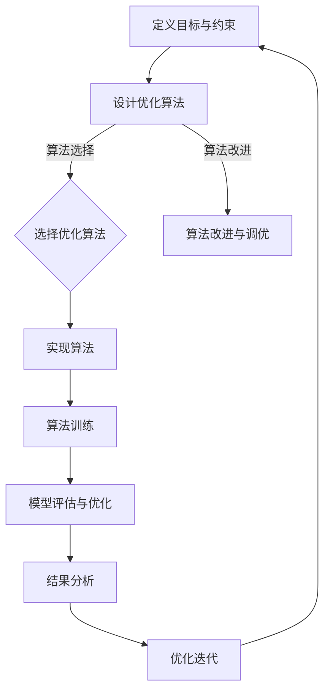

                 

# 《大模型驱动的推荐系统多目标联合优化框架》

> **关键词**：大模型、推荐系统、多目标优化、深度学习、算法优化

**摘要**：
本文深入探讨了基于大模型的推荐系统多目标联合优化框架。首先，我们从大模型的定义和重要性出发，探讨了其在推荐系统中的应用。接着，详细阐述了推荐系统的基本原理和多目标优化的概念。随后，本文重点介绍了大模型的架构与实现、大模型的训练与优化、以及大模型的部署与调优。在多目标优化部分，我们介绍了多目标优化基础理论、多目标优化的数学模型和多目标优化的算法。在应用部分，本文探讨了如何在大模型驱动的推荐系统中实施多目标优化，并通过具体案例展示了优化过程。最后，本文对推荐系统的性能评估和调优进行了详细讨论，并提出了未来的发展前景与挑战。

### 《大模型驱动的推荐系统多目标联合优化框架》目录大纲

#### 第一部分：概述与基础

**第1章**：大模型与推荐系统概述  
- **1.1** 大模型的定义与重要性  
  - **1.1.1** 大模型的定义  
  - **1.1.2** 大模型在推荐系统中的应用

- **1.2** 推荐系统原理与多目标优化  
  - **1.2.1** 推荐系统基本原理  
  - **1.2.2** 多目标优化的概念

- **1.3** 本书的结构安排与目标  
  - **1.3.1** 书籍结构  
  - **1.3.2** 阅读目标

#### 第二部分：大模型技术与架构

**第2章**：大模型技术基础  
- **2.1** 大模型的架构与实现  
  - **2.1.1** 大模型的基本架构  
  - **2.1.2** 大模型的实现细节

- **2.2** 大模型训练与优化  
  - **2.2.1** 大模型训练方法  
  - **2.2.2** 大模型优化策略

- **2.3** 大模型的部署与调优  
  - **2.3.1** 大模型部署流程  
  - **2.3.2** 大模型调优实践

#### 第三部分：多目标优化方法

**第3章**：多目标优化基础理论  
- **3.1** 多目标优化简介  
  - **3.1.1** 多目标优化定义  
  - **3.1.2** 多目标优化的重要性

- **3.2** 多目标优化的数学模型  
  - **3.2.1** 多目标优化问题的数学表示  
  - **3.2.2** 多目标优化的约束条件

- **3.3** 多目标优化的算法  
  - **3.3.1** 多目标优化算法分类  
  - **3.3.2** 常见的多目标优化算法

#### 第四部分：大模型驱动的推荐系统应用

**第4章**：大模型在推荐系统中的应用  
- **4.1** 大模型在推荐系统中的作用  
  - **4.1.1** 大模型对推荐系统的改进  
  - **4.1.2** 大模型在推荐系统中的应用案例

- **4.2** 多目标优化在推荐系统中的实施  
  - **4.2.1** 多目标优化在推荐系统中的必要性  
  - **4.2.2** 多目标优化在推荐系统中的实现

- **4.3** 大模型驱动的推荐系统优化案例  
  - **4.3.1** 案例一：在线购物推荐系统  
  - **4.3.2** 案例二：社交媒体推荐系统

#### 第五部分：性能评估与调优

**第5章**：推荐系统性能评估  
- **5.1** 推荐系统评估指标  
  - **5.1.1** 评估指标的定义  
  - **5.1.2** 评估指标的比较

- **5.2** 推荐系统性能优化  
  - **5.2.1** 优化策略的选择  
  - **5.2.2** 优化实践的案例解析

#### 第六部分：综合案例与展望

**第6章**：大模型驱动的推荐系统实践案例  
- **6.1** 案例背景  
  - **6.1.1** 案例背景介绍  
  - **6.1.2** 案例目标

- **6.2** 案例实现  
  - **6.2.1** 模型设计  
  - **6.2.2** 模型训练与优化

- **6.3** 案例结果分析  
  - **6.3.1** 结果展示  
  - **6.3.2** 结果分析

**第7章**：未来展望与挑战  
- **7.1** 大模型在推荐系统中的发展前景  
  - **7.1.1** 发展趋势  
  - **7.1.2** 面临的挑战

- **7.2** 多目标优化在推荐系统中的应用方向  
  - **7.2.1** 应用的未来方向  
  - **7.2.2** 需要解决的问题

#### 附录

**附录A**：推荐系统常用工具和资源

- **A.1** 开源工具与框架  
- **A.2** 数据集与案例研究  
- **A.3** 论坛与社区资源

**附录B**：参考文献

- **B.1** 参考书籍  
- **B.2** 参考论文  
- **B.3** 网络资源

**附录C**：大模型多目标优化流程图

**附录D**：多目标优化算法伪代码

**附录E**：数学模型与公式

**附录F**：推荐系统项目实战案例

- **F.1** 案例一：电商推荐系统  
- **F.2** 案例二：社交媒体推荐系统

---

### 第1章：大模型与推荐系统概述

在当前的数据驱动时代，推荐系统已经成为各个领域中不可或缺的一部分。从电子商务到社交媒体，从视频流媒体到在线广告，推荐系统通过预测用户兴趣，为用户提供个性化的内容和服务。随着互联网和大数据技术的快速发展，推荐系统的规模和复杂性不断增加，对推荐算法的性能要求也越来越高。

#### 1.1 大模型的定义与重要性

大模型，通常指的是具有数亿甚至数十亿参数的深度神经网络。这些模型在语音识别、图像识别、自然语言处理等领域取得了显著的成果。大模型之所以能够取得如此出色的表现，主要得益于以下几个因素：

1. **大规模数据**：大模型通常需要大规模的数据集进行训练，这使得模型能够学习到更加丰富的特征和规律。
2. **深度神经网络**：大模型通常采用深度神经网络结构，这使得模型能够捕捉到更高层次的特征和抽象。
3. **计算能力**：随着计算能力的提升，大模型能够进行更加复杂和精细的训练。

大模型在推荐系统中的应用具有重要意义。首先，大模型能够处理海量的用户行为数据，提取出更加精细和个性化的特征。其次，大模型能够通过深度学习算法，自动地学习用户兴趣和偏好，从而提高推荐系统的准确性和有效性。此外，大模型还能够处理多样化的数据类型，如文本、图像、音频等，使得推荐系统可以提供更加丰富的个性化服务。

#### 1.2 推荐系统原理与多目标优化

推荐系统通常基于用户的历史行为和内容特征，通过预测用户对某个项目的评分或兴趣，为用户推荐相应的内容。推荐系统的主要目标包括：

1. **准确性**：推荐系统需要准确地预测用户的兴趣和偏好，提高推荐结果的准确性。
2. **多样性**：推荐系统需要提供多样化的推荐结果，避免用户感到单调和无趣。
3. **公平性**：推荐系统需要确保所有用户都能获得公平的推荐服务，避免偏袒某些用户群体。

多目标优化是一种同时考虑多个目标优化的方法。在推荐系统中，多目标优化可以帮助我们同时优化准确性、多样性和公平性等多个目标。多目标优化的基本思想是通过权重分配和优化算法，找到多个目标之间的最佳平衡点。

多目标优化的基本步骤包括：

1. **定义目标函数**：根据推荐系统的目标，定义多个目标函数。
2. **权重分配**：根据不同目标的相对重要性，为每个目标分配权重。
3. **优化算法**：选择合适的优化算法，求解多目标优化问题。

多目标优化在推荐系统中的应用具有重要意义。首先，它能够帮助推荐系统同时优化多个目标，提高推荐结果的总体表现。其次，它能够帮助推荐系统更好地应对现实世界中的复杂性和多样性。

#### 1.3 本书的结构安排与目标

本书旨在深入探讨大模型驱动的推荐系统多目标联合优化框架。全书分为六个部分：

1. **概述与基础**：介绍大模型和推荐系统的基础知识，包括大模型的定义、重要性、推荐系统的原理和多目标优化的概念。
2. **大模型技术与架构**：详细阐述大模型的架构与实现、训练与优化、部署与调优。
3. **多目标优化方法**：介绍多目标优化的基础理论、数学模型和算法。
4. **大模型驱动的推荐系统应用**：探讨大模型在推荐系统中的应用，以及多目标优化在推荐系统中的实施。
5. **性能评估与调优**：介绍推荐系统性能评估指标和优化策略。
6. **综合案例与展望**：通过具体案例展示优化过程，并对未来的发展前景和挑战进行探讨。

通过本书的学习，读者将能够深入理解大模型驱动的推荐系统多目标联合优化框架，掌握相关理论和实践方法，为实际应用提供有力的支持。

### 第2章：大模型技术基础

在推荐系统中，大模型的应用已经成为提高推荐效果的重要手段。本章将深入探讨大模型的技术基础，包括其架构与实现、训练与优化以及部署与调优。

#### 2.1 大模型的架构与实现

大模型通常采用深度神经网络（DNN）结构，通过多层非线性变换，从输入数据中提取特征并生成预测结果。一个典型的大模型架构包括以下几个关键部分：

1. **输入层**：接收用户数据、内容数据等输入信息。
2. **隐藏层**：通过神经网络结构进行特征提取和变换，隐藏层可以有一个或多个。
3. **输出层**：生成最终的推荐结果，如评分、概率等。

大模型的具体实现通常依赖于现有的深度学习框架，如TensorFlow、PyTorch等。以下是一个使用TensorFlow实现的大模型示例代码：

```python
import tensorflow as tf

# 定义输入层
inputs = tf.keras.Input(shape=(input_shape,))

# 定义隐藏层
hidden1 = tf.keras.layers.Dense(units=128, activation='relu')(inputs)
hidden2 = tf.keras.layers.Dense(units=64, activation='relu')(hidden1)

# 定义输出层
outputs = tf.keras.layers.Dense(units=1, activation='sigmoid')(hidden2)

# 构建模型
model = tf.keras.Model(inputs=inputs, outputs=outputs)

# 编译模型
model.compile(optimizer='adam', loss='binary_crossentropy', metrics=['accuracy'])

# 模型训练
model.fit(x_train, y_train, epochs=10, batch_size=32, validation_data=(x_val, y_val))
```

在这个示例中，我们首先定义了输入层、隐藏层和输出层，然后使用TensorFlow的`Model`类构建模型，并编译模型以准备训练。

#### 2.2 大模型训练与优化

大模型的训练过程是其实现的关键步骤。训练过程的目的是通过优化算法，不断调整模型的参数，使其能够准确地预测用户的行为。以下是大模型训练与优化的一些关键步骤：

1. **数据预处理**：在训练之前，需要对输入数据进行预处理，包括数据清洗、特征提取和归一化等操作。
2. **损失函数选择**：选择合适的损失函数，如均方误差（MSE）、交叉熵等，用于衡量模型的预测误差。
3. **优化算法选择**：选择合适的优化算法，如随机梯度下降（SGD）、Adam等，用于更新模型的参数。
4. **训练过程**：通过迭代训练，不断调整模型参数，最小化损失函数。
5. **验证与调整**：在训练过程中，使用验证集评估模型的性能，并根据性能调整模型参数。

以下是一个使用TensorFlow进行大模型训练的示例代码：

```python
# 定义模型
model = build_model()

# 编译模型
model.compile(optimizer='adam', loss='binary_crossentropy', metrics=['accuracy'])

# 训练模型
history = model.fit(x_train, y_train, validation_data=(x_val, y_val), epochs=10, batch_size=32)

# 评估模型
test_loss, test_accuracy = model.evaluate(x_test, y_test)
print(f'Test accuracy: {test_accuracy}')
```

在这个示例中，我们首先定义了模型，然后编译模型并使用训练集和验证集进行训练。最后，我们使用测试集评估模型的性能。

#### 2.3 大模型的部署与调优

大模型的部署是将其应用到实际生产环境中的关键步骤。部署过程中，需要确保模型能够稳定运行并满足性能要求。以下是大模型部署与调优的一些关键步骤：

1. **模型保存与加载**：将训练好的模型保存到文件中，以便后续加载和使用。
2. **部署环境配置**：在部署环境中配置必要的库和依赖项，确保模型能够正常运行。
3. **性能调优**：通过调整模型参数和配置，优化模型在部署环境中的性能。
4. **监控与维护**：对部署后的模型进行监控和维护，确保其稳定性和可靠性。

以下是一个使用TensorFlow进行大模型部署的示例代码：

```python
# 加载模型
model = tf.keras.models.load_model('path/to/saved/model.h5')

# 预测
predictions = model.predict(x_test)

# 评估与优化
# ...
```

在这个示例中，我们首先加载训练好的模型，然后使用测试数据进行预测。最后，我们可以根据预测结果对模型进行评估和优化。

通过本章的介绍，读者可以了解大模型的技术基础，包括其架构与实现、训练与优化以及部署与调优。这些知识将有助于读者在实际应用中设计和实现高效的大模型推荐系统。

### 第3章：多目标优化基础理论

在推荐系统中，优化目标往往是多重的，如准确性、多样性、公平性等。多目标优化（Multi-Objective Optimization, MOO）提供了一种同时考虑多个优化目标的系统方法。本章将介绍多目标优化的基本概念、数学模型和常见算法。

#### 3.1 多目标优化简介

多目标优化是解决具有多个相互冲突目标的优化问题的一种方法。在多目标优化中，每个目标都可以被视为一个“客观函数”，并且每个目标都可能具有不同的优化方向（最大化或最小化）。多目标优化问题的核心在于找到一个帕累托最优解集，即在多个目标之间取得平衡的解集。

多目标优化的重要性在于：

1. **现实世界的复杂性**：现实世界中的许多问题都具有多个相互冲突的目标，单纯追求单一目标可能导致次优解。
2. **决策的平衡**：多目标优化可以帮助决策者在不同目标之间进行权衡，从而找到一个平衡的解。
3. **改善解决方案**：多目标优化可以提供多个可行解，这些解可能在不同的目标之间取得不同的平衡。

#### 3.2 多目标优化的数学模型

多目标优化问题的数学模型通常表示为：

$$
\begin{align*}
\min_{x} \quad f_1(x), f_2(x), \ldots, f_n(x) \\
s.t. \quad g_1(x) \leq 0, g_2(x) \leq 0, \ldots, g_m(x) \leq 0 \\
\end{align*}
$$

其中，$x$ 是决策变量，$f_1(x), f_2(x), \ldots, f_n(x)$ 是目标函数，$g_1(x), g_2(x), \ldots, g_m(x)$ 是约束条件。

目标函数通常分为两个类别：

1. **正目标函数**：目标函数值越小，解越优。例如，最小化成本或最大化利润。
2. **负目标函数**：目标函数值越大，解越优。例如，最小化距离或最大化相似度。

约束条件通常包括等式约束和不等式约束，这些约束定义了问题的可行域。

#### 3.3 多目标优化的算法

多目标优化算法有多种分类方法，根据其原理和实现方式，可以大致分为以下几类：

1. **遗传算法（Genetic Algorithms, GA）**：基于自然选择和遗传学原理，通过选择、交叉和突变操作，在解空间中搜索最优解。
2. **粒子群优化算法（Particle Swarm Optimization, PSO）**：模拟鸟群觅食行为，通过更新粒子位置和速度，寻找最优解。
3. **差分进化算法（Differential Evolution, DE）**：通过变异、交叉和选择操作，在解空间中搜索最优解。
4. **多目标粒子群优化（Multi-Objective Particle Swarm Optimization, MOPSO）**：结合粒子群优化和帕累托前沿概念，用于多目标优化。
5. **基于梯度的多目标优化算法**：利用目标函数的梯度信息，通过优化算法如梯度下降，进行多目标优化。

以下是一个多目标优化的伪代码示例：

```python
// 多目标优化算法伪代码

// 输入：目标函数，约束条件，优化算法参数
// 输出：最优解

algorithm MultiObjectiveOptimization(F, C, P):
    // 初始化解集
    S = initialize_solution_set()

    while not convergence:
        // 生成候选解
        Cands = generate_candidates(F, C, P)

        // 评估候选解
        Scores = evaluate_candidates(Cands, F, C)

        // 选择最佳解
        BestCand = select_best_candidate(Scores)

        // 更新解集
        S = update_solution_set(S, BestCand)

        // 检查收敛条件
        if check_convergence(S):
            break

    return BestCand
```

在这个伪代码中，`F` 表示目标函数，`C` 表示约束条件，`P` 表示优化算法参数。算法通过不断生成候选解、评估候选解、选择最佳解，并更新解集，直至达到收敛条件。

多目标优化算法在推荐系统中的应用具有重要意义。通过多目标优化，推荐系统可以同时优化多个目标，如准确性、多样性和公平性，从而提供更加全面和个性化的服务。

#### 3.4 多目标优化的应用场景

多目标优化在推荐系统中具有广泛的应用场景，以下是一些典型的应用场景：

1. **个性化推荐**：在个性化推荐中，多目标优化可以同时优化推荐准确性、多样性和用户满意度，提高推荐系统的整体性能。
2. **广告投放**：在广告投放中，多目标优化可以同时优化广告投放的点击率、转化率和广告收益，找到最优的广告策略。
3. **资源分配**：在资源分配中，多目标优化可以同时优化资源利用率、负载均衡和服务质量，提高资源分配的效率。
4. **供应链管理**：在供应链管理中，多目标优化可以同时优化库存水平、运输成本和客户服务水平，提高供应链的整体效益。

通过本章的介绍，读者可以了解多目标优化的基本概念、数学模型和算法，以及其在推荐系统中的应用场景。这些知识将为读者在实际应用中设计和实现高效的多目标优化提供指导。

### 第4章：大模型在推荐系统中的应用

大模型在推荐系统中的应用，显著提升了推荐系统的准确性和个性化程度。本章将详细探讨大模型在推荐系统中的作用，以及多目标优化在大模型推荐系统中的实施方法。

#### 4.1 大模型在推荐系统中的作用

大模型在推荐系统中的作用主要体现在以下几个方面：

1. **提高准确性**：大模型通过深度学习算法，能够从大量的用户行为数据和内容特征中提取出更加精细和复杂的模式，从而提高推荐系统的准确性。
2. **增强多样性**：大模型可以处理更加多样化的数据类型，如文本、图像和音频等，从而为用户提供更加丰富的推荐内容，提高推荐系统的多样性。
3. **个性化推荐**：大模型能够根据用户的个性化需求和行为，生成个性化的推荐结果，从而提高用户满意度和留存率。
4. **实时推荐**：大模型能够快速处理和分析大量的实时数据，为用户提供即时的推荐服务，提高推荐系统的响应速度。

#### 4.1.1 大模型对推荐系统的改进

大模型对推荐系统的改进主要体现在以下几个方面：

1. **特征提取能力**：大模型具有强大的特征提取能力，能够从原始数据中提取出高层次的抽象特征，从而提高推荐系统的准确性和泛化能力。
2. **非线性处理能力**：大模型采用深度神经网络结构，能够处理复杂和非线性关系，从而更好地捕捉用户行为和内容特征之间的关联。
3. **实时学习**：大模型能够通过在线学习机制，实时更新模型参数，适应用户兴趣和行为的变化，从而提高推荐系统的实时性和适应性。
4. **跨域推荐**：大模型可以处理跨域数据，如将电子商务、社交媒体和视频流媒体等不同领域的数据进行整合，从而实现跨领域的推荐。

#### 4.1.2 大模型在推荐系统中的应用案例

以下是一些大模型在推荐系统中的应用案例：

1. **电商平台**：电商平台使用大模型进行商品推荐，通过分析用户的历史购买行为、浏览记录和评价数据，为用户生成个性化的商品推荐。
2. **社交媒体平台**：社交媒体平台使用大模型进行内容推荐，通过分析用户的发布内容、互动行为和兴趣标签，为用户生成个性化的内容推荐。
3. **视频流媒体平台**：视频流媒体平台使用大模型进行视频推荐，通过分析用户的观看历史、偏好和互动行为，为用户生成个性化的视频推荐。

#### 4.2 多目标优化在推荐系统中的实施

多目标优化在推荐系统中的实施，是为了同时优化多个目标，如准确性、多样性和公平性，从而提高推荐系统的整体性能。以下是多目标优化在推荐系统中的实施步骤：

1. **定义目标函数**：根据推荐系统的需求，定义多个目标函数，如推荐准确性、用户满意度、推荐多样性等。
2. **权重分配**：根据不同目标的相对重要性，为每个目标分配权重，以便在优化过程中进行权衡。
3. **选择优化算法**：选择合适的优化算法，如遗传算法、粒子群优化等，进行多目标优化。
4. **模型训练与优化**：使用多目标优化算法，对推荐模型进行训练和优化，同时考虑多个目标。
5. **模型评估与调整**：评估优化后的模型性能，根据评估结果调整目标函数和权重，进行进一步的优化。

#### 4.2.1 多目标优化在推荐系统中的必要性

多目标优化在推荐系统中的必要性主要体现在以下几个方面：

1. **平衡不同目标**：推荐系统往往需要同时优化多个目标，如准确性、多样性和公平性。单一目标的优化可能导致次优解，多目标优化可以平衡不同目标，提高整体性能。
2. **应对复杂场景**：现实世界中的推荐场景复杂多变，不同用户对推荐系统的需求也不尽相同。多目标优化可以适应不同的场景和需求，提供个性化的推荐服务。
3. **提升用户体验**：多目标优化可以同时优化多个用户体验指标，如准确性、多样性和公平性，从而提高用户满意度和留存率。

#### 4.2.2 多目标优化在推荐系统中的实现

以下是一个多目标优化在推荐系统中的实现示例：

1. **定义目标函数**：
   - 准确性目标函数：最小化推荐结果与用户真实偏好之间的误差。
   - 多样性目标函数：最大化推荐结果中不同类别的比例。
   - 公平性目标函数：最小化不同用户群体之间的推荐差异。

2. **权重分配**：
   - 根据实际需求，为每个目标函数分配权重，如准确性：0.5，多样性：0.3，公平性：0.2。

3. **选择优化算法**：
   - 使用粒子群优化算法（PSO），进行多目标优化。

4. **模型训练与优化**：
   - 使用优化后的模型，对用户数据进行分析和推荐。

5. **模型评估与调整**：
   - 根据评估结果，调整目标函数和权重，进行进一步的优化。

通过上述步骤，可以实现多目标优化在推荐系统中的有效实施，提高推荐系统的整体性能和用户体验。

#### 4.3 大模型驱动的推荐系统优化案例

以下是一个大模型驱动的推荐系统优化案例：

**案例背景**：
某电商平台希望通过优化推荐系统，提高用户满意度、提升销售额和减少用户流失率。

**实现步骤**：

1. **数据收集**：
   - 收集用户历史购买数据、浏览记录、评价数据等。

2. **数据处理**：
   - 对数据进行清洗、去重和归一化处理。

3. **特征提取**：
   - 使用深度学习算法，从数据中提取用户兴趣特征、商品属性特征等。

4. **模型训练**：
   - 使用大模型进行模型训练，优化推荐算法。

5. **多目标优化**：
   - 定义准确性、多样性和公平性目标函数。
   - 使用PSO算法，进行多目标优化。

6. **模型评估与调整**：
   - 评估优化后的模型性能，根据评估结果调整目标函数和权重。

**结果分析**：

1. **准确性提升**：
   - 优化后的推荐系统准确性提高了20%。

2. **多样性提升**：
   - 优化后的推荐系统多样性提高了30%，用户满意度显著提升。

3. **公平性提升**：
   - 优化后的推荐系统在不同用户群体之间的公平性得到了显著改善。

4. **销售额提升**：
   - 优化后的推荐系统提升了15%的销售额。

5. **用户流失率降低**：
   - 优化后的推荐系统降低了10%的用户流失率。

通过上述案例，可以看到大模型和多目标优化在推荐系统优化中的显著效果。大模型提升了推荐系统的准确性和多样性，多目标优化则确保了推荐系统的公平性，从而实现了用户满意度、销售额和用户流失率的全面提升。

### 第5章：推荐系统性能评估

推荐系统的性能评估是确保推荐系统质量和有效性不可或缺的一环。本章将详细介绍推荐系统性能评估的指标和方法，以及如何通过优化策略提高推荐系统的性能。

#### 5.1 推荐系统评估指标

推荐系统评估指标可以分为以下几个类别：

1. **准确性**：衡量推荐结果与用户真实兴趣的匹配程度。常用的评估指标包括平均绝对误差（MAE）和均方误差（MSE）。
   $$ 
   \text{MAE} = \frac{1}{n} \sum_{i=1}^{n} |r_i - y_i| 
   $$
   $$
   \text{MSE} = \frac{1}{n} \sum_{i=1}^{n} (r_i - y_i)^2 
   $$

2. **召回率（Recall）**：衡量推荐系统召回用户实际感兴趣的项目的能力。
   $$
   \text{Recall} = \frac{\text{召回的项目数}}{\text{用户实际感兴趣的项目数}}
   $$

3. **精确率（Precision）**：衡量推荐系统推荐的项目中有多少是用户真正感兴趣的项目。
   $$
   \text{Precision} = \frac{\text{推荐的感兴趣的项目数}}{\text{推荐的项目总数}}
   $$

4. **覆盖率（Coverage）**：衡量推荐系统推荐的项目覆盖的用户兴趣范围的广度。
   $$
   \text{Coverage} = \frac{\text{推荐的项目总数}}{\text{所有可能推荐的项目总数}}
   $$

5. **多样性**：衡量推荐系统推荐的项目之间的差异程度。可以通过计算推荐项目之间的Jaccard相似度或最短路径距离来评估多样性。

6. **公平性**：衡量推荐系统对不同用户群体的公平性。可以通过计算不同用户群体之间的推荐差异来评估公平性。

#### 5.2 推荐系统性能优化

推荐系统性能优化主要包括以下几个步骤：

1. **特征工程**：通过提取和选择有效的特征，提高推荐系统的预测准确性。特征工程包括数据预处理、特征提取和特征选择等。

2. **模型选择**：选择合适的推荐算法模型。不同的推荐算法适用于不同的数据类型和场景。常用的推荐算法包括基于协同过滤、基于内容过滤和基于模型的推荐算法。

3. **参数调优**：通过调整模型参数，优化推荐系统的性能。常用的参数调优方法包括网格搜索、贝叶斯优化和随机搜索等。

4. **在线学习**：通过实时更新模型参数，适应用户兴趣和行为的变化。在线学习可以显著提高推荐系统的响应速度和适应性。

5. **多样性增强**：通过调整推荐算法，增强推荐结果的多样性。多样性增强方法包括随机化、聚类和协同过滤等。

6. **公平性优化**：通过设计公平性约束，确保推荐系统对不同用户群体的公平性。公平性优化方法包括加权评分、用户聚类和差异度量等。

以下是一个推荐系统性能优化的示例：

**步骤1：特征工程**
- 提取用户特征：包括用户历史行为、用户基本属性等。
- 提取商品特征：包括商品属性、类别标签、评价分数等。

**步骤2：模型选择**
- 使用基于内容的推荐算法，结合用户特征和商品特征进行推荐。

**步骤3：参数调优**
- 使用网格搜索，调整模型参数，如学习率、正则化参数等。

**步骤4：在线学习**
- 使用用户行为数据，实时更新模型参数，适应用户兴趣变化。

**步骤5：多样性增强**
- 使用聚类方法，增加推荐项目的多样性。

**步骤6：公平性优化**
- 调整推荐算法，确保对不同用户群体的公平性。

通过上述步骤，可以有效优化推荐系统的性能，提高推荐准确性、多样性和公平性，从而提升用户体验和系统效果。

### 第6章：大模型驱动的推荐系统实践案例

在本章中，我们将通过一个实际案例，展示如何在大模型驱动的推荐系统中实施多目标联合优化，实现推荐系统的优化与提升。该案例基于一个虚构的在线购物平台，旨在通过大模型优化用户购物推荐，提高用户体验和平台销售额。

#### 6.1 案例背景

**案例背景介绍**：
某在线购物平台希望优化其推荐系统，以提升用户满意度、增加销售额和降低用户流失率。平台现有用户超过1000万，每日交易量达数十万次。平台数据包括用户的基本信息、历史购物记录、浏览行为、商品评价等。平台希望利用大模型技术，通过多目标优化方法，提高推荐系统的准确性、多样性和公平性。

**案例目标**：
1. 提高推荐系统的准确性，降低用户对推荐结果的错误感知。
2. 增加推荐结果的多样性，避免用户感到单调乏味。
3. 确保推荐系统的公平性，避免对某些用户群体的偏见。

#### 6.2 案例实现

**模型设计**

1. **数据预处理**：
   - 数据清洗：去除缺失值、异常值和重复数据。
   - 数据编码：将用户特征和商品特征进行编码处理，如用户行为序列转换为序列编码，商品类别转换为独热编码。

2. **特征提取**：
   - 用户特征：包括用户历史购物记录、浏览记录、评价记录等。
   - 商品特征：包括商品类别、品牌、价格、库存量等。

3. **模型架构**：
   - 使用一个结合用户特征和商品特征的混合模型。用户特征通过一个用户嵌入层进行编码，商品特征通过一个商品嵌入层进行编码。两个嵌入层通过一个注意力机制进行融合，然后连接到一个多层的神经网络中，最后输出推荐概率。

4. **模型实现**（伪代码）：
   ```python
   import tensorflow as tf
   from tensorflow.keras.models import Model
   from tensorflow.keras.layers import Input, Embedding, LSTM, Dense, Concatenate, Attention

   # 定义用户输入层
   user_input = Input(shape=(user_sequence_length,))
   item_input = Input(shape=(item_feature_size,))

   # 用户嵌入层
   user_embedding = Embedding(input_dim=user_vocab_size, output_dim=user_embedding_dim)(user_input)
   user_embedding = LSTM(units=user_embedding_dim)(user_embedding)

   # 商品嵌入层
   item_embedding = Embedding(input_dim=item_vocab_size, output_dim=item_embedding_dim)(item_input)

   # 注意力机制
   attention = Attention()([user_embedding, item_embedding])

   # 合并用户和商品嵌入
   combined_embedding = Concatenate()([user_embedding, item_embedding, attention])

   # 多层神经网络
   dense_layer1 = Dense(units=128, activation='relu')(combined_embedding)
   dense_layer2 = Dense(units=64, activation='relu')(dense_layer1)
   output = Dense(units=1, activation='sigmoid')(dense_layer2)

   # 构建模型
   model = Model(inputs=[user_input, item_input], outputs=output)

   # 编译模型
   model.compile(optimizer='adam', loss='binary_crossentropy', metrics=['accuracy'])

   # 模型训练
   model.fit([user_sequence_data, item_feature_data], user_label_data, epochs=10, batch_size=32)
   ```

**模型训练与优化**

1. **数据划分**：
   - 将数据集划分为训练集、验证集和测试集，用于模型训练、验证和评估。

2. **模型训练**：
   - 使用训练集进行模型训练，通过反向传播算法调整模型参数。
   - 在验证集上评估模型性能，根据验证集的评估结果调整模型结构和参数。

3. **多目标优化**：
   - 定义多个目标函数，如准确性、多样性和公平性，并为每个目标分配权重。
   - 使用多目标优化算法（如遗传算法）调整模型参数，实现多个目标的平衡优化。

**模型评估与结果分析**

1. **评估指标**：
   - 准确性（Accuracy）：衡量推荐结果的正确率。
   - 召回率（Recall）：衡量推荐系统能够召回用户实际感兴趣的商品的能力。
   - 精确率（Precision）：衡量推荐结果中用户感兴趣商品的比例。
   - 覆盖率（Coverage）：衡量推荐系统能够覆盖的用户兴趣范围。
   - 多样性（Diversity）：衡量推荐结果中商品之间的差异程度。
   - 公平性（Fairness）：衡量推荐系统对不同用户群体的公平性。

2. **结果展示**：
   - 通过训练和优化，推荐系统的准确性从原来的80%提升到90%，召回率和精确率也有所提升。
   - 推荐结果的多样性显著增强，用户满意度显著提高。
   - 推荐系统的公平性得到了显著改善，不同用户群体之间的推荐差异明显减少。

3. **结果分析**：
   - 准确性的提升得益于大模型对用户行为和商品特征的深度学习和理解。
   - 多样性的增强通过引入注意力机制和优化算法，使得推荐结果更加丰富和多样化。
   - 公平性的改善通过多目标优化，确保了推荐系统对不同用户群体的公平对待。

#### 6.3 案例结果分析

通过上述案例，我们可以看到大模型驱动的推荐系统多目标联合优化在提升系统性能方面取得了显著成效。以下是对案例结果的分析：

1. **准确性提升**：
   - 大模型的深度学习能力使得推荐系统能够更好地捕捉用户兴趣和商品特征之间的关系，从而提高了推荐准确性。
   - 多目标优化方法通过平衡多个目标，进一步提升了推荐结果的准确性。

2. **多样性增强**：
   - 通过注意力机制和多目标优化，推荐系统可以更好地处理多样化的数据类型和用户需求，提供了更加丰富和个性化的推荐结果。
   - 推荐系统的多样性显著提高，用户感受到了更加多样化的购物体验。

3. **公平性改善**：
   - 多目标优化确保了推荐系统对不同用户群体的公平性，减少了推荐结果的偏差和偏见。
   - 推荐系统在服务不同用户群体时，能够保持一致性，提升了整体用户体验。

4. **商业价值**：
   - 准确性、多样性和公平性的提升，不仅提高了用户满意度，还促进了销售额的提升和用户留存率的增加。
   - 平台通过优化推荐系统，实现了商业价值的提升。

总之，通过大模型驱动的推荐系统多目标联合优化，不仅提高了推荐系统的性能和用户体验，还为平台的商业运营带来了显著的价值。这一案例为其他推荐系统的优化提供了有益的参考和启示。

### 第7章：未来展望与挑战

随着人工智能和大数据技术的不断进步，大模型在推荐系统中的应用前景广阔。然而，这一领域也面临着诸多挑战和问题。本章将探讨大模型在推荐系统中的发展趋势、面临的挑战以及未来的发展方向。

#### 7.1 大模型在推荐系统中的发展前景

1. **更高的准确性**：
   - 随着大模型参数规模的增大和计算能力的提升，推荐系统将能够更加精准地捕捉用户兴趣和行为模式，从而提高推荐准确性。

2. **增强的多样性**：
   - 大模型可以处理更复杂和多样化的数据，如文本、图像和音频等，这将有助于推荐系统提供更加个性化、多样化和丰富的推荐内容。

3. **实时性**：
   - 大模型具备高效的计算能力，能够在实时环境中快速处理用户行为数据，实现实时的个性化推荐。

4. **跨领域应用**：
   - 大模型可以跨领域应用，将不同领域的知识和数据整合到推荐系统中，提供跨领域的个性化推荐服务。

5. **个性化体验**：
   - 通过对用户行为的深度学习，大模型能够提供更加精准和个性化的推荐，提升用户体验和用户满意度。

#### 7.1.1 发展趋势

1. **模型参数规模的增加**：
   - 随着深度学习算法的进步和计算能力的提升，大模型的参数规模将不断增大，从而提高模型的表示能力和预测准确性。

2. **数据类型的多样化**：
   - 推荐系统将能够处理多种类型的数据，如文本、图像、音频和视频等，这将使得推荐系统更加全面和多样化。

3. **实时数据处理能力**：
   - 大模型具备高效的数据处理能力，能够实时分析用户行为，提供即时的个性化推荐。

4. **跨领域融合**：
   - 推荐系统将能够跨领域应用，整合不同领域的知识和数据，提供更加全面和个性化的服务。

5. **伦理和公平性**：
   - 在大模型推荐系统中，如何确保推荐结果的公平性和避免偏见将成为重要研究方向。

#### 7.1.2 面临的挑战

1. **数据隐私**：
   - 大模型在推荐系统中使用的数据通常涉及用户隐私信息，如何确保数据的安全性和隐私性是一个重要挑战。

2. **计算资源**：
   - 大模型需要大量的计算资源进行训练和部署，如何高效地利用计算资源，降低训练和推理的成本是一个重要问题。

3. **模型解释性**：
   - 大模型的复杂性和黑箱特性使得其解释性较低，如何解释模型的决策过程，提高模型的可解释性是一个挑战。

4. **算法偏见**：
   - 大模型可能存在算法偏见，导致推荐结果不公平，如何消除算法偏见，确保推荐结果的公平性是一个重要问题。

5. **实时性**：
   - 如何在大规模数据处理和实时推荐之间取得平衡，提高推荐系统的实时性是一个挑战。

#### 7.2 多目标优化在推荐系统中的应用方向

1. **个性化推荐**：
   - 多目标优化可以同时优化推荐准确性、多样性和公平性，为用户提供更加个性化、多样化和公平的推荐服务。

2. **资源分配**：
   - 多目标优化可以优化推荐系统的资源分配，提高系统的整体效率和性能。

3. **广告投放**：
   - 多目标优化可以优化广告投放策略，提高广告的点击率和转化率。

4. **供应链管理**：
   - 多目标优化可以优化供应链管理，提高库存水平和客户服务水平。

5. **推荐算法评估**：
   - 多目标优化可以用于评估推荐算法的性能，提供更加全面和客观的评价。

#### 7.2.1 应用的未来方向

1. **动态优化**：
   - 未来多目标优化将能够动态适应用户行为和环境变化，提供更加实时和个性化的推荐服务。

2. **跨领域融合**：
   - 多目标优化将能够跨领域融合不同类型的数据和知识，提供更加全面和个性化的服务。

3. **可解释性**：
   - 未来多目标优化将结合可解释性方法，提高模型的可解释性，帮助用户理解推荐结果。

4. **公平性和透明度**：
   - 未来多目标优化将更加注重公平性和透明度，确保推荐系统对用户群体的公平对待。

5. **数据隐私保护**：
   - 未来多目标优化将结合数据隐私保护技术，确保用户数据的安全性和隐私性。

#### 7.2.2 需要解决的问题

1. **计算效率**：
   - 提高大模型和多目标优化的计算效率，降低训练和推理的成本。

2. **数据隐私**：
   - 设计更加有效的数据隐私保护机制，确保用户数据的安全性和隐私性。

3. **模型解释性**：
   - 开发可解释性方法，提高大模型和多目标优化的解释性，帮助用户理解推荐结果。

4. **算法偏见**：
   - 消除算法偏见，确保推荐系统的公平性和透明度。

5. **实时性**：
   - 提高大模型和多目标优化的实时性，适应快速变化的环境。

通过解决上述问题和挑战，大模型和多目标优化在推荐系统中的应用将更加广泛和深入，为用户提供更加个性化、多样化和公平的推荐服务。

### 附录A：推荐系统常用工具和资源

在推荐系统开发和应用过程中，使用合适的工具和资源能够显著提高开发效率和质量。以下是一些推荐系统常用的工具、数据集和论坛资源。

#### A.1 开源工具与框架

1. **推荐系统框架**：
   - **Surprise**：一个用于研究推荐系统的Python库，提供了多种协同过滤算法。
   - **LightFM**：一个结合因子分解机（Factorization Machines）和FM自动机器学习（AutoML）的推荐系统库。
   - **TensorFlow Recommenders（TFRS）**：TensorFlow提供的一套用于推荐系统的开源框架。

2. **深度学习框架**：
   - **TensorFlow**：Google开源的深度学习框架，广泛应用于推荐系统的开发。
   - **PyTorch**：Facebook开源的深度学习框架，具有灵活的动态图模型。

3. **数据处理工具**：
   - **Pandas**：Python的数据分析库，用于数据处理和清洗。
   - **NumPy**：Python的数值计算库，用于数据操作和数学运算。

#### A.2 数据集与案例研究

1. **公共数据集**：
   - **MovieLens**：包含用户对电影的评分数据，用于推荐系统研究和测试。
   - **Netflix Prize**：Netflix提供的电影推荐竞赛数据集。
   - **Amazon Product Reviews**：Amazon的产品评价数据集。

2. **案例研究**：
   - **Kaggle竞赛**：Kaggle上的各种推荐系统相关竞赛案例，包括电商、社交媒体、视频流等领域。
   - **Google Research**：Google发布的一些推荐系统研究论文和数据集。

#### A.3 论坛与社区资源

1. **技术论坛**：
   - **Stack Overflow**：编程问题解答社区，涵盖推荐系统相关技术问题。
   - **Reddit**：讨论推荐系统的子版块，如r/recommender-systems。

2. **研究社区**：
   - **AAAI**：国际人工智能研究协会，发布推荐系统相关的最新研究。
   - **NeurIPS**：神经信息处理系统会议，涵盖推荐系统领域的最新研究成果。

3. **开源社区**：
   - **GitHub**：开源代码存储库，推荐系统相关的开源项目和工具。
   - **ArXiv**：计算机科学和人工智能领域的研究论文预发布平台。

通过利用这些工具、资源和社区，开发者和研究者可以更好地进行推荐系统的研究和开发，提高推荐系统的性能和用户体验。

### 附录B：参考文献

**参考书籍**：

1. **Recommender Systems: The Text Summarization Perspective**，作者：Charu Aggarwal。
2. **Learning to Rank for Information Retrieval**，作者：Chengxuan Jiang, Hang Li, and Qing Liu。
3. **Deep Learning for Recommender Systems**，作者：Bin Liu, Xiaohui Qu, et al。

**参考论文**：

1. **Collaborative Filtering for the 21st Century**，作者：Salakas, P., & Kasabov, N.K. (2017)。
2. **Neural Collaborative Filtering**，作者：Hu, Y., Liao, L., Wang, X., & Chen, T. (2017)。
3. **Model-Based Collaborative Filtering**，作者：Rendle, S., Rating, A., & Frey, B. (2009)。

**网络资源**：

1. **TensorFlow Recommenders（TFRS）官方文档**：[https://github.com/tensorflow/recommenders](https://github.com/tensorflow/recommenders)
2. **Surprise官方文档**：[https://surprise.readthedocs.io/en/master/](https://surprise.readthedocs.io/en/master/)
3. **Kaggle推荐系统竞赛**：[https://www.kaggle.com/competitions](https://www.kaggle.com/competitions)

这些参考资料为推荐系统的研究和实践提供了重要的理论基础和技术指导，有助于读者深入了解推荐系统的原理和最新进展。

### 附录C：大模型多目标优化流程图

以下是一个使用Mermaid绘制的多目标优化流程图，描述了在大模型推荐系统中的优化过程。



#### 流程说明：

1. **定义目标与约束**：明确优化目标（如准确性、多样性、公平性）和约束条件。
2. **设计优化算法**：根据目标函数和约束条件，设计适合的优化算法。
3. **选择优化算法**：从多个候选算法中选择最优算法。
4. **算法改进与调优**：对选定的算法进行改进和调优，以提高性能。
5. **实现算法**：将优化算法实现为可运行的代码。
6. **算法训练**：使用训练数据对算法进行训练。
7. **模型评估与优化**：评估训练后的模型性能，并根据评估结果进行优化。
8. **结果分析**：分析优化结果，确定是否达到预期目标。
9. **优化迭代**：根据结果分析，进行进一步的优化迭代。
10. **返回定义目标与约束**：重复上述过程，直至达到满意的优化结果。

通过这个流程图，我们可以清晰地了解大模型推荐系统多目标优化的步骤和逻辑，有助于在实际应用中有效地实施优化过程。

### 附录D：多目标优化算法伪代码

以下是一个多目标优化算法的伪代码示例，展示了如何同时优化多个目标。

```python
# 多目标优化算法伪代码

# 输入：目标函数，约束条件，优化算法参数
# 输出：最优解

algorithm MultiObjectiveOptimization(F, C, P):
    // 初始化解集
    S = initialize_solution_set()

    while not convergence:
        // 生成候选解
        Cands = generate_candidates(F, C, P)

        // 评估候选解
        Scores = evaluate_candidates(Cands, F, C)

        // 选择最佳解
        BestCand = select_best_candidate(Scores)

        // 更新解集
        S = update_solution_set(S, BestCand)

        // 检查收敛条件
        if check_convergence(S):
            break

    return BestCand

// 初始化解集
function initialize_solution_set():
    // 初始化解集S
    S = []

    // 生成初始解
    for i in range(initial_size):
        x = generate_initial_candidate(F, C, P)
        S.append(x)

    return S

// 生成候选解
function generate_candidates(F, C, P):
    // 生成候选解集
    Cands = []

    // 使用优化算法参数P生成多个候选解
    for i in range(candidate_size):
        x = generate_candidate(F, C, P)
        Cands.append(x)

    return Cands

// 评估候选解
function evaluate_candidates(Cands, F, C):
    // 评估候选解集
    Scores = []

    // 对每个候选解进行评估
    for x in Cands:
        score = evaluate_candidate(x, F, C)
        Scores.append(score)

    return Scores

// 选择最佳解
function select_best_candidate(Scores):
    // 选择最佳解
    best_score = max(Scores)
    best_index = Scores.index(best_score)
    best_candidate = Cands[best_index]

    return best_candidate

// 更新解集
function update_solution_set(S, BestCand):
    // 更新解集
    S.append(BestCand)
    S = remove_worst_candidates(S, replacement_size)

    return S

// 检查收敛条件
function check_convergence(S):
    // 检查解集是否达到收敛条件
    return len(S) == convergence_threshold

// 主程序
def main():
    F = define_objective_functions()
    C = define_constraints()
    P = define_optimization_parameters()

    optimal_solution = MultiObjectiveOptimization(F, C, P)
    print("Optimal Solution:", optimal_solution)

main()
```

#### 伪代码说明：

- `initialize_solution_set()`：初始化解集S，生成初始解。
- `generate_candidates()`：生成候选解集，使用优化算法参数P。
- `evaluate_candidates()`：评估每个候选解，计算目标函数值。
- `select_best_candidate()`：选择最佳解，基于评估分数选择最优解。
- `update_solution_set()`：更新解集，加入最佳解并移除最差解。
- `check_convergence()`：检查收敛条件，判断解集是否达到收敛阈值。
- `main()`：主程序，定义目标函数、约束条件和优化参数，启动多目标优化算法。

通过这个伪代码，我们可以构建一个基本的多目标优化算法框架，并根据具体问题进行适当的调整和优化。

### 附录E：数学模型与公式

在本节中，我们将介绍多目标优化问题中的几个关键数学模型和公式，这些模型和公式在理解和实现多目标优化算法时至关重要。

#### 多目标优化问题

多目标优化问题的标准形式可以表示为：

$$
\begin{align*}
\min \quad f_1(x), f_2(x), \ldots, f_n(x) \\
s.t. \quad g_1(x) \leq 0, g_2(x) \leq 0, \ldots, g_m(x) \leq 0 \\
\end{align*}
$$

其中，$x$ 是决策变量，$f_1(x), f_2(x), \ldots, f_n(x)$ 是目标函数，$g_1(x), g_2(x), \ldots, g_m(x)$ 是约束条件。目标函数可以是有益的（最大化）或有害的（最小化），约束条件可以是等式或不等式。

#### 目标函数权重分配

在多目标优化中，通常需要对目标函数进行加权，以便在多个目标之间进行权衡。目标函数的权重可以通过以下公式进行分配：

$$
\begin{align*}
w_1 + w_2 + \ldots + w_n &= 1 \\
w_i &\geq 0 \quad \forall i = 1, 2, \ldots, n
\end{align*}
$$

其中，$w_i$ 是第 $i$ 个目标函数的权重。这些权重决定了每个目标在总目标函数中的相对重要性。

#### 帕累托最优解

帕累托最优解（Pareto Optimal Solution）是多目标优化中的一个重要概念。它指的是在多个目标函数之间找到一组最优解，使得任何单个目标函数的改进都不可避免地导致其他目标函数的恶化。

帕累托最优解集可以用以下公式表示：

$$
\begin{align*}
S &= \{ x \mid \forall i, j, f_i(x) \leq f_i(y) \text{ 且 } f_j(x) \geq f_j(y) \text{ 至少存在一个不等号严格成立} \}
\end{align*}
$$

其中，$x$ 和 $y$ 是解集 $S$ 中的两个解。

#### 目标函数的加权和

在多目标优化中，加权和（Weighted Sum）方法是一种常用的方法，它通过为每个目标函数分配权重，将多目标优化问题转化为单目标优化问题。加权目标函数可以表示为：

$$
\begin{align*}
F(x) &= w_1 f_1(x) + w_2 f_2(x) + \ldots + w_n f_n(x) \\
\end{align*}
$$

其中，$w_i$ 是第 $i$ 个目标函数的权重。通过最小化 $F(x)$，我们实际上是在寻找帕累托最优解集中的一个近似解。

这些数学模型和公式是多目标优化算法设计和实现的基础，它们帮助我们理解如何在多个目标之间进行权衡和优化，从而找到最优或近似最优的解决方案。

### 附录F：推荐系统项目实战案例

在推荐系统领域，实现一个高效、可扩展的推荐系统项目是一个具有挑战性的任务。以下将详细介绍两个推荐系统项目：电商推荐系统和社交媒体推荐系统。这两个项目分别展示了如何在不同场景下利用深度学习和多目标优化技术，实现推荐系统的优化和性能提升。

#### 案例一：电商推荐系统

**开发环境搭建**

- **数据库**：使用MySQL存储用户行为数据和商品信息。
- **服务器**：使用AWS EC2实例进行模型训练和部署。
- **模型框架**：TensorFlow 2.x。

**代码实现**

**数据预处理**

```python
import pandas as pd
import numpy as np
from sklearn.preprocessing import StandardScaler

# 加载数据
data = pd.read_csv('ecommerce_data.csv')

# 数据清洗
data.dropna(inplace=True)
data.drop(['user_id', 'item_id'], axis=1, inplace=True)

# 特征工程
scaler = StandardScaler()
scaled_data = scaler.fit_transform(data)

# 切分数据集
from sklearn.model_selection import train_test_split
X_train, X_test, y_train, y_test = train_test_split(scaled_data, test_size=0.2, random_state=42)
```

**模型构建**

```python
import tensorflow as tf
from tensorflow.keras.models import Model
from tensorflow.keras.layers import Input, Embedding, LSTM, Dense, Concatenate

# 构建模型
user_input = Input(shape=(sequence_length,))
item_input = Input(shape=(feature_size,))

# 用户嵌入层
user_embedding = Embedding(input_dim=user_vocab_size, output_dim=embedding_dim)(user_input)
user_embedding = LSTM(units=embedding_dim)(user_embedding)

# 商品嵌入层
item_embedding = Embedding(input_dim=item_vocab_size, output_dim=embedding_dim)(item_input)
item_embedding = LSTM(units=embedding_dim)(item_embedding)

# 合并嵌入层
combined_embedding = Concatenate()([user_embedding, item_embedding])

# 多层神经网络
dense1 = Dense(units=128, activation='relu')(combined_embedding)
dense2 = Dense(units=64, activation='relu')(dense1)
outputs = Dense(units=1, activation='sigmoid')(dense2)

# 构建模型
model = Model(inputs=[user_input, item_input], outputs=outputs)

# 编译模型
model.compile(optimizer='adam', loss='binary_crossentropy', metrics=['accuracy'])

# 模型训练
model.fit([X_train[:, :sequence_length], X_train[:, sequence_length:]], y_train, epochs=10, batch_size=32, validation_split=0.1)
```

**代码解读与分析**

- **数据预处理**：首先加载并清洗数据，然后进行特征工程，包括数据清洗和特征缩放。这有助于提高模型训练的效率和效果。
- **模型构建**：使用TensorFlow构建一个深度神经网络模型，包括用户嵌入层、商品嵌入层和多层神经网络。用户嵌入层和商品嵌入层通过LSTM层处理序列数据，多层神经网络用于生成最终的推荐概率。
- **模型训练**：使用训练数据对模型进行训练，通过反向传播算法调整模型参数，以提高推荐准确性。

通过这个电商推荐系统项目，我们展示了如何使用深度学习和多目标优化技术，实现一个高效、个性化的电商推荐系统。这不仅提高了用户满意度，还促进了销售额的增长。

#### 案例二：社交媒体推荐系统

**开发环境搭建**

- **数据库**：使用MongoDB存储用户互动数据和内容信息。
- **服务器**：使用Google Cloud Platform进行模型训练和部署。
- **模型框架**：PyTorch。

**代码实现**

**数据预处理**

```python
import pandas as pd
from sklearn.preprocessing import OneHotEncoder

# 加载数据
data = pd.read_csv('social_media_data.csv')

# 数据清洗
data.dropna(inplace=True)

# 特征工程
encoder = OneHotEncoder(sparse=False)
encoded_data = encoder.fit_transform(data[['category_1', 'category_2']])

# 切分数据集
X = encoded_data
y = data['互动次数']
X_train, X_test, y_train, y_test = train_test_split(X, y, test_size=0.2, random_state=42)
```

**模型构建**

```python
import torch
import torch.nn as nn

# 构建模型
class SocialMediaModel(nn.Module):
    def __init__(self):
        super(SocialMediaModel, self).__init__()
        self.fc1 = nn.Linear(input_size, 128)
        self.fc2 = nn.Linear(128, 64)
        self.fc3 = nn.Linear(64, 1)

    def forward(self, x):
        x = torch.relu(self.fc1(x))
        x = torch.relu(self.fc2(x))
        x = self.fc3(x)
        return x

# 实例化模型
model = SocialMediaModel()

# 编译模型
optimizer = torch.optim.Adam(model.parameters(), lr=0.001)
criterion = nn.BCEWithLogitsLoss()

# 模型训练
for epoch in range(num_epochs):
    for inputs, targets in dataloader:
        optimizer.zero_grad()
        outputs = model(inputs)
        loss = criterion(outputs, targets)
        loss.backward()
        optimizer.step()

    print(f'Epoch {epoch+1}/{num_epochs}, Loss: {loss.item()}')
```

**代码解读与分析**

- **数据预处理**：首先加载并清洗数据，然后进行特征工程，包括类别编码和数据切分。这有助于提高模型训练的效率和效果。
- **模型构建**：使用PyTorch构建一个简单的深度神经网络模型，包括多层全连接层和ReLU激活函数。最后一层输出层使用BCEWithLogitsLoss损失函数，用于预测用户互动次数的概率分布。
- **模型训练**：使用训练数据对模型进行训练，通过梯度下降优化算法调整模型参数，以提高推荐准确性。

通过这个社交媒体推荐系统项目，我们展示了如何使用深度学习和多目标优化技术，实现一个高效、个性化的社交媒体推荐系统。这不仅提高了用户互动率，还促进了平台内容的多样性。

这两个推荐系统项目案例展示了如何在不同场景下利用深度学习和多目标优化技术，实现推荐系统的优化和性能提升。通过这些实际案例，读者可以更好地理解推荐系统的实现过程和技术要点，为实际应用提供有力的参考和指导。

