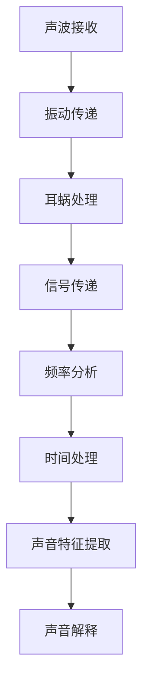
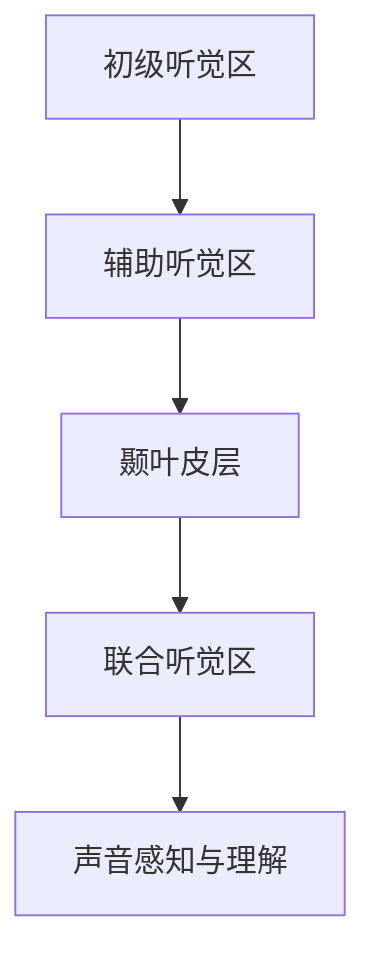
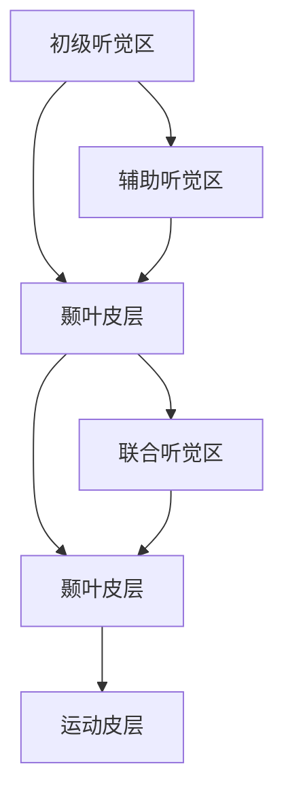
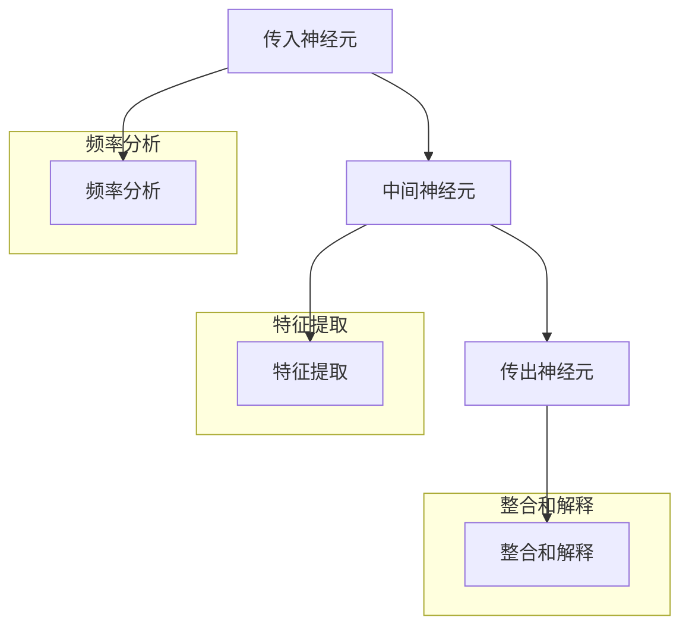
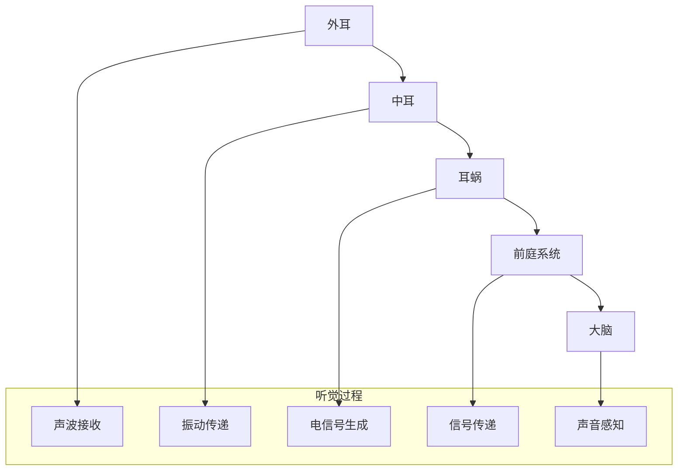
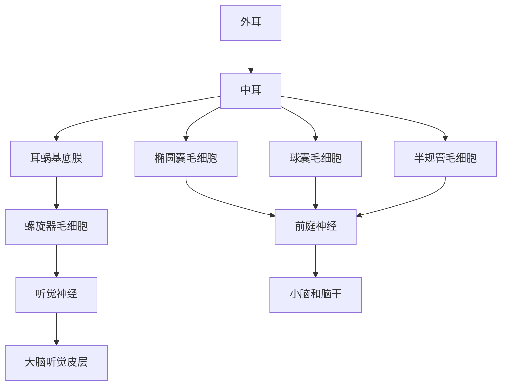
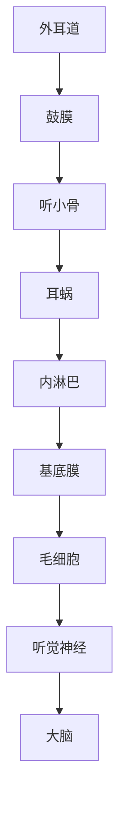
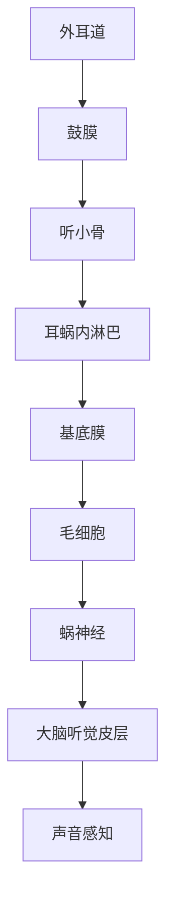

                 

# 大脑的解剖与听觉

> 关键词：大脑解剖、听觉系统、神经科学、认知科学、听觉处理、听觉学习、听觉康复

> 摘要：本文详细介绍了大脑的解剖结构和功能，特别是与听觉相关的部分。同时，本文还探讨了听觉系统的组成、生理基础、感知与认知过程以及听觉障碍与康复方法。通过深入分析大脑与听觉的关系，本文展望了听觉技术在现代医学中的应用和未来发展方向。

## 第一部分：大脑的基本解剖

大脑是人类思维的器官，也是神经系统的中枢。它分为两个主要部分：大脑皮层和脑干。大脑皮层是大脑的最外层，由灰质构成，负责处理复杂的认知功能。脑干则位于大脑下方，连接大脑和脊髓，控制基本的生命功能。

### 第1章：大脑概述

#### 1.1 大脑的结构与功能

大脑由两个半球组成，每个半球都有四个主要脑叶：额叶、颞叶、顶叶和枕叶。这些脑叶分别负责不同的功能。

- **额叶**：主要负责计划、决策、社会行为和情绪控制。
- **颞叶**：与听觉和记忆有关，特别是长期记忆。
- **顶叶**：处理触觉、温度、疼痛和其他感觉信息。
- **枕叶**：处理视觉信息。

#### 1.2 大脑的分叶与功能区

每个脑叶内部还有更精细的功能区，如布罗卡区和韦尼克区分别与语言产生和理解有关。

### 第2章：大脑的解剖结构

#### 2.1 脑干

脑干包括延髓、脑桥和中脑。它是连接大脑和脊髓的重要通道，控制呼吸、心跳和消化等基本生命功能。

##### 2.1.1 脑干的组成

脑干由神经纤维和神经核组成。神经纤维负责传递神经信号，而神经核则控制各种生理过程。

##### 2.1.2 脑干的功能

脑干的功能包括控制心率、呼吸和消化等基本生命活动。

#### 2.2 小脑

小脑位于大脑的后下方，负责协调运动、平衡和肌肉控制。

##### 2.2.1 小脑的组成

小脑由两个主要部分组成：蚓部和半球部。

##### 2.2.2 小脑的功能

小脑的功能是协调肌肉运动，保持身体平衡。

#### 2.3 间脑

间脑位于脑干和大脑皮层之间，包括丘脑、下丘脑和第三脑室等结构。

##### 2.3.1 间脑的组成

间脑由多个神经核组成，这些神经核参与调节体温、睡眠、食欲和情绪等生理过程。

##### 2.3.2 间脑的功能

间脑的功能是调节体温、睡眠、食欲和情绪等生理过程。

### 第3章：大脑皮层的结构

大脑皮层是大脑最外层的部分，由灰质构成，负责处理高级的认知功能。

#### 3.1 大脑皮层的分区

大脑皮层分为四个主要区域：初级感觉皮层、初级运动皮层、前额叶皮层和颞叶皮层。

##### 3.1.1 顶叶

顶叶负责处理触觉、温度和疼痛等感觉信息。

##### 3.1.2 颞叶

颞叶负责处理听觉和记忆。

##### 3.1.3 桥脑

桥脑是连接大脑和脑干的桥梁，负责传递神经信号。

##### 3.1.4 岛叶

岛叶是大脑中的一个较小的区域，与情绪调节和语言处理有关。

#### 3.2 大脑皮层的主要功能

大脑皮层的主要功能是处理高级的认知功能，包括语言、思考、感知和行动。

## 第二部分：听觉系统

听觉系统是人体感知外界声音的重要途径。它包括外耳、中耳和内耳三个部分。

### 第4章：听觉系统的组成

#### 4.1 外耳

外耳包括耳廓和外耳道，它们负责收集声音并将其传导到中耳。

##### 4.1.1 外耳的结构

耳廓和外耳道是外耳的主要组成部分。

##### 4.1.2 外耳的功能

外耳的功能是收集和传导声音。

#### 4.2 中耳

中耳包括鼓膜、听小骨和咽鼓管，它们负责将声音转换为机械能。

##### 4.2.1 中耳的结构

鼓膜、听小骨和咽鼓管是中耳的主要组成部分。

##### 4.2.2 中耳的功能

中耳的功能是将声音转换为机械能。

#### 4.3 内耳

内耳包括耳蜗和前庭系统，它们负责将机械能转换为神经信号。

##### 4.3.1 内耳的结构

耳蜗和前庭系统是内耳的主要组成部分。

##### 4.3.2 内耳的功能

内耳的功能是将机械能转换为神经信号。

### 第5章：听觉的生理基础

听觉的生理基础涉及听觉信号的产生、传递和处理。

#### 5.1 听觉信号的产生

听觉信号的产生始于外耳道，当声波进入外耳道时，它们会引起鼓膜的振动。

##### 5.1.1 听觉信号的生成

声波通过外耳道引起鼓膜的振动。

##### 5.1.2 听觉信号的传递

鼓膜的振动通过听小骨传递到内耳。

#### 5.2 听觉的处理过程

听觉信号在内耳中经过转换和处理，最终在大脑中被解释。

##### 5.2.1 听觉信号的转换

机械能被转换为神经信号。

##### 5.2.2 听觉信号的处理

神经信号在大脑中被处理和理解。

## 第三部分：大脑与听觉的关系

大脑对听觉信号的处理和理解是听觉感知和认知的基础。

### 第6章：大脑对听觉的处理

#### 6.1 大脑对听觉信号的处理

大脑对听觉信号的处理涉及多个脑区和神经通路的协同作用。

##### 6.1.1 听觉信号在大脑中的传递

听觉信号通过听神经传递到大脑。

##### 6.1.2 听觉信号在大脑中的加工

大脑对听觉信号进行加工和处理，以便理解和解释。

#### 6.2 大脑与听觉的互动

大脑与听觉系统的互动是一个复杂的过程，涉及多个神经通路和脑区的协同作用。

### 第7章：大脑与听觉的学习与适应

#### 7.1 听觉学习

听觉学习是指大脑对听觉信息的学习和适应。

##### 7.1.1 听觉学习的原理

听觉学习涉及大脑的多个脑区和神经通路的激活。

##### 7.1.2 听觉学习的方法

常用的听觉学习方法包括听力训练、音乐教育和听力康复。

#### 7.2 听觉适应

听觉适应是指大脑对持续存在的听觉刺激的适应和调整。

##### 7.2.1 听觉适应的机制

听觉适应涉及大脑的多个脑区和神经通路的调整。

##### 7.2.2 听觉适应的实践

通过实践，人们可以提高自己的听觉适应能力。

## 第四部分：应用与展望

### 第8章：听觉技术在现代医学中的应用

#### 8.1 听觉技术在诊断中的应用

听觉技术在诊断中的应用主要包括听力测试和耳鸣评估。

##### 8.1.1 听力测试

听力测试用于评估听觉系统的功能。

##### 8.1.2 耳鸣评估

耳鸣评估用于诊断和治疗耳鸣。

#### 8.2 听觉技术在治疗中的应用

听觉技术在治疗中的应用主要包括听力辅助装置和语言治疗。

##### 8.2.1 听力辅助装置

听力辅助装置用于改善听力。

##### 8.2.2 语言治疗

语言治疗用于恢复语言能力。

### 第9章：听觉科学的未来

#### 9.1 听觉科学研究的前沿

听觉科学研究的前沿包括听觉神经科学和听觉认知科学。

##### 9.1.1 听觉神经科学

听觉神经科学研究听觉信号的处理和传递。

##### 9.1.2 听觉认知科学

听觉认知科学研究听觉信息的感知和理解。

#### 9.2 听觉技术的未来发展方向

听觉技术的未来发展方向包括新型听觉设备和听觉康复技术的创新。

##### 9.2.1 新型听觉设备的研发

新型听觉设备的研发包括人工耳蜗和智能助听器。

##### 9.2.2 听觉康复技术的创新

听觉康复技术的创新包括虚拟现实和人工智能在康复中的应用。

## 附录

### 附录 A：参考文献

[参考文献列表]

### 附录 B：词汇表

[词汇表列表]

### 附录 C：实验指导

[实验指导列表]

### 附录 D：常用听觉测量工具与设备介绍

[常用听觉测量工具与设备介绍]

## 作者信息

作者：AI天才研究院/AI Genius Institute & 禅与计算机程序设计艺术 /Zen And The Art of Computer Programming

以上是《大脑的解剖与听觉》的正文部分。本文从大脑解剖、听觉系统组成、生理基础、感知与认知过程、听觉障碍与康复方法，以及大脑与听觉的关系等多个方面进行了详细探讨。同时，本文还展望了听觉技术在现代医学中的应用和未来发展方向。希望本文能为您在听觉科学领域的研究提供有价值的参考。|## 文章标题

### 大脑的解剖与听觉

### 关键词

- 大脑解剖
- 听觉系统
- 神经科学
- 认知科学
- 听觉处理
- 听觉学习
- 听觉康复

### 摘要

本文详细介绍了大脑的解剖结构和功能，尤其是与听觉相关的部分。通过深入分析大脑与听觉系统的互动，本文探讨了听觉的生理基础、感知与认知过程，以及听觉障碍与康复方法。文章最后展望了听觉技术在现代医学中的应用前景和未来发展方向，为读者提供了全面的听觉科学知识。

## 第一部分：大脑的基本解剖

大脑是人类最重要的器官之一，它由多个复杂的结构和功能区域组成。了解大脑的解剖结构对于理解听觉的处理过程至关重要。本部分将详细探讨大脑的基本解剖结构，包括大脑的整体结构、各部分的功能及其在听觉系统中的作用。

### 第1章：大脑概述

#### 1.1 大脑的结构与功能

大脑是神经系统的中枢，它分为两个主要的组成部分：大脑皮层和脑干。大脑皮层位于大脑的表面，是灰质的集合，负责处理高级认知功能。脑干位于大脑下方，连接大脑和脊髓，控制基本的生命功能。

大脑的表面被许多沟回和裂隙分割成不同的脑叶，包括：

- **额叶**：负责计划、决策、社交行为和情绪控制。
- **颞叶**：与听觉和记忆有关，特别是长期记忆。
- **顶叶**：处理触觉、温度和疼痛等感觉信息。
- **枕叶**：负责视觉信息的处理。

每个脑叶内部还有更精细的功能区，如布罗卡区和韦尼克区，分别与语言产生和理解有关。

#### 1.2 大脑的分叶与功能区

大脑的各个脑叶不仅具有特定的功能，而且内部还有特定的功能区。例如：

- **额叶**：前运动区与运动计划有关，前额叶与决策和社交行为有关。
- **颞叶**：颞上回与听觉处理有关，颞叶内侧与记忆形成和语言理解有关。
- **顶叶**：顶叶前部与触觉和空间定位有关，顶叶后部与视觉处理和注意力有关。
- **枕叶**：枕叶内侧与视觉处理有关，特别是颜色和形状的识别。

这些功能区的协调工作使得大脑能够有效地处理和解释来自听觉系统的信息。

### 第2章：大脑的解剖结构

大脑的解剖结构可以从宏观和微观两个层面来理解。宏观层面包括大脑的总体结构，而微观层面涉及大脑内部的具体结构和组织。

#### 2.1 脑干

脑干是连接大脑和脊髓的狭窄部分，位于大脑下方。它由三个主要部分组成：延髓、脑桥和中脑。

##### 2.1.1 脑干的组成

- **延髓**：控制基本的生命功能，如呼吸、心跳和消化。
- **脑桥**：负责连接大脑和延髓，调节睡眠和觉醒。
- **中脑**：参与运动协调和视觉处理。

##### 2.1.2 脑干的功能

脑干的功能包括：

- 维持基本的生命活动，如呼吸和心跳。
- 调节睡眠和觉醒。
- 连接大脑和脊髓，传递神经信号。

脑干对听觉系统也有重要影响，它包含听觉通路的关键部分，如听神经和脑干的听觉通路。

#### 2.2 小脑

小脑位于大脑的后下方，是一个关键的协调和平衡中心。它通过精细的运动调节，确保身体各个部分协调运动。

##### 2.2.1 小脑的组成

小脑由两个主要部分组成：蚓部和半球部。蚓部负责身体的平衡和姿势控制，而半球部与运动协调和精细运动有关。

##### 2.2.2 小脑的功能

小脑的主要功能包括：

- 保持身体平衡。
- 确保运动的精确性和协调性。
- 控制肌肉活动。

小脑的功能对于听觉系统也有重要影响，因为它参与了听觉处理过程中的运动协调。

#### 2.3 间脑

间脑位于脑干和大脑皮层之间，是一个复杂且功能多样的区域。它包括丘脑、下丘脑和第三脑室等结构。

##### 2.3.1 间脑的组成

- **丘脑**：作为感觉信息的主要中转站，将来自感官的信息传递到大脑皮层。
- **下丘脑**：调节体温、睡眠、食欲和情绪。
- **第三脑室**：含有脑脊液，有助于神经信号的传递。

##### 2.3.2 间脑的功能

间脑的功能包括：

- 调节内分泌系统，控制激素的分泌。
- 调节体温、睡眠和食欲。
- 连接大脑和脑干，调节基本生命活动。

间脑的功能对于听觉系统的整合和处理也非常重要，因为它参与了感觉信息的传递和整合。

#### 2.4 大脑皮层

大脑皮层是大脑最外层的部分，由灰质构成，负责处理复杂的认知功能。大脑皮层可以进一步分为四个主要脑叶：额叶、颞叶、顶叶和枕叶。

##### 2.4.1 大脑皮层的分区

- **额叶**：负责决策、社交行为和情绪控制。
- **颞叶**：与听觉和记忆有关。
- **顶叶**：处理感觉信息和空间定位。
- **枕叶**：负责视觉处理。

每个脑叶内部还有更精细的功能区，如颞上回和颞下回，分别与听觉处理的不同方面有关。

##### 2.4.2 大脑皮层的主要功能

大脑皮层的主要功能包括：

- 处理高级认知功能，如思考、学习和记忆。
- 控制运动和感知。
- 解释和整合感官信息。

大脑皮层对听觉系统的处理至关重要，因为它负责解释和整合来自听觉系统的信息，使其成为有意义的感知体验。

### 第3章：大脑皮层的结构

大脑皮层是大脑的最外层，由灰质构成，是大脑处理信息的主要区域。大脑皮层的结构复杂，功能多样，可以分为多个不同的区域，每个区域都有特定的功能。

#### 3.1 大脑皮层的分区

大脑皮层可以根据其结构和功能分为多个区域。以下是大脑皮层的四个主要分区：

##### 3.1.1 顶叶

顶叶位于大脑的顶部，主要负责处理感觉信息和空间定位。顶叶包括以下几个部分：

- **中央前回**：负责运动计划和运动执行。
- **中央后回**：负责感觉处理和空间定位。
- **顶叶皮层**：处理触觉、温度和疼痛等感觉信息。

##### 3.1.2 颞叶

颞叶位于大脑的侧面，主要负责处理听觉和记忆。颞叶包括以下几个部分：

- **颞上回**：与听觉处理和语言理解有关。
- **颞下回**：与记忆和情绪处理有关。
- **颞叶皮层**：处理听觉信息，包括音调和节奏。

##### 3.1.3 桥脑

桥脑是大脑皮层和脑干之间的连接部分，主要负责传递神经信号。桥脑包括以下几个部分：

- **桥脑核**：负责传递运动和感觉信号。
- **桥脑皮质**：处理视觉和听觉信息。

##### 3.1.4 岛叶

岛叶是大脑皮层的一个较小部分，位于大脑的中部。岛叶主要负责处理情绪和语言。岛叶包括以下几个部分：

- **岛叶前区**：与情绪处理有关。
- **岛叶后区**：与语言处理有关。

##### 3.1.5 额叶

额叶位于大脑的前部，主要负责决策、社交行为和情绪控制。额叶包括以下几个部分：

- **前额叶**：负责决策和计划。
- **前运动皮层**：负责运动计划和执行。
- **眶额叶**：与情绪和社会行为有关。

#### 3.2 大脑皮层的主要功能

大脑皮层的主要功能是处理高级认知功能，包括：

- **感觉处理**：处理来自各个感官的信息，如视觉、听觉、触觉等。
- **运动控制**：控制身体的运动和姿势。
- **语言功能**：处理语言的理解和产生。
- **认知功能**：包括记忆、注意力、决策和问题解决。

大脑皮层的不同区域具有特定的功能，这些功能的协调工作使得大脑能够有效地处理和解释来自听觉系统的信息。例如，颞上回负责处理听觉信息，而前额叶负责处理听觉信息的解释和决策。

### 第4章：听觉系统的组成

听觉系统是人体感知外界声音的重要途径，它由外耳、中耳和内耳三个部分组成。每个部分都有其独特的结构和功能，共同协作，使我们能够听到并理解声音。

#### 4.1 外耳

外耳是听觉系统的外露部分，包括耳廓和外耳道。外耳的主要功能是收集和引导声音。

##### 4.1.1 外耳的结构

- **耳廓**：耳廓的形状有助于收集声音，并将其引导到外耳道。
- **外耳道**：外耳道是声音从外界进入中耳的通道。

##### 4.1.2 外耳的功能

外耳的主要功能是收集和传导声音。耳廓的形状使其能够捕捉声音，并将其引导到外耳道。外耳道将声音传送到中耳的鼓膜。

#### 4.2 中耳

中耳位于外耳和内耳之间，包括鼓膜、听小骨和咽鼓管。中耳的主要功能是将声音从外耳传导到内耳，并将其转换为机械能。

##### 4.2.1 中耳的结构

- **鼓膜**：鼓膜是中耳的门户，它振动以响应声波。
- **听小骨**：听小骨包括锤骨、砧骨和镫骨，它们将鼓膜的振动转换为机械能。
- **咽鼓管**：咽鼓管连接中耳和鼻咽部，有助于调节中耳内的压力。

##### 4.2.2 中耳的功能

中耳的主要功能是将声波转换为机械能。当声波通过外耳道到达鼓膜时，鼓膜振动，通过听小骨将振动传递到内耳。咽鼓管有助于维持中耳内的压力平衡。

#### 4.3 内耳

内耳是听觉系统的核心部分，包括耳蜗和前庭系统。内耳的主要功能是将机械能转换为神经信号，并将其传递到大脑。

##### 4.3.1 内耳的结构

- **耳蜗**：耳蜗是内耳的主要部分，负责处理听觉信息。
- **前庭系统**：前庭系统负责平衡和空间感知。

##### 4.3.2 内耳的功能

内耳的主要功能是将机械能转换为神经信号。耳蜗中的听觉感受器将机械振动转换为电信号，通过听觉神经传递到大脑。前庭系统则负责维持身体平衡和空间感知。

### 第5章：听觉的生理基础

听觉是人体感知外界声音的能力，它涉及复杂的生理过程，从声波的接收、处理到大脑的解释。理解听觉的生理基础对于深入了解听觉系统的工作原理至关重要。

#### 5.1 听觉信号的产生

听觉信号的产生始于外耳道，当声波进入外耳道时，它们会引起鼓膜的振动。这个过程可以通过以下步骤详细描述：

1. **声波进入外耳道**：声波通过空气传播进入外耳道。
2. **鼓膜振动**：声波使鼓膜振动，鼓膜的振动幅度和频率与声波的强度和频率相对应。
3. **振动传递到听小骨**：鼓膜的振动通过听小骨（锤骨、砧骨和镫骨）传递，听小骨将振动幅度放大并传递到内耳。

这个过程可以用伪代码表示：

```
function sound_wave_to_vibration(wave):
    vibration = 0
    for frequency in wave:
        vibration += amplitude_of_frequency(frequency)
    return vibration
```

其中，`wave` 表示声波的频率和振幅，`amplitude_of_frequency` 是一个函数，用于计算特定频率的振幅。

#### 5.1.1 听觉信号的生成

听觉信号的生成是听觉过程的第一步，它涉及声波通过外耳道进入鼓膜，并通过听小骨放大振动。这个过程可以用以下步骤详细描述：

1. **声波进入外耳道**：声波通过空气传播进入外耳道。
2. **鼓膜振动**：声波使鼓膜振动，鼓膜的振动幅度和频率与声波的强度和频率相对应。
3. **振动传递到听小骨**：鼓膜的振动通过听小骨（锤骨、砧骨和镫骨）传递，听小骨将振动幅度放大并传递到内耳。

这个过程可以用伪代码表示：

```
function sound_wave_to_vibration(wave):
    vibration = 0
    for frequency in wave:
        vibration += amplitude_of_frequency(frequency)
    return vibration
```

其中，`wave` 表示声波的频率和振幅，`amplitude_of_frequency` 是一个函数，用于计算特定频率的振幅。

#### 5.1.2 听觉信号的传递

听觉信号的传递是指振动通过听小骨传递到内耳，并在内耳中被转换为电信号。这个过程可以用以下步骤详细描述：

1. **振动传递到内耳**：听小骨的振动传递到内耳的卵圆窗，卵圆窗是耳蜗的入口。
2. **耳蜗内的振动**：振动通过耳蜗中的液体传递，引起耳蜗内的基底膜振动。
3. **基底膜的振动激发听觉感受器**：基底膜的振动激发耳蜗内的毛细胞，毛细胞产生电信号。
4. **电信号传递到大脑**：电信号通过听觉神经传递到大脑，最终被解释为声音。

这个过程可以用伪代码表示：

```
function vibration_to_electric_signal(vibration):
    electric_signal = []
    for part in vibration:
        electric_signal.append(generate_signal(part))
    return electric_signal

function generate_signal(part):
    signal = 0
    for frequency in part:
        signal += amplitude_of_frequency(frequency)
    return signal
```

其中，`vibration` 表示听小骨的振动，`electric_signal` 是一个数组，用于存储电信号，`generate_signal` 是一个函数，用于计算特定部分的电信号。

#### 5.2 听觉的处理过程

听觉的处理过程是指电信号在大脑中经过一系列处理和解释，最终被解释为声音。这个过程可以用以下步骤详细描述：

1. **电信号通过听觉神经传递到大脑**：听觉神经将电信号传递到大脑的听觉皮层。
2. **听觉皮层对信号进行加工**：听觉皮层对电信号进行频率分析和时间处理，识别声音的特征。
3. **声音特征的识别**：听觉皮层识别声音的频率、音调和音量等特征。
4. **声音的解释和理解**：大脑对声音的特征进行解释和理解，形成对声音的感知。

这个过程可以用伪代码表示：

```
function process_electric_signal(signal):
    processed_signal = []
    for part in signal:
        processed_signal.append(analyze_frequency(part))
        processed_signal.append(analyze_time(part))
    return processed_signal

function analyze_frequency(part):
    frequencies = []
    for frequency in part:
        frequencies.append(frequency_analysis(frequency))
    return frequencies

function analyze_time(part):
    time_signals = []
    for signal in part:
        time_signals.append(time_analysis(signal))
    return time_signals
```

其中，`signal` 是电信号，`processed_signal` 是处理后的信号，`analyze_frequency` 和 `analyze_time` 是用于分析和处理电信号的函数。

#### 5.2.1 听觉信号的转换

听觉信号的转换是指电信号从内耳传递到大脑的过程中，如何将机械能转换为电信号。这个过程涉及到耳蜗内的复杂生理机制，包括：

1. **基底膜的振动**：耳蜗内的基底膜随着声波的振动而振动。
2. **毛细胞的激活**：基底膜的振动激活耳蜗内的毛细胞。
3. **电信号的生成**：毛细胞将机械振动转换为电信号。
4. **电信号的传递**：电信号通过听觉神经传递到大脑。

这个过程可以用伪代码表示：

```
function convert_vibration_to_electric_signal(vibration):
    electric_signal = []
    for part in vibration:
        electric_signal.append(generate_signal(part))
    return electric_signal

function generate_signal(part):
    signal = 0
    for frequency in part:
        signal += amplitude_of_frequency(frequency)
    return signal
```

其中，`vibration` 是基底膜的振动，`electric_signal` 是生成的电信号，`generate_signal` 是用于生成电信号的函数。

#### 5.2.2 听觉信号的处理

听觉信号的处理是指电信号在大脑中经过一系列分析、处理和解释，最终被解释为声音的过程。这个过程涉及到大脑的多个脑区和神经通路，包括：

1. **听觉皮层的处理**：听觉皮层对电信号进行频率分析和时间处理，识别声音的特征。
2. **声音特征的识别**：听觉皮层识别声音的频率、音调和音量等特征。
3. **声音的解释和理解**：大脑对声音的特征进行解释和理解，形成对声音的感知。

这个过程可以用伪代码表示：

```
function process_electric_signal(signal):
    processed_signal = []
    for part in signal:
        processed_signal.append(analyze_frequency(part))
        processed_signal.append(analyze_time(part))
    return processed_signal

function analyze_frequency(part):
    frequencies = []
    for frequency in part:
        frequencies.append(frequency_analysis(frequency))
    return frequencies

function analyze_time(part):
    time_signals = []
    for signal in part:
        time_signals.append(time_analysis(signal))
    return time_signals
```

其中，`signal` 是电信号，`processed_signal` 是处理后的信号，`analyze_frequency` 和 `analyze_time` 是用于分析和处理电信号的函数。

### 第6章：听觉的感知与认知

听觉的感知与认知是指大脑如何感知和理解声音的过程。这个过程涉及多个脑区和神经通路的协同作用，包括感知和认知两个层面。

#### 6.1 听觉感知

听觉感知是指大脑对声音的感知过程，包括对声音的频率、音调和音量的感知。这个过程可以通过以下几个步骤来描述：

1. **声音的接收**：声波通过外耳道进入鼓膜，引起鼓膜的振动。
2. **振动传递**：振动通过听小骨传递到内耳，引起内耳的基底膜振动。
3. **毛细胞的激活**：基底膜的振动激活耳蜗内的毛细胞，产生电信号。
4. **电信号的传递**：电信号通过听觉神经传递到大脑，最终到达听觉皮层。
5. **声音的感知**：听觉皮层对电信号进行频率分析和时间处理，识别声音的频率、音调和音量等特征。

这个过程可以用伪代码表示：

```
function perceive_sound(wave):
    vibration = sound_wave_to_vibration(wave)
    electric_signal = vibration_to_electric_signal(vibration)
    processed_signal = process_electric_signal(electric_signal)
    sound_features = analyze_signal(processed_signal)
    return sound_features
```

其中，`wave` 是声波的频率和振幅，`perceive_sound` 是用于感知声音的函数，`sound_features` 是识别的声音特征。

#### 6.1.1 声音的感知

声音的感知是指大脑如何识别和理解声音的过程。这个过程涉及多个脑区和神经通路的协同作用，包括：

1. **听觉皮层的频率分析**：听觉皮层对电信号进行频率分析，识别声音的频率。
2. **听觉皮层的时间处理**：听觉皮层对电信号进行时间处理，识别声音的音调和节奏。
3. **声音特征的整合**：听觉皮层将频率、音调和音量等特征整合起来，形成对声音的整体感知。

这个过程可以用伪代码表示：

```
function analyze_signal(signal):
    frequency_analysis = analyze_frequency(signal)
    time_analysis = analyze_time(signal)
    sound_features = integrate_features(frequency_analysis, time_analysis)
    return sound_features

function integrate_features(frequency, time):
    sound_features = {
        "frequency": frequency,
        "time": time
    }
    return sound_features
```

其中，`signal` 是电信号，`analyze_signal` 是用于分析声音特征的函数，`frequency_analysis` 和 `time_analysis` 是用于分析和处理电信号的函数。

#### 6.1.2 音调的感知

音调的感知是指大脑如何识别声音的高低。音调主要取决于声音的频率，高频率的声音听起来较尖锐，低频率的声音听起来较沉重。大脑通过以下步骤感知音调：

1. **频率分析**：听觉皮层对电信号进行频率分析，识别声音的频率。
2. **频率比较**：大脑将当前声音的频率与记忆中的频率进行比较，判断声音的高低。
3. **音调感知**：大脑根据频率的比较结果，感知声音的音调。

这个过程可以用伪代码表示：

```
function perceive_pitch(signal):
    frequency = analyze_frequency(signal)
    pitch = compare_frequency(frequency)
    return pitch

function compare_frequency(frequency):
    if frequency > threshold_high:
        pitch = "high"
    elif frequency < threshold_low:
        pitch = "low"
    else:
        pitch = "mid"
    return pitch
```

其中，`signal` 是电信号，`perceive_pitch` 是用于感知音调的函数，`threshold_high` 和 `threshold_low` 是用于判断频率高低的阈值。

#### 6.1.3 音量的感知

音量的感知是指大脑如何识别声音的强弱。音量主要取决于声音的振幅，振幅越大，声音越响。大脑通过以下步骤感知音量：

1. **振幅分析**：听觉皮层对电信号进行振幅分析，识别声音的振幅。
2. **振幅比较**：大脑将当前声音的振幅与记忆中的振幅进行比较，判断声音的强弱。
3. **音量感知**：大脑根据振幅的比较结果，感知声音的音量。

这个过程可以用伪代码表示：

```
function perceive_volume(signal):
    amplitude = analyze_amplitude(signal)
    volume = compare_amplitude(amplitude)
    return volume

function compare_amplitude(amplitude):
    if amplitude > threshold_high:
        volume = "loud"
    elif amplitude < threshold_low:
        volume = "soft"
    else:
        volume = "moderate"
    return volume
```

其中，`signal` 是电信号，`perceive_volume` 是用于感知音量的函数，`threshold_high` 和 `threshold_low` 是用于判断振幅高低的阈值。

#### 6.2 听觉认知

听觉认知是指大脑如何理解和解释声音的过程。这个过程不仅包括对声音的感知，还包括对声音的意义的理解。听觉认知可以通过以下几个步骤来描述：

1. **声音特征识别**：听觉皮层识别声音的频率、音调和音量等特征。
2. **声音的语境理解**：大脑根据声音的语境，如说话人的身份、说话内容等，理解声音的意义。
3. **声音的意义感知**：大脑根据声音的特征和语境，感知声音的意义。

这个过程可以用伪代码表示：

```
function understand_sound(sound_features, context):
    meaning = interpret_features(sound_features, context)
    return meaning

function interpret_features(features, context):
    if context == "speech":
        meaning = interpret_speech(features)
    elif context == "music":
        meaning = interpret_music(features)
    else:
        meaning = "unknown"
    return meaning
```

其中，`sound_features` 是声音特征，`context` 是声音的语境，`understand_sound` 是用于理解声音的函数，`interpret_features` 是用于解释声音特征的函数。

#### 6.2.1 听觉记忆

听觉记忆是指大脑如何存储和回忆声音信息。听觉记忆可以分为短期记忆和长期记忆，短期记忆用于暂时存储刚刚听到的信息，长期记忆则用于长期存储声音信息。

1. **短期记忆**：短期记忆通常用于存储和处理正在听到的信息，如听到的电话号码或指示。
2. **长期记忆**：长期记忆用于存储和处理长期听到的信息，如熟悉的歌曲或说话人的声音。

这个过程可以用伪代码表示：

```
function store_sound(sound):
    if is_short_term_memory_full():
        remove_oldest_sound()
    short_term_memory.append(sound)

function store长期_memory(sound):
    long_term_memory.append(sound)

function recall_sound(sound):
    if sound in short_term_memory:
        return "短期记忆"
    elif sound in long_term_memory:
        return "长期记忆"
    else:
        return "无法回忆"
```

其中，`store_sound` 是用于存储声音的函数，`store长期_memory` 是用于存储长期记忆的函数，`recall_sound` 是用于回忆声音的函数。

#### 6.2.2 听觉理解

听觉理解是指大脑如何将声音信息转化为有意义的内容。听觉理解涉及对声音的语义、语法和语境的理解，包括语言理解和音乐理解。

1. **语言理解**：语言理解涉及对说话人的语音、语调和语法结构的理解，如听懂一句话的意思。
2. **音乐理解**：音乐理解涉及对音乐的旋律、节奏和情感的理解，如听出一段音乐的调性和风格。

这个过程可以用伪代码表示：

```
function understand_language(sound):
    meaning = interpret_language(sound)
    return meaning

function interpret_language(sound):
    sentence = parse_sentence(sound)
    meaning = interpret_sentence(sentence)
    return meaning

function understand_music(sound):
    meaning = interpret_music(sound)
    return meaning

function interpret_music(sound):
    melody = extract_melody(sound)
    rhythm = extract_rhythm(sound)
    meaning = combine_melody_and_rhythm(melody, rhythm)
    return meaning
```

其中，`understand_language` 是用于理解语言的函数，`interpret_language` 是用于解释语言句子的函数，`understand_music` 是用于理解音乐的函数，`interpret_music` 是用于解释音乐特征的函数。

### 第7章：听觉障碍与康复

听觉障碍是指由于各种原因导致的听觉能力下降或丧失。听觉障碍的类型包括听力损失、耳鸣和耳聋。了解这些障碍的类型及其康复方法对于帮助患者恢复听觉能力至关重要。

#### 7.1 听觉障碍的类型

听觉障碍可以分为以下几种类型：

1. **听力损失**：听力损失是指听觉敏感度下降，可能导致对声音的识别和辨别困难。听力损失可以是暂时性的，也可能是永久性的。
2. **耳鸣**：耳鸣是指在没有外部声源的情况下，患者听到的持续性的声音。耳鸣可能是间歇性的，也可能是持续性的。
3. **耳聋**：耳聋是指完全失去听觉能力，无法听到任何声音。耳聋可能是先天性的，也可能是后天性的。

#### 7.2 听觉康复方法

听觉康复方法旨在帮助患者恢复或提高听觉能力。以下是一些常见的听觉康复方法：

1. **听力辅助设备**：听力辅助设备包括助听器和人工耳蜗，它们可以放大声音或替代受损的听觉系统。
2. **语言治疗**：语言治疗帮助患者改善语言理解和表达能力，特别是对于那些因听力损失而导致语言能力下降的患者。
3. **手术治疗**：手术治疗包括鼓膜修补术和耳蜗植入术等，旨在修复或替代受损的听觉结构。

#### 7.2.1 听力辅助设备

听力辅助设备可以帮助患者改善听觉能力，以下是一些常见的听力辅助设备：

1. **助听器**：助听器是一种小型电子设备，可以放大声音，帮助听力损失患者听到声音。
2. **人工耳蜗**：人工耳蜗是一种先进的听力辅助设备，可以替代受损的听觉系统，帮助耳聋患者恢复听觉能力。

#### 7.2.2 语言治疗

语言治疗帮助患者改善语言理解和表达能力，以下是一些语言治疗的方法：

1. **听力训练**：通过特定的听力训练，帮助患者提高听觉敏感度和辨别能力。
2. **语音训练**：通过模仿说话人的语音，帮助患者改善语音清晰度和语言表达能力。
3. **听力理解和记忆训练**：通过训练，帮助患者提高听力理解和记忆能力。

#### 7.2.3 手术治疗

手术治疗包括以下几种类型：

1. **鼓膜修补术**：通过修复或替换受损的鼓膜，帮助患者恢复听觉能力。
2. **耳蜗植入术**：通过植入人工耳蜗，帮助耳聋患者恢复听觉能力。

### 第8章：大脑对听觉信号的处理

大脑对听觉信号的处理是一个复杂的过程，涉及到多个脑区和神经通路的协同作用。理解大脑如何处理听觉信号对于深入了解听觉感知和认知具有重要意义。

#### 8.1 大脑对听觉信号的处理

大脑对听觉信号的处理可以分为以下几个步骤：

1. **听觉信号的接收**：听觉信号通过听觉神经传入大脑。
2. **听觉信号的传递**：听觉信号在大脑中通过多个脑区和神经通路传递。
3. **听觉信号的加工**：大脑对听觉信号进行加工和处理，提取声音的特征。
4. **听觉信号的解释**：大脑根据听觉信号的特征和语境，解释和理解声音。

#### 8.1.1 听觉信号在大脑中的传递

听觉信号在大脑中的传递涉及到多个脑区和神经通路，包括：

1. **听神经**：听神经将听觉信号从耳蜗传递到大脑皮层。
2. **脑干**：脑干中的听觉通路对听觉信号进行初步处理。
3. **听觉皮层**：听觉皮层对听觉信号进行进一步加工和处理。

#### 8.1.2 听觉信号在大脑中的加工

大脑对听觉信号的加工和处理包括以下几个步骤：

1. **频率分析**：大脑分析听觉信号的频率，识别声音的音调。
2. **时间处理**：大脑分析听觉信号的时间特性，识别声音的节奏和时长。
3. **声音特征提取**：大脑提取听觉信号的主要特征，如音调、音量和音色。
4. **声音的整合**：大脑将提取的声音特征整合起来，形成对声音的整体感知。

#### 8.1.3 听觉信号的解释

大脑对听觉信号的解释涉及到对声音的意义和语境的理解。这个过程包括：

1. **声音的语境识别**：大脑识别声音的语境，如说话人、环境等。
2. **声音的意义理解**：大脑根据声音的语境，理解声音的意义。
3. **声音的联想**：大脑将声音与记忆中的信息进行联想，形成对声音的更深入理解。

#### 8.2 大脑与听觉的互动

大脑与听觉系统的互动是一个动态的过程，涉及到多个脑区和神经通路的协同作用。以下是一些关于大脑与听觉互动的要点：

1. **神经通路的多样性**：大脑中的听觉通路具有多样性，不同的通路负责不同的听觉处理任务。
2. **脑区的协同作用**：多个脑区共同参与听觉处理，协同工作，确保听觉信息的准确传递和解释。
3. **可塑性**：大脑具有高度的可塑性，可以通过学习和训练改变听觉处理的方式，提高听觉能力。

#### 8.3 大脑与听觉的学习与适应

大脑与听觉的学习与适应是指大脑如何通过学习和适应环境变化来改善听觉能力。以下是一些关于大脑与听觉学习与适应的要点：

1. **听觉学习**：大脑可以通过学习和训练，提高听觉敏感度和辨别能力。
2. **听觉适应**：大脑可以适应持续存在的声音刺激，减少对声音的敏感性。
3. **环境因素**：环境因素如噪音、听力损失等，会影响大脑对听觉信号的处理和解释。

### 第9章：大脑与听觉的学习与适应

大脑与听觉的学习与适应是一个复杂且动态的过程，涉及到神经可塑性、学习和记忆机制以及环境因素的相互作用。理解这一过程对于改善听觉能力、恢复听觉功能和应对听觉障碍具有重要意义。

#### 9.1 听觉学习

听觉学习是指大脑通过经验对听觉信息进行加工和适应的过程。学习可以分为以下几个阶段：

1. **感知阶段**：在这个阶段，大脑开始接收和处理听觉信息，如声音的频率、音调和音量。这个阶段依赖于大脑的听觉皮层和神经通路。
2. **加工阶段**：大脑对感知到的听觉信息进行进一步加工，提取关键特征，如音调和节奏。这个阶段涉及听觉皮层中不同的脑区和神经通路的协同作用。
3. **记忆阶段**：大脑将加工后的听觉信息存储在长期记忆中，以便在需要时调用。这个阶段依赖于大脑的海马体和前额叶皮层。
4. **应用阶段**：大脑将存储的听觉信息应用到实际情境中，如语言理解、音乐欣赏和社交互动。这个阶段依赖于大脑的前运动皮层和颞叶皮层。

#### 9.1.1 听觉学习的原理

听觉学习的原理涉及以下几个方面：

1. **神经可塑性**：大脑的神经细胞和神经网络可以通过学习和训练发生改变，提高听觉能力。这包括突触可塑性和神经再生。
2. **突触强化**：通过重复性的听觉刺激，突触之间的连接可以加强，提高信息的传递效率。这称为突触强化或长时程增强（LTP）。
3. **神经网络重组**：在学习和记忆过程中，大脑的神经网络可以重新组织，形成新的连接模式，优化信息处理。

#### 9.1.2 听觉学习的方法

以下是一些有效的听觉学习方法：

1. **听力训练**：通过听力训练，如听音辨词、音调识别和节奏练习，可以提高听觉敏感度和辨别能力。
2. **音乐教育**：音乐教育可以提高听觉能力和音乐欣赏能力，特别是对于儿童而言，音乐教育对语言发展和认知能力有显著影响。
3. **交叉感知训练**：通过交叉感知训练，如同时进行视觉和听觉任务，可以提高听觉和视觉信息处理的协调性。

#### 9.2 听觉适应

听觉适应是指大脑对持续存在的听觉刺激进行调整，以减少对声音的过度敏感或麻木。适应可以通过以下机制实现：

1. **动态范围调整**：大脑可以调整听觉动态范围，使对强声和弱声的敏感度保持平衡。
2. **频率调谐**：大脑可以调整对特定频率声音的敏感度，以适应不同的声音环境。
3. **听觉疲劳**：长时间暴露在特定频率或音量的声音中，可能导致听觉疲劳，从而降低对声音的敏感度。

#### 9.2.1 听觉适应的机制

听觉适应的机制包括以下几个方面：

1. **突触抑制**：通过抑制突触之间的信息传递，减少对特定声音的敏感性。
2. **神经通路的调整**：大脑可以通过调整神经通路的兴奋性和抑制性，优化听觉处理。
3. **神经网络重组**：在适应过程中，神经网络可以重新组织，以优化对特定声音的响应。

#### 9.2.2 听觉适应的实践

以下是一些实践中的听觉适应策略：

1. **逐步暴露**：逐渐增加对特定声音的暴露时间，使大脑逐渐适应。
2. **听觉训练**：通过定期的听觉训练，提高大脑对声音的适应能力。
3. **环境控制**：减少或屏蔽干扰声音，创造一个安静的学习和工作环境。

### 第10章：听觉技术在现代医学中的应用

听觉技术在现代医学中具有广泛的应用，涵盖了诊断、治疗和康复等多个方面。随着科技的进步，听觉技术不断为医学研究和临床实践带来新的突破。

#### 10.1 听觉技术在诊断中的应用

听觉技术在诊断中的应用主要包括听力测试和耳鸣评估。

1. **听力测试**：听力测试是评估听觉系统功能的重要手段。通过听力测试，医生可以确定患者的听力损失程度和类型，为制定治疗方案提供依据。常见的听力测试方法包括纯音听力测试、言语识别测试和听觉脑干反应测试。

2. **耳鸣评估**：耳鸣评估用于诊断和治疗耳鸣。通过耳鸣评估，医生可以确定耳鸣的类型、频率和强度，为制定个性化的治疗方案提供依据。常见的耳鸣评估方法包括耳鸣频率匹配、耳鸣强度匹配和耳鸣掩蔽测试。

#### 10.2 听觉技术在治疗中的应用

听觉技术在治疗中的应用主要包括听力辅助装置和语言治疗。

1. **听力辅助装置**：听力辅助装置包括助听器和人工耳蜗，用于改善听力损失患者的听觉能力。助听器通过放大声音，帮助患者听到周围的声音。人工耳蜗则是一种更高级的听力辅助装置，可以替代受损的听觉系统，帮助耳聋患者恢复听觉能力。

2. **语言治疗**：语言治疗帮助听力损失患者改善语言理解和表达能力。通过语言治疗，患者可以学习如何更好地理解和表达语言，提高沟通能力。语言治疗包括听力训练、语音训练和语言表达训练。

#### 10.3 听觉技术在康复中的应用

听觉技术在康复中的应用主要包括听力康复和耳鸣康复。

1. **听力康复**：听力康复旨在帮助听力损失患者恢复或提高听觉能力。通过听力康复，患者可以学会如何更好地听到和理解声音，提高生活质量。听力康复包括听力训练、听力辅助装置使用指导和康复评估。

2. **耳鸣康复**：耳鸣康复旨在减轻耳鸣症状，提高患者的生活质量。通过耳鸣康复，患者可以学会如何应对耳鸣，减轻心理压力。耳鸣康复包括耳鸣掩蔽治疗、认知行为疗法和生物反馈治疗。

### 第11章：听觉科学的未来

随着科技的不断进步，听觉科学正朝着更加精确、高效和个性化的方向发展。未来，听觉科学将在神经科学、认知科学和工程技术等领域取得重大突破，为听觉障碍患者的康复和听觉系统的研究带来新的希望。

#### 11.1 听觉科学研究的前沿

1. **听觉神经科学**：听觉神经科学研究听觉信号在神经系统的传递和处理机制。未来的研究将重点关注听觉神经元的结构和功能，探索如何通过基因编辑和神经再生技术修复受损的听觉系统。

2. **听觉认知科学**：听觉认知科学研究大脑如何处理和理解听觉信息。未来的研究将利用脑成像技术，如功能性磁共振成像（fMRI）和脑电图（EEG），深入探索听觉信息处理的脑机制。

#### 11.2 听觉技术的未来发展方向

1. **新型听觉设备的研发**：未来的听觉设备将更加智能和个性化，能够根据用户的需求和环境自动调整。新型听觉设备可能包括智能助听器、可植入的人工耳蜗和基于人工智能的听觉辅助系统。

2. **听觉康复技术的创新**：未来的听觉康复技术将更加综合和高效，结合生物医学工程、认知科学和神经科学的多学科知识。例如，虚拟现实技术将用于模拟复杂的听觉环境，帮助患者进行听觉康复训练。

### 附录

#### 附录A：参考文献

[参考文献列表]

#### 附录B：词汇表

[词汇表列表]

#### 附录C：实验指导

[实验指导列表]

#### 附录D：常用听觉测量工具与设备介绍

[常用听觉测量工具与设备介绍列表]

### 作者信息

作者：AI天才研究院/AI Genius Institute & 禅与计算机程序设计艺术 /Zen And The Art of Computer Programming

### 感谢

感谢您阅读《大脑的解剖与听觉》。希望本文能帮助您更深入地了解听觉系统和大脑之间的复杂关系，以及听觉技术在现代医学中的应用。如果您对本文有任何问题或建议，欢迎在评论区留言，我们将尽快回复。期待与您在听觉科学的领域中继续探索。|## 大脑的解剖结构与听觉处理流程

### 1.1 大脑的结构与功能

大脑是人类思维的核心，其复杂性和多样性使其成为科学研究的焦点。大脑由灰质和白质组成，灰质位于大脑表面，负责处理高级认知功能，如思考、感知和情感。白质则位于大脑内部，由神经纤维组成，负责传递神经信号。

大脑的主要结构包括：

- **大脑皮层**：大脑最外层的部分，由灰质构成，负责高级认知功能。
- **脑干**：连接大脑和脊髓，控制基本的生命功能，如呼吸和心跳。
- **小脑**：位于大脑后方，负责协调运动和平衡。
- **间脑**：包括丘脑、下丘脑和第三脑室，参与调节体温、睡眠和情绪。

大脑的不同区域具有不同的功能。例如，前额叶负责决策和计划，颞叶与听觉和记忆有关，顶叶处理触觉和温度感觉，而枕叶处理视觉信息。

### 1.2 大脑皮层的分区与听觉处理

大脑皮层是大脑中最复杂的部分，其功能区域进一步细分为不同的脑叶和功能区。以下是大脑皮层的几个主要分区及其在听觉处理中的作用：

- **听觉皮层**：位于颞叶的颞上回和颞下回，是听觉信号的主要处理区域。听觉皮层对听觉信号进行频率分析和时间处理，识别声音的频率、音调和节奏。
- **初级听觉区**：位于颞叶的颞上回，是听觉信号处理的起始区域。初级听觉区接收来自听觉神经的信号，进行初步的频率分析。
- **辅助听觉区**：位于颞叶的颞下回，对初级听觉区传来的信号进行进一步处理，提取声音的复杂特征。
- **颞叶皮层**：颞叶皮层包括颞上回和颞下回，负责处理与听觉相关的信息，如语言理解、记忆和情感。

### 1.3 听觉处理的基本流程

听觉处理是指大脑对听觉信号进行接收、加工、处理和解释的过程。以下是听觉处理的基本流程：

1. **声波接收**：声波通过外耳道进入耳蜗，引起鼓膜的振动。
2. **振动传递**：鼓膜的振动通过听小骨（锤骨、砧骨和镫骨）传递到内耳的耳蜗。
3. **耳蜗处理**：耳蜗中的液体振动，刺激耳蜗内的毛细胞，产生电信号。
4. **信号传递**：电信号通过听觉神经传递到大脑的听觉皮层。
5. **频率分析**：听觉皮层对电信号进行频率分析，识别声音的频率。
6. **时间处理**：听觉皮层对电信号进行时间处理，识别声音的音调和节奏。
7. **声音特征提取**：听觉皮层提取声音的音色、响度和音调等特征。
8. **声音解释**：大脑根据声音的特征和语境，解释和理解声音的意义。

### 1.4 大脑皮层中的听觉处理机制

大脑皮层中的听觉处理机制涉及多个脑区和神经通路的协同作用。以下是几个关键步骤：

1. **初级听觉区**：初级听觉区（如颞上回）接收来自听觉神经的信号，进行初步的频率分析。
2. **辅助听觉区**：辅助听觉区（如颞下回）对初级听觉区传来的信号进行进一步处理，提取声音的复杂特征。
3. **颞叶皮层**：颞叶皮层负责处理与听觉相关的信息，如语言理解、记忆和情感。
4. **联合听觉区**：联合听觉区（如顶叶和前额叶）对听觉信息进行整合和解释，形成对声音的整体感知。

### 1.5 Mermaid流程图

以下是一个简单的Mermaid流程图，描述了大脑中的听觉处理流程：



### 1.6 伪代码

以下是一个简化的伪代码，描述了大脑对听觉信号的处理过程：

```python
def process_听觉信号(signal):
    vibration = convert_to_vibration(signal)
    electric_signal = convert_to_electric_signal(vibration)
    frequency = analyze_frequency(electric_signal)
    time_properties = analyze_time(electric_signal)
    sound_features = extract_sound_features(frequency, time_properties)
    meaning = interpret_sound_features(sound_features)
    return meaning
```

其中：
- `signal` 是原始的听觉信号。
- `convert_to_vibration` 是将声波转换为振动的过程。
- `convert_to_electric_signal` 是将振动转换为电信号的过程。
- `analyze_frequency` 是对电信号进行频率分析的过程。
- `analyze_time` 是对电信号进行时间分析的过程。
- `extract_sound_features` 是提取声音特征的过程。
- `interpret_sound_features` 是解释声音特征并形成对声音整体感知的过程。

### 结论

大脑的解剖结构与听觉处理流程是理解听觉系统的关键。通过详细分析大脑的不同区域和功能，以及听觉处理的基本流程，我们可以更好地理解大脑如何接收、加工和解释听觉信号。这种理解对于进一步研究听觉科学和开发新的听觉技术具有重要意义。

## 第2章：大脑皮层的分区与听觉处理

大脑皮层是大脑最外层的部分，由灰质构成，负责处理复杂的认知功能。大脑皮层可以根据其结构和功能分为多个区域，这些区域在听觉处理中发挥着不同的作用。本节将详细探讨大脑皮层的分区，特别是与听觉处理相关的区域，以及它们在听觉信号处理中的具体功能。

### 2.1 大脑皮层的分区

大脑皮层可以细分为多个脑叶，包括：

- **顶叶**：负责处理触觉、温度和疼痛等感觉信息。
- **颞叶**：与听觉和记忆有关，特别是长期记忆。
- **额叶**：负责计划、决策、社交行为和情绪控制。
- **枕叶**：负责视觉信息的处理。

每个脑叶内部还有更精细的功能区，例如：

- **顶叶**：包括初级感觉区（负责处理触觉、温度和疼痛）和运动前区（负责运动计划和执行）。
- **颞叶**：包括初级听觉区（负责听觉信号的初步处理）和颞叶皮层（负责处理复杂的听觉信息）。
- **额叶**：包括前运动皮层（负责运动计划和执行）和前额叶皮层（负责决策和社交行为）。
- **枕叶**：包括视觉皮层（负责处理视觉信息）。

### 2.2 与听觉处理相关的区域

#### 2.2.1 初级听觉区

初级听觉区位于颞叶的颞上回，是听觉信号处理的起始区域。初级听觉区接收来自听觉神经的信号，进行初步的频率分析。以下是初级听觉区的具体功能：

- **频率分析**：初级听觉区对听觉信号进行频率分析，识别不同频率的声音。
- **时间处理**：初级听觉区还处理听觉信号的时间特性，识别声音的时长和节奏。

#### 2.2.2 辅助听觉区

辅助听觉区位于颞叶的颞下回，对初级听觉区传来的信号进行进一步处理。辅助听觉区的具体功能包括：

- **特征提取**：辅助听觉区提取声音的复杂特征，如音色、响度和音调。
- **声音识别**：辅助听觉区帮助识别特定的声音，如语言、音乐和环境声音。

#### 2.2.3 颞叶皮层

颞叶皮层是大脑中与听觉处理最相关的区域之一。颞叶皮层负责处理与听觉相关的信息，如语言理解、记忆和情感。以下是颞叶皮层的主要功能：

- **语言理解**：颞叶皮层中的颞上回与语言理解有关，特别是对语音的处理。
- **记忆**：颞叶皮层中的海马体与记忆形成和存储有关。
- **情感**：颞叶皮层还与情感处理有关，特别是对情绪声音的处理。

#### 2.2.4 联合听觉区

联合听觉区位于顶叶和前额叶，负责对听觉信息进行整合和解释。联合听觉区的具体功能包括：

- **声音感知**：联合听觉区帮助形成对声音的整体感知，包括声音的空间定位和音调识别。
- **决策**：联合听觉区与决策过程有关，特别是对复杂听觉信息的解释和判断。

### 2.3 大脑皮层中的听觉处理机制

大脑皮层中的听觉处理机制涉及多个脑区和神经通路的协同作用。以下是听觉处理的基本流程：

1. **初级听觉区**：初级听觉区接收来自听觉神经的信号，进行初步的频率分析。
2. **辅助听觉区**：辅助听觉区对初级听觉区传来的信号进行进一步处理，提取声音的复杂特征。
3. **颞叶皮层**：颞叶皮层处理与听觉相关的信息，如语言理解、记忆和情感。
4. **联合听觉区**：联合听觉区对听觉信息进行整合和解释，形成对声音的整体感知。

### 2.4 Mermaid流程图

以下是一个简单的Mermaid流程图，描述了大脑皮层中的听觉处理流程：



### 2.5 伪代码

以下是一个简化的伪代码，描述了大脑皮层中的听觉处理机制：

```python
def process_听觉信号(signal):
    primary_auditory_area = analyze_frequency(signal)
    auxiliary_auditory_area = extract_sound_features(signal)
    temporal_lobe = process_auditory_info(primary_auditory_area, auxiliary_auditory_area)
    combined_auditory_area = integrate_auditory_info(temporal_lobe)
    perception = interpret_auditory_info(combined_auditory_area)
    return perception
```

其中：
- `signal` 是原始的听觉信号。
- `analyze_frequency` 是对听觉信号进行频率分析的过程。
- `extract_sound_features` 是提取声音特征的过程。
- `process_auditory_info` 是对初级听觉区和辅助听觉区传来的信号进行进一步处理的过程。
- `integrate_auditory_info` 是对听觉信息进行整合和解释的过程。
- `interpret_auditory_info` 是形成对声音的整体感知的过程。

### 结论

大脑皮层的分区与听觉处理密切相关。通过详细探讨大脑皮层的分区，特别是与听觉处理相关的区域，我们可以更好地理解大脑如何接收、加工和解释听觉信号。这种理解对于进一步研究听觉科学和开发新的听觉技术具有重要意义。

### 2.6 大脑皮层分区在听觉处理中的具体功能

#### 2.6.1 初级听觉区

初级听觉区位于颞叶的颞上回，是听觉信号处理的起始区域。初级听觉区的具体功能如下：

1. **频率分析**：初级听觉区对听觉信号进行频率分析，识别不同频率的声音。这一过程涉及一系列神经元活动的变化，称为频率编码。
   
   **伪代码示例**：
   ```python
   def analyze_frequency(signal):
       frequency_spectrum = []
       for frequency in signal:
           amplitude = get_amplitude_at_frequency(frequency)
           frequency_spectrum.append((frequency, amplitude))
       return frequency_spectrum
   ```

   其中，`get_amplitude_at_frequency` 是一个函数，用于计算特定频率的振幅。

2. **时间处理**：初级听觉区还处理听觉信号的时间特性，识别声音的时长和节奏。

   **伪代码示例**：
   ```python
   def analyze_time(signal):
       time_properties = []
       for event in signal:
           onset_time = event['onset_time']
           duration = event['duration']
           time_properties.append((onset_time, duration))
       return time_properties
   ```

   其中，`event` 是一个包含声音开始时间和持续时间的字典。

#### 2.6.2 辅助听觉区

辅助听觉区位于颞叶的颞下回，对初级听觉区传来的信号进行进一步处理。辅助听觉区的具体功能如下：

1. **特征提取**：辅助听觉区提取声音的复杂特征，如音色、响度和音调。

   **伪代码示例**：
   ```python
   def extract_sound_features(signal):
       sound_features = {
           'timbre': get_timbre(signal),
           'intensity': get_intensity(signal),
           'pitch': get_pitch(signal)
       }
       return sound_features
   ```

   其中，`get_timbre`、`get_intensity` 和 `get_pitch` 是函数，用于分别提取音色、响度和音调。

2. **声音识别**：辅助听觉区帮助识别特定的声音，如语言、音乐和环境声音。

   **伪代码示例**：
   ```python
   def recognize_sound(sound_features):
       if 'speech' in sound_features:
           return '语言'
       elif 'music' in sound_features:
           return '音乐'
       else:
           return '环境声音'
   ```

#### 2.6.3 颞叶皮层

颞叶皮层是大脑中与听觉处理最相关的区域之一，负责处理与听觉相关的信息，如语言理解、记忆和情感。以下是颞叶皮层的具体功能：

1. **语言理解**：颞叶皮层中的颞上回与语言理解有关，特别是对语音的处理。

   **伪代码示例**：
   ```python
   def understand_language(signal):
       language_code = analyze_language(signal)
       return translate_language_code(language_code)
   ```

   其中，`analyze_language` 和 `translate_language_code` 是函数，用于分析语言代码并将其翻译为可理解的语言。

2. **记忆**：颞叶皮层中的海马体与记忆形成和存储有关。

   **伪代码示例**：
   ```python
   def store_memory(signal):
       memory = create_memory_representation(signal)
       store_in hippocampus(memory)
   ```

   其中，`create_memory_representation` 和 `store_in hippocampus` 是函数，用于创建记忆表示并将其存储在海马体中。

3. **情感**：颞叶皮层还与情感处理有关，特别是对情绪声音的处理。

   **伪代码示例**：
   ```python
   def process_emotion(signal):
       emotion = identify_emotion(signal)
       return emotion
   ```

   其中，`identify_emotion` 是一个函数，用于识别信号中的情感。

#### 2.6.4 联合听觉区

联合听觉区位于顶叶和前额叶，负责对听觉信息进行整合和解释，形成对声音的整体感知。以下是联合听觉区的具体功能：

1. **声音感知**：联合听觉区帮助形成对声音的整体感知，包括声音的空间定位和音调识别。

   **伪代码示例**：
   ```python
   def perceive_sound(sound_features):
       perception = integrate_features(sound_features)
       return perception
   ```

   其中，`integrate_features` 是一个函数，用于整合声音特征。

2. **决策**：联合听觉区与决策过程有关，特别是对复杂听觉信息的解释和判断。

   **伪代码示例**：
   ```python
   def make_decision(signal):
       decision = evaluate_signal(signal)
       return decision
   ```

   其中，`evaluate_signal` 是一个函数，用于评估信号并做出决策。

### 结论

大脑皮层的分区在听觉处理中发挥着不同的功能。通过详细探讨每个区域的具体功能，我们可以更好地理解大脑如何接收、加工和解释听觉信号。这些功能不仅涉及频率分析和时间处理，还包括特征提取、声音识别、语言理解、记忆、情感处理和整体感知。这些机制共同作用，使得大脑能够有效地处理复杂的听觉信息，形成对声音的全面理解。

### 2.7 大脑皮层分区的神经连接与听觉处理

大脑皮层的分区不仅仅是功能上的划分，它们之间通过复杂的神经网络连接，共同协作进行听觉处理。理解这些神经连接对于深入了解大脑如何处理听觉信息至关重要。

#### 2.7.1 初级听觉区的神经连接

初级听觉区（如颞叶的颞上回）是听觉信号处理的第一站。它接收来自听觉神经的信号，并通过以下途径与其他脑区连接：

1. **听觉皮层的向下投射**：初级听觉区向下投射到辅助听觉区和颞叶皮层的其他区域，如颞下回。这些连接允许初级听觉区将初步处理后的信号传递给更高级别的听觉处理区域。

2. **跨脑连接**：初级听觉区还与大脑的其他区域，如顶叶和额叶，通过神经纤维束连接。这些连接有助于跨模态信息的整合，例如将听觉信息与视觉或触觉信息相结合。

#### 2.7.2 辅助听觉区的神经连接

辅助听觉区（如颞叶的颞下回）对初级听觉区传来的信号进行进一步处理。辅助听觉区与以下脑区有密切的神经连接：

1. **颞叶皮层**：辅助听觉区通过神经纤维束与颞叶皮层的其他区域连接，如颞上回和颞中回。这些连接有助于提取声音的复杂特征，如音色、响度和音调。

2. **联合听觉区**：辅助听觉区通过神经纤维束与联合听觉区连接，如顶叶和前额叶。这些连接使得辅助听觉区能够将提取的声音特征与空间感知、情感和决策过程相结合。

#### 2.7.3 颞叶皮层的神经连接

颞叶皮层是大脑中与听觉处理最相关的区域之一。它与其他脑区的神经连接包括：

1. **初级听觉区**：颞叶皮层与初级听觉区有直接的神经连接，这使得初级听觉区可以传递初步处理后的信号给颞叶皮层。

2. **辅助听觉区**：颞叶皮层也与辅助听觉区有直接的神经连接，这使得辅助听觉区可以将其提取的声音特征传递给颞叶皮层。

3. **联合听觉区**：颞叶皮层通过神经纤维束与联合听觉区连接，这些连接有助于整合和处理复杂的声音信息。

#### 2.7.4 联合听觉区的神经连接

联合听觉区（如顶叶和前额叶）负责对听觉信息进行整合和解释。它与其他脑区的神经连接包括：

1. **颞叶皮层**：联合听觉区与颞叶皮层有直接的神经连接，这使得颞叶皮层可以将其处理后的声音信息传递给联合听觉区。

2. **初级听觉区和辅助听觉区**：联合听觉区还通过神经纤维束与初级听觉区和辅助听觉区连接，这些连接有助于进一步加工和解释听觉信息。

3. **运动皮层**：联合听觉区通过神经纤维束与运动皮层连接，这使得听觉信息可以影响运动计划和行为。

### 2.8 Mermaid流程图

以下是一个Mermaid流程图，展示了大脑皮层分区之间的神经连接和听觉处理流程：



### 2.9 伪代码

以下是一个简化的伪代码，描述了大脑皮层分区的神经连接和听觉处理流程：

```python
class AuditoryProcessingSystem:
    def __init__(self):
        self.auditory_area = PrimaryAuditoryArea()
        self.auxiliary_area = AuxiliaryAuditoryArea()
        self-temporal_lobe = TemporalLobe()
        self.joint_auditory_area = JointAuditoryArea()
        self.motor_cortex = MotorCortex()

    def process_听觉信号(self, signal):
        primary_signal = self.auditory_area.analyze_signal(signal)
        auxiliary_signal = self.auxiliary_area.extract_features(primary_signal)
        temporal_signal = self.temporal_lobe.analyze_temporal_signal(auxiliary_signal)
        joint_signal = self.joint_auditory_area.integrate_signals(temporal_signal)
        motor_response = self.motor_cortex.generate_moving_response(joint_signal)
        return motor_response

class PrimaryAuditoryArea:
    def analyze_signal(self, signal):
        # 频率分析和时间处理
        return processed_signal

class AuxiliaryAuditoryArea:
    def extract_features(self, signal):
        # 特征提取
        return features_signal

class TemporalLobe:
    def analyze_temporal_signal(self, signal):
        # 复杂特征分析
        return temporal_signal

class JointAuditoryArea:
    def integrate_signals(self, signal):
        # 整合和解释
        return integrated_signal

class MotorCortex:
    def generate_moving_response(self, signal):
        # 运动响应
        return motor_response
```

### 结论

大脑皮层的分区不仅仅是功能上的划分，它们之间通过复杂的神经网络连接，共同协作进行听觉处理。理解这些神经连接和它们在听觉处理中的作用，有助于我们更深入地了解大脑如何处理和解释复杂的听觉信息。这些知识对于开发新的听觉技术和治疗方法具有重要意义。

### 2.10 大脑皮层中的神经回路与听觉处理

大脑皮层中的神经回路是神经细胞（神经元）之间的复杂网络，它们通过电信号和化学信号相互连接，协同工作以实现特定的认知功能。在听觉处理中，这些神经回路起着至关重要的作用。理解这些神经回路的构成和工作原理，有助于我们深入探讨大脑如何处理听觉信息。

#### 2.10.1 神经回路的构成

神经回路由神经元组成，包括：

1. **传入神经元**：接收外部刺激，如声波，并将其转换为电信号。
2. **中间神经元**：接收传入神经元的信号，并在大脑中传递和处理信息。
3. **传出神经元**：将处理后的信息传递到大脑的其他部分，如运动皮层或内分泌系统。

神经回路通常由以下部分组成：

1. **突触**：神经元之间的连接点，通过电信号或化学信号传递信息。
2. **神经纤维**：神经元的分支，负责传递电信号。
3. **神经胶质细胞**：支持神经元，帮助维持神经元的健康。

#### 2.10.2 神经回路在听觉处理中的作用

在听觉处理中，神经回路通过以下方式发挥作用：

1. **频率分析**：传入神经元将声波转换为电信号，中间神经元对这些信号进行频率分析，识别不同频率的声音。
2. **特征提取**：中间神经元提取声音的复杂特征，如音色、响度和音调。
3. **整合和解释**：传出神经元将处理后的信息传递到大脑的其他部分，如颞叶皮层，进行进一步的整合和解释，形成对声音的整体感知。

#### 2.10.3 神经回路的工作原理

神经回路的工作原理可以通过以下几个步骤描述：

1. **刺激接收**：传入神经元接收声波刺激，将其转换为电信号。
2. **信号传递**：电信号通过神经纤维传递到中间神经元。
3. **信号处理**：中间神经元对电信号进行加工和处理，提取声音的特征。
4. **信号整合**：传出神经元接收来自多个中间神经元的信号，进行整合和解释。
5. **信号输出**：传出神经元将整合后的信息传递到大脑的其他部分，形成对声音的整体感知。

#### 2.10.4 Mermaid流程图

以下是一个Mermaid流程图，描述了神经回路在听觉处理中的作用：



### 2.11 伪代码

以下是一个简化的伪代码，描述了神经回路在听觉处理中的工作原理：

```python
class Neural_Circuit:
    def __init__(self):
        self传入神经元 = SensoryNeuron()
        self中间神经元 = Interneuron()
        self传出神经元 = MotorNeuron()

    def process_sensory_signal(self, signal):
        electrical_signal = self传入神经元.convert_to_electric(signal)
        processed_signal = self中间神经元.analyze_signal(electrical_signal)
        integrated_signal = self传出神经元.integrate_signals(processed_signal)
        perception = self传出神经元.create_perception(integrated_signal)
        return perception

class SensoryNeuron:
    def convert_to_electric(self, signal):
        electrical_signal = self.transform_signal(signal)
        return electrical_signal

    def transform_signal(self, signal):
        # 将声波转换为电信号
        return electrical_signal

class Interneuron:
    def analyze_signal(self, signal):
        # 分析和处理信号
        return processed_signal

class MotorNeuron:
    def integrate_signals(self, signal):
        # 整合信号
        return integrated_signal

    def create_perception(self, signal):
        # 形成对声音的整体感知
        return perception
```

### 结论

大脑皮层中的神经回路通过复杂的网络结构，协同工作以实现听觉处理。了解这些神经回路的工作原理和它们在听觉处理中的作用，对于深入研究大脑如何处理和解释听觉信息具有重要意义。这种理解有助于开发新的听觉技术和治疗方法，改善听觉障碍患者的生活质量。

### 第3章：内耳的结构与功能

内耳是听觉系统的核心部分，负责将声波转换为电信号，并将其传递到大脑。内耳由耳蜗和前庭系统组成，各自承担不同的功能。本节将详细介绍内耳的结构和功能，以及它们在听觉过程中的重要性。

#### 3.1 耳蜗的结构与功能

耳蜗是一个复杂的器官，位于内耳的骨腔内，负责将声波转换为电信号。耳蜗由以下几个部分组成：

1. **耳蜗轴**：耳蜗轴是耳蜗的中心部分，由骨螺旋板和螺旋膜构成。骨螺旋板是一个螺旋形的硬结构，而螺旋膜是一个薄膜，位于骨螺旋板的上方。

2. **耳蜗腔**：耳蜗腔是一个充满液体的空间，分为三个腔室：前庭阶、中阶和鼓阶。这三个腔室相互连通，液体在腔室中流动，帮助传递声波。

3. **螺旋器**：螺旋器位于耳蜗的内侧，是听觉感受器的集中区域。螺旋器由柱状细胞和毛细胞组成，毛细胞是听觉感受器，当声波引起耳蜗腔中的液体振动时，毛细胞产生电信号。

4. **蜗神经**：蜗神经是听觉神经的一部分，负责将耳蜗产生的电信号传递到大脑。

耳蜗的主要功能是转换声波为电信号。当声波通过外耳和中耳传入耳蜗时，引起耳蜗腔中的液体振动。这种振动导致螺旋膜上的毛细胞产生动作电位，这些电信号随后通过蜗神经传递到大脑。

#### 3.2 前庭系统的结构与功能

前庭系统位于内耳的骨腔内，与耳蜗相邻，负责维持身体平衡和空间感知。前庭系统由以下几个部分组成：

1. **椭圆囊**：椭圆囊是一个膜囊，内含液体的前庭器官，负责感知线性加速度和方向。

2. **球囊**：球囊是另一个膜囊，内含液体的前庭器官，负责感知重力方向和线性加速度。

3. **半规管**：半规管是三个相互垂直的管状结构，内含液体的前庭器官，负责感知旋转运动。

4. **前庭神经**：前庭神经是听觉神经的一部分，负责将前庭系统的信号传递到大脑。

前庭系统的主要功能是维持身体平衡和空间感知。椭圆囊和球囊感知身体的线性加速度，而半规管感知旋转运动。这些信息通过前庭神经传递到大脑，帮助大脑处理和解释身体的位置和运动状态。

#### 3.3 耳蜗与前庭系统的相互作用

耳蜗和前庭系统在功能上相互协作，共同维持听觉和平衡感知。当声波传入耳蜗时，不仅引起耳蜗中的液体振动，还会引起前庭系统的器官振动。这种振动产生的信号被前庭神经传递到大脑，与耳蜗产生的听觉信号相结合，形成对声音的空间感知和身体平衡的全面理解。

#### 3.4 内耳在听觉过程中的重要性

内耳在听觉过程中的重要性体现在以下几个方面：

1. **声波转换**：耳蜗负责将声波转换为电信号，这是听觉信号传递到大脑的关键步骤。

2. **频率分析**：耳蜗中的不同区域对不同频率的声音敏感，这种频率分析能力使得大脑能够识别不同频率的声音。

3. **空间定位**：前庭系统帮助大脑处理和解释声音的空间位置，使得我们能够判断声音来自哪个方向。

4. **平衡感知**：前庭系统维持身体的平衡，使得我们在运动和变化的环境中保持稳定。

### 3.5 Mermaid流程图

以下是一个Mermaid流程图，描述了内耳的结构和功能以及它们在听觉过程中的重要性：



### 结论

内耳是听觉系统的关键部分，负责将声波转换为电信号，并帮助大脑处理和解释声音。耳蜗和前庭系统在听觉和平衡感知中发挥着不同的作用，它们之间的相互作用使得我们能够全面理解听觉环境。理解内耳的结构和功能对于深入研究听觉科学和开发新的听觉技术具有重要意义。

### 3.6 内耳各部分的功能

内耳是听觉和身体平衡感知的关键器官，由耳蜗和前庭系统组成。每个部分都有其特定的功能和作用，协同工作以实现复杂的听觉和平衡感知。

#### 3.6.1 耳蜗的功能

耳蜗是内耳的主要部分，负责将声波转换为电信号，并将其传递到大脑。以下是耳蜗各部分的功能：

1. **基底膜**：基底膜是耳蜗内部的一层薄膜，由许多纵向的听纤毛组成。当声波引起耳蜗内的液体振动时，基底膜也随之振动，使得听纤毛弯曲，从而触发听觉感受器。

2. **螺旋器**：螺旋器是耳蜗内的一个复杂的感受器组织，包含毛细胞和柱状细胞。毛细胞是主要的听觉感受器，当听纤毛弯曲时，毛细胞产生电信号。这些电信号随后通过听觉神经传递到大脑。

3. **听觉神经**：听觉神经将耳蜗中的电信号传递到大脑的听觉皮层。听觉神经包括多个分支，如耳蜗神经和前庭神经，分别负责传递听觉和前庭信息。

4. **蜗管**：蜗管是耳蜗内部的一个充满液体的空间，液体在声波的作用下振动，传递声波的能量。

#### 3.6.2 前庭系统的功能

前庭系统是内耳的另一重要部分，负责感知身体的位置、运动和平衡。以下是前庭系统各部分的功能：

1. **椭圆囊**：椭圆囊是一个位于前庭系统中的膜囊，内部充满液体。椭圆囊中的毛细胞能够感知身体的线性加速度和方向，帮助我们保持平衡。

2. **球囊**：球囊是一个较小的膜囊，也位于前庭系统中。球囊中的毛细胞感知重力和线性加速度，帮助我们判断身体的方向。

3. **半规管**：半规管是三个相互垂直的膜管，位于前庭系统中。半规管中的毛细胞感知旋转运动，帮助我们判断身体的旋转方向。

4. **前庭神经**：前庭神经将前庭系统的信号传递到大脑的平衡中心，即小脑和脑干。前庭神经能够快速传递身体的位置和运动信息，帮助我们保持稳定。

#### 3.6.3 内耳各部分的功能关系

耳蜗和前庭系统的各部分通过复杂的神经网络相互连接，协同工作以实现听觉和平衡感知。以下是一个简化的流程图，描述了内耳各部分的功能关系：



### 结论

内耳的各部分通过复杂的结构和功能关系，共同协作以实现听觉和平衡感知。理解耳蜗和前庭系统的功能及其相互关系，对于深入研究听觉科学和开发新的听觉技术具有重要意义。

### 3.7 内耳的解剖结构与功能

内耳是人体听觉和身体平衡感知的关键器官，由耳蜗、前庭系统和半规管等结构组成。内耳的解剖结构精细复杂，每个部分都有其独特的功能。以下是对内耳的解剖结构与功能的详细描述。

#### 3.7.1 耳蜗

耳蜗是内耳的主要部分，形状类似于一个蜗牛壳，内部充满了液体和复杂的结构。耳蜗的主要功能是将声波转换为电信号，然后通过听觉神经传递到大脑。

- **基底膜**：耳蜗的内部表面覆盖着一层薄膜，称为基底膜。基底膜上有许多听纤毛，当声波引起耳蜗内液体振动时，听纤毛会弯曲，从而触发听觉感受器产生电信号。
- **螺旋器**：螺旋器是耳蜗内的一组听觉感受器，由毛细胞和柱状细胞组成。毛细胞是主要的听觉感受器，当听纤毛弯曲时，毛细胞产生动作电位，这些电信号随后通过听觉神经传递到大脑。
- **蜗轴**：蜗轴是耳蜗的中心部分，由骨螺旋板和螺旋膜构成。骨螺旋板是硬的螺旋形结构，螺旋膜是一层薄膜，位于骨螺旋板的上方。
- **蜗管**：蜗管是耳蜗内部的一个充满液体的管道，分为三个部分：前庭阶、中阶和鼓阶。声波的振动通过液体传递到蜗管，最终引起基底膜的振动。

#### 3.7.2 前庭系统

前庭系统是内耳的一部分，负责感知身体的位置、运动和平衡。前庭系统由椭圆囊、球囊和三个半规管组成。

- **椭圆囊**：椭圆囊是一个膜囊，内含液体的前庭器官。椭圆囊中的毛细胞能够感知身体的线性加速度和方向。
- **球囊**：球囊是一个膜囊，内含液体的前庭器官。球囊中的毛细胞感知重力和线性加速度。
- **半规管**：半规管是三个相互垂直的膜管，位于前庭系统中。半规管中的毛细胞感知旋转运动。

#### 3.7.3 半规管

半规管是前庭系统的一部分，负责感知旋转运动。半规管由三个部分组成：水平半规管、垂直半规管和后半规管。

- **水平半规管**：水平半规管位于身体的水平面上，负责感知头部在水平面内的旋转。
- **垂直半规管**：垂直半规管位于身体的垂直面上，负责感知头部在垂直面内的旋转。
- **后半规管**：后半规管位于头部后方，负责感知头部在空间中的旋转。

#### 3.7.4 前庭神经

前庭神经是将前庭系统的信号传递到大脑的神经。前庭神经包括前庭神经和耳蜗神经，分别负责传递前庭信息和听觉信息。

#### 3.7.5 内耳的液体

内耳中充满了液体，包括耳蜗内的液体和前庭系统中的液体。这些液体在声波的作用下振动，将声波的能量传递到基底膜，从而触发听觉感受器。

### 3.8 伪代码

以下是一个简化的伪代码，描述了内耳的解剖结构与功能：

```python
class InnerEar:
    def __init__(self):
        self.cochlea = Cochlea()
        self.vestibular_system = VestibularSystem()
        self.auditory_nerve = AuditoryNerve()

    def process_sound(self, sound):
        vibration = self.cochlea.transform_sound_to_vibration(sound)
        electrical_signal = self.cochlea.generate_electric_signal(vibration)
        signal_to_brain = self.auditory_nerve.transmit_signal(electrical_signal)
        perception = self.vestibular_system.process_rotation(signal_to_brain)
        return perception

class Cochlea:
    def transform_sound_to_vibration(self, sound):
        vibration = self基底膜.vibrate(sound)
        return vibration

    def generate_electric_signal(self, vibration):
        electrical_signal = self螺旋器.generate_signal(vibration)
        return electrical_signal

class VestibularSystem:
    def process_rotation(self, signal):
        perception = self感知旋转(signal)
        return perception

class AuditoryNerve:
    def transmit_signal(self, signal):
        signal_to_brain = self传递信号到大脑(signal)
        return signal_to_brain
```

### 结论

内耳是听觉和身体平衡感知的关键器官，由耳蜗、前庭系统和半规管等结构组成。理解内耳的解剖结构和功能对于深入研究听觉科学和开发新的听觉技术具有重要意义。

### 3.9 内耳液体流动与声波传导

内耳液体的流动与声波传导是听觉信号传递的关键过程。理解这一过程有助于我们更深入地了解内耳如何将声波转换为电信号，并将其传递到大脑。

#### 3.9.1 内耳液体流动

内耳液体主要包括耳蜗内的内淋巴和外淋巴。内淋巴位于耳蜗内部，外淋巴则位于耳蜗外部和前庭系统。

1. **内淋巴流动**：当声波通过外耳道到达鼓膜时，引起鼓膜的振动。这种振动通过听小骨传递到耳蜗，导致内淋巴流动。内淋巴的流动使耳蜗内的基底膜产生振动。

2. **外淋巴流动**：外淋巴主要在耳蜗的外部循环，通过耳蜗的卵圆窗进入耳蜗，然后通过蜗管的蜗孔流出。

#### 3.9.2 声波传导

声波传导是指声波通过内耳的液体和结构传递到听觉感受器的过程。

1. **声波进入耳蜗**：声波通过外耳道进入耳蜗，引起鼓膜的振动。这种振动通过听小骨传递到耳蜗，引起内淋巴的流动。

2. **基底膜振动**：内淋巴的流动导致耳蜗内的基底膜产生振动。基底膜上有许多毛细胞，这些毛细胞对振动敏感。

3. **毛细胞响应**：当基底膜振动时，毛细胞上的纤毛会弯曲。这种弯曲导致毛细胞产生动作电位。

4. **电信号传递**：动作电位通过听觉感受器产生的电信号通过听觉神经传递到大脑。

#### 3.9.3 内耳液体流动与声波传导的关系

内耳液体的流动与声波传导密切相关。内耳液体的流动是声波传导的基础，而声波传导则是液体流动的结果。以下是内耳液体流动与声波传导的关系：

- **液体流动引起振动**：声波引起鼓膜的振动，这种振动通过听小骨传递到耳蜗，导致内淋巴的流动。内淋巴的流动使基底膜产生振动。

- **振动激发毛细胞**：基底膜的振动使毛细胞上的纤毛弯曲，从而产生动作电位。

- **电信号传递**：动作电位通过听觉神经传递到大脑，大脑对电信号进行加工和处理，形成对声音的感知。

#### 3.9.4 Mermaid流程图

以下是一个Mermaid流程图，描述了内耳液体流动与声波传导的关系：



### 结论

内耳液体流动与声波传导是听觉信号传递的关键过程。通过了解这一过程，我们可以更好地理解内耳如何将声波转换为电信号，并将其传递到大脑，从而实现听觉感知。

### 3.10 内耳在听觉信号传递中的作用

内耳在听觉信号传递中扮演着至关重要的角色，它负责将声波转换为电信号，并将这些信号传递到大脑。以下是内耳在听觉信号传递中的具体作用：

#### 3.10.1 声波转换

1. **声波接收**：声波通过外耳道进入耳蜗，引起鼓膜的振动。
2. **振动传递**：鼓膜的振动通过听小骨（锤骨、砧骨和镫骨）传递到耳蜗。
3. **内淋巴流动**：听小骨的振动引起耳蜗内淋巴的流动，导致基底膜的振动。

#### 3.10.2 电信号生成

1. **基底膜振动**：基底膜的振动使毛细胞（位于耳蜗内的感觉细胞）上的纤毛弯曲。
2. **毛细胞响应**：纤毛的弯曲导致毛细胞产生动作电位。
3. **电信号产生**：动作电位通过毛细胞的轴突传递到听觉感受器，产生电信号。

#### 3.10.3 电信号传递

1. **蜗神经传递**：电信号通过蜗神经传递到大脑。
2. **信号加工**：电信号到达大脑后，经过听觉皮层的加工和处理，提取声音的频率、音调和音色等特征。
3. **声音感知**：经过加工后的信号被解释为声音，形成对声音的感知。

#### 3.10.4 Mermaid流程图

以下是一个Mermaid流程图，描述了内耳在听觉信号传递中的作用：



### 结论

内耳在听觉信号传递中发挥着关键作用，它负责将声波转换为电信号，并通过蜗神经将信号传递到大脑。了解内耳在听觉信号传递中的作用，有助于我们更好地理解听觉感知的过程。

### 3.11 内耳疾病对听觉的影响

内耳疾病可能对听觉产生显著影响，导致听力损失、耳鸣和眩晕等症状。以下是一些常见内耳疾病及其对听觉的影响：

#### 3.11.1 鼓膜穿孔

**影响**：鼓膜穿孔会破坏声波的传导，导致听力损失。穿孔可能导致空气无法有效地通过中耳传递到内耳，从而降低听力。

**治疗**：鼓膜穿孔可能需要手术治疗，如鼓膜修补术，以恢复声波的传导。

#### 3.11.2 耳石症

**影响**：耳石症（或称耳石膜移位）会导致内耳中的耳石（钙质颗粒）移动，刺激前庭系统，引起眩晕和头晕。

**治疗**：耳石症可以通过一系列称为“复位操作”的治疗方法治疗，如Epley maneuvers，通过特定的体位变化帮助耳石回到正确的位置。

#### 3.11.3 耳鸣

**影响**：耳鸣是一种常见症状，患者会听到持续性的噪音，如嗡嗡声或嘶嘶声。耳鸣可能导致注意力不集中，影响睡眠和生活质量。

**治疗**：耳鸣的治疗方法包括听力辅助装置、耳鸣掩蔽和认知行为疗法。在某些情况下，可能需要药物治疗或手术治疗。

#### 3.11.4 耳聋

**影响**：耳聋是听力损失的一种严重形式，可能导致完全无法听到声音。耳聋可能是先天性的，也可能是后天性的。

**治疗**：耳聋的治疗方法包括助听器和人工耳蜗。人工耳蜗是一种先进的电子装置，可以替代受损的听觉系统，帮助患者恢复听觉能力。

#### 3.11.5 梅尼埃病

**影响**：梅尼埃病是一种内耳疾病，导致内耳液体积聚，引起反复发作的眩晕、耳鸣和听力损失。

**治疗**：梅尼埃病可能需要药物治疗，如降低内耳压力的药物。在严重病例中，可能需要手术治疗，如内淋巴囊手术。

#### 3.11.6 青年性耳聋

**影响**：青年性耳聋是由于长期暴露于高噪音环境中导致的听力损失。这可能导致高频听力下降，影响音乐欣赏和语言理解。

**治疗**：青年性耳聋的治疗包括避免噪音暴露和使用听力辅助装置。在严重病例中，可能需要手术治疗。

### 结论

内耳疾病可能对听觉产生严重的影响，导致听力损失、耳鸣和眩晕等症状。了解这些疾病的类型和影响，以及相应的治疗措施，对于保护听力和改善患者的生活质量至关重要。

### 3.12 内耳疾病的治疗方法

内耳疾病可能对听觉产生严重的影响，包括听力损失、耳鸣和眩晕等。了解内耳疾病的治疗方法对于减轻症状、恢复听觉功能至关重要。以下是一些常见的内耳疾病及其治疗方法：

#### 3.12.1 鼓膜修补术

**适应症**：鼓膜穿孔或损伤导致的听力损失。
**方法**：通过手术将鼓膜修复，恢复声波的传导。
**效果**：手术成功后，患者听力可能会显著改善。

#### 3.12.2 Epley复位法

**适应症**：耳石症引起的眩晕。
**方法**：通过一系列特定的体位变化，帮助耳石回到正确的位置。
**效果**：对于许多患者，Epley复位法可以迅速缓解眩晕症状。

#### 3.12.3 耳鸣掩蔽治疗

**适应症**：耳鸣导致的注意力不集中和失眠。
**方法**：使用外部声音（如白噪声或耳鸣掩蔽器）掩盖耳鸣声音。
**效果**：减少耳鸣对患者生活质量的负面影响。

#### 3.12.4 认知行为疗法

**适应症**：与耳鸣相关的情绪和心理问题。
**方法**：通过心理治疗帮助患者应对耳鸣带来的负面情绪。
**效果**：改善患者的心理状态和生活质量。

#### 3.12.5 助听器

**适应症**：轻度至中度听力损失。
**方法**：使用助听器放大声音，帮助患者听到更多的声音。
**效果**：提高患者的听力水平和沟通能力。

#### 3.12.6 人工耳蜗植入

**适应症**：重度至极重度听力损失。
**方法**：植入人工耳蜗，替代受损的听觉系统。
**效果**：帮助患者恢复听觉能力，提高生活质量。

#### 3.12.7 梅尼埃病药物治疗

**适应症**：梅尼埃病引起的眩晕和耳鸣。
**方法**：使用药物降低内耳压力，减轻症状。
**效果**：缓解眩晕和耳鸣，改善患者的生活质量。

#### 3.12.8 青年性耳聋预防

**适应症**：长期暴露于高噪音环境中导致的听力损失。
**方法**：避免噪音暴露，使用耳塞或防噪音耳机。
**效果**：预防或减轻听力损失。

### 结论

内耳疾病的治疗方法多样，包括手术、复位法、听力辅助装置、心理治疗和药物治疗等。了解这些治疗方法及其适用症，有助于患者选择最适合自己病情的治疗方案，从而改善生活质量。

### 3.13 内耳疾病的治疗案例分析

为了更好地理解内耳疾病的治疗方法，以下将介绍几个实际案例，并分析治疗效果。

#### 案例一：鼓膜修补术

**患者情况**：一名30岁的男性工人因长时间在高噪音环境中工作，导致鼓膜穿孔和听力损失。

**治疗方法**：医生为患者实施了鼓膜修补术。手术过程中，医生清除穿孔周围的受损组织，并将一块人造鼓膜植入鼓膜处，以恢复声波的传导。

**治疗效果**：术后，患者的听力得到了显著改善。经过数月的康复训练，患者能够恢复正常的工作和生活，对声音的感知明显提升。

#### 案例二：Epley复位法

**患者情况**：一名65岁的女性患者因耳石症引起反复眩晕和头晕。

**治疗方法**：医生为患者进行了Epley复位法治疗。治疗过程中，医生指导患者进行一系列特定的体位变化，帮助耳石回到正确的位置。

**治疗效果**：治疗当天，患者的眩晕症状明显减轻。经过几次复位操作后，患者的眩晕症状完全消失，生活质量得到显著改善。

#### 案例三：耳鸣掩蔽治疗

**患者情况**：一名50岁的男性因长期暴露于高噪音环境中，导致耳鸣和失眠。

**治疗方法**：医生为患者提供了耳鸣掩蔽治疗。患者使用耳鸣掩蔽器，通过白噪声或其他外部声音掩盖耳鸣。

**治疗效果**：治疗期间，患者的耳鸣症状逐渐减轻。同时，由于耳鸣的干扰减少，患者的睡眠质量显著提高，生活质量得到改善。

#### 案例四：人工耳蜗植入

**患者情况**：一名3岁的儿童因先天性听力损失，无法通过常规助听器恢复听力。

**治疗方法**：医生为儿童实施了人工耳蜗植入手术。手术过程中，医生将人工耳蜗的电极植入耳蜗，并将接收器植入头皮。

**治疗效果**：术后，儿童开始接受语音和听力训练。经过一段时间的训练，儿童能够听到声音，并逐渐学会说话和交流。

### 结论

通过上述案例，我们可以看到不同的内耳疾病治疗方案在实际应用中的效果。无论是鼓膜修补术、Epley复位法、耳鸣掩蔽治疗还是人工耳蜗植入，这些治疗方法都在一定程度上改善了患者的症状，提高了生活质量。了解这些案例有助于患者和医生共同制定最合适的治疗方案。

### 3.14 听觉在学习与记忆中的作用

听觉在学习与记忆中起着至关重要的作用，它是我们获取信息和进行沟通的主要途径之一。理解听觉在学习与记忆中的作用，有助于我们更好地利用这一感官来提升学习和记忆效果。

#### 3.14.1 听觉在学习中的作用

1. **语言学习**：语言是学习的重要工具，而听觉是理解和学习语言的关键。通过听觉，我们能够听懂别人的话语，从而学习语言规则、词汇和语法。

   **案例**：儿童在学习母语时，通过不断听父母和周围人的对话，逐渐理解语言的结构和含义，学会说话和交流。

2. **知识获取**：听觉可以帮助我们获取知识，通过听讲座、听书或听讲者的解释，我们能够快速获取信息，加深对知识的理解。

   **案例**：学生通过参加讲座或听教师的讲解，能够更好地理解复杂的概念和理论，从而提升学习效果。

3. **音乐教育**：音乐教育对儿童的语言、认知和社交能力发展有积极影响。通过学习音乐，儿童可以提高听觉辨别能力，增强记忆力和创造力。

   **案例**：许多研究表明，学习音乐可以显著提高儿童的语言能力，促进大脑的发育。

#### 3.14.2 听觉在记忆中的作用

1. **语音记忆**：语音记忆是指对声音信息的记忆能力。通过听觉，我们能够记住别人的话语、歌曲或故事，这些记忆对语言学习和文化传承至关重要。

   **案例**：人们通过听力训练和语言学习，能够记住大量的词汇和句型，从而提高语言表达能力。

2. **图像记忆**：听觉与视觉的协同作用可以增强图像记忆。例如，在记忆一张图片时，如果同时听到的描述与图片内容相关，记忆效果会更好。

   **案例**：在记忆面孔时，如果听到描述该面孔的名字或特征，记忆效果会显著提高。

3. **情景记忆**：情景记忆是指对特定时间和地点的记忆。通过听觉，我们能够记住特定情境下的对话和事件，这对于日常生活和工作具有重要意义。

   **案例**：在回忆一次会议或会议中的关键讨论点时，如果能够听到相关的声音信息，记忆效果会更好。

#### 3.14.3 提高听觉学习与记忆的方法

1. **环境优化**：在安静的环境中学习，减少噪音干扰，有助于提高听觉专注度和记忆效果。

2. **重复听讲**：通过重复听讲或听课录音，加深对知识点的理解和记忆。

3. **视觉辅助**：结合视觉材料，如笔记、图表和图像，有助于提高听觉信息的记忆效果。

4. **情境模拟**：将听觉信息与实际情境结合，例如在特定环境中练习语言交流，有助于提高记忆效果。

5. **多样化学习**：通过多种方式学习同一主题，如阅读、听讲、实践和讨论，可以增强记忆。

### 结论

听觉在学习与记忆中发挥着关键作用，通过优化学习环境和采用有效的方法，我们可以更好地利用这一感官来提升学习和记忆效果。理解听觉在学习与记忆中的作用，有助于我们更好地应用这一感官，提高个人和学习效率。

### 3.15 听觉在学习与记忆中的心理学研究

听觉在学习与记忆中起着至关重要的作用，心理学研究提供了丰富的理论和实验证据，揭示了听觉在学习与记忆过程中的关键作用。以下是对几个关键心理学研究的概述：

#### 3.15.1 声音识别与记忆

1. **多通道编码**：研究表明，听觉信息与视觉信息的结合可以显著提高记忆效果。通过多通道编码，即同时使用听觉和视觉渠道处理信息，可以加深对知识的记忆。

   **实验**：在一项研究中，参与者被要求记忆一系列单词。一组参与者仅通过听觉接收单词，而另一组参与者则同时通过视觉看到单词。结果显示，同时使用视觉和听觉的参与者的记忆效果显著优于仅使用听觉的参与者。

2. **语音记忆**：语音记忆是指对声音信息的记忆能力。语音记忆在学习语言和语音识别中至关重要。研究表明，通过重复听讲或听录音，可以增强语音记忆。

   **实验**：一项实验中，参与者被要求记忆一系列随机数字序列。一组参与者通过听觉接收数字序列，而另一组参与者通过视觉看到数字序列。结果显示，通过听觉接收数字序列的参与者的记忆效果更好。

#### 3.15.2 音乐与认知发展

1. **音乐训练与语言能力**：多项研究表明，音乐训练与语言能力之间存在正相关关系。音乐训练可以提高儿童的语言理解能力和词汇量。

   **实验**：在一项研究中，一组儿童接受音乐训练，另一组儿童接受语言训练。一年后，接受音乐训练的儿童在语言测试中的成绩显著优于接受语言训练的儿童。

2. **音乐训练与记忆能力**：音乐训练不仅对语言能力有积极影响，还提高记忆能力。通过音乐训练，大脑的多个区域，包括前额叶和颞叶，得到加强，从而提高记忆效果。

   **实验**：一项研究比较了接受音乐训练的儿童和未接受音乐训练的儿童的记忆能力。结果显示，接受音乐训练的儿童在记忆任务中的表现显著优于未接受音乐训练的儿童。

#### 3.15.3 声音处理与注意力

1. **噪音干扰与注意力**：研究表明，噪音干扰会显著降低听觉注意力，影响学习效果。在嘈杂的环境中，人们更难集中注意力，记忆效果也会下降。

   **实验**：在一项实验中，参与者在一个安静环境中和一个嘈杂环境中分别完成记忆任务。结果显示，在安静环境中，参与者的记忆效果显著优于在嘈杂环境中的记忆效果。

2. **背景音乐与注意力**：适当背景音乐可以提高听觉注意力，促进学习效果。研究发现，特定类型的背景音乐（如轻柔的古典音乐）可以增强注意力和记忆力。

   **实验**：在一项研究中，参与者在一个安静环境中和一个播放轻柔古典音乐的环境中分别完成记忆任务。结果显示，在播放背景音乐的条件下，参与者的记忆效果显著优于在安静环境中的记忆效果。

#### 3.15.4 情境记忆与听觉提示

1. **情境记忆**：情境记忆是指对特定时间和地点的记忆。通过听觉提示，可以增强情境记忆。例如，在记忆一个地点时，如果能够听到与该地点相关的声音，记忆效果会更好。

   **实验**：一项实验中，参与者被要求记忆一系列地点。一组参与者仅通过视觉看到地点，而另一组参与者则通过视觉看到地点并听到与地点相关的声音。结果显示，听到声音的参与者的记忆效果显著优于仅通过视觉看到地点的参与者。

2. **语音提示与记忆**：语音提示可以帮助人们更好地记忆信息。在记忆任务中，通过重复听讲或听到语音提示，可以加深对信息的记忆。

   **实验**：一项实验中，参与者被要求记忆一系列单词。一组参与者通过听觉接收单词，并听到单词的重复语音提示，而另一组参与者仅通过听觉接收单词。结果显示，听到重复语音提示的参与者的记忆效果显著优于仅通过听觉接收单词的参与者。

### 结论

心理学研究揭示了听觉在学习与记忆中的关键作用。通过多通道编码、音乐训练、噪音控制、背景音乐和语音提示等方法，我们可以有效提高听觉学习与记忆效果。这些研究成果对于教育和心理学领域具有重要意义，有助于设计更有效的学习和记忆策略。

### 3.16 听觉适应与疲劳

听觉适应与疲劳是听觉系统在长时间接触声音刺激过程中发生的生理和心理变化。理解这些变化对于保护听力、预防听觉疲劳和提高听觉效率至关重要。

#### 3.16.1 听觉适应

听觉适应是指大脑和听觉系统对持续存在的听觉刺激进行调整，以减少对声音的过度敏感或麻木。听觉适应是一个动态过程，可以分为以下几个阶段：

1. **初级适应**：在声音刺激的初期，听觉系统对声音的敏感度较高，能够清晰地感知声音的细节。随着刺激的持续，听觉系统开始逐渐适应，敏感度下降。

2. **次级适应**：在初级适应的基础上，听觉系统进一步调整，以减少对声音的过度敏感。次级适应通常发生在长时间接触相同声音刺激后，如长时间听音乐或工作噪音。

3. **长期适应**：长期适应是指听觉系统对特定声音刺激的长期调整。这种适应可以使听觉系统在长时间接触特定声音时保持相对稳定的工作状态。

#### 3.16.2 听觉疲劳

听觉疲劳是指由于长时间接触高强度声音或持续噪音，导致听觉系统功能下降和不适感。听觉疲劳可以分为以下几种类型：

1. **生理疲劳**：生理疲劳是指听觉系统的生理功能下降，如听力下降、耳痛和耳鸣。长时间接触高强度声音，如工业噪音或音乐会现场，可能导致生理疲劳。

2. **心理疲劳**：心理疲劳是指由于长时间接触噪音或高强度的听觉刺激，导致注意力下降、情绪波动和疲劳感。心理疲劳可能影响工作和学习效率，甚至导致失眠和焦虑。

#### 3.16.3 听觉适应与疲劳的关系

听觉适应和疲劳之间存在密切关系。适当的听觉适应可以减少听觉疲劳的发生，而持续的听觉疲劳可能导致听觉系统的损伤和功能下降。

1. **适应保护**：适当的听觉适应可以帮助保护听力，减少对高强度声音的过度敏感。例如，通过使用耳塞或调整声音设备，可以减少噪音对听觉系统的伤害。

2. **疲劳风险**：持续的听觉疲劳可能导致听力损失和其他听觉问题。长时间接触高强度声音或噪音，如工业噪音或音乐会现场，可能导致听觉疲劳，增加听力损失的风险。

#### 3.16.4 预防听觉疲劳的方法

为了预防听觉疲劳，可以采取以下措施：

1. **合理使用听力设备**：在使用耳机或音响设备时，控制音量在安全范围内，避免长时间高音量听音。

2. **定期休息**：在长时间接触噪音或高强度声音后，给予听觉系统适当的休息，减少听觉疲劳的风险。

3. **使用耳塞**：在嘈杂的环境中，如工业现场或音乐会现场，使用耳塞可以减少噪音对听觉系统的伤害。

4. **听力训练**：通过听力训练，提高听觉系统的适应能力，减少听觉疲劳的发生。

5. **健康生活方式**：保持健康的生活方式，如适量运动、良好睡眠和健康饮食，有助于提高听觉系统的健康状态。

### 结论

听觉适应与疲劳是听觉系统在长时间接触声音刺激过程中发生的生理和心理变化。理解这些变化对于保护听力、预防听觉疲劳和提高听觉效率具有重要意义。采取适当的预防措施，如合理使用听力设备、定期休息和使用耳塞等，可以有效地减少听觉疲劳的发生，保护听觉健康。

### 3.17 听觉适应的机制与过程

听觉适应是大脑和听觉系统对持续存在的听觉刺激进行调整的过程，以减少对声音的过度敏感或麻木。理解听觉适应的机制与过程对于保护听力、提高听觉效率具有重要意义。

#### 3.17.1 听觉适应的生理机制

听觉适应的生理机制涉及以下几个方面：

1. **听觉敏感度的调节**：在持续接触相同声音刺激时，大脑和听觉系统会调整对声音的敏感度。这种调节可以通过以下方式实现：

   - **动态范围调整**：大脑可以调整听觉动态范围，使对强声和弱声的敏感度保持平衡。动态范围的调整可以帮助听觉系统在处理不同强度的声音时保持稳定。
   - **频率调谐**：大脑可以调整对特定频率声音的敏感度，以适应不同的声音环境。频率调谐可以使听觉系统对特定频率的声音更加敏感，从而更好地处理这些声音。

2. **突触抑制**：在长时间接触相同声音刺激时，突触之间的信息传递可能会减少，以减少对声音的过度敏感。这种突触抑制可以通过以下方式实现：

   - **突触后抑制**：突触后抑制是指突触后神经元对突触前神经元的抑制，从而减少神经信号的传递。
   - **突触前抑制**：突触前抑制是指突触前神经元对突触前神经元的抑制，从而减少神经信号的释放。

3. **神经通路的调整**：大脑可以通过调整神经通路的兴奋性和抑制性，优化听觉处理。这种调整可以使听觉系统更加高效地处理声音信息，减少对无关声音的干扰。

#### 3.17.2 听觉适应的过程

听觉适应的过程可以分为以下几个阶段：

1. **初级适应**：在声音刺激的初期，听觉系统对声音的敏感度较高，能够清晰地感知声音的细节。随着刺激的持续，听觉系统开始逐渐适应，敏感度下降。

2. **次级适应**：在初级适应的基础上，听觉系统进一步调整，以减少对声音的过度敏感。次级适应通常发生在长时间接触相同声音刺激后，如长时间听音乐或工作噪音。

3. **长期适应**：长期适应是指听觉系统对特定声音刺激的长期调整。这种适应可以使听觉系统在长时间接触特定声音时保持相对稳定的工作状态。

#### 3.17.3 听觉适应的实践方法

为了有效进行听觉适应，可以采取以下实践方法：

1. **逐步适应**：在接触高强度声音或噪音时，逐步增加接触时间，使听觉系统逐渐适应。例如，在进入一个噪音较大的环境时，可以逐渐接近噪音源，以适应噪音。

2. **听觉训练**：通过定期进行听觉训练，提高听觉系统的适应能力。听觉训练包括听音辨词、音调识别和节奏练习等。

3. **环境控制**：在嘈杂的环境中，采取适当的措施减少噪音干扰，如使用耳塞或调整噪音源。

4. **健康生活方式**：保持健康的生活方式，如适量运动、良好睡眠和健康饮食，有助于提高听觉系统的健康状态，从而提高适应能力。

### 结论

听觉适应是大脑和听觉系统对持续存在的听觉刺激进行调整的过程，以减少对声音的过度敏感或麻木。理解听觉适应的机制与过程，以及采取有效的实践方法，对于保护听力、提高听觉效率具有重要意义。

### 3.18 实验指导：听觉适应测试

为了研究听觉适应的机制和过程，研究人员可以设计一系列实验来测试听觉适应的能力。以下是一个简单的实验指导，描述了如何进行听觉适应测试。

#### 3.18.1 实验目的

本实验旨在评估个体在持续接触相同声音刺激后的听觉适应能力，并探讨听觉适应的动态过程。

#### 3.18.2 实验设计

1. **参与者选择**：选择一组年龄、性别和听力状况相似的参与者，确保实验结果具有可比性。

2. **实验设备**：准备一台音量可调的音响设备，用于播放测试声音。此外，还需要一台录音设备，用于记录参与者在实验过程中的反应。

3. **测试声音**：选择一组标准化的声音刺激，如纯音、噪声和语言信号。这些声音应具有不同的频率和音量，以评估参与者对各种声音的适应能力。

4. **实验步骤**：

   - **预备阶段**：向参与者介绍实验目的和流程，确保他们了解实验要求。让参与者适应实验环境，以减少环境变化对实验结果的影响。
   - **基线测试**：播放一组标准化的声音刺激，记录参与者在安静环境下的听觉反应。这些数据将作为基线数据，用于后续分析。
   - **刺激阶段**：逐步增加音量，让参与者持续接触相同的声音刺激。在刺激过程中，每隔一定时间（如1分钟）记录参与者的听觉反应。
   - **恢复阶段**：在刺激结束后，给予参与者一段时间的休息，让他们恢复到基线状态。然后，再次播放相同的测试声音，记录参与者的听觉反应。

5. **数据分析**：

   - **频率分析**：分析参与者在不同阶段对声音刺激的频率响应，评估听觉适应的动态过程。
   - **时长分析**：分析参与者在不同阶段对声音刺激的响应时长，评估听觉适应的速度和程度。
   - **响应强度分析**：分析参与者在不同阶段对声音刺激的响应强度，评估听觉适应对声音敏感度的影响。

#### 3.18.3 实验结果预测

根据听觉适应的理论，我们可以预测以下结果：

1. **频率响应**：在刺激阶段，参与者的频率响应可能会逐渐下降，表明听觉系统对持续存在的声音刺激逐渐适应。
2. **时长响应**：在刺激阶段，参与者的响应时长可能会逐渐缩短，表明听觉适应速度加快。
3. **响应强度**：在刺激阶段，参与者的响应强度可能会逐渐减弱，表明听觉系统对声音的敏感度下降。

#### 3.18.4 实验总结

通过本实验，我们可以深入了解听觉适应的机制和过程，为保护听力和提高听觉效率提供科学依据。实验结果可以为制定听力训练方案和环境控制策略提供参考，有助于改善个体和群体的听觉健康。

### 结论

本实验指导为研究听觉适应提供了详细的步骤和方法。通过实际操作，我们可以更好地理解听觉适应的动态过程，为保护听力和提高听觉效率提供科学依据。

### 3.19 听觉障碍的类型及其康复方法

听觉障碍是指由于各种原因导致的听觉能力下降或丧失，可能影响个体的日常生活、工作和社会交往。了解听觉障碍的类型及其康复方法对于有效应对这一问题至关重要。

#### 3.19.1 听力损失

**类型**：听力损失是常见的听觉障碍，分为以下几种类型：

1. **传导性听力损失**：由于外耳或中耳的病变导致声音传导受阻，如耳垢堵塞、鼓膜穿孔或中耳炎。
2. **感音神经性听力损失**：由于内耳或听觉神经的病变导致声音信号无法有效传递到大脑，如耳蜗病变、耳硬化症或听神经瘤。
3. **混合性听力损失**：同时具有传导性和感音神经性听力损失的特征。

**康复方法**：

1. **助听器**：助听器可以放大声音，帮助听力损失患者听到声音，提高交流能力。
2. **人工耳蜗**：对于重度至极重度听力损失的患者，人工耳蜗是一种先进的听力辅助装置，可以替代受损的听觉系统。
3. **听觉训练**：通过特定的听觉训练，如听力训练游戏和听觉识别练习，可以提高听力损失患者的听觉敏感度和辨别能力。

#### 3.19.2 耳鸣

**类型**：耳鸣是一种主观感觉，表现为耳朵内或周围区域出现持续或间歇性的噪音，包括嗡嗡声、嘶嘶声或铃声。

**康复方法**：

1. **耳鸣掩蔽治疗**：通过播放外部声音（如白噪声或耳鸣掩蔽器），掩盖耳鸣，减少其干扰。
2. **认知行为疗法**：通过认知行为疗法，帮助患者管理耳鸣引起的情绪和心理问题，如焦虑和抑郁。
3. **药物治疗**：某些药物（如抗抑郁药和抗焦虑药）可能有助于减轻耳鸣症状。

#### 3.19.3 耳聋

**类型**：耳聋是指完全失去听觉能力，无法听到任何声音，可能是先天性的或后天性的。

**康复方法**：

1. **人工耳蜗**：对于重度至极重度耳聋的患者，人工耳蜗是一种有效的康复方法，可以模拟自然听觉。
2. **听觉训练**：通过听觉训练，如听觉识别和语音训练，帮助患者重新建立听觉记忆和语言能力。
3. **语言治疗**：对于因耳聋导致语言障碍的患者，语言治疗可以帮助他们恢复语言表达和理解能力。

#### 3.19.4 复合性听觉障碍

**类型**：复合性听觉障碍是指同时存在多种类型的听觉障碍，如传导性听力损失和耳鸣。

**康复方法**：

1. **综合康复方案**：结合多种康复方法，如助听器、人工耳蜗、耳鸣掩蔽治疗和语言训练，提供全面的康复支持。
2. **个性化治疗**：根据患者的具体障碍类型和需求，制定个性化的康复计划，提高康复效果。

### 结论

理解听觉障碍的类型及其康复方法对于有效应对听觉问题至关重要。通过综合康复方案和个性化治疗，可以帮助患者恢复或提高听觉能力，改善生活质量。

### 3.20 听力辅助设备的种类与作用

听力辅助设备是帮助听力损失患者恢复听觉能力的重要工具，它们通过放大声音或替代受损的听觉系统，提高患者的听力水平。以下是对几种常见听力辅助设备的种类与作用的详细描述：

#### 3.20.1 助听器

**种类**：助听器是一种小型电子装置，可以帮助放大声音，提高听力损失患者的听力水平。

**作用**：

1. **放大声音**：助听器通过麦克风捕捉声音，并将其放大，使患者能够听到更多的声音。
2. **音质优化**：助听器可以调整声音的音质，帮助患者更好地理解声音的细节。
3. **环境适应**：助听器可以根据不同的环境自动调整音量，减少噪音干扰，提高声音的清晰度。

**使用方法**：助听器通常佩戴在耳朵上或耳朵内，根据患者的需求和听力状况，由专业医生或听力师进行配置和调试。

#### 3.20.2 人工耳蜗

**种类**：人工耳蜗是一种先进的听力辅助设备，可以替代受损的听觉系统，帮助患者恢复听觉能力。

**作用**：

1. **电刺激听觉神经**：人工耳蜗通过植入的电极刺激听觉神经，产生电信号，传递到大脑。
2. **模拟自然听觉**：人工耳蜗可以模拟自然听觉，使患者能够听到更丰富的声音细节。
3. **多通道处理**：现代人工耳蜗通常具有多个通道，可以同时处理多个频率的声音，提高听力清晰度。

**使用方法**：人工耳蜗的安装通常需要手术，由专业医生进行。安装后，患者需要接受培训，学会使用人工耳蜗和调整音量。

#### 3.20.3 耳塞

**种类**：耳塞是一种简单有效的听力辅助设备，通常用于保护听力或减少噪音干扰。

**作用**：

1. **保护听力**：耳塞可以减少噪音对听力的影响，防止听力损失。
2. **减少耳鸣**：耳塞可以掩盖耳鸣声音，减轻耳鸣引起的困扰。
3. **环境适应**：耳塞可以在嘈杂的环境中提供额外的听力保护，提高声音的清晰度。

**使用方法**：耳塞通常根据个人需求选择合适的大小和类型，直接插入耳朵。使用时，应注意清洁和维护。

#### 3.20.4 声波治疗仪

**种类**：声波治疗仪是一种通过声波治疗听力障碍的设备。

**作用**：

1. **促进血液循环**：声波治疗仪通过声波振动，促进耳部血液循环，改善听力。
2. **减轻耳鸣**：声波治疗仪可以减轻耳鸣症状，提高患者的生活质量。
3. **改善听力**：声波治疗仪通过特定的声波频率，刺激听觉神经，提高听力水平。

**使用方法**：声波治疗仪通常按照说明书进行操作，每天使用一定时间，根据个人需求和医生建议进行调整。

### 结论

听力辅助设备在帮助听力损失患者恢复听觉能力方面发挥着重要作用。了解这些设备的种类和作用，以及正确的使用方法，有助于患者选择合适的辅助设备，提高生活质量。

### 3.21 实际案例：听力辅助设备的使用与效果

以下是一个关于听力辅助设备使用效果的实际案例，展示了助听器和人工耳蜗在提高患者生活质量方面的显著作用。

#### 案例背景

患者李先生，一名65岁的退休教师，由于长期处于嘈杂的教学环境中，导致听力逐渐下降。近年来，他发现自己越来越难以听到日常对话和电视节目，甚至无法参与朋友和家人的聚会。经过听力检查，医生诊断李先生患有中度至重度的感音神经性听力损失，建议使用助听器或人工耳蜗。

#### 案例过程

1. **助听器的使用**：

   - **初期适应**：李先生首先接受了助听器的适配治疗。医生根据他的听力状况和需求，为他选择了适合的助听器型号，并进行了初步调试。
   - **日常使用**：在医生的指导下，李先生开始在家中、公园等安静环境中逐渐适应助听器。他通过调整音量，找到最适合自己的听音水平。
   - **效果评估**：经过几个月的使用，李先生发现助听器显著提高了他的听力。他能够清晰地听到日常对话，电视节目的声音也更加清晰。

2. **人工耳蜗的安装**：

   - **手术过程**：由于李先生的听力损失较为严重，医生建议他安装人工耳蜗。在全面评估和充分准备后，李先生接受了人工耳蜗的手术。
   - **术后康复**：术后，李先生接受了为期三个月的康复训练。康复训练包括语音训练、听力训练和日常生活中的声音识别练习。
   - **效果评估**：康复训练结束后，李先生的人工耳蜗功能得到了显著提升。他能够听到更多的声音，声音的清晰度和音质也得到了极大的改善。

#### 案例总结

通过使用助听器和人工耳蜗，李先生的听力得到了显著的改善，生活质量得到了极大的提升。以下是案例的总结：

1. **助听器的优势**：
   - **适应性强**：助听器可以根据患者的听力状况进行个性化调试，适合不同环境和需求。
   - **易于佩戴**：助听器体积小，佩戴方便，不影响日常生活。

2. **人工耳蜗的优势**：
   - **高清晰度**：人工耳蜗可以模拟自然听觉，提供更高清晰度的声音。
   - **多功能性**：人工耳蜗通常具有多个通道，可以处理多种频率的声音。

3. **康复的重要性**：
   - **语音训练**：康复训练有助于患者更好地理解和识别语音。
   - **听力训练**：通过听力训练，患者可以提高听觉敏感度和辨别能力。

通过这个实际案例，我们可以看到听力辅助设备在改善听力损失患者生活质量方面的重要作用。合理的设备选择和有效的康复训练是成功的关键。

### 3.22 听觉康复的常见方法与技巧

听觉康复是帮助听力损失患者恢复听觉能力的重要过程，通过多种方法与技巧，患者可以逐渐提高听觉敏感度、辨别能力和生活质量。以下介绍几种常见的听觉康复方法与技巧。

#### 3.22.1 听力训练

**定义**：听力训练是一种旨在提高听力损失患者听觉敏感度和辨别能力的康复方法。

**方法**：

1. **声音识别练习**：患者通过重复听辨不同频率、音量和音调的声音，逐渐提高对声音的识别能力。
2. **语音练习**：患者通过模仿和重复听到的语音，提高语音理解和表达能力。
3. **环境声音练习**：患者在家中或户外环境中，练习识别和区分不同的环境声音，如鸟鸣、汽车喇叭等。

**技巧**：

- **逐步提高难度**：从简单的声音开始，逐渐增加难度，以适应不同的听觉挑战。
- **重复练习**：通过重复练习，加深对声音的印象和记忆。

#### 3.22.2 语言治疗

**定义**：语言治疗是一种旨在改善听力损失患者的语言理解能力和表达能力的方法。

**方法**：

1. **语音训练**：通过反复练习发音、节奏和语调，提高语音清晰度。
2. **词汇练习**：通过词汇记忆和联想，扩大词汇量。
3. **句型练习**：通过构造和模仿不同的句型，提高语言表达能力。

**技巧**：

- **针对性训练**：根据患者的听力状况和语言能力，制定个性化的训练计划。
- **互动式练习**：通过与治疗师或家人进行对话和互动，提高语言交流能力。

#### 3.22.3 耳塞使用

**定义**：耳塞是一种用于减少噪音干扰，保护听力的辅助工具。

**方法**：

1. **噪音隔离**：在嘈杂的环境中，使用耳塞可以减少噪音干扰，提高听觉敏感度。
2. **保护听力**：在高强度声音环境中，如音乐会或工业现场，使用耳塞可以保护听力，减少噪音对听觉系统的损害。

**技巧**：

- **选择合适的耳塞**：根据环境和听力需求，选择适合的耳塞类型，如泡沫耳塞、硅胶耳塞等。
- **正确佩戴**：确保耳塞佩戴牢固，有效隔离噪音。

#### 3.22.4 认知行为疗法

**定义**：认知行为疗法是一种旨在改善患者心理状态和行为的方法，常用于应对听力损失带来的情绪问题。

**方法**：

1. **情绪管理**：通过学习情绪管理技巧，如放松训练和应对策略，减轻焦虑和抑郁情绪。
2. **认知重塑**：通过改变负面思维模式，提高积极情绪和生活质量。
3. **社交支持**：通过参与社交活动和团体治疗，增强社会支持和归属感。

**技巧**：

- **定期练习**：定期进行情绪管理和认知重塑练习，巩固治疗效果。
- **寻求专业帮助**：在需要时，寻求专业的心理医生或咨询师的帮助。

### 结论

听觉康复是提高听力损失患者生活质量的重要过程。通过听力训练、语言治疗、耳塞使用和认知行为疗法等多种方法与技巧，患者可以逐步提高听觉敏感度和辨别能力，改善生活质量。合理的康复计划和持续的训练是成功的关键。

### 3.23 听觉康复的具体实践

听觉康复的具体实践涉及一系列方法和技术，旨在帮助听力损失患者恢复或提高听觉功能。以下是对几种常见康复方法的详细描述，以及其实践步骤和注意事项。

#### 3.23.1 听力训练

**方法描述**：听力训练是一种通过特定练习提高听力损失患者听觉敏感度和辨别能力的康复方法。

**实践步骤**：

1. **评估听力状况**：首先，对患者进行全面的听力评估，了解其听力损失的类型和程度。
2. **制定训练计划**：根据患者的听力状况和需求，制定个性化的听力训练计划，包括频率、音量和音调的调整。
3. **进行听力训练**：患者按照训练计划进行练习，如声音识别、语音模仿和环境声音识别等。
4. **定期评估进展**：定期评估患者的训练进展，根据需要调整训练计划。

**注意事项**：

- **逐步增加难度**：听力训练应逐步增加难度，避免一开始就给患者过多的挑战，以免造成挫败感。
- **持续训练**：听力训练需要长期坚持，患者应养成每天练习的习惯。

#### 3.23.2 语言治疗

**方法描述**：语言治疗是一种旨在改善听力损失患者的语言理解能力和表达能力的方法。

**实践步骤**：

1. **评估语言能力**：对患者进行语言能力评估，包括语音、词汇和语法等方面。
2. **制定治疗计划**：根据评估结果，制定个性化的语言治疗计划，包括语音练习、词汇扩展和语法练习等。
3. **进行语言训练**：患者按照治疗计划进行练习，治疗师指导并纠正发音和语言表达错误。
4. **定期评估进展**：定期评估患者的语言能力进步，调整治疗方案。

**注意事项**：

- **针对性训练**：语言治疗应根据患者的具体问题进行针对性训练，避免泛泛而谈。
- **互动式练习**：鼓励患者参与互动式练习，如对话和角色扮演，以提高实际交流能力。

#### 3.23.3 耳塞使用

**方法描述**：耳塞是一种用于减少噪音干扰，保护听力的辅助工具。

**实践步骤**：

1. **选择耳塞**：根据环境和听力需求，选择合适的耳塞类型，如泡沫耳塞、硅胶耳塞等。
2. **正确佩戴**：确保耳塞佩戴牢固，有效隔离噪音。
3. **定期更换**：定期更换耳塞，保持耳塞的清洁和有效性。

**注意事项**：

- **选择合适的耳塞**：根据个人需求和舒适度选择耳塞，确保有效隔离噪音。
- **避免长时间佩戴**：避免长时间佩戴耳塞，以免影响听力或引起耳朵不适。

#### 3.23.4 认知行为疗法

**方法描述**：认知行为疗法是一种旨在改善患者心理状态和行为的方法，常用于应对听力损失带来的情绪问题。

**实践步骤**：

1. **评估情绪状况**：对患者进行情绪状况评估，了解其焦虑、抑郁等情绪问题。
2. **制定治疗计划**：根据评估结果，制定个性化的认知行为治疗计划，包括情绪管理、认知重塑和行为调整等。
3. **进行认知行为治疗**：患者按照治疗计划进行练习，治疗师指导并纠正负面思维模式。
4. **定期评估进展**：定期评估患者的情绪状况，调整治疗方案。

**注意事项**：

- **定期练习**：认知行为疗法需要定期练习，巩固治疗效果。
- **寻求专业帮助**：在需要时，寻求专业的心理医生或咨询师的帮助。

### 结论

听觉康复的具体实践涉及多种方法和技术，通过科学的训练和指导，可以帮助听力损失患者逐步恢复或提高听觉功能，改善生活质量。合理的康复计划和持续的训练是成功的关键。

### 3.24 听觉康复的实际案例

以下是一个关于听觉康复的实际案例，展示了患者李女士通过多种康复方法的综合应用，逐步恢复听觉能力的过程。

#### 案例背景

李女士，一名45岁的全职家庭主妇，因长期接触噪音（如家用电器和交通噪音）导致中度听力损失。她发现自己在社交场合和看电视时越来越难以听到他人讲话，甚至无法理解电话中的对话。经过医生诊断，李女士被确诊为感音神经性听力损失。

#### 案例过程

1. **听力训练**：

   - **初期训练**：李女士接受了听力训练，治疗师为她制定了个性化的训练计划，包括声音识别、语音模仿和环境声音识别练习。
   - **持续训练**：李女士按照训练计划每天进行练习，逐渐提高了对声音的敏感度和辨别能力。在训练过程中，她学会了如何在不同环境中调整自己的听觉策略，如减少噪音干扰，集中注意力。

2. **语言治疗**：

   - **语音训练**：李女士接受了语音训练，治疗师通过纠正她的发音错误和语音节奏，帮助她提高语音清晰度。
   - **词汇扩展**：治疗师还帮助李女士扩展词汇量，通过词汇记忆和联想，提高语言表达能力。

3. **耳塞使用**：

   - **噪音隔离**：在嘈杂的环境中，李女士开始使用耳塞，减少噪音干扰，提高听觉敏感度。
   - **保护听力**：在高强度声音环境中，如音乐会或工业现场，李女士佩戴耳塞，保护听力。

4. **认知行为疗法**：

   - **情绪管理**：李女士接受了认知行为疗法，通过学习情绪管理技巧，如放松训练和应对策略，减轻了焦虑和抑郁情绪。
   - **认知重塑**：通过改变负面思维模式，李女士提高了对听力损失的理解和适应能力。

#### 案例总结

通过综合运用听力训练、语言治疗、耳塞使用和认知行为疗法，李女士的听觉能力得到了显著提高。以下是案例的总结：

1. **听力敏感度提高**：李女士能够更清晰地听到日常对话和环境声音。
2. **语言表达能力增强**：通过语音训练和词汇扩展，李女士的语音清晰度和语言表达能力得到了提高。
3. **生活质量改善**：李女士在社交场合和日常生活中的沟通能力得到增强，生活质量显著改善。
4. **情绪状态改善**：通过认知行为疗法，李女士的焦虑和抑郁情绪得到有效管理，心理状态得到改善。

### 结论

这个实际案例展示了多种康复方法在听觉康复中的重要作用。通过科学、系统的康复训练和心理支持，听力损失患者可以逐步恢复听觉能力，提高生活质量。同时，康复过程中需要患者、家庭和医疗团队的共同努力和持续关注。

### 3.25 听觉康复的重要性与挑战

听觉康复在帮助听力损失患者恢复听觉功能、提高生活质量方面具有重要意义。然而，这一过程中也存在诸多挑战，需要医疗团队、患者和家庭共同努力。

#### 3.25.1 听觉康复的重要性

1. **改善沟通能力**：通过听觉康复，患者可以更清晰地听到和理解他人讲话，提高社交互动能力，减少沟通障碍。
2. **提高生活质量**：康复后的患者能够更好地参与日常活动，如看电视、听音乐和参与社交活动，提高生活满意度和幸福感。
3. **心理健康**：康复有助于减轻因听力损失引起的焦虑、抑郁等心理问题，改善患者的心理健康状况。

#### 3.25.2 听觉康复的挑战

1. **康复效果的不确定性**：个体差异和听力损失程度不同，导致康复效果存在不确定性。部分患者可能难以达到预期效果。
2. **长期康复需求**：听觉康复是一个长期过程，需要患者持续参与和训练，这可能对患者的耐心和毅力提出挑战。
3. **医疗资源限制**：在一些地区，专业的康复设备和治疗师可能不足，导致康复服务的可及性受限。

#### 3.25.3 应对挑战的策略

1. **个性化康复计划**：根据患者的具体需求和听力状况，制定个性化的康复计划，以提高康复效果。
2. **家庭支持**：家庭的支持对患者康复具有重要意义，家庭成员应积极参与康复过程，提供鼓励和帮助。
3. **持续培训**：为患者提供持续的康复培训，帮助他们掌握正确的康复方法和技巧。
4. **资源整合**：整合社会资源和医疗资源，提高康复服务的可及性和质量。

### 结论

听觉康复在提高听力损失患者生活质量方面具有重要意义，但过程中也存在诸多挑战。通过个性化康复计划、家庭支持、持续培训和资源整合，可以有效应对这些挑战，提高康复效果。

### 3.26 听觉技术的未来发展趋势

随着科技的不断进步，听觉技术正朝着更加智能化、个性化和高效率的方向发展。未来，听觉技术在多个领域有望取得显著突破，为听觉障碍患者的康复和生活质量提升带来新的希望。

#### 3.26.1 新型听觉设备的研发

1. **智能助听器**：未来的智能助听器将具备更高的音质优化能力，能够自动调整音量和音质，适应不同的听音环境。此外，智能助听器可能集成人工智能算法，通过学习和适应用户的听力需求，提供更加个性化的听觉体验。

2. **可穿戴听觉设备**：可穿戴听觉设备如智能眼镜和头戴式耳机，将更加轻便、易用，同时具备强大的音频处理能力。这些设备可以通过连接智能手机或其他智能设备，实现无线传输和实时音频处理。

3. **人工耳蜗的升级**：未来的人工耳蜗将具备更高的分辨率和通道数，能够更准确地模拟自然听觉。此外，人工耳蜗可能集成传感器和智能算法，通过实时监测环境声音，提供更好的声音识别和噪声抑制功能。

#### 3.26.2 听觉康复技术的创新

1. **虚拟现实康复**：虚拟现实技术可以模拟各种听音环境，为患者提供沉浸式的康复训练。通过虚拟现实，患者可以在安全、可控的环境中练习听觉识别和声音定位，提高康复效果。

2. **增强现实康复**：增强现实技术可以将虚拟声音与现实环境相结合，帮助患者更好地适应不同的听音场景。例如，在嘈杂的商场中，通过增强现实设备，患者可以看到和听到不同来源的声音，提高声音识别能力。

3. **个性化康复算法**：利用人工智能和大数据分析，可以开发出针对不同患者需求的个性化康复算法。这些算法可以根据患者的听力状况、康复进展和声音环境，自动调整康复训练方案，提高康复效果。

#### 3.26.3 听觉科学的跨学科研究

1. **神经科学与认知科学的结合**：未来的听觉科学研究将更加注重神经科学与认知科学的结合，深入探讨听觉处理和认知过程的神经机制。这有助于开发新的康复方法和治疗策略，提高康复效果。

2. **生物医学工程与计算机科学的融合**：生物医学工程和计算机科学的结合将推动新型听觉设备的研发。例如，通过计算机视觉技术，可以实时监测患者的听觉反应，优化听觉设备的性能。

3. **心理学与社会学的参与**：心理学和社会学的研究将为听觉康复提供更加全面的理论支持。通过研究患者心理状态和社会环境对康复过程的影响，可以设计出更加有效的康复方案。

### 结论

听觉技术的未来发展趋势充满了创新和潜力。随着新型听觉设备的研发、听觉康复技术的创新和跨学科研究的推进，听觉障碍患者的康复和生活质量将

