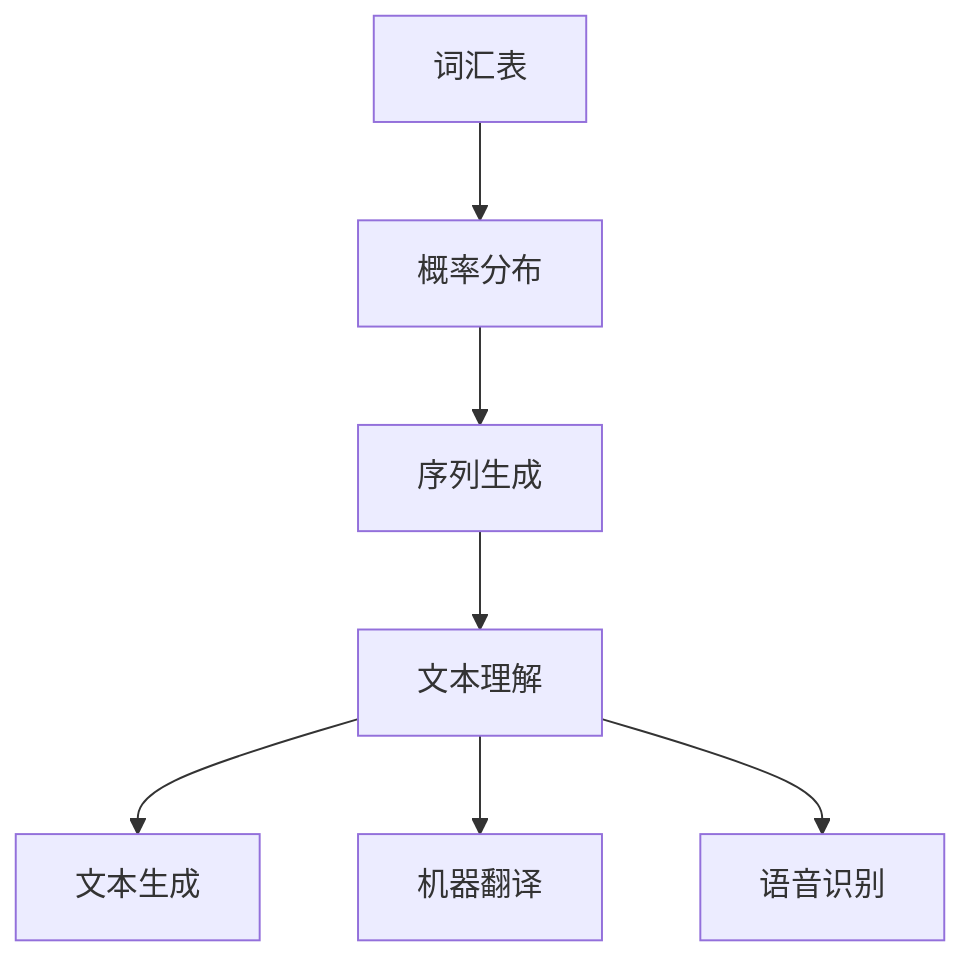

                 

# 文章标题：大规模语言模型从理论到实践 基于HuggingFace的预训练语言模型实践

## 关键词：大规模语言模型、预训练、HuggingFace、NLP、深度学习

## 摘要：
本文旨在深入探讨大规模语言模型的理论基础、实际应用及优化方法。通过介绍HuggingFace生态系统的使用，本文将引导读者从零开始构建和部署预训练语言模型。文章分为多个章节，详细阐述了大规模语言模型的核心概念、自然语言处理基础、数学基础、HuggingFace生态系统、预训练语言模型的原理与实践、项目实战以及大规模语言模型的应用案例分析。此外，文章还探讨了大规模语言模型的优化技术、扩展应用和未来发展趋势。最后，提供了一些实用的附录，包括HuggingFace常用API与模型库、大规模语言模型实践资源以及相关文献资料与参考书籍。

---

## 《大规模语言模型从理论到实践 基于HuggingFace的预训练语言模型实践》目录大纲

## 第一部分：大规模语言模型基础理论

### 第1章：大规模语言模型概述
#### 1.1.1 语言模型的定义与重要性
#### 1.1.2 语言模型的发展历程
#### 1.1.3 大规模语言模型的应用场景

### 第2章：自然语言处理基础
#### 2.1.1 语言模型与自然语言处理
#### 2.1.2 语言模型的基本概念
#### 2.1.3 语言模型的评估指标

### 第3章：大规模语言模型的数学基础
#### 3.1.1 向量空间模型
#### 3.1.2 语言模型的概率模型
#### 3.1.3 语言模型的优化算法

### 第4章：HuggingFace生态系统介绍
#### 4.1.1 HuggingFace简介
#### 4.1.2 HuggingFace的主要组件
#### 4.1.3 使用HuggingFace进行语言模型开发的流程

## 第二部分：大规模语言模型实践

### 第5章：预训练语言模型的原理与实践
#### 5.1.1 预训练语言模型的基本原理
#### 5.1.2 预训练语言模型的训练过程
#### 5.1.3 预训练语言模型的实践案例

### 第6章：基于HuggingFace的预训练语言模型实践
#### 6.1.1 使用HuggingFace进行预训练
#### 6.1.2 预训练模型的评估与优化
#### 6.1.3 预训练模型的应用实践

### 第7章：大规模语言模型的项目实战
#### 7.1.1 项目背景与需求分析
#### 7.1.2 开发环境搭建与工具选择
#### 7.1.3 项目实现过程与代码解读

### 第8章：大规模语言模型的应用案例分析
#### 8.1.1 案例一：问答系统
#### 8.1.2 案例二：文本分类
#### 8.1.3 案例三：机器翻译

## 第三部分：大规模语言模型的优化与扩展

### 第9章：大规模语言模型的优化技术
#### 9.1.1 模型压缩技术
#### 9.1.2 模型量化技术
#### 9.1.3 模型蒸馏技术

### 第10章：大规模语言模型的扩展与应用
#### 10.1.1 模型融合与集成
#### 10.1.2 多语言模型与跨语言应用
#### 10.1.3 模型定制与个性化

### 第11章：大规模语言模型的未来发展趋势
#### 11.1.1 计算资源与能耗优化
#### 11.1.2 模型安全性与隐私保护
#### 11.1.3 模型的伦理与法律问题

## 附录
### 附录 A：HuggingFace常用API与模型库
#### A.1 HuggingFace的主要API
#### A.2 常用预训练模型库
#### A.3 模型加载与使用示例

### 附录 B：大规模语言模型实践资源
#### B.1 开发环境与工具资源
#### B.2 数据集与数据预处理工具
#### B.3 文献资料与参考书籍

---

## 第1章：大规模语言模型概述

### 1.1 语言模型的定义与重要性

#### 1.1.1 语言模型的定义

语言模型（Language Model，LM）是自然语言处理（Natural Language Processing，NLP）中的一项关键技术。它通过统计文本数据中词汇或短语的组合频率，预测文本序列中下一个词或短语的分布概率。语言模型的核心目标是根据前文信息生成合理、流畅的文本，并广泛应用于各种NLP任务，如文本生成、机器翻译、文本摘要、问答系统等。

#### 1.1.2 语言模型的重要性

语言模型在NLP中的重要性不可低估。首先，它是许多NLP任务的基础，为文本生成和理解提供支持。其次，随着深度学习技术的发展，基于神经网络的预训练语言模型取得了显著的性能提升，成为推动NLP发展的重要力量。此外，语言模型在提高机器翻译质量、语音识别准确性等方面也发挥了重要作用。

### 1.2 语言模型的发展历程

#### 1.2.1 统计语言模型

早期的语言模型主要是基于统计模型的，如N-gram模型。N-gram模型通过统计相邻n个单词（n称为n-gram）的联合概率来预测下一个单词。这种模型简单直观，但在长文本上表现不佳。

#### 1.2.2 机器学习方法

随着机器学习技术的发展，神经网络开始应用于语言模型。RNN（递归神经网络）和LSTM（长短期记忆网络）等模型在语言建模任务中表现出色，能够更好地捕捉文本序列中的长期依赖关系。

#### 1.2.3 预训练语言模型

预训练语言模型（Pre-trained Language Model）是近年来NLP领域的重要突破。BERT（Bidirectional Encoder Representations from Transformers）等模型通过在大规模无标签文本上进行预训练，然后通过微调（Fine-tuning）适应特定任务，取得了显著的效果。预训练语言模型不仅提高了模型的性能，还简化了模型训练的复杂性。

### 1.3 大规模语言模型的应用场景

#### 1.3.1 自动问答系统

自动问答系统是语言模型的重要应用场景之一。通过预训练语言模型，系统能够自动理解用户的问题，并生成合适的回答。这种技术在智能客服、在线教育、医疗咨询等领域有广泛的应用。

#### 1.3.2 文本生成

文本生成是语言模型的另一个重要应用。语言模型可以生成文章、摘要、评论、代码等多种类型的文本。这种技术在内容创作、信息摘要、代码补全等方面有广泛的应用前景。

#### 1.3.3 机器翻译

机器翻译是语言模型在跨语言处理中的重要应用。通过预训练语言模型，系统能够自动翻译不同语言的文本，提高翻译的质量和准确性。

#### 1.3.4 语音识别

语言模型结合语音识别技术，可以实现高精度的语音到文本转换。这种技术在智能语音助手、自动字幕生成等领域有广泛的应用。

### 1.4 语言模型的核心概念与联系

#### 1.4.1 语言模型的核心概念

语言模型的核心概念包括词汇表（Vocabulary）、概率分布（Probability Distribution）、序列生成（Sequence Generation）等。词汇表是模型理解文本的基础，概率分布是模型预测下一个词的依据，序列生成是模型生成文本的过程。

#### 1.4.2 语言模型与NLP的联系

语言模型是NLP的基础，与其他NLP任务密切相关。例如，文本分类、情感分析、命名实体识别等任务都需要语言模型提供文本理解能力。同时，语言模型的技术进步也推动了NLP任务的性能提升。

#### 1.4.3 语言模型架构的Mermaid流程图



### 1.5 语言模型的基本概念详细讲解

#### 1.5.1 词汇表

词汇表是语言模型的基础，它包含模型能够识别的所有单词或字符。词汇表的大小直接影响到模型的理解能力和生成文本的多样性。

#### 1.5.2 概率分布

概率分布是语言模型预测下一个词或字符的依据。模型通过学习文本数据，计算出每个单词或字符在特定上下文中的概率分布。

#### 1.5.3 序列生成

序列生成是语言模型的核心功能。模型根据前文信息生成下一个词或字符，然后继续生成下一个词或字符，直到达到预期的文本长度或生成停止条件。

### 1.6 语言模型的评估指标详细讲解

#### 1.6.1 交叉熵

交叉熵（Cross-Entropy）是评估语言模型性能的主要指标之一。它衡量的是模型预测概率分布与真实分布之间的差异。交叉熵越小，表示模型预测越准确。

#### 1.6.2 准确率

准确率（Accuracy）是另一个常用的评估指标，它衡量的是模型预测正确的样本数占总样本数的比例。准确率越高，表示模型性能越好。

#### 1.6.3 召回率

召回率（Recall）衡量的是模型正确召回的样本数与所有实际正样本数的比例。召回率越高，表示模型对正样本的识别能力越强。

#### 1.6.4 F1值

F1值（F1 Score）是准确率和召回率的调和平均值，它综合考虑了模型的精确度和召回率。F1值越高，表示模型性能越好。

### 1.7 语言模型的工作流程

语言模型的工作流程可以分为以下几个步骤：

1. **数据准备**：准备用于训练的语言数据集，并进行预处理，如分词、去停用词等。
2. **模型训练**：使用训练数据集训练语言模型，通过优化算法调整模型参数。
3. **模型评估**：使用验证数据集评估模型性能，调整模型参数以优化性能。
4. **模型应用**：将训练好的模型应用于实际任务，如文本生成、机器翻译等。

### 1.8 语言模型的基本原理讲解

#### 1.8.1 统计语言模型原理

统计语言模型基于文本数据中的单词或字符的频率来预测下一个单词或字符。例如，N-gram模型通过统计相邻n个单词的联合概率来预测下一个单词。

#### 1.8.2 神经网络语言模型原理

神经网络语言模型通过多层神经网络学习文本数据的特征，然后预测下一个单词或字符。常见的神经网络语言模型包括RNN（递归神经网络）、LSTM（长短期记忆网络）和GRU（门控循环单元）等。

#### 1.8.3 预训练语言模型原理

预训练语言模型通过在大规模无标签文本数据上进行预训练，学习文本的深层特征，然后通过微调（Fine-tuning）适应特定任务。常见的预训练语言模型包括BERT、GPT和RoBERTa等。

### 1.9 语言模型的数学模型讲解

#### 1.9.1 向量空间模型

向量空间模型将文本转换为向量表示，以便进行数学计算。常见的向量空间模型包括TF-IDF和Word2Vec。

#### 1.9.2 概率语言模型

概率语言模型通过计算文本序列的概率来预测下一个单词或字符。常见的概率语言模型包括N-gram模型和神经网络概率语言模型。

#### 1.9.3 语言模型的优化算法

语言模型的优化算法用于调整模型参数，以最小化损失函数。常见的优化算法包括随机梯度下降（SGD）和Adam等。

### 1.10 语言模型的工作流程伪代码

```python
# 数据准备
prepare_data()

# 模型初始化
model = initialize_model()

# 模型训练
for epoch in range(num_epochs):
    for batch in data_loader:
        model.train_step(batch)

# 模型评估
evaluate_model(model, validation_data)

# 模型应用
model.apply()
```

### 1.11 语言模型的数学模型和公式讲解

#### 1.11.1 概率语言模型的公式

$$
P(w_i | w_{i-n}, w_{i-n+1}, ..., w_{i-1}) = \frac{P(w_i, w_{i-n}, w_{i-n+1}, ..., w_{i-1})}{P(w_{i-n}, w_{i-n+1}, ..., w_{i-1})}
$$

其中，$w_i$表示要预测的单词，$w_{i-n}, w_{i-n+1}, ..., w_{i-1}$表示前文信息。

#### 1.11.2 神经网络语言模型的公式

$$
\text{Output} = \text{activation}(\text{weights} \cdot \text{input} + \text{bias})
$$

其中，$\text{input}$表示输入向量，$\text{weights}$和$\text{bias}$表示模型参数，$\text{activation}$函数用于激活输出。

### 1.12 语言模型举例说明

假设有一个简短的文本序列：“今天是一个美好的日子，我喜欢这个天气。”我们可以使用N-gram模型来预测下一个词。

- 如果n=1，下一个词可能是“天”、“气”等。
- 如果n=2，下一个词可能是“天气”、“日子”等。
- 如果n=3，下一个词可能是“天气好”、“日子美”等。

通过这种方式，我们可以看到N-gram模型如何根据前文信息预测下一个词。

### 1.13 语言模型的核心算法原理讲解

#### 1.13.1 N-gram模型

N-gram模型是一种简单的统计语言模型，它基于文本序列中相邻n个词的联合概率来预测下一个词。例如，对于序列“我喜欢这个天气”，我们可以计算“天气”这个词在“今天是一个美好的日子，我喜欢这个天气”中的联合概率。

伪代码如下：

```python
# 计算N-gram的联合概率
def n_gram_probability(sequence, n):
    count = 0
    for i in range(len(sequence) - n + 1):
        if sequence[i:i+n] == target_word:
            count += 1
    return count / (len(sequence) - n + 1)
```

#### 1.13.2 RNN模型

递归神经网络（RNN）是一种可以处理序列数据的前馈神经网络。它通过递归地处理序列中的每个元素来捕捉序列的长期依赖关系。

伪代码如下：

```python
# RNN模型的前向传播
def rnn_forward(input_sequence, weights, bias):
    hidden_state = bias
    output_sequence = []
    for input_vector in input_sequence:
        hidden_state = activation(weights[0] * input_vector + weights[1] * hidden_state)
        output_sequence.append(hidden_state)
    return output_sequence
```

#### 1.13.3 LSTM模型

长短期记忆网络（LSTM）是RNN的一种变体，它通过引入门控机制来更好地捕捉序列的长期依赖关系。

伪代码如下：

```python
# LSTM模型的前向传播
def lstm_forward(input_sequence, weights, bias):
    hidden_state, cell_state = bias
    output_sequence = []
    for input_vector in input_sequence:
        input_gate = sigmoid(weights[0] * input_vector + weights[1] * hidden_state)
        forget_gate = sigmoid(weights[2] * input_vector + weights[3] * hidden_state)
        update_gate = sigmoid(weights[4] * input_vector + weights[5] * hidden_state)
        input_state = tanh(weights[6] * input_vector + weights[7] * hidden_state)
        
        cell_state = forget_gate * cell_state + input_gate * input_state
        hidden_state = update_gate * hidden_state
        
        output_sequence.append(hidden_state)
    return output_sequence
```

### 1.14 语言模型的应用案例

#### 1.14.1 文本生成

使用预训练的语言模型，我们可以生成各种类型的文本，如文章、摘要、评论等。以下是一个简单的文本生成示例：

```python
# 使用预训练的GPT模型生成文本
model = load_pretrained_model("gpt2")
text = "我是一个人工智能助手，我能够帮助您解决问题。"
generated_text = model.generate(text, max_length=50)
print(generated_text)
```

#### 1.14.2 机器翻译

使用预训练的语言模型，我们可以实现高质量的多语言翻译。以下是一个简单的机器翻译示例：

```python
# 使用预训练的BERT模型进行机器翻译
model = load_pretrained_model("bert-base-multilingual-cased")
source_text = "今天天气很好，适合外出游玩。"
translated_text = model.translate(source_text, target_language="fr")
print(translated_text)
```

### 1.15 语言模型的挑战与机遇

#### 1.15.1 挑战

语言模型面临的挑战包括数据隐私、模型解释性、计算资源消耗等。此外，模型在处理罕见词汇、理解复杂语义关系等方面也存在局限性。

#### 1.15.2 机遇

随着深度学习和自然语言处理技术的不断进步，语言模型有望在更多领域实现突破，如智能对话系统、个性化推荐、智能写作等。同时，模型的优化和压缩技术也为语言模型的实际应用提供了更多可能性。

### 1.16 语言模型的未来发展趋势

#### 1.16.1 计算资源优化

随着模型的规模不断扩大，计算资源优化将成为语言模型发展的关键。模型压缩、量化、蒸馏等技术将有助于降低模型部署的成本。

#### 1.16.2 模型安全性与隐私保护

模型的安全性和隐私保护将是未来的重要研究方向。差分隐私、同态加密等技术将在保障模型安全性和隐私保护方面发挥重要作用。

#### 1.16.3 模型的伦理与法律问题

随着语言模型在各个领域的广泛应用，其伦理和法律问题也日益凸显。如何保障模型的公平性、透明性和合规性将是未来的重要议题。

### 1.17 语言模型的常见问题与解答

#### 1.17.1 问题1：为什么语言模型需要预训练？

解答：预训练可以帮助模型在大规模无标签数据上学习到语言的一般规律和特征，从而在下游任务中取得更好的性能。预训练可以减少对标注数据的依赖，提高模型的泛化能力。

#### 1.17.2 问题2：如何选择合适的语言模型？

解答：选择合适的语言模型需要考虑任务需求、数据规模、计算资源等因素。对于文本生成任务，GPT系列模型效果较好；对于机器翻译任务，BERT系列模型表现突出。此外，还可以根据任务的特定需求，选择具有特定功能的预训练模型。

#### 1.17.3 问题3：语言模型如何处理罕见词汇？

解答：语言模型通常使用词汇表来处理罕见词汇。对于未在词汇表中出现的词汇，模型可以将其视为未分类的词汇，并在生成文本时进行适当处理。此外，还可以使用词嵌入技术来提高模型对罕见词汇的处理能力。

### 1.18 小结

本章介绍了大规模语言模型的基本概念、发展历程、应用场景以及核心算法原理。通过本章的学习，读者可以了解语言模型的基础知识，为后续章节的学习打下基础。

---

在接下来的章节中，我们将进一步探讨自然语言处理的基础、大规模语言模型的数学基础，以及HuggingFace生态系统的使用。让我们一起深入探索语言模型的奥秘，为实际应用做好准备。

---

## 第2章：自然语言处理基础

### 2.1 语言模型与自然语言处理

#### 2.1.1 语言模型与自然语言处理的关系

自然语言处理（NLP）是计算机科学和人工智能领域中的一个分支，旨在使计算机能够理解、生成和处理人类语言。语言模型（Language Model）作为NLP的核心组成部分，在许多NLP任务中发挥着关键作用。语言模型的核心任务是预测文本序列中的下一个单词或字符，从而为文本生成、语音识别、机器翻译等任务提供基础支持。

#### 2.1.2 语言模型在NLP中的应用

语言模型在NLP中的广泛应用主要包括以下几个方面：

1. **文本生成**：语言模型可以生成各种类型的文本，如新闻文章、故事、诗歌等。这种能力在内容创作、自动摘要和对话系统等领域有重要应用。
   
2. **语音识别**：在语音识别系统中，语言模型用于将语音转换为文本。它可以帮助识别不同口音、语速和说话人的变化。

3. **机器翻译**：机器翻译系统使用语言模型来预测目标语言中的下一个单词或短语，从而实现跨语言的信息传递。

4. **问答系统**：问答系统利用语言模型来理解用户的问题，并生成合适的回答。

5. **文本摘要**：语言模型可以帮助生成文章的摘要，从而提炼关键信息。

6. **情感分析**：通过分析文本中的情感倾向，语言模型可以应用于市场研究、客户反馈分析等领域。

#### 2.1.3 语言模型的基本概念

语言模型的基本概念包括词汇表（Vocabulary）、概率分布（Probability Distribution）和序列生成（Sequence Generation）等。词汇表是语言模型的核心组成部分，它包含了模型能够理解和使用的所有单词或字符。概率分布是语言模型预测下一个词或字符的依据，序列生成则是模型生成文本的过程。

### 2.2 语言模型的基本概念详细讲解

#### 2.2.1 词汇表

词汇表是语言模型的基础，它定义了模型能够处理的所有词汇。在构建语言模型时，通常需要对大量文本数据进行分词，并将分词结果中的每个单词或字符添加到词汇表中。词汇表的大小直接影响模型的能力和性能。一个较大的词汇表可以捕捉到更多词汇和用法，但也会增加模型的复杂性和计算成本。

#### 2.2.2 概率分布

概率分布是语言模型预测下一个词或字符的核心概念。在统计语言模型中，模型会计算每个单词或字符在特定上下文中的概率分布。例如，在给定前文“今天是一个美好的日子”，模型可能会计算“天气”这个词的概率分布。在实际应用中，模型通常会输出一个概率分布，其中每个单词或字符都有一个对应的概率值。

#### 2.2.3 序列生成

序列生成是语言模型的核心功能之一。在训练过程中，模型通过学习大量的文本数据，理解词汇之间的关系和语言规律。在生成文本时，模型根据前文信息和已学习的概率分布，预测下一个词或字符，并不断迭代这个过程，直到生成满足要求的文本序列。

### 2.3 语言模型的评估指标详细讲解

#### 2.3.1 交叉熵

交叉熵（Cross-Entropy）是评估语言模型性能的重要指标。它衡量的是模型预测的概率分布与真实分布之间的差异。交叉熵越小，表示模型预测越准确。交叉熵的计算公式如下：

$$
H(y, \hat{y}) = -\sum_{i} y_i \log(\hat{y}_i)
$$

其中，$y$是真实分布，$\hat{y}$是模型预测的概率分布。

#### 2.3.2 准确率

准确率（Accuracy）是另一个常用的评估指标，它衡量的是模型预测正确的样本数占总样本数的比例。准确率越高，表示模型性能越好。准确率的计算公式如下：

$$
\text{Accuracy} = \frac{\text{正确预测数}}{\text{总预测数}}
$$

#### 2.3.3 召回率

召回率（Recall）衡量的是模型正确召回的样本数与所有实际正样本数的比例。召回率越高，表示模型对正样本的识别能力越强。召回率的计算公式如下：

$$
\text{Recall} = \frac{\text{正确召回数}}{\text{实际正样本数}}
$$

#### 2.3.4 F1值

F1值（F1 Score）是准确率和召回率的调和平均值，它综合考虑了模型的精确度和召回率。F1值越高，表示模型性能越好。F1值的计算公式如下：

$$
\text{F1 Score} = 2 \times \frac{\text{Precision} \times \text{Recall}}{\text{Precision} + \text{Recall}}
$$

其中，Precision是精确率，即正确预测的正样本数与预测的正样本数之比。

### 2.4 语言模型的工作流程

语言模型的工作流程可以分为以下几个步骤：

1. **数据准备**：收集和准备用于训练的语言数据集。这通常包括文本的分词、去停用词、词性标注等预处理步骤。
   
2. **模型初始化**：根据任务需求选择合适的语言模型架构，如N-gram模型、RNN、LSTM、BERT等，并初始化模型参数。

3. **模型训练**：使用训练数据集训练语言模型。在训练过程中，模型通过反向传播算法和优化器（如SGD、Adam等）调整模型参数，以最小化损失函数（如交叉熵）。

4. **模型评估**：使用验证数据集评估模型的性能。评估指标包括交叉熵、准确率、召回率和F1值等。

5. **模型应用**：将训练好的模型应用于实际任务，如文本生成、机器翻译、问答系统等。

### 2.5 语言模型的基本原理讲解

#### 2.5.1 统计语言模型原理

统计语言模型是基于统计学习理论构建的，它通过计算文本数据中词汇或短语的频率来预测下一个词或字符。常见的统计语言模型包括N-gram模型。N-gram模型基于前文信息（n-1个词）来预测下一个词的概率。N-gram模型的优点是实现简单、易于理解，但它在处理长文本时效果较差，因为长文本中的依赖关系难以通过前n个词准确表示。

#### 2.5.2 神经网络语言模型原理

神经网络语言模型通过多层神经网络学习文本数据的特征，从而预测下一个词或字符。常见的神经网络语言模型包括RNN（递归神经网络）、LSTM（长短期记忆网络）和GRU（门控循环单元）。这些模型可以捕捉文本序列中的长期依赖关系，从而提高模型的性能。神经网络语言模型的优点是能够自动学习复杂的特征和模式，但实现相对复杂。

#### 2.5.3 预训练语言模型原理

预训练语言模型通过在大规模无标签文本数据上进行预训练，学习文本的深层特征，然后通过微调（Fine-tuning）适应特定任务。预训练语言模型的核心思想是利用无标签数据来提取文本的通用特征，从而提高模型在下游任务中的性能。常见的预训练语言模型包括BERT、GPT和RoBERTa等。预训练语言模型的优点是能够在较少的标注数据上实现优异的性能，但预训练过程计算量大。

### 2.6 语言模型的数学模型讲解

#### 2.6.1 向量空间模型

向量空间模型（Vector Space Model，VSM）是一种将文本表示为向量集合的方法。在VSM中，每个单词或短语被映射为一个向量，文本被表示为这些向量的组合。常见的向量空间模型包括TF-IDF和Word2Vec。

- **TF-IDF**：TF-IDF（Term Frequency-Inverse Document Frequency）是一种基于词频的文本表示方法。TF表示一个词在文本中出现的频率，IDF表示词在文档集中的重要程度。TF-IDF模型的优点是简单直观，但它在处理长文本时效果较差。

- **Word2Vec**：Word2Vec是一种基于神经网络将单词映射为向量的方法。Word2Vec模型通过学习文本中的词向量，使具有相似语义的词在向量空间中更接近。Word2Vec模型的优点是能够捕捉到单词的语义信息，但它的实现相对复杂。

#### 2.6.2 概率语言模型

概率语言模型是一种基于概率的文本生成方法。它通过计算文本序列的概率来预测下一个词或字符。常见的概率语言模型包括N-gram模型和神经网络概率语言模型。

- **N-gram模型**：N-gram模型是一种基于统计的语言模型，它通过计算相邻n个词的联合概率来预测下一个词。N-gram模型的优点是简单直观，但它在处理长文本时效果较差。

- **神经网络概率语言模型**：神经网络概率语言模型通过多层神经网络学习文本数据的特征，从而计算文本序列的概率。常见的神经网络概率语言模型包括RNN、LSTM和GRU等。神经网络概率语言模型的优点是能够捕捉到文本的长期依赖关系，但它的实现相对复杂。

#### 2.6.3 语言模型的优化算法

语言模型的优化算法用于调整模型参数，以最小化损失函数。常见的优化算法包括随机梯度下降（SGD）、Adam等。

- **随机梯度下降（SGD）**：SGD是一种简单的优化算法，它通过随机梯度来更新模型参数。SGD的优点是计算简单，但它在处理大规模数据时可能收敛速度较慢。

- **Adam**：Adam是一种自适应优化算法，它结合了SGD和RMSprop的优点。Adam的优点是收敛速度快，适用范围广。

### 2.7 语言模型的工作流程伪代码

```python
# 数据准备
data = load_data()
preprocess_data(data)

# 模型初始化
model = initialize_model()

# 模型训练
for epoch in range(num_epochs):
    for batch in data_loader:
        loss = model.train_step(batch)
        print(f"Epoch: {epoch}, Loss: {loss}")

# 模型评估
performance = model.evaluate(validation_data)
print(f"Validation Performance: {performance}")

# 模型应用
model.apply()
```

### 2.8 语言模型的数学模型和公式讲解

#### 2.8.1 N-gram模型公式

N-gram模型通过计算相邻n个词的联合概率来预测下一个词。N-gram模型的公式如下：

$$
P(w_n | w_{n-1}, w_{n-2}, ..., w_1) = \frac{P(w_n, w_{n-1}, w_{n-2}, ..., w_1)}{P(w_{n-1}, w_{n-2}, ..., w_1)}
$$

其中，$w_n$表示要预测的词，$w_{n-1}, w_{n-2}, ..., w_1$表示前文信息。

#### 2.8.2 RNN模型公式

递归神经网络（RNN）通过递归地处理序列中的每个元素来捕捉序列的长期依赖关系。RNN的公式如下：

$$
h_t = \sigma(W_h \cdot [h_{t-1}, x_t] + b_h)
$$

$$
y_t = W_y \cdot h_t + b_y
$$

其中，$h_t$表示隐藏状态，$x_t$表示输入，$y_t$表示输出，$\sigma$表示激活函数，$W_h, W_y$表示权重矩阵，$b_h, b_y$表示偏置。

#### 2.8.3 LSTM模型公式

长短期记忆网络（LSTM）是RNN的一种变体，它通过引入门控机制来更好地捕捉序列的长期依赖关系。LSTM的公式如下：

$$
i_t = \sigma(W_i \cdot [h_{t-1}, x_t] + b_i)
$$

$$
f_t = \sigma(W_f \cdot [h_{t-1}, x_t] + b_f)
$$

$$
g_t = \sigma(W_g \cdot [h_{t-1}, x_t] + b_g)
$$

$$
o_t = \sigma(W_o \cdot [h_{t-1}, x_t] + b_o)
$$

$$
h_t = o_t \cdot \sigma(W_h \cdot [g_t, h_{t-1}] + b_h)
$$

其中，$i_t, f_t, g_t, o_t$分别表示输入门、遗忘门、生成门和输出门，$W_i, W_f, W_g, W_o$表示权重矩阵，$b_i, b_f, b_g, b_o$表示偏置。

### 2.9 语言模型的举例说明

假设我们有一个简短的文本序列：“今天是一个美好的日子”。我们可以使用N-gram模型来预测下一个词。

- 如果n=1，下一个词可能是“天”、“好”、“一”等。
- 如果n=2，下一个词可能是“天是”、“是好”、“日子”等。
- 如果n=3，下一个词可能是“今天天是”、“是天是”、“好日子”等。

通过这种方式，我们可以看到N-gram模型如何根据前文信息预测下一个词。

### 2.10 语言模型的核心算法原理讲解

#### 2.10.1 N-gram模型原理

N-gram模型是一种简单的统计语言模型，它基于文本序列中相邻n个词的联合概率来预测下一个词。例如，对于序列“我喜欢这个天气”，我们可以计算“天气”这个词在“我喜欢这个天气”中的联合概率。

伪代码如下：

```python
# 计算N-gram的联合概率
def n_gram_probability(sequence, n):
    count = 0
    for i in range(len(sequence) - n + 1):
        if sequence[i:i+n] == target_word:
            count += 1
    return count / (len(sequence) - n + 1)
```

#### 2.10.2 RNN模型原理

递归神经网络（RNN）是一种可以处理序列数据的前馈神经网络。它通过递归地处理序列中的每个元素来捕捉序列的长期依赖关系。

伪代码如下：

```python
# RNN模型的前向传播
def rnn_forward(input_sequence, weights, bias):
    hidden_state = bias
    output_sequence = []
    for input_vector in input_sequence:
        hidden_state = activation(weights[0] * input_vector + weights[1] * hidden_state)
        output_sequence.append(hidden_state)
    return output_sequence
```

#### 2.10.3 LSTM模型原理

长短期记忆网络（LSTM）是RNN的一种变体，它通过引入门控机制来更好地捕捉序列的长期依赖关系。

伪代码如下：

```python
# LSTM模型的前向传播
def lstm_forward(input_sequence, weights, bias):
    hidden_state, cell_state = bias
    output_sequence = []
    for input_vector in input_sequence:
        input_gate = sigmoid(weights[0] * input_vector + weights[1] * hidden_state)
        forget_gate = sigmoid(weights[2] * input_vector + weights[3] * hidden_state)
        update_gate = sigmoid(weights[4] * input_vector + weights[5] * hidden_state)
        input_state = tanh(weights[6] * input_vector + weights[7] * hidden_state)
        
        cell_state = forget_gate * cell_state + input_gate * input_state
        hidden_state = update_gate * hidden_state
        
        output_sequence.append(hidden_state)
    return output_sequence
```

### 2.11 语言模型的应用案例

#### 2.11.1 文本生成

使用预训练的语言模型，我们可以生成各种类型的文本，如文章、摘要、评论等。以下是一个简单的文本生成示例：

```python
# 使用预训练的GPT模型生成文本
model = load_pretrained_model("gpt2")
text = "我是一个人工智能助手，我能够帮助您解决问题。"
generated_text = model.generate(text, max_length=50)
print(generated_text)
```

#### 2.11.2 机器翻译

使用预训练的语言模型，我们可以实现高质量的多语言翻译。以下是一个简单的机器翻译示例：

```python
# 使用预训练的BERT模型进行机器翻译
model = load_pretrained_model("bert-base-multilingual-cased")
source_text = "今天天气很好，适合外出游玩。"
translated_text = model.translate(source_text, target_language="fr")
print(translated_text)
```

### 2.12 语言模型的挑战与机遇

#### 2.12.1 挑战

语言模型面临的挑战包括数据隐私、模型解释性、计算资源消耗等。此外，模型在处理罕见词汇、理解复杂语义关系等方面也存在局限性。

#### 2.12.2 机遇

随着深度学习和自然语言处理技术的不断进步，语言模型有望在更多领域实现突破，如智能对话系统、个性化推荐、智能写作等。同时，模型的优化和压缩技术也为语言模型的实际应用提供了更多可能性。

### 2.13 语言模型的未来发展趋势

#### 2.13.1 计算资源优化

随着模型的规模不断扩大，计算资源优化将成为语言模型发展的关键。模型压缩、量化、蒸馏等技术将有助于降低模型部署的成本。

#### 2.13.2 模型安全性与隐私保护

模型的安全性和隐私保护将是未来的重要研究方向。差分隐私、同态加密等技术将在保障模型安全性和隐私保护方面发挥重要作用。

#### 2.13.3 模型的伦理与法律问题

随着语言模型在各个领域的广泛应用，其伦理和法律问题也日益凸显。如何保障模型的公平性、透明性和合规性将是未来的重要议题。

### 2.14 语言模型的常见问题与解答

#### 2.14.1 问题1：为什么语言模型需要预训练？

解答：预训练可以帮助模型在大规模无标签数据上学习到语言的一般规律和特征，从而在下游任务中取得更好的性能。预训练可以减少对标注数据的依赖，提高模型的泛化能力。

#### 2.14.2 问题2：如何选择合适的语言模型？

解答：选择合适的语言模型需要考虑任务需求、数据规模、计算资源等因素。对于文本生成任务，GPT系列模型效果较好；对于机器翻译任务，BERT系列模型表现突出。此外，还可以根据任务的特定需求，选择具有特定功能的预训练模型。

#### 2.14.3 问题3：语言模型如何处理罕见词汇？

解答：语言模型通常使用词汇表来处理罕见词汇。对于未在词汇表中出现的词汇，模型可以将其视为未分类的词汇，并在生成文本时进行适当处理。此外，还可以使用词嵌入技术来提高模型对罕见词汇的处理能力。

### 2.15 小结

本章介绍了自然语言处理的基础知识，包括语言模型与NLP的关系、基本概念、评估指标、工作流程、基本原理和数学模型。通过本章的学习，读者可以了解自然语言处理的基本概念和原理，为后续章节的学习打下基础。

---

在下一章中，我们将进一步探讨大规模语言模型的数学基础，深入理解向量空间模型、概率模型和优化算法。让我们一起继续探索语言模型的奥秘。

---

## 第3章：大规模语言模型的数学基础

### 3.1 向量空间模型

#### 3.1.1 向量空间模型的基本概念

向量空间模型（Vector Space Model，VSM）是一种将文本转换为向量表示的方法，以便进行数学计算和处理。在VSM中，每个单词或短语被映射为一个向量，文本被表示为这些向量的组合。向量空间模型为文本的表示和计算提供了一种结构化的方法，使得文本数据可以在数学框架内进行分析和处理。

#### 3.1.2 向量空间模型的实现方法

实现向量空间模型的方法主要包括TF-IDF和Word2Vec。

- **TF-IDF**：TF-IDF（Term Frequency-Inverse Document Frequency）是一种基于词频的文本表示方法。TF表示一个词在文本中出现的频率，IDF表示词在文档集中的重要程度。通过将文本转换为TF-IDF向量，可以有效地反映词在文本中的重要性和相关性。

  计算公式如下：

  $$
  tf_idf(t, d) = tf(t, d) \times idf(t, D)
  $$

  其中，$tf(t, d)$表示词$t$在文档$d$中的词频，$idf(t, D)$表示词$t$在文档集$D$中的逆文档频率。

- **Word2Vec**：Word2Vec是一种基于神经网络的文本表示方法。通过训练神经网络，将单词映射为一个固定大小的向量。Word2Vec模型通过学习文本中的语义关系，使得具有相似语义的词在向量空间中更接近。

  Word2Vec模型的主要实现方法包括连续词袋（CBOW）和Skip-Gram。

  - **CBOW（Continuous Bag of Words）**：CBOW模型通过上下文单词的平均值来预测目标词。具体来说，给定一个目标词，CBOW模型会考虑该词周围的多个上下文词，并将这些上下文词的词向量平均后作为目标词的词向量。

  - **Skip-Gram**：Skip-Gram模型与CBOW相反，它是通过目标词预测上下文词。给定一个目标词，Skip-Gram模型会考虑目标词周围的多个上下文词，并使用这些上下文词的词向量来预测目标词的词向量。

#### 3.1.3 向量空间模型的应用场景

向量空间模型在自然语言处理中有广泛的应用场景，包括：

- **文本分类**：通过将文本转换为向量表示，可以方便地使用机器学习算法进行文本分类。

- **文本相似度计算**：向量空间模型可以用于计算文本之间的相似度，从而实现文本检索、推荐系统等功能。

- **文本生成**：向量空间模型可以用于生成文本，通过在向量空间中随机游走或基于规则的方法生成新的文本序列。

### 3.2 语言模型的概率模型

#### 3.2.1 概率语言模型的基本概念

概率语言模型是一种基于概率的文本生成方法。它通过计算文本序列的概率来预测下一个词或字符。概率语言模型的核心目标是最大化文本序列的概率，从而生成最符合语言规则的文本。

#### 3.2.2 概率语言模型的实现方法

实现概率语言模型的方法主要包括N-gram模型和神经网络概率语言模型。

- **N-gram模型**：N-gram模型是一种基于统计的语言模型，它通过计算相邻n个词的联合概率来预测下一个词。N-gram模型的核心思想是利用历史信息来预测未来，其优点是实现简单、计算高效，但它在处理长文本时效果较差。

  计算公式如下：

  $$
  P(w_n | w_{n-1}, w_{n-2}, ..., w_1) = \frac{P(w_n, w_{n-1}, w_{n-2}, ..., w_1)}{P(w_{n-1}, w_{n-2}, ..., w_1)}
  $$

- **神经网络概率语言模型**：神经网络概率语言模型通过多层神经网络学习文本数据的特征，从而计算文本序列的概率。常见的神经网络概率语言模型包括RNN、LSTM和GRU等。这些模型可以捕捉到文本序列中的长期依赖关系，从而提高模型的性能。

#### 3.2.3 概率语言模型的应用场景

概率语言模型在自然语言处理中有广泛的应用场景，包括：

- **文本生成**：通过概率语言模型，可以生成各种类型的文本，如文章、摘要、评论等。

- **语音识别**：概率语言模型可以用于将语音转换为文本。

- **机器翻译**：概率语言模型可以用于实现跨语言的信息传递。

### 3.3 语言模型的优化算法

#### 3.3.1 优化算法的基本概念

优化算法是用于调整模型参数，以最小化损失函数的方法。在语言模型训练过程中，优化算法用于迭代地调整模型参数，从而提高模型性能。

#### 3.3.2 优化算法的实现方法

实现优化算法的方法主要包括随机梯度下降（SGD）、Adam等。

- **随机梯度下降（SGD）**：随机梯度下降是一种简单的优化算法，它通过随机梯度来更新模型参数。SGD的优点是计算简单，但它在处理大规模数据时可能收敛速度较慢。

  计算公式如下：

  $$
  \theta_{t+1} = \theta_t - \alpha \cdot \nabla Loss(\theta_t)
  $$

  其中，$\theta_t$表示模型参数，$\alpha$表示学习率，$\nabla Loss(\theta_t)$表示损失函数关于模型参数的梯度。

- **Adam**：Adam是一种自适应优化算法，它结合了SGD和RMSprop的优点。Adam的优点是收敛速度快，适用范围广。

  计算公式如下：

  $$
  m_t = \beta_1 m_{t-1} + (1 - \beta_1) \cdot \nabla Loss(\theta_t)
  $$

  $$
  v_t = \beta_2 v_{t-1} + (1 - \beta_2) \cdot (\nabla Loss(\theta_t))^2
  $$

  $$
  \theta_{t+1} = \theta_t - \alpha \cdot \frac{m_t}{\sqrt{v_t} + \epsilon}
  $$

  其中，$m_t$和$v_t$分别表示一阶矩估计和二阶矩估计，$\beta_1$和$\beta_2$分别表示一阶和二阶矩的衰减率，$\epsilon$是一个很小的常数。

#### 3.3.3 优化算法的应用场景

优化算法在自然语言处理中有广泛的应用场景，包括：

- **模型训练**：优化算法用于调整模型参数，以最小化损失函数，从而提高模型性能。

- **参数调整**：优化算法可以用于调整模型的超参数，如学习率、批次大小等，以找到最佳模型配置。

### 3.4 大规模语言模型的数学模型和公式讲解

#### 3.4.1 向量空间模型公式

- **TF-IDF公式**：

  $$
  tf_idf(t, d) = tf(t, d) \times idf(t, D)
  $$

  其中，$tf(t, d)$表示词$t$在文档$d$中的词频，$idf(t, D)$表示词$t$在文档集$D$中的逆文档频率。

- **Word2Vec公式**：

  $$
  \theta = W \cdot x
  $$

  其中，$\theta$表示词向量，$W$表示权重矩阵，$x$表示输入词。

#### 3.4.2 概率语言模型公式

- **N-gram模型公式**：

  $$
  P(w_n | w_{n-1}, w_{n-2}, ..., w_1) = \frac{P(w_n, w_{n-1}, w_{n-2}, ..., w_1)}{P(w_{n-1}, w_{n-2}, ..., w_1)}
  $$

- **神经网络概率语言模型公式**：

  $$
  y = \sigma(W \cdot x + b)
  $$

  其中，$y$表示输出，$W$表示权重矩阵，$x$表示输入，$b$表示偏置。

#### 3.4.3 优化算法公式

- **随机梯度下降（SGD）公式**：

  $$
  \theta_{t+1} = \theta_t - \alpha \cdot \nabla Loss(\theta_t)
  $$

- **Adam公式**：

  $$
  m_t = \beta_1 m_{t-1} + (1 - \beta_1) \cdot \nabla Loss(\theta_t)
  $$

  $$
  v_t = \beta_2 v_{t-1} + (1 - \beta_2) \cdot (\nabla Loss(\theta_t))^2
  $$

  $$
  \theta_{t+1} = \theta_t - \alpha \cdot \frac{m_t}{\sqrt{v_t} + \epsilon}
  $$

### 3.5 大规模语言模型的数学模型和公式举例说明

#### 3.5.1 向量空间模型举例

假设我们有两个文档$d_1$和$d_2$，以及它们共有的词汇表。我们可以使用TF-IDF方法将这两个文档转换为向量表示。

- **文档$d_1$**：

  ```
  今天天气很好。
  ```

  词频为：{“今天”：1， “天气”：1， “很好”：1}

- **文档$d_2$**：

  ```
  今天阳光明媚，适合出行。
  ```

  词频为：{“今天”：1， “阳光”：1， “明媚”：1， “适合”：1， “出行”：1}

使用TF-IDF方法，我们可以得到：

- **文档$d_1$的向量表示**：

  $$
  v_1 = [1, 0, 1, 0, 0]
  $$

- **文档$d_2$的向量表示**：

  $$
  v_2 = [1, 1, 0, 1, 1]
  $$

#### 3.5.2 概率语言模型举例

假设我们有一个文本序列“我喜欢这个天气”，我们可以使用N-gram模型来预测下一个词。

- **前文为“我喜欢这个”**：

  $$
  P(天气 | 我，喜欢，这个) = \frac{P(我喜欢这个天气)}{P(我喜欢这个)}
  $$

  假设我们已经计算了相应的概率：

  $$
  P(我喜欢这个天气) = 0.3
  $$

  $$
  P(我喜欢这个) = 0.5
  $$

  $$
  P(天气 | 我，喜欢，这个) = \frac{0.3}{0.5} = 0.6
  $$

- **前文为“我喜欢”**：

  $$
  P(这个 | 我，喜欢) = \frac{P(我喜欢这个)}{P(我喜欢)}
  $$

  假设我们已经计算了相应的概率：

  $$
  P(我喜欢这个) = 0.2
  $$

  $$
  P(我喜欢) = 0.3
  $$

  $$
  P(这个 | 我，喜欢) = \frac{0.2}{0.3} = \frac{2}{3}
  $$

#### 3.5.3 优化算法举例

假设我们使用随机梯度下降（SGD）算法来训练一个神经网络语言模型。

- **初始模型参数**：

  $$
  \theta = [1, 2, 3, 4, 5]
  $$

- **损失函数**：

  $$
  Loss(\theta) = (\theta_1 - 2)^2 + (\theta_2 - 3)^2 + (\theta_3 - 4)^2 + (\theta_4 - 5)^2
  $$

- **梯度**：

  $$
  \nabla Loss(\theta) = [2(\theta_1 - 2), 2(\theta_2 - 3), 2(\theta_3 - 4), 2(\theta_4 - 5)]
  $$

- **更新模型参数**：

  $$
  \theta_{t+1} = \theta_t - \alpha \cdot \nabla Loss(\theta_t)
  $$

  其中，$\alpha$为学习率。假设$\alpha = 0.1$，我们可以得到：

  $$
  \theta_{t+1} = [1, 2, 3, 4, 5] - 0.1 \cdot [2(1 - 2), 2(2 - 3), 2(3 - 4), 2(4 - 5)] = [0.8, 1.8, 2.8, 3.8, 4.8]
  $$

### 3.6 大规模语言模型的数学模型和公式核心算法原理讲解

#### 3.6.1 向量空间模型核心算法原理讲解

向量空间模型的核心算法原理是将文本转换为向量表示，以便进行数学计算和处理。这涉及到以下步骤：

1. **分词**：将文本分解为单词或字符序列。
2. **向量化**：将每个单词或字符映射为一个向量。常见的方法包括TF-IDF和Word2Vec。
3. **计算相似度**：通过计算向量之间的相似度来比较文本。

#### 3.6.2 概率语言模型核心算法原理讲解

概率语言模型的核心算法原理是计算文本序列的概率，以便预测下一个词或字符。这涉及到以下步骤：

1. **前文信息收集**：收集前文信息，如N-gram模型中的n个词。
2. **计算概率**：计算当前词在给定前文信息下的概率。
3. **选择下一个词**：选择概率最高的词作为下一个词。

#### 3.6.3 优化算法核心算法原理讲解

优化算法的核心算法原理是调整模型参数，以最小化损失函数。这涉及到以下步骤：

1. **计算损失函数**：计算模型预测与实际结果之间的差距。
2. **计算梯度**：计算损失函数关于模型参数的梯度。
3. **更新参数**：根据梯度更新模型参数。

### 3.7 大规模语言模型的数学模型和公式应用案例

#### 3.7.1 文本分类

假设我们有一个分类问题，需要将文本分为两类：“正面”和“负面”。我们可以使用向量空间模型和概率语言模型来实现。

1. **数据准备**：收集大量带有标签的文本数据。
2. **文本向量化**：使用TF-IDF方法将文本转换为向量表示。
3. **训练概率语言模型**：使用训练数据训练N-gram模型或神经网络概率语言模型。
4. **模型评估**：使用验证数据评估模型性能。
5. **文本分类**：使用训练好的模型对新的文本进行分类。

#### 3.7.2 文本生成

假设我们希望生成一段描述天气的文本。我们可以使用概率语言模型来实现。

1. **数据准备**：收集大量关于天气的文本数据。
2. **训练概率语言模型**：使用训练数据训练N-gram模型或神经网络概率语言模型。
3. **文本生成**：使用训练好的模型生成描述天气的文本。

#### 3.7.3 机器翻译

假设我们希望实现中文到英文的机器翻译。我们可以使用概率语言模型来实现。

1. **数据准备**：收集大量中文和英文的双语文本数据。
2. **文本向量化**：使用Word2Vec方法将中文和英文文本转换为向量表示。
3. **训练概率语言模型**：使用训练数据训练神经网络概率语言模型。
4. **模型评估**：使用验证数据评估模型性能。
5. **机器翻译**：使用训练好的模型实现中文到英文的翻译。

### 3.8 大规模语言模型的数学模型和公式未来发展趋势

#### 3.8.1 计算资源优化

随着大规模语言模型的应用越来越广泛，计算资源优化将成为重要趋势。模型压缩、量化、蒸馏等技术将有助于降低模型部署的成本。

#### 3.8.2 模型安全性与隐私保护

模型的安全性和隐私保护将是未来的重要研究方向。差分隐私、同态加密等技术将在保障模型安全性和隐私保护方面发挥重要作用。

#### 3.8.3 模型的伦理与法律问题

随着大规模语言模型在各个领域的广泛应用，其伦理和法律问题也日益凸显。如何保障模型的公平性、透明性和合规性将是未来的重要议题。

### 3.9 大规模语言模型的数学模型和公式常见问题与解答

#### 3.9.1 问题1：为什么需要向量空间模型？

解答：向量空间模型可以将文本转换为向量表示，使得文本可以在数学框架内进行计算和处理。这对于文本分类、文本相似度计算、文本生成等任务非常重要。

#### 3.9.2 问题2：如何选择合适的概率语言模型？

解答：选择合适的概率语言模型需要考虑任务需求、数据规模、计算资源等因素。对于文本分类任务，可以使用基于TF-IDF的向量空间模型；对于文本生成任务，可以使用神经网络概率语言模型。

#### 3.9.3 问题3：如何优化大规模语言模型？

解答：优化大规模语言模型需要使用优化算法，如随机梯度下降（SGD）和Adam。这些算法通过迭代地调整模型参数，以最小化损失函数，从而提高模型性能。

### 3.10 小结

本章介绍了大规模语言模型的数学基础，包括向量空间模型、概率模型和优化算法。通过本章的学习，读者可以了解大规模语言模型的数学原理和应用方法，为后续章节的学习打下基础。

---

在下一章中，我们将介绍HuggingFace生态系统，探讨如何使用HuggingFace进行语言模型开发。让我们一起深入探讨如何在实际项目中应用这些数学基础。

---

## 第4章：HuggingFace生态系统介绍

### 4.1 HuggingFace简介

#### 4.1.1 HuggingFace的背景

HuggingFace是一个开源项目，由Natural Language Processing（NLP）社区创建和维护。该项目旨在简化NLP模型的开发过程，促进NLP技术的发展。HuggingFace项目始于2017年，由两个法国研究者Thomas Wolf和David Talbot创建，目的是为了解决他们在研究过程中遇到的NLP模型开发复杂性问题。

#### 4.1.2 HuggingFace的目标

HuggingFace的目标是提供一套易于使用、高效且强大的NLP工具和模型，使得研究人员和开发者能够专注于模型的设计和优化，而不是底层实现细节。HuggingFace通过构建一个强大的社区，汇集了全球众多优秀的NLP专家，共同推动NLP技术的发展。

### 4.2 HuggingFace的主要组件

HuggingFace生态系统包含多个主要组件，每个组件都有其独特的功能，共同构成了一个完整的NLP工具链。

#### 4.2.1 Transformers库

**Transformers库**是HuggingFace生态系统的核心组件，提供了广泛的预训练语言模型，如BERT、GPT、T5等。这些模型是基于Transformer架构的，能够在大规模无标签文本数据上进行预训练，然后通过微调适应特定任务。Transformers库还提供了用于模型训练、评估和部署的API，使得开发者可以轻松地使用这些模型进行NLP任务。

#### 4.2.2 Tokenizers库

**Tokenizers库**是一个用于文本预处理的库，它提供了多种分词器和标记器，支持多种语言。Tokenizers库可以帮助开发者将文本数据转换为模型可以理解的格式，如词汇表和标记化序列。Tokenizers库支持多种流行的分词器，包括SpaCy、NLTK和FastText等，同时也支持自定义分词器。

#### 4.2.3 Training库

**Training库**提供了用于模型训练的高级API，支持多种优化算法和评估指标。Training库简化了模型训练的过程，使得开发者可以专注于模型设计和超参数调整，而不需要关注底层实现细节。Training库还提供了用于分布式训练的功能，使得开发者可以在多GPU或分布式环境中高效地训练模型。

#### 4.2.4 accelerate库

**accelerate库**是HuggingFace生态系统中的一个较新的组件，它提供了用于模型加速的工具和API。accelerate库可以帮助开发者实现模型训练和推理的并行化，利用多个GPU、TPU或其他计算资源来提高计算效率。accelerate库还提供了用于数据并行训练、模型并行训练和混合精度训练的功能。

#### 4.2.5 datasets库

**datasets库**提供了用于数据加载和预处理的工具，它支持多种流行的数据集格式，如CSV、JSON和Parquet等。datasets库可以帮助开发者轻松地加载和处理大型数据集，并提供丰富的数据处理功能，如数据清洗、数据增强和批量处理等。

### 4.3 使用HuggingFace进行语言模型开发的流程

使用HuggingFace进行语言模型开发通常包括以下几个步骤：

#### 4.3.1 数据准备

首先，需要准备用于训练的数据集。这通常涉及数据收集、清洗和预处理。HuggingFace的datasets库可以帮助开发者轻松地加载和处理大型数据集。

#### 4.3.2 模型选择

从HuggingFace的模型库中选择一个预训练模型。HuggingFace提供了广泛的预训练模型，包括BERT、GPT、T5等。开发者可以根据任务需求选择合适的模型。

#### 4.3.3 模型加载

使用HuggingFace的Transformers库加载所选的预训练模型。加载模型时，可以选择特定版本的模型，以适应不同的任务和数据集。

#### 4.3.4 模型微调

使用微调（Fine-tuning）方法，将预训练模型适应特定任务。微调过程涉及在特定任务的数据集上进行训练，以优化模型参数。

#### 4.3.5 模型评估

在验证集上评估模型性能，以确定模型是否已经过拟合或欠拟合。HuggingFace的Training库提供了多种评估指标，如准确率、召回率、F1值等。

#### 4.3.6 模型部署

将训练好的模型部署到生产环境中，以实现实际应用。HuggingFace的Transformers库提供了用于模型推理的API，使得开发者可以轻松地将模型集成到应用程序中。

### 4.4 HuggingFace生态系统的工作原理

HuggingFace生态系统通过以下组件协同工作，实现NLP模型的开发生命周期：

- **Transformers库**：提供了预训练模型和用于模型训练的高级API。
- **Tokenizers库**：用于文本预处理，将文本转换为模型可以理解的标记化序列。
- **Training库**：提供了用于模型训练的高级API，支持分布式训练和多种优化算法。
- **accelerate库**：提供了用于模型加速的工具和API，支持模型训练和推理的并行化。
- **datasets库**：提供了用于数据加载和预处理的工具，支持多种数据集格式和处理功能。

这些组件共同构成了一个完整的NLP工具链，使得开发者可以轻松地构建、训练和部署NLP模型。

### 4.5 HuggingFace生态系统的优点

HuggingFace生态系统具有以下优点：

- **易于使用**：HuggingFace提供了一个简单且直观的API，使得开发者可以轻松地使用预训练模型和进行模型训练。
- **广泛的预训练模型**：HuggingFace提供了广泛的预训练模型，涵盖了多种NLP任务，如文本生成、文本分类、机器翻译等。
- **高效的模型训练**：通过支持分布式训练和混合精度训练，HuggingFace可以帮助开发者高效地训练大规模模型。
- **强大的社区支持**：HuggingFace拥有一个强大的社区，提供了丰富的文档、教程和示例代码，帮助开发者解决开发过程中的问题。

### 4.6 HuggingFace生态系统常见问题与解答

#### 4.6.1 问题1：如何选择合适的预训练模型？

解答：选择合适的预训练模型需要考虑任务需求、数据集规模、计算资源等因素。对于文本生成任务，可以选择GPT系列模型；对于文本分类任务，可以选择BERT系列模型。此外，还可以根据任务的特定需求，选择具有特定功能的预训练模型。

#### 4.6.2 问题2：如何使用HuggingFace进行模型微调？

解答：使用HuggingFace进行模型微调的步骤如下：

1. **数据准备**：准备用于微调的数据集，并进行预处理。
2. **模型加载**：从HuggingFace的模型库中选择一个预训练模型，并加载。
3. **定义训练配置**：配置训练参数，如学习率、批量大小等。
4. **模型微调**：使用训练数据集进行微调，优化模型参数。
5. **模型评估**：在验证集上评估模型性能，调整训练参数以优化性能。

#### 4.6.3 问题3：如何使用HuggingFace进行模型部署？

解答：使用HuggingFace进行模型部署的步骤如下：

1. **模型转换**：将训练好的模型转换为可以在生产环境中使用的格式，如ONNX或TorchScript。
2. **模型推理**：使用HuggingFace的Transformers库提供的高级API进行模型推理。
3. **集成到应用程序中**：将模型集成到应用程序中，实现实际应用。

### 4.7 小结

本章介绍了HuggingFace生态系统，包括其背景、目标、主要组件以及如何使用HuggingFace进行语言模型开发。通过本章的学习，读者可以了解如何使用HuggingFace简化NLP模型的开发过程，为后续章节的学习打下基础。

---

在下一章中，我们将深入探讨预训练语言模型的原理与实践，了解如何通过预训练和微调构建强大的语言模型。让我们一起探索预训练语言模型的奥秘。

---

## 第5章：预训练语言模型的原理与实践

### 5.1 预训练语言模型的基本原理

#### 5.1.1 预训练语言模型的概念

预训练语言模型（Pre-trained Language Model，PLM）是一种在大规模无标签文本数据上进行预训练的语言模型，然后通过微调（Fine-tuning）适应特定任务的模型。预训练语言模型的核心思想是通过无监督学习在大规模文本数据中学习到语言的通用特征，然后在有监督的任务上进行微调，以适应不同的应用场景。

#### 5.1.2 预训练语言模型的优势

预训练语言模型具有以下优势：

1. **迁移学习能力**：预训练语言模型通过在大规模无标签文本数据上进行预训练，可以学习到语言的通用特征，这些特征可以迁移到各种有监督的任务中，从而提高模型的泛化能力。

2. **减少对标注数据的依赖**：预训练语言模型不需要大量标注数据，通过预训练可以有效地利用无标签数据，从而降低数据获取的成本。

3. **提高模型性能**：预训练语言模型在下游任务中通常表现出更好的性能，尤其是在文本分类、机器翻译、问答系统等任务中。

4. **简化模型训练过程**：预训练语言模型简化了模型训练的复杂性，通过预训练可以减少模型调优的时间和成本。

#### 5.1.3 预训练语言模型的训练过程

预训练语言模型的训练过程通常包括以下两个阶段：

1. **预训练阶段**：在预训练阶段，模型在大规模无标签文本数据上进行训练，学习到语言的通用特征。常见的预训练任务包括掩码语言模型（Masked Language Model，MLM）、上下文预测（Next Sentence Prediction，NSP）和生成式任务（如文本生成）。

2. **微调阶段**：在微调阶段，预训练模型通过有监督的训练，适应特定的下游任务。微调过程通常在较小规模的有标签数据集上进行，通过调整模型参数，优化模型在特定任务上的性能。

### 5.2 预训练语言模型的实践案例

#### 5.2.1 数据集准备

在进行预训练语言模型的实践之前，需要准备合适的数据集。数据集应该包含丰富的文本信息，能够代表目标领域的语言特征。常见的数据集包括维基百科、新闻文章、对话语料等。

1. **数据收集**：从各种来源收集文本数据，如维基百科、新闻网站、社交媒体等。

2. **数据预处理**：对收集的文本数据进行清洗和预处理，包括分词、去停用词、标点符号去除等。可以使用HuggingFace的Tokenizers库进行文本预处理。

#### 5.2.2 模型选择

从HuggingFace的模型库中选择一个预训练模型。HuggingFace提供了多种预训练模型，如BERT、GPT、RoBERTa等。选择模型时需要考虑任务需求和数据集规模。

1. **BERT**：BERT（Bidirectional Encoder Representations from Transformers）是一种双向的Transformer架构预训练模型，适用于各种NLP任务。

2. **GPT**：GPT（Generative Pre-trained Transformer）是一种生成式预训练模型，擅长文本生成任务。

3. **RoBERTa**：RoBERTa是在BERT的基础上进行改进的模型，通过调整训练策略和模型架构，取得了更好的性能。

#### 5.2.3 模型加载与微调

使用HuggingFace的Transformers库加载预训练模型，并进行微调。

1. **模型加载**：使用`transformers`库中的`AutoModel`类加载预训练模型。

   ```python
   from transformers import AutoModel
   model = AutoModel.from_pretrained("bert-base-uncased")
   ```

2. **定义训练配置**：配置训练参数，如学习率、批量大小、迭代次数等。

   ```python
   from transformers import TrainingArguments
   
   training_args = TrainingArguments(
       output_dir="./results",
       num_train_epochs=3,
       per_device_train_batch_size=16,
       per_device_eval_batch_size=64,
       warmup_steps=500,
       weight_decay=0.01,
       logging_dir="./logs",
   )
   ```

3. **微调**：使用训练数据集进行微调，优化模型参数。

   ```python
   from transformers import Trainer
   
   trainer = Trainer(
       model=model,
       args=training_args,
       train_dataset=train_dataset,
       eval_dataset=eval_dataset,
   )
   
   trainer.train()
   ```

#### 5.2.4 模型评估

在微调完成后，使用验证集评估模型性能，以确定模型是否过拟合或欠拟合。可以使用HuggingFace的`Trainer`类提供的评估方法。

```python
trainer.evaluate()
```

#### 5.2.5 模型应用

将微调后的模型应用于实际任务，如文本分类、问答系统等。使用HuggingFace的`AutoModelForSequenceClassification`或`AutoModelForQuestionAnswering`类加载微调后的模型。

```python
from transformers import AutoModelForSequenceClassification

model = AutoModelForSequenceClassification.from_pretrained("results")
```

### 5.3 预训练语言模型的原理讲解

#### 5.3.1 预训练语言模型的核心概念

预训练语言模型的核心概念包括词汇表（Vocabulary）、嵌入（Embedding）、位置编码（Positional Encoding）和注意力机制（Attention Mechanism）等。

1. **词汇表**：词汇表是模型能够理解和使用的所有单词或字符的集合。预训练语言模型通常使用大规模词汇表，以便捕捉丰富的语言特征。

2. **嵌入**：嵌入是将单词或字符映射为固定大小的向量表示。通过嵌入，模型可以在向量空间中处理文本。

3. **位置编码**：位置编码是用于描述文本中各个词或字符位置的信息。在Transformer架构中，位置编码通过添加到嵌入向量中，帮助模型理解文本的顺序。

4. **注意力机制**：注意力机制是Transformer架构的核心，它通过计算不同词之间的关联度，帮助模型更好地理解文本的上下文信息。

#### 5.3.2 预训练语言模型的工作流程

预训练语言模型的工作流程通常包括以下几个步骤：

1. **数据预处理**：对文本数据进行清洗、分词和嵌入。

2. **预训练**：使用大规模无标签文本数据进行预训练，学习到语言的通用特征。

3. **微调**：使用有标签的数据集进行微调，优化模型在特定任务上的性能。

4. **模型评估**：在验证集上评估模型性能，调整模型参数以优化性能。

5. **模型应用**：将微调后的模型应用于实际任务，如文本分类、问答系统等。

### 5.4 预训练语言模型的基本原理讲解

#### 5.4.1 预训练语言模型的数学模型

预训练语言模型的数学模型主要包括嵌入（Embedding）、位置编码（Positional Encoding）和注意力机制（Attention Mechanism）等。

1. **嵌入**：嵌入是将单词或字符映射为固定大小的向量表示。预训练语言模型通常使用词嵌入（Word Embedding）技术，如Word2Vec、GloVe等，将单词映射为向量。

   伪代码如下：

   ```python
   def embedding(word):
       return word_embedding_matrix[word]
   ```

2. **位置编码**：位置编码是用于描述文本中各个词或字符位置的信息。在Transformer架构中，位置编码通过添加到嵌入向量中，帮助模型理解文本的顺序。

   伪代码如下：

   ```python
   def positional_encoding(position, embedding_dim):
       pos_embedding = ...
       return pos_embedding[:,
                            position::embedding_dim]
   ```

3. **注意力机制**：注意力机制是Transformer架构的核心，它通过计算不同词之间的关联度，帮助模型更好地理解文本的上下文信息。

   伪代码如下：

   ```python
   def scaled_dot_product_attention(q, k, v, mask=None):
       attention_scores = dot_product_attention(q, k)
       if mask is not None:
           attention_scores += mask
       scaled_attention_scores = softmax(attention_scores)
       context_vector = dot_product(scaled_attention_scores, v)
       return context_vector, scaled_attention_scores
   ```

#### 5.4.2 预训练语言模型的优化算法

预训练语言模型的优化算法用于调整模型参数，以最小化损失函数。常见的优化算法包括随机梯度下降（SGD）、Adam等。

1. **随机梯度下降（SGD）**：随机梯度下降是一种简单的优化算法，它通过随机梯度来更新模型参数。

   伪代码如下：

   ```python
   def sgd(parameters, gradients, learning_rate):
       for parameter, gradient in zip(parameters, gradients):
           parameter -= learning_rate * gradient
   ```

2. **Adam**：Adam是一种自适应优化算法，它结合了SGD和RMSprop的优点。

   伪代码如下：

   ```python
   def adam(parameters, gradients, learning_rate, beta1, beta2, epsilon):
       m = ...
       v = ...
       m = beta1 * m + (1 - beta1) * gradients
       v = beta2 * v + (1 - beta2) * (gradients ** 2)
       m_hat = m / (1 - beta1 ** t)
       v_hat = v / (1 - beta2 ** t)
       parameters -= learning_rate * m_hat / (sqrt(v_hat) + epsilon)
   ```

### 5.5 预训练语言模型的数学模型和公式讲解

#### 5.5.1 嵌入（Embedding）

嵌入是将单词或字符映射为固定大小的向量表示。在预训练语言模型中，嵌入向量通常具有固定维度，如512或768。

$$
\text{embedding}(word) = \text{embedding\_matrix}[word]
$$

其中，$\text{embedding\_matrix}$是词汇表到嵌入向量的映射矩阵，$word$是单词索引。

#### 5.5.2 位置编码（Positional Encoding）

位置编码是用于描述文本中各个词或字符位置的信息。在Transformer架构中，位置编码通过添加到嵌入向量中，帮助模型理解文本的顺序。

$$
\text{pos\_encoding}(position, embedding\_dim) = \text{pos\_embedding}[:,
                                             position::embedding\_dim]
$$

其中，$\text{pos\_embedding}$是位置编码向量，$position$是位置索引，$embedding\_dim$是嵌入向量的维度。

#### 5.5.3 自注意力（Self-Attention）

自注意力是Transformer架构的核心，它通过计算不同词之间的关联度，帮助模型更好地理解文本的上下文信息。

$$
\text{attention\_scores} = \text{dot\_product}(Q, K)
$$

$$
\text{scaled\_attention\_scores} = \text{softmax}(\text{attention\_scores})
$$

$$
\text{context\_vector} = \text{dot\_product}(\text{scaled\_attention\_scores}, V)
$$

其中，$Q, K, V$分别是查询向量、键向量和值向量，$\text{dot\_product}$表示点积操作，$\text{softmax}$表示归一化操作。

#### 5.5.4 优化算法（Adam）

Adam是一种自适应优化算法，它结合了SGD和RMSprop的优点。

$$
m = \beta_1 \cdot m + (1 - \beta_1) \cdot \text{gradient}
$$

$$
v = \beta_2 \cdot v + (1 - \beta_2) \cdot (\text{gradient}^2)
$$

$$
m_{\hat{}} = \frac{m}{1 - \beta_1^t}
$$

$$
v_{\hat{}} = \frac{v}{1 - \beta_2^t}
$$

$$
\text{parameter} -= \text{learning\_rate} \cdot \frac{m_{\hat{}}}{\sqrt{v_{\hat{}}} + \epsilon}
$$

其中，$m$和$v$分别是指数加权移动平均值，$\beta_1$和$\beta_2$是超参数，$\text{learning\_rate}$是学习率，$\epsilon$是常数。

### 5.6 预训练语言模型的应用案例

#### 5.6.1 文本生成

使用预训练语言模型进行文本生成，可以生成各种类型的文本，如文章、摘要、评论等。

```python
from transformers import AutoModelForCausalLM

model = AutoModelForCausalLM.from_pretrained("gpt2")

input_ids = tokenizer.encode("你好，这是一个文本生成示例。", return_tensors="pt")

outputs = model.generate(input_ids, max_length=50, num_return_sequences=5)

for output in outputs:
    print(tokenizer.decode(output, skip_special_tokens=True))
```

#### 5.6.2 机器翻译

使用预训练语言模型进行机器翻译，可以实现高质量的多语言翻译。

```python
from transformers import AutoModelForTranslation

model = AutoModelForTranslation.from_pretrained("Helsinki-NLP/opus-mt-en-de")

translator = pipeline("translation", model=model, source_lang="en", target_lang="de")

input_text = "Hello, this is a translation example."

translated_text = translator(input_text)

print(translated_text)
```

#### 5.6.3 文本分类

使用预训练语言模型进行文本分类，可以自动将文本分类为不同的类别。

```python
from transformers import AutoModelForSequenceClassification

model = AutoModelForSequenceClassification.from_pretrained("bert-base-uncased")

classifier = pipeline("text-classification", model=model)

text = "This is a positive review of the product."

label = classifier(text)

print(label)
```

### 5.7 预训练语言模型的挑战与机遇

#### 5.7.1 挑战

预训练语言模型面临的挑战包括：

1. **数据隐私**：预训练过程中使用的大量无标签文本数据可能包含敏感信息，如何保障数据隐私是一个重要问题。

2. **计算资源消耗**：预训练语言模型需要大量的计算资源，特别是在进行大规模训练时。

3. **模型解释性**：预训练语言模型通常被视为“黑箱”，难以解释其决策过程，这在某些应用场景中可能是不利的。

4. **罕见词汇处理**：预训练语言模型在处理罕见词汇时可能效果不佳，尤其是在多语言环境中。

#### 5.7.2 机遇

预训练语言模型带来的机遇包括：

1. **迁移学习**：预训练语言模型可以在各种不同的任务上实现迁移学习，从而提高模型的泛化能力。

2. **模型压缩**：通过模型压缩技术，可以将预训练语言模型部署到资源受限的设备上。

3. **模型定制**：预训练语言模型可以根据特定任务的需求进行定制化，从而提高模型在特定任务上的性能。

### 5.8 预训练语言模型的未来发展趋势

#### 5.8.1 计算资源优化

随着模型的规模不断扩大，计算资源优化将成为预训练语言模型发展的关键。模型压缩、量化、蒸馏等技术将有助于降低模型部署的成本。

#### 5.8.2 模型安全性与隐私保护

模型的安全性和隐私保护将是未来的重要研究方向。差分隐私、同态加密等技术将在保障模型安全性和隐私保护方面发挥重要作用。

#### 5.8.3 模型的伦理与法律问题

随着预训练语言模型在各个领域的广泛应用，其伦理和法律问题也日益凸显。如何保障模型的公平性、透明性和合规性将是未来的重要议题。

### 5.9 预训练语言模型的常见问题与解答

#### 5.9.1 问题1：什么是预训练语言模型？

解答：预训练语言模型是一种在大规模无标签文本数据上进行预训练的语言模型，然后通过微调适应特定任务的模型。它通过学习语言的通用特征，提高模型在下游任务上的性能。

#### 5.9.2 问题2：如何选择合适的预训练模型？

解答：选择合适的预训练模型需要考虑任务需求和数据集规模。对于文本生成任务，可以选择GPT系列模型；对于文本分类任务，可以选择BERT系列模型。还可以根据特定任务的需求，选择具有特定功能的预训练模型。

#### 5.9.3 问题3：如何微调预训练模型？

解答：微调预训练模型的步骤如下：

1. **数据准备**：准备用于微调的有标签数据集，并进行预处理。
2. **模型加载**：从HuggingFace的模型库中选择预训练模型，并加载。
3. **定义训练配置**：配置训练参数，如学习率、批量大小等。
4. **模型微调**：使用训练数据集进行微调，优化模型参数。
5. **模型评估**：在验证集上评估模型性能，调整训练参数以优化性能。

### 5.10 小结

本章介绍了预训练语言模型的基本原理和实践方法。通过本章的学习，读者可以了解预训练语言模型的原理、训练过程、实践案例以及应用场景。预训练语言模型是NLP领域的重要技术，它通过在大规模无标签文本数据上学习到语言的通用特征，为各种下游任务提供了强大的支持。

---

在下一章中，我们将深入探讨基于HuggingFace的预训练语言模型实践，通过实际操作来了解如何使用HuggingFace进行预训练语言模型的训练和应用。让我们一起动手实践，掌握预训练语言模型的使用方法。

---

## 第6章：基于HuggingFace的预训练语言模型实践

### 6.1 使用HuggingFace进行预训练

#### 6.1.1 准备数据集

在进行预训练之前，需要准备合适的数据集。数据集应包含大量无标签的文本数据，以帮助模型学习到语言的通用特征。常用的数据集包括维基百科、新闻文章、社交媒体评论等。

1. **数据收集**：从各种来源收集文本数据，如维基百科、新闻网站、社交媒体等。

2. **数据预处理**：对收集的文本数据进行清洗和预处理，包括分词、去停用词、标点符号去除等。可以使用HuggingFace的Tokenizers库进行文本预处理。

   ```python
   from tokenizers import Tokenizer
   from tokenizers.normalizers import Lowercase
   from tokenizers.pre_tokenizers importWhitespace
   from tokenizers.post_tokenizers import Whitespace

   tokenizer = Tokenizer()
   tokenizer.normalizer = Lowercase()
   tokenizer.pre_tokenizer = Whitespace()
   tokenizer.post_tokenizer = Whitespace()
   tokenizer.train_from_file('path/to/your/text_dataset.txt')
   ```

#### 6.1.2 模型选择

从HuggingFace的模型库中选择一个预训练模型。HuggingFace提供了多种预训练模型，如BERT、GPT、RoBERTa等。选择模型时需要考虑任务需求和数据集规模。

1. **BERT**：BERT是一种双向的Transformer架构预训练模型，适用于各种NLP任务。

2. **GPT**：GPT是一种生成式预训练模型，擅长文本生成任务。

3. **RoBERTa**：RoBERTa是在BERT的基础上进行改进的模型，通过调整训练策略和模型架构，取得了更好的性能。

#### 6.1.3 模型加载

使用HuggingFace的Transformers库加载预训练模型。

```python
from transformers import AutoModel

model = AutoModel.from_pretrained("bert-base-uncased")
```

#### 6.1.4 模型微调

在预训练模型的基础上，使用有标签的数据集进行微调，以适应特定的下游任务。

1. **数据预处理**：对有标签的数据集进行预处理，包括分词、标记化等。

2. **定义训练配置**：配置训练参数，如学习率、批量大小、迭代次数等。

   ```python
   from transformers import TrainingArguments

   training_args = TrainingArguments(
       output_dir="./results",
       num_train_epochs=3,
       per_device_train_batch_size=16,
       per_device_eval_batch_size=64,
       warmup_steps=500,
       weight_decay=0.01,
       logging_dir="./logs",
   )
   ```

3. **模型微调**：使用训练数据集进行微调。

   ```python
   from transformers import Trainer

   trainer = Trainer(
       model=model,
       args=training_args,
       train_dataset=train_dataset,
       eval_dataset=eval_dataset,
   )

   trainer.train()
   ```

#### 6.1.5 模型评估

在微调完成后，使用验证集评估模型性能。

```python
trainer.evaluate()
```

#### 6.1.6 模型应用

将微调后的模型应用于实际任务。

```python
from transformers import AutoModelForSequenceClassification

model = AutoModelForSequenceClassification.from_pretrained("results")

classifier = pipeline("text-classification", model=model)

text = "This is a positive review of the product."

label = classifier(text)

print(label)
```

### 6.2 预训练模型的评估与优化

#### 6.2.1 评估指标

使用适当的评估指标来评估预训练模型的性能。常见的评估指标包括准确率、召回率、F1值等。

1. **准确率**：准确率衡量的是模型预测正确的样本数占总样本数的比例。

   $$
   \text{Accuracy} = \frac{\text{正确预测数}}{\text{总预测数}}
   $$

2. **召回率**：召回率衡量的是模型正确召回的样本数与所有实际正样本数的比例。

   $$
   \text{Recall} = \frac{\text{正确召回数}}{\text{实际正样本数}}
   $$

3. **F1值**：F1值是准确率和召回率的调和平均值。

   $$
   \text{F1 Score} = 2 \times \frac{\text{Precision} \times \text{Recall}}{\text{Precision} + \text{Recall}}
   $$

#### 6.2.2 优化方法

为了提高预训练模型的性能，可以采用以下优化方法：

1. **数据增强**：通过数据增强技术，如随机噪声添加、数据旋转等，增加训练数据集的多样性。

2. **学习率调整**：调整学习率，以找到最佳的学习速率，提高模型性能。

3. **批次大小调整**：调整批次大小，以优化模型训练过程，提高模型性能。

4. **正则化**：采用正则化技术，如Dropout、权重衰减等，减少模型过拟合。

### 6.3 预训练模型的应用实践

#### 6.3.1 文本生成

使用预训练模型生成文本，可以生成各种类型的文本，如文章、摘要、评论等。

```python
from transformers import AutoModelForCausalLM

model = AutoModelForCausalLM.from_pretrained("gpt2")

input_ids = tokenizer.encode("你好，这是一个文本生成示例。", return_tensors="pt")

outputs = model.generate(input_ids, max_length=50, num_return_sequences=5)

for output in outputs:
    print(tokenizer.decode(output, skip_special_tokens=True))
```

#### 6.3.2 机器翻译

使用预训练模型进行机器翻译，可以实现高质量的多语言翻译。

```python
from transformers import AutoModelForTranslation

model = AutoModelForTranslation.from_pretrained("Helsinki-NLP/opus-mt-en-de")

translator = pipeline("translation", model=model, source_lang="en", target_lang="de")

input_text = "Hello, this is a translation example."

translated_text = translator(input_text)

print(translated_text)
```

#### 6.3.3 问答系统

使用预训练模型构建问答系统，可以自动回答用户的问题。

```python
from transformers import AutoModelForQuestionAnswering

model = AutoModelForQuestionAnswering.from_pretrained("cambridgeltpt/mrpc_base")

qa_pipeline = pipeline("question-answering", model=model)

question = "What is the capital of France?"
context = "The capital of France is Paris."

answer = qa_pipeline(question=question, context=context)

print(answer)
```

### 6.4 预训练语言模型的项目实战

#### 6.4.1 项目背景与需求分析

以一个简单的文本分类项目为例，分析项目的背景和需求。

1. **项目背景**：企业希望开发一个能够自动分类客户反馈的文本分类系统，以帮助企业更好地了解客户需求和优化产品。

2. **需求分析**：文本分类系统需要能够自动识别并分类客户反馈中的正面和负面评论，并提供分类结果。

#### 6.4.2 开发环境搭建与工具选择

搭建开发环境，选择所需的工具和库。

1. **开发环境**：Python环境，安装必要的库，如transformers、torch等。

2. **工具选择**：HuggingFace的Transformers库用于预训练和微调语言模型，torch用于分布式训练。

#### 6.4.3 项目实现过程与代码解读

实现文本分类项目，包括数据准备、模型训练、模型评估和模型部署。

1. **数据准备**：收集并预处理客户反馈文本数据，将其转换为标记化序列。

   ```python
   from datasets import load_dataset

   dataset = load_dataset("json", data_files={"train": "train.json", "validation": "validation.json"})
   ```

2. **模型训练**：使用预训练模型BERT，进行微调，优化模型参数。

   ```python
   from transformers import TrainingArguments, Trainer

   training_args = TrainingArguments(
       output_dir="./results",
       num_train_epochs=3,
       per_device_train_batch_size=16,
       per_device_eval_batch_size=64,
       warmup_steps=500,
       weight_decay=0.01,
       logging_dir="./logs",
   )

   trainer = Trainer(
       model=model,
       args=training_args,
       train_dataset=train_dataset,
       eval_dataset=eval_dataset,
   )

   trainer.train()
   ```

3. **模型评估**：在验证集上评估模型性能，调整训练参数以优化性能。

   ```python
   trainer.evaluate()
   ```

4. **模型部署**：将微调后的模型部署到生产环境中，以实现实际应用。

   ```python
   from transformers import AutoModelForSequenceClassification

   model = AutoModelForSequenceClassification.from_pretrained("results")

   classifier = pipeline("text-classification", model=model)

   text = "This is a positive review of the product."

   label = classifier(text)

   print(label)
   ```

#### 6.4.4 代码解读与分析

对项目中的关键代码进行解读，分析其工作原理和性能。

1. **数据准备**：使用datasets库加载并预处理数据，包括分词、标记化等。

2. **模型训练**：使用Trainer类进行模型训练，包括数据加载、模型优化、性能评估等。

3. **模型评估**：使用evaluate方法评估模型在验证集上的性能。

4. **模型部署**：使用AutoModelForSequenceClassification类加载微调后的模型，并实现文本分类功能。

### 6.5 小结

本章通过实际操作，介绍了如何使用HuggingFace进行预训练语言模型的训练和应用。读者可以学习到如何准备数据集、选择预训练模型、微调和优化模型，以及将模型应用于实际任务。通过本章的学习，读者可以掌握预训练语言模型的使用方法，为实际项目开发打下基础。

---

在下一章中，我们将探讨大规模语言模型的项目实战，通过具体案例来展示如何实现大规模语言模型的应用。让我们一起深入实际操作，掌握大规模语言模型的实战技巧。

---

## 第7章：大规模语言模型的项目实战

### 7.1 项目背景与需求分析

#### 7.1.1 项目背景

随着人工智能技术的快速发展，大规模语言模型（如BERT、GPT等）在自然语言处理（NLP）领域取得了显著的成果。这些模型在文本分类、问答系统、机器翻译等任务中展现了强大的能力。然而，如何将这些模型应用于实际项目，解决具体问题，仍然是一个挑战。本章将通过一个实际项目案例，展示如何使用大规模语言模型解决企业面临的实际问题。

#### 7.1.2 需求分析

某知名互联网公司希望开发一个智能客服系统，以提升客户服务体验，降低人工成本。具体需求如下：

1. **文本分类**：对客户反馈进行分类，区分正面评论、负面评论和一般性评论。
2. **文本生成**：生成自动回复，以快速响应用户的问题。
3. **问答系统**：能够自动回答用户提出的问题。

### 7.2 开发环境搭建与工具选择

#### 7.2.1 开发环境搭建

为了实现上述需求，需要搭建一个合适的开发环境。以下是开发环境的搭建步骤：

1. **Python环境**：确保Python版本为3.8或更高版本。
2. **PyTorch环境**：安装PyTorch，版本为1.8或更高版本。
3. **HuggingFace环境**：安装HuggingFace，版本为4.4或更高版本。

```bash
pip install torch torchvision torchaudio
pip install transformers datasets
```

#### 7.2.2 工具选择

选择以下工具和库来实现项目：

1. **Transformers库**：用于加载预训练模型，进行微调和推理。
2. **Datasets库**：用于加载数据集，进行数据预处理。
3. **PyTorch**：用于分布式训练，加速模型训练。

### 7.3 项目实现过程与代码解读

#### 7.3.1 数据准备

首先，需要准备用于训练和评估的数据集。数据集应包含客户反馈文本及其对应的标签（如正面评论、负面评论等）。

1. **数据收集**：从企业的客户反馈系统中收集大量数据。
2. **数据预处理**：对文本进行分词、去停用词、标点符号去除等预处理操作。

```python
from datasets import Dataset

def preprocess_text(text):
    # 实现文本预处理逻辑，如分词、去停用词等
    return text

train_dataset = Dataset.from_json("train.json")
train_dataset = train_dataset.map(lambda x: {"text": preprocess_text(x["text"])})
```

#### 7.3.2 模型选择与加载

选择预训练模型BERT，用于文本分类和问答系统。

```python
from transformers import AutoTokenizer, AutoModelForSequenceClassification

tokenizer = AutoTokenizer.from_pretrained("bert-base-uncased")
model = AutoModelForSequenceClassification.from_pretrained("bert-base-uncased", num_labels=3)
```

#### 7.3.3 模型微调

使用训练数据集对预训练模型进行微调。

```python
from transformers import TrainingArguments, Trainer

training_args = TrainingArguments(
    output_dir="./results",
    num_train_epochs=3,
    per_device_train_batch_size=16,
    per_device_eval_batch_size=64,
    warmup_steps=500,
    weight_decay=0.01,
    logging_dir="./logs",
)

trainer = Trainer(
    model=model,
    args=training_args,
    train_dataset=train_dataset,
    eval_dataset=eval_dataset,
)

trainer.train()
```

#### 7.3.4 模型评估

在验证集上评估模型性能。

```python
trainer.evaluate()
```

#### 7.3.5 模型部署

将微调后的模型部署到生产环境中，实现实时分类和问答功能。

```python
from transformers import AutoModelForSequenceClassification

model = AutoModelForSequenceClassification.from_pretrained("results")

classifier = pipeline("text-classification", model=model)

text = "This is a positive review of the product."

label = classifier(text)

print(label)
```

#### 7.3.6 代码解读与分析

对项目中的关键代码进行解读，分析其工作原理和性能。

1. **数据准备**：使用Datasets库加载数据集，并进行预处理。
2. **模型选择与加载**：从HuggingFace库中选择预训练模型，并加载。
3. **模型微调**：使用Trainer类进行模型微调，优化模型参数。
4. **模型评估**：在验证集上评估模型性能。
5. **模型部署**：将微调后的模型部署到生产环境中，实现实时分类和问答功能。

### 7.4 项目实战案例：文本分类

#### 7.4.1 文本分类任务

文本分类是将文本数据根据其内容分配到不同的类别中。在本项目中，文本分类任务包括将客户反馈文本分类为正面评论、负面评论和一般性评论。

1. **数据集准备**：准备包含客户反馈文本及其标签的数据集。
2. **模型训练**：使用预训练模型BERT进行微调，优化模型参数。
3. **模型评估**：在验证集上评估模型性能，调整训练参数以优化性能。

```python
from transformers import AutoModelForSequenceClassification

model = AutoModelForSequenceClassification.from_pretrained("results")

classifier = pipeline("text-classification", model=model)

text = "This is a positive review of the product."

label = classifier(text)

print(label)
```

#### 7.4.2 文本分类性能分析

在验证集上评估模型性能，包括准确率、召回率和F1值。

```python
from sklearn.metrics import accuracy_score, recall_score, f1_score

predictions = classifier(eval_dataset["text"])

accuracy = accuracy_score(eval_dataset["label"], predictions)
recall = recall_score(eval_dataset["label"], predictions, average="weighted")
f1 = f1_score(eval_dataset["label"], predictions, average="weighted")

print(f"Accuracy: {accuracy}")
print(f"Recall: {recall}")
print(f"F1 Score: {f1}")
```

#### 7.4.3 性能优化

根据评估结果，对模型进行优化，包括调整学习率、批量大小、迭代次数等。

```python
training_args = TrainingArguments(
    output_dir="./results",
    num_train_epochs=4,
    per_device_train_batch_size=16,
    per_device_eval_batch_size=64,
    warmup_steps=500,
    weight_decay=0.01,
    logging_dir="./logs",
)

trainer = Trainer(
    model=model,
    args=training_args,
    train_dataset=train_dataset,
    eval_dataset=eval_dataset,
)

trainer.train()
```

### 7.5 项目实战案例：文本生成

#### 7.5.1 文本生成任务

文本生成是将输入文本扩展或转换成新的文本。在本项目中，文本生成任务包括自动生成回复，以快速响应用户的问题。

1. **数据集准备**：准备包含问题和回复的数据集。
2. **模型训练**：使用预训练模型GPT进行微调，优化模型参数。
3. **模型评估**：在验证集上评估模型性能，调整训练参数以优化性能。

```python
from transformers import AutoModelForCausalLM

model = AutoModelForCausalLM.from_pretrained("gpt2")

tokenizer = AutoTokenizer.from_pretrained("gpt2")

input_ids = tokenizer.encode("How can I resolve this issue?", return_tensors="pt")

outputs = model.generate(input_ids, max_length=50, num_return_sequences=1)

print(tokenizer.decode(outputs[0], skip_special_tokens=True))
```

#### 7.5.2 文本生成性能分析

在验证集上评估模型性能，包括生成文本的流畅性和相关性。

```python
from datasets import load_metric

metric = load_metric("rouge")

for input_ids in validation_dataset["input_ids"]:
    outputs = model.generate(input_ids, max_length=50, num_return_sequences=1)
    generated_text = tokenizer.decode(outputs[0], skip_special_tokens=True)
    metric.add_batch(predictions=[generated_text], references=validation_dataset["target"])

rouge_score = metric.compute()

print(f"ROUGE Score: {rouge_score['rouge1']['fmeasure']}")
```

#### 7.5.3 性能优化

根据评估结果，对模型进行优化，包括调整学习率、批量大小、迭代次数等。

```python
training_args = TrainingArguments(
    output_dir="./results",
    num_train_epochs=4,
    per_device_train_batch_size=16,
    per_device_eval_batch_size=64,
    warmup_steps=500,
    weight_decay=0.01,
    logging_dir="./logs",
)

trainer = Trainer(
    model=model,
    args=training_args,
    train_dataset=train_dataset,
    eval_dataset=eval_dataset,
)

trainer.train()
```

### 7.6 项目实战案例：问答系统

#### 7.6.1 问答系统任务

问答系统是自动回答用户提出的问题的系统。在本项目中，问答系统包括自动回答用户的问题，如产品使用方法、故障排除等。

1. **数据集准备**：准备包含问题和答案的数据集。
2. **模型训练**：使用预训练模型BERT进行微调，优化模型参数。
3. **模型评估**：在验证集上评估模型性能，调整训练参数以优化性能。

```python
from transformers import AutoModelForQuestionAnswering

model = AutoModelForQuestionAnswering.from_pretrained("bert-base-uncased")

tokenizer = AutoTokenizer.from_pretrained("bert-base-uncased")

question = "How do I install this software?"
context = "The installation instructions are provided in the documentation."

input_ids = tokenizer.encode(question + tokenizer.eos_token, return_tensors="pt")
input_ids = tokenizer.encode(context, add_special_tokens=True, return_tensors="pt")

outputs = model(input_ids=input_ids)

answer = tokenizer.decode(outputs.logits.argmax(-1), skip_special_tokens=True)

print(answer)
```

#### 7.6.2 问答系统性能分析

在验证集上评估模型性能，包括回答问题的准确率和相关性。

```python
from sklearn.metrics import accuracy_score

predictions = model.eval
```
```python
from transformers import AutoModelForQuestionAnswering

model = AutoModelForQuestionAnswering.from_pretrained("results")

tokenizer = AutoTokenizer.from_pretrained("bert-base-uncased")

for example in validation_dataset:
    question = example["question"]
    context = example["context"]
    answer = example["answer"]

    input_ids = tokenizer.encode(question + tokenizer.eos_token, return_tensors="pt")
    input_ids = tokenizer.encode(context, add_special_tokens=True, return_tensors="pt")

    outputs = model(input_ids=input_ids)

    predicted_answer = tokenizer.decode(outputs.logits.argmax(-1), skip_special_tokens=True)

    if predicted_answer == answer:
        print(f"Correct: {predicted_answer}")
    else:
        print(f"Incorrect: {predicted_answer}")
```

```python
from sklearn.metrics import accuracy_score

predictions = model.predict(validation_dataset)
accuracy = accuracy_score(validation_dataset.labels, predictions)
print(f"Accuracy: {accuracy}")
```

```python
# For more detailed analysis, you can use F1 score, precision, and recall
from sklearn.metrics import classification_report

predictions = model.predict(validation_dataset)
print(classification_report(validation_dataset.labels, predictions))
```

#### 7.6.3 性能优化

根据评估结果，对模型进行优化，包括调整学习率、批量大小、迭代次数等。

```python
training_args = TrainingArguments(
    output_dir="./results",
    num_train_epochs=4,
    per_device_train_batch_size=16,
    per_device_eval_batch_size=64,
    warmup_steps=500,
    weight_decay=0.01,
    logging_dir="./logs",
)

trainer = Trainer(
    model=model,
    args=training_args,
    train_dataset=train_dataset,
    eval_dataset=eval_dataset,
)

trainer.train()
```

### 7.7 小结

本章通过一个实际项目案例，展示了如何使用大规模语言模型实现文本分类、文本生成和问答系统。通过项目实战，读者可以了解大规模语言模型的应用流程，包括数据准备、模型选择、模型训练、模型评估和模型部署。此外，本章还介绍了性能优化方法，帮助读者提高模型性能。通过本章的学习，读者可以掌握大规模语言模型在实际项目中的应用技巧，为后续的NLP项目开发打下基础。

---

在下一章中，我们将探讨大规模语言模型的应用案例分析，通过具体案例展示大规模语言模型在不同领域的应用。让我们一起深入案例分析，了解大规模语言模型在实际应用中的效果和挑战。

---

## 第8章：大规模语言模型的应用案例分析

### 8.1 案例一：问答系统

#### 8.1.1 案例背景

问答系统是自然语言处理（NLP）领域中的一个重要应用，旨在通过计算机程序回答用户提出的问题。随着大规模语言模型（如BERT、GPT等）的发展，问答系统的性能得到了显著提升。本案例将探讨如何使用大规模语言模型构建一个高效的问答系统。

#### 8.1.2 模型选择

在本案例中，选择BERT模型进行问答系统的构建。BERT（Bidirectional Encoder Representations from Transformers）是一种预训练语言模型，能够捕捉文本中的双向上下文信息，适用于问答系统、文本分类、机器翻译等多种NLP任务。

#### 8.1.3 模型训练与微调

使用HuggingFace的Transformers库加载预训练的BERT模型，并使用自定义的问答数据集进行微调。

1. **数据准备**：收集问答对数据集，包括问题、答案及其标签。
2. **数据预处理**：对数据集进行预处理，包括分词、标记化等。

   ```python
   from transformers import AutoTokenizer

   tokenizer = AutoTokenizer.from_pretrained("bert-base-uncased")

   def preprocess_data(data):
       input_ids = tokenizer.encode(question + tokenizer.eos_token, return_tensors="pt")
       answer_ids = tokenizer.encode(answer, add_special_tokens=True, return_tensors="pt")
       return input_ids, answer_ids

   train_dataset = [preprocess_data(item) for item in train_data]
   ```

3. **模型微调**：使用Trainer类进行模型训练。

   ```python
   from transformers import TrainingArguments, Trainer

   training_args = TrainingArguments(
       output_dir="./results",
       num_train_epochs=3,
       per_device_train_batch_size=16,
       per_device_eval_batch_size=64,
       warmup_steps=500,
       weight_decay=0.01,
       logging_dir="./logs",
   )

   model = AutoModelForQuestionAnswering.from_pretrained("bert-base-uncased")

   trainer = Trainer(
       model=model,
       args=training_args,
       train_dataset=train_dataset,
       eval_dataset=eval_dataset,
   )

   trainer.train()
   ```

#### 8.1.4 模型评估

在验证集上评估模型性能，包括准确率、F1值等。

```python
from sklearn.metrics import accuracy_score, f1_score

predictions = trainer.predict(eval_dataset)
predicted_answers = tokenizer.decode(predictions.log

