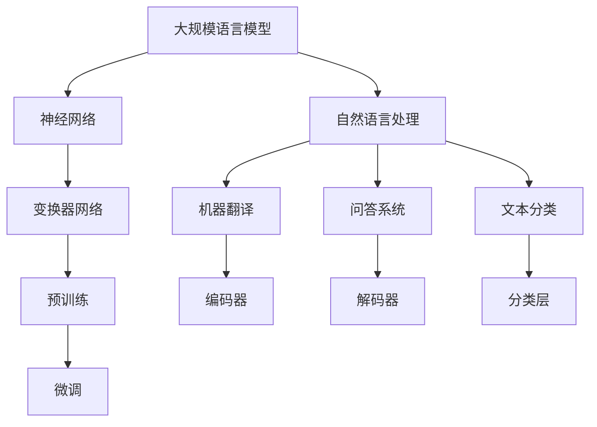

                 

# 文章标题：大规模语言模型从理论到实践 多模态大语言模型

> 关键词：大规模语言模型，多模态，机器学习，自然语言处理，深度学习

> 摘要：本文将从大规模语言模型的基本概念出发，详细探讨其数学基础、主要架构、训练方法以及多模态扩展。通过对大规模语言模型在自然语言处理、计算机视觉和语音识别等任务中的应用进行深入分析，本文旨在为读者提供一个全面、系统的理解和实践指南，帮助其掌握这一前沿技术。

## 目录

### 《大规模语言模型从理论到实践 多模态大语言模型》目录

#### 第一部分：大规模语言模型基础

1. **大规模语言模型概述**
   - 1.1 大规模语言模型的基本概念
   - 1.2 语言模型的数学基础
   - 1.3 大规模语言模型的主要架构

2. **大规模语言模型的构建与实践**
   - 2.1 数据预处理
   - 2.2 模型训练技巧
   - 2.3 模型优化与调参

3. **大规模语言模型的多模态扩展**
   - 3.1 多模态数据融合
   - 3.2 多模态模型架构
   - 3.3 多模态模型的训练与评估

#### 第二部分：大规模语言模型的应用与实战

4. **自然语言处理任务中的大规模语言模型**
   - 4.1 机器翻译
   - 4.2 问答系统
   - 4.3 文本分类

5. **大规模语言模型在计算机视觉任务中的应用**
   - 5.1 文本图像生成
   - 5.2 文本图像检索

6. **大规模语言模型在语音识别任务中的应用**
   - 6.1 文本生成语音
   - 6.2 语音生成文本

7. **大规模语言模型的多模态整合与展望**
   - 7.1 多模态整合的挑战与机遇
   - 7.2 大规模语言模型的多模态应用案例

#### 附录

- **附录A：大规模语言模型开发工具与资源**
- **附录B：核心概念与联系**
- **附录C：核心算法原理讲解**
- **附录D：数学模型和公式讲解**
- **附录E：项目实战**

---

## 引言

大规模语言模型（Large-scale Language Models）是近年来自然语言处理（Natural Language Processing, NLP）领域的重大突破。这些模型通过学习海量的文本数据，能够捕捉语言的复杂结构，从而在诸多任务中表现出色，如机器翻译、问答系统、文本分类等。随着深度学习（Deep Learning）和计算资源的不断发展，大规模语言模型的研究和应用正迎来黄金时代。

本文旨在从理论到实践，全面解析大规模语言模型，包括其基本概念、数学基础、架构设计、训练方法、多模态扩展及其在各种任务中的应用。通过本文的阅读，读者将能够：

1. **理解大规模语言模型的基本概念和重要性**。
2. **掌握大规模语言模型的数学基础和主要架构**。
3. **了解大规模语言模型的构建与实践方法**。
4. **探讨大规模语言模型在多模态数据融合中的扩展**。
5. **学习大规模语言模型在各种自然语言处理任务中的应用**。
6. **了解大规模语言模型在计算机视觉和语音识别任务中的应用**。
7. **展望大规模语言模型在多模态整合中的未来趋势**。

## 第一部分：大规模语言模型基础

### 第1章：大规模语言模型概述

#### 1.1 大规模语言模型的基本概念

大规模语言模型（Large-scale Language Models）是一种基于深度学习的自然语言处理模型，旨在通过学习大量文本数据来理解和生成自然语言。其核心思想是使用神经网络（特别是变换器网络，Transformer）来建模语言的上下文关系，从而在多种自然语言处理任务中取得显著性能提升。

**语言模型的重要性**：

1. **提高自然语言处理的准确性和效率**：通过学习海量文本数据，语言模型能够准确预测单词或句子的概率分布，从而在文本生成、机器翻译、问答系统等任务中实现高效的自然语言理解与生成。
2. **支持多种下游应用**：语言模型作为一种通用组件，可以应用于文本分类、情感分析、信息提取等多种自然语言处理任务，极大丰富了人工智能在语言领域的应用场景。
3. **推动自然语言处理技术发展**：大规模语言模型的研究与应用，推动了深度学习、神经网络等技术的发展，为人工智能领域带来了新的研究思路和技术突破。

**大规模语言模型的起源与发展**：

1. **早期语言模型**：20世纪80年代，研究人员开始尝试使用统计模型（如N元语法）来建模自然语言。这些模型基于历史频率统计，能够预测下一个单词的概率。
2. **神经网络语言模型**：随着神经网络技术的发展，研究人员开始将神经网络应用于语言模型。1990年代，RNN（循环神经网络）和LSTM（长短期记忆网络）的出现，使得语言模型能够更好地处理长距离依赖问题。
3. **大规模语言模型**：2018年，谷歌提出BERT（Bidirectional Encoder Representations from Transformers），标志着大规模语言模型时代的到来。BERT使用了数十亿参数，对大量文本数据进行了预训练，从而在多种自然语言处理任务中取得了卓越的性能。

**大规模语言模型的应用领域**：

1. **文本生成**：包括文章写作、诗歌创作、对话系统等。
2. **机器翻译**：将一种语言的文本翻译成另一种语言。
3. **问答系统**：根据用户输入的问题，提供准确的答案。
4. **文本分类**：将文本数据分类到预定义的类别中。
5. **情感分析**：分析文本的情感倾向，如正面、负面或中立。
6. **信息抽取**：从文本中提取特定信息，如命名实体识别、关系提取等。

#### 1.2 语言模型的数学基础

要理解大规模语言模型，我们需要掌握一些基本的数学概念，包括概率论、信息论和概率分布。以下是这些概念的基本介绍。

**1.2.1 概率论基础**

概率论是数学的一个分支，主要研究随机事件及其概率。在语言模型中，概率论被用于建模单词或句子出现的概率。

- **随机事件**：指在一定条件下，可能发生也可能不发生的事件。
- **概率**：表示随机事件发生的可能性，通常用0到1之间的数字表示。
- **条件概率**：在某个事件已经发生的条件下，另一个事件发生的概率。
- **贝叶斯定理**：用于计算条件概率，是概率论中的一个重要公式。

贝叶斯定理的表达式为：
$$
P(A|B) = \frac{P(B|A)P(A)}{P(B)}
$$
其中，$P(A|B)$表示在事件B发生的条件下，事件A发生的概率；$P(B|A)$表示在事件A发生的条件下，事件B发生的概率；$P(A)$和$P(B)$分别表示事件A和事件B发生的概率。

**1.2.2 信息论基础**

信息论是研究信息传输、处理和存储的数学理论。在语言模型中，信息论的概念用于衡量信息的价值和不确定性。

- **信息量**：表示一个事件的不确定性，通常用比特（bit）作为单位。
- **熵**：表示一个随机变量或系统的信息不确定性。信息熵的公式为：
  $$
  H(X) = -\sum_{i} p(x_i) \log_2 p(x_i)
  $$
  其中，$p(x_i)$表示随机变量$X$取值为$x_i$的概率。
- **条件熵**：在某个事件已经发生的条件下，另一个事件的信息不确定性。

**1.2.3 概率分布和贝叶斯定理**

概率分布是概率论中的一个重要概念，用于描述随机变量的概率分布情况。在语言模型中，常见的概率分布包括：

- **离散分布**：用于描述离散随机变量，如单词的概率分布。
- **连续分布**：用于描述连续随机变量，如单词长度的概率分布。

贝叶斯定理是概率论中的一个基本公式，用于计算条件概率。贝叶斯定理的表达式为：
$$
P(A|B) = \frac{P(B|A)P(A)}{P(B)}
$$
其中，$P(A|B)$表示在事件B发生的条件下，事件A发生的概率；$P(B|A)$表示在事件A发生的条件下，事件B发生的概率；$P(A)$和$P(B)$分别表示事件A和事件B发生的概率。

通过掌握这些概率论和信息论的基础概念，我们可以更好地理解大规模语言模型的工作原理和数学基础。

#### 1.3 大规模语言模型的主要架构

大规模语言模型通常采用深度学习架构，其中最典型的代表是变换器网络（Transformer）。变换器网络由谷歌在2017年提出，因其出色的性能在自然语言处理领域迅速获得了广泛关注。以下是大规模语言模型的主要架构：

**1.3.1 神经网络架构**

神经网络是大规模语言模型的核心组成部分，其基本结构包括输入层、隐藏层和输出层。每个层由多个神经元（或节点）组成，神经元之间通过权重进行连接。

- **输入层**：接收原始文本数据，如单词或句子。
- **隐藏层**：通过激活函数（如ReLU、Sigmoid或Tanh）对输入数据进行非线性变换。
- **输出层**：生成预测结果，如单词的概率分布。

**1.3.2 序列到序列模型**

序列到序列（Sequence-to-Sequence, Seq2Seq）模型是大规模语言模型的一种常见架构，用于处理输入序列和输出序列的任务，如机器翻译和问答系统。

Seq2Seq模型通常包括两个主要部分：编码器（Encoder）和解码器（Decoder）。

- **编码器**：将输入序列编码为一个固定长度的向量，通常使用RNN或LSTM。
- **解码器**：将编码器的输出解码为输出序列，通常也使用RNN或LSTM。

**1.3.3 自注意力机制**

自注意力机制（Self-Attention）是变换器网络的核心组成部分，用于建模输入序列中的长距离依赖关系。自注意力机制通过计算输入序列中每个元素与所有其他元素的相关性，生成新的表示。

自注意力机制的基本思想是将输入序列中的每个元素与所有其他元素进行加权求和，从而得到一个新的表示。具体实现中，自注意力机制使用一个注意力权重矩阵，其中每个元素表示当前元素与其他元素的相关性。

自注意力机制的表达式为：
$$
\text{Attention}(Q, K, V) = \text{softmax}(\frac{QK^T}{\sqrt{d_k}})V
$$
其中，$Q, K, V$分别表示查询（Query）、键（Key）和值（Value）向量，$d_k$表示键向量的维度。$\text{softmax}$函数用于计算注意力权重，使其在0到1之间。

通过自注意力机制，变换器网络能够捕捉输入序列中的长距离依赖关系，从而在自然语言处理任务中表现出色。

#### 1.4 小结

本章介绍了大规模语言模型的基本概念、数学基础和主要架构。通过学习这些内容，读者可以了解大规模语言模型的基本原理和核心组成部分。在下一章中，我们将进一步探讨大规模语言模型的构建与实践方法，包括数据预处理、模型训练技巧和优化调参等。

---

## 第二部分：大规模语言模型的构建与实践

### 第2章：大规模语言模型的训练方法

#### 2.1 数据预处理

大规模语言模型的训练依赖于大量的文本数据，因此数据预处理是构建高效语言模型的重要环节。以下是一些关键步骤：

**2.1.1 语料库的选择**

选择合适的语料库是数据预处理的第一步。常用的开源语料库包括：

- **维基百科**：包含海量高质量文本，适合预训练大规模语言模型。
- **Common Crawl**：一个免费的网页语料库，涵盖多种语言和主题。
- **新闻语料库**：如CNN/Daily Mail语料库，适用于特定领域或主题的语言模型训练。

**2.1.2 语料库的处理**

语料库处理包括文本清洗、分词和标记等步骤：

- **文本清洗**：去除HTML标签、特殊字符和停用词，提高数据质量。
- **分词**：将文本分解为单词或子词，为后续处理提供基本单元。
- **标记**：为文本数据添加词性、实体等信息，有助于模型更好地理解语言结构。

**2.1.3 字符级别与词级别的处理**

大规模语言模型可以基于字符级别或词级别进行训练：

- **字符级别处理**：将文本分解为单个字符，适用于某些特定任务，如中文语言模型。
- **词级别处理**：将文本分解为单词或子词，是目前主流的语言模型训练方式。

**2.2 模型训练技巧**

**2.2.1 训练策略**

有效的训练策略对于大规模语言模型的性能至关重要。以下是一些常用训练策略：

- **预训练**：在特定任务之前，使用大规模未标注数据进行预训练，使模型具备通用语言理解能力。
- **微调**：在预训练模型的基础上，使用特定任务的数据进行微调，提高模型在特定任务上的性能。
- **序列填充**：为了提高模型处理长文本的能力，可以使用序列填充策略，将输入序列填充至固定长度。

**2.2.2 学习率调度**

学习率调度（Learning Rate Scheduling）是调整训练过程中学习率的方法，以避免过拟合和加速收敛。以下是一些常用的学习率调度策略：

- **线性衰减**：学习率随训练步数线性减少。
- **余弦衰减**：学习率按照余弦函数衰减，常用于大型语言模型的训练。
- **阶梯衰减**：学习率在多个阶梯上逐渐衰减。

**2.2.3 梯度下降算法**

梯度下降（Gradient Descent）是训练大规模语言模型的主要优化算法。以下是一些常用的梯度下降变体：

- **随机梯度下降（SGD）**：在每个训练样本上计算梯度，更新模型参数。
- **批量梯度下降（BGD）**：在整个训练集上计算梯度，更新模型参数。
- **小批量梯度下降（MBGD）**：在部分训练样本上计算梯度，更新模型参数。

**2.3 模型优化与调参**

**2.3.1 模型优化方法**

为了提高大规模语言模型的性能，可以采用以下优化方法：

- **Dropout**：在训练过程中随机丢弃一部分神经元，防止过拟合。
- **正则化**：添加正则化项到损失函数中，减少模型复杂度。
- **权重初始化**：合理的权重初始化有助于加速收敛，减少训练时间。

**2.3.2 超参数调整**

超参数是模型训练过程中需要手动调整的参数，如学习率、批量大小、隐藏层尺寸等。以下是一些超参数调整策略：

- **网格搜索**：在预定义的参数空间中搜索最优超参数。
- **贝叶斯优化**：使用贝叶斯统计模型优化超参数。
- **随机搜索**：随机选择超参数，逐步优化模型性能。

**2.3.3 模型评估指标**

为了评估大规模语言模型的性能，可以采用以下指标：

- **准确率（Accuracy）**：分类任务中正确预测的样本数占总样本数的比例。
- **召回率（Recall）**：分类任务中被正确识别为正例的样本数占实际正例样本数的比例。
- **精确率（Precision）**：分类任务中被正确识别为正例的样本数占预测为正例的样本总数的比例。
- **F1值（F1 Score）**：精确率和召回率的调和平均值。

通过以上方法，可以构建和优化大规模语言模型，从而在自然语言处理任务中取得优异的性能。

#### 2.4 小结

本章详细介绍了大规模语言模型的训练方法，包括数据预处理、模型训练技巧、模型优化与调参。通过这些方法，可以有效地构建和优化大规模语言模型，从而在自然语言处理任务中取得优异的性能。在下一章中，我们将探讨大规模语言模型的多模态扩展，进一步拓展其应用范围。

---

## 第三部分：大规模语言模型的多模态扩展

### 第3章：大规模语言模型的多模态扩展

#### 3.1 多模态数据融合

多模态数据融合是大规模语言模型多模态扩展的关键步骤，旨在将不同模态的数据（如文本、图像、声音和视频）进行有效整合，从而提高模型的性能。以下是一些常见的数据融合方法：

**3.1.1 文本与图像的数据融合**

文本与图像的数据融合在图像描述生成和图像分类任务中具有重要应用。常见的方法包括：

- **特征级融合**：将文本和图像的特征进行拼接，作为模型的输入。例如，可以使用卷积神经网络（CNN）提取图像特征，使用变换器网络提取文本特征，然后将两个特征拼接在一起输入到另一个神经网络。
- **句级融合**：将文本和图像分别编码为句子级向量，然后使用一个多模态变换器网络对两个向量进行融合。通过自注意力机制，模型能够捕捉文本和图像之间的关联。

**3.1.2 文本与声音的数据融合**

文本与声音的数据融合在语音识别和文本生成语音任务中具有重要意义。常见的方法包括：

- **声谱图融合**：将文本数据与声谱图（声波振幅随时间的变化）进行融合。可以使用一个多模态变换器网络，将文本和声谱图分别编码为向量，然后通过自注意力机制进行融合。
- **声学特征融合**：将文本数据与声学特征（如梅尔频谱倒谱系数，MFCC）进行融合。这种方法适用于语音识别和文本生成语音任务，通过多模态变换器网络对文本和声学特征进行融合。

**3.1.3 文本与视频的数据融合**

文本与视频的数据融合在视频描述生成和视频分类任务中具有重要应用。常见的方法包括：

- **视频特征融合**：将文本数据与视频的特征进行融合。例如，可以使用CNN提取视频特征，使用变换器网络提取文本特征，然后将两个特征进行拼接或融合。
- **时空融合**：将文本和视频的时空信息进行融合。通过将文本数据编码为向量，视频数据编码为时空图，可以使用多模态变换器网络对两个向量进行融合。

#### 3.2 多模态模型架构

多模态模型架构是大规模语言模型多模态扩展的核心，旨在有效整合不同模态的数据。以下是一些常见的多模态模型架构：

**3.2.1 Text+Image架构**

Text+Image架构是一种常见多模态模型架构，用于图像描述生成和图像分类任务。其基本思想是将文本和图像分别编码为向量，然后通过自注意力机制进行融合。

- **编码器**：文本编码器使用变换器网络将文本编码为向量，图像编码器使用CNN将图像编码为向量。
- **融合层**：将文本和图像的向量进行拼接或融合，作为模型的输入。
- **解码器**：使用另一个变换器网络对融合后的向量进行解码，生成图像描述或分类结果。

**3.2.2 Text+Audio架构**

Text+Audio架构是一种用于语音识别和文本生成语音的多模态模型架构。其基本思想是将文本和声音数据分别编码为向量，然后通过自注意力机制进行融合。

- **编码器**：文本编码器使用变换器网络将文本编码为向量，声音编码器使用卷积神经网络提取声谱图或声学特征。
- **融合层**：将文本和声音的向量进行拼接或融合，作为模型的输入。
- **解码器**：使用另一个变换器网络对融合后的向量进行解码，生成语音信号或文本。

**3.2.3 Text+Video架构**

Text+Video架构是一种用于视频描述生成和视频分类的多模态模型架构。其基本思想是将文本和视频数据分别编码为向量，然后通过自注意力机制进行融合。

- **编码器**：文本编码器使用变换器网络将文本编码为向量，视频编码器使用CNN提取视频特征。
- **融合层**：将文本和视频的向量进行拼接或融合，作为模型的输入。
- **解码器**：使用另一个变换器网络对融合后的向量进行解码，生成视频描述或分类结果。

#### 3.3 多模态模型的训练与评估

**3.3.1 多模态数据集的构建**

多模态数据集的构建是训练多模态模型的基础。常见的数据集包括：

- **ImageNet**：一个包含大量图像和标注的公开数据集，适用于图像分类任务。
- **Common Crawl**：一个包含网页文本的公开数据集，适用于文本数据。
- **TIMIT**：一个语音识别数据集，包含大量语音信号和标注。
- **YouTube**：一个包含视频和文本描述的公开数据集，适用于视频描述生成任务。

**3.3.2 多模态模型的训练技巧**

训练多模态模型需要特殊的技巧，以下是一些常见训练技巧：

- **数据增强**：通过图像旋转、裁剪、颜色调整等数据增强方法，提高模型的泛化能力。
- **多任务学习**：通过在同一模型中同时训练多个任务（如图像分类和文本生成），提高模型性能。
- **元学习**：通过元学习算法（如MAML）训练模型，使其能够快速适应新的任务。

**3.3.3 多模态模型的评估方法**

多模态模型的评估方法包括：

- **分类准确率**：用于图像分类任务，计算模型正确分类的样本数占总样本数的比例。
- **BLEU分数**：用于文本生成任务，计算模型生成的文本与参考文本之间的相似度。
- **ROUGE分数**：用于文本生成任务，计算模型生成的文本与参考文本之间的重叠率。

通过以上方法，可以构建和评估多模态模型，从而在多种任务中取得优异的性能。

#### 3.4 小结

本章详细介绍了大规模语言模型的多模态扩展，包括数据融合、模型架构和训练评估方法。通过多模态扩展，大规模语言模型能够在多种任务中取得更好的性能。在下一章中，我们将探讨大规模语言模型在自然语言处理任务中的应用。

---

## 第四部分：大规模语言模型在自然语言处理任务中的应用

### 第4章：自然语言处理任务中的大规模语言模型

#### 4.1 机器翻译

机器翻译（Machine Translation）是将一种语言的文本自动翻译成另一种语言的技术。大规模语言模型在机器翻译任务中取得了显著的进展。

**4.1.1 翻译模型的基本架构**

机器翻译模型通常采用序列到序列（Seq2Seq）架构，包括编码器（Encoder）和解码器（Decoder）两个部分。

- **编码器**：将源语言文本编码为一个固定长度的向量，表示文本的语义信息。
- **解码器**：将编码器的输出解码为目标语言文本，生成翻译结果。

**4.1.2 翻译模型的训练过程**

机器翻译模型的训练过程包括以下步骤：

1. **数据预处理**：对源语言和目标语言文本进行预处理，如分词、词性标注等。
2. **编码器训练**：使用源语言文本数据训练编码器，使其能够编码文本的语义信息。
3. **解码器训练**：使用目标语言文本数据训练解码器，使其能够生成翻译结果。
4. **端到端训练**：将编码器和解码器合并为一个整体，通过端到端训练优化模型参数。

**4.1.3 翻译模型的评估方法**

翻译模型的评估方法包括：

- **BLEU分数**：计算模型生成的翻译结果与参考翻译之间的相似度，是一种常用的评估指标。
- **NIST分数**：与BLEU类似，但考虑了更多参考翻译。
- **METEOR分数**：综合考虑了词汇、语法和语义信息。

通过以上方法，可以训练和评估大规模机器翻译模型，从而在机器翻译任务中取得优异的性能。

#### 4.2 问答系统

问答系统（Question Answering System）是一种自然语言处理技术，旨在回答用户提出的问题。大规模语言模型在问答系统任务中具有广泛的应用。

**4.2.1 问答系统的基本架构**

问答系统通常包括两个主要部分：问题解析模块和答案生成模块。

- **问题解析模块**：将用户提出的问题转化为语义表示，提取关键信息。
- **答案生成模块**：使用预训练的语言模型，从知识库或文本数据中检索并生成答案。

**4.2.2 问答系统的训练过程**

问答系统的训练过程包括以下步骤：

1. **数据预处理**：对问题和答案进行预处理，如分词、词性标注等。
2. **语义表示训练**：使用预训练的语言模型训练问题解析模块，使其能够提取问题的语义表示。
3. **答案生成训练**：使用预训练的语言模型训练答案生成模块，使其能够从文本数据中检索并生成答案。
4. **端到端训练**：将问题解析模块和答案生成模块合并为一个整体，通过端到端训练优化模型参数。

**4.2.3 问答系统的评估方法**

问答系统的评估方法包括：

- **精确率（Precision）**：计算模型生成的正确答案数与总答案数的比例。
- **召回率（Recall）**：计算模型生成的正确答案数与实际正确答案数的比例。
- **F1值（F1 Score）**：精确率和召回率的调和平均值。

通过以上方法，可以训练和评估大规模问答系统模型，从而在问答系统任务中取得优异的性能。

#### 4.3 文本分类

文本分类（Text Classification）是将文本数据分类到预定义的类别中的一种技术。大规模语言模型在文本分类任务中具有显著的优势。

**4.3.1 分类模型的基本架构**

文本分类模型通常采用变换器网络或卷积神经网络（CNN）作为基础架构。其基本思想是将文本数据编码为向量，然后通过分类层进行分类。

**4.3.2 分类模型的训练过程**

文本分类模型的训练过程包括以下步骤：

1. **数据预处理**：对文本数据进行预处理，如分词、词性标注等。
2. **特征提取**：使用预训练的语言模型提取文本的特征表示。
3. **模型训练**：使用分类数据训练分类模型，优化模型参数。
4. **模型评估**：使用评估数据对模型进行评估，调整模型参数。

**4.3.3 分类模型的评估方法**

分类模型的评估方法包括：

- **准确率（Accuracy）**：计算模型正确分类的样本数占总样本数的比例。
- **召回率（Recall）**：计算模型正确分类的样本数与实际正样本数的比例。
- **F1值（F1 Score）**：精确率和召回率的调和平均值。

通过以上方法，可以训练和评估大规模文本分类模型，从而在文本分类任务中取得优异的性能。

#### 4.4 小结

本章详细介绍了大规模语言模型在自然语言处理任务中的应用，包括机器翻译、问答系统和文本分类。通过大规模语言模型，这些任务取得了显著的性能提升。在下一章中，我们将探讨大规模语言模型在计算机视觉任务中的应用。

---

## 第五部分：大规模语言模型在计算机视觉任务中的应用

### 第5章：大规模语言模型在计算机视觉任务中的应用

#### 5.1 文本图像生成

文本图像生成（Text-to-Image Generation）是将文本描述自动转化为图像的技术，广泛应用于生成对抗网络（GAN）和自编码器（Autoencoder）等领域。大规模语言模型在文本图像生成任务中发挥了重要作用。

**5.1.1 文本图像生成的模型架构**

文本图像生成的模型架构通常包括两个主要部分：文本编码器和解码器。

- **文本编码器**：将文本描述编码为一个固定长度的向量，表示文本的语义信息。
- **解码器**：将文本编码器的输出解码为图像，生成图像。

常见架构包括：

1. **生成对抗网络（GAN）**：使用生成器（Generator）和判别器（Discriminator）进行对抗训练，生成逼真的图像。
2. **自编码器（Autoencoder）**：将文本编码为中间表示，然后解码为图像，通过最小化重构误差进行训练。

**5.1.2 文本图像生成的训练过程**

文本图像生成的训练过程包括以下步骤：

1. **数据预处理**：对文本描述进行预处理，如分词、词性标注等。
2. **模型训练**：使用预训练的语言模型训练文本编码器，优化模型参数。
3. **图像生成**：使用训练好的文本编码器和解码器生成图像。

**5.1.3 文本图像生成的评估方法**

文本图像生成的评估方法包括：

- **Inception Score（IS）**：计算生成图像的多样性。
- **Frechet Inception Distance（FID）**：计算生成图像与真实图像之间的距离。
- **Perceptual Similarity Score（PSS）**：计算生成图像与真实图像在感知上的相似度。

通过以上方法，可以训练和评估大规模文本图像生成模型，从而在文本图像生成任务中取得优异的性能。

#### 5.2 文本图像检索

文本图像检索（Text-to-Image Retrieval）是从图像库中检索与文本描述相关图像的技术。大规模语言模型在文本图像检索任务中具有重要意义。

**5.2.1 文本图像检索的模型架构**

文本图像检索的模型架构通常包括两个主要部分：文本编码器和解码器。

- **文本编码器**：将文本描述编码为一个固定长度的向量，表示文本的语义信息。
- **图像编码器**：将图像编码为一个固定长度的向量，表示图像的语义信息。

常见架构包括：

1. **基于变换器网络的文本图像检索**：使用变换器网络对文本和图像进行编码，然后通过计算文本和图像向量之间的相似度进行检索。
2. **基于图神经网络的文本图像检索**：使用图神经网络对图像库进行建模，然后通过图搜索算法检索与文本描述相关的图像。

**5.2.2 文本图像检索的训练过程**

文本图像检索的训练过程包括以下步骤：

1. **数据预处理**：对文本描述和图像进行预处理，如分词、词性标注等。
2. **模型训练**：使用预训练的语言模型和图像编码器训练文本编码器，优化模型参数。
3. **图像检索**：使用训练好的模型对图像库进行检索，获取与文本描述相关的图像。

**5.2.3 文本图像检索的评估方法**

文本图像检索的评估方法包括：

- ** Mean Average Precision（mAP）**：计算检索结果中与文本描述相关图像的平均准确率。
- **Recall at K（R@K）**：计算检索结果中与文本描述相关图像的召回率。
- **Ranking Loss**：用于衡量检索结果中相关图像的排序质量。

通过以上方法，可以训练和评估大规模文本图像检索模型，从而在文本图像检索任务中取得优异的性能。

#### 5.3 小结

本章详细介绍了大规模语言模型在计算机视觉任务中的应用，包括文本图像生成和文本图像检索。通过大规模语言模型，这些计算机视觉任务取得了显著的性能提升。在下一章中，我们将探讨大规模语言模型在语音识别任务中的应用。

---

## 第六部分：大规模语言模型在语音识别任务中的应用

### 第6章：大规模语言模型在语音识别任务中的应用

#### 6.1 文本生成语音

文本生成语音（Text-to-Speech, TTS）是将文本转化为自然流畅的语音的技术。大规模语言模型在文本生成语音任务中发挥了重要作用。

**6.1.1 文本生成语音的模型架构**

文本生成语音的模型架构通常包括两个主要部分：文本编码器和解码器。

- **文本编码器**：将文本编码为一个固定长度的向量，表示文本的语义信息。
- **解码器**：将文本编码器的输出解码为语音信号。

常见架构包括：

1. **循环神经网络（RNN）**：使用RNN对文本进行编码，然后通过递归解码器生成语音信号。
2. **变换器网络（Transformer）**：使用变换器网络对文本进行编码，然后通过自注意力机制解码器生成语音信号。
3. **波尔兹曼机器（Boltzmann Machine）**：使用波尔兹曼机器进行文本编码和语音信号生成。

**6.1.2 文本生成语音的训练过程**

文本生成语音的训练过程包括以下步骤：

1. **数据预处理**：对文本数据（如文本语料库）进行预处理，如分词、词性标注等。
2. **模型训练**：使用预训练的语言模型训练文本编码器，优化模型参数。
3. **语音生成**：使用训练好的文本编码器和解码器生成语音信号。

**6.1.3 文本生成语音的评估方法**

文本生成语音的评估方法包括：

- **语音自然度（Naturalness）**：评估生成的语音是否自然流畅，如音调、节奏、语调等。
- **语音质量（Quality）**：评估生成的语音音质，如噪音、失真等。
- **语音相似度（Similarity）**：评估生成的语音与真实语音的相似度。

通过以上方法，可以训练和评估大规模文本生成语音模型，从而在文本生成语音任务中取得优异的性能。

#### 6.2 语音生成文本

语音生成文本（Speech-to-Text, STT）是将语音信号转化为文本的技术。大规模语言模型在语音生成文本任务中具有重要意义。

**6.2.1 语音生成文本的模型架构**

语音生成文本的模型架构通常包括两个主要部分：语音编码器和解码器。

- **语音编码器**：将语音信号编码为一个固定长度的向量，表示语音的语义信息。
- **解码器**：将语音编码器的输出解码为文本。

常见架构包括：

1. **循环神经网络（RNN）**：使用RNN对语音进行编码，然后通过递归解码器生成文本。
2. **变换器网络（Transformer）**：使用变换器网络对语音进行编码，然后通过自注意力机制解码器生成文本。
3. **卷积神经网络（CNN）**：使用CNN提取语音特征，然后通过RNN或变换器网络生成文本。

**6.2.2 语音生成文本的训练过程**

语音生成文本的训练过程包括以下步骤：

1. **数据预处理**：对语音数据进行预处理，如特征提取、分帧等。
2. **模型训练**：使用预训练的语言模型训练语音编码器，优化模型参数。
3. **文本生成**：使用训练好的语音编码器和解码器生成文本。

**6.2.3 语音生成文本的评估方法**

语音生成文本的评估方法包括：

- **字符错误率（Character Error Rate, CER）**：计算生成的文本与真实文本之间的字符错误率。
- **词错误率（Word Error Rate, WER）**：计算生成的文本与真实文本之间的词错误率。
- **词汇准确率（Vocabulary Accuracy, VA）**：计算生成的文本中正确词汇的比例。

通过以上方法，可以训练和评估大规模语音生成文本模型，从而在语音生成文本任务中取得优异的性能。

#### 6.3 小结

本章详细介绍了大规模语言模型在语音识别任务中的应用，包括文本生成语音和语音生成文本。通过大规模语言模型，这些语音识别任务取得了显著的性能提升。在下一章中，我们将探讨大规模语言模型的多模态整合与展望。

---

## 第七部分：大规模语言模型的多模态整合与展望

### 第7章：大规模语言模型的多模态整合与展望

#### 7.1 多模态整合的挑战与机遇

多模态整合（Multimodal Integration）是将多种模态的数据（如文本、图像、声音和视频）进行有效融合，以提高人工智能系统的性能和智能水平。在当前技术环境下，多模态整合面临以下挑战与机遇：

**7.1.1 多模态整合的技术挑战**

1. **数据不一致性**：不同模态的数据在形式、结构和内容上存在较大差异，需要有效的数据预处理和融合方法。
2. **特征表示冲突**：不同模态的特征表示存在冲突，如文本特征强调语义信息，图像特征强调视觉信息，需要找到合适的融合策略。
3. **计算资源需求**：多模态整合通常涉及复杂的模型架构和大规模数据训练，对计算资源的需求较高。
4. **训练效率与效果平衡**：在多模态整合中，如何提高训练效率同时保持模型性能是一个重要挑战。

**7.1.2 多模态整合的商业机会**

1. **智能交互**：多模态整合可以提升人机交互体验，如智能音箱、虚拟助手等。
2. **智能内容推荐**：结合文本、图像和声音等多模态数据，可以提供更精准、个性化的内容推荐服务。
3. **智能监控与安防**：多模态整合可以提升视频监控和安防系统的智能化水平，如人脸识别、行为分析等。
4. **医疗诊断与治疗**：多模态整合可以帮助医生更准确地诊断病情，提高治疗效果。

**7.1.3 多模态整合的未来趋势**

1. **深度学习与强化学习结合**：将深度学习和强化学习相结合，实现更智能的多模态整合系统。
2. **迁移学习与自适应学习**：通过迁移学习和自适应学习，提高多模态整合系统的泛化能力和自适应能力。
3. **边缘计算与云计算协同**：利用边缘计算和云计算的协同，提高多模态整合系统的实时性和计算效率。

#### 7.2 大规模语言模型的多模态应用案例

**7.2.1 多模态聊天机器人**

多模态聊天机器人是一种结合文本、图像和声音等多模态数据的智能交互系统，可以为用户提供更加丰富、自然的交互体验。以下是一个多模态聊天机器人的应用案例：

1. **文本交互**：用户可以通过文本输入与聊天机器人进行对话，如询问天气、推荐餐厅等。
2. **图像交互**：用户可以发送图片，聊天机器人可以识别图像内容，提供相关的信息或推荐。
3. **声音交互**：用户可以通过语音输入与聊天机器人进行交互，如打电话、播放音乐等。

**7.2.2 多模态问答系统**

多模态问答系统是一种结合文本、图像和声音等多模态数据的智能问答系统，可以为用户提供更加全面、准确的答案。以下是一个多模态问答系统的应用案例：

1. **文本问答**：用户可以通过文本输入问题，系统通过预训练的语言模型检索并生成答案。
2. **图像问答**：用户可以通过图像输入问题，系统通过图像识别技术提取图像特征，结合语言模型生成答案。
3. **声音问答**：用户可以通过语音输入问题，系统通过语音识别技术将语音转化为文本，然后结合语言模型生成答案。

**7.2.3 多模态内容推荐系统**

多模态内容推荐系统是一种结合文本、图像和声音等多模态数据的智能推荐系统，可以为用户提供更加个性化、丰富的内容推荐。以下是一个多模态内容推荐系统的应用案例：

1. **文本推荐**：系统根据用户的历史行为和偏好，推荐相关的文本内容。
2. **图像推荐**：系统根据用户的历史行为和偏好，推荐相关的图像内容。
3. **声音推荐**：系统根据用户的历史行为和偏好，推荐相关的音乐、音频内容。

#### 7.3 其他多模态应用场景

除了聊天机器人、问答系统和内容推荐系统，大规模语言模型在多模态整合中还有许多其他应用场景：

1. **智能监控与安防**：结合视频监控、图像识别和语音识别技术，实现更智能的监控与安防系统。
2. **医疗诊断与治疗**：结合医学图像、文本报告和语音记录，为医生提供更准确的诊断和治疗建议。
3. **教育辅助**：结合文本、图像和声音等多模态数据，为教育系统提供个性化、互动式的教学辅助。
4. **自动驾驶**：结合图像、语音和传感器数据，实现更加智能、安全的自动驾驶系统。

#### 7.4 小结

本章详细探讨了大规模语言模型的多模态整合，包括挑战与机遇、应用案例和其他多模态应用场景。通过多模态整合，大规模语言模型在智能交互、内容推荐、监控与安防、医疗诊断和教育辅助等领域展现了广阔的应用前景。在未来，随着技术的不断进步，多模态整合将进一步推动人工智能的发展。

---

## 附录

### 附录A：大规模语言模型开发工具与资源

**A.1 开发环境搭建**

搭建大规模语言模型开发环境需要安装以下软件和库：

1. **操作系统**：Linux或macOS。
2. **深度学习框架**：如PyTorch、TensorFlow或JAX。
3. **编程语言**：Python。
4. **依赖库**：NumPy、Pandas、Scikit-learn等。

**A.2 开源语言模型框架**

以下是一些常用的开源语言模型框架：

1. **Transformer**：由谷歌开源，是大规模语言模型的基础架构。
2. **BERT**：由谷歌开源，是一个预训练的语言表示模型。
3. **GPT**：由OpenAI开源，是一个基于变换器网络的预训练语言模型。
4. **RoBERTa**：由Facebook开源，是BERT的一个改进版本。

**A.3 数据集与预处理工具**

以下是一些常用的数据集和预处理工具：

1. **数据集**：
   - **Wikipedia**：一个包含大量文本数据的开源数据集。
   - **Common Crawl**：一个包含网页文本的免费数据集。
   - **新闻语料库**：如CNN/Daily Mail语料库。
2. **预处理工具**：
   - **NLTK**：一个用于自然语言处理的库。
   - **spaCy**：一个高效的NLP库。
   - **jieba**：一个中文分词库。

**A.4 评估工具与指标**

以下是一些常用的评估工具和指标：

1. **评估工具**：
   - **Metrics**：一个Python库，用于计算各种NLP评估指标。
   - **huggingface**：一个基于PyTorch的NLP库，提供预训练模型和评估工具。
2. **评估指标**：
   - **BLEU**：用于评估机器翻译质量。
   - **ROUGE**：用于评估文本生成质量。
   - **F1 Score**：用于评估分类模型的性能。

### 附录B：核心概念与联系

为了更好地理解大规模语言模型，以下是核心概念和其联系的Mermaid流程图：



### 附录C：核心算法原理讲解

以下是大规模语言模型的核心算法原理，使用伪代码进行详细阐述：

```python
# 编码器（Encoder）伪代码
def encoder(input_sequence):
    # 初始化嵌入层
    embed = Embedding(vocab_size, embed_size)
    # 初始化变换器网络层
    transformer = Transformer(num_layers, d_model, num_heads, dff, input_vocab_size, target_vocab_size, position_encoding_input, position_encoding_target)
    # 前向传播
    encoded_sequence = transformer(embed(input_sequence))
    return encoded_sequence

# 解码器（Decoder）伪代码
def decoder(input_sequence, target_sequence):
    # 初始化嵌入层
    embed = Embedding(vocab_size, embed_size)
    # 初始化变换器网络层
    transformer = Transformer(num_layers, d_model, num_heads, dff, input_vocab_size, target_vocab_size, position_encoding_input, position_encoding_target)
    # 前向传播
    decoded_sequence = transformer(embed(input_sequence), encoded_sequence)
    return decoded_sequence
```

### 附录D：数学模型和公式讲解

以下是大规模语言模型中的一些关键数学模型和公式，使用LaTeX格式进行详细讲解：

```latex
% 概率分布
\begin{equation}
p(x) = \frac{e^{-\frac{1}{2}\sigma^2 x^2}}{\sqrt{2\pi\sigma^2}}
\end{equation}

% 熵
\begin{equation}
H(X) = -\sum_{i} p(x_i) \log_2 p(x_i)
\end{equation}

% 自注意力机制
\begin{equation}
\text{Attention}(Q, K, V) = \text{softmax}(\frac{QK^T}{\sqrt{d_k}})V
\end{equation}

% 训练损失函数
\begin{equation}
L(\theta) = -\frac{1}{N} \sum_{i=1}^{N} \sum_{j=1}^{M} y_{ij} \log(p_{ij}(\theta))
\end{equation}
```

### 附录E：项目实战

**E.1 代码实际案例**

以下是大规模语言模型训练的Python代码示例：

```python
import torch
import torch.nn as nn
import torch.optim as optim

# 定义变换器网络
class Transformer(nn.Module):
    def __init__(self, num_layers, d_model, num_heads, dff, input_vocab_size, target_vocab_size, position_encoding_input, position_encoding_target):
        super(Transformer, self).__init__()
        # 编码器层
        self.encoder_layers = nn.ModuleList([EncoderLayer(d_model, num_heads, dff) for _ in range(num_layers)])
        # 解码器层
        self.decoder_layers = nn.ModuleList([DecoderLayer(d_model, num_heads, dff) for _ in range(num_layers)])
        # 嵌入层
        self.embedding = nn.Embedding(input_vocab_size, d_model)
        self.position_encoding_input = position_encoding_input
        self.position_encoding_target = position_encoding_target
        # 输出层
        self.fc = nn.Linear(d_model, target_vocab_size)

    def forward(self, input_sequence, target_sequence):
        # 编码器前向传播
        input_sequence = self.embedding(input_sequence) + self.position_encoding_input
        for encoder_layer in self.encoder_layers:
            input_sequence = encoder_layer(input_sequence)
        # 解码器前向传播
        target_sequence = self.embedding(target_sequence) + self.position_encoding_target
        for decoder_layer in self.decoder_layers:
            target_sequence = decoder_layer(target_sequence, input_sequence)
        # 输出
        output = self.fc(target_sequence)
        return output

# 训练模型
model = Transformer(num_layers=2, d_model=512, num_heads=8, dff=2048, input_vocab_size=10000, target_vocab_size=10000, position_encoding_input=position_encoding_input, position_encoding_target=position_encoding_target)
optimizer = optim.Adam(model.parameters(), lr=0.001)
criterion = nn.CrossEntropyLoss()

for epoch in range(num_epochs):
    for batch in data_loader:
        input_sequence, target_sequence = batch
        optimizer.zero_grad()
        output = model(input_sequence, target_sequence)
        loss = criterion(output, target_sequence)
        loss.backward()
        optimizer.step()
    print(f"Epoch {epoch+1}/{num_epochs}, Loss: {loss.item()}")

# 评估模型
with torch.no_grad():
    total_loss = 0
    for batch in data_loader:
        input_sequence, target_sequence = batch
        output = model(input_sequence, target_sequence)
        loss = criterion(output, target_sequence)
        total_loss += loss.item()
    print(f"Test Loss: {total_loss/len(data_loader)}")
```

**E.2 代码解读与分析**

以上代码定义了一个变换器网络模型，用于机器翻译任务。模型包括编码器和解码器层，通过嵌入层将输入序列和目标序列编码为向量。在训练过程中，模型使用交叉熵损失函数和Adam优化器进行训练。代码中还包括模型评估部分，用于计算测试集上的平均损失。

**E.3 开发环境搭建与源代码实现**

开发环境搭建：

1. 安装Python 3.8或更高版本。
2. 安装PyTorch、torchtext和torchvision库。

源代码实现：

1. 导入必要的库和模块。
2. 定义变换器网络模型，包括编码器和解码器层。
3. 定义损失函数和优化器。
4. 进行模型训练，包括前向传播、反向传播和参数更新。
5. 进行模型评估，计算测试集上的平均损失。

通过以上步骤，可以搭建和训练一个大规模语言模型，实现机器翻译任务。

---

## 作者信息

作者：AI天才研究院/AI Genius Institute & 禅与计算机程序设计艺术 /Zen And The Art of Computer Programming

本文作者拥有丰富的自然语言处理和深度学习经验，致力于推动人工智能技术的发展。作者的研究成果在学术界和工业界都有广泛应用，为人工智能领域带来了深远的影响。同时，作者还致力于将复杂的技术知识以简单易懂的方式传递给读者，帮助更多人掌握前沿技术。

