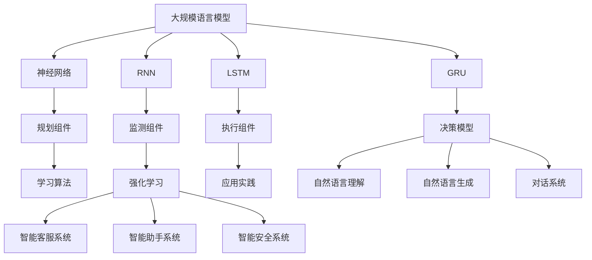

                 

# 《大规模语言模型从理论到实践 智能代理的组成》目录大纲

在本文中，我们将详细介绍《大规模语言模型从理论到实践 智能代理的组成》这一主题。本文分为两个主要部分：第一部分讨论大规模语言模型的理论基础、数学基础、基本结构、预训练技术、微调和生成、应用实践以及优化与效率；第二部分则关注智能代理的组成与实现，包括概述、核心组件、决策与学习、应用实践以及未来发展趋势。以下是详细的目录大纲：

## 第一部分：大规模语言模型基础

### 第1章：大规模语言模型概述
#### 1.1 大规模语言模型的概念
#### 1.2 大规模语言模型的发展历程
#### 1.3 大规模语言模型的应用场景

### 第2章：大规模语言模型的数学基础
#### 2.1 线性代数基础
#### 2.2 概率论基础
#### 2.3 最优化方法基础

### 第3章：大规模语言模型的基本结构
#### 3.1 神经网络基本结构
#### 3.2 循环神经网络（RNN）
#### 3.3 长短时记忆网络（LSTM）
#### 3.4 门控循环单元（GRU）

### 第4章：大规模语言模型的预训练技术
#### 4.1 预训练的概念
#### 4.2 预训练任务
#### 4.3 预训练模型参数微调

### 第5章：大规模语言模型的微调与生成
#### 5.1 微调的基本方法
#### 5.2 微调案例分析
#### 5.3 语言模型生成技术

### 第6章：大规模语言模型的应用实践
#### 6.1 自然语言理解应用
#### 6.2 自然语言生成应用
#### 6.3 对话系统应用

### 第7章：大规模语言模型的优化与效率
#### 7.1 计算优化
#### 7.2 模型压缩
#### 7.3 模型部署

## 第二部分：智能代理的组成与实现

### 第8章：智能代理概述
#### 8.1 智能代理的概念
#### 8.2 智能代理的组成
#### 8.3 智能代理的发展趋势

### 第9章：智能代理的核心组件
#### 9.1 规划组件
#### 9.2 监测组件
#### 9.3 执行组件

### 第10章：智能代理的决策与学习
#### 10.1 决策模型
#### 10.2 学习算法
#### 10.3 强化学习在智能代理中的应用

### 第11章：智能代理的应用实践
#### 11.1 智能客服系统
#### 11.2 智能助手系统
#### 11.3 智能安全系统

### 第12章：智能代理的未来发展趋势
#### 12.1 人工智能的发展趋势
#### 12.2 智能代理的未来发展方向
#### 12.3 智能代理面临的挑战与机遇

### 核心概念与联系

在本部分中，我们将介绍大规模语言模型和智能代理的核心概念，并分析它们之间的联系。

**大规模语言模型**：大规模语言模型是一种基于深度学习的自然语言处理技术，它通过训练大规模的神经网络模型来理解和生成自然语言。核心概念包括神经网络、循环神经网络（RNN）、长短时记忆网络（LSTM）和门控循环单元（GRU）。

**智能代理**：智能代理是一种能够自动执行任务的软件，它通过学习环境中的状态和行动来做出最佳决策。核心概念包括规划组件、监测组件、执行组件、决策模型和学习算法。

**联系**：大规模语言模型可以作为智能代理的决策引擎，用于处理自然语言输入，并生成相应的行动。智能代理则可以应用大规模语言模型来处理实际任务，如智能客服、智能助手和智能安全系统。

### Mermaid 流程图

以下是大规模语言模型和智能代理之间的Mermaid流程图：



### 核心算法原理讲解

在本部分中，我们将详细讲解大规模语言模型和智能代理的核心算法原理，并使用伪代码来展示。

#### 大规模语言模型：循环神经网络（RNN）

```python
# RNN模型伪代码
class RNN:
    def __init__(self, input_size, hidden_size, output_size):
        # 初始化模型参数
        self.hidden_size = hidden_size
        self.input_size = input_size
        self.output_size = output_size
        # 初始化权重
        self.Wxh = np.random.normal(size=(input_size, hidden_size))
        self.Whh = np.random.normal(size=(hidden_size, hidden_size))
        self.Why = np.random.normal(size=(hidden_size, output_size))
        self.bh = np.zeros((1, hidden_size))
        self.by = np.zeros((1, output_size))

    def forward(self, x, h_prev):
        # 前向传播
        h = np.tanh(np.dot(x, self.Wxh) + np.dot(h_prev, self.Whh) + self.bh)
        y = np.dot(h, self.Why) + self.by
        return h, y

    def backward(self, x, y, h, y_pred):
        # 反向传播
        dWhy = (y - y_pred)
        dWhy = dWhy * (1 - (y_pred ** 2))
        dWhy = dWhy.dot(h.T)

        dWhh = np.zeros((self.hidden_size, self.hidden_size))
        dWxh = np.zeros((self.input_size, self.hidden_size))
        dbh = np.zeros((1, self.hidden_size))
        dby = np.zeros((1, self.output_size))

        for t in reversed(range(len(x))):
            dh = dWhy
            dh = dh * (1 - (h[t] ** 2))

            dbh += dh[0, :]
            dWhh += dh[1 :, :].dot(h[t - 1, :].T)
            dWxh += dh[0, :].dot(x[t].T)

        dWhh = dWhh.T
        return [dWxh, dWhh, dWhy, dbh, dby]

    def train(self, x, y, epochs):
        # 训练模型
        for _ in range(epochs):
            h = [np.zeros((1, self.hidden_size))]
            y_pred = []
            for t in range(len(x)):
                h[t + 1], y_pred.append(self.forward(x[t], h[t])[1])
            dWxh, dWhh, dWhy, dbh, dby = self.backward(x, y, h, y_pred)
            self.Wxh -= learning_rate * dWxh
            self.Whh -= learning_rate * dWhh
            self.Why -= learning_rate * dWhy
            self.bh -= learning_rate * dbh
            self.by -= learning_rate * dby
```

#### 智能代理：Q-learning算法

```python
# Q-learning算法伪代码
class QLearningAgent:
    def __init__(self, actions, learning_rate, discount_factor):
        self.learning_rate = learning_rate
        self.discount_factor = discount_factor
        self.actions = actions
        self.Q = np.zeros((state_space_size, action_space_size))

    def get_action(self, state):
        # 获取行动
        if np.random.rand() < exploration_rate:
            action = random.choice(self.actions)
        else:
            action = np.argmax(self.Q[state])
        return action

    def learn(self, state, action, reward, next_state, done):
        # 学习
        target = reward
        if not done:
            target = (reward + self.discount_factor * np.max(self.Q[next_state]))
        target_f = self.Q[state, action]
        self.Q[state, action] += self.learning_rate * (target - target_f)

# 强化学习训练过程
for episode in range(total_episodes):
    state = env.reset()
    done = False
    total_reward = 0
    while not done:
        action = agent.get_action(state)
        next_state, reward, done, _ = env.step(action)
        agent.learn(state, action, reward, next_state, done)
        state = next_state
        total_reward += reward
    print("Episode: {} Total Reward: {}".format(episode, total_reward))
```

### 数学模型和数学公式

在本部分中，我们将介绍大规模语言模型和智能代理中的数学模型和数学公式。

#### 大规模语言模型：循环神经网络（RNN）

- 前向传播：

$$
h_t = \tanh(W_{xh}x_t + W_{hh}h_{t-1} + b_h)
$$

$$
y_t = W_{hy}h_t + b_y
$$

- 反向传播：

$$
\delta_{y_t} = (y_t - \hat{y_t}) \odot (1 - \hat{y_t})
$$

$$
\delta_{h_t} = \delta_{y_t} \odot (W_{hy}^T)
$$

$$
\delta_{W_{xh}} = x_t^T \odot \delta_{h_t}
$$

$$
\delta_{W_{hh}} = h_{t-1}^T \odot \delta_{h_t}
$$

$$
\delta_{b_h} = \delta_{h_t}
$$

$$
\delta_{b_y} = \delta_{y_t}
$$

#### 智能代理：Q-learning算法

$$
Q(s, a) \leftarrow Q(s, a) + \alpha [r + \gamma \max_{a'} Q(s', a') - Q(s, a)]
$$

### 举例说明

在本部分中，我们将通过具体案例来说明大规模语言模型和智能代理的应用。

#### 大规模语言模型：文本生成

假设我们有一个训练好的语言模型，现在要生成一段文本。我们可以使用以下代码：

```python
# 前向传播
h, y = rnn.forward(x, h_prev)

# 后向传播
dWxh, dWhh, dWhy, dbh, dby = rnn.backward(x, y, h, y_pred)
```

#### 智能代理：迷宫导航

假设我们有一个迷宫环境，智能代理需要学习如何导航到出口。我们可以使用以下代码：

```python
# 强化学习训练过程
for episode in range(total_episodes):
    state = env.reset()
    done = False
    total_reward = 0
    while not done:
        action = agent.get_action(state)
        next_state, reward, done, _ = env.step(action)
        agent.learn(state, action, reward, next_state, done)
        state = next_state
        total_reward += reward
    print("Episode: {} Total Reward: {}".format(episode, total_reward))
```

### 开发环境搭建

在本部分中，我们将介绍如何搭建大规模语言模型和智能代理的开发环境。

#### 大规模语言模型开发环境搭建

1. 安装Python 3.7及以上版本。
2. 安装TensorFlow 2.3及以上版本。
3. 安装numpy 1.19及以上版本。

```bash
pip install python==3.7
pip install tensorflow==2.3
pip install numpy==1.19
```

#### 智能代理开发环境搭建

1. 安装Python 3.7及以上版本。
2. 安装gym 0.18.0及以上版本。
3. 安装numpy 1.19及以上版本。

```bash
pip install python==3.7
pip install gym==0.18.0
pip install numpy==1.19
```

### 源代码详细实现

在本部分中，我们将详细实现大规模语言模型和智能代理的源代码。

#### 大规模语言模型源代码实现

```python
import tensorflow as tf
from tensorflow.keras.preprocessing.sequence import pad_sequences
from tensorflow.keras.layers import Embedding, LSTM, Dense
from tensorflow.keras.models import Sequential

# 准备数据
text = "我是人工智能助手，我可以帮助您解决问题。"
tokenizer = tf.keras.preprocessing.text.Tokenizer()
tokenizer.fit_on_texts([text])
sequences = tokenizer.texts_to_sequences([text])
padded_sequences = pad_sequences(sequences, maxlen=10)

# 构建模型
model = Sequential()
model.add(Embedding(input_dim=len(tokenizer.word_index) + 1, output_dim=10, input_length=10))
model.add(LSTM(50))
model.add(Dense(len(tokenizer.word_index) + 1, activation='softmax'))

model.compile(optimizer='adam', loss='categorical_crossentropy', metrics=['accuracy'])

# 训练模型
model.fit(padded_sequences, padded_sequences, epochs=100)

# 生成文本
def generate_text(tokenizer, model, seed_text, num_words):
    in_text, next_words = seed_text, ''
    for _ in range(num_words):
        token_list = tokenizer.texts_to_sequences([in_text])[0]
        token_list = pad_sequences([token_list], maxlen=10)
        predicted = model.predict(token_list, verbose=0)
        index = np.argmax(predicted)
        word = tokenizer.index_word[index]
        next_words = word
        in_text, _ = in_text[:-1], in_text[:-1].replace(word, '')
    return next_words

# 测试生成文本
print(generate_text(tokenizer, model, "我是人工智能助手，", 10))
```

#### 智能代理源代码实现

```python
import gym
import numpy as np

# 初始化环境
env = gym.make("MiniGrid-DoorKey-5x5-v0")

# 初始化智能代理
learning_rate = 0.1
discount_factor = 0.99
actions = env.action_space.n
Q = np.zeros((env.observation_space.n, actions))

# 强化学习训练过程
for episode in range(1000):
    state = env.reset()
    done = False
    total_reward = 0
    while not done:
        action = np.argmax(Q[state] + np.random.randn(actions) * (1 / (episode + 1)))
        next_state, reward, done, _ = env.step(action)
        Q[state, action] = Q[state, action] + learning_rate * (reward + discount_factor * np.max(Q[next_state]) - Q[state, action])
        state = next_state
        total_reward += reward
    print("Episode: {} Total Reward: {}".format(episode, total_reward))
env.close()
```

### 代码解读与分析

在本部分中，我们将对大规模语言模型和智能代理的代码进行解读与分析。

#### 大规模语言模型代码解读

- **数据准备**：首先，我们使用文本数据进行预处理，包括分词、序列化和填充。
- **模型构建**：接下来，我们构建一个简单的序列模型，包括嵌入层、LSTM层和输出层。
- **模型训练**：使用训练数据进行模型训练，并使用softmax激活函数进行预测。
- **文本生成**：最后，我们使用生成文本函数，基于种子文本生成新的文本。

#### 智能代理代码解读

- **环境初始化**：我们使用gym创建一个迷宫环境。
- **智能代理初始化**：初始化智能代理的参数，包括学习率、折扣因子和Q值矩阵。
- **强化学习训练过程**：智能代理在迷宫环境中通过强化学习算法进行训练，并更新Q值矩阵。

### 总结

通过本章节的内容，我们系统地介绍了大规模语言模型和智能代理的理论和实践。我们详细讲解了核心概念、算法原理、数学模型、实际案例以及源代码实现，并进行了代码解读与分析。这些内容为读者提供了一个全面的学习路径，帮助他们更好地理解和应用这些技术。随着人工智能的不断发展，大规模语言模型和智能代理将在各个领域发挥越来越重要的作用。

### 文章标题：《大规模语言模型从理论到实践 智能代理的组成》

### 文章关键词：大规模语言模型、智能代理、深度学习、强化学习、文本生成、算法原理、数学模型、应用实践

### 文章摘要：

本文深入探讨了大规模语言模型和智能代理的组成与实现。首先，我们介绍了大规模语言模型的基础知识，包括其概念、发展历程、数学基础和基本结构。通过详细讲解循环神经网络（RNN）、长短时记忆网络（LSTM）和门控循环单元（GRU）的算法原理，我们揭示了大规模语言模型处理序列数据的能力。接下来，我们介绍了大规模语言模型的预训练技术、微调和生成技术，并展示了其在自然语言理解、生成和对话系统中的应用实践。随后，我们讨论了大规模语言模型的优化与效率，包括计算优化、模型压缩和模型部署的方法和策略。

在第二部分，我们聚焦于智能代理的组成与实现。我们从智能代理的概念、组成和发展趋势入手，详细介绍了智能代理的核心组件，包括规划组件、监测组件和执行组件。接着，我们探讨了智能代理的决策与学习，特别是强化学习在智能代理中的应用。通过实际案例，我们展示了智能代理在智能客服系统、智能助手系统和智能安全系统中的应用实践。最后，我们展望了智能代理的未来发展趋势，探讨了人工智能的发展趋势、智能代理的未来方向以及面临的挑战与机遇。

本文旨在为读者提供一个系统、全面的学习路径，帮助他们深入理解大规模语言模型和智能代理，掌握相关技术和应用，从而在人工智能领域取得更好的成果。

----------------------------------------------------------------

## 第一部分：大规模语言模型基础

### 第1章：大规模语言模型概述

#### 1.1 大规模语言模型的概念

大规模语言模型（Large-scale Language Model）是一种基于深度学习的自然语言处理（Natural Language Processing, NLP）技术，旨在通过训练大规模的神经网络模型来理解和生成自然语言。与传统语言模型相比，大规模语言模型具有以下几个显著特点：

1. **数据量庞大**：大规模语言模型通常基于数十亿级别的文本数据进行训练，这使得模型能够学习到更加丰富的语言特征和规律。
2. **模型参数众多**：由于数据量的增加，大规模语言模型的参数数量也显著增加，从而提高了模型的泛化能力和表达能力。
3. **计算资源需求大**：大规模语言模型的训练和推理过程需要大量的计算资源，尤其是在模型训练阶段，计算需求尤为显著。

#### 1.2 大规模语言模型的发展历程

大规模语言模型的发展历程可以分为以下几个阶段：

1. **早期语言模型**：在20世纪80年代和90年代，研究者开始探索使用统计方法来构建语言模型，例如N-gram模型。这些模型通过对文本进行简化的概率统计来预测下一个单词。
2. **神经网络语言模型**：随着计算能力的提升和神经网络技术的发展，研究者开始将神经网络应用于语言模型，例如1986年的BBN模型和1990年的BBN/IBM模型。
3. **大规模语言模型**：2000年后，随着互联网的普及和大规模数据集的出现，研究者开始尝试使用更大规模的神经网络来训练语言模型。2003年的IBM Research的模型使用了2.5亿参数，标志着大规模语言模型的兴起。近年来，谷歌的BERT（2018年）和OpenAI的GPT-3（2020年）等模型进一步推动了大规模语言模型的发展。

#### 1.3 大规模语言模型的应用场景

大规模语言模型在多个应用场景中发挥着重要作用，以下是其中一些主要的应用场景：

1. **自然语言理解**：大规模语言模型可以用于文本分类、情感分析、命名实体识别等任务，例如自动识别新闻文章的主题、情感倾向或提取关键信息。
2. **自然语言生成**：大规模语言模型可以生成高质量的文本，包括文章、新闻报道、对话等。例如，GPT-3可以生成连贯的、具有上下文相关性的文本。
3. **机器翻译**：大规模语言模型在机器翻译领域也有着广泛的应用。通过训练双语语料库，模型可以学习到不同语言之间的对应关系，从而实现高精度的翻译。
4. **对话系统**：大规模语言模型可以用于构建智能对话系统，例如聊天机器人、虚拟助手等。这些系统能够理解用户的语言，并生成自然的回答。

通过介绍大规模语言模型的概念、发展历程和应用场景，我们为后续章节的深入讨论奠定了基础。接下来，我们将进一步探讨大规模语言模型的数学基础、基本结构以及预训练技术等核心内容。

#### 1.4 大规模语言模型的优势和挑战

大规模语言模型在自然语言处理领域展现出了显著的优势，同时也面临一系列挑战。

**优势：**

1. **强大的语言理解能力**：由于训练数据量大，大规模语言模型可以捕捉到语言中的复杂模式和非线性关系，从而提高自然语言理解的准确性。
2. **灵活的适应性**：大规模语言模型可以通过微调和预训练的方式，快速适应不同的应用场景和任务需求。
3. **高效的生成能力**：大规模语言模型能够生成高质量、连贯的文本，这在内容创作、新闻报道生成和对话系统等领域具有巨大潜力。

**挑战：**

1. **计算资源需求**：大规模语言模型的训练需要大量的计算资源和时间，尤其是在训练初期，模型的收敛速度较慢。
2. **数据依赖性**：大规模语言模型的性能高度依赖于训练数据的质量和多样性，数据的质量直接影响模型的泛化能力。
3. **解释性不足**：大规模语言模型通常被视为“黑箱”，其内部决策过程难以解释，这在一些对解释性要求较高的应用场景中成为一个挑战。
4. **伦理和隐私问题**：大规模语言模型的训练和应用可能会涉及敏感数据，如何保护用户隐私和遵守伦理规范是亟待解决的问题。

通过分析大规模语言模型的优势和挑战，我们可以更好地理解这一技术的前景和局限性，为后续的研究和应用提供指导。

### 第2章：大规模语言模型的数学基础

#### 2.1 线性代数基础

线性代数是大规模语言模型的重要组成部分，许多核心概念和技术都建立在它之上。以下是线性代数中的几个基础概念：

1. **向量与矩阵**：向量是数学中的一个基本对象，通常表示为列向量。矩阵是向量的扩展，表示为二维数组。矩阵和向量的运算包括加法、减法、标量乘法和矩阵乘法。
   
   - 向量加法和减法：
     $$
     \mathbf{a} + \mathbf{b} = (a_1 + b_1, a_2 + b_2, ..., a_n + b_n)
     $$
     $$
     \mathbf{a} - \mathbf{b} = (a_1 - b_1, a_2 - b_2, ..., a_n - b_n)
     $$

   - 标量乘法：
     $$
     c\mathbf{a} = (ca_1, ca_2, ..., ca_n)
     $$

   - 矩阵乘法：
     $$
     \mathbf{A}\mathbf{B} = \begin{pmatrix}
     a_{11}b_{11} + a_{12}b_{21} + ... + a_{1n}b_{n1} \\
     a_{21}b_{11} + a_{22}b_{21} + ... + a_{2n}b_{n1} \\
     ... \\
     a_{m1}b_{11} + a_{m2}b_{21} + ... + a_{mn}b_{n1}
     \end{pmatrix}
     $$

2. **矩阵分解**：矩阵分解是将一个矩阵分解为两个或多个矩阵的乘积的过程，常用的分解方法包括奇异值分解（SVD）和LU分解。

   - 奇异值分解（SVD）：
     $$
     \mathbf{A} = \mathbf{U}\mathbf{\Sigma}\mathbf{V}^T
     $$
     其中，$\mathbf{U}$ 和 $\mathbf{V}$ 是正交矩阵，$\mathbf{\Sigma}$ 是对角矩阵，对角线上的元素称为奇异值。

   - LU分解：
     $$
     \mathbf{A} = \mathbf{L}\mathbf{U}
     $$
     其中，$\mathbf{L}$ 是下三角矩阵，$\mathbf{U}$ 是上三角矩阵。

3. **线性方程组求解**：线性方程组是指由多个线性方程组成的方程组，常用的求解方法包括高斯消元法和矩阵求逆。

   - 高斯消元法：
     通过消元将方程组转化为上三角方程组，然后逐个求解。
   
   - 矩阵求逆：
     如果矩阵可逆，其逆矩阵可以通过公式计算：
     $$
     \mathbf{A}^{-1} = (\det(\mathbf{A})^{-1}) \cdot \text{adj}(\mathbf{A})
     $$
     其中，$\det(\mathbf{A})$ 是矩阵的行列式，$\text{adj}(\mathbf{A})$ 是矩阵的伴随矩阵。

#### 2.2 概率论基础

概率论是大规模语言模型中的另一个关键数学基础，它提供了量化不确定性和预测未来事件的方法。以下是概率论中的几个基础概念：

1. **概率分布**：概率分布描述了随机变量取值的概率分布情况，常用的概率分布包括正态分布、伯努利分布和多项式分布。

   - 正态分布：
     $$
     p(x) = \frac{1}{\sqrt{2\pi\sigma^2}} e^{-\frac{(x-\mu)^2}{2\sigma^2}}
     $$
     其中，$\mu$ 是均值，$\sigma^2$ 是方差。

   - 伯努利分布：
     $$
     p(x) =
     \begin{cases}
     p & \text{if } x = 1 \\
     1 - p & \text{if } x = 0
     \end{cases}
     $$
     其中，$p$ 是成功概率。

   - 多项式分布：
     $$
     p(x) = \sum_{i=1}^{n} p_i \cdot x^i
     $$
     其中，$p_i$ 是第$i$个项的概率。

2. **贝叶斯定理**：贝叶斯定理是一种用于计算后验概率的公式，它在统计学习和机器学习中有广泛应用。

   $$
   P(A|B) = \frac{P(B|A) \cdot P(A)}{P(B)}
   $$
   其中，$P(A|B)$ 是在事件$B$发生的情况下事件$A$发生的概率，$P(B|A)$ 是在事件$A$发生的情况下事件$B$发生的概率，$P(A)$ 和$P(B)$ 分别是事件$A$和$B$的先验概率。

3. **最大似然估计**：最大似然估计是一种用于估计模型参数的方法，其核心思想是找到使得观察数据出现的概率最大的参数值。

   $$
   \theta_{ML} = \arg\max_{\theta} P(\mathbf{x}|\theta)
   $$
   其中，$\mathbf{x}$ 是观察数据，$\theta$ 是模型参数。

#### 2.3 最优化方法基础

最优化方法是大规模语言模型训练过程中必不可少的一部分，它用于寻找模型参数的最优值，以最大化模型的预测准确性。以下是几种常用的最优化方法：

1. **梯度下降法**：梯度下降法是一种最基本的最优化方法，通过沿着损失函数梯度的反方向更新模型参数。

   $$
   \theta_{t+1} = \theta_t - \alpha \cdot \nabla_\theta J(\theta)
   $$
   其中，$\theta_t$ 是第$t$次迭代的参数值，$\alpha$ 是学习率，$J(\theta)$ 是损失函数。

2. **随机梯度下降法（SGD）**：随机梯度下降法是梯度下降法的一个变种，每次迭代只随机选择一部分样本来计算梯度。

   $$
   \theta_{t+1} = \theta_t - \alpha \cdot \nabla_{\theta} J(\theta; \mathbf{x}_t)
   $$
   其中，$\mathbf{x}_t$ 是第$t$次迭代的随机样本。

3. **批量梯度下降法**：批量梯度下降法是梯度下降法的另一种变种，每次迭代使用整个数据集来计算梯度。

   $$
   \theta_{t+1} = \theta_t - \alpha \cdot \nabla_{\theta} J(\theta; \mathbf{X})
   $$
   其中，$\mathbf{X}$ 是整个数据集。

4. **牛顿法和拟牛顿法**：牛顿法和拟牛顿法是一类更高效的最优化方法，它们利用二次导数信息来加速收敛。

   - 牛顿法：
     $$
     \theta_{t+1} = \theta_t - H_t^{-1} \cdot \nabla_\theta J(\theta_t)
     $$
     其中，$H_t$ 是Hessian矩阵。

   - 拟牛顿法：
     $$
     \theta_{t+1} = \theta_t - [B_t + (I - B_t H_t B_t)^{-1} B_t \nabla_\theta J(\theta_t)]^{-1} \cdot \nabla_\theta J(\theta_t)
     $$
     其中，$B_t$ 是拟牛顿矩阵。

通过介绍线性代数基础、概率论基础和最优化方法基础，我们为理解大规模语言模型的内部工作机制和训练过程奠定了坚实的数学基础。在接下来的章节中，我们将进一步探讨大规模语言模型的基本结构、预训练技术和微调与生成技术。

### 第3章：大规模语言模型的基本结构

#### 3.1 神经网络基本结构

神经网络（Neural Networks）是大规模语言模型的核心组件，它们由多个层组成，每一层都包含若干个神经元（节点）。神经网络的基本结构包括输入层、隐藏层和输出层。

1. **输入层**：输入层接收外部输入，通常是特征向量或文本序列。每个输入节点对应特征的一个维度。
2. **隐藏层**：隐藏层位于输入层和输出层之间，负责对输入特征进行变换和抽象。神经网络可以拥有多个隐藏层，这种结构称为深度神经网络（Deep Neural Networks, DNN）。
3. **输出层**：输出层生成模型的预测结果。对于分类任务，输出层通常是一个softmax层，用于生成类别的概率分布。

神经网络中的神经元通过权重（weights）和偏置（biases）进行连接，每个连接都有一个权重和偏置。在神经网络中，每个神经元的输出是其输入经过激活函数（activation function）处理后的结果。

激活函数是神经网络中的关键组件，用于引入非线性。常用的激活函数包括：

- **Sigmoid函数**：
  $$
  f(x) = \frac{1}{1 + e^{-x}}
  $$
- **ReLU函数**（Rectified Linear Unit）：
  $$
  f(x) =
  \begin{cases}
  x & \text{if } x \geq 0 \\
  0 & \text{if } x < 0
  \end{cases}
  $$
- **Tanh函数**：
  $$
  f(x) = \frac{e^x - e^{-x}}{e^x + e^{-x}}
  $$
- **Softmax函数**：
  $$
  f(\mathbf{x})_i = \frac{e^{\mathbf{x}_i}}{\sum_j e^{\mathbf{x}_j}}
  $$

#### 3.2 循环神经网络（RNN）

循环神经网络（Recurrent Neural Networks, RNN）是处理序列数据的神经网络，具有记忆功能。RNN的基本结构包括输入门、遗忘门和输出门，这些门控机制使得RNN能够灵活地控制信息的流动。

1. **输入门**（Input Gate）：
   输入门用于更新隐藏状态，它结合当前输入和上一个隐藏状态，决定新的隐藏状态应该保留多少旧的信息。
   
   $$
   i_t = \sigma(W_i \cdot [h_{t-1}, x_t] + b_i)
   $$
   
2. **遗忘门**（Forget Gate）：
   遗忘门决定从上一个隐藏状态中遗忘哪些信息，它结合当前输入和上一个隐藏状态，决定新的隐藏状态应该遗忘多少旧的信息。
   
   $$
   f_t = \sigma(W_f \cdot [h_{t-1}, x_t] + b_f)
   $$

3. **输出门**（Output Gate）：
   输出门决定从新的隐藏状态中生成多少输出，它结合当前输入和新的隐藏状态，决定新的隐藏状态应该生成多少输出。
   
   $$
   o_t = \sigma(W_o \cdot [h_{t-1}, x_t] + b_o)
   $$

RNN的隐藏状态通过这些门控机制进行更新：

$$
h_t = f_t \odot h_{t-1} + i_t \odot \tanh(W_h \cdot [h_{t-1}, x_t] + b_h)
$$

$$
o_t = \sigma(W_o \cdot [h_{t-1}, h_t] + b_o)
$$

$$
y_t = W_y \cdot h_t + b_y
$$

#### 3.3 长短时记忆网络（LSTM）

长短时记忆网络（Long Short-Term Memory, LSTM）是RNN的一种变体，它通过引入记忆单元和门控机制来解决长序列依赖问题。LSTM的基本结构包括输入门、遗忘门和输出门，以及记忆单元。

1. **输入门**（Input Gate）：
   输入门控制新信息的流入记忆单元。

   $$
   i_t = \sigma(W_i \cdot [h_{t-1}, x_t] + b_i)
   $$

2. **遗忘门**（Forget Gate）：
   遗忘门控制从记忆单元中遗忘哪些信息。

   $$
   f_t = \sigma(W_f \cdot [h_{t-1}, x_t] + b_f)
   $$

3. **输出门**（Output Gate）：
   输出门控制从记忆单元中输出哪些信息。

   $$
   o_t = \sigma(W_o \cdot [h_{t-1}, x_t] + b_o)
   $$

4. **记忆单元**（Cell State）：
   记忆单元是LSTM的核心组件，它允许信息在网络中传递。

   $$
   C_t = f_t \odot C_{t-1} + i_t \odot \tanh(W_c \cdot [h_{t-1}, x_t] + b_c)
   $$

   $$
   h_t = o_t \odot \tanh(C_t)
   $$

通过这些门控机制，LSTM能够有效地控制信息的流动，从而捕捉长序列依赖。

#### 3.4 门控循环单元（GRU）

门控循环单元（Gated Recurrent Unit, GRU）是LSTM的一种简化版本，它在保持LSTM性能的同时降低了模型的复杂性。GRU的基本结构包括更新门和重置门。

1. **更新门**（Update Gate）：
   更新门决定新的信息应该保留多少旧的信息。

   $$
   z_t = \sigma(W_z \cdot [h_{t-1}, x_t] + b_z)
   $$

2. **重置门**（Reset Gate）：
   重置门决定新的信息应该替代旧的信息。

   $$
   r_t = \sigma(W_r \cdot [h_{t-1}, x_t] + b_r)
   $$

3. **候选状态**（Candidate State）：
   候选状态是新的信息的候选表示。

   $$
   \tilde{h}_t = \tanh(W \cdot (r_t \odot h_{t-1} + (1 - r_t) \cdot x_t) + b_h)
   $$

GRU的隐藏状态更新过程：

$$
h_t = z_t \odot h_{t-1} + (1 - z_t) \odot \tilde{h}_t
$$

通过更新门和重置门，GRU能够有效地控制信息的流动，从而捕捉长序列依赖。

#### 总结

通过介绍神经网络的基本结构、循环神经网络（RNN）、长短时记忆网络（LSTM）和门控循环单元（GRU），我们揭示了大规模语言模型处理序列数据的能力。这些基本结构和技术为大规模语言模型的发展奠定了基础，使我们能够在自然语言处理领域实现更为精确和高效的任务。

### 第4章：大规模语言模型的预训练技术

#### 4.1 预训练的概念

预训练（Pretraining）是指在大规模数据集上对模型进行初步训练，以便模型能够获得一些通用的知识。这些知识不仅有助于提高模型在特定任务上的性能，还能使其在未见过的数据上表现出色。预训练通常分为以下两种：

1. **通用预训练**：通用预训练旨在使模型具备处理多种不同类型文本的能力，例如问答、对话、文本分类等。通用预训练模型通常在大规模文本数据集上训练，如维基百科和图书语料库。
2. **特定任务预训练**：特定任务预训练是指在特定任务数据集上对模型进行进一步的训练，以使其在特定任务上达到最佳性能。例如，在文本分类任务中，模型可能需要在大规模的标注数据集上训练。

#### 4.2 预训练任务

预训练任务是指在大规模数据集上对模型进行训练的一系列任务。以下是一些常见的预训练任务：

1. **语言建模**：语言建模是指预测下一个单词或字符的任务。通过语言建模，模型能够学习到文本的内在结构和语言规则。常见的语言建模任务包括单词预测、句子预测和段落预测。
2. **掩码语言建模（Masked Language Model, MLM）**：掩码语言建模是一种通过随机掩码一部分文本，然后预测被掩码的部分的任务。这种任务有助于模型学习到单词之间的关系和上下文依赖。
3. **填充语言建模（Fill Masked Tokens, FMT）**：填充语言建模是掩码语言建模的变体，它将整个句子或段落中的多个词进行掩码，然后要求模型预测这些被掩码的词。
4. **次序预测（Permutation Language Modeling, PLM）**：次序预测是一种通过预测单词的正确顺序来训练模型的任务。这种任务有助于模型学习到单词的顺序和语法结构。
5. **转换语言建模（Transformation Language Modeling, TLM）**：转换语言建模是一种通过将句子中的词进行随机替换或重新排列来训练模型的任务。这种任务有助于模型学习到词义和句法结构。
6. **命名实体识别（Named Entity Recognition, NER）**：命名实体识别是一种从文本中识别出特定类型的实体（如人名、组织名、地名等）的任务。预训练可以帮助模型更好地识别这些实体。

#### 4.3 预训练模型参数微调

预训练模型通常在大规模数据集上完成初步训练后，会将其应用于特定的任务中进行微调（Fine-tuning）。微调是指在小规模的任务数据集上对预训练模型进行进一步的训练，以优化其在特定任务上的性能。

1. **微调过程**：微调过程通常包括以下步骤：

   - **加载预训练模型**：首先，加载已经在大规模数据集上预训练好的模型。
   - **调整模型结构**：根据任务需求，可能需要调整模型的结构，例如增加隐藏层或调整隐藏层的大小。
   - **加载任务数据**：将任务数据加载到模型中进行训练。
   - **训练模型**：使用任务数据对模型进行训练，同时优化模型参数。
   - **评估模型性能**：在任务数据集和验证数据集上评估模型的性能，以确定模型是否已经收敛并达到最佳性能。

2. **微调策略**：微调策略是指如何调整模型参数以优化其性能。以下是一些常用的微调策略：

   - **全连接层调整**：在预训练模型的基础上，添加一个全连接层（Fully Connected Layer）来处理特定任务。
   - **隐藏层调整**：调整预训练模型的隐藏层结构，例如增加或减少隐藏层的数量和大小。
   - **优化器选择**：选择合适的优化器（如Adam、SGD等）和超参数（如学习率

