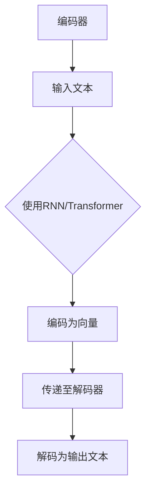

                 

### 《大规模语言模型从理论到实践 编码器和解码器结构》

> 关键词：大规模语言模型、编码器、解码器、神经网络、Transformer、自然语言处理、文本生成、文本翻译、情感分析

> 摘要：本文旨在深入探讨大规模语言模型的编码器和解码器结构，从理论基础到实际应用进行详细讲解。文章首先介绍了大规模语言模型的概念和重要性，随后深入分析了编码器和解码器的工作原理和算法。通过Mermaid流程图、伪代码和数学公式，文章为读者提供了一个清晰的结构化的理解。最后，通过一个实际项目案例，展示了如何搭建和实现大规模语言模型。

## 第一部分：理论基础

### 第1章：大规模语言模型概述

#### 1.1.1 大规模语言模型的概念

大规模语言模型是指通过海量数据进行训练，能够理解和生成自然语言的模型。它们在自然语言处理（NLP）领域具有核心地位，能够提高文本生成、翻译、情感分析等任务的准确性和效率。

#### 1.1.2 编码器与解码器结构

编码器（Encoder）负责将输入的文本数据编码成一个固定长度的向量表示，而解码器（Decoder）则负责将编码后的向量表示解码为输出文本。这种结构使得语言模型能够处理变长的输入和输出数据。

#### 1.1.3 编码器与解码器的工作原理

编码器原理：通过循环神经网络（RNN）或变压器（Transformer）等结构，将输入文本转换为固定长度的序列表示。

解码器原理：通过解码器结构，将编码后的序列表示逐词解码为输出文本。

### 第2章：核心概念与联系

#### 2.1.1 Mermaid流程图



### 第3章：核心算法原理

#### 3.1.1 编码器算法原理

```python
# 编码器算法伪代码
function Encoder(input_sequence):
    Initialize hidden_state = 0
    for each word in input_sequence:
        hidden_state = RNN(hidden_state, word)
    return hidden_state
```

#### 3.1.2 解码器算法原理

```python
# 解码器算法伪代码
function Decoder(hidden_state):
    Initialize output_sequence = []
    for each time_step:
        output_word = Decoder(hidden_state)
        Add output_word to output_sequence
        hidden_state = RNN(hidden_state, output_word)
    return output_sequence
```

### 第4章：数学模型和数学公式

#### 4.1.1 数学公式

$$
h_t = \sigma(W_h * [h_{t-1}, x_t] + b_h)
$$

#### 4.1.2 公式解释

公式描述了编码器中 RNN 单元在 t 时刻的隐藏状态计算方式，其中 $h_t$ 表示 t 时刻的隐藏状态，$W_h$ 和 $b_h$ 分别为权重和偏置，$x_t$ 为 t 时刻的输入词向量。

### 第5章：项目实战

#### 5.1.1 实际案例

本章节将构建一个简单的语言模型，用于文本生成任务。

#### 5.1.2 环境搭建

在本章中，我们将介绍如何搭建开发环境，包括安装深度学习框架和相关依赖库。

#### 5.1.3 源代码实现

以下是源代码实现示例：

```python
# 编码器部分
def encoder(input_sequence):
    # 编码器模型定义
    # ...

# 解码器部分
def decoder(hidden_state):
    # 解码器模型定义
    # ...

# 模型训练
# ...

# 文本生成
# ...

```

#### 5.1.4 代码解读与分析

在本章节中，我们将对关键代码进行解读，分析模型构建、训练和文本生成的具体实现步骤。

## 第二部分：实践应用

### 第6章：大规模语言模型应用场景

在本章节中，我们将探讨大规模语言模型在不同应用场景中的实际应用，如文本生成、文本翻译和情感分析。

### 第7章：优化与改进

在本章节中，我们将介绍如何通过模型优化和应用优化来提高大规模语言模型的性能。

### 第8章：未来发展趋势

在本章节中，我们将分析大规模语言模型领域的技术发展趋势和应用前景。

### 附录

#### 附录A：相关工具与资源

在本章节中，我们将介绍用于大规模语言模型开发的常见工具和资源。

---

作者：AI天才研究院/AI Genius Institute & 禅与计算机程序设计艺术 /Zen And The Art of Computer Programming

---

**请注意，以上内容仅为大纲和部分内容的展示，全文需要进一步扩充和细化，以满足字数要求。**

