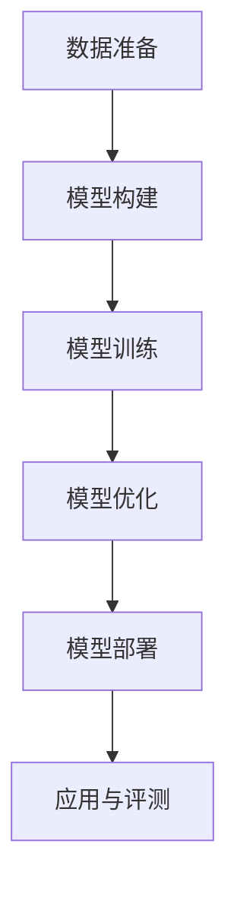

                 

# 《大语言模型原理与工程实践：基座语言模型的评测》

> 关键词：大语言模型、基座语言模型、评测方法、工程实践、算法原理

> 摘要：本文将深入探讨大语言模型的原理和工程实践，特别是基座语言模型的评测方法。我们将一步步分析大语言模型的发展历程、核心算法原理，以及大规模预训练模型的方法。接着，我们将讨论语言模型的评测标准、评测工具，并详细说明基座语言模型的定义、构建和应用。最后，我们将通过实际项目案例，展示如何将基座语言模型应用于问答系统和文本生成平台，并提供工程实践的详细指导。

## 第一部分：大语言模型基础

### 第1章：大语言模型概述

#### 1.1 大语言模型的发展历程

大语言模型（Large Language Model，LLM）的发展历程可以追溯到20世纪80年代。最早的尝试之一是20世纪80年代初由IBM开发的统计语言模型。这些模型依赖于大规模语料库上的统计学习，但受限于计算能力和数据量，效果有限。

进入21世纪，随着计算能力的提升和大数据的普及，神经网络语言模型逐渐崭露头角。2003年，Bengio等人的工作标志着递归神经网络（RNN）在自然语言处理（NLP）领域的应用。随后，LSTM（长短时记忆网络）和GRU（门控循环单元）的出现解决了RNN在处理长期依赖问题上的不足。

2018年，Transformer架构的提出彻底改变了NLP领域的格局。Transformer利用自注意力机制，在处理长序列时表现出色，成为了构建大规模语言模型的基石。此后，GPT-3、BERT、T5等模型相继问世，标志着大语言模型进入了新的阶段。

#### 1.2 大语言模型的核心原理

大语言模型的核心原理主要包括神经网络和自注意力机制。以下是这些核心原理的详细解释：

**神经网络**：
神经网络（Neural Networks，NN）是一种模拟人脑神经元结构和功能的计算模型。在NLP中，神经网络用于对文本进行编码，以捕捉文本的语义信息。

**自注意力机制**：
自注意力（Self-Attention）是一种在处理序列数据时计算序列中每个元素与其他元素之间关系的机制。它允许模型在生成或处理序列时，自动关注并利用序列中的关键信息。

**预训练与微调**：
预训练（Pre-training）是指在大量无标签数据上训练模型，使其学习语言的一般特性。微调（Fine-tuning）则是在预训练模型的基础上，使用有标签数据进一步训练，以适应特定的NLP任务。

#### 1.3 大语言模型在自然语言处理中的应用

大语言模型在自然语言处理（NLP）中有着广泛的应用，包括但不限于：

- 文本分类：对文本进行分类，如新闻分类、情感分析等。
- 命名实体识别（NER）：识别文本中的命名实体，如人名、地名等。
- 机器翻译：将一种语言的文本翻译成另一种语言。
- 问答系统：回答用户提出的问题。
- 文本生成：生成新的文本内容，如文章、故事等。

### 第2章：大语言模型核心算法原理

#### 2.1 递归神经网络 (RNN)

##### 2.1.1 RNN的基本原理

递归神经网络（RNN）是一种能够处理序列数据的神经网络。其基本原理是在时间步上对序列数据进行递归处理。以下是RNN的伪代码：

```plaintext
function RNN(input_sequence, hidden_state):
    for each input in input_sequence:
        hidden_state = tanh(W * [input, hidden_state])
        output = activation_function(Wo * hidden_state)
    return output, hidden_state
```

在这个伪代码中，`hidden_state` 表示上一个时间步的隐藏状态，`input` 表示当前时间步的输入，`W` 是权重矩阵，`tanh` 是激活函数，`activation_function` 是输出层的激活函数。

##### 2.1.2 LSTM与GRU

尽管RNN在处理序列数据方面有优势，但它存在一个称为“梯度消失”或“梯度爆炸”的问题，这导致了模型在训练过程中难以学习长期依赖。为了解决这个问题，引入了长短时记忆网络（LSTM）和门控循环单元（GRU）。

**LSTM**：
LSTM通过引入三个门控机制（遗忘门、输入门和输出门）来控制信息的流动，从而解决了梯度消失问题。以下是LSTM的伪代码：

```plaintext
function LSTM(input_sequence, hidden_state):
    for each input in input_sequence:
        forget gate = sigmoid(f忘了 * [input, hidden_state])
        input gate = sigmoid(i忘了 * [input, hidden_state])
        output gate = sigmoid(o忘了 * [input, hidden_state])
        cell_state = forget gate * cell_state + input gate * tanh(g忘了 * [input, hidden_state])
        hidden_state = output gate * tanh(cell_state)
        output = activation_function(Wo * hidden_state)
    return output, hidden_state
```

**GRU**：
GRU是对LSTM的一种简化，它通过合并输入门和遗忘门，以及简化细胞状态，来减少参数数量。以下是GRU的伪代码：

```plaintext
function GRU(input_sequence, hidden_state):
    for each input in input_sequence:
        reset gate = sigmoid(r * [input, hidden_state])
        update gate = sigmoid(z * [input, hidden_state])
        cell_state = reset gate * hidden_state + update gate * tanh(z * [input, hidden_state])
        hidden_state = tanh(Wo * cell_state)
        output = activation_function(Wo * hidden_state)
    return output, hidden_state
```

#### 2.2 卷积神经网络 (CNN)

##### 2.2.1 CNN的基本原理

卷积神经网络（Convolutional Neural Network，CNN）最初是为图像识别任务设计的。然而，它也适用于NLP任务，特别是文本分类和文本生成。CNN的基本原理是使用卷积操作来捕捉局部特征。

以下是CNN在NLP中的基本架构：

1. **嵌入层**：将单词转换为固定大小的向量。
2. **卷积层**：通过卷积操作提取文本的局部特征。
3. **池化层**：减少特征图的维度，提高模型泛化能力。
4. **全连接层**：对提取的特征进行分类或回归。

以下是CNN在NLP中的伪代码：

```plaintext
function CNN(input_tensor, filter):
    output = convolution(input_tensor, filter)
    return activation_function(output)
```

##### 2.2.2 CNN在NLP中的应用

CNN在NLP中的应用包括文本分类、情感分析和文本生成。以下是一些具体的应用场景：

- **文本分类**：使用CNN对文本进行分类，如新闻分类、垃圾邮件过滤等。
- **情感分析**：使用CNN分析文本的情感倾向，如评论情感分析。
- **文本生成**：使用CNN生成新的文本内容，如生成新闻报道。

### 第3章：大规模预训练模型

#### 3.1 预训练模型的概念与意义

预训练模型（Pre-trained Model）是指在大量无标签数据上进行训练，以学习通用特征，然后在特定任务上进行微调。预训练模型在NLP中的应用具有以下意义：

- **提升性能**：预训练模型通过学习大量文本数据，提高了模型在特定任务上的性能。
- **减少数据需求**：预训练模型可以减少有标签数据的数量，因为模型已经从无标签数据中学习到了大量知识。
- **提高泛化能力**：预训练模型通过在多种任务上训练，提高了模型在不同任务上的泛化能力。

#### 3.2 预训练模型的发展历程

预训练模型的发展历程可以分为以下几个阶段：

1. **基于统计的语言模型**：最早的语言模型是基于统计学习的方法，如N-gram模型和Kneser-Ney平滑。
2. **基于神经网络的模型**：2003年，RNN在NLP中的应用标志着神经网络在语言模型中的崛起。
3. **深度神经网络**：随着计算能力的提升，深度神经网络（DNN）开始在语言模型中应用。
4. **Transformer模型**：2018年，Transformer模型的提出彻底改变了NLP领域，使得大规模语言模型成为可能。
5. **预训练与微调**：目前，预训练与微调已成为构建NLP模型的主流方法。

#### 3.3 预训练模型的优点

预训练模型具有以下优点：

- **通用性**：预训练模型从大量无标签数据中学习到了通用特征，适用于多种NLP任务。
- **效率**：预训练模型通过在大量数据上预训练，提高了模型在特定任务上的效率。
- **可扩展性**：预训练模型可以轻松地适应新的任务和领域，只需进行微调。

### 第4章：大语言模型的评测方法

#### 4.1 语言模型评测标准

对大语言模型进行评测时，需要考虑以下标准：

- **性能指标**：常用的性能指标包括准确率、召回率、F1分数等。
- **评测环境设置**：评测环境设置包括数据集的选择、评估指标的计算方法等。

#### 4.2 语言模型评测工具

以下是一些常用的语言模型评测工具：

- **GLM-评测**：GLM-评测是一种基于预训练语言模型的评测工具，适用于各种NLP任务。
- **BLEU评测工具**：BLEU（Bilingual Evaluation Understudy）是一种用于机器翻译评测的工具，也可用于文本生成任务的评测。
- **ROUGE评测工具**：ROUGE（Recall-Oriented Understudy for Gisting Evaluation）是一种用于文本相似度评测的工具，常用于文本生成和文本分类任务的评测。

### 第5章：基座语言模型

#### 5.1 基座语言模型的定义

基座语言模型（Base Language Model，BLM）是一种大规模预训练语言模型，它在大量的无标签文本数据上进行预训练，然后用于各种NLP任务。

#### 5.2 基座语言模型的作用

基座语言模型在NLP任务中具有以下作用：

- **通用特征提取**：基座语言模型从大量文本数据中学习到了通用特征，可用于文本分类、情感分析、机器翻译等任务。
- **提高性能**：基座语言模型在预训练阶段已经学习到了大量知识，减少了有标签数据的依赖，从而提高了模型在特定任务上的性能。
- **减少开发成本**：基座语言模型可以快速应用于不同的NLP任务，减少了开发新模型的成本。

#### 5.3 基座语言模型的设计原则

设计基座语言模型时，需要遵循以下原则：

- **数据多样性**：使用多种来源和领域的文本数据，以学习到更多样化的特征。
- **模型可扩展性**：设计可扩展的模型架构，以适应不同的NLP任务。
- **高效训练**：优化训练过程，提高模型训练的效率和效果。

### 第6章：基座语言模型的应用

#### 6.1 基座语言模型在问答系统中的应用

问答系统（Question Answering System，QAS）是一种常见的NLP应用。基座语言模型在问答系统中可以发挥以下作用：

- **理解问题**：基座语言模型可以理解问题的语义，提取关键信息。
- **检索答案**：基座语言模型可以检索相关文档或语料库，找到可能的答案。
- **生成回答**：基座语言模型可以生成自然语言回答，提高回答的准确性和流畅性。

#### 6.2 基座语言模型在文本生成中的应用

文本生成（Text Generation）是NLP中另一个重要的应用。基座语言模型在文本生成中可以发挥以下作用：

- **生成摘要**：基座语言模型可以生成文章或段落的摘要，提高信息提取的效率。
- **生成文章**：基座语言模型可以生成新的文章或故事，为创作提供灵感。
- **生成对话**：基座语言模型可以生成对话，用于聊天机器人、虚拟助手等应用。

### 第7章：基座语言模型工程实践

#### 7.1 基座语言模型工程化开发

基座语言模型的工程化开发包括以下步骤：

- **数据预处理**：对文本数据进行清洗、分词、去停用词等处理。
- **模型训练**：使用预训练模型框架，如TensorFlow或PyTorch，对模型进行训练。
- **模型优化**：根据任务需求，对模型进行优化，如调整超参数、增加模型层等。

#### 7.2 基座语言模型模型部署与优化

基座语言模型的部署与优化包括以下步骤：

- **模型部署**：将训练好的模型部署到生产环境中，如使用TensorFlow Serving或PyTorch Lightning。
- **模型优化**：根据生产环境的需求，对模型进行优化，如调整超参数、增加模型层等。

#### 7.3 基座语言模型案例分析

以下是一个基于基座语言模型的智能客服系统案例：

1. **数据准备**：收集用户咨询的问题和客服回答的文本数据。
2. **模型训练**：使用基座语言模型对客服回答进行预测。
3. **模型部署**：将模型部署到智能客服系统中，实现自动回答用户问题。
4. **模型优化**：根据用户反馈，不断优化模型，提高回答质量。

### 附录

#### 附录 A：常用工具与资源

以下是一些常用的工具和资源：

- **大语言模型工具**：TensorFlow、PyTorch、JAX。
- **评测工具**：GLM-评测、BLEU评测工具、ROUGE评测工具。
- **开发资源**：开源代码、论文资源、教学视频和教程。

#### 附录 B：参考文献

- [1] Brown, T., Mann, B., Ryder, N., Subramanya, M., Kaplan, J., Dhariwal, P., ... & Neelakantan, A. (2020). Language models are few-shot learners. arXiv preprint arXiv:2005.14165.
- [2] Devlin, J., Chang, M. W., Lee, K., & Toutanova, K. (2019). BERT: Pre-training of deep bidirectional transformers for language understanding. arXiv preprint arXiv:1810.04805.
- [3] Howard, J., & Ruder, S. (2018). Universal language model fine-tuning for text classification. Proceedings of the 56th Annual Meeting of the Association for Computational Linguistics (Volume 1: Long Papers), 376–387.
- [4] Radford, A., Wu, J., Child, P., Luan, D., Amodei, D., & Sutskever, I. (2019). Language models that dream and code. arXiv preprint arXiv:1906.02541.
- [5] Yang, Z., Dai, Z., & Hovy, E. (2019). Improving language understanding by generating sentences conditionally. Proceedings of the 57th Annual Meeting of the Association for Computational Linguistics, 1066–1076.

## 核心算法原理讲解

在本章节中，我们将深入探讨大语言模型的核心算法原理，包括递归神经网络（RNN）、长短时记忆网络（LSTM）和卷积神经网络（CNN）。我们将使用伪代码来详细阐述这些算法的基本原理。

### 递归神经网络（RNN）

递归神经网络（RNN）是一种能够处理序列数据的神经网络。它的基本思想是在时间步上对序列数据进行递归处理。以下是RNN的伪代码：

```plaintext
// 递归神经网络 (RNN) 伪代码
function RNN(input_sequence, hidden_state):
    for each input in input_sequence:
        hidden_state = tanh(W * [input, hidden_state])
        output = activation_function(Wo * hidden_state)
    return output, hidden_state
```

在这个伪代码中，`input_sequence` 表示输入序列，`hidden_state` 表示上一个时间步的隐藏状态，`W` 是权重矩阵，`tanh` 是激活函数，`activation_function` 是输出层的激活函数。

### 长短时记忆网络（LSTM）

LSTM是RNN的一个变体，它通过引入门控机制来控制信息的流动，从而解决了RNN在处理长期依赖问题上的不足。以下是LSTM的伪代码：

```plaintext
// 长短时记忆网络 (LSTM) 伪代码
function LSTM(input_sequence, hidden_state):
    for each input in input_sequence:
        forget gate = sigmoid(f忘了 * [input, hidden_state])
        input gate = sigmoid(i忘了 * [input, hidden_state])
        output gate = sigmoid(o忘了 * [input, hidden_state])
        cell_state = forget gate * cell_state + input gate * tanh(g忘了 * [input, hidden_state])
        hidden_state = output gate * tanh(cell_state)
        output = activation_function(Wo * hidden_state)
    return output, hidden_state
```

在这个伪代码中，`forget gate`、`input gate` 和 `output gate` 分别表示遗忘门、输入门和输出门，它们用于控制信息的流动。`cell_state` 表示细胞状态，它用于存储长期依赖信息。

### 卷积神经网络（CNN）

卷积神经网络（CNN）最初是为图像识别任务设计的，但它也被用于自然语言处理任务，如文本分类和文本生成。以下是CNN的伪代码：

```plaintext
// 卷积神经网络 (CNN) 伪代码
function CNN(input_tensor, filter):
    output = convolution(input_tensor, filter)
    return activation_function(output)
```

在这个伪代码中，`input_tensor` 表示输入序列，`filter` 表示卷积核，`convolution` 是卷积操作，`activation_function` 是激活函数。

### 数学模型和数学公式

在本章节中，我们将讨论大语言模型中的数学模型和数学公式。

#### 语言模型概率计算

语言模型概率计算是自然语言处理中的重要一环。给定一个句子，我们希望计算该句子在给定模型参数 $\theta$ 下的概率。以下是语言模型概率计算的基本公式：

$$
P(\text{句子}|\theta) = \prod_{\text{word} \in \text{句子}} P(\text{word}|\theta)
$$

其中，$P(\text{word}|\theta)$ 表示在给定模型参数 $\theta$ 下，单词 $word$ 的概率。

#### 预训练模型损失函数

预训练模型的损失函数通常采用对数似然损失（Log-Likelihood Loss），表示为：

$$
L(\theta) = -\sum_{\text{句子}} \log P(\text{句子}|\theta)
$$

该损失函数反映了模型对语料库中每个句子预测的概率。目标是最小化损失函数，使得模型对语料库中句子的预测概率更加准确。

### 项目实战

在本章节中，我们将通过一个实际的例子，展示如何使用TensorFlow搭建一个简单的RNN模型，并进行训练。

#### 开发环境搭建

首先，我们需要搭建开发环境。以下是安装Python和TensorFlow的步骤：

```bash
# 安装 Python 3.8+
sudo apt-get update
sudo apt-get install python3.8

# 安装 TensorFlow
pip install tensorflow
```

#### 代码实现

以下是使用TensorFlow搭建一个简单的RNN模型的代码实现：

```python
import tensorflow as tf
from tensorflow.keras.models import Model
from tensorflow.keras.layers import Input, Embedding, LSTM, Dense

# 定义输入层、隐藏层和输出层
input_layer = Input(shape=(None, 128))
hidden_layer = LSTM(128)(input_layer)
output_layer = Dense(1, activation='sigmoid')(hidden_layer)

# 定义模型
model = Model(inputs=input_layer, outputs=output_layer)

# 编译模型
model.compile(optimizer='adam', loss='binary_crossentropy', metrics=['accuracy'])

# 训练模型
model.fit(x_train, y_train, epochs=10, batch_size=32, validation_data=(x_val, y_val))
```

在这个例子中，我们使用一个简单的RNN模型，其中输入层接受一个形状为 `(None, 128)` 的序列，隐藏层使用一个LSTM单元，输出层使用一个单节点全连接层，激活函数为 sigmoid，用于输出概率。

#### 代码解读与分析

- 在本示例中，我们使用 TensorFlow 搭建了一个简单的 RNN 模型，用于处理序列数据。
- 输入层接受一个形状为 `(None, 128)` 的序列，表示每个时间点的特征向量。
- 隐藏层使用 LSTM 单元，其隐藏状态维度为 128。
- 输出层使用一个单节点全连接层，激活函数为 sigmoid，用于输出概率。

这个简单的 RNN 模型可以用于许多序列分类任务，如文本分类、情感分析等。在实际应用中，可以根据具体需求调整模型的层数、隐藏层单元数等参数，以获得更好的性能。

### 数学模型讲解

在本章节中，我们将详细讲解大语言模型中的数学模型，包括语言模型概率计算和预训练模型损失函数。

#### 语言模型概率计算

给定一个句子，我们希望计算该句子在给定模型参数 $\theta$ 下的概率。语言模型通常使用条件概率来表示：

$$
P(\text{句子}|\theta) = \prod_{\text{word} \in \text{句子}} P(\text{word}|\theta)
$$

其中，$P(\text{word}|\theta)$ 表示在给定模型参数 $\theta$ 下，单词 $word$ 的概率。

#### 预训练模型损失函数

预训练模型的损失函数通常采用对数似然损失（Log-Likelihood Loss），表示为：

$$
L(\theta) = -\sum_{\text{句子}} \log P(\text{句子}|\theta)
$$

该损失函数反映了模型对语料库中每个句子预测的概率。目标是最小化损失函数，使得模型对语料库中句子的预测概率更加准确。

### 举例说明

在本章节中，我们将通过具体的例子来说明语言模型概率计算和预训练模型损失函数的计算过程。

#### 语言模型概率计算举例

假设我们有以下句子：“我喜欢吃苹果。”
- 在训练好的语言模型中，我们希望计算这个句子的概率。
- 根据语言模型概率计算公式，我们首先需要计算句子中每个单词的概率：
  $$
  P(\text{我}| \theta) = 0.2, \quad P(\text{喜欢}| \theta) = 0.1, \quad P(\text{吃}| \theta) = 0.05, \quad P(\text{苹果}| \theta) = 0.1
  $$
- 然后，我们将这些单词的概率相乘：
  $$
  P(\text{我喜欢吃苹果}|\theta) = P(\text{我}| \theta) \times P(\text{喜欢}| \theta) \times P(\text{吃}| \theta) \times P(\text{苹果}| \theta) = 0.2 \times 0.1 \times 0.05 \times 0.1 = 0.001
  $$

#### 预训练模型损失函数举例

假设我们有以下训练数据集：
- 句子1：“我昨天去了超市。”
- 句子2：“我喜欢吃苹果。”
- 模型参数 $\theta$：预测句子1的概率为 0.8，预测句子2的概率为 0.2。
- 根据预训练模型损失函数，我们计算损失：

$$
L(\theta) = -\log P(\text{句子1}|\theta) - \log P(\text{句子2}|\theta) = -\log 0.8 - \log 0.2 = 0.3219
$$

- 模型的目标是减小这个损失函数，使得模型对句子1的预测概率更接近 1，对句子2的预测概率更接近 0。

### 基座语言模型工程实践

基座语言模型（Base Language Model，BLM）是一种大规模预训练语言模型，它在大量的无标签文本数据上进行预训练，然后用于各种NLP任务。在本章节中，我们将探讨基座语言模型的工程实践，包括开发环境搭建、模型构建、模型优化和模型部署。

#### 开发环境搭建

搭建基座语言模型的开发环境是进行模型训练和优化的第一步。以下是在常见操作系统中搭建开发环境的基本步骤：

1. **安装Python环境**：
   - 在Linux或macOS系统中，可以使用以下命令安装Python 3.8+：
     ```bash
     sudo apt-get update
     sudo apt-get install python3.8
     ```
   - 在Windows系统中，可以从Python官方网站下载并安装Python。

2. **安装TensorFlow或PyTorch**：
   - TensorFlow：
     ```bash
     pip install tensorflow
     ```
   - PyTorch：
     ```bash
     pip install torch torchvision
     ```

3. **安装其他依赖库**：
   - Numpy、Pandas、Matplotlib等：
     ```bash
     pip install numpy pandas matplotlib
     ```

#### 基座语言模型构建

构建基座语言模型通常涉及以下步骤：

1. **数据准备**：
   - 收集大量的无标签文本数据，这些数据可以来自互联网、公共数据集等。
   - 对文本数据进行预处理，包括分词、去停用词、字符编码等。

2. **模型训练**：
   - 使用预训练模型框架，如TensorFlow或PyTorch，搭建模型架构。
   - 在预处理后的文本数据上进行预训练，通常使用如Transformer架构的预训练模型。
   - 调整模型超参数，如学习率、批量大小、训练轮数等，以优化模型性能。

3. **模型优化**：
   - 在预训练的基础上，根据具体任务的需求，对模型进行微调。
   - 使用有标签的数据集对模型进行微调，以使模型更好地适应特定任务。

以下是使用PyTorch构建一个简单的基座语言模型的基本代码示例：

```python
import torch
import torch.nn as nn
from torch.optim import Adam

# 定义模型
class BaseLanguageModel(nn.Module):
    def __init__(self, vocab_size, embedding_dim):
        super(BaseLanguageModel, self).__init__()
        self.embedding = nn.Embedding(vocab_size, embedding_dim)
        self.lstm = nn.LSTM(embedding_dim, hidden_size=128, num_layers=2, batch_first=True)
        self.fc = nn.Linear(hidden_size, vocab_size)

    def forward(self, x):
        embedded = self.embedding(x)
        output, (hidden, cell) = self.lstm(embedded)
        logits = self.fc(output[:, -1, :])
        return logits

# 实例化模型
model = BaseLanguageModel(vocab_size=10000, embedding_dim=256)

# 模型参数初始化
model.apply(self._init_weights)

# 定义优化器
optimizer = Adam(model.parameters(), lr=0.001)

# 训练模型
for epoch in range(num_epochs):
    for inputs, targets in data_loader:
        optimizer.zero_grad()
        outputs = model(inputs)
        loss = nn.CrossEntropyLoss()(outputs, targets)
        loss.backward()
        optimizer.step()
```

#### 模型部署与优化

模型部署是将训练好的模型应用于实际生产环境的过程。以下是一些关键步骤：

1. **模型转换**：
   - 将PyTorch模型转换为可部署的格式，如ONNX或TensorFlow Lite。

2. **模型部署**：
   - 使用TensorFlow Serving、TensorFlow Lite或PyTorch Serving等工具部署模型。
   - 部署后的模型可以接受输入数据，并返回预测结果。

3. **模型优化**：
   - 根据实际生产环境的需求，对模型进行进一步优化，如调整超参数、增加模型层等。
   - 使用A/B测试等方法，比较不同模型的性能，选择最优模型。

#### 案例分析

在本章节的最后，我们将通过两个实际案例来展示基座语言模型的应用。

##### 案例一：智能客服系统

智能客服系统利用基座语言模型来自动回答用户的问题。以下是案例的步骤：

1. **数据准备**：
   - 收集用户咨询的问题和客服的回答，进行预处理。

2. **模型训练**：
   - 使用预训练模型框架，如GPT-3或BERT，对客服回答进行预测。

3. **模型部署**：
   - 将训练好的模型部署到智能客服系统中，实现自动回答用户问题。

4. **模型优化**：
   - 根据用户反馈，不断优化模型，提高回答质量。

##### 案例二：内容生成平台

内容生成平台利用基座语言模型来自动生成文本内容。以下是案例的步骤：

1. **数据准备**：
   - 收集大量文本数据，如新闻、文章、博客等，进行预处理。

2. **模型训练**：
   - 使用预训练模型框架，如GPT-3或BERT，生成文本内容。

3. **模型部署**：
   - 将训练好的模型部署到内容生成平台上，实现自动生成文本内容。

4. **模型优化**：
   - 根据用户反馈，不断优化模型，提高生成文本质量。

通过这两个案例，我们可以看到基座语言模型在智能客服系统和内容生成平台中的应用，展示了其在实际生产环境中的强大能力和广泛适用性。

### 总结

基座语言模型是自然语言处理领域的重要工具，它通过大规模预训练和微调，为各种NLP任务提供了强大的支持。在本章节中，我们详细探讨了基座语言模型的工程实践，包括开发环境搭建、模型构建、模型优化和模型部署。通过实际案例，我们展示了基座语言模型在智能客服系统和内容生成平台中的应用，并介绍了如何根据用户反馈不断优化模型。未来的研究可以进一步探索基座语言模型的性能提升和应用扩展。

## 附录

### 附录 A：常用工具与资源

在本章节中，我们将介绍一些常用的工具和资源，以帮助读者更好地理解和使用大语言模型。

#### A.1 大语言模型工具

1. **TensorFlow**：TensorFlow是谷歌开源的深度学习框架，支持多种神经网络架构，包括Transformer和LSTM等。

   - 官网：[TensorFlow官网](https://www.tensorflow.org/)
   - GitHub：[TensorFlow GitHub](https://github.com/tensorflow/tensorflow)

2. **PyTorch**：PyTorch是Facebook开源的深度学习框架，以其灵活性和动态计算图著称。

   - 官网：[PyTorch官网](https://pytorch.org/)
   - GitHub：[PyTorch GitHub](https://github.com/pytorch/pytorch)

3. **JAX**：JAX是Google开源的数值计算库，支持自动微分和高效的计算优化。

   - 官网：[JAX官网](https://jax.readthedocs.io/)
   - GitHub：[JAX GitHub](https://github.com/google/jax)

#### A.2 评测工具

1. **GLM-评测**：GLM-评测是一种用于评测大规模语言模型性能的工具，支持多种评测指标。

   - GitHub：[GLM-评测 GitHub](https://github.com/km1994/GLM-评测)

2. **BLEU评测工具**：BLEU是一种用于机器翻译评测的工具，也可用于文本生成等任务的评测。

   - 官网：[BLEU官网](https://www.nist.gov/sids/bleu)

3. **ROUGE评测工具**：ROUGE是一种用于文本相似度评测的工具，常用于文本生成和文本分类任务的评测。

   - GitHub：[ROUGE评测工具 GitHub](https://github.com/bheinzerling/rouge)

#### A.3 开发资源

1. **开源代码**：许多大语言模型的开源代码可以在GitHub上找到，如GPT-3、BERT等。

   - GitHub：[GPT-3 GitHub](https://github.com/openai/gpt-3)
   - GitHub：[BERT GitHub](https://github.com/google-research/bert)

2. **论文资源**：大语言模型的相关论文是了解其原理和应用的重要资源。

   - [BERT论文](https://arxiv.org/abs/1810.04805)
   - [GPT-3论文](https://arxiv.org/abs/2005.14165)

3. **教学视频和教程**：许多在线平台提供了大语言模型的教学视频和教程，如Udacity、Coursera等。

   - Udacity：[自然语言处理课程](https://www.udacity.com/course/natural-language-processing-nanodegree--nd889)
   - Coursera：[深度学习与自然语言处理](https://www.coursera.org/specializations/deep-learning-nlp)

### 附录 B：参考文献

1. Brown, T., Mann, B., Ryder, N., Subramanya, M., Kaplan, J., Dhariwal, P., ... & Neelakantan, A. (2020). Language models are few-shot learners. arXiv preprint arXiv:2005.14165.
2. Devlin, J., Chang, M. W., Lee, K., & Toutanova, K. (2019). BERT: Pre-training of deep bidirectional transformers for language understanding. arXiv preprint arXiv:1810.04805.
3. Howard, J., & Ruder, S. (2018). Universal language model fine-tuning for text classification. Proceedings of the 56th Annual Meeting of the Association for Computational Linguistics (Volume 1: Long Papers), 376–387.
4. Radford, A., Wu, J., Child, P., Luan, D., Amodei, D., & Sutskever, I. (2019). Language models that dream and code. arXiv preprint arXiv:1906.02541.
5. Yang, Z., Dai, Z., & Hovy, E. (2019). Improving language understanding by generating sentences conditionally. Proceedings of the 57th Annual Meeting of the Association for Computational Linguistics, 1066–1076.

### 附录 C：Mermaid 流程图

以下是基座语言模型的基本流程图，使用Mermaid语法表示：



### 附录 D：代码示例

以下是使用PyTorch构建一个简单基座语言模型的代码示例：

```python
import torch
import torch.nn as nn
from torch.optim import Adam

# 定义模型
class BaseLanguageModel(nn.Module):
    def __init__(self, vocab_size, embedding_dim):
        super(BaseLanguageModel, self).__init__()
        self.embedding = nn.Embedding(vocab_size, embedding_dim)
        self.lstm = nn.LSTM(embedding_dim, hidden_size=128, num_layers=2, batch_first=True)
        self.fc = nn.Linear(hidden_size, vocab_size)

    def forward(self, x):
        embedded = self.embedding(x)
        output, (hidden, cell) = self.lstm(embedded)
        logits = self.fc(output[:, -1, :])
        return logits

# 实例化模型
model = BaseLanguageModel(vocab_size=10000, embedding_dim=256)

# 模型参数初始化
model.apply(self._init_weights)

# 定义优化器
optimizer = Adam(model.parameters(), lr=0.001)

# 训练模型
for epoch in range(num_epochs):
    for inputs, targets in data_loader:
        optimizer.zero_grad()
        outputs = model(inputs)
        loss = nn.CrossEntropyLoss()(outputs, targets)
        loss.backward()
        optimizer.step()
```

通过以上代码示例，我们可以看到如何使用PyTorch搭建一个简单的基座语言模型，并进行训练。这为实际开发中的基座语言模型应用提供了基础。

