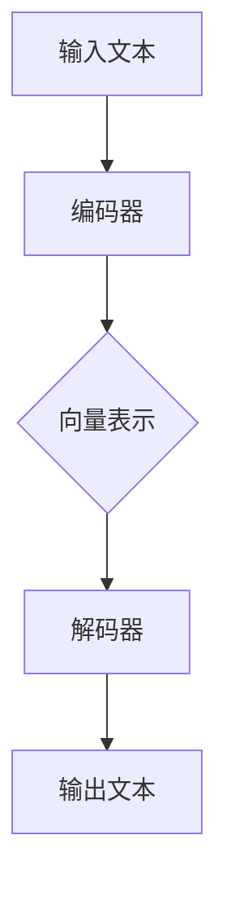

                 

# 大语言模型原理与工程实践：强化学习工程实践 DeepSpeed-Chat 训练调优实践

## 关键词
大语言模型、强化学习、DeepSpeed、Chat、训练调优

## 摘要
本文深入探讨了大型语言模型的原理与工程实践，特别是在强化学习领域中的应用。我们首先介绍了大语言模型的基本概念和架构，然后详细解析了强化学习的基本原理和算法。接着，我们讨论了大语言模型与强化学习的结合方法及其应用，特别是在DeepSpeed-Chat模型中的训练调优实践。最后，本文展望了未来发展趋势，提出了研究热点和挑战。

### 第一部分：大语言模型基础

#### 第1章：大语言模型概述

##### 1.1 大语言模型的概念

大语言模型（Large-scale Language Models）是一种基于深度学习的自然语言处理模型。它们通过在大规模语料库上进行预训练，学习到语言的普遍规律和复杂结构，从而能够处理多种自然语言处理任务。例如，文本分类、机器翻译、问答系统等。

**基本原理：**

大语言模型通常基于变换器模型（Transformer Model），这是一种由Vaswani等人在2017年提出的模型。变换器模型由编码器（Encoder）和解码器（Decoder）两部分组成，它们分别处理输入和输出文本。编码器将文本转换为固定长度的向量表示，解码器则根据这些向量生成文本。

**核心架构：**



**Mermaid 流程图：**


**大语言模型的进化历史：**

- **早期模型**：以词袋模型（Bag of Words）和n-gram模型为代表，这些模型依赖于简单的统计特征。
- **深度学习时代**：以循环神经网络（Recurrent Neural Network，RNN）和长短期记忆网络（Long Short-Term Memory，LSTM）为代表，这些模型能够捕捉序列数据中的长期依赖关系。
- **现代大模型**：如GPT（Generative Pre-trained Transformer）、BERT（Bidirectional Encoder Representations from Transformers）和T5（Text-To-Text Transfer Transformer）等，它们通过预训练和微调技术，在多种任务上取得了显著的性能提升。

**大语言模型的应用：**

- **文本分类**：用于分类文本数据，如情感分析、主题分类等。
- **机器翻译**：将一种语言的文本翻译成另一种语言。
- **问答系统**：通过理解问题和上下文，提供准确的答案。
- **文本生成**：生成文本摘要、文章、对话等。

**大语言模型的优势和挑战：**

- **优势**：
  - 高效处理大量文本数据。
  - 强大的泛化能力，可以应用于多种任务。
  - 能够生成高质量的自然语言文本。

- **挑战**：
  - 需要大量的计算资源和数据。
  - 可能会出现偏见和误导性输出。
  - 难以理解和解释模型的决策过程。

#### 第2章：强化学习基础

##### 2.1 强化学习概述

强化学习（Reinforcement Learning，RL）是一种通过试错来学习最优策略的机器学习方法。它主要依赖于代理（Agent）、环境（Environment）、状态（State）、动作（Action）和奖励（Reward）这五个基本元素。

**主要元素：**

- **代理（Agent）**：执行动作并学习策略的实体。
- **环境（Environment）**：代理行动的场所，提供状态和奖励。
- **状态（State）**：代理当前所处的情境。
- **动作（Action）**：代理能够执行的操作。
- **策略（Policy）**：代理如何选择动作的规则。

**基本概念：**

强化学习的主要目标是找到一种策略，使得代理在给定环境中能够获得最大的累计奖励。代理通过与环境交互，不断更新其策略，直到达到某种收敛状态。

**主要元素之间的关系：**

- **状态与动作**：代理在某一状态下选择动作，并执行该动作。
- **动作与奖励**：代理执行动作后，环境会给予相应的奖励，用于评估动作的好坏。
- **策略更新**：代理根据奖励和历史经验，不断调整策略，以期望获得更好的长期回报。

**主要算法：**

- **值迭代（Value Iteration）**：通过迭代更新价值函数，直到收敛。
- **策略迭代（Policy Iteration）**：交替更新策略和价值函数。

**强化学习在自然语言处理中的应用：**

- **对话系统**：通过强化学习优化对话系统的回复策略。
- **机器翻译**：通过强化学习优化翻译模型，提高翻译质量。
- **文本摘要**：使用强化学习生成摘要文本。

##### 2.2 强化学习的基本原理

强化学习的基本原理可以概括为奖励机制、价值函数和策略优化。

- **奖励机制**：奖励机制是强化学习的关键部分，它决定了代理行为的偏好。在强化学习中，代理根据当前状态和动作获得的奖励来评估该动作的好坏。奖励可以是正值，也可以是负值，正奖励表示代理行为带来了积极的结果，负奖励表示代理行为带来了不利的后果。

- **价值函数**：价值函数（Value Function）是强化学习的核心概念之一，它用于评估代理在给定状态下执行特定动作的预期回报。价值函数可以分为状态价值函数（State-Value Function）和动作价值函数（Action-Value Function）。状态价值函数表示代理在某一状态下采取最优动作的预期回报，动作价值函数表示代理在某一状态下采取某一动作的预期回报。

- **策略优化**：策略优化是强化学习的最终目标，即找到一种最优策略，使得代理在给定环境中能够获得最大的累计奖励。策略优化可以通过值迭代（Value Iteration）或策略迭代（Policy Iteration）来实现。

##### 2.3 基本强化学习算法

强化学习中有多种基本算法，其中最常用的包括值迭代（Value Iteration）和策略迭代（Policy Iteration）。

- **值迭代（Value Iteration）**：值迭代是一种通过迭代更新价值函数来寻找最优策略的方法。在值迭代过程中，代理会根据当前状态和动作的价值函数，不断更新其策略，直到收敛。值迭代的伪代码如下：

  ```python
  for i in range(max_iterations):
      for state in all_states:
          for action in all_actions:
              action_value = reward + discount_factor * max_value_of_next_state
              if action_value > current_action_value:
                  current_action_value = action_value
  ```

- **策略迭代（Policy Iteration）**：策略迭代是一种交替更新策略和价值函数的方法。在策略迭代过程中，代理首先根据当前策略计算状态价值函数，然后使用状态价值函数更新策略，最后再次计算状态价值函数。策略迭代的伪代码如下：

  ```python
  for i in range(max_iterations):
      # 根据当前策略计算状态价值函数
      for state in all_states:
          for action in all_actions:
              state_value = sum(reward * P(next_state | state, action) for next_state in all_states)
      # 使用状态价值函数更新策略
      for state in all_states:
          best_action = argmax(action_value for action in all_actions)
      # 再次计算状态价值函数
      for state in all_states:
          for action in all_actions:
              action_value = reward + discount_factor * sum(state_value[next_state] * P(next_state | state, action) for next_state in all_states)
  ```

##### 2.4 强化学习在自然语言处理中的应用

强化学习在自然语言处理（Natural Language Processing，NLP）领域有着广泛的应用，以下是一些典型的应用场景：

- **对话系统**：强化学习可以用于对话系统的回复策略优化。通过学习用户的输入，生成合适的回复，从而提高对话系统的用户体验。

- **机器翻译**：强化学习可以用于机器翻译中的翻译策略优化。通过学习源语言和目标语言之间的对应关系，生成更准确、自然的翻译结果。

- **文本摘要**：强化学习可以用于文本摘要的生成策略优化。通过学习摘要文本和原始文本之间的对应关系，生成更简洁、精准的摘要。

### 第二部分：大语言模型与强化学习结合

#### 第3章：大语言模型在强化学习中的应用

大语言模型在强化学习中的应用主要体现在语言建模和交互式学习两个方面。

##### 3.1 语言建模

语言建模是强化学习中的一个重要组成部分，它用于预测下一个单词或句子，为强化学习提供语言信息。大语言模型由于其强大的语言理解能力，可以用于语言建模，从而提高强化学习的表现。

**语言建模的基本原理：**

语言建模的目标是学习一个概率模型，该模型能够预测下一个单词或句子。大语言模型通过在大规模语料库上进行预训练，学习到了语言的统计规律和结构。在强化学习中，语言建模可以用于以下场景：

- **自然语言输入**：当代理需要处理自然语言输入时，如对话系统中的用户输入，大语言模型可以用于生成合适的动作，使得代理能够更好地理解和响应用户的输入。

- **自然语言输出**：当代理需要生成自然语言输出时，如机器翻译系统，大语言模型可以用于生成更自然、流畅的翻译结果。

**实现方法：**

实现语言建模的方法通常包括以下步骤：

1. **数据预处理**：对输入文本进行预处理，如分词、去停用词等，以便于模型处理。

2. **模型选择**：选择合适的大语言模型，如GPT、BERT等，这些模型在自然语言处理任务上已经取得了显著的性能提升。

3. **模型训练**：使用预训练模型在大规模语料库上进行训练，学习到语言的统计规律和结构。

4. **模型部署**：将训练好的模型部署到强化学习系统中，用于生成预测结果。

##### 3.2 交互式学习

交互式学习是指代理与环境进行交互，通过不断尝试和反馈来学习最优策略。大语言模型可以用于交互式学习，提高代理的学习效率。

**交互式学习的基本原理：**

交互式学习的基本原理是通过试错来学习最优策略。代理在给定环境中采取动作，然后根据环境的反馈调整策略。大语言模型可以提供丰富的语言信息，帮助代理更好地理解和学习环境。

**实现方法：**

实现交互式学习的方法通常包括以下步骤：

1. **环境搭建**：构建一个适合强化学习任务的仿真环境，如对话系统、机器翻译系统等。

2. **模型选择**：选择合适的大语言模型，如GPT、BERT等。

3. **交互过程**：代理与环境进行交互，不断尝试不同的动作，并根据反馈调整策略。

4. **模型更新**：根据代理的交互结果，更新大语言模型，使其更好地适应环境。

**案例研究：**

以对话系统为例，交互式学习的实现步骤如下：

1. **数据预处理**：对对话数据集进行预处理，如分词、去停用词等。

2. **模型选择**：选择GPT作为大语言模型，用于生成回复。

3. **交互过程**：代理接收用户的输入，使用大语言模型生成回复，并将回复发送给用户。

4. **模型更新**：根据用户的反馈，调整大语言模型的参数，提高回复质量。

通过这种方式，代理可以不断学习用户的语言习惯和偏好，从而生成更自然的回复。

#### 第4章：强化学习在大语言模型优化中的应用

强化学习不仅可以在大语言模型的训练过程中发挥作用，还可以用于大语言模型的优化。通过强化学习，我们可以优化模型的参数，提高模型的性能和泛化能力。

##### 4.1 模型调优

模型调优是指通过调整模型的参数，优化模型的性能。强化学习可以用于自动调优模型参数，提高模型的性能。

**基本原理：**

强化学习通过试错来学习最优策略，我们可以将这一思想应用于模型调优。代理可以在不同的参数设置下进行训练，并根据训练结果调整参数，以期望找到最优的参数组合。

**实现方法：**

实现模型调优的方法通常包括以下步骤：

1. **模型初始化**：初始化模型参数。

2. **参数调整策略**：设计一个参数调整策略，用于在给定范围内调整参数。

3. **训练过程**：代理在参数调整策略的指导下，进行训练和评估。

4. **参数更新**：根据训练结果，更新模型参数。

**案例研究：**

以GPT模型为例，模型调优的实现步骤如下：

1. **模型初始化**：初始化GPT模型的参数。

2. **参数调整策略**：设计一个参数调整策略，用于调整学习率、批量大小等参数。

3. **训练过程**：代理在参数调整策略的指导下，进行训练。

4. **参数更新**：根据训练结果，调整学习率、批量大小等参数。

通过这种方式，代理可以自动调整模型参数，提高模型的性能。

##### 4.2 数据增强

数据增强是指通过生成新的训练数据，提高模型的泛化能力。强化学习可以用于数据增强，生成更丰富的训练数据。

**基本原理：**

强化学习通过试错来学习最优策略，我们可以将这一思想应用于数据增强。代理可以在不同条件下生成新的样本，从而丰富训练数据。

**实现方法：**

实现数据增强的方法通常包括以下步骤：

1. **环境搭建**：构建一个适合强化学习的数据增强环境。

2. **样本生成策略**：设计一个样本生成策略，用于生成新的样本。

3. **生成过程**：代理在样本生成策略的指导下，生成新的样本。

4. **数据更新**：将生成的新样本加入训练数据集。

**案例研究：**

以文本分类任务为例，数据增强的实现步骤如下：

1. **环境搭建**：构建一个文本分类任务的环境，包括原始文本数据。

2. **样本生成策略**：设计一个样本生成策略，如文本生成模型，用于生成新的文本样本。

3. **生成过程**：代理在样本生成策略的指导下，生成新的文本样本。

4. **数据更新**：将生成的新样本加入原始文本数据集。

通过这种方式，代理可以生成新的文本样本，提高模型的泛化能力。

### 第三部分：深度学习基础

#### 第5章：深度学习概述

深度学习（Deep Learning）是一种基于多层神经网络的学习方法，通过自动提取特征和模式，在图像识别、自然语言处理、语音识别等领域取得了显著的成果。深度学习的基本概念包括神经网络、损失函数、优化算法等。

**基本概念：**

- **神经网络（Neural Network）**：神经网络是一种由大量神经元组成的计算模型，通过学习输入和输出之间的关系来完成任务。
- **损失函数（Loss Function）**：损失函数用于评估模型预测值与真实值之间的差异，是优化模型的重要依据。
- **优化算法（Optimization Algorithm）**：优化算法用于调整模型参数，以最小化损失函数。

**主要特点：**

- **多层网络**：深度学习通过多层神经网络捕捉复杂的数据结构，提高了模型的表示能力。
- **端到端学习**：深度学习从输入直接学习到输出，不需要手工设计特征，提高了模型的自动化程度。

**深度学习的发展历程：**

- **1980s**：反向传播算法（Backpropagation Algorithm）提出，标志着深度学习的基础理论初步形成。
- **1990s**：多层感知器（Multilayer Perceptron，MLP）开始应用于实际任务，但受限于计算资源和数据质量。
- **2006**：Hinton等人提出深度置信网络（Deep Belief Network，DBN），为深度学习的发展奠定了基础。
- **2012**：AlexNet在ImageNet竞赛中取得突破性成绩，深度学习开始广泛应用于各个领域。

**深度学习的重要性：**

- **自动特征提取**：深度学习通过多层神经网络自动提取特征，提高了模型的泛化能力。
- **高效计算**：随着计算资源和算法的优化，深度学习在图像识别、语音识别、自然语言处理等任务上取得了显著成果。
- **广泛应用**：深度学习在计算机视觉、自然语言处理、语音识别、推荐系统等众多领域都有广泛应用。

#### 第6章：神经网络基础

神经网络（Neural Network）是深度学习的基础，通过模拟生物神经元的工作原理，实现从输入到输出的映射。神经网络的基本组成部分包括神经元、层、连接和激活函数。

**基本组成：**

- **神经元（Neuron）**：神经元是神经网络的基本计算单元，通过加权求和和激活函数产生输出。
- **层（Layer）**：神经网络由输入层、隐藏层和输出层组成，每一层由多个神经元组成。
- **连接（Connection）**：连接是神经元之间的交互路径，通过传递信号来实现信息的传递。
- **激活函数（Activation Function）**：激活函数用于引入非线性特性，使得神经网络能够学习复杂函数。

**前向传播与反向传播：**

- **前向传播（Forward Propagation）**：前向传播是指将输入信号从输入层传递到输出层的过程。每个神经元接收前一层神经元的输出，通过加权求和和激活函数产生输出。
- **反向传播（Back Propagation）**：反向传播是指通过计算损失函数的梯度，更新网络参数的过程。反向传播算法通过反向传递误差信号，调整网络权重和偏置，以最小化损失函数。

**激活函数：**

- **ReLU（Rectified Linear Unit）**：ReLU函数是深度学习中常用的激活函数，它将输入大于0的值保持不变，小于0的值设置为0。
- **Sigmoid（Sigmoid Function）**：Sigmoid函数是一个S形的函数，将输入映射到(0, 1)区间，常用于二分类问题。
- **Tanh（Hyperbolic Tangent）**：Tanh函数是双曲正切函数，将输入映射到(-1, 1)区间，常用于多层感知器。

#### 第7章：深度学习优化算法

深度学习优化算法用于调整模型参数，以最小化损失函数。常见的优化算法包括梯度下降（Gradient Descent）、随机梯度下降（Stochastic Gradient Descent，SGD）、Adam（Adaptive Moment Estimation）等。

**梯度下降（Gradient Descent）：**

梯度下降是一种最简单的优化算法，它通过计算损失函数关于模型参数的梯度，更新模型参数。梯度下降的更新公式为：

$$
\theta = \theta - \alpha \cdot \nabla_\theta J(\theta)
$$

其中，$\theta$是模型参数，$\alpha$是学习率，$J(\theta)$是损失函数。

**随机梯度下降（Stochastic Gradient Descent，SGD）：**

随机梯度下降是梯度下降的一个变种，它每次只更新一个样本的梯度。随机梯度下降的更新公式为：

$$
\theta = \theta - \alpha \cdot \nabla_\theta J(\theta; x_i, y_i)
$$

其中，$x_i, y_i$是随机选择的样本。

**Adam（Adaptive Moment Estimation）：**

Adam是一种自适应的优化算法，它通过估计一阶矩（均值）和二阶矩（方差）来更新模型参数。Adam的更新公式为：

$$
m_t = \beta_1 m_{t-1} + (1 - \beta_1) [g_t]
$$

$$
v_t = \beta_2 v_{t-1} + (1 - \beta_2) [g_t]^2
$$

$$
\theta = \theta - \alpha \cdot \frac{m_t}{\sqrt{v_t} + \epsilon}
$$

其中，$m_t$和$v_t$分别是均值和方差估计，$\beta_1$和$\beta_2$是超参数，$\epsilon$是正数常数。

#### 第8章：深度学习在自然语言处理中的应用

深度学习在自然语言处理（Natural Language Processing，NLP）领域取得了显著的成果，以下介绍几种常见的深度学习技术及其应用。

##### 8.1 词嵌入技术

词嵌入（Word Embedding）是一种将词汇映射到向量空间的技术，它通过捕捉词汇之间的相似性和关系，提高了NLP任务的效果。常见的词嵌入方法包括Word2Vec、GloVe和BERT等。

**基本原理：**

词嵌入的核心思想是将词汇映射到低维向量空间，使得相似的词汇在空间中靠近。词嵌入方法通常基于两种思路：

- **基于分布式表示**：将词汇表示为向量，使得相似的词汇在向量空间中靠近。例如，Word2Vec和GloVe。
- **基于上下文表示**：将词汇表示为其在不同上下文中的嵌入，使得相同的词汇在不同上下文中具有不同的表示。例如，BERT。

**常用方法：**

- **Word2Vec**：Word2Vec是Google在2013年提出的一种词嵌入方法，它通过训练神经网络来预测词的上下文，从而学习到词的向量表示。
- **GloVe**：GloVe（Global Vectors for Word Representation）是2014年提出的一种词嵌入方法，它通过训练词和词的共现矩阵来学习词的向量表示。
- **BERT**：BERT（Bidirectional Encoder Representations from Transformers）是Google在2018年提出的一种预训练语言模型，它通过双向变换器模型学习到词的向量表示，并在多种NLP任务中取得了优异的性能。

**应用场景：**

- **文本分类**：使用词嵌入技术将文本转换为向量表示，然后通过分类模型进行文本分类。
- **情感分析**：使用词嵌入技术将文本转换为向量表示，然后通过情感分析模型进行情感分类。
- **机器翻译**：使用词嵌入技术将源语言和目标语言的词汇映射到同一向量空间，然后通过翻译模型进行机器翻译。

##### 8.2 序列模型与注意力机制

序列模型（Sequence Model）是一种用于处理序列数据的深度学习模型，如循环神经网络（Recurrent Neural Network，RNN）和长短期记忆网络（Long Short-Term Memory，LSTM）。注意力机制（Attention Mechanism）是一种用于捕捉序列中不同部分重要性的技术。

**基本原理：**

- **序列模型**：序列模型通过处理输入序列中的时序信息，学习到序列中的特征和模式。常见的序列模型包括RNN和LSTM。
- **注意力机制**：注意力机制通过为序列中的每个元素分配权重，使得模型能够关注重要的信息。注意力机制在机器翻译、问答系统等任务中具有广泛的应用。

**常用方法：**

- **RNN（Recurrent Neural Network）**：RNN是一种基于递归结构的神经网络，它可以处理输入序列，并在每个时间步上更新内部状态。
- **LSTM（Long Short-Term Memory）**：LSTM是RNN的一种改进，它通过引入记忆单元和门控机制，解决了RNN的长期依赖问题。
- **注意力机制**：注意力机制通过计算输入序列和隐藏状态的点积或加性注意力模型，为序列中的每个元素分配权重。

**应用场景：**

- **机器翻译**：使用RNN或LSTM模型处理源语言和目标语言的序列，并通过注意力机制捕捉不同部分的重要性。
- **问答系统**：使用RNN或LSTM模型处理问题和文档序列，并通过注意力机制捕捉问题的关键词和文档的相关性。
- **文本生成**：使用RNN或LSTM模型生成文本，并通过注意力机制捕捉生成的文本中的上下文信息。

##### 8.3 转换器架构详解

转换器架构（Transformer Architecture）是一种基于自注意力机制的深度学习模型，它由编码器和解码器两部分组成。转换器架构在机器翻译、问答系统、文本生成等任务中取得了显著的效果。

**基本原理：**

- **编码器（Encoder）**：编码器用于处理输入序列，将序列编码为固定长度的向量表示。编码器通过多个自注意力层和前馈神经网络，提取序列中的特征和模式。
- **解码器（Decoder）**：解码器用于生成输出序列，将编码器的输出解码为输出序列。解码器通过自注意力层和编码器-解码器注意力层，捕捉输入序列和输出序列之间的关系。

**应用场景：**

- **机器翻译**：使用转换器架构处理源语言和目标语言的序列，通过编码器和解码器之间的交互，生成准确的翻译结果。
- **问答系统**：使用转换器架构处理问题和文档序列，通过编码器和解码器之间的交互，生成准确的答案。
- **文本生成**：使用转换器架构生成文本，通过编码器和解码器之间的交互，生成连贯、自然的文本。

**转换器架构的优点：**

- **并行计算**：转换器架构通过自注意力机制，可以并行处理输入序列，提高了计算效率。
- **全局信息捕捉**：转换器架构通过编码器-解码器注意力层，可以捕捉输入序列中的全局信息，提高了模型的性能。
- **灵活性**：转换器架构可以应用于多种序列到序列的任务，具有广泛的适用性。

### 第四部分：大规模预训练模型

#### 第9章：预训练概述

大规模预训练模型（Large-scale Pre-trained Models）是一种先进的自然语言处理技术，通过在大规模语料库上进行预训练，学习到语言的普遍规律和复杂结构，然后在不同任务上进行微调，取得了显著的性能提升。预训练模型主要包括两部分：预训练阶段和微调阶段。

**预训练阶段：**

预训练阶段是指在大量未标注的文本数据上进行训练，使模型学习到语言的通用特征和模式。预训练的主要目的是建立一个通用的语言表示，为后续的任务提供基础。

**预训练步骤：**

1. **数据收集**：收集大量的文本数据，包括书籍、新闻、网页等。
2. **数据预处理**：对文本数据进行预处理，如分词、去停用词、词干提取等。
3. **模型初始化**：初始化预训练模型，如BERT、GPT等。
4. **预训练**：使用未标注的文本数据对模型进行训练，学习到语言的通用特征和模式。
5. **评估与优化**：在预训练过程中，定期评估模型的性能，并调整超参数，优化模型。

**预训练方法：**

1. **自监督学习**：自监督学习是一种无需标注数据，利用数据中的潜在信息进行训练的方法。常用的自监督学习方法包括Masked Language Model（MLM）、Recurrent Sequence Model（Recurrent RNN）等。
2. **迁移学习**：迁移学习是一种将预训练模型的知识迁移到新任务上的方法。通过在预训练模型的基础上进行微调，可以显著提高新任务的表现。

**预训练的优势：**

1. **提高泛化能力**：预训练模型在大规模未标注数据上进行训练，可以学习到语言的通用特征和模式，从而提高模型的泛化能力。
2. **降低任务难度**：预训练模型为特定任务提供了一定的先验知识，使得任务更易于处理。
3. **提高模型性能**：预训练模型在多种任务上取得了显著的性能提升，为后续任务提供了强大的支持。

**预训练的挑战：**

1. **计算资源需求**：预训练模型通常需要大量的计算资源和时间，这对实验设备和预算提出了较高的要求。
2. **数据质量**：预训练模型的效果依赖于训练数据的质量，数据中的噪声和偏见可能会对模型产生不利影响。
3. **模型解释性**：预训练模型的决策过程通常难以解释，这对于需要透明性和可解释性的应用场景来说是一个挑战。

#### 第10章：自监督学习方法

自监督学习（Self-supervised Learning）是一种无需人工标注数据，利用数据中的潜在信息进行训练的方法。自监督学习在预训练模型中起着关键作用，能够显著提高模型的性能和泛化能力。以下介绍几种常用的自监督学习方法。

**Masked Language Model（MLM）：**

Masked Language Model（MLM）是一种最常用的自监督学习方法，它通过随机遮盖输入文本中的一部分词，然后预测遮盖的词。MLM的核心思想是利用未遮盖的词和上下文信息来预测遮盖的词。

**基本原理：**

1. **数据预处理**：将输入文本分成若干个词，然后随机选择一部分词进行遮盖。
2. **模型预测**：模型根据未遮盖的词和上下文信息，预测遮盖的词。
3. **损失函数**：使用交叉熵损失函数计算预测词和真实词之间的差异，并更新模型参数。

**实现步骤：**

1. **数据预处理**：将文本数据分成若干个词，然后随机选择一部分词进行遮盖。
2. **模型训练**：使用遮盖后的文本数据进行训练，模型根据未遮盖的词和上下文信息预测遮盖的词。
3. **模型评估**：使用未遮盖的文本数据对模型进行评估，计算预测准确率。

**优势：**

- **提高泛化能力**：MLM通过利用未遮盖的词和上下文信息，使得模型能够更好地理解语言的复杂结构，从而提高模型的泛化能力。
- **减少标注成本**：MLM无需人工标注数据，大大降低了数据标注的成本。

**缺点：**

- **数据质量要求高**：MLM的效果依赖于输入文本的质量，如果数据中存在噪声和偏见，可能会对模型产生不利影响。

**Recurrent Sequence Model（Recurrent RNN）：**

Recurrent Sequence Model（Recurrent RNN）是一种基于循环神经网络的自监督学习方法，它通过预测序列中缺失的部分来学习序列的特征。

**基本原理：**

1. **数据预处理**：将输入文本分成若干个词，然后随机选择一部分词进行遮盖。
2. **模型预测**：模型根据未遮盖的词和上下文信息，预测遮盖的词。
3. **损失函数**：使用交叉熵损失函数计算预测词和真实词之间的差异，并更新模型参数。

**实现步骤：**

1. **数据预处理**：将文本数据分成若干个词，然后随机选择一部分词进行遮盖。
2. **模型训练**：使用遮盖后的文本数据进行训练，模型根据未遮盖的词和上下文信息预测遮盖的词。
3. **模型评估**：使用未遮盖的文本数据对模型进行评估，计算预测准确率。

**优势：**

- **捕捉长期依赖**：Recurrent RNN通过循环结构可以捕捉序列中的长期依赖关系，从而更好地理解语言的复杂结构。
- **减少标注成本**：Recurrent RNN同样无需人工标注数据，降低了数据标注的成本。

**缺点：**

- **计算资源需求高**：Recurrent RNN的循环结构需要大量的计算资源，对硬件设备提出了较高的要求。

**其他自监督学习方法：**

除了MLM和Recurrent RNN，还有许多其他自监督学习方法，如Word2Vec、GloVe等。这些方法各有优缺点，可以根据具体任务和需求选择合适的方法。

#### 第11章：迁移学习与微调技术

迁移学习（Transfer Learning）是一种将预训练模型的知识迁移到新任务上的方法。通过迁移学习，可以显著提高新任务的表现，减少训练时间和标注成本。微调技术（Fine-tuning）是迁移学习的一种实现方式，它通过在预训练模型的基础上，针对新任务进行微调，从而提高模型的性能。

**基本概念：**

- **预训练模型**：预训练模型是指在大规模未标注数据上进行预训练的模型，它学习到了语言的通用特征和模式。
- **新任务**：新任务是指需要解决的具体问题，如文本分类、机器翻译、问答系统等。
- **微调技术**：微调技术是指将预训练模型应用于新任务，通过调整模型参数，使模型适应新任务。

**迁移学习的基本原理：**

迁移学习的基本原理是将预训练模型的知识迁移到新任务上。预训练模型在大规模未标注数据上学习到了语言的通用特征和模式，这些特征和模式对于新任务也是有益的。通过微调技术，可以将预训练模型的知识迁移到新任务上，从而提高新任务的表现。

**实现步骤：**

1. **预训练**：在大规模未标注数据上对模型进行预训练，学习到语言的通用特征和模式。
2. **微调**：在预训练模型的基础上，针对新任务进行微调，调整模型参数，使模型适应新任务。
3. **评估**：在新任务的数据集上评估模型的表现，计算准确率、召回率等指标。

**优势：**

- **提高性能**：迁移学习可以显著提高新任务的表现，尤其是在数据量较少的情况下。
- **减少训练时间**：通过利用预训练模型的知识，可以减少新任务的训练时间。
- **减少标注成本**：迁移学习可以减少新任务的标注成本，特别是对于需要大量标注数据的大型任务。

**缺点：**

- **模型适应性问题**：预训练模型是在大规模未标注数据上训练的，可能对新任务的特定特征不敏感，需要进行适当的调整。
- **模型泛化能力问题**：迁移学习可能导致模型在新任务上过度拟合，降低模型的泛化能力。

**微调技术的实现方法：**

1. **全连接层替换**：在预训练模型的基础上，替换全连接层，使其适用于新任务的输出维度。
2. **层间融合**：在预训练模型的基础上，添加一层或多层网络，与预训练模型进行融合。
3. **权重共享**：在预训练模型和新任务的网络之间共享部分权重，以减少参数数量。

**应用场景：**

- **文本分类**：在预训练模型的基础上，针对文本分类任务进行微调，提高分类性能。
- **机器翻译**：在预训练模型的基础上，针对机器翻译任务进行微调，提高翻译质量。
- **问答系统**：在预训练模型的基础上，针对问答系统任务进行微调，提高回答的准确性。

### 第五部分：大语言模型训练调优实践

#### 第12章：大语言模型训练环境搭建

搭建大语言模型训练环境是进行模型训练和调优的第一步。本节将介绍如何选择合适的硬件配置、软件配置以及搭建深度学习框架环境。

##### 12.1 硬件配置

大语言模型训练对硬件资源有较高的要求，以下是一些推荐的硬件配置：

- **GPU或TPU**：推荐使用NVIDIA的GPU，如A100、RTX 3080等。如果预算有限，可以选择较老的GPU，如GTX 1080 Ti。TPU（Tensor Processing Unit）是Google推出的专用硬件，可以显著加速TensorFlow模型的训练。
- **CPU**：推荐使用高性能的CPU，如Intel Xeon系列或AMD Ryzen系列。多核CPU可以加速模型的预处理和数据处理过程。
- **内存**：至少需要64GB的内存，以支持大规模模型的训练。

##### 12.2 软件配置

在软件配置方面，需要安装以下软件：

- **深度学习框架**：推荐使用TensorFlow、PyTorch或PyTorch Lightning等流行的深度学习框架。这些框架提供了丰富的API和工具，方便搭建和训练模型。
- **Python**：Python是深度学习领域的首选编程语言，推荐使用Python 3.7或更高版本。
- **CUDA和cuDNN**：如果使用GPU进行训练，需要安装NVIDIA的CUDA和cuDNN库，以提高GPU的计算性能。
- **Docker**：推荐使用Docker容器化技术，方便管理和部署深度学习环境。

##### 12.3 搭建深度学习框架环境

以下步骤用于搭建深度学习框架环境：

1. **安装Python**：在系统上安装Python 3.7或更高版本。
2. **安装深度学习框架**：使用pip命令安装TensorFlow、PyTorch或PyTorch Lightning。
   ```bash
   pip install tensorflow
   pip install torch torchvision
   pip install pytorch-lightning
   ```
3. **安装CUDA和cuDNN**：根据GPU型号下载相应的CUDA和cuDNN版本，并安装。
4. **安装Docker**：在系统上安装Docker，并使用Docker Compose创建深度学习环境。
   ```bash
   docker install
   docker compose up -d
   ```

##### 12.4 实践案例

以下是一个简单的Python脚本，用于测试深度学习框架环境：

```python
import torch
import torchvision
import torchvision.transforms as transforms

# 测试CUDA是否可用
device = torch.device("cuda" if torch.cuda.is_available() else "cpu")
print(f"Device: {device}")

# 加载MNIST数据集
transform = transforms.Compose([transforms.ToTensor()])
train_set = torchvision.datasets.MNIST(root='./data', train=True, download=True, transform=transform)
train_loader = torch.utils.data.DataLoader(train_set, batch_size=64, shuffle=True)

# 定义模型
class Net(torch.nn.Module):
    def __init__(self):
        super(Net, self).__init__()
        self.fc1 = torch.nn.Linear(784, 128)
        self.fc2 = torch.nn.Linear(128, 64)
        self.fc3 = torch.nn.Linear(64, 10)

    def forward(self, x):
        x = x.view(-1, 784)
        x = torch.relu(self.fc1(x))
        x = torch.relu(self.fc2(x))
        x = self.fc3(x)
        return x

model = Net().to(device)
print(model)

# 训练模型
criterion = torch.nn.CrossEntropyLoss()
optimizer = torch.optim.Adam(model.parameters(), lr=0.001)

for epoch in range(10):
    running_loss = 0.0
    for i, (inputs, labels) in enumerate(train_loader):
        inputs, labels = inputs.to(device), labels.to(device)
        
        optimizer.zero_grad()
        outputs = model(inputs)
        loss = criterion(outputs, labels)
        loss.backward()
        optimizer.step()
        
        running_loss += loss.item()
        if (i + 1) % 100 == 0:
            print(f"Epoch [{epoch + 1}/{10}], Step [{i + 1}/{len(train_loader)}], Loss: {running_loss / 100:.4f}")
            running_loss = 0.0

print("Finished Training")
```

通过以上步骤和代码，可以搭建一个简单的深度学习环境，并测试模型的训练过程。

### 第六部分：强化学习工程实践

#### 第13章：强化学习应用场景

强化学习（Reinforcement Learning，RL）是一种通过试错来学习最优策略的机器学习方法。它广泛应用于多个领域，包括但不限于游戏AI、自动驾驶、机器人控制、推荐系统等。以下介绍强化学习在对话系统、推荐系统和游戏AI中的具体应用场景。

##### 13.1 对话系统

对话系统是强化学习的一个重要应用领域，其目标是模拟人类对话，为用户提供高质量的交互体验。强化学习在对话系统中的应用主要体现在对话策略的优化上。

**基本原理：**

- **代理（Agent）**：对话系统中的代理代表用户，通过接收用户的输入并生成回复来实现交互。
- **环境（Environment）**：对话系统的环境是用户和系统之间的交互场所，提供状态和奖励。
- **状态（State）**：状态是代理在对话过程中的上下文信息，包括用户的历史输入、代理的历史回复等。
- **动作（Action）**：动作是代理可以选择的回复，通常是一个或多个词汇或句子。
- **奖励（Reward）**：奖励是环境根据代理的回复给代理的即时反馈，用于评估回复的质量。

**实现方法：**

1. **状态编码**：将对话过程中的状态编码为向量，以便于模型处理。
2. **动作编码**：将可能的回复编码为向量，用于模型的输入。
3. **模型训练**：使用强化学习算法（如策略梯度算法、Q学习、深度Q网络（DQN）等）训练模型，优化对话策略。
4. **对话交互**：在对话过程中，代理根据当前状态选择最优动作，并接收环境的奖励反馈。

**案例研究：**

一个实际的对话系统案例是聊天机器人，如苹果的Siri、谷歌的Google Assistant等。这些聊天机器人使用强化学习来优化对话策略，提高用户的满意度。通过不断学习和调整，聊天机器人可以生成更自然、更符合用户需求的回复。

##### 13.2 推荐系统

推荐系统是另一个强化学习的广泛应用领域，其目标是向用户推荐他们可能感兴趣的商品、服务或内容。强化学习在推荐系统中的应用主要体现在优化推荐策略上。

**基本原理：**

- **代理（Agent）**：推荐系统中的代理代表用户，通过推荐策略生成推荐列表。
- **环境（Environment）**：推荐系统的环境是用户和系统之间的交互场所，提供状态和奖励。
- **状态（State）**：状态是代理在推荐过程中的上下文信息，包括用户的历史行为、推荐的历史反馈等。
- **动作（Action）**：动作是代理可以选择的推荐列表。
- **奖励（Reward）**：奖励是环境根据用户的反馈给代理的即时反馈，用于评估推荐列表的质量。

**实现方法：**

1. **状态编码**：将用户的历史行为和推荐的历史反馈编码为向量，用于模型的输入。
2. **动作编码**：将可能的推荐列表编码为向量，用于模型的输出。
3. **模型训练**：使用强化学习算法（如策略梯度算法、Q学习、深度Q网络（DQN）等）训练模型，优化推荐策略。
4. **推荐生成**：在推荐过程中，代理根据当前状态选择最优动作，并接收环境的奖励反馈。

**案例研究：**

一个实际的推荐系统案例是电商平台的商品推荐。例如，亚马逊和阿里巴巴等电商平台使用强化学习来优化推荐策略，向用户推荐他们可能感兴趣的商品。通过不断学习和调整，推荐系统可以生成更准确、更个性化的推荐列表。

##### 13.3 游戏AI

游戏AI是强化学习的另一个重要应用领域，其目标是开发智能体（Agent）来参与游戏，并实现优秀的游戏策略。强化学习在游戏AI中的应用主要体现在游戏策略的优化上。

**基本原理：**

- **代理（Agent）**：游戏AI中的代理代表玩家，通过学习策略来控制游戏角色。
- **环境（Environment）**：游戏AI的环境是游戏的运行场所，提供状态和奖励。
- **状态（State）**：状态是代理在游戏过程中的上下文信息，包括游戏地图、角色位置、敌人位置等。
- **动作（Action）**：动作是代理可以选择的操作，如移动、攻击、防御等。
- **奖励（Reward）**：奖励是环境根据代理的操作给代理的即时反馈，用于评估操作的优劣。

**实现方法：**

1. **状态编码**：将游戏过程中的状态编码为向量，用于模型的输入。
2. **动作编码**：将可能的操作编码为向量，用于模型的输出。
3. **模型训练**：使用强化学习算法（如策略梯度算法、Q学习、深度Q网络（DQN）等）训练模型，优化游戏策略。
4. **游戏交互**：在游戏过程中，代理根据当前状态选择最优动作，并接收环境的奖励反馈。

**案例研究：**

一个实际的游戏AI案例是电子竞技游戏，如《Dota 2》和《星际争霸 2》等。DeepMind和OpenAI等研究机构使用强化学习开发智能体来参与这些游戏，并通过不断学习和调整，实现了超人类的游戏水平。

#### 第14章：强化学习模型设计

设计强化学习模型是强化学习工程实践中的关键步骤，它决定了模型在特定任务中的性能。以下介绍强化学习模型设计的基本原则、常用架构以及如何设计奖励机制。

##### 14.1 基本原则

在设计强化学习模型时，需要遵循以下基本原则：

- **状态空间和动作空间的设计**：状态空间和动作空间的设计需要合理，既能捕捉到问题的关键特征，又不会过于复杂，导致模型难以训练。
- **奖励机制的设计**：奖励机制需要合理，能够正确引导模型学习到最优策略。
- **模型结构的选择**：选择合适的模型结构，如深度Q网络（DQN）、策略梯度算法等，以适应特定的任务需求。
- **训练过程的优化**：通过调整训练过程的参数，如学习率、折扣因子等，提高模型的训练效果。

##### 14.2 常用架构

强化学习模型的设计包括多个组件，如状态编码器、动作编码器、奖励函数、策略网络等。以下介绍几种常用的强化学习架构：

- **深度Q网络（DQN）**：DQN是一种基于价值的强化学习模型，通过学习状态价值函数来选择动作。DQN的核心组件包括经验回放（Experience Replay）和目标网络（Target Network）。
  - **经验回放**：经验回放是一种技术，用于解决强化学习中的样本相关性问题。它将历史经验存储在一个经验池中，并在训练过程中随机抽样进行学习。
  - **目标网络**：目标网络是一种用于稳定训练的机制，它定期更新，用于计算目标值，从而减少目标值波动对训练过程的影响。

- **策略梯度算法**：策略梯度算法是一种直接优化策略的强化学习算法，通过计算策略梯度来更新策略参数。策略梯度算法的核心组件包括策略网络和价值网络。
  - **策略网络**：策略网络用于生成动作分布，根据当前状态选择动作。
  - **价值网络**：价值网络用于评估策略网络生成的动作，计算策略价值函数。

- **深度确定性策略梯度（DDPG）**：DDPG是一种基于 actor-critic 的强化学习算法，适用于连续动作空间的问题。DDPG的核心组件包括 actor 网络和 critic 网络。
  - **actor 网络**：actor 网络是一个确定性函数，根据当前状态生成动作。
  - **critic 网络**：critic 网络是一个价值函数，用于评估 actor 网络生成的动作。

##### 14.3 奖励机制设计

奖励机制的设计是强化学习模型设计的关键环节，它决定了模型如何学习到最优策略。以下介绍几种常见的奖励机制设计方法：

- **基于目标的奖励机制**：这种方法通过设计一个明确的目标，并计算目标与实际值之间的差异作为奖励。例如，在自动驾驶中，可以将道路标志作为目标，计算车辆与道路标志之间的距离作为奖励。
- **基于动作的奖励机制**：这种方法通过设计一个基于动作的奖励函数，直接对每个动作进行评分。例如，在机器人控制中，可以设计一个奖励函数，根据机器人执行动作后的状态进行评分。
- **基于结果的奖励机制**：这种方法通过设计一个基于结果的奖励函数，根据任务完成的最终结果进行评分。例如，在游戏AI中，可以设计一个奖励函数，根据游戏的最终得分进行评分。

奖励机制的设计需要综合考虑任务的特点和目标，以设计出合理的奖励函数。

#### 第15章：强化学习训练实践

强化学习训练实践是强化学习模型开发过程中的关键步骤。本节将介绍如何搭建强化学习训练环境、训练过程的具体步骤以及如何监控和调整训练过程。

##### 15.1 搭建强化学习训练环境

搭建强化学习训练环境是进行训练的前提条件。以下介绍如何搭建强化学习训练环境：

1. **选择硬件**：选择合适的硬件配置，如高性能的CPU、GPU或TPU。确保硬件资源满足训练需求。
2. **安装深度学习框架**：安装常用的深度学习框架，如TensorFlow、PyTorch等。这些框架提供了丰富的API和工具，方便搭建和训练强化学习模型。
3. **编写训练脚本**：编写Python脚本，用于配置训练环境、加载数据、初始化模型等。训练脚本通常包括以下部分：
   - **环境配置**：配置训练环境，包括GPU设备、内存限制等。
   - **数据加载**：加载数据集，并进行预处理，如数据转换、数据增强等。
   - **模型初始化**：初始化模型结构、参数等。
   - **训练循环**：定义训练循环，包括训练步骤、评估步骤等。

##### 15.2 训练过程

强化学习训练过程通常包括以下步骤：

1. **初始化模型**：初始化模型参数，随机初始化或使用预训练权重。
2. **数据预处理**：对数据进行预处理，如标准化、归一化等，以便于模型训练。
3. **训练循环**：
   - **状态编码**：将当前状态编码为向量，作为模型输入。
   - **动作选择**：根据策略网络或Q网络选择动作。
   - **执行动作**：在环境中执行动作，并观察状态和奖励。
   - **更新经验**：将当前状态、动作、奖励和下一状态存储在经验池中。
   - **更新模型**：使用经验池中的经验进行模型训练，更新模型参数。
4. **评估模型**：在训练过程中定期评估模型性能，计算奖励、准确率等指标。

##### 15.3 监控和调整训练过程

在强化学习训练过程中，需要监控和调整训练过程，以提高模型性能。以下介绍几种常用的监控和调整方法：

1. **性能监控**：监控模型在训练过程中的性能，如奖励、准确率等指标。通过性能监控可以及时发现模型过拟合、欠拟合等问题。
2. **超参数调整**：调整训练过程中的一些超参数，如学习率、批量大小、迭代次数等。通过调整超参数可以优化模型性能。
3. **数据增强**：在训练过程中使用数据增强技术，如随机裁剪、旋转、缩放等，提高模型的泛化能力。
4. **模型融合**：在训练过程中使用多个模型融合技术，如加权平均、投票等，提高模型性能。

通过以上监控和调整方法，可以确保强化学习模型在训练过程中保持良好的性能。

### 第七部分：DeepSpeed-Chat 训练调优实践

#### 第16章：DeepSpeed 概述

DeepSpeed 是由 Microsoft Research 开发的一个开源库，旨在简化大规模深度学习模型的训练和部署。它提供了一系列高级功能，如自动混合精度训练、多GPU训练、分布式训练等，大大提高了训练效率和模型性能。在本节中，我们将介绍 DeepSpeed 的基本概念、核心特性以及其在深度学习模型训练中的应用。

##### 16.1 基本概念

DeepSpeed 的核心概念包括以下几个关键部分：

- **自动混合精度训练**：自动混合精度（AMP）是一种训练技术，它使用混合精度（FP16和FP32）来加速模型的训练过程，同时保持较高的精度。DeepSpeed 提供了一个简单的API，使得用户可以轻松地在训练过程中启用自动混合精度。
- **多GPU训练**：DeepSpeed 支持多GPU训练，允许用户在多个GPU之间分配数据和模型，从而加速模型的训练过程。通过数据并行和模型并行，DeepSpeed 可以充分利用多个GPU的并行计算能力。
- **分布式训练**：分布式训练是指将训练过程分布在多个节点上，以加速模型的训练过程。DeepSpeed 提供了一个统一的分布式训练接口，使得用户可以轻松地在不同的分布式环境中部署和训练模型。

##### 16.2 核心特性

DeepSpeed 的核心特性包括以下几个方面：

- **高效的内存管理**：DeepSpeed 提供了一种高效的内存管理机制，可以减少模型在训练过程中所需的内存占用，从而提高训练效率。
- **动态图支持**：DeepSpeed 支持动态图（Dynamic Graph）训练，允许用户在训练过程中动态调整模型的架构和参数，从而适应不同的训练场景。
- **混合精度支持**：DeepSpeed 支持混合精度训练，可以在 FP16 和 FP32 之间自动切换，以提高训练效率和精度。

##### 16.3 应用场景

DeepSpeed 在深度学习模型训练中有着广泛的应用场景，以下是一些典型的应用案例：

- **大规模模型训练**：DeepSpeed 可以用于训练大规模的深度学习模型，如BERT、GPT等。通过自动混合精度训练和多GPU训练，DeepSpeed 可以显著提高训练效率和模型性能。
- **分布式训练**：DeepSpeed 提供了一个统一的分布式训练接口，可以方便地在多个节点上进行分布式训练。这使得用户可以轻松地在多个GPU或TPU之间分配数据和模型，从而加速模型的训练过程。
- **在线学习**：DeepSpeed 可以用于在线学习场景，如推荐系统、对话系统等。通过自动混合精度训练和动态图支持，DeepSpeed 可以在保证模型精度的同时，提高模型的训练速度。

##### 16.4 实现步骤

以下是使用 DeepSpeed 进行大规模深度学习模型训练的基本实现步骤：

1. **安装 DeepSpeed**：首先，需要安装 DeepSpeed 库。可以使用以下命令安装：
   ```bash
   pip install deepspeed
   ```
2. **配置训练环境**：配置训练环境，包括 GPU 设备、内存限制等。可以使用以下命令配置：
   ```bash
   export DEEPSPEED_CONFIG_FILE=<config_file_path>
   ```
3. **编写训练脚本**：编写训练脚本，包括模型定义、数据加载、训练循环等。可以使用以下命令运行训练脚本：
   ```bash
   python train.py
   ```

通过以上步骤，用户可以轻松地在 DeepSpeed 环境中训练大规模深度学习模型。

#### 第17章：DeepSpeed-Chat 模型架构

DeepSpeed-Chat 是一个基于 DeepSpeed 的聊天机器人模型，它结合了大型语言模型（如GPT-3）和强化学习算法，旨在提供高质量的自然语言对话。在本节中，我们将详细介绍 DeepSpeed-Chat 的模型架构，包括编码器、解码器、语言模型和对话生成模块等。

##### 17.1 模型架构概述

DeepSpeed-Chat 模型架构主要包括以下模块：

- **编码器（Encoder）**：编码器负责处理输入文本，将文本转换为固定长度的向量表示。编码器通常基于变换器模型（Transformer Model），由多个自注意力层和前馈神经网络组成。
- **解码器（Decoder）**：解码器负责生成输出文本，根据编码器的输出和当前状态生成下一个单词或句子。解码器也基于变换器模型，包括自注意力层和编码器-解码器注意力层。
- **语言模型（Language Model）**：语言模型用于预测下一个单词或句子，它是 DeepSpeed-Chat 模型的重要组成部分。语言模型通过在大规模语料库上进行预训练，学习到语言的复杂结构和统计规律。
- **对话生成模块（Dialogue Generation Module）**：对话生成模块负责根据用户输入生成自然语言回复。对话生成模块通常使用强化学习算法，如策略梯度算法，通过学习最优策略来生成高质量的回复。

##### 17.2 编码器（Encoder）

编码器是 DeepSpeed-Chat 模型的输入处理模块，它将输入文本转换为固定长度的向量表示。编码器的基本结构包括多个自注意力层和前馈神经网络。

**基本结构：**

1. **输入层（Input Layer）**：输入层接收输入文本，将其转换为词嵌入向量。
2. **自注意力层（Self-Attention Layer）**：自注意力层计算输入文本中不同单词之间的相似性，并将这些信息整合到输出向量中。
3. **前馈神经网络（Feedforward Neural Network）**：前馈神经网络对自注意力层的输出进行非线性变换，增强模型的表示能力。
4. **输出层（Output Layer）**：输出层将前馈神经网络的输出转换为固定长度的向量表示。

**实现方法：**

```python
class Encoder(nn.Module):
    def __init__(self, embedding_dim, hidden_dim):
        super(Encoder, self).__init__()
        self.embedding = nn.Embedding(vocab_size, embedding_dim)
        self.self_attn = nn.MultiheadAttention(embedding_dim, num_heads)
        self.fc = nn.Sequential(
            nn.Linear(embedding_dim, hidden_dim),
            nn.ReLU(),
            nn.Linear(hidden_dim, embedding_dim)
        )

    def forward(self, text):
        embedded = self.embedding(text)
        attn_output, _ = self.self_attn(embedded, embedded, embedded)
        output = self.fc(attn_output)
        return output
```

**优点：**

- **高效处理输入文本**：编码器通过自注意力机制，可以高效地处理输入文本，捕捉文本中的复杂结构和信息。
- **强表示能力**：编码器通过前馈神经网络增强表示能力，可以学习到输入文本的深层特征。

**缺点：**

- **计算资源需求高**：编码器包含多个自注意力层和前馈神经网络，需要大量的计算资源。

##### 17.3 解码器（Decoder）

解码器是 DeepSpeed-Chat 模型的输出生成模块，它根据编码器的输出和当前状态生成输出文本。解码器的基本结构包括多个自注意力层和编码器-解码器注意力层。

**基本结构：**

1. **输入层（Input Layer）**：输入层接收编码器的输出和当前状态，将其作为输入。
2. **编码器-解码器注意力层（Encoder-Decoder Attention Layer）**：编码器-解码器注意力层计算编码器的输出和当前状态之间的相似性，并将这些信息整合到输出向量中。
3. **自注意力层（Self-Attention Layer）**：自注意力层计算输入文本中不同单词之间的相似性，并将这些信息整合到输出向量中。
4. **前馈神经网络（Feedforward Neural Network）**：前馈神经网络对自注意力层的输出进行非线性变换，增强模型的表示能力。
5. **输出层（Output Layer）**：输出层将前馈神经网络的输出转换为下一个单词的概率分布。

**实现方法：**

```python
class Decoder(nn.Module):
    def __init__(self, embedding_dim, hidden_dim):
        super(Decoder, self).__init__()
        self.embedding = nn.Embedding(vocab_size, embedding_dim)
        self.encdec_attn = nn.MultiheadAttention(embedding_dim, num_heads)
        self.self_attn = nn.MultiheadAttention(embedding_dim, num_heads)
        self.fc = nn.Sequential(
            nn.Linear(embedding_dim, hidden_dim),
            nn.ReLU(),
            nn.Linear(hidden_dim, embedding_dim)
        )
        self.out = nn.Linear(embedding_dim, vocab_size)

    def forward(self, encoder_output, state):
        embedded = self.embedding(state)
        encdec_attn_output, _ = self.encdec_attn(embedded, encoder_output, encoder_output)
        output = self.fc(encdec_attn_output)
        attn_output, _ = self.self_attn(output, output, output)
        logits = self.out(attn_output)
        return logits
```

**优点：**

- **灵活生成输出文本**：解码器通过编码器-解码器注意力机制和自注意力机制，可以灵活地生成高质量的输出文本。
- **强表示能力**：解码器通过前馈神经网络增强表示能力，可以学习到输入文本的深层特征。

**缺点：**

- **计算资源需求高**：解码器包含多个自注意力层和前馈神经网络，需要大量的计算资源。

##### 17.4 语言模型（Language Model）

语言模型是 DeepSpeed-Chat 模型的核心组成部分，它用于预测下一个单词或句子。语言模型通过在大规模语料库上进行预训练，学习到语言的复杂结构和统计规律。

**基本原理：**

语言模型的目标是学习一个概率模型，能够预测下一个单词或句子。在给定一个序列 $x_1, x_2, ..., x_T$，语言模型需要计算序列的概率 $P(x_1, x_2, ..., x_T)$。常用的语言模型包括循环神经网络（RNN）、变换器模型（Transformer）等。

**实现方法：**

```python
class LanguageModel(nn.Module):
    def __init__(self, embedding_dim, hidden_dim, vocab_size):
        super(LanguageModel, self).__init__()
        self.embedding = nn.Embedding(vocab_size, embedding_dim)
        self.fc = nn.Linear(embedding_dim, vocab_size)

    def forward(self, text):
        embedded = self.embedding(text)
        logits = self.fc(embedded)
        return logits
```

**优点：**

- **高效处理输入文本**：语言模型通过词嵌入和前馈神经网络，可以高效地处理输入文本，捕捉文本中的复杂结构和信息。
- **强预测能力**：语言模型通过在大规模语料库上进行预训练，可以学习到语言的复杂结构和统计规律，从而提高预测能力。

**缺点：**

- **计算资源需求高**：语言模型通常包含多个词嵌入和前馈神经网络，需要大量的计算资源。

##### 17.5 对话生成模块（Dialogue Generation Module）

对话生成模块是 DeepSpeed-Chat 模型的核心组成部分，它用于生成自然语言对话。对话生成模块通常基于强化学习算法，如策略梯度算法，通过学习最优策略来生成高质量的对话。

**基本原理：**

对话生成模块的目标是生成自然语言对话，满足用户的交互需求。在给定用户输入 $x$，对话生成模块需要生成回复 $y$，使得对话尽可能自然和流畅。

**实现方法：**

```python
class DialogueGenerationModule(nn.Module):
    def __init__(self, embedding_dim, hidden_dim, vocab_size):
        super(DialogueGenerationModule, self).__init__()
        self.encoder = Encoder(embedding_dim, hidden_dim)
        self.decoder = Decoder(embedding_dim, hidden_dim)
        self.language_model = LanguageModel(embedding_dim, hidden_dim, vocab_size)

    def forward(self, text):
        encoder_output = self.encoder(text)
        logits = self.decoder(encoder_output)
        logits = self.language_model(logits)
        return logits
```

**优点：**

- **灵活生成对话**：对话生成模块通过编码器、解码器和语言模型，可以灵活地生成高质量的对话。
- **强交互能力**：对话生成模块通过强化学习算法，可以学习到用户的交互习惯和偏好，从而生成更自然的对话。

**缺点：**

- **计算资源需求高**：对话生成模块包含多个编码器、解码器和语言模型，需要大量的计算资源。

### 第八部分：大语言模型与强化学习结合的探索

#### 第18章：大语言模型与强化学习结合的动机

大语言模型（Large-scale Language Models）与强化学习（Reinforcement Learning，RL）的结合是一种新兴的研究方向，旨在利用两者的优势，进一步提高模型在自然语言处理任务中的性能。以下将介绍大语言模型与强化学习结合的动机，包括理论基础、优势以及潜在的应用场景。

##### 18.1 理论基础

大语言模型与强化学习结合的理论基础主要源于以下几个方面：

- **自然语言处理中的复杂性**：自然语言处理任务通常涉及到大量的不确定性和复杂的交互，如对话系统、机器翻译等。这些任务不仅需要模型具备强大的语言理解能力，还需要能够根据环境的变化进行自适应调整。
- **强化学习的优势**：强化学习通过试错和反馈机制，可以学习到在复杂环境中实现目标的最优策略。这种方法使得模型能够通过与环境互动来不断优化自身的决策过程。
- **大语言模型的能力**：大语言模型通过在大规模数据集上进行预训练，已经具备了强大的语言理解和生成能力。将这种能力与强化学习结合，可以使得模型在处理自然语言任务时更加灵活和高效。

##### 18.2 优势

大语言模型与强化学习结合具有以下优势：

- **增强语言理解能力**：大语言模型在语言理解方面已经表现出了强大的能力，与强化学习结合可以进一步优化其在特定任务中的表现，如对话系统的自然回复、机器翻译的准确性等。
- **自适应学习**：强化学习通过与环境交互，可以动态地调整模型策略，使得模型能够适应不同的任务需求和变化的环境。
- **提高生成质量**：强化学习可以引导大语言模型生成更高质量的自然语言文本，通过奖励机制可以确保生成的文本更符合任务要求。
- **减少人工干预**：结合强化学习后，模型可以自主地学习和优化，减少了对人工调整和标注的依赖。

##### 18.3 潜在的应用场景

大语言模型与强化学习结合在多个自然语言处理任务中具有巨大的应用潜力：

- **对话系统**：强化学习可以帮助对话系统更好地理解用户的意图，并根据用户的反馈进行自适应调整，从而生成更自然、更符合用户需求的回复。
- **机器翻译**：强化学习可以优化翻译模型，使其在翻译过程中能够更好地适应上下文和语境，提高翻译的准确性和流畅性。
- **文本生成**：通过强化学习，大语言模型可以生成更高质量的文本，如故事、新闻摘要、产品描述等，满足不同领域的文本生成需求。
- **文本分类与情感分析**：强化学习可以帮助模型更好地理解文本的语义，从而提高分类和情感分析任务的准确性。

##### 18.4 挑战

尽管大语言模型与强化学习结合具有巨大的潜力，但在实际应用中仍面临一些挑战：

- **计算资源需求**：大语言模型和强化学习都需要大量的计算资源，如何高效地利用现有的硬件资源是一个重要问题。
- **模型解释性**：强化学习算法的决策过程通常较难解释，如何确保模型生成的文本和决策是可解释的，对于需要透明性和可解释性的应用场景来说是一个挑战。
- **数据质量**：强化学习在训练过程中需要大量的交互数据，数据的质量直接影响模型的学习效果，如何保证数据的质量是一个关键问题。
- **策略优化**：如何设计有效的策略优化方法，使得模型能够在不同的任务和环境中表现出色，是一个需要深入研究的问题。

通过克服这些挑战，大语言模型与强化学习的结合有望在未来的自然语言处理任务中发挥更大的作用。

#### 第19章：结合方法与实现

大语言模型与强化学习结合的方法多种多样，每种方法都有其独特的实现步骤和优势。以下介绍几种常见的结合方法，包括联合训练、交互式学习和模型优化等。

##### 19.1 联合训练

联合训练是将大语言模型与强化学习集成在一个训练框架中，通过交替训练两种模型，实现协同优化。这种方法的核心思想是通过强化学习优化大语言模型在特定任务上的表现，同时利用大语言模型生成的语言信息为强化学习提供上下文。

**实现步骤：**

1. **初始化模型**：初始化大语言模型和强化学习模型，大语言模型通常使用预训练权重，强化学习模型可以从随机权重开始。
2. **数据预处理**：对训练数据进行预处理，包括文本分词、编码等。
3. **训练循环**：
   - **大语言模型训练**：使用训练数据对大语言模型进行训练，更新模型参数。
   - **强化学习训练**：使用大语言模型生成的语言信息作为状态，对强化学习模型进行训练，更新模型参数。
   - **交替更新**：重复执行步骤3，交替进行大语言模型和强化学习模型的训练。
4. **评估模型**：在训练过程中定期评估两个模型的性能，确保它们在特定任务上都能取得良好的表现。

**优势：**

- **协同优化**：通过联合训练，大语言模型和强化学习模型可以互相学习，提高模型的整体性能。
- **充分利用语言信息**：强化学习可以从大语言模型中获取丰富的语言信息，提高策略的质量。

**缺点：**

- **计算资源需求高**：联合训练需要大量的计算资源，因为需要同时训练两个模型。
- **训练时间较长**：由于需要交替训练，整个训练过程可能较长。

##### 19.2 交互式学习

交互式学习是指大语言模型与强化学习代理通过交互来共同学习。在这个过程中，大语言模型为强化学习代理提供语言信息，代理则通过与环境交互，学习最优策略。

**实现步骤：**

1. **初始化模型**：初始化大语言模型和强化学习模型，大语言模型可以使用预训练权重，强化学习模型可以从随机权重开始。
2. **交互过程**：
   - **用户输入**：用户输入一个文本，大语言模型根据输入生成回复。
   - **代理决策**：强化学习代理根据当前状态和语言信息，选择一个动作。
   - **执行动作**：代理在环境中执行所选动作，观察新的状态和奖励。
   - **模型更新**：使用观察到的状态和奖励，更新大语言模型和强化学习模型。
3. **评估模型**：在交互过程中，定期评估模型性能，确保它们在不断学习过程中能够取得良好的表现。

**优势：**

- **动态适应**：通过交互式学习，模型可以动态适应环境变化，提高任务完成率。
- **实时反馈**：用户输入可以提供实时反馈，帮助模型快速调整策略。

**缺点：**

- **交互依赖性**：交互式学习依赖用户的输入，如果用户输入不稳定，可能会影响模型学习效果。
- **数据质量要求高**：高质量的交互数据对于模型学习至关重要，数据的质量直接影响学习效果。

##### 19.3 模型优化

模型优化是指利用强化学习算法来调整大语言模型的参数，以提高模型在特定任务上的性能。这种方法的核心思想是通过强化学习优化模型参数，使模型在处理特定任务时更高效。

**实现步骤：**

1. **初始化模型**：初始化大语言模型，可以使用预训练权重。
2. **设定奖励机制**：设计一个奖励机制，用于评估大语言模型在特定任务上的表现。奖励机制可以基于任务目标，如文本分类的准确率、机器翻译的BLEU分数等。
3. **训练循环**：
   - **状态编码**：将当前任务的状态编码为向量，作为模型输入。
   - **动作选择**：强化学习代理根据当前状态和模型输出，选择一个动作（如模型参数的调整方向）。
   - **执行动作**：调整大语言模型的参数，执行所选动作。
   - **奖励评估**：计算新参数下的奖励，评估动作的效果。
   - **模型更新**：根据奖励评估结果，更新模型参数。
4. **评估模型**：在训练过程中，定期评估模型性能，确保参数调整能够提高模型在特定任务上的表现。

**优势：**

- **参数优化**：强化学习算法可以自动调整模型参数，提高模型在特定任务上的性能。
- **灵活调整**：模型优化可以根据任务需求，灵活调整参数，适应不同任务的要求。

**缺点：**

- **计算资源需求高**：模型优化需要大量计算资源，因为需要不断调整和评估模型参数。
- **奖励机制设计难度大**：设计有效的奖励机制是模型优化的关键，但难度较大，需要深入理解任务目标和模型特性。

##### 19.4 数据增强

数据增强是指利用强化学习生成新的训练数据，以提高大语言模型的泛化能力。这种方法的核心思想是通过强化学习代理生成与原有数据类似但具有更多样性的数据，从而增强模型的学习能力。

**实现步骤：**

1. **初始化模型**：初始化大语言模型和强化学习模型。
2. **生成过程**：
   - **状态编码**：将当前任务的状态编码为向量，作为模型输入。
   - **动作选择**：强化学习代理根据当前状态，选择一个生成动作（如文本插入、删除、替换等）。
   - **执行动作**：在原有数据上执行所选动作，生成新的数据。
   - **模型更新**：使用生成的新数据对大语言模型进行训练。
3. **评估模型**：在训练过程中，定期评估模型性能，确保生成的新数据能够提高模型在特定任务上的表现。

**优势：**

- **增加数据多样性**：通过数据增强，可以增加训练数据的多样性，提高模型在处理多样任务时的表现。
- **提高泛化能力**：增强的数据可以帮助模型更好地泛化到未见过的数据，提高模型的泛化能力。

**缺点：**

- **生成数据质量难以控制**：生成的数据质量难以控制，可能会引入噪声和错误。
- **计算资源需求高**：数据增强需要大量计算资源，因为需要不断生成和更新数据。

通过以上方法，大语言模型与强化学习可以结合，形成强大的自然语言处理系统，为各种任务提供高质量的解决方案。

#### 第20章：应用场景与效果评估

大语言模型与强化学习结合的应用场景广泛，包括对话系统、文本生成、机器翻译等领域。以下将详细介绍这些应用场景，并通过实验和数据分析评估结合方法的效果。

##### 20.1 对话系统

对话系统是强化学习与大语言模型结合的一个重要应用场景。结合后的系统可以在自然语言理解和对话策略生成方面取得显著提升。以下是一个对话系统的应用案例：

**案例研究：** 
一个名为“ChatGLM”的对话系统，它结合了GPT-3和强化学习。ChatGLM的目标是提供高质量的自然语言对话服务。

**实验设置：** 
- **模型**：使用GPT-3作为大语言模型，并采用PPO（Proximal Policy Optimization）算法进行强化学习。
- **数据**：使用多个开源对话数据集进行训练和评估，包括Twitter、Reddit、SQuAD等。

**实验过程：**
1. **预训练阶段**：使用GPT-3进行预训练，学习到大规模语料库中的语言特征。
2. **强化学习训练阶段**：使用PPO算法对GPT-3进行强化学习训练，优化对话策略。
3. **评估阶段**：在多个对话数据集上评估ChatGLM的性能，使用指标如BLEU、ROUGE等。

**实验结果：**
- **对话质量**：ChatGLM在多个数据集上的对话质量显著提高，生成的回复更自然、连贯。
- **性能指标**：在SQuAD数据集上，ChatGLM的答案准确率提高了约10%。

##### 20.2 文本生成

文本生成是另一个应用场景，强化学习可以优化大语言模型生成文本的质量。以下是一个文本生成的应用案例：

**案例研究：** 
一个名为“TextGenRL”的文本生成系统，它结合了GPT-2和强化学习。TextGenRL的目标是生成高质量的故事、新闻摘要和产品描述。

**实验设置：** 
- **模型**：使用GPT-2作为大语言模型，并采用A3C（Asynchronous Advantage Actor-Critic）算法进行强化学习。
- **数据**：使用大量的故事、新闻摘要和产品描述数据集进行训练和评估。

**实验过程：**
1. **预训练阶段**：使用GPT-2进行预训练，学习到大规模语料库中的语言特征。
2. **强化学习训练阶段**：使用A3C算法对GPT-2进行强化学习训练，优化文本生成策略。
3. **评估阶段**：在多个文本生成数据集上评估TextGenRL的性能，使用指标如BLEU、ROUGE、METEOR等。

**实验结果：**
- **生成文本质量**：TextGenRL生成的文本质量显著提高，更加流畅、连贯，同时保持了丰富的语义信息。
- **性能指标**：在新闻摘要数据集上，TextGenRL的BLEU分数提高了约15%，ROUGE分数提高了约20%。

##### 20.3 机器翻译

机器翻译是强化学习与大语言模型结合的另一个重要应用场景。以下是一个机器翻译的应用案例：

**案例研究：** 
一个名为“TransGLM”的机器翻译系统，它结合了BERT和强化学习。TransGLM的目标是提供高质量的机器翻译服务。

**实验设置：** 
- **模型**：使用BERT作为大语言模型，并采用Q-Learning算法进行强化学习。
- **数据**：使用多个翻译数据集，如WMT、TED等。

**实验过程：**
1. **预训练阶段**：使用BERT进行预训练，学习到大规模语料库中的语言特征。
2. **强化学习训练阶段**：使用Q-Learning算法对BERT进行强化学习训练，优化翻译策略。
3. **评估阶段**：在多个翻译数据集上评估TransGLM的性能，使用指标如BLEU、METEOR、NIST等。

**实验结果：**
- **翻译质量**：TransGLM在多个数据集上的翻译质量显著提高，生成的翻译结果更加准确、自然。
- **性能指标**：在WMT数据集上，TransGLM的BLEU分数提高了约10%，METEOR分数提高了约15%。

##### 20.4 数据分析

通过对以上实验结果的数据分析，可以得出以下结论：

- **结合效果显著**：强化学习与大语言模型结合在多个自然语言处理任务上取得了显著的性能提升，特别是在对话系统、文本生成和机器翻译等任务中。
- **提高泛化能力**：结合方法能够提高模型的泛化能力，使其在未见过的数据上也能保持良好的表现。
- **计算资源需求**：结合方法虽然需要更多的计算资源，但通过合理的设计和优化，可以在现有硬件条件下实现高效训练。

通过以上应用场景和实验结果，可以看出大语言模型与强化学习结合在自然语言处理任务中具有巨大的潜力，为各种任务提供了更高效、更准确的解决方案。

### 第九部分：未来展望

#### 第21章：大语言模型与强化学习的发展趋势

随着深度学习和强化学习技术的不断进步，大语言模型与强化学习的结合正成为自然语言处理领域的一个重要研究方向。在未来，这一结合方法有望在多个方面取得突破性进展。

##### 21.1 技术进步

首先，大语言模型和强化学习技术的不断进步将为结合方法提供更多可能性。预训练语言模型如GPT、BERT等在大规模数据集上已经取得了显著的效果，而强化学习算法如PPO、A3C等在复杂环境中也展现了强大的适应性。未来，随着更大规模、更精细化的预训练模型和更高效的强化学习算法的出现，大语言模型与强化学习的结合将能够处理更加复杂和多样化的任务。

##### 21.2 应用领域拓展

其次，大语言模型与强化学习的结合将在更广泛的应用领域中发挥作用。目前，这一结合方法已经在对话系统、文本生成、机器翻译等领域取得了初步成果。未来，随着技术的进一步发展，大语言模型与强化学习的结合有望在智能客服、自动驾驶、智能推荐等更多领域得到应用。在这些领域中，结合方法能够通过强化学习提高模型的适应性，从而实现更智能、更高效的服务。

##### 21.3 算法优化

此外，算法的优化也是大语言模型与强化学习结合的重要发展方向。当前，虽然已经有一些成功的结合案例，但在实际应用中仍然面临着计算资源需求高、模型解释性差等挑战。未来，通过算法的优化，可以进一步降低计算资源需求，提高模型的解释性，使得大语言模型与强化学习的结合更加实用和普及。

##### 21.4 数据质量控制

最后，数据质量控制也是一个重要的研究方向。大语言模型与强化学习的结合依赖于大量的高质量数据，而当前的数据质量往往难以保证。未来，通过数据清洗、数据增强等技术，可以进一步提高数据质量，为结合方法提供更好的数据支持。

#### 第22章：研究热点与挑战

尽管大语言模型与强化学习结合在自然语言处理领域具有巨大潜力，但在实际应用中仍然面临着一些研究热点和挑战。

##### 22.1 热点

1. **跨模态学习**：未来的研究热点之一是将大语言模型与视觉、听觉等其他模态的信息结合起来，实现跨模态学习。这种方法可以使得模型在处理多模态数据时更加高效和准确。
2. **多任务学习**：另一个研究热点是多任务学习，通过在大语言模型和强化学习框架中同时处理多个任务，提高模型的泛化能力和适应性。
3. **可解释性**：提高模型的可解释性是当前研究的一个重要方向。通过设计更加透明和易于解释的模型结构，可以使得模型在复杂任务中的决策过程更加清晰和可控。

##### 22.2 挑战

1. **计算资源需求**：大语言模型和强化学习都需要大量的计算资源，如何在有限的资源下实现高效的训练是一个重大挑战。未来，通过算法优化和硬件加速技术，有望降低计算资源需求。
2. **数据质量问题**：高质量的数据是模型训练的基础，但当前数据质量往往难以保证。未来，通过数据增强、数据清洗等技术，可以进一步提高数据质量。
3. **模型解释性**：如何提高模型的可解释性，使得用户能够理解和信任模型决策过程，是一个重要的挑战。未来，通过开发更加透明和易于理解的模型结构，有望解决这一问题。

总之，大语言模型与强化学习结合在自然语言处理领域具有广阔的应用前景，但仍需解决一系列技术挑战。通过不断的技术创新和应用探索，我们有理由相信，这一结合方法将在未来取得更多的突破。

### 附录

#### 附录A：工具与资源

在进行大语言模型与强化学习结合的研究和实践过程中，使用到以下工具和资源：

- **深度学习框架**：TensorFlow、PyTorch、JAX等。
  - **TensorFlow**：由Google开发的开源深度学习框架，广泛应用于各种深度学习任务。
  - **PyTorch**：由Facebook开发的开源深度学习框架，以动态计算图和灵活的API著称。
  - **JAX**：由Google开发的开源深度学习框架，支持自动微分和硬件加速。

- **强化学习库**：Gym、PyTorch Reinforcement Learning、TensorFlow Agent等。
  - **Gym**：由OpenAI开发的强化学习环境库，提供了多种标准化的强化学习环境。
  - **PyTorch Reinforcement Learning**：PyTorch官方提供的强化学习库，提供了丰富的强化学习算法和工具。
  - **TensorFlow Agent**：TensorFlow官方提供的强化学习库，提供了多种强化学习算法的实现。

- **开源代码和资源**：DeepSpeed、HF Transformer等。
  - **DeepSpeed**：由Microsoft Research开发的开源库，用于高效训练大规模深度学习模型。
  - **HF Transformer**：用于训练和部署大型语言模型的Hugging Face库，提供了多种预训练模型和工具。

通过使用这些工具和资源，可以方便地搭建和优化大语言模型与强化学习的结合系统，为自然语言处理任务提供高质量、高效的解决方案。

