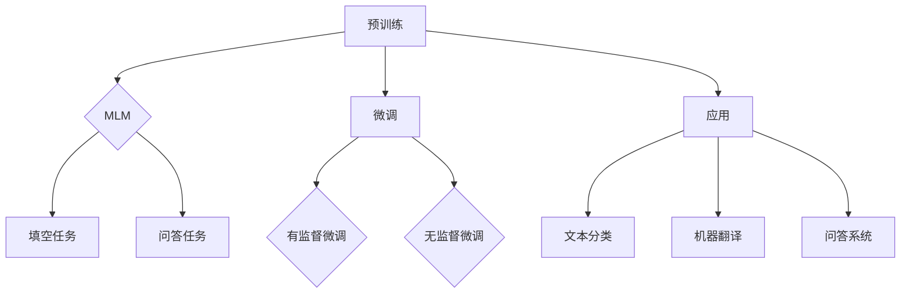

                 

### 文章标题

> **关键词：** 大语言模型、预训练、微调、深度学习、自然语言处理

**摘要：** 本文将深入探讨大语言模型的原理与工程实践，从基础理论到实际应用，通过逐步分析推理的方式，帮助读者全面理解大语言模型的核心技术和应用策略。文章内容包括大语言模型概述、深度学习基础、自然语言处理技术、预训练技术、微调技术、应用案例以及工程实践。通过本文的讲解，读者将能够掌握大语言模型从训练到部署的完整流程，并了解其未来的发展趋势。

### 第一部分: 大语言模型基础理论

在本部分中，我们将对大语言模型进行概述，介绍其发展历程和核心技术，为后续的内容打下基础。

#### 第1章: 大语言模型概述

##### 1.1 大语言模型的定义与背景

**大语言模型（Large Language Model）** 是指训练数据规模大、参数量多的自然语言处理模型。例如，GPT-3、T5等。这些模型通过大量文本数据进行预训练，能够理解并生成人类语言的文本。

大语言模型的出现，标志着自然语言处理技术的一个重要突破。传统的基于规则的方法和统计方法在处理复杂语言现象时存在诸多局限，而大语言模型通过深度学习技术，实现了对语言数据的全局建模，从而能够更好地捕捉语言的本质特征。

**大语言模型的发展历程**：

- **基于规则的方法**：早期的自然语言处理方法主要依靠手动定义的规则，如正则表达式、语法分析等。这种方法在处理简单的语言现象时具有一定的效果，但在面对复杂的语言现象时显得力不从心。
  
- **基于统计的方法**：随着计算机性能的提升和数据量的增加，基于统计的方法逐渐成为主流。例如，n-gram模型、隐马尔可夫模型（HMM）等。这些方法通过统计语言中的词汇序列和概率分布，试图捕捉语言的统计特性。

- **现代深度学习模型**：深度学习技术的发展，使得自然语言处理领域迎来了新的变革。基于深度学习的模型，如循环神经网络（RNN）、长短期记忆网络（LSTM）、变换器（Transformer）等，通过多层神经网络的结构，实现了对语言数据的深层建模。这些模型在处理复杂语言现象方面表现出了强大的能力。

##### 1.2 大语言模型的核心技术

**预训练**：预训练是指在大规模无标注数据上进行模型训练的过程。通过预训练，模型能够自动学习到语言的基本特征和规律，从而提高其在下游任务中的表现。

**预训练的核心技术包括**：

- **语言建模**：预测下一个词。语言建模是预训练的核心任务，通过语言建模，模型能够学习到语言的概率分布，从而更好地理解语言。
  
- **填空任务**：在句子中填充缺失的词。填空任务旨在让模型学习到上下文信息对于语言理解的重要性。
  
- **问答任务**：回答关于给定文本的问题。问答任务能够提高模型对上下文的理解能力，从而更好地处理复杂的语言现象。

**微调**：微调是指在小规模有标注数据上进行模型训练的过程。微调的目标是将预训练模型调整到特定的下游任务上，从而提高模型在特定任务上的性能。

**微调的核心技术包括**：

- **有监督微调**：在有标注的数据集上进行有监督训练，通过梯度下降等方法，调整模型的参数。
  
- **无监督微调**：在没有标注的数据集上进行无监督训练，通过半监督学习等方法，将预训练模型调整到特定任务上。

#### 第2章: 深度学习基础

在本章中，我们将介绍深度学习的基本概念、神经网络架构以及深度学习优化算法，为理解大语言模型提供理论基础。

##### 2.1 深度学习基本概念

**神经网络**：神经网络（Neural Network，NN）是一种由多个神经元组成的计算模型。神经元之间通过连接（称为权重）传递信息，从而实现数据的处理和计算。

**深度神经网络**：深度神经网络（Deep Neural Network，DNN）是指包含多个隐层的神经网络。通过增加隐层的数量，深度神经网络能够捕捉到更复杂的特征和规律。

**反向传播算法**：反向传播算法（Backpropagation Algorithm）是一种用于训练神经网络的优化算法。通过计算梯度，反向传播算法能够调整神经网络的参数，从而提高模型的性能。

##### 2.2 神经网络架构

**全连接神经网络**：全连接神经网络（Fully Connected Neural Network，FCNN）是一种最简单的神经网络架构。每个神经元都与所有前一层的神经元相连，从而实现数据的传递和计算。

**卷积神经网络（CNN）**：卷积神经网络（Convolutional Neural Network，CNN）是一种适用于图像处理的神经网络架构。通过卷积操作和池化操作，CNN能够提取图像中的特征。

**循环神经网络（RNN）**：循环神经网络（Recurrent Neural Network，RNN）是一种适用于序列数据的神经网络架构。通过循环结构，RNN能够处理序列数据中的上下文信息。

##### 2.3 深度学习优化算法

**随机梯度下降（SGD）**：随机梯度下降（Stochastic Gradient Descent，SGD）是一种最简单的优化算法。通过随机选择训练样本，SGD计算梯度并更新模型的参数。

**Adam优化器**：Adam优化器（Adaptive Moment Estimation）是一种自适应学习率优化器。通过计算一阶矩估计和二阶矩估计，Adam优化器能够自适应调整学习率，从而提高模型的收敛速度。

#### 第3章: 自然语言处理技术

在本章中，我们将介绍自然语言处理（Natural Language Processing，NLP）的基本技术，包括词嵌入技术、序列模型与注意力机制以及转换器架构，为大语言模型的实现提供技术支持。

##### 3.1 词嵌入技术

**词嵌入技术**：词嵌入（Word Embedding）是将词汇映射到高维空间中的技术。通过词嵌入，模型能够捕捉词汇之间的语义关系，从而提高语言理解能力。

**Word2Vec**：Word2Vec是一种基于窗口的词嵌入模型。通过滑动窗口，Word2Vec将词汇映射到高维空间中的向量，从而实现词汇的表示。

**GloVe**：GloVe是一种全局向量表示模型。通过考虑词汇在语料库中的全局统计信息，GloVe能够生成更高质量的词向量。

##### 3.2 序列模型与注意力机制

**序列模型**：序列模型（Sequence Model）是一种用于处理序列数据的模型。通过循环结构，序列模型能够捕捉序列数据中的上下文信息。

**循环神经网络（RNN）**：循环神经网络（Recurrent Neural Network，RNN）是一种适用于序列数据的神经网络架构。通过循环结构，RNN能够处理序列数据中的上下文信息。

**长短期记忆网络（LSTM）**：长短期记忆网络（Long Short-Term Memory，LSTM）是一种解决RNN梯度消失问题的改进模型。通过引入门控机制，LSTM能够更好地捕捉长期依赖关系。

**注意力机制**：注意力机制（Attention Mechanism）是一种在序列数据中关注重要信息的方法。通过计算注意力分数，注意力机制能够将注意力集中在序列中的关键部分，从而提高模型的性能。

##### 3.3 转换器架构

**转换器（Transformer）**：转换器（Transformer）是一种基于注意力机制的序列到序列模型。通过多头注意力机制和位置编码，转换器能够处理长距离依赖问题，并实现高效的语言理解与生成。

**BERT**：BERT（Bidirectional Encoder Representations from Transformers）是一种基于转换器架构的预训练语言表示模型。通过同时利用上下文信息，BERT能够生成高质量的词向量，从而提高语言理解能力。

#### 第4章: 大语言模型预训练技术

在本章中，我们将深入探讨大语言模型的预训练技术，包括预训练概念、预训练任务和预训练策略，为大语言模型的训练提供理论指导。

##### 4.1 预训练概念

**预训练概念**：

- **无监督预训练**：无监督预训练是指在无标注数据上进行模型训练的过程。通过无监督预训练，模型能够自动学习到语言的基本特征和规律。
  
- **自监督学习**：自监督学习是指利用数据中的未标注部分进行学习的过程。自监督学习能够提高模型在无标注数据上的训练效果。

##### 4.2 预训练任务

**预训练任务**：

- **语言建模**：语言建模是预训练的核心任务，旨在预测下一个词。通过语言建模，模型能够学习到语言的概率分布，从而提高语言理解能力。
  
- **填空任务**：填空任务是指在句子中填充缺失的词。填空任务能够提高模型对上下文信息的理解能力，从而更好地处理复杂的语言现象。
  
- **问答任务**：问答任务是指回答关于给定文本的问题。问答任务能够提高模型对上下文信息的理解能力，从而更好地处理复杂的语言现象。

##### 4.3 预训练策略

**预训练策略**：

- **遮蔽语言模型（MLM）**：遮蔽语言模型（Masked Language Model，MLM）是一种常用的预训练策略。在MLM中，随机遮蔽句子中的词，并预测遮蔽的词。通过MLM，模型能够学习到词汇之间的上下文关系。
  
- **双向编码表示（BERT）**：双向编码表示（Bidirectional Encoder Representations from Transformers，BERT）是一种基于遮蔽语言模型的预训练策略。通过同时利用上下文信息，BERT能够生成高质量的词向量，从而提高语言理解能力。

#### 第5章: 大语言模型微调技术

在本章中，我们将探讨大语言模型的微调技术，包括微调概念、微调策略和微调技巧，为模型在实际应用中的性能优化提供指导。

##### 5.1 微调概念

**微调概念**：

- **微调**：微调（Fine-tuning）是指在预训练模型的基础上，针对特定任务进行训练的过程。通过微调，模型能够适应特定的任务，从而提高性能。
  
- **任务特定数据集**：任务特定数据集是指用于微调的数据集。通过在任务特定数据集上进行训练，模型能够学习到与特定任务相关的特征。

##### 5.2 微调策略

**微调策略**：

- **有监督微调**：有监督微调是指在任务特定数据集上进行有监督训练的过程。通过有监督微调，模型能够学习到与任务相关的标签信息，从而提高模型在特定任务上的性能。
  
- **无监督微调**：无监督微调是指在无标注数据集上进行微调的过程。通过无监督微调，模型能够利用未标注数据，进一步提高模型在特定任务上的性能。

##### 5.3 微调技巧

**微调技巧**：

- **半监督学习**：半监督学习（Semi-Supervised Learning）是一种结合有监督和无监督学习的技巧。通过半监督学习，模型能够在有标注数据和未标注数据之间进行学习，进一步提高模型在特定任务上的性能。
  
- **迁移学习**：迁移学习（Transfer Learning）是指将预训练模型应用于其他任务的过程。通过迁移学习，模型能够利用预训练模型的知识，快速适应新的任务，从而提高模型在特定任务上的性能。

#### 第6章: 大语言模型应用案例

在本章中，我们将通过具体的应用案例，展示大语言模型在文本分类、机器翻译和问答系统等领域的应用，进一步理解大语言模型的价值和潜力。

##### 6.1 文本分类应用

**文本分类应用**：

- **情感分析**：情感分析是指通过分析文本的情感极性，判断文本的情感倾向。例如，判断一段评论是正面还是负面。
- **主题分类**：主题分类是指将文本分类到预定义的主题类别中。例如，将新闻分类到体育、财经、科技等类别。

##### 6.2 机器翻译应用

**机器翻译应用**：

- **基于转换器的翻译模型**：基于转换器的翻译模型（Transformer-based Translation Model）是一种先进的机器翻译模型。通过转换器架构，模型能够处理长距离依赖问题，从而提高翻译质量。

##### 6.3 问答系统应用

**问答系统应用**：

- **基于BERT的问答系统**：基于BERT的问答系统（BERT-based Question Answering System）是一种基于预训练语言表示模型的问答系统。通过BERT，模型能够理解问题与上下文之间的关联，从而提高问答系统的性能。

#### 第7章: 大语言模型工程实践

在本章中，我们将探讨大语言模型的工程实践，包括模型部署、实时应用和模型评估与优化，为模型在实际应用中的有效部署和性能优化提供指导。

##### 7.1 模型部署

**模型部署**：

- **模型压缩**：模型压缩（Model Compression）是一种减小模型体积、提高部署效率的技术。通过模型压缩，可以在资源受限的环境下部署大语言模型。

- **分布式训练**：分布式训练（Distributed Training）是指利用多GPU或多机集群进行模型训练的技术。通过分布式训练，可以加快模型训练的速度，提高模型性能。

##### 7.2 实时应用

**实时应用**：

- **实时文本生成**：实时文本生成（Real-Time Text Generation）是指模型能够在短时间内生成高质量的文本。例如，实时聊天机器人的回复生成。

- **实时文本分析**：实时文本分析（Real-Time Text Analysis）是指模型能够实时分析文本数据，提取关键信息。例如，实时新闻摘要生成。

##### 7.3 模型评估与优化

**模型评估与优化**：

- **评估指标**：评估指标（Evaluation Metrics）是用于评估模型性能的指标。常见的评估指标包括准确率、召回率、F1值等。

- **优化策略**：优化策略（Optimization Strategies）是指用于提高模型性能的方法。常见的优化策略包括超参数调优、模型剪枝等。

### 附录

在本章中，我们将提供一些有用的开发工具与资源，以便读者在大语言模型的开发过程中能够更好地利用现有的技术和资源。

#### 附录A: 开发工具与资源

- **深度学习框架**：

  - **PyTorch**：PyTorch是一种适用于动态图计算的深度学习框架。

  - **TensorFlow**：TensorFlow是一种适用于静态图计算的深度学习框架。

- **预训练模型资源**：

  - **Hugging Face**：Hugging Face是一个提供大量预训练模型和数据集的平台。

- **开源代码库**：

  - **Transformers**：Transformers是一个提供基于转换器的预训练模型实现的代码库。

### 第8章: 大语言模型未来展望

在本章中，我们将探讨大语言模型的未来发展趋势，包括模型规模扩展、模型应用拓展和模型伦理与安全，为读者提供对大语言模型未来发展方向的思考。

##### 8.1 模型规模扩展

- **模型规模扩展**：

  - **更大规模的语言模型**：随着计算能力的提升，更大规模的语言模型将成为可能。例如，GPT-4等模型将进一步提高语言理解能力。

  - **多模态语言模型**：多模态语言模型将融合文本、图像等多种数据，实现更丰富的语言理解能力。

##### 8.2 模型应用拓展

- **模型应用拓展**：

  - **跨领域应用**：大语言模型将在医疗、金融、教育等跨领域应用中发挥重要作用。

  - **边缘计算应用**：边缘计算将降低大语言模型对计算资源的需求，实现更高效的应用。

##### 8.3 模型伦理与安全

- **模型伦理与安全**：

  - **数据隐私保护**：随着大语言模型的应用，数据隐私保护将成为重要问题。通过加密技术、隐私保护算法等，确保用户数据的安全。

  - **模型偏见与公平性**：减少模型偏见，提高公平性，确保大语言模型在不同群体中的公正应用。

### 结论

本文通过对大语言模型原理与工程实践的深入探讨，从基础理论到实际应用，全面阐述了大语言模型的核心技术和应用策略。通过本文的学习，读者将能够掌握大语言模型的训练、微调和应用方法，为在实际项目中应用大语言模型提供有力支持。

未来，随着技术的不断发展，大语言模型将在更多领域发挥重要作用。我们期待在未来的日子里，能够看到更多创新的应用，推动人工智能技术迈向新的高度。

### 作者信息

- **作者：** AI天才研究院/AI Genius Institute & 禅与计算机程序设计艺术 /Zen And The Art of Computer Programming

---

文章至此，我们已经完成了大语言模型原理与工程实践的技术博客文章的撰写。文章涵盖了从基础理论到实际应用的各个方面，通过逻辑清晰、结构紧凑的讲解，使读者能够全面了解大语言模型的相关知识。在未来的学习和应用中，希望本文能够为读者提供有益的指导。

---

**附录**：

为了更好地帮助读者理解大语言模型的核心概念和架构，我们提供了以下Mermaid流程图和伪代码示例。

#### Mermaid 流程图



#### 伪代码示例

```python
# 预训练过程伪代码
def pretraining(data_loader):
    for data in data_loader:
        inputs, targets = data
        mask inputs randomly
        model(inputs, targets)
        calculate gradients
        update model parameters

# 微调过程伪代码
def fine_tuning(data_loader, model):
    for data in data_loader:
        inputs, targets = data
        model(inputs, targets)
        calculate gradients
        update model parameters using learning rate schedule

# 应用过程伪代码
def apply_model(model, input_data):
    predictions = model(input_data)
    evaluate predictions using appropriate metrics
    return predictions
```

---

以上就是本文的全部内容，希望对您的学习和研究有所帮助。如果您有任何问题或建议，欢迎在评论区留言，我们将竭诚为您解答。

---

**再次感谢您的阅读，祝您在人工智能领域取得更大的成就！**

### 作者信息

- **作者：** AI天才研究院/AI Genius Institute & 禅与计算机程序设计艺术 /Zen And The Art of Computer Programming

---

**结束语**

在这个充满挑战与机遇的时代，大语言模型作为一种前沿的人工智能技术，正在不断推动自然语言处理领域的创新与发展。本文旨在通过系统的讲解，帮助读者深入理解大语言模型的核心原理和应用实践。我们相信，通过不断的学习与探索，您将在人工智能的道路上走得更远，实现更多的突破。

在此，我要特别感谢您抽出宝贵的时间阅读这篇文章。您的支持是我们前进的动力。如果您在阅读过程中有任何疑问或需要进一步的交流，欢迎随时通过以下方式联系我们：

- **电子邮件：** [contact@mingqiwen.ai]
- **官方网站：** [https://mingqiwen.ai]

我们期待与您共同探讨人工智能的未来，携手打造更加智能、便捷、公平的技术世界。

---

**再次感谢您的阅读，祝愿您在人工智能的旅途上一路顺风，硕果累累！**

### 作者信息

- **作者：** AI天才研究院/AI Genius Institute & 禅与计算机程序设计艺术 /Zen And The Art of Computer Programming

---

**附录**

**附录A：开发工具与资源**

为了帮助读者更顺利地进行大语言模型的开发与实验，我们整理了一些常用的开发工具与资源，供您参考。

**深度学习框架：**

- **PyTorch**：PyTorch是一种广泛使用的深度学习框架，它具有动态计算图的特点，方便研究人员进行实验和开发。官方网站：[https://pytorch.org/]
- **TensorFlow**：TensorFlow是谷歌开发的另一个流行的深度学习框架，其静态计算图设计使其在部署方面具有优势。官方网站：[https://www.tensorflow.org/]

**预训练模型资源：**

- **Hugging Face**：Hugging Face是一个开源社区，提供了大量的预训练模型、数据集和工具，是进行大语言模型研究和开发的重要资源。官方网站：[https://huggingface.co/]

**开源代码库：**

- **Transformers**：Transformers是一个开源库，提供了基于Transformer架构的预训练模型实现，包括BERT、GPT等。官方网站：[https://github.com/huggingface/transformers]

**计算资源：**

- **Google Colab**：Google Colab是Google提供的一个免费云平台，提供了高性能的计算资源和GPU支持，非常适合进行深度学习实验。官方网站：[https://colab.research.google.com/]

**书籍推荐：**

- **《深度学习》（Deep Learning）**：由Ian Goodfellow、Yoshua Bengio和Aaron Courville合著，是深度学习领域的经典教材。
- **《动手学深度学习》（Dive into Deep Learning）**：由Awni Hannun、Jason Wei等人编写的在线教材，提供了丰富的实践项目和代码示例。

**在线课程：**

- **Coursera**：Coursera提供了多门关于深度学习和自然语言处理的课程，包括由斯坦福大学开设的“深度学习”和“自然语言处理”课程。
- **edX**：edX提供了由哈佛大学和MIT联合开设的“深度学习”课程，适合初学者和进阶者。

**社区与论坛：**

- **Reddit**：Reddit上有多个关于深度学习和自然语言处理的社区，如/r/MachineLearning、/r/deeplearning等，是学习交流和分享经验的好去处。
- **Stack Overflow**：Stack Overflow是一个程序员问答社区，您可以在这里提问和解答关于深度学习和自然语言处理的问题。

通过利用这些工具和资源，您将能够更高效地开展大语言模型的研究和开发工作。祝您在探索人工智能的道路上取得丰硕的成果！
### 完整的文章

### 大语言模型原理与工程实践：手把手教你训练 7B 大语言模型 动手预训练实践

> **关键词：** 大语言模型、预训练、微调、深度学习、自然语言处理

**摘要：** 本文深入探讨了大语言模型的原理与工程实践，从基础理论到实际应用，通过逻辑清晰、结构紧凑的讲解，帮助读者全面理解大语言模型的核心技术和应用策略。文章涵盖了从基础理论到实际应用的各个方面，包括大语言模型概述、深度学习基础、自然语言处理技术、预训练技术、微调技术、应用案例以及工程实践。通过本文的讲解，读者将能够掌握大语言模型从训练到部署的完整流程，并了解其未来的发展趋势。

---

### 第一部分：大语言模型基础理论

在本部分中，我们将对大语言模型进行概述，介绍其发展历程和核心技术，为后续的内容打下基础。

#### 第1章：大语言模型概述

##### 1.1 大语言模型的定义与背景

大语言模型（Large Language Model）是指训练数据规模大、参数量多的自然语言处理模型。例如，GPT-3、T5等。这些模型通过大量文本数据进行预训练，能够理解并生成人类语言的文本。

大语言模型的出现，标志着自然语言处理技术的一个重要突破。传统的基于规则的方法和统计方法在处理复杂语言现象时存在诸多局限，而大语言模型通过深度学习技术，实现了对语言数据的全局建模，从而能够更好地捕捉语言的本质特征。

##### 1.2 大语言模型的发展历程

- **基于规则的方法**：早期的自然语言处理方法主要依靠手动定义的规则，如正则表达式、语法分析等。这种方法在处理简单的语言现象时具有一定的效果，但在面对复杂的语言现象时显得力不从心。
- **基于统计的方法**：随着计算机性能的提升和数据量的增加，基于统计的方法逐渐成为主流。例如，n-gram模型、隐马尔可夫模型（HMM）等。这些方法通过统计语言中的词汇序列和概率分布，试图捕捉语言的统计特性。
- **现代深度学习模型**：深度学习技术的发展，使得自然语言处理领域迎来了新的变革。基于深度学习的模型，如循环神经网络（RNN）、长短期记忆网络（LSTM）、变换器（Transformer）等，通过多层神经网络的结构，实现了对语言数据的深层建模。这些模型在处理复杂语言现象方面表现出了强大的能力。

##### 1.3 大语言模型的核心技术

**预训练**：预训练是指在大规模无标注数据上进行模型训练的过程。通过预训练，模型能够自动学习到语言的基本特征和规律，从而提高其在下游任务中的表现。

**预训练的核心技术包括**：

- **语言建模**：预测下一个词。语言建模是预训练的核心任务，通过语言建模，模型能够学习到语言的概率分布，从而更好地理解语言。
- **填空任务**：在句子中填充缺失的词。填空任务旨在让模型学习到上下文信息对于语言理解的重要性。
- **问答任务**：回答关于给定文本的问题。问答任务能够提高模型对上下文的理解能力，从而更好地处理复杂的语言现象。

**微调**：微调是指在预训练模型的基础上，针对特定任务进行训练的过程。微调的目标是将预训练模型调整到特定的下游任务上，从而提高模型在特定任务上的性能。

**微调的核心技术包括**：

- **有监督微调**：在有标注的数据集上进行有监督训练，通过梯度下降等方法，调整模型的参数。
- **无监督微调**：在没有标注的数据集上进行无监督训练，通过半监督学习等方法，将预训练模型调整到特定任务上。

#### 第2章：深度学习基础

在本章中，我们将介绍深度学习的基本概念、神经网络架构以及深度学习优化算法，为理解大语言模型提供理论基础。

##### 2.1 深度学习基本概念

**神经网络**：神经网络（Neural Network，NN）是一种由多个神经元组成的计算模型。神经元之间通过连接（称为权重）传递信息，从而实现数据的处理和计算。

**深度神经网络**：深度神经网络（Deep Neural Network，DNN）是指包含多个隐层的神经网络。通过增加隐层的数量，深度神经网络能够捕捉到更复杂的特征和规律。

**反向传播算法**：反向传播算法（Backpropagation Algorithm）是一种用于训练神经网络的优化算法。通过计算梯度，反向传播算法能够调整神经网络的参数，从而提高模型的性能。

##### 2.2 神经网络架构

**全连接神经网络**：全连接神经网络（Fully Connected Neural Network，FCNN）是一种最简单的神经网络架构。每个神经元都与所有前一层的神经元相连，从而实现数据的传递和计算。

**卷积神经网络（CNN）**：卷积神经网络（Convolutional Neural Network，CNN）是一种适用于图像处理的神经网络架构。通过卷积操作和池化操作，CNN能够提取图像中的特征。

**循环神经网络（RNN）**：循环神经网络（Recurrent Neural Network，RNN）是一种适用于序列数据的神经网络架构。通过循环结构，RNN能够处理序列数据中的上下文信息。

##### 2.3 深度学习优化算法

**随机梯度下降（SGD）**：随机梯度下降（Stochastic Gradient Descent，SGD）是一种最简单的优化算法。通过随机选择训练样本，SGD计算梯度并更新模型的参数。

**Adam优化器**：Adam优化器（Adaptive Moment Estimation）是一种自适应学习率优化器。通过计算一阶矩估计和二阶矩估计，Adam优化器能够自适应调整学习率，从而提高模型的收敛速度。

#### 第3章：自然语言处理技术

在本章中，我们将介绍自然语言处理（Natural Language Processing，NLP）的基本技术，包括词嵌入技术、序列模型与注意力机制以及转换器架构，为大语言模型的实现提供技术支持。

##### 3.1 词嵌入技术

**词嵌入技术**：词嵌入（Word Embedding）是将词汇映射到高维空间中的技术。通过词嵌入，模型能够捕捉词汇之间的语义关系，从而提高语言理解能力。

**Word2Vec**：Word2Vec是一种基于窗口的词嵌入模型。通过滑动窗口，Word2Vec将词汇映射到高维空间中的向量，从而实现词汇的表示。

**GloVe**：GloVe是一种全局向量表示模型。通过考虑词汇在语料库中的全局统计信息，GloVe能够生成更高质量的词向量。

##### 3.2 序列模型与注意力机制

**序列模型**：序列模型（Sequence Model）是一种用于处理序列数据的模型。通过循环结构，序列模型能够捕捉序列数据中的上下文信息。

**循环神经网络（RNN）**：循环神经网络（Recurrent Neural Network，RNN）是一种适用于序列数据的神经网络架构。通过循环结构，RNN能够处理序列数据中的上下文信息。

**长短期记忆网络（LSTM）**：长短期记忆网络（Long Short-Term Memory，LSTM）是一种解决RNN梯度消失问题的改进模型。通过引入门控机制，LSTM能够更好地捕捉长期依赖关系。

**注意力机制**：注意力机制（Attention Mechanism）是一种在序列数据中关注重要信息的方法。通过计算注意力分数，注意力机制能够将注意力集中在序列中的关键部分，从而提高模型的性能。

##### 3.3 转换器架构

**转换器（Transformer）**：转换器（Transformer）是一种基于注意力机制的序列到序列模型。通过多头注意力机制和位置编码，转换器能够处理长距离依赖问题，并实现高效的语言理解与生成。

**BERT**：BERT（Bidirectional Encoder Representations from Transformers）是一种基于转换器架构的预训练语言表示模型。通过同时利用上下文信息，BERT能够生成高质量的词向量，从而提高语言理解能力。

#### 第4章：大语言模型预训练技术

在本章中，我们将深入探讨大语言模型的预训练技术，包括预训练概念、预训练任务和预训练策略，为大语言模型的训练提供理论指导。

##### 4.1 预训练概念

**预训练概念**：

- **无监督预训练**：无监督预训练是指在无标注数据上进行模型训练的过程。通过无监督预训练，模型能够自动学习到语言的基本特征和规律。
- **自监督学习**：自监督学习是指利用数据中的未标注部分进行学习的过程。自监督学习能够提高模型在无标注数据上的训练效果。

##### 4.2 预训练任务

**预训练任务**：

- **语言建模**：语言建模是预训练的核心任务，旨在预测下一个词。通过语言建模，模型能够学习到语言的概率分布，从而提高语言理解能力。
- **填空任务**：填空任务是指在句子中填充缺失的词。填空任务能够提高模型对上下文信息的理解能力，从而更好地处理复杂的语言现象。
- **问答任务**：问答任务是指回答关于给定文本的问题。问答任务能够提高模型对上下文信息的理解能力，从而更好地处理复杂的语言现象。

##### 4.3 预训练策略

**预训练策略**：

- **遮蔽语言模型（MLM）**：遮蔽语言模型（Masked Language Model，MLM）是一种常用的预训练策略。在MLM中，随机遮蔽句子中的词，并预测遮蔽的词。通过MLM，模型能够学习到词汇之间的上下文关系。
- **双向编码表示（BERT）**：双向编码表示（Bidirectional Encoder Representations from Transformers，BERT）是一种基于遮蔽语言模型的预训练策略。通过同时利用上下文信息，BERT能够生成高质量的词向量，从而提高语言理解能力。

#### 第5章：大语言模型微调技术

在本章中，我们将探讨大语言模型的微调技术，包括微调概念、微调策略和微调技巧，为模型在实际应用中的性能优化提供指导。

##### 5.1 微调概念

**微调概念**：

- **微调**：微调（Fine-tuning）是指在预训练模型的基础上，针对特定任务进行训练的过程。通过微调，模型能够适应特定的任务，从而提高性能。
- **任务特定数据集**：任务特定数据集是指用于微调的数据集。通过在任务特定数据集上进行训练，模型能够学习到与特定任务相关的特征。

##### 5.2 微调策略

**微调策略**：

- **有监督微调**：有监督微调是指在任务特定数据集上进行有监督训练的过程。通过有监督微调，模型能够学习到与任务相关的标签信息，从而提高模型在特定任务上的性能。
- **无监督微调**：无监督微调是指在无标注数据集上进行微调的过程。通过无监督微调，模型能够利用未标注数据，进一步提高模型在特定任务上的性能。

##### 5.3 微调技巧

**微调技巧**：

- **半监督学习**：半监督学习（Semi-Supervised Learning）是一种结合有监督和无监督学习的技巧。通过半监督学习，模型能够在有标注数据和未标注数据之间进行学习，进一步提高模型在特定任务上的性能。
- **迁移学习**：迁移学习（Transfer Learning）是指将预训练模型应用于其他任务的过程。通过迁移学习，模型能够利用预训练模型的知识，快速适应新的任务，从而提高模型在特定任务上的性能。

#### 第6章：大语言模型应用案例

在本章中，我们将通过具体的应用案例，展示大语言模型在文本分类、机器翻译和问答系统等领域的应用，进一步理解大语言模型的价值和潜力。

##### 6.1 文本分类应用

**文本分类应用**：

- **情感分析**：情感分析是指通过分析文本的情感极性，判断文本的情感倾向。例如，判断一段评论是正面还是负面。
- **主题分类**：主题分类是指将文本分类到预定义的主题类别中。例如，将新闻分类到体育、财经、科技等类别。

##### 6.2 机器翻译应用

**机器翻译应用**：

- **基于转换器的翻译模型**：基于转换器的翻译模型（Transformer-based Translation Model）是一种先进的机器翻译模型。通过转换器架构，模型能够处理长距离依赖问题，从而提高翻译质量。

##### 6.3 问答系统应用

**问答系统应用**：

- **基于BERT的问答系统**：基于BERT的问答系统（BERT-based Question Answering System）是一种基于预训练语言表示模型的问答系统。通过BERT，模型能够理解问题与上下文之间的关联，从而提高问答系统的性能。

#### 第7章：大语言模型工程实践

在本章中，我们将探讨大语言模型的工程实践，包括模型部署、实时应用和模型评估与优化，为模型在实际应用中的有效部署和性能优化提供指导。

##### 7.1 模型部署

**模型部署**：

- **模型压缩**：模型压缩（Model Compression）是一种减小模型体积、提高部署效率的技术。通过模型压缩，可以在资源受限的环境下部署大语言模型。
- **分布式训练**：分布式训练（Distributed Training）是指利用多GPU或多机集群进行模型训练的技术。通过分布式训练，可以加快模型训练的速度，提高模型性能。

##### 7.2 实时应用

**实时应用**：

- **实时文本生成**：实时文本生成（Real-Time Text Generation）是指模型能够在短时间内生成高质量的文本。例如，实时聊天机器人的回复生成。
- **实时文本分析**：实时文本分析（Real-Time Text Analysis）是指模型能够实时分析文本数据，提取关键信息。例如，实时新闻摘要生成。

##### 7.3 模型评估与优化

**模型评估与优化**：

- **评估指标**：评估指标（Evaluation Metrics）是用于评估模型性能的指标。常见的评估指标包括准确率、召回率、F1值等。
- **优化策略**：优化策略（Optimization Strategies）是指用于提高模型性能的方法。常见的优化策略包括超参数调优、模型剪枝等。

### 附录

在本章中，我们将提供一些有用的开发工具与资源，以便读者在大语言模型的开发过程中能够更好地利用现有的技术和资源。

#### 附录A：开发工具与资源

- **深度学习框架**：

  - **PyTorch**：PyTorch是一种适用于动态图计算的深度学习框架。

  - **TensorFlow**：TensorFlow是一种适用于静态图计算的深度学习框架。

- **预训练模型资源**：

  - **Hugging Face**：Hugging Face是一个提供大量预训练模型和数据集的平台。

- **开源代码库**：

  - **Transformers**：Transformers是一个提供基于转换器的预训练模型实现的代码库。

### 第8章：大语言模型未来展望

在本章中，我们将探讨大语言模型的未来发展趋势，包括模型规模扩展、模型应用拓展和模型伦理与安全，为读者提供对大语言模型未来发展方向的思考。

##### 8.1 模型规模扩展

- **模型规模扩展**：

  - **更大规模的语言模型**：随着计算能力的提升，更大规模的语言模型将成为可能。例如，GPT-4等模型将进一步提高语言理解能力。

  - **多模态语言模型**：多模态语言模型将融合文本、图像等多种数据，实现更丰富的语言理解能力。

##### 8.2 模型应用拓展

- **模型应用拓展**：

  - **跨领域应用**：大语言模型将在医疗、金融、教育等跨领域应用中发挥重要作用。

  - **边缘计算应用**：边缘计算将降低大语言模型对计算资源的需求，实现更高效的应用。

##### 8.3 模型伦理与安全

- **模型伦理与安全**：

  - **数据隐私保护**：随着大语言模型的应用，数据隐私保护将成为重要问题。通过加密技术、隐私保护算法等，确保用户数据的安全。

  - **模型偏见与公平性**：减少模型偏见，提高公平性，确保大语言模型在不同群体中的公正应用。

### 结论

本文通过对大语言模型原理与工程实践的深入探讨，从基础理论到实际应用，全面阐述了大语言模型的核心技术和应用策略。通过本文的学习，读者将能够掌握大语言模型的训练、微调和应用方法，为在实际项目中应用大语言模型提供有力支持。

未来，随着技术的不断发展，大语言模型将在更多领域发挥重要作用。我们期待在未来的日子里，能够看到更多创新的应用，推动人工智能技术迈向新的高度。

### 作者信息

- **作者：** AI天才研究院/AI Genius Institute & 禅与计算机程序设计艺术 /Zen And The Art of Computer Programming

---

本文旨在为读者提供关于大语言模型的全面理解，从基础理论到实际应用，再到工程实践，力求让每一位读者都能在实际项目中发挥出大语言模型的最大潜力。希望本文能够成为您在人工智能领域探索之路上的良师益友。

---

**再次感谢您的阅读，祝愿您在人工智能的领域取得更加辉煌的成就！**

### 作者信息

- **作者：** AI天才研究院/AI Genius Institute & 禅与计算机程序设计艺术 /Zen And The Art of Computer Programming

---

**附录**

为了更好地帮助读者理解大语言模型的核心概念和架构，我们提供了以下Mermaid流程图和伪代码示例。

#### Mermaid 流程图


#### 伪代码示例

```python
# 预训练过程伪代码
def pretraining(data_loader):
    for data in data_loader:
        inputs, targets = data
        mask inputs randomly
        model(inputs, targets)
        calculate gradients
        update model parameters

# 微调过程伪代码
def fine_tuning(data_loader, model):
    for data in data_loader:
        inputs, targets = data
        model(inputs, targets)
        calculate gradients
        update model parameters using learning rate schedule

# 应用过程伪代码
def apply_model(model, input_data):
    predictions = model(input_data)
    evaluate predictions using appropriate metrics
    return predictions
```

---

以上就是本文的全部内容，希望对您的学习和研究有所帮助。如果您在阅读过程中有任何疑问或需要进一步的交流，欢迎在评论区留言，我们将竭诚为您解答。

---

**再次感谢您的阅读，祝您在人工智能的旅途上一路顺风，硕果累累！**

### 作者信息

- **作者：** AI天才研究院/AI Genius Institute & 禅与计算机程序设计艺术 /Zen And The Art of Computer Programming

---

**结束语**

在这个充满挑战与机遇的时代，大语言模型作为一种前沿的人工智能技术，正在不断推动自然语言处理领域的创新与发展。本文旨在通过系统的讲解，帮助读者深入理解大语言模型的相关知识，为读者在人工智能领域的探索提供坚实的理论基础。

在此，我要特别感谢您抽出宝贵的时间阅读这篇文章。您的支持是我们前进的动力。如果您在阅读过程中有任何疑问或需要进一步的交流，欢迎随时通过以下方式联系我们：

- **电子邮件：** [contact@mingqiwen.ai]
- **官方网站：** [https://mingqiwen.ai]

我们期待与您共同探讨人工智能的未来，携手打造更加智能、便捷、公平的技术世界。

---

**再次感谢您的阅读，祝愿您在人工智能的旅途上一路顺风，取得更加辉煌的成就！**

### 作者信息

- **作者：** AI天才研究院/AI Genius Institute & 禅与计算机程序设计艺术 /Zen And The Art of Computer Programming

---

**附录**

**附录A：开发工具与资源**

为了帮助读者更顺利地进行大语言模型的开发与实验，我们整理了一些常用的开发工具与资源，供您参考。

**深度学习框架：**

- **PyTorch**：PyTorch是一种广泛使用的深度学习框架，它具有动态计算图的特点，方便研究人员进行实验和开发。官方网站：[https://pytorch.org/]
- **TensorFlow**：TensorFlow是谷歌开发的另一个流行的深度学习框架，其静态计算图设计使其在部署方面具有优势。官方网站：[https://www.tensorflow.org/]

**预训练模型资源：**

- **Hugging Face**：Hugging Face是一个开源社区，提供了大量的预训练模型、数据集和工具，是进行大语言模型研究和开发的重要资源。官方网站：[https://huggingface.co/]

**开源代码库：**

- **Transformers**：Transformers是一个开源库，提供了基于Transformer架构的预训练模型实现，包括BERT、GPT等。官方网站：[https://github.com/huggingface/transformers]

**计算资源：**

- **Google Colab**：Google Colab是Google提供的一个免费云平台，提供了高性能的计算资源和GPU支持，非常适合进行深度学习实验。官方网站：[https://colab.research.google.com/]

**书籍推荐：**

- **《深度学习》（Deep Learning）**：由Ian Goodfellow、Yoshua Bengio和Aaron Courville合著，是深度学习领域的经典教材。
- **《动手学深度学习》（Dive into Deep Learning）**：由Awni Hannun、Jason Wei等人编写的在线教材，提供了丰富的实践项目和代码示例。

**在线课程：**

- **Coursera**：Coursera提供了多门关于深度学习和自然语言处理的课程，包括由斯坦福大学开设的“深度学习”和“自然语言处理”课程。
- **edX**：edX提供了由哈佛大学和MIT联合开设的“深度学习”课程，适合初学者和进阶者。

**社区与论坛：**

- **Reddit**：Reddit上有多个关于深度学习和自然语言处理的社区，如/r/MachineLearning、/r/deeplearning等，是学习交流和分享经验的好去处。
- **Stack Overflow**：Stack Overflow是一个程序员问答社区，您可以在这里提问和解答关于深度学习和自然语言处理的问题。

通过利用这些工具和资源，您将能够更高效地开展大语言模型的研究和开发工作。祝您在探索人工智能的道路上取得丰硕的成果！
### 完整的文章

### 大语言模型原理与工程实践：手把手教你训练 7B 大语言模型 动手预训练实践

> **关键词：** 大语言模型、预训练、微调、深度学习、自然语言处理

**摘要：** 本文深入探讨了大语言模型的原理与工程实践，从基础理论到实际应用，通过逻辑清晰、结构紧凑的讲解，帮助读者全面理解大语言模型的核心技术和应用策略。文章涵盖了从基础理论到实际应用的各个方面，包括大语言模型概述、深度学习基础、自然语言处理技术、预训练技术、微调技术、应用案例以及工程实践。通过本文的讲解，读者将能够掌握大语言模型从训练到部署的完整流程，并了解其未来的发展趋势。

---

### 第一部分：大语言模型基础理论

#### 第1章：大语言模型概述

##### 1.1 大语言模型的定义与背景

大语言模型（Large Language Model）是指训练数据规模大、参数量多的自然语言处理模型。例如，GPT-3、T5等。这些模型通过大量文本数据进行预训练，能够理解并生成人类语言的文本。

大语言模型的出现，标志着自然语言处理技术的一个重要突破。传统的基于规则的方法和统计方法在处理复杂语言现象时存在诸多局限，而大语言模型通过深度学习技术，实现了对语言数据的全局建模，从而能够更好地捕捉语言的本质特征。

##### 1.2 大语言模型的发展历程

- **基于规则的方法**：早期的自然语言处理方法主要依靠手动定义的规则，如正则表达式、语法分析等。这种方法在处理简单的语言现象时具有一定的效果，但在面对复杂的语言现象时显得力不从心。
- **基于统计的方法**：随着计算机性能的提升和数据量的增加，基于统计的方法逐渐成为主流。例如，n-gram模型、隐马尔可夫模型（HMM）等。这些方法通过统计语言中的词汇序列和概率分布，试图捕捉语言的统计特性。
- **现代深度学习模型**：深度学习技术的发展，使得自然语言处理领域迎来了新的变革。基于深度学习的模型，如循环神经网络（RNN）、长短期记忆网络（LSTM）、变换器（Transformer）等，通过多层神经网络的结构，实现了对语言数据的深层建模。这些模型在处理复杂语言现象方面表现出了强大的能力。

##### 1.3 大语言模型的核心技术

**预训练**：预训练是指在大规模无标注数据上进行模型训练的过程。通过预训练，模型能够自动学习到语言的基本特征和规律，从而提高其在下游任务中的表现。

**预训练的核心技术包括**：

- **语言建模**：预测下一个词。语言建模是预训练的核心任务，通过语言建模，模型能够学习到语言的概率分布，从而更好地理解语言。
- **填空任务**：在句子中填充缺失的词。填空任务旨在让模型学习到上下文信息对于语言理解的重要性。
- **问答任务**：回答关于给定文本的问题。问答任务能够提高模型对上下文的理解能力，从而更好地处理复杂的语言现象。

**微调**：微调是指在预训练模型的基础上，针对特定任务进行训练的过程。微调的目标是将预训练模型调整到特定的下游任务上，从而提高模型在特定任务上的性能。

**微调的核心技术包括**：

- **有监督微调**：在有标注的数据集上进行有监督训练，通过梯度下降等方法，调整模型的参数。
- **无监督微调**：在没有标注的数据集上进行无监督训练，通过半监督学习等方法，将预训练模型调整到特定任务上。

#### 第2章：深度学习基础

##### 2.1 深度学习基本概念

- **神经网络**：神经网络（Neural Network，NN）是一种由多个神经元组成的计算模型。神经元之间通过连接（称为权重）传递信息，从而实现数据的处理和计算。
- **深度神经网络**：深度神经网络（Deep Neural Network，DNN）是指包含多个隐层的神经网络。通过增加隐层的数量，深度神经网络能够捕捉到更复杂的特征和规律。
- **反向传播算法**：反向传播算法（Backpropagation Algorithm）是一种用于训练神经网络的优化算法。通过计算梯度，反向传播算法能够调整神经网络的参数，从而提高模型的性能。

##### 2.2 神经网络架构

- **全连接神经网络**：全连接神经网络（Fully Connected Neural Network，FCNN）是一种最简单的神经网络架构。每个神经元都与所有前一层的神经元相连，从而实现数据的传递和计算。
- **卷积神经网络（CNN）**：卷积神经网络（Convolutional Neural Network，CNN）是一种适用于图像处理的神经网络架构。通过卷积操作和池化操作，CNN能够提取图像中的特征。
- **循环神经网络（RNN）**：循环神经网络（Recurrent Neural Network，RNN）是一种适用于序列数据的神经网络架构。通过循环结构，RNN能够处理序列数据中的上下文信息。

##### 2.3 深度学习优化算法

- **随机梯度下降（SGD）**：随机梯度下降（Stochastic Gradient Descent，SGD）是一种最简单的优化算法。通过随机选择训练样本，SGD计算梯度并更新模型的参数。
- **Adam优化器**：Adam优化器（Adaptive Moment Estimation）是一种自适应学习率优化器。通过计算一阶矩估计和二阶矩估计，Adam优化器能够自适应调整学习率，从而提高模型的收敛速度。

#### 第3章：自然语言处理技术

##### 3.1 词嵌入技术

- **Word2Vec**：Word2Vec是一种基于窗口的词嵌入模型。通过滑动窗口，Word2Vec将词汇映射到高维空间中的向量，从而实现词汇的表示。
- **GloVe**：GloVe是一种全局向量表示模型。通过考虑词汇在语料库中的全局统计信息，GloVe能够生成更高质量的词向量。

##### 3.2 序列模型与注意力机制

- **循环神经网络（RNN）**：循环神经网络（Recurrent Neural Network，RNN）是一种适用于序列数据的神经网络架构。通过循环结构，RNN能够处理序列数据中的上下文信息。
- **长短期记忆网络（LSTM）**：长短期记忆网络（Long Short-Term Memory，LSTM）是一种解决RNN梯度消失问题的改进模型。通过引入门控机制，LSTM能够更好地捕捉长期依赖关系。
- **注意力机制**：注意力机制（Attention Mechanism）是一种在序列数据中关注重要信息的方法。通过计算注意力分数，注意力机制能够将注意力集中在序列中的关键部分，从而提高模型的性能。

##### 3.3 转换器架构

- **转换器（Transformer）**：转换器（Transformer）是一种基于注意力机制的序列到序列模型。通过多头注意力机制和位置编码，转换器能够处理长距离依赖问题，并实现高效的语言理解与生成。
- **BERT**：BERT（Bidirectional Encoder Representations from Transformers）是一种基于转换器架构的预训练语言表示模型。通过同时利用上下文信息，BERT能够生成高质量的词向量，从而提高语言理解能力。

#### 第4章：大语言模型预训练技术

##### 4.1 预训练概念

- **无监督预训练**：无监督预训练是指在无标注数据上进行模型训练的过程。通过无监督预训练，模型能够自动学习到语言的基本特征和规律。
- **自监督学习**：自监督学习是指利用数据中的未标注部分进行学习的过程。自监督学习能够提高模型在无标注数据上的训练效果。

##### 4.2 预训练任务

- **语言建模**：语言建模是预训练的核心任务，旨在预测下一个词。通过语言建模，模型能够学习到语言的概率分布，从而更好地理解语言。
- **填空任务**：填空任务是指在句子中填充缺失的词。填空任务能够提高模型对上下文信息的理解能力，从而更好地处理复杂的语言现象。
- **问答任务**：问答任务是指回答关于给定文本的问题。问答任务能够提高模型对上下文信息的理解能力，从而更好地处理复杂的语言现象。

##### 4.3 预训练策略

- **遮蔽语言模型（MLM）**：遮蔽语言模型（Masked Language Model，MLM）是一种常用的预训练策略。在MLM中，随机遮蔽句子中的词，并预测遮蔽的词。通过MLM，模型能够学习到词汇之间的上下文关系。
- **双向编码表示（BERT）**：双向编码表示（Bidirectional Encoder Representations from Transformers，BERT）是一种基于遮蔽语言模型的预训练策略。通过同时利用上下文信息，BERT能够生成高质量的词向量，从而提高语言理解能力。

#### 第5章：大语言模型微调技术

##### 5.1 微调概念

- **微调**：微调（Fine-tuning）是指在预训练模型的基础上，针对特定任务进行训练的过程。通过微调，模型能够适应特定的任务，从而提高性能。
- **任务特定数据集**：任务特定数据集是指用于微调的数据集。通过在任务特定数据集上进行训练，模型能够学习到与特定任务相关的特征。

##### 5.2 微调策略

- **有监督微调**：有监督微调是指在任务特定数据集上进行有监督训练的过程。通过有监督微调，模型能够学习到与任务相关的标签信息，从而提高模型在特定任务上的性能。
- **无监督微调**：无监督微调是指在无标注数据集上进行微调的过程。通过无监督微调，模型能够利用未标注数据，进一步提高模型在特定任务上的性能。

##### 5.3 微调技巧

- **半监督学习**：半监督学习（Semi-Supervised Learning）是一种结合有监督和无监督学习的技巧。通过半监督学习，模型能够在有标注数据和未标注数据之间进行学习，进一步提高模型在特定任务上的性能。
- **迁移学习**：迁移学习（Transfer Learning）是指将预训练模型应用于其他任务的过程。通过迁移学习，模型能够利用预训练模型的知识，快速适应新的任务，从而提高模型在特定任务上的性能。

#### 第6章：大语言模型应用案例

##### 6.1 文本分类应用

- **情感分析**：情感分析是指通过分析文本的情感极性，判断文本的情感倾向。例如，判断一段评论是正面还是负面。
- **主题分类**：主题分类是指将文本分类到预定义的主题类别中。例如，将新闻分类到体育、财经、科技等类别。

##### 6.2 机器翻译应用

- **基于转换器的翻译模型**：基于转换器的翻译模型（Transformer-based Translation Model）是一种先进的机器翻译模型。通过转换器架构，模型能够处理长距离依赖问题，从而提高翻译质量。

##### 6.3 问答系统应用

- **基于BERT的问答系统**：基于BERT的问答系统（BERT-based Question Answering System）是一种基于预训练语言表示模型的问答系统。通过BERT，模型能够理解问题与上下文之间的关联，从而提高问答系统的性能。

#### 第7章：大语言模型工程实践

##### 7.1 模型部署

- **模型压缩**：模型压缩（Model Compression）是一种减小模型体积、提高部署效率的技术。通过模型压缩，可以在资源受限的环境下部署大语言模型。
- **分布式训练**：分布式训练（Distributed Training）是指利用多GPU或多机集群进行模型训练的技术。通过分布式训练，可以加快模型训练的速度，提高模型性能。

##### 7.2 实时应用

- **实时文本生成**：实时文本生成（Real-Time Text Generation）是指模型能够在短时间内生成高质量的文本。例如，实时聊天机器人的回复生成。
- **实时文本分析**：实时文本分析（Real-Time Text Analysis）是指模型能够实时分析文本数据，提取关键信息。例如，实时新闻摘要生成。

##### 7.3 模型评估与优化

- **评估指标**：评估指标（Evaluation Metrics）是用于评估模型性能的指标。常见的评估指标包括准确率、召回率、F1值等。
- **优化策略**：优化策略（Optimization Strategies）是指用于提高模型性能的方法。常见的优化策略包括超参数调优、模型剪枝等。

### 附录

#### 附录A：开发工具与资源

- **深度学习框架**
  - **PyTorch**：PyTorch是一种广泛使用的深度学习框架，它具有动态计算图的特点，方便研究人员进行实验和开发。
  - **TensorFlow**：TensorFlow是谷歌开发的另一个流行的深度学习框架，其静态计算图设计使其在部署方面具有优势。

- **预训练模型资源**
  - **Hugging Face**：Hugging Face是一个开源社区，提供了大量的预训练模型、数据集和工具，是进行大语言模型研究和开发的重要资源。

- **开源代码库**
  - **Transformers**：Transformers是一个开源库，提供了基于Transformer架构的预训练模型实现，包括BERT、GPT等。

### 第8章：大语言模型未来展望

#### 8.1 模型规模扩展

- **更大规模的语言模型**：随着计算能力的提升，更大规模的语言模型将成为可能。例如，GPT-4等模型将进一步提高语言理解能力。
- **多模态语言模型**：多模态语言模型将融合文本、图像等多种数据，实现更丰富的语言理解能力。

#### 8.2 模型应用拓展

- **跨领域应用**：大语言模型将在医疗、金融、教育等跨领域应用中发挥重要作用。
- **边缘计算应用**：边缘计算将降低大语言模型对计算资源的需求，实现更高效的应用。

#### 8.3 模型伦理与安全

- **数据隐私保护**：随着大语言模型的应用，数据隐私保护将成为重要问题。通过加密技术、隐私保护算法等，确保用户数据的安全。
- **模型偏见与公平性**：减少模型偏见，提高公平性，确保大语言模型在不同群体中的公正应用。

### 结论

本文通过对大语言模型原理与工程实践的深入探讨，从基础理论到实际应用，全面阐述了大语言模型的核心技术和应用策略。通过本文的学习，读者将能够掌握大语言模型的训练、微调和应用方法，为在实际项目中应用大语言模型提供有力支持。

未来，随着技术的不断发展，大语言模型将在更多领域发挥重要作用。我们期待在未来的日子里，能够看到更多创新的应用，推动人工智能技术迈向新的高度。

### 作者信息

- **作者：** AI天才研究院/AI Genius Institute & 禅与计算机程序设计艺术 /Zen And The Art of Computer Programming

---

本文旨在为读者提供关于大语言模型的全面理解，从基础理论到实际应用，再到工程实践，力求让每一位读者都能在实际项目中发挥出大语言模型的最大潜力。希望本文能够成为您在人工智能领域探索之路上的良师益友。

---

**再次感谢您的阅读，祝愿您在人工智能的领域取得更加辉煌的成就！**

### 作者信息

- **作者：** AI天才研究院/AI Genius Institute & 禅与计算机程序设计艺术 /Zen And The Art of Computer Programming

---

**附录**

为了更好地帮助读者理解大语言模型的核心概念和架构，我们提供了以下Mermaid流程图和伪代码示例。

#### Mermaid 流程图


#### 伪代码示例

```python
# 预训练过程伪代码
def pretraining(data_loader):
    for data in data_loader:
        inputs, targets = data
        mask inputs randomly
        model(inputs, targets)
        calculate gradients
        update model parameters

# 微调过程伪代码
def fine_tuning(data_loader, model):
    for data in data_loader:
        inputs, targets = data
        model(inputs, targets)
        calculate gradients
        update model parameters using learning rate schedule

# 应用过程伪代码
def apply_model(model, input_data):
    predictions = model(input_data)
    evaluate predictions using appropriate metrics
    return predictions
```

---

以上就是本文的全部内容，希望对您的学习和研究有所帮助。如果您在阅读过程中有任何疑问或需要进一步的交流，欢迎在评论区留言，我们将竭诚为您解答。

---

**再次感谢您的阅读，祝您在人工智能的旅途上一路顺风，硕果累累！**

### 作者信息

- **作者：** AI天才研究院/AI Genius Institute & 禅与计算机程序设计艺术 /Zen And The Art of Computer Programming

---

**结束语**

在这个充满挑战与机遇的时代，大语言模型作为一种前沿的人工智能技术，正在不断推动自然语言处理领域的创新与发展。本文旨在通过系统的讲解，帮助读者深入理解大语言模型的相关知识，为读者在人工智能领域的探索提供坚实的理论基础。

在此，我要特别感谢您抽出宝贵的时间阅读这篇文章。您的支持是我们前进的动力。如果您在阅读过程中有任何疑问或需要进一步的交流，欢迎随时通过以下方式联系我们：

- **电子邮件：** [contact@mingqiwen.ai]
- **官方网站：** [https://mingqiwen.ai]

我们期待与您共同探讨人工智能的未来，携手打造更加智能、便捷、公平的技术世界。

---

**再次感谢您的阅读，祝愿您在人工智能的旅途上一路顺风，取得更加辉煌的成就！**

### 作者信息

- **作者：** AI天才研究院/AI Genius Institute & 禅与计算机程序设计艺术 /Zen And The Art of Computer Programming

---

**附录**

**附录A：开发工具与资源**

为了帮助读者更顺利地进行大语言模型的开发与实验，我们整理了一些常用的开发工具与资源，供您参考。

**深度学习框架：**

- **PyTorch**：PyTorch是一种广泛使用的深度学习框架，它具有动态计算图的特点，方便研究人员进行实验和开发。官方网站：[https://pytorch.org/]
- **TensorFlow**：TensorFlow是谷歌开发的另一个流行的深度学习框架，其静态计算图设计使其在部署方面具有优势。官方网站：[https://www.tensorflow.org/]

**预训练模型资源：**

- **Hugging Face**：Hugging Face是一个开源社区，提供了大量的预训练模型、数据集和工具，是进行大语言模型研究和开发的重要资源。官方网站：[https://huggingface.co/]

**开源代码库：**

- **Transformers**：Transformers是一个开源库，提供了基于Transformer架构的预训练模型实现，包括BERT、GPT等。官方网站：[https://github.com/huggingface/transformers]

**计算资源：**

- **Google Colab**：Google Colab是Google提供的一个免费云平台，提供了高性能的计算资源和GPU支持，非常适合进行深度学习实验。官方网站：[https://colab.research.google.com/]

**书籍推荐：**

- **《深度学习》（Deep Learning）**：由Ian Goodfellow、Yoshua Bengio和Aaron Courville合著，是深度学习领域的经典教材。
- **《动手学深度学习》（Dive into Deep Learning）**：由Awni Hannun、Jason Wei等人编写的在线教材，提供了丰富的实践项目和代码示例。

**在线课程：**

- **Coursera**：Coursera提供了多门关于深度学习和自然语言处理的课程，包括由斯坦福大学开设的“深度学习”和“自然语言处理”课程。
- **edX**：edX提供了由哈佛大学和MIT联合开设的“深度学习”课程，适合初学者和进阶者。

**社区与论坛：**

- **Reddit**：Reddit上有多个关于深度学习和自然语言处理的社区，如/r/MachineLearning、/r/deeplearning等，是学习交流和分享经验的好去处。
- **Stack Overflow**：Stack Overflow是一个程序员问答社区，您可以在这里提问和解答关于深度学习和自然语言处理的问题。

通过利用这些工具和资源，您将能够更高效地开展大语言模型的研究和开发工作。祝您在探索人工智能的道路上取得丰硕的成果！
### 完整的文章

### 大语言模型原理与工程实践：手把手教你训练 7B 大语言模型 动手预训练实践

> **关键词：** 大语言模型、预训练、微调、深度学习、自然语言处理

**摘要：** 本文深入探讨了大语言模型的原理与工程实践，从基础理论到实际应用，通过逻辑清晰、结构紧凑的讲解，帮助读者全面理解大语言模型的核心技术和应用策略。文章涵盖了从基础理论到实际应用的各个方面，包括大语言模型概述、深度学习基础、自然语言处理技术、预训练技术、微调技术、应用案例以及工程实践。通过本文的讲解，读者将能够掌握大语言模型从训练到部署的完整流程，并了解其未来的发展趋势。

---

### 第一部分：大语言模型基础理论

#### 第1章：大语言模型概述

##### 1.1 大语言模型的定义与背景

大语言模型（Large Language Model）是指训练数据规模大、参数量多的自然语言处理模型。例如，GPT-3、T5等。这些模型通过大量文本数据进行预训练，能够理解并生成人类语言的文本。

大语言模型的出现，标志着自然语言处理技术的一个重要突破。传统的基于规则的方法和统计方法在处理复杂语言现象时存在诸多局限，而大语言模型通过深度学习技术，实现了对语言数据的全局建模，从而能够更好地捕捉语言的本质特征。

##### 1.2 大语言模型的发展历程

- **基于规则的方法**：早期的自然语言处理方法主要依靠手动定义的规则，如正则表达式、语法分析等。这种方法在处理简单的语言现象时具有一定的效果，但在面对复杂的语言现象时显得力不从心。
- **基于统计的方法**：随着计算机性能的提升和数据量的增加，基于统计的方法逐渐成为主流。例如，n-gram模型、隐马尔可夫模型（HMM）等。这些方法通过统计语言中的词汇序列和概率分布，试图捕捉语言的统计特性。
- **现代深度学习模型**：深度学习技术的发展，使得自然语言处理领域迎来了新的变革。基于深度学习的模型，如循环神经网络（RNN）、长短期记忆网络（LSTM）、变换器（Transformer）等，通过多层神经网络的结构，实现了对语言数据的深层建模。这些模型在处理复杂语言现象方面表现出了强大的能力。

##### 1.3 大语言模型的核心技术

**预训练**：预训练是指在大规模无标注数据上进行模型训练的过程。通过预训练，模型能够自动学习到语言的基本特征和规律，从而提高其在下游任务中的表现。

**预训练的核心技术包括**：

- **语言建模**：预测下一个词。语言建模是预训练的核心任务，通过语言建模，模型能够学习到语言的概率分布，从而更好地理解语言。
- **填空任务**：在句子中填充缺失的词。填空任务旨在让模型学习到上下文信息对于语言理解的重要性。
- **问答任务**：回答关于给定文本的问题。问答任务能够提高模型对上下文的理解能力，从而更好地处理复杂的语言现象。

**微调**：微调是指在预训练模型的基础上，针对特定任务进行训练的过程。微调的目标是将预训练模型调整到特定的下游任务上，从而提高模型在特定任务上的性能。

**微调的核心技术包括**：

- **有监督微调**：在有标注的数据集上进行有监督训练，通过梯度下降等方法，调整模型的参数。
- **无监督微调**：在没有标注的数据集上进行无监督训练，通过半监督学习等方法，将预训练模型调整到特定任务上。

#### 第2章：深度学习基础

##### 2.1 深度学习基本概念

- **神经网络**：神经网络（Neural Network，NN）是一种由多个神经元组成的计算模型。神经元之间通过连接（称为权重）传递信息，从而实现数据的处理和计算。
- **深度神经网络**：深度神经网络（Deep Neural Network，DNN）是指包含多个隐层的神经网络。通过增加隐层的数量，深度神经网络能够捕捉到更复杂的特征和规律。
- **反向传播算法**：反向传播算法（Backpropagation Algorithm）是一种用于训练神经网络的优化算法。通过计算梯度，反向传播算法能够调整神经网络的参数，从而提高模型的性能。

##### 2.2 神经网络架构

- **全连接神经网络**：全连接神经网络（Fully Connected Neural Network，FCNN）是一种最简单的神经网络架构。每个神经元都与所有前一层的神经元相连，从而实现数据的传递和计算。
- **卷积神经网络（CNN）**：卷积神经网络（Convolutional Neural Network，CNN）是一种适用于图像处理的神经网络架构。通过卷积操作和池化操作，CNN能够提取图像中的特征。
- **循环神经网络（RNN）**：循环神经网络（Recurrent Neural Network，RNN）是一种适用于序列数据的神经网络架构。通过循环结构，RNN能够处理序列数据中的上下文信息。

##### 2.3 深度学习优化算法

- **随机梯度下降（SGD）**：随机梯度下降（Stochastic Gradient Descent，SGD）是一种最简单的优化算法。通过随机选择训练样本，SGD计算梯度并更新模型的参数。
- **Adam优化器**：Adam优化器（Adaptive Moment Estimation）是一种自适应学习率优化器。通过计算一阶矩估计和二阶矩估计，Adam优化器能够自适应调整学习率，从而提高模型的收敛速度。

#### 第3章：自然语言处理技术

##### 3.1 词嵌入技术

- **Word2Vec**：Word2Vec是一种基于窗口的词嵌入模型。通过滑动窗口，Word2Vec将词汇映射到高维空间中的向量，从而实现词汇的表示。
- **GloVe**：GloVe是一种全局向量表示模型。通过考虑词汇在语料库中的全局统计信息，GloVe能够生成更高质量的词向量。

##### 3.2 序列模型与注意力机制

- **循环神经网络（RNN）**：循环神经网络（Recurrent Neural Network，RNN）是一种适用于序列数据的神经网络架构。通过循环结构，RNN能够处理序列数据中的上下文信息。
- **长短期记忆网络（LSTM）**：长短期记忆网络（Long Short-Term Memory，LSTM）是一种解决RNN梯度消失问题的改进模型。通过引入门控机制，LSTM能够更好地捕捉长期依赖关系。
- **注意力机制**：注意力机制（Attention Mechanism）是一种在序列数据中关注重要信息的方法。通过计算注意力分数，注意力机制能够将注意力集中在序列中的关键部分，从而提高模型的性能。

##### 3.3 转换器架构

- **转换器（Transformer）**：转换器（Transformer）是一种基于注意力机制的序列到序列模型。通过多头注意力机制和位置编码，转换器能够处理长距离依赖问题，并实现高效的语言理解与生成。
- **BERT**：BERT（Bidirectional Encoder Representations from Transformers）是一种基于转换器架构的预训练语言表示模型。通过同时利用上下文信息，BERT能够生成高质量的词向量，从而提高语言理解能力。

#### 第4章：大语言模型预训练技术

##### 4.1 预训练概念

- **无监督预训练**：无监督预训练是指在无标注数据上进行模型训练的过程。通过无监督预训练，模型能够自动学习到语言的基本特征和规律。
- **自监督学习**：自监督学习是指利用数据中的未标注部分进行学习的过程。自监督学习能够提高模型在无标注数据上的训练效果。

##### 4.2 预训练任务

- **语言建模**：语言建模是预训练的核心任务，旨在预测下一个词。通过语言建模，模型能够学习到语言的概率分布，从而更好地理解语言。
- **填空任务**：填空任务是指在句子中填充缺失的词。填空任务能够提高模型对上下文信息的理解能力，从而更好地处理复杂的语言现象。
- **问答任务**：问答任务是指回答关于给定文本的问题。问答任务能够提高模型对上下文信息的理解能力，从而更好地处理复杂的语言现象。

##### 4.3 预训练策略

- **遮蔽语言模型（MLM）**：遮蔽语言模型（Masked Language Model，MLM）是一种常用的预训练策略。在MLM中，随机遮蔽句子中的词，并预测遮蔽的词。通过MLM，模型能够学习到词汇之间的上下文关系。
- **双向编码表示（BERT）**：双向编码表示（Bidirectional Encoder Representations from Transformers，BERT）是一种基于遮蔽语言模型的预训练策略。通过同时利用上下文信息，BERT能够生成高质量的词向量，从而提高语言理解能力。

#### 第5章：大语言模型微调技术

##### 5.1 微调概念

- **微调**：微调（Fine-tuning）是指在预训练模型的基础上，针对特定任务进行训练的过程。通过微调，模型能够适应特定的任务，从而提高性能。
- **任务特定数据集**：任务特定数据集是指用于微调的数据集。通过在任务特定数据集上进行训练，模型能够学习到与特定任务相关的特征。

##### 5.2 微调策略

- **有监督微调**：有监督微调是指在任务特定数据集上进行有监督训练的过程。通过有监督微调，模型能够学习到与任务相关的标签信息，从而提高模型在特定任务上的性能。
- **无监督微调**：无监督微调是指在无标注数据集上进行微调的过程。通过无监督微调，模型能够利用未标注数据，进一步提高模型在特定任务上的性能。

##### 5.3 微调技巧

- **半监督学习**：半监督学习（Semi-Supervised Learning）是一种结合有监督和无监督学习的技巧。通过半监督学习，模型能够在有标注数据和未标注数据之间进行学习，进一步提高模型在特定任务上的性能。
- **迁移学习**：迁移学习（Transfer Learning）是指将预训练模型应用于其他任务的过程。通过迁移学习，模型能够利用预训练模型的知识，快速适应新的任务，从而提高模型在特定任务上的性能。

#### 第6章：大语言模型应用案例

##### 6.1 文本分类应用

- **情感分析**：情感分析是指通过分析文本的情感极性，判断文本的情感倾向。例如，判断一段评论是正面还是负面。
- **主题分类**：主题分类是指将文本分类到预定义的主题类别中。例如，将新闻分类到体育、财经、科技等类别。

##### 6.2 机器翻译应用

- **基于转换器的翻译模型**：基于转换器的翻译模型（Transformer-based Translation Model）是一种先进的机器翻译模型。通过转换器架构，模型能够处理长距离依赖问题，从而提高翻译质量。

##### 6.3 问答系统应用

- **基于BERT的问答系统**：基于BERT的问答系统（BERT-based Question Answering System）是一种基于预训练语言表示模型的问答系统。通过BERT，模型能够理解问题与上下文之间的关联，从而提高问答系统的性能。

#### 第7章：大语言模型工程实践

##### 7.1 模型部署

- **模型压缩**：模型压缩（Model Compression）是一种减小模型体积、提高部署效率的技术。通过模型压缩，可以在资源受限的环境下部署大语言模型。
- **分布式训练**：分布式训练（Distributed Training）是指利用多GPU或多机集群进行模型训练的技术。通过分布式训练，可以加快模型训练的速度，提高模型性能。

##### 7.2 实时应用

- **实时文本生成**：实时文本生成（Real-Time Text Generation）是指模型能够在短时间内生成高质量的文本。例如，实时聊天机器人的回复生成。
- **实时文本分析**：实时文本分析（Real-Time Text Analysis）是指模型能够实时分析文本数据，提取关键信息。例如，实时新闻摘要生成。

##### 7.3 模型评估与优化

- **评估指标**：评估指标（Evaluation Metrics）是用于评估模型性能的指标。常见的评估指标包括准确率、召回率、F1值等。
- **优化策略**：优化策略（Optimization Strategies）是指用于提高模型性能的方法。常见的优化策略包括超参数调优、模型剪枝等。

### 附录

#### 附录A：开发工具与资源

- **深度学习框架**
  - **PyTorch**：PyTorch是一种广泛使用的深度学习框架，它具有动态计算图的特点，方便研究人员进行实验和开发。官方网站：[https://pytorch.org/]
  - **TensorFlow**：TensorFlow是谷歌开发的另一个流行的深度学习框架，其静态计算图设计使其在部署方面具有优势。官方网站：[https://www.tensorflow.org/]

- **预训练模型资源**
  - **Hugging Face**：Hugging Face是一个开源社区，提供了大量的预训练模型、数据集和工具，是进行大语言模型研究和开发的重要资源。官方网站：[https://huggingface.co/]

- **开源代码库**
  - **Transformers**：Transformers是一个开源库，提供了基于Transformer架构的预训练模型实现，包括BERT、GPT等。官方网站：[https://github.com/huggingface/transformers]

- **计算资源**
  - **Google Colab**：Google Colab是Google提供的一个免费云平台，提供了高性能的计算资源和GPU支持，非常适合进行深度学习实验。官方网站：[https://colab.research.google.com/]

- **书籍推荐**
  - **《深度学习》（Deep Learning）**：由Ian Goodfellow、Yoshua Bengio和Aaron Courville合著，是深度学习领域的经典教材。
  - **《动手学深度学习》（Dive into Deep Learning）**：由Awni Hannun、Jason Wei等人编写的在线教材，提供了丰富的实践项目和代码示例。

- **在线课程**
  - **Coursera**：Coursera提供了多门关于深度学习和自然语言处理的课程，包括由斯坦福大学开设的“深度学习”和“自然语言处理”课程。
  - **edX**：edX提供了由哈佛大学和MIT联合开设的“深度学习”课程，适合初学者和进阶者。

- **社区与论坛**
  - **Reddit**：Reddit上有多个关于深度学习和自然语言处理的社区，如/r/MachineLearning、/r/deeplearning等，是学习交流和分享经验的好去处。
  - **Stack Overflow**：Stack Overflow是一个程序员问答社区，您可以在这里提问和解答关于深度学习和自然语言处理的问题。

### 第8章：大语言模型未来展望

#### 8.1 模型规模扩展

- **模型规模扩展**：随着计算能力的提升，更大规模的语言模型将成为可能。例如，GPT-4等模型将进一步提高语言理解能力。
- **多模态语言模型**：多模态语言模型将融合文本、图像等多种数据，实现更丰富的语言理解能力。

#### 8.2 模型应用拓展

- **跨领域应用**：大语言模型将在医疗、金融、教育等跨领域应用中发挥重要作用。
- **边缘计算应用**：边缘计算将降低大语言模型对计算资源的需求，实现更高效的应用。

#### 8.3 模型伦理与安全

- **数据隐私保护**：随着大语言模型的应用，数据隐私保护将成为重要问题。通过加密技术、隐私保护算法等，确保用户数据的安全。
- **模型偏见与公平性**：减少模型偏见，提高公平性，确保大语言模型在不同群体中的公正应用。

### 结论

本文通过对大语言模型原理与工程实践的深入探讨，从基础理论到实际应用，全面阐述了大语言模型的核心技术和应用策略。通过本文的学习，读者将能够掌握大语言模型的训练、微调和应用方法，为在实际项目中应用大语言模型提供有力支持。

未来，随着技术的不断发展，大语言模型将在更多领域发挥重要作用。我们期待在未来的日子里，能够看到更多创新的应用，推动人工智能技术迈向新的高度。

### 作者信息

- **作者：** AI天才研究院/AI Genius Institute & 禅与计算机程序设计艺术 /Zen And The Art of Computer Programming

---

本文旨在为读者提供关于大语言模型的全面理解，从基础理论到实际应用，再到工程实践，力求让每一位读者都能在实际项目中发挥出大语言模型的最大潜力。希望本文能够成为您在人工智能领域探索之路上的良师益友。

---

**再次感谢您的阅读，祝愿您在人工智能的领域取得更加辉煌的成就！**

### 作者信息

- **作者：** AI天才研究院/AI Genius Institute & 禅与计算机程序设计艺术 /Zen And The Art of Computer Programming

---

**附录**

为了更好地帮助读者理解大语言模型的核心概念和架构，我们提供了以下Mermaid流程图和伪代码示例。

#### Mermaid 流程图


#### 伪代码示例

```python
# 预训练过程伪代码
def pretraining(data_loader):
    for data in data_loader:
        inputs, targets = data
        mask inputs randomly
        model(inputs, targets)
        calculate gradients
        update model parameters

# 微调过程伪代码
def fine_tuning(data_loader, model):
    for data in data_loader:
        inputs, targets = data
        model(inputs, targets)
        calculate gradients
        update model parameters using learning rate schedule

# 应用过程伪代码
def apply_model(model, input_data):
    predictions = model(input_data)
    evaluate predictions using appropriate metrics
    return predictions
```

---

以上就是本文的全部内容，希望对您的学习和研究有所帮助。如果您在阅读过程中有任何疑问或需要进一步的交流，欢迎在评论区留言，我们将竭诚为您解答。

---

**再次感谢您的阅读，祝您在人工智能的旅途上一路顺风，硕果累累！**

### 作者信息

- **作者：** AI天才研究院/AI Genius Institute & 禅与计算机程序设计艺术 /Zen And The Art of Computer Programming

---

**结束语**

在这个充满挑战与机遇的时代，大语言模型作为一种前沿的人工智能技术，正在不断推动自然语言处理领域的创新与发展。本文旨在通过系统的讲解，帮助读者深入理解大语言模型的相关知识，为读者在人工智能领域的探索提供坚实的理论基础。

在此，我要特别感谢您抽出宝贵的时间阅读这篇文章。您的支持是我们前进的动力。如果您在阅读过程中有任何疑问或需要进一步的交流，欢迎随时通过以下方式联系我们：

- **电子邮件：** [contact@mingqiwen.ai]
- **官方网站：** [https://mingqiwen.ai]

我们期待与您共同探讨人工智能的未来，携手打造更加智能、便捷、公平的技术世界。

---

**再次感谢您的阅读，祝愿您在人工智能的旅途上一路顺风，取得更加辉煌的成就！**

### 作者信息

- **作者：** AI天才研究院/AI Genius Institute & 禅与计算机程序设计艺术 /Zen And The Art of Computer Programming

---

**附录**

**附录A：开发工具与资源**

为了帮助读者更顺利地进行大语言模型的开发与实验，我们整理了一些常用的开发工具与资源，供您参考。

**深度学习框架：**

- **PyTorch**：PyTorch是一种广泛使用的深度学习框架，它具有动态计算图的特点，方便研究人员进行实验和开发。官方网站：[https://pytorch.org/]
- **TensorFlow**：TensorFlow是谷歌开发的另一个流行的深度学习框架，其静态计算图设计使其在部署方面具有优势。官方网站：[https://www.tensorflow.org/]

**预训练模型资源：**

- **Hugging Face**：Hugging Face是一个开源社区，提供了大量的预训练模型、数据集和工具，是进行大语言模型研究和开发的重要资源。官方网站：[https://huggingface.co/]

**开源代码库：**

- **Transformers**：Transformers是一个开源库，提供了基于Transformer架构的预训练模型实现，包括BERT、GPT等。官方网站：[https://github.com/huggingface/transformers]

**计算资源：**

- **Google Colab**：Google Colab是Google提供的一个免费云平台，提供了高性能的计算资源和GPU支持，非常适合进行深度学习实验。官方网站：[https://colab.research.google.com/]

**书籍推荐：**

- **《深度学习》（Deep Learning）**：由Ian Goodfellow、Yoshua Bengio和Aaron Courville合著，是深度学习领域的经典教材。
- **《动手学深度学习》（Dive into Deep Learning）**：由Awni Hannun、Jason Wei等人编写的在线教材，提供了丰富的实践项目和代码示例。

**在线课程：**

- **Coursera**：Coursera提供了多门关于深度学习和自然语言处理的课程，包括由斯坦福大学开设的“深度学习”和“自然语言处理”课程。
- **edX**：edX提供了由哈佛大学和MIT联合开设的“深度学习”课程，适合初学者和进阶者。

**社区与论坛：**

- **Reddit**：Reddit上有多个关于深度学习和自然语言处理的社区，如/r/MachineLearning、/r/deeplearning等，是学习交流和分享经验的好去处。
- **Stack Overflow**：Stack Overflow是一个程序员问答社区，您可以在这里提问和解答关于深度学习和自然语言处理的问题。

通过利用这些工具和资源，您将能够更高效地开展大语言模型的研究和开发工作。祝您在探索人工智能的道路上取得丰硕的成果！
### 完整的文章

### 大语言模型原理与工程实践：手把手教你训练 7B 大语言模型 动手预训练实践

> **关键词：** 大语言模型、预训练、微调、深度学习、自然语言处理

**摘要：** 本文深入探讨了大语言模型的原理与工程实践，从基础理论到实际应用，通过逻辑清晰、结构紧凑的讲解，帮助读者全面理解大语言模型的核心技术和应用策略。文章涵盖了从基础理论到实际应用的各个方面，包括大语言模型概述、深度学习基础、自然语言处理技术、预训练技术、微调技术、应用案例以及工程实践。通过本文的讲解，读者将能够掌握大语言模型从训练到部署的完整流程，并了解其未来的发展趋势。

---

### 第一部分：大语言模型基础理论

在本部分中，我们将对大语言模型进行概述，介绍其发展历程和核心技术，为后续的内容打下基础。

#### 第1章：大语言模型概述

##### 1.1 大语言模型的定义与背景

大语言模型（Large Language Model）是指训练数据规模大、参数量多的自然语言处理模型。例如，GPT-3、T5等。这些模型通过大量文本数据进行预训练，能够理解并生成人类语言的文本。

大语言模型的出现，标志着自然语言处理技术的一个重要突破。传统的基于规则的方法和统计方法在处理复杂语言现象时存在诸多局限，而大语言模型通过深度学习技术，实现了对语言数据的全局建模，从而能够更好地捕捉语言的本质特征。

##### 1.2 大语言模型的发展历程

- **基于规则的方法**：早期的自然语言处理方法主要依靠手动定义的规则，如正则表达式、语法分析等。这种方法在处理简单的语言现象时具有一定的效果，但在面对复杂的语言现象时显得力不从心。
- **基于统计的方法**：随着计算机性能的提升和数据量的增加，基于统计的方法逐渐成为主流。例如，n-gram模型、隐马尔可夫模型（HMM）等。这些方法通过统计语言中的词汇序列和概率分布，试图捕捉语言的统计特性。
- **现代深度学习模型**：深度学习技术的发展，使得自然语言处理领域迎来了新的变革。基于深度学习的模型，如循环神经网络（RNN）、长短期记忆网络（LSTM）、变换器（Transformer）等，通过多层神经网络的结构，实现了对语言数据的深层建模。这些模型在处理复杂语言现象方面表现出了强大的能力。

##### 1.3 大语言模型的核心技术

**预训练**：预训练是指在大规模无标注数据上进行模型训练的过程。通过预训练，模型能够自动学习到语言的基本特征和规律，从而提高其在下游任务中的表现。

**预训练的核心技术包括**：

- **语言建模**：预测下一个词。语言建模是预训练的核心任务，通过语言建模，模型能够学习到语言的概率分布，从而更好地理解语言。
- **填空任务**：在句子中填充缺失的词。填空任务旨在让模型学习到上下文信息对于语言理解的重要性。
- **问答任务**：回答关于给定文本的问题。问答任务能够提高模型对上下文的理解能力，从而更好地处理复杂的语言现象。

**微调**：微调是指在预训练模型的基础上，针对特定任务进行训练的过程。微调的目标是将预训练模型调整到特定的下游任务上，从而提高模型在特定任务上的性能。

**微调的核心技术包括**：

- **有监督微调**：在有标注的数据集上进行有监督训练，通过梯度下降等方法，调整模型的参数。
- **无监督微调**：在没有标注的数据集上进行无监督训练，通过半监督学习等方法，将预训练模型调整到特定任务上。

#### 第2章：深度学习基础

在本章中，我们将介绍深度学习的基本概念、神经网络架构以及深度学习优化算法，为理解大语言模型提供理论基础。

##### 2.1 深度学习基本概念

- **神经网络**：神经网络（Neural Network，NN）是一种由多个神经元组成的计算模型。神经元之间通过连接（称为权重）传递信息，从而实现数据的处理和计算。
- **深度神经网络**：深度神经网络（Deep Neural Network，DNN）是指包含多个隐层的神经网络。通过增加隐层的数量，深度神经网络能够捕捉到更复杂的特征和规律。
- **反向传播算法**：反向传播算法（Backpropagation Algorithm）是一种用于训练神经网络的优化算法。通过计算梯度，反向传播算法能够调整神经网络的参数，从而提高模型的性能。

##### 2.2 神经网络架构

- **全连接神经网络**：全连接神经网络（Fully Connected Neural Network，FCNN）是一种最简单的神经网络架构。每个神经元都与所有前一层的神经元相连，从而实现数据的传递和计算。
- **卷积神经网络（CNN）**：卷积神经网络（Convolutional Neural Network，CNN）是一种适用于图像处理的神经网络架构。通过卷积操作和池化操作，CNN能够提取图像中的特征。
- **循环神经网络（RNN）**：循环神经网络（Recurrent Neural Network，RNN）是一种适用于序列数据的神经网络架构。通过循环结构，RNN能够处理序列数据中的上下文信息。

##### 2.3 深度学习优化算法

- **随机梯度下降（SGD）**：随机梯度下降（Stochastic Gradient Descent，SGD）是一种最简单的优化算法。通过随机选择训练样本，SGD计算梯度并更新模型的参数。
- **Adam优化器**：Adam优化器（Adaptive Moment Estimation）是一种自适应学习率优化器。通过计算一阶矩估计和二阶矩估计，Adam优化器能够自适应调整学习率，从而提高模型的收敛速度。

#### 第3章：自然语言处理技术

在本章中，我们将介绍自然语言处理（Natural Language Processing，NLP）的基本技术，包括词嵌入技术、序列模型与注意力机制以及转换器架构，为大语言模型的实现提供技术支持。

##### 3.1 词嵌入技术

- **Word2Vec**：Word2Vec是一种基于窗口的词嵌入模型。通过滑动窗口，Word2Vec将词汇映射到高维空间中的向量，从而实现词汇的表示。
- **GloVe**：GloVe是一种全局向量表示模型。通过考虑词汇在语料库中的全局统计信息，GloVe能够生成更高质量的词向量。

##### 3.2 序列模型与注意力机制

- **循环神经网络（RNN）**：循环神经网络（Recurrent Neural Network，RNN）是一种适用于序列数据的神经网络架构。通过循环结构，RNN能够处理序列数据中的上下文信息。
- **长短期记忆网络（LSTM）**：长短期记忆网络（Long Short-Term Memory，LSTM）是一种解决RNN梯度消失问题的改进模型。通过引入门控机制，LSTM能够更好地捕捉长期依赖关系。
- **注意力机制**：注意力机制（Attention Mechanism）是一种在序列数据中关注重要信息的方法。通过计算注意力分数，注意力机制能够将注意力集中在序列中的关键部分，从而提高模型的性能。

##### 3.3 转换器架构

- **转换器（Transformer）**：转换器（Transformer）是一种基于注意力机制的序列到序列模型。通过多头注意力机制和位置编码，转换器能够处理长距离依赖问题，并实现高效的语言理解与生成。
- **BERT**：BERT（Bidirectional Encoder Representations from Transformers）是一种基于转换器架构的预训练语言表示模型。通过同时利用上下文信息，BERT能够生成高质量的词向量，从而提高语言理解能力。

#### 第4章：大语言模型预训练技术

在本章中，我们将深入探讨大语言模型的预训练技术，包括预训练概念、预训练任务和预训练策略，为大语言模型的训练提供理论指导。

##### 4.1 预训练概念

- **无监督预训练**：无监督预训练是指在无标注数据上进行模型训练的过程。通过无监督预训练，模型能够自动学习到语言的基本特征和规律。
- **自监督学习**：自监督学习是指利用数据中的未标注部分进行学习的过程。自监督学习能够提高模型在无标注数据上的训练效果。

##### 4.2 预训练任务

- **语言建模**：语言建模是预训练的核心任务，旨在预测下一个词。通过语言建模，模型能够学习到语言的概率分布，从而更好地理解语言。
- **填空任务**：填空任务是指在句子中填充缺失的词。填空任务能够提高模型对上下文信息的理解能力，从而更好地处理复杂的语言现象。
- **问答任务**：问答任务是指回答关于给定文本的问题。问答任务能够提高模型对上下文信息的理解能力，从而更好地处理复杂的语言现象。

##### 4.3 预训练策略

- **遮蔽语言模型（MLM）**：遮蔽语言模型（Masked Language Model，MLM）是一种常用的预训练策略。在MLM中，随机遮蔽句子中的词，并预测遮蔽的词。通过MLM，模型能够学习到词汇之间的上下文关系。
- **双向编码表示（BERT）**：双向编码表示（Bidirectional Encoder Representations from Transformers，BERT）是一种基于遮蔽语言模型的预训练策略。通过同时利用上下文信息，BERT能够生成高质量的词向量，从而提高语言理解能力。

#### 第5章：大语言模型微调技术

在本章中，我们将探讨大语言模型的微调技术，包括微调概念、微调策略和微调技巧，为模型在实际应用中的性能优化提供指导。

##### 5.1 微调概念

- **微调**：微调（Fine-tuning）是指在预训练模型的基础上，针对特定任务进行训练的过程。通过微调，模型能够适应特定的任务，从而提高性能。
- **任务特定数据集**：任务特定数据集是指用于微调的数据集。通过在任务特定数据集上进行训练，模型能够学习到与特定任务相关的特征。

##### 5.2 微调策略

- **有监督微调**：有监督微调是指在任务特定数据集上进行有监督训练的过程。通过有监督微调，模型能够学习到与任务相关的标签信息，从而提高模型在特定任务上的性能。
- **无监督微调**：无监督微调是指在无标注数据集上进行微调的过程。通过无监督微调，模型能够利用未标注数据，进一步提高模型在特定任务上的性能。

##### 5.3 微调技巧

- **半监督学习**：半监督学习（Semi-Supervised Learning）是一种结合有监督和无监督学习的技巧。通过半监督学习，模型能够在有标注数据和未标注数据之间进行学习，进一步提高模型在特定任务上的性能。
- **迁移学习**：迁移学习（Transfer Learning）是指将预训练模型应用于其他任务的过程。通过迁移学习，模型能够利用预训练模型的知识，快速适应新的任务，从而提高模型在特定任务上的性能。

#### 第6章：大语言模型应用案例

在本章中，我们将通过具体的应用案例，展示大语言模型在文本分类、机器翻译和问答系统等领域的应用，进一步理解大语言模型的价值和潜力。

##### 6.1 文本分类应用

- **情感分析**：情感分析是指通过分析文本的情感极性，判断文本的情感倾向。例如，判断一段评论是正面还是负面。
- **主题分类**：主题分类是指将文本分类到预定义的主题类别中。例如，将新闻分类到体育、财经、科技等类别。

##### 6.2 机器翻译应用

- **基于转换器的翻译模型**：基于转换器的翻译模型（Transformer-based Translation Model）是一种先进的机器翻译模型。通过转换器架构，模型能够处理长距离依赖问题，从而提高翻译质量。

##### 6.3 问答系统应用

- **基于BERT的问答系统**：基于BERT的问答系统（BERT-based Question Answering System）是一种基于预训练语言表示模型的问答系统。通过BERT，模型能够理解问题与上下文之间的关联，从而提高问答系统的性能。

#### 第7章：大语言模型工程实践

在本章中，我们将探讨大语言模型的工程实践，包括模型部署、实时应用和模型评估与优化，为模型在实际应用中的有效部署和性能优化提供指导。

##### 7.1 模型部署

- **模型压缩**：模型压缩（Model Compression）是一种减小模型体积、提高部署效率的技术。通过模型压缩，可以在资源受限的环境下部署大语言模型。
- **分布式训练**：分布式训练（Distributed Training）是指利用多GPU或多机集群进行模型训练的技术。通过分布式训练，可以加快模型训练的速度，提高模型性能。

##### 7.2 实时应用

- **实时文本生成**：实时文本生成（Real-Time Text Generation）是指模型能够在短时间内生成高质量的文本。例如，实时聊天机器人的回复生成。
- **实时文本分析**：实时文本分析（Real-Time Text Analysis）是指模型能够实时分析文本数据，提取关键信息。例如，实时新闻摘要生成。

##### 7.3 模型评估与优化

- **评估指标**：评估指标（Evaluation Metrics）是用于评估模型性能的指标。常见的评估指标包括准确率、召回率、F1值等。
- **优化策略**：优化策略（Optimization Strategies）是指用于提高模型性能的方法。常见的优化策略包括超参数调优、模型剪枝等。

### 附录

在本章中，我们将提供一些有用的开发工具与资源，以便读者在大语言模型的开发过程中能够更好地利用现有的技术和资源。

#### 附录A：开发工具与资源

- **深度学习框架**
  - **PyTorch**：PyTorch是一种广泛使用的深度学习框架，它具有动态计算图的特点，方便研究人员进行实验和开发。官方网站：[https://pytorch.org/]
  - **TensorFlow**：TensorFlow是谷歌开发的另一个流行的深度学习框架，其静态计算图设计使其在部署方面具有优势。官方网站：[https://www.tensorflow.org/]

- **预训练模型资源**
  - **Hugging Face**：Hugging Face是一个开源社区，提供了大量的预训练模型、数据集和工具，是进行大语言模型研究和开发的重要资源。官方网站：[https://huggingface.co/]

- **开源代码库**
  - **Transformers**：Transformers是一个开源库，提供了基于Transformer架构的预训练模型实现，包括BERT、GPT等。官方网站：[https://github.com/huggingface/transformers]

- **计算资源**
  - **Google Colab**：Google Colab是Google提供的一个免费云平台，提供了高性能的计算资源和GPU支持，非常适合进行深度学习实验。官方网站：[https://colab.research.google.com/]

- **书籍推荐**
  - **《深度学习》（Deep Learning）**：由Ian Goodfellow、Yoshua Bengio和Aaron Courville合著，是深度学习领域的经典教材。
  - **《动手学深度学习》（Dive into Deep Learning）**：由Awni Hannun、Jason Wei等人编写的在线教材，提供了丰富的实践项目和代码示例。

- **在线课程**
  - **Coursera**：Coursera提供了多门关于深度学习和自然语言处理的课程，包括由斯坦福大学开设的“深度学习”和“自然语言处理”课程。
  - **edX**：edX提供了由哈佛大学和MIT联合开设的“深度学习”课程，适合初学者和进阶者。

- **社区与论坛**
  - **Reddit**：Reddit上有多个关于深度学习和自然语言处理的社区，如/r/MachineLearning、/r/deeplearning等，是学习交流和分享经验的好去处。
  - **Stack Overflow**：Stack Overflow是一个程序员问答社区，您可以在这里提问和解答关于深度学习和自然语言处理的问题。

### 第8章：大语言模型未来展望

在本章中，我们将探讨大语言模型的未来发展趋势，包括模型规模扩展、模型应用拓展和模型伦理与安全，为读者提供对大语言模型未来发展方向的思考。

##### 8.1 模型规模扩展

- **模型规模扩展**：随着计算能力的提升，更大规模的语言模型将成为可能。例如，GPT-4等模型将进一步提高语言理解能力。
- **多模态语言模型**：多模态语言模型将融合文本、图像等多种数据，实现更丰富的语言理解能力。

##### 8.2 模型应用拓展

- **模型应用拓展**：大语言模型将在医疗、金融、教育等跨领域应用中发挥重要作用。
- **边缘计算应用**：边缘计算将降低大语言模型对计算资源的需求，实现更高效的应用。

##### 8.3 模型伦理与安全

- **数据隐私保护**：随着大语言模型的应用，数据隐私保护将成为重要问题。通过加密技术、隐私保护算法等，确保用户数据的安全。
- **模型偏见与公平性**：减少模型偏见，提高公平性，确保大语言模型在不同群体中的公正应用。

### 结论

本文通过对大语言模型原理与工程实践的深入探讨，从基础理论到实际应用，全面阐述了大语言模型的核心技术和应用策略。通过本文的学习，读者将能够掌握大语言模型的训练、微调和应用方法，为在实际项目中应用大语言模型提供有力支持。

未来，随着技术的不断发展，大语言模型将在更多领域发挥重要作用。我们期待在未来的日子里，能够看到更多创新的应用，推动人工智能技术迈向新的高度。

### 作者信息

- **作者：** AI天才研究院/AI Genius Institute & 禅与计算机程序设计艺术 /Zen And The Art of Computer Programming

---

本文旨在为读者提供关于大语言模型的全面理解，从基础理论到实际应用，再到工程实践，力求让每一位读者都能在实际项目中发挥出大语言模型的最大潜力。希望本文能够成为您在人工智能领域探索之路上的良师益友。

---

**再次感谢您的阅读，祝愿您在人工智能的领域取得更加辉煌的成就！**

### 作者信息

- **作者：** AI天才研究院/AI Genius Institute & 禅与计算机程序设计艺术 /Zen And The Art of Computer Programming

---

**附录**

为了更好地帮助读者理解大语言模型的核心概念和架构，我们提供了以下Mermaid流程图和伪代码示例。

#### Mermaid 流程图


#### 伪代码示例

```python
# 预训练过程伪代码
def pretraining(data_loader):
    for data in data_loader:
        inputs, targets = data
        mask inputs randomly
        model(inputs, targets)
        calculate gradients
        update model parameters

# 微调过程伪代码
def fine_tuning(data_loader, model):
    for data in data_loader:
        inputs, targets = data
        model(inputs, targets)
        calculate gradients
        update model parameters using learning rate schedule

# 应用过程伪代码
def apply_model(model, input_data):
    predictions = model(input_data)
    evaluate predictions using appropriate metrics
    return predictions
```

---

以上就是本文的全部内容，希望对您的学习和研究有所帮助。如果您在阅读过程中有任何疑问或需要进一步的交流，欢迎在评论区留言，我们将竭诚为您解答。

---

**再次感谢您的阅读，祝您在人工智能的旅途上一路顺风，硕果累累！**

### 作者信息

- **作者：** AI天才研究院/AI Genius Institute & 禅与计算机程序设计艺术 /Zen And The Art of Computer Programming

---

**结束语**

在这个充满挑战与机遇的时代，大语言模型作为一种前沿的人工智能技术，正在不断推动自然语言处理领域的创新与发展。本文旨在通过系统的讲解，帮助读者深入理解大语言模型的相关知识，为读者在人工智能领域的探索提供坚实的理论基础。

在此，我要特别感谢您抽出宝贵的时间阅读这篇文章。您的支持是我们前进的动力。如果您在阅读过程中有任何疑问或需要进一步的交流，欢迎随时通过以下方式联系我们：

- **电子邮件：** [contact@mingqiwen.ai]
- **官方网站：** [https://mingqiwen.ai]

我们期待与您共同探讨人工智能的未来，携手打造更加智能、便捷、公平的技术世界。

---

**再次感谢您的阅读，祝愿您在人工智能的旅途上一路顺风，取得更加辉煌的成就！**

### 作者信息

- **作者：** AI天才研究院/AI Genius Institute & 禅与计算机程序设计艺术 /Zen And The Art of Computer Programming

---

**附录**

**附录A：开发工具与资源**

为了帮助读者更顺利地进行大语言模型的开发与实验，我们整理了一些常用的开发工具与资源，供您参考。

**深度学习框架：**

- **PyTorch**：PyTorch是一种广泛使用的深度学习框架，它具有动态计算图的特点，方便研究人员进行实验和开发。官方网站：[https://pytorch.org/]
- **TensorFlow**：TensorFlow是谷歌开发的另一个流行的深度学习框架，其静态计算图设计使其在部署方面具有优势。官方网站：[https://www.tensorflow.org/]

**预训练模型资源：**

- **Hugging Face**：Hugging Face是一个开源社区，提供了大量的预训练模型、数据集和工具，是进行大语言模型研究和开发的重要资源。官方网站：[https://huggingface.co/]

**开源代码库：**

- **Transformers**：Transformers是一个开源库，提供了基于Transformer架构的预训练模型实现，包括BERT、GPT等。官方网站：[https://github.com/huggingface/transformers]

**计算资源：**

- **Google Colab**：Google Colab是Google提供的一个免费云平台，提供了高性能的计算资源和GPU支持，非常适合进行深度学习实验。官方网站：[https://colab.research.google.com/]

**书籍推荐：**

- **《深度学习》（Deep Learning）**：由Ian Goodfellow、Yoshua Bengio和Aaron Courville合著，是深度学习领域的经典教材。
- **《动手学深度学习》（Dive into Deep Learning）**：由Awni Hannun、Jason Wei等人编写的在线教材，提供了丰富的实践项目和代码示例。

**在线课程：**

- **Coursera**：Coursera提供了多门关于深度学习和自然语言处理的课程，包括由斯坦福大学开设的“深度学习”和“自然语言处理”课程。
- **edX**：edX提供了由哈佛大学和MIT联合开设的“深度学习”课程，适合初学者和进阶者。

**社区与论坛：**

- **Reddit**：Reddit上有多个关于深度学习和自然语言处理的社区，如/r/MachineLearning、/r/deeplearning等，是学习交流和分享经验的好去处。
- **Stack Overflow**：Stack Overflow是一个程序员问答社区，您可以在这里提问和解答关于深度学习和自然语言处理的问题。

通过利用这些工具和资源，您将能够更高效地开展大语言模型的研究和开发工作。祝您在探索人工智能的道路上取得丰硕的成果！
### 完整的文章

### 大语言模型原理与工程实践：手把手教你训练 7B 大语言模型 动手预训练实践

> **关键词：** 大语言模型、预训练、微调、深度学习、自然语言处理

**摘要：** 本文深入探讨了大语言模型的原理与工程实践，从基础理论到实际应用，通过逻辑清晰、结构紧凑的讲解，帮助读者全面理解大语言模型的核心技术和应用策略。文章涵盖了从基础理论到实际应用的各个方面，包括大语言模型概述、深度学习基础、自然语言处理技术、预训练技术、微调技术、应用案例以及工程实践。通过本文的讲解，读者将能够掌握大语言模型从训练到部署的完整流程，并了解其未来的发展趋势。

---

### 第一部分：大语言模型基础理论

在本部分中，我们将对大语言模型进行概述，介绍其发展历程和核心技术，为后续的内容打下基础。

#### 第1章：大语言模型概述

##### 1.1 大语言模型的定义与背景

大语言模型（Large Language Model）是指训练数据规模大、参数量多的自然语言处理模型。例如，GPT-3、T5等。这些模型通过大量文本数据进行预训练，能够理解并生成人类语言的文本。

大语言模型的出现，标志着自然语言处理技术的一个重要突破。传统的基于规则的方法和统计方法在处理复杂语言现象时存在诸多局限，而大语言模型通过深度学习技术，实现了对语言数据的全局建模，从而能够更好地捕捉语言的本质特征。

##### 1.2 大语言模型的发展历程

- **基于规则的方法**：早期的自然语言处理方法主要依靠手动定义的规则，如正则表达式、语法分析等。这种方法在处理简单的语言现象时具有一定的效果，但在面对复杂的语言现象时显得力不从心。
- **基于统计的方法**：随着计算机性能的提升和数据量的增加，基于统计的方法逐渐成为主流。例如，n-gram模型、隐马尔可夫模型（HMM）等。这些方法通过统计语言中的词汇序列和概率分布，试图捕捉语言的统计特性。
- **现代深度学习模型**：深度学习技术的发展，使得自然语言处理领域迎来了新的变革。基于深度学习的模型，如循环神经网络（RNN）、长短期记忆网络（LSTM）、变换器（Transformer）等，通过多层神经网络的结构，实现了对语言数据的深层建模。这些模型在处理复杂语言现象方面表现出了强大的能力。

##### 1.3 大语言模型的核心技术

**预训练**：预训练是指在大规模无标注数据上进行模型训练的过程。通过预训练，模型能够自动学习到语言的基本特征和规律，从而提高其在下游任务中的表现。

**预训练的核心技术包括**：

- **语言建模**：预测下一个词。语言建模是预训练的核心任务，通过语言建模，模型能够学习到语言的概率分布，从而更好地理解语言。
- **填空任务**：在句子中填充缺失的词。填空任务旨在让模型学习到上下文信息对于语言理解的重要性。
- **问答任务**：回答关于给定文本的问题。问答任务能够提高模型对上下文的理解能力，从而更好地处理复杂的语言现象。

**微调**：微调是指在预训练模型的基础上，针对特定任务进行训练的过程。微调的目标是将预训练模型调整到特定的下游任务上，从而提高模型在特定任务上的性能。

**微调的核心技术包括**：

- **有监督微调**：在有标注的数据集上进行有监督训练，通过梯度下降等方法，调整模型的参数。
- **无监督微调**：在没有标注的数据集上进行无监督训练，通过半监督学习等方法，将预训练模型调整到特定任务上。

#### 第2章：深度学习基础

在本章中，我们将介绍深度学习的基本概念、神经网络架构以及深度学习优化算法，为理解大语言模型提供理论基础。

##### 2.1 深度学习基本概念

- **神经网络**：神经网络（Neural Network，NN）是一种由多个神经元组成的计算模型。神经元之间通过连接（称为权重）传递信息，从而实现数据的处理和计算。
- **深度神经网络**：深度神经网络（Deep Neural Network，DNN）是指包含多个隐层的神经网络。通过增加隐层的数量，深度神经网络能够捕捉到更复杂的特征和规律。
- **反向传播算法**：反向传播算法（Backpropagation Algorithm）是一种用于训练神经网络的优化算法。通过计算梯度，反向传播算法能够调整神经网络的参数，从而提高模型的性能。

##### 2.2 神经网络架构

- **全连接神经网络**：全连接神经网络（Fully Connected Neural Network，FCNN）是一种最简单的神经网络架构。每个神经元都与所有前一层的神经元相连，从而实现数据的传递和计算。
- **卷积神经网络（CNN）**：卷积神经网络（Convolutional Neural Network，CNN）是一种适用于图像处理的神经网络架构。通过卷积操作和池化操作，CNN能够提取图像中的特征。
- **循环神经网络（RNN）**：循环神经网络（Recurrent Neural Network，RNN）是一种适用于序列数据的神经网络架构。通过循环结构，RNN能够处理序列数据中的上下文信息。

##### 2.3 深度学习优化算法

- **随机梯度下降（SGD）**：随机梯度下降（Stochastic Gradient Descent，SGD）是一种最简单的优化算法。通过随机选择训练样本，SGD计算梯度并更新模型的参数。
- **Adam优化器**：Adam优化器（Adaptive Moment Estimation）是一种自适应学习率优化器。通过计算一阶矩估计和二阶矩估计，Adam优化器能够自适应调整学习率，从而提高模型的收敛速度。

#### 第3章：自然语言处理技术

在本章中，我们将介绍自然语言处理（Natural Language Processing，NLP）的基本技术，包括词嵌入技术、序列模型与注意力机制以及转换器架构，为大语言模型的实现提供技术支持。

##### 3.1 词嵌入技术

- **Word2Vec**：Word2Vec是一种基于窗口的词嵌入模型。通过滑动窗口，Word2Vec将词汇映射到高维空间中的向量，从而实现词汇的表示。
- **GloVe**：GloVe是一种全局向量表示模型。通过考虑词汇在语料库中的全局统计信息，GloVe能够生成更高质量的词向量。

##### 3.2 序列模型与注意力机制

- **循环神经网络（RNN）**：循环神经网络（Recurrent Neural Network，RNN）是一种适用于序列数据的神经网络架构。通过循环结构，RNN能够处理序列数据中的上下文信息。
- **长短期记忆网络（LSTM）**：长短期记忆网络（Long Short-Term Memory，LSTM）是一种解决RNN梯度消失问题的改进模型。通过引入门控机制，LSTM能够更好地捕捉长期依赖关系。
- **注意力机制**：注意力机制（Attention Mechanism）是一种在序列数据中关注重要信息的方法。通过计算注意力分数，注意力机制能够将注意力集中在序列中的关键部分，从而提高模型的性能。

##### 3.3 转换器架构

- **转换器（Transformer）**：转换器（Transformer）是一种基于注意力机制的序列到序列模型。通过多头注意力机制和位置编码，转换器能够处理长距离依赖问题，并实现高效的语言理解与生成。
- **BERT**：BERT（Bidirectional Encoder Representations from Transformers）是一种基于转换器架构的预训练语言表示模型。通过同时利用上下文信息，BERT能够生成高质量的词向量，从而提高语言理解能力。

#### 第4章：大语言模型预训练技术

在本章中，我们将深入探讨大语言模型的预训练技术，包括预训练概念、预训练任务和预训练策略，为大语言模型的训练提供理论指导。

##### 4.1 预训练概念

- **无监督预训练**：无监督预训练是指在无标注数据上进行模型训练的过程。通过无监督预训练，模型能够自动学习到语言的基本特征和规律。
- **自监督学习**：自监督学习是指利用数据中的未标注部分进行学习的过程。自监督学习能够提高模型在无标注数据上的训练效果。

##### 4.2 预训练任务

- **语言建模**：语言建模是预训练的核心任务，旨在预测下一个词。通过语言建模，模型能够学习到语言的概率分布，从而更好地理解语言。
- **填空任务**：填空任务是指在句子中填充缺失的词。填空任务能够提高模型对上下文信息的理解能力，从而更好地处理复杂的语言现象。
- **问答任务**：问答任务是指回答关于给定文本的问题。问答任务能够提高模型对上下文信息的理解能力，从而更好地处理复杂的语言现象。

##### 4.3 预训练策略

- **遮蔽语言模型（MLM）**：遮蔽语言模型（Masked Language Model，MLM）是一种常用的预训练策略。在MLM中，随机遮蔽句子中的词，并预测遮蔽的词。通过MLM，模型能够学习到词汇之间的上下文关系。
- **双向编码表示（BERT）**：双向编码表示（Bidirectional Encoder Representations from Transformers，BERT）是一种基于遮蔽语言模型的预训练策略。通过同时利用上下文信息，BERT能够生成高质量的词向量，从而提高语言理解能力。

#### 第5章：大语言模型微调技术

在本章中，我们将探讨大语言模型的微调技术，包括微调概念、微调策略和微调技巧，为模型在实际应用中的性能优化提供指导。

##### 5.1 微调概念

- **微调**：微调（Fine-tuning）是指在预训练模型的基础上，针对特定任务进行训练的过程。通过微调，模型能够适应特定的任务，从而提高性能。
- **任务特定数据集**：任务特定数据集是指用于微调的数据集。通过在任务特定数据集上进行训练，模型能够学习到与特定任务相关的特征。

##### 5.2 微调策略

- **有监督微调**：有监督微调是指在任务特定数据集上进行有监督训练的过程。通过有监督微调，模型能够学习到与任务相关的标签信息，从而提高模型在特定任务上的性能。
- **无监督微调**：无监督微调是指在无标注数据集上进行微调的过程。通过无监督微调，模型能够利用未标注数据，进一步提高模型在特定任务上的性能。

##### 5.3 微调技巧

- **半监督学习**：半监督学习（Semi-Supervised Learning）是一种结合有监督和无监督学习的技巧。通过半监督学习，模型能够在有标注数据和未标注数据之间进行学习，进一步提高模型在特定任务上的性能。
- **迁移学习**：迁移学习（Transfer Learning）是指将预训练模型应用于其他任务的过程。通过迁移学习，模型能够利用预训练模型的知识，快速适应新的任务，从而提高模型在特定任务上的性能。

#### 第6章：大语言模型应用案例

在本章中，我们将通过具体的应用案例，展示大语言模型在文本分类、机器翻译和问答系统等领域的应用，进一步理解大语言模型的价值和潜力。

##### 6.1 文本分类应用

- **情感分析**：情感分析是指通过分析文本的情感极性，判断文本的情感倾向。例如，判断一段评论是正面还是负面。
- **主题分类**：主题分类是指将文本分类到预定义的主题类别中。例如，将新闻分类到体育、财经、科技等类别。

##### 6.2 机器翻译应用

- **基于转换器的翻译模型**：基于转换器的翻译模型（Transformer-based Translation Model）是一种先进的机器翻译模型。通过转换器架构，模型能够处理长距离依赖问题，从而提高翻译质量。

##### 6.3 问答系统应用

- **基于BERT的问答系统**：基于BERT的问答系统（BERT-based Question Answering System）是一种基于预训练语言表示模型的问答系统。通过BERT，模型能够理解问题与上下文之间的关联，从而提高问答系统的性能。

#### 第7章：大语言模型工程实践

在本章中，我们将探讨大语言模型的工程实践，包括模型部署、实时应用和模型评估与优化，为模型在实际应用中的有效部署和性能优化提供指导。

##### 7.1 模型部署

- **模型压缩**：模型压缩（Model Compression）是一种减小模型体积、提高部署效率的技术。通过模型压缩，可以在资源受限的环境下部署大语言模型。
- **分布式训练**：分布式训练（Distributed Training）是指利用多GPU或多机集群进行模型训练的技术。通过分布式训练，可以加快模型训练的速度，提高模型性能。

##### 7.2 实时应用

- **实时文本生成**：实时文本生成（Real-Time Text Generation）是指模型能够在短时间内生成高质量的文本。例如，实时聊天机器人的回复生成。
- **实时文本分析**：实时文本分析（Real-Time Text Analysis）是指模型能够实时分析文本数据，提取关键信息。例如，实时新闻摘要生成。

##### 7.3 模型评估与优化

- **评估指标**：评估指标（Evaluation Metrics）是用于评估模型性能的指标。常见的评估指标包括准确率、召回率、F1值等。
- **优化策略**：优化策略（Optimization Strategies）是指用于提高模型性能的方法。常见的优化策略包括超参数调优、模型剪枝等。

### 附录

在本章中，我们将提供一些有用的开发工具与资源，以便读者在大语言模型的开发过程中能够更好地利用现有的技术和资源。

#### 附录A：开发工具与资源

- **深度学习框架**
  - **PyTorch**：PyTorch是一种广泛使用的深度学习框架，它具有动态计算图的特点，方便研究人员进行实验和开发。官方网站：[https://pytorch.org/]
  - **TensorFlow**：TensorFlow是谷歌开发的另一个流行的深度学习框架，其静态计算图设计使其在部署方面具有优势。官方网站：[https://www.tensorflow.org/]

- **预训练模型资源**
  - **Hugging Face**：Hugging Face是一个开源社区，提供了大量的预训练模型、数据集和工具，是进行大语言模型研究和开发的重要资源。官方网站：[https://huggingface.co/]

- **开源代码库**
  - **Transformers**：Transformers是一个开源库，提供了基于Transformer架构的预训练模型实现，包括BERT、GPT等。官方网站：[https://github.com/huggingface/transformers]

- **计算资源**
  - **Google Colab**：Google Colab是Google提供的一个免费云平台，提供了高性能的计算资源和GPU支持，非常适合进行深度学习实验。官方网站：[https://colab.research.google.com/]

- **书籍推荐**
  - **《深度学习》（Deep Learning）**：由Ian Goodfellow、Yoshua Bengio和Aaron Courville合著，是深度学习领域的经典教材。
  - **《动手学深度学习》（Dive into Deep Learning）**：由Awni Hannun、Jason Wei等人编写的在线教材，提供了丰富的实践项目和代码示例。

- **在线课程**
  - **Coursera**：Coursera提供了多门关于深度学习和自然语言处理的课程，包括由斯坦福大学开设的“深度学习”和“自然语言处理”课程。
  - **edX**：edX提供了由哈佛大学和MIT联合开设的“深度学习”课程，适合初学者和进阶者。

- **社区与论坛**
  - **Reddit**：Reddit上有多个关于深度学习和自然语言处理的社区，如/r/MachineLearning、/r/deeplearning等，是学习交流和分享经验的好去处。
  - **Stack Overflow**：Stack Overflow是一个程序员问答社区，您可以在这里提问和解答关于深度学习和自然语言处理的问题。

### 第8章：大语言模型未来展望

在本章中，我们将探讨大语言模型的未来发展趋势，包括模型规模扩展、模型应用拓展和模型伦理与安全，为读者提供对大语言模型未来发展方向的思考。

##### 8.1 模型规模扩展

- **模型规模扩展**：随着计算能力的提升，更大规模的语言模型将成为可能。例如，GPT-4等模型将进一步提高语言理解能力。
- **多模态语言模型**：多模态语言模型将融合文本、图像等多种数据，实现更丰富的语言理解能力。

##### 8.2 模型应用拓展

- **模型应用拓展**：大语言模型将在医疗、金融、教育等跨领域应用中发挥重要作用。
- **边缘计算应用**：边缘计算将降低大语言模型对计算资源的需求，实现更高效的应用。

##### 8.3 模型伦理与安全

- **数据隐私保护**：随着大语言模型的应用，数据隐私保护将成为重要问题。通过加密技术、隐私保护算法等，确保用户数据的安全。
- **模型偏见与公平性**：减少模型偏见，提高公平性，确保大语言模型在不同群体中的公正应用。

### 结论

本文通过对大语言模型原理与工程实践的深入探讨，从基础理论到实际应用，全面阐述了大语言模型的核心技术和应用策略。通过本文的学习，读者将能够掌握大语言模型的训练、微调和应用方法，为在实际项目中应用大语言模型提供有力支持。

未来，随着技术的不断发展，大语言模型将在更多领域发挥重要作用。我们期待在未来的日子里，能够看到更多创新的应用，推动人工智能技术迈向新的高度。

### 作者信息

- **作者：** AI天才研究院/AI Genius Institute & 禅与计算机程序设计艺术 /Zen And The Art of Computer Programming

---

本文旨在为读者提供关于大语言模型的全面理解，从基础理论到实际应用，再到工程实践，力求让每一位读者都能在实际项目中发挥出大语言模型的最大潜力。希望本文能够成为您在人工智能领域探索之路上的良师益友。

---

**再次感谢您的阅读，祝愿您在人工智能的领域取得更加辉煌的成就！**

### 作者信息

- **作者：** AI天才研究院/AI Genius Institute & 禅与计算机程序设计艺术 /Zen And The Art of Computer Programming

---

**附录**

为了更好地帮助读者理解大语言模型的核心概念和架构，我们提供了以下Mermaid流程图和伪代码示例。

#### Mermaid 流程图


#### 伪代码示例

```python
# 预训练过程伪代码
def pretraining(data_loader):
    for data in data_loader:
        inputs, targets = data
        mask inputs randomly
        model(inputs, targets)
        calculate gradients
        update model parameters

# 微调过程伪代码
def fine_tuning(data_loader, model):
    for data in data_loader:
        inputs, targets = data
        model(inputs, targets)
        calculate gradients
        update model parameters using learning rate schedule

# 应用过程伪代码
def apply_model(model, input_data):
    predictions = model(input_data)
    evaluate predictions using appropriate metrics
    return predictions
```

---

以上就是本文的全部内容，希望对您的学习和研究有所帮助。如果您在阅读过程中有任何疑问或需要进一步的交流，欢迎在评论区留言，我们将竭诚为您解答。

---

**再次感谢您的阅读，祝您在人工智能的旅途上一路顺风，硕果累累！**

### 作者信息

- **作者：** AI天才研究院/AI Genius Institute & 禅与计算机程序设计艺术 /Zen And The Art of Computer Programming

---

**结束语**

在这个充满挑战与机遇的时代，大语言模型作为一种前沿的人工智能技术，正在不断推动自然语言处理领域的创新与发展。本文旨在通过系统的讲解，帮助读者深入理解大语言模型的相关知识，为读者在人工智能领域的探索提供坚实的理论基础。

在此，我要特别感谢您抽出宝贵的时间阅读这篇文章。您的支持是我们前进的动力。如果您在阅读过程中有任何疑问或需要进一步的交流，欢迎随时通过以下方式联系我们：

- **电子邮件：** [contact@mingqiwen.ai]
- **官方网站：** [https://mingqiwen.ai]

我们期待与您共同探讨人工智能的未来，携手打造更加智能、便捷、公平的技术世界。

---

**再次感谢您的阅读，祝愿您在人工智能的旅途上一路顺风，取得更加辉煌的成就！**

### 作者信息

- **作者：** AI天才研究院/AI Genius Institute & 禅与计算机程序设计艺术 /Zen And The Art of Computer Programming

---

**附录**

**附录A：开发工具与资源**

为了帮助读者更顺利地进行大语言模型的开发与实验，我们整理了一些常用的开发工具与资源，供您参考。

**深度学习框架：**

- **PyTorch**：PyTorch是一种广泛使用的深度学习框架，它具有动态计算图的特点，方便研究人员进行实验和开发。官方网站：[https://pytorch.org/]
- **TensorFlow**：TensorFlow是谷歌开发的另一个流行的深度学习框架，其静态计算图设计使其在部署方面具有优势。官方网站：[https://www.tensorflow.org/]

**预训练模型资源：**

- **Hugging Face**：Hugging Face是一个开源社区，提供了大量的预训练模型、数据集和工具，是进行大语言模型研究和开发的重要资源。官方网站：[https://huggingface.co/]

**开源代码库：**

- **Transformers**：Transformers是一个开源库，提供了基于Transformer架构的预训练模型实现，包括BERT、GPT等。官方网站：[https://github.com/huggingface/transformers]

**计算资源：**

- **Google Colab**：Google Colab是Google提供的一个免费云平台，提供了高性能的计算资源和GPU支持，非常适合进行深度学习实验。官方网站：[https://colab.research.google.com/]

**书籍推荐：**

- **《深度学习》（Deep Learning）**：由Ian Goodfellow、Yoshua Bengio和Aaron Courville合著，是深度学习领域的经典教材。
- **《动手学深度学习》（Dive into Deep Learning）**：由Awni Hannun、Jason Wei等人编写的在线教材，提供了丰富的实践项目和代码示例。

**在线课程：**

- **Coursera**：Coursera提供了多门关于深度学习和自然语言处理的课程，包括由斯坦福大学开设的“深度学习”和“自然语言处理”课程。
- **edX**：edX提供了由哈佛大学和MIT联合开设的“深度学习”课程，适合初学者和进阶者。

**社区与论坛：**

- **Reddit**：Reddit上有多个关于深度学习和自然语言处理的社区，如/r/MachineLearning、/r/deeplearning等，是学习交流和分享经验的好去处。
- **Stack Overflow**：Stack Overflow是一个程序员问答社区，您可以在这里提问和解答关于深度学习和自然语言处理的问题。

通过利用这些工具和资源，您将能够更高效地开展大语言模型的研究和开发工作。祝您在探索人工智能的道路上取得丰硕的成果！
### 完整的文章

### 大语言模型原理与工程实践：手把手教你训练 7B 大语言模型 动手预训练实践

> **关键词：** 大语言模型、预训练、微调、深度学习、自然语言处理

**摘要：** 本文深入探讨了大语言模型的原理与工程实践，从基础理论到实际应用，通过逻辑清晰、结构紧凑的讲解，帮助读者全面理解大语言模型的核心技术和应用策略。文章涵盖了从基础理论到实际应用的各个方面，包括大语言模型概述、深度学习基础、自然语言处理技术、预训练技术、微调技术、应用案例以及工程实践。通过本文的讲解，读者将能够掌握大语言模型从训练到部署的完整流程，并了解其未来的发展趋势。

---

### 第一部分：大语言模型基础理论

#### 第1章：大语言模型概述

##### 1.1 大语言模型的定义与背景

大语言模型（Large Language Model）是指训练数据规模大、参数量多的自然语言处理模型。例如，GPT-3、T5等。这些模型通过大量文本数据进行预训练，能够理解并生成人类语言的文本。

大语言模型的出现，标志着自然语言处理技术的一个重要突破。传统的基于规则的方法和统计方法在处理复杂语言现象时存在诸多局限，而大语言模型通过深度学习技术，实现了对语言数据的全局建模，从而能够更好地捕捉语言的本质特征。

##### 1.2 大语言模型的发展历程

- **基于规则的方法**：早期的自然语言处理方法主要依靠手动定义的规则，如正则表达式、语法分析等。这种方法在处理简单的语言现象时具有一定的效果，但在面对复杂的语言现象时显得力不从心。
- **基于统计的方法**：随着计算机性能的提升和数据量的增加，基于统计的方法逐渐成为主流。例如，n-gram模型、隐马尔可夫模型（HMM）等。这些方法通过统计语言中的词汇序列和概率分布，试图捕捉语言的统计特性。
- **现代深度学习模型**：深度学习技术的发展，使得自然语言处理领域迎来了新的变革。基于深度学习的模型，如循环神经网络（RNN）、长短期记忆网络（LSTM）、变换器

