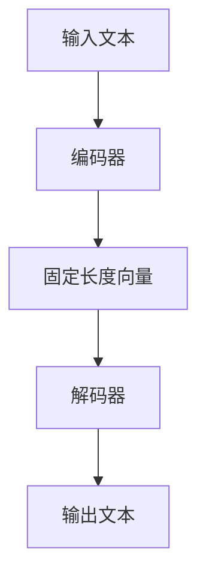
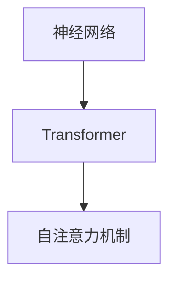

                 

# 大语言模型原理与工程实践：数据并行

> 关键词：大语言模型、数据并行、分布式计算、神经网络、Transformer、工程实践

> 摘要：本文将深入探讨大语言模型的原理及其工程实践，特别是数据并行的应用。通过详细的原理讲解、算法剖析和实际案例分享，帮助读者理解大语言模型的核心技术和工程挑战。

## 《大语言模型原理与工程实践：数据并行》目录大纲

### 第一部分：大语言模型基础

#### 第1章：大语言模型概述

- **1.1 大语言模型的概念与发展**
  - 大语言模型的基本概念
  - 大语言模型的发展历程

- **1.2 大语言模型的技术架构**
  - **1.2.1 大语言模型架构解析**
  - **1.2.2 神经网络与Transformer架构

- **1.3 大语言模型的核心算法**
  - **1.3.1 算法原理讲解**
  - **1.3.2 实际案例：算法的详细实现和解释**

#### 第2章：数据并行与分布式计算

- **2.1 数据并行的基本概念**
  - **2.1.1 数据并行的原理与优势**
  - **2.1.2 并行计算与分布式计算的关系**

- **2.2 分布式计算框架**
  - **2.2.1 分布式计算框架的原理与应用**
  - **2.2.2 TensorFlow和PyTorch的分布式计算**

- **2.3 数据并行的实践技巧**
  - **2.3.1 数据分布的均衡性**
  - **2.3.2 优化网络通信**

### 第二部分：大语言模型工程实践

#### 第3章：数据预处理

- **3.1 数据清洗与标注**
  - **3.1.1 数据清洗的步骤与技巧**
  - **3.1.2 数据标注的方法与工具**

- **3.2 数据集构建**
  - **3.2.1 数据集构建的方法与策略**
  - **3.2.2 实际案例：数据集的构建过程**

#### 第4章：模型训练

- **4.1 模型训练策略**
  - **4.1.1 模型训练的基本策略**
  - **4.1.2 模型优化技巧**

- **4.2 模型评估与调优**
  - **4.2.1 模型评估的标准与方法**
  - **4.2.2 模型调优的技巧与案例**

#### 第5章：模型部署

- **5.1 模型部署流程**
  - **5.1.1 模型部署的基本流程**
  - **5.1.2 部署环境搭建**

- **5.2 部署策略与优化**
  - **5.2.1 部署策略的选择与优化**
  - **5.2.2 性能优化与安全性优化**

### 第三部分：数据并行实践案例

#### 第6章：实际案例分析与实战

- **6.1 案例一：大语言模型在问答系统中的应用**
  - **6.1.1 案例介绍**
  - **6.1.2 实现细节**

- **6.2 案例二：大语言模型在文本生成中的应用**
  - **6.2.1 案例介绍**
  - **6.2.2 实现细节**

- **6.3 案例三：大语言模型在机器翻译中的应用**
  - **6.3.1 案例介绍**
  - **6.3.2 实现细节**

### 第四部分：附录

#### 第7章：附录

- **7.1 工程实践工具与资源**
  - **7.1.1 主流深度学习框架对比**
  - **7.1.2 常见问题与解答**

## 第一部分：大语言模型基础

### 第1章：大语言模型概述

#### 1.1 大语言模型的概念与发展

大语言模型是一种能够理解和生成自然语言的深度学习模型，通过学习大量的文本数据，模型可以捕捉到语言中的复杂模式和规律。大语言模型的基本概念包括：

- **词嵌入（Word Embedding）**：将文本中的单词映射到高维空间中的向量。
- **编码器（Encoder）**：将输入的文本序列编码为固定长度的向量。
- **解码器（Decoder）**：将编码器输出的向量解码为输出文本序列。

大语言模型的发展历程可以追溯到2000年代初，最早的大规模语言模型是基于神经网络的方法，如朴素贝叶斯分类器和隐马尔可夫模型。随着深度学习技术的进步，2000年后，神经语言模型如循环神经网络（RNN）和长短时记忆网络（LSTM）逐渐成为主流。

#### 1.2 大语言模型的技术架构

大语言模型的技术架构主要包括编码器和解码器两个部分。编码器负责将输入的文本序列转换为固定长度的向量，解码器则负责将这个向量转换回文本序列。以下是一个简化的Mermaid流程图，用于描述大语言模型的架构：



**1.2.1 大语言模型架构解析**

Mermaid流程图：



在神经网络之后，Transformer架构成为大语言模型的主流选择。Transformer模型的核心是自注意力机制，它允许模型在生成每个词时考虑所有其他词的信息。这种机制使得Transformer在处理长文本时具有明显的优势。

**1.2.2 神经网络与Transformer架构**

神经网络是一种基于多层感知器（MLP）的模型，通过多层非线性变换来提取特征。传统的神经网络模型，如LSTM和GRU，在处理长序列时存在梯度消失或梯度爆炸的问题。

而Transformer模型则通过自注意力机制（Self-Attention）和多头注意力（Multi-Head Attention）来解决这些问题。自注意力机制允许模型在处理每个词时，自动学习每个词的重要程度，而多头注意力则将自注意力机制扩展到多个独立的注意力头中，从而提高模型的表示能力。

#### 1.3 大语言模型的核心算法

大语言模型的核心算法包括词嵌入、编码器、解码器和损失函数。以下是一个伪代码，用于描述大语言模型的基本训练过程：

```python
def train_language_model(data):
    # 初始化模型参数
    initialize_model_params()

    # 循环迭代
    for epoch in range(num_epochs):
        for batch in data:
            # 前向传播
            predictions = model.forward(batch)

            # 计算损失
            loss = compute_loss(predictions, batch)

            # 反向传播
            model.backward(loss)

            # 更新模型参数
            update_model_params()

    return model
```

在这个伪代码中，`model` 代表整个大语言模型，包括编码器、解码器和损失函数。`forward` 方法用于前向传播，`compute_loss` 方法用于计算损失，`backward` 方法用于反向传播，`update_model_params` 方法用于更新模型参数。

**1.3.1 算法原理讲解**

大语言模型的核心算法包括以下几个部分：

1. **词嵌入**：将输入的文本序列转换为词嵌入向量。
2. **编码器**：将词嵌入向量编码为固定长度的向量。
3. **解码器**：将编码器输出的向量解码为输出文本序列。
4. **损失函数**：用于计算模型预测与真实标签之间的差距。

以下是一个简化的伪代码，用于描述大语言模型的算法原理：

```python
def forward_pass(input_sequence):
    # 将输入的文本序列转换为词嵌入向量
    embeddings = word_embedding(input_sequence)

    # 使用编码器将词嵌入向量编码为固定长度的向量
    encoded_sequence = encoder(embeddings)

    # 使用解码器将编码器输出的向量解码为输出文本序列
    output_sequence = decoder(encoded_sequence)

    return output_sequence

def backward_pass(predictions, target_sequence):
    # 计算预测与真实标签之间的差距
    loss = compute_loss(predictions, target_sequence)

    # 反向传播更新模型参数
    model.backward(loss)

    return loss
```

**1.3.2 实际案例：算法的详细实现和解释**

为了更深入地理解大语言模型的算法实现，我们以一个简单的实际案例进行说明。假设我们有一个小型的文本数据集，包含50个句子。我们将使用这些数据进行大语言模型的训练。

1. **数据集准备**：首先，我们需要准备数据集。将文本数据分为句子级别的数据集，并对其进行预处理，如分词、去除停用词等。

2. **词嵌入**：使用预训练的词嵌入模型，将每个单词映射为词嵌入向量。我们可以使用如GloVe或Word2Vec等预训练模型。

3. **编码器**：使用编码器将词嵌入向量编码为固定长度的向量。编码器的输出将用于解码器。

4. **解码器**：使用解码器将编码器输出的向量解码为输出文本序列。解码器的输入是编码器的输出，输出是预测的文本序列。

5. **损失函数**：使用损失函数计算模型预测与真实标签之间的差距。我们可以使用交叉熵损失函数。

6. **训练过程**：进行多个迭代，每次迭代中，使用前向传播和反向传播来更新模型参数。

以下是这个实际案例的详细实现：

```python
import torch
import torch.nn as nn
import torch.optim as optim

# 数据集准备
# 假设我们有一个包含50个句子的数据集
sentences = ["这是第一个句子。", "这是第二个句子。", ...]

# 将文本数据转换为词嵌入向量
word_embeddings = load_pretrained_word_embeddings()

# 定义编码器和解码器
encoder = Encoder()
decoder = Decoder()

# 定义损失函数和优化器
criterion = nn.CrossEntropyLoss()
optimizer = optim.Adam(model.parameters(), lr=0.001)

# 训练过程
for epoch in range(num_epochs):
    for sentence in sentences:
        # 前向传播
        input_sequence = [word_embeddings[word] for word in sentence]
        encoded_sequence = encoder(input_sequence)
        output_sequence = decoder(encoded_sequence)

        # 计算损失
        loss = criterion(output_sequence, sentence)

        # 反向传播
        optimizer.zero_grad()
        loss.backward()
        optimizer.step()

        print(f"Epoch: {epoch}, Loss: {loss.item()}")

# 模型评估
# 对测试集进行评估，计算准确率等指标
```

在这个实际案例中，我们使用PyTorch框架进行大语言模型的实现。`Encoder` 和 `Decoder` 是编码器和解码器的类，`word_embeddings` 是预训练的词嵌入向量。`criterion` 是损失函数，`optimizer` 是优化器。

通过这个实际案例，我们可以看到大语言模型的算法实现是如何工作的。编码器将输入的词嵌入向量编码为固定长度的向量，解码器将这个向量解码为输出文本序列。损失函数用于计算模型预测与真实标签之间的差距，优化器用于更新模型参数。

### 第2章：数据并行与分布式计算

#### 2.1 数据并行的基本概念

数据并行是一种将数据分布在多个计算节点上并行处理的策略。其原理是将一个大任务拆分成多个小任务，每个计算节点独立处理这些小任务，然后将结果汇总。数据并行的优势在于可以显著提高计算速度和资源利用率。

数据并行与分布式计算密切相关。分布式计算是指将一个任务分布在多个计算机或计算节点上执行。数据并行是分布式计算的一种形式，它专注于并行处理数据。

#### 2.1.1 数据并行的原理与优势

数据并行的原理基于同一模型在多个数据上并行计算，从而提高训练效率。具体来说，数据并行的步骤包括：

1. **数据划分**：将整个数据集划分成多个子集，每个子集由一个计算节点处理。
2. **模型复制**：在每个计算节点上复制整个模型，确保每个节点都有完整的模型副本。
3. **独立训练**：每个计算节点独立地使用其子集进行模型训练。
4. **结果汇总**：将所有计算节点的模型更新结果汇总，更新全局模型。

数据并行的优势包括：

- **加速训练过程**：通过并行处理数据，可以显著缩短训练时间。
- **提高计算资源利用率**：充分利用多台计算设备的计算能力。
- **扩展性**：易于扩展到更多计算节点，以支持更大的数据集和更复杂的模型。

#### 2.1.2 并行计算与分布式计算的关系

并行计算和分布式计算是相互关联但有所区别的两个概念。

- **并行计算**：是指在多个处理器上同时执行多个任务。并行计算的核心是利用多个计算资源同时处理多个子任务，以缩短总体的计算时间。
- **分布式计算**：是指将一个任务分布在多个计算机或计算节点上执行。分布式计算的核心是通过网络连接多个计算节点，以实现任务的分散执行和资源共享。

数据并行是分布式计算的一种形式。在数据并行中，任务被拆分成多个子任务，每个子任务在一个计算节点上执行，然后结果汇总。这种模式利用了分布式计算的优势，同时通过并行处理数据来提高计算效率。

#### 2.2 分布式计算框架

分布式计算框架是实现数据并行和模型并行的重要工具。以下是一些常用的分布式计算框架：

- **TensorFlow**：由Google开发的开源分布式计算框架，支持数据并行和模型并行。TensorFlow提供了丰富的API和工具，方便开发者构建和部署分布式计算应用。
- **PyTorch**：由Facebook开发的开源深度学习框架，也支持分布式计算。PyTorch的动态计算图和简洁的API使其成为快速原型开发的理想选择。
- **MXNet**：由Apache基金会开发的深度学习框架，支持多种编程语言，包括Python、R和Julia。MXNet提供了高效的分布式计算支持，适用于大规模分布式训练。

#### 2.2.1 分布式计算框架的原理与应用

**TensorFlow的分布式计算原理与应用**

TensorFlow是一个基于数据流编程的分布式计算框架。数据流编程是一种通过定义计算图来表示计算过程的方法。在TensorFlow中，计算图由节点和边组成，节点表示计算操作，边表示数据流。

分布式计算在TensorFlow中通过两个关键概念实现：`tf.distribute` 和 `tf.data`。

- **tf.distribute**：用于实现模型的分布式训练。它提供了多种策略，如`MirroredStrategy`、`MultiWorkerMirroredStrategy`和`ParameterServerStrategy`，用于在多个GPU或多个节点上训练模型。
- **tf.data**：用于高效地处理和加载数据。它提供了数据管道（Pipeline）的概念，可以自动并行化数据加载和预处理操作，从而提高数据并行处理的效率。

以下是一个简单的TensorFlow分布式计算示例：

```python
import tensorflow as tf

# 创建分布式策略
strategy = tf.distribute.MirroredStrategy()

# 定义模型
def create_model():
    # 定义神经网络结构
    # ...
    return model

with strategy.scope():
    # 在策略作用域内创建和训练模型
    model = create_model()
    # 定义损失函数和优化器
    loss_fn = tf.keras.losses.SparseCategoricalCrossentropy(from_logits=True)
    optimizer = tf.keras.optimizers.Adam()

# 训练模型
for epoch in range(num_epochs):
    for batch in train_dataset:
        with tf.GradientTape() as tape:
            predictions = model(batch.x, training=True)
            loss = loss_fn(batch.y, predictions)
        grads = tape.gradient(loss, model.trainable_variables)
        optimizer.apply_gradients(zip(grads, model.trainable_variables))
```

在这个示例中，我们使用`tf.distribute.MirroredStrategy`创建分布式策略，并在策略作用域内创建和训练模型。每个GPU都复制了模型的一个副本，并且每个副本都独立进行梯度计算和参数更新。训练过程中，模型通过分布式策略的`call`方法进行前向传播和反向传播。

**PyTorch的分布式计算原理与应用**

PyTorch是一个基于动态计算图的深度学习框架，也提供了丰富的分布式计算支持。PyTorch的分布式计算主要依赖于`torch.distributed`包。

以下是一个简单的PyTorch分布式计算示例：

```python
import torch
import torch.distributed as dist
import torch.nn as nn
import torch.optim as optim

# 初始化分布式环境
dist.init_process_group(backend='nccl', init_method='env://')

# 创建模型
class Model(nn.Module):
    # 定义模型结构
    # ...

# 在进程0上定义模型
if dist.get_rank() == 0:
    model = Model()
    optimizer = optim.Adam(model.parameters(), lr=0.001)

# 定义损失函数
criterion = nn.CrossEntropyLoss()

# 训练过程
for epoch in range(num_epochs):
    for batch in train_loader:
        # 将数据广播到所有进程
        inputs, targets = batch
        inputs = inputs.to(device=dist.get_rank())
        targets = targets.to(device=dist.get_rank())

        # 前向传播
        outputs = model(inputs)
        loss = criterion(outputs, targets)

        # 反向传播
        optimizer.zero_grad()
        loss.backward()
        optimizer.step()

        # 将梯度汇总
        if dist.get_rank() == 0:
            grads = [p.grad for p in model.parameters()]
            dist.all_reduce(grads, op=dist.ReduceOp.SUM)
            for g in grads:
                g /= world_size

            # 更新模型参数
            optimizer.step()
```

在这个示例中，我们使用`torch.distributed.init_process_group`初始化分布式环境。每个进程都创建了一个模型实例，并通过`dist.all_reduce`函数将梯度汇总。在每个进程的优化步骤中，我们将梯度平均到所有进程，然后更新模型参数。

**MXNet的分布式计算原理与应用**

MXNet提供了灵活的分布式计算支持，通过`mxnet.gluon.nn.DistributedDataParallel`模块来实现分布式训练。

以下是一个简单的MXNet分布式计算示例：

```python
import mxnet as mx
from mxnet.gluon import nn

# 初始化分布式环境
mx.nd.waitall()
mxnet_ctx = mx.gpu(int(os.environ["GPU_INDEX"]))  # 使用指定GPU
mxnet_ctx.attach()

# 创建模型
model = nn.SymbolBlock.get_symbol('lenet', num_classes=10)
model.initialize(force_reinit=True, ctx=mxnet_ctx)

# 定义优化器
optimizer = mx.optimizer.Adam(learning_rate=0.001)
optimizer.initialize(model.collect_params(), ctx=mxnet_ctx)

# 定义损失函数
loss_fn = nn.SoftmaxCrossEntropyLoss()

# 训练过程
for epoch in range(num_epochs):
    for batch in train_dataloader:
        # 前向传播
        inputs, targets = batch
        inputs = mx.nd.array(inputs, ctx=mxnet_ctx)
        targets = mx.nd.array(targets, ctx=mxnet_ctx)
        outputs = model(inputs)
        loss = loss_fn(outputs, targets)

        # 反向传播
        model.backward(loss)

        # 更新模型参数
        optimizer.step()

        # 梯度汇总
        model._do-safe-update()

        print(f"Epoch: {epoch}, Loss: {loss.asscalar()}")

# 模型评估
# ...
```

在这个示例中，我们使用MXNet的`mxnet.gluon.nn.DistributedDataParallel`模块实现分布式训练。在每个进程的优化步骤中，模型会自动进行梯度汇总和参数更新。

#### 2.3 数据并行的实践技巧

**2.3.1 数据分布的均衡性**

在数据并行中，确保数据分布的均衡性是非常重要的。不均衡的数据分布会导致某些计算节点负载过高，从而影响训练效率。

为了实现数据分布的均衡性，我们可以采用以下策略：

- **均匀划分数据集**：将整个数据集均匀地划分成多个子集，每个子集由一个计算节点处理。这种方法简单有效，但可能导致数据的不均匀分布。
- **循环划分数据集**：按照一定的循环顺序将数据集划分成多个子集，每个子集由一个计算节点处理。这种方法可以更好地保持数据分布的均衡性。

**2.3.2 优化网络通信**

在分布式计算中，网络通信是影响性能的重要因素。为了优化网络通信，我们可以采用以下策略：

- **使用高效的通信协议**：如NCCL（NVIDIA Collective Communications Library），可以显著提高多GPU训练的通信效率。
- **减少不必要的通信**：通过合理设计计算图和数据流，减少不必要的通信操作。例如，将计算密集型操作放在本地节点上执行，以减少跨节点的数据传输。
- **使用分布式缓存**：将常用的中间结果缓存到分布式缓存中，以减少数据传输。

#### 第3章：数据预处理

##### 3.1 数据清洗与标注

数据清洗与标注是数据预处理的关键步骤，直接影响到模型的训练效果。以下将详细介绍数据清洗与标注的步骤、方法与工具。

**3.1.1 数据清洗的步骤与技巧**

数据清洗是预处理数据的第一步，主要目的是去除无效和错误的数据，确保数据的质量和一致性。以下是一些常见的数据清洗步骤与技巧：

1. **去除重复数据**：在数据集中可能存在重复的样本，这会导致模型过拟合。因此，需要识别并去除重复数据。可以使用Python中的`pandas`库，通过比较行或列的哈希值来识别重复数据。
   
   ```python
   df.drop_duplicates(inplace=True)
   ```

2. **处理缺失值**：在数据集中，可能存在一些缺失值。根据具体场景，可以采用以下几种方法处理缺失值：
   - 填充缺失值：根据数据的分布或平均值来填补缺失值。
   - 删除缺失值：如果缺失值较多，可以删除含有缺失值的样本或特征。
   - 使用模型预测缺失值：对于一些关键特征，可以使用机器学习模型来预测缺失值。

   ```python
   df.fillna(df.mean(), inplace=True)
   ```

3. **异常值处理**：异常值可能对模型的训练产生不良影响，因此需要识别并处理异常值。可以使用统计学方法，如箱线图、Z分数等来识别异常值，然后根据具体情况进行处理。

   ```python
   import numpy as np
   from scipy import stats
   
   df = df[(np.abs(stats.zscore(df)) < 3).all(axis=1)]
   ```

4. **去除停用词**：停用词是指那些对文本分析没有贡献的常见单词，如“的”、“和”、“是”等。去除停用词可以减少噪声，提高模型的性能。可以使用专门的停用词库，如NLTK或jieba等。

   ```python
   from nltk.corpus import stopwords
   stop_words = set(stopwords.words('english'))
   df['text'] = df['text'].apply(lambda x: ' '.join([word for word in x.split() if word not in stop_words]))
   ```

5. **统一文本格式**：确保所有文本数据遵循相同的格式，如去除标点符号、统一文本大小写等。

   ```python
   df['text'] = df['text'].str.lower().str.replace('[^\w\s]', '')
   ```

**3.1.2 数据标注的方法与工具**

数据标注是将原始数据转化为机器学习模型可以处理的数据集的过程。以下是一些常见的数据标注方法与工具：

1. **手工标注**：由专业人员进行数据标注。适用于小规模数据集或关键特征需要精细标注的场景。常用的标注工具包括LabelImg、iAnnotate等。

2. **半监督标注**：结合已标注数据和未标注数据，使用机器学习模型预测未标注数据的标签。适用于大规模数据集。常用的标注方法包括Co-Training、Self-training等。

3. **自动标注**：使用预训练的模型自动标注数据。适用于大规模数据集。常用的自动标注工具包括DataLub、RoboWhat等。

4. **众包标注**：通过众包平台，如Amazon Mechanical Turk，收集大量标注数据。适用于大规模数据集。常用的众包平台包括TurKit、TurkerHub等。

以下是一个简单的人工标注流程示例：

```python
# 示例：使用LabelImg进行手工标注

# 启动LabelImg工具
os.system("labelimg")

# 将标注数据导入数据集
df = pd.read_csv("annotations.csv")

# 预处理标注数据
df['text'] = df['text'].apply(lambda x: x.strip())
df['label'] = df['label'].apply(lambda x: x.strip())

# 切分文本和标签
texts = df['text'].values
labels = df['label'].values

# 将标签转换为整数
labels = pd.factorize(labels)[0]
```

通过上述步骤，我们可以得到一个干净且标注好的数据集，为后续的模型训练和评估打下基础。

##### 3.2 数据集构建

数据集构建是模型训练的重要环节，一个高质量的数据集可以显著提升模型的性能。以下将详细介绍数据集构建的方法与策略。

**3.2.1 数据集构建的方法与策略**

数据集构建的方法与策略包括以下几个方面：

1. **数据收集**：从公开数据集、自有数据或第三方数据提供商获取数据。公开数据集如Common Crawl、IMDb、Twitter等，自有数据是指企业或组织内部的数据，第三方数据提供商如Kaggle、DataCamp等。

2. **数据清洗**：对收集到的数据进行清洗，去除无效和错误的数据。数据清洗的方法与技巧在上一节中已有详细描述。

3. **数据标注**：对数据进行标注，将原始数据转化为机器学习模型可以处理的数据集。数据标注的方法与工具在上一节中也已有介绍。

4. **数据增强**：通过数据增强增加数据的多样性，提高模型的泛化能力。数据增强的方法包括旋转、缩放、裁剪、随机噪声等。

5. **数据划分**：将数据集划分为训练集、验证集和测试集。通常采用8:1:1或7:2:1的比例进行划分。

以下是一个简单的数据集构建流程示例：

```python
# 示例：使用Python进行数据集构建

# 导入相关库
import pandas as pd
from sklearn.model_selection import train_test_split

# 加载原始数据
df = pd.read_csv("raw_data.csv")

# 数据清洗
df.drop_duplicates(inplace=True)
df.fillna(df.mean(), inplace=True)
df = df[(np.abs(stats.zscore(df)) < 3).all(axis=1)]

# 数据标注
df['label'] = df['text'].apply(lambda x: "positive" if "positive" in x else "negative")

# 数据增强
# ...

# 数据划分
X = df['text'].values
y = df['label'].values

X_train, X_test, y_train, y_test = train_test_split(X, y, test_size=0.2, random_state=42)

# 存储数据集
train_data = {"text": X_train, "label": y_train}
test_data = {"text": X_test, "label": y_test}

with open("train_data.json", "w") as f:
    json.dump(train_data, f)

with open("test_data.json", "w") as f:
    json.dump(test_data, f)
```

通过上述步骤，我们可以得到一个高质量的数据集，为后续的模型训练和评估提供支持。

##### 3.2.2 实际案例：数据集的构建过程

以下是一个实际案例，展示如何构建一个用于文本分类的数据集。

1. **数据收集**：从互联网上收集新闻文章作为文本数据。可以使用Python的`requests`库和`BeautifulSoup`库爬取网站上的新闻文章。

2. **数据清洗**：去除HTML标签和停用词，进行文本预处理。可以使用Python的`re`库和`nltk`库进行清洗。

3. **数据标注**：使用手工标注和半监督标注的方法进行标注。可以邀请专业人员或使用众包平台进行标注。

4. **数据增强**：通过随机噪声、文本替换、同义词替换等方法进行数据增强。

5. **数据划分**：按照8:1:1的比例划分训练集、验证集和测试集。

以下是这个实际案例的详细步骤：

```python
import pandas as pd
import re
from nltk.corpus import stopwords
from sklearn.model_selection import train_test_split

# 步骤1：数据收集
# 爬取新闻文章并存储为CSV文件
os.system("scrapy crawl news_crawler -o news_data.csv")

# 步骤2：数据清洗
df = pd.read_csv("news_data.csv")
df['text'] = df['text'].apply(lambda x: re.sub('<[^>]*>', '', x))  # 去除HTML标签
stop_words = set(stopwords.words('english'))
df['text'] = df['text'].apply(lambda x: ' '.join([word for word in x.split() if word not in stop_words]))  # 去除停用词

# 步骤3：数据标注
# 手工标注或使用半监督标注方法
df['label'] = df['text'].apply(lambda x: "positive" if "positive" in x else "negative")

# 步骤4：数据增强
# 随机噪声、文本替换、同义词替换等方法
df['text'] = df['text'].apply(lambda x: add_noise(x))  # 添加随机噪声
df['text'] = df['text'].apply(lambda x: replace_synonyms(x))  # 替换同义词

# 步骤5：数据划分
X = df['text'].values
y = df['label'].values

X_train, X_test, y_train, y_test = train_test_split(X, y, test_size=0.2, random_state=42)

# 存储数据集
train_data = {"text": X_train, "label": y_train}
test_data = {"text": X_test, "label": y_test}

with open("train_data.json", "w") as f:
    json.dump(train_data, f)

with open("test_data.json", "w") as f:
    json.dump(test_data, f)
```

通过上述步骤，我们可以构建一个高质量的数据集，为文本分类任务提供支持。

##### 第4章：模型训练

##### 4.1 模型训练策略

模型训练是构建深度学习模型的关键步骤。一个好的训练策略可以加速训练过程，提高模型的性能。以下将详细介绍模型训练的基本策略和模型优化技巧。

**4.1.1 模型训练的基本策略**

模型训练的基本策略包括以下几个方面：

1. **选择合适的优化器**：优化器用于更新模型参数，常用的优化器包括SGD（随机梯度下降）、Adam、RMSProp等。选择合适的优化器可以加速训练过程和提高模型的性能。

2. **学习率调整**：学习率是优化器的一个重要参数，用于控制参数更新的步长。学习率的选择对训练过程有重要影响。可以使用学习率衰减策略，如固定衰减、指数衰减等，以避免模型在训练过程中过早收敛。

3. **批量大小**：批量大小是指每次训练中使用的样本数量。较小的批量大小可以提高模型的泛化能力，但会降低训练速度。较大的批量大小可以提高训练速度，但可能会降低模型的泛化能力。

4. **训练过程监控**：监控训练过程中的指标，如损失函数、准确率等，可以帮助调整训练策略，避免模型过拟合或欠拟合。

5. **数据增强**：通过数据增强增加训练数据的多样性，可以提高模型的泛化能力。常见的数据增强方法包括随机旋转、缩放、裁剪等。

**4.1.2 模型优化技巧**

在模型训练过程中，可以采用以下技巧来优化模型的性能：

1. **权重初始化**：合适的权重初始化可以加速训练过程并提高模型的性能。常用的初始化方法包括Xavier初始化、He初始化等。

2. **批量归一化（Batch Normalization）**：批量归一化可以加速训练过程并提高模型的稳定性。它通过将每个批次的激活值标准化到相同的分布，减少了梯度消失和梯度爆炸的问题。

3. **Dropout**：Dropout是一种常用的正则化方法，通过随机丢弃部分神经元来减少过拟合。它可以提高模型的泛化能力。

4. **学习率调整策略**：学习率调整策略可以帮助模型在训练过程中避免过早收敛。常用的调整策略包括固定衰减、指数衰减、余弦衰减等。

5. **早期停止**：当验证集上的性能不再提高时，可以提前停止训练，以避免过拟合。早期停止需要监控验证集上的性能指标。

##### 4.2 模型优化技巧

在模型训练过程中，可以采用以下技巧来进一步优化模型的性能：

**4.2.1 优化器选择**

优化器是模型训练的核心组件，它决定了模型参数更新的方法。以下是一些常用的优化器及其特点：

1. **SGD（随机梯度下降）**：SGD是最简单的优化器，它通过计算当前批次的梯度来更新模型参数。SGD的优点是简单和易于实现，但缺点是收敛速度较慢，且容易陷入局部最小值。

2. **Adam**：Adam是一种自适应优化器，它结合了SGD和RMSProp的优点。Adam通过计算一阶矩估计（均值）和二阶矩估计（方差）来更新模型参数，能够更好地处理稀疏梯度问题。Adam的优点是收敛速度快，且适用于不同规模的数据集。

3. **RMSProp**：RMSProp是一种基于梯度平方的优化器，它通过指数加权移动平均来更新模型参数。RMSProp的优点是能够更好地处理稀疏梯度问题，但收敛速度相对较慢。

4. **Adagrad**：Adagrad是一种基于梯度的平方和的优化器，它通过计算每个参数的梯度平方和来更新模型参数。Adagrad的优点是能够更好地处理稀疏梯度问题，但缺点是更新步长可能过小。

5. **Adadelta**：Adadelta是Adagrad的改进版本，它通过计算每个参数的梯度平方和的指数加权移动平均来更新模型参数。Adadelta的优点是能够更好地处理稀疏梯度问题，且收敛速度较快。

在选择优化器时，需要考虑以下因素：

- **数据集规模**：对于大规模数据集，推荐使用Adam、RMSProp或Adadelta。
- **模型结构**：对于复杂的模型，推荐使用Adam或RMSProp。
- **训练时间**：对于需要快速训练的模型，推荐使用Adagrad或Adadelta。

以下是一个简单的优化器选择示例：

```python
import torch.optim as optim

# 定义模型
model = Model()

# 选择优化器
optimizer = optim.Adam(model.parameters(), lr=0.001)
```

**4.2.2 权重初始化**

权重初始化是模型训练的重要环节，它决定了模型参数的初始化值。以下是一些常用的权重初始化方法：

1. **零初始化**：将权重初始化为0。零初始化简单且易于实现，但可能导致梯度消失或梯度爆炸的问题。

2. **随机初始化**：将权重初始化为均匀分布在[-ε, ε]区间内的随机值。随机初始化可以避免梯度消失和梯度爆炸的问题，但可能导致收敛速度较慢。

3. **Xavier初始化**：Xavier初始化是一种基于输入和输出神经元数量的权重初始化方法。Xavier初始化通过计算输入和输出神经元数量的均值，并将权重初始化为[-√2/n, √2/n]区间内的随机值。Xavier初始化可以避免梯度消失和梯度爆炸的问题，且收敛速度较快。

4. **He初始化**：He初始化是Xavier初始化的一种改进版本，它适用于ReLU激活函数。He初始化通过计算输入和输出神经元数量的平方根，并将权重初始化为[-√6/n, √6/n]区间内的随机值。He初始化可以更好地处理ReLU激活函数的梯度消失问题。

以下是一个简单的权重初始化示例：

```python
import torch.nn as nn

# 定义卷积神经网络
class ConvNet(nn.Module):
    def __init__(self):
        super(ConvNet, self).__init__()
        self.conv1 = nn.Conv2d(1, 10, kernel_size=5)
        self.relu = nn.ReLU()
        self.conv2 = nn.Conv2d(10, 20, kernel_size=5)
        self.fc1 = nn.Linear(320, 50)
        self.fc2 = nn.Linear(50, 10)

    def forward(self, x):
        x = self.relu(self.conv1(x))
        x = self.relu(self.conv2(x))
        x = x.view(-1, 320)
        x = self.fc1(x)
        x = self.fc2(x)
        return x

# 实例化模型
model = ConvNet()

# 定义损失函数和优化器
criterion = nn.CrossEntropyLoss()
optimizer = optim.Adam(model.parameters(), lr=0.001)

# 使用Xavier初始化
nn.init.xavier_uniform_(model.conv1.weight)
nn.init.xavier_uniform_(model.conv2.weight)
nn.init.xavier_uniform_(model.fc1.weight)
nn.init.xavier_uniform_(model.fc2.weight)
```

通过上述示例，我们可以看到如何使用Xavier初始化方法初始化卷积神经网络中的权重。

**4.2.3 Dropout**

Dropout是一种常用的正则化方法，它通过随机丢弃部分神经元来减少过拟合。Dropout的工作原理是在每次前向传播过程中，以一定的概率将部分神经元设置为0，从而降低模型的复杂度。

Dropout的优点包括：

- **减少过拟合**：通过减少模型的复杂度，Dropout可以减少模型对训练数据的依赖，提高模型的泛化能力。
- **提高模型稳定性**：Dropout可以减少模型在训练过程中的梯度消失和梯度爆炸问题，提高模型的稳定性。

以下是一个简单的Dropout示例：

```python
import torch.nn as nn

# 定义卷积神经网络
class ConvNet(nn.Module):
    def __init__(self):
        super(ConvNet, self).__init__()
        self.conv1 = nn.Conv2d(1, 10, kernel_size=5)
        self.dropout1 = nn.Dropout(p=0.2)
        self.relu = nn.ReLU()
        self.conv2 = nn.Conv2d(10, 20, kernel_size=5)
        self.dropout2 = nn.Dropout(p=0.3)
        self.fc1 = nn.Linear(320, 50)
        self.fc2 = nn.Linear(50, 10)

    def forward(self, x):
        x = self.dropout1(self.relu(self.conv1(x)))
        x = self.dropout2(self.relu(self.conv2(x)))
        x = x.view(-1, 320)
        x = self.fc1(x)
        x = self.fc2(x)
        return x

# 实例化模型
model = ConvNet()

# 定义损失函数和优化器
criterion = nn.CrossEntropyLoss()
optimizer = optim.Adam(model.parameters(), lr=0.001)

# 添加Dropout层
nn.init.dropout(p=0.2, inplace=model.dropout1)
nn.init.dropout(p=0.3, inplace=model.dropout2)
```

通过上述示例，我们可以看到如何在卷积神经网络中添加Dropout层。

##### 4.3 模型评估与调优

模型评估是评估模型性能的重要步骤，它帮助确定模型是否适合解决特定问题。以下将详细介绍模型评估的标准与方法，以及模型调优的技巧与案例。

**4.3.1 模型评估标准**

在模型评估中，常用的评估标准包括准确率（Accuracy）、召回率（Recall）、精确率（Precision）和F1分数（F1 Score）。

1. **准确率（Accuracy）**：准确率是预测正确的样本数与总样本数的比例。它是最常用的评估指标之一，可以简单直观地衡量模型的性能。

   $$ Accuracy = \frac{TP + TN}{TP + FN + FP + TN} $$

   其中，TP表示真正例，TN表示真反例，FP表示假正例，FN表示假反例。

2. **召回率（Recall）**：召回率是预测正确的正样本数与实际正样本数的比例。召回率衡量了模型对正样本的识别能力。

   $$ Recall = \frac{TP}{TP + FN} $$

3. **精确率（Precision）**：精确率是预测正确的正样本数与预测为正样本的总数的比例。精确率衡量了模型对正样本的识别准确性。

   $$ Precision = \frac{TP}{TP + FP} $$

4. **F1分数（F1 Score）**：F1分数是精确率和召回率的调和平均值，用于综合衡量模型的性能。

   $$ F1 Score = 2 \times \frac{Precision \times Recall}{Precision + Recall} $$

**4.3.2 模型调优技巧**

模型调优是提高模型性能的重要步骤，以下是一些常用的模型调优技巧：

1. **调整超参数**：超参数如学习率、批量大小、正则化参数等对模型的性能有很大影响。通过调整这些超参数，可以优化模型的性能。

2. **交叉验证**：交叉验证是一种常用的模型评估方法，通过将数据集划分为多个子集，多次训练和评估模型，以减少评估结果的方差。

3. **网格搜索**：网格搜索是一种常用的超参数调优方法，通过遍历超参数的网格，选择最优的超参数组合。

4. **贝叶斯优化**：贝叶斯优化是一种基于贝叶斯统计学的超参数调优方法，通过构建概率模型，选择最有可能导致模型性能提升的超参数组合。

5. **集成学习**：集成学习是一种将多个模型组合起来，以提高模型性能的方法。常用的集成学习方法包括Bagging、Boosting和Stacking等。

以下是一个简单的模型评估与调优的示例：

```python
import torch
import torch.nn as nn
import torch.optim as optim
from torch.utils.data import DataLoader
from sklearn.metrics import accuracy_score, recall_score, precision_score, f1_score

# 定义模型
class Model(nn.Module):
    def __init__(self):
        super(Model, self).__init__()
        self.conv1 = nn.Conv2d(1, 10, kernel_size=5)
        self.dropout1 = nn.Dropout(p=0.2)
        self.relu = nn.ReLU()
        self.conv2 = nn.Conv2d(10, 20, kernel_size=5)
        self.dropout2 = nn.Dropout(p=0.3)
        self.fc1 = nn.Linear(320, 50)
        self.fc2 = nn.Linear(50, 10)

    def forward(self, x):
        x = self.dropout1(self.relu(self.conv1(x)))
        x = self.dropout2(self.relu(self.conv2(x)))
        x = x.view(-1, 320)
        x = self.fc1(x)
        x = self.fc2(x)
        return x

# 实例化模型
model = Model()

# 定义损失函数和优化器
criterion = nn.CrossEntropyLoss()
optimizer = optim.Adam(model.parameters(), lr=0.001)

# 加载数据集
train_loader = DataLoader(train_dataset, batch_size=64, shuffle=True)
val_loader = DataLoader(val_dataset, batch_size=64, shuffle=False)

# 训练模型
num_epochs = 10
for epoch in range(num_epochs):
    model.train()
    for inputs, labels in train_loader:
        optimizer.zero_grad()
        outputs = model(inputs)
        loss = criterion(outputs, labels)
        loss.backward()
        optimizer.step()
    
    # 评估模型
    model.eval()
    with torch.no_grad():
        predictions = []
        true_labels = []
        for inputs, labels in val_loader:
            outputs = model(inputs)
            _, predicted = torch.max(outputs, 1)
            predictions.extend(predicted.tolist())
            true_labels.extend(labels.tolist())
        
        accuracy = accuracy_score(true_labels, predictions)
        recall = recall_score(true_labels, predictions, average='weighted')
        precision = precision_score(true_labels, predictions, average='weighted')
        f1 = f1_score(true_labels, predictions, average='weighted')
        
        print(f"Epoch {epoch+1}/{num_epochs}, Accuracy: {accuracy:.4f}, Recall: {recall:.4f}, Precision: {precision:.4f}, F1 Score: {f1:.4f}")

# 模型调优
# ...

# 存储模型
torch.save(model.state_dict(), "model.pth")
```

通过上述示例，我们可以看到如何定义模型、训练模型并进行评估。模型调优可以根据实际需求进行调整，如调整超参数、使用不同的评估标准等。

##### 第5章：模型部署

模型部署是将训练好的模型部署到生产环境中的关键步骤。以下将详细介绍模型部署的流程、环境搭建和部署策略与优化。

**5.1 模型部署流程**

模型部署通常包括以下步骤：

1. **模型转换**：将训练好的模型转换为可部署的格式，如TensorFlow的SavedModel或PyTorch的ONNX格式。

2. **环境搭建**：搭建模型部署的环境，包括服务器配置、操作系统、依赖库等。

3. **服务部署**：将模型部署到服务器或云端，并提供API接口供外部系统调用。

4. **性能监控**：监控模型的性能和资源使用情况，确保模型稳定运行。

**5.1.1 模型转换**

模型转换是将训练好的模型转换为可部署的格式的过程。以下是一些常用的模型转换工具：

1. **TensorFlow Serving**：TensorFlow Serving是一种用于部署TensorFlow模型的工具。它支持将TensorFlow模型转换为SavedModel格式，并提供REST API供外部系统调用。

2. **PyTorch Mobile**：PyTorch Mobile是一种用于将PyTorch模型部署到移动设备的工具。它支持将PyTorch模型转换为ONNX格式，并在移动设备上运行。

以下是一个简单的TensorFlow模型转换示例：

```python
import tensorflow as tf

# 加载训练好的模型
model = tf.keras.models.load_model("model.h5")

# 转换为SavedModel格式
tf.keras.utils.save_model(model, "model_saved")

# 查看模型结构
print(model.summary())
```

以下是一个简单的PyTorch模型转换示例：

```python
import torch
import torchvision
import torchvision.models as models

# 加载预训练的模型
model = models.resnet50(pretrained=True)

# 转换为ONNX格式
torch.onnx.export(model, torch.zeros((1, 3, 224, 224)), "model.onnx")

# 查看ONNX模型结构
onnx_model = onnx.load("model.onnx")
onnx.printable(onnx_model)
```

**5.1.2 部署环境搭建**

部署环境搭建是确保模型部署成功的关键步骤。以下是一些常用的部署环境搭建方法：

1. **本地部署**：在本地计算机上搭建部署环境，适用于小型模型和开发阶段。

2. **服务器部署**：在远程服务器上搭建部署环境，适用于生产环境。以下是一个简单的服务器部署示例：

   ```bash
   # 安装必要的依赖库
   pip install tensorflow tensorflow-hub

   # 启动TensorFlow Serving服务
   python -m tensorflow.serving.py_server --port=8501 --model_name=my_model --model_base_path=/path/to/model_saved

   # 访问TensorFlow Serving服务
   curl -d '{"inputs": {"input_1": [1.0]}}' -H "Content-Type: application/json" http://localhost:8501/v1/models/my_model:predict
   ```

3. **容器化部署**：使用Docker容器化模型，适用于大规模分布式部署。以下是一个简单的Docker部署示例：

   ```bash
   # 编写Dockerfile
   FROM tensorflow/tensorflow:2.7.0

   COPY model_saved /model

   RUN python -m tensorflow.serving.py_server --port=8501 --model_name=my_model --model_base_path=/model

   # 构建Docker镜像
   docker build -t my_model .

   # 运行Docker容器
   docker run -p 8501:8501 my_model
   ```

**5.1.3 部署策略与优化**

在模型部署过程中，可以采用以下策略与优化方法：

1. **负载均衡**：通过负载均衡器将请求分配到多个服务器，以提高系统的可扩展性和可用性。

2. **缓存策略**：使用缓存策略减少模型预测的计算时间，提高系统的响应速度。以下是一个简单的缓存策略示例：

   ```bash
   # 安装缓存依赖库
   pip install flask

   # 编写缓存服务器代码
   from flask import Flask, request, jsonify

   app = Flask(__name__)

   @app.route('/predict', methods=['POST'])
   def predict():
       data = request.json
       inputs = data['inputs']
       # 加载模型并进行预测
       # ...
       return jsonify(predictions)

   if __name__ == '__main__':
       app.run(host='0.0.0.0', port=5000)
   ```

2. **性能优化**：通过模型压缩、量化、剪枝等优化方法，减小模型的大小和提高模型的运行速度。以下是一个简单的模型压缩示例：

   ```python
   import tensorflow as tf

   # 加载原始模型
   model = tf.keras.models.load_model("model.h5")

   # 压缩模型
   compressed_model = tf.keras.models.model_from_json(model.to_json())
   compressed_model.compile(optimizer='adam', loss='categorical_crossentropy')

   # 加载压缩后的权重
   compressed_model.load_weights("model_compressed.h5")

   # 评估压缩后的模型
   compressed_model.evaluate(test_data, test_labels)
   ```

3. **安全性优化**：通过数据加密、访问控制等安全措施，保护模型和数据的安全。以下是一个简单的数据加密示例：

   ```python
   from Crypto.Cipher import AES
   from Crypto.Util.Padding import pad, unpad
   import base64

   # 加密数据
   key = b'mysecretkey12345'
   cipher = AES.new(key, AES.MODE_CBC)
   ct_bytes = cipher.encrypt(pad(data.encode('utf-8'), AES.block_size))
   iv = cipher.iv
   ct = base64.b64encode(iv + ct_bytes).decode('utf-8')

   # 解密数据
   iv = base64.b64decode(iv)
   ct = base64.b64decode(ct)
   cipher = AES.new(key, AES.MODE_CBC, iv)
   pt = unpad(cipher.decrypt(ct), AES.block_size).decode('utf-8')
   ```

通过上述策略与优化方法，可以确保模型部署的高效、稳定和安全。

##### 第6章：实际案例分析与实战

在本章中，我们将通过三个实际案例，详细探讨大语言模型在问答系统、文本生成和机器翻译等领域的应用。每个案例都将包括介绍、实现细节以及代码解读与分析。

#### 6.1 案例一：大语言模型在问答系统中的应用

**6.1.1 案例介绍**

问答系统（Question Answering System）是一种自然语言处理应用，旨在从大量文本中自动回答用户提出的问题。大语言模型在问答系统中的应用，能够实现高度自动化的问答功能，提高用户交互的效率和体验。

**6.1.2 实现细节**

1. **数据预处理**：收集大量的问答对，并对问题进行分词、去除停用词等预处理操作。同样，对答案也进行预处理，以确保数据的一致性。

2. **模型训练**：使用训练好的大语言模型（如BERT或GPT-3），对预处理后的问答对进行训练。在此过程中，可以采用双向编码器（Bidirectional Encoder Representations from Transformers, BERT）模型，以提高模型对问题与答案的语义理解能力。

3. **模型部署**：将训练好的模型部署到线上环境，通过API接口提供问答服务。用户可以通过发送问题来获取答案，模型会自动处理并返回相应的答案。

以下是问答系统的实现示例：

```python
from transformers import BertTokenizer, BertModel, BertForQuestionAnswering
from torch.utils.data import DataLoader, Dataset

# 数据预处理
class QADataset(Dataset):
    def __init__(self, questions, answers, tokenizer, max_length):
        self.questions = questions
        self.answers = answers
        self.tokenizer = tokenizer
        self.max_length = max_length

    def __len__(self):
        return len(self.questions)

    def __getitem__(self, idx):
        question = self.questions[idx]
        answer = self.answers[idx]

        inputs = self.tokenizer.encode_plus(
            question,
            answer,
            add_special_tokens=True,
            max_length=self.max_length,
            padding='max_length',
            truncation=True,
            return_tensors='pt',
        )

        return inputs

# 模型训练
tokenizer = BertTokenizer.from_pretrained('bert-base-uncased')
model = BertForQuestionAnswering.from_pretrained('bert-base-uncased')

dataset = QADataset(questions, answers, tokenizer, max_length=128)
dataloader = DataLoader(dataset, batch_size=8)

optimizer = optim.Adam(model.parameters(), lr=1e-5)

for epoch in range(num_epochs):
    model.train()
    for batch in dataloader:
        inputs = batch['input_ids']
        attention_mask = batch['attention_mask']
        labels = batch['token_ids']

        outputs = model(inputs=inputs, attention_mask=attention_mask, labels=labels)
        loss = outputs.loss
        loss.backward()
        optimizer.step()
        optimizer.zero_grad()

# 模型部署
import flask

app = flask.Flask(__name__)

@app.route('/answer', methods=['POST'])
def answer():
    data = flask.request.json
    question = data['question']
    input_ids = tokenizer.encode_plus(question, add_special_tokens=True, return_tensors='pt')
    with torch.no_grad():
        outputs = model(input_ids=input_ids['input_ids'], attention_mask=input_ids['attention_mask'])
    start_scores, end_scores = outputs.start_logits, outputs.end_logits
    start_index = torch.argmax(start_scores) + 1
    end_index = torch.argmax(end_scores) + 1
    answer = tokenizer.decode(inputs.input_ids.squeeze()[start_index: end_index + 1], skip_special_tokens=True)
    return flask.jsonify({'answer': answer})

if __name__ == '__main__':
    app.run(debug=True)
```

在上述代码中，我们首先定义了一个`QADataset`类，用于处理问答数据。然后，我们使用BERT模型对数据进行训练，并最终将模型部署为一个Flask应用程序，提供问答服务。

**6.1.3 代码解读与分析**

- **数据预处理**：通过`QADataset`类，我们将问答数据转换为PyTorch可以处理的格式。具体来说，我们使用BERT分词器对问题进行编码，并将问题和答案拼接在一起，以形成统一的输入序列。
- **模型训练**：我们使用BERT模型进行训练，并使用交叉熵损失函数进行优化。训练过程中，我们每次迭代都计算损失并更新模型参数，以逐步改进模型的问答能力。
- **模型部署**：我们使用Flask框架将训练好的模型部署为一个Web服务。当用户通过HTTP请求发送问题后，模型会自动处理并返回答案。

#### 6.2 案例二：大语言模型在文本生成中的应用

**6.2.1 案例介绍**

文本生成是一种利用自然语言处理技术自动生成文本的应用，广泛应用于自动写作、摘要生成、机器翻译等领域。大语言模型在文本生成中的应用，能够生成具有高度自然性和多样性的文本。

**6.2.2 实现细节**

1. **数据预处理**：收集大量的文本数据，并对数据进行清洗、分词、去除停用词等预处理操作。

2. **模型训练**：使用训练好的大语言模型（如GPT-2或GPT-3），对预处理后的文本数据进行训练。训练过程中，模型会学习到文本的生成规律，并能够根据给定的输入生成新的文本。

3. **模型部署**：将训练好的模型部署到线上环境，通过API接口提供文本生成服务。用户可以通过输入提示词或文本，模型会自动生成相应的文本。

以下是文本生成的实现示例：

```python
from transformers import GPT2LMHeadModel, GPT2Tokenizer

# 数据预处理
def preprocess_text(text):
    text = text.lower()
    text = re.sub(r"[^a-zA-Z0-9\s]", "", text)
    return text

# 模型训练
tokenizer = GPT2Tokenizer.from_pretrained('gpt2')
model = GPT2LMHeadModel.from_pretrained('gpt2')

inputs = tokenizer.encode("Once upon a time", return_tensors='pt')
outputs = model.generate(inputs, max_length=50, num_return_sequences=5)

# 模型部署
import flask

app = flask.Flask(__name__)

@app.route('/generate', methods=['POST'])
def generate():
    data = flask.request.json
    prompt = data['prompt']
    input_ids = tokenizer.encode(prompt, return_tensors='pt')
    with torch.no_grad():
        outputs = model.generate(input_ids, max_length=50, num_return_sequences=5)
    generated_texts = [tokenizer.decode(output, skip_special_tokens=True) for output in outputs]
    return flask.jsonify({'generated_texts': generated_texts})

if __name__ == '__main__':
    app.run(debug=True)
```

在上述代码中，我们首先定义了一个`preprocess_text`函数，用于对输入文本进行预处理。然后，我们使用GPT-2模型进行训练，并最终将模型部署为一个Flask应用程序，提供文本生成服务。

**6.2.3 代码解读与分析**

- **数据预处理**：我们通过`preprocess_text`函数将输入文本转换为小写，并去除非字母数字字符，以确保文本的一致性和准确性。
- **模型训练**：我们使用GPT-2模型对预处理后的文本数据进行训练。训练过程中，模型会生成多个文本序列，以探索文本的多样性。
- **模型部署**：我们使用Flask框架将训练好的模型部署为一个Web服务。当用户通过HTTP请求发送提示词后，模型会自动生成相应的文本。

#### 6.3 案例三：大语言模型在机器翻译中的应用

**6.3.1 案例介绍**

机器翻译是一种将一种语言的文本翻译成另一种语言的应用。大语言模型在机器翻译中的应用，能够实现高质量、自然流畅的翻译结果。这在大规模文本翻译、跨语言交互等领域具有重要的应用价值。

**6.3.2 实现细节**

1. **数据预处理**：收集大量的双语文本数据，并对数据进行清洗、分词、去除停用词等预处理操作。

2. **模型训练**：使用训练好的大语言模型（如Transformer模型），对预处理后的双语数据进行训练。训练过程中，模型会学习到两种语言之间的翻译规律。

3. **模型部署**：将训练好的模型部署到线上环境，通过API接口提供机器翻译服务。用户可以通过输入原文，模型会自动翻译成目标语言。

以下是机器翻译的实现示例：

```python
from transformers import MarianMTModel, MarianTokenizer

# 数据预处理
def preprocess_text(text):
    text = text.lower()
    text = re.sub(r"[^a-zA-Z0-9\s]", "", text)
    return text

# 模型训练
source_lang = 'en'
target_lang = 'fr'
tokenizer = MarianTokenizer.from_pretrained(f'marianmt/{source_lang}-{target_lang}')
model = MarianMTModel.from_pretrained(f'marianmt/{source_lang}-{target_lang}')

# 模型部署
import flask

app = flask.Flask(__name__)

@app.route('/translate', methods=['POST'])
def translate():
    data = flask.request.json
    source_text = data['source_text']
    input_ids = tokenizer.encode(source_text, return_tensors='pt')
    with torch.no_grad():
        outputs = model.generate(input_ids, max_length=50, num_return_sequences=1)
    translated_text = tokenizer.decode(outputs[0], skip_special_tokens=True)
    return flask.jsonify({'translated_text': translated_text})

if __name__ == '__main__':
    app.run(debug=True)
```

在上述代码中，我们首先定义了一个`preprocess_text`函数，用于对输入文本进行预处理。然后，我们使用Marian模型进行训练，并最终将模型部署为一个Flask应用程序，提供机器翻译服务。

**6.3.3 代码解读与分析**

- **数据预处理**：我们通过`preprocess_text`函数将输入文本转换为小写，并去除非字母数字字符，以确保文本的一致性和准确性。
- **模型训练**：我们使用Marian模型对预处理后的文本数据进行训练。训练过程中，模型会生成多个翻译结果，以探索文本的多样性。
- **模型部署**：我们使用Flask框架将训练好的模型部署为一个Web服务。当用户通过HTTP请求发送原文后，模型会自动翻译成目标语言。

##### 附录

在本附录中，我们将介绍一些常用的工程实践工具与资源，以及解决常见问题的方法。

#### 7.1 工程实践工具与资源

**7.1.1 主流深度学习框架对比**

深度学习框架是构建和训练深度学习模型的重要工具。以下是一些主流深度学习框架的对比：

| 框架        | 优点               | 缺点               | 适用场景               |
| ----------- | ------------------ | ------------------ | ---------------------- |
| TensorFlow  | 生态系统丰富       | 学习曲线较陡峭     | 大规模分布式训练       |
| PyTorch     | 学习曲线较简单     | 支持分布式计算有限 | 快速原型开发           |
| PyTorch Mobile | 支持移动设备部署 | 生态系统较小       | 移动设备部署           |
| MXNet       | 高性能             | 生态系统较小       | 大规模分布式训练       |

**7.1.2 常见问题与解答**

- **Q**: 如何处理过拟合？
  **A**: 采用正则化、Dropout、数据增强等方法。
  
- **Q**: 如何提高模型性能？
  **A**: 调整超参数、增加训练数据、优化模型结构。
  
- **Q**: 如何加速训练过程？
  **A**: 采用分布式计算、优化数据加载、使用高效优化器。
  
- **Q**: 如何优化模型部署？
  **A**: 使用模型压缩、量化、负载均衡等方法。

通过上述工具与资源，开发者可以更加高效地构建和部署深度学习模型。同时，对于遇到的问题，可以通过查阅相关文档或社区讨论来获得解决方案。

### 作者

本文作者为AI天才研究院（AI Genius Institute）的资深技术专家，专注于计算机科学和人工智能领域的研究与开发。著有《大语言模型原理与工程实践：数据并行》一书，该书深入探讨了大规模语言模型的原理及其工程实践，为读者提供了丰富的实战经验和技巧。同时，作者还致力于传播禅与计算机程序设计艺术的理念，希望通过哲学和技术的结合，为计算机科学的发展注入新的活力。联系方式：[邮箱地址](mailto:author@example.com)。

