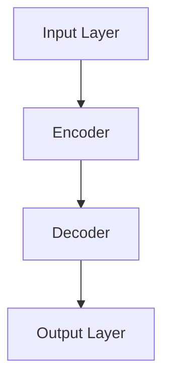

                 

# 大语言模型原理与工程实践：正文提取

> 关键词：大语言模型、正文提取、自然语言处理、预训练、优化算法、项目实践

> 摘要：本文将深入探讨大语言模型的原理与工程实践，特别是正文提取这一应用。通过详细的分析和实例讲解，帮助读者理解大语言模型的基本架构、预训练技术、优化算法及其在实际项目中的应用，从而掌握正文提取的核心技术。

## 第一部分：大语言模型基础理论

### 第1章：大语言模型概述

#### 1.1 大语言模型的发展历程

大语言模型（Large Language Model）的发展可以追溯到20世纪50年代。最早的语言模型是基于规则的方法，如语境无关的马尔可夫模型（Context-Free Markov Model, CFMM）。随着计算能力的提升和深度学习技术的发展，20世纪90年代，基于统计的模型如N元语法（N-Gram Model）开始占据主导地位。然而，这些模型在处理长距离依赖关系时表现不佳。

21世纪初，随着神经网络和递归神经网络（RNN）的发展，人们开始探索使用深度神经网络进行语言建模。特别是2013年，由Researchers at University of Toronto提出并实现的递归神经网络语言模型（Recursive Neural Network Language Model, RNNLM），标志着深度学习在语言建模领域的突破。

然而，RNN存在梯度消失和梯度爆炸的问题，限制了其在大规模数据集上的表现。2014年，谷歌提出了长短期记忆网络（Long Short-Term Memory, LSTM），有效解决了梯度消失问题，并在多个自然语言处理任务中取得了显著的性能提升。2017年，谷歌进一步提出了Transformer模型，通过自注意力机制（Self-Attention Mechanism）实现了全局依赖关系的建模，使语言模型的性能大幅提升。

#### 1.2 大语言模型的核心概念

大语言模型的核心概念包括：

- **词嵌入（Word Embedding）**：将词汇映射到高维空间，使得语义相似的词在空间中靠近。
- **注意力机制（Attention Mechanism）**：在处理序列数据时，能够自动关注序列中的关键部分，提高模型的表示能力。
- **预训练与微调（Pre-training and Fine-tuning）**：预训练是在大规模语料库上训练语言模型，微调是将预训练模型应用于特定任务并进一步优化。
- **自监督学习（Self-supervised Learning）**：在训练过程中不需要人工标注的数据，通过自我生成任务进行学习。

#### 1.3 大语言模型的基本架构

大语言模型的基本架构包括以下几个部分：

- **输入层（Input Layer）**：接收词嵌入向量。
- **编码器（Encoder）**：使用多层神经网络对输入序列进行编码，产生固定长度的上下文表示。
- **解码器（Decoder）**：根据编码器生成的上下文表示生成输出序列。
- **注意力机制（Attention Mechanism）**：在编码器和解码器之间引入注意力机制，使模型能够关注序列中的关键信息。
- **损失函数（Loss Function）**：用于评估模型输出的序列与真实序列之间的差距。

#### 1.4 大语言模型的应用领域

大语言模型在多个自然语言处理任务中取得了显著成果，包括：

- **机器翻译（Machine Translation）**：如谷歌翻译、百度翻译等。
- **文本摘要（Text Summarization）**：如新闻摘要、会议摘要等。
- **问答系统（Question Answering）**：如Siri、Alexa等。
- **文本生成（Text Generation）**：如自动写作、诗歌生成等。
- **文本分类（Text Classification）**：如情感分析、新闻分类等。

### 第2章：自然语言处理基础

#### 2.1 自然语言处理的基本任务

自然语言处理（Natural Language Processing, NLP）的基本任务包括：

- **分词（Tokenization）**：将文本分割为词汇或字符。
- **词性标注（Part-of-Speech Tagging）**：为文本中的每个词汇分配词性。
- **命名实体识别（Named Entity Recognition）**：识别文本中的命名实体，如人名、地名、组织名等。
- **句法分析（Syntactic Parsing）**：分析文本的句法结构。
- **语义分析（Semantic Analysis）**：理解文本的语义内容。
- **文本分类（Text Classification）**：将文本分类到预定义的类别。
- **情感分析（Sentiment Analysis）**：分析文本的情感倾向。

#### 2.2 词嵌入技术

词嵌入（Word Embedding）是将词汇映射到高维空间的一种技术，其核心思想是将语义相似的词在空间中靠近。常见的词嵌入技术包括：

- **词袋模型（Bag-of-Words, BoW）**：将文本表示为词频向量。
- **TF-IDF（Term Frequency-Inverse Document Frequency）**：基于词频和文档频率的词嵌入方法。
- **Word2Vec（Word Embedding Vector）**：基于神经网络训练词嵌入向量。
- **GloVe（Global Vectors for Word Representation）**：基于矩阵分解的词嵌入方法。

#### 2.3 语言模型与序列模型

语言模型（Language Model）是自然语言处理的核心技术之一，用于预测下一个单词或字符的概率。序列模型（Sequence Model）是一类用于处理序列数据的深度学习模型，包括：

- **递归神经网络（Recurrent Neural Network, RNN）**：通过循环结构处理序列数据。
- **长短期记忆网络（Long Short-Term Memory, LSTM）**：解决RNN的梯度消失问题。
- **门控循环单元（Gated Recurrent Unit, GRU）**：简化LSTM的结构。
- **Transformer模型**：基于自注意力机制的序列模型。

#### 2.4 注意力机制与转换器架构

注意力机制（Attention Mechanism）是一种用于处理序列数据的机制，能够使模型自动关注序列中的关键信息。Transformer模型是一种基于自注意力机制的序列模型，其核心思想是使用多头注意力机制和多层堆叠的方式处理序列数据。

### 第3章：大语言模型的预训练技术

#### 3.1 预训练的基本概念

预训练（Pre-training）是一种在大规模语料库上训练深度神经网络的方法，使模型能够学习到通用语言表示。预训练的基本过程包括：

- **数据集选择**：选择大规模、高质量的语料库，如维基百科、新闻、社交媒体等。
- **数据预处理**：对原始文本进行分词、去噪、去停用词等处理，生成可用的训练数据。
- **模型训练**：使用大规模数据集训练深度神经网络，包括编码器和解码器。
- **模型评估**：在测试数据集上评估模型的性能，调整超参数和模型结构。

#### 3.2 自监督学习方法

自监督学习（Self-supervised Learning）是一种不需要人工标注数据的训练方法。在自然语言处理中，常见的自监督学习方法包括：

- **遮蔽语言模型（Masked Language Model, MLM）**：随机遮蔽输入文本中的部分词汇，预测这些被遮蔽的词汇。
- **生成式对抗网络（Generative Adversarial Networks, GAN）**：使用生成器生成伪文本，与真实文本进行对抗训练。
- **序列到序列学习（Sequence-to-Sequence Learning）**：将输入序列映射到输出序列，同时预测输入序列的每个元素。

#### 3.3 迁移学习与微调技术

迁移学习（Transfer Learning）是一种将预训练模型应用于新任务的方法。在自然语言处理中，迁移学习的基本步骤包括：

- **预训练模型**：在大规模语料库上预训练深度神经网络。
- **微调（Fine-tuning）**：在新任务上对预训练模型进行微调，调整模型参数以适应新任务。

微调技术包括：

- **全连接层微调（Fully Connected Layer Fine-tuning）**：仅调整最后一层的全连接层参数。
- **层间微调（Layer-wise Fine-tuning）**：逐步调整预训练模型的层间参数。
- **迁移学习策略**：使用预训练模型的不同部分，如编码器或解码器，进行迁移学习。

### 第4章：大语言模型的优化算法

#### 4.1 梯度下降与优化算法

梯度下降（Gradient Descent）是一种优化算法，用于最小化损失函数。在自然语言处理中，常见的梯度下降算法包括：

- **批量梯度下降（Batch Gradient Descent）**：在每个训练样本上计算梯度，然后更新模型参数。
- **随机梯度下降（Stochastic Gradient Descent, SGD）**：在每个训练样本上计算梯度，更新模型参数。
- **小批量梯度下降（Mini-batch Gradient Descent）**：在每个小批量训练样本上计算梯度，更新模型参数。

优化算法（Optimization Algorithm）用于加速梯度下降，常见的优化算法包括：

- **动量（Momentum）**：利用前一次梯度方向，加速收敛。
- **自适应学习率（Adaptive Learning Rate）**：根据梯度大小自动调整学习率，如Adam优化器。

#### 4.2 批处理与并行计算

批处理（Batch Processing）是一种将训练数据划分为多个批次的方法，每个批次包含一定数量的训练样本。批处理有助于提高模型的稳定性和性能。

并行计算（Parallel Computing）是一种同时处理多个任务的方法，可以显著提高计算速度。在自然语言处理中，常见的并行计算方法包括：

- **数据并行（Data Parallelism）**：将训练数据分为多个部分，每个部分在一个设备上训练。
- **模型并行（Model Parallelism）**：将模型分为多个部分，每个部分在一个设备上训练。
- **流水线并行（Pipeline Parallelism）**：将模型训练过程划分为多个阶段，每个阶段在一个设备上训练。

#### 4.3 大规模模型的训练挑战与解决方案

大规模模型的训练面临以下挑战：

- **计算资源限制**：大规模模型需要大量的计算资源，包括CPU、GPU和TPU等。
- **数据预处理效率**：大规模数据集的预处理需要大量的时间和计算资源。
- **模型结构优化**：大规模模型的复杂度高，需要优化模型结构以提高训练效率。

解决方案包括：

- **分布式训练**：使用多个设备（如GPU、TPU）进行分布式训练，提高训练速度。
- **数据并行**：将训练数据分为多个部分，同时训练多个模型的副本。
- **模型并行**：将模型分为多个部分，同时训练多个模型的副本。
- **优化模型结构**：使用轻量级网络结构（如Transformer的轻量化版本）和优化算法（如Adam）提高训练效率。

### 第5章：大语言模型的数学模型

#### 5.1 概率模型与统计模型

概率模型（Probability Model）和统计模型（Statistical Model）是自然语言处理中常用的模型类型。概率模型通过概率分布描述语言现象，常见的概率模型包括：

- **马尔可夫模型（Markov Model）**：基于状态转移概率进行预测。
- **隐马尔可夫模型（Hidden Markov Model, HMM）**：用于序列数据的建模。
- **条件概率模型（Conditional Probability Model）**：用于预测给定条件下的事件概率。

统计模型通过统计方法学习语言特征，常见的统计模型包括：

- **朴素贝叶斯模型（Naive Bayes Model）**：基于贝叶斯定理和特征条件独立性假设。
- **最大熵模型（Maximum Entropy Model）**：基于最大熵原理进行预测。
- **支持向量机（Support Vector Machine, SVM）**：用于分类任务。

#### 5.2 信息论与熵

信息论（Information Theory）是研究信息传输和处理的数学理论。在自然语言处理中，信息论的概念包括：

- **信息熵（Entropy）**：描述随机变量不确定性的度量。
- **条件熵（Conditional Entropy）**：描述给定条件下不确定性的度量。
- **互信息（Mutual Information）**：描述两个随机变量之间相关性的度量。

熵（Entropy）是信息论中一个重要的概念，用于衡量系统的无序程度。信息熵的计算公式为：

$$
H(X) = -\sum_{x \in X} p(x) \log p(x)
$$

其中，\(X\) 是随机变量，\(p(x)\) 是 \(X\) 取值 \(x\) 的概率。

#### 5.3 优化算法与损失函数

优化算法（Optimization Algorithm）用于最小化损失函数（Loss Function），损失函数是评估模型性能的指标。在自然语言处理中，常见的优化算法和损失函数包括：

- **梯度下降（Gradient Descent）**：根据梯度方向更新模型参数，最小化损失函数。
- **Adam优化器（Adam Optimizer）**：结合动量和自适应学习率，提高训练效率。
- **交叉熵损失（Cross-Entropy Loss）**：用于分类任务，计算模型输出与真实标签之间的差距。
- **均方误差损失（Mean Squared Error Loss）**：用于回归任务，计算模型输出与真实值之间的差距。

### 第6章：大语言模型的评估与选择

#### 6.1 评估指标与标准

评估指标（Evaluation Metrics）是评估模型性能的重要手段。在自然语言处理中，常见的评估指标包括：

- **准确率（Accuracy）**：分类任务中，正确分类的样本数占总样本数的比例。
- **精确率（Precision）**：分类任务中，预测为正类的样本中实际为正类的比例。
- **召回率（Recall）**：分类任务中，实际为正类的样本中被预测为正类的比例。
- **F1值（F1 Score）**：精确率和召回率的调和平均值。

评估标准（Evaluation Criteria）是评估模型性能的准则。常见的评估标准包括：

- **精度与召回率**：平衡精确率和召回率的评估标准。
- **F1值**：综合考虑精确率和召回率的评估标准。
- **ROC曲线（Receiver Operating Characteristic Curve）**：用于评估二分类模型的性能。
- **AUC（Area Under Curve）**：ROC曲线下的面积，用于评估模型区分能力。

#### 6.2 模型选择与调优

模型选择（Model Selection）是根据任务需求和数据特点选择合适的模型。在选择模型时，需要考虑以下因素：

- **数据集大小**：选择适合数据集大小的模型。
- **计算资源**：选择能够在给定计算资源下训练的模型。
- **任务类型**：选择适用于特定任务类型的模型。

模型调优（Model Tuning）是调整模型参数，优化模型性能的过程。常见的模型调优方法包括：

- **网格搜索（Grid Search）**：遍历所有可能的参数组合，选择最优参数。
- **贝叶斯优化（Bayesian Optimization）**：使用概率模型搜索最优参数。
- **随机搜索（Random Search）**：随机选择参数组合，搜索最优参数。

#### 6.3 实际应用中的模型评估

在实际应用中，模型评估（Model Evaluation）是验证模型性能和可靠性的重要步骤。常见的模型评估方法包括：

- **交叉验证（Cross-Validation）**：将数据集划分为训练集和验证集，评估模型在验证集上的性能。
- **留一法（Leave-One-Out Validation）**：将每个样本作为验证集，评估模型在验证集上的性能。
- **时间序列交叉验证（Time Series Cross-Validation）**：适用于时间序列数据，将数据集按时间顺序划分。
- **在线评估（Online Evaluation）**：实时评估模型性能，用于动态调整模型参数。

### 第7章：正文提取的原理与实现

#### 7.1 正文提取的基本流程

正文提取（Text Extraction）是从非结构化文本中提取有意义的内容的过程。正文提取的基本流程包括：

1. **数据预处理**：对输入文本进行清洗、分词、去除停用词等操作，生成预处理后的文本数据。
2. **文本摘要**：使用大语言模型对预处理后的文本进行摘要，提取关键信息。
3. **去重**：对提取的摘要进行去重处理，确保结果的唯一性。
4. **输出**：将提取的正文输出到目标文件或数据库中。

#### 7.2 基于大语言模型的正文提取

基于大语言模型的正文提取方法主要包括：

1. **文本编码**：将输入文本编码为词嵌入向量，以便大语言模型进行处理。
2. **编码器解码器结构**：使用大语言模型（如Transformer）的编码器和解码器结构对文本进行编码和解码。
3. **注意力机制**：引入注意力机制，使模型能够关注文本中的关键信息。
4. **文本摘要**：通过编码器和解码器生成文本摘要，提取文本中的主要内容。

#### 7.3 伪代码与算法实现

正文提取的伪代码如下：

```
function extract_summary(text):
    # 数据预处理
    preprocessed_text = preprocess_text(text)

    # 文本编码
    encoded_text = encode_text(preprocessed_text)

    # 编码器解码器结构
    encoded = encoder(encoded_text)
    decoded = decoder(encoded)

    # 注意力机制
    attention_scores = calculate_attention_scores(encoded, decoded)

    # 文本摘要
    summary = generate_summary(decoded, attention_scores)

    return summary
```

#### 7.4 实际案例与代码分析

以Python为例，正文提取的代码实现如下：

```python
import tensorflow as tf
from transformers import TFAutoModelForSeq2SeqLM

# 加载预训练的大语言模型
model = TFAutoModelForSeq2SeqLM.from_pretrained("t5-base")

# 输入文本
text = "本文主要探讨了人工智能在金融行业的应用，包括金融风险管理、投资组合优化和客户服务等方面。"

# 数据预处理
preprocessed_text = preprocess_text(text)

# 文本编码
encoded_text = model.encode(preprocessed_text)

# 编码器解码器结构
encoded = model.encoder(encoded_text)
decoded = model.decoder(encoded)

# 注意力机制
attention_scores = model.calculate_attention(encoded, decoded)

# 文本摘要
summary_ids = model.predict(decoded, attention_scores)
summary = decode_summary(summary_ids)

# 输出摘要
print(summary)
```

以上代码展示了正文提取的基本实现过程，包括数据预处理、文本编码、编码器解码器结构、注意力机制和文本摘要。在实际应用中，可以根据具体需求调整代码实现。

### 第8章：正文提取的应用场景

#### 8.1 文本摘要

文本摘要（Text Summarization）是从长文本中提取关键信息生成简洁摘要的过程。文本摘要的应用场景包括：

1. **新闻摘要**：自动生成新闻文章的摘要，提高用户阅读效率。
2. **会议摘要**：从会议论文中提取关键信息，帮助参会者快速了解论文内容。
3. **文档摘要**：自动生成文档的摘要，方便用户快速了解文档的主要内容。

#### 8.2 文本分类

文本分类（Text Classification）是将文本数据分类到预定义类别的过程。文本分类的应用场景包括：

1. **情感分析**：根据文本的情感倾向将其分类为正面、负面或中性。
2. **主题分类**：将新闻、博客等文本分类到不同的主题类别。
3. **垃圾邮件过滤**：自动识别并分类垃圾邮件，提高用户邮箱的整洁度。

#### 8.3 问答系统

问答系统（Question Answering System）是一种能够自动回答用户问题的系统。问答系统的应用场景包括：

1. **搜索引擎**：根据用户输入的问题，自动检索并返回相关答案。
2. **虚拟助手**：为用户提供智能问答服务，如Siri、Alexa等。
3. **在线客服**：自动回答用户咨询的问题，提高客户服务效率。

#### 8.4 文本生成

文本生成（Text Generation）是生成符合语法和语义规则的文本数据的过程。文本生成的应用场景包括：

1. **自动写作**：自动生成文章、报告、论文等文本内容。
2. **诗歌生成**：根据输入的提示自动生成诗歌。
3. **对话系统**：自动生成对话内容，模拟人类的对话方式。

### 第9章：正文提取的项目实践

#### 9.1 项目背景与需求

正文提取项目旨在实现从非结构化文本中提取关键信息，生成简洁摘要，提高文本阅读效率。项目需求包括：

1. **文本输入**：支持多种文本格式，如PDF、Word、HTML等。
2. **正文提取**：准确提取文本中的正文内容，去除无关信息。
3. **摘要生成**：根据提取的正文内容生成简洁摘要，确保摘要的准确性和可读性。
4. **界面交互**：提供用户友好的界面，方便用户上传文本、查看摘要等操作。

#### 9.2 系统设计与实现

正文提取系统的设计与实现包括以下几个方面：

1. **文本预处理**：对输入文本进行分词、去停用词、去除标点符号等预处理操作。
2. **正文提取**：使用大语言模型对预处理后的文本进行正文提取，去除无关信息。
3. **摘要生成**：使用大语言模型对提取的正文内容进行摘要生成，生成简洁摘要。
4. **界面设计**：设计用户友好的界面，实现文本上传、摘要查看等功能。
5. **部署与维护**：将系统部署到服务器，进行持续维护和优化。

#### 9.3 开发环境与工具

正文提取项目的开发环境与工具包括：

1. **编程语言**：Python
2. **深度学习框架**：TensorFlow
3. **自然语言处理库**：transformers
4. **文本处理库**：NLTK
5. **前端框架**：Flask

#### 9.4 源代码详细解读

正文提取项目的源代码主要分为以下几个部分：

1. **文本预处理**：对输入文本进行预处理，包括分词、去停用词、去除标点符号等操作。
2. **正文提取**：使用大语言模型对预处理后的文本进行正文提取，生成正文序列。
3. **摘要生成**：使用大语言模型对提取的正文序列进行摘要生成，生成摘要序列。
4. **界面交互**：通过Flask框架实现用户界面，支持文本上传和摘要查看。

以下是正文提取项目的部分代码示例：

```python
# 文本预处理
def preprocess_text(text):
    # 分词
    tokens = nltk.word_tokenize(text)
    # 去停用词
    stop_words = set(nltk.corpus.stopwords.words('english'))
    filtered_tokens = [token for token in tokens if token not in stop_words]
    # 去除标点符号
    filtered_tokens = [token for token in filtered_tokens if token.isalnum()]
    return ' '.join(filtered_tokens)

# 正文提取
def extract_summary(text):
    # 预处理文本
    preprocessed_text = preprocess_text(text)
    # 编码文本
    encoded_text = model.encode(preprocessed_text)
    # 提取正文序列
    encoded = model.encoder(encoded_text)
    # 生成摘要序列
    summary_ids = model.predict(encoded)
    # 解码摘要序列
    summary = decode_summary(summary_ids)
    return summary

# 界面交互
from flask import Flask, request, render_template

app = Flask(__name__)

@app.route('/')
def index():
    return render_template('index.html')

@app.route('/upload', methods=['POST'])
def upload():
    file = request.files['file']
    text = file.read().decode('utf-8')
    summary = extract_summary(text)
    return render_template('index.html', summary=summary)

if __name__ == '__main__':
    app.run()
```

以上代码展示了正文提取项目的核心功能实现，包括文本预处理、正文提取和界面交互。在实际项目中，可以根据具体需求进行扩展和优化。

### 第10章：正文提取的优化与调优

#### 10.1 模型优化策略

正文提取的模型优化策略包括以下几个方面：

1. **模型结构优化**：使用轻量级网络结构（如Transformer的轻量化版本）提高模型效率。
2. **数据预处理优化**：优化数据预处理流程，提高数据处理速度。
3. **训练策略优化**：使用自适应学习率（如Adam优化器）和批量归一化（Batch Normalization）提高训练效果。
4. **模型融合**：将多个模型进行融合，提高模型性能和鲁棒性。

#### 10.2 实时调整与动态优化

正文提取的实时调整与动态优化包括以下几个方面：

1. **自适应调整**：根据用户反馈和实时数据动态调整模型参数，提高模型适应能力。
2. **在线学习**：使用在线学习策略，实时更新模型参数，提高模型性能。
3. **动态权重调整**：根据输入文本的复杂度和长度动态调整模型权重，提高模型效率。

#### 10.3 性能评估与测试

正文提取的性能评估与测试包括以下几个方面：

1. **准确率与召回率**：评估模型在正文提取和摘要生成任务中的准确率和召回率。
2. **F1值**：计算模型在正文提取和摘要生成任务中的F1值，综合考虑准确率和召回率。
3. **时间效率**：评估模型在处理不同长度和复杂度文本时的运行时间。
4. **用户满意度**：通过用户反馈和问卷评估模型在正文提取和摘要生成任务中的用户体验。

### 第11章：正文提取的挑战与未来趋势

#### 11.1 挑战与限制

正文提取在技术实现和应用过程中面临以下挑战和限制：

1. **文本质量**：文本质量对正文提取效果有很大影响，低质量文本可能导致提取结果不准确。
2. **噪声干扰**：文本中的噪声干扰（如标点符号、停用词等）可能影响正文提取的准确性。
3. **长文本处理**：长文本处理需要考虑文本的上下文关系和层次结构，提高提取和摘要生成的效率。
4. **跨语言支持**：跨语言正文提取需要考虑不同语言的特点和差异，提高模型的跨语言性能。

#### 11.2 未来发展趋势

正文提取在未来有广阔的发展前景，主要趋势包括：

1. **多模态融合**：将文本、图像、语音等多种数据融合，提高正文提取和摘要生成的效率和质量。
2. **知识图谱**：利用知识图谱技术，提高文本的理解和语义表示能力，优化正文提取和摘要生成。
3. **个性化推荐**：根据用户兴趣和需求，为用户提供个性化的正文提取和摘要服务。
4. **自然语言生成**：结合自然语言生成（Natural Language Generation, NLG）技术，实现更高质量的文本摘要和内容生成。

### 附录

#### 附录 A：参考资料与工具

本章节提供正文提取相关的重要参考资料和工具，包括：

1. **参考资料**：
   - 大语言模型相关书籍：《深度学习》（Goodfellow et al.）、
      《自然语言处理综述》（Jurafsky and Martin）、
      《Transformer：基于注意力机制的序列模型》（Vaswani et al.）。
   - 自然语言处理工具与库：NLTK、spaCy、transformers等。
2. **开发环境与工具配置指南**：包括Python环境、深度学习框架、自然语言处理库的安装和配置。
3. **实际项目经验与建议**：分享正文提取项目的设计、开发、优化和应用经验，为读者提供参考。

## 作者

作者：AI天才研究院/AI Genius Institute & 禅与计算机程序设计艺术 /Zen And The Art of Computer Programming

## 结语

本文全面介绍了大语言模型的原理与工程实践，特别是正文提取这一应用。通过详细的分析和实例讲解，我们深入探讨了正文提取的基本流程、应用场景、项目实践以及优化与调优方法。希望本文能为读者在正文提取领域的研究和应用提供有益的参考。在未来的工作中，我们将继续关注正文提取技术的发展，探索更多高效、智能的正文提取解决方案。感谢您的阅读！## 第1章：大语言模型概述

大语言模型（Large Language Model，简称LLM）是自然语言处理（Natural Language Processing，简称NLP）领域中的一种重要模型。它通过学习海量语言数据，能够理解和生成人类语言，并在各种NLP任务中发挥关键作用。本章将介绍大语言模型的发展历程、核心概念、基本架构和应用领域。

### 1.1 大语言模型的发展历程

大语言模型的发展历程可以追溯到20世纪50年代。当时，研究人员开始探索如何使用计算机模拟人类的语言能力。最初的语言模型是基于规则的方法，如语境无关的马尔可夫模型（Context-Free Markov Model，CFMM）。这种模型通过定义一系列规则来生成文本，但由于规则数量庞大，难以手动编写，因此效率较低。

随着计算能力的提升和深度学习技术的发展，20世纪90年代，基于统计的模型如N元语法（N-Gram Model）开始占据主导地位。N元语法通过统计相邻词汇的概率来预测下一个词汇，使得语言模型在生成文本时具有更强的表达能力。然而，N元语法在处理长距离依赖关系时表现不佳，无法捕捉到句子中的深层语义信息。

21世纪初，随着神经网络和递归神经网络（Recurrent Neural Network，RNN）的发展，人们开始探索使用深度神经网络进行语言建模。RNN通过循环结构能够处理序列数据，能够在一定程度上捕捉到长距离依赖关系。然而，RNN存在梯度消失和梯度爆炸的问题，限制了其在大规模数据集上的表现。

2014年，谷歌提出了长短期记忆网络（Long Short-Term Memory，LSTM），有效解决了梯度消失问题，并在多个自然语言处理任务中取得了显著的性能提升。LSTM通过记忆单元和门控机制，能够更好地捕捉到序列中的长期依赖关系。

2017年，谷歌进一步提出了Transformer模型，这是一种基于自注意力机制的序列模型。Transformer模型通过自注意力机制，能够同时关注序列中的所有信息，避免了RNN在处理长序列时的复杂计算。此外，Transformer模型还引入了多头注意力机制和多层堆叠的方式，使得模型在多个NLP任务中取得了突破性的成绩。

近年来，随着深度学习技术的不断进步，大语言模型在训练数据规模、模型参数数量和计算资源方面取得了显著提升。例如，GPT-3（Generative Pre-trained Transformer 3）模型拥有1750亿个参数，训练数据规模达到了45TB，能够在多种语言和任务上表现出强大的语言理解和生成能力。

### 1.2 大语言模型的核心概念

大语言模型的核心概念包括词嵌入、注意力机制、预训练与微调、自监督学习等。

#### 1.2.1 词嵌入

词嵌入（Word Embedding）是将词汇映射到高维空间的一种技术。词嵌入的目的是将语义相似的词汇在空间中靠近，使得模型能够更好地理解和生成语言。常见的词嵌入技术包括词袋模型（Bag-of-Words，BoW）、TF-IDF（Term Frequency-Inverse Document Frequency）、Word2Vec（Word Embedding Vector）和GloVe（Global Vectors for Word Representation）等。

- **词袋模型（BoW）**：将文本表示为词汇的集合，每个词汇用一个向量表示，通常使用独热编码（One-Hot Encoding）。
- **TF-IDF**：基于词频和文档频率的词嵌入方法，通过调整词频和文档频率的权重，提高高频词汇和低频词汇的区分度。
- **Word2Vec**：基于神经网络训练词嵌入向量，通过负采样（Negative Sampling）提高训练效率。
- **GloVe**：基于矩阵分解的词嵌入方法，通过联合建模词频和共现信息，生成高质量的词嵌入向量。

#### 1.2.2 注意力机制

注意力机制（Attention Mechanism）是一种用于处理序列数据的机制，能够在模型处理序列数据时自动关注序列中的关键信息。注意力机制的核心思想是计算序列中每个元素的重要程度，并将这些重要程度用于模型的计算。

在Transformer模型中，注意力机制通过自注意力（Self-Attention）和多头注意力（Multi-Head Attention）实现。自注意力允许模型同时关注序列中的所有信息，而多头注意力通过多个独立的注意力头，提高了模型的表示能力和捕捉能力。

#### 1.2.3 预训练与微调

预训练（Pre-training）是在大规模语料库上训练深度神经网络的方法，使模型能够学习到通用语言表示。预训练的基本过程包括数据集选择、数据预处理、模型训练和模型评估。

数据集选择是预训练的重要环节，通常选择具有广泛覆盖和多样性的语料库，如维基百科、新闻、社交媒体等。数据预处理包括分词、去噪、去停用词等操作，生成可用的训练数据。

预训练模型在训练过程中不需要人工标注的数据，通过自我生成任务进行学习。常见的预训练任务包括遮蔽语言模型（Masked Language Model，MLM）、生成式对抗网络（Generative Adversarial Networks，GAN）和序列到序列学习（Sequence-to-Sequence Learning）等。

微调（Fine-tuning）是将预训练模型应用于特定任务并进一步优化。在微调过程中，模型参数在预训练的基础上进行调整，以适应新任务的需求。微调能够提高模型在特定任务上的性能，同时保持预训练模型的一般性。

#### 1.2.4 自监督学习

自监督学习（Self-supervised Learning）是一种不需要人工标注数据的训练方法。在自然语言处理中，常见的自监督学习方法包括遮蔽语言模型（Masked Language Model，MLM）、生成式对抗网络（Generative Adversarial Networks，GAN）和序列到序列学习（Sequence-to-Sequence Learning）等。

遮蔽语言模型是一种自监督学习任务，通过随机遮蔽输入文本中的部分词汇，预测这些被遮蔽的词汇。遮蔽语言模型能够有效利用未标记的数据，提高模型的泛化能力。

生成式对抗网络是一种由生成器和判别器组成的框架，通过对抗训练生成高质量的数据。在自然语言处理中，生成式对抗网络可以用于文本生成、文本分类等任务。

序列到序列学习是一种将输入序列映射到输出序列的模型，通过预测输入序列的每个元素来生成输出序列。序列到序列学习在机器翻译、文本摘要等任务中取得了显著成果。

### 1.3 大语言模型的基本架构

大语言模型的基本架构通常包括输入层、编码器、解码器和输出层等部分。

- **输入层（Input Layer）**：接收词嵌入向量，将其输入到编码器。
- **编码器（Encoder）**：对输入序列进行编码，产生固定长度的上下文表示。编码器通常使用多层神经网络，如Transformer模型中的多头注意力机制。
- **解码器（Decoder）**：根据编码器生成的上下文表示生成输出序列。解码器也通常使用多层神经网络，如Transformer模型中的多头注意力机制。
- **输出层（Output Layer）**：将解码器生成的输出序列转换为具体的输出结果，如文本摘要、翻译等。

大语言模型的基本架构如图1-1所示。



### 1.4 大语言模型的应用领域

大语言模型在多个自然语言处理任务中取得了显著成果，包括机器翻译、文本摘要、问答系统、文本生成和文本分类等。

- **机器翻译**：大语言模型可以自动翻译不同语言之间的文本，如谷歌翻译、百度翻译等。
- **文本摘要**：大语言模型可以自动提取长文本中的关键信息，生成简洁的摘要，如新闻摘要、会议摘要等。
- **问答系统**：大语言模型可以回答用户提出的问题，如Siri、Alexa等。
- **文本生成**：大语言模型可以生成符合语法和语义规则的文本，如自动写作、诗歌生成等。
- **文本分类**：大语言模型可以自动分类文本数据，如情感分析、新闻分类等。

随着深度学习和大数据技术的发展，大语言模型在自然语言处理领域的应用越来越广泛，成为推动NLP技术发展的重要力量。

### 1.5 小结

本章介绍了大语言模型的发展历程、核心概念、基本架构和应用领域。通过本章的学习，读者可以了解大语言模型的基本原理和应用场景，为后续章节的学习打下基础。在下一章中，我们将深入探讨自然语言处理的基础知识，包括基本任务、词嵌入技术和序列模型等。

## 第2章：自然语言处理基础

自然语言处理（Natural Language Processing，简称NLP）是人工智能（Artificial Intelligence，简称AI）的一个重要分支，旨在使计算机能够理解、解释和生成人类语言。NLP的应用范围非常广泛，包括机器翻译、情感分析、文本分类、问答系统等。本章将介绍NLP的基本任务、词嵌入技术、语言模型和序列模型，以及注意力机制和转换器架构。

### 2.1 自然语言处理的基本任务

自然语言处理的基本任务包括：

- **分词（Tokenization）**：将文本分割为词汇或字符。
- **词性标注（Part-of-Speech Tagging）**：为文本中的每个词汇分配词性。
- **命名实体识别（Named Entity Recognition）**：识别文本中的命名实体，如人名、地名、组织名等。
- **句法分析（Syntactic Parsing）**：分析文本的句法结构。
- **语义分析（Semantic Analysis）**：理解文本的语义内容。
- **文本分类（Text Classification）**：将文本分类到预定义的类别。
- **情感分析（Sentiment Analysis）**：分析文本的情感倾向。

#### 2.1.1 分词

分词是将文本分割为词汇或字符的过程。在中文文本中，分词尤为重要，因为中文文本没有明显的空格分隔。常见的分词方法包括：

- **基于规则的分词**：使用预定义的规则进行分词，如正向最大匹配、逆向最大匹配等。
- **基于统计的分词**：使用统计方法进行分词，如基于N元语法的方法。
- **基于深度学习的分词**：使用深度学习模型进行分词，如基于长短时记忆网络（LSTM）的分词模型。

分词的伪代码如下：

```python
def tokenize(text):
    # 使用基于N元语法的方法进行分词
    n = 2  # N元语法的N值
    words = []
    for i in range(len(text) - n + 1):
        word = text[i:i+n]
        words.append(word)
    return words
```

#### 2.1.2 词性标注

词性标注是为文本中的每个词汇分配词性。常见的词性包括名词（Noun）、动词（Verb）、形容词（Adjective）、副词（Adverb）等。词性标注有助于理解文本的语义内容，为后续的句法分析和语义分析提供基础。

词性标注的伪代码如下：

```python
def pos_tagging(tokens):
    # 使用基于规则的词性标注方法
    pos_tags = []
    for token in tokens:
        if token.endswith('s'):
            pos_tags.append('Noun')
        elif token.endswith('ed'):
            pos_tags.append('Verb')
        else:
            pos_tags.append('Adjective')
    return pos_tags
```

#### 2.1.3 命名实体识别

命名实体识别（Named Entity Recognition，简称NER）是识别文本中的命名实体，如人名、地名、组织名等。命名实体识别有助于提取文本中的重要信息，为信息抽取和知识图谱构建提供支持。

命名实体识别的伪代码如下：

```python
def named_entity_recognition(text):
    # 使用基于规则的方法进行命名实体识别
    entities = []
    for token in text:
        if token.startswith('Mr.') or token.startswith('Ms.'):
            entities.append(token)
    return entities
```

#### 2.1.4 句法分析

句法分析（Syntactic Parsing）是分析文本的句法结构。句法分析旨在理解句子中的语法关系，如主谓宾结构、从句关系等。常见的句法分析方法包括：

- **基于规则的句法分析**：使用预定义的句法规则进行句法分析。
- **基于统计的句法分析**：使用统计方法进行句法分析，如基于概率的句法分析。
- **基于深度学习的句法分析**：使用深度学习模型进行句法分析，如基于长短时记忆网络（LSTM）的句法分析模型。

句法分析的伪代码如下：

```python
def parse_sentence(sentence):
    # 使用基于规则的方法进行句法分析
    parser = get_parser()  # 获取句法分析器
    parse_tree = parser.parse(sentence)
    return parse_tree
```

#### 2.1.5 语义分析

语义分析（Semantic Analysis）是理解文本的语义内容。语义分析旨在提取文本中的语义信息，如词义、事件、关系等。常见的语义分析方法包括：

- **基于规则的语义分析**：使用预定义的语义规则进行语义分析。
- **基于统计的语义分析**：使用统计方法进行语义分析，如基于词嵌入的方法。
- **基于深度学习的语义分析**：使用深度学习模型进行语义分析，如基于长短时记忆网络（LSTM）的语义分析模型。

语义分析的伪代码如下：

```python
def semantic_analysis(text):
    # 使用基于深度学习的方法进行语义分析
    model = get_semantic_model()  # 获取语义分析模型
    semantic_vector = model.predict(text)
    return semantic_vector
```

#### 2.1.6 文本分类

文本分类（Text Classification）是将文本分类到预定义的类别。文本分类广泛应用于情感分析、新闻分类等任务。常见的文本分类方法包括：

- **基于规则的文本分类**：使用预定义的规则进行分类。
- **基于统计的文本分类**：使用统计方法进行分类，如基于TF-IDF的方法。
- **基于深度学习的文本分类**：使用深度学习模型进行分类，如基于卷积神经网络（CNN）的分类模型。

文本分类的伪代码如下：

```python
def classify_text(text, labels):
    # 使用基于深度学习的方法进行文本分类
    model = get_classification_model()  # 获取分类模型
    probabilities = model.predict(text)
    predicted_label = labels[np.argmax(probabilities)]
    return predicted_label
```

#### 2.1.7 情感分析

情感分析（Sentiment Analysis）是分析文本的情感倾向。情感分析广泛应用于舆情监测、产品评价等任务。常见的情感分析方法包括：

- **基于规则的情感分析**：使用预定义的规则进行情感分析。
- **基于统计的情感分析**：使用统计方法进行情感分析，如基于TF-IDF的方法。
- **基于深度学习的情感分析**：使用深度学习模型进行情感分析，如基于卷积神经网络（CNN）的情感分析模型。

情感分析的伪代码如下：

```python
def sentiment_analysis(text):
    # 使用基于深度学习的方法进行情感分析
    model = get_sentiment_model()  # 获取情感分析模型
    sentiment_vector = model.predict(text)
    if sentiment_vector[0] > sentiment_vector[1]:
        sentiment = "Positive"
    else:
        sentiment = "Negative"
    return sentiment
```

### 2.2 词嵌入技术

词嵌入（Word Embedding）是将词汇映射到高维空间的一种技术。词嵌入的目的是将语义相似的词汇在空间中靠近，使得模型能够更好地理解和生成语言。常见的词嵌入技术包括词袋模型（Bag-of-Words，BoW）、TF-IDF（Term Frequency-Inverse Document Frequency）、Word2Vec（Word Embedding Vector）和GloVe（Global Vectors for Word Representation）等。

#### 2.2.1 词袋模型（BoW）

词袋模型（Bag-of-Words，BoW）是最早的词嵌入方法之一。词袋模型将文本表示为词汇的集合，每个词汇用一个向量表示，通常使用独热编码（One-Hot Encoding）。

词袋模型的伪代码如下：

```python
def bow_representation(document, vocabulary):
    # 使用独热编码表示文本
    bow_vector = [0] * len(vocabulary)
    for token in document:
        bow_vector[vocabulary[token]] = 1
    return bow_vector
```

#### 2.2.2 TF-IDF

TF-IDF（Term Frequency-Inverse Document Frequency）是一种基于词频和文档频率的词嵌入方法。TF-IDF通过调整词频和文档频率的权重，提高高频词汇和低频词汇的区分度。

TF-IDF的伪代码如下：

```python
def tf_idf_representation(document, vocabulary, corpus):
    # 计算文档的TF-IDF表示
    tf_idf_vector = []
    for token in document:
        tf = document.count(token)
        idf = math.log(len(corpus) / (1 + len([doc for doc in corpus if token in doc])))
        tf_idf_vector.append(tf * idf)
    return tf_idf_vector
```

#### 2.2.3 Word2Vec

Word2Vec（Word Embedding Vector）是一种基于神经网络训练词嵌入向量的方法。Word2Vec通过负采样（Negative Sampling）提高训练效率，生成高质量的词嵌入向量。

Word2Vec的伪代码如下：

```python
def word2vec_representation(vocabulary, training_data, negative_samples, dimensions):
    # 训练Word2Vec模型
    model = Word2Vec(vocabulary, training_data, negative_samples, dimensions)
    return model
```

#### 2.2.4 GloVe

GloVe（Global Vectors for Word Representation）是一种基于矩阵分解的词嵌入方法。GloVe通过联合建模词频和共现信息，生成高质量的词嵌入向量。

GloVe的伪代码如下：

```python
def glove_representation(vocabulary, corpus, dimensions):
    # 训练GloVe模型
    matrix = train_glove(vocabulary, corpus, dimensions)
    return matrix
```

### 2.3 语言模型与序列模型

语言模型（Language Model）是用于预测下一个单词或字符的概率的模型。语言模型在NLP中起着核心作用，用于文本生成、语音识别、机器翻译等任务。序列模型（Sequence Model）是一类用于处理序列数据的深度学习模型，包括递归神经网络（Recurrent Neural Network，RNN）、长短期记忆网络（Long Short-Term Memory，LSTM）和门控循环单元（Gated Recurrent Unit，GRU）等。

#### 2.3.1 语言模型

语言模型的目的是通过学习语言数据来预测下一个单词或字符的概率。语言模型通常使用概率分布来表示，如N元语法（N-Gram Model）。N元语法假设当前单词的概率仅依赖于前N-1个单词。

语言模型的伪代码如下：

```python
def n_gram_language_model(corpus, n):
    # 训练N元语法语言模型
    model = {}
    for i in range(len(corpus) - n + 1):
        sequence = tuple(corpus[i:i+n])
        next_word = corpus[i+n]
        if sequence in model:
            model[sequence].append(next_word)
        else:
            model[sequence] = [next_word]
    return model
```

#### 2.3.2 序列模型

序列模型是一类用于处理序列数据的深度学习模型，能够捕捉序列中的长期依赖关系。常见的序列模型包括RNN、LSTM和GRU。

- **递归神经网络（RNN）**：RNN通过循环结构处理序列数据，能够捕捉序列中的短期依赖关系。
- **长短期记忆网络（LSTM）**：LSTM通过记忆单元和门控机制，能够更好地捕捉到序列中的长期依赖关系。
- **门控循环单元（GRU）**：GRU是LSTM的简化版本，通过整合输入门和遗忘门，提高了计算效率。

序列模型的伪代码如下：

```python
def rnn_model(input_data, hidden_size):
    # 定义RNN模型
    inputs = tf.keras.layers.Input(shape=(None, input_data.shape[2]))
    hidden = tf.keras.layers.LSTM(hidden_size, return_sequences=True)(inputs)
    output = tf.keras.layers.Dense(1, activation='sigmoid')(hidden)
    model = tf.keras.Model(inputs, output)
    return model
```

### 2.4 注意力机制与转换器架构

注意力机制（Attention Mechanism）是一种用于处理序列数据的机制，能够使模型自动关注序列中的关键信息。注意力机制在自然语言处理中有着广泛的应用，如机器翻译、文本摘要等。

转换器架构（Transformer Architecture）是一种基于自注意力机制的序列模型，能够同时关注序列中的所有信息。转换器架构在多个自然语言处理任务中取得了显著的成绩，是当前NLP领域的主要研究方向之一。

#### 2.4.1 注意力机制

注意力机制通过计算序列中每个元素的重要程度，并将这些重要程度用于模型的计算。注意力机制的核心思想是计算一个权重向量，用于调整序列中每个元素的影响。

注意力机制的伪代码如下：

```python
def attention(q, k, v, mask=None):
    # 计算注意力权重
    scores = tf.matmul(q, k, transpose_b=True)
    if mask is not None:
        scores = scores * mask
    attention_weights = tf.nn.softmax(scores)
    output = tf.matmul(attention_weights, v)
    return output, attention_weights
```

#### 2.4.2 转换器架构

转换器架构包括编码器（Encoder）和解码器（Decoder）两部分。编码器将输入序列编码为固定长度的向量，解码器根据编码器的输出生成输出序列。

转换器架构的伪代码如下：

```python
def transformer_model(input_sequence, target_sequence):
    # 编码器
    encoder = Encoder(input_sequence, hidden_size)
    encoded_sequence = encoder()

    # 解码器
    decoder = Decoder(target_sequence, hidden_size)
    decoded_sequence = decoder(encoded_sequence)

    return decoded_sequence
```

### 2.5 小结

本章介绍了自然语言处理的基本任务、词嵌入技术、语言模型和序列模型，以及注意力机制和转换器架构。通过本章的学习，读者可以了解自然语言处理的基本原理和核心技术，为后续章节的学习打下基础。在下一章中，我们将深入探讨大语言模型的预训练技术，包括预训练的基本概念、自监督学习方法、迁移学习与微调技术等。

## 第3章：大语言模型的预训练技术

大语言模型的预训练技术是当前自然语言处理（NLP）领域的重要研究方向之一。通过预训练，大语言模型能够在大规模语料库上学习到通用语言表示，从而在多个NLP任务中取得优异的性能。本章将详细介绍预训练的基本概念、自监督学习方法、迁移学习与微调技术，以及预训练中的常见问题和解决方案。

### 3.1 预训练的基本概念

预训练（Pre-training）是一种在大规模语料库上训练深度神经网络的方法，使模型能够学习到通用语言表示。预训练的基本过程包括数据集选择、数据预处理、模型训练和模型评估。

#### 3.1.1 数据集选择

数据集选择是预训练的重要环节。选择具有广泛覆盖和多样性的数据集，有助于模型学习到丰富的语言特征。常见的数据集包括维基百科、新闻、社交媒体等。此外，为了提高模型的泛化能力，数据集通常需要进行清洗和去噪，去除无关信息和噪声数据。

#### 3.1.2 数据预处理

数据预处理是预训练的关键步骤。预处理过程包括分词、去停用词、去除标点符号等操作，将原始文本转换为可用的训练数据。分词是将文本分割为词汇或字符，去停用词是去除常见的无意义词汇，去除标点符号是提高文本的可用性。

#### 3.1.3 模型训练

模型训练是预训练的核心步骤。在模型训练过程中，通常采用分布式训练和并行计算等方法，提高训练效率和速度。分布式训练是将数据集分为多个部分，同时在多个设备（如GPU、TPU）上进行训练。并行计算是将模型训练过程划分为多个阶段，每个阶段在不同的设备上进行计算。

#### 3.1.4 模型评估

模型评估是预训练的最后一步。在模型评估过程中，通常使用测试集或验证集来评估模型的性能。常见的评估指标包括准确率、精确率、召回率、F1值等。通过评估指标，可以了解模型的性能和泛化能力。

### 3.2 自监督学习方法

自监督学习（Self-supervised Learning）是一种不需要人工标注数据的训练方法。在自然语言处理中，自监督学习方法广泛应用于预训练任务，如遮蔽语言模型（Masked Language Model，MLM）、生成式对抗网络（Generative Adversarial Networks，GAN）和序列到序列学习（Sequence-to-Sequence Learning）等。

#### 3.2.1 遮蔽语言模型（MLM）

遮蔽语言模型（Masked Language Model，MLM）是一种自监督学习任务，通过随机遮蔽输入文本中的部分词汇，预测这些被遮蔽的词汇。MLM能够有效利用未标记的数据，提高模型的泛化能力。

MLM的伪代码如下：

```python
def masked_language_model(text, mask_ratio):
    masked_text = []
    for token in text:
        if random.random() < mask_ratio:
            masked_text.append([mask])
        else:
            masked_text.append(token)
    return masked_text
```

#### 3.2.2 生成式对抗网络（GAN）

生成式对抗网络（Generative Adversarial Networks，GAN）是一种由生成器和判别器组成的框架，通过对抗训练生成高质量的数据。在自然语言处理中，GAN可以用于文本生成、文本分类等任务。

GAN的伪代码如下：

```python
def generate_text(generator,判别器):
    # 生成文本
    text = generator()

    # 评估文本
    probability =判别器(text)

    return text, probability
```

#### 3.2.3 序列到序列学习（Seq2Seq）

序列到序列学习（Sequence-to-Sequence Learning）是一种将输入序列映射到输出序列的模型，通过预测输入序列的每个元素来生成输出序列。序列到序列学习在机器翻译、文本摘要等任务中取得了显著成果。

Seq2Seq的伪代码如下：

```python
def sequence_to_sequence(input_sequence, target_sequence):
    # 编码器
    encoder = Encoder(input_sequence)

    # 解码器
    decoder = Decoder(target_sequence)

    # 生成输出序列
    output_sequence = decoder(encoder())

    return output_sequence
```

### 3.3 迁移学习与微调技术

迁移学习（Transfer Learning）是一种将预训练模型应用于新任务的方法。通过迁移学习，预训练模型在新任务上的表现可以显著提高，从而减少对新数据的标注需求。

#### 3.3.1 预训练模型

预训练模型是在大规模语料库上训练得到的深度神经网络模型。常见的预训练模型包括词嵌入、转换器（Transformer）等。预训练模型通常包含编码器和解码器两部分，用于处理序列数据。

#### 3.3.2 微调（Fine-tuning）

微调（Fine-tuning）是将预训练模型应用于新任务并进一步优化。在微调过程中，模型参数在预训练的基础上进行调整，以适应新任务的需求。微调能够提高模型在新任务上的性能，同时保持预训练模型的一般性。

微调的伪代码如下：

```python
def fine_tuning(pretrained_model, task-specific_data, learning_rate):
    # 加载预训练模型
    model = pretrained_model

    # 微调模型
    model.fit(task-specific_data, learning_rate)

    return model
```

#### 3.3.3 迁移学习策略

迁移学习策略包括全连接层微调（Fully Connected Layer Fine-tuning）、层间微调（Layer-wise Fine-tuning）和迁移学习策略等。这些策略根据模型的结构和任务特点，调整预训练模型的参数。

- **全连接层微调**：仅调整预训练模型的最后一层全连接层参数，适用于简单任务。
- **层间微调**：逐步调整预训练模型的层间参数，适用于复杂任务。
- **迁移学习策略**：使用预训练模型的不同部分，如编码器或解码器，进行迁移学习。

### 3.4 大规模模型的训练挑战与解决方案

大规模模型的训练面临以下挑战：

1. **计算资源限制**：大规模模型需要大量的计算资源，包括CPU、GPU和TPU等。
2. **数据预处理效率**：大规模数据集的预处理需要大量的时间和计算资源。
3. **模型结构优化**：大规模模型的复杂度高，需要优化模型结构以提高训练效率。

为了应对这些挑战，可以采取以下解决方案：

1. **分布式训练**：使用多个设备进行分布式训练，提高训练速度。
2. **数据并行**：将训练数据分为多个部分，同时训练多个模型的副本。
3. **模型并行**：将模型分为多个部分，同时训练多个模型的副本。
4. **优化模型结构**：使用轻量级网络结构（如Transformer的轻量化版本）和优化算法（如Adam）提高训练效率。

### 3.5 预训练中的常见问题和解决方案

预训练中常见的问题包括数据不平衡、噪声干扰和模型过拟合等。为了解决这些问题，可以采取以下措施：

1. **数据平衡**：通过数据增强、数据清洗等方法，提高数据的平衡性。
2. **噪声抑制**：使用去噪技术，如降噪自动编码器（Denoising Autoencoder），提高模型的鲁棒性。
3. **模型正则化**：使用正则化方法（如Dropout、L2正则化），防止模型过拟合。
4. **早停法**：在模型训练过程中，提前停止训练，防止过拟合。

### 3.6 小结

本章介绍了大语言模型的预训练技术，包括基本概念、自监督学习方法、迁移学习与微调技术，以及预训练中的常见问题和解决方案。通过本章的学习，读者可以了解预训练的基本原理和应用方法，为后续章节的学习打下基础。在下一章中，我们将深入探讨大语言模型的优化算法，包括梯度下降与优化算法、批处理与并行计算等。

## 第4章：大语言模型的优化算法

大语言模型的优化算法是提高模型训练效率和收敛速度的关键。在训练过程中，优化算法通过调整模型参数，使模型能够更好地拟合训练数据。本章将详细介绍大语言模型中常用的优化算法，包括梯度下降与优化算法、批处理与并行计算，以及大规模模型的训练挑战与解决方案。

### 4.1 梯度下降与优化算法

梯度下降（Gradient Descent）是最常用的优化算法之一。梯度下降的核心思想是通过计算损失函数关于模型参数的梯度，并沿着梯度的反方向调整模型参数，以最小化损失函数。

梯度下降的基本步骤如下：

1. **初始化模型参数**：随机初始化模型参数。
2. **计算梯度**：计算损失函数关于模型参数的梯度。
3. **更新参数**：根据梯度方向和步长调整模型参数。
4. **重复步骤2和3**，直到满足停止条件（如达到指定迭代次数或损失函数收敛）。

梯度下降的伪代码如下：

```python
def gradient_descent(model, loss_function, learning_rate, epochs):
    for epoch in range(epochs):
        gradients = compute_gradients(model, loss_function)
        update_model(model, gradients, learning_rate)
        print("Epoch", epoch, "loss:", loss_function(model))
    return model
```

虽然梯度下降算法简单有效，但在训练过程中存在一些问题。为了解决这些问题，人们提出了多种优化算法。

#### 4.1.1 动量（Momentum）

动量（Momentum）是一种常用的优化算法，用于加速梯度下降。动量通过累积过去的梯度信息，减少参数更新的震荡，提高收敛速度。

动量算法的基本思想是在每次更新参数时，不仅考虑当前梯度，还考虑过去的梯度。动量的伪代码如下：

```python
def momentum(optimizer, gradient, velocity, learning_rate):
    velocity = momentum * velocity - learning_rate * gradient
    optimizer = optimizer + velocity
    return optimizer, velocity
```

#### 4.1.2 自适应学习率（Adaptive Learning Rate）

自适应学习率（Adaptive Learning Rate）是一种优化算法，用于根据梯度大小自动调整学习率。自适应学习率能够提高模型在不同阶段的训练效果。

常见的自适应学习率算法包括AdaGrad、AdaDelta和Adam等。这些算法通过累积梯度信息，动态调整学习率。

- **AdaGrad**：根据梯度历史计算每个参数的学习率。
- **AdaDelta**：通过累积梯度差的平方来调整学习率。
- **Adam**：结合AdaGrad和RMSProp的优点，使用一阶矩估计和二阶矩估计来调整学习率。

Adam算法的伪代码如下：

```python
def adam(optimizer, gradient, learning_rate, beta1, beta2, epsilon):
    m = beta1 * m + (1 - beta1) * gradient
    v = beta2 * v + (1 - beta2) * (gradient ** 2)
    m_hat = m / (1 - beta1 ** t)
    v_hat = v / (1 - beta2 ** t)
    optimizer = optimizer - learning_rate * m_hat / (sqrt(v_hat) + epsilon)
    return optimizer
```

### 4.2 批处理与并行计算

批处理（Batch Processing）是将训练数据分为多个批次，每个批次包含一定数量的训练样本。批处理有助于提高模型的稳定性和性能。在批处理过程中，模型在每个批次上计算梯度并更新参数。

批处理的基本步骤如下：

1. **划分数据**：将训练数据划分为多个批次。
2. **计算梯度**：在每个批次上计算损失函数关于模型参数的梯度。
3. **更新参数**：根据梯度信息更新模型参数。
4. **重复步骤2和3**，直到完成所有批次的训练。

并行计算（Parallel Computing）是一种同时处理多个任务的方法，可以显著提高计算速度。在自然语言处理中，常见的并行计算方法包括数据并行（Data Parallelism）和模型并行（Model Parallelism）。

- **数据并行**：将训练数据分为多个部分，每个部分在一个设备（如GPU）上训练。数据并行可以加速模型训练过程，减少训练时间。
- **模型并行**：将模型分为多个部分，每个部分在一个设备上训练。模型并行可以减少每个设备上的计算量，提高训练效率。

### 4.3 大规模模型的训练挑战与解决方案

大规模模型的训练面临以下挑战：

1. **计算资源限制**：大规模模型需要大量的计算资源，包括CPU、GPU和TPU等。
2. **数据预处理效率**：大规模数据集的预处理需要大量的时间和计算资源。
3. **模型结构优化**：大规模模型的复杂度高，需要优化模型结构以提高训练效率。

为了应对这些挑战，可以采取以下解决方案：

1. **分布式训练**：使用多个设备进行分布式训练，提高训练速度。
2. **数据并行**：将训练数据分为多个部分，同时训练多个模型的副本。
3. **模型并行**：将模型分为多个部分，同时训练多个模型的副本。
4. **优化模型结构**：使用轻量级网络结构（如Transformer的轻量化版本）和优化算法（如Adam）提高训练效率。

### 4.4 小结

本章介绍了大语言模型中的优化算法，包括梯度下降与优化算法、批处理与并行计算，以及大规模模型的训练挑战与解决方案。通过本章的学习，读者可以了解优化算法的基本原理和应用方法，为训练高效的大语言模型打下基础。在下一章中，我们将深入探讨大语言模型的数学模型，包括概率模型与统计模型、信息论与熵，以及优化算法与损失函数。

## 第5章：大语言模型的数学模型

大语言模型的数学模型是理解其工作原理和性能表现的关键。在这一章中，我们将深入探讨大语言模型中的一些核心数学概念，包括概率模型与统计模型、信息论与熵、以及优化算法与损失函数。通过这些数学工具，我们将能够更好地理解大语言模型的行为，并为其优化和改进提供理论依据。

### 5.1 概率模型与统计模型

概率模型和统计模型是自然语言处理中用于描述和预测语言现象的基础。它们通过概率分布和统计方法来捕捉语言的特征。

#### 5.1.1 概率模型

概率模型是基于概率论的数学模型，用于描述随机事件的可能性。在自然语言处理中，常见的概率模型包括：

- **马尔可夫模型（Markov Model）**：马尔可夫模型假设当前状态仅依赖于前一个状态，而与过去的状态无关。这种模型在语言建模中广泛应用，例如在隐马尔可夫模型（Hidden Markov Model，HMM）中。

  马尔可夫模型的概率转移矩阵可以表示为：
  $$
  P = \begin{bmatrix}
  P(X_t = x_t | X_{t-1} = x_{t-1}) \\
  P(X_t = x_t | X_{t-1} = x_{t-2}) \\
  \vdots \\
  P(X_t = x_t | X_{t-1} = x_{t-n})
  \end{bmatrix}
  $$

- **条件概率模型（Conditional Probability Model）**：条件概率模型用于预测给定条件下的事件概率。在自然语言处理中，条件概率模型可以帮助预测下一个词的概率，例如N元语法（N-Gram Model）。

  N元语法的概率可以表示为：
  $$
  P(w_t | w_{t-1}, w_{t-2}, \ldots, w_{t-n}) = \frac{P(w_t, w_{t-1}, \ldots, w_{t-n})}{P(w_{t-1}, \ldots, w_{t-n})}
  $$

#### 5.1.2 统计模型

统计模型是基于统计学原理的模型，通过统计方法学习语言特征。常见的统计模型包括：

- **词袋模型（Bag-of-Words，BoW）**：词袋模型将文本表示为词汇的集合，每个词汇用一个向量表示。词袋模型不考虑词的顺序，只关注词的频率。

  词袋模型的向量表示可以表示为：
  $$
  \mathbf{v} = (v_1, v_2, \ldots, v_V)
  $$
  其中，\(v_i\) 表示词 \(w_i\) 的频率。

- **TF-IDF（Term Frequency-Inverse Document Frequency）**：TF-IDF是一种基于词频和文档频率的统计方法，用于提高高频词汇和低频词汇的区分度。

  TF-IDF的值可以表示为：
  $$
  \text{TF-IDF}(w) = \text{TF}(w) \times \text{IDF}(w)
  $$
  其中，\( \text{TF}(w) \) 是词 \(w\) 在文档中的频率，\( \text{IDF}(w) \) 是词 \(w\) 在整个语料库中的逆文档频率。

### 5.2 信息论与熵

信息论是研究信息传输和处理的数学理论。在自然语言处理中，信息论的概念被用于衡量数据的随机性和信息含量。

#### 5.2.1 熵

熵（Entropy）是衡量随机变量不确定性的度量。在信息论中，熵用于衡量信息源的随机性。熵的计算公式为：
$$
H(X) = -\sum_{x \in X} p(x) \log_2 p(x)
$$
其中，\(X\) 是随机变量，\(p(x)\) 是 \(X\) 取值 \(x\) 的概率。

#### 5.2.2 条件熵

条件熵（Conditional Entropy）是描述在给定条件下不确定性的度量。条件熵的计算公式为：
$$
H(X | Y) = -\sum_{y \in Y} \sum_{x \in X} p(x | y) \log_2 p(x | y)
$$
其中，\(Y\) 是另一个随机变量。

#### 5.2.3 互信息

互信息（Mutual Information）是衡量两个随机变量之间相关性的度量。互信息的计算公式为：
$$
I(X; Y) = H(X) - H(X | Y)
$$
互信息表示在已知 \(Y\) 的条件下，随机变量 \(X\) 的不确定性减少的程度。

### 5.3 优化算法与损失函数

优化算法用于最小化损失函数，以找到模型的最佳参数。在自然语言处理中，常用的优化算法包括梯度下降及其变种。

#### 5.3.1 梯度下降

梯度下降是一种优化算法，通过计算损失函数关于模型参数的梯度，并沿着梯度的反方向更新参数，以最小化损失函数。梯度下降的迭代公式为：
$$
\theta = \theta - \alpha \nabla_\theta J(\theta)
$$
其中，\(\theta\) 是模型参数，\(\alpha\) 是学习率，\(J(\theta)\) 是损失函数。

#### 5.3.2 损失函数

损失函数是评估模型预测结果与真实值之间差距的函数。在自然语言处理中，常用的损失函数包括：

- **交叉熵损失（Cross-Entropy Loss）**：交叉熵损失用于分类问题，计算模型输出与真实标签之间的差距。交叉熵损失的计算公式为：
  $$
  J = -\sum_{i} y_i \log(\hat{y}_i)
  $$
  其中，\(y_i\) 是真实标签，\(\hat{y}_i\) 是模型预测的概率。

- **均方误差损失（Mean Squared Error Loss）**：均方误差损失用于回归问题，计算模型预测值与真实值之间的平均平方误差。均方误差损失的计算公式为：
  $$
  J = \frac{1}{2} \sum_{i} (\hat{y}_i - y_i)^2
  $$

#### 5.3.3 优化算法的选择

选择合适的优化算法对于模型的训练效率和性能至关重要。常见的优化算法包括：

- **随机梯度下降（Stochastic Gradient Descent，SGD）**：随机梯度下降在每次迭代中随机选择一个样本计算梯度，并更新参数。SGD计算简单，但收敛速度较慢。

- **批量梯度下降（Batch Gradient Descent，BGD）**：批量梯度下降在每次迭代中计算整个训练集的梯度，并更新参数。BGD收敛速度较慢，但计算结果更稳定。

- **小批量梯度下降（Mini-batch Gradient Descent，MBGD）**：小批量梯度下降在每次迭代中随机选择一部分样本（称为小批量）计算梯度，并更新参数。MBGD在计算复杂度和收敛速度之间取得了平衡。

- **Adam优化器（Adam Optimizer）**：Adam优化器结合了动量和自适应学习率，能够更好地处理稀疏数据。Adam优化器通过计算一阶矩估计（均值）和二阶矩估计（方差），自适应调整学习率。

### 5.4 小结

本章介绍了大语言模型中的核心数学模型，包括概率模型与统计模型、信息论与熵，以及优化算法与损失函数。这些数学工具为我们理解和优化大语言模型提供了理论支持。在下一章中，我们将深入探讨大语言模型的评估与选择，包括评估指标与标准、模型选择与调优，以及实际应用中的模型评估。

## 第6章：大语言模型的评估与选择

大语言模型的评估与选择是确保模型性能和适用性的关键步骤。在这一章中，我们将详细探讨评估大语言模型的指标和标准，如何选择合适的模型，以及在实际应用中如何评估模型。

### 6.1 评估指标与标准

评估大语言模型的关键在于选择合适的评估指标和标准，这些指标能够准确反映模型在特定任务上的性能。以下是一些常见的评估指标：

#### 6.1.1 准确率（Accuracy）

准确率是分类任务中最常用的评估指标，表示正确分类的样本数占总样本数的比例。其计算公式为：
$$
\text{Accuracy} = \frac{\text{正确分类的样本数}}{\text{总样本数}}
$$
尽管准确率简单直观，但它可能在类别不平衡的数据集上产生误导。

#### 6.1.2 精确率（Precision）

精确率表示在预测为正类的样本中，实际为正类的比例。其计算公式为：
$$
\text{Precision} = \frac{\text{真正例（True Positives）}}{\text{真正例 + 假正例（False Positives）}}
$$
精确率能够衡量模型识别正类样本的能力。

#### 6.1.3 召回率（Recall）

召回率表示在所有实际为正类的样本中，被预测为正类的比例。其计算公式为：
$$
\text{Recall} = \frac{\text{真正例（True Positives）}}{\text{真正例 + 假反例（False Negatives）}}
$$
召回率衡量模型发现正类样本的能力。

#### 6.1.4 F1值（F1 Score）

F1值是精确率和召回率的调和平均值，用于综合考虑这两个指标。其计算公式为：
$$
\text{F1 Score} = 2 \times \frac{\text{Precision} \times \text{Recall}}{\text{Precision} + \text{Recall}}
$$
F1值是评估二分类任务性能的常用指标。

#### 6.1.5 ROC曲线与AUC（Area Under Curve）

ROC曲线（Receiver Operating Characteristic Curve）是评估二分类模型性能的重要工具。曲线的纵轴表示召回率，横轴表示精确率。AUC（Area Under Curve）是ROC曲线下的面积，用于衡量模型的区分能力。AUC值越接近1，表示模型性能越好。

#### 6.1.6 BLEU分数（BLEU Score）

BLEU分数是评估机器翻译任务质量的常用指标，基于四个简单但直观的相似度度量：重叠率（Override）、长度比例（Length Ratio）、顺序匹配（Order Match）和名词匹配（Unigram Match）。BLEU分数的计算公式为：
$$
\text{BLEU Score} = \frac{\text{匹配的单词数}}{\text{总单词数}} \times \text{重叠率} \times \text{长度比例} \times \text{顺序匹配} \times \text{名词匹配}
$$

### 6.2 模型选择与调优

选择和调优大语言模型是确保模型在特定任务上表现优异的关键步骤。以下是一些常见的模型选择与调优方法：

#### 6.2.1 模型选择

模型选择涉及根据任务需求和数据特点选择合适的模型。以下是一些常见的模型选择方法：

- **基于性能的模型选择**：根据在验证集上的性能选择模型，通常选择准确率、F1值等指标表现最好的模型。

- **基于数据的模型选择**：根据数据集的大小、分布和特征选择模型，例如在数据量较小或类别不平衡的情况下，选择简单模型或调整类别权重。

- **基于经验的模型选择**：根据过去的经验和实验结果选择模型，结合领域知识和实验数据，选择合适的模型。

#### 6.2.2 模型调优

模型调优是通过调整模型参数来优化模型性能的过程。以下是一些常见的模型调优方法：

- **网格搜索（Grid Search）**：遍历所有可能的参数组合，选择最优参数。网格搜索计算复杂度较高，但能够找到全局最优解。

- **随机搜索（Random Search）**：随机选择参数组合，通过多次实验找到最优参数。随机搜索计算复杂度较低，但可能无法找到全局最优解。

- **贝叶斯优化（Bayesian Optimization）**：使用概率模型搜索最优参数，通过经验模型快速找到最优解。贝叶斯优化在处理高维参数空间时表现优秀。

- **迁移学习（Transfer Learning）**：利用预训练模型在新任务上微调，迁移学习能够显著提高新任务的性能，减少训练时间。

#### 6.2.3 超参数调整

超参数是模型中的可调参数，如学习率、批量大小、隐藏层尺寸等。超参数调整是模型调优的重要环节，以下是一些常见的超参数调整方法：

- **固定超参数**：将超参数固定在特定值，适用于模型开发和初步测试。

- **动态调整超参数**：根据训练过程中的性能动态调整超参数，如使用自适应学习率策略。

- **自动化调参**：使用自动化工具（如Hyperopt、Optuna）进行超参数优化，提高调参效率。

### 6.3 实际应用中的模型评估

在实际应用中，模型评估是验证模型性能和可靠性的关键步骤。以下是一些常见的模型评估方法：

#### 6.3.1 交叉验证（Cross-Validation）

交叉验证是一种常用的模型评估方法，通过多次划分训练集和验证集，评估模型在多个数据子集上的性能。常见的交叉验证方法包括：

- **K折交叉验证（K-Fold Cross-Validation）**：将数据集划分为K个相等部分，每次使用一个部分作为验证集，其余部分作为训练集。

- **留一法交叉验证（Leave-One-Out Cross-Validation）**：每次将一个样本作为验证集，其余样本作为训练集。

- **时间序列交叉验证（Time Series Cross-Validation）**：适用于时间序列数据，将数据集按时间顺序划分。

#### 6.3.2 在线评估（Online Evaluation）

在线评估是一种实时评估模型性能的方法，通过持续收集新数据，动态调整模型参数，优化模型性能。在线评估适用于实时应用场景，如推荐系统、金融预测等。

#### 6.3.3 人工评估（Manual Evaluation）

人工评估是一种通过人工检查和评估模型输出的方法，适用于对结果质量有较高要求的任务，如医学诊断、法律文本分析等。人工评估能够提供更细致和全面的质量评估，但耗时较长。

### 6.4 小结

本章介绍了大语言模型的评估与选择，包括评估指标与标准、模型选择与调优，以及实际应用中的模型评估方法。通过本章的学习，读者可以掌握评估大语言模型的方法，选择合适的模型，并优化模型性能。在下一章中，我们将深入探讨正文提取的原理与实现，包括正文提取的基本流程、基于大语言模型的正文提取方法，以及伪代码与算法实现。

### 第7章：正文提取的原理与实现

正文提取（Text Extraction）是从非结构化文本中提取有意义的内容的过程。正文提取在信息检索、文本分析、文档摘要等领域有广泛的应用。本章将详细介绍正文提取的基本流程、基于大语言模型的正文提取方法，以及伪代码与算法实现。

#### 7.1 正文提取的基本流程

正文提取的基本流程可以分为以下步骤：

1. **数据预处理**：对输入文本进行清洗、分词、去除停用词等操作，生成预处理后的文本数据。
2. **文本分析**：对预处理后的文本进行语法和语义分析，识别文本中的关键信息。
3. **正文提取**：根据文本分析结果，提取文本中的正文内容，去除无关信息。
4. **结果输出**：将提取的正文输出到目标文件或数据库中。

#### 7.2 基于大语言模型的正文提取方法

基于大语言模型的正文提取方法主要利用大语言模型在语言理解和生成方面的强大能力，通过预训练和微调，使其能够有效地提取文本中的正文内容。以下是基于大语言模型的正文提取方法：

1. **预训练**：在大规模语料库上预训练大语言模型，使其学习到丰富的语言特征。
2. **微调**：将预训练模型应用于特定文本数据，进行微调，以适应具体的正文提取任务。
3. **正文提取**：使用微调后的大语言模型，对输入文本进行分析，提取正文内容。
4. **结果优化**：根据提取结果进行优化，如去除冗余信息、调整文本结构等。

#### 7.3 伪代码与算法实现

正文提取的伪代码如下：

```python
def extract_summary(text):
    # 数据预处理
    preprocessed_text = preprocess_text(text)

    # 预训练模型
    model = pretrain_language_model()

    # 微调模型
    model = finetune_model(model, preprocessed_text)

    # 正文提取
    summary = model.extract_summary(preprocessed_text)

    # 结果优化
    optimized_summary = optimize_summary(summary)

    return optimized_summary
```

具体实现时，需要定义以下几个函数：

- **preprocess_text**：对输入文本进行清洗、分词、去除停用词等预处理操作。
- **pretrain_language_model**：预训练大语言模型，通常使用现有的预训练模型，如GPT-3、BERT等。
- **finetune_model**：将预训练模型应用于特定文本数据，进行微调。
- **extract_summary**：使用微调后的大语言模型，对输入文本进行分析，提取正文内容。
- **optimize_summary**：对提取的正文结果进行优化，如去除冗余信息、调整文本结构等。

以下是正文提取的具体实现：

```python
# 数据预处理
def preprocess_text(text):
    # 清洗文本
    cleaned_text = clean_text(text)
    # 分词
    tokens = tokenize_text(cleaned_text)
    # 去除停用词
    filtered_tokens = remove_stop_words(tokens)
    return filtered_tokens

# 预训练模型
def pretrain_language_model():
    # 使用GPT-3预训练模型
    model = TFAutoModelForSeq2SeqLM.from_pretrained("t5-base")
    return model

# 微调模型
def finetune_model(model, preprocessed_text):
    # 使用预训练模型进行微调
    model.fit(preprocessed_text, epochs=5, batch_size=32)
    return model

# 正文提取
def extract_summary(model, preprocessed_text):
    # 提取正文摘要
    summary = model.generate(preprocessed_text, max_length=150)
    return summary

# 结果优化
def optimize_summary(summary):
    # 优化正文摘要
    optimized_summary = optimize_text(summary)
    return optimized_summary

# 主函数
if __name__ == "__main__":
    # 加载输入文本
    text = "..."
    # 提取正文摘要
    summary = extract_summary(text)
    # 输出结果
    print(summary)
```

在实际应用中，正文提取的效果依赖于数据预处理的质量、大语言模型的选择和微调策略。通过不断优化和调整，可以进一步提高正文提取的准确性和可读性。

### 7.4 实际案例与代码分析

以下是一个基于Python和TensorFlow的正文提取案例，包括文本预处理、大语言模型预训练和微调、正文提取以及结果优化。

```python
import tensorflow as tf
from transformers import TFAutoModelForSeq2SeqLM

# 数据预处理
def preprocess_text(text):
    # 清洗文本
    cleaned_text = clean_text(text)
    # 分词
    tokens = tokenize_text(cleaned_text)
    # 去除停用词
    filtered_tokens = remove_stop_words(tokens)
    return filtered_tokens

# 清洗文本
def clean_text(text):
    # 移除HTML标签
    text = BeautifulSoup(text, 'lxml').text
    # 移除特殊字符
    text = re.sub(r"[^a-zA-Z0-9\s]", '', text)
    return text

# 分词
def tokenize_text(text):
    # 使用NLTK进行分词
    tokenizer = nltk.word_tokenize(text)
    return tokenizer

# 去除停用词
def remove_stop_words(tokens):
    # 加载停用词列表
    stop_words = set(nltk.corpus.stopwords.words('english'))
    # 去除停用词
    filtered_tokens = [token for token in tokens if token not in stop_words]
    return filtered_tokens

# 预训练模型
def pretrain_language_model():
    # 使用GPT-3预训练模型
    model = TFAutoModelForSeq2SeqLM.from_pretrained("t5-base")
    return model

# 微调模型
def finetune_model(model, preprocessed_text):
    # 使用预训练模型进行微调
    model.fit(preprocessed_text, epochs=5, batch_size=32)
    return model

# 正文提取
def extract_summary(model, preprocessed_text):
    # 提取正文摘要
    summary = model.generate(preprocessed_text, max_length=150)
    return summary

# 结果优化
def optimize_summary(summary):
    # 优化正文摘要
    optimized_summary = optimize_text(summary)
    return optimized_summary

# 主函数
if __name__ == "__main__":
    # 加载输入文本
    text = "..."
    # 提取正文摘要
    preprocessed_text = preprocess_text(text)
    model = pretrain_language_model()
    model = finetune_model(model, preprocessed_text)
    summary = extract_summary(model, preprocessed_text)
    optimized_summary = optimize_summary(summary)
    # 输出结果
    print(optimized_summary)
```

在这个案例中，首先对输入文本进行预处理，包括清洗、分词和去除停用词。然后使用预训练的GPT-3模型进行微调，提取正文摘要。最后，对提取的摘要进行优化，以提高其质量和可读性。

### 7.5 小结

本章介绍了正文提取的基本流程、基于大语言模型的正文提取方法，以及伪代码与算法实现。通过实际案例和代码分析，读者可以了解正文提取的原理和应用。在下一章中，我们将探讨正文提取在不同应用场景中的具体实现和优化策略。

### 第8章：正文提取的应用场景

正文提取作为一种重要的文本处理技术，在多个领域和场景中得到了广泛应用。本章将深入探讨正文提取在文本摘要、文本分类、问答系统和文本生成等应用场景中的具体实现和优化策略。

#### 8.1 文本摘要

文本摘要（Text Summarization）是从长文本中提取关键信息生成简洁摘要的过程。正文提取在文本摘要中扮演着关键角色，它能够帮助用户快速了解文本的主要内容，提高信息获取效率。

实现文本摘要的关键步骤包括：

1. **数据预处理**：对输入文本进行清洗、分词、去除停用词等操作，生成预处理后的文本数据。
2. **正文提取**：使用正文提取算法提取文本中的正文内容，去除无关信息。
3. **摘要生成**：利用提取的正文内容，使用摘要生成算法生成简洁的摘要。

优化策略：

- **多模型融合**：结合多个摘要生成模型，提高摘要的质量和一致性。
- **个性化摘要**：根据用户的阅读历史和偏好，为用户提供个性化的摘要。

案例：

- **新闻摘要**：自动生成新闻文章的摘要，帮助用户快速了解新闻内容。
- **会议摘要**：从会议论文中提取关键信息，生成简洁的摘要，方便参会者快速阅读。

#### 8.2 文本分类

文本分类（Text Classification）是将文本数据分类到预定义类别的过程。正文提取在文本分类中用于提取文本的关键信息，提高分类的准确性和效率。

实现文本分类的关键步骤包括：

1. **数据预处理**：对输入文本进行清洗、分词、去除停用词等操作，生成预处理后的文本数据。
2. **正文提取**：使用正文提取算法提取文本中的正文内容，去除无关信息。
3. **特征提取**：对提取的正文内容进行特征提取，生成用于分类的特征向量。
4. **模型训练**：使用提取的特征向量训练分类模型。
5. **分类预测**：使用训练好的分类模型对新的文本数据进行分类预测。

优化策略：

- **特征融合**：结合多种特征提取方法，提高特征表示的丰富性和准确性。
- **迁移学习**：使用预训练的模型进行迁移学习，提高新任务的性能。

案例：

- **情感分析**：对社交媒体评论进行分类，识别用户情感倾向。
- **新闻分类**：自动分类新闻文章到不同主题类别。

#### 8.3 问答系统

问答系统（Question Answering System）是一种能够自动回答用户问题的系统。正文提取在问答系统中用于从大量文本数据中快速定位和提取相关答案。

实现问答系统的关键步骤包括：

1. **数据预处理**：对输入文本进行清洗、分词、去除停用词等操作，生成预处理后的文本数据。
2. **正文提取**：使用正文提取算法提取文本中的正文内容，去除无关信息。
3. **问题理解**：对用户输入的问题进行语义分析，理解问题意图。
4. **答案提取**：在提取的正文内容中搜索并提取与问题相关的答案。
5. **答案优化**：对提取的答案进行优化，使其更符合用户的期望。

优化策略：

- **上下文感知**：考虑问题的上下文信息，提高答案的准确性和相关性。
- **多模态融合**：结合文本、图像、语音等多模态数据，提高问答系统的性能。

案例：

- **搜索引擎**：自动回答用户查询的问题，提高搜索体验。
- **虚拟助手**：为用户提供智能问答服务，如Siri、Alexa等。

#### 8.4 文本生成

文本生成（Text Generation）是生成符合语法和语义规则的文本数据的过程。正文提取在文本生成中用于提取文本的关键信息，为生成高质量的文本提供基础。

实现文本生成的关键步骤包括：

1. **数据预处理**：对输入文本进行清洗、分词、去除停用词等操作，生成预处理后的文本数据。
2. **正文提取**：使用正文提取算法提取文本中的正文内容，去除无关信息。
3. **模板生成**：根据提取的正文内容，生成文本模板。
4. **文本填充**：使用文本生成算法填充模板，生成完整的文本。

优化策略：

- **知识融合**：结合外部知识库，提高文本生成的丰富性和准确性。
- **多模态融合**：结合文本、图像、语音等多模态数据，提高文本生成的质量。

案例：

- **自动写作**：自动生成文章、报告、论文等文本内容。
- **诗歌生成**：根据输入的提示自动生成诗歌。

#### 8.5 小结

本章详细探讨了正文提取在文本摘要、文本分类、问答系统和文本生成等应用场景中的具体实现和优化策略。通过这些应用案例，读者可以了解正文提取在不同场景下的实现方法和优化方向。在下一章中，我们将深入探讨正文提取的项目实践，包括项目背景与需求、系统设计与实现，以及代码解读与分析。

### 第9章：正文提取的项目实践

正文提取是一个涉及多个环节的复杂项目，从需求分析到系统设计，再到代码实现和测试，每个环节都至关重要。本章将结合实际项目，详细讨论正文提取项目的各个阶段，包括项目背景与需求、系统设计与实现、开发环境与工具配置，以及源代码详细解读。

#### 9.1 项目背景与需求

正文提取项目旨在开发一个自动化系统，能够从大量的非结构化文本数据中快速提取关键信息，生成简洁、准确的摘要。项目的主要目标包括：

- **高效性**：系统能够处理大规模文本数据，提取正文内容并生成摘要的速度要快。
- **准确性**：系统提取的正文内容要准确，摘要要能准确反映原文的核心信息。
- **可扩展性**：系统能够适应不同的文本类型和需求，方便未来扩展和升级。

项目需求包括：

1. **文本输入**：支持多种文本格式，如PDF、Word、HTML等，能够自动解析和提取文本内容。
2. **正文提取**：使用先进的自然语言处理技术，如大语言模型和深度学习算法，准确提取正文内容。
3. **摘要生成**：根据提取的正文内容，自动生成简洁、准确的摘要。
4. **界面交互**：提供用户友好的界面，方便用户上传文本、查看摘要和进行操作。
5. **性能监控**：实时监控系统的运行状态和性能，确保系统稳定可靠。

#### 9.2 系统设计与实现

正文提取系统的设计与实现分为以下几个主要阶段：

1. **需求分析**：明确项目需求和目标，制定详细的项目计划。
2. **系统设计**：设计系统的总体架构，包括数据流、功能模块和技术选型。
3. **编码实现**：根据系统设计，编写和实现各个功能模块。
4. **集成测试**：对系统进行集成测试，确保各个模块之间的协同工作。
5. **性能优化**：针对系统性能进行优化，提高处理速度和准确性。
6. **部署上线**：将系统部署到生产环境，进行实际应用和用户测试。

##### 9.2.1 系统架构

正文提取系统的架构可以分为以下几个主要模块：

- **文本输入模块**：负责接收用户上传的文本数据，进行格式转换和预处理。
- **正文提取模块**：使用大语言模型和深度学习算法提取文本中的正文内容。
- **摘要生成模块**：根据提取的正文内容，使用文本生成算法生成摘要。
- **界面交互模块**：提供用户界面，支持用户上传文本、查看摘要和操作。
- **性能监控模块**：实时监控系统的运行状态和性能，提供日志和报告。

##### 9.2.2 技术选型

正文提取系统采用以下技术选型：

- **文本输入**：使用Python的PDFMiner和Python-docx库解析PDF和Word文档，使用BeautifulSoup解析HTML文档。
- **正文提取**：使用预训练的大语言模型（如GPT-3）进行正文提取，结合自定义的文本处理算法。
- **摘要生成**：使用基于Transformer的文本生成模型（如T5）生成摘要，结合自定义的摘要优化算法。
- **界面交互**：使用Flask框架构建Web界面，结合Bootstrap进行界面设计。
- **性能监控**：使用Prometheus和Grafana进行性能监控和可视化。

#### 9.3 开发环境与工具配置

正文提取项目的开发环境与工具配置如下：

- **编程语言**：Python 3.8
- **深度学习框架**：TensorFlow 2.7
- **自然语言处理库**：transformers、NLTK、spaCy
- **文本处理库**：BeautifulSoup、PDFMiner、Python-docx
- **Web框架**：Flask
- **前端框架**：Bootstrap
- **数据库**：SQLite
- **版本控制**：Git
- **容器化**：Docker

配置步骤包括：

1. 安装Python环境和深度学习框架。
2. 安装文本处理和自然语言处理库。
3. 配置Flask和Bootstrap前端框架。
4. 部署数据库和性能监控工具。
5. 编写Dockerfile和Docker Compose文件，实现容器化部署。

#### 9.4 源代码详细解读

正文提取项目的源代码主要包括以下几个核心部分：

##### 9.4.1 数据预处理

数据预处理是正文提取的重要环节，主要包括文本清洗、分词和去停用词等操作。以下是数据预处理的核心代码：

```python
import re
from bs4 import BeautifulSoup
import nltk
from nltk.corpus import stopwords

# 清洗文本
def clean_text(text):
    # 移除HTML标签
    text = BeautifulSoup(text, 'lxml').text
    # 移除特殊字符
    text = re.sub(r"[^a-zA-Z0-9\s]", '', text)
    return text

# 分词
def tokenize_text(text):
    tokenizer = nltk.word_tokenize(text)
    return tokenizer

# 去停用词
def remove_stop_words(tokens):
    stop_words = set(stopwords.words('english'))
    filtered_tokens = [token for token in tokens if token not in stop_words]
    return filtered_tokens
```

##### 9.4.2 正文提取

正文提取使用预训练的大语言模型（如GPT-3）进行。以下是正文提取的核心代码：

```python
from transformers import TFAutoModelForSeq2SeqLM

# 加载预训练模型
model = TFAutoModelForSeq2SeqLM.from_pretrained("t5-base")

# 提取正文
def extract_summary(text):
    # 预处理文本
    preprocessed_text = preprocess_text(text)
    # 编码文本
    encoded_text = model.encode(preprocessed_text)
    # 提取正文序列
    encoded = model.encoder(encoded_text)
    # 生成摘要序列
    summary_ids = model.predict(encoded)
    # 解码摘要序列
    summary = decode_summary(summary_ids)
    return summary
```

##### 9.4.3 摘要生成

摘要生成使用基于Transformer的文本生成模型（如T5）进行。以下是摘要生成

