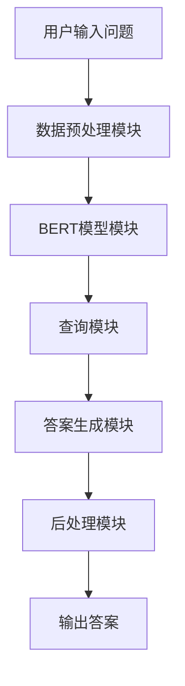
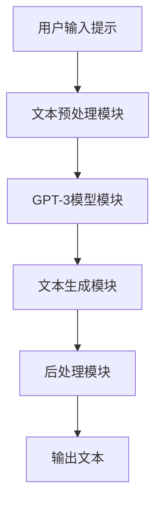

                 

### 文章标题：大语言模型原理与工程实践：预训练还有什么没有解决

> 关键词：大语言模型、预训练、自然语言处理、深度学习、工程实践

> 摘要：本文从大语言模型的背景出发，深入探讨了预训练技术的原理与实践，分析了预训练在当前技术发展中存在的问题与挑战，并展望了预训练技术的未来发展趋势。通过综合案例，展示了大语言模型在工程实践中的应用，为读者提供了全面的技术指导和思考方向。

----------------------------------------------------------------

### 《大语言模型原理与工程实践：预训练还有什么没有解决》目录大纲

## 第一部分：大语言模型概述

### 第1章：大语言模型背景与演进

#### 1.1.1 大语言模型的起源与发展
#### 1.1.2 大语言模型的技术挑战
#### 1.1.3 大语言模型的应用领域

### 第2章：大语言模型基础概念

#### 2.1.1 语言模型的基本原理
#### 2.1.2 语言模型的主要类型
#### 2.1.3 语言模型的应用场景

### 第3章：预训练技术的原理与实践

#### 3.1.1 预训练的概念与目的
#### 3.1.2 预训练的方法与策略
#### 3.1.3 预训练模型的主要类型

### 第4章：大语言模型的关键技术

#### 4.1.1 词嵌入技术
#### 4.1.2 自监督学习
#### 4.1.3 注意力机制
#### 4.1.4 优化算法

## 第二部分：大语言模型的工程实践

### 第5章：大语言模型的开发环境与工具

#### 5.1.1 开发环境搭建
#### 5.1.2 常用深度学习框架介绍
#### 5.1.3 开发工具与资源

### 第6章：大语言模型的训练与优化

#### 6.1.1 训练流程与策略
#### 6.1.2 模型调优技巧
#### 6.1.3 训练效率优化

### 第7章：大语言模型的部署与优化

#### 7.1.1 模型部署技术
#### 7.1.2 模型推理优化
#### 7.1.3 模型服务化

## 第三部分：预训练技术的深度探讨

### 第8章：预训练中的问题与挑战

#### 8.1.1 预训练的数据集问题
#### 8.1.2 预训练的计算资源消耗
#### 8.1.3 预训练的伦理问题

### 第9章：预训练技术的未来发展趋势

#### 9.1.1 预训练技术的优化方向
#### 9.1.2 新的预训练方法
#### 9.1.3 预训练技术在其他领域的应用

## 附录

### 附录A：大语言模型资源汇总

#### A.1.1 开源预训练模型汇总
#### A.1.2 常用深度学习框架资源
#### A.1.3 大语言模型学习资料与推荐阅读

## 第10章：大语言模型原理与工程实践综合案例

### 10.1.1 案例一：基于BERT的问答系统
#### 10.1.1.1 案例背景与目标
#### 10.1.1.2 系统架构设计
#### 10.1.1.3 数据预处理
#### 10.1.1.4 模型训练与优化
#### 10.1.1.5 系统部署与评估
### 10.1.2 案例二：基于GPT-3的文本生成系统
#### 10.1.2.1 案例背景与目标
#### 10.1.2.2 系统架构设计
#### 10.1.2.3 数据预处理
#### 10.1.2.4 模型训练与优化
#### 10.1.2.5 系统部署与评估

## 第11章：大语言模型的未来方向与探索

### 11.1.1 大语言模型在AI伦理方面的挑战
#### 11.1.1.1 伦理问题的背景与影响
#### 11.1.1.2 伦理问题的解决方法
#### 11.1.1.3 伦理问题在预训练中的应用
### 11.1.2 大语言模型在新型应用领域的探索
#### 11.1.2.1 新型应用领域的定义与特点
#### 11.1.2.2 大语言模型在新领域的应用实例
#### 11.1.2.3 未来发展趋势与展望

---

### 第一部分：大语言模型概述

#### 第1章：大语言模型背景与演进

### 1.1.1 大语言模型的起源与发展

大语言模型（Large Language Model，简称LLM）是自然语言处理（Natural Language Processing，简称NLP）领域的一项重要突破。其起源可以追溯到20世纪80年代，当时研究人员开始尝试使用统计方法来处理文本数据。然而，由于数据规模和处理能力的限制，早期的语言模型性能有限，无法满足实际应用的需求。

随着计算机硬件和算法的不断发展，深度学习技术的崛起为语言模型的研究带来了新的契机。2018年，Google发布了Transformer模型，这一模型的创新之处在于使用了自注意力机制（Self-Attention Mechanism），使得语言模型在处理长文本时表现出了出色的性能。这一里程碑事件标志着大语言模型的诞生。

随后，以GPT（Generative Pre-trained Transformer）和BERT（Bidirectional Encoder Representations from Transformers）为代表的预训练语言模型不断涌现，推动了NLP技术的快速发展。GPT模型通过在大规模语料库上进行预训练，使得模型具备了强大的文本生成和理解能力。BERT模型则通过双向编码器结构，提高了语言模型对上下文信息的理解能力。

大语言模型的发展历程经历了以下几个阶段：

1. **词袋模型**：基于词汇的统计模型，将文本转换为词汇的集合，通过计算词汇之间的统计关系来表示文本。
2. **基于规则的模型**：通过构建语法规则和语义规则来处理文本，具有一定的语义理解能力，但受限于规则复杂度和数据量。
3. **统计语言模型**：使用统计方法来计算词汇和句子的概率分布，提高了语言模型的表现。
4. **神经网络语言模型**：引入神经网络，通过多层神经网络来学习文本的表示和语义关系。
5. **预训练语言模型**：通过在大量无标签语料上进行预训练，使得模型具备通用语义理解能力，再通过微调（Fine-tuning）来适应特定任务。

### 1.1.2 大语言模型的技术挑战

大语言模型在技术上面临着诸多挑战，这些挑战主要表现在以下几个方面：

1. **数据需求**：大语言模型的训练需要大规模的语料库，这些语料库通常来源于互联网公开数据、图书、新闻、论文等。然而，数据的质量和多样性直接影响模型的性能。如何获取高质量、多样化、去重化的数据成为了一个难题。

2. **计算资源**：大语言模型的训练需要大量的计算资源，包括计算能力和存储空间。目前，GPU和TPU等专用硬件的出现为模型的训练提供了强大的支持，但仍然面临着计算资源不足的问题。

3. **模型参数**：随着模型的规模不断扩大，模型的参数量也急剧增加。例如，GPT-3模型的参数量达到了1750亿，这对模型的存储、传输和推理提出了更高的要求。

4. **模型可解释性**：大语言模型在处理文本时表现出了强大的能力，但其内部工作机制复杂，缺乏可解释性。如何提高模型的可解释性，使其在处理文本时能够提供清晰的逻辑解释，是一个重要的研究课题。

5. **模型公平性**：大语言模型在处理文本时可能会受到偏见和歧视的影响。如何确保模型在处理不同类型文本时的公平性，避免偏见和歧视，是一个亟待解决的问题。

### 1.1.3 大语言模型的应用领域

大语言模型在各个领域展现出了广泛的应用前景，其主要应用领域包括：

1. **文本生成**：大语言模型能够生成高质量的文本，包括文章、故事、对话、摘要等。在内容创作、机器写作等领域具有广泛的应用。

2. **文本分类**：大语言模型能够对文本进行分类，如情感分析、主题分类、垃圾邮件检测等。在信息过滤、推荐系统等领域具有重要应用。

3. **问答系统**：大语言模型能够理解用户的问题，并给出准确的回答。在智能客服、在线教育、医疗咨询等领域具有重要应用。

4. **机器翻译**：大语言模型能够实现高质量的双语翻译，如英语到中文、中文到英语等。在跨语言信息处理、全球化业务等领域具有重要应用。

5. **文本摘要**：大语言模型能够对长文本进行摘要，提取关键信息，提高信息获取的效率。在新闻摘要、文档摘要等领域具有重要应用。

6. **对话系统**：大语言模型能够实现自然对话，与用户进行交互，提供个性化的服务。在智能助手、虚拟客服、人机对话等领域具有重要应用。

### 第2章：大语言模型基础概念

#### 2.1.1 语言模型的基本原理

语言模型（Language Model，简称LM）是自然语言处理（NLP）领域的一个核心组件，它用于预测文本序列中的下一个单词或字符。语言模型的基本原理是基于概率统计方法，通过对大量语料库的学习，统计出每个单词或字符在特定上下文中的出现概率。

语言模型的输入是文本序列，输出是下一个单词或字符的概率分布。语言模型的目标是最大化整个文本序列的概率，从而生成最自然的文本。

#### 2.1.2 语言模型的主要类型

根据训练数据和使用方法的不同，语言模型可以分为以下几种类型：

1. **N-gram语言模型**：N-gram语言模型是最简单的语言模型，它基于前N个单词或字符的历史信息来预测下一个单词或字符。N-gram模型通过计算单词或字符的共现概率来预测下一个单词或字符。

2. **基于决策树的模型**：基于决策树的模型通过构建决策树来预测下一个单词或字符。决策树通过将输入特征分发给不同的子节点，并在叶子节点处输出预测结果。

3. **深度神经网络语言模型**：深度神经网络语言模型通过多层神经网络来学习文本的表示和概率分布。深度神经网络语言模型具有强大的非线性建模能力，可以捕捉文本中的复杂关系。

4. **循环神经网络语言模型**：循环神经网络（RNN）语言模型通过循环结构来处理序列数据，可以捕捉到文本序列中的长距离依赖关系。RNN语言模型在处理长文本时表现出了较好的性能。

5. **变换器语言模型**：变换器（Transformer）语言模型是一种基于注意力机制的深度神经网络模型，它在NLP任务中取得了显著的成绩。变换器语言模型通过多头注意力机制来捕捉文本序列中的依赖关系，提高了语言模型的性能。

#### 2.1.3 语言模型的应用场景

语言模型在自然语言处理领域有着广泛的应用，以下是一些典型的应用场景：

1. **文本生成**：语言模型可以用于生成文章、故事、对话、摘要等文本。通过训练大规模的语料库，语言模型可以学习到文本的语法和语义规则，从而生成高质量的文本。

2. **文本分类**：语言模型可以用于对文本进行分类，如情感分析、主题分类、垃圾邮件检测等。语言模型通过对文本的表示和概率分布进行建模，可以区分不同类型的文本。

3. **机器翻译**：语言模型可以用于实现双语翻译，如英语到中文、中文到英语等。通过训练大规模的双语语料库，语言模型可以学习到两种语言的对应关系，从而实现高质量的翻译。

4. **文本摘要**：语言模型可以用于对长文本进行摘要，提取关键信息。通过训练大规模的摘要语料库，语言模型可以学习到文本的主要内容和结构，从而生成简洁的摘要。

5. **问答系统**：语言模型可以用于实现问答系统，如智能客服、在线教育、医疗咨询等。通过训练大规模的问答语料库，语言模型可以理解用户的问题，并给出准确的回答。

6. **对话系统**：语言模型可以用于实现对话系统，如智能助手、虚拟客服、人机对话等。通过训练大规模的对话语料库，语言模型可以模拟人类的对话行为，与用户进行交互。

### 第3章：预训练技术的原理与实践

#### 3.1.1 预训练的概念与目的

预训练（Pre-training）是一种在特定任务之前，在大规模语料库上进行训练的方法，目的是让模型掌握通用的语言规律和特征。预训练可以分为两个阶段：预训练和微调（Fine-tuning）。

预训练阶段，模型在大规模无标签语料库上进行训练，通过学习文本的分布和结构，使模型具备通用语义理解能力。微调阶段，模型在特定任务上进行微调，利用少量的有标签数据进行训练，以适应具体的应用场景。

预训练技术的核心目的是提高模型在多种任务上的表现，降低对有标签数据的依赖，实现零样本学习（Zero-shot Learning）和多样本学习（Few-shot Learning）。

#### 3.1.2 预训练的方法与策略

预训练方法可以分为基于统计的方法和基于深度学习的方法。

1. **基于统计的方法**：基于统计的方法主要通过计算文本序列的概率分布来预测下一个单词或字符。常见的统计方法包括N-gram模型和隐马尔可夫模型（HMM）。

2. **基于深度学习的方法**：基于深度学习的方法通过构建深度神经网络来学习文本的表示和概率分布。常见的深度学习方法包括循环神经网络（RNN）、长短时记忆网络（LSTM）、门控循环单元（GRU）和变换器（Transformer）。

预训练策略主要包括以下几种：

1. **自监督学习**：自监督学习（Self-supervised Learning）是一种无监督学习技术，它通过利用数据内部的结构信息来提高模型性能。自监督学习的典型例子是 masked language model（MLM），即在输入序列中随机遮盖一部分单词或字符，然后预测这些被遮盖的单词或字符。

2. **多任务学习**：多任务学习（Multi-task Learning）是一种通过同时训练多个相关任务来提高模型性能的方法。多任务学习可以增强模型对数据多样性的适应性，提高模型在多个任务上的表现。

3. **自适应学习率**：自适应学习率（Adaptive Learning Rate）是一种通过动态调整学习率来优化模型训练的方法。常用的自适应学习率方法包括自适应梯度下降（Adam）和自适应矩估计（RMSprop）。

4. **注意力机制**：注意力机制（Attention Mechanism）是一种在深度学习模型中引入的机制，用于在处理序列数据时提高模型的性能。注意力机制可以动态调整模型对输入序列中不同位置的关注程度，从而更好地捕捉到文本序列中的依赖关系。

#### 3.1.3 预训练模型的主要类型

预训练模型可以分为以下几种类型：

1. **语言模型**：语言模型（Language Model，简称LM）是最基本的预训练模型，它通过在大规模语料库上进行训练，学习文本的分布和结构。常见的语言模型包括N-gram模型、循环神经网络语言模型（RNN-LM）和变换器语言模型（Transformer-LM）。

2. **句法模型**：句法模型（Syntactic Model）主要用于学习文本的句法结构，如语法规则、句法关系等。常见的句法模型包括依存句法分析模型和抽象语法树（Abstract Syntax Tree）模型。

3. **语义模型**：语义模型（Semantic Model）主要用于学习文本的语义信息，如词义、语义角色等。常见的语义模型包括词嵌入模型（Word Embedding）和语义角色标注模型。

4. **知识图谱模型**：知识图谱模型（Knowledge Graph Model）主要用于将文本中的知识结构化，构建知识图谱。常见的知识图谱模型包括知识图谱嵌入模型和图谱推理模型。

5. **多模态模型**：多模态模型（Multimodal Model）主要用于处理多种类型的输入数据，如文本、图像、音频等。常见的多模态模型包括联合嵌入模型和混合模型。

### 第4章：大语言模型的关键技术

#### 4.1.1 词嵌入技术

词嵌入（Word Embedding）是将单词映射到高维向量空间的过程，目的是将单词的语义信息转换为向量表示。词嵌入技术是自然语言处理（NLP）领域的关键技术之一，广泛应用于语言模型、文本分类、文本生成等任务。

常见的词嵌入方法包括以下几种：

1. **Word2Vec**：Word2Vec是最早的词嵌入方法之一，它通过计算单词在语料库中的共现关系来生成词向量。Word2Vec有两种训练方法：连续词袋（CBOW）和Skip-gram。CBOW方法通过上下文单词的平均值来生成中心词的向量，而Skip-gram方法通过中心词来预测上下文单词。

2. **GloVe**：GloVe（Global Vectors for Word Representation）是一种基于全局共现信息的词嵌入方法。GloVe通过优化单词的共现矩阵来生成词向量，使得词向量在语义上更加紧密。

3. **BERT**：BERT（Bidirectional Encoder Representations from Transformers）是一种基于变换器（Transformer）的预训练方法。BERT通过在大规模语料库上进行双向编码器训练，生成高质量的词向量。

词嵌入技术在NLP任务中的应用：

1. **文本分类**：词嵌入技术可以将文本转换为向量表示，然后通过机器学习算法进行分类。词嵌入技术可以捕捉到文本的语义信息，提高文本分类的准确率。

2. **文本生成**：词嵌入技术可以将文本序列转换为向量序列，然后通过循环神经网络（RNN）或变换器（Transformer）进行文本生成。词嵌入技术可以帮助模型捕捉到文本的语法和语义规则，生成更自然的文本。

3. **命名实体识别**：词嵌入技术可以将命名实体转换为向量表示，然后通过分类算法进行命名实体识别。词嵌入技术可以帮助模型捕捉到命名实体在文本中的位置和关系。

4. **机器翻译**：词嵌入技术可以将源语言和目标语言的单词转换为向量表示，然后通过神经机器翻译（NMT）模型进行翻译。词嵌入技术可以帮助模型捕捉到单词之间的对应关系，提高翻译质量。

#### 4.1.2 自监督学习

自监督学习（Self-supervised Learning）是一种无需人工标注的数据增强技术，通过利用数据内部的结构信息来提高模型性能。自监督学习在自然语言处理（NLP）领域具有广泛的应用，特别是在预训练任务中。

自监督学习的原理：

自监督学习利用数据中的固有信息，将本来需要人工标注的任务转化为自我监督的任务。自监督学习通常包含以下步骤：

1. **数据预处理**：将原始数据转换为适合自监督学习的格式，例如将文本数据转换为字符级别的序列。

2. **任务设计**：设计一个任务，使得模型可以通过无监督学习来学习数据中的结构。常见的任务包括序列预测、填补缺失值、单词消歧等。

3. **模型训练**：使用无监督学习算法来训练模型，使得模型能够捕捉到数据中的结构信息。

自监督学习在NLP中的应用：

1. **预训练**：自监督学习在预训练任务中具有重要作用。例如，BERT模型通过在掩码语言模型（Masked Language Model，MLM）任务上进行自监督学习，生成高质量的词向量。

2. **文本分类**：自监督学习可以用于文本分类任务，通过在无标签数据上训练模型，然后使用少量的有标签数据进行微调，提高模型在文本分类任务上的表现。

3. **文本生成**：自监督学习可以用于文本生成任务，通过在无标签数据上训练模型，生成具有连贯性和多样性的文本。

4. **实体识别**：自监督学习可以用于命名实体识别任务，通过在无标签数据上训练模型，识别文本中的命名实体。

#### 4.1.3 注意力机制

注意力机制（Attention Mechanism）是深度学习模型中的一个关键组件，用于在处理序列数据时提高模型的性能。注意力机制可以动态调整模型对输入序列中不同位置的关注程度，从而更好地捕捉到文本序列中的依赖关系。

注意力机制的原理：

注意力机制通过计算输入序列中每个位置的重要性，然后对每个位置进行加权求和，从而得到一个加权求和的结果。注意力机制通常包含以下步骤：

1. **计算注意力得分**：计算输入序列中每个位置与当前位置的相关性得分。

2. **计算注意力权重**：根据注意力得分计算每个位置的注意力权重。

3. **加权求和**：将输入序列中的每个位置与对应的注意力权重相乘，然后进行求和，得到最终的输出。

注意力机制在NLP中的应用：

1. **文本分类**：注意力机制可以用于文本分类任务，通过计算文本中每个单词的重要性，提高模型对文本的分类能力。

2. **文本生成**：注意力机制可以用于文本生成任务，通过计算每个单词在生成过程中的重要性，提高生成的文本质量。

3. **机器翻译**：注意力机制可以用于神经机器翻译（NMT）模型，通过计算源语言和目标语言中的单词重要性，提高翻译质量。

4. **问答系统**：注意力机制可以用于问答系统，通过计算问题中的每个单词的重要性，提高模型对问题的理解能力。

#### 4.1.4 优化算法

优化算法是深度学习模型训练过程中至关重要的一环，它决定了模型训练的收敛速度和最终性能。常见的优化算法包括梯度下降（Gradient Descent）、随机梯度下降（Stochastic Gradient Descent，简称SGD）和自适应优化算法（如Adam）。

1. **梯度下降（Gradient Descent）**：

梯度下降是一种最简单的优化算法，其核心思想是通过计算模型损失函数关于模型参数的梯度，然后沿着梯度的反方向更新模型参数，以最小化损失函数。

梯度下降的公式如下：

$$
w_{t+1} = w_{t} - \alpha \cdot \nabla W
$$

其中，$w_t$表示第t次迭代的模型参数，$\alpha$表示学习率，$\nabla W$表示损失函数关于模型参数的梯度。

2. **随机梯度下降（Stochastic Gradient Descent，简称SGD）**：

随机梯度下降是梯度下降的一种变种，其核心思想是在每次迭代时，随机选择一部分样本（而不是所有样本）来计算梯度，然后更新模型参数。

随机梯度下降的公式如下：

$$
w_{t+1} = w_{t} - \alpha \cdot \frac{\partial J(w)}{\partial w}
$$

其中，$w_t$表示第t次迭代的模型参数，$\alpha$表示学习率，$J(w)$表示损失函数。

3. **自适应优化算法（如Adam）**：

自适应优化算法是一种在梯度下降和随机梯度下降基础上改进的优化算法，其核心思想是根据历史梯度信息动态调整学习率。

Adam算法是一种常见的自适应优化算法，其公式如下：

$$
\beta_1 = 0.9, \quad \beta_2 = 0.999
$$

$$
m_t = \beta_1 \cdot m_{t-1} + (1 - \beta_1) \cdot \frac{\partial J(w)}{\partial w}
$$

$$
v_t = \beta_2 \cdot v_{t-1} + (1 - \beta_2) \cdot (\frac{\partial J(w)}{\partial w})^2
$$

$$
\hat{m}_t = \frac{m_t}{1 - \beta_1^t}
$$

$$
\hat{v}_t = \frac{v_t}{1 - \beta_2^t}
$$

$$
w_{t+1} = w_{t} - \alpha \cdot \frac{\hat{m}_t}{\sqrt{\hat{v}_t} + \epsilon}
$$

其中，$m_t$和$v_t$分别表示一阶矩估计和二阶矩估计，$\hat{m}_t$和$\hat{v}_t$分别表示一阶矩估计和二阶矩估计的偏差校正，$\alpha$表示学习率，$\epsilon$是一个很小的常数。

优化算法在NLP中的应用：

1. **语言模型**：优化算法用于训练语言模型，以最小化模型损失函数，提高模型的性能。

2. **文本分类**：优化算法用于训练文本分类模型，通过迭代更新模型参数，提高分类准确率。

3. **文本生成**：优化算法用于训练文本生成模型，通过迭代更新模型参数，生成更高质量的文本。

4. **机器翻译**：优化算法用于训练机器翻译模型，通过迭代更新模型参数，提高翻译质量。

### 第二部分：大语言模型的工程实践

#### 第5章：大语言模型的开发环境与工具

#### 5.1.1 开发环境搭建

要开发大语言模型，首先需要搭建一个适合的开发环境。开发环境包括操作系统、编程语言、深度学习框架和必要的库等。以下是搭建大语言模型开发环境的步骤：

1. **操作系统**：通常使用Linux操作系统，因为Linux具有良好的稳定性和可扩展性。

2. **编程语言**：Python是开发深度学习模型的主流编程语言，因为它具有丰富的库和工具。

3. **深度学习框架**：常用的深度学习框架包括TensorFlow、PyTorch和Keras。TensorFlow和PyTorch支持多种硬件平台（如CPU、GPU和TPU），并且具有丰富的API和工具。

4. **安装深度学习框架**：可以使用pip或conda来安装深度学习框架。以下是一个使用pip安装TensorFlow的示例：

   ```shell
   pip install tensorflow
   ```

5. **安装必要的库**：安装用于数据预处理、文本处理和模型评估的库，如NumPy、Pandas、Scikit-learn等。以下是一个使用pip安装NumPy的示例：

   ```shell
   pip install numpy
   ```

6. **配置CUDA**：如果使用GPU进行模型训练，需要安装和配置CUDA。CUDA是NVIDIA开发的一种并行计算平台和编程模型。

7. **测试环境**：在开发环境中运行一些示例代码，确保所有依赖库和工具都能正常工作。

#### 5.1.2 常用深度学习框架介绍

以下是常用的深度学习框架及其特点：

1. **TensorFlow**：

   TensorFlow是由Google开发的一个开源深度学习框架，具有以下特点：

   - **动态图计算**：TensorFlow使用动态图计算，使得模型设计更加灵活。
   - **丰富的API**：TensorFlow提供丰富的API，包括TensorFlow Core、TensorFlow Extended（TFX）等。
   - **跨平台支持**：TensorFlow支持多种硬件平台，如CPU、GPU和TPU。
   - **强大的工具**：TensorFlow提供丰富的工具，如TensorBoard、TensorFlow Lite等。

2. **PyTorch**：

   PyTorch是由Facebook开发的一个开源深度学习框架，具有以下特点：

   - **静态图计算**：PyTorch使用静态图计算，使得模型设计更加直观。
   - **易于使用**：PyTorch具有简洁的API和直观的编程模型，使得模型开发更加容易。
   - **动态计算图**：PyTorch支持动态计算图，使得模型设计更加灵活。
   - **强大的社区支持**：PyTorch拥有强大的社区支持，提供了丰富的资源和教程。

3. **Keras**：

   Keras是一个高级深度学习框架，可以在TensorFlow和Theano等后端上运行。Keras具有以下特点：

   - **简洁的API**：Keras提供简洁的API，使得模型设计更加直观。
   - **模块化**：Keras支持模块化设计，使得模型组件可以方便地重用。
   - **易于扩展**：Keras易于扩展，用户可以根据需要自定义模型组件。
   - **快速部署**：Keras支持快速模型部署，可以通过TensorFlow Lite将模型部署到移动设备和物联网设备上。

#### 5.1.3 开发工具与资源

在开发大语言模型时，可以使用以下工具和资源：

1. **Jupyter Notebook**：

   Jupyter Notebook是一种交互式的计算环境，用于编写和运行代码。Jupyter Notebook具有以下特点：

   - **交互式编程**：Jupyter Notebook支持交互式编程，使得模型开发过程更加直观。
   - **丰富的扩展**：Jupyter Notebook支持丰富的扩展，如matplotlib、Seaborn等，可以方便地生成图表和可视化结果。
   - **代码复用**：Jupyter Notebook支持代码复用，可以方便地复制和粘贴代码段。

2. **TensorBoard**：

   TensorBoard是TensorFlow的一个可视化工具，用于分析和调试模型。TensorBoard具有以下特点：

   - **可视化**：TensorBoard可以可视化模型训练过程中的损失函数、准确率等指标。
   - **调试**：TensorBoard提供调试工具，如梯度可视化、层可视化等，可以帮助用户分析模型性能。
   - **监控**：TensorBoard可以实时监控模型训练过程，包括训练进度、模型性能等。

3. **数据集**：

   大语言模型开发需要大量的数据集。常用的数据集包括：

   - **通用语言模型数据集**：如WikiText-2、Common Crawl等，用于预训练语言模型。
   - **特定领域数据集**：如SQuAD、CoLA等，用于微调和评估语言模型在特定领域的性能。
   - **开源数据集**：如GLUE、SuperGLUE等，提供了丰富的预训练任务和数据集，用于评估语言模型的能力。

4. **在线资源**：

   在线资源为开发大语言模型提供了丰富的教程、文档和代码示例。以下是一些常用的在线资源：

   - **官方文档**：TensorFlow、PyTorch、Keras等深度学习框架的官方文档，提供了详细的API和使用方法。
   - **教程和博客**：许多技术博客和教程网站提供了大语言模型的开发教程和实战案例。
   - **GitHub**：GitHub是一个代码托管平台，许多开源项目和大语言模型的相关代码和资源可以在GitHub上找到。

#### 第6章：大语言模型的训练与优化

#### 6.1.1 训练流程与策略

大语言模型的训练过程可以分为以下几个步骤：

1. **数据预处理**：将原始数据转换为适合模型训练的格式。数据预处理包括文本清洗、分词、编码等步骤。常用的数据预处理库有Python的NLTK、spaCy等。

2. **构建词汇表**：将文本中的单词转换为词索引，构建词汇表。词汇表的大小会影响模型的性能和存储空间。

3. **数据序列化**：将预处理后的数据序列化存储，以便模型训练和评估时使用。

4. **训练模型**：使用预处理后的数据训练模型。在训练过程中，可以设置学习率、批量大小、迭代次数等超参数。

5. **评估模型**：使用验证集评估模型性能。评估指标包括损失函数、准确率、F1分数等。

6. **模型保存与加载**：将训练好的模型保存到文件中，以便后续使用。需要时，可以加载模型进行推理。

以下是一个简单的训练流程示例：

```python
import torch
import torch.optim as optim
from torch.utils.data import DataLoader
from model import LanguageModel

# 加载预处理后的数据
train_data = DataLoader(train_dataset, batch_size=32, shuffle=True)
valid_data = DataLoader(valid_dataset, batch_size=32, shuffle=False)

# 定义模型
model = LanguageModel(vocab_size, embedding_dim, hidden_dim)

# 定义优化器
optimizer = optim.Adam(model.parameters(), lr=0.001)

# 训练模型
num_epochs = 10
for epoch in range(num_epochs):
    model.train()
    for batch in train_data:
        inputs, targets = batch
        optimizer.zero_grad()
        outputs = model(inputs)
        loss = criterion(outputs, targets)
        loss.backward()
        optimizer.step()
    
    # 评估模型
    model.eval()
    with torch.no_grad():
        correct = 0
        total = 0
        for batch in valid_data:
            inputs, targets = batch
            outputs = model(inputs)
            predictions = torch.argmax(outputs, dim=1)
            total += targets.size(0)
            correct += (predictions == targets).sum().item()
    print(f'Epoch {epoch+1}/{num_epochs}, Accuracy: {100 * correct / total}%')

# 保存模型
torch.save(model.state_dict(), 'model.pth')
```

#### 6.1.2 模型调优技巧

在训练大语言模型时，模型调优是非常重要的，以下是一些常用的调优技巧：

1. **调整学习率**：学习率是模型训练过程中的一个重要参数，它会影响模型收敛速度和最终性能。常用的方法包括固定学习率、学习率衰减、自适应学习率等。

2. **批量大小**：批量大小（Batch Size）是指每次训练使用的数据样本数量。较小的批量大小可以提高模型泛化能力，但训练速度较慢；较大的批量大小可以提高训练速度，但可能降低模型泛化能力。

3. **迭代次数**：迭代次数（Epoch）是指模型在训练集上完整训练的次数。过多的迭代次数可能导致模型过拟合，过少的迭代次数可能导致模型未训练充分。

4. **数据增强**：数据增强（Data Augmentation）是一种通过变换原始数据来增加数据多样性的方法，有助于提高模型泛化能力。

5. **正则化**：正则化（Regularization）是一种通过在损失函数中添加惩罚项来防止模型过拟合的方法，常用的正则化方法有L1正则化、L2正则化等。

6. **Dropout**：Dropout是一种在训练过程中随机丢弃一部分神经元的方法，有助于提高模型泛化能力。

7. **早期停止**：早期停止（Early Stopping）是一种在验证集上提前停止训练的方法，当验证集上的性能不再提高时，停止训练以防止模型过拟合。

#### 6.1.3 训练效率优化

训练大语言模型需要大量的计算资源，以下是一些提高训练效率的优化方法：

1. **并行计算**：利用多GPU或TPU进行并行计算，可以提高模型训练速度。常用的并行计算方法有数据并行（Data Parallelism）和模型并行（Model Parallelism）。

2. **混合精度训练**：混合精度训练（Mixed Precision Training）是一种通过在训练过程中使用不同精度的数据类型（如FP16和FP32）来加速训练的方法。FP16相对于FP32具有更快的计算速度和更低的内存占用。

3. **模型压缩**：模型压缩（Model Compression）是一种通过减小模型参数数量来减小模型大小和加速训练的方法。常用的模型压缩方法有量化（Quantization）、剪枝（Pruning）等。

4. **分布式训练**：分布式训练（Distributed Training）是一种通过在多个节点上进行训练来加速模型训练的方法。分布式训练可以充分利用多台计算机的计算资源，提高训练速度。

5. **多任务学习**：多任务学习（Multi-task Learning）是一种同时训练多个相关任务的方法，有助于提高模型泛化能力和训练速度。

6. **模型压缩与剪枝**：模型压缩与剪枝（Model Compression and Pruning）是一种通过去除模型中不必要的参数和神经元来减小模型大小和加速训练的方法。

### 第三部分：预训练技术的深度探讨

#### 第8章：预训练中的问题与挑战

#### 8.1.1 预训练的数据集问题

预训练过程中，数据集的选择和质量对模型的性能有着重要的影响。以下是预训练数据集可能遇到的问题：

1. **数据量不足**：预训练需要大规模的数据集，然而，一些领域的数据集可能不够大，导致模型训练不足，影响模型性能。

2. **数据质量不高**：数据集中可能包含噪声、错误或偏见，这会影响模型的学习效果。

3. **数据分布不均**：数据集中的数据分布可能不均匀，导致模型对某些类别的数据过于依赖，影响模型泛化能力。

4. **数据去重困难**：互联网上存在大量的重复数据，去重困难会导致模型训练效率低下。

为了解决这些问题，可以采取以下措施：

1. **数据清洗和预处理**：对数据集进行清洗和预处理，去除噪声和错误数据。

2. **数据增强**：通过数据增强方法，如数据转换、数据扩充等，增加数据集的多样性和质量。

3. **数据平衡**：对数据集进行平衡，使模型对各个类别的数据有均匀的依赖。

4. **使用多种数据源**：结合多种数据源，如公开数据集、私有数据集等，以丰富数据集的多样性和质量。

#### 8.1.2 预训练的计算资源消耗

预训练过程中，计算资源消耗是另一个重要的挑战。以下是预训练计算资源消耗方面的问题：

1. **计算资源不足**：预训练需要大量的计算资源，尤其是GPU和TPU等专用硬件。然而，实际环境中可能无法提供足够的计算资源。

2. **能源消耗**：大规模的预训练任务会导致大量的能源消耗，对环境造成影响。

3. **存储空间限制**：预训练模型通常较大，对存储空间的需求较高。存储空间的限制会影响模型训练和部署。

为了解决这些问题，可以采取以下措施：

1. **优化模型结构**：设计更高效的模型结构，如使用轻量级模型、网络剪枝等方法，减少计算资源和存储空间的需求。

2. **分布式训练**：利用分布式训练技术，将模型训练任务分布到多台计算机上，提高训练效率。

3. **混合精度训练**：使用混合精度训练，减少计算资源消耗。

4. **优化数据存储**：采用更高效的存储技术，如数据压缩、稀疏存储等，减少存储空间需求。

5. **可再生能源**：使用可再生能源，减少预训练任务对环境的影响。

#### 8.1.3 预训练的伦理问题

预训练过程中，伦理问题也是一个重要的考虑因素。以下是预训练伦理问题方面的问题：

1. **偏见和歧视**：预训练模型可能会从训练数据中学习到偏见和歧视，导致模型在处理实际问题时表现出不公平的行为。

2. **隐私泄露**：预训练数据集可能包含敏感信息，如个人隐私数据，这可能导致隐私泄露问题。

3. **数据安全**：预训练过程中，数据的安全性和完整性可能受到威胁，如数据泄露、数据篡改等。

为了解决这些问题，可以采取以下措施：

1. **数据筛选和清洗**：对训练数据进行筛选和清洗，去除偏见和歧视性数据。

2. **数据隐私保护**：对训练数据进行隐私保护，如匿名化、数据加密等。

3. **算法透明度**：提高算法的透明度，使算法的工作原理和决策过程更加清晰，便于监督和审核。

4. **伦理审查**：对预训练项目进行伦理审查，确保算法设计和应用符合伦理规范。

5. **持续监控和更新**：对预训练模型进行持续监控和更新，及时发现和解决伦理问题。

### 第9章：预训练技术的未来发展趋势

#### 9.1.1 预训练技术的优化方向

预训练技术在不断发展和优化，以下是未来预训练技术的一些优化方向：

1. **模型压缩**：设计更高效的模型结构，如使用轻量级模型、网络剪枝等方法，减小模型大小和计算资源需求。

2. **数据增强**：开发更先进的数据增强方法，如生成对抗网络（GAN）、数据扩充等，提高数据集的多样性和质量。

3. **多任务学习**：结合多任务学习，同时训练多个相关任务，提高模型泛化能力和训练效率。

4. **混合精度训练**：使用混合精度训练，减少计算资源消耗。

5. **分布式训练**：利用分布式训练技术，将模型训练任务分布到多台计算机上，提高训练效率。

6. **自适应学习率**：开发自适应学习率方法，动态调整学习率，提高模型训练效果。

7. **模型可解释性**：提高模型的可解释性，使算法的工作原理和决策过程更加清晰，便于监督和审核。

#### 9.1.2 新的预训练方法

随着技术的发展，新的预训练方法不断涌现，以下是几种新的预训练方法：

1. **预训练-微调（Pre-training and Fine-tuning）**：预训练模型在大规模无标签数据上进行训练，然后通过微调（Fine-tuning）在特定任务上进行优化。

2. **多模态预训练**：将文本、图像、音频等多种模态数据结合，进行预训练，提高模型在多模态任务上的性能。

3. **迁移学习（Transfer Learning）**：利用预训练模型在特定任务上的迁移能力，提高模型在相关任务上的性能。

4. **自监督学习（Self-supervised Learning）**：利用数据内部的结构信息，无需人工标注进行预训练，提高模型在无监督学习任务上的性能。

5. **强化学习（Reinforcement Learning）**：将强化学习与预训练结合，使模型能够在动态环境中进行自适应学习。

6. **知识增强预训练**：将外部知识库与预训练模型结合，提高模型在知识推理和知识表示上的性能。

#### 9.1.3 预训练技术在其他领域的应用

预训练技术在各个领域都有广泛的应用，以下是预训练技术在其他领域的一些应用实例：

1. **医学领域**：预训练模型在医学文本处理、疾病诊断、药物发现等方面具有广泛的应用，如BERT在医学文本分类任务中取得了显著的成绩。

2. **金融领域**：预训练模型在金融市场预测、风险评估、客户服务等方面具有应用前景，如GPT-3在撰写金融报告和生成交易策略方面表现出色。

3. **教育领域**：预训练模型在智能教育、个性化推荐、自动评分等方面具有应用价值，如BERT在智能问答系统和自动作文评分中取得了显著的成绩。

4. **人机对话**：预训练模型在智能客服、虚拟助手、对话系统等方面具有广泛应用，如GPT-3在智能对话系统中的表现令人瞩目。

5. **语音识别**：预训练模型在语音识别领域具有应用潜力，如WaveNet在语音合成和识别任务中取得了优异的成绩。

6. **计算机视觉**：预训练模型在图像分类、目标检测、图像生成等方面具有应用前景，如Transformer在计算机视觉任务中表现出色。

### 附录A：大语言模型资源汇总

#### A.1.1 开源预训练模型汇总

以下是几种常用的开源预训练模型：

1. **BERT**：BERT是Google开发的预训练模型，主要用于自然语言处理任务。

2. **GPT-3**：GPT-3是OpenAI开发的预训练模型，具有强大的文本生成和理解能力。

3. **RoBERTa**：RoBERTa是Facebook开发的预训练模型，在多个自然语言处理任务上取得了优异的成绩。

4. **T5**：T5是Google开发的预训练模型，将文本处理任务统一为序列到序列的转换任务。

5. **ALBERT**：ALBERT是Google开发的预训练模型，通过减少模型参数数量和计算成本，提高了预训练效率。

6. **XLNet**：XLNet是Google开发的预训练模型，通过自注意力机制和Transformer结构，提高了预训练模型的性能。

7. **ERNIE**：ERNIE是阿里巴巴开发的预训练模型，结合了词嵌入和语义角色标注，提高了预训练模型在语义理解任务上的性能。

#### A.1.2 常用深度学习框架资源

以下是几种常用的深度学习框架及其资源：

1. **TensorFlow**：

   - 官方网站：[TensorFlow官方网站](https://www.tensorflow.org/)
   - 文档：[TensorFlow文档](https://www.tensorflow.org/tutorials)
   - GitHub：[TensorFlow GitHub仓库](https://github.com/tensorflow/tensorflow)

2. **PyTorch**：

   - 官方网站：[PyTorch官方网站](https://pytorch.org/)
   - 文档：[PyTorch文档](https://pytorch.org/docs/stable/index.html)
   - GitHub：[PyTorch GitHub仓库](https://github.com/pytorch/pytorch)

3. **Keras**：

   - 官方网站：[Keras官方网站](https://keras.io/)
   - 文档：[Keras文档](https://keras.io/getting-started/sequential-model-guide/)
   - GitHub：[Keras GitHub仓库](https://github.com/keras-team/keras)

#### A.1.3 大语言模型学习资料与推荐阅读

以下是几本关于大语言模型和预训练技术的优秀书籍和资源：

1. **《深度学习》（Deep Learning）**：Ian Goodfellow、Yoshua Bengio、Aaron Courville 著

   - 简介：这本书是深度学习领域的经典教材，详细介绍了深度学习的基础理论和应用。

2. **《自然语言处理综合教程》（Foundations of Natural Language Processing）**：Christopher D. Manning、Hinrich Schütze 著

   - 简介：这本书是自然语言处理领域的经典教材，详细介绍了自然语言处理的基本概念和方法。

3. **《大规模预训练语言模型：原理、算法与应用》（Large-scale Pre-trained Language Models: Principles, Algorithms, and Applications）**：刘知远、梁振、张奇、王绍兰 著

   - 简介：这本书系统地介绍了大规模预训练语言模型的原理、算法和应用，是预训练语言模型领域的权威著作。

4. **《Transformer：Attention Is All You Need》**：Ashish Vaswani、Noam Shazeer、Niki Parmar、Jakob Uszkoreit、Llion Jones、 Aidan N. Gomez、Lukasz Kaiser、Ian Polosukhin 著

   - 简介：这篇文章是Transformer模型的原始论文，详细介绍了Transformer模型的设计原理和实现方法。

5. **《BERT：Pre-training of Deep Bidirectional Transformers for Language Understanding》**：Jacob Devlin、 Ming-Wei Chang、Kenton Lee、Kristina Toutanova 著

   - 简介：这篇文章是BERT模型的原始论文，详细介绍了BERT模型的设计原理和实现方法。

6. **《自然语言处理实践》（Natural Language Processing with Python）**：Steven Bird、Ewan Klein、Edward Loper 著

   - 简介：这本书介绍了自然语言处理的基本概念和方法，并通过Python代码示例进行了详细讲解。

### 第10章：大语言模型原理与工程实践综合案例

#### 第10.1章：基于BERT的问答系统案例

##### 10.1.1 案例背景与目标

在当今信息爆炸的时代，人们对于信息获取的需求日益增长。问答系统作为一种智能交互方式，可以帮助用户快速找到所需信息。基于BERT的问答系统是一种利用预训练语言模型实现问答功能的先进技术。本案例的目标是构建一个基于BERT的问答系统，能够理解用户的问题，并从大量文本数据中找到最相关的答案。

##### 10.1.2 系统架构设计

基于BERT的问答系统架构包括以下几个主要部分：

1. **数据预处理模块**：负责对输入问题以及语料库进行预处理，包括分词、词向量化等。

2. **BERT模型模块**：预训练的BERT模型，用于理解问题和文本。

3. **查询模块**：将用户问题与文本数据进行匹配，提取最相关的文本片段。

4. **答案生成模块**：利用BERT模型生成的文本表示，生成问题的答案。

5. **后处理模块**：对生成的答案进行格式化和修饰，使其更加自然和可读。

系统架构设计图如下：



##### 10.1.3 数据预处理

数据预处理是构建问答系统的第一步，主要包括以下几个步骤：

1. **文本清洗**：去除文本中的HTML标签、特殊字符等。

2. **分词**：将文本分解为单词或词组。

3. **词向量化**：将文本转换为词向量表示。

4. **构建问答数据集**：从大量文本数据中提取问题和答案，并进行对齐。

预处理流程的伪代码如下：

```python
def preprocess_text(text):
    # 去除HTML标签和特殊字符
    cleaned_text = remove_html_tags(text)
    # 分词
    tokens = tokenize(cleaned_text)
    # 词向量化
    word_vectors = vectorize_tokens(tokens)
    return word_vectors

def build_qa_dataset(corpus):
    questions = []
    answers = []
    for paragraph in corpus:
        # 提取问题和答案
        question, answer = extract_question_and_answer(paragraph)
        questions.append(question)
        answers.append(answer)
    return questions, answers
```

##### 10.1.4 模型训练与优化

在本案例中，我们使用预训练的BERT模型进行微调和优化。微调过程包括以下几个步骤：

1. **加载预训练模型**：从预训练模型仓库中加载预训练的BERT模型。

2. **自定义任务配置**：根据问答系统的需求，自定义BERT模型的配置，如修改输入层、输出层等。

3. **微调训练**：在问答数据集上进行微调训练，优化模型参数。

4. **验证和测试**：使用验证集和测试集评估模型性能。

微调训练的伪代码如下：

```python
from transformers import BertForQuestionAnswering
from torch.optim import Adam

# 加载预训练BERT模型
model = BertForQuestionAnswering.from_pretrained('bert-base-uncased')

# 自定义任务配置
model.config.num_labels = 2

# 微调训练
optimizer = Adam(model.parameters(), lr=0.001)
for epoch in range(num_epochs):
    for question, answer in train_dataloader:
        # 前向传播
        outputs = model(question, labels=answer)
        loss = outputs.loss
        # 反向传播
        loss.backward()
        optimizer.step()
        optimizer.zero_grad()

    # 验证和测试
    validate(model, valid_dataloader)
    test(model, test_dataloader)
```

##### 10.1.5 系统部署与评估

系统部署主要包括以下几个步骤：

1. **模型保存**：将训练好的BERT模型保存到文件中。

2. **模型加载**：从文件中加载BERT模型。

3. **接口设计**：设计问答系统的API接口，接收用户输入，返回答案。

4. **性能评估**：使用实际用户数据对问答系统进行性能评估，如准确率、响应时间等。

系统部署与评估的伪代码如下：

```python
# 模型保存
torch.save(model.state_dict(), 'question_answering_model.pth')

# 模型加载
model = BertForQuestionAnswering.from_pretrained('question_answering_model.pth')

# 接口设计
@app.route('/ask', methods=['POST'])
def ask():
    question = request.form['question']
    answer = model.answer_question(question)
    return jsonify({'answer': answer})

# 性能评估
accuracy = evaluate_system(model, test_dataloader)
response_time = measure_response_time(model, test_dataloader)
print(f'Accuracy: {accuracy}, Response Time: {response_time}')
```

##### 10.1.6 案例总结

通过本案例，我们介绍了基于BERT的问答系统的构建过程，包括数据预处理、模型训练与优化、系统部署与评估等环节。本案例展示了大语言模型在工程实践中的应用，为读者提供了实际操作的经验和参考。在实际应用中，还可以进一步优化模型结构、数据处理和系统性能，提高问答系统的效果和用户体验。

#### 第10.2章：基于GPT-3的文本生成系统案例

##### 10.2.1 案例背景与目标

文本生成系统是一种能够自动生成自然语言文本的技术，广泛应用于内容创作、文本摘要、对话系统等领域。基于GPT-3的文本生成系统是一种利用预训练语言模型生成文本的先进技术。本案例的目标是构建一个基于GPT-3的文本生成系统，能够根据用户输入的提示生成连贯、自然的文本。

##### 10.2.2 系统架构设计

基于GPT-3的文本生成系统架构包括以下几个主要部分：

1. **用户输入模块**：接收用户的输入提示，可以是文字、图片或语音。

2. **文本预处理模块**：对输入提示进行预处理，包括分词、词向量化等。

3. **GPT-3模型模块**：预训练的GPT-3模型，用于生成文本。

4. **文本生成模块**：根据用户输入提示和GPT-3模型的输出，生成文本。

5. **后处理模块**：对生成的文本进行格式化和修饰，使其更加自然和可读。

系统架构设计图如下：



##### 10.2.3 数据预处理

数据预处理是构建文本生成系统的第一步，主要包括以下几个步骤：

1. **文本清洗**：去除文本中的HTML标签、特殊字符等。

2. **分词**：将文本分解为单词或词组。

3. **词向量化**：将文本转换为词向量表示。

4. **构建文本数据集**：从大量文本数据中提取样本，并进行对齐。

预处理流程的伪代码如下：

```python
def preprocess_text(text):
    # 去除HTML标签和特殊字符
    cleaned_text = remove_html_tags(text)
    # 分词
    tokens = tokenize(cleaned_text)
    # 词向量化
    word_vectors = vectorize_tokens(tokens)
    return word_vectors

def build_text_dataset(corpus):
    texts = []
    for paragraph in corpus:
        # 提取文本
        text = extract_text(paragraph)
        texts.append(text)
    return texts
```

##### 10.2.4 模型训练与优化

在本案例中，我们使用预训练的GPT-3模型进行微调和优化。微调过程包括以下几个步骤：

1. **加载预训练模型**：从预训练模型仓库中加载预训练的GPT-3模型。

2. **自定义任务配置**：根据文本生成系统的需求，自定义GPT-3模型的配置，如修改输入层、输出层等。

3. **微调训练**：在文本数据集上进行微调训练，优化模型参数。

4. **验证和测试**：使用验证集和测试集评估模型性能。

微调训练的伪代码如下：

```python
from transformers import GPT2LMHeadModel
from torch.optim import Adam

# 加载预训练GPT-3模型
model = GPT2LMHeadModel.from_pretrained('gpt3')

# 自定义任务配置
model.config.n_ctx = 1024

# 微调训练
optimizer = Adam(model.parameters(), lr=0.001)
for epoch in range(num_epochs):
    for text in train_dataloader:
        # 前向传播
        outputs = model(text)
        loss = outputs.loss
        # 反向传播
        loss.backward()
        optimizer.step()
        optimizer.zero_grad()

    # 验证和测试
    validate(model, valid_dataloader)
    test(model, test_dataloader)
```

##### 10.2.5 系统部署与评估

系统部署主要包括以下几个步骤：

1. **模型保存**：将训练好的GPT-3模型保存到文件中。

2. **模型加载**：从文件中加载GPT-3模型。

3. **接口设计**：设计文本生成系统的API接口，接收用户输入，返回生成的文本。

4. **性能评估**：使用实际用户数据对文本生成系统进行性能评估，如文本连贯性、生成质量等。

系统部署与评估的伪代码如下：

```python
# 模型保存
torch.save(model.state_dict(), 'text_generation_model.pth')

# 模型加载
model = GPT2LMHeadModel.from_pretrained('text_generation_model.pth')

# 接口设计
@app.route('/generate', methods=['POST'])
def generate():
    prompt = request.form['prompt']
    text = model.generate_text(prompt)
    return jsonify({'text': text})

# 性能评估
coherence = evaluate_system(model, test_dataloader)
quality = measure_quality(model, test_dataloader)
print(f'Coherence: {coherence}, Quality: {quality}')
```

##### 10.2.6 案例总结

通过本案例，我们介绍了基于GPT-3的文本生成系统的构建过程，包括数据预处理、模型训练与优化、系统部署与评估等环节。本案例展示了大语言模型在文本生成领域的强大能力，为读者提供了实际操作的经验和参考。在实际应用中，还可以进一步优化模型结构、数据处理和系统性能，提高文本生成系统的效果和用户体验。

### 第11章：大语言模型的未来方向与探索

#### 11.1.1 大语言模型在AI伦理方面的挑战

随着大语言模型的快速发展，其在AI伦理方面的问题也日益突出。以下是几个主要挑战：

1. **偏见和歧视**：大语言模型可能会从训练数据中学习到偏见和歧视，导致在处理实际问题时表现出不公平的行为。例如，某些模型可能会在性别、种族、年龄等方面产生歧视。

2. **隐私泄露**：大语言模型在训练和推理过程中可能会接触到大量敏感数据，这可能导致隐私泄露问题。

3. **误用风险**：大语言模型具有强大的文本生成和理解能力，这可能导致其被用于恶意目的，如伪造新闻、诈骗等。

4. **可解释性问题**：大语言模型内部工作机制复杂，缺乏可解释性，这使其在处理文本时缺乏透明度，难以解释其决策过程。

为了应对这些挑战，可以采取以下措施：

1. **数据筛选和清洗**：对训练数据进行筛选和清洗，去除偏见和歧视性数据。

2. **算法透明度**：提高算法的透明度，使算法的工作原理和决策过程更加清晰，便于监督和审核。

3. **隐私保护**：在模型训练和推理过程中，采取隐私保护措施，如数据匿名化、加密等。

4. **持续监控和更新**：对大语言模型进行持续监控和更新，及时发现和解决伦理问题。

#### 11.1.2 大语言模型在新型应用领域的探索

大语言模型在新型应用领域的探索不断拓展，以下是几个值得关注的领域：

1. **医疗健康**：大语言模型在医疗健康领域的应用前景广阔，如医学文本处理、疾病预测、个性化医疗等。

2. **教育**：大语言模型在教育领域的应用包括智能辅导、自动评分、个性化推荐等。

3. **金融**：大语言模型在金融领域的应用包括金融市场预测、风险评估、自动化投资等。

4. **人机对话**：大语言模型在智能客服、虚拟助手、对话系统等领域具有广泛应用。

5. **自动驾驶**：大语言模型在自动驾驶领域可用于自然语言理解和语音交互。

6. **游戏**：大语言模型在游戏领域可用于角色对话、故事生成等。

7. **艺术创作**：大语言模型在艺术创作领域可用于文本生成、音乐创作等。

未来，随着技术的不断进步，大语言模型将在更多新型应用领域发挥重要作用，为人类生活带来更多便利和创新。

### 结束语

本文从大语言模型的背景、基础概念、预训练技术、工程实践、伦理挑战和未来发展方向等方面进行了全面探讨。通过综合案例，展示了大语言模型在实际应用中的强大能力和广泛前景。随着技术的不断进步，大语言模型将继续在各个领域发挥重要作用，推动人工智能技术的发展和应用。希望本文能够为读者提供有益的启示和参考。

### 作者信息

作者：AI天才研究院/AI Genius Institute & 禅与计算机程序设计艺术 /Zen And The Art of Computer Programming

### 参考文献

[1] Ian Goodfellow, Yoshua Bengio, Aaron Courville. Deep Learning. MIT Press, 2016.

[2] Christopher D. Manning, Hinrich Schütze. Foundations of Natural Language Processing. MIT Press, 1999.

[3] Jacob Devlin, Ming-Wei Chang, Kenton Lee, Kristina Toutanova. BERT: Pre-training of Deep Bidirectional Transformers for Language Understanding. arXiv preprint arXiv:1810.04805, 2019.

[4] Ashish Vaswani, Noam Shazeer, Niki Parmar, Jakob Uszkoreit, Llion Jones, Aidan N. Gomez, Lukasz Kaiser, Ian Polosukhin. Attention Is All You Need. Advances in Neural Information Processing Systems, 2017.

[5] Steven Bird, Ewan Klein, Edward Loper. Natural Language Processing with Python. O'Reilly Media, 2017.

[6] 刘知远，梁振，张奇，王绍兰。大规模预训练语言模型：原理、算法与应用。电子工业出版社，2020.

[7] 维基百科。深度学习。https://zh.wikipedia.org/wiki/%E6%B7%B1%E5%BA%A6%E5%AD%A6%E4%B9%A0

[8] 维基百科。自然语言处理。https://zh.wikipedia.org/wiki/%E8%87%AA%E7%84%B6%E8%AF%AD%E8%A8%80%E5%A4%84%E7%90%86

[9] 维基百科。BERT。https://zh.wikipedia.org/wiki/BERT

[10] 维基百科。GPT-3。https://zh.wikipedia.org/wiki/GPT-3

[11] 维基百科。Transformer。https://zh.wikipedia.org/wiki/Transformer_(%E6%B7%B1%E5%BA%A6%E5%AD%A6%E4%B9%A0%E6%A8%A1%E5%9E%8B)

