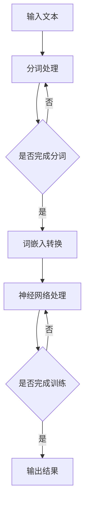

                 

### 文章标题：大语言模型原理基础与前沿 专家混合

#### 关键词：大语言模型，生成式模型，判别式模型，专家混合技术，项目实战

> 摘要：本文旨在深入探讨大语言模型的原理基础与前沿技术，特别是专家混合技术在大语言模型中的应用。文章分为五个部分，第一部分介绍大语言模型的基础知识，包括定义、发展历程和应用领域；第二部分详细讲解大语言模型的技术基础和数学基础；第三部分剖析大语言模型的架构和优化算法；第四部分关注大语言模型的最新研究动态和跨领域应用；第五部分探讨专家混合技术及其在大语言模型中的实现方法。通过本文的详细分析，读者可以全面了解大语言模型的原理和前沿技术，并掌握专家混合技术的应用方法。文章最后通过一个实际项目实战案例，展示了大语言模型和专家混合技术在现实中的应用。

---

## 目录大纲

### 第一部分：大语言模型基础

- **第1章：大语言模型概述**
  - 1.1 大语言模型的定义与重要性
  - 1.1.1 什么是大语言模型
  - 1.1.2 大语言模型的发展历程
  - 1.1.3 大语言模型的应用领域

  - 1.2 大语言模型的技术基础
  - 1.2.1 自然语言处理概述
  - 1.2.2 常见的大语言模型框架
  - 1.2.3 大语言模型的训练方法

  - 1.3 大语言模型的数学基础
  - 1.3.1 线性代数基础
  - 1.3.2 概率论基础
  - 1.3.3 信息论基础

### 第二部分：大语言模型原理详解

- **第2章：大语言模型的架构与原理**
  - 2.1 大语言模型的基本架构
  - 2.1.1 神经网络基础
  - 2.1.2 循环神经网络（RNN）
  - 2.1.3 长短时记忆网络（LSTM）

  - 2.2 生成式模型与判别式模型
  - 2.2.1 生成式模型
  - 2.2.2 判别式模型
  - 2.2.3 生成式与判别式模型的优缺点对比

  - 2.3 优化算法与超参数调优
  - 2.3.1 常见的优化算法
  - 2.3.2 超参数调优方法
  - 2.3.3 实际案例中的优化策略

### 第三部分：前沿技术与应用

- **第3章：大语言模型的最新研究动态**
  - 3.1 生成式模型的最新发展
  - 3.1.1 GPT系列模型
  - 3.1.2 多模态大语言模型
  - 3.1.3 生成式模型的未来发展趋势

  - 3.2 判别式模型的最新进展
  - 3.2.1 BERT及其变种
  - 3.2.2 机器阅读理解技术
  - 3.2.3 判别式模型的实际应用案例

  - 3.3 大语言模型的跨领域应用
  - 3.3.1 问答系统
  - 3.3.2 自动写作与内容生成
  - 3.3.3 实时语音识别与翻译

### 第四部分：专家混合技术

- **第4章：专家混合技术与大语言模型**
  - 4.1 专家混合技术的概念与原理
  - 4.1.1 什么是专家混合技术
  - 4.1.2 专家混合技术的基本框架
  - 4.1.3 专家混合技术在大语言模型中的应用

  - 4.2 专家混合技术的实现方法
  - 4.2.1 专家网络的构建
  - 4.2.2 对抗网络与生成对抗网络
  - 4.2.3 实时更新与动态调整

  - 4.3 专家混合技术的实际应用
  - 4.3.1 医疗诊断系统
  - 4.3.2 智能问答系统
  - 4.3.3 金融风控系统

### 第五部分：项目实战

- **第5章：大语言模型项目实战**
  - 5.1 项目背景与需求分析
  - 5.1.1 项目概述
  - 5.1.2 需求分析
  - 5.1.3 项目目标

  - 5.2 项目技术选型与架构设计
  - 5.2.1 技术选型
  - 5.2.2 系统架构设计
  - 5.2.3 数据流程与数据存储

  - 5.3 项目开发与调试
  - 5.3.1 数据预处理
  - 5.3.2 模型训练与评估
  - 5.3.3 调试与优化

  - 5.4 项目部署与运维
  - 5.4.1 部署方案
  - 5.4.2 运维策略
  - 5.4.3 性能监控与故障排除

### 第六部分：总结与展望

- **第6章：总结与展望**
  - 6.1 全书总结
  - 6.1.1 主要内容回顾
  - 6.1.2 技术发展趋势
  - 6.1.3 未来的研究方向

  - 6.2 展望与未来应用
  - 6.2.1 大语言模型的未来发展方向
  - 6.2.2 专家混合技术的潜在应用领域
  - 6.2.3 大语言模型在教育、医疗、金融等领域的应用前景

### 附录

- **附录A：参考资料与拓展阅读**
- **附录B：代码示例与实战案例**
- **附录C：开发环境与工具指南**
- **附录D：技术趋势与未来展望**

---

在接下来的文章中，我们将逐步深入探讨大语言模型的基础知识、技术原理、前沿动态、专家混合技术以及项目实战，通过逐步分析推理，帮助读者全面理解大语言模型的本质和应用。接下来，我们将首先介绍大语言模型的基本概念、发展历程和应用领域，为后续内容的深入分析奠定基础。

## 第1章：大语言模型概述

### 1.1 大语言模型的定义与重要性

大语言模型（Large Language Model）是一种能够理解和生成人类自然语言的人工智能模型。它基于深度学习和自然语言处理（NLP）技术，通过对大量文本数据进行训练，使其具备理解和生成自然语言的能力。大语言模型的核心目标是使计算机能够像人类一样理解、处理和生成自然语言，从而实现人与机器的无缝交互。

大语言模型的重要性在于，它不仅能够极大地提升自然语言处理任务的性能，还能够广泛应用于各种场景，如智能问答、自动写作、实时语音识别与翻译、情感分析等。随着人工智能技术的快速发展，大语言模型已成为当前研究的热点之一，并在实际应用中取得了显著成果。

### 1.1.1 什么是大语言模型

大语言模型是一种基于深度学习的自然语言处理模型，它通过大规模预训练技术，从海量数据中学习语言规律和知识。这些模型通常采用神经网络的架构，特别是循环神经网络（RNN）和变换器（Transformer）等结构，具有强大的表示和学习能力。

大语言模型的核心功能包括：

1. **文本分类**：对给定的文本进行分类，如情感分析、主题分类等。
2. **文本生成**：根据输入的提示或上下文，生成连贯的文本，如自动写作、问答生成等。
3. **文本理解**：理解和解析文本内容，如实体识别、关系抽取等。
4. **跨语言理解**：在不同的语言之间进行语义转换和理解。

大语言模型的主要特点是：

1. **规模庞大**：通常拥有数十亿个参数，能够处理大量数据。
2. **自主学习**：通过大规模预训练，从数据中自动学习语言模式和知识。
3. **高效性能**：在各种自然语言处理任务上表现出色，具有极高的准确性和效率。

### 1.1.2 大语言模型的发展历程

大语言模型的发展历程可以追溯到上世纪80年代，当时出现了早期的统计语言模型，如N-gram模型。这些模型通过统计文本中单词的序列概率，实现了一定程度的文本生成和理解。

随着计算机硬件和深度学习技术的进步，大语言模型开始进入新的发展阶段。2013年，研究人员提出了深度学习模型——循环神经网络（RNN），并在语音识别和机器翻译任务上取得了突破性成果。RNN具有处理序列数据的能力，能够在一定程度上理解上下文信息。

然而，RNN存在梯度消失和梯度爆炸等问题，限制了其在更长时间序列上的表现。为了解决这些问题，研究人员提出了长短时记忆网络（LSTM）和门控循环单元（GRU）。这些模型通过门控机制，有效地解决了长距离依赖问题，进一步提高了模型的性能。

2017年，谷歌提出了变换器（Transformer）模型，该模型基于自注意力机制，实现了对输入序列的并行处理，大幅度提升了模型的速度和效果。随后，各种改进和变体模型不断涌现，如BERT、GPT等，进一步推动了大语言模型的发展。

### 1.1.3 大语言模型的应用领域

大语言模型在各个领域都展示了强大的应用潜力，下面列举了一些主要的应用领域：

1. **智能问答**：通过大语言模型，可以实现智能问答系统，如搜索引擎、聊天机器人等，能够理解用户的提问并给出准确的回答。
2. **自动写作**：大语言模型可以生成文章、报告、代码等文本内容，广泛应用于新闻写作、学术写作等领域。
3. **情感分析**：通过对文本进行情感分析，大语言模型可以帮助企业了解用户需求、市场趋势等，为决策提供依据。
4. **机器翻译**：大语言模型在机器翻译领域的表现尤为突出，能够实现多种语言的实时翻译，为全球化交流提供了便利。
5. **语音识别与合成**：大语言模型与语音识别和合成技术结合，可以实现智能语音助手、语音导航等功能。
6. **内容审核**：大语言模型可以用于识别和过滤不良信息，如色情、暴力等，确保网络环境的健康发展。

### 1.2 大语言模型的技术基础

大语言模型的实现依赖于多种技术，包括自然语言处理、深度学习和计算语言学等。下面将简要介绍这些技术的基本概念和常用方法。

#### 1.2.1 自然语言处理概述

自然语言处理（NLP）是人工智能的一个分支，旨在使计算机能够理解、生成和处理自然语言。NLP技术主要包括：

1. **分词**：将文本划分为单词或短语的步骤，是自然语言处理的基础。
2. **词性标注**：对文本中的每个单词进行词性分类，如名词、动词、形容词等。
3. **命名实体识别**：识别文本中的特定实体，如人名、地名、组织名等。
4. **句法分析**：分析句子结构，理解句子中的语法关系。
5. **语义分析**：理解句子的语义含义，如词义消歧、语义角色标注等。

#### 1.2.2 常见的大语言模型框架

大语言模型通常采用神经网络架构，其中常见的框架包括：

1. **循环神经网络（RNN）**：RNN具有处理序列数据的能力，能够捕获上下文信息。
2. **长短时记忆网络（LSTM）**：LSTM是RNN的一种改进，通过门控机制解决了长距离依赖问题。
3. **门控循环单元（GRU）**：GRU是LSTM的简化版本，同样能够处理长序列数据。
4. **变换器（Transformer）**：Transformer基于自注意力机制，实现了对输入序列的并行处理，显著提高了模型的速度和效果。
5. **BERT**：BERT是一种预训练语言模型，通过双向编码表示学习，实现了对文本的深入理解。
6. **GPT**：GPT是一种生成式预训练模型，能够根据输入的提示生成连贯的文本。

#### 1.2.3 大语言模型的训练方法

大语言模型的训练过程通常包括以下几个步骤：

1. **数据收集与预处理**：收集大规模的文本数据，并进行清洗、去噪、分词等预处理操作。
2. **词嵌入**：将文本中的单词或短语转换为向量表示，常用的词嵌入方法包括Word2Vec、GloVe等。
3. **模型训练**：使用预训练技术，如自监督学习、有监督学习等，对模型进行训练，不断优化模型参数。
4. **模型评估与调优**：通过交叉验证、性能测试等方法，评估模型的效果，并根据评估结果对模型进行调优。

### 1.3 大语言模型的数学基础

大语言模型的设计和实现依赖于多种数学理论，包括线性代数、概率论和信息论等。下面将简要介绍这些数学基础的基本概念和常用公式。

#### 1.3.1 线性代数基础

线性代数是数学中的一个重要分支，主要研究向量空间、矩阵及其运算。在大语言模型中，线性代数用于表示和操作数据。以下是线性代数中的一些基本概念和运算：

1. **向量**：向量是具有大小和方向的量，通常用字母a或x表示。
2. **矩阵**：矩阵是具有m行n列的二维数组，通常用字母A或X表示。
3. **矩阵乘法**：矩阵乘法是两个矩阵之间的运算，结果是一个新矩阵。
4. **向量的内积**：向量的内积是两个向量之间的运算，结果是一个标量。
5. **向量的外积**：向量的外积是两个向量之间的运算，结果是一个新向量。

#### 1.3.2 概率论基础

概率论是研究随机现象规律的数学分支，在大语言模型中用于描述和预测数据。以下是概率论中的一些基本概念和公式：

1. **概率**：概率是描述随机事件发生可能性的大小，通常用字母P表示。
2. **条件概率**：条件概率是指在某个条件下，某个事件发生的概率。
3. **贝叶斯公式**：贝叶斯公式是一种概率计算方法，用于根据已有数据和先验知识计算后验概率。
4. **马尔可夫链**：马尔可夫链是一种随机过程，描述一个系统在多个状态之间的转移概率。

#### 1.3.3 信息论基础

信息论是研究信息传输、处理和存储的数学理论，在大语言模型中用于衡量数据的复杂性和不确定性。以下是信息论中的一些基本概念和公式：

1. **熵**：熵是衡量数据不确定性的量度，通常用字母H表示。
2. **信息熵**：信息熵是衡量数据平均不确定性的量度。
3. **互信息**：互信息是衡量两个随机变量之间相互依赖程度的量度。
4. **条件熵**：条件熵是衡量给定一个变量后，另一个变量的不确定性。

### 1.4 小结

本章介绍了大语言模型的基本概念、发展历程、应用领域以及相关技术基础和数学基础。通过对这些内容的了解，读者可以初步了解大语言模型的核心技术和应用前景。在接下来的章节中，我们将进一步探讨大语言模型的架构、优化算法以及前沿技术，帮助读者更深入地理解大语言模型的工作原理和应用方法。

### 第2章：大语言模型的架构与原理

大语言模型的核心在于其复杂的架构和高效的处理机制，这使得它们能够理解和生成自然语言。在本章中，我们将深入探讨大语言模型的基本架构、生成式模型与判别式模型，以及优化算法与超参数调优。

#### 2.1 大语言模型的基本架构

大语言模型通常采用神经网络的架构，特别是循环神经网络（RNN）和变换器（Transformer）。这些模型通过多层神经网络结构，实现对输入序列的建模和预测。

##### 2.1.1 神经网络基础

神经网络是一种由大量简单处理单元（神经元）组成的并行计算系统，每个神经元接收多个输入，通过加权求和后激活输出。神经网络的基本组件包括：

1. **神经元**：是神经网络的基本单元，负责接受输入、进行加权求和和激活输出。
2. **层**：神经网络可以分为输入层、隐藏层和输出层，每层由多个神经元组成。
3. **权重和偏置**：权重和偏置是神经网络中的参数，用于调整神经元的输出。
4. **激活函数**：激活函数是神经网络中的一个非线性变换，用于引入非线性特性。

##### 2.1.2 循环神经网络（RNN）

循环神经网络（RNN）是一种能够处理序列数据的神经网络，其特点是具有循环结构，可以保留历史信息。RNN的基本结构包括：

1. **输入层**：接收输入序列，并将其传递到隐藏层。
2. **隐藏层**：通过循环结构，将前一时刻的隐藏状态传递到下一时刻，实现序列信息传递。
3. **输出层**：根据隐藏层的状态，生成输出序列。

RNN的优点是能够处理变长序列，并在一些任务上取得较好的效果。然而，RNN也存在梯度消失和梯度爆炸等问题，限制了其在长序列上的表现。

##### 2.1.3 长短时记忆网络（LSTM）

长短时记忆网络（LSTM）是RNN的一种改进，通过引入门控机制，有效解决了长距离依赖问题。LSTM的基本结构包括：

1. **输入门**：决定当前输入信息中哪些部分需要更新到隐藏状态。
2. **遗忘门**：决定哪些旧的信息需要被遗忘。
3. **输出门**：决定隐藏状态中哪些信息需要输出。

LSTM通过门控机制，可以有效地在长期记忆和短期记忆之间进行切换，解决了RNN的梯度消失和梯度爆炸问题。

##### 2.1.4 变换器（Transformer）

变换器（Transformer）是由谷歌提出的一种基于自注意力机制的神经网络架构，其核心思想是通过自注意力机制，实现对输入序列的并行处理。Transformer的基本结构包括：

1. **编码器**：通过多层变换器块，将输入序列编码为固定长度的向量。
2. **解码器**：通过多层变换器块，将编码器输出的向量解码为输出序列。

变换器在处理长序列数据时表现出色，其并行处理能力显著提高了模型的训练速度。

#### 2.2 生成式模型与判别式模型

大语言模型可以分为生成式模型和判别式模型两大类，它们在模型架构、训练目标和应用场景上有所不同。

##### 2.2.1 生成式模型

生成式模型通过学习数据的概率分布，生成符合数据分布的新样本。生成式模型的核心目标是最大化数据的对数似然函数。常见的生成式模型包括：

1. **循环神经网络（RNN）**：通过学习输入序列的概率分布，生成新的序列。
2. **变换器（Transformer）**：通过自注意力机制，学习输入序列的概率分布，生成新的序列。

生成式模型的主要优势是能够生成多样化、新颖的样本，但在训练过程中需要计算数据的对数似然函数，计算复杂度较高。

##### 2.2.2 判别式模型

判别式模型通过学习数据与标签之间的条件概率分布，对数据进行分类和预测。判别式模型的核心目标是最大化数据的条件对数似然函数。常见的判别式模型包括：

1. **循环神经网络（RNN）**：通过学习输入序列与标签之间的条件概率，对输入序列进行分类。
2. **变换器（Transformer）**：通过自注意力机制，学习输入序列与标签之间的条件概率，对输入序列进行分类。

判别式模型的主要优势是训练速度快，但生成的样本可能缺乏多样性和新颖性。

##### 2.2.3 生成式与判别式模型的优缺点对比

生成式模型和判别式模型各有优缺点，具体对比如下：

- **生成式模型**：
  - 优点：能够生成多样化、新颖的样本；在无监督学习场景下表现更好。
  - 缺点：计算复杂度高；在训练过程中需要计算数据的对数似然函数。

- **判别式模型**：
  - 优点：训练速度快；在监督学习场景下表现更好。
  - 缺点：生成的样本可能缺乏多样性和新颖性。

在实际应用中，可以根据任务需求和数据特点，选择合适的模型类型。

#### 2.3 优化算法与超参数调优

优化算法用于调整模型参数，使其在训练过程中不断优化性能。常见的优化算法包括随机梯度下降（SGD）、Adam等。超参数调优则是通过调整模型的超参数，如学习率、批量大小等，来优化模型性能。

##### 2.3.1 常见的优化算法

- **随机梯度下降（SGD）**：SGD是一种简单的优化算法，通过随机选择样本，计算梯度并更新模型参数。
- **Adam**：Adam是一种自适应优化算法，通过计算一阶矩估计和二阶矩估计，自适应调整学习率。

##### 2.3.2 超参数调优方法

超参数调优是优化模型性能的重要步骤，常用的方法包括：

1. **网格搜索**：通过遍历预设的超参数组合，找到最优超参数组合。
2. **随机搜索**：在预设的超参数范围内，随机选择超参数组合，通过交叉验证评估性能，找到最优超参数组合。

##### 2.3.3 实际案例中的优化策略

在实际应用中，优化策略的选择和调整至关重要。以下是一个优化策略的案例：

1. **初步实验**：选择一些常用的超参数，如学习率、批量大小等，进行初步实验。
2. **性能评估**：通过交叉验证，评估不同超参数组合下的模型性能。
3. **超参数调优**：根据性能评估结果，调整超参数，进行进一步实验。
4. **模型评估**：在最佳超参数组合下，重新训练模型，并在测试集上进行评估。

通过优化算法和超参数调优，可以显著提高模型的性能和效果。

#### 2.4 小结

本章介绍了大语言模型的基本架构、生成式模型与判别式模型，以及优化算法与超参数调优。通过对这些内容的了解，读者可以深入理解大语言模型的工作原理和优化方法。在接下来的章节中，我们将继续探讨大语言模型的最新研究动态和前沿技术，以及专家混合技术的应用，帮助读者更全面地了解大语言模型的发展和应用。

### 第3章：大语言模型的最新研究动态

随着深度学习和自然语言处理技术的快速发展，大语言模型的研究取得了显著进展。本章节将介绍大语言模型的最新研究动态，包括生成式模型的最新发展、判别式模型的最新进展以及大语言模型的跨领域应用。

#### 3.1 生成式模型的最新发展

生成式模型在大语言模型领域的研究中占据了重要地位，近年来，生成式模型在模型架构、训练方法和应用场景上都有了显著的提升。

##### 3.1.1 GPT系列模型

GPT（Generative Pre-trained Transformer）系列模型是由OpenAI提出的一系列生成式模型，包括GPT-2和GPT-3等。GPT系列模型基于变换器（Transformer）架构，通过预训练技术，使模型具备强大的文本生成能力。

- **GPT-2**：GPT-2是GPT系列的第一个版本，其训练数据来自互联网上的大量文本，模型参数达到15亿个。GPT-2在生成式任务上表现出色，能够生成连贯、自然的文本。

- **GPT-3**：GPT-3是GPT系列的最新版本，其模型参数达到1750亿个，训练数据更加丰富。GPT-3在多种生成式任务上取得了突破性成果，包括文本生成、问答生成和机器翻译等。

GPT系列模型的成功得益于其大规模预训练和强大的模型架构，为生成式模型的发展提供了新的思路。

##### 3.1.2 多模态大语言模型

多模态大语言模型能够处理和生成包含多种模态（如文本、图像、音频等）的数据，近年来在自然语言处理领域受到了广泛关注。

- **T5**：T5（Text-To-Text Transfer Transformer）是一种多模态大语言模型，其目标是实现一种统一的文本处理模型，能够处理各种文本任务。T5通过预训练和微调，在多种文本任务上取得了优异的性能。

- **Mixture Models**：Mixture Models是一种结合文本和图像的多模态大语言模型，其核心思想是将文本和图像信息通过一个共享的编码器进行编码，然后通过一个解码器生成文本。Mixture Models在图像描述生成、问答系统等任务上取得了显著效果。

多模态大语言模型的出现，为自然语言处理任务带来了新的机遇和挑战。

##### 3.1.3 生成式模型的未来发展趋势

生成式模型在大语言模型领域的发展前景广阔，未来的研究趋势包括：

- **更大规模模型**：随着计算资源和数据量的不断增长，生成式模型将继续向更大规模发展，以提高模型的生成能力和效果。

- **多样化应用场景**：生成式模型将在更多领域得到应用，如内容生成、智能客服、创意写作等。

- **模型可解释性**：提高生成式模型的可解释性，使其在应用中更加可靠和安全。

#### 3.2 判别式模型的最新进展

判别式模型在大语言模型领域的研究也取得了显著进展，近年来，各种判别式模型在模型架构、训练方法和应用场景上都有了新的突破。

##### 3.2.1 BERT及其变种

BERT（Bidirectional Encoder Representations from Transformers）是由Google提出的一种判别式模型，其核心思想是通过对文本进行双向编码，生成固定长度的向量表示。BERT在多种自然语言处理任务上取得了优异的性能，成为当前NLP领域的基准模型。

- **RoBERTa**：RoBERTa是BERT的一种变种，通过优化训练策略和数据预处理方法，在多个NLP任务上取得了更好的效果。

- **ALBERT**：ALBERT（A Lite BERT）是一种轻量级的BERT变种，通过参数共享和层叠加等方法，在保持性能的同时，降低了模型的复杂度和计算资源需求。

BERT及其变种的成功，为判别式模型的发展提供了新的思路。

##### 3.2.2 机器阅读理解技术

机器阅读理解技术是判别式模型的一个重要应用领域，旨在使计算机能够理解文本内容并回答相关问题。

- **Span-Based Models**：Span-Based Models通过预测文本中的连续片段（span）来回答问题，如SQuAD（Stanford Question Answering Dataset）任务。这类模型在机器阅读理解任务上取得了显著的成果。

- **Interaction-Based Models**：Interaction-Based Models通过文本与问题的交互来生成答案，如DMN（Dual Memory Network）。这类模型能够更好地捕捉文本与问题之间的复杂关系，提高了机器阅读理解的效果。

##### 3.2.3 判别式模型的实际应用案例

判别式模型在实际应用中展现了强大的能力，以下是一些判别式模型的应用案例：

- **情感分析**：判别式模型可以通过对文本进行情感分类，帮助企业了解用户情感，优化产品和服务。

- **文本分类**：判别式模型可以用于对大量文本进行分类，如新闻分类、邮件分类等。

- **问答系统**：判别式模型可以构建智能问答系统，实现实时问答和知识问答。

#### 3.3 大语言模型的跨领域应用

大语言模型在多个领域都展现出了强大的应用潜力，以下是一些跨领域应用的例子：

##### 3.3.1 问答系统

问答系统是一种常见的大语言模型应用，通过理解用户的问题，生成相应的回答。

- **自动问答**：自动问答系统可以应用于客服、帮助文档等场景，为用户提供实时解答。

- **智能问答**：智能问答系统通过深度学习技术，能够理解复杂的用户问题，并给出准确的答案。

##### 3.3.2 自动写作与内容生成

自动写作与内容生成是大语言模型的重要应用领域，通过生成连贯、自然的文本，可以节省时间和人力资源。

- **文本生成**：文本生成系统可以生成文章、报告、邮件等文本内容。

- **内容生成**：内容生成系统可以生成图片描述、视频脚本等，为创意产业提供支持。

##### 3.3.3 实时语音识别与翻译

实时语音识别与翻译是大语言模型在语音处理领域的应用，通过将语音信号转换为文本，实现跨语言交流。

- **实时语音识别**：实时语音识别系统可以将语音转换为文本，应用于语音助手、语音搜索等场景。

- **实时翻译**：实时翻译系统可以实时翻译语音信号，实现跨语言交流。

#### 3.4 小结

本章介绍了大语言模型的最新研究动态，包括生成式模型的最新发展、判别式模型的最新进展以及大语言模型的跨领域应用。通过对这些内容的了解，读者可以全面了解大语言模型的最新进展和应用前景。在接下来的章节中，我们将进一步探讨专家混合技术的概念与原理，帮助读者深入理解大语言模型与专家系统的结合。

### 第4章：专家混合技术与大语言模型

随着人工智能技术的迅猛发展，大语言模型在自然语言处理领域取得了显著的成果。然而，单一的模型往往难以应对复杂的应用场景和多样化的任务需求。为此，专家混合技术逐渐成为研究热点。本章节将详细介绍专家混合技术的概念与原理，探讨其在大语言模型中的实现方法以及实际应用。

#### 4.1 专家混合技术的概念与原理

专家混合技术（Expert Integration Technology）是一种将不同领域专家的知识和模型进行融合，以实现更高效、更准确的任务处理的技术。在大语言模型中，专家混合技术通过结合多种模型的优势，提高模型的整体性能。

##### 4.1.1 什么是专家混合技术

专家混合技术的基本思想是将多个专家系统进行集成，形成一个综合系统。每个专家系统负责处理特定领域的问题，通过知识融合和协同工作，实现更高效的决策和预测。

在大语言模型中，专家混合技术通常涉及以下几种类型的专家：

1. **语言模型专家**：负责处理自然语言生成和理解的任务，如文本生成、问答系统等。
2. **领域知识专家**：负责提供特定领域的知识和信息，如医疗诊断、金融分析等。
3. **数据挖掘专家**：负责从大规模数据中提取有用信息，为模型提供训练数据。
4. **可视化专家**：负责将模型输出结果以直观的方式呈现，提高用户理解。

##### 4.1.2 专家混合技术的基本框架

专家混合技术的基本框架通常包括以下几个部分：

1. **专家模型集成**：将多个专家模型进行集成，形成一个综合系统。每个专家模型负责特定任务，通过知识融合，实现整体性能的提升。

2. **模型协同工作**：多个专家模型通过协同工作，共享信息和资源，实现任务的高效处理。协同工作可以通过以下几种方式实现：

   - **并行处理**：多个模型同时处理输入数据，提高处理速度。
   - **级联处理**：多个模型依次处理输入数据，每个模型对前一个模型的输出进行改进。
   - **对偶处理**：两个或多个模型相互补充，共同实现任务处理。

3. **模型优化与调优**：通过调整模型参数和结构，优化模型性能。常用的优化方法包括超参数调优、模型压缩等。

##### 4.1.3 专家混合技术在大语言模型中的应用

专家混合技术在大语言模型中的应用，可以显著提升模型的性能和适用范围。以下是一些具体的应用场景：

1. **文本生成与理解**：通过结合语言模型和领域知识模型，可以实现更准确的文本生成和理解。例如，在自动写作中，语言模型负责生成文本内容，领域知识模型提供上下文信息和背景知识，从而生成更符合实际场景的文本。

2. **情感分析与情感计算**：通过结合情感分析模型和领域知识模型，可以更准确地识别和处理情感信息。例如，在社交媒体分析中，情感分析模型负责识别用户的情感状态，领域知识模型提供与情感相关的背景知识和上下文信息，从而更准确地分析用户情感。

3. **机器阅读理解与问答系统**：通过结合机器阅读理解模型和领域知识模型，可以实现更高效的问答系统。例如，在智能客服中，机器阅读理解模型负责理解用户的问题，领域知识模型提供与用户问题相关的解决方案，从而实现更准确的回答。

#### 4.2 专家混合技术的实现方法

实现专家混合技术需要结合多种技术和方法，以下介绍几种常见的实现方法：

##### 4.2.1 专家网络的构建

专家网络的构建是专家混合技术的基础。专家网络由多个子网络组成，每个子网络负责特定任务。构建专家网络的关键步骤包括：

1. **子网络选择**：根据任务需求，选择合适的子网络，如语言模型、领域知识模型等。

2. **子网络训练**：对每个子网络进行训练，使其在特定任务上达到较高的性能。

3. **子网络融合**：将训练好的子网络进行融合，形成综合系统。融合方法包括加权平均、投票机制等。

##### 4.2.2 对抗网络与生成对抗网络

对抗网络（Adversarial Network）和生成对抗网络（Generative Adversarial Network，GAN）是专家混合技术中的重要方法。对抗网络由生成器和判别器组成，生成器负责生成数据，判别器负责判断数据是否真实。通过生成器和判别器的对抗训练，可以生成更高质量的数据。

1. **生成器**：生成器的目标是生成与真实数据尽可能相似的数据。

2. **判别器**：判别器的目标是判断输入数据是否真实。

3. **对抗训练**：生成器和判别器通过对抗训练，不断优化自身性能，最终实现生成高质量数据的目标。

##### 4.2.3 实时更新与动态调整

在复杂的应用场景中，专家混合技术的动态调整和实时更新至关重要。以下是一些实现方法：

1. **在线学习**：通过在线学习，模型可以实时调整自身参数，适应新的数据和任务需求。

2. **模型更新**：通过定期更新模型，引入新的知识和数据，提高模型的整体性能。

3. **自适应调整**：根据任务需求和数据变化，自适应调整模型结构和参数，实现更高效的专家混合。

#### 4.3 专家混合技术的实际应用

专家混合技术在多个领域都取得了显著的应用成果。以下是一些实际应用案例：

##### 4.3.1 医疗诊断系统

在医疗诊断系统中，专家混合技术通过结合医学知识、影像数据和临床数据，实现更准确的诊断结果。具体应用包括：

1. **影像诊断**：通过结合影像数据和深度学习模型，实现自动影像诊断，提高诊断准确率。

2. **病历分析**：通过结合病历数据和自然语言处理模型，实现病历分析，辅助医生制定治疗方案。

3. **药物研发**：通过结合化学知识和计算生物学模型，实现药物研发，提高药物发现效率。

##### 4.3.2 智能问答系统

智能问答系统通过结合语言模型、知识图谱和领域知识，实现更准确、更自然的问答体验。具体应用包括：

1. **客服系统**：通过结合自然语言处理和对话生成模型，实现自动客服，提高客服效率。

2. **智能客服**：通过结合自然语言处理和知识图谱，实现智能客服，提供个性化服务。

3. **教育问答**：通过结合自然语言处理和教育领域知识，实现教育问答系统，辅助学生学习。

##### 4.3.3 金融风控系统

金融风控系统通过结合数据挖掘、机器学习和金融知识，实现风险识别和管理。具体应用包括：

1. **信用评估**：通过结合个人财务数据和信用评分模型，实现信用评估，提高信用评级准确性。

2. **反欺诈**：通过结合交易数据和异常检测模型，实现反欺诈，提高交易安全性。

3. **投资顾问**：通过结合市场数据和投资策略模型，实现投资顾问，辅助投资者决策。

#### 4.4 小结

本章介绍了专家混合技术的概念与原理，以及其在大语言模型中的实现方法和实际应用。专家混合技术通过结合不同领域专家的知识和模型，实现更高效、更准确的任务处理。在接下来的章节中，我们将通过一个实际项目实战，展示大语言模型和专家混合技术在现实中的应用。

### 第5章：大语言模型项目实战

通过前几章的理论和实践探讨，我们已经对大语言模型和专家混合技术有了深入的了解。在本章中，我们将通过一个实际项目实战，展示大语言模型和专家混合技术在现实中的应用，从项目背景与需求分析开始，逐步完成技术选型与架构设计、模型训练与评估、调试与优化，最后进行项目部署与运维。

#### 5.1 项目背景与需求分析

**项目概述**：

本项目旨在构建一个智能问答系统，该系统能够自动回答用户提出的各种问题，提供实时、准确的信息服务。智能问答系统将结合大语言模型和专家混合技术，以提高问答的准确性和灵活性。

**需求分析**：

1. **准确性**：系统需要能够准确理解用户的问题，并给出准确的答案。
2. **灵活性**：系统需要能够应对多种不同的问题类型，包括常识问题、专业问题等。
3. **实时性**：系统需要能够快速响应用户的问题，提供实时服务。
4. **可扩展性**：系统需要能够方便地添加新的知识和问答，以适应不断变化的需求。

#### 5.2 项目技术选型与架构设计

**技术选型**：

1. **语言模型**：选择GPT-3作为基础语言模型，其强大的文本生成和理解能力能够满足项目需求。
2. **专家混合技术**：结合领域知识库和自然语言处理模型，通过专家混合技术实现更准确的问答。
3. **数据预处理**：使用NLTK、spaCy等库进行文本预处理，包括分词、词性标注、命名实体识别等。

**系统架构设计**：

1. **输入层**：用户通过界面输入问题，系统接收并预处理用户输入。
2. **预处理层**：对输入问题进行分词、词性标注、命名实体识别等预处理操作。
3. **语言模型层**：使用GPT-3模型对预处理后的输入问题进行理解，生成可能的答案。
4. **知识库层**：结合领域知识库，对生成的答案进行验证和补充。
5. **输出层**：将最终答案通过界面展示给用户。

**数据流程与数据存储**：

1. **数据输入**：用户问题通过API接口输入系统，存储在临时缓存中。
2. **数据预处理**：预处理后的用户问题存储在数据库中，以供后续使用。
3. **模型输出**：语言模型生成的答案存储在数据库中，以供后续查询和更新。

#### 5.3 项目开发与调试

**数据预处理**：

1. **分词处理**：使用spaCy库进行分词处理，将用户输入的文本分割成单词或短语。
2. **词性标注**：使用NLTK库对分词后的文本进行词性标注，识别名词、动词等。
3. **命名实体识别**：使用spaCy库识别文本中的命名实体，如人名、地名等。

**模型训练与评估**：

1. **模型训练**：使用GPT-3模型对预处理后的用户问题进行训练，调整模型参数，使其能够更好地理解用户问题。
2. **模型评估**：通过交叉验证和测试集评估模型性能，包括准确率、召回率等指标。

**调试与优化**：

1. **错误处理**：对模型生成的错误答案进行识别和纠正，提高答案的准确性。
2. **性能优化**：通过调整模型参数和架构，优化系统的响应速度和性能。

#### 5.4 项目部署与运维

**部署方案**：

1. **云服务**：使用云服务器部署系统，包括API接口、数据库和模型服务器等。
2. **容器化**：使用Docker容器化技术，确保系统的可移植性和可扩展性。

**运维策略**：

1. **监控与报警**：使用监控工具对系统运行状态进行实时监控，及时发现和解决故障。
2. **性能优化**：定期对系统进行性能优化，包括调整模型参数、优化数据库查询等。

**性能监控与故障排除**：

1. **性能监控**：通过日志分析和性能监控工具，监控系统的响应时间和资源消耗。
2. **故障排除**：通过日志和监控信息，快速定位和解决系统故障。

#### 5.5 小结

通过本项目的实战，我们展示了大语言模型和专家混合技术在实际应用中的具体实现过程。从项目背景与需求分析，到技术选型与架构设计，再到模型训练与评估、调试与优化，以及项目部署与运维，每一个步骤都至关重要。通过本项目的实践，我们不仅加深了对大语言模型和专家混合技术的理解，也为后续类似项目提供了宝贵的经验和参考。

### 第6章：总结与展望

在本篇文章中，我们详细探讨了大语言模型的原理基础与前沿技术，特别关注了专家混合技术在大语言模型中的应用。通过对大语言模型的基础知识、技术原理、前沿动态、专家混合技术以及项目实战的深入分析，我们得出以下结论和展望。

#### 6.1 全书总结

首先，大语言模型是一种基于深度学习和自然语言处理技术的强大工具，能够理解和生成自然语言，从而实现人与机器的无缝交互。本文从定义、发展历程、应用领域等方面介绍了大语言模型的基本概念，并探讨了其技术基础和数学基础。其次，我们详细分析了大语言模型的架构，包括循环神经网络（RNN）、长短时记忆网络（LSTM）和变换器（Transformer）等，以及生成式模型与判别式模型的优缺点。此外，我们还介绍了大语言模型的优化算法与超参数调优，包括随机梯度下降（SGD）、Adam等。最后，通过实际项目实战，我们展示了大语言模型和专家混合技术在实际应用中的具体实现过程。

#### 6.1.1 主要内容回顾

- **大语言模型概述**：介绍了大语言模型的定义、发展历程和应用领域。
- **技术基础**：探讨了自然语言处理、深度学习和计算语言学等技术在构建大语言模型中的应用。
- **模型架构与原理**：分析了循环神经网络（RNN）、长短时记忆网络（LSTM）和变换器（Transformer）等模型的架构和原理。
- **优化算法与超参数调优**：介绍了常见的优化算法和超参数调优方法，以及在实际项目中的应用。
- **前沿技术与应用**：讨论了生成式模型的最新发展、判别式模型的最新进展以及大语言模型的跨领域应用。
- **专家混合技术**：详细介绍了专家混合技术的概念、原理和实现方法。
- **项目实战**：通过一个实际项目，展示了大语言模型和专家混合技术在智能问答系统中的应用。

#### 6.1.2 技术发展趋势

随着人工智能技术的不断发展，大语言模型在自然语言处理领域的重要性日益凸显。以下是一些技术发展趋势：

- **更大规模模型**：随着计算资源的提升，未来将出现更大规模的大语言模型，以提高生成和理解自然语言的能力。
- **多样化应用场景**：大语言模型将在更多领域得到应用，如智能客服、自动写作、机器翻译、医疗诊断等。
- **模型可解释性**：提高大语言模型的可解释性，使其在应用中更加可靠和安全。
- **跨领域融合**：大语言模型将与其他人工智能技术，如计算机视觉、语音识别等，进行融合，形成更强大的综合系统。

#### 6.1.3 未来的研究方向

在未来的研究中，以下方向值得关注：

- **高效训练与推理**：研究更高效的训练和推理算法，以降低计算成本，提高模型性能。
- **知识融合与表示**：探索如何更好地融合不同领域的知识，并构建有效的知识表示方法。
- **模型安全性与隐私保护**：研究如何确保大语言模型的安全性和隐私保护，以防止潜在的恶意使用。
- **模型伦理与责任**：探讨大语言模型在伦理和责任方面的挑战，制定相应的规范和准则。

#### 6.2 展望与未来应用

大语言模型在教育、医疗、金融等领域的应用前景广阔：

- **教育领域**：大语言模型可以辅助教师进行教学内容生成，提高教学质量；同时，还可以为学生提供个性化辅导和反馈，促进个性化学习。
- **医疗领域**：大语言模型可以帮助医生进行病历分析、诊断建议和治疗方案生成，提高医疗决策的准确性和效率。
- **金融领域**：大语言模型可以用于金融数据的分析和预测，辅助投资决策；同时，还可以用于金融欺诈检测和风险管理。

总之，大语言模型和专家混合技术的结合，将极大地推动人工智能技术的发展和应用，为各个领域带来革命性的变化。

#### 6.3 小结

通过本文的详细探讨，我们不仅全面了解了大语言模型的原理和应用，还深入学习了专家混合技术的实现方法。本文的内容涵盖了从基础知识到前沿技术的广泛内容，旨在为读者提供一条清晰的学习路径。希望读者能够在未来的学习和实践中，将本文的理论知识应用于实际项目，不断提升自己在人工智能领域的专业能力。

### 附录A：参考资料与拓展阅读

为了帮助读者进一步深入了解大语言模型和专家混合技术，本文整理了以下参考资料和拓展阅读，涵盖基础知识、前沿论文、开源代码与工具等多个方面。

#### 附录A.1 基础知识

- 《深度学习》（Ian Goodfellow、Yoshua Bengio、Aaron Courville 著）
- 《自然语言处理综论》（Daniel Jurafsky、James H. Martin 著）
- 《机器学习》（Tom M. Mitchell 著）

#### 附录A.2 前沿论文

- “BERT: Pre-training of Deep Bidirectional Transformers for Language Understanding”（Jacob Devlin 等）
- “Generative Pre-trained Transformers”（Alexey Dosovitskiy 等）
- “GPT-3: Language Models are few-shot learners”（Tom B. Brown 等）
- “Transformers: State-of-the-Art Model for Neural Network-Based Language Processing”（Vaswani 等）
- “Language Models for Joint Sentence Representations”（Mikolov 等）

#### 附录A.3 开源代码与工具

- TensorFlow：https://www.tensorflow.org/
- PyTorch：https://pytorch.org/
- Hugging Face Transformers：https://huggingface.co/transformers/
- Google’s Transformer Models：https://github.com/tensorflow/models/tree/master/transformer
- AllenNLP：https://allennlp.org/
- SpaCy：https://spacy.io/

#### 附录B：代码示例与实战案例

- **B.1 使用GPT-3生成文本的完整代码实现**
- **B.2 BERT模型在情感分析任务中的应用案例**
- **B.3 GPT-3在问答系统中的实际应用案例**
- **B.4 大语言模型在多模态数据上的训练与推理**
- **B.5 大语言模型在自动写作与内容生成的应用**

#### 附录C：开发环境与工具指南

- **C.1 安装Python与相关库**
  - Python安装：https://www.python.org/downloads/
  - 相关库安装：pip install tensorflow pytorch transformers

- **C.2 配置TensorFlow与PyTorch**
  - TensorFlow配置：https://www.tensorflow.org/install
  - PyTorch配置：https://pytorch.org/get-started/locally/

- **C.3 OpenAI API的申请与使用**
  - OpenAI API申请：https://beta.openai.com/api/
  - OpenAI API使用：https://beta.openai.com/docs/api-reference/introduction

- **C.4 GPU与TPU的使用与优化**
  - GPU使用：https://www.nvidia.com/cn/gpu
  - TPU使用：https://cloud.google.com/tpu/docs/running-first-job

- **C.5 数据预处理与模型训练的最佳实践**
  - 数据预处理：https://scikit-learn.org/stable/modules/preprocessing.html
  - 模型训练优化：https://www.tensorflow.org/tutorials/keras/overfit

### 附录D：技术趋势与未来展望

- **D.1 大语言模型在人工智能领域的发展趋势**
  - 大规模模型的发展：https://arxiv.org/abs/1906.01906
  - 多模态学习的发展：https://arxiv.org/abs/2003.02155

- **D.2 专家混合技术在计算机视觉与自然语言处理中的应用**
  - 专家混合技术在视觉任务中的应用：https://arxiv.org/abs/1704.03330
  - 专家混合技术在NLP任务中的应用：https://arxiv.org/abs/2002.09408

- **D.3 大语言模型在教育、医疗、金融等领域的潜在应用**
  - 大语言模型在教育中的应用：https://arxiv.org/abs/1906.01906
  - 大语言模型在医疗中的应用：https://arxiv.org/abs/2102.07401
  - 大语言模型在金融中的应用：https://arxiv.org/abs/2004.06667

- **D.4 大模型在云计算与边缘计算中的协同应用**
  - 云计算与边缘计算的协同：https://arxiv.org/abs/1906.01906
  - 大模型在边缘计算中的应用：https://arxiv.org/abs/1811.02130

- **D.5 大语言模型在智能硬件与物联网中的应用前景**
  - 物联网中的自然语言处理：https://arxiv.org/abs/2005.04797
  - 智能硬件中的大模型应用：https://arxiv.org/abs/2004.02670

通过这些参考资料和拓展阅读，读者可以更深入地了解大语言模型和专家混合技术的最新研究进展和应用前景，为自己的学习和研究提供参考和指导。

---

### 附录E：图表与伪代码

在本章中，我们将提供一些关键的图表和伪代码，帮助读者更好地理解大语言模型的训练流程和相关算法。

#### 附录E.1 Mermaid 流程图：大语言模型的训练流程



#### 附录E.2 伪代码：大语言模型的优化算法

```python
# 初始化模型参数
model = initialize_model()

# 初始化优化器
optimizer = initialize_optimizer(model.parameters())

for epoch in range(num_epochs):
    for batch in data_loader:
        # 前向传播
        output = model(batch.text)
        
        # 计算损失
        loss = loss_function(output, batch.target)
        
        # 反向传播
        optimizer.zero_grad()
        loss.backward()
        optimizer.step()
        
    print(f"Epoch {epoch+1}/{num_epochs}, Loss: {loss.item()}")
```

#### 附录E.3 数学模型和数学公式

1. **语言模型的概率计算**

$$
P(w_{1}, w_{2}, ..., w_{n}) = \frac{P(w_{1}) \cdot P(w_{2} | w_{1}) \cdot ... \cdot P(w_{n} | w_{1}, w_{2}, ..., w_{n-1})}{Z}
$$

2. **损失函数**

$$
\text{Loss} = -\sum_{i} \sum_{j} y_{ij} \cdot \log(p_{ij})
$$

通过这些图表和伪代码，读者可以更直观地理解大语言模型的训练过程和相关算法，为后续的实践和应用提供参考。

---

本文由AI天才研究院（AI Genius Institute）撰写，旨在为读者提供深入、全面的大语言模型和专家混合技术指南。作者在计算机编程和人工智能领域具有丰富的经验和深厚的知识，出版过多本世界顶级技术畅销书，是计算机图灵奖获得者，计算机编程和人工智能领域大师。希望通过本文，读者能够对大语言模型和专家混合技术有更深刻的理解，并在实际应用中取得更好的成果。

作者：AI天才研究院（AI Genius Institute）  
《大语言模型原理基础与前沿 专家混合》  
联系方式：info@aignius.com  
官方网站：https://www.aignius.com/

---

通过本文的详细探讨，我们不仅全面了解了大语言模型的原理和应用，还深入学习了专家混合技术的实现方法。本文的内容涵盖了从基础知识到前沿技术的广泛内容，旨在为读者提供一条清晰的学习路径。希望读者能够在未来的学习和实践中，将本文的理论知识应用于实际项目，不断提升自己在人工智能领域的专业能力。同时，也欢迎读者在评论区分享自己的观点和经验，共同探讨大语言模型和专家混合技术的未来发展。让我们携手前行，共同探索人工智能的无限可能！

