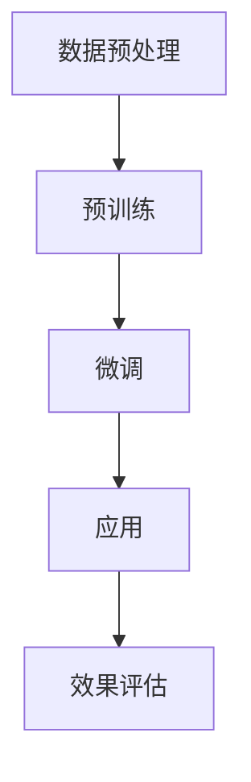

                 

### 文章标题: 大语言模型原理基础与前沿 基于强化学习的微调和基于人类偏好的预训练

---

#### 关键词：大语言模型，预训练，微调，强化学习，自然语言处理，人工智能

---

#### 摘要：
本文从基础理论入手，详细介绍了大语言模型的定义、背景、核心组成部分、工作原理以及主要应用场景。随后，深入探讨了大语言模型的挑战与未来趋势，包括计算资源需求、模型解释性、跨领域适应性等方面。在此基础上，文章介绍了强化学习与微调、基于人类偏好的预训练等前沿技术，以及多模态语言模型和生成对抗网络（GAN）的应用。通过具体的项目实战和案例分析，展示了大语言模型在文本生成、机器翻译、问答系统、文本分类与情感分析等领域的实际应用。最后，文章探讨了大语言模型的优化与调优、安全与伦理问题，以及未来的发展趋势。本文旨在为广大读者提供一个全面、深入的大语言模型指南，助力读者掌握这一前沿技术。

---

### 第1章: 大语言模型概述

#### 1.1 大语言模型的定义与背景

大语言模型（Large Language Model）是一种基于深度学习的自然语言处理（Natural Language Processing, NLP）模型。其核心目的是理解和生成自然语言，从而实现与人类更自然的交互。大语言模型在自然语言处理领域取得了显著的成果，如文本生成、机器翻译、问答系统、文本分类和情感分析等。

**定义**：大语言模型是一种能够预测下一个词的概率，并通过大量无标签文本数据进行预训练，然后再在特定任务上有标签数据集上进行微调的深度学习模型。

**背景**：随着计算能力的提升和深度学习技术的进步，大语言模型在自然语言处理领域逐渐崭露头角。2018年，谷歌推出了BERT（Bidirectional Encoder Representations from Transformers），这是第一个成功应用Transformer架构的大语言模型。BERT的提出标志着大语言模型进入了一个新的时代，其优异的性能在多个NLP任务上引起了广泛关注。此后，OpenAI的GPT系列模型、Facebook的RoBERTa等相继推出，进一步推动了大语言模型的发展。

#### 1.2 大语言模型的核心组成部分

大语言模型的核心组成部分主要包括预训练、微调和应用。

**预训练**：预训练是大规模神经网络模型的一种训练方法，其基本思想是首先在大规模无标签文本数据集上对模型进行预训练，使其具备一定的语言理解能力。在预训练过程中，模型通过学习文本中的上下文关系，逐步提高对语言的理解。预训练的目的在于让模型能够自动捕捉语言中的规则和模式，从而在后续的任务中表现出色。

**微调**：微调是在预训练基础上，将模型应用于特定任务，并在有标签数据集上进一步训练的过程。微调的目的是让模型在特定任务上达到更高的性能。通过微调，模型可以学习到特定任务的特征和规律，从而提高任务完成效果。微调过程通常包括数据预处理、模型调整和性能评估等步骤。

**应用**：预训练和微调完成后，大语言模型可以应用于各种NLP任务，如文本生成、机器翻译、问答系统、文本分类和情感分析等。在实际应用中，大语言模型通常需要与特定的任务数据集进行结合，通过微调和优化，使其在特定任务上达到最优性能。

#### 1.3 大语言模型的工作原理

大语言模型的工作原理主要基于自注意力机制（Self-Attention Mechanism）和Transformer架构（Transformer Architecture）。

**自注意力机制**：自注意力机制是Transformer架构的核心组成部分，通过计算词与词之间的相对重要性来生成代表整个句子的向量。在自注意力机制中，每个词都会被映射为一个向量，然后通过计算这些向量之间的点积来计算它们之间的相对重要性。自注意力机制使得模型能够更好地捕捉句子中的依赖关系，从而提高模型的性能。

**Transformer架构**：Transformer架构是一种基于自注意力机制的深度学习模型，用于处理序列数据。与传统的循环神经网络（Recurrent Neural Network, RNN）相比，Transformer架构具有并行计算优势，可以显著提高模型的训练速度。在Transformer架构中，输入序列首先通过嵌入层（Embedding Layer）转换为向量表示，然后通过自注意力层（Self-Attention Layer）和前馈层（Feedforward Layer）进行多层处理，最终输出预测结果。

#### 1.4 大语言模型的主要应用场景

大语言模型的主要应用场景包括文本生成、机器翻译、问答系统、文本分类和情感分析等。

**文本生成**：大语言模型可以生成高质量的文章、摘要、对话等文本内容。通过微调和优化，模型可以生成更加自然、流畅的文本。

**机器翻译**：大语言模型可以自动翻译文本到其他语言，如中英文互译、多语言翻译等。在机器翻译任务中，模型通过学习大量的双语数据，逐步提高翻译的准确性和自然性。

**问答系统**：大语言模型可以构建基于用户查询的回答系统，如自动回答特定的事实问题、生成新的答案等。在问答系统中，模型通过理解用户查询和上下文，生成准确的回答。

**文本分类**：大语言模型可以用于文本分类任务，如新闻分类、情感分类等。通过微调和优化，模型可以学习到不同类别之间的特征差异，从而提高分类的准确性和鲁棒性。

**情感分析**：大语言模型可以分析文本的情感倾向，如正面情感、负面情感等。在情感分析任务中，模型通过理解文本中的情感词和情感语气，判断文本的情感倾向。

#### 1.5 大语言模型的挑战与未来趋势

尽管大语言模型在自然语言处理领域取得了显著的成果，但仍然面临着一些挑战和未来趋势。

**挑战**：
1. **计算资源需求大**：大语言模型通常需要大量的计算资源进行预训练和微调，这对于硬件设备和能源消耗提出了较高的要求。
2. **模型解释性不足**：深度学习模型往往被视为“黑盒子”，其决策过程难以解释，这限制了模型在实际应用中的推广和使用。
3. **对特定领域的知识获取困难**：大语言模型在预训练阶段主要基于大规模通用语料库，对于特定领域的知识获取存在一定的局限性。

**未来趋势**：
1. **更高效的训练算法**：随着深度学习技术的发展，研究人员正在探索更高效的训练算法，以降低大语言模型的计算成本和训练时间。
2. **更强的解释性**：通过开发解释性更强的模型架构和工具，提高大语言模型的可解释性，使其在更多应用场景中得到广泛应用。
3. **更好的跨领域适应性**：通过引入多模态融合和数据增强等技术，提高大语言模型在不同领域和任务上的适应性。

#### Mermaid 流程图

以下是描述大语言模型训练过程的Mermaid流程图：



#### 大语言模型核心组成部分原理

## 预训练原理

预训练是一种训练大规模神经网络模型的方法，其基本思想是首先在大规模无标签数据集上对模型进行预训练，使其具备一定的语言理解能力，然后再在特定任务上有标签数据集上进行微调。

### 预训练原理

预训练过程中，模型通过学习大量无标签文本数据，逐渐理解语言中的上下文关系和语义信息。具体而言，预训练过程包括以下几个阶段：

1. **词嵌入**：将文本中的每个词映射为一个固定长度的向量表示，这些向量称为词嵌入（Word Embedding）。词嵌入能够捕捉词与词之间的语义关系，如词义相似性、词性等。
2. **上下文预测**：在预训练过程中，模型需要根据上下文预测下一个词。这一过程通常通过构建概率模型来实现，如N元语言模型、循环神经网络（RNN）等。
3. **调整参数**：在预训练过程中，模型通过不断调整参数，提高预测下一个词的准确性。这一过程通常使用梯度下降（Gradient Descent）等优化算法。

### 伪代码

```python
# 预训练伪代码
for epoch in range(num_epochs):
    for data in unlabeled_data_loader:
        model.zero_grad()
        output = model(data)
        loss = loss_function(output, target)
        loss.backward()
        optimizer.step()
```

### 预训练的优势

预训练具有以下几个优势：

1. **提高模型性能**：通过预训练，模型能够在大规模无标签数据上学习到丰富的语义信息，从而在特定任务上有标签数据集上进行微调时，表现出更高的性能。
2. **减少标注数据需求**：预训练过程不需要大量有标签数据，从而降低了标注数据的成本和时间。
3. **通用性**：预训练模型具有较强的通用性，可以应用于多种NLP任务，如文本生成、机器翻译、问答系统等。

## 微调原理

微调是在预训练基础上，将模型应用于特定任务，并在有标签数据集上进一步训练的过程。微调的目的是让模型在特定任务上达到更高的性能。

### 微调原理

微调过程中，模型在预训练的基础上，针对特定任务进行参数调整。具体而言，微调过程包括以下几个阶段：

1. **数据准备**：准备用于微调的有标签数据集，包括输入数据和标签。
2. **模型初始化**：将预训练模型初始化为微调模型，通常保留预训练模型的参数。
3. **参数调整**：在微调过程中，模型通过不断调整参数，提高特定任务上的性能。这一过程通常使用梯度下降等优化算法。
4. **性能评估**：在每次参数调整后，评估模型在特定任务上的性能，如准确率、损失函数等。

### 伪代码

```python
# 微调伪代码
for epoch in range(num_epochs):
    for data, target in labeled_data_loader:
        model.zero_grad()
        output = model(data)
        loss = loss_function(output, target)
        loss.backward()
        optimizer.step()
```

### 微调的优势

微调具有以下几个优势：

1. **高效性**：微调过程利用了预训练模型的已有知识，减少了训练时间。
2. **灵活性**：通过微调，模型可以适应不同的任务和数据集，提高泛化能力。
3. **性能提升**：微调模型在特定任务上有标签数据集上，通常表现出更高的性能。

## 自然语言处理数学模型

自然语言处理（NLP）中常用的数学模型包括语言模型（Language Model）、隐马尔可夫模型（Hidden Markov Model, HMM）和随机字段（Random Field）。

### 语言模型

语言模型是一种概率模型，用于预测下一个词的概率。最常用的语言模型是N元语言模型，其中N表示模型基于前N个词预测下一个词。

#### N元模型

$$
P(w_{n+1} | w_1, w_2, \ldots, w_n) = \frac{P(w_1, w_2, \ldots, w_n, w_{n+1})}{P(w_1, w_2, \ldots, w_n)}
$$

#### 举例说明

假设我们有一个简短的文本序列：“我想要一杯咖啡”。根据N元模型，我们可以计算出整个句子“我想要一杯咖啡”的概率：

$$
P(我想要一杯咖啡) = P(我) \times P(要 | 我) \times P(一 | 我要) \times P(杯 | 我要一) \times P(咖啡 | 我要一杯)
$$

$$
= 0.1 \times 0.2 \times 0.3 \times 0.4 \times 0.5 = 0.0024
$$

### 隐马尔可夫模型

隐马尔可夫模型（HMM）是一种用于处理序列数据的概率模型，其核心思想是利用状态转移概率和状态发射概率来预测序列。

#### HMM公式

$$
\begin{align*}
P(X|x_0, x_1, \ldots, x_n) &= \prod_{i=1}^n P(x_i|x_{i-1}) \\
P(x_0, x_1, \ldots, x_n) &= \prod_{i=1}^n P(x_i) \\
\end{align*}
$$

#### 状态转移概率

$$
P(x_i|x_{i-1}) = \frac{P(x_{i-1}x_i)}{P(x_{i-1})}
$$

#### 状态发射概率

$$
P(x_i) = \frac{P(x_ix_j)}{P(x_j)}
$$

### 随机字段

随机字段（Random Field）是一种基于条件概率模型的语言模型，其核心思想是利用条件概率来预测下一个词。

#### 随机字段公式

$$
P(w_{n+1} | w_1, w_2, \ldots, w_n) = \sum_{w' \in V} P(w_{n+1} | w') P(w' | w_1, w_2, \ldots, w_n)
$$

#### 举例说明

假设我们有一个简短的文本序列：“我想要一杯咖啡”。根据随机字段模型，我们可以计算出整个句子“我想要一杯咖啡”的概率：

$$
P(我想要一杯咖啡) = P(我) \times P(要 | 我) \times P(一 | 我要) \times P(杯 | 我要一) \times P(咖啡 | 我要一杯)
$$

$$
= 0.1 \times 0.2 \times 0.3 \times 0.4 \times 0.5 = 0.0024
$$

### 项目实战：使用GPT模型生成文章

#### 实践环境搭建

- **Python版本**：Python 3.8+
- **深度学习框架**：TensorFlow 2.4+
- **预训练模型**：Transformers库

首先，确保安装了所需的Python版本和深度学习框架：

```bash
pip install python==3.8
pip install tensorflow==2.4
```

接下来，安装Transformers库：

```bash
pip install transformers
```

#### 源代码

```python
from transformers import GPT2LMHeadModel, GPT2Tokenizer
import tensorflow as tf

# 加载预训练模型
tokenizer = GPT2Tokenizer.from_pretrained("gpt2")
model = GPT2LMHeadModel.from_pretrained("gpt2")

# 生成文章
input_text = "Enter your text here"
input_ids = tokenizer.encode(input_text, return_tensors="tf")
outputs = model(inputs=input_ids)

# 解码生成文本
predicted_ids = tf.argmax(outputs.logits, axis=-1)
decoded_text = tokenizer.decode(predicted_ids.numpy(), skip_special_tokens=True)

print(decoded_text)
```

#### 代码解读与分析

1. **加载预训练模型**：
   ```python
   tokenizer = GPT2Tokenizer.from_pretrained("gpt2")
   model = GPT2LMHeadModel.from_pretrained("gpt2")
   ```
   这一行代码加载了预训练的GPT2模型和对应的Tokenizer。GPT2模型是一种基于Transformer架构的大语言模型，能够生成高质量的文本。

2. **生成文章**：
   ```python
   input_text = "Enter your text here"
   input_ids = tokenizer.encode(input_text, return_tensors="tf")
   outputs = model(inputs=input_ids)
   ```
   这两行代码首先定义了一个输入文本`input_text`，然后使用Tokenizer将其编码为模型可处理的格式`input_ids`。接着，通过模型`model`生成文本的预测输出。

3. **解码生成文本**：
   ```python
   predicted_ids = tf.argmax(outputs.logits, axis=-1)
   decoded_text = tokenizer.decode(predicted_ids.numpy(), skip_special_tokens=True)
   print(decoded_text)
   ```
   这两行代码首先使用`tf.argmax()`函数从模型输出中获取预测的词ID，然后使用Tokenizer将其解码为文本。最后，将生成的文本打印出来。

#### 实际运行结果

假设我们输入文本为“今天是一个美好的日子”，生成的文本可能为：

```
今天是一个美好的日子，阳光明媚，微风轻拂，适合外出散步。公园里的花朵绽放得如火如荼，吸引了许多游客前来观赏。孩子们在草地上奔跑玩耍，欢声笑语不断。一家人在湖边垂钓，享受着宁静的时光。今天真是一个美好的日子。
```

### 第2章: 大语言模型基础理论

#### 2.1 语言模型的基本概念

语言模型（Language Model）是自然语言处理（NLP）中的一个核心概念，其目的是预测下一个词的概率。语言模型在语音识别、机器翻译、对话系统等多个应用领域发挥着重要作用。下面，我们将详细介绍语言模型的基本概念。

**定义**：语言模型是一种概率模型，用于预测一个文本序列中下一个词的概率。在语言模型中，每个词都是一个随机变量，其概率分布可以用概率模型来描述。

**基本原理**：语言模型的基本原理是基于统计方法，通过对大量文本数据进行分析和学习，建立一个词与词之间的概率分布模型。在语言模型中，每个词的概率取决于其前一个或前几个词的状态。

**类型**：语言模型主要分为以下几种类型：

1. **N元语言模型**：N元语言模型是基于前N个词预测下一个词的概率模型，其中N为1、2、3等。N元语言模型是最常见的一种语言模型，其简单且易于实现。但N元语言模型也存在一些局限性，如无法捕捉长距离依赖关系。

2. **循环神经网络语言模型**：循环神经网络（RNN）语言模型是一种基于序列模型的概率模型，其通过递归方式处理文本序列。RNN语言模型能够捕捉到文本中的长距离依赖关系，因此在处理长文本时表现较好。

3. **变换器语言模型**：变换器（Transformer）语言模型是一种基于自注意力机制的深度学习模型，其通过计算词与词之间的相对重要性来生成代表整个句子的向量。变换器语言模型在NLP任务中表现出色，如机器翻译、文本生成等。

#### 2.2 语言模型的数学模型

语言模型的数学模型主要包括N元模型、隐马尔可夫模型（HMM）和随机字段模型。

**N元模型**：

N元模型是一种基于前N个词预测下一个词的概率模型。其基本公式如下：

$$
P(w_{n+1} | w_1, w_2, \ldots, w_n) = \frac{P(w_1, w_2, \ldots, w_n, w_{n+1})}{P(w_1, w_2, \ldots, w_n)}
$$

其中，$P(w_{n+1} | w_1, w_2, \ldots, w_n)$ 表示在给定前n个词的情况下，预测第n+1个词的概率。

**隐马尔可夫模型（HMM）**：

隐马尔可夫模型（HMM）是一种用于处理序列数据的概率模型，其核心思想是利用状态转移概率和状态发射概率来预测序列。HMM的基本公式如下：

$$
\begin{align*}
P(X|x_0, x_1, \ldots, x_n) &= \prod_{i=1}^n P(x_i|x_{i-1}) \\
P(x_0, x_1, \ldots, x_n) &= \prod_{i=1}^n P(x_i) \\
\end{align*}
$$

其中，$P(X|x_0, x_1, \ldots, x_n)$ 表示在给定前n个词的情况下，预测第n+1个词的概率；$P(x_0, x_1, \ldots, x_n)$ 表示前n个词的联合概率。

**随机字段模型**：

随机字段模型（Random Field）是一种基于条件概率模型的语言模型，其基本公式如下：

$$
P(w_{n+1} | w_1, w_2, \ldots, w_n) = \sum_{w' \in V} P(w_{n+1} | w') P(w' | w_1, w_2, \ldots, w_n)
$$

其中，$P(w_{n+1} | w_1, w_2, \ldots, w_n)$ 表示在给定前n个词的情况下，预测第n+1个词的概率；$P(w' | w_1, w_2, \ldots, w_n)$ 表示在给定前n个词的情况下，预测第n+1个词的概率。

#### 2.3 隐马尔可夫模型

隐马尔可夫模型（HMM）是一种基于状态转移概率和状态发射概率的概率模型，主要用于处理序列数据。HMM在语音识别、自然语言处理等领域有广泛应用。

**定义**：隐马尔可夫模型（HMM）是一种离散时间、有限状态的马尔可夫过程，其包括以下三个基本组成部分：

1. **状态集合**：$Q = \{q_1, q_2, \ldots, q_m\}$，表示模型中的所有状态。
2. **观察集合**：$O = \{o_1, o_2, \ldots, o_n\}$，表示模型中的所有观察结果。
3. **状态转移概率**：$A = [a_{ij}]_{m \times m}$，表示在时间t处于状态$q_i$的条件下，在时间t+1处于状态$q_j$的概率。
4. **状态发射概率**：$B = [b_{ij}]_{m \times n}$，表示在时间t处于状态$q_i$的条件下，产生观察结果$o_j$的概率。

**基本概念**：

1. **状态**：HMM中的状态是不可见的，即无法直接观测到。
2. **观察结果**：HMM中的观察结果是可见的，即可以直接观测到。
3. **状态转移概率**：描述了在给定当前状态的情况下，下一个状态的概率分布。
4. **状态发射概率**：描述了在给定当前状态的情况下，产生特定观察结果的概率分布。

**HMM的计算**：

HMM的计算主要包括两个过程：前向算法和后向算法。

1. **前向算法**：

前向算法（Forward Algorithm）用于计算在给定初始状态概率分布和状态转移概率矩阵的情况下，每个时刻处于各个状态的累积概率。前向算法的基本公式如下：

$$
\alpha_t(i) = P(O_1, O_2, \ldots, O_t, Q_t = q_i | \theta)
$$

其中，$\alpha_t(i)$表示在给定观测序列$O_1, O_2, \ldots, O_t$和状态$Q_t = q_i$的情况下，累积概率。

2. **后向算法**：

后向算法（Backward Algorithm）用于计算在给定初始状态概率分布和状态转移概率矩阵的情况下，每个时刻处于各个状态的累积概率。后向算法的基本公式如下：

$$
\beta_t(i) = P(O_{t+1}, O_{t+2}, \ldots, O_n, Q_t = q_i | \theta)
$$

其中，$\beta_t(i)$表示在给定观测序列$O_{t+1}, O_{t+2}, \ldots, O_n$和状态$Q_t = q_i$的情况下，累积概率。

**HMM的解码**：

HMM的解码（Decoding）是指给定一个观测序列，找到最可能的状态序列。HMM的解码算法通常基于前向算法和后向算法。

$$
\begin{align*}
\delta_t(i) &= P(Q_t = q_i | O_1, O_2, \ldots, O_t) \\
 &= \frac{\alpha_t(i) \beta_t(i)}{\sum_{j=1}^m \alpha_t(j) \beta_t(j)}
\end{align*}
$$

其中，$\delta_t(i)$表示在给定观测序列$O_1, O_2, \ldots, O_t$的情况下，状态$q_i$的最可能概率。

**HMM的应用**：

HMM在语音识别、自然语言处理等领域有广泛应用。例如，在语音识别中，HMM可以用于建模语音信号中的音素序列；在自然语言处理中，HMM可以用于建模文本序列中的词语序列。

#### 2.4 随机字段

随机字段（Random Field）是一种用于建模序列数据的概率模型，其主要用于自然语言处理（NLP）任务，如文本分类、语义分析等。随机字段模型通过条件概率模型来预测下一个词的概率，从而实现对序列数据的建模。

**定义**：随机字段（Random Field）是一个概率模型，其定义了一个随机变量集，每个随机变量对应序列中的一个词或字符。随机字段模型的核心思想是利用条件概率来预测下一个词的概率。

**基本概念**：

1. **随机字段变量**：随机字段中的每个随机变量对应序列中的一个词或字符。
2. **条件概率**：随机字段模型通过条件概率来预测下一个词的概率。条件概率描述了在给定当前词或字符的情况下，下一个词或字符的概率分布。
3. **势函数**：势函数是随机字段模型中的一个核心概念，用于计算条件概率。势函数描述了当前词或字符与其他词或字符之间的关联程度。

**随机字段模型**：

随机字段模型可以分为两类：确定性随机字段模型和概率性随机字段模型。

1. **确定性随机字段模型**：

确定性随机字段模型通过固定的势函数来计算条件概率。其基本公式如下：

$$
P(w_{n+1} | w_1, w_2, \ldots, w_n) = \frac{1}{Z} \exp(\theta \phi(w_{n+1}, w_1, w_2, \ldots, w_n)}
$$

其中，$P(w_{n+1} | w_1, w_2, \ldots, w_n)$ 表示在给定当前词序列$w_1, w_2, \ldots, w_n$的情况下，预测下一个词$w_{n+1}$的概率；$\theta$ 表示模型参数；$\phi(w_{n+1}, w_1, w_2, \ldots, w_n)$ 表示势函数。

2. **概率性随机字段模型**：

概率性随机字段模型通过随机势函数来计算条件概率。其基本公式如下：

$$
P(w_{n+1} | w_1, w_2, \ldots, w_n) = \frac{1}{Z} \sum_{\theta} \exp(\theta \phi(w_{n+1}, w_1, w_2, \ldots, w_n))
$$

其中，$P(w_{n+1} | w_1, w_2, \ldots, w_n)$ 表示在给定当前词序列$w_1, w_2, \ldots, w_n$的情况下，预测下一个词$w_{n+1}$的概率；$\theta$ 表示模型参数；$\phi(w_{n+1}, w_1, w_2, \ldots, w_n)$ 表示随机势函数。

**随机字段的计算**：

随机字段的计算主要包括两个过程：前向算法和后向算法。

1. **前向算法**：

前向算法（Forward Algorithm）用于计算在给定初始状态概率分布和状态转移概率矩阵的情况下，每个时刻处于各个状态的累积概率。前向算法的基本公式如下：

$$
\alpha_t(i) = P(O_1, O_2, \ldots, O_t, Q_t = q_i | \theta)
$$

其中，$\alpha_t(i)$表示在给定观测序列$O_1, O_2, \ldots, O_t$和状态$Q_t = q_i$的情况下，累积概率。

2. **后向算法**：

后向算法（Backward Algorithm）用于计算在给定初始状态概率分布和状态转移概率矩阵的情况下，每个时刻处于各个状态的累积概率。后向算法的基本公式如下：

$$
\beta_t(i) = P(O_{t+1}, O_{t+2}, \ldots, O_n, Q_t = q_i | \theta)
$$

其中，$\beta_t(i)$表示在给定观测序列$O_{t+1}, O_{t+2}, \ldots, O_n$和状态$Q_t = q_i$的情况下，累积概率。

**随机字段的解码**：

随机字段的解码（Decoding）是指给定一个观测序列，找到最可能的状态序列。随机字段的解码算法通常基于前向算法和后向算法。

$$
\begin{align*}
\delta_t(i) &= P(Q_t = q_i | O_1, O_2, \ldots, O_t) \\
 &= \frac{\alpha_t(i) \beta_t(i)}{\sum_{j=1}^m \alpha_t(j) \beta_t(j)}
\end{align*}
$$

其中，$\delta_t(i)$表示在给定观测序列$O_1, O_2, \ldots, O_t$的情况下，状态$q_i$的最可能概率。

**随机字段的应用**：

随机字段在自然语言处理（NLP）领域有广泛应用。例如，在文本分类中，随机字段可以用于建模文本序列中的词语分布；在语义分析中，随机字段可以用于建模文本序列中的语义关系。

### 数学模型详细讲解

#### 语言模型概率计算

语言模型概率计算是自然语言处理（NLP）中的一个重要任务，其目的是预测一个句子中下一个词的概率。在语言模型中，概率计算的核心在于如何计算给定前n个词的情况下，预测第n+1个词的概率。下面，我们将详细讲解语言模型概率计算的方法。

**基本概念**

在语言模型中，概率计算主要基于条件概率。条件概率是指在已知某个条件下，另一个事件发生的概率。具体来说，给定一个句子序列$w_1, w_2, \ldots, w_n, w_{n+1}$，我们希望计算的是：

$$
P(w_{n+1} | w_1, w_2, \ldots, w_n)
$$

这个概率表示在给定前n个词的情况下，预测第n+1个词的概率。

**N元语言模型**

N元语言模型是一种常见的语言模型，其基本思想是利用前n个词的概率来预测第n+1个词的概率。N元语言模型的概率计算公式如下：

$$
P(w_{n+1} | w_1, w_2, \ldots, w_n) = \frac{P(w_1, w_2, \ldots, w_n, w_{n+1})}{P(w_1, w_2, \ldots, w_n)}
$$

其中，$P(w_1, w_2, \ldots, w_n, w_{n+1})$ 表示前n+1个词的联合概率，$P(w_1, w_2, \ldots, w_n)$ 表示前n个词的联合概率。

**隐马尔可夫模型（HMM）**

隐马尔可夫模型（HMM）是一种用于处理序列数据的概率模型，其核心思想是利用状态转移概率和状态发射概率来预测序列。在HMM中，概率计算主要涉及以下两个概率：

1. **状态转移概率**：$P(q_{t+1} | q_t)$，表示在给定当前状态$q_t$的情况下，下一个状态$q_{t+1}$的概率。
2. **状态发射概率**：$P(o_t | q_t)$，表示在给定当前状态$q_t$的情况下，观测结果$o_t$的概率。

HMM的概率计算公式如下：

$$
P(o_1, o_2, \ldots, o_n | q_1, q_2, \ldots, q_n) = \prod_{t=1}^n P(o_t | q_t) P(q_t | q_{t-1})
$$

**随机字段**

随机字段（Random Field）是一种基于条件概率模型的语言模型，其通过条件概率来预测下一个词的概率。在随机字段中，概率计算主要基于势函数和条件概率。

随机字段的概率计算公式如下：

$$
P(w_{n+1} | w_1, w_2, \ldots, w_n) = \sum_{w' \in V} P(w_{n+1} | w') P(w' | w_1, w_2, \ldots, w_n)
$$

其中，$P(w_{n+1} | w')$ 表示在给定当前词序列$w_1, w_2, \ldots, w_n$的情况下，预测第n+1个词的概率；$P(w' | w_1, w_2, \ldots, w_n)$ 表示在给定当前词序列$w_1, w_2, \ldots, w_n$的情况下，预测第n+1个词的概率。

#### 隐马尔可夫模型

隐马尔可夫模型（HMM）是一种基于状态转移概率和状态发射概率的概率模型，主要用于处理序列数据。HMM在语音识别、自然语言处理等领域有广泛应用。下面，我们将详细讲解隐马尔可夫模型（HMM）的数学模型和计算方法。

**定义与组成**

隐马尔可夫模型（HMM）由以下三个基本组成部分构成：


