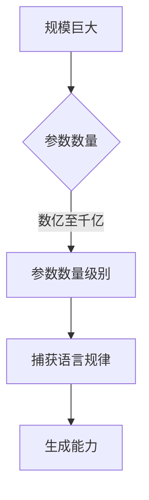
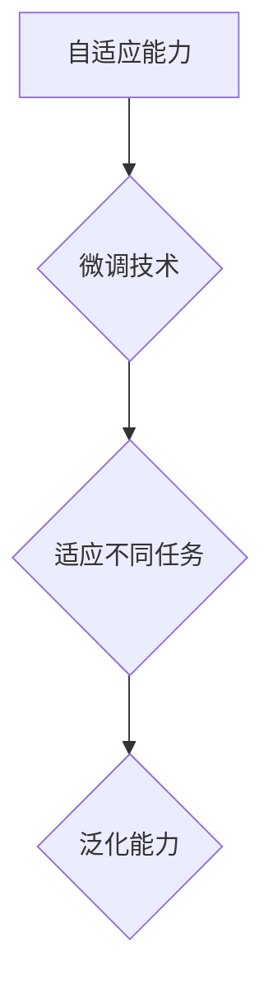
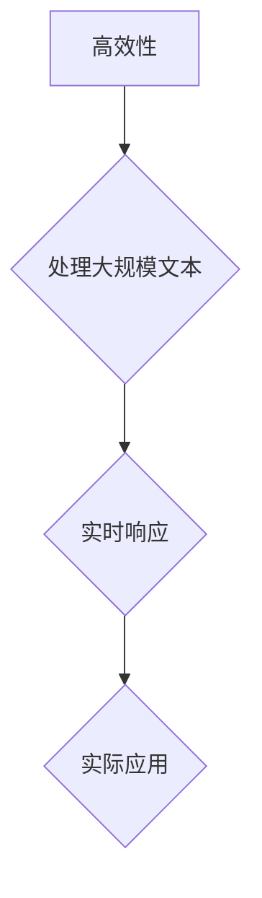
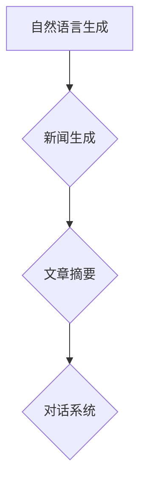
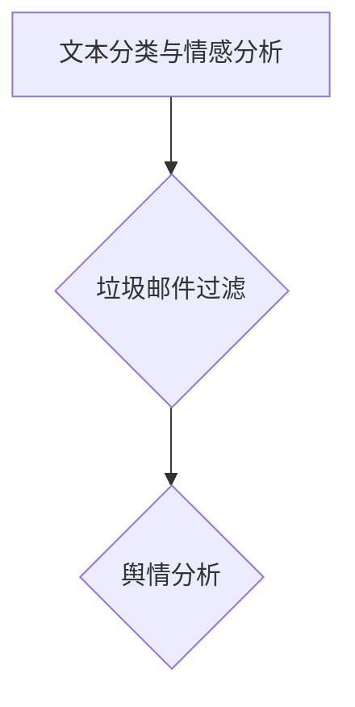
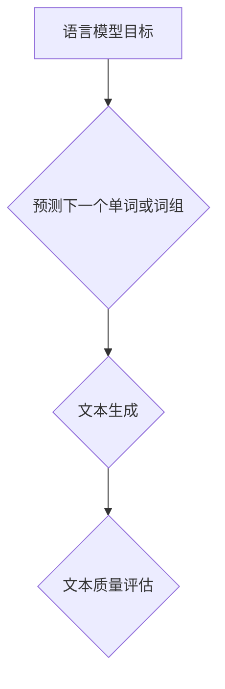
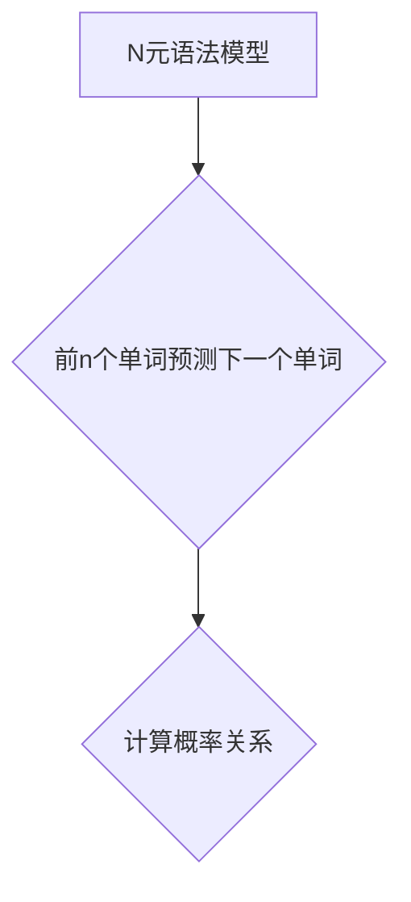
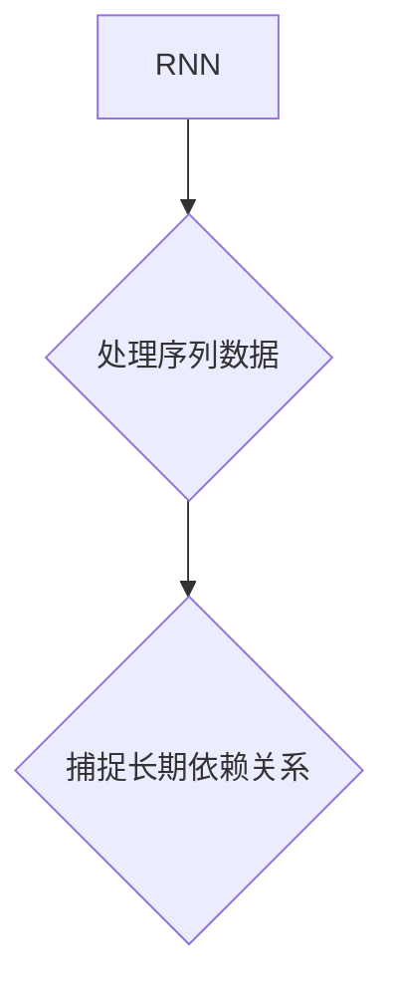
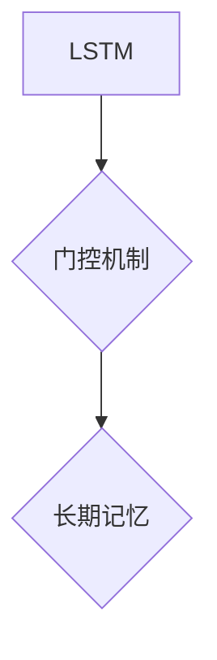
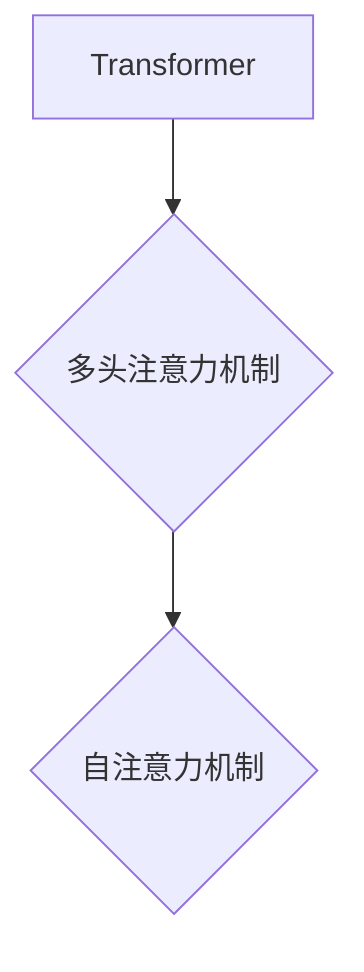

                 

# 文章标题: 大语言模型原理基础与前沿 基于语言反馈进行微调

> 关键词：大语言模型，自然语言处理，预训练，微调，迁移学习，多模态语言模型

> 摘要：本文将深入探讨大语言模型的原理基础与前沿研究，详细分析其特点、应用领域以及前沿研究。同时，本文将介绍如何基于语言反馈进行微调，以提升大语言模型的性能和应用效果。通过本文的阅读，读者将全面了解大语言模型的技术原理和前沿动态，为实际应用和未来研究提供参考。

### 第一部分: 大语言模型原理基础

#### 第1章: 大语言模型概述

##### 1.1 大语言模型的概念与背景

###### 1.1.1 大语言模型的定义

大语言模型（Large Language Models）是一种基于深度学习技术的自然语言处理（Natural Language Processing, NLP）模型。它通过对海量文本数据的学习，能够自动理解和生成自然语言，从而实现文本生成、文本分类、机器翻译等多种任务。与传统的统计语言模型相比，大语言模型具有更强的表示能力和生成能力，能够更准确地理解和生成人类语言。

###### 1.1.2 大语言模型的发展背景

大语言模型的发展可以追溯到20世纪80年代，当时统计语言模型开始被广泛应用于自然语言处理任务。然而，随着计算机硬件性能的提升和深度学习技术的突破，大语言模型在近年来取得了显著的进展。从早期的统计语言模型到基于神经网络的现代语言模型，大语言模型的发展历程展示了技术进步所带来的巨大变化。

在2018年，谷歌提出了BERT（Bidirectional Encoder Representations from Transformers）模型，这是第一个真正的大规模双向语言模型。BERT的提出标志着大语言模型进入了新的发展阶段，它通过预训练和微调技术，在多种NLP任务中取得了突破性的成绩。

随着时间的推移，更多的大语言模型被提出，如GPT（Generative Pre-trained Transformer）系列、Turing-NLG等。这些模型在规模和性能上不断突破，推动了NLP领域的发展。

##### 1.2 大语言模型的特点

###### 1.2.1 规模巨大

大语言模型通常拥有数亿甚至千亿级别的参数，这使得它们能够捕捉到语言中的细微规律和复杂结构。大规模的参数使得大语言模型在理解和生成自然语言时具有更高的精度和鲁棒性。

例如，GPT-3模型拥有1750亿个参数，是其前身GPT-2的三倍。GPT-3的规模巨大，使其在生成高质量文本方面表现出色。



###### 1.2.2 自适应能力

大语言模型具有强大的自适应能力，可以通过微调（Fine-tuning）来适应不同的任务和数据集。微调技术在大语言模型的应用中起到了关键作用，它使得模型能够针对特定任务进行优化，从而提高模型的性能。

例如，在文本分类任务中，可以通过在预训练模型的基础上微调，使其能够识别和分类不同的文本类别。微调技术使得大语言模型具有更强的泛化能力，能够应对多种不同的任务。



###### 1.2.3 高效性

大语言模型在处理大规模文本数据时，具有很高的计算效率。这使得它们能够在短时间内完成大量的文本分析和生成任务。高效的计算性能使得大语言模型在实际应用中具有很高的实用性。

例如，在实时问答系统中，大语言模型可以在用户输入问题后迅速生成回答，从而提供快速、准确的响应。高效的计算性能也是大语言模型能够广泛应用的重要基础。



##### 1.3 大语言模型的应用领域

大语言模型在自然语言处理领域具有广泛的应用。以下是几个典型的应用领域：

###### 1.3.1 自然语言生成

大语言模型可以生成高质量的自然语言文本，如新闻报道、文章摘要、对话系统等。在新闻生成领域，大语言模型可以根据已有的新闻报道生成新的新闻文章，从而提高新闻生产的效率。在文章摘要领域，大语言模型可以生成简洁、准确的摘要，帮助用户快速了解文章的主要内容。在对话系统领域，大语言模型可以生成自然的对话回复，提供智能化的客户服务。



###### 1.3.2 文本分类与情感分析

大语言模型可以用于对文本进行分类和情感分析，如垃圾邮件过滤、舆情分析等。在垃圾邮件过滤领域，大语言模型可以通过分析邮件的内容和语境，判断邮件是否为垃圾邮件，从而提高邮件过滤的准确性。在舆情分析领域，大语言模型可以分析社交媒体上的文本数据，识别用户的情绪和态度，从而为舆情监控和风险预警提供支持。



###### 1.3.3 机器翻译

大语言模型在机器翻译领域也取得了显著成果，能够实现高质量的机器翻译。在跨语言交流中，大语言模型可以自动将一种语言的文本翻译成另一种语言，从而促进不同语言之间的沟通和交流。高质量的机器翻译不仅提高了翻译的效率，还提高了翻译的准确性，使得跨语言交流更加便捷和自然。


#### 第2章: 自然语言处理技术基础

##### 2.1 语言模型基本概念

###### 2.1.1 语言模型的目标

语言模型（Language Model）是一种用于预测下一个单词或词组的模型。它的目标是在给定前文序列的基础上，预测下一个单词或词组。语言模型在自然语言处理中起到了核心作用，是文本生成、文本分类、机器翻译等多种任务的基础。

例如，给定一个句子“I like to read books.”，语言模型的目标是预测下一个单词是“books”的概率。通过语言模型，可以生成自然语言文本、评估文本的质量等。



###### 2.1.2 语言模型的类型

语言模型主要分为统计语言模型和神经网络语言模型。

1. 统计语言模型

统计语言模型是基于统计方法构建的语言模型，它通过对大量文本数据进行分析，学习语言中的统计规律。常见的统计语言模型有N元语法（N-gram）模型、隐马尔可夫模型（HMM）等。

N元语法模型是一种基于前n个单词预测下一个单词的模型。例如，给定前两个单词“I like”，N元语法模型可以预测下一个单词是“to”的概率。统计语言模型通过计算单词之间的概率关系，实现对文本的预测。



2. 神经网络语言模型

神经网络语言模型是基于深度学习技术的语言模型，它通过学习大量文本数据，自动提取语言中的复杂特征。常见的神经网络语言模型有循环神经网络（RNN）、长短时记忆网络（LSTM）、Transformer等。

循环神经网络（RNN）是一种用于处理序列数据的神经网络，它可以捕捉到序列中的长期依赖关系。RNN通过循环结构，将上一个时间步的输出作为当前时间步的输入，从而实现序列数据的建模。



长短时记忆网络（LSTM）是RNN的一种改进，它通过引入门控机制，有效地解决了RNN的梯度消失和梯度爆炸问题。LSTM能够在长序列中保持长期记忆，从而更好地捕捉到语言中的复杂特征。



Transformer是一种基于自注意力机制的神经网络模型，它在翻译任务中取得了显著的成果。Transformer通过引入多头注意力机制，能够同时关注序列中的不同位置，从而更好地捕捉到语言中的复杂特征。



###### 2.1.3 语言模型的评价指标

语言模型的评价指标用于评估模型在预测下一个单词或词组时的性能。常见的评价指标有困惑度（Perplexity）、精确率（Precision）、召回率（Recall）和F1值（F1 Score）等。

1. 困惑度（Perplexity）

困惑度是评估语言模型性能的一个常用指标，它反映了模型在数据上的拟合程度。困惑度越低，表示模型对数据的拟合程度越高。困惑度的计算公式如下：

$$
\text{Perplexity} = \exp(-\frac{1}{N} \sum_{i=1}^{N} \log P(y_i|x_i))
$$

其中，$N$ 是样本数量，$y_i$ 是实际标签，$x_i$ 是输入序列，$P(y_i|x_i)$ 是模型对 $y_i$ 的预测概率。

2. 精确率（Precision）

精确率是评估分类模型性能的一个指标，它反映了模型在预测为正例的样本中，实际为正例的比例。精确率的计算公式如下：

$$
\text{Precision} = \frac{\text{TP}}{\text{TP} + \text{FP}}
$$

其中，$TP$ 是实际为正例且预测为正例的样本数量，$FP$ 是实际为负例但预测为正例的样本数量。

3. 召回率（Recall）

召回率是评估分类模型性能的另一个指标，它反映了模型在预测为正例的样本中，实际为正例的比例。召回率的计算公式如下：

$$
\text{Recall} = \frac{\text{TP}}{\text{TP} + \text{FN}}
$$

其中，$TP$ 是实际为正例且预测为正例的样本数量，$FN$ 是实际为正例但预测为负例的样本数量。

4. F1值（F1 Score）

F1值是精确率和召回率的调和平均值，它综合反映了模型的分类性能。F1值的计算公式如下：

$$
\text{F1 Score} = 2 \times \frac{\text{Precision} \times \text{Recall}}{\text{Precision} + \text{Recall}}
$$

##### 2.2 词嵌入技术

###### 2.2.1 词嵌入的概念

词嵌入（Word Embedding）是一种将单词映射到固定大小的向量空间中的技术。通过词嵌入，单词被表示为向量，从而可以在向量空间中进行分析和处理。

词嵌入的主要目的是解决自然语言处理中的一些关键问题，如词义消歧、词性标注、文本分类等。词嵌入技术使得计算机能够理解单词之间的语义关系，从而更好地处理自然语言。

常见的词嵌入方法有基于分布的模型（如word2vec）和基于编码的模型（如GloVe）。

1. 基于分布的模型

基于分布的模型通过计算单词在语料库中的分布情况，将单词映射到向量空间。word2vec是典型的基于分布的词嵌入方法，它通过训练神经网络，将单词映射到高维向量空间中。

word2vec模型主要包括两种训练方法：连续词袋（Continuous Bag of Words, CBOW）和Skip-Gram。

- CBOW模型：给定一个中心词和它的上下文词，CBOW模型通过预测中心词来训练模型。即给定一个中心词和它的上下文词，预测中心词的概率分布。

- Skip-Gram模型：给定一个单词，Skip-Gram模型通过预测单词的上下文来训练模型。即给定一个单词，预测其上下文词的概率分布。

word2vec模型的优点是简单高效，能够在大规模语料库上训练得到高质量的词嵌入向量。然而，word2vec模型也存在一些局限性，如无法捕捉到长距离依赖关系。

2. 基于编码的模型

基于编码的模型通过学习单词的上下文信息，将单词映射到向量空间。GloVe（Global Vectors for Word Representation）是典型的基于编码的词嵌入方法，它通过计算单词和其上下文之间的共现矩阵，学习得到词嵌入向量。

GloVe模型的核心思想是利用单词和其上下文的共现信息，构建一个共现矩阵。然后，通过优化这个共现矩阵，学习得到高质量的词嵌入向量。

GloVe模型的优点是能够捕捉到长距离依赖关系，从而提高词嵌入的质量。然而，GloVe模型的计算复杂度较高，不适合大规模语料库的训练。

###### 2.2.2 词嵌入的方法

1. word2vec

word2vec模型主要包括两种训练方法：CBOW和Skip-Gram。

- CBOW模型：

给定一个中心词和它的上下文词，CBOW模型通过预测中心词来训练模型。即给定一个中心词和它的上下文词，预测中心词的概率分布。

具体实现步骤如下：

1.1 初始化词向量：将每个单词初始化为一个随机的高维向量。

1.2 计算上下文词的均值：将上下文词的词向量进行平均，得到中心词的输入向量。

1.3 计算损失函数：使用softmax函数计算中心词的概率分布，计算损失函数。

1.4 反向传播：根据损失函数，更新词向量。

- Skip-Gram模型：

给定一个单词，Skip-Gram模型通过预测单词的上下文来训练模型。即给定一个单词，预测其上下文词的概率分布。

具体实现步骤如下：

2.1 初始化词向量：将每个单词初始化为一个随机的高维向量。

2.2 计算上下文词的均值：将上下文词的词向量进行平均，得到单词的输入向量。

2.3 计算损失函数：使用softmax函数计算上下文词的概率分布，计算损失函数。

2.4 反向传播：根据损失函数，更新词向量。

2. word2vec算法伪代码：

```python
# CBOW模型
for each sentence in corpus:
    for each center word in sentence:
        # 2.1 初始化词向量
        input_vector = average([word_vector(word) for word in context_words(center_word, window_size)])
        # 2.2 计算损失函数
        loss = -sum(log(p(word | input_vector)))
        # 2.3 反向传播
        backpropagation(loss)

# Skip-Gram模型
for each sentence in corpus:
    for each word in sentence:
        # 2.1 初始化词向量
        input_vector = word_vector(word)
        # 2.2 计算损失函数
        loss = -sum(log(p(context_words | input_vector)))
        # 2.3 反向传播
        backpropagation(loss)
```

- GloVe

GloVe模型通过学习单词和其上下文的共现矩阵，得到高质量的词嵌入向量。

具体实现步骤如下：

3.1 计算共现矩阵：对于每个单词，计算其与上下文词的共现矩阵。

3.2 优化共现矩阵：通过优化共现矩阵，学习得到词嵌入向量。

3.3 计算损失函数：使用softmax函数计算词嵌入向量的损失函数。

3.4 反向传播：根据损失函数，更新词嵌入向量。

3. GloVe算法伪代码：

```python
# 计算共现矩阵
for each word in vocabulary:
    for each context word in word's context:
        # 3.1 计算共现矩阵
        cooccurrence_matrix[word][context_word] += 1

# 优化共现矩阵
for each word in vocabulary:
    for each context word in word's context:
        # 3.2 优化共现矩阵
        cooccurrence_matrix[word][context_word] = 1 / sqrt(count(word) * count(context_word))
        # 3.3 计算损失函数
        loss = -log(p(context_word | word))
        # 3.4 反向传播
        backpropagation(loss)
```

###### 2.2.3 词嵌入的应用

词嵌入在自然语言处理领域有广泛的应用，如文本分类、情感分析、机器翻译等。

1. 文本分类

词嵌入技术可以将文本表示为向量空间中的点，从而实现文本的分类。通过将文本的每个单词映射到词嵌入向量，可以得到一个文本向量。然后，使用文本向量作为特征，可以训练分类模型，对新的文本进行分类。

2. 情感分析

词嵌入技术可以帮助识别文本中的情感倾向。通过计算文本的词嵌入向量，可以分析文本的情感特征。例如，通过计算文本向量和已知情感词的相似度，可以判断文本的情感倾向是积极还是消极。

3. 机器翻译

词嵌入技术可以用于机器翻译任务。通过将源语言和目标语言的单词映射到词嵌入向量，可以得到一个源语言到目标语言的映射。然后，使用这个映射，可以生成目标语言的翻译文本。

##### 2.3 序列模型与注意力机制

###### 2.3.1 序列模型的基本原理

序列模型（Sequence Model）是一种用于处理序列数据的模型。在自然语言处理中，序列模型广泛应用于文本生成、文本分类、机器翻译等任务。常见的序列模型有循环神经网络（RNN）、长短时记忆网络（LSTM）等。

序列模型的基本原理是通过处理输入序列，生成输出序列。在处理输入序列时，序列模型能够捕捉到序列中的时间依赖关系，从而实现对序列数据的建模。

具体来说，序列模型将输入序列表示为一个向量序列，每个向量表示序列中的一个时间步。然后，序列模型通过递归操作，处理每个时间步的输入向量，生成输出序列。

递归神经网络（RNN）是一种常见的序列模型，它通过递归结构，处理输入序列。RNN的核心思想是在每个时间步，将当前输入与上一个时间步的隐藏状态进行组合，生成当前时间步的隐藏状态。然后，使用这个隐藏状态生成当前时间步的输出。

RNN的递归结构使得它能够捕捉到序列中的时间依赖关系。然而，RNN也存在一些问题，如梯度消失和梯度爆炸。这些问题导致RNN在处理长序列数据时，性能下降。

长短时记忆网络（LSTM）是RNN的一种改进，它通过引入门控机制，解决了RNN的梯度消失和梯度爆炸问题。LSTM的核心思想是在每个时间步，使用门控机制来控制信息的传递和遗忘。通过门控机制，LSTM能够在长序列中保持长期记忆，从而更好地捕捉到序列中的复杂特征。

具体来说，LSTM包括三个门控单元：遗忘门（forget gate）、输入门（input gate）和输出门（output gate）。遗忘门控制上一个时间步的隐藏状态中哪些信息需要被遗忘；输入门控制当前时间步的输入信息中哪些信息需要被保留；输出门控制当前时间步的输出信息。

通过这三个门控机制，LSTM能够有效地捕捉到序列中的长期依赖关系。LSTM在语音识别、机器翻译等任务中取得了显著的成果，成为序列模型的常用选择。

###### 2.3.2 注意力机制的原理

注意力机制（Attention Mechanism）是一种用于提高序列模型处理长序列数据能力的机制。在自然语言处理中，注意力机制广泛应用于机器翻译、文本摘要、问答系统等任务。

注意力机制的核心思想是通过计算输入序列和当前隐藏状态之间的相似度，生成注意力权重。然后，使用这些权重对输入序列进行加权求和，得到当前时间步的输入向量。

具体来说，注意力机制包括两个关键步骤：

1. 计算相似度：通过计算输入序列和当前隐藏状态之间的相似度，得到注意力分数。相似度计算通常使用点积、缩放点积等操作。

2. 生成注意力权重：使用softmax函数对注意力分数进行归一化，得到注意力权重。注意力权重表示了不同时间步的输入对当前时间步的贡献程度。

通过计算注意力权重，注意力机制能够聚焦于重要的输入信息，从而提高序列模型的性能。

注意力机制的原理可以理解为“选择性记忆”，它允许模型在处理长序列数据时，关注重要的部分，忽略不重要的部分。这使得注意力机制在处理长序列数据时，能够提高模型的效率和准确性。

###### 2.3.3 注意力机制的应用

注意力机制在自然语言处理领域有广泛的应用，如机器翻译、文本摘要、问答系统等。

1. 机器翻译

在机器翻译任务中，注意力机制可以用于提高翻译的准确性。通过注意力机制，模型能够在翻译过程中关注到源语言和目标语言之间的对应关系，从而生成更准确的翻译结果。

2. 文本摘要

在文本摘要任务中，注意力机制可以用于提取关键信息。通过注意力机制，模型能够关注到文本中的重要部分，从而生成摘要。

3. 问答系统

在问答系统任务中，注意力机制可以用于提取问题的关键信息。通过注意力机制，模型能够关注到问题中的重要词汇，从而更好地理解问题，生成准确的回答。

#### 第3章: 大规模预训练模型原理

##### 3.1 预训练的概念与意义

###### 3.1.1 预训练的定义

预训练（Pre-training）是一种在特定数据集上预先训练模型的方法。预训练的主要目的是通过在大规模数据集上训练模型，使其能够自动学习到语言中的普遍规律和复杂结构。然后，通过微调（Fine-tuning）技术，将预训练模型应用于特定任务，从而提高模型在任务上的性能。

预训练模型通常分为两步：

1. 预训练阶段：在大量无标签数据上训练模型，使其能够自动学习到语言中的普遍规律和复杂结构。

2. 微调阶段：在特定任务上，使用少量有标签数据，对预训练模型进行调整和优化，从而提高模型在任务上的性能。

预训练模型的发展经历了几个阶段：

1. 初期：基于浅层神经网络的语言模型，如N-gram模型。

2. 中期：基于深层神经网络的语言模型，如LSTM、GRU等。

3. 近期：基于Transformer的预训练模型，如BERT、GPT等。

预训练的意义在于：

1. 提高模型性能：通过在大规模数据集上预训练，模型能够学习到更多的语言知识和结构，从而提高模型在特定任务上的性能。

2. 减少标注数据依赖：预训练模型通过在大规模无标签数据上训练，能够自动学习到语言中的普遍规律，从而减少对大量有标签数据的依赖。

3. 跨任务迁移能力：预训练模型通过在大规模数据集上预训练，能够自动学习到语言中的通用特征，从而具有跨任务的迁移能力。

###### 3.1.2 预训练的意义

预训练技术在自然语言处理领域具有重要意义。首先，预训练使得模型能够在大规模数据集上自动学习到语言中的普遍规律和复杂结构，从而提高模型在特定任务上的性能。其次，预训练减少了模型对大量有标签数据的依赖，使得模型能够在没有大量标注数据的情况下，仍然能够取得良好的性能。此外，预训练模型具有跨任务的迁移能力，通过在大规模数据集上预训练，模型能够自动学习到语言中的通用特征，从而可以应用于多种不同的任务，实现知识的复用和迁移。

##### 3.2 自监督学习方法

###### 3.2.1 自监督学习的概念

自监督学习（Self-supervised Learning）是一种无需人工标注数据的学习方法。在自监督学习中，模型通过学习数据中的内在结构，自动发现数据中的规律和特征。与传统的监督学习相比，自监督学习不需要大量的有标签数据，从而降低了数据标注的成本和复杂性。

自监督学习的主要思想是通过设计一些自监督任务，使得模型能够在无监督的数据集上学习到有用的特征表示。常见的自监督任务包括掩码语言模型（Masked Language Model, MLM）、掩码图像建模（Masked Image Modeling, MIM）等。

自监督学习的优点包括：

1. 减少标注数据依赖：自监督学习不需要大量有标签数据，从而降低了数据标注的成本和复杂性。

2. 提高模型泛化能力：通过学习数据中的内在结构，自监督学习能够帮助模型提高对未知数据的泛化能力。

3. 跨领域迁移：自监督学习可以在不同领域的数据上训练，从而实现跨领域的迁移能力。

###### 3.2.2 自监督学习的方法

自监督学习的方法主要包括以下几种：

1. 掩码语言模型（Masked Language Model, MLM）

掩码语言模型是一种常见的自监督学习任务，它通过随机掩码输入序列中的部分单词，然后预测被掩码的单词。例如，给定一个输入序列“I like to read books.”，掩码语言模型可以随机掩码其中的部分单词，然后预测被掩码的单词。

具体实现步骤如下：

1.1 掩码输入序列：随机掩码输入序列中的部分单词。

1.2 预测被掩码的单词：使用模型预测被掩码的单词。

1.3 计算损失函数：计算预测单词与实际单词之间的损失，更新模型参数。

2. 掩码图像建模（Masked Image Modeling, MIM）

掩码图像建模是一种常见的自监督学习任务，它通过随机掩码输入图像的一部分，然后预测被掩码的部分。例如，给定一个输入图像，掩码图像建模可以随机掩码图像中的部分区域，然后预测被掩码的区域。

具体实现步骤如下：

2.1 掩码输入图像：随机掩码输入图像的一部分。

2.2 预测被掩码的区域：使用模型预测被掩码的区域。

2.3 计算损失函数：计算预测区域与实际区域之间的损失，更新模型参数。

3. 生成式自监督学习

生成式自监督学习是一种通过生成模型学习数据中的内在结构的方法。常见的生成式自监督学习任务包括生成对抗网络（Generative Adversarial Networks, GAN）、变分自编码器（Variational Autoencoder, VAE）等。

生成式自监督学习的核心思想是训练一个生成模型，使其能够生成与真实数据分布相似的数据。然后，通过比较生成数据与真实数据之间的相似度，来评估模型的学习效果。

具体实现步骤如下：

3.1 训练生成模型：使用真实数据训练生成模型。

3.2 生成数据：使用生成模型生成数据。

3.3 计算损失函数：计算生成数据与真实数据之间的损失，更新模型参数。

##### 3.3 迁移学习与微调技术

###### 3.3.1 迁移学习的概念

迁移学习（Transfer Learning）是一种将预训练模型应用于新任务的方法。在迁移学习中，模型首先在大规模数据集上预训练，然后通过微调（Fine-tuning）技术，将预训练模型应用于新任务，从而提高模型在新任务上的性能。

迁移学习的基本原理是利用预训练模型在预训练阶段学到的通用特征，从而提高模型在新任务上的泛化能力。与从头开始训练（scratch training）相比，迁移学习减少了模型在新任务上的训练时间，并提高了模型在新任务上的性能。

迁移学习可以分为以下几种类型：

1. 零样本迁移学习（Zero-shot Transfer Learning）

零样本迁移学习是指模型在未见过的类别上，利用预训练模型学到的通用特征，进行分类或预测。零样本迁移学习适用于新类别与新任务，模型不需要在特定类别或任务上训练。

2. 少样本迁移学习（Few-shot Transfer Learning）

少样本迁移学习是指模型在少量样本上，利用预训练模型学到的通用特征，进行分类或预测。少样本迁移学习适用于新类别或新任务，模型在特定类别或任务上只需少量样本。

3. 多样本迁移学习（Many-shot Transfer Learning）

多样本迁移学习是指模型在大量样本上，利用预训练模型学到的通用特征，进行分类或预测。多样本迁移学习适用于新类别或新任务，模型在特定类别或任务上有大量样本。

###### 3.3.2 微调技术的原理

微调技术（Fine-tuning）是一种通过少量数据对预训练模型进行调整的方法。微调的主要目的是利用预训练模型在预训练阶段学到的通用特征，从而提高模型在新任务上的性能。

微调技术的基本原理是：

1. 预训练模型：在预训练阶段，模型在大规模数据集上学习到通用特征，从而提高模型在预训练任务上的性能。

2. 微调阶段：在微调阶段，使用少量有标签数据，对预训练模型进行调整和优化，使其在新任务上达到更好的性能。

微调技术的主要步骤包括：

1. 初始化模型：使用预训练模型的参数初始化新模型的参数。

2. 数据预处理：对少量有标签数据进行预处理，如数据清洗、归一化等。

3. 训练模型：使用少量有标签数据，对模型进行训练，更新模型参数。

4. 评估模型：使用测试集对模型进行评估，计算模型在测试集上的性能。

5. 优化模型：根据评估结果，对模型进行调整和优化，提高模型在新任务上的性能。

###### 3.3.3 微调技术的应用

微调技术在自然语言处理和计算机视觉等领域有广泛的应用。

1. 自然语言处理

在自然语言处理领域，微调技术常用于文本分类、情感分析、问答系统等任务。通过微调预训练模型，可以使得模型在新任务上达到更好的性能。例如，在文本分类任务中，可以使用预训练模型进行微调，从而提高模型对特定类别的分类性能。

2. 计算机视觉

在计算机视觉领域，微调技术也广泛应用于图像分类、目标检测、语义分割等任务。通过微调预训练模型，可以使得模型在特定数据集上达到更好的性能。例如，在图像分类任务中，可以使用预训练的卷积神经网络（CNN）进行微调，从而提高模型在特定数据集上的分类性能。

### 第二部分: 大语言模型的前沿研究与应用

#### 第4章: 大语言模型的前沿研究

##### 4.1 语言模型的性能提升

随着深度学习技术的不断发展，大语言模型的性能也在不断提升。以下是近年来大语言模型性能提升的一些关键因素：

###### 4.1.1 大模型的优势

大模型（Large Models）是指具有大量参数和计算资源的模型。大模型的优势在于：

1. 更强的表示能力：大模型拥有更多的参数，能够更好地捕捉到语言中的复杂结构和规律。这使得大模型在生成和理解自然语言时具有更高的准确性。

2. 更好的泛化能力：大模型通过在大量数据上进行训练，能够学习到更通用的特征表示，从而提高模型在未知数据上的泛化能力。

3. 更低的过拟合风险：大模型拥有更多的参数，可以在一定程度上缓解过拟合问题，从而提高模型在真实世界中的性能。

近年来，随着计算资源和存储技术的提升，大模型的规模也在不断增大。例如，GPT-3模型拥有1750亿个参数，是GPT-2的三倍。大模型的规模提升，使得其在自然语言处理任务中取得了显著的性能提升。

###### 4.1.2 大模型的挑战

尽管大模型在性能上具有显著优势，但其在训练和部署过程中也面临一些挑战：

1. 计算资源需求：大模型需要大量的计算资源进行训练。在训练过程中，模型需要在多GPU或TPU上进行并行计算，这需要昂贵的硬件投入。

2. 数据隐私与安全：大模型在训练过程中需要使用大量数据，这涉及到数据隐私和安全的问题。如何确保训练数据的安全性和隐私性，是大模型面临的一个重要挑战。

3. 模型可解释性：大模型通常是一个黑盒模型，其内部决策过程难以解释。在安全、金融等关键领域，模型的可解释性至关重要，但大模型的复杂性使得其可解释性成为一个挑战。

为了应对这些挑战，研究者们提出了一系列技术解决方案，如联邦学习（Federated Learning）、模型压缩（Model Compression）等，以降低大模型的计算资源需求、提高模型的可解释性。

###### 4.1.3 大模型的应用

大模型在自然语言处理领域有广泛的应用。以下是一些关键应用领域：

1. 文本生成：大模型可以生成高质量的自然语言文本，如新闻报道、文章摘要、对话系统等。通过大模型的预训练和微调，可以生成更加自然、流畅的文本。

2. 文本分类与情感分析：大模型可以用于对文本进行分类和情感分析，如垃圾邮件过滤、舆情分析等。大模型在处理大规模文本数据时，具有更高的准确性和效率。

3. 机器翻译：大模型在机器翻译领域也取得了显著成果，能够实现高质量的机器翻译。大模型能够捕捉到不同语言之间的细微差异，从而提高翻译的准确性。

4. 对话系统：大模型可以用于构建智能对话系统，如聊天机器人、语音助手等。大模型在处理多轮对话时，能够更好地理解上下文，从而提供更加自然、流畅的对话体验。

##### 4.2 多模态语言模型

随着人工智能技术的不断发展，多模态语言模型（Multimodal Language Models）逐渐成为研究的热点。多模态语言模型能够同时处理多种类型的数据，如文本、图像、音频等，从而提高模型的泛化能力和表达能力。

###### 4.2.1 多模态数据融合

多模态数据融合是多模态语言模型的关键技术。数据融合的目标是将来自不同模态的数据进行整合，形成一个统一的特征表示。常见的多模态数据融合方法包括：

1. 基于特征的融合：将不同模态的特征进行拼接或加权融合，形成一个统一的特征向量。例如，将文本特征和图像特征进行拼接，形成一个新的特征向量。

2. 基于模型的融合：使用神经网络模型，如卷积神经网络（CNN）和循环神经网络（RNN），对多模态数据进行联合建模。通过模型的学习，自动提取多模态数据中的关键信息，形成统一的特征表示。

3. 基于注意力的融合：使用注意力机制，将不同模态的数据进行加权融合。注意力机制能够自动学习到不同模态数据的重要性，从而实现有效的数据融合。

多模态数据融合可以提高模型的泛化能力和表达能力。通过融合多种类型的数据，模型能够更好地理解复杂任务，从而提高模型的性能。

###### 4.2.2 多模态语言模型的应用

多模态语言模型在多个领域取得了显著的成果。以下是一些关键应用领域：

1. 图像识别与文本生成：多模态语言模型可以同时处理图像和文本数据，实现图像识别和文本生成的任务。例如，在图像描述生成任务中，多模态语言模型可以生成与图像内容相关的自然语言描述。

2. 语音识别与文本翻译：多模态语言模型可以同时处理语音和文本数据，实现语音识别和文本翻译的任务。例如，在语音翻译任务中，多模态语言模型可以同时处理语音信号和文本，从而提高翻译的准确性和流畅性。

3. 对话系统：多模态语言模型可以用于构建智能对话系统，如聊天机器人、语音助手等。多模态语言模型能够同时处理文本和语音输入，从而提供更加自然、流畅的对话体验。

4. 情感识别与情绪分析：多模态语言模型可以同时处理文本、图像和语音数据，实现情感识别和情绪分析的任务。例如，在情绪识别任务中，多模态语言模型可以同时分析文本内容、图像表情和语音语气，从而准确识别用户的情感状态。

##### 4.3 语言模型在对话系统中的应用

对话系统（Dialogue Systems）是一种与人交互的智能系统，能够理解用户的问题，并生成相应的回答。语言模型在对话系统中扮演着核心角色，能够提高对话系统的自然性和准确性。

###### 4.3.1 对话系统的挑战

对话系统在实现自然、流畅的交互过程中，面临以下挑战：

1. 上下文理解：对话系统需要理解用户的上下文信息，包括用户的历史提问、对话主题等。上下文理解是对话系统的关键，能够帮助系统更好地理解用户的需求。

2. 多轮对话：多轮对话是指用户与系统进行多轮问答的过程。在多轮对话中，用户的问题和回答之间存在关联，对话系统需要保持对话的连贯性和一致性。

3. 情感识别与生成：对话系统需要能够识别用户的情感状态，并生成相应的情感反应。情感识别与生成是提高对话系统用户体验的重要因素。

4. 多模态交互：对话系统可以同时处理多种类型的输入和输出，如文本、语音、图像等。多模态交互能够提供更加丰富和自然的用户交互体验。

###### 4.3.2 语言模型在对话系统中的应用

语言模型在对话系统中有广泛的应用，以下是一些关键应用场景：

1. 自然语言理解：语言模型可以帮助对话系统理解用户的自然语言输入，包括语义理解和情感分析。通过语言模型，对话系统可以识别用户的意图和情感状态，从而生成相应的回答。

2. 对话生成：语言模型可以用于生成对话系统的回答。通过预训练和微调技术，语言模型可以生成自然、流畅的对话文本，提高对话系统的交互体验。

3. 上下文维护：语言模型可以帮助对话系统维护对话的上下文信息。通过维护对话历史和当前上下文，对话系统可以更好地理解用户的需求，提供更加个性化的回答。

4. 情感识别与生成：语言模型可以用于识别用户的情感状态，并生成相应的情感反应。通过情感识别与生成，对话系统可以提供更加温暖、人性化的交互体验。

5. 多轮对话管理：语言模型可以帮助对话系统管理多轮对话。通过学习用户的历史提问和回答，对话系统可以保持对话的连贯性和一致性，提供更加自然的交互体验。

#### 第5章: 大语言模型的应用实践

##### 5.1 应用场景分析

大语言模型在多个领域具有广泛的应用。以下是一些典型应用场景：

###### 5.1.1 文本生成

文本生成是大语言模型的一个重要应用领域。通过预训练和微调技术，大语言模型可以生成高质量的自然语言文本。常见的文本生成任务包括：

1. 新闻生成：大语言模型可以根据已有的新闻报道生成新的新闻文章，从而提高新闻生产的效率。

2. 文章摘要：大语言模型可以生成简洁、准确的摘要，帮助用户快速了解文章的主要内容。

3. 对话系统：大语言模型可以生成自然的对话回复，提供智能化的客户服务。

4. 文本续写：大语言模型可以续写故事、小说等文本内容，为创作者提供灵感。

###### 5.1.2 文本分类

文本分类是大语言模型的另一个重要应用领域。通过预训练和微调技术，大语言模型可以用于对文本进行分类。常见的文本分类任务包括：

1. 垃圾邮件过滤：大语言模型可以用于识别和过滤垃圾邮件，从而提高邮件系统的安全性。

2. 舆情分析：大语言模型可以分析社交媒体上的文本数据，识别用户的情绪和态度，为舆情监控和风险预警提供支持。

3. 文本情感分析：大语言模型可以用于分析文本的情感倾向，识别文本中的积极、消极情绪。

4. 文本分类标签：大语言模型可以用于自动为文本分配标签，从而实现文本的自动分类和标注。

###### 5.1.3 文本翻译

文本翻译是大语言模型的另一个重要应用领域。通过预训练和微调技术，大语言模型可以实现高质量的自然语言翻译。常见的文本翻译任务包括：

1. 跨语言交流：大语言模型可以自动将一种语言的文本翻译成另一种语言，从而促进不同语言之间的沟通和交流。

2. 全球化业务：大语言模型可以帮助企业实现全球化的业务扩展，提供跨语言的客户服务和支持。

3. 文本理解与生成：大语言模型可以同时处理文本的输入和输出，实现自然语言翻译的同时，提供高质量的文本理解和生成。

4. 跨语言文本分类：大语言模型可以用于对跨语言的文本进行分类和标注，从而实现多语言文本的统一管理和分析。

##### 5.2 实践案例分享

以下是几个大语言模型的应用实践案例：

###### 5.2.1 案例一：智能客服系统

智能客服系统是一种基于大语言模型的自动化客户服务系统。通过预训练和微调技术，大语言模型可以生成自然、流畅的对话回复，从而提高客户服务质量。

具体实现步骤如下：

1. 预训练阶段：使用大量的客服对话数据进行预训练，使得大语言模型能够学习到客服对话的常见问题和回答。

2. 微调阶段：使用特定领域的客服对话数据进行微调，使得大语言模型能够针对特定领域的客服问题生成准确的回答。

3. 对话生成：在用户发起客服请求时，智能客服系统使用大语言模型生成相应的对话回复，提供高效的客户服务。

4. 评估与优化：对智能客服系统的对话质量进行评估和优化，从而提高客户满意度和服务效率。

###### 5.2.2 案例二：自动摘要生成

自动摘要生成是一种基于大语言模型的文本生成技术。通过预训练和微调技术，大语言模型可以生成简洁、准确的摘要，从而提高文本阅读效率。

具体实现步骤如下：

1. 预训练阶段：使用大量的文本数据进行预训练，使得大语言模型能够学习到文本摘要的生成规律。

2. 微调阶段：使用特定领域的文本数据进行微调，使得大语言模型能够生成高质量的摘要。

3. 摘要生成：对输入的文本，大语言模型生成相应的摘要，提取文本的关键信息和主要内容。

4. 评估与优化：对生成的摘要进行评估和优化，从而提高摘要的质量和可读性。

###### 5.2.3 案例三：跨语言翻译

跨语言翻译是一种基于大语言模型的文本翻译技术。通过预训练和微调技术，大语言模型可以实现高质量的自然语言翻译，从而促进不同语言之间的沟通和交流。

具体实现步骤如下：

1. 预训练阶段：使用大量的跨语言语料库进行预训练，使得大语言模型能够学习到不同语言之间的翻译规律。

2. 微调阶段：使用特定语言对的翻译数据进行微调，使得大语言模型能够生成高质量的翻译文本。

3. 翻译生成：对输入的文本，大语言模型生成相应的翻译文本，实现跨语言的文本理解与生成。

4. 评估与优化：对生成的翻译文本进行评估和优化，从而提高翻译的准确性和流畅性。

### 第三部分: 大语言模型的发展趋势与挑战

#### 第6章: 大语言模型的发展趋势

##### 6.1 未来的发展方向

大语言模型在未来有望在以下几个方向取得重要进展：

###### 6.1.1 多模态融合

随着人工智能技术的发展，多模态数据融合将成为大语言模型的重要发展方向。通过融合文本、图像、音频等多模态数据，大语言模型将能够更好地理解和生成复杂信息，从而提高模型的泛化能力和表达能力。

例如，在视频理解任务中，多模态语言模型可以同时处理视频帧中的文本描述、图像内容和音频信号，从而实现更加准确的视频理解和生成。

###### 6.1.2 小样本学习

小样本学习（Few-shot Learning）是一种在少量样本上训练和泛化模型的技术。未来，大语言模型将致力于提高小样本学习的能力，从而减少对大量标注数据的依赖。

通过在小样本上预训练和微调，大语言模型可以快速适应新任务，从而实现跨领域、跨任务的迁移学习。这对于实际应用场景中的模型部署具有重要意义。

###### 6.1.3 自适应学习

自适应学习（Adaptive Learning）是指模型能够根据不同的任务和数据自动调整学习策略。未来，大语言模型将致力于开发自适应学习算法，以更好地应对动态变化的任务和数据。

自适应学习算法可以自动调整模型的结构、参数和训练过程，从而提高模型的效率和准确性。这将有助于大语言模型在实际应用中的灵活性和可扩展性。

###### 6.1.4 模型压缩与优化

随着大语言模型规模的不断增大，模型压缩与优化将成为重要的研究方向。通过模型压缩技术，可以降低模型的计算复杂度和存储需求，从而提高模型的部署效率和可扩展性。

例如，模型剪枝（Model Pruning）和量化（Quantization）技术可以通过删除冗余的参数或降低参数的精度，实现模型的压缩和优化。这将有助于大语言模型在资源受限的环境中得到广泛应用。

##### 6.2 新的技术创新

未来，大语言模型领域有望出现一系列技术创新，推动自然语言处理技术的发展。以下是一些可能的新技术创新：

###### 6.2.1 联邦学习

联邦学习（Federated Learning）是一种分布式学习技术，它允许多个参与者共同训练一个共享模型，而无需共享数据。未来，大语言模型将可能结合联邦学习技术，实现更加隐私保护的数据共享和协同学习。

联邦学习可以应用于跨机构、跨领域的数据合作，从而提高大语言模型的训练效率和多样性。

###### 6.2.2 模型可解释性

模型可解释性（Model Explainability）是一个关键的研究方向，它旨在提高模型的透明度和可信度。未来，大语言模型将致力于开发可解释性算法，使得模型的决策过程更加透明和可解释。

例如，通过可视化技术，可以将大语言模型中的关键特征和决策路径呈现给用户，从而增强用户对模型的信任和理解。

###### 6.2.3 跨语言与跨文化理解

随着全球化的深入发展，大语言模型将面临跨语言和跨文化的理解挑战。未来，大语言模型将致力于提高跨语言和跨文化的理解能力，从而实现更广泛的语言互通和文化交流。

通过引入跨语言词嵌入和多语言预训练技术，大语言模型可以更好地理解不同语言和文化背景下的文本信息。

##### 6.3 应用领域的拓展

大语言模型在未来的应用领域将不断拓展，以下是一些可能的应用领域：

###### 6.3.1 医疗健康

在大语言模型的支持下，医疗健康领域将实现更加精准和个性化的医疗服务。例如，通过分析患者的病历记录和医疗文献，大语言模型可以辅助医生进行诊断和治疗方案推荐。

此外，大语言模型还可以用于医疗文本分析、药物研发和健康科普等方面，为医疗健康领域带来更多的创新和进步。

###### 6.3.2 金融领域

在大语言模型的支持下，金融领域将实现更加智能和高效的金融服务。例如，通过分析市场数据、金融文献和新闻报告，大语言模型可以辅助投资者进行投资决策和风险控制。

此外，大语言模型还可以用于金融文本分析、客户服务和风险预警等方面，为金融领域带来更多的价值。

###### 6.3.3 教育与学习

在大语言模型的支持下，教育与学习领域将实现更加个性化和智能化的学习体验。例如，通过分析学生的学习记录和学习资料，大语言模型可以为学生提供个性化的学习建议和指导。

此外，大语言模型还可以用于教育文本分析、智能教学系统和学习评价等方面，为教育领域带来更多的创新和进步。

#### 第7章: 大语言模型的挑战与应对策略

##### 7.1 数据隐私与安全

随着大语言模型的广泛应用，数据隐私与安全问题日益突出。大语言模型在训练和部署过程中，需要处理大量的敏感数据，如个人隐私信息、金融数据等。这些问题对数据隐私和安全构成了严重威胁。

应对策略：

1. 加密与安全传输：对敏感数据进行加密，确保数据在传输和存储过程中不被泄露。同时，采用安全的传输协议，如TLS，保护数据传输的安全性。

2. 数据匿名化：在训练和测试数据集上，采用数据匿名化技术，隐藏敏感信息，降低数据泄露的风险。

3. 隐私增强技术：引入隐私增强技术，如差分隐私（Differential Privacy），在保证模型性能的同时，保护用户隐私。

4. 数据监管与合规：加强对数据的监管，确保数据处理过程符合相关法律法规的要求，避免隐私泄露和滥用。

##### 7.2 模型可解释性

大语言模型通常被视为“黑盒”模型，其内部决策过程难以解释。这对模型的可靠性和可信度提出了挑战。为了提高模型的透明度和可解释性，需要开发有效的可解释性方法。

应对策略：

1. 可解释性评估：建立可解释性评估框架，对模型的可解释性进行量化评估，确保模型在可解释性方面达到一定标准。

2. 可解释性可视化：采用可视化技术，将模型中的关键特征和决策路径呈现给用户，帮助用户理解模型的决策过程。

3. 解释性算法：开发解释性算法，如注意力机制、决策树等，使得模型的可解释性更加直观和易于理解。

4. 模型审计：对模型进行定期审计，检查模型是否存在偏差或歧视行为，确保模型的公平性和可靠性。

##### 7.3 能效与可持续性

大语言模型在训练和部署过程中，需要大量的计算资源和能源消耗。这对环境的可持续性构成了挑战。为了实现绿色人工智能，需要开发能效优化的方法。

应对策略：

1. 模型压缩：通过模型压缩技术，降低模型的计算复杂度和存储需求，从而减少能源消耗。

2. 能效优化：采用能效优化的算法和硬件，如低功耗GPU、专用AI芯片等，降低模型的能源消耗。

3. 联邦学习：采用联邦学习技术，将训练任务分布到多个参与者，减少集中训练的能源消耗。

4. 能源监测与优化：建立能源监测系统，实时监控模型的能源消耗情况，并进行优化调整，降低能源浪费。

### 附录

#### 附录A: 常用工具与资源

##### A.1 大语言模型开源框架

以下是一些常用的大语言模型开源框架：

1. **BERT**: BERT是Google提出的一种预训练语言模型，广泛应用于多种自然语言处理任务。

2. **GPT**: GPT是OpenAI提出的预训练语言模型，具有强大的文本生成和文本理解能力。

3. **Turing-NLG**: Turing-NLG是微软提出的一种大规模预训练语言模型，具有广泛的自然语言处理应用。

4. **XLNet**: XLNet是Google提出的一种基于Transformer的预训练语言模型，具有出色的文本生成和文本分类能力。

##### A.2 数据集与资源

以下是一些常用的大语言模型训练数据集和资源：

1. **Common Crawl**: Common Crawl是一个大规模的网页文本数据集，适用于语言模型的训练。

2. **Wikipedia**: Wikipedia是一个包含大量文本信息的免费在线百科全书，适用于语言模型的预训练。

3. **AG News**: AG News是一个新闻分类数据集，适用于文本分类任务的训练。

4. **CoNLL-2003**: CoNLL-2003是一个命名实体识别数据集，适用于命名实体识别任务的训练。

##### A.3 论文与报告

以下是一些关于大语言模型的重要论文和报告：

1. **BERT: Pre-training of Deep Bidirectional Transformers for Language Understanding**（2018）

2. **GPT-3: Language Models are Few-Shot Learners**（2020）

3. **Turing-NLG: A Code-Driven End-to-End Neural Conversational Model**（2020）

4. **XLNet: General Language Modeling with Fast, Scalable匹配方法**（2020）

### 作者信息

**作者：AI天才研究院/AI Genius Institute & 禅与计算机程序设计艺术 /Zen And The Art of Computer Programming**

本文由AI天才研究院（AI Genius Institute）和禅与计算机程序设计艺术（Zen And The Art of Computer Programming）联合撰写，旨在深入探讨大语言模型的原理基础和前沿研究，为读者提供全面的技术分析和应用实践。希望通过本文的阅读，读者能够更好地理解大语言模型的技术原理和应用价值，为未来的研究和实践提供有益的参考。

