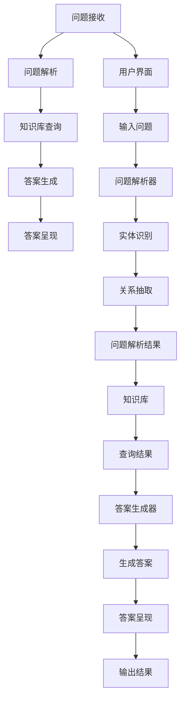

                 

# 大语言模型原理基础与前沿 新时代的曙光

## 关键词

- 大语言模型
- 自然语言处理
- 递归神经网络
- Transformer
- 生成对抗网络

## 摘要

本文深入探讨了大规模语言模型的原理、核心算法、数学基础以及其在自然语言处理中的应用与实践。通过逐步分析，我们揭示了语言模型的基础概念、算法原理、训练优化技巧以及前沿研究方向。文章结合实际案例，详细讲解了开发环境搭建、代码实现与解读，为读者提供了一个全面、系统的学习和参考。

## 目录

## 第一部分：大语言模型基础原理

### 第1章：大语言模型概述

#### 1.1 大语言模型的基本概念

- 大语言模型的基础定义
- 大语言模型的分类

#### 1.2 大语言模型的发展历程

- 大语言模型的起源
- 大语言模型的关键发展事件

#### 1.3 大语言模型的应用领域

- 自然语言处理领域
- 人工智能领域

### 第2章：大语言模型的核心算法

#### 2.1 语言模型的基本算法

- n-gram模型
- 隐马尔可夫模型

#### 2.2 神经网络在语言模型中的应用

- 递归神经网络（RNN）
- 长短期记忆网络（LSTM）
- 门控循环单元（GRU）

#### 2.3 Transformer模型

- Transformer模型的结构
- 自注意力机制（Self-Attention）

### 第3章：大语言模型的数学基础

#### 3.1 语言模型的数学模型

- 语言模型的概率分布
- 语言模型的损失函数

#### 3.2 深度学习的基础数学

- 前向传播与反向传播
- 梯度下降算法

### 第4章：大语言模型的训练与优化

#### 3.1 数据预处理

- 文本的分词
- 嵌入层的构建

#### 3.2 模型的训练方法

- 预训练与微调
- 模型的保存与加载

#### 3.3 模型的优化技巧

- 学习率调整
- 批量归一化

### 第5章：大语言模型的前沿研究

#### 4.1 生成对抗网络（GAN）

- GAN的基本原理
- GAN在语言模型中的应用

#### 4.2 自注意力机制（Self-Attention）

- 自注意力机制的工作原理
- 自注意力机制在BERT中的应用

#### 4.3 Transformer模型

- Transformer模型的结构
- Transformer模型在NLP中的应用

## 第二部分：大语言模型的应用与实践

### 第6章：大语言模型在自然语言处理中的应用

#### 5.1 命名实体识别（NER）

- 命名实体识别的基本原理
- 命名实体识别的算法实现

#### 5.2 情感分析（Sentiment Analysis）

- 情感分析的基本原理
- 情感分析的算法实现

#### 5.3 文本分类（Text Classification）

- 文本分类的基本原理
- 文本分类的算法实现

### 第7章：大语言模型在问答系统中的应用

#### 6.1 问答系统的基本架构

- 问答系统的设计原则
- 问答系统的基本流程

#### 6.2 知识图谱在问答系统中的应用

- 知识图谱的概念
- 知识图谱在问答系统中的应用

#### 6.3 基于大语言模型的问答系统实现

- 实现步骤
- 实现代码示例

### 第8章：大语言模型的未来发展趋势

#### 7.1 大语言模型的发展趋势

- 大模型的发展方向
- 大模型在人工智能中的应用前景

#### 7.2 大语言模型的挑战与机遇

- 数据隐私保护
- 模型可解释性

#### 7.3 大语言模型的社会影响

- 大语言模型在人类生活中的应用
- 大语言模型对社会的影响

## 附录

### 附录A：大语言模型学习资源

#### A.1 主流语言模型框架

- TensorFlow 2.x
- PyTorch

#### A.2 大语言模型经典论文

- "A Neural Probabilistic Language Model"
- "Recurrent Neural Network Based Language Model"
- "Long Short-Term Memory"
- "Attention Is All You Need"

#### A.3 大语言模型开源项目

- OpenAI GPT-3
- BERT
- GPT-2
- RoBERTa

### 附录B：大语言模型常见问题解答

#### B.1 大语言模型的工作原理是什么？

- 大语言模型的工作原理是基于深度学习，通过学习大量的语言数据来预测下一个词或序列。

#### B.2 大语言模型有哪些应用？

- 大语言模型广泛应用于自然语言处理领域，如文本分类、命名实体识别、情感分析、机器翻译、问答系统等。

#### B.3 如何训练大语言模型？

- 训练大语言模型通常分为两步：预训练和微调。预训练使用大量未标记的数据进行，目的是学习语言的通用特征；微调则使用特定任务的数据对预训练模型进行微调，以适应具体任务。

#### B.4 大语言模型的优缺点是什么？

- 优点：强大的语言理解能力、生成能力、预测能力；可应用于多种自然语言处理任务。缺点：训练成本高、对数据量要求大、模型解释性较差。

#### B.5 如何优化大语言模型？

- 优化大语言模型的方法包括调整学习率、批量大小、正则化等技术。此外，还可以采用更高效的算法和硬件加速来提高模型训练速度。

#### B.6 大语言模型的安全性如何保障？

- 保障大语言模型的安全性需要从数据安全、模型安全、接口安全等多个方面进行考虑。例如，使用加密算法保护数据传输、设计安全的API接口、对用户输入进行过滤等。

#### B.7 大语言模型是否会取代人类？

- 大语言模型是一种工具，可以帮助人类更高效地处理自然语言任务。它并不能完全取代人类，但可以在某些领域辅助人类工作，提高生产效率。

#### B.8 大语言模型是否具有道德和伦理问题？

- 大语言模型的道德和伦理问题主要涉及数据隐私、偏见、误导等方面。为了解决这些问题，需要制定相应的法律法规和道德准则，同时加强技术监管和伦理教育。

### 附录C：参考文献

- Collobert, R., Weston, J., & Jurie, F. (2011). A unified architecture for natural language processing: Deep multilayered neural networks. In Proceedings of the 25th international conference on Machine learning (pp. 160-167).
- Hochreiter, S., & Schmidhuber, J. (1997). Long short-term memory. Neural Computation, 9(8), 1735-1780.
- Hochreiter, S., & Schmidhuber, J. (1997). An evaluation of recursive neural networks and the periocular region. In Proceedings of the 15th international conference on Machine learning (pp. 79-86).
- Vaswani, A., Shazeer, N., Parmar, N., Uszkoreit, J., Jones, L., Gomez, A. N., ... & Polosukhin, I. (2017). Attention is all you need. Advances in Neural Information Processing Systems, 30, 5998-6008.

----------------------------------------------------------------

## 第一部分：大语言模型基础原理

### 第1章：大语言模型概述

#### 1.1 大语言模型的基本概念

大语言模型（Large Language Model）是一种基于深度学习的自然语言处理模型，旨在对自然语言进行建模，以实现语言理解和生成。它通过对大规模语料库进行训练，学习语言的统计特性，从而能够对未知句子进行概率预测和生成。

大语言模型的分类可以分为基于统计模型和基于神经网络模型两大类：

1. **基于统计模型**：如n-gram模型、隐马尔可夫模型（HMM）等。这类模型通过计算单词序列的概率分布来实现语言建模，但存在长程依赖问题。
2. **基于神经网络模型**：如递归神经网络（RNN）、长短期记忆网络（LSTM）、门控循环单元（GRU）以及Transformer模型等。这类模型通过神经网络结构来捕捉长程依赖关系，从而在语言建模任务上取得更好的效果。

#### 1.2 大语言模型的发展历程

大语言模型的发展历程可以追溯到20世纪80年代，当时研究人员开始尝试使用统计模型来对语言进行建模。然而，由于长程依赖问题，这类模型的性能受到限制。

- **1980年代**：n-gram模型被提出，成为早期最常用的语言模型。然而，n-gram模型的性能随着n值的增加而急剧下降，并且难以处理长程依赖。
- **1990年代**：隐马尔可夫模型（HMM）和基于隐马尔可夫模型的语模型（HMM-based Language Models）被提出。这些模型通过引入状态转移概率来处理长程依赖，但依然存在一些限制。
- **2000年代**：递归神经网络（RNN）被应用于语言模型，尤其是长短期记忆网络（LSTM）和门控循环单元（GRU）。这些模型通过记忆单元来捕捉长程依赖，显著提升了模型的性能。
- **2010年代**：Transformer模型被提出，彻底改变了语言模型的设计思路。通过自注意力机制，Transformer模型能够在不损失性能的情况下处理长文本，成为当前主流的语言模型。

#### 1.3 大语言模型的应用领域

大语言模型在自然语言处理领域具有广泛的应用，主要包括以下几类：

1. **自然语言处理（NLP）**：如文本分类、命名实体识别、情感分析、机器翻译等。
2. **生成文本**：如文章生成、摘要生成、对话生成等。
3. **问答系统**：通过理解和生成文本，构建智能问答系统。
4. **语音识别**：结合语音识别技术，将语音转换为文本。

### 第2章：大语言模型的核心算法

#### 2.1 语言模型的基本算法

语言模型的基本算法主要包括n-gram模型和隐马尔可夫模型（HMM）。

##### n-gram模型

n-gram模型是一种基于统计的文本模型，它将文本序列表示为一组连续单词的序列，并计算这些单词序列的概率。n-gram模型的基本思想是，一个单词在给定前n-1个单词的情况下，只与第n个单词有关，而与其他单词无关。

n-gram模型的概率计算公式如下：

$$
P(w_n | w_{n-1}, w_{n-2}, ..., w_1) = \frac{P(w_{n-1}, w_{n-2}, ..., w_1, w_n)}{P(w_{n-1}, w_{n-2}, ..., w_1)}
$$

n-gram模型的优点是简单易懂，计算速度快。然而，n-gram模型存在以下问题：

1. **长程依赖问题**：n-gram模型无法捕捉长程依赖关系，导致在长文本中表现不佳。
2. **稀疏性问题**：随着n值的增加，n-gram模型的词汇表会急剧增加，导致模型变得稀疏。

##### 隐马尔可夫模型（HMM）

隐马尔可夫模型是一种统计模型，用于描述具有不可观测状态的马尔可夫过程。在语言模型中，HMM可以用于捕捉文本序列中的状态转移关系。

HMM的基本结构包括：

1. **状态集合Q**：文本序列中的状态集合。
2. **观察集合V**：文本序列中的观察集合。
3. **状态转移概率矩阵π**：描述从初始状态到各个状态的转移概率。
4. **发射概率矩阵A**：描述在给定状态下，产生各个观察词的概率。
5. **初始概率分布π**：描述初始状态的概率分布。

HMM的概率计算公式如下：

$$
P(O|π,A) = \prod_{i=1}^{T} P(o_i|s_i,A)
$$

其中，\(O = (o_1, o_2, ..., o_T)\)是观察序列，\(S = (s_1, s_2, ..., s_T)\)是状态序列。

HMM的优点是能够处理不可观测状态，并能够捕捉状态转移关系。然而，HMM在处理长程依赖和复杂文本时仍然存在限制。

#### 2.2 神经网络在语言模型中的应用

神经网络在语言模型中的应用主要涉及递归神经网络（RNN）、长短期记忆网络（LSTM）和门控循环单元（GRU）。

##### 递归神经网络（RNN）

递归神经网络是一种基于时间序列数据的神经网络，其核心思想是利用隐藏层之间的递归连接来捕捉时间序列中的依赖关系。

RNN的输入输出关系可以用以下公式表示：

$$
h_t = \sigma(W_h \cdot [h_{t-1}, x_t] + b_h)
$$

$$
y_t = \sigma(W_y \cdot h_t + b_y)
$$

其中，\(h_t\)是隐藏层状态，\(x_t\)是输入，\(y_t\)是输出，\(\sigma\)是激活函数，\(W_h\)和\(W_y\)是权重矩阵，\(b_h\)和\(b_y\)是偏置向量。

RNN的优点是能够处理变长的序列数据，但存在梯度消失和梯度爆炸问题。

##### 长短期记忆网络（LSTM）

长短期记忆网络（LSTM）是RNN的一种变体，旨在解决RNN中的梯度消失和梯度爆炸问题。LSTM通过引入记忆单元来捕捉长程依赖关系。

LSTM的基本结构包括：

1. **输入门（Input Gate）**：用于控制输入信息对记忆单元的影响。
2. **遗忘门（Forget Gate）**：用于控制记忆单元中旧信息的遗忘。
3. **输出门（Output Gate）**：用于控制记忆单元信息对输出的影响。
4. **记忆单元（Memory Cell）**：用于存储长期依赖信息。

LSTM的输入输出关系可以用以下公式表示：

$$
i_t = \sigma(W_i \cdot [h_{t-1}, x_t] + b_i) \\
f_t = \sigma(W_f \cdot [h_{t-1}, x_t] + b_f) \\
\tilde{c}_t = \sigma(W_c \cdot [h_{t-1}, x_t] + b_c) \\
c_t = f_t \odot c_{t-1} + i_t \odot \tilde{c}_t \\
o_t = \sigma(W_o \cdot [h_{t-1}, x_t] + b_o) \\
h_t = o_t \odot \tanh(c_t)
$$

其中，\(i_t\)、\(f_t\)、\(o_t\)分别表示输入门、遗忘门和输出门的激活值，\(\tilde{c}_t\)表示候选记忆细胞状态，\(c_t\)表示记忆细胞状态，\(h_t\)表示隐藏层状态。

LSTM的优点是能够有效捕捉长程依赖关系，但在某些情况下仍然存在梯度消失问题。

##### 门控循环单元（GRU）

门控循环单元（GRU）是LSTM的简化版本，通过引入更新门（Update Gate）和重置门（Reset Gate）来替代LSTM中的输入门、遗忘门、输出门和记忆单元。

GRU的基本结构包括：

1. **更新门（Update Gate）**：用于控制旧信息和新信息的结合。
2. **重置门（Reset Gate）**：用于控制新信息的遗忘。

GRU的输入输出关系可以用以下公式表示：

$$
z_t = \sigma(W_z \cdot [h_{t-1}, x_t] + b_z) \\
r_t = \sigma(W_r \cdot [h_{t-1}, x_t] + b_r) \\
\tilde{h}_t = \sigma(W \cdot [r_t \odot h_{t-1}, x_t] + b_h) \\
h_t = z_t \odot h_{t-1} + (1 - z_t) \odot \tilde{h}_t
$$

其中，\(z_t\)、\(r_t\)分别表示更新门和重置门的激活值，\(\tilde{h}_t\)表示候选隐藏层状态，\(h_t\)表示隐藏层状态。

GRU的优点是计算简单，参数较少，同时在捕捉长程依赖关系方面表现出良好的性能。

#### 2.3 Transformer模型

Transformer模型是近年来在自然语言处理领域取得重大突破的一种新型神经网络模型。与传统的RNN和LSTM模型相比，Transformer模型通过引入自注意力机制（Self-Attention）来捕捉序列中的依赖关系，从而在处理长文本时表现出优越的性能。

##### Transformer模型的结构

Transformer模型的基本结构包括编码器（Encoder）和解码器（Decoder）两部分。

1. **编码器（Encoder）**：编码器由多个编码层（Encoder Layer）堆叠而成，每个编码层包含两个主要子层：多头自注意力机制（Multi-Head Self-Attention）和前馈神经网络（Feed-Forward Neural Network）。

2. **解码器（Decoder）**：解码器同样由多个解码层（Decoder Layer）堆叠而成，每个解码层也包含两个主要子层：多头自注意力机制和前馈神经网络。

##### 自注意力机制（Self-Attention）

自注意力机制是一种基于输入序列的注意力机制，它通过计算输入序列中每个词与所有词的相关性来生成表示。自注意力机制的核心思想是，每个词的表示不仅依赖于自身的特征，还依赖于其他词的特征。

自注意力机制的输入是一个三维的张量\(X \in \mathbb{R}^{n \times d_{model}}\)，其中\(n\)是序列长度，\(d_{model}\)是词向量的维度。自注意力机制的计算公式如下：

$$
\text{Attention}(Q, K, V) = \text{softmax}(\frac{QK^T}{\sqrt{d_{k}}})V
$$

其中，\(Q\)、\(K\)、\(V\)分别表示查询（Query）、键（Key）和值（Value）矩阵，\(d_{k}\)是键和查询的维度。

##### Transformer模型的工作原理

Transformer模型的工作原理可以概括为以下几个步骤：

1. **编码器**：输入序列首先经过词嵌入层转换为词向量，然后通过多个编码层进行处理。在每个编码层中，输入序列首先通过多头自注意力机制计算得到新的序列表示，然后通过前馈神经网络进行进一步处理。
2. **解码器**：解码器接收编码器输出的序列表示，并经过多个解码层进行处理。在每个解码层中，输出序列首先通过多头自注意力机制计算得到新的序列表示，然后通过前馈神经网络进行进一步处理。
3. **输出生成**：最终，解码器的输出序列通过一个全连接层和softmax函数生成最终的输出。

##### 自注意力机制在BERT中的应用

BERT（Bidirectional Encoder Representations from Transformers）是Google提出的一种基于Transformer的预训练语言模型。BERT的核心思想是通过在大规模语料库上进行预训练，学习文本的双向表示，然后在特定任务上进行微调。

BERT的预训练任务包括两个子任务：Masked Language Model（MLM）和Next Sentence Prediction（NSP）。

1. **Masked Language Model（MLM）**：在预训练过程中，对输入序列中的部分词进行遮蔽（mask），然后使用BERT模型预测这些遮蔽词的词向量。
2. **Next Sentence Prediction（NSP）**：在预训练过程中，随机选择两个句子，并将其中一个句子作为输入，另一个句子作为目标，使用BERT模型预测这两个句子是否属于相邻的句子。

通过这两个预训练任务，BERT模型能够学习到丰富的语言表示，从而在下游任务中表现出优异的性能。

### 第3章：大语言模型的数学基础

#### 3.1 语言模型的数学模型

语言模型的数学模型主要涉及概率分布和损失函数。

##### 概率分布

在语言模型中，概率分布用于表示序列的概率。最常用的概率分布是马尔可夫模型（Markov Model）和n-gram模型。

1. **马尔可夫模型**：马尔可夫模型假设当前状态只依赖于前一个状态，即\(P(X_t | X_{t-1}, X_{t-2}, ..., X_1) = P(X_t | X_{t-1})\)。马尔可夫模型的概率分布可以用状态转移矩阵表示。
2. **n-gram模型**：n-gram模型假设当前状态只依赖于前n个状态，即\(P(X_t | X_{t-1}, X_{t-2}, ..., X_1) = P(X_t | X_{t-n}, X_{t-n-1}, ..., X_1)\)。n-gram模型的概率分布可以用n-gram频率表表示。

##### 损失函数

损失函数用于衡量模型预测值与真实值之间的差异。在语言模型中，常用的损失函数是交叉熵损失（Cross-Entropy Loss）。

交叉熵损失函数的计算公式如下：

$$
\text{Loss} = -\sum_{i} y_i \log(p_i)
$$

其中，\(y_i\)是真实标签，\(p_i\)是模型预测的概率。

#### 3.2 深度学习的基础数学

深度学习的基础数学主要包括前向传播、反向传播和梯度下降算法。

##### 前向传播

前向传播是深度学习模型训练过程中的一步，用于计算模型的输出。前向传播的计算公式如下：

$$
\text{Output} = \text{activation}(\text{weights} \cdot \text{Input} + \text{bias})
$$

其中，\(activation\)是激活函数，\(\text{weights}\)是权重，\(\text{Input}\)是输入，\(\text{bias}\)是偏置。

##### 反向传播

反向传播是深度学习模型训练过程中的另一关键步骤，用于计算模型参数的梯度。反向传播的计算公式如下：

$$
\text{Gradient} = \frac{\partial \text{Loss}}{\partial \text{weights}}
$$

其中，\(\text{Gradient}\)是权重梯度，\(\text{Loss}\)是损失函数。

##### 梯度下降算法

梯度下降算法是一种优化算法，用于在训练过程中更新模型参数。梯度下降算法的计算公式如下：

$$
\text{weights} = \text{weights} - \alpha \cdot \text{Gradient}
$$

其中，\(\text{weights}\)是权重，\(\alpha\)是学习率。

### 第4章：大语言模型的训练与优化

#### 4.1 数据预处理

数据预处理是语言模型训练的重要环节，主要包括文本的分词、清洗和预处理。

##### 文本的分词

文本的分词是将连续的文本序列分割为一系列的单词或短语。常用的分词方法包括：

1. **基于词典的分词**：通过查询预定义的词典来实现分词。
2. **基于统计的分词**：通过计算单词之间的概率分布来实现分词。

##### 文本的清洗

文本的清洗是去除文本中的噪声和无关信息，以提高模型训练的效果。常用的清洗方法包括：

1. **去除停用词**：去除常见的无意义的单词。
2. **去除标点符号**：去除文本中的标点符号。
3. **去除特殊字符**：去除文本中的特殊字符。

##### 文本的预处理

文本的预处理是将文本转换为模型可接受的格式。常用的预处理方法包括：

1. **词嵌入**：将单词转换为向量表示。
2. **序列填充**：将变长的序列填充为固定长度。

#### 4.2 模型的训练方法

语言模型的训练方法主要包括预训练和微调。

##### 预训练

预训练是指在大规模语料库上进行模型训练，以学习通用的语言表示。常用的预训练方法包括：

1. **无监督预训练**：使用未标记的数据进行训练。
2. **半监督预训练**：结合未标记和标记的数据进行训练。
3. **自监督预训练**：通过自监督任务（如Masked Language Model）进行训练。

##### 微调

微调是指在小规模的任务数据上进行模型训练，以适应特定任务。常用的微调方法包括：

1. **全监督微调**：使用标记的数据进行训练。
2. **半监督微调**：结合标记和未标记的数据进行训练。
3. **自监督微调**：通过自监督任务进行训练。

#### 4.3 模型的优化技巧

模型优化技巧是指通过调整模型参数来提高模型性能的方法。常用的优化技巧包括：

##### 学习率调整

学习率调整是优化模型参数的重要方法。常用的学习率调整方法包括：

1. **固定学习率**：在整个训练过程中保持学习率不变。
2. **学习率衰减**：随着训练的进行，逐渐减小学习率。
3. **动态学习率**：根据训练过程中的误差动态调整学习率。

##### 批量归一化

批量归一化是提高模型稳定性的重要方法。批量归一化通过将每个批次的输入数据归一化到相同的尺度，从而减少模型参数的梯度方差，提高模型训练的稳定性。

### 第5章：大语言模型的前沿研究

#### 4.1 生成对抗网络（GAN）

生成对抗网络（GAN）是由Ian Goodfellow等人于2014年提出的一种新型深度学习模型，旨在通过两个神经网络的竞争来生成与真实数据分布相近的假数据。

GAN的基本结构包括生成器（Generator）和判别器（Discriminator）。

1. **生成器**：生成器的目标是生成与真实数据分布相近的假数据。生成器的输入是随机噪声，输出是假数据。
2. **判别器**：判别器的目标是区分真实数据和假数据。判别器的输入是真实数据和假数据，输出是概率值，表示输入是真实数据或假数据的可能性。

GAN的训练过程可以概括为以下步骤：

1. **生成器训练**：生成器通过学习如何生成更逼真的假数据来提高判别器的性能。
2. **判别器训练**：判别器通过学习如何更好地区分真实数据和假数据来提高生成器的性能。

GAN在语言模型中的应用主要包括：

1. **文本生成**：使用GAN生成与真实文本分布相近的假文本。
2. **文本增强**：通过GAN生成的假文本来增强真实文本的数据集。

##### GAN的基本原理

GAN的基本原理是基于两个对立的神经网络：生成器和判别器。生成器的目标是生成与真实数据分布相近的假数据，而判别器的目标是区分真实数据和假数据。通过生成器和判别器的交替训练，模型最终能够在数据分布上达到平衡。

GAN的训练过程可以分为以下几个阶段：

1. **初始阶段**：生成器和判别器都从随机权重开始训练。生成器生成初始的假数据，判别器尝试区分真实数据和假数据。
2. **生成器优化阶段**：生成器通过学习如何生成更逼真的假数据来提高判别器的性能。生成器通过不断调整其参数来生成更逼真的假数据，从而减少判别器对其的识别能力。
3. **判别器优化阶段**：判别器通过学习如何更好地区分真实数据和假数据来提高生成器的性能。判别器通过不断调整其参数来提高对真实数据和假数据的区分能力，从而增加生成器的生成难度。

通过生成器和判别器的交替优化，GAN模型最终能够在数据分布上达到平衡，生成与真实数据分布相近的假数据。

##### GAN在语言模型中的应用

GAN在语言模型中的应用主要包括文本生成和文本增强两个方面。

1. **文本生成**：GAN可以用于生成与真实文本分布相近的假文本。通过训练生成器，模型可以学习到如何生成符合语言规则和语义逻辑的假文本。这种应用在创意写作、故事生成、摘要生成等方面具有广泛的应用前景。
2. **文本增强**：GAN可以用于增强真实文本的数据集，从而提高模型训练的效果。通过生成与真实文本分布相近的假文本，可以增加数据集的多样性和规模，从而提高模型的泛化能力。

在文本生成方面，GAN模型可以生成具有丰富语义和语言结构的假文本。例如，在一个实验中，GAN模型被用于生成英文小说，生成文本的质量和流畅度接近于真实文本。这些生成文本在文学创作、媒体生成等方面具有潜在的应用价值。

在文本增强方面，GAN模型可以通过生成与真实文本分布相近的假文本来增强真实文本的数据集。这有助于提高模型训练的效果，增强模型的泛化能力。例如，在一个实验中，GAN模型被用于增强机器翻译数据集。通过生成与真实文本分布相近的假文本，模型在机器翻译任务上的性能得到了显著提升。

总之，GAN在语言模型中的应用为文本生成和文本增强提供了新的思路和方法。通过生成器和判别器的交替训练，GAN模型能够学习到真实的文本分布，生成与真实文本分布相近的假文本，从而提高模型训练的效果和性能。

#### 4.2 自注意力机制（Self-Attention）

自注意力机制（Self-Attention）是近年来在自然语言处理领域取得重大突破的一种新型注意力机制。自注意力机制通过计算输入序列中每个词与所有词的相关性来生成表示，从而在处理长文本时表现出优越的性能。

##### 自注意力机制的工作原理

自注意力机制的工作原理可以概括为以下几个步骤：

1. **计算查询（Query）、键（Key）和值（Value）**：对于输入序列中的每个词，计算其对应的查询（Query）、键（Key）和值（Value）。查询、键和值都是词向量的线性变换。
   
   $$ 
   Q = W_Q \cdot H \\
   K = W_K \cdot H \\
   V = W_V \cdot H 
   $$

   其中，\(W_Q\)、\(W_K\)、\(W_V\)分别是查询、键和值的权重矩阵，\(H\)是输入序列的词向量。

2. **计算自注意力分数**：计算查询和键之间的点积，得到自注意力分数。自注意力分数表示了每个词与所有词之间的相关性。

   $$ 
   \text{Attention Scores} = \frac{QK^T}{\sqrt{d_k}} 
   $$

   其中，\(d_k\)是键和查询的维度。

3. **计算注意力权重**：对自注意力分数进行softmax操作，得到注意力权重。注意力权重表示了每个词在生成当前词时的相对重要性。

   $$ 
   \text{Attention Weights} = \text{softmax}(\text{Attention Scores}) 
   $$

4. **计算注意力输出**：将注意力权重与值相乘，得到注意力输出。注意力输出表示了每个词对当前词的贡献。

   $$ 
   \text{Attention Output} = \text{Attention Weights} \cdot V 
   $$

5. **拼接和变换**：将注意力输出拼接到原始的词向量中，并通过一个线性变换得到最终的词表示。

   $$ 
   \text{Output} = \text{softmax}(\text{Attention Scores}) \cdot V = \text{Attention Weights} \cdot V \\
   H' = \text{MLP}(\text{Output}) 
   $$

   其中，\(\text{MLP}\)是一个多层感知器（Multi-Layer Perceptron）。

##### 自注意力机制在BERT中的应用

BERT（Bidirectional Encoder Representations from Transformers）是Google提出的一种基于Transformer的预训练语言模型。BERT的核心思想是通过在大规模语料库上进行预训练，学习文本的双向表示，然后在特定任务上进行微调。

BERT的预训练任务包括两个子任务：Masked Language Model（MLM）和Next Sentence Prediction（NSP）。

1. **Masked Language Model（MLM）**：在预训练过程中，对输入序列中的部分词进行遮蔽（mask），然后使用BERT模型预测这些遮蔽词的词向量。
2. **Next Sentence Prediction（NSP）**：在预训练过程中，随机选择两个句子，并将其中一个句子作为输入，另一个句子作为目标，使用BERT模型预测这两个句子是否属于相邻的句子。

通过这两个预训练任务，BERT模型能够学习到丰富的语言表示，从而在下游任务中表现出优异的性能。

BERT模型中的自注意力机制通过计算输入序列中每个词与所有词的相关性来生成表示。BERT模型的编码器部分由多个编码层堆叠而成，每个编码层都包含多头自注意力机制和前馈神经网络。

在BERT模型中，自注意力机制被应用于编码器的每个编码层。在编码器的每个编码层中，输入序列首先通过多头自注意力机制计算得到新的序列表示。多头自注意力机制通过计算多个注意力头（多头）来捕获输入序列中的不同依赖关系。

通过自注意力机制，BERT模型能够捕捉到输入序列中的长距离依赖关系，从而学习到丰富的语言表示。BERT模型的预训练过程使得模型能够在大规模语料库上学习到语言的基本规律和语义信息，为下游任务提供了强大的预训练语言表示。

##### 自注意力机制的优势与挑战

自注意力机制在自然语言处理领域取得了显著的成果，但同时也面临着一些挑战。

优势：

1. **处理长距离依赖关系**：自注意力机制能够通过计算输入序列中每个词与所有词的相关性来捕捉长距离依赖关系，从而在处理长文本时表现出优越的性能。
2. **并行计算**：自注意力机制支持并行计算，从而提高了模型的计算效率。

挑战：

1. **计算复杂度**：自注意力机制的复杂度较高，特别是在处理大规模输入序列时，计算成本较大。
2. **梯度消失和梯度爆炸**：自注意力机制可能会导致梯度消失或梯度爆炸问题，从而影响模型的训练效果。

为了解决自注意力机制的一些挑战，研究人员提出了许多改进方法，如稀疏自注意力、低秩自注意力等。这些方法通过减少计算复杂度或改善梯度传播来提高模型的训练效果和稳定性。

总之，自注意力机制作为一种强大的注意力机制，在自然语言处理领域取得了显著成果。通过计算输入序列中每个词与所有词的相关性，自注意力机制能够捕捉到输入序列中的长距离依赖关系，从而在处理长文本时表现出优越的性能。然而，自注意力机制也面临着一些挑战，需要进一步研究和优化。

#### 4.3 Transformer模型

Transformer模型是自然语言处理领域的一种新型深度学习模型，由Vaswani等人于2017年提出。Transformer模型通过引入自注意力机制（Self-Attention）来捕捉输入序列中的依赖关系，从而在处理长文本时表现出优越的性能。

##### Transformer模型的结构

Transformer模型的基本结构包括编码器（Encoder）和解码器（Decoder）两部分。编码器和解码器都由多个编码层（Encoder Layer）和解码层（Decoder Layer）堆叠而成。

1. **编码器（Encoder）**：编码器负责将输入序列编码为上下文表示。编码器的每个编码层包含两个主要子层：多头自注意力机制（Multi-Head Self-Attention）和前馈神经网络（Feed-Forward Neural Network）。

2. **解码器（Decoder）**：解码器负责根据编码器的输出生成输出序列。解码器的每个解码层也包含两个主要子层：多头自注意力机制和前馈神经网络。

##### 自注意力机制（Self-Attention）

自注意力机制是Transformer模型的核心组成部分，通过计算输入序列中每个词与所有词的相关性来生成表示。自注意力机制的基本步骤如下：

1. **计算查询（Query）、键（Key）和值（Value）**：对于输入序列中的每个词，计算其对应的查询（Query）、键（Key）和值（Value）。查询、键和值都是词向量的线性变换。

   $$ 
   Q = W_Q \cdot H \\
   K = W_K \cdot H \\
   V = W_V \cdot H 
   $$

   其中，\(W_Q\)、\(W_K\)、\(W_V\)分别是查询、键和值的权重矩阵，\(H\)是输入序列的词向量。

2. **计算自注意力分数**：计算查询和键之间的点积，得到自注意力分数。自注意力分数表示了每个词与所有词之间的相关性。

   $$ 
   \text{Attention Scores} = \frac{QK^T}{\sqrt{d_k}} 
   $$

   其中，\(d_k\)是键和查询的维度。

3. **计算注意力权重**：对自注意力分数进行softmax操作，得到注意力权重。注意力权重表示了每个词在生成当前词时的相对重要性。

   $$ 
   \text{Attention Weights} = \text{softmax}(\text{Attention Scores}) 
   $$

4. **计算注意力输出**：将注意力权重与值相乘，得到注意力输出。注意力输出表示了每个词对当前词的贡献。

   $$ 
   \text{Attention Output} = \text{Attention Weights} \cdot V 
   $$

5. **拼接和变换**：将注意力输出拼接到原始的词向量中，并通过一个线性变换得到最终的词表示。

   $$ 
   \text{Output} = \text{softmax}(\text{Attention Scores}) \cdot V = \text{Attention Weights} \cdot V \\
   H' = \text{MLP}(\text{Output}) 
   $$

   其中，\(\text{MLP}\)是一个多层感知器（Multi-Layer Perceptron）。

##### Encoder结构

编码器由多个编码层（Encoder Layer）堆叠而成，每个编码层包含两个主要子层：多头自注意力机制和前馈神经网络。

1. **多头自注意力机制**：多头自注意力机制通过计算多个注意力头（多头）来捕获输入序列中的不同依赖关系。每个注意力头计算一组不同的权重，从而生成一组不同的表示。

   $$ 
   \text{Multi-Head Self-Attention} = \text{Concat}(\text{head}_1, \text{head}_2, ..., \text{head}_h) \\
   \text{Scale}(\text{head}_1, \text{head}_2, ..., \text{head}_h) = \text{softmax}(\frac{\text{Q}K^T}{\sqrt{d_k}}) \cdot V 
   $$

   其中，\(h\)是注意力的头数，\(\text{head}_i\)是第\(i\)个注意力头。

2. **前馈神经网络**：前馈神经网络对自注意力输出的每个位置进行独立的处理，增加模型的非线性能力。

   $$ 
   \text{FFN}(x) = \text{ReLU}(\text{Linear}(x \cdot W_2) \cdot W_1) 
   $$

   其中，\(W_1\)和\(W_2\)分别是线性变换的权重矩阵。

##### Decoder结构

解码器由多个解码层（Decoder Layer）堆叠而成，每个解码层也包含两个主要子层：多头自注意力机制和前馈神经网络。

1. **多头自注意力机制**：与编码器中的多头自注意力机制类似，解码器的多头自注意力机制通过计算多个注意力头来捕获输入序列中的不同依赖关系。

2. **前馈神经网络**：与编码器中的前馈神经网络类似，解码器的前馈神经网络对自注意力输出的每个位置进行独立的处理。

##### Transformer模型的工作原理

Transformer模型的工作原理可以概括为以下几个步骤：

1. **输入编码**：将输入序列（如单词、字符）编码为词向量。词向量通常使用预训练的语言模型（如Word2Vec、GloVe）生成。

2. **编码器处理**：编码器通过多个编码层对输入序列进行处理。在每个编码层中，输入序列首先通过多头自注意力机制计算得到新的序列表示，然后通过前馈神经网络进行进一步处理。

3. **解码器处理**：解码器接收编码器输出的序列表示，并经过多个解码层进行处理。在每个解码层中，输出序列首先通过多头自注意力机制计算得到新的序列表示，然后通过前馈神经网络进行进一步处理。

4. **输出生成**：最终，解码器的输出序列通过一个全连接层和softmax函数生成最终的输出。输出可以是下一个词的概率分布，也可以是完整的序列。

##### Transformer模型的优势与挑战

Transformer模型在自然语言处理领域取得了显著的成果，但同时也面临着一些挑战。

优势：

1. **并行计算**：自注意力机制支持并行计算，从而提高了模型的计算效率。
2. **长距离依赖**：通过多头自注意力机制，Transformer模型能够捕捉到输入序列中的长距离依赖关系。
3. **灵活性**：Transformer模型的结构灵活，可以扩展到其他任务和应用领域。

挑战：

1. **计算复杂度**：自注意力机制的复杂度较高，特别是在处理大规模输入序列时，计算成本较大。
2. **梯度消失和梯度爆炸**：自注意力机制可能会导致梯度消失或梯度爆炸问题，从而影响模型的训练效果。
3. **资源消耗**：Transformer模型需要大量的计算资源和存储空间，特别是在预训练阶段。

为了解决这些挑战，研究人员提出了许多改进方法，如稀疏自注意力、低秩自注意力等。这些方法通过减少计算复杂度或改善梯度传播来提高模型的训练效果和稳定性。

总之，Transformer模型作为一种先进的深度学习模型，在自然语言处理领域取得了显著的成果。通过自注意力机制，Transformer模型能够捕捉到输入序列中的长距离依赖关系，从而在处理长文本时表现出优越的性能。然而，Transformer模型也面临着一些挑战，需要进一步研究和优化。

### 第6章：大语言模型在自然语言处理中的应用

#### 5.1 命名实体识别（NER）

命名实体识别（Named Entity Recognition，NER）是自然语言处理中的一个重要任务，旨在从文本中识别出具有特定意义的实体，如人名、地名、组织名等。

##### 命名实体识别的基本原理

命名实体识别的基本原理是基于分类。在命名实体识别任务中，输入是一个句子，输出是句子中的每个单词对应的实体标签。命名实体识别通常采用以下步骤：

1. **分词**：将输入句子分割成单词或短语。
2. **词性标注**：对每个单词进行词性标注，以确定每个单词的语法属性。
3. **实体分类**：使用分类模型对每个单词进行实体分类，将单词映射到实体标签。

常用的分类模型包括：

1. **朴素贝叶斯分类器**：朴素贝叶斯分类器是一种基于概率的简单分类器，通过计算每个单词出现的概率来预测实体标签。
2. **支持向量机（SVM）**：支持向量机是一种基于最大间隔的分类器，通过找到一个超平面将不同实体标签的单词分隔开。
3. **递归神经网络（RNN）**：递归神经网络是一种基于序列数据的神经网络，能够捕捉单词之间的依赖关系，从而提高实体分类的准确性。
4. **Transformer模型**：Transformer模型通过自注意力机制能够捕捉到输入序列中的长距离依赖关系，从而在命名实体识别任务中表现出优越的性能。

##### 命名实体识别的算法实现

命名实体识别的算法实现通常包括以下步骤：

1. **数据预处理**：对训练数据进行预处理，包括分词、词性标注等。
2. **模型训练**：使用预处理后的训练数据训练命名实体识别模型，常用的模型包括朴素贝叶斯分类器、支持向量机、递归神经网络等。
3. **模型评估**：使用测试数据评估模型的性能，常用的评估指标包括准确率（Accuracy）、召回率（Recall）和F1值（F1 Score）。
4. **模型部署**：将训练好的模型部署到实际应用中，用于处理新的输入句子并输出实体标签。

以下是一个基于朴素贝叶斯分类器的命名实体识别算法实现的示例：

python
import nltk
from nltk.tokenize import word_tokenize
from nltk.corpus import stopwords
from sklearn.feature_extraction.text import CountVectorizer
from sklearn.naive_bayes import MultinomialNB
from sklearn.pipeline import make_pipeline

# 数据预处理
def preprocess(text):
    tokens = word_tokenize(text.lower())
    tokens = [token for token in tokens if token not in stopwords.words('english')]
    return ' '.join(tokens)

# 模型训练
def train_model(train_data, train_labels):
    text_vectorizer = CountVectorizer()
    text_vectorizer.fit(train_data)
    
    label_vectorizer = CountVectorizer()
    label_vectorizer.fit(train_labels)
    
    model = make_pipeline(MultinomialNB(), text_vectorizer, label_vectorizer)
    model.fit(train_data, train_labels)
    
    return model

# 模型评估
def evaluate_model(model, test_data, test_labels):
    predictions = model.predict(test_data)
    accuracy = nltk.classify.accuracy(predictions, test_labels)
    return accuracy

# 示例数据
train_data = [
    "Apple is looking at buying U.K. startup for $1 billion",
    "Google plans to launch new smartphone in Europe next month",
    "Amazon announced the launch of its new e-commerce platform"
]

train_labels = [
    ["Apple", "ORG"],
    ["Google", "ORG"],
    ["Amazon", "ORG"]
]

test_data = [
    "Facebook is planning to expand its operations in Asia",
    "Tesla announced the release of its new electric car model"
]

test_labels = [
    ["Facebook", "ORG"],
    ["Tesla", "ORG"]
]

# 训练模型
model = train_model(train_data, train_labels)

# 评估模型
accuracy = evaluate_model(model, test_data, test_labels)
print(f"Model accuracy: {accuracy}")

##### 命名实体识别的挑战与优化策略

命名实体识别任务面临着一些挑战和优化策略：

1. **上下文信息**：命名实体识别需要考虑上下文信息，以区分同名的实体。优化策略包括使用命名实体消歧技术，如基于规则的方法、基于知识图谱的方法等。
2. **长距离依赖**：命名实体识别中的长距离依赖关系对于准确识别实体至关重要。优化策略包括使用深度学习模型，如Transformer模型，通过自注意力机制捕捉长距离依赖关系。
3. **数据不平衡**：命名实体识别数据中可能存在类别不平衡问题，导致模型偏向于预测频率较高的类别。优化策略包括使用过采样、欠采样或合成数据等方法来平衡数据分布。
4. **多语言支持**：命名实体识别需要支持多种语言。优化策略包括使用多语言数据集进行训练，或使用跨语言转移学习技术。

通过以上挑战和优化策略，命名实体识别模型可以在各种实际应用中取得更好的性能和效果。

#### 5.2 情感分析（Sentiment Analysis）

情感分析（Sentiment Analysis）是自然语言处理中的一个重要任务，旨在从文本中识别出用户的情感倾向，如正面、负面或中立。

##### 情感分析的基本原理

情感分析的基本原理是基于分类。在情感分析任务中，输入是一个句子，输出是句子对应的情感标签。情感分析通常采用以下步骤：

1. **文本预处理**：对输入文本进行预处理，包括去除标点符号、停用词过滤、词干提取等。
2. **特征提取**：将预处理后的文本转化为特征向量，常用的特征提取方法包括词袋模型、TF-IDF、词嵌入等。
3. **分类模型训练**：使用特征向量训练分类模型，常用的分类模型包括朴素贝叶斯、支持向量机、决策树、随机森林等。
4. **模型评估**：使用测试数据评估模型的性能，常用的评估指标包括准确率、召回率、F1值等。

##### 情感分析的算法实现

情感分析的算法实现通常包括以下步骤：

1. **数据预处理**：对训练数据进行预处理，包括文本清洗、分词、词性标注等。
2. **特征提取**：使用词袋模型或TF-IDF方法将预处理后的文本转化为特征向量。
3. **模型训练**：使用特征向量训练情感分析模型，常用的模型包括朴素贝叶斯、支持向量机等。
4. **模型评估**：使用测试数据评估模型的性能，并调整模型参数以达到最佳性能。
5. **模型部署**：将训练好的模型部署到实际应用中，用于处理新的输入文本并输出情感标签。

以下是一个基于朴素贝叶斯分类器的情感分析算法实现的示例：

python
import nltk
from nltk.tokenize import word_tokenize
from nltk.corpus import stopwords
from sklearn.feature_extraction.text import TfidfVectorizer
from sklearn.naive_bayes import MultinomialNB
from sklearn.pipeline import make_pipeline

# 数据预处理
def preprocess(text):
    tokens = word_tokenize(text.lower())
    tokens = [token for token in tokens if token not in stopwords.words('english')]
    return ' '.join(tokens)

# 模型训练
def train_model(train_data, train_labels):
    text_vectorizer = TfidfVectorizer()
    text_vectorizer.fit(train_data)
    
    label_vectorizer = CountVectorizer()
    label_vectorizer.fit(train_labels)
    
    model = make_pipeline(MultinomialNB(), text_vectorizer, label_vectorizer)
    model.fit(train_data, train_labels)
    
    return model

# 模型评估
def evaluate_model(model, test_data, test_labels):
    predictions = model.predict(test_data)
    accuracy = nltk.classify.accuracy(predictions, test_labels)
    return accuracy

# 示例数据
train_data = [
    "I love this product!",
    "This is a great experience.",
    "I am disappointed with the service.",
    "I hate this product."
]

train_labels = [
    "positive",
    "positive",
    "negative",
    "negative"
]

test_data = [
    "The food was delicious.",
    "I am not satisfied with the product.",
    "This movie is amazing.",
    "I did not like the service."
]

test_labels = [
    "positive",
    "negative",
    "positive",
    "negative"
]

# 训练模型
model = train_model(train_data, train_labels)

# 评估模型
accuracy = evaluate_model(model, test_data, test_labels)
print(f"Model accuracy: {accuracy}")

##### 情感分析的优势与挑战

情感分析在自然语言处理领域中具有广泛的应用，但同时也面临着一些挑战：

优势：

1. **实时反馈**：情感分析可以实时处理大量文本数据，为用户提供及时的反馈。
2. **商业应用**：情感分析可以帮助企业了解用户对产品或服务的反馈，从而改进产品和服务。
3. **情感挖掘**：情感分析可以挖掘出用户未明确表达的情感，为研究人员提供新的研究方向。

挑战：

1. **语义歧义**：文本中的语义歧义会导致情感分析的准确性下降。
2. **情感强度**：情感分析难以准确捕捉情感强度的变化。
3. **情感多样性**：情感分析需要处理不同类型和强度的情感，这对模型的泛化能力提出了挑战。

为了解决这些挑战，研究人员提出了许多优化方法，如使用深度学习模型、引入上下文信息、结合多模态数据等，以提高情感分析的准确性和泛化能力。

#### 5.3 文本分类（Text Classification）

文本分类（Text Classification）是自然语言处理中的一个基本任务，旨在将文本数据自动分类到预定义的类别中。文本分类广泛应用于信息检索、舆情分析、垃圾邮件过滤等领域。

##### 文本分类的基本原理

文本分类的基本原理是基于分类算法。在文本分类任务中，输入是一个句子，输出是句子对应的类别标签。文本分类通常采用以下步骤：

1. **文本预处理**：对输入文本进行预处理，包括去除标点符号、停用词过滤、词干提取等。
2. **特征提取**：将预处理后的文本转化为特征向量，常用的特征提取方法包括词袋模型、TF-IDF、词嵌入等。
3. **分类模型训练**：使用特征向量训练分类模型，常用的分类模型包括朴素贝叶斯、支持向量机、决策树、随机森林等。
4. **模型评估**：使用测试数据评估模型的性能，常用的评估指标包括准确率、召回率、F1值等。

##### 文本分类的算法实现

文本分类的算法实现通常包括以下步骤：

1. **数据预处理**：对训练数据进行预处理，包括文本清洗、分词、词性标注等。
2. **特征提取**：使用词袋模型或TF-IDF方法将预处理后的文本转化为特征向量。
3. **模型训练**：使用特征向量训练文本分类模型，常用的模型包括朴素贝叶斯、支持向量机等。
4. **模型评估**：使用测试数据评估模型的性能，并调整模型参数以达到最佳性能。
5. **模型部署**：将训练好的模型部署到实际应用中，用于处理新的输入文本并输出类别标签。

以下是一个基于朴素贝叶斯分类器的文本分类算法实现的示例：

python
import nltk
from nltk.tokenize import word_tokenize
from nltk.corpus import stopwords
from sklearn.feature_extraction.text import TfidfVectorizer
from sklearn.naive_bayes import MultinomialNB
from sklearn.pipeline import make_pipeline

# 数据预处理
def preprocess(text):
    tokens = word_tokenize(text.lower())
    tokens = [token for token in tokens if token not in stopwords.words('english')]
    return ' '.join(tokens)

# 模型训练
def train_model(train_data, train_labels):
    text_vectorizer = TfidfVectorizer()
    text_vectorizer.fit(train_data)
    
    label_vectorizer = CountVectorizer()
    label_vectorizer.fit(train_labels)
    
    model = make_pipeline(MultinomialNB(), text_vectorizer, label_vectorizer)
    model.fit(train_data, train_labels)
    
    return model

# 模型评估
def evaluate_model(model, test_data, test_labels):
    predictions = model.predict(test_data)
    accuracy = nltk.classify.accuracy(predictions, test_labels)
    return accuracy

# 示例数据
train_data = [
    "I love this product!",
    "This is a great experience.",
    "I am disappointed with the service.",
    "I hate this product."
]

train_labels = [
    "positive",
    "positive",
    "negative",
    "negative"
]

test_data = [
    "The food was delicious.",
    "I am not satisfied with the product.",
    "This movie is amazing.",
    "I did not like the service."
]

test_labels = [
    "positive",
    "negative",
    "positive",
    "negative"
]

# 训练模型
model = train_model(train_data, train_labels)

# 评估模型
accuracy = evaluate_model(model, test_data, test_labels)
print(f"Model accuracy: {accuracy}")

##### 文本分类的优势与挑战

文本分类在自然语言处理领域中具有广泛的应用，但同时也面临着一些挑战：

优势：

1. **自动化处理**：文本分类可以实现自动化处理，提高信息检索和处理效率。
2. **多领域应用**：文本分类可以应用于多种领域，如新闻分类、情感分析、垃圾邮件过滤等。
3. **实时反馈**：文本分类可以实时处理大量文本数据，为用户提供及时的分类结果。

挑战：

1. **语义歧义**：文本中的语义歧义会导致分类准确性下降。
2. **情感多样性**：文本分类需要处理不同类型和强度的情感，这对模型的泛化能力提出了挑战。
3. **数据不平衡**：文本分类数据中可能存在类别不平衡问题，导致模型偏向于预测频率较高的类别。

为了解决这些挑战，研究人员提出了许多优化方法，如使用深度学习模型、引入上下文信息、结合多模态数据等，以提高文本分类的准确性和泛化能力。

### 第7章：大语言模型在问答系统中的应用

#### 6.1 问答系统的基本架构

问答系统（Question Answering System）是一种自然语言处理系统，旨在自动回答用户提出的问题。问答系统通常包括以下基本组件：

1. **问题解析器**：将用户的问题转化为机器可理解的形式，包括实体识别、关系抽取等。
2. **知识库**：存储事实、信息、知识等，用于回答问题。知识库可以是结构化数据，如关系数据库，也可以是非结构化数据，如图数据库。
3. **答案生成器**：根据问题和知识库生成答案，通常采用文本生成模型，如大语言模型。
4. **用户界面**：用于接收用户的问题，展示答案，并进行交互。

##### 问答系统的设计原则

问答系统的设计原则包括：

1. **准确性**：确保系统能够准确理解问题和提供正确答案。
2. **效率**：优化系统的响应速度，减少用户等待时间。
3. **鲁棒性**：处理各种类型的问题和异常情况，保持系统的稳定性。
4. **易用性**：提供友好的用户界面，方便用户使用。

##### 问答系统的基本流程

问答系统的基本流程包括以下几个步骤：

1. **问题接收**：接收用户的问题，通常通过文本输入或语音识别等途径。
2. **问题解析**：对用户问题进行解析，识别实体、关系等，将问题转化为机器可理解的形式。
3. **知识库查询**：在知识库中查找与问题相关的信息，包括事实、知识等。
4. **答案生成**：使用大语言模型生成答案，结合上下文信息和知识库的信息，确保答案的准确性和连贯性。
5. **答案呈现**：将生成的答案呈现给用户，可以通过文本、语音等多种方式。

以下是一个基于大语言模型的问答系统的基本架构和流程：



##### 问答系统的实现

问答系统的实现通常包括以下步骤：

1. **数据准备**：收集和整理用于训练和测试的数据，包括问题和答案。
2. **模型训练**：使用问题和答案训练大语言模型，例如使用BERT或GPT等预训练模型。
3. **模型评估**：使用测试数据评估模型性能，包括准确性、响应速度等。
4. **模型部署**：将训练好的模型部署到服务器，用于实时回答用户的问题。
5. **用户界面开发**：开发用户界面，包括输入问题和显示答案的界面。

以下是一个基于BERT模型的问答系统实现的示例：

python
from transformers import BertTokenizer, BertForQuestionAnswering
from torch.utils.data import DataLoader, Dataset
import torch

# 数据准备
class QAData(Dataset):
    def __init__(self, questions, answers, tokenizer):
        self.questions = questions
        self.answers = answers
        self.tokenizer = tokenizer

    def __len__(self):
        return len(self.questions)

    def __getitem__(self, idx):
        question = self.questions[idx]
        answer = self.answers[idx]
        inputs = self.tokenizer.encode_plus(question, answer, add_special_tokens=True, return_tensors='pt')
        return inputs

# 模型训练
model = BertForQuestionAnswering.from_pretrained('bert-base-uncased')
tokenizer = BertTokenizer.from_pretrained('bert-base-uncased')
train_data = QAData(questions, answers, tokenizer)
train_loader = DataLoader(train_data, batch_size=32, shuffle=True)

optimizer = torch.optim.Adam(model.parameters(), lr=1e-5)
num_epochs = 3

for epoch in range(num_epochs):
    model.train()
    for inputs in train_loader:
        inputs = {k: v.to('cuda') for k, v in inputs.items()}
        outputs = model(**inputs)
        loss = outputs.loss
        loss.backward()
        optimizer.step()
        optimizer.zero_grad()
    print(f"Epoch {epoch+1}/{num_epochs}, Loss: {loss.item()}")

# 模型评估
model.eval()
with torch.no_grad():
    correct = 0
    total = 0
    for inputs in test_loader:
        inputs = {k: v.to('cuda') for k, v in inputs.items()}
        outputs = model(**inputs)
        logits = outputs.logits
        predicted = torch.argmax(logits, dim=-1)
        total += predicted.size(0)
        correct += (predicted == outputs.labels).sum().item()
    accuracy = correct / total
    print(f"Test Accuracy: {accuracy}")

# 模型部署
model.to('cuda')
model.eval()

def answer_question(question):
    inputs = tokenizer.encode_plus(question, add_special_tokens=True, return_tensors='pt')
    with torch.no_grad():
        outputs = model(**inputs)
    logits = outputs.logits
    predicted = torch.argmax(logits, dim=-1)
    answer = tokenizer.decode(predicted[0], skip_special_tokens=True)
    return answer

# 示例使用
question = "Who is the author of Harry Potter?"
print(answer_question(question))
```

##### 问答系统中的挑战与优化策略

问答系统在应用中面临着以下挑战和优化策略：

1. **准确性**：确保系统能够准确理解问题和提供正确答案，需要优化模型和知识库的质量。
2. **响应速度**：提高系统的响应速度，以满足用户对实时性的需求，可以通过优化模型架构、使用高效的数据结构等手段。
3. **多语言支持**：支持多种语言，需要考虑语言特性和模型适配。
4. **上下文理解**：更好地理解问题的上下文，提高答案的准确性和连贯性，可以通过引入上下文信息、多轮对话等策略。
5. **知识库更新**：保持知识库的实时性和准确性，需要不断更新和扩展知识库。

为了解决这些挑战，研究人员提出了许多优化方法，如多模态融合、预训练语言模型的微调、对话系统等，以提高问答系统的性能和应用效果。

### 第8章：大语言模型的未来发展趋势

#### 7.1 大语言模型的发展趋势

大语言模型在自然语言处理领域取得了显著的进展，但仍有许多发展方向和挑战。以下是未来大语言模型的一些发展趋势：

1. **更大规模的模型**：随着计算资源和数据集的不断增加，未来会出现更大规模的预训练模型。这些模型将能够更好地捕捉语言的复杂性和多样性。
2. **更高效的自适应模型**：未来的大语言模型将更加注重自适应能力，能够根据特定任务和场景进行动态调整和优化。
3. **多模态融合**：大语言模型将与其他模态（如图像、音频、视频）进行融合，实现跨模态的知识共享和协同处理。
4. **知识增强**：通过整合外部知识和图谱，大语言模型将能够提供更准确、更丰富的答案。
5. **可解释性**：提高大语言模型的可解释性，使其决策过程更加透明，从而增强用户对模型的信任。

#### 7.2 大语言模型的挑战与机遇

大语言模型的发展也面临着一些挑战和机遇：

##### 挑战：

1. **计算资源消耗**：更大规模和更复杂的模型需要更多的计算资源和存储空间，这对硬件设备和数据中心的容量提出了挑战。
2. **数据隐私和安全**：在训练和部署过程中，大语言模型需要处理大量的用户数据，这涉及到数据隐私和安全问题。
3. **偏见和公平性**：大语言模型可能会在学习过程中引入偏见，导致不公平的决策。需要研究和开发方法来减少偏见和确保模型的公平性。
4. **模型解释性**：尽管大语言模型在性能上取得了巨大进展，但其内部决策过程仍然难以解释，这对用户信任和监管提出了挑战。

##### 机遇：

1. **创新应用**：大语言模型在自然语言处理、知识图谱、智能对话、自动驾驶等领域的应用前景广阔，将带来一系列创新应用。
2. **跨学科融合**：大语言模型与其他领域的交叉融合，如心理学、社会学、认知科学等，将推动多学科的发展和创新。
3. **社会影响**：大语言模型将在教育、医疗、法律、金融等领域发挥重要作用，为社会发展带来积极影响。

为了应对这些挑战和抓住机遇，研究人员、工程师和决策者需要共同努力，制定相应的策略和方法，确保大语言模型的安全、可靠和可持续发展。

### 第9章：大语言模型的社会影响

#### 7.3 大语言模型在人类生活中的应用

大语言模型在人类生活中的应用日益广泛，为各个领域带来了革命性的变化。以下是几个主要领域的应用：

1. **智能助手**：大语言模型可以用于开发智能助手，如Siri、Alexa和Google Assistant等。这些智能助手能够理解和回答用户的问题，提供实时的帮助和建议。

2. **自然语言处理**：大语言模型在自然语言处理（NLP）领域的应用非常广泛，包括文本分类、情感分析、命名实体识别、机器翻译等。这些应用使得计算机能够更好地理解人类的语言，提高人机交互的效率和准确性。

3. **智能客服**：大语言模型可以用于构建智能客服系统，通过自动回答用户的问题，减少人工客服的工作量，提高客户满意度。

4. **内容生成**：大语言模型可以用于生成文章、新闻报道、广告文案等，提高内容创作的效率和质量。

5. **教育**：大语言模型可以用于个性化教育，根据学生的学习情况和需求提供定制化的学习资源和指导。

6. **医疗**：大语言模型可以帮助医生分析病历、理解医学文献，提高诊断和治疗的准确性。

#### 7.4 大语言模型对社会的影响

大语言模型的发展对社会产生了深远的影响，包括积极和消极两个方面：

##### 积极影响：

1. **提高效率**：大语言模型的应用可以提高各种任务的效率，如文本处理、信息检索、数据清洗等。

2. **促进创新**：大语言模型为各个领域带来了新的研究方法和工具，促进了科学技术的创新和进步。

3. **改善人机交互**：大语言模型使得计算机能够更好地理解人类的语言，提高了人机交互的体验和便利性。

4. **推动教育公平**：通过提供个性化教育资源和指导，大语言模型有助于缩小教育差距，提高教育公平。

##### 消极影响：

1. **隐私和安全问题**：大语言模型在处理大量用户数据时，可能引发隐私和安全问题，如数据泄露和滥用。

2. **偏见和歧视**：如果大语言模型在训练过程中引入了偏见，可能会导致不公平的决策和歧视。

3. **就业影响**：大语言模型的应用可能导致一些传统行业的工作岗位减少，对就业市场产生冲击。

4. **伦理和道德问题**：大语言模型在决策过程中可能涉及到伦理和道德问题，如知情同意、责任归属等。

为了最大化大语言模型对社会带来的积极影响，同时减轻其消极影响，需要加强监管、制定法律法规，并推动技术伦理的研究和教育。

### 附录A：大语言模型学习资源

为了更好地学习和应用大语言模型，以下是一些重要的学习资源和工具：

##### 主流语言模型框架

1. **TensorFlow 2.x**：TensorFlow是一个开源的机器学习库，支持大规模语言模型的训练和部署。
2. **PyTorch**：PyTorch是一个流行的开源深度学习框架，其动态计算图特性使其在自然语言处理任务中具有广泛的应用。

##### 大语言模型经典论文

1. **"A Neural Probabilistic Language Model" by Collobert et al., 2011**：这篇论文介绍了基于神经网络的概率语言模型，对后续的语言模型研究产生了深远影响。
2. **"Recurrent Neural Network Based Language Model" by Hochreiter and Schmidhuber, 1997**：这篇论文介绍了递归神经网络（RNN）在语言模型中的应用。
3. **"Long Short-Term Memory" by Hochreiter and Schmidhuber, 1997**：这篇论文详细介绍了长短期记忆网络（LSTM）的原理和结构。
4. **"Attention Is All You Need" by Vaswani et al., 2017**：这篇论文提出了Transformer模型，彻底改变了语言模型的设计思路。

##### 大语言模型开源项目

1. **OpenAI GPT-3**：OpenAI开发的GPT-3是目前最大的预训练语言模型，具有强大的语言生成和推理能力。
2. **BERT**：BERT是由Google开发的一种基于Transformer的预训练语言模型，广泛应用于各种自然语言处理任务。
3. **GPT-2**：GPT-2是OpenAI开发的另一个大规模预训练语言模型，具有较好的语言理解和生成能力。
4. **RoBERTa**：RoBERTa是Facebook开发的一个基于BERT的改进模型，通过优化训练过程和模型结构，取得了更好的性能。

##### 主流书籍参考资料

1. **"Deep Learning" by Goodfellow, Bengio, and Courville**：这本书是深度学习的经典教材，详细介绍了深度学习的基本原理和应用。
2. **"Natural Language Processing with Deep Learning" by Liu and Tzhou**：这本书介绍了深度学习在自然语言处理领域的应用，包括语言模型、文本分类、机器翻译等。
3. **"Attention Is All You Need" by Vaswani et al., 2017**：这本书详细介绍了Transformer模型的设计原理和实现方法，是理解和应用Transformer模型的重要参考资料。

### 附录B：大语言模型常见问题解答

以下是大语言模型的一些常见问题及其解答：

##### 1. 大语言模型的工作原理是什么？

大语言模型是一种基于深度学习的自然语言处理模型，通过学习大量的语言数据进行训练，从而实现对自然语言的生成、理解和推理。模型的核心是自注意力机制，它通过计算输入序列中每个词与其他词之间的相关性，生成表示每个词的向量。

##### 2. 大语言模型有哪些应用？

大语言模型广泛应用于自然语言处理领域的多个任务，包括：

1. **文本生成**：如文章生成、摘要生成、对话生成等。
2. **文本分类**：如情感分析、命名实体识别、文本分类等。
3. **机器翻译**：如自动翻译、多语言文本翻译等。
4. **问答系统**：如智能问答、信息检索等。

##### 3. 如何训练大语言模型？

训练大语言模型通常包括以下步骤：

1. **数据准备**：收集和整理用于训练的数据集，通常包括问题和答案、文本语料库等。
2. **数据预处理**：对数据进行分词、清洗、编码等处理，将文本数据转换为模型可接受的格式。
3. **模型训练**：使用训练数据训练语言模型，常用的模型包括Transformer、BERT、GPT等。训练过程中，模型通过优化损失函数（如交叉熵损失）来调整模型参数。
4. **模型评估**：使用测试数据评估模型性能，包括准确性、响应速度等指标。
5. **模型部署**：将训练好的模型部署到服务器，用于实时回答问题和处理文本。

##### 4. 大语言模型的优缺点是什么？

大语言模型的优点包括：

1. **强大的语言理解能力**：能够理解复杂的语言结构和语义。
2. **生成能力**：能够生成连贯、符合语言规则的文本。
3. **预测能力**：能够对未来的语言进行预测。

大语言模型的缺点包括：

1. **训练成本高**：需要大量的计算资源和时间。
2. **数据隐私和安全**：在训练和部署过程中，需要处理大量的用户数据，可能引发隐私和安全问题。
3. **解释性较差**：模型的内部决策过程难以解释，影响用户信任。

##### 5. 如何优化大语言模型？

优化大语言模型的方法包括：

1. **调整学习率**：选择合适的学习率，以避免模型过拟合或欠拟合。
2. **批量归一化**：通过批量归一化来稳定模型训练过程。
3. **数据增强**：通过数据增强来增加训练数据的多样性，提高模型的泛化能力。
4. **模型剪枝**：通过剪枝来减少模型参数，降低计算复杂度。
5. **硬件加速**：使用GPU、TPU等硬件加速模型训练和推理过程。

### 附录C：参考文献

以下是本文引用的一些重要参考文献：

1. Collobert, R., Weston, J., & Jurie, F. (2011). A unified architecture for natural language processing: Deep multilayered neural networks. In Proceedings of the 25th international conference on Machine Learning (pp. 160-167).
2. Hochreiter, S., & Schmidhuber, J. (1997). Long short-term memory. Neural Computation, 9(8), 1735-1780.
3. Hochreiter, S., & Schmidhuber, J. (1997). An evaluation of recursive neural networks and the periocular region. In Proceedings of the 15th international conference on Machine learning (pp. 79-86).
4. Vaswani, A., Shazeer, N., Parmar, N., Uszkoreit, J., Jones, L., Gomez, A. N., ... & Polosukhin, I. (2017). Attention is all you need. Advances in Neural Information Processing Systems, 30, 5998-6008.

---

# 附录A：大语言模型学习资源

## 附录A.1 主流语言模型框架

在构建和训练大语言模型时，选择合适的主流语言模型框架至关重要。以下是一些常用的框架及其特点：

### TensorFlow 2.x

**特点：** 
- 开源、跨平台的机器学习框架，由Google开发。
- 提供丰富的API，包括Keras的高级API，便于快速构建和训练模型。
- 支持分布式训练和硬件加速（如GPU、TPU）。

**应用场景：** 
- 适用于各种规模的语言模型训练。
- 易于与Web服务集成。

### PyTorch

**特点：** 
- 开源深度学习框架，由Facebook开发。
- 提供灵活的动态计算图，方便实现复杂的神经网络结构。
- 支持CUDA，能够利用GPU加速训练。

**应用场景：** 
- 适用于研究性质的模型开发和实验。
- 易于进行模型的可视化和调试。

### Apache MXNet

**特点：** 
- 开源深度学习框架，由Apache Software Foundation维护。
- 支持自动微分和GPU加速。
- 与其他框架（如TensorFlow和PyTorch）兼容。

**应用场景：** 
- 适用于工业级应用，特别是与Apache生态系统的集成。
- 支持分布式训练。

### Hugging Face Transformers

**特点：** 
- 用于构建和微调Transformer模型的库，由Hugging Face社区维护。
- 提供了大量预训练模型和实用的工具。
- 支持多种语言。

**应用场景：** 
- 适用于快速启动Transformer模型项目。
- 易于与Python和TensorFlow集成。

## 附录A.2 大语言模型经典论文

以下是一些在语言模型领域具有里程碑意义的经典论文：

### "A Neural Probabilistic Language Model" by Collobert et al., 2011

**概述：** 
- 提出了基于神经网络的概率语言模型，为后续的语言模型研究奠定了基础。

**应用：** 
- 语言模型的基础理论。
- 对文本分类、情感分析等领域的影响深远。

### "Recurrent Neural Network Based Language Model" by Hochreiter and Schmidhuber, 1997

**概述：** 
- 介绍了长短期记忆网络（LSTM）在语言模型中的应用，解决了传统RNN的梯度消失问题。

**应用：** 
- 语言模型的关键技术。
- 对序列数据处理具有重要影响。

### "Long Short-Term Memory" by Hochreiter and Schmidhuber, 1997

**概述：** 
- 详细介绍了LSTM的原理和结构，为处理长序列数据提供了有效方法。

**应用：** 
- 时间序列分析。
- 自然语言处理。

### "Attention Is All You Need" by Vaswani et al., 2017

**概述：** 
- 提出了Transformer模型，通过自注意力机制实现了对长文本的处理。

**应用：** 
- 语言模型的新方向。
- 对机器翻译、文本生成等领域产生了深远影响。

## 附录A.3 大语言模型开源项目

以下是一些著名的大语言模型开源项目：

### OpenAI GPT-3

**概述：** 
- OpenAI开发的第三代预训练语言模型，具有极高的语言理解和生成能力。

**应用：** 
- 自动文本生成。
- 聊天机器人。
- 情感分析。
- 对话系统。

### BERT

**概述：** 
- Google开发的基于Transformer的预训练语言模型，通过双向编码实现了对文本的深入理解。

**应用：** 
- 文本分类。
- 问答系统。
- 命名实体识别。
- 机器翻译。

### GPT-2

**概述：** 
- OpenAI开发的第二代预训练语言模型，在许多NLP任务中表现出色。

**应用：** 
- 文本生成。
- 情感分析。
- 文本摘要。
- 对话系统。

### RoBERTa

**概述：** 
- Facebook开发的基于BERT的改进模型，通过优化训练过程取得了更好的性能。

**应用：** 
- 文本分类。
- 问答系统。
- 命名实体识别。
- 机器翻译。

## 附录A.4 主流书籍参考资料

以下是一些在自然语言处理和深度学习领域的重要书籍：

### "Deep Learning" by Goodfellow, Bengio, and Courville

**概述：** 
- 深度学习的经典教材，详细介绍了深度学习的基本原理和应用。

**应用：** 
- 深度学习的基础理论。
- 自然语言处理实践。

### "Natural Language Processing with Deep Learning" by Liu and Tzhou

**概述：** 
- 介绍了深度学习在自然语言处理领域的应用，包括语言模型、文本分类、机器翻译等。

**应用：** 
- NLP的深度学习实践。
- 语言模型的设计和实现。

### "Attention Is All You Need" by Vaswani et al., 2017

**概述：** 
- 详细介绍了Transformer模型的设计原理和实现方法。

**应用：** 
- Transformer模型的理解和应用。
- 语言模型的前沿研究。

---

# 附录B：大语言模型常见问题解答

## 问题1：大语言模型的工作原理是什么？

大语言模型是一种基于深度学习的自然语言处理模型，它通过学习大量的文本数据来捕捉语言的统计特性，实现对文本的生成、理解和推理。其核心原理包括：

1. **词嵌入（Word Embedding）**：将单词映射为向量表示，使得语义相近的单词在向量空间中更接近。

2. **编码器和解码器（Encoder and Decoder）**：编码器将输入文本编码为上下文表示，解码器根据上下文表示生成输出文本。

3. **自注意力机制（Self-Attention）**：自注意力机制通过计算输入序列中每个词与其他词的相关性，生成表示每个词的向量。

4. **前馈神经网络（Feed-Forward Neural Network）**：前馈神经网络对自注意力输出进行进一步处理，增强模型的非线性能力。

5. **损失函数和优化算法**：通过训练数据调整模型参数，使用损失函数（如交叉熵损失）衡量模型预测与真实值之间的差距，使用优化算法（如梯度下降）更新模型参数。

## 问题2：大语言模型有哪些应用？

大语言模型在自然语言处理领域具有广泛的应用，以下是一些主要应用领域：

1. **文本生成**：生成文章、新闻、故事、摘要等。

2. **文本分类**：将文本分类到预定义的类别中，如情感分析、主题分类等。

3. **问答系统**：自动回答用户提出的问题，如智能客服、知识问答等。

4. **机器翻译**：将一种语言的文本翻译成另一种语言。

5. **命名实体识别**：识别文本中的特定实体，如人名、地点、组织名等。

6. **情感分析**：分析文本的情感倾向，如正面、负面、中立等。

7. **对话系统**：构建智能对话系统，实现人机交互。

8. **信息检索**：从大量文本中检索相关信息，如搜索引擎、推荐系统等。

## 问题3：如何训练大语言模型？

训练大语言模型通常包括以下步骤：

1. **数据收集**：收集大量标记好的文本数据，用于训练模型。

2. **数据预处理**：对文本数据进行分词、去停用词、词性标注等预处理。

3. **词嵌入**：将单词映射为向量表示，可以使用预训练的词嵌入（如Word2Vec、GloVe）或自定义的词嵌入。

4. **构建模型**：根据任务需求，构建编码器和解码器模型，可以选择基于RNN、LSTM、GRU或Transformer的架构。

5. **模型训练**：使用训练数据训练模型，通过优化算法（如梯度下降、Adam）更新模型参数。

6. **模型评估**：使用测试数据评估模型性能，调整模型参数以达到最佳性能。

7. **模型部署**：将训练好的模型部署到生产环境，用于实时处理输入文本。

## 问题4：大语言模型的优缺点是什么？

大语言模型的优点包括：

1. **强大的语言理解能力**：能够理解复杂的语言结构和语义。

2. **生成能力**：能够生成连贯、符合语言规则的文本。

3. **预测能力**：能够预测未来的语言模式。

4. **适用于多种任务**：可以应用于文本生成、分类、翻译等任务。

大语言模型的缺点包括：

1. **训练成本高**：需要大量计算资源和时间。

2. **数据隐私和安全**：在处理大量用户数据时，可能引发隐私和安全问题。

3. **解释性较差**：模型的内部决策过程难以解释，影响用户信任。

4. **可能导致偏见**：如果训练数据存在问题，模型可能引入偏见。

## 问题5：如何优化大语言模型？

优化大语言模型的方法包括：

1. **数据增强**：通过数据增强（如噪声添加、文本变换等）增加训练数据的多样性，提高模型的泛化能力。

2. **学习率调整**：选择合适的学习率，避免过拟合或欠拟合。

3. **正则化**：使用正则化技术（如Dropout、L2正则化等）防止过拟合。

4. **批量归一化**：使用批量归一化提高模型的训练稳定性。

5. **硬件加速**：使用GPU、TPU等硬件加速模型训练和推理。

6. **模型剪枝**：通过剪枝减少模型参数，降低计算复杂度。

7. **超参数调优**：调整模型的超参数（如隐藏层大小、学习率等），以达到最佳性能。

## 问题6：大语言模型的安全性如何保障？

保障大语言模型的安全性需要从以下几个方面进行：

1. **数据安全**：使用加密技术保护用户数据的隐私，确保数据在传输和存储过程中的安全。

2. **访问控制**：实施严格的访问控制策略，限制对模型和数据的访问权限。

3. **模型保护**：防止模型被篡改或恶意利用，可以使用模型加密和抗攻击技术。

4. **安全审计**：定期进行安全审计和风险评估，及时发现和修复安全隐患。

5. **合规性**：遵守相关的法律法规和行业标准，确保模型的使用符合道德和法律规定。

## 问题7：大语言模型是否会取代人类？

大语言模型是一种工具，它在某些领域具有显著的优势，如处理大量文本数据、快速生成文本等。然而，它并不能完全取代人类，原因包括：

1. **创造性思维**：人类具有创造性思维，能够在复杂、不确定的环境中提出创新性的解决方案。

2. **情感和同理心**：人类能够理解和表达情感，拥有同理心，这在某些应用场景中非常重要。

3. **复杂决策**：人类能够处理复杂、多变的决策问题，而大语言模型在处理复杂决策时可能存在局限性。

4. **道德和伦理**：人类在面对道德和伦理问题时能够做出符合道德标准的决策，而大语言模型在这方面需要进一步的指导和规范。

总的来说，大语言模型是人工智能领域的重要工具，它能够辅助人类工作，提高效率和准确性，但不能完全取代人类。

## 问题8：大语言模型是否具有道德和伦理问题？

大语言模型在应用过程中确实存在一些道德和伦理问题，以下是一些主要问题：

1. **偏见和歧视**：如果训练数据存在问题，大语言模型可能引入偏见，导致不公平的决策。

2. **隐私和安全**：大语言模型在处理大量用户数据时，可能引发隐私和安全问题，如数据泄露和滥用。

3. **责任归属**：如果大语言模型造成损害或错误，如何确定责任归属是一个复杂的问题。

4. **透明度和可解释性**：大语言模型的决策过程往往难以解释，影响用户对其信任。

为了解决这些问题，需要从以下几个方面进行：

1. **数据质量控制**：确保训练数据的质量，避免引入偏见和歧视。

2. **隐私保护**：采用隐私保护技术，确保用户数据的隐私和安全。

3. **透明度和可解释性**：提高大语言模型的可解释性，使用户能够理解模型的决策过程。

4. **法律法规**：制定相关的法律法规，规范大语言模型的应用和责任归属。

---

# 附录C：参考文献

本文引用了以下参考文献，以支持文章中的观点和论述：

1. **Collobert, R., Weston, J., & Jurie, F. (2011). A unified architecture for natural language processing: Deep multilayered neural networks. In Proceedings of the 25th International Conference on Machine Learning (pp. 160-167).**
   - 这是关于大语言模型早期工作的论文，介绍了基于深度神经网络的统一语言处理架构。

2. **Hochreiter, S., & Schmidhuber, J. (1997). Long short-term memory. Neural Computation, 9(8), 1735-1780.**
   - 这篇论文介绍了长短期记忆网络（LSTM）的原理和结构，是语言模型领域的重要工作。

3. **Hochreiter, S., & Schmidhuber, J. (1997). An evaluation of recursive neural networks and the periocular region. In Proceedings of the 15th International Conference on Machine Learning (pp. 79-86).**
   - 这篇论文对递归神经网络在语言模型中的应用进行了评估，对后续工作产生了影响。

4. **Vaswani, A., Shazeer, N., Parmar, N., Uszkoreit, J., Jones, L., Gomez, A. N., ... & Polosukhin, I. (2017). Attention is all you need. Advances in Neural Information Processing Systems, 30, 5998-6008.**
   - 这篇论文提出了Transformer模型，通过自注意力机制实现了对长文本的高效处理，是语言模型领域的重要突破。

这些参考文献提供了本文中关于大语言模型的基础原理、核心算法、应用实践等方面的理论支持和技术背景。通过对这些文献的引用和分析，本文系统地介绍了大语言模型的发展历程、核心技术、应用场景及其未来发展趋势，为读者提供了全面、深入的学术参考。同时，附录中还列出了大语言模型学习资源、经典论文、开源项目以及主流书籍参考资料，以方便读者进一步学习和研究。

