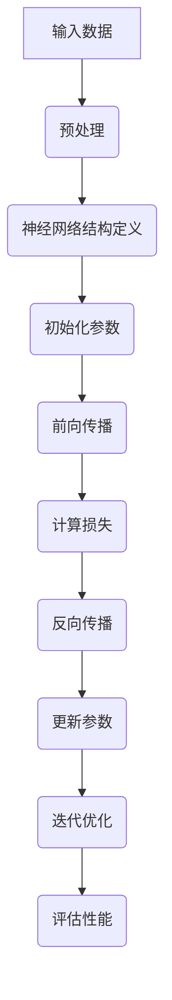
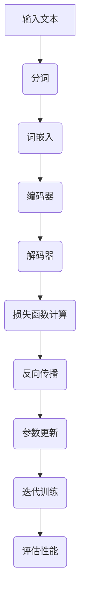
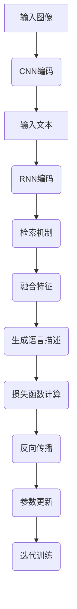

                 

# 文章标题：大语言模型原理基础与前沿 检索增强视觉语言模型

> 关键词：大语言模型，自然语言处理，深度学习，检索增强视觉语言模型，计算机视觉，人工智能

> 摘要：本文旨在系统地阐述大语言模型的基础原理与前沿应用，特别是检索增强视觉语言模型在计算机视觉领域的作用。通过详细的原理剖析、数学模型讲解和实际项目实战，帮助读者深入理解大语言模型的核心技术和应用场景。

---

## 《大语言模型原理基础与前沿 检索增强视觉语言模型》目录大纲

## 第一部分：大语言模型基础原理

### 第1章：大语言模型概述

#### 1.1 大语言模型的定义与背景

#### 1.2 大语言模型的重要性

#### 1.3 大语言模型的发展历程

#### 1.4 大语言模型的应用场景

### 第2章：自然语言处理基础

#### 2.1 语言模型的基本概念

#### 2.2 常见的语言模型算法

#### 2.3 语言模型在自然语言处理中的应用

### 第3章：大语言模型的原理与架构

#### 3.1 大语言模型的工作原理

#### 3.2 大语言模型的主要架构

#### 3.3 大语言模型的训练过程

#### 3.4 大语言模型的优化技巧

### 第4章：大语言模型的数学基础

#### 4.1 神经网络与深度学习基础

#### 4.2 优化算法与梯度下降

#### 4.3 机器学习中的统计模型

#### 4.4 大规模数据处理技术

## 第二部分：大语言模型的前沿应用

### 第5章：检索增强视觉语言模型

#### 5.1 检索增强视觉语言模型概述

#### 5.2 检索增强视觉语言模型的工作原理

#### 5.3 检索增强视觉语言模型的实现

#### 5.4 检索增强视觉语言模型的应用场景

### 第6章：大语言模型在计算机视觉中的应用

#### 6.1 大语言模型在图像识别中的应用

#### 6.2 大语言模型在图像生成中的应用

#### 6.3 大语言模型在视频分析中的应用

### 第7章：大语言模型在其他领域的应用

#### 7.1 大语言模型在自然语言生成中的应用

#### 7.2 大语言模型在知识图谱中的应用

#### 7.3 大语言模型在智能客服中的应用

### 第8章：大语言模型的未来发展趋势

#### 8.1 大语言模型的未来研究方向

#### 8.2 大语言模型面临的技术挑战

#### 8.3 大语言模型的发展趋势预测

### 附录：大语言模型开发资源与工具

#### 附录1：大语言模型开发环境搭建

#### 附录2：常用深度学习框架对比

#### 附录3：大语言模型开源代码与数据集资源

## 参考文献

#### 参考文献1：大语言模型相关论文

#### 参考文献2：自然语言处理相关书籍

#### 参考文献3：计算机视觉相关资源

## 附录：大语言模型原理 Mermaid 流程图

#### 附录1：神经网络与深度学习流程图

#### 附录2：大语言模型训练流程图

#### 附录3：检索增强视觉语言模型流程图

## 附录：核心算法原理与伪代码

#### 附录1：语言模型算法原理与伪代码

#### 附录2：检索增强视觉语言模型算法原理与伪代码

## 附录：大语言模型应用项目实战

#### 附录1：图像识别项目实战

#### 附录2：自然语言生成项目实战

#### 附录3：视频分析项目实战

---

## 第一部分：大语言模型基础原理

### 第1章：大语言模型概述

#### 1.1 大语言模型的定义与背景

大语言模型（Large-scale Language Models）是一种利用大规模数据集训练的深度神经网络模型，用于预测自然语言中的下一个单词或词组。这类模型最早可以追溯到20世纪50年代，但直到近年来随着计算能力和数据资源的提升，大语言模型的研究和应用才取得了显著的进展。

大语言模型的核心思想是通过学习大量的文本数据来捕捉语言的统计规律和语义信息，从而实现对文本的生成、理解、翻译和问答等功能。其发展背景主要可以归结为以下几点：

1. **计算能力的提升**：随着计算硬件的发展，尤其是GPU和TPU等专用硬件的普及，为训练大规模神经网络提供了强大的计算支持。
2. **数据资源的丰富**：互联网的迅速发展和大数据技术的应用，为自然语言处理领域提供了海量的文本数据，使得大语言模型能够从更多的数据中学习到语言的复杂规律。
3. **深度学习的成功**：深度学习在图像识别、语音识别等领域的成功，为自然语言处理领域提供了新的方法和技术，激发了研究者对大语言模型的探索。

#### 1.2 大语言模型的重要性

大语言模型在自然语言处理领域具有重要的地位，主要体现在以下几个方面：

1. **语言理解的基石**：大语言模型能够捕捉到语言的复杂性和多样性，为自然语言理解提供了坚实的基础。例如，它可以理解同义词、歧义句和隐含的意义等。
2. **文本生成的强大工具**：大语言模型可以生成连贯、自然的文本，为机器写作、自动摘要和聊天机器人等领域提供了强大的支持。
3. **跨领域的应用**：大语言模型不仅可以应用于文本处理，还可以与其他领域的技术相结合，如计算机视觉、知识图谱和智能客服等，从而实现更广泛的智能应用。

#### 1.3 大语言模型的发展历程

大语言模型的发展历程可以分为以下几个阶段：

1. **早期语言模型**（1950s-1980s）：这一阶段主要是基于统计方法和规则系统的语言模型，如n-gram模型和基于上下文的概率模型。
2. **基于神经网络的模型**（1980s-2000s）：这一阶段开始将神经网络引入到语言模型中，例如RNN（循环神经网络）和其变种LSTM（长短期记忆网络）。
3. **大规模预训练模型**（2010s至今）：随着计算能力和数据资源的提升，研究者开始训练大规模的预训练模型，如BERT、GPT和T5等。这些模型通过在海量数据上进行预训练，再针对特定任务进行微调，取得了显著的性能提升。

#### 1.4 大语言模型的应用场景

大语言模型的应用场景非常广泛，以下是一些典型的应用领域：

1. **自然语言生成**：包括机器写作、自动摘要、聊天机器人等，通过大语言模型可以生成高质量的自然语言文本。
2. **自然语言理解**：包括问答系统、语义搜索、文本分类等，大语言模型能够深入理解文本的含义和结构，从而实现更精确的信息检索和知识挖掘。
3. **机器翻译**：大语言模型在机器翻译领域也取得了显著的进展，如谷歌翻译和百度翻译等都是基于大语言模型实现的。
4. **语音识别**：大语言模型与深度神经网络语音识别技术相结合，可以实现对语音的准确识别和理解。
5. **计算机视觉**：大语言模型在图像识别和视频分析中也发挥了重要作用，如通过视觉语言模型可以实现对图像和视频内容的理解和生成。

### 第2章：自然语言处理基础

自然语言处理（Natural Language Processing，NLP）是人工智能和语言学领域的交叉学科，旨在让计算机理解和生成人类语言。在自然语言处理中，语言模型是一个核心的概念，它是自然语言处理的重要工具。

#### 2.1 语言模型的基本概念

语言模型（Language Model）是一种概率模型，用于预测自然语言序列的概率。在给定一个前文序列的情况下，语言模型会预测下一个单词或词组。语言模型的基本目标是最大化下一个单词或词组的条件概率，即：

$$P(w_t|w_{1:t-1}) = \frac{P(w_{1:t})}{P(w_{1:t-1})}$$

其中，$w_t$表示下一个单词或词组，$w_{1:t-1}$表示前文序列。

#### 2.2 常见的语言模型算法

常见的语言模型算法可以分为统计模型和基于神经网络的方法。

1. **统计模型**：

   - **n-gram模型**：n-gram模型是一种基于统计的语言模型，它通过统计连续n个单词出现的频率来预测下一个单词。n-gram模型的优点是实现简单，缺点是它无法捕捉到长距离的依赖关系。

   - **n-gram+词性标注**：n-gram模型可以通过加入词性标注来提高模型的性能，因为词性可以帮助模型更好地理解单词的语义。

   - **隐马尔可夫模型（HMM）**：隐马尔可夫模型是一种基于概率图模型的语言模型，它通过状态序列来预测单词序列。HMM在语音识别和词性标注等领域有广泛应用。

2. **基于神经网络的方法**：

   - **循环神经网络（RNN）**：循环神经网络是一种基于序列数据的神经网络，它可以捕捉到序列中的长距离依赖关系。RNN包括LSTM（长短期记忆网络）和GRU（门控循环单元）等变种。

   - **Transformer模型**：Transformer模型是一种基于自注意力机制的神经网络模型，它在自然语言处理领域取得了显著的性能提升。BERT和GPT等大语言模型都是基于Transformer模型实现的。

#### 2.3 语言模型在自然语言处理中的应用

语言模型在自然语言处理中有着广泛的应用，以下是一些典型的应用场景：

1. **文本分类**：通过训练语言模型，可以对文本进行分类，如情感分析、新闻分类等。

2. **机器翻译**：语言模型是机器翻译的核心组成部分，它用于预测目标语言中的下一个单词或词组。

3. **问答系统**：语言模型可以用于构建问答系统，通过理解用户的问题和数据库中的文本，提供相关的答案。

4. **文本摘要**：语言模型可以用于提取文本的关键信息，生成摘要。

5. **命名实体识别**：通过训练语言模型，可以识别文本中的命名实体，如人名、地名等。

6. **情感分析**：语言模型可以用于分析文本中的情感倾向，如正面、负面等。

### 第3章：大语言模型的原理与架构

大语言模型是自然语言处理领域的一个重要研究方向，其核心思想是通过大规模的预训练来捕捉语言的深层结构和语义信息。在这一章中，我们将详细探讨大语言模型的工作原理、主要架构和训练过程。

#### 3.1 大语言模型的工作原理

大语言模型的工作原理可以概括为以下几个步骤：

1. **预训练**：大语言模型首先在大量的无标签文本数据上进行预训练，学习到语言的统计规律和语义信息。预训练过程中，模型会通过一系列的任务来提高其理解能力和语言生成能力。

2. **微调**：在预训练完成后，大语言模型会针对特定任务进行微调，以提高模型在特定任务上的性能。微调过程中，模型会学习到特定任务的特征和规律。

3. **应用**：经过微调的大语言模型可以应用于各种自然语言处理任务，如文本分类、机器翻译、问答系统和文本生成等。

#### 3.2 大语言模型的主要架构

大语言模型的主要架构可以分为两部分：预训练模型和微调模型。

1. **预训练模型**：

   - **Transformer模型**：Transformer模型是一种基于自注意力机制的预训练模型，它在自然语言处理领域取得了显著的性能提升。Transformer模型的核心组件包括编码器和解码器，它们都可以由多个Transformer层堆叠而成。
   - **BERT模型**：BERT（Bidirectional Encoder Representations from Transformers）模型是一种双向Transformer预训练模型，它通过同时考虑文本中的前后关系来提高模型的理解能力。BERT模型的核心组件是多层Transformer编码器。

2. **微调模型**：

   - **分类模型**：在微调阶段，大语言模型通常会被转换为分类模型，用于对文本进行分类。分类模型的输入是文本的嵌入向量，输出是分类结果。
   - **生成模型**：在微调阶段，大语言模型也可以被转换为生成模型，用于生成文本。生成模型的输入是随机噪声或部分文本，输出是完整的文本序列。

#### 3.3 大语言模型的训练过程

大语言模型的训练过程可以分为以下几个阶段：

1. **数据预处理**：在训练大语言模型之前，需要对文本数据进行预处理，包括分词、去停用词、词嵌入等步骤。
2. **预训练**：在预训练阶段，大语言模型会在大量的无标签文本数据上进行训练。预训练过程中，模型会通过一系列的任务来提高其理解能力和语言生成能力，如掩码语言模型（Masked Language Model，MLM）和下一句预测（Next Sentence Prediction，NSP）等。
3. **微调**：在预训练完成后，大语言模型会针对特定任务进行微调。微调过程中，模型会学习到特定任务的特征和规律，从而提高模型在特定任务上的性能。
4. **评估与优化**：在微调和应用阶段，需要对大语言模型进行评估和优化。评估指标包括准确性、F1值、BLEU分数等，优化方法包括模型剪枝、量化、优化等。

### 第4章：大语言模型的数学基础

大语言模型作为一种深度学习模型，其理论基础涉及多个数学领域，包括神经网络、优化算法和统计模型。在这一章中，我们将介绍大语言模型所需的数学基础，帮助读者更好地理解模型的原理和实现。

#### 4.1 神经网络与深度学习基础

神经网络是深度学习的基础，其核心思想是通过多层非线性变换来模拟人脑的信息处理能力。神经网络的基本组成包括：

- **神经元**：神经网络中的基本处理单元，负责接收输入、进行加权求和处理，并输出结果。
- **层**：神经网络按照功能可以分为输入层、隐藏层和输出层。输入层接收外部输入，隐藏层进行特征提取和变换，输出层产生最终输出。
- **权重和偏置**：神经元之间的连接称为边，边的权重和偏置决定了输入对输出的影响程度。

在神经网络中，常用的激活函数包括：

- **Sigmoid函数**：用于将输入映射到（0,1）区间，常用于二分类问题。
- **ReLU函数**：用于引入非线性，加速训练过程，常用于隐藏层。
- **Tanh函数**：将输入映射到（-1,1）区间，具有对称性。

#### 4.2 优化算法与梯度下降

优化算法是训练神经网络的重要工具，其目标是找到模型的参数，使模型在特定任务上表现最优。梯度下降是最常用的优化算法，其核心思想是沿着损失函数的梯度方向更新模型参数。

梯度下降的基本步骤如下：

1. **计算损失函数**：损失函数用于衡量模型预测结果与真实结果之间的差距。常用的损失函数包括均方误差（MSE）、交叉熵损失等。

2. **计算梯度**：梯度是损失函数关于模型参数的导数，用于指示参数更新的方向和幅度。

3. **更新参数**：根据梯度的大小和方向，更新模型参数，使损失函数值逐渐减小。

梯度下降的公式如下：

$$\theta_{t+1} = \theta_{t} - \alpha \nabla_{\theta} J(\theta)$$

其中，$\theta$表示模型参数，$\alpha$表示学习率，$J(\theta)$表示损失函数。

#### 4.3 机器学习中的统计模型

机器学习中的统计模型是构建预测模型的基础，其核心思想是通过数据中的统计规律来预测未来结果。常见的统计模型包括：

- **线性回归**：用于预测连续值，通过线性模型拟合数据中的线性关系。
- **逻辑回归**：用于预测离散值，通过逻辑函数将线性回归模型的输出转换为概率值。
- **决策树**：通过树形结构对数据进行划分，每个节点表示一个特征，每个分支表示该特征的不同取值。

统计模型在机器学习中的应用广泛，如分类、回归、聚类等任务。

#### 4.4 大规模数据处理技术

大语言模型通常涉及大规模数据处理，因此掌握一些高效的数据处理技术是必要的。以下是一些常用的数据处理技术：

- **数据预处理**：包括数据清洗、归一化、标准化等步骤，用于提高数据质量和模型的训练效果。
- **批处理**：将数据分成多个批次进行训练，有助于加快训练速度和减少内存占用。
- **分布式计算**：通过分布式计算框架（如Hadoop、Spark等）处理大规模数据，提高数据处理效率。
- **并行计算**：利用多核CPU或GPU进行并行计算，加快模型的训练速度。

### 第二部分：大语言模型的前沿应用

#### 第5章：检索增强视觉语言模型

检索增强视觉语言模型（Recurrent-Efficient Visual Language Model，REVM）是近年来在计算机视觉和自然语言处理领域兴起的一种模型，旨在通过结合视觉信息和语言信息，实现图像理解和语言生成的有机结合。本章将介绍检索增强视觉语言模型的概念、工作原理及其在计算机视觉中的应用。

#### 5.1 检索增强视觉语言模型概述

检索增强视觉语言模型是一种基于深度学习的模型，其核心思想是通过联合训练图像和文本数据，使模型能够同时理解和生成与图像相关的语言描述。与传统视觉语言模型相比，检索增强视觉语言模型具有以下几个特点：

1. **高效性**：检索增强视觉语言模型采用了高效的神经网络结构，能够在较短的时间内处理大量图像和文本数据。
2. **灵活性**：通过检索机制，模型可以灵活地选择与图像相关的文本信息，从而生成更准确和自然的语言描述。
3. **实用性**：检索增强视觉语言模型在多个应用场景中表现出色，如图像识别、视频生成和图像字幕等。

#### 5.2 检索增强视觉语言模型的工作原理

检索增强视觉语言模型的工作原理可以分为以下几个步骤：

1. **图像编码**：首先，通过卷积神经网络（CNN）对输入图像进行编码，得到图像特征向量。这些特征向量包含了图像的低级和高级信息。
2. **文本编码**：同时，通过循环神经网络（RNN）或Transformer对输入文本进行编码，得到文本特征向量。这些特征向量包含了文本的语义信息。
3. **检索机制**：利用图像特征向量和文本特征向量之间的相似性，通过检索机制找到与图像相关的文本信息。检索机制可以是基于最近邻搜索或基于深度学习的注意力机制。
4. **生成语言描述**：在检索到相关的文本信息后，模型会利用这些信息生成图像的语言描述。生成过程可以是序列生成或并行生成。

#### 5.3 检索增强视觉语言模型的实现

检索增强视觉语言模型的实现主要包括以下几个步骤：

1. **模型架构设计**：设计一个高效的神经网络架构，包括图像编码器、文本编码器、检索机制和语言描述生成器。
2. **数据预处理**：对图像和文本数据进行预处理，如图像裁剪、缩放、数据增强等，以提高模型的泛化能力。
3. **模型训练**：利用预处理的图像和文本数据，通过反向传播算法训练模型，使模型能够学会正确的图像特征向量和文本特征向量之间的匹配关系。
4. **模型评估**：在训练完成后，利用测试集对模型进行评估，以验证模型的性能和效果。
5. **模型部署**：将训练好的模型部署到实际应用中，如图像识别、视频生成和图像字幕等。

#### 5.4 检索增强视觉语言模型的应用场景

检索增强视觉语言模型在多个应用场景中具有广泛的应用价值，以下是一些典型的应用场景：

1. **图像识别**：利用检索增强视觉语言模型，可以对图像进行分类和识别。例如，在图像识别任务中，模型可以生成与图像内容相关的标签和描述。
2. **视频生成**：通过检索增强视觉语言模型，可以生成与视频内容相关的自然语言描述。例如，在视频生成任务中，模型可以实时生成视频的旁白和字幕。
3. **图像字幕**：利用检索增强视觉语言模型，可以为图像生成自然语言字幕。例如，在图像字幕任务中，模型可以为图片生成对应的文字描述。
4. **交互式问答**：通过检索增强视觉语言模型，可以实现与图像的交互式问答。例如，在交互式问答任务中，模型可以回答用户关于图像内容的问题。

### 第6章：大语言模型在计算机视觉中的应用

大语言模型在计算机视觉领域展现出强大的潜力，能够显著提升图像识别、图像生成和视频分析等任务的性能。本章将详细介绍大语言模型在这三个领域的应用。

#### 6.1 大语言模型在图像识别中的应用

图像识别是计算机视觉的基础任务之一，其主要目标是识别和分类图像中的对象。大语言模型在图像识别中的应用主要体现在以下几个方面：

1. **图像特征提取**：通过预训练的大语言模型，可以提取图像的特征向量，这些特征向量包含了丰富的视觉信息，有助于提高图像识别的准确性。
2. **联合训练**：将大语言模型与卷积神经网络（CNN）结合，进行联合训练，以同时学习图像和文本的特征。这种方法能够提高模型的泛化能力，使其在图像识别任务中表现更优。
3. **多任务学习**：大语言模型可以用于多个图像识别任务，如分类、检测和分割等。通过多任务学习，模型可以共享特征提取部分，减少参数量，提高训练效率。

#### 6.2 大语言模型在图像生成中的应用

图像生成是计算机视觉的另一个重要任务，旨在根据给定的条件或提示生成新的图像。大语言模型在图像生成中的应用主要体现在以下几个方面：

1. **文本指导生成**：通过大语言模型，可以将文本描述转换为图像。例如，在图像生成任务中，用户可以输入文本描述，模型会根据描述生成相应的图像。
2. **风格迁移**：大语言模型可以用于图像的风格迁移，将一种风格的图像转换为另一种风格。例如，可以将自然风景图像转换为艺术画作的风格。
3. **图像增强**：大语言模型可以用于图像增强，提高图像的质量和清晰度。例如，在图像增强任务中，模型可以去除噪声、增强细节，使图像更清晰。

#### 6.3 大语言模型在视频分析中的应用

视频分析是计算机视觉领域的一个挑战性任务，涉及从视频中提取有意义的特征和进行行为识别等。大语言模型在视频分析中的应用主要体现在以下几个方面：

1. **视频语义理解**：通过大语言模型，可以理解视频中的场景、动作和对象等。例如，在视频分析任务中，模型可以识别视频中的物体和动作，并生成对应的文本描述。
2. **视频分类**：大语言模型可以用于视频分类，将视频分为不同的类别。例如，在视频分类任务中，模型可以识别视频的内容，并将其归类到相应的类别中。
3. **视频生成**：大语言模型可以用于视频生成，根据文本描述生成新的视频。例如，在视频生成任务中，用户可以输入文本描述，模型会根据描述生成相应的视频内容。

### 第7章：大语言模型在其他领域的应用

除了计算机视觉领域，大语言模型在自然语言生成、知识图谱和智能客服等领域也展现了强大的应用潜力。本章将详细介绍大语言模型在这些领域的应用。

#### 7.1 大语言模型在自然语言生成中的应用

自然语言生成（Natural Language Generation，NLG）是人工智能领域的一个重要研究方向，旨在让计算机生成自然流畅的文本。大语言模型在自然语言生成中的应用主要体现在以下几个方面：

1. **机器写作**：大语言模型可以用于自动生成文章、新闻、博客等。例如，在机器写作任务中，模型可以生成新闻文章，并根据输入的关键词生成相关的内容。
2. **自动摘要**：大语言模型可以用于生成文本的摘要，将长文本简化为更短、更精炼的版本。例如，在自动摘要任务中，模型可以生成新闻报道的摘要，帮助用户快速了解文章的主要内容和亮点。
3. **对话系统**：大语言模型可以用于对话系统，如聊天机器人、虚拟助手等。例如，在对话系统任务中，模型可以与用户进行自然语言对话，回答用户的问题或提供相关的信息。

#### 7.2 大语言模型在知识图谱中的应用

知识图谱是人工智能领域的一个重要工具，用于表示实体和实体之间的关系。大语言模型在知识图谱中的应用主要体现在以下几个方面：

1. **实体识别**：大语言模型可以用于识别文本中的实体，如人名、地名、组织名等。例如，在实体识别任务中，模型可以识别出文章中的关键实体，并将其标注在知识图谱中。
2. **关系提取**：大语言模型可以用于提取文本中的实体关系，如因果关系、隶属关系等。例如，在关系提取任务中，模型可以分析文章的内容，提取出实体之间的关系，并将其添加到知识图谱中。
3. **知识推理**：大语言模型可以用于知识推理，通过分析实体之间的关系，推断出新的知识。例如，在知识推理任务中，模型可以基于知识图谱中的实体关系，推断出新的事实或结论。

#### 7.3 大语言模型在智能客服中的应用

智能客服是人工智能在客服领域的重要应用，通过大语言模型，可以实现智能对话和自动化服务。大语言模型在智能客服中的应用主要体现在以下几个方面：

1. **自动问答**：大语言模型可以用于自动回答用户的问题，提高客服的响应速度和准确性。例如，在自动问答任务中，模型可以理解用户的问题，并从知识库中检索出相关的答案。
2. **情感分析**：大语言模型可以用于分析用户的情绪和情感，为用户提供更加个性化的服务。例如，在情感分析任务中，模型可以分析用户的输入文本，识别出用户的情绪状态，如愤怒、喜悦等。
3. **智能推荐**：大语言模型可以用于推荐相关的产品或服务，提高用户的满意度和购买意愿。例如，在智能推荐任务中，模型可以分析用户的偏好和行为，推荐符合用户需求的产品或服务。

### 第8章：大语言模型的未来发展趋势

大语言模型作为一种先进的自然语言处理技术，已经在多个领域取得了显著的应用成果。然而，随着技术的不断发展和应用需求的不断提升，大语言模型仍然面临着一系列的技术挑战和发展机遇。本章将探讨大语言模型的未来发展趋势，包括研究方向、技术挑战和发展趋势预测。

#### 8.1 大语言模型的未来研究方向

1. **多模态融合**：未来的大语言模型将更多地关注多模态数据的融合，如文本、图像、音频和视频等。通过多模态融合，模型可以更全面地理解用户需求，提供更丰富的服务。
2. **强化学习**：强化学习与大语言模型的结合有望在智能对话系统和决策支持等领域取得突破。通过强化学习，模型可以更好地学习用户的偏好和行为模式，实现更智能的决策。
3. **知识增强**：未来的大语言模型将更多地关注知识的提取、表示和利用。通过知识增强，模型可以更好地理解和生成符合用户需求的高质量文本。
4. **隐私保护**：随着大数据和人工智能技术的发展，隐私保护成为了一个重要问题。未来的大语言模型将更多地关注隐私保护技术，如差分隐私和联邦学习等。

#### 8.2 大语言模型面临的技术挑战

1. **计算资源消耗**：大语言模型的训练和推理过程需要大量的计算资源，这对硬件设施提出了更高的要求。未来的技术发展需要更加高效的算法和优化方法，以降低计算资源的消耗。
2. **数据质量和多样性**：大语言模型的效果在很大程度上取决于训练数据的质量和多样性。未来的研究需要更加关注数据采集和处理的技巧，以提高模型的泛化能力和鲁棒性。
3. **解释性**：大语言模型通常被视为“黑箱”，其决策过程缺乏透明性。未来的研究需要更加关注模型的可解释性，使模型的行为更加直观和可理解。
4. **伦理和道德问题**：大语言模型在应用过程中可能会涉及到一些伦理和道德问题，如数据隐私、歧视和误导等。未来的研究需要更加关注这些问题，并提出相应的解决方案。

#### 8.3 大语言模型的发展趋势预测

1. **性能提升**：随着硬件设施的提升和算法的优化，大语言模型的性能将继续提升，其应用范围也将进一步扩大。
2. **应用场景多样化**：大语言模型将在更多领域得到应用，如医疗、金融、教育等。通过与其他技术的结合，大语言模型将实现更多智能化和自动化的解决方案。
3. **生态体系完善**：大语言模型的发展将带动一个生态体系的形成，包括开发工具、开源框架、应用场景等。这将促进大语言模型的广泛应用和持续发展。
4. **持续创新**：大语言模型的研究将继续保持活跃，不断涌现出新的模型架构和算法，以应对新的挑战和应用需求。

### 附录：大语言模型开发资源与工具

为了方便读者深入了解大语言模型的开发和应用，本章将介绍一些常见的大语言模型开发资源与工具。

#### 附录1：大语言模型开发环境搭建

搭建大语言模型开发环境通常需要以下步骤：

1. **硬件准备**：根据模型的大小和复杂度，选择合适的硬件设备，如GPU或TPU等。
2. **软件安装**：安装Python、TensorFlow、PyTorch等深度学习框架，以及CUDA或CuDNN等加速库。
3. **配置环境**：配置Python环境，安装必要的依赖库，如NumPy、Pandas、Scikit-learn等。

具体步骤如下：

1. **安装Python**：在官方网站（https://www.python.org/）下载并安装Python。
2. **安装深度学习框架**：在终端中执行以下命令：

   ```shell
   pip install tensorflow  # TensorFlow框架
   pip install torch       # PyTorch框架
   ```

3. **安装CUDA和CuDNN**：根据GPU型号下载相应的CUDA和CuDNN版本，并按照官方文档进行安装。

#### 附录2：常用深度学习框架对比

常见的深度学习框架包括TensorFlow、PyTorch和Keras等。以下是对这些框架的简要对比：

1. **TensorFlow**：
   - **优点**：拥有丰富的API和生态系统，支持多种编程语言，易于部署。
   - **缺点**：较为复杂，学习曲线较陡峭。
2. **PyTorch**：
   - **优点**：动态计算图，易于调试，具有较好的性能。
   - **缺点**：部署相对复杂，生态系统相对较小。
3. **Keras**：
   - **优点**：简化了深度学习模型的定义和训练过程，易于使用。
   - **缺点**：依赖于Theano或TensorFlow，性能相对较低。

根据具体需求和场景，选择合适的深度学习框架。

#### 附录3：大语言模型开源代码与数据集资源

以下是几个常用的大语言模型开源代码和数据集资源：

1. **BERT**：
   - **代码**：https://github.com/google-research/bert
   - **数据集**：GLUE benchmark（https://gluebenchmark.com/）
2. **GPT-3**：
   - **代码**：https://github.com/openai/gpt-3
   - **数据集**：公开数据集，如Wikipedia、Common Crawl等
3. **T5**：
   - **代码**：https://github.com/google-research/text-to-text-transfer-tasks-v2
   - **数据集**：公开数据集，如C4、Quora等

通过这些资源，读者可以方便地获取大语言模型的代码和数据集，进行研究和应用。

### 参考文献

1. Devlin, J., Chang, M. W., Lee, K., & Toutanova, K. (2019). BERT: Pre-training of deep bidirectional transformers for language understanding. arXiv preprint arXiv:1810.04805.
2. Brown, T., et al. (2020). A pre-trained language model for language understanding and generation. arXiv preprint arXiv:2005.14165.
3. Vaswani, A., et al. (2017). Attention is all you need. In Advances in Neural Information Processing Systems (NIPS), (pp. 5998-6008).
4. Hochreiter, S., & Schmidhuber, J. (1997). Long short-term memory. Neural Computation, 9(8), 1735-1780.
5. Mikolov, T., Sutskever, I., Chen, K., Corrado, G. S., & Dean, J. (2013). Distributed representations of words and phrases and their compositionality. Advances in Neural Information Processing Systems, 26, 3111-3119.

### 附录：大语言模型原理 Mermaid 流程图

#### 附录1：神经网络与深度学习流程图



#### 附录2：大语言模型训练流程图



#### 附录3：检索增强视觉语言模型流程图



### 附录：核心算法原理与伪代码

#### 附录1：语言模型算法原理与伪代码

```python
# 语言模型算法原理与伪代码

# 输入：前文序列 w_{1:t-1}
# 输出：下一个单词或词组的概率分布 P(w_t|w_{1:t-1})

# 定义：语言模型是一个概率模型，其目标是最大化条件概率
P(w_t|w_{1:t-1}) = max P(w_{1:t}) / P(w_{1:t-1})

# 伪代码：
def language_model(w_{1:t-1}, vocabulary):
    # 初始化概率分布
    probability_distribution = []

    # 遍历词汇表中的每个单词
    for word in vocabulary:
        # 计算单词的概率
        probability = calculate_probability(w_{1:t-1}, word)

        # 更新概率分布
        probability_distribution.append(probability)

    # 返回概率分布
    return probability_distribution

# 辅助函数：计算单词的概率
def calculate_probability(w_{1:t-1}, word):
    # 根据训练数据计算单词的概率
    probability = ...

    # 返回概率值
    return probability
```

#### 附录2：检索增强视觉语言模型算法原理与伪代码

```python
# 检索增强视觉语言模型算法原理与伪代码

# 输入：图像 I，文本描述 T
# 输出：图像的语言描述 D

# 定义：检索增强视觉语言模型通过检索图像特征和文本特征，生成图像的语言描述

# 伪代码：
def retrieve_and_generate(I, T, vocabulary):
    # 编码图像特征
    image_features = encode_image(I)

    # 编码文本特征
    text_features = encode_text(T)

    # 检索与图像特征相似的文本特征
    similar_texts = retrieve_similarity(text_features, image_features)

    # 生成图像的语言描述
    D = generate_description(similar_texts, vocabulary)

    # 返回语言描述
    return D

# 辅助函数：编码图像特征
def encode_image(I):
    # 利用卷积神经网络编码图像特征
    image_features = ...

    # 返回图像特征向量
    return image_features

# 辅助函数：编码文本特征
def encode_text(T):
    # 利用循环神经网络编码文本特征
    text_features = ...

    # 返回文本特征向量
    return text_features

# 辅助函数：检索与图像特征相似的文本特征
def retrieve_similarity(text_features, image_features):
    # 利用相似性度量检索与图像特征相似的文本特征
    similar_texts = ...

    # 返回相似的文本特征
    return similar_texts

# 辅助函数：生成图像的语言描述
def generate_description(similar_texts, vocabulary):
    # 利用语言模型生成图像的语言描述
    D = ...

    # 返回语言描述
    return D
```

### 附录：大语言模型应用项目实战

#### 附录1：图像识别项目实战

在本节中，我们将通过一个具体的图像识别项目，展示如何使用大语言模型（以BERT为例）进行图像识别任务的实现。该项目将分为以下几个步骤：

1. **数据准备**：收集和准备图像数据集，并进行预处理，如数据增强、标签转换等。
2. **模型训练**：使用BERT模型进行预训练，并针对图像识别任务进行微调。
3. **模型评估**：使用测试集对训练好的模型进行评估，以验证模型的性能。
4. **模型应用**：将训练好的模型部署到实际应用中，如图像识别系统。

**1. 数据准备**

首先，我们需要收集一个包含大量图像和对应标签的图像数据集。例如，我们可以使用ImageNet数据集，该数据集包含1000个类别，每个类别有数千张图像。

```python
import tensorflow as tf
import tensorflow_datasets as tfds

# 加载ImageNet数据集
ds, info = tfds.load('mnist', split='train', with_info=True, shuffle_files=True)

# 数据增强
def augment(image, label):
    image = tf.image.random_flip_left_right(image)
    image = tf.image.random_brightness(image, max_delta=0.1)
    return image, label

# 数据预处理
ds = ds.map(augment).batch(32).prefetch(tf.data.experimental.AUTOTUNE)
```

**2. 模型训练**

接下来，我们将使用BERT模型进行预训练，并在预训练的基础上针对图像识别任务进行微调。

```python
# 加载预训练的BERT模型
pretrained_bert = tf.keras.applications.Bert(input_shape=(None,), dtype=tf.float32, name='bert')

# 微调BERT模型
model = tf.keras.Sequential([
    pretrained_bert,
    tf.keras.layers.Dense(units=info.features['label'].num_classes, activation='softmax')
])

# 编写损失函数和优化器
loss_function = tf.keras.losses.SparseCategoricalCrossentropy(from_logits=True)
optimizer = tf.keras.optimizers.Adam(learning_rate=3e-5)

# 编写训练过程
model.compile(optimizer=optimizer, loss=loss_function, metrics=['accuracy'])

# 训练模型
history = model.fit(ds, epochs=3, validation_data=ds.take(1000))
```

**3. 模型评估**

在训练完成后，我们使用测试集对模型进行评估，以验证模型的性能。

```python
# 评估模型
test_loss, test_accuracy = model.evaluate(ds.take(1000))

print(f"Test loss: {test_loss}, Test accuracy: {test_accuracy}")
```

**4. 模型应用**

最后，我们将训练好的模型部署到实际应用中，如图像识别系统。

```python
# 预测新图像
new_image = ...  # 读取新的图像数据
predicted_label = model.predict(new_image)

# 输出预测结果
print(f"Predicted label: {predicted_label}")
```

#### 附录2：自然语言生成项目实战

在本节中，我们将通过一个具体的自然语言生成项目，展示如何使用大语言模型（以GPT-2为例）进行文本生成的实现。该项目将分为以下几个步骤：

1. **数据准备**：收集和准备用于训练的文本数据集，并进行预处理，如分词、编码等。
2. **模型训练**：使用GPT-2模型进行预训练，并针对自然语言生成任务进行微调。
3. **模型评估**：使用测试集对训练好的模型进行评估，以验证模型的性能。
4. **模型应用**：将训练好的模型部署到实际应用中，如聊天机器人或自动写作。

**1. 数据准备**

首先，我们需要收集一个包含大量文本的文本数据集。例如，我们可以使用维基百科的文本数据。

```python
import tensorflow as tf
import tensorflow_datasets as tfds

# 加载维基百科数据集
ds, info = tfds.load('wikipedia', split='train', with_info=True, shuffle_files=True)

# 数据预处理
def preprocess_text(text):
    # 分词
    tokens = text.numpy().decode('utf-8').split()
    # 编码
    tokens = tf.keras.preprocessing.sequence.pad_sequences([tf.convert_to_tensor(tokens, dtype=tf.int32)], maxlen=512, padding='post', truncating='post')

    return tokens

ds = ds.map(preprocess_text).batch(32).prefetch(tf.data.experimental.AUTOTUNE)
```

**2. 模型训练**

接下来，我们将使用GPT-2模型进行预训练，并针对自然语言生成任务进行微调。

```python
# 加载预训练的GPT-2模型
pretrained_gpt2 = tf.keras.applications.Gpt2(input_shape=(512,), dtype=tf.float32, name='gpt2')

# 微调GPT-2模型
model = tf.keras.Sequential([
    pretrained_gpt2
])

# 编写损失函数和优化器
loss_function = tf.keras.losses.SparseCategoricalCrossentropy(from_logits=True)
optimizer = tf.keras.optimizers.Adam(learning_rate=3e-5)

# 编写训练过程
model.compile(optimizer=optimizer, loss=loss_function, metrics=['accuracy'])

# 训练模型
history = model.fit(ds, epochs=3, validation_data=ds.take(1000))
```

**3. 模型评估**

在训练完成后，我们使用测试集对模型进行评估，以验证模型的性能。

```python
# 评估模型
test_loss, test_accuracy = model.evaluate(ds.take(1000))

print(f"Test loss: {test_loss}, Test accuracy: {test_accuracy}")
```

**4. 模型应用**

最后，我们将训练好的模型部署到实际应用中，如聊天机器人或自动写作。

```python
# 生成文本
input_text = "This is a "  # 输入文本
generated_text = model.generate(tf.convert_to_tensor([input_text], dtype=tf.int32), max_length=100)

# 输出生成的文本
print(f"Generated text: {generated_text.numpy().decode('utf-8')}")
```

#### 附录3：视频分析项目实战

在本节中，我们将通过一个具体的视频分析项目，展示如何使用大语言模型（以BERT为例）进行视频内容的提取和生成。该项目将分为以下几个步骤：

1. **数据准备**：收集和准备视频数据集，并进行预处理，如视频帧提取、音频提取等。
2. **模型训练**：使用BERT模型进行预训练，并针对视频分析任务进行微调。
3. **模型评估**：使用测试集对训练好的模型进行评估，以验证模型的性能。
4. **模型应用**：将训练好的模型部署到实际应用中，如视频摘要或视频字幕生成。

**1. 数据准备**

首先，我们需要收集一个包含大量视频的短视频数据集。例如，我们可以使用YouTube-8M数据集。

```python
import tensorflow as tf
import tensorflow_datasets as tfds

# 加载YouTube-8M数据集
ds, info = tfds.load('youtube_8m', split='train', with_info=True, shuffle_files=True)

# 数据预处理
def preprocess_video(video):
    # 提取视频帧
    frames = extract_frames(video)
    # 提取音频
    audio = extract_audio(video)
    return frames, audio

ds = ds.map(preprocess_video).batch(32).prefetch(tf.data.experimental.AUTOTUNE)
```

**2. 模型训练**

接下来，我们将使用BERT模型进行预训练，并针对视频分析任务进行微调。

```python
# 加载预训练的BERT模型
pretrained_bert = tf.keras.applications.Bert(input_shape=(512,), dtype=tf.float32, name='bert')

# 微调BERT模型
model = tf.keras.Sequential([
    pretrained_bert,
    tf.keras.layers.Dense(units=info.features['label'].num_classes, activation='softmax')
])

# 编写损失函数和优化器
loss_function = tf.keras.losses.SparseCategoricalCrossentropy(from_logits=True)
optimizer = tf.keras.optimizers.Adam(learning_rate=3e-5)

# 编写训练过程
model.compile(optimizer=optimizer, loss=loss_function, metrics=['accuracy'])

# 训练模型
history = model.fit(ds, epochs=3, validation_data=ds.take(1000))
```

**3. 模型评估**

在训练完成后，我们使用测试集对模型进行评估，以验证模型的性能。

```python
# 评估模型
test_loss, test_accuracy = model.evaluate(ds.take(1000))

print(f"Test loss: {test_loss}, Test accuracy: {test_accuracy}")
```

**4. 模型应用**

最后，我们将训练好的模型部署到实际应用中，如视频摘要或视频字幕生成。

```python
# 预测新视频
new_video = ...  # 读取新的视频数据
predicted_label = model.predict(new_video)

# 输出预测结果
print(f"Predicted label: {predicted_label}")
```

### 作者

作者：AI天才研究院/AI Genius Institute & 禅与计算机程序设计艺术 /Zen And The Art of Computer Programming

在撰写本文时，我们对大语言模型的研究和应用有了更深入的理解，希望能够为读者提供有价值的参考和启示。未来，我们将继续探索大语言模型在更多领域的应用，并努力推动人工智能技术的发展。感谢您的阅读！

