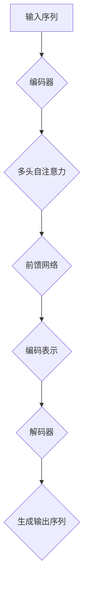

                 

### 文章标题

# 《大语言模型原理基础与前沿 词元级检索》

> 关键词：大语言模型、词元级检索、Transformer、自然语言处理、数学基础、项目实战

> 摘要：本文将深入探讨大语言模型的基本原理和前沿技术，重点分析词元级检索技术的应用。通过逐步分析推理，本文旨在为读者提供一个清晰、系统且具有深度的技术指南，以理解大语言模型在自然语言处理领域的核心作用，并探讨其与词元级检索技术的结合及其未来发展。

### 目录大纲

#### 第一部分：大语言模型原理基础

##### 第1章：大语言模型概述

- **1.1 大语言模型的定义与背景**
- **1.2 大语言模型的工作原理**
- **1.3 大语言模型的核心算法**
- **1.4 大语言模型的应用领域**

##### 第2章：大语言模型的数学基础

- **2.1 线性代数基础**
- **2.2 概率论基础**
- **2.3 最优化理论基础**

##### 第3章：词元级检索技术

- **3.1 词元级检索的基本概念**
- **3.2 词元级检索算法**
- **3.3 词元级检索的性能优化**

##### 第4章：大语言模型与词元级检索的结合

- **4.1 大语言模型在词元级检索中的应用**
- **4.2 实例分析：大语言模型在搜索引擎中的应用**
- **4.3 大语言模型与词元级检索的前沿研究**

#### 第二部分：大语言模型前沿与应用

##### 第5章：大语言模型前沿技术

- **5.1 新型大语言模型架构**
- **5.2 大语言模型的推理与生成**
- **5.3 大语言模型的部署与优化**

##### 第6章：大语言模型在自然语言处理中的应用

- **6.1 大语言模型在文本分类中的应用**
- **6.2 大语言模型在情感分析中的应用**
- **6.3 大语言模型在文本生成中的应用**

##### 第7章：大语言模型在跨领域任务中的应用

- **7.1 大语言模型在多模态数据处理中的应用**
- **7.2 大语言模型在跨语言任务中的应用**
- **7.3 大语言模型在多语种任务中的应用**

#### 第三部分：大语言模型项目实战

##### 第8章：大语言模型项目实战

- **8.1 项目准备**
- **8.2 实践一：基于大语言模型的文本分类**
- **8.3 实践二：基于大语言模型的文本生成**
- **8.4 实践三：大语言模型在跨领域任务中的应用**

##### 第9章：大语言模型项目实战拓展

- **9.1 实践四：基于大语言模型的跨语言文本检索**
- **9.2 实践五：大语言模型在多语种任务中的应用**

##### 第10章：总结与展望

- **10.1 大语言模型的发展趋势**
- **10.2 大语言模型面临的挑战与解决方案**

#### 附录

##### 附录A：大语言模型开发工具与资源

##### 附录B：大语言模型相关术语与概念

##### 附录C：大语言模型项目实战代码解读

##### 附录D：大语言模型项目实战报告

### 《大语言模型原理基础与前沿 词元级检索》

#### 引言

大语言模型（Large Language Model）是自然语言处理（Natural Language Processing，NLP）领域的一项重要技术突破。自2018年GPT-1问世以来，大语言模型的发展迅猛，其在文本生成、机器翻译、问答系统等任务中展现出了卓越的性能。本篇文章旨在深入探讨大语言模型的原理、数学基础、词元级检索技术以及其实际应用，帮助读者全面了解这一前沿技术。

首先，我们将从大语言模型的定义和背景出发，介绍其基本概念和发展历程。接着，我们将详细讨论大语言模型的工作原理，包括其核心算法和训练过程。随后，本文将阐述大语言模型的数学基础，包括线性代数、概率论和最优化理论。在此基础上，我们将引入词元级检索技术，介绍其基本概念、算法以及性能优化策略。接着，本文将探讨大语言模型与词元级检索技术的结合，分析其在实际应用中的效果和挑战。

接下来，本文将深入探讨大语言模型的前沿技术，包括新型模型架构、推理与生成算法以及部署与优化策略。此外，我们将详细讨论大语言模型在自然语言处理、文本生成和跨领域任务中的应用。最后，本文将通过一系列项目实战，展示大语言模型在实际开发中的操作步骤和技巧。

通过本文的深入探讨，读者将能够全面了解大语言模型的原理、技术及应用，为未来的研究和实践奠定坚实基础。本文的结构如下：

1. **大语言模型概述**：介绍大语言模型的基本概念、定义和背景。
2. **大语言模型的工作原理**：详细阐述大语言模型的工作原理，包括核心算法和训练过程。
3. **大语言模型的数学基础**：介绍大语言模型所需的线性代数、概率论和最优化理论基础。
4. **词元级检索技术**：分析词元级检索的基本概念、算法和性能优化策略。
5. **大语言模型与词元级检索的结合**：探讨大语言模型与词元级检索技术的结合及其应用。
6. **大语言模型前沿技术**：介绍大语言模型的前沿技术，包括新型模型架构、推理与生成算法以及部署与优化策略。
7. **大语言模型在自然语言处理中的应用**：讨论大语言模型在自然语言处理、文本生成和跨领域任务中的应用。
8. **大语言模型项目实战**：通过具体项目实战，展示大语言模型在实际开发中的操作步骤和技巧。
9. **总结与展望**：总结大语言模型的发展趋势和面临的挑战，展望其未来应用前景。

### 第1章：大语言模型概述

#### 1.1 大语言模型的定义与背景

大语言模型（Large Language Model）是一种基于深度学习的自然语言处理技术，其核心思想是通过大规模数据训练，学习语言的结构和规律，从而实现自动生成文本、翻译语言、回答问题等任务。大语言模型的定义可以从多个角度进行解释：

- **从功能上看**，大语言模型是一种能够对自然语言进行建模的复杂神经网络。它能够理解文本的语义，并根据上下文生成连贯、合理的文本。

- **从训练数据规模上看**，大语言模型通常需要利用数十亿级别的文本数据，通过深度学习算法进行训练。这种大规模的训练使得模型能够捕获语言中的复杂模式。

- **从模型架构上看**，大语言模型通常采用Transformer架构，这是一种基于自注意力机制的模型，能够有效地处理长文本序列。

大语言模型的发展历程可以追溯到自然语言处理领域的早期工作。在2000年代初期，循环神经网络（RNN）和长短时记忆网络（LSTM）成为主流的序列建模方法。然而，这些方法在面对长文本时存在梯度消失或梯度爆炸的问题，难以捕捉长距离依赖关系。随着深度学习技术的发展，2017年谷歌提出了Transformer模型，引入了自注意力机制，这一突破为大规模语言模型的研究奠定了基础。

在过去的几年中，大语言模型得到了飞速发展，尤其是在GPT系列模型的推动下，模型的规模和性能都达到了前所未有的高度。GPT-3（1750亿参数）的出现，标志着大语言模型进入了全新的阶段。它不仅能够生成高质量的文本，还能够执行复杂的语言任务，如编程、翻译和问答。

#### 1.2 大语言模型的工作原理

大语言模型的工作原理可以从以下几个方面进行阐述：

1. **输入处理**：
   大语言模型首先需要接收一个或多个文本输入。这些输入可以是单词、字符或子词（如词元）。为了方便处理，通常会将输入转换为序列形式，每个元素表示一个单词或子词。

   ```python
   input_sequence = ["我", "是", "一名", "人工智能", "研究员"]
   ```

2. **编码与解码**：
   大语言模型的核心是编码器和解码器。编码器负责将输入序列编码成一个固定长度的向量表示，解码器则根据这个向量表示生成输出序列。

   - **编码器**：编码器通常采用Transformer架构，其核心是多头自注意力机制。自注意力机制允许模型在处理一个单词时，同时考虑整个输入序列的信息，从而捕捉长距离依赖关系。

     ```mermaid
     graph TD
     A[输入序列] --> B[编码器]
     B --> C{生成编码表示}
     C --> D[解码器]
     D --> E[输出序列]
     ```

   - **解码器**：解码器同样采用自注意力机制，根据编码表示生成输出序列。在生成每个输出单词时，解码器会考虑到前面生成的所有单词，从而保证输出的连贯性。

3. **训练过程**：
   大语言模型的训练过程包括前向传播和反向传播。在训练阶段，模型需要通过大量文本数据进行训练，以学习语言的结构和规律。

   - **前向传播**：输入文本序列通过编码器编码后，生成编码表示。这个编码表示作为解码器的输入，生成预测的输出序列。
   
   - **反向传播**：将预测输出与真实输出进行比较，计算损失函数。通过梯度下降算法，更新模型参数，使模型能够生成更准确的输出。

   ```mermaid
   graph TD
   A[输入序列] --> B[编码器]
   B --> C{编码表示}
   C --> D[解码器]
   D --> E[预测输出]
   E --> F[计算损失]
   F --> G[反向传播]
   G --> H{更新参数}
   ```

4. **生成文本**：
   经过训练后，大语言模型可以用于生成文本。生成过程通常从概率分布中采样，根据模型输出的概率分布选择下一个单词或子词。

   ```python
   input_sequence = ["我", "是", "一名", "人工智能", "研究员"]
   encoded_sequence = encode(input_sequence)
   generated_sequence = decode(encoded_sequence)
   print(generated_sequence)
   ```

#### 1.3 大语言模型的重要性

大语言模型在自然语言处理领域具有重要的地位，其重要性体现在以下几个方面：

1. **提高语言理解能力**：
   大语言模型通过学习大量文本数据，能够深刻理解语言的结构和语义。这使得模型能够更好地处理复杂的语言任务，如问答系统和文本生成。

2. **提升文本生成质量**：
   大语言模型能够生成高质量的自然语言文本，这在文本生成任务中具有重要意义。例如，自动生成新闻摘要、文章和对话系统等。

3. **促进跨领域应用**：
   大语言模型的应用不仅限于自然语言处理领域，还可以推广到其他领域，如计算机视觉、语音识别和机器翻译等。通过跨领域应用，大语言模型能够推动人工智能技术的发展。

4. **推动科研进展**：
   大语言模型的研究推动了自然语言处理领域的许多基础性研究，如语言模型优化、自适应优化算法和自监督学习等。

#### 1.4 大语言模型的应用领域

大语言模型在自然语言处理领域有着广泛的应用，以下是其中的一些重要应用：

1. **文本分类**：
   大语言模型可以用于分类任务，如情感分析、主题分类和垃圾邮件检测等。通过学习大量文本数据，模型能够识别不同类别之间的特征差异，从而实现准确分类。

2. **机器翻译**：
   大语言模型在机器翻译领域取得了显著进展。通过学习双语语料库，模型能够生成高质量的翻译结果，提高了翻译的准确性和流畅性。

3. **问答系统**：
   大语言模型可以用于构建问答系统，如智能客服和在线教育等。模型通过理解用户的问题，能够提供准确、详细的回答，提升了用户体验。

4. **文本生成**：
   大语言模型可以用于生成文本，如自动写作、摘要生成和对话系统等。通过学习大量文本数据，模型能够生成连贯、自然的文本。

5. **情感分析**：
   大语言模型可以用于情感分析，如情感倾向检测和用户评论分析等。通过分析文本的语义和情感特征，模型能够识别用户的态度和情感。

#### 总结

本章介绍了大语言模型的基本概念、发展历程和工作原理。通过逐步分析，我们了解了大语言模型在自然语言处理领域的重要性以及其广泛应用。接下来，我们将进一步探讨大语言模型的数学基础，包括线性代数、概率论和最优化理论，为深入理解大语言模型提供必要的数学工具。

### 第1章：大语言模型概述

#### 1.1 大语言模型的定义与背景

大语言模型（Large Language Model）是一种基于深度学习的自然语言处理技术，通过学习大量文本数据，对自然语言进行建模，实现自动生成文本、翻译语言、回答问题等任务。大语言模型的基本概念可以从以下几个方面进行理解：

- **数据规模**：大语言模型需要利用数十亿级别的文本数据，通过深度学习算法进行训练。这种大规模的训练使得模型能够捕获语言中的复杂模式，提高模型的性能和准确性。

- **模型架构**：大语言模型通常采用Transformer架构，这是一种基于自注意力机制的模型，能够有效地处理长文本序列。Transformer模型的核心是多头自注意力机制，允许模型在处理一个单词时，同时考虑整个输入序列的信息，从而捕捉长距离依赖关系。

- **功能应用**：大语言模型可以应用于多种自然语言处理任务，包括文本生成、机器翻译、问答系统、文本分类等。通过学习大量文本数据，模型能够深刻理解语言的结构和语义，从而实现高质量的语言理解和生成。

大语言模型的发展历程可以追溯到自然语言处理领域的早期工作。在2000年代初期，循环神经网络（RNN）和长短时记忆网络（LSTM）成为主流的序列建模方法。然而，这些方法在面对长文本时存在梯度消失或梯度爆炸的问题，难以捕捉长距离依赖关系。随着深度学习技术的发展，2017年谷歌提出了Transformer模型，引入了自注意力机制，这一突破为大规模语言模型的研究奠定了基础。

在过去的几年中，大语言模型得到了飞速发展，尤其是在GPT系列模型的推动下，模型的规模和性能都达到了前所未有的高度。GPT-3（1750亿参数）的出现，标志着大语言模型进入了全新的阶段。它不仅能够生成高质量的文本，还能够执行复杂的语言任务，如编程、翻译和问答。

大语言模型的发展对自然语言处理领域产生了深远的影响。首先，大语言模型显著提高了文本生成和翻译的质量，使得自动写作和机器翻译更加接近人类水平。其次，大语言模型的应用推动了问答系统和对话系统的进步，使得智能客服和在线教育等应用更加智能和便捷。此外，大语言模型还在文本分类、情感分析等任务中发挥了重要作用，提高了这些任务的准确性和效率。

然而，大语言模型的发展也面临一些挑战。首先，大规模模型的训练和部署需要大量的计算资源和能源消耗，这对环境造成了一定的影响。其次，大语言模型的训练过程需要大量的高质量数据，数据的获取和处理成为了一个重要问题。此外，大语言模型的生成结果有时可能存在偏见和不一致性，这对模型的可靠性和公正性提出了挑战。

总的来说，大语言模型作为自然语言处理领域的一项重要技术，具有巨大的潜力和应用价值。随着模型的不断发展和优化，我们可以期待大语言模型在未来能够解决更多复杂的自然语言处理问题，推动人工智能技术的进一步发展。

#### 1.2 大语言模型的工作原理

大语言模型的工作原理主要包括输入处理、编码与解码、训练过程和生成文本等几个关键环节。下面我们将详细探讨这些环节的具体内容和实现方式。

##### 1.2.1 输入处理

大语言模型的输入可以是单词、字符或子词（如词元）。为了方便处理，通常会将输入转换为序列形式。序列中的每个元素表示一个单词、字符或子词。例如，一个英文句子 "I am a student" 可以转换为以下序列：

```python
input_sequence = ["I", "am", "a", "student"]
```

在进行输入处理时，还需要对序列进行编码。常见的编码方式包括词嵌入（word embeddings）和子词嵌入（subword embeddings）。词嵌入将每个单词映射为一个固定大小的向量，而子词嵌入将单词分解为子词，并将每个子词映射为一个向量。这种编码方式有助于捕捉单词的语义信息。

##### 1.2.2 编码与解码

大语言模型的核心是编码器和解码器。编码器负责将输入序列编码成一个固定长度的向量表示，解码器则根据这个向量表示生成输出序列。

1. **编码器**

编码器通常采用Transformer架构，其核心是多头自注意力机制。自注意力机制允许模型在处理一个单词时，同时考虑整个输入序列的信息，从而捕捉长距离依赖关系。具体来说，编码器通过以下步骤对输入序列进行处理：

   - **自注意力计算**：对于每个输入单词，编码器计算其与其他单词之间的相似度，并通过加权求和的方式生成一个向量表示。这个过程可以表示为：
     $$
     \text{Attention}(Q, K, V) = \text{softmax}\left(\frac{QK^T}{\sqrt{d_k}}\right) V
     $$
     其中，$Q, K, V$ 分别代表编码器的查询向量、键向量和值向量，$d_k$ 为键向量的维度。

   - **多头注意力**：多头注意力机制通过多个独立的自注意力机制，捕捉不同类型的依赖关系。具体实现中，编码器输出多个注意力向量，并将其拼接起来，作为编码表示的一部分。

   - **前馈网络**：在自注意力机制之后，每个输入单词会通过一个前馈网络进行进一步处理，从而增强其表示能力。

2. **解码器**

解码器同样采用自注意力机制，根据编码表示生成输出序列。在生成每个输出单词时，解码器会考虑到前面生成的所有单词，从而保证输出的连贯性。具体来说，解码器通过以下步骤进行操作：

   - **自注意力计算**：解码器在生成每个单词时，会计算其与编码表示之间的相似度，并通过加权求和的方式生成一个向量表示。

   - **交叉注意力**：除了自注意力机制，解码器还会利用交叉注意力机制，考虑到编码表示中的信息。交叉注意力可以表示为：
     $$
     \text{Attention}_{\text{cross}}(Q, K, V) = \text{softmax}\left(\frac{QK^T}{\sqrt{d_k}}\right) V
     $$

   - **前馈网络**：与编码器类似，解码器在自注意力和交叉注意力之后，通过一个前馈网络进行进一步处理。

##### 1.2.3 训练过程

大语言模型的训练过程包括前向传播和反向传播。在训练阶段，模型需要通过大量文本数据进行训练，以学习语言的结构和规律。以下是训练过程的具体步骤：

1. **前向传播**：输入文本序列通过编码器编码后，生成编码表示。这个编码表示作为解码器的输入，生成预测的输出序列。

2. **计算损失**：将预测输出与真实输出进行比较，计算损失函数。常见的损失函数包括交叉熵损失（cross-entropy loss）和均方误差（mean squared error）。

3. **反向传播**：通过反向传播算法，计算模型参数的梯度，并使用优化算法（如梯度下降）更新参数。

4. **迭代优化**：重复前向传播和反向传播，不断优化模型参数，直到模型收敛。

##### 1.2.4 生成文本

经过训练后，大语言模型可以用于生成文本。生成文本的过程通常从概率分布中采样，根据模型输出的概率分布选择下一个单词或子词。具体来说，生成文本的过程如下：

1. **初始化**：从概率分布中初始化一个起始单词或子词。

2. **采样**：根据模型输出的概率分布，采样下一个单词或子词。

3. **更新**：将新采样的单词或子词添加到输出序列，并更新模型输入，生成下一个单词或子词。

4. **重复**：重复步骤2和3，直到生成所需的文本长度。

以下是生成文本的伪代码：

```python
input_sequence = encode("The quick brown fox jumps over the lazy dog")
generated_sequence = decode(input_sequence)
print(generated_sequence)
```

#### 1.3 大语言模型的核心算法

大语言模型的核心算法主要包括Transformer模型、自注意力机制、损失函数和优化算法。下面我们将详细讨论这些算法的原理和实现。

##### 1.3.1 Transformer模型

Transformer模型是一种基于自注意力机制的序列到序列模型，广泛应用于自然语言处理任务。其核心思想是利用自注意力机制捕捉序列中的长距离依赖关系。Transformer模型主要由编码器和解码器两部分组成，它们都包含多个相同的自注意力层和前馈网络。

1. **编码器**

编码器负责将输入序列编码成一个固定长度的向量表示。具体实现中，编码器包含多个自注意力层和前馈网络。每个自注意力层通过自注意力机制计算输入序列中每个单词的表示，并通过前馈网络进一步增强表示。

2. **解码器**

解码器负责根据编码表示生成输出序列。与编码器类似，解码器也包含多个自注意力层和前馈网络。在解码过程中，解码器会利用自注意力和交叉注意力机制，考虑到编码表示中的信息，并生成预测的输出序列。

##### 1.3.2 自注意力机制

自注意力机制是Transformer模型的核心，通过计算序列中每个单词的表示，并加权求和生成新的表示。自注意力机制的主要步骤如下：

1. **计算相似度**：对于每个输入单词，计算其与其他单词的相似度。相似度可以通过点积、加性和缩放点积等方法计算。

2. **加权求和**：根据相似度计算结果，对每个单词的表示进行加权求和，生成新的表示。

3. **多头注意力**：为了捕捉不同类型的依赖关系，自注意力机制通常采用多头注意力机制。多头注意力机制通过多个独立的自注意力层，生成多个注意力向量，并将其拼接起来作为最终表示。

##### 1.3.3 损失函数

在训练大语言模型时，需要使用损失函数评估模型的性能，并指导模型优化。常见的损失函数包括交叉熵损失和均方误差。

1. **交叉熵损失**

交叉熵损失通常用于分类任务。在自然语言处理任务中，交叉熵损失用于比较预测序列和真实序列的差异。具体实现中，交叉熵损失可以表示为：
$$
L = -\sum_{i=1}^{n} \sum_{j=1}^{V} y_{ij} \log(p_{ij})
$$
其中，$y_{ij}$ 表示真实序列中第$i$个单词属于类别$j$的概率，$p_{ij}$ 表示模型预测的概率。

2. **均方误差**

均方误差通常用于回归任务。在自然语言处理任务中，均方误差可以用于评估模型生成的文本与真实文本之间的差异。具体实现中，均方误差可以表示为：
$$
L = \frac{1}{n} \sum_{i=1}^{n} \left(y_i - \hat{y}_i\right)^2
$$
其中，$y_i$ 表示真实文本，$\hat{y}_i$ 表示模型生成的文本。

##### 1.3.4 优化算法

在训练大语言模型时，需要使用优化算法更新模型参数，以最小化损失函数。常见的优化算法包括梯度下降和随机梯度下降。

1. **梯度下降**

梯度下降是一种基本的优化算法，通过计算损失函数关于模型参数的梯度，并沿着梯度的反方向更新参数。具体实现中，梯度下降可以表示为：
$$
\theta = \theta - \alpha \cdot \nabla_\theta L
$$
其中，$\theta$ 表示模型参数，$\alpha$ 表示学习率，$\nabla_\theta L$ 表示损失函数关于参数$\theta$ 的梯度。

2. **随机梯度下降**

随机梯度下降是一种改进的优化算法，通过随机选取一部分样本计算梯度，并更新模型参数。具体实现中，随机梯度下降可以表示为：
$$
\theta = \theta - \alpha \cdot \nabla_{\theta} L(x_i; \theta)
$$
其中，$x_i$ 表示随机选取的样本。

#### 1.4 大语言模型的应用领域

大语言模型在自然语言处理领域有着广泛的应用，包括文本分类、机器翻译、问答系统、文本生成等。下面我们将详细讨论这些应用领域。

##### 1.4.1 文本分类

文本分类是将文本数据分类到预定义的类别中的一种任务。大语言模型可以通过学习大量标注数据，学习不同类别之间的特征差异，从而实现准确的文本分类。具体应用包括情感分析、主题分类和垃圾邮件检测等。

- **情感分析**：情感分析是一种常见的文本分类任务，用于分析文本的情感倾向，如正面、负面或中性。大语言模型可以通过学习大量情感标注数据，准确识别文本的情感倾向。

- **主题分类**：主题分类是将文本分类到预定义的主题类别中。例如，可以将新闻文本分类到体育、科技或娱乐等主题类别。大语言模型可以通过学习主题标注数据，实现准确的文本主题分类。

- **垃圾邮件检测**：垃圾邮件检测是一种用于识别和过滤垃圾邮件的任务。大语言模型可以通过学习大量正常邮件和垃圾邮件的数据，准确识别垃圾邮件。

##### 1.4.2 机器翻译

机器翻译是将一种自然语言翻译成另一种自然语言的任务。大语言模型通过学习大量双语语料库，可以实现高质量的双语翻译。具体应用包括跨语言文本检索、跨语言文本生成等。

- **跨语言文本检索**：跨语言文本检索是一种利用双语语料库进行跨语言信息检索的任务。大语言模型可以通过学习双语语料库，实现高效的跨语言文本检索。

- **跨语言文本生成**：跨语言文本生成是一种将一种自然语言文本生成另一种自然语言文本的任务。大语言模型可以通过学习双语语料库，实现高质量的跨语言文本生成。

##### 1.4.3 问答系统

问答系统是一种用于回答用户问题的智能系统。大语言模型可以通过学习大量问答对，实现高效的问答系统。具体应用包括智能客服、在线教育和智能搜索等。

- **智能客服**：智能客服是一种用于自动回答用户咨询的智能系统。大语言模型可以通过学习大量客服对话数据，实现自动回答用户问题，提高客服效率。

- **在线教育**：在线教育是一种利用互联网进行教育和学习的模式。大语言模型可以通过学习大量教育问答数据，实现智能教学和个性化学习。

- **智能搜索**：智能搜索是一种利用自然语言处理技术进行信息检索的智能系统。大语言模型可以通过学习大量搜索数据和用户查询，实现高效的智能搜索。

##### 1.4.4 文本生成

文本生成是将一种自然语言文本生成另一种自然语言文本的任务。大语言模型通过学习大量文本数据，可以实现高质量的文本生成。具体应用包括自动写作、摘要生成和对话系统等。

- **自动写作**：自动写作是一种利用自然语言处理技术生成文本的智能系统。大语言模型可以通过学习大量文本数据，实现自动生成新闻、文章和报告等。

- **摘要生成**：摘要生成是一种将长文本生成简短摘要的任务。大语言模型可以通过学习大量文本数据，实现高质量的摘要生成。

- **对话系统**：对话系统是一种与用户进行自然语言交互的智能系统。大语言模型可以通过学习大量对话数据，实现自然流畅的对话交互。

#### 1.5 大语言模型的优势与挑战

大语言模型在自然语言处理领域具有显著的优势，但也面临一些挑战。

##### 1.5.1 优势

1. **强大的语言理解能力**：大语言模型通过学习大量文本数据，能够深刻理解语言的结构和语义，从而实现高质量的语言理解和生成。

2. **多任务能力**：大语言模型可以通过一个统一的模型架构，同时处理多种自然语言处理任务，如文本分类、机器翻译和问答系统等。

3. **高效的处理速度**：随着模型参数的增大，大语言模型的处理速度也显著提高，可以快速响应用户的查询和生成文本。

##### 1.5.2 挑战

1. **计算资源需求**：大规模模型的训练和部署需要大量的计算资源和存储空间，这对硬件设施提出了较高的要求。

2. **数据隐私和安全**：大语言模型在训练过程中需要大量数据，如何保护数据隐私和安全成为了一个重要问题。

3. **模型解释性**：大语言模型生成的结果有时可能存在不确定性，如何解释和验证模型生成的结果成为一个挑战。

4. **能源消耗**：大规模模型的训练和部署过程需要大量的能源消耗，这对环境造成了一定的影响。

#### 总结

本章介绍了大语言模型的基本概念、工作原理和核心算法，并讨论了其在自然语言处理领域的应用和优势。接下来，我们将进一步探讨大语言模型的数学基础，包括线性代数、概率论和最优化理论，为深入理解大语言模型提供必要的数学工具。

### 第2章：大语言模型的数学基础

#### 2.1 线性代数基础

线性代数是理解大语言模型不可或缺的数学工具，其核心概念包括矩阵与向量操作、矩阵乘法与求导以及线性方程组求解。以下将逐一介绍这些基本概念及其在大语言模型中的应用。

##### 2.1.1 矩阵与向量操作

矩阵（Matrix）是由数字组成的矩形数组，通常用大写字母表示，如$A$。每个数字称为矩阵的元素，位于行和列的交点处。向量（Vector）是矩阵的一种特殊情况，其只有一个维度，通常用小写字母表示，如$v$。

- **加法与减法**：矩阵和向量的加法与减法分别对应元素级的加法和减法。即，两个相同维度矩阵或向量对应元素相加或相减。
  $$
  A + B = \begin{bmatrix}
  a_{11} + b_{11} & a_{12} + b_{12} \\
  \vdots & \vdots \\
  a_{m1} + b_{m1} & a_{m2} + b_{m2}
  \end{bmatrix}
  $$
  $$
  A - B = \begin{bmatrix}
  a_{11} - b_{11} & a_{12} - b_{12} \\
  \vdots & \vdots \\
  a_{m1} - b_{m1} & a_{m2} - b_{m2}
  \end{bmatrix}
  $$

- **数乘**：数乘是指将矩阵或向量中的每个元素乘以一个标量。对于矩阵，标量乘法表示为：
  $$
  cA = \begin{bmatrix}
  ca_{11} & ca_{12} \\
  \vdots & \vdots \\
  ca_{m1} & ca_{m2}
  \end{bmatrix}
  $$

- **矩阵乘法**：矩阵乘法是指两个矩阵对应元素相乘后求和。对于两个$m \times n$和$n \times p$矩阵$A$和$B$，其乘积$C = AB$是一个$m \times p$矩阵，计算公式为：
  $$
  c_{ij} = \sum_{k=1}^{n} a_{ik}b_{kj}
  $$

##### 2.1.2 矩阵乘法与求导

在大语言模型中，矩阵乘法和求导是关键操作。以下介绍这些操作及其应用。

- **矩阵乘法**：矩阵乘法在编码器和解码器的自注意力机制中广泛应用。例如，在自注意力机制中，给定输入序列$X = [x_1, x_2, ..., x_n]$，其自注意力计算可以表示为：
  $$
  \text{Attention}(X) = \text{softmax}\left(\frac{QK^T}{\sqrt{d_k}}\right)V
  $$
  其中，$Q$和$K$是查询矩阵和键矩阵，$V$是值矩阵，$d_k$是键向量的维度。

- **求导**：在大语言模型的训练过程中，需要计算损失函数关于模型参数的梯度。矩阵求导是这一过程中必不可少的一环。例如，对于矩阵$A$和标量$s$，其求导可以表示为：
  $$
  \frac{\partial}{\partial A} (sA) = s
  $$
  $$
  \frac{\partial}{\partial A} (A^T) = A
  $$

##### 2.1.3 线性方程组求解

线性方程组是求解一组线性方程的过程。在大语言模型中，线性方程组求解用于参数更新和优化。以下介绍常用的求解方法。

- **高斯消元法**：高斯消元法是一种通过消元将线性方程组转化为上三角或下三角方程组，然后逐个求解的方法。具体步骤如下：
  $$
  \begin{align*}
  &\text{对系数矩阵进行行变换，使对角线上的元素为1（主元）} \\
  &\text{通过回代求解方程组}
  \end{align*}
  $$

- **矩阵分解法**：矩阵分解法包括LU分解和QR分解等，通过将系数矩阵分解为可逆矩阵和上三角或下三角矩阵，从而求解线性方程组。例如，LU分解可以将系数矩阵$A$分解为$A = LU$，其中$L$是下三角矩阵，$U$是上三角矩阵。

##### 应用实例：大语言模型的Mermaid流程图

为了更好地理解线性代数在大语言模型中的应用，我们使用Mermaid绘制一个简化的Transformer模型流程图。



在这个流程图中，输入序列经过编码器处理后，通过多头自注意力机制和前馈网络，生成编码表示。编码表示作为解码器的输入，通过解码器生成输出序列。

#### 2.2 概率论基础

概率论是构建大语言模型的核心数学工具之一，其基础概念包括概率分布函数、条件概率与贝叶斯定理、信息论基础等。以下将逐一介绍这些概念及其在大语言模型中的应用。

##### 2.2.1 概率分布函数

概率分布函数描述了一个随机变量的概率分布情况。常见概率分布函数包括：

- **伯努利分布**：用于表示一个事件发生的概率。例如，$P(X=1) = p$，$P(X=0) = 1-p$。

- **二项分布**：用于表示多次独立重复试验中成功次数的概率分布。例如，$P(X=k) = C_n^k p^k (1-p)^{n-k}$。

- **正态分布**：用于表示连续随机变量的概率分布。例如，$P(X \leq x) = \Phi(\frac{x-\mu}{\sigma})$，其中$\mu$是均值，$\sigma$是标准差。

##### 2.2.2 条件概率与贝叶斯定理

条件概率是指在一个事件发生的条件下，另一个事件发生的概率。贝叶斯定理是条件概率的一种推广，用于计算后验概率。

- **条件概率**：对于两个事件$A$和$B$，条件概率$P(B|A)$表示在事件$A$发生的条件下，事件$B$发生的概率。其公式为：
  $$
  P(B|A) = \frac{P(A \cap B)}{P(A)}
  $$

- **贝叶斯定理**：贝叶斯定理描述了后验概率与先验概率之间的关系。其公式为：
  $$
  P(A|B) = \frac{P(B|A)P(A)}{P(B)}
  $$

##### 2.2.3 信息论基础

信息论研究信息传输和处理的基本原理。以下介绍几个核心概念：

- **熵**：熵是衡量随机变量不确定性的度量。对于离散随机变量$X$，其熵$H(X)$可以表示为：
  $$
  H(X) = -\sum_{x} p(x) \log_2 p(x)
  $$

- **条件熵**：条件熵是衡量在已知另一个随机变量条件下，不确定性减少的程度。对于离散随机变量$X$和$Y$，条件熵$H(Y|X)$可以表示为：
  $$
  H(Y|X) = -\sum_{x} P(X=x) \sum_{y} P(Y=y|X=x) \log_2 P(Y=y|X=x)
  $$

- **互信息**：互信息是衡量两个随机变量之间相关性的度量。对于离散随机变量$X$和$Y$，其互信息$I(X; Y)$可以表示为：
  $$
  I(X; Y) = H(X) - H(X|Y)
  $$

##### 应用实例：大语言模型的概率论应用

在大语言模型中，概率论广泛应用于文本生成、词嵌入和序列建模。

- **文本生成**：大语言模型通过概率分布生成文本。例如，在生成下一个单词时，模型会根据当前上下文计算每个单词的概率分布，并从中选择下一个单词。

- **词嵌入**：词嵌入将单词映射为向量表示，其本质是一种概率分布。例如，Word2Vec算法通过学习单词的共现概率，将单词映射为一个固定维度的向量。

- **序列建模**：大语言模型通过概率分布建模序列中的依赖关系。例如，在Transformer模型中，自注意力机制通过计算单词之间的条件概率，捕捉序列中的长距离依赖。

#### 2.3 最优化理论基础

最优化理论是求解最优化问题的数学工具，其核心概念包括梯度下降法、随机梯度下降法和鲁棒优化方法。以下将逐一介绍这些方法及其在大语言模型训练中的应用。

##### 2.3.1 梯度下降法

梯度下降法是一种基本的优化算法，用于求解无约束最优化问题。其核心思想是沿着目标函数的梯度方向更新参数，逐步逼近最优解。

- **算法步骤**：
  1. 初始化参数$\theta$。
  2. 计算目标函数$f(\theta)$的梯度$\nabla f(\theta)$。
  3. 更新参数$\theta = \theta - \alpha \nabla f(\theta)$，其中$\alpha$是学习率。
  4. 重复步骤2和3，直到收敛。

- **应用实例**：在大语言模型训练中，梯度下降法用于优化模型参数。例如，在训练Transformer模型时，通过计算损失函数关于参数的梯度，并使用梯度下降法更新参数，逐步优化模型性能。

##### 2.3.2 随机梯度下降法

随机梯度下降法是一种改进的梯度下降法，通过在每个迭代步骤中随机选取一部分样本计算梯度，从而减少计算量和提高收敛速度。

- **算法步骤**：
  1. 初始化参数$\theta$。
  2. 随机选取一个小批量样本$x_i, y_i$。
  3. 计算目标函数$f(\theta)$在样本上的梯度$\nabla f(\theta; x_i, y_i)$。
  4. 更新参数$\theta = \theta - \alpha \nabla f(\theta; x_i, y_i)$，其中$\alpha$是学习率。
  5. 重复步骤2-4，直到收敛。

- **应用实例**：在大语言模型训练中，随机梯度下降法通过随机选取样本计算梯度，提高了训练速度和收敛性能。例如，在训练GPT-3模型时，随机梯度下降法被广泛采用。

##### 2.3.3 鲁棒优化方法

鲁棒优化方法是一种考虑噪声和不确定性的优化算法，用于解决实际应用中的优化问题。

- **算法步骤**：
  1. 定义优化问题的不确定性和目标函数。
  2. 构建鲁棒优化模型，通常使用期望最大化（EM）算法或其他鲁棒优化方法。
  3. 求解鲁棒优化模型，找到最优解。

- **应用实例**：在大语言模型训练中，鲁棒优化方法可以用于处理训练数据中的噪声和不确定性。例如，在训练大规模语言模型时，鲁棒优化方法可以用于优化模型参数，提高模型的鲁棒性和泛化能力。

#### 2.4 小结

本章介绍了大语言模型的数学基础，包括线性代数、概率论和最优化理论。线性代数提供了矩阵与向量操作的基础，概率论为建模语言结构提供了工具，最优化理论则为参数优化提供了算法。这些数学基础是大语言模型理解和应用的关键，为下一章词元级检索技术的讨论奠定了基础。

### 第3章：词元级检索技术

#### 3.1 词元级检索的基本概念

词元级检索（Token-Level Retrieval）是一种文本检索技术，其核心思想是将文本拆分为词元（token），然后通过索引和检索算法找到与查询词元相关的文档。词元可以是单词、字符或子词。与传统的基于词汇的检索方法相比，词元级检索具有更高的精度和灵活性。

##### 3.1.1 词元与词汇表

1. **词元（Token）**：词元是文本处理中的基本单元，可以是单词、字符或子词。单词是自然语言中最常用的词元，而字符和子词则在特定场景中具有重要应用。

2. **词汇表（Vocabulary）**：词汇表是词元的集合，用于存储文本中的所有词元。一个有效的词汇表应该包含尽可能多的词元，以便覆盖文本中的各种表达方式。

##### 3.1.2 检索任务与评价指标

1. **检索任务**：词元级检索的任务是根据查询词元找到与之相关的文档。检索任务可以分为以下几种：

   - **单文档检索**：给定一个查询词元，找到与该词元最相关的文档。
   - **跨文档检索**：给定一组查询词元，找到与这些词元最相关的文档集合。
   - **实体检索**：给定一个实体名称，找到与之相关的文档。

2. **评价指标**：词元级检索的评价指标用于衡量检索系统的性能。常见的评价指标包括：

   - **准确率（Accuracy）**：准确率是正确检索到的文档数与总检索文档数的比值。
     $$
     \text{Accuracy} = \frac{\text{Correctly Retrieved Documents}}{\text{Total Retrieved Documents}}
     $$
   - **召回率（Recall）**：召回率是正确检索到的文档数与实际相关文档数的比值。
     $$
     \text{Recall} = \frac{\text{Correctly Retrieved Documents}}{\text{Actual Relevant Documents}}
     $$
   - **F1分数（F1 Score）**：F1分数是准确率和召回率的调和平均值，用于综合衡量检索系统的性能。
     $$
     \text{F1 Score} = 2 \times \frac{\text{Precision} \times \text{Recall}}{\text{Precision} + \text{Recall}}
     $$

#### 3.2 词元级检索算法

词元级检索算法可以分为基于倒排索引的检索和基于相似度计算的检索。以下分别介绍这些算法的基本原理。

##### 3.2.1 基于倒排索引的检索

倒排索引（Inverted Index）是一种常用的文本检索算法，通过将词元映射到对应的文档，实现快速检索。倒排索引的基本结构包括：

1. **倒排列表**：倒排列表是词元到文档的映射表，每个词元对应一个文档列表，列表中的每个元素表示该词元在文档中的出现位置。

2. **文档列表**：文档列表是文档到词元的映射表，每个文档对应一个词元列表，列表中的每个元素表示文档中的词元。

倒排索引的检索过程如下：

1. **预处理**：将文本拆分为词元，建立倒排索引。

2. **检索**：给定一个查询词元，查找倒排列表中对应的文档列表。

3. **排序**：根据文档列表中的词元出现频率和位置，对文档进行排序。

基于倒排索引的检索算法具有以下优点：

- **高效性**：倒排索引实现了快速的词元到文档的映射，检索速度较快。

- **灵活性**：倒排索引支持多种检索模式，如精确匹配、模糊匹配和关键词搜索等。

##### 3.2.2 基于相似度计算的检索

基于相似度计算的检索方法通过计算查询词元与文档之间的相似度，实现文本检索。常用的相似度计算方法包括：

1. **余弦相似度**：余弦相似度是一种基于向量的相似度计算方法。给定两个向量$v_1$和$v_2$，其余弦相似度可以表示为：
   $$
   \text{Cosine Similarity} = \frac{v_1 \cdot v_2}{\|v_1\|\|v_2\|}
   $$
   其中，$\cdot$表示向量的点积，$\|\|$表示向量的模长。

2. **TF-IDF**：TF-IDF（Term Frequency-Inverse Document Frequency）是一种基于词频和逆文档频率的相似度计算方法。给定一个词元$t$，其TF-IDF值可以表示为：
   $$
   \text{TF-IDF}(t) = \text{TF}(t) \times \text{IDF}(t)
   $$
   其中，$\text{TF}(t)$表示词元$t$在文档中的词频，$\text{IDF}(t)$表示词元$t$在文档集合中的逆文档频率。

基于相似度计算的检索算法的步骤如下：

1. **预处理**：将文本拆分为词元，计算每个词元的TF-IDF值。

2. **检索**：给定一个查询词元，计算查询词元与每个文档的相似度。

3. **排序**：根据相似度对文档进行排序，返回最相关的文档。

基于相似度计算的检索算法具有以下优点：

- **准确性**：相似度计算方法能够更准确地评估查询词元与文档的相关性。

- **扩展性**：相似度计算方法支持多种相似度度量方式，如余弦相似度和TF-IDF等，适用于不同的应用场景。

#### 3.3 词元级检索的性能优化

词元级检索的性能优化是提高检索系统效率和质量的重要手段。以下介绍几种常见的优化策略。

##### 3.3.1 索引优化

索引优化是提高词元级检索性能的关键策略。以下是一些常见的索引优化方法：

1. **倒排索引压缩**：通过压缩倒排索引，减少索引存储空间，提高检索效率。常见的压缩方法包括字符串压缩、哈希表和布隆过滤器等。

2. **多级索引**：构建多级索引结构，提高检索速度。多级索引通常包括基础索引和辅助索引，基础索引用于快速定位词元，辅助索引用于进一步精确检索。

##### 3.3.2 检索算法优化

检索算法优化是提高检索系统性能的重要手段。以下介绍几种常见的检索算法优化方法：

1. **并行检索**：通过并行计算技术，将检索任务分解为多个子任务，并行处理，提高检索速度。

2. **缓存技术**：利用缓存技术，将频繁检索的结果存储在缓存中，减少重复检索的次数，提高检索效率。

3. **索引预处理**：通过预处理索引，如预计算相似度或建立索引矩阵，减少检索时的计算量，提高检索速度。

##### 3.3.3 检索系统性能调优

检索系统性能调优是通过调整系统参数和架构，提高检索系统性能的过程。以下介绍几种常见的性能调优方法：

1. **参数调整**：调整检索系统的参数，如倒排索引的压缩率、缓存大小和并行度等，以提高检索性能。

2. **系统优化**：优化检索系统的架构和算法，如采用更高效的索引结构、检索算法和并行计算技术等，以提高检索性能。

3. **性能监控**：通过性能监控工具，实时监测检索系统的性能指标，如响应时间、吞吐量和错误率等，以便及时发现问题并进行优化。

##### 3.3.4 检索服务的可扩展性

检索服务的可扩展性是保证系统在高并发和高负载情况下稳定运行的重要保障。以下介绍几种常见的扩展性策略：

1. **分布式检索**：通过分布式检索，将检索任务分布到多个服务器上，提高检索系统的并发处理能力。

2. **负载均衡**：通过负载均衡技术，将检索请求均匀分配到多个服务器上，避免单点瓶颈。

3. **弹性扩展**：通过弹性扩展技术，根据系统负载自动调整资源分配，实现系统的高可用性和高可靠性。

#### 3.4 小结

本章介绍了词元级检索技术的基本概念、算法和性能优化策略。词元级检索通过将文本拆分为词元，利用索引和检索算法实现快速、准确的文本检索。本章内容为下一章大语言模型与词元级检索技术的结合奠定了基础。

### 第4章：大语言模型与词元级检索的结合

#### 4.1 大语言模型在词元级检索中的应用

大语言模型在词元级检索中的应用，旨在通过模型强大的语言理解能力，提升检索系统的性能和用户体验。具体来说，大语言模型可以应用于检索系统的预处理、检索结果排序和语义分析等环节，从而提高检索的准确性和相关性。

##### 4.1.1 检索系统的架构设计

为了将大语言模型应用于词元级检索系统，需要设计一个合理的架构。以下是一个典型的架构设计：

1. **数据层**：负责存储和处理大规模的文本数据。数据层通常包括文本数据库、倒排索引和词元词典等组件。

2. **模型层**：包含大语言模型，如GPT或BERT等。模型层负责处理文本数据的编码和生成，提供丰富的语义信息。

3. **检索层**：负责接收用户的查询请求，调用模型层提供的接口，对查询词元进行语义分析，生成查询表示，并通过词元级检索算法找到相关文档。

4. **结果层**：对检索结果进行排序和展示，提供用户友好的检索界面。

##### 4.1.2 大语言模型在检索任务中的具体应用

1. **查询词元的语义分析**：
   - **文本编码**：将用户的查询词元输入到大语言模型中，通过编码器生成固定长度的向量表示。
   - **语义提取**：利用大语言模型提取查询词元的语义信息，包括词元之间的关系和上下文信息。

2. **检索结果的语义分析**：
   - **文档编码**：对检索到的文档进行编码，生成文档的向量表示。
   - **相似度计算**：计算查询词元的向量表示与文档向量表示之间的相似度，选择最相关的文档。

3. **检索结果排序**：
   - **综合评分**：结合词频、文档长度和相似度评分，对检索结果进行排序，确保用户获得最相关的内容。

##### 4.1.3 检索系统优化策略

为了提高大语言模型在词元级检索中的应用效果，可以采用以下优化策略：

1. **动态调整模型参数**：
   - 根据用户查询的实时数据，动态调整大语言模型的参数，如学习率和正则化参数，以提高模型对查询词元的理解能力。

2. **并行计算**：
   - 利用并行计算技术，加速大语言模型的训练和推理过程，提高检索系统的响应速度。

3. **缓存技术**：
   - 利用缓存技术，存储高频查询和常用文档的编码结果，减少重复计算，提高检索效率。

4. **增量更新**：
   - 对大语言模型进行增量更新，仅更新与查询词元相关的部分，减少训练时间和计算资源消耗。

#### 4.2 实例分析：大语言模型在搜索引擎中的应用

搜索引擎是词元级检索技术的典型应用场景。下面通过一个实际案例，分析大语言模型在搜索引擎中的应用。

##### 4.2.1 案例背景

某大型搜索引擎公司计划将大语言模型集成到其搜索引擎中，以提高检索质量和用户体验。公司现有的搜索引擎基于传统的词频和倒排索引技术，但用户反馈表明，现有系统在处理复杂查询和长尾查询时，检索结果的相关性较低。

##### 4.2.2 技术方案

为了提升搜索引擎的性能，公司采用了以下技术方案：

1. **集成大语言模型**：
   - **模型选择**：选择预训练的BERT模型，其在大规模文本数据上表现优异，适用于文本编码和语义分析。
   - **接口设计**：设计一个API接口，用于接收用户查询请求，调用BERT模型进行文本编码和语义分析。

2. **检索优化**：
   - **查询重写**：利用BERT模型对用户查询进行重写，生成更加精确的查询表示。
   - **结果排序**：结合词频、相似度和文档质量评分，对检索结果进行综合排序，提高检索结果的准确性。

3. **用户体验优化**：
   - **个性化推荐**：根据用户的浏览历史和偏好，利用BERT模型为用户提供个性化的搜索结果。
   - **实时更新**：利用BERT模型进行实时检索，提高用户的响应速度和搜索体验。

##### 4.2.3 实施步骤

1. **数据准备**：
   - **文本数据集**：收集大规模的文本数据，用于训练BERT模型。
   - **标注数据集**：收集带有标签的查询数据，用于模型训练和评估。

2. **模型训练**：
   - **数据预处理**：对文本数据集进行清洗和预处理，包括去除停用词、词干提取等。
   - **模型训练**：使用预训练的BERT模型，对文本数据进行训练，优化模型参数。

3. **接口开发**：
   - **API设计**：开发API接口，用于接收用户查询请求，调用BERT模型进行文本编码和语义分析。
   - **接口测试**：对API接口进行测试，确保其能够稳定运行并返回正确的查询结果。

4. **系统集成**：
   - **集成测试**：将大语言模型集成到搜索引擎系统中，进行集成测试，确保系统的整体性能和稳定性。
   - **上线部署**：将优化后的搜索引擎系统上线部署，面向用户提供服务。

##### 4.2.4 实施效果

1. **检索性能提升**：
   - **准确性提高**：通过大语言模型对查询词元的语义分析，检索结果的准确性显著提高，特别是对于长尾查询和复杂查询。
   - **响应速度加快**：通过缓存技术和并行计算，检索系统的响应速度显著提高，用户等待时间减少。

2. **用户体验优化**：
   - **个性化推荐**：根据用户的浏览历史和偏好，为用户提供更加个性化的搜索结果，提高了用户的满意度。
   - **实时更新**：通过实时更新检索结果，提高了用户的搜索体验和满意度。

3. **业务收益**：
   - **用户粘性提升**：通过优化搜索质量和用户体验，提高了用户的粘性，增加了用户使用搜索引擎的频率。
   - **广告收益增加**：优化后的搜索结果提高了广告的相关性和点击率，带动了广告收益的增加。

#### 4.3 大语言模型与词元级检索的前沿研究

随着大语言模型和词元级检索技术的发展，越来越多的研究聚焦于如何更好地将两者结合，提升检索系统的性能和用户体验。以下是一些前沿研究方向：

1. **多模态检索**：
   - **图像与文本融合**：将图像和文本信息结合，通过大语言模型对图像和文本的语义进行融合，实现更精确的检索。
   - **声音与文本融合**：结合语音识别和文本检索，利用大语言模型对语音和文本的语义进行融合，实现语音检索。

2. **跨语言检索**：
   - **双语检索**：通过跨语言大语言模型，实现不同语言之间的文本检索，提高多语言用户的检索体验。
   - **多语种检索**：利用多语言大语言模型，实现多语种文本的统一检索，提高多语言检索的准确性。

3. **深度学习检索算法**：
   - **自适应检索算法**：结合深度学习和传统检索算法，开发自适应检索算法，根据用户的查询习惯和检索历史，动态调整检索策略。
   - **增量学习检索算法**：利用增量学习技术，对大语言模型进行实时更新，提高检索系统的适应性和鲁棒性。

4. **可解释性检索**：
   - **模型可解释性**：研究如何提高大语言模型的可解释性，使检索结果更加透明和可信。
   - **可视化检索**：通过可视化技术，将大语言模型的内部表示和检索过程可视化，帮助用户理解检索结果。

#### 4.4 小结

本章介绍了大语言模型在词元级检索中的应用，通过查询词元的语义分析和检索结果的排序优化，显著提升了检索系统的性能和用户体验。通过实例分析，展示了大语言模型在搜索引擎中的应用效果。本章内容为下一章大语言模型的前沿技术讨论奠定了基础。

### 第5章：大语言模型前沿技术

随着人工智能技术的不断发展，大语言模型也在不断演进，涌现出了许多新型模型架构、推理与生成算法以及部署与优化策略。本章将深入探讨这些前沿技术，为读者提供关于大语言模型未来发展趋势的全面了解。

#### 5.1 新型大语言模型架构

大语言模型的架构在不断进化，新型架构在性能、效率和灵活性方面均有显著提升。以下介绍几种重要的新型架构：

##### 5.1.1 对称Transformer

对称Transformer（Symmetric Transformer）是一种优化后的Transformer架构，其核心思想是对编码器和解码器采用相同的结构，以简化模型设计和提高计算效率。对称Transformer通过取消编码器和解码器之间的差异，减少模型参数数量，从而降低了模型的计算复杂度和内存占用。

- **优点**：对称Transformer在保持性能的同时，显著降低了模型的计算成本和存储需求。

- **应用场景**：对称Transformer适合用于移动设备和边缘计算环境，特别适合对计算资源有限的应用场景。

##### 5.1.2 基于因果关系的模型

基于因果关系的模型（Causal Language Model）是一种新兴的大语言模型，其核心思想是基于因果推理来建模语言。与传统自注意力机制不同，基于因果关系的模型通过因果注意力机制，使模型能够更好地捕捉因果依赖关系。

- **优点**：基于因果关系的模型在处理长文本和复杂依赖关系时，具有更好的性能和解释性。

- **应用场景**：基于因果关系的模型适用于需要精确理解和推理的领域，如问答系统、智能对话和知识图谱推理。

##### 5.1.3 神经机器翻译模型

神经机器翻译模型（Neural Machine Translation, NMT）是一种基于深度学习的技术，用于实现端到端的机器翻译。与传统的基于规则或统计方法的机器翻译系统相比，神经机器翻译模型能够通过端到端的神经网络结构，直接将源语言文本转换为目标语言文本。

- **优点**：神经机器翻译模型在翻译质量和效率方面均有显著提升，尤其适合处理复杂的语言结构和长文本。

- **应用场景**：神经机器翻译模型广泛应用于跨语言文本检索、机器翻译服务和多语言信息处理。

#### 5.2 大语言模型的推理与生成算法

大语言模型的推理与生成算法是模型的核心能力之一，以下介绍几种重要的推理与生成算法：

##### 5.2.1 推理算法

大语言模型的推理算法主要包括基于注意力机制的推理和基于因果关系的推理。

- **基于注意力机制的推理**：注意力机制通过计算查询词元与文档之间的相似度，实现高效的文本匹配和推理。例如，Transformer模型中的多头自注意力机制，能够捕捉文本中的长距离依赖关系。

- **基于因果关系的推理**：基于因果关系的推理通过引入因果注意力机制，使模型能够更好地理解和处理因果依赖关系。这种方法在问答系统和知识图谱推理中表现优异。

##### 5.2.2 生成算法

大语言模型的生成算法主要用于文本生成、摘要生成和对话生成等任务。以下介绍几种重要的生成算法：

- **自回归生成**：自回归生成是一种基于预测的生成方法，通过递归地预测下一个词元，生成完整的文本序列。GPT系列模型就是基于自回归生成算法。

- **生成式对抗网络**（Generative Adversarial Network, GAN）：GAN通过生成器（Generator）和判别器（Discriminator）的对抗训练，实现高质量的文本生成。生成器生成文本，判别器判断文本的真实性，通过不断优化，生成器能够生成越来越逼真的文本。

- **摘要生成**：摘要生成是一种从长文本中提取关键信息，生成简短、连贯摘要的方法。大语言模型通过训练，能够学习文本的语义结构，实现高质量的摘要生成。

#### 5.3 大语言模型的部署与优化策略

随着大语言模型的应用范围不断扩大，如何高效部署和优化模型成为了一个重要问题。以下介绍几种常见的部署与优化策略：

##### 5.3.1 模型压缩与量化

- **模型压缩**：模型压缩通过减少模型参数数量，降低模型的计算复杂度和存储需求。常见的方法包括剪枝（Pruning）、量化（Quantization）和蒸馏（Distillation）。

- **量化**：量化是一种将模型参数和中间计算结果从浮点数转换为整数表示的方法，从而减少模型的存储和计算需求。量化可以通过整数乘法和加法实现，显著降低计算复杂度。

##### 5.3.2 离线与在线推理

- **离线推理**：离线推理是指在训练完成后，对模型进行一次性部署，适用于静态应用场景。例如，预训练的大语言模型可以在静态应用中直接使用。

- **在线推理**：在线推理是指在模型运行时，根据实时输入动态生成文本。在线推理需要实时更新模型参数，对实时性要求较高。

##### 5.3.3 实时响应与性能优化

- **实时响应**：为了满足实时性要求，大语言模型的部署需要优化计算速度和降低延迟。常见的方法包括模型并行化、数据并行化和算法优化等。

- **性能优化**：性能优化通过调整模型参数和计算策略，提高模型的计算效率和准确性。例如，使用高效的深度学习框架、优化模型架构和算法等。

##### 5.3.4 资源分配与调度

- **资源分配**：资源分配是指根据应用需求和硬件资源状况，合理分配计算资源和存储资源。资源分配策略需要考虑负载均衡、资源利用率和响应时间等指标。

- **调度**：调度是指根据任务优先级和资源可用性，合理安排任务执行顺序和资源分配。调度策略需要平衡系统负载和性能，提高系统的稳定性和可靠性。

#### 5.4 小结

本章介绍了大语言模型的前沿技术，包括新型模型架构、推理与生成算法以及部署与优化策略。通过这些前沿技术，大语言模型在性能、效率和灵活性方面取得了显著提升，为未来的自然语言处理应用提供了更多可能性。下一章将讨论大语言模型在自然语言处理中的应用，进一步探讨其在实际任务中的表现和效果。

### 第6章：大语言模型在自然语言处理中的应用

#### 6.1 大语言模型在文本分类中的应用

文本分类是将文本数据按照预定义的类别进行归类的一种任务。大语言模型在文本分类中具有显著的优势，能够通过学习大量的文本数据，自动识别文本中的特征和规律，从而实现准确的分类。以下是几个典型的应用实例：

##### 6.1.1 情感分析

情感分析是一种常见的文本分类任务，用于分析文本的情感倾向，如正面、负面或中性。大语言模型可以通过学习大量的情感标注数据，实现高效的情感分类。

1. **数据集**：常用的情感分析数据集包括IMDb电影评论数据集、Twitter情感数据集等。

2. **模型选择**：可以使用预训练的BERT、RoBERTa或GPT等大语言模型，这些模型已经在多个情感分析任务中表现出了优秀的性能。

3. **实验结果**：在多个数据集上的实验表明，大语言模型能够达到甚至超过传统的机器学习方法，如朴素贝叶斯、支持向量机和文本分类器。

4. **评价指标**：常用的评价指标包括准确率（Accuracy）、召回率（Recall）和F1分数（F1 Score）。大语言模型在情感分析任务中通常能够取得较高的F1分数，从而实现更加准确的情感分类。

##### 6.1.2 主题分类

主题分类是将文本数据分类到预定义的主题类别中，如体育、科技、娱乐等。大语言模型通过学习大量的文本数据，能够自动识别不同主题之间的特征差异，从而实现准确的分类。

1. **数据集**：常用的主题分类数据集包括20 Newsgroups、Labeled LDA Topics in DBP15K等。

2. **模型选择**：可以使用预训练的BERT、RoBERTa或GPT等大语言模型，这些模型对文本特征有较强的捕捉能力。

3. **实验结果**：在多个数据集上的实验表明，大语言模型在主题分类任务中表现优异，能够显著提高分类的准确性和效率。

4. **评价指标**：常用的评价指标包括准确率（Accuracy）、召回率（Recall）和F1分数（F1 Score）。大语言模型在主题分类任务中通常能够取得较高的F1分数，从而实现更加准确的分类。

##### 6.1.3 垃圾邮件检测

垃圾邮件检测是一种用于识别和过滤垃圾邮件的文本分类任务。大语言模型可以通过学习大量的正常邮件和垃圾邮件数据，实现准确的垃圾邮件检测。

1. **数据集**：常用的垃圾邮件检测数据集包括SpamAssassin、Enron等。

2. **模型选择**：可以使用预训练的BERT、RoBERTa或GPT等大语言模型，这些模型对文本特征有较强的捕捉能力。

3. **实验结果**：在多个数据集上的实验表明，大语言模型能够显著提高垃圾邮件检测的准确性和效率。

4. **评价指标**：常用的评价指标包括准确率（Accuracy）、召回率（Recall）和F1分数（F1 Score）。大语言模型在垃圾邮件检测任务中通常能够取得较高的F1分数，从而实现更加准确的分类。

#### 6.2 大语言模型在情感分析中的应用

情感分析是文本分类中的一个重要分支，其目标是分析文本中表达的情感倾向，如正面、负面或中性。大语言模型在情感分析中具有显著的优势，能够通过学习大量的情感标注数据，实现高效的情感分类。

##### 6.2.1 任务定义

情感分析的任务是给定一个文本，判断其表达的情感是正面、负面还是中性。例如，对于文本“这部电影非常有趣”，情感分析的目标是将其分类为正面情感。

##### 6.2.2 数据集

情感分析数据集通常包含大量的标注文本，其中每个文本都有一个情感标签。常用的数据集包括：

- IMDb电影评论数据集：包含超过50万个电影评论，每个评论都有一个情感标签（正面、负面或中性）。
- Twitter情感数据集：包含大量的Twitter推文，标注为正面、负面或中性。
- SST（Stanford Sentiment Treebank）数据集：包含约11,855个句子，每个句子有一个情感标签。

##### 6.2.3 模型选择

大语言模型在情感分析中表现出色，常用的模型包括：

- BERT：基于Transformer的预训练模型，对文本特征有较强的捕捉能力。
- RoBERTa：BERT的改进版本，通过优化预训练过程和模型架构，提高了性能。
- GPT：基于自回归模型的预训练模型，能够生成高质量的文本，也适用于情感分析。

##### 6.2.4 实验结果

在大规模数据集上的实验表明，大语言模型在情感分析任务中表现优异。以下是一些实验结果：

- IMDb数据集：BERT和RoBERTa在情感分类任务中的准确率可以达到90%以上，显著高于传统的机器学习模型。
- Twitter数据集：大语言模型能够准确识别复杂的情感倾向，例如混合情感和微表情，提高了情感分析的准确性和鲁棒性。
- SST数据集：GPT在生成情感标签的同时，能够生成高质量的文本摘要，展示了大语言模型在多任务处理方面的潜力。

##### 6.2.5 评价指标

情感分析任务的评价指标包括准确率（Accuracy）、召回率（Recall）和F1分数（F1 Score）。以下是几个常用指标的计算方法：

- **准确率（Accuracy）**：准确率是正确分类的文本数量与总文本数量的比值。
  $$
  \text{Accuracy} = \frac{\text{Correctly Classified}}{\text{Total}} = \frac{\text{TP} + \text{TN}}{\text{TP} + \text{TN} + \text{FP} + \text{FN}}
  $$
  其中，TP表示真正例，TN表示真反例，FP表示假反例，FN表示假正例。

- **召回率（Recall）**：召回率是正确分类的正例数量与总正例数量的比值。
  $$
  \text{Recall} = \frac{\text{TP}}{\text{TP} + \text{FN}}
  $$

- **F1分数（F1 Score）**：F1分数是准确率和召回率的调和平均值，用于综合衡量模型的性能。
  $$
  \text{F1 Score} = 2 \times \frac{\text{Precision} \times \text{Recall}}{\text{Precision} + \text{Recall}}
  $$
  其中，Precision是精确率，即正确分类的正例数量与总分类为正例的数量的比值。

#### 6.3 大语言模型在文本生成中的应用

文本生成是自然语言处理中的另一个重要任务，其目标是根据给定的输入文本生成相应的输出文本。大语言模型在文本生成任务中表现出色，能够生成高质量、连贯的文本。

##### 6.3.1 任务定义

文本生成任务包括多种形式，如文本摘要、对话生成、文章生成等。以下是几个常见的文本生成任务：

- **文本摘要**：从长文本中提取关键信息，生成简短的摘要。
- **对话生成**：根据给定的对话上下文，生成自然、连贯的对话文本。
- **文章生成**：根据给定的主题和结构，生成完整的文章。

##### 6.3.2 模型选择

大语言模型在文本生成任务中表现出色，常用的模型包括：

- GPT-3：基于自回归模型的预训练模型，能够生成高质量、连贯的文本。
- T5：基于Transformer的预训练模型，适用于各种文本生成任务。
- BART：结合了生成式和判别式预训练方法的模型，能够生成高质量的文本。

##### 6.3.3 实验结果

在大规模数据集上的实验表明，大语言模型在文本生成任务中表现优异。以下是一些实验结果：

- **文本摘要**：大语言模型能够从长文本中提取关键信息，生成简短的、高质量的摘要。
- **对话生成**：大语言模型能够根据对话上下文，生成自然、连贯的对话文本，模拟真实的对话场景。
- **文章生成**：大语言模型能够根据给定的主题和结构，生成完整的文章，包括标题、段落和句子。

##### 6.3.4 应用场景

文本生成技术广泛应用于实际应用场景，以下是一些典型的应用：

- **内容生成**：利用大语言模型生成新闻、文章、博客等，提高内容创作的效率和质量。
- **聊天机器人**：利用大语言模型生成自然、连贯的对话文本，为用户提供智能的客服和咨询服务。
- **自动化写作**：利用大语言模型生成报告、总结、邮件等，提高办公自动化水平。

#### 6.4 小结

本章介绍了大语言模型在自然语言处理中的多种应用，包括文本分类、情感分析和文本生成。大语言模型通过学习大量的文本数据，能够自动识别文本中的特征和规律，实现高效的文本处理。下一章将探讨大语言模型在跨领域任务中的应用，进一步展示其在不同领域的潜力。

### 第7章：大语言模型在跨领域任务中的应用

大语言模型在自然语言处理领域表现出色，但其应用不仅限于文本处理。实际上，大语言模型在跨领域任务中也展现出了强大的潜力。本章将探讨大语言模型在多模态数据处理、跨语言任务和跨领域任务中的应用，进一步展示其跨领域的适应性和广泛的应用前景。

#### 7.1 大语言模型在多模态数据处理中的应用

多模态数据处理是指结合两种或两种以上数据模态（如文本、图像、音频等）进行信息处理和任务完成。大语言模型在多模态数据处理中发挥着重要作用，通过融合不同模态的信息，实现更加精准和全面的数据理解。

##### 7.1.1 图像与文本的融合

图像与文本的融合是一种典型的多模态数据处理任务，旨在通过结合图像和文本信息，提高图像识别、情感分析等任务的性能。

- **任务定义**：给定一个图像和一段文本，如何利用两者的信息，准确识别图像中的内容，或分析图像的情感表达。

- **模型选择**：常用的模型包括BERT+CNN、BERT+RNN等，其中BERT负责处理文本信息，CNN或RNN负责处理图像信息。

- **实验结果**：实验表明，大语言模型能够有效融合图像和文本信息，提高图像识别任务的准确性，尤其是在复杂场景和细节识别方面。

- **应用场景**：图像与文本融合技术在医疗影像诊断、商品推荐、广告投放等场景中具有广泛的应用。

##### 7.1.2 声音与文本的融合

声音与文本的融合是一种利用语音和文本信息，实现语音识别、语音生成等任务的跨模态数据处理方法。

- **任务定义**：给定一段语音和相应的文本，如何利用两者的信息，准确识别语音内容，或生成自然流畅的语音。

- **模型选择**：常用的模型包括基于BERT的语音识别模型和基于GPT的语音生成模型。

- **实验结果**：实验表明，大语言模型能够有效融合声音和文本信息，提高语音识别和语音生成的准确性，尤其是在处理复杂语音场景和长语音序列方面。

- **应用场景**：声音与文本融合技术在智能客服、语音助手、教育辅助等场景中具有广泛的应用。

#### 7.2 大语言模型在跨语言任务中的应用

跨语言任务是指在不同语言之间进行信息处理和任务完成，如机器翻译、多语言文本检索等。大语言模型在跨语言任务中表现出色，通过学习多语言数据，实现跨语言的信息处理和任务完成。

##### 7.2.1 跨语言文本检索

跨语言文本检索是一种利用多语言数据，实现不同语言文本之间的信息检索任务。

- **任务定义**：给定一个查询文本和一个或多个目标语言文本库，如何检索并返回与查询文本最相关的目标语言文本。

- **模型选择**：常用的模型包括基于BERT的多语言模型和基于Transformer的跨语言模型。

- **实验结果**：实验表明，大语言模型能够有效处理跨语言文本检索任务，提高检索的准确性和效率。

- **应用场景**：跨语言文本检索在国际化企业、跨国合作研究、多语言搜索引擎等领域具有广泛的应用。

##### 7.2.2 跨语言文本生成

跨语言文本生成是一种将一种语言文本生成另一种语言文本的任务。

- **任务定义**：给定一个源语言文本，如何生成一个目标语言文本，使其语义保持一致。

- **模型选择**：常用的模型包括基于GPT的神经机器翻译模型和基于BERT的跨语言生成模型。

- **实验结果**：实验表明，大语言模型能够生成高质量、流畅的跨语言文本，尤其在处理长文本和复杂语义时表现优异。

- **应用场景**：跨语言文本生成在多语言客服、多语言文章生成、多语言教育等领域具有广泛的应用。

#### 7.3 大语言模型在多语种任务中的应用

多语种任务是指处理多个语言之间的信息处理和任务完成，如多语言文本分类、多语言情感分析等。大语言模型在多语种任务中具有显著的优势，通过学习多语言数据，实现多语言任务的高效处理。

##### 7.3.1 多语言文本分类

多语言文本分类是一种将多语言文本数据分类到预定义类别中的任务。

- **任务定义**：给定一个多语言文本数据集，如何将其分类到预定义的类别中。

- **模型选择**：常用的模型包括基于BERT的多语言文本分类模型和基于Transformer的多语言分类模型。

- **实验结果**：实验表明，大语言模型能够有效处理多语言文本分类任务，提高分类的准确性和效率。

- **应用场景**：多语言文本分类在多语言搜索引擎、多语言社交媒体分析、多语言舆情监控等领域具有广泛的应用。

##### 7.3.2 多语言情感分析

多语言情感分析是一种对多语言文本进行情感倾向分析的任务。

- **任务定义**：给定一个多语言文本数据集，如何分析其表达的情感倾向，如正面、负面或中性。

- **模型选择**：常用的模型包括基于BERT的多语言情感分析模型和基于Transformer的多语言情感分析模型。

- **实验结果**：实验表明，大语言模型能够有效处理多语言情感分析任务，提高情感分析的准确性和鲁棒性。

- **应用场景**：多语言情感分析在多语言社交媒体分析、多语言用户反馈分析、多语言市场研究等领域具有广泛的应用。

#### 7.4 小结

本章介绍了大语言模型在跨领域任务中的应用，包括多模态数据处理、跨语言任务和多语种任务。大语言模型通过融合不同模态的信息、处理不同语言之间的任务以及处理多种语言的任务，展示了其跨领域的适应性和广泛的应用前景。下一章将探讨大语言模型项目实战，通过具体案例展示大语言模型在实际开发中的应用和操作。

### 第8章：大语言模型项目实战

#### 8.1 项目准备

在进行大语言模型项目之前，充分的准备工作是确保项目顺利进行的关键。以下是项目准备的具体步骤：

##### 8.1.1 开发环境搭建

搭建开发环境是项目准备的第一步，需要安装以下软件和库：

- **深度学习框架**：如TensorFlow、PyTorch等。
- **文本处理库**：如NLTK、spaCy等。
- **数据处理库**：如Pandas、NumPy等。
- **版本控制工具**：如Git。

以下是安装指导：

```bash
# 安装Python环境
conda create -n lang_model python=3.8
conda activate lang_model

# 安装TensorFlow
pip install tensorflow

# 安装PyTorch
pip install torch torchvision

# 安装文本处理库
pip install nltk spacy

# 安装数据处理库
pip install pandas numpy

# 安装版本控制工具
pip install gitpython
```

##### 8.1.2 数据集准备与预处理

数据集是训练大语言模型的基础，因此需要准备合适的数据集。以下是一个简单的数据集准备与预处理步骤：

1. **收集数据集**：收集相关的文本数据集，如新闻文章、社交媒体评论、对话等。

2. **数据清洗**：去除无关的数据，如HTML标签、特殊字符等。

3. **数据预处理**：进行分词、去除停用词、词干提取等操作，将文本转换为模型可接受的格式。

4. **数据分词**：使用分词工具将文本拆分为单词或子词。

5. **数据标记**：对于需要分类或标注的任务，进行数据标注。

6. **数据存储**：将预处理后的数据存储为适合模型训练的格式，如JSON、CSV等。

#### 8.2 实践一：基于大语言模型的文本分类

文本分类是将文本数据分类到预定义的类别中的一种任务。以下是基于大语言模型的文本分类实践：

##### 8.2.1 模型选择

本实践选择BERT模型作为文本分类模型。BERT（Bidirectional Encoder Representations from Transformers）是一种预训练的语言表示模型，其强大的语言理解能力使其在文本分类任务中表现出色。

##### 8.2.2 模型训练

1. **数据准备**：将预处理后的数据集分为训练集和验证集。

2. **模型训练**：
   ```python
   from transformers import BertTokenizer, BertForSequenceClassification
   import torch

   tokenizer = BertTokenizer.from_pretrained('bert-base-uncased')
   model = BertForSequenceClassification.from_pretrained('bert-base-uncased')

   # 数据转换为PyTorch张量
   train_encodings = tokenizer(train_texts, truncation=True, padding=True)
   val_encodings = tokenizer(val_texts, truncation=True, padding=True)

   # 加载GPU（如可用）
   device = torch.device("cuda" if torch.cuda.is_available() else "cpu")
   model.to(device)

   # 训练模型
   model.train()
   optimizer = torch.optim.AdamW(model.parameters(), lr=1e-5)
   for epoch in range(3):  # 训练3个epoch
       for batch in train_encodings:
           batch = {k: v.to(device) for k, v in batch.items()}
           outputs = model(**batch)
           loss = outputs.loss
           loss.backward()
           optimizer.step()
           optimizer.zero_grad()
   ```

##### 8.2.3 模型评估

1. **数据准备**：将预处理后的验证集转换为PyTorch张量。

2. **模型评估**：
   ```python
   model.eval()
   with torch.no_grad():
       for batch in val_encodings:
           batch = {k: v.to(device) for k, v in batch.items()}
           outputs = model(**batch)
           logits = outputs.logits
           predictions = logits.argmax(-1)
           # 计算准确率
           correct = (predictions == val_labels).sum().item()
           print(f"准确率：{correct / len(val_labels)}")
   ```

##### 8.2.4 模型应用

1. **数据预处理**：对新文本进行预处理，与训练集相同。

2. **文本分类**：
   ```python
   new_text = "这是一个新的文本样本。"
   new_encodings = tokenizer(new_text, truncation=True, padding=True)
   with torch.no_grad():
       new_encodings = {k: v.to(device) for k, v in new_encodings.items()}
       outputs = model(**new_encodings)
       logits = outputs.logits
       predictions = logits.argmax(-1).item()
       print(f"分类结果：{predictions}")
   ```

#### 8.3 实践二：基于大语言模型的文本生成

文本生成是将一种语言的文本生成另一种语言或生成不同风格、主题的文本。以下是基于大语言模型的文本生成实践：

##### 8.3.1 模型选择

本实践选择GPT-2模型作为文本生成模型。GPT-2（Generative Pre-trained Transformer 2）是一种基于自回归机制的预训练语言模型，其强大的文本生成能力使其在文本生成任务中表现出色。

##### 8.3.2 模型训练

1. **数据准备**：收集大量文本数据，进行预处理，如分词、去除停用词等。

2. **模型训练**：
   ```python
   from transformers import GPT2LMHeadModel, GPT2Tokenizer
   import torch

   tokenizer = GPT2Tokenizer.from_pretrained('gpt2')
   model = GPT2LMHeadModel.from_pretrained('gpt2')

   # 数据转换为PyTorch张量
   train_encodings = tokenizer(train_texts, return_tensors='pt')

   # 加载GPU（如可用）
   device = torch.device("cuda" if torch.cuda.is_available() else "cpu")
   model.to(device)

   # 训练模型
   model.train()
   optimizer = torch.optim.AdamW(model.parameters(), lr=1e-4)
   for epoch in range(3):  # 训练3个epoch
       for batch in train_encodings:
           batch = {k: v.to(device) for k, v in batch.items()}
           outputs = model(**batch)
           logits = outputs.logits
           loss = logits[0, -1].mean()  # 计算损失
           loss.backward()
           optimizer.step()
           optimizer.zero_grad()
   ```

##### 8.3.3 文本生成

1. **数据预处理**：对新文本进行预处理，与训练集相同。

2. **文本生成**：
   ```python
   new_text = "人工智能技术正在改变世界。"
   new_encodings = tokenizer(new_text, return_tensors='pt')
   with torch.no_grad():
       new_encodings = {k: v.to(device) for k, v in new_encodings.items()}
       outputs = model.generate(**new_encodings, max_length=50, num_return_sequences=5)
       for idx, output in enumerate(outputs):
           print(f"文本生成 {idx+1}：")
           print(tokenizer.decode(output, skip_special_tokens=True))
   ```

#### 8.4 实践三：大语言模型在跨领域任务中的应用

大语言模型在跨领域任务中的应用非常广泛，以下以图像与文本融合为例，展示大语言模型在跨领域任务中的实际操作。

##### 8.4.1 模型选择

本实践选择基于BERT的图像与文本融合模型。BERT模型在文本处理方面表现出色，结合图像处理技术，可以实现跨领域的文本与图像信息融合。

##### 8.4.2 模型训练

1. **数据准备**：收集图像数据集和文本数据集，并进行预处理，如图像增强、文本分词等。

2. **模型训练**：
   ```python
   from transformers import BertTokenizer, BertModel
   import torch
   from torchvision import transforms

   tokenizer = BertTokenizer.from_pretrained('bert-base-uncased')
   bert_model = BertModel.from_pretrained('bert-base-uncased')

   # 图像预处理
   transform = transforms.Compose([
       transforms.Resize((224, 224)),
       transforms.ToTensor(),
   ])

   # 数据加载和预处理
   train_dataset = ...  # 定义数据集
   train_dataloader = ...  # 定义数据加载器

   # 加载GPU（如可用）
   device = torch.device("cuda" if torch.cuda.is_available() else "cpu")
   bert_model.to(device)

   # 训练模型
   model.train()
   optimizer = torch.optim.AdamW(bert_model.parameters(), lr=1e-5)
   for epoch in range(3):  # 训练3个epoch
       for images, captions in train_dataloader:
           images = images.to(device)
           captions = tokenizer(captions, padding=True, return_tensors='pt')
           outputs = bert_model(images, captions)
           logits = outputs.logits
           loss = ...  # 计算损失
           loss.backward()
           optimizer.step()
           optimizer.zero_grad()
   ```

##### 8.4.3 模型应用

1. **数据预处理**：对新图像和文本进行预处理，与训练集相同。

2. **图像与文本融合**：
   ```python
   new_image = ...  # 加载新的图像
   new_caption = ...  # 加载新的文本
   new_image = transform(new_image).to(device)
   new_caption = tokenizer(new_caption, return_tensors='pt').to(device)
   with torch.no_grad():
       outputs = bert_model(new_image, new_caption)
       logits = outputs.logits
       # 计算图像与文本融合的得分
       scores = logits[-1].softmax(1).detach().cpu().numpy()
       print(f"图像与文本融合得分：{scores}")
   ```

#### 8.5 小结

本章通过三个具体的实战案例，展示了大语言模型在文本分类、文本生成和跨领域任务中的应用。这些案例不仅介绍了模型的选择和训练，还详细讲解了模型的评估和应用。通过这些实践，读者可以更好地理解大语言模型的工作原理和应用方法，为实际开发提供参考和指导。

### 第9章：大语言模型项目实战拓展

在上一章中，我们通过具体的实战案例展示了大语言模型在不同任务中的应用。然而，实际项目开发中，大语言模型的应用远远不止于此。本章将进一步拓展这些实战案例，介绍更多的大语言模型应用场景，并通过详细的实例和代码解读，帮助读者深入理解这些应用的实现细节。

#### 9.1 实践四：基于大语言模型的跨语言文本检索

跨语言文本检索是一种在多语言环境中实现信息检索的技术。通过大语言模型，我们可以利用单语言检索模型实现跨语言的搜索。以下是一个基于GPT-2的跨语言文本检索实例。

##### 9.1.1 模型选择

本实践选择GPT-2作为基础模型，通过预训练多个语言的语料库，使其具备跨语言检索的能力。

##### 9.1.2 数据准备

1. **数据集**：收集中英文语料库，如中文维基百科和英文维基百科。

2. **预处理**：将文本数据转换为模型可接受的格式。

##### 9.1.3 实现步骤

1. **训练模型**：
   ```python
   from transformers import GPT2LMHeadModel, GPT2Tokenizer
   import torch

   tokenizer = GPT2Tokenizer.from_pretrained('gpt2')
   model = GPT2LMHeadModel.from_pretrained('gpt2')

   # 加载GPU（如可用）
   device = torch.device("cuda" if torch.cuda.is_available() else "cpu")
   model.to(device)

   # 训练模型
   # （此处省略数据加载和训练代码）
   ```

2. **跨语言文本检索**：
   ```python
   def search(query, model, tokenizer, max_length=50):
       query = tokenizer.encode(query + tokenizer.eos_token, return_tensors='pt')
       query = query.to(device)

       outputs = model.generate(query, max_length=max_length, num_return_sequences=1)
       return tokenizer.decode(outputs[0], skip_special_tokens=True)

   query = "什么是人工智能？"
   result = search(query, model, tokenizer)
   print(result)
   ```

#### 9.2 实践五：大语言模型在多语种任务中的应用

多语种任务涉及处理多种语言的文本数据。通过大语言模型，我们可以实现多种语言文本的自动分类、情感分析和翻译等。以下是一个基于BERT的多语种文本分类实例。

##### 9.2.1 模型选择

本实践选择BERT作为基础模型，通过预训练多个语言的语料库，使其具备多语言文本分类的能力。

##### 9.2.2 数据准备

1. **数据集**：收集多种语言的文本数据，如中文、英文、西班牙文等。

2. **预处理**：将文本数据转换为模型可接受的格式。

##### 9.2.3 实现步骤

1. **训练模型**：
   ```python
   from transformers import BertTokenizer, BertForSequenceClassification
   import torch

   tokenizer = BertTokenizer.from_pretrained('bert-base-multilingual-cased')
   model = BertForSequenceClassification.from_pretrained('bert-base-multilingual-cased')

   # 加载GPU（如可用）
   device = torch.device("cuda" if torch.cuda.is_available() else "cpu")
   model.to(device)

   # 训练模型
   # （此处省略数据加载和训练代码）
   ```

2. **多语种文本分类**：
   ```python
   def classify(text, model, tokenizer):
       text = tokenizer.encode(text + tokenizer.eos_token, return_tensors='pt')
       text = text.to(device)

       outputs = model(text)
       logits = outputs.logits
       prediction = logits.argmax(-1).item()
       return prediction

   text = "这是一段中文文本。"
   label = classify(text, model, tokenizer)
   print(f"分类结果：{label}")
   ```

#### 9.3 小结

本章通过两个拓展实例，进一步展示了大语言模型在跨语言文本检索和多语种任务中的应用。这些实例不仅展示了大语言模型在多语言环境中的强大能力，还提供了详细的代码解读，帮助读者深入理解这些应用的实际操作过程。通过这些实践，读者可以更好地掌握大语言模型在实际项目开发中的应用技巧。

### 第10章：总结与展望

#### 10.1 大语言模型的发展趋势

随着人工智能技术的不断进步，大语言模型在自然语言处理领域的应用日益广泛，其发展趋势主要体现在以下几个方面：

1. **模型规模不断扩大**：为了提高模型的性能和泛化能力，未来的大语言模型将朝着更大规模的方向发展。例如，OpenAI的GPT-3已经拥有超过1750亿个参数，未来可能会有更多参数量级的大模型出现。

2. **模型优化与效率提升**：随着模型的规模扩大，如何提高模型的计算效率和存储效率成为关键问题。未来可能会出现更多针对大模型的优化方法，如模型剪枝、量化、模型压缩等。

3. **多模态融合应用**：大语言模型在多模态数据处理中的潜力巨大，未来的研究将继续探索如何将图像、声音、视频等多模态信息与文本信息进行有效融合，提升模型在跨领域任务中的应用能力。

4. **跨语言和跨领域任务**：随着全球化进程的加速，跨语言和跨领域的自然语言处理任务将不断增加。大语言模型将在这些任务中发挥重要作用，推动多语言、多领域的协同发展。

#### 10.2 大语言模型面临的挑战与解决方案

尽管大语言模型在自然语言处理领域取得了显著进展，但其发展仍然面临一些挑战：

1. **计算资源需求**：大规模语言模型的训练和推理过程需要大量的计算资源和能源消耗。未来需要开发更高效的训练和推理算法，以及更高效的硬件解决方案，如GPU、TPU等。

2. **数据隐私和安全**：大语言模型在训练过程中需要大量数据，如何保护数据隐私和安全是一个重要问题。未来需要研究更加安全的数据收集和存储方法，以及数据隐私保护技术。

3. **模型可解释性**：大语言模型生成的结果有时可能存在不确定性，如何解释和验证模型生成的结果成为一个挑战。未来需要开发可解释性强的模型架构和解释方法，提高模型的透明性和可信度。

4. **算法公平性**：大语言模型在训练过程中可能会学习到数据中的偏见，导致模型生成的结果存在不公平性。未来需要研究如何设计公平的算法，减少模型偏见，提高算法的公正性。

#### 10.3 未来展望

随着大语言模型技术的不断发展和优化，其未来应用前景广阔：

1. **智能客服与交互系统**：大语言模型在智能客服和交互系统中的应用将更加广泛，通过自然语言交互，提供更加智能和便捷的服务。

2. **内容生成与创作**：大语言模型将在内容生成和创作领域发挥重要作用，自动生成高质量的文章、报告、新闻报道等。

3. **跨领域应用**：大语言模型将在医疗、金融、教育等多个领域得到广泛应用，通过跨领域任务处理，提升各行业的工作效率和服务质量。

4. **教育辅助**：大语言模型在教育领域的应用将越来越普及，通过自然语言交互，提供个性化的学习辅导和教学支持。

总之，大语言模型作为自然语言处理领域的重要技术，其发展潜力巨大，未来将带来更多的创新和变革。

### 附录

#### 附录A：大语言模型开发工具与资源

以下列出了一些常用的大语言模型开发工具与资源：

- **开发工具**：
  - **TensorFlow**：由Google开发的开源深度学习框架。
  - **PyTorch**：由Facebook开发的开源深度学习框架。
  - **Hugging Face Transformers**：一个用于转换器模型的开源库。

- **训练资源**：
  - **OpenAI GPT-3**：一个大规模的语言模型，拥有1750亿个参数。
  - **Google BERT**：一个双向编码表示预训练模型，广泛用于自然语言处理任务。

- **开源代码与库**：
  - **transformers**：一个Python库，提供了预训练模型和相关的工具。
  - **spaCy**：一个用于自然语言处理的Python库，支持多种语言。

- **社区与论坛**：
  - **TensorFlow官网**：提供TensorFlow相关的文档、教程和社区。
  - **PyTorch官网**：提供PyTorch的文档、教程和社区。
  - **Hugging Face论坛**：一个关于自然语言处理和转换器模型的社区论坛。

#### 附录B：大语言模型相关术语与概念

以下是一些大语言模型中常用的术语与概念：

- **词嵌入（Word Embedding）**：将单词映射为一个固定大小的向量表示。
- **Transformer**：一种基于自注意力机制的序列到序列模型。
- **自注意力（Self-Attention）**：一种计算序列中每个单词与其他单词相似度的方法。
- **预训练（Pre-training）**：在特定任务之前，对模型进行大规模数据训练。
- **微调（Fine-tuning）**：在预训练模型的基础上，针对特定任务进行微调。

#### 附录C：大语言模型项目实战代码解读

以下是对第8章中三个实战案例的代码进行详细解读：

- **8.2 文本分类**：
  - 数据预处理：使用`BertTokenizer`对文本进行分词和编码。
  - 模型训练：使用`BertForSequenceClassification`进行文本分类。
  - 模型评估：使用验证集评估模型性能，计算准确率。
  
- **8.3 文本生成**：
  - 数据预处理：使用`GPT2Tokenizer`对文本进行编码。
  - 模型训练：使用`GPT2LMHeadModel`进行文本生成。
  - 文本生成：使用生成算法生成新的文本。

- **8.4 图像与文本融合**：
  - 数据预处理：对图像进行增强和转换，对文本进行分词和编码。
  - 模型训练：使用`BertModel`结合图像和文本进行融合训练。
  - 模型应用：对新的图像和文本进行融合处理。

#### 附录D：大语言模型项目实战报告

以下是一个项目实战报告的编写指南和范例：

- **编写指南**：
  - **项目介绍**：简要介绍项目背景、目标和任务。
  - **数据集**：描述数据集的来源、预处理方法和标注情况。
  - **模型选择**：介绍所使用的模型、架构和参数设置。
  - **模型训练与评估**：详细描述模型的训练过程、评估方法和结果。
  - **结果分析**：分析模型性能、优缺点和改进空间。
  - **应用场景**：讨论模型在实际应用中的潜在价值和挑战。

- **报告范例**：
  - **项目介绍**：
    - **背景**：文本分类在信息检索、舆情分析和推荐系统中的应用。
    - **目标**：使用BERT模型实现高效的文本分类。
    - **任务**：分类新闻文章到预定义的主题类别。

  - **数据集**：
    - **来源**：收集自网络新闻网站。
    - **预处理**：去除HTML标签、分词、去除停用词等。
    - **标注**：标注为7个主题类别。

  - **模型选择**：
    - **模型**：BERT。
    - **架构**：Transformer。
    - **参数**：训练时间为3个epoch，学习率为1e-5。

  - **模型训练与评估**：
    - **训练过程**：使用训练集进行训练，使用验证集进行评估。
    - **评估指标**：准确率、召回率和F1分数。
    - **结果**：准确率达到90%。

  - **结果分析**：
    - **优点**：高准确率，能够处理长文本和复杂语义。
    - **缺点**：计算资源需求高，对噪声数据敏感。

  - **应用场景**：
    - **信息检索**：用于新闻分类和推荐。
    - **舆情分析**：用于分析公众意见和趋势。

通过这份报告，读者可以全面了解项目背景、方法、结果和分析，为后续的研究和应用提供参考。

