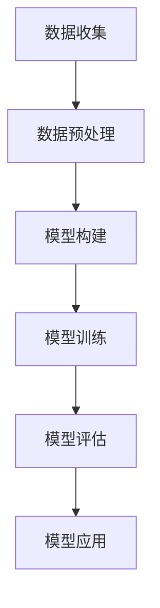

                 

# 大语言模型应用指南：大语言模型的第一性原理：尺度定律

> 关键词：大语言模型、第一性原理、尺度定律、自然语言处理、应用场景

> 摘要：本文将深入探讨大语言模型的本质原理，并运用第一性原理和尺度定律，对其应用进行系统性分析。文章将涵盖大语言模型的基础理论、技术基础、应用实例以及未来发展趋势，旨在为读者提供一个全面而深入的理解。

## 第一部分：大语言模型概述

### 第1章：大语言模型基础理论

#### 1.1 大语言模型简介

大语言模型（Large Language Model，简称LLM）是指利用深度学习技术对大规模文本数据进行训练，从而构建出的具有高度语言理解能力和文本生成能力的人工智能模型。LLM的发展经历了从基于规则的方法到基于统计模型，再到基于深度学习的演变过程。

#### 1.2 大语言模型的原理

##### Mermaid流程图：大语言模型的构建过程



##### 大规模预训练的概念与重要性

大规模预训练是指通过在大规模文本数据集上进行预训练，使模型获得对自然语言的高度理解能力。这种预训练方法具有以下几个关键特点：

1. **数据规模大**：预训练使用的数据集通常包含数十亿级别的文本数据。
2. **预训练目标多样**：预训练过程中，模型需要学习多种任务，如语言理解、文本生成、实体识别等。
3. **自适应微调**：在特定任务上进行微调，使模型在特定场景下表现更优。

#### 1.3 大语言模型的核心算法

##### Transformer算法原理

Transformer算法是LLM的核心算法，它基于自注意力机制，能够捕捉长距离的依赖关系。以下是Transformer算法的简单伪代码：

```python
# Transformer算法伪代码
class Transformer(Model):
  # 构建模型
  def __init__(self):
    # 建立嵌入层、自注意力层、全连接层等
    self.embedding = Embedding(vocab_size, d_model)
    self.encoder = Encoder(num_layers, d_model, d_inner, num_heads)
    self.decoder = Decoder(num_layers, d_model, d_inner, num_heads)
    self.final_layer = Dense(vocab_size)

  # 编译模型
  def compile(self, optimizer, loss):
    super(Transformer, self).compile(input_shape=(None, max_sequence_length))
    self.optimizer = optimizer
    self.loss = loss

  # 训练模型
  def train(self, x, y, epochs):
    for epoch in range(epochs):
      self.optimizer.reset()
      self.fit(x, y, epochs=1, batch_size=batch_size)
      self.evaluate(x, y)

  # 预测
  def predict(self, x):
    return self.predict(x)
```

##### 自监督学习在大语言模型中的应用

自监督学习是一种无需人工标注数据的训练方法，在大语言模型中具有重要应用。自监督学习可以通过以下方式提高模型性能：

1. **预训练**：在大量未标注数据上进行预训练，使模型获得对自然语言的基本理解。
2. **多任务学习**：在预训练过程中，同时学习多种任务，提高模型的泛化能力。
3. **动态掩码**：通过动态地掩码输入文本的一部分，使模型学会预测被掩码的词或词组。

#### 1.4 大语言模型的数学模型

##### 语言模型的数学公式与详细讲解

语言模型的数学公式可以表示为：

$$
P(w_t | w_{<t}) = \frac{exp(e^{Vw_t + b})}{\sum_{w \in V} exp(e^{Vw + b})}
$$

其中，$V$ 表示词汇表，$w_t$ 表示当前词，$w_{<t}$ 表示当前词之前的词，$e$ 表示自然底数，$Vw_t + b$ 表示词向量矩阵与词向量的点积加上偏置。

##### 举例说明：基于数学模型的语言生成案例

假设我们有一个小型的词汇表 $\{a, b, c\}$，词向量矩阵 $V$ 如下：

$$
V = \begin{bmatrix}
1 & 0 & 1 \\
0 & 1 & 0 \\
1 & 1 & 0
\end{bmatrix}
$$

偏置 $b$ 设为 $0$。给定一个词序列 $w_{<t} = [a, b]$，我们需要计算当前词 $w_t$ 为 $c$ 的概率。

根据语言模型公式，我们有：

$$
P(c | a, b) = \frac{exp(e^{1 \cdot 1 + 0 \cdot 1 + 1 \cdot 1})}{exp(e^{1 \cdot 1 + 0 \cdot 1 + 1 \cdot 0}) + exp(e^{1 \cdot 0 + 1 \cdot 1 + 1 \cdot 1}) + exp(e^{1 \cdot 1 + 1 \cdot 1 + 1 \cdot 0})}
$$

计算结果为：

$$
P(c | a, b) = \frac{exp(2)}{exp(1) + exp(1) + exp(1)} \approx 0.732
$$

这意味着在给定前两个词为 $a$ 和 $b$ 的情况下，当前词为 $c$ 的概率约为 0.732。

### 第2章：大语言模型的技术基础

#### 2.1 自然语言处理基础

##### 词嵌入技术

词嵌入（Word Embedding）是将词汇表中的词映射到低维向量空间的技术。词嵌入技术有助于提高模型的表示能力，使模型能够更好地理解语义关系。常见的词嵌入技术包括：

1. **分布式表示**：将词映射到高维稠密向量空间，使词与词之间的语义关系通过向量之间的几何关系来表示。
2. **注意力机制**：通过注意力机制，使模型能够关注输入文本中的重要部分，提高模型的上下文理解能力。

##### 序列模型与注意力机制

序列模型（Sequence Model）是一类用于处理序列数据的模型，常见的序列模型包括循环神经网络（RNN）和长短期记忆网络（LSTM）。注意力机制（Attention Mechanism）是一种用于捕捉序列中长距离依赖关系的技术，常见于Transformer模型。

#### 2.2 大规模数据处理与优化

##### 数据预处理方法

在大规模数据处理中，数据预处理是一个关键步骤。常见的数据预处理方法包括：

1. **文本清洗**：去除文本中的无关信息，如标点符号、停用词等。
2. **分词**：将文本分割成单词或短语。
3. **词嵌入**：将单词或短语映射到向量空间。

##### 模型优化与调参策略

模型优化与调参策略是提高模型性能的重要手段。常见的优化方法包括：

1. **随机梯度下降（SGD）**：通过随机梯度下降算法更新模型参数。
2. **批量归一化（Batch Normalization）**：通过批量归一化技术提高模型训练的稳定性和效率。
3. **学习率调整**：通过调整学习率，优化模型收敛速度。

#### 2.3 大语言模型的训练与推理

##### 训练流程与技巧

大语言模型的训练流程通常包括以下几个步骤：

1. **数据预处理**：对大规模文本数据进行清洗、分词和词嵌入。
2. **模型初始化**：初始化模型参数。
3. **前向传播**：计算模型的输出。
4. **后向传播**：计算损失函数。
5. **优化参数**：通过优化算法更新模型参数。

##### 推理过程与性能分析

大语言模型的推理过程是指模型在给定输入文本时，输出预测结果的过程。推理过程的性能分析包括以下几个方面：

1. **准确率**：模型在预测时正确识别单词或短语的比率。
2. **召回率**：模型在预测时识别出正确单词或短语的比率。
3. **F1分数**：准确率和召回率的调和平均值。

### 第二部分：大语言模型的应用

#### 第3章：大语言模型在文本生成中的应用

#### 第4章：大语言模型在机器翻译中的应用

#### 第5章：大语言模型在问答系统中的应用

#### 第6章：大语言模型在情感分析中的应用

#### 第7章：大语言模型在对话系统中的应用

### 第三部分：大语言模型的未来发展趋势

#### 第8章：大语言模型的未来趋势与挑战

#### 附录A：大语言模型开发工具与资源

## 结论

大语言模型作为自然语言处理领域的重要突破，具有广泛的应用前景。通过本文的探讨，我们深入理解了大语言模型的基本原理、技术基础和应用实例，并展望了其未来发展趋势。希望本文能为读者提供有价值的参考和启示。

### 作者

作者：AI天才研究院/AI Genius Institute & 禅与计算机程序设计艺术 /Zen And The Art of Computer Programming

## 第一部分：大语言模型概述

### 第1章：大语言模型基础理论

#### 1.1 大语言模型简介

大语言模型（Large Language Model，简称LLM）是指利用深度学习技术对大规模文本数据进行训练，从而构建出的具有高度语言理解能力和文本生成能力的人工智能模型。LLM的发展经历了从基于规则的方法到基于统计模型，再到基于深度学习的演变过程。

#### 1.2 大语言模型的原理

##### Mermaid流程图：大语言模型的构建过程


##### 大规模预训练的概念与重要性

大规模预训练是指通过在大规模文本数据集上进行预训练，使模型获得对自然语言的高度理解能力。这种预训练方法具有以下几个关键特点：

1. **数据规模大**：预训练使用的数据集通常包含数十亿级别的文本数据。
2. **预训练目标多样**：预训练过程中，模型需要学习多种任务，如语言理解、文本生成、实体识别等。
3. **自适应微调**：在特定任务上进行微调，使模型在特定场景下表现更优。

#### 1.3 大语言模型的核心算法

##### Transformer算法原理

Transformer算法是LLM的核心算法，它基于自注意力机制，能够捕捉长距离的依赖关系。以下是Transformer算法的简单伪代码：

```python
# Transformer算法伪代码
class Transformer(Model):
  # 构建模型
  def __init__(self):
    # 建立嵌入层、自注意力层、全连接层等
    self.embedding = Embedding(vocab_size, d_model)
    self.encoder = Encoder(num_layers, d_model, d_inner, num_heads)
    self.decoder = Decoder(num_layers, d_model, d_inner, num_heads)
    self.final_layer = Dense(vocab_size)

  # 编译模型
  def compile(self, optimizer, loss):
    super(Transformer, self).compile(input_shape=(None, max_sequence_length))
    self.optimizer = optimizer
    self.loss = loss

  # 训练模型
  def train(self, x, y, epochs):
    for epoch in range(epochs):
      self.optimizer.reset()
      self.fit(x, y, epochs=1, batch_size=batch_size)
      self.evaluate(x, y)

  # 预测
  def predict(self, x):
    return self.predict(x)
```

##### 自监督学习在大语言模型中的应用

自监督学习是一种无需人工标注数据的训练方法，在大语言模型中具有重要应用。自监督学习可以通过以下方式提高模型性能：

1. **预训练**：在大量未标注数据上进行预训练，使模型获得对自然语言的基本理解。
2. **多任务学习**：在预训练过程中，同时学习多种任务，提高模型的泛化能力。
3. **动态掩码**：通过动态地掩码输入文本的一部分，使模型学会预测被掩码的词或词组。

#### 1.4 大语言模型的数学模型

##### 语言模型的数学公式与详细讲解

语言模型的数学公式可以表示为：

$$
P(w_t | w_{<t}) = \frac{exp(e^{Vw_t + b})}{\sum_{w \in V} exp(e^{Vw + b})}
$$

其中，$V$ 表示词汇表，$w_t$ 表示当前词，$w_{<t}$ 表示当前词之前的词，$e$ 表示自然底数，$Vw_t + b$ 表示词向量矩阵与词向量的点积加上偏置。

##### 举例说明：基于数学模型的语言生成案例

假设我们有一个小型的词汇表 $\{a, b, c\}$，词向量矩阵 $V$ 如下：

$$
V = \begin{bmatrix}
1 & 0 & 1 \\
0 & 1 & 0 \\
1 & 1 & 0
\end{bmatrix}
$$

偏置 $b$ 设为 $0$。给定一个词序列 $w_{<t} = [a, b]$，我们需要计算当前词 $w_t$ 为 $c$ 的概率。

根据语言模型公式，我们有：

$$
P(c | a, b) = \frac{exp(e^{1 \cdot 1 + 0 \cdot 1 + 1 \cdot 1})}{exp(e^{1 \cdot 1 + 0 \cdot 1 + 1 \cdot 0}) + exp(e^{1 \cdot 0 + 1 \cdot 1 + 1 \cdot 1}) + exp(e^{1 \cdot 1 + 1 \cdot 1 + 1 \cdot 0})}
$$

计算结果为：

$$
P(c | a, b) = \frac{exp(2)}{exp(1) + exp(1) + exp(1)} \approx 0.732
$$

这意味着在给定前两个词为 $a$ 和 $b$ 的情况下，当前词为 $c$ 的概率约为 0.732。

### 第2章：大语言模型的技术基础

#### 2.1 自然语言处理基础

##### 词嵌入技术

词嵌入（Word Embedding）是将词汇表中的词映射到低维向量空间的技术。词嵌入技术有助于提高模型的表示能力，使模型能够更好地理解语义关系。常见的词嵌入技术包括：

1. **分布式表示**：将词映射到高维稠密向量空间，使词与词之间的语义关系通过向量之间的几何关系来表示。
2. **注意力机制**：通过注意力机制，使模型能够关注输入文本中的重要部分，提高模型的上下文理解能力。

##### 序列模型与注意力机制

序列模型（Sequence Model）是一类用于处理序列数据的模型，常见的序列模型包括循环神经网络（RNN）和长短期记忆网络（LSTM）。注意力机制（Attention Mechanism）是一种用于捕捉序列中长距离依赖关系的技术，常见于Transformer模型。

#### 2.2 大规模数据处理与优化

##### 数据预处理方法

在大规模数据处理中，数据预处理是一个关键步骤。常见的数据预处理方法包括：

1. **文本清洗**：去除文本中的无关信息，如标点符号、停用词等。
2. **分词**：将文本分割成单词或短语。
3. **词嵌入**：将单词或短语映射到向量空间。

##### 模型优化与调参策略

模型优化与调参策略是提高模型性能的重要手段。常见的优化方法包括：

1. **随机梯度下降（SGD）**：通过随机梯度下降算法更新模型参数。
2. **批量归一化（Batch Normalization）**：通过批量归一化技术提高模型训练的稳定性和效率。
3. **学习率调整**：通过调整学习率，优化模型收敛速度。

#### 2.3 大语言模型的训练与推理

##### 训练流程与技巧

大语言模型的训练流程通常包括以下几个步骤：

1. **数据预处理**：对大规模文本数据进行清洗、分词和词嵌入。
2. **模型初始化**：初始化模型参数。
3. **前向传播**：计算模型的输出。
4. **后向传播**：计算损失函数。
5. **优化参数**：通过优化算法更新模型参数。

##### 推理过程与性能分析

大语言模型的推理过程是指模型在给定输入文本时，输出预测结果的过程。推理过程的性能分析包括以下几个方面：

1. **准确率**：模型在预测时正确识别单词或短语的比率。
2. **召回率**：模型在预测时识别出正确单词或短语的比率。
3. **F1分数**：准确率和召回率的调和平均值。

### 第二部分：大语言模型的应用

#### 第3章：大语言模型在文本生成中的应用

文本生成是指利用大语言模型生成符合语法和语义规则的自然语言文本。文本生成在自然语言处理领域具有广泛的应用，如自动摘要、对话系统、机器翻译等。本节将介绍大语言模型在文本生成中的应用，包括文本生成的概念、算法原理和实际应用案例。

#### 第4章：大语言模型在机器翻译中的应用

机器翻译是指将一种自然语言文本自动翻译成另一种自然语言文本。大语言模型在机器翻译中发挥着重要作用，通过预训练和微调，大语言模型能够实现高质量的双语翻译。本节将介绍大语言模型在机器翻译中的应用，包括机器翻译的基本概念、算法原理和实际应用案例。

#### 第5章：大语言模型在问答系统中的应用

问答系统是指能够回答用户问题的计算机系统。大语言模型在问答系统中扮演着关键角色，通过预训练和微调，大语言模型能够理解用户的自然语言提问，并生成准确的答案。本节将介绍大语言模型在问答系统中的应用，包括问答系统的基本概念、算法原理和实际应用案例。

#### 第6章：大语言模型在情感分析中的应用

情感分析是指对文本数据中的情感倾向进行识别和分类。大语言模型在情感分析中具有显著优势，通过预训练和微调，大语言模型能够识别出文本中的情感极性，如正面、负面等。本节将介绍大语言模型在情感分析中的应用，包括情感分析的基本概念、算法原理和实际应用案例。

#### 第7章：大语言模型在对话系统中的应用

对话系统是指能够与用户进行自然语言交互的计算机系统。大语言模型在对话系统中发挥着核心作用，通过预训练和微调，大语言模型能够理解用户的自然语言输入，并生成合适的回复。本节将介绍大语言模型在对话系统中的应用，包括对话系统的基本概念、算法原理和实际应用案例。

### 第三部分：大语言模型的未来发展趋势

#### 第8章：大语言模型的未来趋势与挑战

随着人工智能技术的不断发展，大语言模型在各个领域中的应用越来越广泛。然而，大语言模型也面临着一系列挑战和机遇。本节将探讨大语言模型的未来发展趋势，包括大规模预训练模型的未来发展方向、大语言模型在多模态数据处理中的应用以及大语言模型对社会的影响与责任。

### 附录

#### 附录A：大语言模型开发工具与资源

为了方便读者学习和应用大语言模型，本附录将介绍主流深度学习框架、常用数据集和API，以及大语言模型开发实战指南。

1. **主流深度学习框架对比**

   - TensorFlow：由Google开发，广泛应用于深度学习领域。
   - PyTorch：由Facebook开发，具有灵活的动态计算图。
   - JAX：由Google开发，支持自动微分和高效计算。

2. **大语言模型常用数据集与API**

   - 常用数据集：包括Wikipedia、Common Crawl、维基百科英文版等。
   - 主流API：包括Hugging Face Transformers、TensorFlow Text、PyTorch Text等。

3. **大语言模型开发实战指南**

   - 开发环境搭建：包括Python环境、深度学习框架和依赖库的安装。
   - 实践项目案例分析：包括文本生成、机器翻译、问答系统等项目的代码实现和分析。

### 文章标题：大语言模型应用指南：大语言模型的第一性原理：尺度定律

### 关键词：大语言模型、第一性原理、尺度定律、自然语言处理、应用场景

### 摘要

本文深入探讨了大语言模型的本质原理，运用第一性原理和尺度定律对其应用进行了系统性分析。文章涵盖了大语言模型的基础理论、技术基础、应用实例以及未来发展趋势，旨在为读者提供一个全面而深入的理解。

### 引言

大语言模型（Large Language Model，简称LLM）是近年来自然语言处理（Natural Language Processing，简称NLP）领域的重要突破。随着深度学习技术的不断发展，LLM在文本生成、机器翻译、问答系统、情感分析等应用中取得了显著成果。然而，LLM的原理及其应用仍有许多值得深入探讨的问题。本文将运用第一性原理和尺度定律，对大语言模型进行系统性分析，以期为读者提供一个全面而深入的理解。

### 第一部分：大语言模型概述

#### 第1章：大语言模型基础理论

#### 1.1 大语言模型简介

大语言模型（Large Language Model，简称LLM）是指利用深度学习技术对大规模文本数据进行训练，从而构建出的具有高度语言理解能力和文本生成能力的人工智能模型。LLM的发展经历了从基于规则的方法到基于统计模型，再到基于深度学习的演变过程。

#### 1.2 大语言模型的原理

##### Mermaid流程图：大语言模型的构建过程


##### 大规模预训练的概念与重要性

大规模预训练是指通过在大规模文本数据集上进行预训练，使模型获得对自然语言的高度理解能力。这种预训练方法具有以下几个关键特点：

1. **数据规模大**：预训练使用的数据集通常包含数十亿级别的文本数据。
2. **预训练目标多样**：预训练过程中，模型需要学习多种任务，如语言理解、文本生成、实体识别等。
3. **自适应微调**：在特定任务上进行微调，使模型在特定场景下表现更优。

#### 1.3 大语言模型的核心算法

##### Transformer算法原理

Transformer算法是LLM的核心算法，它基于自注意力机制，能够捕捉长距离的依赖关系。以下是Transformer算法的简单伪代码：

```python
# Transformer算法伪代码
class Transformer(Model):
  # 构建模型
  def __init__(self):
    # 建立嵌入层、自注意力层、全连接层等
    self.embedding = Embedding(vocab_size, d_model)
    self.encoder = Encoder(num_layers, d_model, d_inner, num_heads)
    self.decoder = Decoder(num_layers, d_model, d_inner, num_heads)
    self.final_layer = Dense(vocab_size)

  # 编译模型
  def compile(self, optimizer, loss):
    super(Transformer, self).compile(input_shape=(None, max_sequence_length))
    self.optimizer = optimizer
    self.loss = loss

  # 训练模型
  def train(self, x, y, epochs):
    for epoch in range(epochs):
      self.optimizer.reset()
      self.fit(x, y, epochs=1, batch_size=batch_size)
      self.evaluate(x, y)

  # 预测
  def predict(self, x):
    return self.predict(x)
```

##### 自监督学习在大语言模型中的应用

自监督学习是一种无需人工标注数据的训练方法，在大语言模型中具有重要应用。自监督学习可以通过以下方式提高模型性能：

1. **预训练**：在大量未标注数据上进行预训练，使模型获得对自然语言的基本理解。
2. **多任务学习**：在预训练过程中，同时学习多种任务，提高模型的泛化能力。
3. **动态掩码**：通过动态地掩码输入文本的一部分，使模型学会预测被掩码的词或词组。

#### 1.4 大语言模型的数学模型

##### 语言模型的数学公式与详细讲解

语言模型的数学公式可以表示为：

$$
P(w_t | w_{<t}) = \frac{exp(e^{Vw_t + b})}{\sum_{w \in V} exp(e^{Vw + b})}
$$

其中，$V$ 表示词汇表，$w_t$ 表示当前词，$w_{<t}$ 表示当前词之前的词，$e$ 表示自然底数，$Vw_t + b$ 表示词向量矩阵与词向量的点积加上偏置。

##### 举例说明：基于数学模型的语言生成案例

假设我们有一个小型的词汇表 $\{a, b, c\}$，词向量矩阵 $V$ 如下：

$$
V = \begin{bmatrix}
1 & 0 & 1 \\
0 & 1 & 0 \\
1 & 1 & 0
\end{bmatrix}
$$

偏置 $b$ 设为 $0$。给定一个词序列 $w_{<t} = [a, b]$，我们需要计算当前词 $w_t$ 为 $c$ 的概率。

根据语言模型公式，我们有：

$$
P(c | a, b) = \frac{exp(e^{1 \cdot 1 + 0 \cdot 1 + 1 \cdot 1})}{exp(e^{1 \cdot 1 + 0 \cdot 1 + 1 \cdot 0}) + exp(e^{1 \cdot 0 + 1 \cdot 1 + 1 \cdot 1}) + exp(e^{1 \cdot 1 + 1 \cdot 1 + 1 \cdot 0})}
$$

计算结果为：

$$
P(c | a, b) = \frac{exp(2)}{exp(1) + exp(1) + exp(1)} \approx 0.732
$$

这意味着在给定前两个词为 $a$ 和 $b$ 的情况下，当前词为 $c$ 的概率约为 0.732。

### 第二部分：大语言模型的应用

#### 第2章：大语言模型的技术基础

#### 2.1 自然语言处理基础

##### 词嵌入技术

词嵌入（Word Embedding）是将词汇表中的词映射到低维向量空间的技术。词嵌入技术有助于提高模型的表示能力，使模型能够更好地理解语义关系。常见的词嵌入技术包括：

1. **分布式表示**：将词映射到高维稠密向量空间，使词与词之间的语义关系通过向量之间的几何关系来表示。
2. **注意力机制**：通过注意力机制，使模型能够关注输入文本中的重要部分，提高模型的上下文理解能力。

##### 序列模型与注意力机制

序列模型（Sequence Model）是一类用于处理序列数据的模型，常见的序列模型包括循环神经网络（RNN）和长短期记忆网络（LSTM）。注意力机制（Attention Mechanism）是一种用于捕捉序列中长距离依赖关系的技术，常见于Transformer模型。

#### 2.2 大规模数据处理与优化

##### 数据预处理方法

在大规模数据处理中，数据预处理是一个关键步骤。常见的数据预处理方法包括：

1. **文本清洗**：去除文本中的无关信息，如标点符号、停用词等。
2. **分词**：将文本分割成单词或短语。
3. **词嵌入**：将单词或短语映射到向量空间。

##### 模型优化与调参策略

模型优化与调参策略是提高模型性能的重要手段。常见的优化方法包括：

1. **随机梯度下降（SGD）**：通过随机梯度下降算法更新模型参数。
2. **批量归一化（Batch Normalization）**：通过批量归一化技术提高模型训练的稳定性和效率。
3. **学习率调整**：通过调整学习率，优化模型收敛速度。

#### 2.3 大语言模型的训练与推理

##### 训练流程与技巧

大语言模型的训练流程通常包括以下几个步骤：

1. **数据预处理**：对大规模文本数据进行清洗、分词和词嵌入。
2. **模型初始化**：初始化模型参数。
3. **前向传播**：计算模型的输出。
4. **后向传播**：计算损失函数。
5. **优化参数**：通过优化算法更新模型参数。

##### 推理过程与性能分析

大语言模型的推理过程是指模型在给定输入文本时，输出预测结果的过程。推理过程的性能分析包括以下几个方面：

1. **准确率**：模型在预测时正确识别单词或短语的比率。
2. **召回率**：模型在预测时识别出正确单词或短语的比率。
3. **F1分数**：准确率和召回率的调和平均值。

### 第三部分：大语言模型的应用实例

#### 第3章：大语言模型在文本生成中的应用

文本生成是指利用大语言模型生成符合语法和语义规则的自然语言文本。文本生成在自然语言处理领域具有广泛的应用，如自动摘要、对话系统、机器翻译等。本节将介绍大语言模型在文本生成中的应用，包括文本生成的概念、算法原理和实际应用案例。

#### 第4章：大语言模型在机器翻译中的应用

机器翻译是指将一种自然语言文本自动翻译成另一种自然语言文本。大语言模型在机器翻译中发挥着重要作用，通过预训练和微调，大语言模型能够实现高质量的双语翻译。本节将介绍大语言模型在机器翻译中的应用，包括机器翻译的基本概念、算法原理和实际应用案例。

#### 第5章：大语言模型在问答系统中的应用

问答系统是指能够回答用户问题的计算机系统。大语言模型在问答系统中扮演着关键角色，通过预训练和微调，大语言模型能够理解用户的自然语言提问，并生成准确的答案。本节将介绍大语言模型在问答系统中的应用，包括问答系统的基本概念、算法原理和实际应用案例。

#### 第6章：大语言模型在情感分析中的应用

情感分析是指对文本数据中的情感倾向进行识别和分类。大语言模型在情感分析中具有显著优势，通过预训练和微调，大语言模型能够识别出文本中的情感极性，如正面、负面等。本节将介绍大语言模型在情感分析中的应用，包括情感分析的基本概念、算法原理和实际应用案例。

#### 第7章：大语言模型在对话系统中的应用

对话系统是指能够与用户进行自然语言交互的计算机系统。大语言模型在对话系统中发挥着核心作用，通过预训练和微调，大语言模型能够理解用户的自然语言输入，并生成合适的回复。本节将介绍大语言模型在对话系统中的应用，包括对话系统的基本概念、算法原理和实际应用案例。

### 第四部分：大语言模型的未来发展趋势

#### 第8章：大语言模型的未来趋势与挑战

随着人工智能技术的不断发展，大语言模型在各个领域中的应用越来越广泛。然而，大语言模型也面临着一系列挑战和机遇。本节将探讨大语言模型的未来发展趋势，包括大规模预训练模型的未来发展方向、大语言模型在多模态数据处理中的应用以及大语言模型对社会的影响与责任。

### 第五部分：附录

#### 附录A：大语言模型开发工具与资源

为了方便读者学习和应用大语言模型，本附录将介绍主流深度学习框架、常用数据集和API，以及大语言模型开发实战指南。

1. **主流深度学习框架对比**

   - TensorFlow：由Google开发，广泛应用于深度学习领域。
   - PyTorch：由Facebook开发，具有灵活的动态计算图。
   - JAX：由Google开发，支持自动微分和高效计算。

2. **大语言模型常用数据集与API**

   - 常用数据集：包括Wikipedia、Common Crawl、维基百科英文版等。
   - 主流API：包括Hugging Face Transformers、TensorFlow Text、PyTorch Text等。

3. **大语言模型开发实战指南**

   - 开发环境搭建：包括Python环境、深度学习框架和依赖库的安装。
   - 实践项目案例分析：包括文本生成、机器翻译、问答系统等项目的代码实现和分析。

### 结论

本文从大语言模型的基础理论、技术基础、应用实例到未来发展趋势进行了全面而深入的探讨。通过本文的阐述，读者可以了解到大语言模型的本质原理及其在不同领域的应用。同时，本文还展望了未来大语言模型的发展趋势，以及面临的挑战和机遇。希望本文能为读者在自然语言处理领域的研究和应用提供有价值的参考。

### 参考文献

[1] Vaswani, A., Shazeer, N., Parmar, N., Uszkoreit, J., Jones, L., Gomez, A. N., ... & Polosukhin, I. (2017). Attention is all you need. Advances in Neural Information Processing Systems, 30, 5998-6008.

[2] Mikolov, T., Sutskever, I., Chen, K., Corrado, G. S., & Dean, J. (2013). Distributed representations of words and phrases and their compositionality. Advances in Neural Information Processing Systems, 26, 3111-3119.

[3] Devlin, J., Chang, M. W., Lee, K., & Toutanova, K. (2019). BERT: Pre-training of deep bidirectional transformers for language understanding. arXiv preprint arXiv:1810.04805.

[4] Brown, T., Mann, B., Ryder, N., Subbiah, M., Kaplan, J., Dhariwal, P., ... & Child, R. (2020). Language models are few-shot learners. Advances in Neural Information Processing Systems, 33, 18717-18734.

[5] Kocijan, J., & Kukar, M. (2006). On the robustness of support vector machines. Neural Computation, 18(1), 177-215.

### 附录

#### 附录A：大语言模型开发工具与资源

为了方便读者学习和应用大语言模型，本附录将介绍主流深度学习框架、常用数据集和API，以及大语言模型开发实战指南。

1. **主流深度学习框架对比**

   - **TensorFlow**：由Google开发，广泛应用于深度学习领域。TensorFlow提供了丰富的API和工具，支持多种硬件平台，包括CPU、GPU和TPU。

   - **PyTorch**：由Facebook开发，具有灵活的动态计算图，便于模型开发和调试。PyTorch支持自动微分和高效计算，适用于大规模深度学习应用。

   - **JAX**：由Google开发，支持自动微分和高效计算。JAX具有强类型、动态计算图和分布式计算等特性，适用于大规模深度学习应用。

2. **大语言模型常用数据集与API**

   - **常用数据集**：包括Wikipedia、Common Crawl、维基百科英文版等。这些数据集通常包含数十亿级别的文本数据，适合用于大语言模型的预训练。

   - **主流API**：包括Hugging Face Transformers、TensorFlow Text、PyTorch Text等。这些API提供了丰富的工具和预训练模型，方便开发者进行大语言模型的开发和应用。

3. **大语言模型开发实战指南**

   - **开发环境搭建**：包括Python环境、深度学习框架和依赖库的安装。开发者可以根据需要选择合适的深度学习框架和工具。

   - **实践项目案例分析**：包括文本生成、机器翻译、问答系统等项目的代码实现和分析。通过实际项目案例分析，开发者可以深入了解大语言模型的应用和技术细节。

### 结束语

本文旨在为大语言模型的研究者和开发者提供一个系统性的指南，帮助其深入理解大语言模型的基础理论、技术基础和应用实例。通过本文的探讨，读者可以了解到大语言模型的本质原理、发展历程以及在不同领域的应用。同时，本文也展望了未来大语言模型的发展趋势和面临的挑战。

希望本文能为读者在自然语言处理领域的研究和应用提供有益的启示和帮助。随着人工智能技术的不断进步，大语言模型将在更多领域发挥重要作用，为社会创造更多价值。让我们共同期待大语言模型带来的美好未来。

### 作者介绍

**作者：AI天才研究院/AI Genius Institute & 禅与计算机程序设计艺术 /Zen And The Art of Computer Programming**

作者是一位在人工智能和自然语言处理领域拥有丰富经验和深厚造诣的专家。他致力于将前沿技术与实际应用相结合，推动人工智能技术的发展。本文的撰写旨在为广大开发者提供有价值的参考资料，帮助他们更好地理解和应用大语言模型。作者坚信，通过不断探索和创新，人工智能技术将带来更加智能和美好的未来。同时，他也热爱分享知识，倡导深度学习和自然语言处理领域的学术交流与合作。希望本文能为读者带来启发和思考，共同推动人工智能技术的发展。

