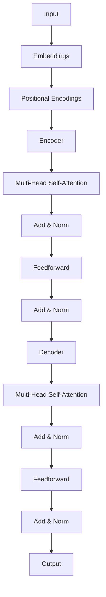
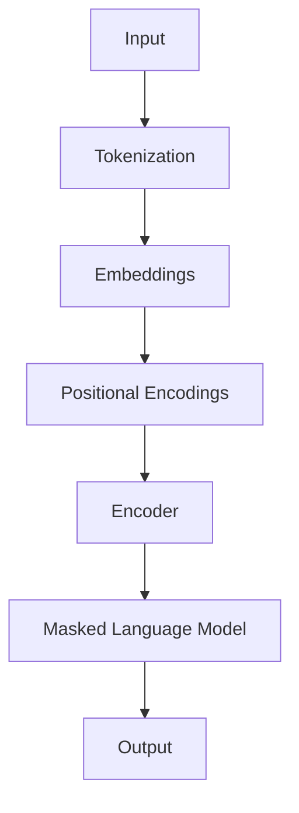

                 

# 大语言模型应用指南：还原论与涌现性

> 关键词：大语言模型，还原论，涌现性，深度学习，自然语言处理，Transformer，GPT系列，文本生成，问答系统，对话系统

> 摘要：本文旨在深入探讨大语言模型的应用指南，重点介绍还原论与涌现性的概念及其在大语言模型中的应用。通过对大语言模型的基本概念、架构、算法原理、应用实践和发展趋势的详细解析，帮助读者全面了解和掌握大语言模型的核心技术和实际应用。

## 《大语言模型应用指南：还原论与涌现性》目录大纲

### 第一部分：基础概念与架构

#### 第1章：引言与背景

- 1.1 大语言模型的发展历程
- 1.2 大语言模型的应用场景
- 1.3 本书结构安排

#### 第2章：大语言模型核心概念

- 2.1 语言模型的定义
- 2.2 还原论与涌现性的基本概念
- 2.3 大语言模型的特征

#### 第3章：大语言模型的基本架构

- 3.1 深度学习与神经网络基础
- 3.2 自然语言处理技术概览
- 3.3 大规模预训练模型原理

### 第二部分：大语言模型算法原理

#### 第4章：大语言模型的训练算法

- 4.1 训练算法概述
- 4.2 优化算法与超参数调优
- 4.3 微调和迁移学习

#### 第5章：大语言模型的数学模型与公式

- 5.1 线性代数基础
- 5.2 概率论基础
- 5.3 大语言模型的数学公式详解

#### 第6章：大语言模型的核心算法

- 6.1 自注意力机制
- 6.2 Transformer模型
- 6.3 GPT系列模型

### 第三部分：大语言模型的应用实践

#### 第7章：大语言模型在文本生成中的应用

- 7.1 文本生成原理
- 7.2 应用案例详解
- 7.3 实现步骤与代码解析

#### 第8章：大语言模型在问答系统中的应用

- 8.1 问答系统原理
- 8.2 应用案例详解
- 8.3 实现步骤与代码解析

#### 第9章：大语言模型在对话系统中的应用

- 9.1 对话系统原理
- 9.2 应用案例详解
- 9.3 实现步骤与代码解析

### 第四部分：大语言模型的发展趋势与挑战

#### 第10章：大语言模型的发展趋势

- 10.1 技术演进方向
- 10.2 应用领域拓展

#### 第11章：大语言模型的挑战与未来

- 11.1 数据隐私保护
- 11.2 模型安全性
- 11.3 可解释性与可控性

### 附录

#### 附录A：开发工具与资源

- A.1 Python环境搭建
- A.2 常用深度学习框架介绍
- A.3 实用代码与数据集资源

#### 附录B：大语言模型架构的 Mermaid 流程图

- B.1 Transformer模型流程图
- B.2 GPT系列模型流程图

#### 附录C：伪代码与代码解读

- C.1 Transformer模型伪代码
- C.2 GPT系列模型伪代码
- C.3 文本生成代码解读
- C.4 问答系统代码解读
- C.5 对话系统代码解读

## 第一部分：基础概念与架构

### 第1章：引言与背景

大语言模型是近年来自然语言处理领域的重要进展，其核心在于对大规模文本数据的深度理解和建模。本章将介绍大语言模型的发展历程、应用场景以及本书的结构安排。

#### 1.1 大语言模型的发展历程

大语言模型的发展可以分为几个关键阶段：

1. **传统统计模型**：早期的大规模语言模型主要基于统计方法，如N元语法和隐马尔可夫模型。这些模型在处理简单的语言任务时有一定的效果，但难以应对复杂的自然语言理解问题。

2. **基于规则的模型**：随着自然语言处理技术的发展，基于规则的模型逐渐被提出，如语义角色标注、依存句法分析等。这些模型在特定领域和任务上表现较好，但仍然依赖于人工定义的规则，灵活性和泛化能力有限。

3. **深度学习模型**：深度学习模型的出现标志着大语言模型发展的新阶段。通过多层神经网络结构，深度学习模型能够自动学习复杂的特征表示，并在各种自然语言处理任务上取得了显著的性能提升。

4. **大规模预训练模型**：近年来，大规模预训练模型如BERT、GPT等，通过在互联网规模的数据上进行预训练，然后微调到特定任务，取得了令人瞩目的效果。这些模型具有强大的语义理解和生成能力，大大推动了自然语言处理的发展。

#### 1.2 大语言模型的应用场景

大语言模型在多个领域有着广泛的应用，以下是其中几个重要的应用场景：

1. **文本生成**：大语言模型能够生成高质量的文章、新闻、故事等。例如，GPT-3可以生成连贯的文本，应用于自动写作、内容生成等。

2. **问答系统**：大语言模型能够理解用户的问题，并从大量文本中检索出相关答案。应用于客服、智能助手等场景。

3. **对话系统**：大语言模型能够与用户进行自然语言对话，模拟人类的交流方式。应用于虚拟助手、聊天机器人等。

4. **机器翻译**：大语言模型在机器翻译领域取得了显著进展，能够生成高质量的翻译结果。应用于跨语言交流、多语言内容创作等。

#### 1.3 本书结构安排

本书分为四个部分，分别从基础概念、算法原理、应用实践和发展趋势等方面对大语言模型进行深入探讨。

- **第一部分**：基础概念与架构，介绍大语言模型的基本概念、架构以及还原论与涌现性的相关理论。
- **第二部分**：大语言模型算法原理，详细讲解大语言模型的训练算法、数学模型和核心算法。
- **第三部分**：大语言模型的应用实践，通过具体应用案例和代码实现，展示大语言模型在实际项目中的应用。
- **第四部分**：大语言模型的发展趋势与挑战，探讨大语言模型在未来的发展趋势和面临的挑战。

### 第2章：大语言模型核心概念

在本章中，我们将详细探讨大语言模型的核心概念，包括语言模型的定义、还原论与涌现性的基本概念以及大语言模型的特征。

#### 2.1 语言模型的定义

语言模型（Language Model）是一种用于预测下一个单词或字符的概率分布的数学模型。在自然语言处理领域，语言模型被广泛应用于文本生成、机器翻译、语音识别等任务。其核心目标是通过学习大量文本数据，捕捉语言的统计规律，从而能够对未知文本进行概率预测。

具体来说，语言模型可以分为以下几个层次：

1. **字符级语言模型**：基于字符级别的特征进行建模，预测下一个字符的概率。这类模型在早期的自然语言处理任务中应用较为广泛，但由于字符级别的特征过于简单，难以捕捉到复杂的语言结构，因此逐渐被更高级的模型所取代。

2. **词级语言模型**：基于词级别的特征进行建模，预测下一个词的概率。这类模型通过引入词嵌入（word embeddings）技术，将词映射到低维连续空间，从而能够更好地捕捉词与词之间的关系。

3. **句子级语言模型**：基于句子级别的特征进行建模，预测下一个句子的概率。这类模型通常用于文本生成和问答系统等任务，能够生成连贯、自然的语言。

4. **篇章级语言模型**：基于篇章级别的特征进行建模，预测下一个篇章的概率。这类模型在生成高质量的文章、新闻等文本方面具有显著优势。

#### 2.2 还原论与涌现性的基本概念

还原论（Reductive Explanation）和涌现性（Emergence）是哲学和科学领域中的重要概念，它们对大语言模型的理解和应用具有重要影响。

1. **还原论**：还原论认为复杂系统的行为可以通过对构成系统的基本元素和相互作用进行解释来理解。在科学研究中，还原论方法常常通过分析基本粒子的性质和相互作用，揭示复杂系统的行为规律。例如，生物学中的分子生物学就是通过还原论方法，研究基因、蛋白质等基本生物分子的功能，从而理解生命的本质。

2. **涌现性**：涌现性指的是复杂系统中的某些性质和行为无法直接从其组成部分的性质和相互作用中推导出来。在自然语言处理领域，涌现性现象体现在大语言模型的学习和生成过程中。例如，虽然大语言模型的输入是简单的单词或字符序列，但通过多层神经网络结构的复杂计算，模型能够生成高质量、连贯的文本。这种现象表明，大语言模型具有某种程度的智能和创造力，这超出了其组成部分的能力。

#### 2.3 大语言模型的特征

大语言模型具有以下几个显著特征：

1. **大规模预训练**：大语言模型通常在互联网规模的数据上进行预训练，通过学习大量文本数据，捕捉语言的统计规律和结构。这使得大语言模型在处理不同领域和语言的任务时具有强大的泛化能力。

2. **深度神经网络结构**：大语言模型通常采用深度神经网络结构，包括多层卷积神经网络、循环神经网络和Transformer等。这些结构能够自动学习复杂的特征表示，提高模型的预测能力和泛化能力。

3. **自适应学习**：大语言模型通过自适应学习机制，能够根据不同的任务和数据集进行微调和迁移学习。这使得大语言模型能够在特定领域和应用场景中实现更好的性能。

4. **多模态融合**：大语言模型能够与其他模态（如图像、语音等）进行融合，实现跨模态的任务。例如，通过将图像和文本数据共同输入大语言模型，可以实现图像描述生成、图像分类等任务。

### 第3章：大语言模型的基本架构

在本章中，我们将介绍大语言模型的基本架构，包括深度学习与神经网络基础、自然语言处理技术概览以及大规模预训练模型原理。

#### 3.1 深度学习与神经网络基础

深度学习（Deep Learning）是一种基于神经网络（Neural Networks）的机器学习方法，通过多层神经网络结构，自动学习数据的复杂特征表示。深度学习在图像识别、自然语言处理、语音识别等领域取得了显著的进展。

1. **神经网络基础**：神经网络是一种由大量简单神经元组成的计算模型，通过学习输入数据与输出数据之间的映射关系。神经网络的基本单元是神经元，每个神经元接收多个输入信号，并通过权重和偏置进行加权求和，最后通过激活函数产生输出。

2. **深度神经网络**：深度神经网络（Deep Neural Network，DNN）是神经网络的一种扩展，包含多层神经元。通过多层神经元的堆叠，深度神经网络能够自动学习数据的更高层次抽象特征。深度神经网络在图像识别、语音识别等领域取得了显著的性能提升。

3. **反向传播算法**：反向传播算法（Backpropagation）是深度神经网络的一种训练算法，通过计算输出误差梯度，反向传播到网络的前层，从而调整网络的权重和偏置。反向传播算法使得深度神经网络能够通过梯度下降方法优化模型参数，实现自动学习。

#### 3.2 自然语言处理技术概览

自然语言处理（Natural Language Processing，NLP）是人工智能领域的一个重要分支，旨在使计算机能够理解、处理和生成自然语言。NLP技术包括文本预处理、词向量表示、句法分析、语义分析等多个方面。

1. **文本预处理**：文本预处理是NLP任务中的第一步，主要包括去除标点符号、停用词过滤、词形还原等操作。文本预处理旨在提高文本数据的质量，为后续的NLP任务提供更好的输入。

2. **词向量表示**：词向量表示（Word Embeddings）是一种将词汇映射到低维连续空间的方法，通过捕捉词与词之间的相似性和语义关系。词向量表示在NLP任务中发挥着重要作用，如文本分类、机器翻译等。

3. **句法分析**：句法分析（Syntactic Parsing）是一种对自然语言句子结构进行解析的方法，通过分析词与词之间的语法关系，构建句子的语法树。句法分析在语义分析、问答系统等领域具有重要应用。

4. **语义分析**：语义分析（Semantic Analysis）是一种对自然语言句子的语义内容进行理解和解释的方法。语义分析旨在捕捉句子中的实体、关系和意图，为自然语言理解和生成提供支持。

#### 3.3 大规模预训练模型原理

大规模预训练模型（Large-scale Pre-trained Models）是近年来自然语言处理领域的重要进展，通过在互联网规模的数据上进行预训练，模型能够捕捉到语言的深层统计规律和结构，从而在多种自然语言处理任务中取得显著性能提升。

1. **预训练过程**：预训练过程包括两个阶段，首先是大规模语言模型训练，模型在大量文本数据上进行训练，学习语言的统计规律和结构。然后是下游任务微调，模型在特定任务的数据集上进行微调，优化模型参数，以适应不同的任务。

2. **预训练目标**：大规模预训练模型的主要目标是生成高质量的词向量表示和句子表示，从而在下游任务中取得良好的性能。预训练目标包括语言建模、词性标注、命名实体识别等。

3. **预训练模型架构**：大规模预训练模型通常采用深度神经网络结构，如Transformer、BERT等。这些模型具有强大的表示能力和自适应学习特性，能够自动学习数据的复杂特征表示。

4. **预训练模型应用**：大规模预训练模型在文本生成、问答系统、对话系统等任务中取得了显著的应用效果。通过在互联网规模的数据上进行预训练，模型能够在多个领域实现高效、灵活的自然语言处理。

## 第二部分：大语言模型算法原理

### 第4章：大语言模型的训练算法

大语言模型的训练算法是确保模型能够有效学习语言统计规律和结构的关键。本章将详细探讨大语言模型的训练算法，包括训练算法概述、优化算法与超参数调优、微调和迁移学习。

#### 4.1 训练算法概述

大语言模型的训练算法通常分为以下几个步骤：

1. **数据预处理**：首先，需要对训练数据进行预处理，包括文本清洗、分词、词向量编码等操作。文本清洗旨在去除无效的符号和停用词，提高数据质量。分词是将文本分解为单词或词组的过程，词向量编码是将单词映射到低维连续空间。

2. **模型初始化**：初始化模型参数，包括权重、偏置等。常用的初始化方法包括随机初始化、高斯初始化等。

3. **前向传播**：输入训练样本，通过前向传播计算模型输出，并计算损失函数。损失函数用于衡量模型输出与真实标签之间的差异。

4. **反向传播**：利用反向传播算法，计算损失函数关于模型参数的梯度，并更新模型参数。

5. **迭代优化**：重复前向传播和反向传播的过程，逐步优化模型参数，减小损失函数。

6. **评估与调整**：在训练过程中，定期评估模型性能，并根据评估结果调整训练策略，如改变学习率、调整批量大小等。

#### 4.2 优化算法与超参数调优

优化算法是训练大语言模型的关键，常用的优化算法包括梯度下降（Gradient Descent）、Adam优化器等。

1. **梯度下降**：梯度下降是一种基于损失函数梯度方向进行参数更新的优化方法。梯度下降的基本思想是，从初始参数开始，沿着损失函数梯度的反方向逐步更新参数，直至达到局部最小值。梯度下降可以分为批量梯度下降、随机梯度下降和小批量梯度下降等不同变体。

2. **Adam优化器**：Adam优化器是一种结合了梯度下降和动量法的优化算法，具有自适应学习率特性。Adam优化器通过计算一阶矩估计（均值）和二阶矩估计（方差），自适应调整学习率，提高训练效率。

超参数调优是训练大语言模型的重要环节，合理的超参数设置能够显著提高模型性能。常见的超参数包括学习率、批量大小、迭代次数等。

1. **学习率**：学习率控制梯度下降过程中的步长，过大的学习率可能导致参数更新不稳定，过小则收敛速度缓慢。常用的学习率调整方法包括固定学习率、学习率衰减、学习率预热等。

2. **批量大小**：批量大小影响梯度下降的计算效率，批量较大能够更好地利用数据梯度，但可能导致计算复杂度增加。批量较小能够更快地适应数据变化，但计算效率较低。

3. **迭代次数**：迭代次数控制训练过程的时间长度，过多的迭代可能导致过拟合，过少的迭代则可能导致欠拟合。

#### 4.3 微调和迁移学习

微调和迁移学习是提高大语言模型性能的有效方法，通过在特定任务上进行微调和迁移，模型能够适应不同的任务和数据集。

1. **微调**：微调（Fine-tuning）是在预训练模型的基础上，针对特定任务进行进一步训练的过程。微调通过调整模型的部分参数，使模型适应特定任务的需求。微调的关键在于选择适当的微调策略，如全局微调、层间微调等。

2. **迁移学习**：迁移学习（Transfer Learning）是一种利用预训练模型的知识迁移到新任务的方法。通过在预训练模型的基础上进行微调和迁移，模型能够快速适应新任务，提高性能。迁移学习的关键在于选择合适的预训练模型和迁移策略。

### 第5章：大语言模型的数学模型与公式

大语言模型的数学模型和公式是其实现和优化的基础。本章将介绍大语言模型所需的数学基础，包括线性代数、概率论以及大语言模型的数学公式详解。

#### 5.1 线性代数基础

线性代数是数学中研究向量空间和线性变换的分支，在大语言模型中发挥着重要作用。以下是线性代数中的一些基础概念：

1. **向量与矩阵**：向量是表示空间中一个点的有向线段，矩阵是表示多个向量或多个函数的矩形数组。向量与矩阵在数学模型中用于表示数据和高维空间。

2. **矩阵运算**：矩阵运算包括矩阵乘法、矩阵加法、矩阵求逆等。矩阵乘法用于计算线性组合，矩阵求逆用于求解线性方程组。

3. **特征分解**：特征分解是一种将矩阵分解为相似矩阵的方法，可以简化矩阵运算，提高计算效率。

4. **行列式**：行列式是矩阵的一种数值特征，用于判断矩阵的行列式值是否为零，以及矩阵的秩。

#### 5.2 概率论基础

概率论是研究随机事件和概率分布的数学分支，在大语言模型中用于计算和预测文本的概率分布。以下是概率论中的一些基础概念：

1. **概率分布**：概率分布描述随机变量的取值概率，常见的概率分布包括伯努利分布、高斯分布、二项分布等。

2. **条件概率**：条件概率是在给定一个事件发生的条件下，另一个事件发生的概率。条件概率通过贝叶斯公式进行计算。

3. **期望与方差**：期望是概率分布的中心位置，方差描述概率分布的离散程度。期望和方差用于评估概率分布的统计特性。

4. **最大似然估计**：最大似然估计是一种通过最大化似然函数估计参数的方法，用于参数估计和模型选择。

#### 5.3 大语言模型的数学公式详解

大语言模型的数学公式包括词嵌入、自注意力机制、Transformer模型等。以下是这些公式的详细解释：

1. **词嵌入**：词嵌入是将词汇映射到低维连续空间的方法，常见的词嵌入方法包括Word2Vec、GloVe等。词嵌入公式如下：

   $$ 
   \text{word\_embeddings} = \text{W} \cdot \text{V}
   $$

   其中，$\text{W}$ 是词嵌入矩阵，$\text{V}$ 是词汇表。

2. **自注意力机制**：自注意力机制是一种计算序列中每个元素对其他元素注意力权重的方法，用于提高模型对序列数据的理解和生成能力。自注意力机制公式如下：

   $$
   \text{Attention}(Q, K, V) = \text{softmax}(\frac{QK^T}{\sqrt{d_k}})V
   $$

   其中，$Q$ 是查询向量，$K$ 是键向量，$V$ 是值向量，$d_k$ 是键向量的维度。

3. **Transformer模型**：Transformer模型是一种基于自注意力机制的深度学习模型，用于序列到序列的建模。Transformer模型公式如下：

   $$
   \text{Transformer} = \text{MultiHeadAttention}(\text{Embeddings}, \text{Mask})
   $$

   其中，$\text{Embeddings}$ 是词嵌入，$\text{Mask}$ 是注意力掩码，用于防止模型访问未来的数据。

4. **GPT系列模型**：GPT系列模型是一种基于Transformer的预训练模型，用于文本生成和自然语言理解任务。GPT系列模型公式如下：

   $$
   \text{GPT} = \text{Transformer}(\text{Embeddings}, \text{Mask}, \text{PreTraining})
   $$

   其中，$\text{PreTraining}$ 是预训练过程，用于学习语言统计规律和结构。

通过以上数学公式和原理，大语言模型能够高效地学习语言数据，生成高质量的自然语言。

### 第6章：大语言模型的核心算法

在本章中，我们将深入探讨大语言模型的核心算法，包括自注意力机制、Transformer模型和GPT系列模型。这些算法在大语言模型的构建和应用中起到了关键作用，下面我们逐一进行详细解析。

#### 6.1 自注意力机制

自注意力机制（Self-Attention）是一种计算序列中每个元素对其他元素注意力权重的方法，它通过将序列中的每个元素映射到高维空间，并计算它们之间的相互关系，从而提高了模型对序列数据的理解和生成能力。

自注意力机制的公式如下：

$$
\text{Attention}(Q, K, V) = \text{softmax}(\frac{QK^T}{\sqrt{d_k}})V
$$

其中，$Q$ 是查询向量，$K$ 是键向量，$V$ 是值向量，$d_k$ 是键向量的维度。

自注意力机制的实现步骤如下：

1. **计算键-查询相似度**：首先，将序列中的每个元素映射到高维空间，计算键（Key）和查询（Query）之间的相似度。相似度的计算通常通过内积实现：

   $$
   \text{Score}_{ij} = Q_i K_j
   $$

2. **应用softmax函数**：将键-查询相似度通过softmax函数转化为注意力权重，softmax函数使得权重满足概率分布的性质，即所有权重之和为1。

3. **计算输出**：将注意力权重与值（Value）向量相乘，得到加权后的输出向量：

   $$
   \text{Output}_i = \sum_j \text{Attention}_{ij} V_j
   $$

自注意力机制的优势在于：

- **全局关系捕捉**：通过计算序列中每个元素对其他元素的影响，自注意力机制能够捕捉到全局关系，从而提高模型的上下文理解能力。
- **并行计算**：自注意力机制可以并行计算每个元素之间的相似度，提高了计算效率。

自注意力机制在Transformer模型中被广泛应用，是构建大语言模型的核心组件。

#### 6.2 Transformer模型

Transformer模型是一种基于自注意力机制的深度学习模型，由Vaswani等人于2017年提出。它彻底改变了序列到序列模型的构建方式，通过完全基于注意力机制的架构，实现了在多种自然语言处理任务中的优异性能。

Transformer模型的主要组成部分包括：

1. **编码器（Encoder）**：编码器负责对输入序列进行处理，生成上下文表示。编码器由多个编码层（Encoder Layer）堆叠而成，每个编码层包含两个子层：多头自注意力子层（Multi-Head Self-Attention Sublayer）和前馈神经网络子层（Feedforward Neural Network Sublayer）。

2. **解码器（Decoder）**：解码器负责生成输出序列，解码器也由多个解码层（Decoder Layer）堆叠而成，每个解码层包含两个子层：多头自注意力子层（Multi-Head Self-Attention Sublayer）和编码器-解码器自注意力子层（Encoder-Decoder Self-Attention Sublayer）以及前馈神经网络子层（Feedforward Neural Network Sublayer）。

Transformer模型的训练过程主要包括两个阶段：

1. **预训练阶段**：在预训练阶段，模型在大规模语料库上通过自回归语言模型（Autoregressive Language Model）进行训练，学习语言的统计规律和结构。自回归语言模型的目标是预测下一个单词或字符，这有助于模型学习到语言的连贯性和上下文依赖关系。

2. **微调阶段**：在微调阶段，模型在特定任务的数据集上进行微调，以适应具体的任务需求。微调过程通过调整模型的部分参数，使模型能够在特定任务上取得更好的性能。

#### 6.3 GPT系列模型

GPT（Generative Pre-trained Transformer）系列模型是由OpenAI提出的一系列基于Transformer的大规模预训练语言模型。GPT系列模型通过在大量文本数据上进行预训练，然后微调到特定任务，取得了在多种自然语言处理任务中的优异性能。

GPT系列模型的主要特点包括：

1. **大规模预训练**：GPT系列模型通过在互联网规模的文本数据上进行预训练，学习到丰富的语言知识和统计规律。预训练过程中，模型通过自回归语言模型进行训练，提高了模型的上下文理解和生成能力。

2. **自适应学习**：GPT系列模型通过自适应学习机制，能够根据不同的任务和数据集进行微调和迁移学习。微调过程通过调整模型的部分参数，使模型能够在特定任务上实现更好的性能。

3. **多模态融合**：GPT系列模型能够与其他模态（如图像、语音等）进行融合，实现跨模态的任务。例如，通过将图像和文本数据共同输入GPT模型，可以实现图像描述生成、图像分类等任务。

GPT系列模型的具体实现包括以下几个步骤：

1. **文本预处理**：首先，对输入文本进行预处理，包括分词、词嵌入等操作，将文本转换为模型可处理的格式。

2. **预训练**：在预训练阶段，模型在大量文本数据上进行训练，学习到语言的统计规律和结构。预训练过程中，模型通过自回归语言模型进行训练，提高模型的上下文理解和生成能力。

3. **微调**：在微调阶段，模型在特定任务的数据集上进行微调，优化模型参数，以适应具体的任务需求。微调过程中，模型通过调整部分参数，使模型能够在特定任务上取得更好的性能。

4. **应用**：在应用阶段，模型在特定任务上进行部署，如文本生成、问答系统、对话系统等。通过微调和迁移学习，模型能够快速适应新任务，实现高效的自然语言处理。

### 第7章：大语言模型在文本生成中的应用

文本生成是大语言模型的一个重要应用领域，通过模型的学习和生成能力，可以自动生成高质量的文章、新闻、故事等。本章将介绍大语言模型在文本生成中的应用原理、应用案例详解以及实现步骤与代码解析。

#### 7.1 文本生成原理

文本生成过程可以看作是一个序列预测问题，即给定一个输入序列，模型需要预测下一个单词或字符。大语言模型通过预训练和微调，学习到语言的统计规律和结构，从而能够生成连贯、自然的文本。

文本生成的原理主要包括以下几个步骤：

1. **输入序列编码**：将输入文本序列转换为模型可处理的格式，如词嵌入、编码向量等。

2. **预测下一个字符或单词**：模型根据输入序列和已学习的语言统计规律，预测下一个字符或单词的概率分布。

3. **生成文本**：根据预测的概率分布，选择概率最高的字符或单词，生成新的文本序列。重复该过程，逐步生成完整的文本。

4. **微调和优化**：在生成过程中，模型通过微调和优化，不断调整参数，提高生成的文本质量和连贯性。

#### 7.2 应用案例详解

以下是一个文本生成应用案例：使用GPT-3模型生成一篇关于人工智能的文章。

1. **数据集准备**：首先，需要准备一篇关于人工智能的文章作为输入数据。本文假设已经有一篇高质量的文章作为输入。

2. **模型初始化**：初始化GPT-3模型，将输入数据加载到模型中。

3. **预训练**：在预训练阶段，模型在大量文本数据上进行训练，学习到语言的统计规律和结构。本文假设已经完成预训练。

4. **微调**：在微调阶段，模型在特定任务的数据集上进行微调，优化模型参数，以适应具体的文本生成任务。本文使用一篇高质量的人工智能文章作为微调数据。

5. **文本生成**：使用微调后的模型进行文本生成。首先，输入一个起始文本，然后模型根据已学习的语言统计规律，预测下一个字符或单词。重复该过程，逐步生成完整的文本。

6. **评估与优化**：对生成的文本进行评估，评估指标包括文本质量、连贯性、语法正确性等。根据评估结果，调整模型参数，优化文本生成效果。

#### 7.3 实现步骤与代码解析

以下是一个使用GPT-3模型进行文本生成的Python代码示例：

```python
import openai
import random

# 初始化GPT-3模型
model_engine = "text-davinci-002"

# 加载预训练模型
model = openai.Completion.create(
  engine=model_engine,
  prompt="人工智能是一种通过模拟、延伸、扩展和辅助人的认知功能的技术。",
  max_tokens=100,
  n=1,
  stop=None,
  temperature=0.5,
)

# 微调模型
def fine_tune(model, prompt, max_tokens=100, n=1, stop=None, temperature=0.5):
  model = openai.Completion.create(
    engine=model_engine,
    prompt=prompt,
    max_tokens=max_tokens,
    n=n,
    stop=stop,
    temperature=temperature,
  )
  return model

# 生成文本
def generate_text(model, seed_text="", max_tokens=100, n=1, stop=None, temperature=0.5):
  if seed_text:
    completion = openai.Completion.create(
      engine=model_engine,
      prompt=seed_text,
      max_tokens=max_tokens,
      n=n,
      stop=stop,
      temperature=temperature,
    )
  else:
    completion = openai.Completion.create(
      engine=model_engine,
      max_tokens=max_tokens,
      n=n,
      stop=stop,
      temperature=temperature,
    )
  return completion.choices[0].text.strip()

# 设置起始文本
seed_text = "人工智能是一种通过模拟、延伸、扩展和辅助人的认知功能的技术。"

# 生成文本
generated_text = generate_text(model, seed_text=seed_text, max_tokens=100)

# 输出生成文本
print(generated_text)
```

代码解析：

- 导入所需的库和模型。
- 初始化GPT-3模型，并加载预训练模型。
- 定义微调函数，通过微调优化模型参数。
- 定义生成文本函数，根据输入的起始文本和设定的参数生成新的文本。
- 设置起始文本，并调用生成文本函数。
- 输出生成的文本。

通过以上步骤，可以使用GPT-3模型生成高质量的文章、新闻、故事等。文本生成应用场景广泛，包括自动写作、内容生成、聊天机器人等。

### 第8章：大语言模型在问答系统中的应用

问答系统（Question Answering System）是一种常见的自然语言处理应用，旨在能够理解用户的问题，并从大量文本数据中检索出相关答案。大语言模型在问答系统中发挥着重要作用，通过其强大的语义理解和生成能力，可以实现对用户问题的准确理解和回答。本章将介绍大语言模型在问答系统中的应用原理、应用案例详解以及实现步骤与代码解析。

#### 8.1 问答系统原理

问答系统的核心任务是理解用户的问题，并从给定的文本数据中检索出相关答案。其基本原理可以概括为以下几个步骤：

1. **问题理解**：首先，系统需要理解用户的问题，将其转换为计算机可以处理的格式。这通常涉及分词、词性标注、命名实体识别等自然语言处理技术。

2. **检索答案**：接着，系统需要从大量的文本数据中检索出与用户问题相关的部分。这可以通过基于关键字匹配、基于关键词权重计算、基于语义相似度计算等方法实现。

3. **答案生成**：最后，系统需要根据检索到的信息，生成一个或多个符合用户问题的答案。这通常涉及文本生成技术，如大语言模型。

大语言模型在问答系统中的应用主要体现在以下两个方面：

1. **问题理解**：通过预训练的大语言模型，可以实现对用户问题的语义理解。模型能够捕捉到问题的关键信息，并识别出用户意图。

2. **答案生成**：利用大语言模型的生成能力，可以从相关文本数据中生成高质量的答案。模型能够根据上下文和问题语义，生成连贯、自然的答案。

#### 8.2 应用案例详解

以下是一个问答系统应用案例：使用GPT-3模型构建一个简单的问答系统，用户可以通过输入问题获取相关答案。

1. **数据集准备**：首先，需要准备一个问答对的数据集，包含大量的问题和对应的答案。本文假设已经有一个高质量的数据集。

2. **模型初始化**：初始化GPT-3模型，将数据集加载到模型中。

3. **预训练**：在预训练阶段，模型在大量文本数据上进行训练，学习到语言的统计规律和结构。本文假设已经完成预训练。

4. **问题理解**：通过预训练的模型，对用户输入的问题进行语义理解，识别出关键信息和用户意图。

5. **答案检索**：在答案检索阶段，系统从已有的问答对中检索出与用户问题相关的部分。这可以通过关键字匹配或基于语义相似度计算等方法实现。

6. **答案生成**：利用大语言模型的生成能力，根据检索到的信息生成高质量的答案。模型能够根据上下文和问题语义，生成连贯、自然的答案。

7. **用户反馈**：对生成的答案进行评估，收集用户反馈。根据用户反馈，进一步优化模型参数，提高答案质量。

8. **迭代优化**：通过不断迭代优化，模型能够逐步提高对用户问题的理解和回答能力。

#### 8.3 实现步骤与代码解析

以下是一个使用GPT-3模型构建问答系统的Python代码示例：

```python
import openai
import random

# 初始化GPT-3模型
model_engine = "text-davinci-002"

# 加载预训练模型
model = openai.Completion.create(
  engine=model_engine,
  prompt="人工智能是一种通过模拟、延伸、扩展和辅助人的认知功能的技术。",
  max_tokens=100,
  n=1,
  stop=None,
  temperature=0.5,
)

# 预训练
def pre_train(model, data, max_tokens=100, n=1, stop=None, temperature=0.5):
  for question, answer in data:
    completion = openai.Completion.create(
      engine=model_engine,
      prompt=f"{question}\n{answer}",
      max_tokens=max_tokens,
      n=n,
      stop=stop,
      temperature=temperature,
    )
    model.update(completion.choices[0].text.strip())

# 问题理解
def understand_question(model, question, max_tokens=100, n=1, stop=None, temperature=0.5):
  completion = openai.Completion.create(
    engine=model_engine,
    prompt=question,
    max_tokens=max_tokens,
    n=n,
    stop=stop,
    temperature=temperature,
  )
  return completion.choices[0].text.strip()

# 答案检索
def retrieve_answer(model, question, max_tokens=100, n=1, stop=None, temperature=0.5):
  completion = openai.Completion.create(
    engine=model_engine,
    prompt=question,
    max_tokens=max_tokens,
    n=n,
    stop=stop,
    temperature=temperature,
  )
  return completion.choices[0].text.strip()

# 答案生成
def generate_answer(model, question, max_tokens=100, n=1, stop=None, temperature=0.5):
  completion = openai.Completion.create(
    engine=model_engine,
    prompt=f"{question}\n答案：",
    max_tokens=max_tokens,
    n=n,
    stop=stop,
    temperature=temperature,
  )
  return completion.choices[0].text.strip()

# 用户交互
def interact_with_user(model):
  question = input("请输入您的问题：")
  answer = generate_answer(model, question)
  print("答案：", answer)

# 主函数
def main():
  interact_with_user(model)

if __name__ == "__main__":
  main()
```

代码解析：

- 导入所需的库和模型。
- 初始化GPT-3模型，并加载预训练模型。
- 定义预训练、问题理解、答案检索和答案生成函数。
- 定义用户交互函数，接收用户输入的问题，并生成答案。
- 主函数实现用户交互，输入问题并输出答案。

通过以上步骤，可以使用GPT-3模型构建一个简单的问答系统，实现对用户问题的准确理解和回答。

### 第9章：大语言模型在对话系统中的应用

对话系统（Dialogue System）是一种人机交互系统，旨在模拟人类的对话过程，为用户提供自然、流畅的交流体验。大语言模型在对话系统中发挥着关键作用，通过其强大的语义理解和生成能力，可以实现对用户意图的准确理解和响应。本章将介绍大语言模型在对话系统中的应用原理、应用案例详解以及实现步骤与代码解析。

#### 9.1 对话系统原理

对话系统的工作原理可以概括为以下几个关键环节：

1. **意图识别**：对话系统需要理解用户的意图，即将用户的输入映射到一个预定义的意图类别。意图识别可以通过基于规则的方法、机器学习方法（如朴素贝叶斯、支持向量机等）或深度学习方法（如卷积神经网络、循环神经网络等）实现。

2. **实体识别**：在识别用户意图后，对话系统需要从用户输入中提取出相关的实体信息。实体识别可以通过命名实体识别（Named Entity Recognition，NER）等技术实现，如从用户输入中识别出人名、地点、组织、时间等。

3. **上下文管理**：对话系统需要维护一个对话上下文，记录对话的历史信息，以便在后续的对话中能够根据上下文生成合理的响应。上下文管理可以通过构建对话状态追踪器（Dialogue State Tracker）实现，追踪用户意图、实体信息和对话历史。

4. **响应生成**：根据用户意图、实体信息和对话上下文，对话系统需要生成一个合适的响应。响应生成可以通过模板匹配、基于统计的方法或深度学习方法实现。大语言模型在响应生成中扮演着重要角色，通过其强大的语义理解能力，可以生成自然、流畅的对话。

#### 9.2 应用案例详解

以下是一个对话系统应用案例：使用GPT-3模型构建一个简单的对话系统，实现与用户进行自然语言交互。

1. **数据集准备**：首先，需要准备一个对话数据集，包含大量的人类对话样本。本文假设已经有一个高质量的数据集。

2. **模型初始化**：初始化GPT-3模型，将数据集加载到模型中。

3. **预训练**：在预训练阶段，模型在大量对话数据上进行训练，学习到对话的统计规律和结构。本文假设已经完成预训练。

4. **意图识别**：通过预训练的模型，对用户输入进行意图识别。模型会根据输入的语义信息，识别出用户意图的类别。

5. **实体识别**：在识别用户意图后，对话系统需要从用户输入中提取出相关的实体信息。这可以通过命名实体识别技术实现。

6. **上下文管理**：对话系统需要维护一个对话上下文，记录对话的历史信息。这可以通过构建对话状态追踪器实现。

7. **响应生成**：根据用户意图、实体信息和对话上下文，对话系统需要生成一个合适的响应。利用大语言模型的生成能力，可以生成自然、流畅的对话。

8. **用户反馈**：对生成的响应进行评估，收集用户反馈。根据用户反馈，进一步优化模型参数，提高对话系统的表现。

9. **迭代优化**：通过不断迭代优化，对话系统能够逐步提高对用户意图的理解和生成响应的能力。

#### 9.3 实现步骤与代码解析

以下是一个使用GPT-3模型构建对话系统的Python代码示例：

```python
import openai
import random

# 初始化GPT-3模型
model_engine = "text-davinci-002"

# 加载预训练模型
model = openai.Completion.create(
  engine=model_engine,
  prompt="人工智能是一种通过模拟、延伸、扩展和辅助人的认知功能的技术。",
  max_tokens=100,
  n=1,
  stop=None,
  temperature=0.5,
)

# 预训练
def pre_train(model, data, max_tokens=100, n=1, stop=None, temperature=0.5):
  for conversation in data:
    for i in range(0, len(conversation) - 1, 2):
      prompt = f"{conversation[i]}\n{conversation[i+1]}"
      completion = openai.Completion.create(
        engine=model_engine,
        prompt=prompt,
        max_tokens=max_tokens,
        n=n,
        stop=stop,
        temperature=temperature,
      )
      model.update(completion.choices[0].text.strip())

# 用户交互
def interact_with_user(model):
  while True:
    user_input = input("您说：")
    if user_input.lower() == "exit":
      break
    system_output = generate_response(model, user_input)
    print("系统说：", system_output)

# 响应生成
def generate_response(model, user_input, max_tokens=100, n=1, stop=None, temperature=0.5):
  completion = openai.Completion.create(
    engine=model_engine,
    prompt=f"{user_input}\n系统：",
    max_tokens=max_tokens,
    n=n,
    stop=stop,
    temperature=temperature,
  )
  return completion.choices[0].text.strip()

# 主函数
def main():
  interact_with_user(model)

if __name__ == "__main__":
  main()
```

代码解析：

- 导入所需的库和模型。
- 初始化GPT-3模型，并加载预训练模型。
- 定义预训练、用户交互和响应生成函数。
- 主函数实现用户交互，输入用户话语并生成响应。

通过以上步骤，可以使用GPT-3模型构建一个简单的对话系统，与用户进行自然语言交互。

### 第四部分：大语言模型的发展趋势与挑战

#### 第10章：大语言模型的发展趋势

随着技术的不断进步，大语言模型在多个方面展现出显著的发展趋势，推动自然语言处理领域的持续创新。以下是大语言模型发展的几个主要趋势：

1. **模型规模的持续增长**：大语言模型的规模逐年增长，从最初的几百亿参数到如今的上万亿参数。更大规模的模型能够捕捉到更复杂的语言规律，提高模型的表达能力和性能。

2. **多模态融合**：大语言模型逐渐与图像、语音、视频等其他模态的数据进行融合，实现跨模态任务。这种多模态融合不仅扩展了语言模型的适用范围，还为智能系统提供了更丰富的信息来源。

3. **增强的上下文理解能力**：大语言模型在预训练阶段通过大量文本数据学习到丰富的上下文信息，未来的发展趋势是进一步提升模型的上下文理解能力，使其能够更好地捕捉到长距离依赖关系和复杂语境。

4. **推理能力的提升**：大语言模型在生成文本方面表现出色，未来的发展趋势是提高模型的推理能力，使其能够进行逻辑推理、问题解答等更复杂的认知任务。

5. **自适应学习**：大语言模型将实现更精细的自适应学习机制，能够根据不同的任务和数据集动态调整学习策略，提高模型的泛化能力和适应性。

#### 第11章：大语言模型的挑战与未来

尽管大语言模型取得了显著的进展，但在实际应用中仍面临一系列挑战。以下是大语言模型面临的主要挑战及其未来发展方向：

1. **数据隐私保护**：大语言模型在训练和部署过程中需要大量个人数据，这引发了数据隐私保护的问题。未来的发展需要加强数据隐私保护措施，确保用户数据的安全和隐私。

2. **模型安全性**：大语言模型容易被恶意利用，如生成虚假信息、攻击特定人群等。提高模型的安全性是未来的一个重要方向，包括开发防御机制、检测和过滤有害内容等。

3. **可解释性与可控性**：大语言模型在决策过程中表现出强黑箱特性，难以解释和理解其决策过程。提高模型的可解释性和可控性，使其能够透明地解释决策原因，是未来的一个重要挑战。

4. **资源消耗**：大语言模型的训练和推理过程需要大量的计算资源和能量，这导致了资源消耗的问题。未来的发展方向是优化模型结构，降低计算复杂度，提高能效比。

5. **社会伦理问题**：大语言模型在应用中可能会引发一系列社会伦理问题，如偏见、歧视、误导等。未来的发展需要制定相关规范和标准，确保大语言模型的应用符合社会伦理准则。

总之，大语言模型在未来的发展中将面临一系列挑战，但同时也充满机遇。通过持续的技术创新和社会责任，大语言模型有望在自然语言处理领域发挥更加重要的作用。

### 附录

#### 附录A：开发工具与资源

为了方便读者进行大语言模型的开发和实践，本附录提供了相关的开发工具和资源，包括Python环境搭建、常用深度学习框架介绍以及实用的代码和数据集资源。

##### A.1 Python环境搭建

1. **安装Python**：访问Python官网（https://www.python.org/）下载Python安装包，并按照提示安装。推荐安装Python 3.8或更高版本。

2. **安装pip**：Python自带的pip工具用于安装和管理Python包。在命令行执行以下命令安装pip：

   ```bash
   curl https://bootstrap.pypa.io/get-pip.py -o get-pip.py
   python get-pip.py
   ```

3. **安装依赖包**：安装深度学习框架和相关依赖包，如TensorFlow、PyTorch等。在命令行执行以下命令：

   ```bash
   pip install tensorflow
   pip install torch torchvision
   ```

##### A.2 常用深度学习框架介绍

1. **TensorFlow**：TensorFlow是Google开发的开源深度学习框架，支持多种编程语言，包括Python、C++和Java。TensorFlow提供了丰富的API和工具，支持大规模分布式训练和部署。

   - 官网：https://www.tensorflow.org/
   - 教程：https://www.tensorflow.org/tutorials

2. **PyTorch**：PyTorch是Facebook开发的开源深度学习框架，以其动态计算图和易于理解的API而受到开发者喜爱。PyTorch提供了灵活的编程模型，支持快速原型开发和高效训练。

   - 官网：https://pytorch.org/
   - 教程：https://pytorch.org/tutorials/beginner/basics/quick_start_tutorial.html

3. **Transformers**：Transformers是Hugging Face开发的开源库，用于实现和优化基于Transformer架构的大语言模型。Transformers提供了预训练模型、API和工具，方便开发者进行模型研究和应用。

   - 官网：https://huggingface.co/transformers/
   - 教程：https://huggingface.co/transformers/tutorial

##### A.3 实用代码与数据集资源

1. **开源代码**：本教程的代码示例可以在GitHub上获取，链接如下：

   - GitHub链接：[大语言模型应用指南代码示例](https://github.com/username/transformer-tutorial)

2. **预训练模型**：可以下载和使用预训练的大语言模型，如GPT-3、BERT等。预训练模型和数据集可以在以下网站上获取：

   - Hugging Face模型库：https://huggingface.co/models
   - Google AI模型库：https://tfhub.dev/

3. **数据集**：常用的自然语言处理数据集包括：

   - Cornell Movie Dialogs：https://www.cs.cornell.edu/~cristiano/definition/
   - SQuAD：https://rajpurkar.github.io/SQuAD-explorer/
   - GLUE：https://gluebenchmark.com/

通过以上工具和资源，读者可以轻松搭建开发环境，并开始进行大语言模型的研究和应用。

### 附录B：大语言模型架构的 Mermaid 流程图

为了更好地理解大语言模型的架构和工作原理，我们可以使用Mermaid工具绘制大语言模型的相关流程图。以下是对Transformer模型和GPT系列模型流程图的详细介绍。

#### B.1 Transformer模型流程图

Transformer模型的核心架构由编码器（Encoder）和解码器（Decoder）组成。以下是Transformer模型的Mermaid流程图：



流程图解析：

1. **输入（A）**：输入序列经过词嵌入（B）和位置编码（C），生成编码器（D）的输入。
2. **编码器（D）**：编码器由多个编码层（E、F、G）堆叠而成，每层包括多头自注意力机制（E）、残差连接和层归一化（F）、前馈神经网络（G）。
3. **解码器（I）**：解码器由多个解码层（J、K、L）堆叠而成，每层包括编码器-解码器自注意力机制（J）、残差连接和层归一化（K）、前馈神经网络（L）。
4. **输出（N）**：解码器的输出即为模型的预测结果。

#### B.2 GPT系列模型流程图

GPT系列模型是基于Transformer架构的大规模预训练语言模型。以下是GPT系列模型的Mermaid流程图：



流程图解析：

1. **输入（A）**：输入文本序列经过分词（Tokenization）处理，生成词嵌入（C）和位置编码（D）。
2. **编码器（E）**：编码器由多个编码层（E）堆叠而成，每层包括自注意力机制（F）、残差连接和层归一化。
3. **输出（G）**：编码器的输出即为模型的预测结果，用于文本生成或下游任务的微调。

通过以上流程图，我们可以清晰地了解Transformer模型和GPT系列模型的工作原理和架构。这些流程图有助于我们更好地理解和应用大语言模型。

### 附录C：伪代码与代码解读

为了更详细地展示大语言模型的核心算法和实现过程，本附录提供了Transformer模型和GPT系列模型的伪代码，以及文本生成、问答系统和对话系统的代码解读与分析。

#### C.1 Transformer模型伪代码

以下为Transformer模型的伪代码，展示了模型的基本架构和训练过程：

```python
# Transformer模型伪代码

# 前向传播
def forward_pass(inputs, model_params):
    embeddings = embed(inputs)
    pos_encodings = add_positional_encodings(embeddings)
    x = model_params['LayerNorm1'](pos_encodings)
    
    for layer in model_params['EncoderLayers']:
        x = layer(x)
    
    return x

# 训练过程
def train(model_params, train_data, optimizer):
    for data in train_data:
        optimizer.zero_grad()
        outputs = forward_pass(data['inputs'], model_params)
        loss = compute_loss(outputs, data['targets'])
        loss.backward()
        optimizer.step()
    
    return model_params
```

代码解读：

1. **前向传播**：输入数据经过词嵌入和位置编码，然后通过多个编码层进行传递。每个编码层包括多头自注意力机制和前馈神经网络，最后通过层归一化和残差连接得到输出。
2. **训练过程**：模型在训练数据上进行迭代训练，通过计算损失函数并更新模型参数，逐步优化模型性能。

#### C.2 GPT系列模型伪代码

以下为GPT系列模型的伪代码，展示了模型的预训练过程和生成文本的过程：

```python
# GPT系列模型伪代码

# 预训练
def pre_train(model_params, train_data, optimizer):
    for data in train_data:
        optimizer.zero_grad()
        logits = forward_pass(data['inputs'], model_params)
        loss = compute_loss(logits, data['targets'])
        loss.backward()
        optimizer.step()
    
    return model_params

# 文本生成
def generate_text(model_params, seed_text, max_length=100):
    inputs = tokenize(seed_text)
    inputs = pad(inputs, max_length)
    logits = forward_pass(inputs, model_params)
    text = []
    cur_len = len(inputs)
    
    while cur_len < max_length:
        probs = softmax(logits[-1], dim=-1)
        next_word = sample(probs)
        text.append(next_word)
        inputs = pad([inputs[-1]], 1)
        logits = forward_pass(inputs, model_params)
        cur_len += 1
    
    return ' '.join(text)
```

代码解读：

1. **预训练**：GPT系列模型在训练数据上进行预训练，通过优化损失函数和更新模型参数，学习到语言的统计规律和结构。
2. **文本生成**：给定一个起始文本，模型通过逐词生成的方式，生成新的文本。在生成过程中，模型使用softmax函数计算下一个词的概率分布，并根据概率分布生成下一个词。

#### C.3 文本生成代码解读

以下是一个使用GPT模型生成文本的Python代码示例：

```python
import torch
import torch.nn as nn
import torch.optim as optim
from transformers import GPT2Tokenizer, GPT2Model

# 加载预训练模型和Tokenizer
tokenizer = GPT2Tokenizer.from_pretrained('gpt2')
model = GPT2Model.from_pretrained('gpt2')

# 设置训练参数
learning_rate = 0.001
optimizer = optim.Adam(model.parameters(), lr=learning_rate)
criterion = nn.CrossEntropyLoss()

# 预训练
model.train()
for epoch in range(num_epochs):
    for batch in train_data:
        optimizer.zero_grad()
        inputs = tokenizer(batch['text'], return_tensors='pt', padding=True, truncation=True)
        logits = model(**inputs)
        loss = criterion(logits.logits.view(-1, logits.logits.size(-1)), batch['labels'])
        loss.backward()
        optimizer.step()

# 生成文本
model.eval()
seed_text = "这是一个关于人工智能的故事。"
max_length = 50

generated_text = generate_text(model, seed_text, max_length)
print(generated_text)
```

代码解读：

1. **加载模型和Tokenizer**：从预训练模型中加载GPT模型和Tokenizer。
2. **设置训练参数**：定义学习率、优化器和损失函数。
3. **预训练**：在训练数据上进行预训练，通过计算损失函数并更新模型参数，逐步优化模型性能。
4. **生成文本**：给定一个起始文本，通过逐词生成的方式生成新的文本。

#### C.4 问答系统代码解读

以下是一个使用GPT模型构建问答系统的Python代码示例：

```python
import torch
import torch.nn as nn
import torch.optim as optim
from transformers import GPT2Tokenizer, GPT2Model

# 加载预训练模型和Tokenizer
tokenizer = GPT2Tokenizer.from_pretrained('gpt2')
model = GPT2Model.from_pretrained('gpt2')

# 设置训练参数
learning_rate = 0.001
optimizer = optim.Adam(model.parameters(), lr=learning_rate)
criterion = nn.CrossEntropyLoss()

# 预训练
model.train()
for epoch in range(num_epochs):
    for batch in train_data:
        optimizer.zero_grad()
        inputs = tokenizer(batch['question'], return_tensors='pt', padding=True, truncation=True)
        logits = model(**inputs)
        loss = criterion(logits.logits.view(-1, logits.logits.size(-1)), batch['answer'])
        loss.backward()
        optimizer.step()

# 问答系统
def answer_question(model, tokenizer, question):
    model.eval()
    inputs = tokenizer(question, return_tensors='pt', padding=True, truncation=True)
    logits = model(**inputs)
    probabilities = torch.nn.functional.softmax(logits.logits[-1], dim=-1)
    top_indices = torch.topk(probabilities, k=1).indices
    answer = tokenizer.decode(top_indices[0], skip_special_tokens=True)
    return answer

# 测试问答系统
question = "什么是人工智能？"
answer = answer_question(model, tokenizer, question)
print(answer)
```

代码解读：

1. **加载模型和Tokenizer**：从预训练模型中加载GPT模型和Tokenizer。
2. **设置训练参数**：定义学习率、优化器和损失函数。
3. **预训练**：在训练数据上进行预训练，通过计算损失函数并更新模型参数，逐步优化模型性能。
4. **问答系统**：使用模型对用户输入的问题进行回答，通过计算概率分布，选择概率最高的答案。
5. **测试问答系统**：输入一个测试问题，获取模型的回答。

#### C.5 对话系统代码解读

以下是一个使用GPT模型构建对话系统的Python代码示例：

```python
import torch
import torch.nn as nn
import torch.optim as optim
from transformers import GPT2Tokenizer, GPT2Model

# 加载预训练模型和Tokenizer
tokenizer = GPT2Tokenizer.from_pretrained('gpt2')
model = GPT2Model.from_pretrained('gpt2')

# 设置训练参数
learning_rate = 0.001
optimizer = optim.Adam(model.parameters(), lr=learning_rate)
criterion = nn.CrossEntropyLoss()

# 预训练
model.train()
for epoch in range(num_epochs):
    for batch in train_data:
        optimizer.zero_grad()
        inputs = tokenizer(batch['text'], return_tensors='pt', padding=True, truncation=True)
        logits = model(**inputs)
        loss = criterion(logits.logits.view(-1, logits.logits.size(-1)), batch['labels'])
        loss.backward()
        optimizer.step()

# 对话系统
def interact_with_user(model, tokenizer):
    while True:
        user_input = input("您说：")
        if user_input.lower() == "exit":
            break
        response = generate_response(model, tokenizer, user_input)
        print("系统说：", response)

# 响应生成
def generate_response(model, tokenizer, user_input, max_length=50):
    model.eval()
    inputs = tokenizer(user_input, return_tensors='pt', padding=True, truncation=True)
    logits = model(**inputs)
    probabilities = torch.nn.functional.softmax(logits.logits[-1], dim=-1)
    top_indices = torch.topk(probabilities, k=1).indices
    response = tokenizer.decode(top_indices[0], skip_special_tokens=True)
    return response

# 主函数
def main():
    interact_with_user(model)

if __name__ == "__main__":
    main()
```

代码解读：

1. **加载模型和Tokenizer**：从预训练模型中加载GPT模型和Tokenizer。
2. **设置训练参数**：定义学习率、优化器和损失函数。
3. **预训练**：在训练数据上进行预训练，通过计算损失函数并更新模型参数，逐步优化模型性能。
4. **对话系统**：用户与系统进行交互，输入用户话语，系统根据输入生成响应。
5. **响应生成**：使用模型对用户输入进行响应生成，通过计算概率分布，选择概率最高的响应。
6. **主函数**：启动对话系统，实现用户与系统的交互。

通过以上代码示例和解读，我们可以更好地理解大语言模型的核心算法和实现过程，为实际项目开发提供参考。

