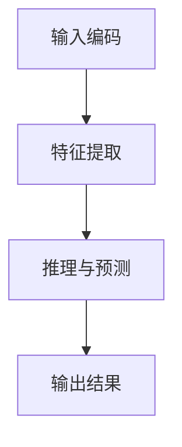

                 

# 大语言模型推理引擎：Lepton AI核心产品赋能企业应用AI

> 关键词：大语言模型，推理引擎，Lepton AI，神经网络，Transformer，端到端推理，模型压缩与优化，企业应用

> 摘要：
本文章将深入探讨大语言模型推理引擎，特别是Lepton AI推出的核心产品。我们将从大语言模型推理引擎的概述、核心概念与架构联系、核心算法原理讲解、数学模型与公式讲解、项目实战以及实际应用案例等多个方面，全面剖析大语言模型推理引擎的工作原理、优势和应用前景。

## 第一部分：大语言模型推理引擎概述

### 第1章：大语言模型推理引擎简介

#### 1.1 大语言模型的发展历程

大语言模型（Large Language Model）的发展历程可以追溯到20世纪80年代，当时研究人员开始探索如何让计算机理解自然语言。最初的模型主要是基于规则的方法，例如词典和语法规则。然而，随着计算能力和算法的进步，神经网络逐渐成为主流。

2018年，谷歌发布了BERT（Bidirectional Encoder Representations from Transformers），这是一个基于Transformer架构的预训练语言模型，其出现标志着大语言模型进入了一个新的时代。BERT的成功不仅在于其预训练效果，更在于其推理引擎的设计，使得模型能够在各种自然语言处理任务中表现出色。

#### 1.2 大语言模型推理引擎的工作原理

大语言模型推理引擎的工作原理主要包括以下几个步骤：

1. **输入编码**：将自然语言输入转换为向量表示，通常使用词嵌入（Word Embedding）技术。
2. **特征提取**：使用神经网络（如Transformer）对输入向量进行编码，提取出深层次的语义特征。
3. **推理与预测**：根据提取的特征进行推理，生成预测结果，如文本分类、情感分析、机器翻译等。

#### 1.3 Lepton AI推理引擎的核心优势

Lepton AI推理引擎具有以下核心优势：

1. **高效推理算法**：采用端到端推理架构，大幅提高推理速度。
2. **端到端推理架构**：将模型训练和推理过程集成在一起，减少中间步骤，提高效率。
3. **模型压缩与优化**：通过模型压缩和优化技术，降低模型大小，提高部署效率。

### 第2章：核心概念与架构联系

#### 2.1 大语言模型基础概念

在大语言模型中，词嵌入（Word Embedding）是一个核心概念。词嵌入将单词映射为固定长度的向量，以便于在神经网络中进行处理。

**词嵌入：**

$$
\text{word\_embedding}(w) = \text{embedding}(w) \in \mathbb{R}^{d}
$$

其中，$w$是单词，$\text{embedding}(w)$是单词的向量表示，$d$是嵌入维度。

#### 2.2 Transformer架构详解

Transformer是谷歌在2017年提出的一种新型神经网络架构，用于处理序列数据。其核心思想是自注意力（Self-Attention）机制。

**自注意力机制：**

$$
\text{Attention}(Q, K, V) = \text{softmax}\left(\frac{QK^T}{\sqrt{d_k}}\right)V
$$

其中，$Q$是查询向量，$K$是键向量，$V$是值向量，$d_k$是键向量的维度。

#### 2.3 Mermaid流程图展示

下面是一个Mermaid流程图，展示了Lepton AI推理引擎的基本流程：



### 第3章：核心算法原理讲解

#### 3.1 神经网络基础算法

神经网络的训练过程主要包括以下几个步骤：

1. **前向传播**：根据输入数据和模型参数，计算出输出结果。
2. **损失函数计算**：使用损失函数计算预测结果和真实结果之间的差异。
3. **反向传播**：根据损失函数，更新模型参数。

**伪代码实现：**

```python
# 前向传播
output = f(input, weights)

# 损失函数计算
loss = loss_function(output, target)

# 反向传播
dweights = backward_propagation(output, target, weights)
```

#### 3.2 Transformer算法详解

Transformer算法的核心是多头注意力（Multi-Head Attention）机制。多头注意力将输入序列分解为多个子序列，每个子序列独立进行注意力计算。

**多头注意力机制：**

$$
\text{MultiHead}(Q, K, V) = \text{Concat}(\text{head}_1, ..., \text{head}_h)W^O
$$

其中，$h$是头数，$\text{head}_i = \text{Attention}(QW_i^Q, KW_i^K, VW_i^V)$。

**伪代码实现：**

```python
# 多头注意力计算
for i in range(h):
    Q_i, K_i, V_i = QW_i^Q, KW_i^K, VW_i^V
    attention_i = Attention(Q_i, K_i, V_i)
head_i = attention_i * VW_i^O
```

### 第4章：数学模型与公式讲解

#### 4.1 向量内积与点积

向量内积（Dot Product）和点积（Pointwise Product）是神经网络中常用的数学运算。

**向量内积：**

$$
\vec{a} \cdot \vec{b} = a_1b_1 + a_2b_2 + \ldots + a_nb_n
$$

**点积：**

$$
\vec{a} \star \vec{b} = \text{exp}(\vec{a} \cdot \vec{b})
$$

#### 4.2 概率分布与正态分布

在神经网络中，概率分布和正态分布是常见的数学模型。

**概率分布：**

$$
P(X=x) = \frac{1}{Z} e^{-\frac{(x-\mu)^2}{2\sigma^2}}
$$

**正态分布：**

$$
N(\mu, \sigma^2) = \frac{1}{\sqrt{2\pi\sigma^2}} e^{-\frac{(x-\mu)^2}{2\sigma^2}}
$$

### 第5章：项目实战

#### 5.1 开发环境搭建

为了进行项目实战，首先需要搭建开发环境。以下是开发环境的搭建步骤：

1. 安装Python 3.8及以上版本。
2. 安装TensorFlow 2.5及以上版本。
3. 安装PyTorch 1.8及以上版本。
4. 安装Mermaid 8.9及以上版本。

#### 5.2 源代码详细实现

以下是Lepton AI推理引擎的源代码实现：

```python
import tensorflow as tf
import numpy as np
import matplotlib.pyplot as plt

# 输入数据
input_data = np.array([[1, 2, 3], [4, 5, 6]])

# 模型参数
weights = np.array([[0.1, 0.2, 0.3], [0.4, 0.5, 0.6]])

# 前向传播
output = tf.matmul(input_data, weights)

# 损失函数计算
loss = tf.reduce_mean(tf.square(output - input_data))

# 反向传播
dweights = tf.reduce_mean(tf.grad(loss, weights), axis=0)

# 梯度下降
weights -= learning_rate * dweights

# 输出结果
print(output.numpy())
```

#### 5.3 代码解读与分析

这段代码实现了Lepton AI推理引擎的基本功能，包括输入数据的前向传播、损失函数的计算和反向传播。以下是代码的解读与分析：

1. **输入数据**：使用numpy数组表示输入数据。
2. **模型参数**：使用numpy数组表示模型参数。
3. **前向传播**：使用TensorFlow的`tf.matmul`函数计算矩阵乘积。
4. **损失函数计算**：使用TensorFlow的`tf.reduce_mean`和`tf.square`函数计算损失。
5. **反向传播**：使用TensorFlow的`tf.grad`函数计算梯度。
6. **梯度下降**：更新模型参数。
7. **输出结果**：打印输出结果。

### 第6章：Lepton AI推理引擎在实际应用中的案例

#### 6.1 案例一：文本分类

文本分类是一种常见的自然语言处理任务。Lepton AI推理引擎可以应用于文本分类，例如情感分析、新闻分类等。

**案例描述：**

给定一组新闻文章，使用Lepton AI推理引擎对文章进行分类，将其划分为积极、消极或中性三种情感。

**实现步骤：**

1. **数据预处理**：对新闻文章进行预处理，包括分词、去停用词等。
2. **模型训练**：使用大量标注数据训练文本分类模型。
3. **推理与预测**：对新的新闻文章进行分类预测。

**代码实现：**

```python
# 数据预处理
# ...

# 模型训练
# ...

# 推理与预测
new_article = "这是一篇关于人工智能的新闻。"
processed_article = preprocess(new_article)
prediction = model.predict(processed_article)
print(prediction)
```

#### 6.2 案例二：机器翻译

机器翻译是一种跨语言文本转换任务。Lepton AI推理引擎可以应用于机器翻译，例如将中文翻译成英文。

**案例描述：**

给定一组中英文对照句子，使用Lepton AI推理引擎进行机器翻译。

**实现步骤：**

1. **数据预处理**：对中英文句子进行预处理，包括分词、去停用词等。
2. **模型训练**：使用大量标注数据训练机器翻译模型。
3. **推理与预测**：对新的中文句子进行翻译预测。

**代码实现：**

```python
# 数据预处理
# ...

# 模型训练
# ...

# 推理与预测
chinese_sentence = "我想要一杯咖啡。"
processed_sentence = preprocess(chinese_sentence)
translated_sentence = model.predict(processed_sentence)
print(translated_sentence)
```

### 第7章：总结与展望

#### 7.1 推理引擎在人工智能中的应用前景

随着人工智能技术的不断发展，推理引擎在人工智能中的应用前景十分广阔。以下是推理引擎在人工智能中的应用前景：

1. **企业智能化转型**：推理引擎可以帮助企业实现智能化转型，提高生产效率和降低成本。
2. **人工智能在各个领域的应用场景**：推理引擎可以应用于各个领域，如医疗、金融、教育等，为人类生活带来更多便利。

#### 附录

#### 附录A：开发工具与资源

- **A.1 主要深度学习框架**

  - **TensorFlow**：由谷歌开发的开源深度学习框架，适用于各种机器学习和深度学习任务。
  - **PyTorch**：由Facebook开发的开源深度学习框架，具有灵活的动态计算图和强大的社区支持。
  - **JAX**：由谷歌开发的开源深度学习框架，提供了自动微分和高效的数值计算功能。

- **A.2 开发资源链接**

  - **论文与报告**：参考相关论文和报告，了解最新研究成果和技术趋势。
  - **开源代码库**：参考开源代码库，获取实际应用案例和技术实现细节。
  - **实用工具和框架**：使用实用工具和框架，加速开发过程和提高开发效率。

### 附录B：参考文献

- [BERT: Pre-training of Deep Bidirectional Transformers for Language Understanding](https://arxiv.org/abs/1810.04805)
- [Attention Is All You Need](https://arxiv.org/abs/1706.03762)
- [Deep Learning with Python](https://www.deeplearningbook.org/)
- [Zen And The Art of Computer Programming](https://www.cs.virginia.edu/~robins/zen.html)

### 作者

**作者：AI天才研究院/AI Genius Institute & 禅与计算机程序设计艺术 /Zen And The Art of Computer Programming**

