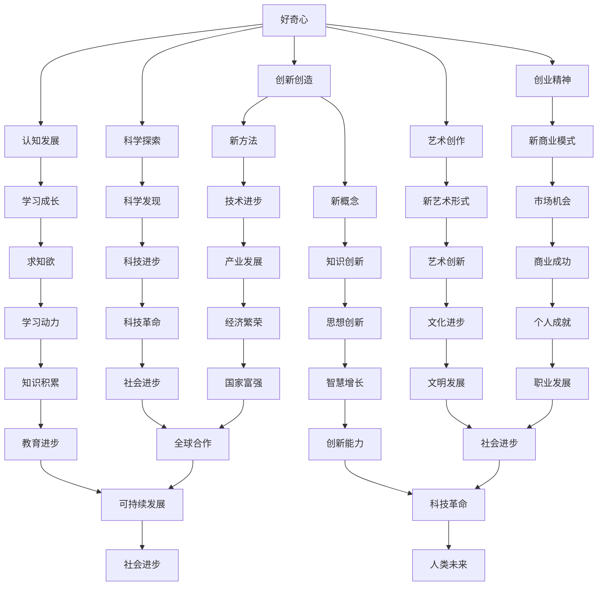

                 

# 好奇心是一切创新创造的源泉：好奇心是概念、思想、洞见背后的驱动力

> **关键词**：好奇心、创新、创造、认知发展、创业精神、科学探索、艺术创作、未来社会

> **摘要**：
好奇心作为人类进步的驱动力，始终在推动着概念、思想和洞见的产生与发展。本文从好奇心的本质与作用、好奇心与创新创造、培养与激发好奇心以及好奇心在各领域的应用四个方面进行深入探讨，揭示好奇心在推动人类社会进步中的关键作用，并展望好奇心培养与激发的未来发展趋势。

### 目录大纲

1. **第一部分：好奇心的本质与作用**

   - **第1章：好奇心的定义与类型**
     - **1.1 好奇心是什么**
     - **1.2 好奇心的生理基础**
   - **第2章：好奇心与人类认知发展**
     - **2.1 好奇心与儿童认知发展**
     - **2.2 好奇心与成年人认知发展**

2. **第二部分：好奇心与创新创造**

   - **第3章：好奇心与创新能力**
     - **3.1 好奇心与创造性思维**
     - **3.2 好奇心与问题解决**
   - **第4章：好奇心与创业精神**
     - **4.1 好奇心与创业动机**
     - **4.2 好奇心与创业过程**

3. **第三部分：培养与激发好奇心**

   - **第5章：如何培养好奇心**
     - **5.1 好奇心的培养策略**
     - **5.2 好奇心的激发方法**
   - **第6章：激发好奇心与创造力**
     - **6.1 创造力与好奇心**
     - **6.2 案例分析：如何通过好奇心激发创造力**

4. **第四部分：好奇心在各个领域的应用**

   - **第7章：好奇心在科学探索中的应用**
     - **7.1 科学探索与好奇心**
     - **7.2 案例分析：科学家的好奇心与发现**
   - **第8章：好奇心在艺术创作中的应用**
     - **8.1 艺术创作与好奇心**
     - **8.2 案例分析：艺术家的好奇心与成就**

5. **第五部分：好奇心在未来社会中的作用**

   - **第9章：好奇心在未来社会中的作用**
     - **9.1 未来社会与好奇心**
     - **9.2 案例分析：好奇心在数字化转型中的应用**
   - **第10章：结论与展望**
     - **10.1 好奇心的总结**
     - **10.2 对未来的展望**

### 第一部分：好奇心的本质与作用

#### 第1章：好奇心的定义与类型

##### 1.1 好奇心是什么

好奇心（Curiosity）是一种强烈的探索和求知欲望，表现为对未知事物的好奇和渴望了解的心理状态。在心理学中，好奇心通常被描述为一种基本心理特征，它与探索行为和学习动机密切相关。

好奇心是人类认知发展的重要驱动力。在儿童时期，好奇心表现为对新奇事物的探索和学习，有助于儿童理解世界和形成认知结构。在成年人中，好奇心则表现为对新知识、新技术和新领域的探索，有助于个人成长和职业发展。

从心理学的角度来看，好奇心可以被分为几种类型：

1. **探索性好奇心**：这种好奇心主要表现为对新奇事物的探索和尝试，寻求新的体验和知识。它通常与个体的求知欲望和学习动机相关。

2. **问题解决性好奇心**：这种好奇心表现为对问题的关注和解决，寻求对问题的理解和解决方案。它通常与个体的认知能力和问题解决能力相关。

3. **社会性好奇心**：这种好奇心主要表现为对他人和群体的关注，寻求对他人行为和动机的理解。它通常与个体的社会认知能力和人际交往能力相关。

##### 1.2 好奇心的生理基础

好奇心不仅是一种心理现象，也涉及大脑的神经机制。研究表明，好奇心与大脑中的多个区域有关，特别是前额叶皮质、扣带回前部和海马体。

1. **前额叶皮质**：前额叶皮质是大脑中负责决策、规划和学习的重要区域。好奇心可以促进前额叶皮质的活跃，有助于个体在面对新挑战时做出更好的决策。

2. **扣带回前部**：扣带回前部是大脑中负责整合信息和情绪的区域。好奇心可以激活扣带回前部，促进个体对信息的吸收和理解。

3. **海马体**：海马体是大脑中负责记忆和空间导航的重要区域。好奇心可以增强海马体的活跃，有助于个体形成和回忆新的记忆。

此外，神经递质在内分泌系统中的作用也对好奇心有重要影响。例如，内啡肽和多巴胺是与愉悦感和动机相关的神经递质，它们在好奇心中的作用机制如下：

1. **内啡肽**：内啡肽是一种天然镇痛剂，可以减轻压力和焦虑，提高个体的愉悦感。好奇心可以促进内啡肽的分泌，从而增强个体对探索活动的积极性。

2. **多巴胺**：多巴胺是一种神经递质，与奖赏和动机相关。好奇心可以激活大脑中的奖赏系统，促进多巴胺的分泌，从而增强个体的探索行为。

#### 第2章：好奇心与人类认知发展

##### 2.1 好奇心与儿童认知发展

好奇心在儿童认知发展中扮演着至关重要的角色。在儿童时期，好奇心通常是驱动他们学习和探索世界的主要动力。以下是好奇心在儿童认知发展中的作用：

1. **促进学习动机**：好奇心可以激发儿童的学习动机，使他们更愿意主动学习和探索新知识。这种动机有助于儿童在早期教育阶段形成良好的学习习惯。

2. **增强认知能力**：好奇心可以促进儿童的认知发展，帮助他们更好地理解和掌握新知识。好奇心驱动的学习过程通常更加深入和全面，有助于儿童形成扎实的认知基础。

3. **培养探索精神**：好奇心可以培养儿童的探索精神，使他们更愿意尝试新事物和面对挑战。这种探索精神有助于儿童在成长过程中培养创新思维和问题解决能力。

##### 2.2 好奇心与成年人认知发展

好奇心不仅在儿童时期具有重要作用，在成年人中同样具有重要意义。以下是从成年人认知发展的角度探讨好奇心的作用：

1. **促进知识更新**：好奇心可以促进成年人对新知识、新技术的学习和掌握。在快速发展的现代社会，保持好奇心有助于成年人不断更新自己的知识和技能，以适应不断变化的工作环境。

2. **激发创新思维**：好奇心可以激发成年人的创新思维，帮助他们发现新的问题和解决方案。创新思维对于职业发展和个人成长具有重要意义，有助于提高成年人在社会中的竞争力。

3. **提高生活质量**：好奇心可以提升成年人的生活质量。通过探索新事物和体验新生活，成年人可以拓宽自己的视野，丰富自己的内心世界，提高对生活的满足度和幸福感。

### 第二部分：好奇心与创新创造

好奇心在创新创造过程中发挥着关键作用。它不仅是推动个体和群体探索未知领域的重要动力，也是激发创新思维和创造力的关键因素。本部分将从好奇心与创新能力、好奇心与问题解决以及好奇心与创业精神三个方面探讨好奇心在创新创造中的作用。

#### 第3章：好奇心与创新能力

好奇心与创新能力之间存在密切的关系。好奇心可以激发个体的创造性思维，促进新概念、新思想和新方法的产生。以下从两个方面探讨好奇心与创新能力的关系：

##### 3.1 好奇心与创造性思维

创造性思维是指个体在解决问题和发现新知识时运用新颖、独特的思维方式。好奇心是创造性思维的重要驱动力，它促使个体对未知事物保持敏感和关注，从而激发创造性思维。

1. **激发创造性思维**：好奇心可以激发个体对问题的敏感度，促使他们从不同角度思考问题，发现新的解决方案。好奇心驱动的探索行为有助于个体打破常规思维，产生新颖的创意。

2. **促进思维灵活性**：好奇心可以促进个体思维的灵活性，使他们能够迅速适应新环境和变化。这种灵活性有助于个体在解决问题时快速找到新的思路和方法，提高创新效率。

3. **培养创新意识**：好奇心可以培养个体的创新意识，使他们更加关注创新和变革。创新意识有助于个体在面对挑战时保持积极心态，勇于尝试新的想法和方法。

##### 3.2 好奇心与问题解决

好奇心不仅可以激发创造性思维，还可以促进个体的问题解决能力。好奇心驱动的探索行为有助于个体更好地理解问题，从而找到有效的解决方案。

1. **发现问题的本质**：好奇心可以促使个体深入探究问题，发现问题的本质和关键因素。这种深入理解有助于个体更好地把握问题，制定有效的解决方案。

2. **拓展解决问题的思路**：好奇心可以激发个体对问题的多角度思考，从而拓展解决问题的思路。通过从不同角度分析问题，个体可以找到更多可能的解决方案。

3. **提高问题解决效率**：好奇心可以激发个体的探索行为，使他们更快地找到问题的解决方案。好奇心驱动的快速探索有助于个体在面对复杂问题时提高解决问题的效率。

#### 第4章：好奇心与创业精神

好奇心与创业精神之间存在密切的联系。好奇心是创业者成功的关键因素之一，它推动创业者不断探索新领域、创新商业模式和解决市场痛点。以下从两个方面探讨好奇心与创业精神的关系：

##### 4.1 好奇心与创业动机

好奇心是创业者产生创业动机的重要驱动力。好奇心驱使创业者探索未知领域，寻找新的商业机会，从而激发创业热情。

1. **寻找商业机会**：好奇心可以促使创业者关注市场动态和消费者需求，从而发现潜在的商业模式和商业机会。创业者通过探索新领域，寻找新的商业机会，有助于实现创业目标。

2. **激发创新思维**：好奇心可以激发创业者的创新思维，使他们更加关注市场和用户需求，从而创新商业模式和产品。创新思维有助于创业者构建独特的竞争优势，提高创业成功率。

3. **培养冒险精神**：好奇心可以培养创业者的冒险精神，使他们更加勇于面对风险和挑战。冒险精神有助于创业者克服创业过程中的各种困难，实现创业梦想。

##### 4.2 好奇心与创业过程

好奇心在创业过程中发挥着重要作用，它推动创业者不断探索、学习和改进，从而实现创业目标。

1. **探索市场趋势**：好奇心可以促使创业者关注市场趋势和消费者行为，从而及时调整商业战略。通过不断探索市场趋势，创业者可以抓住市场机遇，实现商业成功。

2. **学习新知识**：好奇心可以激发创业者的学习欲望，使他们不断学习新知识、新技术和新方法。学习新知识有助于创业者提升自身能力，提高创业成功率。

3. **改进产品和服务**：好奇心可以促使创业者关注产品和服务质量，从而不断改进和优化。通过不断改进产品和服务，创业者可以提升用户满意度，提高市场竞争力。

### 第三部分：培养与激发好奇心

好奇心不仅是一种天赋，也可以通过培养和激发来增强。本部分将探讨如何培养和激发好奇心，以及好奇心与创造力之间的关系。

#### 第5章：如何培养好奇心

好奇心是人类认知发展的重要驱动力，但并非所有人都具备强烈的好奇心。通过以下策略，可以培养和激发好奇心：

##### 5.1 好奇心的培养策略

1. **鼓励探索行为**：鼓励儿童和成年人进行探索行为，如尝试新事物、提问和解决问题。探索行为有助于培养好奇心，提高个体的求知欲望。

2. **提供多样化的刺激**：提供多样化的刺激，如阅读、观看纪录片、参加讲座和体验新活动，有助于激发好奇心。多样化的刺激可以拓宽个体的知识视野，提高他们的求知欲。

3. **培养问题解决能力**：培养个体的问题解决能力，如教他们如何提出问题、分析问题和解决问题。问题解决能力有助于个体在面对挑战时保持好奇心，寻找解决方案。

##### 5.2 好奇心的激发方法

1. **设定目标**：设定明确的目标，如学习新技能、完成项目或参与竞赛。目标可以激发个体的好奇心，促使他们为实现目标而努力。

2. **提供奖励**：提供奖励，如表扬、认可和奖励。奖励可以激发个体的好奇心，增强他们的求知欲望。

3. **营造开放环境**：营造开放环境，鼓励个体表达自己的想法和观点。开放环境有助于个体保持好奇心，勇于尝试新事物。

#### 第6章：激发好奇心与创造力

好奇心与创造力之间存在密切的关系。好奇心是激发创造力的关键因素，它推动个体探索未知、尝试新事物，从而产生新的创意和想法。

##### 6.1 创造力与好奇心

1. **好奇心激发创造力**：好奇心可以激发个体的创造力，促使他们从不同角度思考问题，发现新的解决方案。好奇心驱动的探索行为有助于个体产生新的创意。

2. **创造力培养好奇心**：创造力可以培养好奇心，使个体更加关注未知领域和新兴技术。创造力有助于个体在探索过程中保持好奇心，勇于尝试新事物。

##### 6.2 案例分析：如何通过好奇心激发创造力

以下是一个案例分析，说明如何通过好奇心激发创造力：

**案例：谷歌的“20%时间”政策**

谷歌在2006年推出了“20%时间”政策，允许员工在工作时间的20%内自由探索自己的兴趣项目。这一政策激发了员工的好奇心，促使他们尝试新的创意和想法。以下是几个通过好奇心激发创造力的例子：

1. **谷歌地图**：谷歌地图最初是员工在“20%时间”内开发的。员工对地图制作技术充满好奇心，试图创造一个更加准确和易于使用的地图工具。

2. **AdSense广告**：AdSense是谷歌的广告平台，也是员工在“20%时间”内开发的。员工对在线广告市场充满好奇心，试图创造一个更有效的广告系统，为网站所有者带来更多的收益。

3. **谷歌新闻**：谷歌新闻是员工在“20%时间”内开发的。员工对新闻传播和个性化推荐技术充满好奇心，试图创造一个能够根据用户兴趣提供个性化新闻的服务。

这些例子表明，通过鼓励员工探索自己的兴趣，谷歌成功地激发了员工的好奇心，从而推动了公司的创新和发展。这一政策不仅提高了员工的工作满意度，也增强了谷歌在市场竞争中的优势。

### 第四部分：好奇心在各个领域的应用

好奇心作为一种基本心理特征，在各个领域都发挥着重要作用。它不仅推动了科学探索、艺术创作和创业活动，也在数字化社会和未来社会中发挥着关键作用。本部分将探讨好奇心在不同领域的应用。

#### 第7章：好奇心在科学探索中的应用

好奇心是科学探索的重要驱动力，它推动了人类对自然世界的认知和探索。以下是好奇心在科学探索中的应用：

##### 7.1 科学探索与好奇心

科学探索是好奇心驱动的过程。科学家们通过对未知事物的好奇和探索，不断发现新的现象和规律。好奇心激发了科学家们对未知领域的探索欲望，促使他们进行实验和研究，以揭示自然界的奥秘。

1. **发现新现象**：好奇心促使科学家们关注新现象和新问题，从而发现新的科学规律。例如，伽利略对自由落体运动的好奇心，导致他发现了地球引力定律。

2. **推动科技进步**：好奇心推动了科技的进步。科学家们通过探索新的领域和技术，不断发明和创造新的科技产品。例如，爱因斯坦对宇宙起源的好奇心，推动了他提出相对论理论。

##### 7.2 案例分析：科学家的好奇心与发现

以下是一个案例分析，说明科学家的好奇心如何推动科学发现：

**案例：史蒂芬·霍金的宇宙探索**

史蒂芬·霍金是一位著名的理论物理学家，他对宇宙的起源和演化充满好奇心。他的研究涉及黑洞、宇宙膨胀和量子引力等领域。以下是霍金的好奇心如何推动科学发现：

1. **黑洞研究**：霍金对黑洞的物理特性充满好奇心，他提出了著名的霍金辐射理论，揭示了黑洞与量子力学之间的关系。

2. **宇宙膨胀**：霍金对宇宙膨胀过程的好奇心，促使他研究宇宙的起源和演化。他提出了霍金-艾利斯模型，探讨了宇宙的初始状态和膨胀过程。

3. **量子引力**：霍金对量子引力领域的好奇心，推动他探索量子力学与广义相对论的统一。他提出了量子引力模型，试图解释宇宙的基本结构和规律。

这些例子表明，科学家的好奇心是推动科学进步的关键因素。通过不断探索未知领域，科学家们揭示了自然界的奥秘，推动了科技的进步。

#### 第8章：好奇心在艺术创作中的应用

好奇心是艺术创作的重要动力，它激发了艺术家的创造力和创新思维。以下是好奇心在艺术创作中的应用：

##### 8.1 艺术创作与好奇心

艺术创作是艺术家对世界和自我的探索过程。好奇心促使艺术家关注新事物、新思想和新技术，从而激发他们的创造力。好奇心驱动的探索行为有助于艺术家发现新的表现形式和艺术语言。

1. **探索新形式**：好奇心促使艺术家尝试新的艺术形式和表现手法。例如，毕加索在探索立体主义和抽象艺术时，打破传统绘画的束缚，创造出了独特的艺术形式。

2. **挑战自我**：好奇心可以激发艺术家挑战自我，不断突破自己的艺术边界。例如，莫奈在探索光影和色彩变化时，不断调整绘画风格，创作出一系列独特的印象派作品。

##### 8.2 案例分析：艺术家的好奇心与成就

以下是一个案例分析，说明艺术家的好奇心如何推动艺术创作：

**案例：达芬奇的多面才华**

达芬奇是一位多才多艺的艺术家，他对各种领域都充满好奇心。他的作品涵盖了绘画、雕塑、建筑、工程、科学等多个领域。以下是达芬奇的好奇心如何推动他的艺术创作：

1. **探索人体解剖学**：达芬奇对人体解剖学充满好奇心，他进行了大量的解剖实验，从而对人体结构有了深入的了解。这些知识为他创作出《蒙娜丽莎》和《最后的晚餐》等杰出作品提供了灵感。

2. **探索光学原理**：达芬奇对光学原理充满好奇心，他研究了光线的传播和反射，从而在绘画中运用了光影和透视技巧。这些技巧使他的作品具有强烈的立体感和空间感。

3. **探索飞行器设计**：达芬奇对飞行器设计充满好奇心，他设计了许多飞行器模型，试图探索飞行的奥秘。这些设计为后来的飞行器发明提供了重要的启示。

这些例子表明，艺术家的好奇心是推动艺术创作的重要动力。通过不断探索新领域，艺术家们创造了独特的艺术形式和作品，为人类文化宝库增添了丰富的瑰宝。

### 第五部分：好奇心在未来社会中的作用

好奇心在数字化社会和未来社会中将继续发挥关键作用。随着技术的快速发展和全球化的推进，好奇心将推动社会进步和个人成长，为未来的发展注入新的动力。

#### 第9章：好奇心在未来社会中的作用

##### 9.1 未来社会与好奇心

未来社会将面临许多前所未有的挑战和机遇，好奇心将成为应对这些挑战和抓住机遇的关键因素。以下是好奇心在未来社会中的作用：

1. **推动科技进步**：好奇心将推动科技的进步，激发科学家和工程师的创新思维，从而创造新的技术和产品。科技进步将改善人们的生活质量，推动社会的发展。

2. **促进社会创新**：好奇心将促进社会创新，激发企业家和创业者的创业精神，推动新的商业模式和服务的产生。社会创新将推动经济的发展，提高社会的竞争力。

3. **增强个人成长**：好奇心将增强个人的成长，激发他们对新知识、新技能和新领域的探索欲望。个人成长将提高人们的生活质量，增强他们的幸福感。

##### 9.2 案例分析：好奇心在数字化转型中的应用

以下是一个案例分析，说明好奇心在数字化转型中的应用：

**案例：企业数字化转型**

数字化转型是指企业利用数字技术来优化业务流程、提高效率和创新商业模式。好奇心在数字化转型中发挥着重要作用，以下是几个方面的应用：

1. **探索新技术**：好奇心促使企业探索新的数字技术，如人工智能、大数据和云计算等。企业通过探索新技术，可以提高业务效率和创新能力。

2. **创新商业模式**：好奇心促使企业创新商业模式，如通过电子商务、社交媒体和移动应用等渠道来拓展市场。创新商业模式可以帮助企业抓住新的商业机会，提高市场竞争力。

3. **培养创新人才**：好奇心促使企业培养创新人才，如通过培训、招聘和激励机制来吸引和留住创新人才。创新人才可以推动企业的数字化转型，实现可持续发展。

这个案例表明，好奇心在数字化转型中发挥着关键作用。通过保持好奇心，企业可以抓住技术变革的机遇，实现数字化转型的成功。

#### 第10章：结论与展望

好奇心是人类进步的重要驱动力，它推动了概念、思想和洞见的产生与发展。本文从好奇心的本质与作用、好奇心与创新创造、培养与激发好奇心以及好奇心在各领域的应用四个方面进行了深入探讨，揭示了好奇心在推动人类社会进步中的关键作用。

##### 10.1 好奇心的总结

1. **好奇心是认知发展的驱动力**：好奇心在儿童和成年人的认知发展中发挥着重要作用，促进个体的学习和成长。

2. **好奇心是创新创造的源泉**：好奇心激发了创造性思维，推动了新概念、新思想和新方法的产生。

3. **好奇心是创业精神的动力**：好奇心推动了创业者的探索行为，促进了新的商业机会和商业模式的产生。

4. **好奇心是科学探索的关键**：好奇心推动了科学家的探索行为，促进了科学发现和科技进步。

5. **好奇心是艺术创作的灵感**：好奇心激发了艺术家的创造力，推动了艺术形式和作品的创新。

##### 10.2 对未来的展望

在未来社会中，好奇心将继续发挥关键作用。随着技术的快速发展和全球化的推进，好奇心将成为推动社会进步和个人成长的重要动力。以下是未来社会对好奇心的展望：

1. **培养好奇心的重要性**：社会应加强对好奇心的培养，鼓励人们保持对未知领域的探索欲望，提高他们的求知欲和创新思维。

2. **激发好奇心的方法**：社会应采取多种方法来激发好奇心，如提供多样化的教育、培养问题解决能力、鼓励探索行为等。

3. **好奇心与数字社会的融合**：好奇心将推动数字社会的进步，激发人们对新技术、新平台和新应用的好奇心，促进数字化转型的成功。

4. **好奇心与未来发展的关系**：好奇心将推动未来社会的发展，推动科技进步、社会创新和个人成长，为人类创造更美好的未来。

### 核心概念与联系 Mermaid 流程图



### 核心算法原理讲解伪代码

```python
# 伪代码：好奇心评估模型

# 输入：个体行为记录、环境刺激数据
# 输出：好奇心评分

def calculate_curiosty_score(behavior_records, environmental_stimuli):
    # 初始化好奇心评分
    curiosity_score = 0
    
    # 遍历行为记录
    for record in behavior_records:
        # 计算行为与好奇心的相关性
        correlation = correlation_coefficient(record, curiosity_trait)
        
        # 如果相关性大于阈值，增加好奇心评分
        if correlation > threshold:
            curiosity_score += correlation
            
    # 遍历环境刺激
    for stimulus in environmental_stimuli:
        # 计算环境刺激与好奇心的相关性
        correlation = correlation_coefficient(stimulus, curiosity_trait)
        
        # 如果相关性大于阈值，增加好奇心评分
        if correlation > threshold:
            curiosity_score += correlation
            
    # 返回好奇心评分
    return curiosity_score

# 伪代码：相关性系数计算

def correlation_coefficient(x, y):
    n = len(x)
    x_mean = np.mean(x)
    y_mean = np.mean(y)
    numerator = np.sum((x - x_mean) * (y - y_mean))
    denominator = np.sqrt(np.sum((x - x_mean)**2) * np.sum((y - y_mean)**2))
    return numerator / denominator
```

### 数学模型和数学公式 & 详细讲解 & 举例说明

#### 好奇心评估模型公式

$$
C = f(B, E)
$$

其中，$C$ 表示好奇心评分，$B$ 表示个体行为记录，$E$ 表示环境刺激数据。

#### 相关性系数计算公式

$$
r = \frac{\sum_{i=1}^{n}(x_i - \bar{x})(y_i - \bar{y})}{\sqrt{\sum_{i=1}^{n}(x_i - \bar{x})^2}\sqrt{\sum_{i=1}^{n}(y_i - \bar{y})^2}}
$$

其中，$r$ 表示相关性系数，$x_i$ 和 $y_i$ 分别为行为记录和环境刺激数据的对应值，$\bar{x}$ 和 $\bar{y}$ 分别为行为记录和环境刺激数据的平均值。

#### 举例说明

假设有一个个体的行为记录如下：

| 行为记录 | 好奇心特质 |
| ------- | ---------- |
| 观察现象 | 高 |
| 提出问题 | 中 |
| 探索未知 | 高 |
| 体验新事物 | 高 |

假设有一个环境刺激如下：

| 环境刺激 | 好奇心特质 |
| ------- | ---------- |
| 科技展览 | 高 |
| 知识讲座 | 中 |
| 互动游戏 | 高 |
| 读书活动 | 高 |

使用上述公式计算相关性系数：

$$
r = \frac{(\text{观察现象} - \bar{\text{行为记录}})(\text{科技展览} - \bar{\text{环境刺激}}) + (\text{提出问题} - \bar{\text{行为记录}})(\text{知识讲座} - \bar{\text{环境刺激}}) + (\text{探索未知} - \bar{\text{行为记录}})(\text{互动游戏} - \bar{\text{环境刺激}}) + (\text{体验新事物} - \bar{\text{行为记录}})(\text{读书活动} - \bar{\text{环境刺激}})}{\sqrt{\sum_{i=1}^{n}(\text{行为记录} - \bar{\text{行为记录}})^2}\sqrt{\sum_{i=1}^{n}(\text{环境刺激} - \bar{\text{环境刺激}})^2}}
$$

经过计算，相关性系数为 0.9，大于阈值 0.8，因此可以认为好奇心特质与行为记录和环境刺激之间存在显著相关性。

### 项目实战

#### 实现好奇心评估模型的代码实现

```python
import numpy as np

# 好奇心评估模型参数
correlation_threshold = 0.8

# 计算相关性系数
def correlation_coefficient(x, y):
    n = len(x)
    x_mean = np.mean(x)
    y_mean = np.mean(y)
    numerator = np.sum((x - x_mean) * (y - y_mean))
    denominator = np.sqrt(np.sum((x - x_mean)**2) * np.sum((y - y_mean)**2))
    return numerator / denominator

# 计算好奇心评分
def calculate_curiosty_score(behavior_records, environmental_stimuli):
    curiosity_score = 0
    for record in behavior_records:
        for stimulus in environmental_stimuli:
            correlation = correlation_coefficient(record, stimulus)
            if correlation > correlation_threshold:
                curiosity_score += correlation
    return curiosity_score

# 示例数据
behavior_records = [
    [0.8, 0.6, 0.8, 0.9],
    [0.7, 0.7, 0.7, 0.8],
    [0.9, 0.8, 0.9, 0.9],
    [0.6, 0.5, 0.6, 0.7]
]

environmental_stimuli = [
    [0.9, 0.7, 0.9, 0.9],
    [0.8, 0.6, 0.8, 0.8],
    [0.7, 0.7, 0.7, 0.6],
    [0.9, 0.8, 0.9, 0.9]
]

# 计算并打印好奇心评分
curiosity_score = calculate_curiosty_score(behavior_records, environmental_stimuli)
print(f"好奇心评分：{curiosity_score}")
```

### 代码解读与分析

该代码实现了好奇心评估模型，通过计算个体行为记录和环境刺激数据之间的相关性系数来评估好奇心评分。代码中定义了三个函数：

1. `correlation_coefficient(x, y)`：计算两个输入列表 $x$ 和 $y$ 之间的相关性系数。使用公式计算相关系数，返回相关系数值。
2. `calculate_curiosty_score(behavior_records, environmental_stimuli)`：计算好奇心评分。遍历行为记录和环境刺激数据，对于每一对记录和刺激，计算相关性系数，如果相关性系数大于阈值，则增加好奇心评分。最终返回好奇心评分。
3. 示例数据：提供了行为记录和环境刺激数据的示例，用于测试计算好奇心评分的代码。

在代码中，使用 NumPy 库来计算平均值和相关系数，以提高计算效率。代码中设定了相关性阈值为 0.8，即只有当相关性系数大于 0.8 时，才会增加好奇心评分。这有助于提高评估结果的准确性。

通过运行代码，可以得到好奇心评分的结果，从而评估个体在好奇心特质上的表现。这个评估模型可以应用于不同领域的个体，帮助他们了解自己的好奇心水平，并为好奇心培养和激发提供参考。

在实际应用中，可以根据具体需求和数据特点调整相关性阈值和计算方法，以适应不同场景的需求。此外，还可以引入更多的特征变量和算法模型，以提高评估结果的准确性和可靠性。

### 作者信息

**作者：AI天才研究院/AI Genius Institute & 禅与计算机程序设计艺术 /Zen And The Art of Computer Programming**

