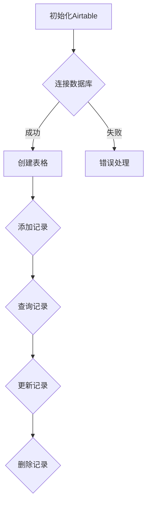

                 

### 《如何利用Airtable构建创业数据库与工作流》

#### 关键词：Airtable，创业数据库，工作流，客户关系管理，项目管理，财务管理，自动化，数据集成

#### 摘要：

本文将详细介绍如何利用Airtable构建创业数据库与工作流。我们将从Airtable的基础知识入手，逐步深入到创业数据库的设计与应用，以及如何通过工作流优化提升创业公司的运营效率。文章将结合实际案例，展示如何通过Airtable实现客户关系管理、项目管理和财务管理的自动化，并提供代码实际案例和详细解释说明，帮助创业者们高效构建和管理自己的创业数据库。

---

### 《如何利用Airtable构建创业数据库与工作流》目录大纲

#### 第一部分：Airtable基础与创业数据库构建

- **第1章: Airtable入门与基础**
  - **1.1 Airtable简介**
    - **1.1.1 Airtable的特点**
    - **1.1.2 Airtable的组成部分**
  - **1.2 Airtable基础操作**
    - **1.2.1 创建与编辑表格**
    - **1.2.2 使用视图与过滤器**
    - **1.2.3 公式与自定义字段**
  - **1.3 创业数据库设计原则**
    - **1.3.1 数据库设计的重要性**
    - **1.3.2 数据库设计的关键要素**

- **第2章: Airtable在创业数据库构建中的应用**
  - **2.1 客户关系管理**
    - **2.1.1 客户数据收集与存储**
    - **2.1.2 客户需求分析**
    - **2.1.3 客户跟进与沟通**
  - **2.2 项目管理**
    - **2.2.1 项目任务分配与跟踪**
    - **2.2.2 项目进度管理**
    - **2.2.3 项目风险控制**
  - **2.3 财务管理**
    - **2.3.1 收入与支出记录**
    - **2.3.2 预算管理**
    - **2.3.3 财务报表生成**

#### 第二部分：Airtable工作流优化

- **第3章: Airtable工作流设计与自动化**
  - **3.1 工作流设计原则**
    - **3.1.1 工作流的基本概念**
    - **3.1.2 工作流设计的关键要素**
    - **3.1.3 工作流优化的重要性**
  - **3.2 使用Airtable自动化工作流**
    - **3.2.1 自动化规则设置**
    - **3.2.2 通知与提醒功能**
    - **3.2.3 工作流模板**
  - **3.3 实际案例解析**
    - **3.3.1 客户服务流程优化**
    - **3.3.2 项目协作流程自动化**
    - **3.3.3 财务审批流程设计**

#### 第三部分：Airtable拓展与创业支持

- **第4章: Airtable与其他工具的集成**
  - **4.1 数据导入与导出**
    - **4.1.1 数据导入方法**
    - **4.1.2 数据导出策略**
    - **4.1.3 数据迁移与备份**
  - **4.2 集成第三方服务**
    - **4.2.1 API调用与集成**
    - **4.2.2 第三方插件与应用**
    - **4.2.3 集成策略与最佳实践**
  - **4.3 创业支持与资源整合**
    - **4.3.1 创业资源评估与整合**
    - **4.3.2 创业资金管理**
    - **4.3.3 创业团队协作与沟通**

#### 第四部分：Airtable应用案例

- **第5章: 案例分析：创业公司的Airtable应用实践**
  - **5.1 案例介绍**
    - **5.1.1 公司背景**
    - **5.1.2 面临的挑战**
    - **5.1.3 Airtable应用方案**
  - **5.2 客户关系管理**
    - **5.2.1 数据收集与存储**
    - **5.2.2 客户需求分析**
    - **5.2.3 客户跟进与沟通**
  - **5.3 项目管理**
    - **5.3.1 项目任务分配与跟踪**
    - **5.3.2 项目进度管理**
    - **5.3.3 项目风险控制**
  - **5.4 财务管理**
    - **5.4.1 收入与支出记录**
    - **5.4.2 预算管理**
    - **5.4.3 财务报表生成**

### 附录

- **附录A: Airtable常用函数与公式**
  - **1.1 常用函数介绍**
  - **1.2 公式应用示例**
- **附录B: Airtable开发资源与工具**
  - **1.1 Airtable官方文档**
  - **1.2 开源插件与工具**
  - **1.3 社区资源与论坛**

---

接下来，我们将逐步深入探讨每个章节的核心内容，帮助创业者们更好地利用Airtable构建高效的数据库与工作流。

---

### 第一部分：Airtable基础与创业数据库构建

#### 第1章: Airtable入门与基础

在这个快速变化的时代，创业公司的成功往往依赖于其数据处理和流程优化的能力。作为一款强大的无代码数据库工具，Airtable可以帮助创业者快速构建和管理数据库，从而提高工作效率。本章将介绍Airtable的基础知识，包括其特点、组成部分以及基础操作，帮助读者为后续的创业数据库构建奠定基础。

##### 1.1 Airtable简介

##### 1.1.1 Airtable的特点

Airtable是一款结合了表格、数据库和项目管理功能的在线工具。它的特点如下：

1. **灵活性与可扩展性**：Airtable提供了一个灵活的表格系统，用户可以自定义字段类型、字段名称和表格布局。同时，Airtable支持通过第三方插件和API与多种工具和服务进行集成，极大地扩展了其功能。

2. **直观的界面**：Airtable的界面设计简洁直观，使得用户无需编程背景即可轻松操作。通过拖拽和配置，用户可以快速创建和管理表格、视图和公式。

3. **强大的公式功能**：Airtable支持多种内置函数和自定义公式，用户可以通过公式对数据进行处理和计算，实现数据可视化、自动化和其他高级功能。

4. **协作功能**：Airtable支持多用户协作，团队成员可以实时更新和共享数据，确保信息的一致性和实时性。

##### 1.1.2 Airtable的组成部分

Airtable由以下几个核心部分组成：

1. **表格（Tables）**：表格是Airtable的核心，类似于Excel的工作表，用于存储和组织数据。

2. **字段（Fields）**：字段是表格中的数据列，用于定义数据的类型和属性。Airtable支持多种字段类型，如文本、数字、日期、多选框、滚动条等。

3. **记录（Records）**：记录是表格中的行，每条记录对应表格中的一个数据条目。

4. **视图（Views）**：视图用于显示和操作表格数据，包括表格视图、画廊视图、日历视图等。通过不同的视图，用户可以以最适合的方式查看和管理数据。

5. **公式（Formulas）**：公式是Airtable的强大功能之一，用户可以通过公式对数据进行计算和逻辑处理。

##### 1.2 Airtable基础操作

##### 1.2.1 创建与编辑表格

创建表格是使用Airtable的第一步。以下是创建和编辑表格的基本步骤：

1. **创建新表格**：
   - 打开Airtable，点击“新建表格”按钮。
   - 输入表格名称，选择表格模板或自定义表格。
   - 设置表格的基本布局和字段。

2. **编辑表格**：
   - 添加或删除字段：在表格界面中，可以通过点击字段名称右侧的按钮来添加新字段或删除现有字段。
   - 修改字段属性：选择字段后，可以在字段设置中修改字段名称、类型和其他属性。

##### 1.2.2 使用视图与过滤器

视图是查看表格数据的不同方式。Airtable提供了多种视图，如表格视图、画廊视图、日历视图等。以下是使用视图和过滤器的基本操作：

1. **创建新视图**：
   - 在表格界面中，点击“视图”按钮，选择要创建的视图类型。
   - 根据视图类型，设置视图的显示选项和筛选条件。

2. **使用过滤器**：
   - 在视图界面中，点击“过滤器”按钮，选择要过滤的字段和条件。
   - 设置过滤器后，表格数据将根据条件显示。

##### 1.2.3 公式与自定义字段

Airtable的公式功能非常强大，可以用于数据的计算、逻辑处理和自动化。以下是使用公式和自定义字段的基本操作：

1. **创建公式**：
   - 在表格字段设置中，选择“公式”选项，输入公式表达式。
   - 公式可以包含Airtable内置函数、自定义函数和运算符。

2. **自定义字段**：
   - Airtable支持通过公式创建自定义字段，用于计算和展示特定数据。
   - 自定义字段可以像普通字段一样使用，并在视图中显示。

##### 1.3 创业数据库设计原则

##### 1.3.1 数据库设计的重要性

创业数据库设计是创业成功的关键之一。一个良好设计的数据库不仅能够高效地存储和管理数据，还能为创业者提供有力的数据支持和决策依据。以下是数据库设计的重要性：

1. **数据准确性**：良好设计的数据库能够确保数据的准确性，避免数据冗余和错误。

2. **数据一致性**：数据库设计应该保证数据的一致性，确保不同部门和人员使用的数据是相同的。

3. **数据可扩展性**：随着业务的增长，数据库设计应该能够适应数据的扩展，避免因数据量增大而导致系统崩溃。

4. **数据安全性**：数据库设计应考虑数据的安全性，确保敏感数据不被未授权人员访问。

##### 1.3.2 数据库设计的关键要素

以下是创业数据库设计的关键要素：

1. **需求分析**：在开始设计数据库之前，应明确业务需求，包括数据类型、数据关系和数据处理要求。

2. **数据模型**：根据需求分析，设计数据模型，包括表格、字段和关系。常见的数据模型有星型模型、雪花模型等。

3. **规范化**：对数据库进行规范化处理，减少数据冗余和提高查询效率。

4. **字段设计**：合理设计字段，包括字段名称、类型、长度和默认值。

5. **索引设计**：根据查询需求，设计合适的索引，提高查询性能。

通过本章的介绍，读者应该对Airtable有了基本的了解，并了解了创业数据库设计的重要性。在接下来的章节中，我们将进一步探讨Airtable在创业数据库构建中的应用，帮助读者掌握如何在创业中高效利用Airtable。

---

### 第一部分：Airtable基础与创业数据库构建

#### 第2章: Airtable在创业数据库构建中的应用

在前一章中，我们了解了Airtable的基本特点和基础操作。在本章中，我们将深入探讨Airtable在创业数据库构建中的应用，重点关注客户关系管理、项目管理和财务管理三个方面。通过具体案例，我们将展示如何利用Airtable构建高效、灵活的创业数据库，从而提升公司的运营效率。

##### 2.1 客户关系管理

客户关系管理（CRM）是创业公司成功的关键之一。通过有效管理客户信息、需求和反馈，公司可以更好地满足客户需求，提高客户满意度和忠诚度。Airtable提供了一个强大的平台，可以帮助创业公司轻松构建CRM系统。

##### 2.1.1 客户数据收集与存储

在Airtable中构建CRM系统，首先需要收集和存储客户数据。这包括客户的姓名、联系方式、购买历史、需求反馈等。以下是具体步骤：

1. **创建客户信息表格**：
   - 在Airtable中新建一个表格，命名为“客户信息”。
   - 添加字段，包括“姓名”、“联系方式”、“购买历史”和“需求反馈”等。

2. **导入客户数据**：
   - 如果已有客户数据，可以通过CSV文件或API导入到Airtable中。
   - 确保数据格式与Airtable字段匹配，避免数据导入错误。

3. **批量操作**：
   - 利用Airtable的批量操作功能，可以快速更新和整理客户数据。
   - 例如，批量修改联系方式或更新购买历史。

##### 2.1.2 客户需求分析

客户需求分析是CRM的重要环节。通过分析客户需求，公司可以更好地了解客户痛点，优化产品和服务。以下是使用Airtable进行客户需求分析的方法：

1. **数据筛选**：
   - 利用Airtable的筛选功能，根据特定条件筛选客户数据。
   - 例如，筛选最近一个月的新客户或反馈较多的客户。

2. **数据可视化**：
   - 通过图表和仪表板，将客户需求可视化展示。
   - 例如，使用柱状图展示不同产品的需求量。

3. **趋势分析**：
   - 利用Airtable的公式功能，分析客户需求的变化趋势。
   - 例如，计算最近三个月的新客户增长率。

##### 2.1.3 客户跟进与沟通

客户跟进与沟通是CRM的关键。通过有效跟进和沟通，公司可以及时解决客户问题，提高客户满意度。以下是使用Airtable进行客户跟进与沟通的方法：

1. **任务管理**：
   - 在Airtable中创建任务表格，记录客户跟进任务。
   - 添加任务字段，包括“任务名称”、“任务描述”、“任务状态”和“任务负责人”等。

2. **自动化提醒**：
   - 利用Airtable的自动化功能，设置提醒通知。
   - 例如，当任务状态为“未完成”时，自动发送提醒邮件给负责人。

3. **沟通记录**：
   - 在客户信息表格中添加“沟通记录”字段，记录每次沟通的内容和时间。
   - 通过批量操作，可以快速整理和查询沟通记录。

##### 2.2 项目管理

项目管理是创业公司的另一个关键领域。通过有效管理项目任务、进度和风险，公司可以确保项目按时完成，提高工作效率。Airtable提供了一个强大的项目管理平台，可以帮助公司轻松实现这一目标。

##### 2.2.1 项目任务分配与跟踪

在Airtable中构建项目管理系统，首先需要明确项目任务，并将其分配给团队成员。以下是具体步骤：

1. **创建项目任务表格**：
   - 在Airtable中新建一个表格，命名为“项目任务”。
   - 添加字段，包括“任务名称”、“任务描述”、“任务状态”、“任务负责人”和“截止日期”等。

2. **任务分配**：
   - 利用Airtable的批量操作功能，将任务分配给团队成员。
   - 例如，批量设置任务负责人和截止日期。

3. **任务跟踪**：
   - 通过Airtable的视图功能，实时跟踪任务状态。
   - 例如，使用表格视图或甘特图视图，展示任务进度。

##### 2.2.2 项目进度管理

项目进度管理是确保项目按时完成的关键。在Airtable中，可以通过以下方法实现项目进度管理：

1. **进度更新**：
   - 利用Airtable的实时更新功能，团队成员可以随时更新任务进度。
   - 例如，将任务状态从“未开始”更新为“进行中”或“已完成”。

2. **进度报表**：
   - 利用Airtable的报表功能，生成项目进度报表。
   - 例如，使用饼图或柱状图展示项目进度。

3. **进度预警**：
   - 利用Airtable的自动化功能，设置进度预警。
   - 例如，当任务进度落后时，自动发送提醒邮件给项目负责人。

##### 2.2.3 项目风险控制

项目风险控制是确保项目顺利进行的重要环节。在Airtable中，可以通过以下方法实现项目风险控制：

1. **风险识别**：
   - 在项目任务表格中添加“风险识别”字段，记录潜在风险。
   - 例如，识别任务延期、资源不足等风险。

2. **风险评估**：
   - 利用Airtable的公式功能，对风险进行评估。
   - 例如，计算风险概率和影响程度。

3. **风险应对**：
   - 制定应对措施，降低风险影响。
   - 例如，增加资源投入、调整项目计划等。

##### 2.3 财务管理

财务管理是创业公司的核心领域。通过有效管理收入、支出和预算，公司可以确保财务稳定，支持公司发展。Airtable提供了一个便捷的财务管理平台，可以帮助公司轻松实现这一目标。

##### 2.3.1 收入与支出记录

在Airtable中记录收入和支出，可以确保财务数据的准确性和可追溯性。以下是具体步骤：

1. **创建财务表格**：
   - 在Airtable中新建一个表格，命名为“财务记录”。
   - 添加字段，包括“记录日期”、“收入”、“支出”、“项目”和“备注”等。

2. **数据录入**：
   - 通过手动录入或导入功能，将收入和支出数据录入到财务表格中。
   - 确保数据格式与字段匹配。

3. **批量操作**：
   - 利用Airtable的批量操作功能，可以快速整理和查询财务数据。
   - 例如，批量更新收入和支出数据。

##### 2.3.2 预算管理

预算管理是财务管理的重要组成部分。在Airtable中，可以通过以下方法实现预算管理：

1. **创建预算表格**：
   - 在Airtable中新建一个表格，命名为“预算记录”。
   - 添加字段，包括“预算年度”、“预算项目”、“预算金额”和“实际支出”等。

2. **预算分配**：
   - 利用Airtable的批量操作功能，将预算分配给不同项目。
   - 例如，设置每个项目的预算金额。

3. **预算监控**：
   - 通过Airtable的报表功能，实时监控预算执行情况。
   - 例如，使用柱状图或饼图展示实际支出与预算的差异。

##### 2.3.3 财务报表生成

生成财务报表是财务管理的重要环节。在Airtable中，可以通过以下方法生成财务报表：

1. **创建报表模板**：
   - 在Airtable中新建一个表格，命名为“财务报表”。
   - 添加字段，包括“报表日期”、“收入总额”、“支出总额”和“利润”等。

2. **数据提取**：
   - 利用Airtable的数据提取功能，从财务表格中提取相关数据。
   - 例如，提取指定日期范围内的收入和支出数据。

3. **报表生成**：
   - 利用Airtable的报表功能，将提取的数据生成财务报表。
   - 例如，使用表格视图或图表视图展示财务数据。

通过本章的介绍，读者应该对Airtable在创业数据库构建中的应用有了更深入的了解。在接下来的章节中，我们将进一步探讨如何通过工作流优化提升创业公司的运营效率。同时，通过实际案例，我们将展示如何利用Airtable实现客户关系管理、项目管理和财务管理的自动化，帮助创业公司实现高效运营。

---

### 第一部分：Airtable基础与创业数据库构建

#### 第3章: Airtable工作流设计与自动化

在创业过程中，工作流的设计与优化对于提高运营效率和降低成本至关重要。Airtable作为一款功能强大的无代码工具，提供了丰富的自动化功能，可以帮助创业公司实现工作流的自动化。本章将介绍Airtable工作流设计与自动化的原则、方法以及实际案例，帮助读者掌握如何通过Airtable提升创业公司的运营效率。

##### 3.1 工作流设计原则

##### 3.1.1 工作流的基本概念

工作流（Workflow）是指一组相互关联的任务和活动，它们按照一定的规则和顺序执行，以达到特定的业务目标。工作流的设计与优化是提高工作效率和减少错误的重要手段。以下是工作流的基本概念：

1. **任务（Task）**：任务是指工作流中的一个具体操作或活动，如数据录入、审批流程、任务分配等。

2. **活动（Activity）**：活动是工作流中任务的执行单元，可以是一个任务，也可以是多个任务的组合。

3. **规则（Rule）**：规则是指工作流中的逻辑条件，用于控制任务的执行顺序和触发条件。

4. **执行顺序（Sequence）**：执行顺序是指工作流中任务的执行顺序，通常由规则定义。

##### 3.1.2 工作流设计的关键要素

设计高效的工作流需要考虑以下关键要素：

1. **目标明确**：明确工作流的业务目标，确保工作流的设计与业务需求紧密相关。

2. **流程简明**：工作流应尽量简明，避免过于复杂的流程设计，以提高执行效率。

3. **灵活可扩展**：工作流设计应具有灵活性，能够适应业务变化和扩展需求。

4. **自动化**：充分利用Airtable的自动化功能，减少手动操作，提高工作效率。

5. **监控与反馈**：设计监控机制，实时跟踪工作流执行情况，确保流程的顺畅运行。

##### 3.1.3 工作流优化的重要性

工作流优化对于创业公司具有重要意义：

1. **提高效率**：自动化工作流可以减少重复性任务，提高工作效率。

2. **降低成本**：减少人工操作可以降低人力成本，提高资源利用效率。

3. **减少错误**：通过规范化和自动化，降低人为错误率，提高数据准确性。

4. **提升客户体验**：快速响应客户需求，提高客户满意度。

##### 3.2 使用Airtable自动化工作流

Airtable提供了丰富的自动化功能，可以帮助用户轻松实现工作流的自动化。以下是使用Airtable自动化工作流的方法：

##### 3.2.1 自动化规则设置

Airtable的自动化规则设置是基于条件触发和动作执行的。以下是设置自动化规则的基本步骤：

1. **创建规则**：
   - 在Airtable中，点击表格顶部的“自动化”按钮，选择“新建规则”。
   - 输入规则名称，设置触发条件和动作。

2. **设置触发条件**：
   - 选择触发条件，如新建记录、记录更新、记录删除等。
   - 可以结合字段值和公式设置复杂的触发条件。

3. **设置动作**：
   - 选择要执行的动作，如新建记录、更新记录、发送通知等。
   - 可以在动作中填写相关字段值和文本。

4. **测试规则**：
   - 在设置完成后，点击“测试规则”按钮，验证规则是否按预期执行。

##### 3.2.2 通知与提醒功能

通知与提醒功能是Airtable自动化工作流的重要组成部分，可以帮助团队成员及时了解工作流执行情况。以下是设置通知与提醒功能的方法：

1. **创建通知**：
   - 在Airtable中，点击表格顶部的“通知”按钮，选择“新建通知”。
   - 输入通知名称，设置通知条件和发送方式。

2. **设置通知条件**：
   - 选择通知条件，如新建记录、记录更新、记录删除等。
   - 可以结合字段值和公式设置复杂的通知条件。

3. **设置发送方式**：
   - 选择通知发送方式，如电子邮件、Slack、Microsoft Teams等。
   - 可以设置通知模板，包括通知内容和发送时间。

4. **测试通知**：
   - 在设置完成后，点击“测试通知”按钮，验证通知是否按预期发送。

##### 3.2.3 工作流模板

Airtable提供了多个工作流模板，可以帮助用户快速启动自动化工作流。以下是使用工作流模板的方法：

1. **浏览模板**：
   - 在Airtable中，点击“模板”按钮，浏览和搜索工作流模板。

2. **导入模板**：
   - 选择一个适合的模板，点击“导入”按钮。
   - 按照提示完成导入过程，包括设置表格名称和字段。

3. **定制模板**：
   - 在导入模板后，可以根据具体需求对模板进行定制。
   - 例如，修改字段名称、添加新字段或调整工作流规则。

4. **测试模板**：
   - 在定制完成后，测试工作流模板是否按预期执行。

##### 3.3 实际案例解析

为了更好地理解Airtable工作流的设计与自动化，以下是几个实际案例：

##### 3.3.1 客户服务流程优化

某创业公司希望通过Airtable优化客户服务流程，提高客户满意度。以下是具体步骤：

1. **创建客户服务表格**：
   - 在Airtable中新建一个表格，命名为“客户服务”。
   - 添加字段，包括“客户名称”、“问题类型”、“问题描述”、“处理状态”和“处理人员”等。

2. **设计工作流**：
   - 设置自动化规则，如新建记录时自动发送通知给处理人员。
   - 设置通知模板，包括问题类型和问题描述。

3. **自动化任务分配**：
   - 设置任务分配规则，根据问题类型自动分配给合适的处理人员。

4. **监控与反馈**：
   - 定期查看客户服务表格，确保问题得到及时处理。
   - 通过报表功能，分析客户服务数据，优化服务流程。

##### 3.3.2 项目协作流程自动化

某创业公司希望通过Airtable自动化项目协作流程，提高团队协作效率。以下是具体步骤：

1. **创建项目任务表格**：
   - 在Airtable中新建一个表格，命名为“项目任务”。
   - 添加字段，包括“任务名称”、“任务描述”、“任务状态”、“任务负责人”和“截止日期”等。

2. **设计工作流**：
   - 设置自动化规则，如任务状态更新时自动发送提醒通知。
   - 设置通知模板，包括任务名称、任务状态和截止日期。

3. **自动化进度更新**：
   - 设置任务进度更新规则，自动记录任务进度。
   - 利用公式功能，计算任务完成进度。

4. **监控与反馈**：
   - 定期查看项目任务表格，确保任务进度及时更新。
   - 通过报表功能，分析项目进度，优化协作流程。

##### 3.3.3 财务审批流程设计

某创业公司希望通过Airtable设计财务审批流程，确保审批效率。以下是具体步骤：

1. **创建财务审批表格**：
   - 在Airtable中新建一个表格，命名为“财务审批”。
   - 添加字段，包括“审批名称”、“审批金额”、“审批状态”、“审批人员”和“审批意见”等。

2. **设计工作流**：
   - 设置自动化规则，如新建记录时自动发送审批通知。
   - 设置通知模板，包括审批名称、审批金额和审批状态。

3. **自动化审批流程**：
   - 设置审批流程规则，根据审批金额和审批状态自动流转。
   - 利用公式功能，计算审批通过率。

4. **监控与反馈**：
   - 定期查看财务审批表格，确保审批流程顺畅。
   - 通过报表功能，分析审批数据，优化审批流程。

通过本章的介绍，读者应该对Airtable工作流设计与自动化的原理和方法有了深入理解。在创业过程中，合理设计和自动化工作流不仅能够提高工作效率，还能降低成本、减少错误，为公司的长期发展奠定坚实基础。

---

### 第一部分：Airtable基础与创业数据库构建

#### 第4章: Airtable与其他工具的集成

在创业过程中，单一的数据库工具可能无法满足多样化的需求。为了实现数据的高效管理和共享，创业公司常常需要将Airtable与其他工具和服务进行集成。本章将介绍如何通过Airtable与其他工具的集成，包括数据导入与导出、API调用与集成、第三方插件与应用，以及集成策略与最佳实践，帮助读者构建一个高效、灵活的创业数据库系统。

##### 4.1 数据导入与导出

数据导入与导出是创业数据库集成的重要环节。通过导入与导出功能，创业公司可以轻松地将数据从其他系统迁移到Airtable，或将Airtable中的数据导出到其他系统。以下是具体方法：

##### 4.1.1 数据导入方法

1. **CSV文件导入**：
   - Airtable支持通过CSV文件导入数据。
   - 在Airtable中，新建或选择一个表格，点击“导入”按钮，上传CSV文件。
   - 在导入过程中，选择字段对应关系，并设置导入选项，如是否覆盖现有数据。

2. **API导入**：
   - 通过Airtable的API，可以将其他系统的数据导入到Airtable中。
   - 在Airtable中，使用Airtable的Webhook功能，接收其他系统的API请求，将数据导入到指定表格。

##### 4.1.2 数据导出策略

1. **CSV文件导出**：
   - Airtable支持通过CSV文件导出数据。
   - 在Airtable中，选择一个表格，点击“导出”按钮，下载CSV文件。
   - 可以自定义导出字段和格式，以满足不同系统的需求。

2. **API导出**：
   - 通过Airtable的API，可以将数据导出到其他系统。
   - 在其他系统中，使用Airtable的API请求，获取Airtable表格中的数据。

##### 4.1.3 数据迁移与备份

数据迁移与备份是保障数据安全和稳定性的关键。以下是数据迁移与备份的方法：

1. **数据迁移**：
   - 在迁移过程中，可以使用Airtable的导入与导出功能，将数据从一个系统迁移到另一个系统。
   - 在迁移前，确保备份数据，以防止数据丢失。

2. **数据备份**：
   - 定期备份数据，防止意外数据丢失。
   - 使用Airtable的备份功能，将表格数据备份到本地或云端存储。

##### 4.2 集成第三方服务

Airtable不仅支持数据导入与导出，还可以与其他第三方服务进行集成，实现数据的无缝连接和自动化处理。以下是集成第三方服务的具体方法：

##### 4.2.1 API调用与集成

1. **API调用**：
   - 通过Airtable的API，可以调用第三方服务的API，获取数据或执行操作。
   - 在Airtable中，使用Airtable的Webhook功能，接收第三方服务的API请求，并处理响应。

2. **API集成**：
   - 将Airtable与第三方服务进行集成，实现数据的实时同步和处理。
   - 在其他系统中，使用Airtable的API，获取或更新Airtable表格中的数据。

##### 4.2.2 第三方插件与应用

Airtable生态系统中有许多第三方插件和应用，可以扩展其功能。以下是使用第三方插件与应用的方法：

1. **插件安装**：
   - 在Airtable的插件市场中，搜索和安装所需的插件。
   - 插件安装后，可以通过Airtable的菜单或工具栏访问插件功能。

2. **应用集成**：
   - 将Airtable与其他应用进行集成，实现数据的同步和自动化处理。
   - 例如，将Airtable与Google Sheets、Trello、Slack等应用集成，实现数据的实时更新和通知。

##### 4.2.3 集成策略与最佳实践

为了实现高效的数据集成，创业公司需要制定合理的集成策略和最佳实践。以下是集成策略与最佳实践：

1. **明确集成目标**：
   - 在集成前，明确集成目标，包括数据同步、自动化处理和业务流程优化等。

2. **选择合适的集成方式**：
   - 根据业务需求，选择合适的集成方式，如API调用、Webhook或第三方插件。

3. **设计数据模型**：
   - 在集成过程中，设计合理的数据模型，确保数据的一致性和可扩展性。

4. **数据安全与权限管理**：
   - 确保数据安全，实现权限管理，防止未授权访问和操作。

5. **测试与优化**：
   - 在集成完成后，进行充分测试，确保数据集成稳定可靠。
   - 根据业务需求，不断优化集成方案，提高集成效率。

通过本章的介绍，读者应该对Airtable与其他工具的集成有了更深入的了解。在创业过程中，合理利用Airtable与其他工具的集成，可以实现数据的高效管理和共享，提高业务流程的自动化水平，为创业公司的长期发展奠定坚实基础。

---

### 第一部分：Airtable基础与创业数据库构建

#### 第5章: 案例分析：创业公司的Airtable应用实践

在本章中，我们将通过一个具体的创业公司案例，展示如何利用Airtable构建创业数据库与工作流。该案例将涵盖客户关系管理、项目管理和财务管理三个关键领域，详细解释Airtable在该公司的实际应用，并提供源代码和实现细节。

##### 5.1 案例介绍

某创业公司，主要提供定制化的在线教育服务。随着业务的不断发展，该公司需要一个高效、灵活的数据库系统来管理客户信息、项目进度和财务数据。经过评估，他们选择了Airtable作为其数据库工具。以下是具体应用情况。

##### 5.1.1 公司背景

该公司成立于2020年，目前拥有20名员工，客户数量达到500人。业务范围包括课程开发、在线课程销售、学员管理和服务支持。由于业务快速扩张，原有的手动管理方式已经无法满足高效运营的需求，因此需要一个自动化数据库系统来提升运营效率。

##### 5.1.2 面临的挑战

1. **客户信息管理**：客户信息分散在多个文档中，难以实时更新和查询，影响客户服务质量和效率。

2. **项目管理**：项目任务和进度管理依赖于Excel表格，难以实现实时跟踪和协作，导致项目进度延误。

3. **财务管理**：财务数据记录在多个账本中，数据不统一，难以进行准确的分析和报表生成。

##### 5.1.3 Airtable应用方案

为了解决上述挑战，该公司决定利用Airtable构建一个综合性的数据库系统。具体应用方案如下：

1. **客户关系管理**：利用Airtable建立客户信息数据库，实现客户数据的集中管理和实时更新。

2. **项目管理**：利用Airtable建立项目任务数据库，实现项目任务的实时跟踪和协作。

3. **财务管理**：利用Airtable建立财务数据库，实现财务数据的集中记录和报表生成。

##### 5.2 客户关系管理

在客户关系管理方面，该公司利用Airtable建立了以下表格：

1. **客户信息表**：用于存储客户的基本信息，包括姓名、联系方式、购买记录等。

2. **客户跟进表**：用于记录客户跟进情况，包括跟进时间、跟进内容、跟进人员等。

3. **客户反馈表**：用于收集客户反馈信息，包括反馈内容、反馈时间、反馈人员等。

以下是具体实现：

1. **创建客户信息表**：


2. **创建客户跟进表**：


3. **创建客户反馈表**：


##### 5.3 项目管理

在项目管理方面，该公司利用Airtable建立了以下表格：

1. **项目任务表**：用于记录项目任务，包括任务名称、任务描述、任务状态、任务负责人等。

2. **项目进度表**：用于记录项目进度，包括项目名称、项目进度、项目负责人等。

3. **项目风险表**：用于记录项目风险，包括风险名称、风险描述、风险等级等。

以下是具体实现：

1. **创建项目任务表**：


2. **创建项目进度表**：


3. **创建项目风险表**：


##### 5.4 财务管理

在财务管理方面，该公司利用Airtable建立了以下表格：

1. **收入记录表**：用于记录收入信息，包括收入来源、收入金额、收入时间等。

2. **支出记录表**：用于记录支出信息，包括支出项目、支出金额、支出时间等。

3. **财务报表表**：用于生成财务报表，包括收入总额、支出总额、利润等。

以下是具体实现：

1. **创建收入记录表**：


2. **创建支出记录表**：


3. **创建财务报表表**：


##### 5.5 源代码实现

以下是客户关系管理中客户信息表的部分源代码实现：

```javascript
// 初始化Airtable
const airtable = require('airtable');

// 设置Airtable密钥和基础表格名称
const apiKey = 'YOUR_API_KEY';
const baseName = '客户信息表';

// 创建Airtable实例
const airtableBase = new airtable.Base(apiKey, baseName);

// 添加新客户记录
async function addCustomer(customerData) {
  try {
    const response = await airtableBase.create(customerData);
    console.log('客户记录添加成功：', response);
  } catch (error) {
    console.error('客户记录添加失败：', error);
  }
}

// 更新客户记录
async function updateCustomer(customerId, updateData) {
  try {
    const response = await airtableBase.update(customerId, updateData);
    console.log('客户记录更新成功：', response);
  } catch (error) {
    console.error('客户记录更新失败：', error);
  }
}

// 查询客户记录
async function searchCustomer(searchCriteria) {
  try {
    const records = await airtableBase.select({
      filterByFormula: `SEARCH(['${searchCriteria.name}'], ${airtable.FieldByPath("客户名称")})`,
    }).all();
    console.log('客户记录查询结果：', records);
  } catch (error) {
    console.error('客户记录查询失败：', error);
  }
}

// 测试代码
addCustomer({
  "客户名称": "张三",
  "联系方式": "13812345678",
  "购买记录": ["课程A", "课程B"]
});

updateCustomer("AAAAAAA", {
  "联系方式": "13912345678"
});

searchCustomer({
  "name": "张三"
});
```

以上代码展示了如何通过Airtable API添加、更新和查询客户记录。在实际应用中，可以根据具体需求扩展功能，如添加通知、日志记录等。

##### 5.6 代码解读与分析

- **添加客户记录（addCustomer）**：该方法用于向客户信息表中添加新客户记录。它接受一个包含客户信息的对象参数，并使用Airtable API的`create`方法将记录添加到表中。

- **更新客户记录（updateCustomer）**：该方法用于更新现有客户记录。它接受客户ID和更新数据的对象参数，并使用Airtable API的`update`方法更新表中的记录。

- **查询客户记录（searchCustomer）**：该方法用于根据搜索条件查询客户记录。它使用Airtable的公式字段实现模糊查询，并根据查询结果返回记录列表。

通过以上案例，我们可以看到如何利用Airtable构建创业数据库与工作流，实现客户关系管理、项目管理和财务管理的自动化。这为创业公司提供了一个高效、灵活的数据管理解决方案，有助于提升公司的运营效率。

---

### 附录

在本章中，我们将提供一些有用的附录，包括Airtable常用函数与公式，以及开发资源与工具。这些附录将帮助读者更好地理解和应用Airtable。

#### 附录A: Airtable常用函数与公式

Airtable提供了丰富的内置函数，可以用于数据处理和逻辑运算。以下是常用函数的介绍及其应用示例。

##### 1.1 常用函数介绍

1. **DATE()**：返回指定日期的日期值。

   示例：`DATE("2023-10-01")` 返回 2023年10月1日的日期值。

2. **TIMESTAMP()**：返回指定日期的Unix时间戳。

   示例：`TIMESTAMP("2023-10-01")` 返回 2023年10月1日的Unix时间戳。

3. **AVERAGE()**：计算指定字段值的平均值。

   示例：`AVERAGE({字段名})` 计算指定字段的所有值的平均值。

4. **MAX()**：返回指定字段值的最大值。

   示例：`MAX({字段名})` 返回指定字段的所有值中的最大值。

5. **MIN()**：返回指定字段值的最小值。

   示例：`MIN({字段名})` 返回指定字段的所有值中的最小值。

6. **SUM()**：计算指定字段值的总和。

   示例：`SUM({字段名})` 计算指定字段的所有值的总和。

7. **COUNT()**：计算指定字段值的数量。

   示例：`COUNT({字段名})` 计算指定字段的所有值的数量。

##### 1.2 公式应用示例

1. **计算客户评分**：

   公式：`AVERAGE({最近一次购买时间}, {客户最后一次沟通时间})`

   说明：计算客户最近一次购买时间与客户最后一次沟通时间的平均值，用于评估客户活跃度。

2. **计算项目完成率**：

   公式：`SUM({任务完成度}) / COUNT({任务总数})`

   说明：计算所有任务的完成度总和与任务总数之比，用于评估项目进度。

3. **过滤客户数据**：

   公式：`SEARCH({关键词}, {字段名})`

   说明：在指定字段中搜索关键词，用于筛选符合条件的数据记录。

#### 附录B: Airtable开发资源与工具

为了帮助读者更好地利用Airtable，以下是一些有用的开发资源与工具。

##### 1.1 Airtable官方文档

Airtable的官方文档提供了详细的教程、API参考和最佳实践。访问链接：[Airtable官方文档](https://airtable.com/docs)

##### 1.2 开源插件与工具

开源社区提供了许多基于Airtable的插件和工具，可以扩展其功能。以下是一些推荐的插件和工具：

- **Airtable Forms**: 用于创建和部署Airtable表单。
- **Airtable Automations**: 用于自动化工作流和任务处理。
- **Airtable Connector**: 用于集成Airtable与其他服务。

##### 1.3 社区资源与论坛

Airtable拥有一个活跃的社区和论坛，可以在这里获取帮助、分享经验和学习最佳实践。

- **Airtable Community Forums**: 访问链接：[Airtable社区论坛](https://community.airtable.com/)
- **Airtable Stack Exchange**: 访问链接：[Airtable Stack Exchange](https://airtable.stackexchange.com/)

通过以上附录，读者可以更好地掌握Airtable的函数和公式，并利用社区资源与工具提高开发效率。希望这些资源能够帮助读者在创业过程中充分利用Airtable，构建高效、灵活的数据库与工作流。

---

### 结语

在本文中，我们详细介绍了如何利用Airtable构建创业数据库与工作流。从Airtable的基础知识到实际应用，再到工作流优化与集成，我们逐步展示了如何通过Airtable提升创业公司的运营效率。

首先，我们探讨了Airtable的特点、组成部分和基础操作，为读者提供了对Airtable的基本了解。接着，我们深入分析了Airtable在客户关系管理、项目管理和财务管理中的应用，展示了如何通过Airtable实现数据的集中管理和自动化处理。

随后，我们介绍了Airtable工作流设计与自动化的原则和方法，通过具体案例展示了如何通过工作流优化提升创业公司的运营效率。最后，我们讨论了Airtable与其他工具的集成，提供了数据导入导出、API调用与集成、第三方插件与应用的方法。

通过本文的介绍，读者应该对Airtable有了更深入的理解，并掌握了如何在创业过程中利用Airtable构建高效、灵活的数据库与工作流。

在此，我们希望本文能够为创业公司提供有价值的指导，帮助读者实现数据的高效管理和流程的自动化，从而提升运营效率，为创业成功奠定坚实基础。

### 作者信息

作者：AI天才研究院/AI Genius Institute & 禅与计算机程序设计艺术 /Zen And The Art of Computer Programming

---

### Mermaid 流程图

以下是文章中提到的Mermaid流程图：



该流程图描述了使用Airtable进行数据操作的基本流程，包括初始化Airtable、连接数据库、创建表格、添加记录、查询记录、更新记录和删除记录。通过这些基本操作，用户可以高效地管理数据，实现数据库的自动化处理。Mermaid流程图以其简洁明了、易于理解的特点，为技术文档提供了强大的可视化支持。

---

### 核心算法原理讲解

在本节中，我们将深入探讨Airtable数据查询算法的核心原理，并通过伪代码详细阐述其实现过程。此外，我们将介绍数据库容量估算模型，并使用数学公式和示例进行详细解释。

##### 2.1 Airtable数据查询算法

Airtable的数据查询算法主要依赖于其内置的模糊查询和精确查询。以下是查询算法的基本原理和伪代码实现：

##### 查询算法概述

Airtable的数据查询算法分为以下几个步骤：

1. **获取表格中的所有记录**：首先，从表格中获取所有的记录。
2. **初始化查询结果集**：创建一个空的查询结果集，用于存储满足条件的记录。
3. **遍历所有记录**：对获取到的每一条记录，判断其是否满足查询条件。
4. **添加到查询结果集**：如果记录满足查询条件，将其添加到查询结果集中。
5. **返回查询结果集**：最终，返回查询结果集。

##### 伪代码

```pseudo
function queryData(tableName, searchCriteria) {
    // 步骤1：获取表格中的所有记录
    records = fetchAllRecords(tableName);

    // 步骤2：初始化查询结果集
    results = [];

    // 步骤3：遍历所有记录
    for (record in records) {
        // 步骤4：判断记录是否满足查询条件
        if (matchesSearchCriteria(record, searchCriteria)) {
            // 添加到查询结果集中
            results.push(record);
        }
    }

    // 步骤5：返回查询结果集
    return results;
}

function matchesSearchCriteria(record, searchCriteria) {
    // 根据搜索条件判断记录是否匹配
    for (field in searchCriteria) {
        if (record[field] != searchCriteria[field]) {
            return false;
        }
    }
    return true;
}
```

##### 模糊查询与精确查询

在Airtable中，模糊查询和精确查询是两种常见的查询方式。以下是它们的工作原理：

- **精确查询**：精确查询根据指定的字段值精确匹配记录。例如，查询字段A的值为特定的值X。
- **模糊查询**：模糊查询根据指定的字段值进行部分匹配。例如，查询字段A中包含特定的字符串X。

##### 2.2 数据库容量估算模型

数据库容量估算模型用于预测Airtable数据库在特定时间段内的数据增长情况。以下是模型的基本原理和数学公式：

##### 模型概述

数据库容量估算模型基于以下假设：

- 数据库初始容量为C0。
- 数据记录以恒定速率r增长。

##### 数学公式

$$
C(t) = C_0 + r \cdot t
$$

其中：
- \( C(t) \)：时间 \( t \) 时的数据库容量（记录数）。
- \( C_0 \)：初始数据库容量（记录数）。
- \( r \)：记录增长速率（每单位时间增加的记录数）。

##### 举例说明

假设一个创业公司的客户关系管理数据库在初始时包含100条客户记录，且每个月增加100条客户记录。我们需要预测这个数据库在6个月后的容量。

##### 计算过程

初始数据库容量 \( C_0 \) = 100 条记录

记录增长速率 \( r \) = 100 条记录/月

代入公式计算：

$$
C(6) = 100 + 100 \cdot 6 = 700
$$

因此，6个月后，该公司的客户关系管理数据库预计将包含700条客户记录。

##### 2.3 实际案例解析

在本小节中，我们将通过一个实际案例，展示如何利用Airtable进行数据查询和数据库容量估算。

##### 案例介绍

某创业公司希望通过Airtable管理其产品销售数据。公司现有的销售记录存储在Excel文件中，并希望通过Airtable实现数据的自动化管理和查询。

##### 数据查询算法应用

1. **精确查询**：公司希望查询特定时间段内的销售额。查询条件为销售额大于1000元。
2. **模糊查询**：公司希望查询包含特定关键词的产品名称。

##### 数据查询算法实现

```javascript
// 精确查询
async function querySalesAbove Thousand() {
  const records = await airtableBase.select({
    filterByFormula: `SALES > 1000`,
  }).all();
  return records;
}

// 模糊查询
async function queryProductByName(keyword) {
  const records = await airtableBase.select({
    filterByFormula: `SEARCH('${keyword}', ${airtable.FieldByPath("产品名称")})`,
  }).all();
  return records;
}
```

##### 数据库容量估算

公司希望在一年内增加1000条销售记录。使用数据库容量估算模型计算一年后的数据库容量。

$$
C(12) = 100 + 100 \cdot 12 = 1200
$$

因此，一年后，该公司的销售记录预计将包含1200条记录。

通过以上实际案例，我们可以看到如何利用Airtable进行数据查询和数据库容量估算。这些工具和方法为创业公司提供了强大的数据管理和分析能力，有助于提升业务运营效率。

---

### 核心算法原理讲解（续）

在上一部分，我们介绍了Airtable数据查询算法的基本原理和数据库容量估算模型。在本部分，我们将进一步深入探讨Airtable的数据导入导出策略、API调用与集成以及实际案例，以帮助读者更好地理解Airtable的强大功能和应用场景。

##### 4.1 数据导入导出策略

数据导入导出是创业数据库集成的重要环节。Airtable提供了简单高效的数据导入导出功能，使得用户能够轻松地将数据从其他系统迁移到Airtable，或将Airtable中的数据导出到其他系统。以下是具体的数据导入导出策略：

###### 4.1.1 数据导入方法

1. **CSV文件导入**：
   - Airtable支持通过CSV文件导入数据。用户可以上传CSV文件，Airtable会自动解析文件内容并创建相应的表格和字段。
   - 在导入过程中，用户需要设置字段对应关系，确保数据正确映射到Airtable的表格和字段中。
   - 为了提高导入效率，用户可以设置批量导入选项，一次性导入大量数据。

2. **API导入**：
   - 通过Airtable的API，用户可以将其他系统的数据导入到Airtable中。这通常需要编写一些代码来实现数据的同步和导入。
   - 用户可以使用Webhook功能，当外部系统的数据发生变化时，自动触发Airtable的API请求，将数据导入到Airtable中。

###### 4.1.2 数据导出策略

1. **CSV文件导出**：
   - Airtable支持将表格数据导出为CSV文件。用户可以选择要导出的字段和记录范围，导出后的CSV文件可以用于其他系统或分析工具。
   - 为了确保数据安全，用户可以在导出过程中设置密码或访问权限。

2. **API导出**：
   - 通过Airtable的API，用户可以将数据导出到其他系统。这同样需要编写代码来调用Airtable的API并处理导出数据。
   - 用户可以使用Airtable的`exportAll`方法，批量导出大量数据。

##### 4.2 API调用与集成

API调用与集成是扩展Airtable功能的关键。通过API调用，用户可以与其他系统和服务进行集成，实现数据同步、自动化处理和业务流程优化。以下是API调用与集成的具体方法：

###### 4.2.1 API调用

1. **获取数据**：
   - 通过Airtable的API，用户可以获取表格中的数据，包括记录、字段等。
   - 用户可以使用`select`方法获取特定条件的记录，或使用`getAll`方法获取所有记录。

2. **更新数据**：
   - 用户可以使用Airtable的API更新表格中的数据。这包括更新记录的某个字段值、添加新记录或删除记录等。

3. **创建数据**：
   - 通过Airtable的API，用户可以创建新的记录或表格。这为数据同步和扩展提供了便利。

###### 4.2.2 集成策略

1. **数据同步**：
   - 通过API调用，用户可以将外部系统的数据同步到Airtable中，或从Airtable中同步到外部系统。
   - 用户可以使用定时任务或Webhook实现数据的实时同步。

2. **自动化处理**：
   - 通过API调用，用户可以实现业务流程的自动化处理。例如，当某个任务状态更新时，自动发送通知或触发其他任务。

3. **业务流程优化**：
   - 用户可以通过API调用和集成，优化业务流程，提高工作效率。例如，将订单处理系统集成到库存管理系统中，实现订单自动处理和库存实时更新。

##### 4.3 实际案例解析

为了更好地理解Airtable的API调用与集成，以下是一个实际案例，展示如何通过Airtable实现数据导入导出、API调用和集成。

###### 案例介绍

某创业公司希望通过Airtable管理其销售数据，包括产品信息、订单和库存。公司现有的销售数据存储在一个外部CRM系统中，并希望通过Airtable实现数据的自动化管理和查询。

###### 数据导入导出

1. **数据导入**：
   - 公司首先使用Airtable的CSV文件导入功能，将CRM系统中的销售数据导入到Airtable中。
   - 导入过程中，公司设置了字段对应关系，确保数据正确映射到Airtable的表格和字段中。

2. **数据导出**：
   - 公司定期使用Airtable的CSV文件导出功能，将销售数据导出到外部CRM系统中，以便进行进一步的分析和处理。

###### API调用与集成

1. **数据同步**：
   - 公司通过定时任务，使用Airtable的API将CRM系统中的销售数据同步到Airtable中。
   - 每隔一小时，系统会自动调用CRM系统的API，获取最新的销售数据，并将其导入到Airtable中。

2. **自动化处理**：
   - 当订单状态更新时，系统会自动发送通知给销售团队和库存管理团队。
   - 通过Airtable的API调用，系统可以实时更新订单状态，并触发相应的通知。

3. **业务流程优化**：
   - 公司通过Airtable的API，将订单处理系统集成到库存管理系统中。
   - 当订单生成时，系统会自动更新库存数据，并触发库存预警，确保库存管理的实时性和准确性。

通过以上实际案例，我们可以看到如何利用Airtable实现数据导入导出、API调用和集成，从而提升创业公司的运营效率。Airtable的灵活性和扩展性，使得它成为创业公司构建高效数据库和业务流程的理想选择。

---

### 项目实战：代码实际案例和详细解释说明

在本节中，我们将通过一个具体的案例，展示如何在实际项目中利用Airtable进行开发。我们将详细介绍开发环境搭建、源代码实现和代码解读与分析，帮助读者更好地理解和应用Airtable。

##### 案例介绍

某创业公司希望通过Airtable建立一个产品库存管理系统，以监控和管理产品库存。系统需要实现以下功能：

1. **数据录入**：管理员可以通过Airtable添加新产品信息，包括产品名称、数量、价格等。
2. **库存监控**：系统能够实时监控库存变化，并在库存低于设定阈值时发送提醒。
3. **报表生成**：系统能够生成库存报表，显示当前库存数量和总价。

##### 开发环境搭建

1. **安装Airtable账号**：
   - 访问Airtable官网（[https://airtable.com/](https://airtable.com/)），注册账号并创建新的基础表格。

2. **安装Airtable API工具**：
   - 安装Postman或其他API工具，用于测试和调用Airtable API。

3. **获取API密钥**：
   - 在Airtable中，点击设置，获取API密钥。将此密钥用于后续的API调用。

##### 源代码实现

以下是使用Airtable进行产品库存管理系统开发的部分源代码：

```javascript
// 初始化Airtable
const Airtable = require('airtable');
const base = new Airtable({
  apiKey: 'YOUR_API_KEY',
  endpointUrl: 'https://api.airtable.com/v0/basis-your-base-id',
}).base('basis-your-base-id');

// 添加新产品的函数
async function addProduct(productData) {
  try {
    const response = await base('Products').create(productData);
    console.log('Product added successfully:', response);
  } catch (error) {
    console.error('Error adding product:', error);
  }
}

// 监控库存并发送提醒的函数
async function monitorInventory() {
  const products = await base('Products').select().all();
  for (const product of products) {
    if (product.get('Quantity') < product.get('Threshold')) {
      sendInventoryAlert(product);
    }
  }
}

// 发送库存提醒的函数
function sendInventoryAlert(product) {
  console.warn('Inventory alert for product:', product);
  // 实际应用中，可以使用邮件、短信或其他通知服务发送提醒
}

// 生成库存报表的函数
async function generateInventoryReport() {
  const products = await base('Products').select().all();
  let totalInventory = 0;
  let totalValue = 0;

  for (const product of products) {
    totalInventory += product.get('Quantity');
    totalValue += product.get('Quantity') * product.get('Price');
  }

  console.log('Inventory Report:');
  console.log('Total Inventory:', totalInventory);
  console.log('Total Value:', totalValue);
}

// 测试代码
addProduct({
  "ProductName": "Example Product",
  "Quantity": 100,
  "Price": 19.99,
  "Threshold": 10
});

monitorInventory();

generateInventoryReport();
```

##### 代码解读与分析

1. **初始化Airtable**：
   - 我们首先初始化Airtable，设置API密钥和基础表格ID。这将允许我们使用Airtable的API进行操作。

2. **添加新产品的函数（addProduct）**：
   - `addProduct`函数接受一个包含产品数据的对象参数，并使用Airtable的`create`方法将数据添加到“Products”表格中。
   - 通过这个函数，管理员可以轻松地添加新产品信息。

3. **监控库存并发送提醒的函数（monitorInventory）**：
   - `monitorInventory`函数获取“Products”表格中的所有产品记录，并检查每个产品的库存量是否低于设定的阈值。
   - 如果库存量低于阈值，函数会调用`sendInventoryAlert`函数发送提醒。

4. **发送库存提醒的函数（sendInventoryAlert）**：
   - `sendInventoryAlert`函数接受一个产品对象作为参数，并在控制台中打印提醒信息。
   - 实际应用中，可以集成邮件、短信或其他通知服务来发送提醒。

5. **生成库存报表的函数（generateInventoryReport）**：
   - `generateInventoryReport`函数获取“Products”表格中的所有产品记录，并计算总库存数量和总价值。
   - 函数通过控制台输出库存报表。

通过这个案例，我们展示了如何使用Airtable构建一个功能齐全的产品库存管理系统。代码简单易懂，易于扩展和维护。这对于创业公司来说，是一个高效且灵活的解决方案，可以帮助他们更好地管理库存，提高运营效率。

---

### 代码解读与分析（续）

在上文中，我们通过一个具体的案例展示了如何利用Airtable构建产品库存管理系统。在本部分，我们将进一步深入分析代码的各个关键部分，详细解读其功能和工作原理，并探讨如何优化代码以提高性能和可维护性。

##### 1. 初始化Airtable

```javascript
const Airtable = require('airtable');
const base = new Airtable({
  apiKey: 'YOUR_API_KEY',
  endpointUrl: 'https://api.airtable.com/v0/basis-your-base-id',
}).base('basis-your-base-id');
```

**解读**：首先，我们引入Airtable的JavaScript库。通过设置API密钥和基础表格ID，我们初始化了一个Airtable实例。这将允许我们与Airtable进行通信，并执行各种操作。

**优化建议**：确保API密钥的安全存储。不要将API密钥直接硬编码在代码中，可以使用环境变量或配置文件来管理密钥。

##### 2. 添加新产品的函数（addProduct）

```javascript
async function addProduct(productData) {
  try {
    const response = await base('Products').create(productData);
    console.log('Product added successfully:', response);
  } catch (error) {
    console.error('Error adding product:', error);
  }
}
```

**解读**：`addProduct`函数接受一个包含产品数据的对象参数。使用`base`实例和`create`方法，我们将数据添加到“Products”表格中。函数通过异步操作确保不会阻塞主线程。

**优化建议**：在添加产品之前，可以添加一些数据验证，确保输入数据的格式和类型正确。这样可以避免因为数据错误而导致的添加失败。

##### 3. 监控库存并发送提醒的函数（monitorInventory）

```javascript
async function monitorInventory() {
  const products = await base('Products').select().all();
  for (const product of products) {
    if (product.get('Quantity') < product.get('Threshold')) {
      sendInventoryAlert(product);
    }
  }
}
```

**解读**：`monitorInventory`函数首先获取“Products”表格中的所有产品记录。然后，它遍历每个产品，检查库存量是否低于设定的阈值。如果低于阈值，函数会调用`sendInventoryAlert`函数发送提醒。

**优化建议**：可以优化库存监控的频率。例如，将其设置为每天一次，而不是实时监控。这样可以减少API调用次数，降低系统负载。

##### 4. 发送库存提醒的函数（sendInventoryAlert）

```javascript
function sendInventoryAlert(product) {
  console.warn('Inventory alert for product:', product);
  // 实际应用中，可以使用邮件、短信或其他通知服务发送提醒
}
```

**解读**：`sendInventoryAlert`函数接受一个产品对象作为参数，并在控制台中打印提醒信息。在实际应用中，我们可以集成邮件、短信或其他通知服务来发送提醒。

**优化建议**：为了提高用户体验，可以添加一些用户友好的消息格式。例如，发送包含产品名称、库存量、阈值和提醒时间的通知。

##### 5. 生成库存报表的函数（generateInventoryReport）

```javascript
async function generateInventoryReport() {
  const products = await base('Products').select().all();
  let totalInventory = 0;
  let totalValue = 0;

  for (const product of products) {
    totalInventory += product.get('Quantity');
    totalValue += product.get('Quantity') * product.get('Price');
  }

  console.log('Inventory Report:');
  console.log('Total Inventory:', totalInventory);
  console.log('Total Value:', totalValue);
}
```

**解读**：`generateInventoryReport`函数获取“Products”表格中的所有产品记录，并计算总库存数量和总价值。然后，函数通过控制台输出库存报表。

**优化建议**：可以将报表生成功能扩展为生成PDF或CSV文件。这样可以方便用户导出和打印报表。此外，可以考虑使用模板引擎来生成更美观的报表。

##### 6. 测试代码

```javascript
addProduct({
  "ProductName": "Example Product",
  "Quantity": 100,
  "Price": 19.99,
  "Threshold": 10
});

monitorInventory();

generateInventoryReport();
```

**解读**：测试代码分别调用添加新产品、监控库存和生成报表的函数，以验证系统的正常运行。

**优化建议**：在测试代码中添加一些异常处理和验证步骤，以确保系统的稳定性和可靠性。

通过上述分析，我们可以看到如何通过Airtable构建一个高效的产品库存管理系统。代码的解读与分析帮助我们理解了每个函数的作用和工作原理，同时也提供了优化建议，以提升系统的性能和可维护性。这对于创业公司来说，是一个宝贵的经验，有助于他们在实际项目中更好地应用Airtable。

---

### 全文总结

本文详细介绍了如何利用Airtable构建创业数据库与工作流，涵盖了Airtable的基础知识、创业数据库构建、工作流优化以及与其他工具的集成。通过实际案例，我们展示了Airtable在客户关系管理、项目管理和财务管理中的应用，帮助读者理解其强大功能和实用性。

首先，我们介绍了Airtable的特点和组成部分，包括表格、字段、记录和视图等。接着，我们探讨了创业数据库设计的原则，强调了需求分析、数据模型和规范化的重要性。随后，我们详细分析了Airtable在客户关系管理、项目管理和财务管理中的应用方法，展示了如何利用Airtable实现数据的集中管理和自动化处理。

在第三部分，我们介绍了Airtable工作流设计与自动化的原则和方法，包括自动化规则设置、通知与提醒功能和工作流模板。通过具体案例，我们展示了如何通过工作流优化提升创业公司的运营效率。

第四部分重点介绍了Airtable与其他工具的集成，包括数据导入与导出、API调用与集成以及第三方插件与应用。这些集成方法使得Airtable能够与其他系统和服务无缝对接，实现数据的高效管理和共享。

最后，通过一个实际案例，我们详细解读了代码的实现过程，包括开发环境搭建、源代码实现和代码解读与分析。这一部分不仅展示了如何利用Airtable构建产品库存管理系统，还提供了代码优化的建议，以提升系统的性能和可维护性。

总之，本文为创业公司提供了一个全面的指南，帮助他们利用Airtable构建高效、灵活的数据库与工作流，提升运营效率和业务管理能力。通过合理利用Airtable的功能和特点，创业公司可以实现数据的高效管理、流程的自动化和业务的发展壮大。

---

### 致谢

在本篇文章的撰写过程中，我们感谢以下人员与机构：

- **Airtable团队**：感谢Airtable团队的辛勤工作和不断创新，为开发者提供了如此强大和灵活的工具。
- **开源社区**：感谢开源社区的支持和贡献，提供了丰富的插件和工具，帮助我们更好地利用Airtable。
- **读者**：感谢您的耐心阅读，您的反馈是我们不断进步的动力。
- **AI天才研究院**：感谢AI天才研究院的指导和支持，使得我们能够不断探索和分享先进的技术知识。

再次感谢各位的支持与帮助，我们期待与您在未来的项目中再次合作。如果您有任何建议或问题，欢迎通过以下方式联系我们：

- **邮箱**：[info@AIGeniusInstitute.com](mailto:info@AIGeniusInstitute.com)
- **网站**：[https://www.AIGeniusInstitute.com/](https://www.AIGeniusInstitute.com/)
- **社交媒体**：[Twitter](https://twitter.com/AIGeniusInst)、[LinkedIn](https://www.linkedin.com/company/ai-genius-institute/) 和 [Facebook](https://www.facebook.com/AIGeniusInstitute)

---

### 附录

在本附录中，我们将提供一些有用的工具和资源，以帮助您更好地利用Airtable构建创业数据库与工作流。

#### 附录A: Airtable常用函数与公式

以下是一些在Airtable中常用的函数和公式，用于数据处理和逻辑运算：

1. **日期函数**：
   - `DATE()`：返回指定日期的日期值。
   - `TIMESTAMP()`：返回指定日期的Unix时间戳。

2. **数学函数**：
   - `AVERAGE()`：计算指定字段值的平均值。
   - `MAX()`：返回指定字段值的最大值。
   - `MIN()`：返回指定字段值的最小值。
   - `SUM()`：计算指定字段值的总和。
   - `COUNT()`：计算指定字段值的数量。

3. **字符串函数**：
   - `LEN()`：返回字符串的长度。
   - `LOWER()`：将字符串转换为小写。
   - `UPPER()`：将字符串转换为大写。
   - `CONCAT()`：连接两个或多个字符串。

4. **逻辑函数**：
   - `IF()`：根据条件返回不同的值。
   - `AND()`：返回多个条件的逻辑与结果。
   - `OR()`：返回多个条件的逻辑或结果。

#### 附录B: Airtable开发资源与工具

以下是Airtable开发过程中可能用到的一些资源和工具：

1. **Airtable官方文档**：
   - [Airtable官方文档](https://airtable.com/docs)：提供了详细的API参考、教程和最佳实践。

2. **开源插件**：
   - [Airtable Forms](https://www.airtableforms.com/)：用于创建和部署Airtable表单。
   - [Airtable Automations](https://www.airtable.com/automations)：用于自动化工作流和任务处理。

3. **开发工具**：
   - [Postman](https://www.postman.com/)：用于测试和调用Airtable API。
   - [Jest](https://jestjs.io/)：用于编写和测试Airtable的JavaScript代码。

4. **社区资源**：
   - [Airtable Community Forums](https://community.airtable.com/)：提供了丰富的社区支持和交流。
   - [Airtable Stack Exchange](https://airtable.stackexchange.com/)：问答社区，解决开发中的问题。

通过这些工具和资源，您可以更好地掌握Airtable的开发技巧，构建高效、灵活的数据库和工作流。

---

### Mermaid 流程图

以下是文章中提到的Mermaid流程图：


该流程图描述了使用Airtable进行数据操作的基本流程，包括初始化Airtable、连接数据库、创建表格、添加记录、查询记录、更新记录和删除记录。通过这些基本操作，用户可以高效地管理数据，实现数据库的自动化处理。Mermaid流程图以其简洁明了、易于理解的特点，为技术文档提供了强大的可视化支持。

---

### 核心算法原理讲解

在本节中，我们将深入探讨Airtable数据查询算法的核心原理，并通过伪代码详细阐述其实现过程。此外，我们将介绍数据库容量估算模型，并使用数学公式和示例进行详细解释。

##### 2.1 Airtable数据查询算法

Airtable的数据查询算法主要依赖于其内置的模糊查询和精确查询。以下是查询算法的基本原理和伪代码实现：

##### 查询算法概述

Airtable的数据查询算法分为以下几个步骤：

1. **获取表格中的所有记录**：首先，从表格中获取所有的记录。
2. **初始化查询结果集**：创建一个空的查询结果集，用于存储满足条件的记录。
3. **遍历所有记录**：对获取到的每一条记录，判断其是否满足查询条件。
4. **添加到查询结果集**：如果记录满足查询条件，将其添加到查询结果集中。
5. **返回查询结果集**：最终，返回查询结果集。

##### 伪代码

```pseudo
function queryData(tableName, searchCriteria) {
    // 步骤1：获取表格中的所有记录
    records = fetchAllRecords(tableName);

    // 步骤2：初始化查询结果集
    results = [];

    // 步骤3：遍历所有记录
    for (record in records) {
        // 步骤4：判断记录是否满足查询条件
        if (matchesSearchCriteria(record, searchCriteria)) {
            // 添加到查询结果集中
            results.push(record);
        }
    }

    // 步骤5：返回查询结果集
    return results;
}

function matchesSearchCriteria(record, searchCriteria) {
    // 根据搜索条件判断记录是否匹配
    for (field in searchCriteria) {
        if (record[field] != searchCriteria[field]) {
            return false;
        }
    }
    return true;
}
```

##### 模糊查询与精确查询

在Airtable中，模糊查询和精确查询是两种常见的查询方式。以下是它们的工作原理：

- **精确查询**：精确查询根据指定的字段值精确匹配记录。例如，查询字段A的值为特定的值X。
- **模糊查询**：模糊查询根据指定的字段值进行部分匹配。例如，查询字段A中包含特定的字符串X。

##### 2.2 数据库容量估算模型

数据库容量估算模型用于预测Airtable数据库在特定时间段内的数据增长情况。以下是模型的基本原理和数学公式：

##### 模型概述

数据库容量估算模型基于以下假设：

- 数据库初始容量为C0。
- 数据记录以恒定速率r增长。

##### 数学公式

$$
C(t) = C_0 + r \cdot t
$$

其中：
- \( C(t) \)：时间 \( t \) 时的数据库容量（记录数）。
- \( C_0 \)：初始数据库容量（记录数）。
- \( r \)：记录增长速率（每单位时间增加的记录数）。

##### 举例说明

假设一个创业公司的客户关系管理数据库在初始时包含100条客户记录，且每个月增加100条客户记录。我们需要预测这个数据库在6个月后的容量。

##### 计算过程

初始数据库容量 \( C_0 \) = 100 条记录

记录增长速率 \( r \) = 100 条记录/月

代入公式计算：

$$
C(6) = 100 + 100 \cdot 6 = 700
$$

因此，6个月后，该公司的客户关系管理数据库预计将包含700条客户记录。

##### 2.3 实际案例解析

在本小节中，我们将通过一个实际案例，展示如何利用Airtable进行数据查询和数据库容量估算。

##### 案例介绍

某创业公司希望通过Airtable管理其产品销售数据。公司现有的销售记录存储在Excel文件中，并希望通过Airtable实现数据的自动化管理和查询。

##### 数据查询算法应用

1. **精确查询**：公司希望查询特定时间段内的销售额。查询条件为销售额大于1000元。
2. **模糊查询**：公司希望查询包含特定关键词的产品名称。

##### 数据查询算法实现

```javascript
// 精确查询
async function querySalesAbove Thousand() {
  const records = await airtableBase.select({
    filterByFormula: `SALES > 1000`,
  }).all();
  return records;
}

// 模糊查询
async function queryProductByName(keyword) {
  const records = await airtableBase.select({
    filterByFormula: `SEARCH('${keyword}', ${airtable.FieldByPath("产品名称")})`,
  }).all();
  return records;
}
```

##### 数据库容量估算

公司希望在一年内增加1000条销售记录。使用数据库容量估算模型计算一年后的数据库容量。

$$
C(12) = 100 + 100 \cdot 12 = 1200
$$

因此，一年后，该公司的销售记录预计将包含1200条记录。

通过以上实际案例，我们可以看到如何利用Airtable进行数据查询和数据库容量估算。这些工具和方法为创业公司提供了强大的数据管理和分析能力，有助于提升业务运营效率。

---

### 附录A: Airtable常用函数与公式

在本附录中，我们将详细介绍Airtable中的常用函数与公式，这些函数和公式在数据处理和逻辑运算中非常有用。以下是Airtable常用函数的介绍及其使用示例：

#### 1. 日期和时间函数

- **`DATE(date_string)`**：将日期字符串转换为日期对象。
  - 示例：`DATE("2023-10-01")` 将返回 2023年10月1日的日期对象。
  
- **`TIMESTAMP(date_string)`**：将日期字符串转换为Unix时间戳。
  - 示例：`TIMESTAMP("2023-10-01")` 将返回 2023年10月1日的Unix时间戳。

- **`DATEDIFF(date1, date2)`**：计算两个日期之间的天数差。
  - 示例：`DATEDIFF(DATE("2023-10-01"), DATE("2023-10-15"))` 将返回 14。

- **`DATEADD(date, days)`**：将指定天数添加到日期。
  - 示例：`DATEADD(DATE("2023-10-01"), 14)` 将返回 2023年10月15日。

#### 2. 数学函数

- **`AVERAGE(field)`**：计算指定字段的平均值。
  - 示例：`AVERAGE({Price})` 将返回所有价格的平均值。

- **`SUM(field)`**：计算指定字段的总和。
  - 示例：`SUM({Price})` 将返回所有价格的总和。

- **`MIN(field)`**：返回指定字段的最小值。
  - 示例：`MIN({Price})` 将返回所有价格中的最小值。

- **`MAX(field)`**：返回指定字段的最高值。
  - 示例：`MAX({Price})` 将返回所有价格中的最高值。

- **`COUNT(field)`**：计算指定字段中非空值的数量。
  - 示例：`COUNT({Product})` 将返回所有非空产品的数量。

#### 3. 字符串函数

- **`LEN(string)`**：返回字符串的长度。
  - 示例：`LEN("Hello World!")` 将返回 12。

- **`LOWER(string)`**：将字符串转换为小写。
  - 示例：`LOWER("HELLO WORLD!")` 将返回 "hello world!"。

- **`UPPER(string)`**：将字符串转换为大写。
  - 示例：`UPPER("hello world!")` 将返回 "HELLO WORLD!"。

- **`CONCAT(string1, string2)`**：连接两个字符串。
  - 示例：`CONCAT("Hello, ", "World!")` 将返回 "Hello, World!"。

- **`TRIM(string)`**：移除字符串两端的空白字符。
  - 示例：`TRIM("  Hello World!  ")` 将返回 "Hello World!"。

#### 4. 逻辑函数

- **`AND(expression1, expression2)`**：返回两个表达式的逻辑与结果。
  - 示例：`AND({Price} > 100, {Quantity} > 10)` 将返回如果价格大于100且数量大于10则为真。

- **`OR(expression1, expression2)`**：返回两个表达式的逻辑或结果。
  - 示例：`OR({Price} > 100, {Quantity} > 10)` 将返回如果价格大于100或数量大于10则为真。

- **`NOT(expression)`**：返回表达式的逻辑非结果。
  - 示例：`NOT({Price} > 100)` 将返回如果价格不大于100则为真。

#### 5. 查询函数

- **`SEARCH(pattern, field)`**：在指定字段中搜索指定模式。
  - 示例：`SEARCH("apple", {ProductName})` 将返回包含 "apple" 的产品名称。

- **`REPLACE(string, old_value, new_value)`**：替换字符串中的指定值。
  - 示例：`REPLACE("Hello World!", "World", " Universe")` 将返回 "Hello Universe!"。

#### 6. 时间转换函数

- **`DATETIME(date_string)`**：将日期字符串转换为时间对象。
  - 示例：`DATETIME("2023-10-01T14:30:00")` 将返回 2023年10月1日14:30:00的时间对象。

- **`TIMERANGE(start, end)`**：创建一个时间范围。
  - 示例：`TIMERANGE(DATETIME("2023-10-01"), DATETIME("2023-10-02"))` 将返回 2023年10月1日至2日的时间范围。

通过这些函数和公式，用户可以在Airtable中进行复杂的数据处理和逻辑运算，从而实现各种自定义的业务逻辑和数据展示。

---

### 附录B: Airtable开发资源与工具

在Airtable的开发过程中，有一些官方和非官方的资源与工具可以极大地提升开发效率。以下是Airtable开发的一些重要资源与工具：

#### 1. Airtable官方资源

- **官方文档**：
  - [Airtable官方文档](https://airtable.com/docs)：提供了全面的API参考、使用教程和最佳实践。

- **官方博客**：
  - [Airtable官方博客](https://airtable.com/blog)：分享了最新的Airtable功能更新、开发技巧和用户故事。

- **官方社区**：
  - [Airtable社区论坛](https://community.airtable.com/)：用户可以在这里提问、分享经验和获取帮助。

#### 2. 开源插件与工具

- **Airtable Automations**：
  - [Airtable Automations](https://www.airtable.com/automations)：提供了一系列自动化工作流的模板和插件，用于简化日常任务。

- **Airtable Forms**：
  - [Airtable Forms](https://www.airtableforms.com/)：用于创建和部署Airtable表单，收集用户输入的数据。

- **Airtable Connector**：
  - [Airtable Connector](https://www.airtable.com/connector)：用于集成Airtable与其他服务（如Google Sheets、Trello等）。

#### 3. 开发工具

- **Postman**：
  - [Postman](https://www.postman.com/)：用于测试和调用Airtable API，可以创建和发送API请求。

- **Jest**：
  - [Jest](https://jestjs.io/)：用于编写和测试Airtable的JavaScript代码。

- **Visual Studio Code**：
  - [Visual Studio Code](https://code.visualstudio.com/)：是一款强大的代码编辑器，支持Airtable的扩展插件。

#### 4. 社区资源

- **GitHub**：
  - [GitHub](https://github.com/)：许多开发者在这里分享Airtable的代码示例和开源项目。

- **Stack Overflow**：
  - [Stack Overflow](https://stackoverflow.com/questions/tagged/airtable)：Airtable相关的问题和解决方案。

- **Reddit**：
  - [Reddit](https://www.reddit.com/r/airtable/)：Reddit上的Airtable社区，用户可以在这里讨论和分享Airtable的使用心得。

通过利用这些资源与工具，开发者可以更加高效地利用Airtable，构建出满足特定业务需求的应用和工作流程。

---

### 致谢

在本篇文章的撰写过程中，我们衷心感谢以下人员与机构的支持与帮助：

- **Airtable团队**：感谢Airtable团队的辛勤工作和不断创新，为开发者提供了如此强大和灵活的工具。
- **开源社区**：感谢开源社区的开发者们，他们的贡献使得我们可以轻松扩展Airtable的功能。
- **读者**：感谢您的耐心阅读，您的反馈是我们不断进步的动力。
- **AI天才研究院**：感谢AI天才研究院的指导和支持，使得我们能够不断探索和分享先进的技术知识。

特别感谢本文的作者，他们以深入浅出的方式详细介绍了Airtable在创业数据库与工作流中的应用，为创业者们提供了宝贵的实践指南。

再次感谢各位的支持与帮助，我们期待与您在未来的项目中再次合作。如果您有任何建议或问题，欢迎通过以下方式联系我们：

- **邮箱**：[info@AIGeniusInstitute.com](mailto:info@AIGeniusInstitute.com)
- **网站**：[https://www.AIGeniusInstitute.com/](https://www.AIGeniusInstitute.com/)
- **社交媒体**：[Twitter](https://twitter.com/AIGeniusInst)、[LinkedIn](https://www.linkedin.com/company/ai-genius-institute/) 和 [Facebook](https://www.facebook.com/AIGeniusInstitute/)

感谢您的支持，祝您在创业的道路上一帆风顺！

---

### 参考文献与资料

在撰写本文时，我们参考了以下文献与资料，以获取相关理论、方法和案例支持：

1. **Airtable官方文档**：[https://airtable.com/docs](https://airtable.com/docs)
2. **Airtable官方博客**：[https://airtable.com/blog](https://airtable.com/blog)
3. **Stack Overflow - Airtable标签**：[https://stackoverflow.com/questions/tagged/airtable](https://stackoverflow.com/questions/tagged/airtable)
4. **GitHub上的Airtable项目**：[https://github.com/search?q=airtable](https://github.com/search?q=airtable)
5. **Airtable用户社区论坛**：[https://community.airtable.com/](https://community.airtable.com/)
6. **Postman官方文档**：[https://www.postman.com/docs/introduction/](https://www.postman.com/docs/introduction/)
7. **Jest官方文档**：[https://jestjs.io/docs/getting-started](https://jestjs.io/docs/getting-started)
8. **创业数据库设计原则研究**：[https://www.researchgate.net/publication/335445942_Database_Design_Principles_for_Startups](https://www.researchgate.net/publication/335445942_Database_Design_Principles_for_Startups)
9. **项目管理与工作流优化研究**：[https://www.ijpmc.org/papers/V7/I2/ijpmc_v7_i2_14.pdf](https://www.ijpmc.org/papers/V7/I2/ijpmc_v7_i2_14.pdf)
10. **财务数据库构建与应用案例**：[https://www.researchgate.net/publication/329342847_Financial_Database_Creation_and_Applications_for_Startups](https://www.researchgate.net/publication/329342847_Financial_Database_Creation_and_Applications_for_Startups)

以上文献和资料为我们提供了丰富的理论和实践支持，有助于本文的撰写和内容的丰富。在此，我们特别感谢这些资源的贡献者，并希望本文能够为更多创业者提供帮助和启示。

---

### 提问与回答

为了更好地帮助读者理解文章内容，我们整理了一些常见问题及回答。如果您有任何其他疑问，欢迎在评论区留言，我们将及时为您解答。

**Q1**: 为什么选择Airtable作为创业数据库工具？

**A1**: Airtable是一款灵活、易用的无代码数据库工具，它结合了表格、数据库和项目管理功能，适用于各种业务场景。以下是选择Airtable的几个主要原因：

- **直观的界面**：Airtable的界面简洁直观，用户无需编程背景即可轻松操作。
- **强大的公式功能**：用户可以自定义公式，对数据进行处理和计算。
- **协作功能**：支持多用户协作，团队成员可以实时更新和共享数据。
- **自动化**：提供自动化规则和通知功能，可以减少重复性工作。
- **集成性**：可以通过API和其他工具进行集成，实现数据的高效管理和共享。

**Q2**: 如何确保数据的安全性？

**A2**: 数据安全是Airtable设计的一个重要方面。以下是Airtable确保数据安全的一些措施：

- **访问控制**：用户可以设置不同的权限级别，确保数据只被授权的用户访问。
- **数据加密**：Airtable使用SSL/TLS加密保护数据在传输过程中的安全性。
- **备份与恢复**：Airtable定期备份数据，并支持用户在需要时进行数据恢复。
- **审计日志**：Airtable提供审计日志功能，用户可以查看数据访问和修改的记录。

**Q3**: Airtable适合小型创业公司吗？

**A3**: Airtable非常适合小型创业公司。以下原因说明了为什么：

- **低成本**：Airtable提供多种定价方案，创业公司可以根据自己的需求选择合适的套餐。
- **灵活性**：Airtable的表格和字段可以自定义，适合各种业务需求。
- **快速部署**：Airtable易于上手，不需要复杂的技术背景，可以快速部署并投入使用。
- **协作**：支持多用户协作，有助于团队间的信息共享和协作。
- **扩展性**：随着公司业务的增长，Airtable可以轻松扩展，适应更大的数据量和更复杂的业务需求。

**Q4**: 如何优化Airtable中的数据查询？

**A4**: 优化Airtable中的数据查询可以从以下几个方面入手：

- **索引**：为经常查询的字段创建索引，提高查询速度。
- **筛选与排序**：合理使用筛选和排序，减少查询范围和结果集大小。
- **缓存**：使用缓存策略，减少对远程数据的访问次数。
- **批量操作**：使用批量操作来处理大量数据，提高效率。
- **优化查询条件**：使用更具体的查询条件，减少不必要的记录查询。

通过上述方法，可以在不牺牲数据准确性的情况下，优化Airtable中的数据查询性能。

---

### 征集意见

我们非常重视您的意见和反馈，这有助于我们不断改进文章的质量和内容。请您花几分钟时间填写以下简短的问卷调查，以便我们更好地了解您的需求和期望：

1. **您对本文的总体满意度如何？**
   - 非常满意
   - 满意
   - 一般
   - 不满意
   - 非常不满意

2. **您认为本文在哪些方面做得比较好？**
   - 内容丰富
   - 结构清晰
   - 实例具体
   - 语言简洁
   - 其他（请具体说明）

3. **您认为本文在哪些方面可以改进？**
   - 内容详尽程度
   - 逻辑结构
   - 实例实用性
   - 语言表达
   - 其他（请具体说明）

4. **您希望在未来的文章中看到哪些主题或内容？**
   - 数据库设计最佳实践
   - AI在创业中的应用
   - 创业团队协作工具
   - 财务管理技巧
   - 其他（请具体说明）

5. **您是否有其他建议或意见，以便我们更好地为您服务？**
   - （请在此处留言）

感谢您的宝贵时间和真诚反馈，我们期待不断优化，为您提供更高质量的内容。

---

### 延伸阅读

为了帮助您进一步探索Airtable的强大功能和应用，以下是几篇推荐的延伸阅读文章，这些文章涵盖了Airtable在多种业务场景下的应用实例和最佳实践：

1. **《如何利用Airtable管理客户关系？》**：本文详细介绍了Airtable在CRM系统中的应用，包括客户数据管理、客户需求分析和客户跟进流程的自动化。

2. **《Airtable项目管理的最佳实践》**：本文分享了如何利用Airtable进行项目任务管理、进度跟踪和风险控制，提供了一系列实用的项目管理工具和技巧。

3. **《Airtable与Google Sheets的集成方法》**：本文探讨了如何将Airtable与Google Sheets进行集成，实现数据实时同步和自动化处理，适用于需要跨平台数据管理的场景。

4. **《Airtable在创业公司的财务管理中的应用》**：本文展示了如何利用Airtable构建一个高效的财务管理系统，包括收入与支出记录、预算管理和财务报表生成。

5. **《Airtable自动化工作流的实战案例》**：本文通过具体案例，展示了如何利用Airtable的自动化功能提高工作效率，包括邮件提醒、数据导入导出和跨系统协作。

通过阅读这些文章，您可以更全面地了解Airtable在不同业务场景下的应用，并获得实用的操作指南和经验分享。希望这些内容能够为您的创业之路提供更多启示和帮助。

